# 22.1(2) 多边形的内角和

# A组

# 一、填空题

1. 已知一个多边形对角线的条数等于它的边数的 2 倍,则这个多边形的边数是  
2. 每个内角都为  $144^{\circ}$  的多边形为 边形  
3.一个多边形的外角和与内角和的度数之比为  $2:7$  ，则这个多边形是 边形  
4. 在四边形  $ABCD$  中, 如果  $\angle A: \angle B: \angle C: \angle D = 1:2:3:4$ , 则  $\angle D =$  
5. 一个多边形的内角和是外角和的  $3$  倍,那么这个多边形的边数是  
6.已知在四边形ABCD中，  $\angle A:\angle B:\angle C:\angle D = 3:1:2:3$  则  $\angle A + \angle C =$  
7. 任意多边形的外角和是 度  
8. 若一个多边形的每一个外角都等于  $40^{\circ}$ , 则这个多边形内角和为 度  
9. 已知一个  $n$  边形的内角和与外角和之比为  $9: 2$ , 则  $n =$  
10.已知四边形ABCD中，  $\angle A$  与  $\angle C$  互补，则  $\angle A:\angle B:\angle C:\angle D = 4:6:5$  
11. 已知一个  $n$  边形的每一个内角都比它相邻的外角大  $36^{\circ}$ , 则  $n =$  
12.如图，沿四边形花坛的外围绕一圈，在每个拐弯处都转过一角  $(\angle 1,\angle 2,\angle 3,\angle 4)$  同到盾夹

的位置时，一共转了 度

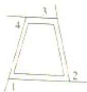

# 二、选择题

1. 一个多边形的内角和等于  $540^{\circ}$ , 那么这个多边形的对角线条数有( )

A.4条

B.5条

C.6条

D.7条

2. 若一个多边形的各内角都相等,则一个内角与一个外角的度数之比不可能是( )

A.5:4

B.5:2

C.2:1

D. 2:5

3. 若一个多边形的内角和等于  $1080^{\circ}$ , 则这个多边形的边数是( )

A.6

B.7

C.8

D.9

4. 不能作为正多边形的内角的度数的是( )

A.  $120^{\circ}$  B.  $\left(128\frac{4}{7}\right)^{\circ}$  C.  $144^{\circ}$  D.  $145^{\circ}$

5. 下列命题是假命题的是 ( )

A. 三角形的内角和为  $180^{\circ}$  
B. 多边形的外角和都等于  $360^{\circ}$  
C. 五边形的内角和为  $900^{\circ}$  
D. 三角形的一个外角等于和它不相邻的两个内角的和

6. 一个多边形的内角和是外角和的2倍,则这个多边形是（）

A.四边形 B.五边形 C.六边形 D.八边形

# 三、解答题

1. 已知在四边形  $ABCD$  中， $\angle A: \angle B = 7:5, \angle A - \angle C = \angle B, \angle C = \angle D = 40^\circ$ ，求各内角的度数  
2. 若两个多边形的边数之比是  $1: 2$ , 内角和度数之比为  $1: 3$ , 求这两个多边形的边数  
3. 一个多边形的最大外角为  $85^{\circ}$ , 其他外角依次减少  $10^{\circ}$ , 求这个多边形的边数和最小外角的大小  
4. 一个多边形的各个内角都相等, 它的一个外角与一个内角的比是 2:3, 求这个多边形每个内角的度数.

# B组

1. 若一个多边形的内角和与外角和之比为 4:1, 求这个多边形的边数

2. 若一个多边形的一个外角与它所有内角和为  $1160^{\circ}$ , 求这个多边形的边数

3. 试证明被凸四边形两条对角线分成的三角形中,两个相对三角形的面积的乘积等于另外两个相对三角形的面积的乘积

# 22.2(2) 平行四边形

A组

# 一、填空题

1. 已知在平行四边形  $ABCD$  中, 若  $\angle B$  的 2 倍与  $\angle A$  的补角的和为  $90^\circ$ , 则  $\angle B =$

2. 已知平行四边形  $ABCD$  的周长为 20 厘米, 对角线相交于点  $O$ , 且  $\triangle BOC$  的周长比  $\triangle AOB$  的周长多 2 厘米, 则  $AB =$  ______ 厘米

3. 如图所示,已知在平行四边形  $ABCD$  中,  $BC = 12, AB = 10, AE \perp BC$  于点  $E$  且  $AE = 8$ , 则  $AB$  与  $CD$  两边之间的距离为

4. 平行四边形两邻边长之比是 2:3, 周长是 30 厘米, 则较短的一边长是 ______ 厘米

5. 平行四边形的面积是 144 平方厘米, 相邻两边上的高分别是 8 厘米和 9 厘米, 则这个平行四边形的周长为 ______ 厘米

6. □ABCD 的对角线  $AC$ 、 $BD$  相交于点  $O$ ，如果  $AC = 6, BD = 8, AB = 2$ ，那么  $\triangle OCD$  的周长等于

7. 平行四边形________中心对称图形，________轴对称图形。(填“是”或“不是”)

8. 在直角坐标平面中， $\triangle ABCD$  对角线的交点为原点  $O$ ，且点  $A, B$  的坐标分别为  $(-1, 3) (-3, -2)$ ，则点  $C$  的坐标为 _______，点  $D$  的坐标为 _______。

9. 已知  $\square ABCD$  的对角线相交于点  $O$ , 如果  $\triangle AOB$  的面积是 2 , 那么  $\square ABCD$  的面积为  
10. □ABCD中,对角线  $AC = 10, BD = 18$  则  $AB$  的取值范围为  
11.如图，在ABCD中，EF过对角线的交点  $O$  若  $AD = 6,AB = 5,OE = 2$  则四边形

ABFE 的周长是

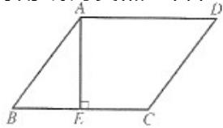

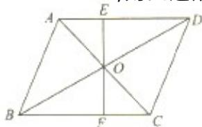

# 二、选择题

1. 平行四边形的两条对角线把它分成的全等三角形的对数是( )

A.2对

B.4对

C.6对

D.8对

2. 平行四边形的一组对角的平分线( )

A. 一定互相平分

B.一定相交

C.可能平行,可能相交

D.平行或共线

3. 已知四边形  $ABCD$  和  $CEFG$  都是平行四边形,如图所示,则下列等式中正确的是( )

A.  $\angle 1 + \angle 8 = 180^{\circ}$  B.  $\angle 1 + \angle 5 = 180^{\circ}$

C.  $\angle 4 + \angle 6 = 180^{\circ}$  D.  $\angle 2 + \angle 8 = 180^{\circ}$

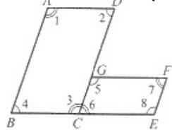

4.已知点  $P$  为平行四边形ABCD的边  $AB$  上的任一点，则  $S_{\Delta PCD}:S_{\triangle ABCD}$  为( )

A.1:2

B.1:3

C.1:4

D.不能确定

5. 若平行四边形的一条边长为 14 , 下列各组数中能分别作为这个平行四边形的两条对角线长的是 ( )

A. 10与16

B. 16与24

C. 16 与 44

D. 10 与 40

6. 如图,  $\square ABCD$  的两条对角线相交于点  $O$ , 图中与  $\triangle AOB$  面积相等的三角形的个数有 ( )

A. 1 个

B. 2 个

C. 3 个

D. 4 个

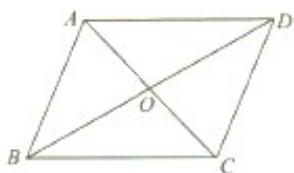

# 三、解答题

1.如图所示，已知在  $Rt\triangle ABC$  中，  $\angle C = 90^{\circ}$  点  $M$  为  $AB$  的中点，  $AM = AN, MN / / AC$

求证：  $MN = AC$

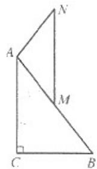

2. 已知在平行四边形  $ABCD$  中对角线交于点  $O$ ,  $\triangle BOC$  的周长比  $\triangle DOC$  的周长大 4, 且平行四边形  $ABCD$  的周长为 20 , 求平行四边形  $ABCD$  各边的长  
3. 如图所示, 在平行四边形  $ABCD$  中,  $AC \cdot BD$  交于点  $O$ , 点  $E$  和点  $F$  分别是  $AO \cdot OC$  的中点求证:  $DE = BF$

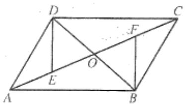

4.如图所示，已知在平行四边形ABCD中，AM//CN.求证：

(1)  $\angle AMC = \angle CNA$  
(2)  $DM = BN$

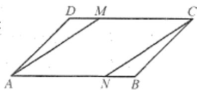

# B组

1. 如图,在  $\square ABCD$ ,  $AC$ 、 $BD$  相交于点  $O$ ,  $\triangle AOB$  的周长为 16 厘米,  $OA$  比  $AB$  短 1 厘米,  $OB$  比  $AB$  长 2 厘米,求  $AB$ 、 $AC$ 、 $BD$  的长.

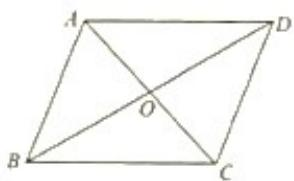

2. 如图,已知  $\triangle ABCD$  中,对角线交于  $O$ ,  $\triangle BOC$  的周长比  $\triangle DOC$  的周长大 2,  $\triangle ABCD$  的周长为 12,求平行四边形各边的长.

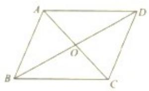

3. 在直角坐标平面内, 平行四边形  $OABC$  的对角线交于点  $P$ , 如图所示. 已知点  $A(4,0) \setminus P(3,1)$ . 求  $B \setminus C$  两点的坐标

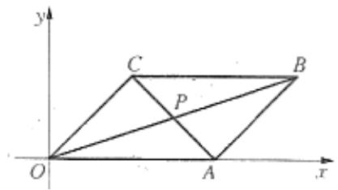

# 22.2(4) 平行四边形

# A组

# 一、填空题

1. 如果平行四边形的两邻边长分别为 8 和 6, 夹角为  $150^{\circ}$ , 则它的面积为  
2. 若用4米长的一根铁丝围成一个平行四边形，使得长边和短边之比为  $3:2$  ，则长边为________，短边为________。  
3. 如图所示,在平行四边形  $ABCD$  中,  $AC$  与  $BD$  相交于点  $O$ , 则图中相等的线段共有______对  
4. 已知平行四边形的周长为  $20$  厘米, 如果一条对角线把它分成的两个三角形的周长都是  $18$  厘米, 那么这条对角线的长为 ______ 厘米  
5. 以不在同一直线上的三点为顶点作平行四边形, 最多能作____个平行四边形  
6. 对角线________的四边形是平行四边形，两组对角________的四边形是平行四边形。  
7.如图，  $AD$  是  $\triangle ABC$  的中线,点  $A$  绕点  $D$  旋转  $180^{\circ}$  至点  $E$  ，联

$BE\setminus CE$  ，则四边形ABEC是 四边形，理由是

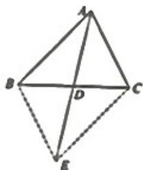

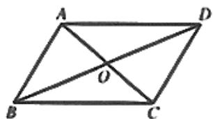

# 二、选择题

1. 下列性质中,平行四边形不一定具备的是( )

A.对角互补

B.邻角互补

C.对角相等

D.内角和是 360

2. 下列说法中:① 夹在平行线间的平行线段相等;② 平行四边形的对角线中至少有一条平分一组对角;③ 一组对边相等,且一组对角也相等的四边形是平行四边形;④ 四形的对角线互相平分.正确的有( )

A.3个

B.2 个

C.1 个

D.0 个

3. 一个四边形  $ABCD$  的四边的长分别是  $m \cdot n \cdot p \cdot q$ , 且  $m^2 + n^2 + p^2 + q^2 = 2mp + 2nq$ , 其中  $m \cdot p$  是对边, 则此四边形是( )

A. 任意四边形

B.平行四边形

C.对角线互相垂直的四边形

D.对角线相等的四边形

4. 在平行四边形  $ABCD$  中, 两条对角线  $AC$  与  $BD$  相交于点  $O$ , 如果  $AC$  比  $BD$  小 14 厘米,

$\Delta O A B$  的周长是 59 厘米,  $C D$  边的长是 28 厘米, 那么  $A C$  与  $B D$  的长分别是 ( )

A.8.5 厘米和 22.5 厘米

B.12.5 厘米和 36.5 厘米

C.12 厘米和 26 厘米

D.24 厘米和 38 厘米

5. 能判定一个四边形是平行四边形的条件是 ( )

A. 一组对边平行,另一组对边相等

B. 一组对边平行,一组对角相等

C. 一组对边平行,一组邻角互补

D. 一组对边相等,一组对角互补

6. 下列命题中是真命题的个数有 ( )

(1) 对角线相等的四边形是平行四边形  
(2) 一组对边相等, 另一组对边也相等的四边形是平行四边形  
(3) 一组对角相等, 另一组对角也相等的四边形是平行四边形  
(4) 平行四边形的两条对角线把平行四边形分成的四个小三角形的面积相等

A. 1 个

B. 2 个

C. 3 个

D. 4 个

# 三、解答题

1.如图所示，在平行四边形ABCD中，  $\angle A = 45^{\circ},BD\bot AD,BD = 1$  求：

(1) 平行四边形  $ABCD$  的周长和面积  
(2)  $A, C$  两点之间的距离

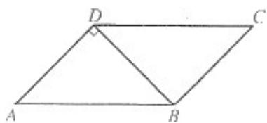

2. 如图所示,以  $\triangle ABC$  三边向外分别作等边  $\triangle DAC, \triangle ABE, \triangle BCF$ , 试判断四边形  $ADF E$  的形状并加以证明

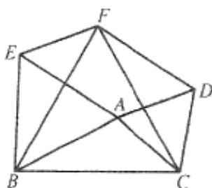

3.如图所示，在平行四边形ABCD中，BD是对角线，AE⊥BD于点E,CF⊥BD于点F，试判断四边形AECF是不是平行四边形，并说明理由

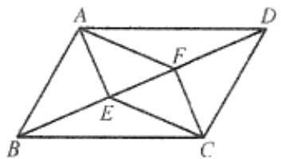

4. 如图,在  $\square ABCD$  中,  $O$  是对角线  $AC$  的中点,  $EF$  过点  $O$  分别交  $BC$  、  $AD$  于  $E$  、  $F$ . 求证: 四边形  $AECF$  是平行四边形.

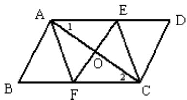

# B组

1. 已知  $\triangle ABC$  是等边三角形, 过  $AC$  边上的点作  $DG // BC$ , 交  $AB$  于点  $G$ , 在  $GD$  的延长线上取点  $E$ , 使  $DE = DC$ , 联结  $AE \cdot BD$ , 如图所示

(1) 求证:  $\triangle AGE \cong \triangle DAB$  
(2) 过点  $E$  作  $EF \parallel DB$ , 交  $BC$  于点  $F$ , 联结  $AF$ , 求  $\angle AFE$  的度数

# 22.3(1) 特殊的平行四边形

# A组

# 一、填空题

1. 若平行四边形的一组邻边分别长  $2$  和  $x$ , 一对角线长为  $9$ , 且  $x$  为奇数, 则  $x =$  
2. 已知矩形的对角线长为 4 厘米, 一条边长为  $2 \sqrt{3}$  厘米, 则面积为  
3. 矩形的两条对角线的夹角为  $60^{\circ}$ , 较短的边长为 12 厘米, 则对角线长为  
4. 若矩形的一条对角线与一边的夹角为  $40^{\circ}$ , 则两条对角线所夹钝角的度数为  
5. 矩形是轴对称图形,它有 条对称轴,矩形是中心对称图形,它的对称中心是  
6. 矩形的面积为 12 ,一条边长为 4 ,则矩形的另一条边长为_____,对角线长_____。  
7. 已知矩形的一边长等于对角线的一半,则两对角线相交所成的锐角是  
8. 矩形  $ABCD$  的对角线  $AC, BD$  相交于点  $O, AB = 4, \angle AOB = 60^\circ$ , 则矩形对角线的长是  
9. 如果矩形的对角线与一条边的夹角为  $60^{\circ}$ , 对角线长为 2, 那么此矩形的另一条边的长为  
10. 已知菱形的边长为 5 ,一条对角线的长为 8 ,另一条对角线的长为  
11. 已知菱形的周长是  $24 \mathrm{~cm}$ , 一条较短的对角线的长是  $6 \mathrm{~cm}$ , 则该菱形较大的内角是  
12. 用两个边长为  $2cm$  的等边三角形拼成菱形, 则菱形的较长对角线是 ________ cm

# 二、选择题

1. 平行四边形的两条对角线将它分成四个小三角形,则这四个小三角形的面积( )

A.都不相等

B.不都相等

C.都相等

D.以上结论都不对

2. 矩形的两邻边的长分别是 2 和 3 ,其中一条内角平分线分长边的两部分之比为( )

A.1:4

B.3:2

C.1:3

D.4:5

3. 矩形的周长为  $p$ , 对角线长为  $d$ , 则矩形的较长边与较短边之差为( )

A.  $\frac{\sqrt{8d^{2} - p^{2}}}{2}$

B.

$\frac{\sqrt{8d^2 + p^2}}{2}$

C.

$\frac{\sqrt{6d^2 - p^2}}{2}$

D.

$\frac{\sqrt{6d^2 + p^2}}{2}$

4. 矩形的两条对角线的交点到较长边的距离比到较短边的距离少2厘米，而矩形的周长是

56厘米,则矩形的面积是( )

A.48平方厘米

B.192平方厘米

C.196平方厘米

D.200平方厘米

5. 下列图形中,既是轴对称图形又是中心对称图形的个数有 (   )

(1) 等边三角形 (2) 平行四边形 (3) 菱形 (4) 矩形

A. 4 个

B. 3 个

C. 2 个

D. 1 个

6. 下列命题中,真命题的个数有 (   )

(1) 矩形的两条对角线长相等 (2) 菱形的对角线互相平分  
(3)菱形的每一条对角线平分一组对角 (4)菱形被两条对角线分成四个全等的等腰直角三角形

A. 4 个

B. 3 个

C. 2 个

D. 1 个

7.已知  $E\setminus F$  分别为矩形ABCD的对边BC和AD上的点，且  $BE = \frac{1}{3} BC,AF = \frac{2}{3} AD$  结AC、EF，则（）

A.  $AC$  平分  $EF$ , 但  $EF$  不平分  $AC$  
B.  $EF$  平分  $AC$ , 但  $AC$  不平分  $EF$  
C.  $AC$  与  $EF$  互相平分  
D. 以上答案都不对

# 三、解答题

1. 如图所示,已知平行四边形  $ABCD$  各角的平分线分别相交于点  $E, F, G, H$ , 求证: 四边形  $EFGH$  是矩形

3.如图所示，矩形ABCD的两条对角线交于点  $o$  且  $\angle AOD = 120^{\circ}$  求证：  $AC = 2AB$

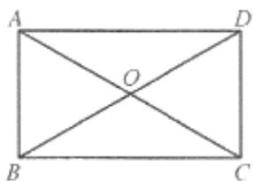

4. 如图所示，矩形  $ABCD$  的对角线  $AC, BD$  相交于点  $O, AE \perp BD$  于点  $E$ ， $\angle 1 = \angle 2, OB = 6$ 。求：

(1)  $\angle BOC$  的度数 (2)  $\triangle DOC$  的周长

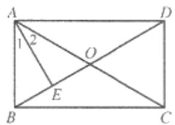

5.如图，矩形ABCD中，AC与BD交于点  $O,BE\bot AC,CF\bot BD$  垂足分别为  $E\setminus F$

求证：  $BE = CF$  ：

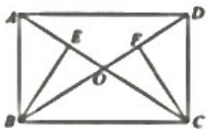

6. 已知: 在矩形  $ABCD$  中,  $AB = 2BC$ , 在  $CD$  上取一点  $E$ , 使  $AE = AB$ , 求  $\angle EBC$  的度数

B组

1.菱形ABCD中，  $E$  在BC上，AE交BD于  $M,AB = AE,\angle BAE = \frac{1}{2}\angle EAD$

求证：  $BE = BM$  ：

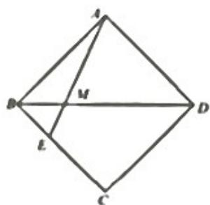

2.如图所示，在菱形ABCD中，  $\angle B = \angle EAF = 60^{\circ}$ $\angle BAE = 20^{\circ}$  求  $\angle CEF$  的度数

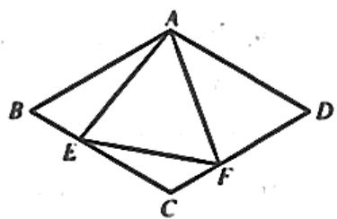

# 22.3(3) 特殊的平行四边形

# A组

# 一、填空题

1.如图所示，矩形ABCD沿AE折点D左BC边上的点F A

么  $\angle D A E =$

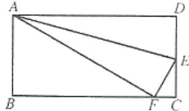

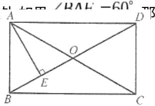

2. 如图所示,已知在矩形  $ABCD$  中,  $AE \perp BD$  于点  $E, BE:ED = 1:3, BD = 8$  厘米, 则  $AB =$  
3. 现有一张长53厘米,宽28厘米的矩形纸片,要从中剪出长15厘米,宽2厘米的矩形小纸片,则最多能剪出____张  
4. 在菱形  $ABCD$  中，点  $E, F$  分别是  $BC$  和  $CD$  的中点，且  $AE \perp BC, AF \perp CD$ ，则  $\angle EAF =$  
5.菱形ABCD的两条对角线  $AC = 8\setminus BD = 6$  ，则对角线的交点到任一边的距离等于  
6. 在四边形  $ABCD$  中， $AB // CD, AB = BC$  ，请你填上一个适当的条件 _______ ，使得四边形  $ABCD$  是菱形  
7. 对角线互相垂直平分的四边形是________；对角线互相平分且相等的四边形是________。  
8. 线段  $AB$  和  $CD$  为同心两圆的直径, 判断四边形  $ADBC$  的形状为  
9. 线段  $AC$  和  $BD$  互相平分于点  $O$ , 而  $\triangle ACE \cong \triangle BDE$  分别是以  $AC$ 、 $BD$  为斜边的直角三角形. 假如联结  $ABCD$ , 判断四边形  $ABCD$  的形状为  
10. 在平面直角坐标系中, 已知点  $A, B, C, D$  的坐标分别为  $A(-2, 2), B(1, 2)$

$C(1,0),D(-2,0)$  则四边形ABCD的形状为

11. 已知: 在四边形  $ABCD$  中,  $AB // CD$ ,  $AB = BC$ , 请你填上一个适当的条件_____, 使得四边形  $ABCD$  是菱形

# 二、选择题

1. 下列说法中,不正确的是( )

A.有三个角是直角的四边形是矩形

B.对角线相等的四边形是矩形

C.对角线互相垂直的矩形是正方形

D.对角线互相垂直的平行四边形是菱形

2. 已知一个四边形的对角线互相垂直,那么顺次联结这个四边形的四边中点所得的四边形是( )

A.矩形

B.菱形

C.平行四边形

D.正方形

3. 用两个全等的直角三角形拼下列图形:① 平行四边形;② 矩形;③ 菱形;④ 正方形;⑤ 等腰三角形.其中一定能拼成的图形是( )

A.①②③

B.①④⑤

C.①②⑤

D.②③

4. 下列说法中,错误的是( )

A.平行四边形的对角线互相平分

B.对角线互相平分的四边形是平行四边形

C.菱形的对角线互相垂直

D.对角线互相垂直的四边形是菱形

5. 下列命题中,真命题是 ( )

A. 对角线互相垂直且相等的四边形是菱形

B. 对角线互相垂直且相等的四边形是矩形

C. 对角线互相平分且相等的四边形是菱形

D. 对角线互相平分且相等的四边形是矩形

6. 若四边形  $ABCD$  中,  $AB // CD$ , 且

$AB = CD$  又  $\angle A = \angle D$  那么四边形（

A. 平行四边形

B. 矩形

C. 菱形

D. 以上结论都不对

# 三、解答题

1. 如图所示,已知在正方形  $A B C D$  中,  $A E \perp B F$ , 垂足为点  $P, A E$  与  $C D$  交于点  $E, B F$  与

$AD$  交于点  $F$  ，求证：  $AE = BF$

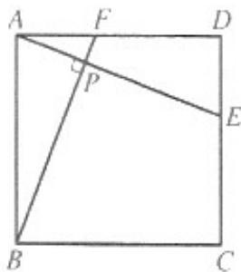

2. 如图所示,已知点  $E 、 F$  在正方形  $A B C D$  的对角线  $A C$  上,且  $A E = C F$ . 求证: 四边形  $B E D F$  是菱形

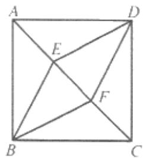

3. 如图所示, 在矩形  $ABCD$  中, 对角线  $AC \sim BD$  相交于点  $O, AE // BD, DE // AC$ , 求证:  $OE \perp AD$

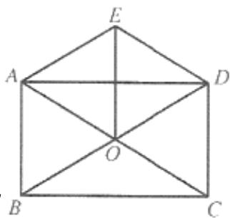

4.如图所示，在△ABC中，  $\angle ACB = 90^{\circ},CD\bot AB$  于点  $D,A E$ $F,BG\bot AB$  于点  $G$  ，求证：四边形CFGE是菱形

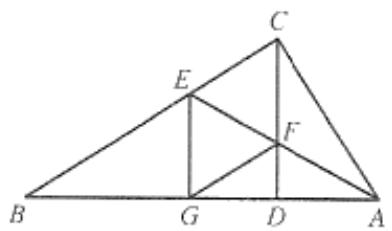

# B组

1.已知：如图，矩形ABCD中，AC、BD相交于点  $O$  ，作  $OE / / AD$  交  $CD$  于  $F$  ，且  $OF = FE$  求证：四边形OCED是菱形

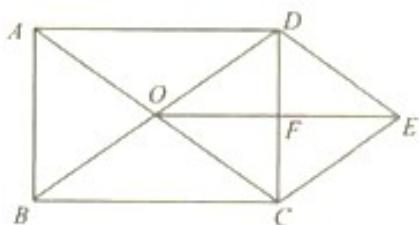

2. 如图,已知等边  $\triangle ABC$  中,  $D 、 E$  分别为  $AC 、 BC$  的中点,联结  $BD$ ,以  $BD$  为边作等边

$\triangle BDF$  .求证：四边形  $AFBE$  为矩形

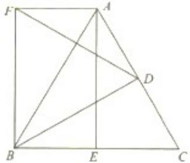

3. 如图所示，在梯形  $ABCD$  中， $AD // BC, AB = DC$ ，点  $E, F, G$  分别在边  $AB, BC, CD$  上， $AE = GF = GC$ .

(1) 求证: 四边形  $A E F G$  是平行四边形  
(2)当  $\angle FGC = 2\angle EFB$  时，求证：四边形AEFG是矩形

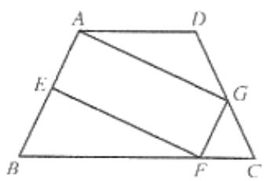

# 22.3(5) 特殊的平行四边形

A组

# 概念回顾

平行四边形、矩形、菱形以及正方形之间的关系可以归纳为：

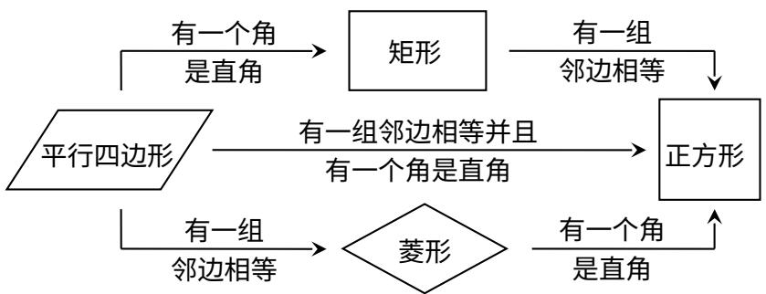

# 一、填空题

1. 一个正方形要绕它的中心至少旋转____，才能和原来的图形重合

2. 如图所示,已知点  $E$  为正方形  $ABCD$  的边  $CD$  上一点，点  $F$  为  $BC$  的延长线上一点， $CE = CF$  若  $\angle BEC = 80^{\circ}$  则  $\angle EFD =$

3. 如图所示,已知四边形  $ABCD$  是正方形,  $\triangle CDE$  是等边三角形, 则  $\angle AED =$ $\angle AEB =$

4.如图所示占  $E$  为正方形ABCD对角线BD上一点，且  $BE = BC$  则  $\angle DCE =$

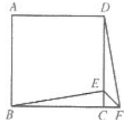  
第2题

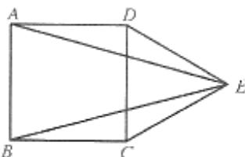  
第4赵

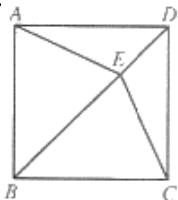

5. 正方形共有 条对称轴,它的对称中心是

6. 正方形的边长缩小为原来的  $4$ , 那么它的面积缩小为原来的

# 二、选择题

1. 平行四边形的四个内角平分线若能相交成一个四边形,则这个四边形( )

A.一定是正方形

B.一定是矩形

C.一定是菱形

D.一定是梯形

2.如图所示，过矩形ABCD的四个顶点作对角线的平行线，分别相交于  $E,F,G,H$  四点，则四

边形  $EFGH$  是( )

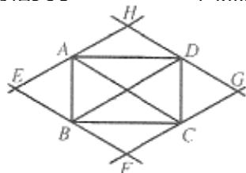

A.平行四边形

B.矩形

C.菱形

D.正方形

3. 正方形的对称轴有( )

A.2条

B.4条

C.6条

D.8条

4. 在四边形  $A B C D$  中,  $O$  是对角线的交点, 能判定这个四边形是正方形的条件是 ( )

A.  $AC = BD,AB / / CD,AB = CD$

B.  $AD / / BC, \angle A = \angle C$

C.  $AO = BO = CO = DO, AC \perp BD$

D.  $AO = CO, BO = DO, AB = BC$

5. 四个内角都相等的四边形一定是（）

A. 正方形

B. 菱形

C. 矩形

D. 平行四边形

6. 四个内角都相等,四条边也都相等的四边形一定是 ( )

A. 正方形

B. 菱形

C. 矩形

D. 平行四边形

7. 下列命题正确的是 ( )

A. 对角线互相垂直且相等的四边形是正方形  
B. 对角线相等的菱形是正方形  
C. 对角线互相垂直的菱形是正方形  
D. 对角线相等的矩形是正方形

# 三、解答题

1. 如图所示, 平行四边形  $ABCD$  中, 点  $G$  是  $CD$  上一点,  $BG$  交  $AD$  延长线于点  $E$ ,

$$
A F = C G, \angle D G E = 1 0 0 ^ {\circ}
$$

(1) 试说明  $DF = BG$  (2) 试求  $\angle AFD$  的度数

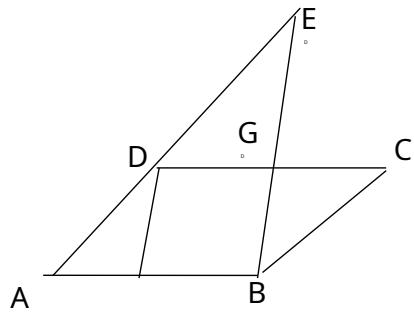

2.如图所示，已知在菱形ABCD中，点  $E$  是BC上一点  $AF\cong BD$  于点M

$$
\angle E A D = 2 \angle B A E, A B = A E. \text {求 证 :} B E = A M
$$

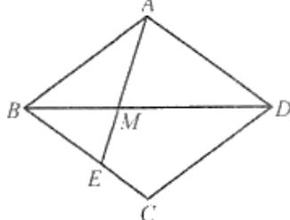

3. 如图所示,在 Rt $\triangle ABC$  中,  $\angle C = 90^{\circ}$ ,  $CD$  是  $\angle C$  的平分线,  $DE \perp RC$  于  $E$ ,

$DF \perp AC$  于点  $F$ , 求证: 四边形  $CEDF$  为正方形

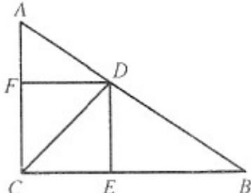

4. 如图,已知:点  $A^{\prime}, B^{\prime}, C^{\prime}, D^{\prime}$  分别是正方形  $ABCD$  的边  $AB \cdot BC \cdot CD \cdot DA$  的中点

求证：四边形  $A'B'C'D'$  是正方形

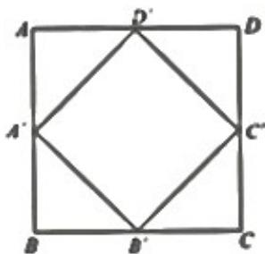  
B组

1. 对于边长分别为  $a, b (a > b)$  的两个正方形  $ABCD$  和  $EFGH$ ，按下图的方式摆放，联结  $DE$ ，过  $D$  作  $DM \perp DE$ ，交  $AB$  于点  $M$ ，过点  $M$  作  $MN \perp DM$ ，过点  $E$  作  $EN \perp DE$ ， $MN$  与  $EN$  相交于点  $N$ 。

(1)求证:四边形  $MNED$  是正方形;(2)用含  $a, b$  的代数式表示正方形  $MNED$  的面积.

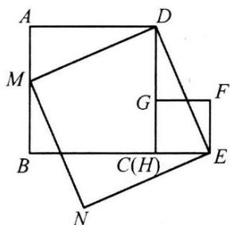

2.如图，正方形ABCD的边长为  $a,E$  为  $CD$  的中点，点  $F$  在  $BC$  边上移动，试判断当点  $F$  移

到什么位置时,  $A E$  是  $\angle D A F$  的平分线, 证明你的结论

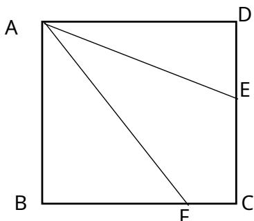

3. 如图所示,在等腰直角  $\triangle ABC$  中,  $AC = BC$ , 点  $D 、 E$  为底边  $AB$  的三等分点, 过点  $D 、 E$ 分别作  $AB$  的垂线, 分别交  $AC$  于点  $G$ , 交  $BC$  于点  $F$ , 求证: 四边形  $DEFG$  为正方形

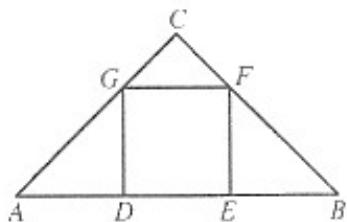

# 22.5(1)等腰梯形

A组

# 一、填空题

1. 已知一个等腰梯形的腰等于它的高的 2 倍,则这个等腰梯形较大的内角为_____。  
2. 直角梯形的高为  $6$  厘米, 有一个角是  $30^{\circ}$ , 则这个梯形的两腰分别为  
3. 如图所示,在梯形  $A B C D$  中,  $B C / / A D, D E / / A B, D E = D C, \angle A = 1 0 0 ^ {\circ}, \angle E D C =$

4. 如图所示在

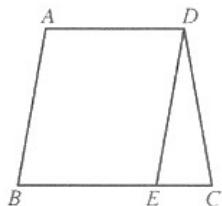

等腰梯形ABCD中，相等的线段共有 对

第3题

第4题

5. 如果一个等腰梯形的两个内角的和为  $100^{\circ}$ , 那么此梯形的四个内角的度数分别为  
6. 等腰梯形的腰长为 12 , 上底长为 15 , 上底与腰的夹角为  $120^{\circ}$ , 则下底长为  
7. 等腰梯形的一个下底角为  $45^{\circ}$ , 上底长和梯形的高均为 3 , 则梯形的周长等于  
8. 等腰梯形的底角等于  $60^{\circ}$ , 它的两底分别为  $25 \mathrm{~cm} 15 \mathrm{~cm}$ , 则它的腰长为

9. 已知等腰梯形的一个底角为  $45^{\circ}$ , 较长的底边长为  $3cm$ , 高为  $\frac{1}{2} cm$ , 那么梯形的另一条底边长为 cm

10. 如图,已知等腰梯形  $ABCD$  的周长是  $20, AD \parallel BC, AD < BC, \angle BAD = 120^{\circ}$ , 对角线  $AC$  平

分  $\angle BCD$  则  $S_{\text{梯形}ABCD} =$

11. 如图, 等腰梯形  $ABCD$  中,  $AB = CD$ ,  $\angle B = 45^\circ$ ,  $AD + BC - 30 = 0$ , 高  $AE = 7$ , 则  $AD =$

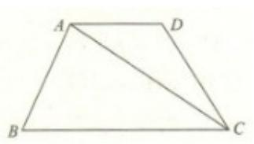  
第10题

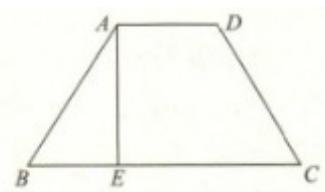  
第11题

# 二、选择题

1. 下列命题:① 若一个梯形是轴对称图形,则此梯形一定是等腰梯形;② 等腰梯形的两腰所在的直线经过两底中点的直线必交于一点;③ 一组对边相等而另一组对边不相等的四边形是梯形;④ 有两个内角是直角的四边形是直角梯形,其中错误命题的个数有( )

A.1 个

B.2 个

C.3 个

D.4 个

2. 已知四边形的四个内角的度数比依次是  $2: 2: 3: 1$ , 则此四边形是( )

A.任意四边形

B. 任意梯形

C.等腰梯形

D.直角梯形

3. 等腰梯形的对角线互相垂直,若联结该等腰梯形各边中点,则所得图形是( )

A.平行四边形

B.矩形

C.菱形

D.正方形

4. 直角梯形的斜腰和下底长都等于  $a$ , 斜腰和下底的夹角是  $60^{\circ}$ , 则梯形的上、下底之差是( )

A.  $\frac{a}{2}$

B.  $\frac{3}{4} a$

C.  $a$

D.  $\frac{3}{2} a$

5. 已知:梯形的四边分别为  $12,6,6,6$ , 则这个梯形的面积是 ( )

A.  $54 \sqrt{3}$

B. 27

C. 54

D.  $27 \sqrt{3}$

6. 如图,等腰梯形  $A B C D$  中,  $A B / / D C, A C \perp B C$ , 点  $E$  是  $A B$  的中点,  $E C / / A D$ , 则  $\angle B$  的度数为 ( )

A.  $75^{\circ}$

B.  $70^{\circ}$

C.  $60^{\circ}$

D.  $30^{\circ}$

# 三、解答题

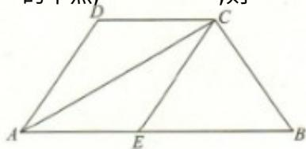

1. 如图所示,在梯形  $ABCD$  中,  $AB / / CD, AD \perp AC, AD = AC, DB = DC, AC \sim BD$  交于

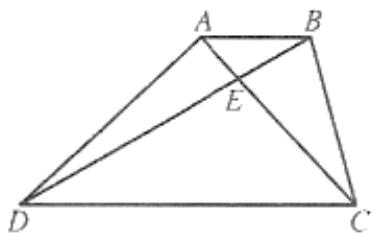

点  $E$  ，试问  $CE$  与  $CB$  相等吗，为什么？

2.如图所示，铁路路基的横断面为等腰梯形ABCD，已知路基底宽  $AB = 6$  米斜坡BC与下

底  $CD$  夹角为  $60^{\circ}$ , 路基高  $AE = \sqrt{3}$  米, 求下底  $CD$  的宽

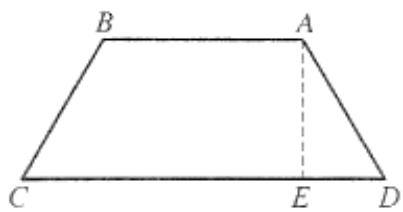

3. 如图所示,在梯形  $ABCD$  中,  $AB // CD$ ,  $AD = BC$ ,  $AB = 10$ ,  $CD = 4$ , 延长  $BD$  到点  $E$ , 使

$DE = BD$  作  $EF\bot BA$  交BA的延长线于点  $F$  求  $AF$  的长

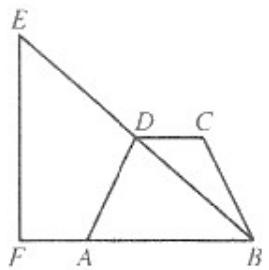

4. 如图所示,已知在  $\triangle ABC$  中,  $AH \perp BC$  于点  $H$ ,  $D \setminus E \setminus F$  分别为  $AB \setminus BC \setminus CA$  的中点四边  $EFDH$  是等腰梯形吗?为什么?

1. 如图,梯形  $ABCD$  中,  $AD // BC$ ,  $AB = AD = DC$ , 点  $E$  为底边  $BC$  的中点, 且  $DE // AB$ ,试判断  $\triangle ADE$  的形状, 并给出证明.

2. 在梯形  $ABCD$  中， $AB // DC, AD = BC, AB = 10, CD = 4$  延长  $BD$  至  $E$  ，使  $DE = BD$  ， $EF \perp BA$  交  $BA$  的延长线于  $F$  ，求  $AF$  的长。

3. 如图所示,在梯形  $ABCD$  中,  $AB // CD$ ,  $AD = BC$ ,  $CE \perp AB$  于点  $E$ , 若  $AC \perp BD$  于点  $G$ , 求证:  $CE = \frac{1}{2} (AB + CD)$

# 22.6(1) 三角形、梯形的中位线

A组

# 一、填空题

1. 若等腰梯形的腰长等于中位线的长,周长为 48 厘米,则中位线长为_____厘米  
2. 已知梯形的高是 4 , 面积是 32 , 上底长为 4 , 则梯形的中位线长为  
3. 已知直角梯形的一条对角线把梯形分成一个直角三角形和一个边长为 8 厘米的等边三角

形，则此梯形的中位线长为

4. 梯形的上、下底长分别为 6、10,则由中位线分得的两个梯形的面积之比为 厘米  
5. 以一个三角形各边中点为顶点的三角形的周长为4厘米,则原三角形的周长为 厘米  
6. 一个三角形的周长为 12 厘米,则这个三角形各边中点围成的三角形的周长为  
7. 如图  $\triangle ABC$  的周长是  $10 \mathrm{~cm}$  则联结它的三边的中点所得的三角形  $DEF$  的周长为

  
第7题

  
第10题

8. 若三角形三条中位线长分别是  $3cm, 4cm, 5cm$ ，则这个三角形的面积是 ______ cm²  
9. 如图,  $Rt\triangle ABC$  中,  $\angle ACB = 90^\circ$ , 点  $D 、 E 、 F$  分别是  $\triangle ABC$  三边中点,  $DE = 4cm$ , 则  $CF =$  _____ cm  
10.如图，△ABC中,DE是中位线,AF是中线,则DE与AF的关系是  
11. 如果顺次联结四边形四边中点所得的四边形是菱形,那么原四边形的两条对角线  
12. 如果顺次联结四边形四边中点所得的四边形是矩形,那么原四边形的两条对角线

# 二、选择题

1. 顺次联结矩形四边的中点所得的四边形是( )

A.矩形

B.菱形

C.正方形

D.以上都不对

2. 如果四边形的对角线互相垂直,那么顺次联结四边形中点所得的四边形是( )

A.矩形

B.菱形

C.正方形

D.以上都不对

3. 已知三角形的 3 条中位线分别为 3 厘米、4 厘米、6 厘米,则这个三角形的周长是( )

A.3厘米

B.26 厘米

C.24 厘米

D.65 厘米

4. 顺次联结四边形四边中点得到正方形,则原四边形的对角线( )

A.互相平分

B.互相平分

且相等 C. 互相垂直

D.互相垂直且相等

5. 顺次联结矩形各边的中点所得的四边形是( )

A. 平行四边形

B. 矩形

C. 菱形

D. 正方形

6. 顺次联结一个四边形各边中点,所得的四边形是正方形,那么这个四边形是 ( )

A. 矩形

B. 菱形

C. 正方形

D. 对角线互相垂直且相等的四边形

# 三、解答题

1. 如图所示,已知在  $\triangle ABC$  中,点  $D$  是  $AB$  上一点,  $AC = AD, AE \perp CD$  于点  $E$ , 点  $F$  是

$BC$  的中点,求证:  $BD = 2EF$

2.如图所示，已知在△ABC中，中线  $BE\setminus CD$  交于点  $o$  点  $F\setminus G$  分别是  $OB\setminus OC$  的中点求

证:四边形  $DFGE$  是平行四边形

3. 如图所示，在四边形  $ABCD$  中，点  $E, F, G, H$  分别是  $AB, BC, CD, DA$  的中点，求证：四边形  $EFGH$  是平行四边形

4. 如图所示,已知在  $\triangle ABC$  中,点  $M$  是  $BC$  的中点,  $AP$  是  $\angle BAC$  的平分线,  $BP \sim AP$  于点  $O$ .

$P$  .求证：  $AC - AB = 2PM$  ：

5. 如图,在  $\bigtriangleup  {ABC}$  中,  $\angle {BAC} = {90}^{ \circ  }$  ,延长  ${BA}$  到点  $D$  ,使  ${AD} = \frac{1}{2}{AB}$  点  $E$  、  $F$  分别为  ${BC}\text{、}{AC}$  的中点

(1) 求证:  $DF = BE$ ;  
(2) 过点  $A$  作  $AG // BC$ , 交  $DF$  于点  $G$ , 求证:  $AG = DG$

# B组

1. 已知:  $\triangle ABC$  的周长为  $a$ , 面积为  $S$ , 联结各边中点得  $\triangle A_{1} B_{1} C_{1}$ , 再联结  $\triangle A_{1} B_{1} C_{1}$  各边中点得  $\triangle A_{2} B_{2} C_{2}$ . 问:

(1) 第  $3$  次联结所得的  $\triangle A_{3} B_{3} C_{3}$  的周长、面积分别是多少？  
(2) 第  $n$  次联结所得的  $\triangle A_{n} B_{n} C_{n}$  的周长、面积分别是多少？

2. 如图所示,在四边形  $ABCD$  中,  $AB = CD$ , 点  $M 、 N$  分别是  $AD 、 BC$  的中点, 延长

$BA \cdot NM \cdot CD$  分别交于点  $E \cdot F$ , 求证:  $\angle BEN = \angle NFC$

# 22.6(3) 三角形、梯形的中位线

A组

# 一、填空题

1. 一个三角形的周长是 12 厘米,则这个三角形各边中点围成的三角形的周长为_____.  
2. 等腰梯形上、下底之比为  $1: 2$ , 中位线长为 24 厘米, 其中有一个内角为  $120^{\circ}$ , 则它的腰长为 ______ 厘米  
3. 在菱形  $ABCD$  中, 点  $E, F$  分别是  $BC$  和  $CD$  的中点,  $AE \perp BC, AF \perp CD$ , 则  $\angle EAF =$  
4. 等腰梯形的两底之差为 4 ,中位线长为 6 ,腰长为 4 ,则面积是  
5. 顺次联结等腰梯形各边中点所得的四边形是  
6. 梯形的上底长为 6 ,下底长为 10 ,则由中位线所分得的两个梯形的面积之比是

# 二、选择题

1. 在梯形  $ABCD$  中,  $AB // CD, DC: AB = 1: 2, EF$  是中位线, 则  $EF: AB$  等于( )

A.1:4

B.1:3

C.1:2

D.3:4

2. 如果等腰梯形的两条对角线互相垂直,中位线长为  $a$ , 则梯形的高为( )

A.  $a$

B.  $2 a$

c. 2

D.以上都不对

3. 已知梯形的中位线长为  $24$  厘米, 上、下底的比为  $1: 3$ , 则梯形的上、下底之差是 ( )

A.24 厘米

B.12 厘米

C.36 厘米

D.48 厘米

4. 如果梯形的上底长为  $a$ , 上底小于下底, 中位线长为  $m$ , 那么联结两对角线中点的线段长为( )

A.  $\frac{1}{2} (m - a)$

B.  $m - a$

C.  $2 m - a$

D.  $2m - 3a$

# 三、解答题

1. 如图所示,点  $E 、 F 、 G 、 H$  分别为四边形  $A B C D$  各边的中点,求证: 四边形  $E F G H$  为平行四边形

2. 如图所示, 在直角梯形  $ABCD$  中,  $AD \parallel BC$ ,  $AB \perp BC$ ,  $CD = BC = 4$ ,  $\angle C = 60^\circ$ , 点  $M, N$  分别是  $AB, CD$  的中点求  $\triangle ANB$  及梯形  $ABCD$  的面积

3. 如图所示,在平行四边形  $ABCD$  中,  $AC \cdot BD$  相交于点  $O$ , 且  $AC = 2AB$ , 点  $M \cdot N \cdot P$ 分别是  $BO \cdot CO \cdot AD$  的中点求证

(1)  $A M \perp B O$ .  
(2)  $PM = NM$

4. 如图所示,在梯形  $ABCD$  中,  $AD \parallel BC$ , 对角线  $AC \perp BD$ , 且  $AC = 5$  厘米,  $BD = 12$  厘米, 求梯形的中位线长

5. 如图,已知梯形  ${ABCD}$  中,  ${AD}//{BC},{AE} = {EB},{EF}//{DC},{EF} = {1.2}$  厘米,求  ${DC}$  的长

6. 已知: 如图, 在  $\triangle ABC$  中,  $\angle ACB = 90^{\circ}, D \sim E \sim F$ , 分别是  $AC$ 、 $AB$ 、 $BC$  的中点, 求证: 四边形  $CDEF$  是矩形.

7. 已知: 如图, 梯形  $ABCD$  中,  $AD \parallel BC$ ,  $EF$  与  $MN$  互相垂直平分,  $E \sim F \sim M \sim N$  分别是  $AD \sim BC \sim BD \sim AC$  的中点

求证：  $AB = CD$

  
B组

1. 如图,在梯形  $ABCD$  中,  $AD // BC (BC > AD)$ ,  $E 、 F$  分别是对角线  $BD 、 AC$  的中点求

证:  $EF = \frac{1}{2} (BC - AD)$

2. 如图所示,已知在梯形  $ABCD$  中,  $AD // BC$ , 点  $E$  为  $AB$  的中点,  $EF // CD$ , 交  $BC$  于点

$CF = \frac{1}{2} (AD + BC)$  F.求证：

# 22.8(1) 平面向量的加法

A组

# 概念回顾

(1) 向量的加法: 求两个向量的和的运算, 叫做向量的____. 两向量的和仍是____.  
(2) 向量加法的三角形法则: 两个向量的和向量是将第二个向量与第一个向量首尾相接,以第一个向量的起点为起点, 第二个向量的终点为终点的向量. 口诀:

如图, 已知向量  $a 、 b$ , 在平面内任取一点  $A$ , 作  $A B = a$ ,  $B C = b$ , 则向量  $A C$  叫作为

$a$  与  $b$  的和，记作  $a + b$  ，即  $a + b = AB + BC = AC$  ：

(3) 零向量: 长度为 \(\_ \_ \_ \_ \_ \_ \_ \_ \_ \_ \_ \_ \_ \_ \_ \_ \_ \_ \_ \_ \_ \_ \_ \_ \_ \_ \_ \_ \_ \_ \_ \_ 的方向是任意的.

对于零向量与任一向量  $a$  ，有  $a + 0 = 0 + a = a$  ，  $a + (-a) = 0$

(4) 向量加法满足交换律和结合律:  $a + b = b + a$ ;  $(a + b) + c = a + (b + c)$ .

# 一、填空题

1.向量的加法满足 律，也满足 律  
2.  $AB + BC + CA =$  
3. 向量的加法称为向量的________法则  
4. 如图所示, 已知平行四边形  $ABCD$  两条对角线  $AC, BD$  相交于点  $O$ , 则

$$
A O + O D + D C + C B = \underline {{}}
$$

5.  $BC + AC + CB =$

6. 当  $a$  和  $b$  满足 ______ 时,  $a + b = 0$  
7. 长度为____的向量叫做零向量  
8. 若  $a$  与  $b$  互为相反向量, 则  $a + b =$  
9. 若  $a$  是零向量, 则  $a + x =$

10.  $\left|a\right|_{= 2}$  方向向西，  $\left|b\right|_{= 3}$  方向向东，则  $a + b$  的方向  
11. 在直角坐标平面内,点  $O$  为坐标原点,点  $A$  在  $x$  轴的正半轴,点  $B$  在  $y$  轴上,其中  $\left|OA\right| = 6$ $\left|AB\right| = 10,$  则  $\left|OB\right| =$

# 二、选择题

1.计算：  $AC + DB + CD + BA$  等于(

A. 0

B. 0

C.  $DB$

D.  $A C$

2. 在四边形ABCD中，  $BC + DC + BA$  等于( )

A.  $B C$

B.  $AB$

C.  $D A$

D.  $A C$

3. 下列说法中正确的是( )

A.零向量是没有方向的 B.若  $\left|a\right| = \left|b\right|$  则  $a = b$  
C.  $AB + AE = BE$  
D.若  $a = -b$  ，则  $a / / b$

4. 如图所示,在四边形  $ABCD$  中,  $AB = DC$ , 要使四边形  $ABCD$  成为矩形, 需要添加的条件是( )

A.  $AB = BC$

B.  $\left|A B\right| = \left|B C\right|$

C.  $A C = B D$

D.  $\left|AC\right| = \left|BD\right|$

5. 下列等式正确的个数有 ( )

$1a + b = b + a$ $2(a + b) + c = a + (b + c)$ $3a + (-a) = 0$ $④ AB + BC = AC$

A. 4 个

B. 3 个

C. 2 个

D. 1 个

6. 如图,已知  $\square ABCD$  中,  $AB = a$ ,  $AD = b$ , 则下列运算不正确的是 ( )

A.  $a + b = D B$

B.  $a + b = AC$

C.  $a + (-b) = a - b$

D.  $a + 0 = a$

7. 在  $\triangle ABC$  中,  $AB = a, BC = b$ , 则  $AC$  等于 ( )

A.  $a + b$

B.  $(-a) + (-b)$

C.  $a - b$

D.  $b - a$

# 二、解答题

1. 如图所示;四边形  $ABCD$  与  $ABDE$  都是平行四边形

(1) 写出与向量  $AB$  平行的向量  
(2) 若  $\left|AB\right| = 1.5,$  求  $CE$

2. 如图所示,已知向量  $a$  ,求作:  $a + b$

3. 已知  $a$  方向向西, 且  $\left|a\right| = 3, b$  方向向北, 且  $\left|b\right| = 3,$  求  $\left|a + b\right|$  的值及  $a + b$  的值

4.如图所示，在  $\triangle ABC$  中，点  $D$  是  $AB$  的中点，证明：  $CA + CB = 2CD$

5.如图，已知向量  $a\text{b}$  求作：  $a + b + c$

# B组

1. 已知  $a$  方向向南, 且  $\left|a\right| = 3, b$  方向向北, 且  $\left|b\right| = 5,$  求:  $\left|a + b\right|$  的值及  $a + b$  的方向.

2. 如图,在平面直角坐标系中，  $O$  为坐标原点，已知  $A(2,1)$  关于原点的对称点为  $A_{1}$ ，点  $B(2,5)$  关于  $y$  轴的对称点为  $B_{1}$ .

(1) 求作向量  $O A_{1} \cdot B A$ ;  
(2) 求作  $A_{1}B + O A_{1}$

3. 某人从  $A$  点出发向西走了 10 米, 到达点  $B$ , 然后改变方向, 按西偏北 60 走了 15 米到达点  $C$ ,最后又向东走了 10 米到达  $D$  点

(1) 作出向量  $AB \cdot BC \cdot CD$  (用 1 厘米长的线段表示 10 米长)  
(2) 求  $\left|DA\right|$ .

# 22.9(1) 平面向量的减法

# A组

# 一、填空题

1. 若  $a + x = b$ ，则  $x =$  ________.  
2. \(AB - AD = \_ \_ \_ \_ \_ \_ \_ \_ \_ \_ \_ \_ \_ \_ \_ \_ \_ \_ \_ \_ \_ \_ \_ \_ \_ \_ \_ \_ \_ \_ \_ \_ \_ \_ \_ \_ \_ \_ \_ \_ \_ \_ \_ \_ \_ \_ \_ \_ \_ \_ \_
[ AB - BC = \_ \_ \_ \_ \_ \_ \text{；} BA - BC = \_ \_ \_ \text{。}]  
3. 在  $\triangle AOB$  中,  $\angle AOB = 90^{\circ}, OA = a, OB = b, AB$  的中点为  $M$ , 则  $\left|OM\right| =$  
4. 化简  $AB - AC - DB + DE =$  
5. 在平行四边形  $ABCD$  中, 若  $AD = a, AB = b$ , 则  $DB =$  
6. 在平行四边形  $ABCD$  中, 设  $AB = a, AD = b$ , 则  $CA =$

# 二、选择题

1. 如图所示,四边形  $A B C D$  是平行四边形,则下列各式中正确的是( )

A.  $AB - AD = BD$  B.  $OA - OB = AB$  
C.  $AB - AD = DB$  D.  $OA + OB = AB$

2. 化简:  $(AB - CD) + (BE - DE)$  的结果是( )

A. CA

B.  $A C$

C.  $A E$

D. 0

3. 下列说法中正确的是( )

A.模相等的向量必相等

B.两个非零向量之和必是非零向量

C.两个非零向量之差必是非零向量

D.相等的向量模相等

4. 如图所示,四边形  $A B C D$  是平行四边形,则下列各式中正确的

A.  $AB + CD = AC + BD$

B.  $AB + CD = AC - BD$

C.  $AB - CD = AC + BD$

D.  $AB - CD = AC - BD$

5.  $AB + BC - AD = ()$

A.  $AD$

B.  $CD$

C.  $DB$

D.  $D C$

6.  $AB - AC - DB = ()$

A.  ${AD}$

B. AC

C.  $CD$

D. DC

# 三、解答题

1. 如图所示，已知正方形  $ABCD$  的边长等于 1,

$AB = a,BC = b,AC = c$  求作：

(1)  $a + b + c$  
(2)  $a - b + c$

2.如图所示，已知向量  $a\text{b}$  求作：  $a - b$

3.如图所示，已知四边形ABCD，  $AB = a,AD = b,BC = c$  ，用  $a\text{比}c$  表示向量DC

4.如图所示，已知  $\left|a\right| = 1,\left|b\right| = 2$  如果  $\left|b - a\right| = \sqrt{3}$  求  $a$  与  $b$  的夹角的大小

5. 已知向量  $a \cdot b \cdot c$ , 求作  $a - c - b$

6.如图，已知  $\left|a\right| = 1,\left|b\right| = 2$  若  $\left|b - a\right| = \sqrt{3}$  求  $a$  与  $b$  的夹角的大小

7. 画图表示:  $A B - A D - D C$

# B组

1.如图，已知  $AB = a,BC = b,CD = c,DE = d$  ，试用向量  $a\text{比}c\text{对}d$  表示下列向量：

(1)  $AE$  (2)  $AC - BC$  (3)  $AD$

2. 在梯形  $ABCD$  中,  $AD // BC$ ,  $AC$  是对角线, 过点  $D$  作  $DE // AB$  交  $BC$  边于点  $E$ , 把图中

的各线段都看成有向线段,并用来表示向量

(1) 根据图形,在下列各式中填入适当的向量

(1)  $(BA + AD) - BC = \_ \_ \_ \_ \_ BC = \_ \_ \_ \_ \_ \_ \_ \_ \_ \_ \_ \_ \_ \_ \_ \_ \_ \_ \_ \_ \_ \_ \_ \_ \_ \_ \_ \_ \_ \_ \_ \_ \_ \_ \_ \_ \_ \_ \_ \_ \_ \_ \_ \_ \_ \_ \_ \_ \_ \_$

(2)  $(BA - BC) + AD =$  _______ +  $AD =$  _______  
$③ B A - (B C - A D) = B A _ { \_ } =$

(2) 从(1)的化简结果可看出与三者有什么? 它说明了什么?

# 1多边形与平行四边形

# 一. 多边形 (共2小题)

1. (2019 春・浦东新区校级月考) 以线段  $a = 7, b = 8, c = 9, d = 10$  为边作四边形, 可以作 ( )

A. 1 个

B. 2 个

C. 3 个

D. 无数个

2. （2017 春·浦东新区校级期中）如图，已知五边形  $ABCDE$  中， $AB \| ED$ ， $\angle A = \angle B = 90^\circ$ ，则可以将该五边形  $ABCDE$  分成面积相等的两部分的直线有 条.

# 二. 多边形的对角线 (共4小题)

3. (2022 春・杨浦区校级期中)从七边形的一个顶点出发的对角线有 条.  
4. (2022 春・上海期中) 十边形共有 条对角线.  
5. （2022 春・徐汇区期末）定义：如果一个凸四边形的一条对角线把四边形分成两个等腰三角形，那么称这个凸四边形为“等腰四边形”，把这条对角线称为“界线”，已知在“等腰四边形”ABCD中， $AB = BC = AD$ ， $\angle BAD = 90^\circ$ ，且AC为界线，则 $\angle BCD$ 的度数为  
6. (2022 春・青浦区校级期中) 正十边形的对角线条数为_____.

# 三．多边形内角与外角（共4小题）

7. (2022 春・杨浦区校级期中)一个多边形的内角和不可能是( )

A.  $1800^{\circ}$

B.  $540^{\circ}$

C.  ${720}^{ \circ  }$

D.  ${810}^{ \circ  }$

8. （2022 秋・黄浦区校级期末）如果过多边形的一个顶点共有 8 条对角线, 那么这个多边形的内角和是 度.

9. （2022 春·杨浦区校级期中）一个多边形的每一个外角都等于  $36^{\circ}$ , 那么这个多边形的内角和是  $\_ \_ \_ \_ \_$  。  
10. (2023·碑林区校级三模) 一个多边形的内角和为  $1440^{\circ}$ , 则这个多边形是 边形

# 四．平面镶嵌（密铺） （共2小题）

11．（2022秋·宝山区校级期末）小明家客厅的地面是长6米，宽4.8米的长方形，准备用整块的正方形地砖铺满客厅的地面。小明从下列尺寸的地砖中要选择尺寸较大的，应该选的尺寸是（单位：厘米）（ ）

A.  $30 \times 30$

B.  ${40} \times  {40}$

C.  $60 \times 60$

D.  $80 \times 80$

12. (2019 秋・闵行区校级月考) 小明家装修新房, 客厅的地面长是 6 米, 宽 4.8 米的长方形, 准备用整块的正方形地砖铺满客厅的地面, 市场上地砖有  $30 \times 30, 40 \times 40, 60 \times 60, 80 \times 80$  (单位: 厘米  $\times$  厘米) 四种尺寸, 小明家想选尺寸较大的地砖, 该选哪一种?, 并计算需要多少块地砖可以铺满客厅.

# 五．平行四边形的性质（共8小题）

13. (2022 春・浦东新区校级期中) 一条边长为 5 的平行四边形, 它的对角线长可能是 ( )

A. 4和6

B. 4 和 3

C. 2 和 6

D. 4 和 8

14.（2022春·思明区校级期中）平行四边形ABCD的周长为  $16cm$  ，  $\angle ABC$  的角平分线交边AD所在直线于点  $E$  ，且  $AE:ED = 3:2$  ，则边AB的长度是（）

A.  $3 \mathrm{~cm}$

B.  $4 \mathrm{~cm}$

C.  $6 \mathrm{~cm}$

D.  $3 \mathrm{~cm}$  或  $6 \mathrm{~cm}$

15. (2022 秋・虹口区校级月考)已知点  $A(3, 3)$ ,  $B(-1, 1)$ ,  $C(0, 2)$ , 以  $A 、 B 、 C 、 D$  为顶点作平行四边形, 则第四个顶点  $D$  的坐标为

16. (2022 春・杨浦区校级期中) 在  $\square ABCD$  中,  $AC$  与  $BD$  相交于点  $O$ , 则下列结论不一

定成立的是（）

①  $S_{\triangle ADO} = S_{\triangle ABO}$  
②△ADB≌△CBD  
(3)  $\angle BAD = 2\angle BAC$  
$④ AC = BD$

A. ①④

B. ①②④

C. ③④

D. ①②③④

17. (2022 秋・奉贤区月考) 平行四边形  $ABCD$  的对角线  $AC$  与  $BD$  相交于点  $O$ , 如果  $AC = 6, BD = 8, AD = 6$ , 那么  $\triangle OBC$  的周长是  
18. （2022秋·黄浦区校级期末）如图，平行四边形ABCD中，AE⊥BC，AF⊥CD，垂足分别是E、F，∠EAF=60°，BE=2，DF=3，则平行四边形ABCD的周长为  
19. （2022 秋・虹口区校级月考）如图, 平行四边形  $ABCD$  中,  $AD = 2AB$ ,  $AM = MD$ ,  $CE \perp AB$ ,  $\angle CEM = 36^\circ$ , 则  $\angle DME =$

20. （2022 春·杨浦区校级期中）如果把对角线与一边垂直的平行四边形称为“联想平行四边形”，现有一个“联想平行四边形”的一组邻边长为 4 和  $2\sqrt{3}$ ，那么它的最小内角为 ______。

# 六．平行四边形的判定（共7小题）

21. (2022 春・青浦区校级期中)如图, 四边形  $A B C D$  中,  $A B = D C$ , 将对角线  $A C$  向两端分别延长至点  $E, F$ , 使  $A E = C F$ . 连接  $B E, D F$ , 若  $B E = D F$ . 证明: 四边形  $A B C D$  是平行四边形.

22. （2022 春・浦东新区校级期末）在四边形  $ABCD$  中，对角线  $AC$  和  $BD$  相交于点  $O, AB = CD$  ，添加下列条件后能判定这个四边形是平行四边形的是（）

A.  $\angle ADB = \angle CBD$

B.  $AO = CO$

C.  $\angle ABC = \angle ADC$

D.  $AD = BC$

23. (2022 春・徐汇区校级期中) 下列不能判断一个四边形是平行四边形的是 ( )

A. 一组对边平行且相等四边形

B. 两组对角分别相等的四边形

C. 一组对边平行, 且一组对角相等的四边形

D. 一组对边相等, 且另一组对边平行的四边形

24. (2022 春・上海期中) 下列说法: (1) 当多边形边数增加 1 条时, 它的内角和增加  $180^{\circ}$ . (2) 在四边形  $ABCD$  中,  $OA = OC$ ,  $OB = OD$ , 那么这个四边形是平行四边形.

(3）三角形的外角和小于其它多边形的外角和．（4）  $n$  边形共有  $(n - 3)$  条对角线.  
(5) 四边形的四个内角至少有一个角不小于直角。其中正确说法的个数是（）

A. 1

B. 2

C. 3

D. 4

25. （2022 春・静安区校级期中）在四边形  $ABCD$  中, 已知  $AB = CD$ , 再添加一个条件还不能判断四边形  $ABCD$  是平行四边形的是 ( )

A.  $AB \parallel CD$

B.  $AD = BC$

C.  $\angle A + \angle B = 180^{\circ}$

D.  $\angle A + \angle D = 180^{\circ}$

26. （2022 春·金山区月考）已知一个凸四边形的一条对角线被另一条对角线平分，请你从下列四个条件中再选取一个作为已知条件，使得这个四边形一定是平行四边形。你的选择是（）

A. 一组对边平行

B. 一组对角相等

C. 一组邻边相等

D. 一组对边相等.

27．（2022春·上海期中）如图，在直角坐标系  $xOy$  中，点A（2，0）和点B（-2，0），直线BC与  $y$  轴正半轴交于点C（0，b），过点A作AD⊥BC，垂足为D，联结OD.

(1) 求  $OD$  的长;  
(2) 当  $\angle ODA = 30^{\circ}$  时, 求点  $C$  的坐标;  
(3) 在 (2) 的条件下, 已知点  $E$  在直角坐标平面内, 如果以  $A 、 C 、 D 、 E$  为顶点的四边形是平行四边形, 请直接写出点  $E$  的坐标.

# 七．平行四边形的判定与性质（共7小题）

28. （2022 春・徐汇区期末）如图, 在四边形  $ABCD$  中,  $AD \parallel BC$ ,  $\angle B = 70^{\circ}$ ,  $\angle C = 40^{\circ}$ ,  $DE \parallel AB$  交  $BC$  于点  $E$ . 若  $AD = 5cm$ ,  $BC = 12cm$ , 则  $CD$  的长是______cm.

29.（2022春·上海期中）如图，已知在平行四边形ABCD中，∠BAD的角平分线AE交CD于点  $F$  ，交BC的延长线于点  $E$

(1) 求证:  $BE = CD$ ;  
(2) 若  $BF$  恰好平分  $\angle ABE$ , 连接  $AC 、 DE$ , 求证: 四边形  $ACED$  是平行四边形.

30. （2022 春・青浦区校级期中）如图, 平行四边形  $ABCD$  中,  $AB = 8cm$ ,  $AD = 12cm$ ,点  $P$  在  $AD$  边上以每秒  $1cm$  的速度从点  $A$  向点  $D$  运动, 点  $Q$  在  $BC$  边上, 以每秒  $4cm$  的速度从点  $C$  出发, 在  $CB$  间往返运动, 两个点同时出发, 当点  $P$  到达点  $D$  时停止 (同时点  $Q$  也停止) . 在运动以后, 当  $t=$  _____时以  $P 、 D 、 Q 、 B$  四点组成的四边形为平行四

边形.

31.（2022春·奉贤区校级期中）如图，在  $\square ABCD$  中，点  $E$  是边  $BC$  的中点，连接  $DE$  并延长交  $AB$  的延长线于点  $F$  ，求证：四边形  $BFCD$  是平行四边形.

32.（2022春·徐汇区校级期中）如图，已知  $E$  、  $F$  分别为  $\square ABCD$  的对边  $AD$  、  $BC$  上的点，且  $DE = BF$  ，  $EM\bot AC$  于  $M$  ，  $FN\bot AC$  于  $N$  ，  $EF$  交  $AC$  于点  $O$  ，求证：  $EF$  与  $MN$  互相平分.

33.（2022春·浦东新区校级期中）在□ABCD中，E，F分别是AB，DC上的点，且AE=CF，连接DE，BF，AF.

（1）求证：四边形DEBF是平行四边形；

(2) 若  $AF$  平分  $\angle DAB, AE = 3, DE = 4, BE = 5$ , 求  $AF$  的长.

34. （2022 春・上海期中）已知：如图，在  $\square ABCD$  中， $AE \perp BC$  ， $CF \perp AD$  ，垂足分别为  $E 、 F$  ， $AE$  、 $CF$  分别与  $BD$  相交于点  $G$  、 $H$  ，联结  $AH$  、 $CG$ .

求证：四边形AGCH是平行四边形.

# 3 梯形

# 一. 梯形 (共3小题)

1. （2021 春·浦东新区期末）如图，在梯形  $ABCD$  中， $AB \parallel CD$  ， $AD = DC = CB$  ， $AC \bot BC$  ，那么下列结论不正确的是（ ）

A.  $AC = 2CD$

B.  $\angle ABC = 60^{\circ}$

C.  $\angle CBD = \angle DBA$

D.  $BD \perp AD$

2.（2021秋·徐汇区期末）如图，梯形ABCD中，AD  $\parallel$  BC，  $AF\bot BC$  于  $F$  ，  $M$  是  $CD$  中点，AM的延长线交BC的延长线于  $E$  ，  $AE\bot AB$  ，  $\angle B = 60^{\circ}$  ，  $AF = 2\sqrt{3}$  ，则梯形的面积是

3. （2021 秋・黄浦区期中）如图所示,  $A B \parallel C D$ ,  $A C 、 B D$  相交于点  $E$ , 若  $\triangle C D E$  面积为 3 ,  $\triangle B C E$  的面积为 5 , 则梯形的面积为

# 二. 直角梯形 (共3小题)

4. （2020秋·黄浦区期末）如图，在直角梯形ABCD中， $AB \parallel CD$ ， $\angle BAD = 90^\circ$ ，对角线的交点为点  $O$ 。如果梯形ABCD的两底边长不变，而腰长发生变化，那么下列量中不变的是（）

A. 点  $O$  到边  $AB$  的距离

B. 点  $O$  到边  $BC$  的距离

C. 点  $O$  到边  $CD$  的距离

D. 点  $O$  到边  $DA$  的距离

5√3

5.（2021春·浦东新区校级期末）在直角梯形ABCD中，  $AD\| BC$  ，  $\angle A = 90^{\circ}$  ，  $AB = 2$ $CD = 5$  ，那么  $\angle C = \_$  
6. (2021 春・浦东新区期末) 在直角梯形  $A B C D$  中,  $A D \parallel B C$ ,  $\angle A = 90^{\circ}$ ,  $A B = 3$ ,  $C D = 6$ , 则  $\angle D$  的度数是

# 三．等腰梯形的性质（共4小题）

7. (2021 春・宝山区期末) 下列四边形中, 对角线相等且互相平分的是 ( )

A. 平行四边形

B. 菱形

C. 矩形

D. 等腰梯形

8. (2021 春・浦东新区期末) 下列四边形中, 对角线一定不相等的是 ( )

A. 直角梯形

B. 矩形

C. 正方形

D. 等腰梯形

9. (2021 春・徐汇区校级期中)如图, 等腰梯形  $ABCD$  中,  $AD \parallel BC$ ,  $AD = 2$ ,  $BC = 8$ ,  $M$

是  $AB$  的中点, 若  $MD \perp CD$ , 则梯形的面积为

10. （2021 春・松江区期末）如图, 已知等腰梯形  $ABCD$  中,  $AD \parallel BC$ ,  $E 、 F$  分别是两腰的中点, 联结  $AF$ , 过点  $F$  作  $FG \parallel AB$ , 交  $BC$  于点  $G$ , 联结  $EG$ .

(1) 求证: 四边形  $AEGF$  是平行四边形;  
(2) 当  $\angle GFC = 2\angle EGB$  时, 求证: 四边形  $AEGF$  是矩形.

# 四．等腰梯形的判定（共3小题）

11. (2021 春・奉贤区期末) 如果一个四边形四个内角的度数之比是  $1: 2: 2: 3$ , 那么这个四边形是 ( )

A. 平行四边形

B. 矩形

C. 直角梯形

D. 等腰梯形

12．（2021春·浦东新区月考）菱形ABCD的对角线AC，BD相交于点O，且DE  $\parallel$  AC，CE  $\parallel$  DB，则四边形OCED是（）

A. 梯形

B. 矩形

C. 正方形

D. 等腰梯形

13. (2018 春・青浦区校级月考)已知: 如图, 在  $\triangle ABC$  中,  $AB = AC$ ,  $CE$  和  $BD$  分别为

两个底角的平分线.

求证：四边形  $BCDE$  是等腰梯形.

# 五．三角形中位线定理（共3小题）

14. (2022 春・徐汇区校级月考) 在  $\triangle ABC$  中,  $\angle BAC$  的角平分线  $AN \perp BN$ ,  $M$  是  $BC$  的中点, 已知  $AB = 4$ ,  $AC = 6$ , 则  $MN =$  _____.

FE15．（2021秋·金山区校级月考）如图，已知  $E$  是  $AC$  的中点，  $C$  是  $BD$  的中点，那么ED $= \_ .$

16．（2014秋·闵行区期末）已知：如图，在△ABC中，BD⊥AC，D为垂足，E是AB的中点，EF  $\| BC$  ，交AC于点  $F$  ，  $\angle A = 2\angle C$

求证：  $DF = \frac{1}{2} AB$

# 六. 梯形中位线定理 (共3小题)

17．（2021春·闵行区期末）我们把梯形下底与上底的差叫做梯形的底差，梯形的高与中位线的比值叫做梯形的纵横比．如果一个腰长为5的等腰梯形，底差等于6，面积为

24，那么这个等腰梯形的纵横比等于（）

A.  $\frac{5}{4}$

5 B. 6

C.  $\frac{2}{3}$

D.  $\frac{3}{5}$

18．（2022春·徐汇区校级月考）如图，在梯形ABCD中，  $AD\| BC$  ，  $EF$  是梯形的中位线，点  $E$  在  $AB$  上，若  $AD:BC = 2:3$  ，  $AD = a$  ，则用  $a$  表示  $FE =$

19. (2020 春・浦东新区期末)如图, 在梯形  $A B C D$  中,  $A D \| B C$ ,  $B C = 12$ ,  $A B = D C = 1$ .

8.  $\angle B = 60^{\circ}$

(1) 求梯形的中位线长.  
(2) 求梯形的面积.

# 1 四边形复习

# 一、选择题

1. 如果点 C 是线段 AB 的中点, 那么下列结论中正确的是 ( )

A.  $\overrightarrow{AC} + \overrightarrow{BC} = 0$

AC-BC=0 B.

C.  $\overrightarrow{AC} + \overrightarrow{BC} = \overrightarrow{0}$

D.  $\overrightarrow{AC} - \overrightarrow{BC} = \overrightarrow{0}$

2. 如图，在  $\square ABCD$  中，AC与BD相交于点O，则下列结论不一定成立的是（）

A.  $\mathrm{{BO}} = \mathrm{{DO}}$

B. CD=AB

C.  $\angle BAD = \angle BCD$

D. AC=BD

3. 等腰梯形ABCD中，E,F，G,H分别是各边的中点，则四边形EFGH的形状是（）

A. 平行四边形

B. 矩形

C. 菱形

D. 正方形

4. 若等腰梯形两底之差等于一腰的  $\sqrt{3}$  倍, 则这个梯形的一个底角为 ( )

A.  $10^{\circ}$

B.  $15^{\circ}$

C.  ${30}^{ \circ  }$

D.  $60^{\circ}$

5. 在下列命题中：

(1)有一个角为钝角的三角形是钝角三角形  
(2)直角三角形较短的直角边等于斜边的一半 (3)面积相等的三角形是全等三角形  
(4)在三角形中,如果一边的中线等于这边的一半,那么这个三角形是直角三角形

其中是假命题的有（）

A. 0 个

B. 1个

C. 2 个

D. 3个

6. 下列命题中, 真命题是 ( )

A. 一组邻边相等的四边形是菱形  
B. 一组对边平行, 另一组对边相等的四边形是等腰梯形  
C. 一组对边平行, 且有一组对角相等的四边形是平行四边形  
D. 一组对边平行且相等, 有一个内角是直角的四边形是正方形

# 二、填空题

7. 已知一个凸多边形的内角和是它的外角和的 3 倍, 那么这个凸多边形的边数等于

8. 从多边形一个顶角可作17条对角线，则这个多边形内角和是____度.

9. 如果菱形的两条对角线的长分别是 2 和  $2^{\sqrt{3}}$ , 那么它的相邻的两个内角的度数分别是

10. 若直角三角形斜边上的高和中线分别是  $5 \mathrm{~cm}$  和  $6 \mathrm{~cm}$ , 则面积为

11.如图，在  $\square ABCD$  中，  $AC = 4$  ，BD=6，CA⊥AB，则  $\square ABCD$  的周长为

12. 如图, 将一块正六边形硬纸片, 做成一个底面仍为正六边形且高相等的无盖纸盒 (侧面均垂直于底面), 需在每一个顶点处剪去一个四边形, 例如图中的四边形 AGA

H，那么  $\angle GA / H$  的大小是 度.

13.与向量  $DE - DF + EF$  相等的向量是  
14. 如图, 平行四边形  $ABCD$  中,  $\angle ABC = 60^{\circ}$ , E, F 分别在  $CD$  和  $BC$  的延长线上, A

15. 边形内角和为  $2340^{\circ}$ ，若每个内角都相等，则每个外角是 度.  
16. 在  $\square ABCD$  中, 若添加一个条件 , 则四边形  $ABCD$  是矩形; 若添加一个条件 , 则四边形  $ABCD$  是菱形.  
17. 已知菱形的两条对角线的长分别是  $10 \mathrm{~cm}$  和  $24 \mathrm{~cm}$ , 那么菱形的每条边长是  
18.如图，在  $\square ABCD$  中，DB=DC， $\angle C = 70^{\circ}$ ， $AE \perp BD$  于点E，则 $\angle DAE =$  
19.如图，在  $\triangle ABCD$  中，点E在边AD上，以BE为折痕，将  $\triangle ABE$  向上翻折，点A

正好落在边 CD 上的点 F 处, 若  $\Delta FDE$  的周长为 10 ,  $\Delta FCB$  的周长为 25 , 则  $FC$  的长

# 三、解答题

20. 如图, 点  $E 、 F 、 G 、 H$  分别是四边形  $A B C D$  的边  $A B 、 B C 、 C D 、 D A$  的中点.

(1) 如果图中线段都可画成有向线段, 那么在这些有向线段所表示的向量中, 与向量  $EF$  相等的向量是____;

(2) 设 \(AB = a, BC = b, AD = c\). 试用向量 \(a, b\) 或 \(c\) 表示下列向量: \(AC = \_ \_ \_ \_ \_ \_ \_ \_ \_ \_ \_ \_ \_ \_ \_ \_ \_ \_ \_ \_ \_ \_ \_ \_ \_ \_ \_ \_ \_ \_ \_ \_ \_ \_ \_ \_ \_ \_ \_ \_ \_ \_ \_ \_ \_ \_ \_ \_ \_ \_ \_
\(DC = \_\_\_\_\_\_\_\_\_\_\_\_\_\_\_\_\_\)
\(BC = BC = BC = BC = BC = BC = BC = BC = BC = BC = BC = BC = BC = BC = BC = BC = BC = BC = BC = BC = BC = BC = BC = BC = BC = BC = BC = BC = BC = BC = BC = BC = BC = BC = BC = BC = BC = BC = BC = BC = BC = BC = BC = BC = BC = BC = BC = BC = BC = BC = BC = AC = _\_\_\_\_\_\_\_\_\_\_\_\_\_\_\_\_\_\)
(3)

(3) 求作:  $B C - D G$ . (请在原图上作图, 不要求写作法, 但要写出结论)

21．已知：如图，梯形ABCD中，AD//BC，E是BC的中点，∠BEA=∠DEA,联结AE、

BD相交于点F，BD⊥CD.

(1) 求证:  $AE = CD$ ;  
(2) 求证: 四边形  $ABED$  是菱形.

22．如图，在等腰梯形ABCD中，AD//BC，E、F是边BC上的两点，且BE=CF,DE与AF相交于梯形ABCD内一点O.

(1) 求证:  $OE = OF$ ;  
(2) 当  $EF = AD$  时, 联结  $AE$  、  $DF$ , 先判断四边形  $AEFD$  是怎样的四边形, 再证明你的结论.

23.已知：如图ABCD中，E、F分别是AB、CD上的点，AE=CF，M、N分别是DE、

BF的中点，求证：四边形ENFM是平行四边形

24.如图，在  $\triangle ABCD$  中，CE平分  $\angle BCD$  ，  $ED\bot CD$  且  $CE = 2ED$

(1) 求  $\angle B$ ；  
(2) 求  $S_{\Delta AED}: S_{\Delta BEC}$  的值.

25. 如图，在  $\square ABCD$  中， $\angle ABC = 60^\circ$ ，E、F分别在CD、BC的延长线上，AE//BD,

$EF\bot BF$  ，垂足为点F，DF=5.

(1) 求证: D 是 EC 的中点;  
(2) 求FC的长.

26. 已知: 如图 1, 在  $\square ABCD$  中, 点  $G$  为对角线  $AC$  的中点, 过点  $G$  的直线  $EF$  分

别交边  $AB$  、  $CD$  于点  $E$  、  $F$  ，过点  $G$  的直线  $MN$  分别交边  $AD$  、  $BC$  于点  $M$  、  $N$  ，且  $\angle AGE = \angle CGN$  ：

(1) 求证: 四边形 ENFM 为平行四边形;  
(2) 如图 2, 当四边形  $ENFM$  为矩形时, 求证:  $BE = BN$ .

  
图1

  
图2

# 第二十三章 概率初步

# 23.1 确定事件和随机事件

A组

# 一、选择题

1. 任意两个整数的和是自然数的是( )

A.必然事件

B.确定事件

C.随机事件

D.不可能事件

2. 我们探究概率主要是针对( )

A.必然事件

B.不可能事件

C.随机事件

D.上述事件以外的其他事件

3. 从一副扑克牌中抽取5张红桃,4张梅花、3张黑桃放在一起,洗匀后,从中抽取10张,恰好黑桃、梅花、黑桃3种牌都抽到,这件事( )

A. 可能发生

B.不可能发生

C.必然发生

D.很可能发生

4. 某学校有 320 名学生,现对他们的生日进行统计(可以不同年)( )

A.至少有两人生日相同

B.可能有两人生日相同,且可能性较大

C.不可能有两人生日相同

D.可能有两人生日相同,但可能性较小

5. 下列事件中不是随机事件的是（）

A. 掷一枚均匀的骰子,骰子停止转动后 3 点朝上 B. 任意买一张电影票,座位号是偶数

C. 在地面上,抛出去的球会下落

D. 上海明天会下雨

6. 下列事件中是不可能事件的是（）

# 二、填空题

A.方程  $x^{2} + 2x + 1 = 0$  在实数范围内有两个相等的实数根 B.同旁内角互补  
C. 相等的角是对顶角 D. 用边长为  $5cm, 10cm, 15cm$  的三根小木棒拼成了一个三角形  
7. 根据事件发生的可能性的大小,我们可将事件分为____、____、____三种  
8. “他乡遇故知”这个事件 _______ 发生.(填“一定”、“很可能”或“很不可能”)  
9. “太阳从西边下山”是________事件;“经过有信号灯的十字路口,遇见红灯”是________事件。(填“随机”、“必然”或“不可能”)  
10. 事件“同一平面内，两直线相交有且只有一个交点”是________事件。  
11. 班级有 40 位同学,他们中至少有 3 人的生日是同一个月,这一事件是  
12. 事件“掷一枚骰子，点数为6的一面朝上”是________事件。  
13. 事件“方程  $\sqrt{x + 1} + 1 = 0$  ，在实数范围内有解”是 ________ 事件

# 三、解答题

14. 下列事件中,哪些是必然事件,哪些是不可能事件,哪些是随机事件:

① 太阳在早晨升起;② 明天是晴天;③ 狗变成海豹;④ 明天的英语测验,你得90分;⑤ 水流向低处;⑥ 投一颗骰子,出现6点;⑦ 月亮在清晨升起

15. 判断下列事件中哪些“一定”发生,哪些“可能”发生,哪些“很不可能”发生:①摸彩票中100万大奖;②中秋节吃月饼;③ $0^{\circ}C$ 的水会结冰;④你走到十字路口,正好碰上红灯;⑤从100个红球和1个黑球的袋子里摸出一个球正好是黑球;⑥自然状态下水往低处流

16. 从52张没有大小王的扑克牌中，任意抽出两张，各举一个随机事件、必然事件、不可能事件的例子

17. 下列事件中,哪些是必然事件,哪些是不可能事件,哪些是随机事件?

(1) 在上学的路上,遇到红灯;  
(2) 任意选择电视机的某一频道, 正在播放动画片;  
(3) 从一副扑克牌中抽到了5张  $K$ ；  
(4) 从一个装 9 个红球, 一个白球的口袋中任取二个球, 至少有一个红球

# B组

1. 下列事件中,哪些是必然事件,哪些是不可能事件,哪些是随机事件?

(1) 四边形的外角和等于内角和；  
(2) 任意一个数有两个平方根;  
(3) 用 10 克浓度为  $3\%$  的盐水和 10 克浓度为  $7\%$  的盐水混合得到 20 克浓度为  $10\%$  的盐水;  
(4) 方程  $2x + y = 0$  的整数解为  $x = 1, y = -2$

2. 在一个不透明的袋子中装着大小、外形等一模一样的 2 个红球、3 个白球、5 个黄球, 判断下列事件是什么事件, 并简要说明理由

(1) 任意取出一个球是黄球  
(2) 任意取出五个球,其中一个是黄球,但没有红球;  
(3) 任意取出九个球, 其中三种颜色的球都有

# 23.3(1) 事件的概率

# A组

# 一、选择题

1. 下列说法正确的是（）

A.任何事件的概率总是在  $(0,1)$  之间 B.频率是客观存在的，与试验次数无关

C.随着试验次数的增加,频率一般会越来越接近概率 D.概率是随机的,在试验前不能确定

2. 掷一枚骰子,则掷得奇数点的概率是( )

1 1 A. B. C. D. 6

3.抛掷一枚质地均匀的硬币，如果连续抛掷1000次，那么第999次出现正面朝上的概率是( )

1 999 1 2 A. B. C. D.

4. 一个不透明的袋中装有除颜色外其余均相同的 5 个红球和 3 个黄球从中随机摸出一个, 则摸到黄球的概率是 ( )

3 3 1 A. B. C. D. 8

# 二、填空题

(A,E,I,O,U)5.从26个英文字母的卡片中，充分混合后任取一张，取到元音字母的概率是

1 6.在混有次品2件的一批产品中，随意抽取一件，是次品的概率是 那么这批产品共件

7. 投掷一枚普通正方体骰子, 则出现的点数为 7 的概率为

8. 抛掷一个骰子, 它落地时向上的点数大于 2 且小于 5 的数的概率是

9. 用  $A$  表示太阳从东方升起,  $P(A) =$

10. 用  $B$  表示把鸡蛋从三楼的阳台抛下, 鸡蛋落地后没有碎,  $P(B) =$

11. 把某事件在大数次试验中发生的______，作为这个事件的概率的估计值。

12. 写出下列事件的概率。(若是很有可能发生的事件,填“接近 1”;若是小概率事件,填“接近 0”) (1)用  $A$  表示太阳明天从西方升起,则  $P(A)$

(2) 用  $B$  表示 13 个同学中, 至少有 2 个人是同一个月出生的, 则  $P(B)$

(3) 用  $C$  表示从装有 1 个红球, 6 个黄球的袋子中任取一球是黄球, 则  $P(C)$

(4) 用  $D$  表示把鸡蛋从三层楼的阳台抛下, 鸡蛋落地后没碎, 则  $P(D)$

# 三、解答题

13. 全班同学做摸球试验, 不透明的布袋中共有除颜色外其余均相同的红球和黄球共 5 个, 每次摸出一球, 记下颜色后放回摇匀一共摸了 200 次, 其中 123 次是红球, 77 次是黄球, 请你估计摸到红球的概率; 布袋中有红球和黄球各多少个?

14. 下列事件中哪些是等可能事件,哪些不是?

(1) 某运动员射击一次中靶心与不中靶心  
(2)随意抛掷一枚硬币,背面向上与正面向上  
(3)随意抛掷一只纸可乐杯,杯口向上、或杯底向上、或横卧。  
(4) 从分别写有 1、3、5、7、9 中的一个数的五张卡片中任抽 1 张结果是 1, 或 3, 或 5, 或 7, 或 9

# B组

1. 小明为了估计抛掷两枚一元硬币，两枚硬币都正面朝上的概率，做了以下实验，小明的试验结果记录如下

问：

(1) 在小明的试验中, 当试验次数为 10 时, 两枚硬币都正面朝上的频率是多少? 当试验次数为 100 时, 两枚硬币都正面朝上的频率是多少?  
(2) 求两枚硬币都正面朝上的概率估计值, 并说明理由

2. 教室里有  $x$  个男生和  $y$  个女生, 从教室随机叫出一名同学, 如果他是男生的概率是  $40\%$ .

(1) 试写出  $y$  与  $x$  的函数关系式；

(2) 如果这个教室有 55 个同学, 求女生人数

# 23.3(3) 事件的概率

A组

# 一、选择题

1. 一个质地均匀的小正方体的六个面上分别标有数字 1,2,3,4,5,6,如果任意抛掷小正方体两次,那么下列说法正确的是( )

A.得到的数字和必然是 4

B.得到的数字和可能是 3

C.得到的数字和不可能是 2

D.得到的数字和有可能是 1

2. 某商店举办有奖储蓄活动，购货满100元者发对奖券一张，在10000张奖券中，设特等奖1个，一等奖10个，二等奖100个。若某人购物满300元，那么他中一等奖的概率是（）

A.0.03

B.0.003

C.0.0003

D.0.0333

3. 如图所示的两个圆盘中,指针落在每一个数上的机会均等,那么两个指针同时落在偶数上的概率是( )

A.  $\frac{19}{25}$

10 B. 25

C.  $\frac{6}{25}$

D.  $\frac{5}{25}$

4. 现有  $A, B$  两枚均匀的小立方体(立方体的每个面上分别标有数字 1,2,3,4,5,6)用小莉掷  $A$  立方体朝上的数字为  $x$ 、小明掷  $B$  立方体朝上的数字为  $y$  来确定点  $P(x,y)$ ，那么它们各掷一次所确定的点  $P$  落在已知抛物线  $y = -x^2 + 4x$  上的概率（）

A.  $\frac{1}{6}$

B.  $\frac{1}{9}$

C.  $\frac{1}{12}$

D.  $\frac{1}{18}$

5. 小明掷两枚质地均匀、同样大小的正方形骰子,骰子的六个面上分别刻有 1 到 6 的点数,掷得面朝上的点数之和是 3 的倍数的概率是( )

A.  $\frac{1}{3}$

B.  $\frac{1}{6}$

C.  $\frac{5}{18}$

D.  $\frac{5}{6}$

# 二、填空题

6. 设有 12 只型号相同的杯子, 其中一等品 7 只, 二等品 3 只, 三等品 2 只. 则从中任意取 1 只, 不是二等品的概率为

7.有100张卡片(从1号到100号)，从中任取1张，取到的卡号是7的倍数的概率为  
8. 一个人随意翻书三次,三次都翻到了偶数页,所以说“翻到偶数页的可能性就大”这句话是_____(填“正确”或“错误”)  
9. 从  $1,3,4,8,9$  中任取两个组成两位数，则组成的两位数是奇数的概率为  
10. 在 52 张扑克牌(已去掉大小王)中任意抽取一张, 抽到 “7” 的概率是  
11. 在  $a^2$  口  $4a$  口 4 空格□中, 任意填上 “+”、“-”, 在所得到的代数式中, 可以构成完全平方式的概率是  
12. 把所有可能的结果一一列出的方法叫______法。  
13.“树形图”是 法的一种表示形式，借助树形图可简单地列出  
14. 十字路口的交通信号灯每分钟红灯亮30秒，绿灯亮25秒，黄灯亮5秒，当你抬头看信号灯时是黄灯的概率的是  
15.掷10枚硬币，正面全部向上概率为 (填等于0或1,接近0或1)  
16.“在石头剪子布”的游戏中两人做同样手势的概率为  
17. 围棋盒中有 12 颗黑色棋子和若干颗白色棋子从盒中随机取出一个棋子, 如果它是黑色棋子的概率为 0.375 ,则盒子有白色棋子 颗

# 三、解答题

18. 对一批衬衫进行抽查,结果如下表:(1)填表.(2)求抽取一件衬衫是优等品的概率约是多少?

<table><tr><td>抽取件数n</td><td>50</td><td>100</td><td>200</td><td>500</td><td>800</td><td>1000</td></tr><tr><td>优等品件数m</td><td>42</td><td>88</td><td>176</td><td>445</td><td>724</td><td>901</td></tr><tr><td>优等品频率m/n</td><td>0.84</td><td></td><td>0.88</td><td></td><td></td><td></td></tr></table>

19. 有3个完全相同的小球,把它们分别标号为1、2、3,放在一个口袋中,随机地摸出一个小球不放回,再随机地摸出一个小球,求摸出的两个球号码之和等于5的概率

20. 将分别标有数字 1、2、3 的三张卡片洗匀后, 背面朝上放在桌面上

(1) 随机地抽取一张, 求  $P$  (奇数)  
(2) 随机地抽取一张作为十位上的数字 (不放回), 再抽取一张作为个位上的数字, 能组成哪些两位数? 恰好是 “32” 的概率为多少?

# B组

1. 四张扑克牌分别为方块 2,红桃 4 红桃 5,梅花 5,将扑克牌洗匀后,背面朝上

(1) 若随机抽取一张扑克牌, 则牌面数字恰好为 5 的概率为多少?  
(2) 规定游戏如下, 共同时随机抽取两张扑克牌抽到两张牌面之和为偶数为胜, 反之则为负, 你认为这个游戏公平了? 请说明理由?

2. 经过某十字路口的汽车，它可能继续直行，也可能向左或向右转，如果这三种可能性大小相同，三辆汽车经过这个十字路口，求下列事件的概率：

(1) 三辆汽车全部直行；  
(2) 两辆汽车向右转一辆汽车向左转;  
(3) 至少有两辆汽车向左转;

3. 一布袋中放有红、黄、白三种颜色的球各一个, 它们除颜色外其他都一样, 小明从布袋中摸出一球后放回去摇匀, 再摸出一个球, 请你利用画树形图的方式分析并求出小明两次都能摸到白球的概率

# 23.4(2) 概率计算举例

# A组

# 一、选择题

1. 如果一个口袋中有大小、重量都相同的红,白小球 60 个,从中任意抽取一个球,抽得的是红球的概率是 0.35 ,则口袋中有白球( )

A.21 个

B.25 个

C.35 个

D.39 个

2. 如果一个口袋中有大小、重量都相同的红,白小球 80 个,其中红球 32 个,则从中任意抽取一个球,抽得的是白球的概率是( )

A.  $\frac{4}{5}$

B.  $\frac{3}{5}$

C.  $\frac{2}{5}$

D.  $\frac{1}{5}$

3.在一个共青团支部有20名团员，其中男团员12名，从中选出2名团代表，出席团代表大会，那么下列判断中，正确的是（）

A.选出2名都是男团员的概率大

B.选出2名都是男团员的概率小

C.与选出 2 名都是女团员的概率相等

D.以上都不对

4. 一个十字路口的交通信号灯每分钟红灯亮30秒，绿灯亮25秒，黄灯亮5秒。当你抬头看信号灯时，是绿灯的概率是（）

A.  $\frac{1}{12}$

B.  $\frac{1}{3}$

C.  $\frac{5}{12}$

D.  $\frac{1}{2}$

# 二、填空题

5. 从  $1,3,5,7,9$  五个数中任取两个组成两位数，在组成的两位数中，恰能被 5 整除的概率是

6. 甲袋中有3只白球，7只红球，15只黑球；乙袋中有10只白球，6只红球，9只黑球，现从两袋中取一只白球，选 ______ 袋成功的机会大

7. 从生产的一批螺钉中抽取1000个进行检查，结果有16个是次品，如果从这批螺钉中任取一个螺钉，那么取到正品的概率约为

8. 掷2枚一元钱的硬币，都正面朝上的概率是

9. 从  $-2, -1, 1, 2$  这四个数中，任取两个不同的数作为一次函数  $y = kx + b$  的系数  $k, b$ ，那么一次函数  $y = kx + b$  的图像不经过第四象限的概率是

10. 小莉家附近有一公共汽车站,大约每隔 30 分钟准有一趟车经过,那么 “小莉在到达该车站后 10 分钟内可坐上车” 这一事件的概率是

11. 一个口袋内有 10 个标有  $1 \sim 10$  号的小球, 它们的形状大小完全相同从中任意摸取 1 球, 则摸到球号是偶数的概率是

12. 四张完全相同的卡片上,分别画有平行四边形,矩形,等腰梯形和等边三角形,现从中任意抽取一张卡片上画的恰好既是中心对称,又是轴对称图形的概率为  
13.5个人用抽签的方法分配了3张电影票，第一个抽的人得到电影票的概率为  
14. 从2名专家，4名技术人员中任选2名组成专家组参加某项开发工作，则其中至少有一名专家的概率

# 三、解答题

15. 一场比赛规定先胜3局为胜, 胜者可获奖金4000元。比赛双方打到2:1时因故被迫终止, 未分最终胜负, 比赛组织者认为奖金也应按2:1的比例分授给两位参赛选手, 但遭到已胜2局者的激烈反对, 因为他觉得自己获胜的可能性很大, 认为自己吃亏了。究竟应怎样分配奖金才是合理的?

16. 设  $A = x + y$ ，其中  $x$  可取  $-1, y$  可取  $-1 - 2, 3$ .

(1) 求出  $A$  的所有等可能结果 (用图形图法求解)  
(2) 试求  $A$  是正数的概率

17. 某篮球队在平时训练中,运动员甲的 3 分球命中率是  $70 \%$ , 运动员乙的 3 分球命中率是  $50 \%$  在一场比赛中, 甲投 3 分球 4 次, 命中一次; 乙投 3 分球 4 次, 全部命中, 全场比赛即将结束。甲、乙两人所在球队还落后对方球队 2 分, 但只有最后一次进攻机会了, 若你是这个球队的教练, 问: 最后一个 3 分球由甲、乙中谁来投, 获胜的机会

18. 一枚硬币掷3次，三次结果都是正面朝上，或2次正面朝上1次背面朝上，其概率各为多少？用树形图说明

# B组

1. 口袋中有 5 张完全相同的卡片,分别写有  ${1cm},{2cm},{3m},{4cm},{5cm}$  ,口袋外有 2 张卡片,分别写有  ${4cm}$  和  ${5cm}$  现随机从袋内取出一张卡片,与袋外两张卡片放在一起,以卡片上的数量分别作为三条线段的长度,回答下列为题:

(1) 求这三条线段构成三角形的概率;  
(2) 求这三条线段构成直角三角形的概率

2. 桌面上放有 4 张卡片,正面分别标有数字 1,2,3,4. 这些卡片除数字外完全相同,把这些卡片反面朝上,洗匀后放在桌面上,甲从中任取一张,记下卡片上的数字后仍放反面朝上放回洗匀,乙从中任意抽出一张记下卡片上的数字,然后这两个数相加.

(1) 请用列表或树形图方法求两数和为 5 的概率;  
(2) 若甲与乙按上述方法游戏,当两数之和为 5 或 6 时甲胜,反之则乙胜,这个游戏是否公平?如不公平,请你设计一种公平游戏

3. 小华与小明共同发明了一种“字母棋”，进行比胜负的游戏，他们用四字母做成10只棋子，

其中A棋子1只,B棋子2只,C棋子3只,D棋子4只,其游戏规则为:

① 游戏时两人各摸一只棋子进行比赛称一轮比赛先摸者摸出的棋子不放回  
(2) A 棋胜 B 棋、C 棋:B 棋胜 C 棋、D 棋:C 棋胜 D 棋:D 棋胜 A 棋  
(3)相同棋子不分胜负

(1)若小明先摸，问小明摸到C棋的概率是多少？  
(2) 已知小明先摸到了 C 棋, 小华在剩余的 9 只棋子中随机摸一只, 问这一轮中小明胜小华的概率是多少

# 2 概率初步

# 一、选择题

1 下列事件中，确定事件是（）

A. 向量  $B C$  与向量  $C D$  是平行向量

B.方程  $\sqrt{x^2 - 1} +4 = 0$  有实数根；

C.直线  $y = ax + 2(a\neq 0)$  与直线  $y = 2x + 3$  相交  
D. 一组对边平行, 另一组对边相等的四边形是等腰梯形

2 下列事件中，属于随机事件的是（）.

A. 凸多边形的内角和为  $500^{\circ}$  
B. 凸多边形的外角和为  $360^{\circ}$  
C. 四边形绕它的对角线交点旋转  $180^{\circ}$  能与它本身重合  
D. 任何一个三角形的中位线都平行于这个三角形的第三边

3. 下列事件中是必然事件的是 ( )

A.投掷一枚质地均匀的硬币 100 次, 正面朝上的次数为 50 次;  
B. 一组对边平行, 另一组对边相等的四边形是等腰梯形;  
C如果  $a^2 = b^2$  ，那么  $a = b$  ：  
D.13 个同学参加一个聚会, 他们中至少有两个同学的生日在同一个月.

4. 在平行四边形、矩形、菱形、等腰梯形中任选一个图形, 那么下列事件中为不可能事件的 ( ) .

A. 这个图形是中心对称图形;  
B. 这个图形既是中心对称图形又是轴对称图形;  
C. 这个图形是轴对称图形;  
D. 这个图形既不是中心对称图形又不是轴对称图形.

5. 如图, 正方形  $A B C D$  内的图形来自中国古代的太极图, 现随机向正方形内掷一枚小针,则针尖落在黑色区域内的概率为 ( )

A.  $\frac{1}{4}$

B.  $\frac{1}{2}$

C.  $\frac{\pi}{8}$

π D. 4

6. 投掷一枚质地均匀的骰子两次，向上一面的点数依次记为  $a$ ， $b$ 。那么方程  $x^{2} + ax + b = 0$  有解的概率是（）

A.  $\frac{1}{2}$

B.  $\frac{1}{3}$

C.  $\frac{8}{15}$

19 D. 36

# 二、填空题

7. 从 -3. -1, π, 0, 3 这五个数中随机抽取一个数，恰好是负数的概率是____.  
8. 小蕾有某文学名著上、中、下各 1 册, 她随机将它们叠放在一起, 从上到下的顺序恰好为 “上册、中册、下册” 的概率是______.  
9. 电影《哪吒之魔童降世》仍在热映，小明准备买票观看，在选择座位时，他发现理想的座位只剩下第九排的3个座位和第十排的4个座位，他从这7个座位中随机挑选一个座位是第九排座位的概率是______。  
10. 有四张正面分别标有数字 - 1, 1, 2, 4 的不透明卡片，除数字不同外其余全部相同。现将它们背面朝上，洗匀后从中任意抽取一张，将该卡片正面上的数字记为  $a$ ；放回后再从中任意抽取一张，将该卡片正面朝上的数字记为  $b$ ，则使关于  $x$  的一元二次方程

$ax^2 +bx + 1 = 0$  有实根的概率为

11．在四张完全相同的卡片上分别写上  $-\frac{1}{2}, 0, 1, 2$  四个数字，然后放入一个不透明的袋中摇匀。现从中随机抽取第一张卡片记下数字  $a$  ，放回摇匀，然后再随机抽取第二张卡片，记下数字  $b$  ，且  $a + b = m$  ，则  $m$  的值使关于  $x$  的一元二次方程

$$
\left(m - \frac {3}{2}\right) x ^ {2} + 2 x + 1 = 0 _ {\text {有 实 数 解 的 概 率 为}}.
$$

12. 一个不透明的布袋中仅有 2 个红球, 1 个黑球, 这些球除颜色外无其它差别。先随机摸出一个小球, 记下颜色后放回搅匀, 再随机摸出一个小球, 则两次摸出的小球颜色不同的概率是______.  
13. 在 5 张完全相同的卡片上分别画上等边三角形、平行四边形、直角梯形、正方形和圆。在看不见图形的情况下随机摸出 1 张, 这张卡片上的图形是中心对称图形的概率是  
14. 从一副扑克牌中取出两组牌，一组为黑桃 1、2、3，另一组为方块 1、2、3，从这两组牌中各摸出一张，那么摸出的两张牌的牌面数字之和等于 4 的概率为____.  
15. 甲、乙两人玩抽扑克牌游戏, 游戏规则是: 从牌面数字分别为 5, 6, 7 的三张扑克牌中, 随机抽取一张, 放回后, 再随机抽取一张。若所抽的两张牌面数字的积为奇数, 则甲获胜; 若所抽的两张牌面数字的积为偶数, 则乙获胜。这个游戏______。（填 “公平” 或 “不公平”）  
16. 一个不透明的口袋中有四个完全相同的小球，其上分别标有数字 1, 2, 4, 8。随机摸取一个小球后不放回，再随机摸取一个小球，则两次取出的小球上数字之积等于 8 的概率是____.  
17. 不透明袋中装有大小形状质地完全相同的四个不同颜色的小球, 颜色分别是红色、白色、蓝色、黄色, 从中一次性随机取出 2 个小球, 取出 2 个小球的颜色恰好是一红一蓝的概率是____.  
18. 如图, 将一个棱长为 3 的正方体的表面涂上红色, 再把它分割成棱长为 1 的小正方体,从中任取一个小正方体, 则取得的小正方体恰有三个面涂有红色的概率为

# 三、解答题

19. 一个不透明口袋中装有红球6个，黄球9个，绿球3个，这些球除颜色外其他都相同，从袋中任意摸出一个球。

(1) 摸到绿球的概率是多少？

1

(2) 要拿出一部分黄球, 使摸到绿球的概率为 4 , 需要在这个口袋中拿出多少个黄球?

20．甲、乙两同学玩转盘游戏时，把质地相同的两个盘  $A$  、  $B$  分别平均分成2份和3份，并在每一份内标有数字如图．游戏规则：甲、乙两同学分别同时转动两个转盘各1次，当转盘停止后，指针所在区域的数字之积为偶数时甲胜；数字之积为奇数时乙胜．若指针恰好在分割线上，则需要重新转动转盘.

(1) 用树状图或列表的方法, 求甲获胜的概率;  
(2) 这个游戏规则对甲、乙双方公平吗? 请判断并说明理由

  
A盘

  
B盘

21. 某种油菜籽在相同条件下的发芽实验结果如表：

<table><tr><td>每批粒数n</td><td>100</td><td>150</td><td>200</td><td>500</td><td>800</td><td>1000</td></tr><tr><td>发芽的粒数m</td><td>65</td><td>111</td><td>136</td><td>345</td><td>560</td><td>700</td></tr><tr><td>发芽的频率m/n</td><td>0.65</td><td>0.74</td><td>0.68</td><td>0.69</td><td>a</td><td>b</td></tr></table>

(1)  $a = \_ ,b = \_ ;$  
(2) 这种油菜籽发芽的概率估计值是多少? 请简要说明理由;  
(3) 如果该种油菜籽发芽后的成秧率为  $90 \%$ , 则在相同条件下用 10000 粒该种油菜籽可得到油菜秧苗多少棵?

22. 箱子里有 4 瓶牛奶, 其中有一瓶是过期的。现从这 4 瓶牛奶中不放回地任意抽取 2 瓶。

(1) 请用树状图或列表法把上述所有等可能的结果表示出来;  
(2) 求抽出的 2 瓶牛奶中恰好抽到过期牛奶的概率.

23. 将图中的  $A$  型（正方形）、 $B$  型（菱形）、 $C$  型（等腰直角三角形）纸片分别放在 3 个盒子中，盒子的形状、大小、质地都相同，再将这 3 个盒子装入一只不透明的袋子中。

(1) 搅匀后从中摸出 1 个盒子, 盒中的纸片既是轴对称图形又是中心对称图形的概率是____;  
(2) 搅匀后先从中摸出 1 个盒子（不放回），再从余下的 2 个盒子中摸出 1 个盒子，把摸出的 2 个盒中的纸片长度相等的边拼在一起，求拼成的图形是轴对称图形的概率。（不重叠无缝隙拼接）

24. 在甲乙两个不透明的口袋中，分别有大小、材质完全相同的小球，其中甲口袋中的小球上分别标有数字 1，2，3，4，乙口袋中的小球上分别标有数字 2，3，4，先从甲袋中任意摸出一个小球，记下数字为  $m$ ，再从乙袋中摸出一个小球，记下数字为  $n$ 。

(1) 请用列表或画树状图的方法表示出所有  $(m, n)$  可能的结果;  
(2) 若  $m, n$  都是方程  $x^{2} - 5x + 6 = 0$  的解时，则小明获胜；若  $m, n$  都不是方程  $x^{2} - 5x + 6 = 0$  的解时，则小利获胜，问他们两人谁获胜的概率大？