# 中学生世界

# 八年级数学第二学期(上)

《中学生世界》编写组 编

# 图书在版编目(CIP)数据

中学生世界. 八年级数学 第二学期上 / 《中学生世界》编写组编. -- 南京：南京大学出版社，2025.1(2025.12重印)ISBN978-7-305-27969-0

I. ①中…Ⅱ. ①中…Ⅲ. ①中学数学课-初中-教学参考资料Ⅳ. ①G634

中国国家版本馆CIP数据核字（2024）第036218号

出版发行 南京大学出版社

社址南京市汉口路22号 邮编210093

ZHONGXUESHENG SHIJIE BANIANJI SHUXUE DIERXUEQI SHANG

书名 中学生世界·八年级数学·第二学期·上

编 者《中学生世界》编写组

责任编辑 季红 编辑热线 025-83621412

印刷 安徽宣城海峰印刷包装有限公司

开本880毫米  $\times 1230$  毫米 1/16开印张5 字数92千

版次2025年1月第1版 2025年12月第2次印刷

ISBN 978-7-305-27969-0

定价 27.50元

网址 http://www.njupco.com

官方微博 http://weibo.com/njupco

官方微信 njupress

销售咨询热线 021-58035378

*版权所有,侵权必究

*凡购买南大版图书，如有印装质量问题，请与所购图书销售部门联系调换

# 目录

本期导读 1

# 第23章 四边形

23.1 多边形(1) 2

23.1 多边形(2) 4

习题23.1 6

23.2 平行四边形(1) 8

23.2 平行四边形(2) 10

23.2 平行四边形(3) 12

23.2 平行四边形(4) 14

习题23.2 16

23.3 矩形、菱形与正方形(1) 18

23.3 矩形、菱形与正方形(2) 20

23.3 矩形、菱形与正方形(3) 22

习题23.3 24

23.4 三角形的中位线与重心(1) 26

23.4 三角形的中位线与重心(2) 28

习题23.4 30

第23章 复习(1) 32

第23章 复习(2) 34

挑战压轴题23 36

# 第24章 平面直角坐标系

24.1 平面直角坐标系(1) 38

24.1 平面直角坐标系(2) 40

24.1 平面直角坐标系(3) 42

习题24.1 44

24.2 两点间的距离公式 46

24.3 平移与轴对称(1) 48

24.3 平移与轴对称(2) 50

习题24.2-24.3 52

第24章 复习(1) 54

第24章 复习(2) 56

挑战压轴题24 58

# 名校考题精选

名校考题精选(1) 60

名校考题精选(2) 63

# 各区考题精选

各区考题精选(1) 66

各区考题精选(2) 69

各区考题精选(3) 72

# 本期导读

本学期有四章内容：

第23章 四边形

第24章 平面直角坐标系

第25章 一次函数

第26章 反比例函数

四边形包括平行四边形、矩形、菱形、正方形，其中矩形、菱形、正方形属于特殊的平行四边形。四边形为进一步学习论证几何提供了载体，因此学习这部分内容，要结合相关定理的推理证明，进一步发展逻辑思维能力和合情推理能力；通过分析四边形与特殊四边形、平行四边形与各种特殊平行四边形概念之间的联系与区别，认识特殊与一般的关系，从中体会事物之间总是相互联系又相互区别的辩证唯物主义观点。

平面直角坐标系是数形结合的平台，是学习函数和平面解析几何的基础。同学们以前已经学习了数轴，因此对于“怎样建立平面上的点与有序实数对的联系”这样的问题，有一定的认知基础。平面直角坐标系是数轴知识的延伸与发展，是理性思维的重要成果，体现了数形结合的思想方法。

函数是研究运动变化的重要数学模型, 一次函数是函数中最简单、最基本的函数. 一次函数的学习, 要理解一次函数的概念, 会判断两个变量之间的关系是否为一次函数关系; 要理解正比例函数是一次函数的特殊情况. 会画一次函数图像, 并借助图像直观地理解一次函数的性质; 了解两条平行直线的表达式之间的关系, 能以运动的观点来认识这种关系; 能借助一次函数的图像, 认识一元一次方程的解、一元一次不等式的解集, 理解一元一次方程、一元一次不等式与一元一次函数的关系; 会利用待定系数法求一次函数的解析式, 会利用函数图像解决实际问题, 发展数学应用能力.

通过实例引入反比例函数的概念，再通过列表、描点、连线画出反比例函数的图像，以此对反比例函数有了初步认识，知道反比例函数与一次函数有许多不同的特点。由一次函数的“直线”到反比例函数的“曲线”，是具有挑战性的。学习过程要突出“辨识”“概括”“抽象”“整合”等相互关联的数学思维活动。这是一种理性认识的信息加工过程，也是一个“数学化”的过程，要深刻体会。

# 第23章 四边形

# 23.1 多边形(1)

# 一、选择题

1.下列说法错误的是 （）

(A)  $n$  边形有  $n$  个顶点；

(B)  $n$  边形有  $n$  个内角；

(C)  $n$  边形有  $n$  条边；

(D)  $n$  边形有  $\cdot n$  条对角线

2. 八边形的内角和为 （）

(A)  $180^{\circ}$ ;

(B)  $360^{\circ}$ ;

(C)  $1080^{\circ}$ ;

(D)  $1440^{\circ}$ .

3. 下列角度不是多边形内角和的是 （）

(A)  $180^{\circ}$ ;

(B)  $360^{\circ}$ ;

(C)  $480^{\circ}$ ;

(D)  $540^{\circ}$ .

4.如果一个多边形的对角线共有14条，那么这个多边形是 （）

(A)四边形；

(B)五边形；

(C)六边形；

(D)七边形.

# 二、填空题

5.六边形的内角和是

6. 若一个多边形的内角和是  $360^{\circ}$ , 则这个多边形的边数为

7.五边形从一个顶点出发的对角线共有 条.

8.五边形共有 条对角线

9. 若一个多边形的每一个内角都是  $144^{\circ}$ , 则这个多边形的边数为

10.  $n$  边形的内角和等于

11.  $n$  边形的对角线条数为

12. 如图,一个多边形纸片按图示的剪法剪去一个内角后，得到一个内角和为  $2340^{\circ}$  的新多边形，则原多边形是 边形.

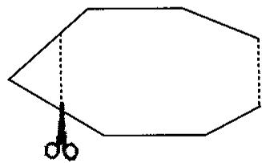  
第12题图

# 三、解答题

13. 在四边形ABCD中，相对的两个内角互补，且满足  $\angle A:\angle B:\angle C = 2:3:4$  ，则四个内角的度数分别是多少？

14. 一个多边形的内角和是四边形内角和的2倍，这个多边形是几边形？

15. 如图, 在五边形  $ABCDE$  中,  $AB = AC = AD = AE$ , 且  $AB // ED$ ,  $\angle EAB = 120^\circ$ , 求  $\angle DCB$  的度数.

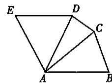  
第15题图

16.  $P$  表示  $n$  边形对角线的交点个数(指落在其内部的交点), 如果这些交点都不重合, 那么  $P$  与  $n$  的关系式是  $P = \frac{n(n - 1)}{24} (n^2 - an + b)$  (其中  $a, b$  是常数,  $n \geqslant 4$ ).

(1) 通过画图得出四边形和五边形的  $P$  的值；  
(2) 请根据四边形和五边形对角线的交点个数, 结合关系式, 求  $a$  和  $b$  的值. (注: 本题中的多边形均指凸多边形)

# 23.1 多边形(2)

# 一、选择题

1. 下列说法错误的是 （）

(A)  $n$  边形的外角和是  $n$  个外角的和；

(B)  $n$  边形的外角和是  $2n$  个外角的和；

(C)  $n$  边形的内角和是  $n$  个内角的和；

(D)  $n$  边形的外角个数不等于边数

2. 正三角形的每一个外角都是 （）

(A)  $60^{\circ}$ ;

(B)  $90^{\circ}$ ;

(C)  $120^{\circ}$ ;

(D)  $150^{\circ}$ .

3. 若多边形的内角和与外角和相等，则这个多边形是 （）

(A)三角形；

(B)四边形；

(C)五边形；

(D)六边形.

4. 若正多边形的每一个外角都等于  $60^{\circ}$ ，则这个正多边形的边数是 （）

(A)3;

(B)4;

(C)5;

(D)6.

5. 下列说法错误的是 （）

(A)四边形的内角和等于外角和；

(B)五边形的内角和大于外角和；

(C)六边形的内角和大于外角和；

(D)多边形的内角和大于外角和.

6.一个多边形的外角中，钝角的个数不可能是 （）

(A)1个；

(B)2个；

(C)3个；

(D)4个.

# 二、填空题

7. 五边形的外角共有 ______ 个，五边形的外角和是 ______ 个外角的和。  
8.六边形的外角和是  
9.一个多边形的内角和是  $720^{\circ}$  ，则这个多边形是 边形，它的外角和是  
10. 若多边形的边数由3增加到  $n(n$  为整数，  $n > 3)$  ，则其外角和的度数增加  
11.一个多边形的内角和是外角和的4倍，则这个多边形的边数为  
12.一个多边形的内角和小于外角和，则这个多边形是 形

# 三、解答题

13. 如图, 小明从  $A$  点出发, 沿直线前进 12 米后向左转  $36^{\circ}$ , 再沿直线前进 12 米又向左转  $36^{\circ} \cdots \cdots$ . 照这样走下去, 他第一次回到出发地  $A$  点时, 一共走了多少米?

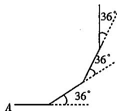  
第13题图

14. 一个多边形的内角和与外角和之和是  $1800^{\circ}$ , 求这个多边形的边数.

15. 一个多边形的内角和与外角和之比为  $9:2$ , 求这个多边形的边数.

# 思维与拓展1

小丽和小杰两人画了个凸多边形，然后量出它的各个内角，再用计算器将所量得的内角度数相加，想以此来验证多边形内角和公式，结果得到总和是  $2010^{\circ}$ 。两人发现有问题，即刻查找原因，结果发现在输入计算器时将其中一个角做了减法，其他的步骤中均无问题。那么你能知道他俩画的是几边形吗？为什么？

# 习题23.1

# 一、选择题

1. 多边形的内角和不可能是 （）

(A)  $810^{\circ}$ ;

(B)  $540^{\circ}$ ;

(C)  $1800^{\circ}$ ;

(D)  $180^{\circ}$ .

2.如果一个多边形的边数增加1倍后，它的内角和是  $2160^{\circ}$  ，那么原来多边形的边数是 （）

(A)5;

(B)6;

(C)7;

(D)8.

3.  $n$  边形与  $m$  边形内角和度数差为  $720^{\circ}$  ，则  $n$  与  $m$  的差为 （）

(A)2;

(B)3;

(C)4;

(D)5.

4. 若一个多边形的边数增加2倍，它的外角和 （）

(A)扩大2倍；

(B)缩小2倍；

(C)保持不变；

(D)无法确定.

5.一个多边形的外角和等于它的内角和的一半，则这个多边形的边数为 （）

(A)4;

(B)5;

(C)6;

(D)7.

# 二、填空题

6. 若一个八边形的每个内角都相等，则它的一个内角等 度.  
7. 将正三角形、正四边形、正五边形按如图所示的位置摆放，若  $\angle 3 = 32^{\circ}$ ，则  $\angle 1 + \angle 2 =$  度.  
8. 一大门的栏杆如图所示,  $BA$  垂直于地面  $AE$  于点  $A$ ,  $CD$  平行于地面  $AE$ , 那么  $\angle ABC + \angle BCD =$  度.

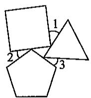  
第7题图

  
第8题图

  
第12题图

9. 若一个多边形的内角和是它的外角和的2倍，则这个多边形的边数为  
10. 多边形的每一个外角都是  $10^{\circ}$ , 这个  $n$  边形的边数是  
11. 四边形  $ABCD$  中,  $\angle A + \angle C = 180^{\circ}$ , 那么  $\angle B$  的外角  $\angle D$  (填“大于”“等于”或“小于”).  
12. 如图, 已知  $O$  是四边形  $ABCD$  内一点,  $OA = OB = OC$ ,  $\angle ABC = \angle ADC = 70^\circ$ , 则  $\angle DAO + \angle DCO$  的大小是

# 三、解答题

13. 求图形中  $x$  的值

  
第13题图

14. 如图所示, 求  $\angle A + \angle B + \angle C + \angle D + \angle E$  的值.

  
第14题图

15. 在四边形  $ABCD$  中, 已知  $\angle A: \angle B: \angle C: \angle D = 2:3:6:7$ , 求这四边形的最大外角.  
16.  $n$  边形的每一个内角都相等, 它的内角和是外角和的 5 倍, 求这个  $n$  边形的内角的大小.  
17. 一个多边形截去一个内角后，形成另一个多边形的内角和为  $2520^{\circ}$ ，求原多边形的边数

# 23.2 平行四边形(1)

# 一、选择题

1. 以下说法错误的是 （）

(A)平行四边形的对边相等；  
(B)两组对边分别平行的四边形是平行四边形；  
(C)夹在两平行直线间的平行线段相等；  
(D)平行四边形的邻角相等.

2. 在□ABCD中，  $\angle A:\angle B:\angle C:\angle D$  可能是 （）

(A)  $1:2:3:4;$

(B)  $1:2:1:2$

(C)  $1:1:2:2$ ;

(D)  $1: 2: 2: 1$ .

3. 若平行四边形两边长分别为 2、3, 则下列说法错误的是 (   )

(A)平行四边形的面积为6；

(B)这两条邻边上的高之比为  $3:2$

(C)平行四边形的周长是10；

(D)平行四边形的面积小于等于6.

4. 如图, 已知平行四边形  $ABCD$  中,  $AE \perp BC$  于点  $E$ , 以点  $B$  为旋转中心, 取旋转角等于  $\angle ABC$ , 把  $\triangle BAE$  顺时针旋转, 得到  $\triangle BA'E'$ , 连接  $DA'$ . 若  $\angle ADC = 60^\circ$ ,  $\angle ADA' = 50^\circ$ , 则  $\angle DA'E'$  的大小为 ( )

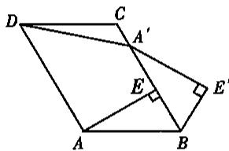  
第4题图

(A)  $130^{\circ}$ ;  
(B)  $150^{\circ}$ ;  
(C)  $160^{\circ}$ ;  
(D)  $170^{\circ}$

# 二、填空题

5. 已知四边形  $ABCD$  是平行四边形，若  $AB = 5, BC = 3$  ，则四边形的周长是  
6. 已知四边形  $ABCD$  是平行四边形, 若  $\angle A = 60^\circ$ , 则  $\angle C = \_\_\_\_\_\_\_\_\_\_\_\_\_\_\_\_\_\_\_\_\_\_\_\_\_\_\_\_\_\_\_\_\_\_\_\_\_\_\_\_\_\_\_\_\_\_\_\_\_\_\_\_\_\_\_\_\_\_\_\_\_\_\_\_\_\_\_\_\_\_\_\_\_\_\_\_\_\_\_\_\_\_\_\_\_\_\_\_\_\_\_\_\_\_\_$ .  
7. 若平行四边形周长为 56, 相邻两边的比是  $1:3$ , 则这个平行四边形较长的边长为  
8. 在口ABCD中，若  $\angle A = 100^{\circ}$  ，则  $\angle C =$  
9. 在  $\square ABCD$  中, 若  $\angle A: \angle B = 2:3$ , 则  $\angle A = \_\_\_\_\_\_\_\_\_^\circ$ ,  $\angle D = \_\_\_\_\_\_\_\_\_^\circ$ .  
10. 已知  $l_{1} / / l_{2}$ , 若点  $A, B$  在直线  $l_{1}$  上, 点  $C, D$  在直线  $l_{2}$  上,  $AD / / BC$ , 且  $AD = 4 \mathrm{~cm}$ , 则  $BC =$  ________ cm.

# 三、解答题

11. 如图, 在平行四边形  $ABCD$  中,  $AB = 4, BC = 6, AC$  的垂直平分线交  $AD$  于点  $E$ , 求  $\triangle CDE$  的周长.

  
第11题图

12. 如图, 在平行四边形  $ABCD$  中,  $AB = \sqrt{13}, AD = 4$ , 将平行四边形  $ABCD$  沿  $AE$  翻折后, 点  $B$  恰好与点  $C$  重合. 求折痕  $AE$  的长.

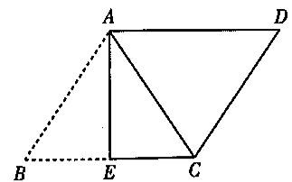  
第12题图

13. 如图, 在  $\square ABCD$  中,  $AE$  是  $\angle BAD$  的平分线, 交  $DC$  于点  $E$ . 已知  $AB = 25, BC = 14$ , 求  $DE$  及  $EC$  的长.

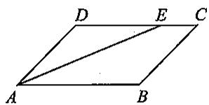  
第13题图

14. 如图, 已知  $EF$ 、 $ED$ 、 $FD$  分别过  $\triangle ABC$  的顶点  $A$ 、 $B$ 、 $C$ , 且  $EF \parallel BC$ ,  $ED \parallel AC$ ,  $FD \parallel AB$ .

(1)指出图中所有的平行四边形；  
(2)求证：  $A,B,C$  分别是线段  $EF,ED,DF$  的中点

  
第14题图

15. 如图, 在  $\square ABCD$  中,  $AE \perp BC$  于点  $E$ ,  $AF \perp CD$  于点  $F$ , 且  $\angle EAF = 60^\circ$ . 若  $BE = 2\mathrm{cm}, DF = 3\mathrm{cm}$ , 求  $\square ABCD$  的周长和面积.

  
第15题图

# 23.2 平行四边形(2)

# 一、选择题

1. 在□ABCD中，对角线AC和BD相交于点  $o$  ，下列式子一定成立的是 （）

(A)  $AC \perp BD$ ;

(B)  $OA = OC$ ;

(C)  $AC = BD$

(D)  $AO = OD$

2. 在□ABCD中，两条对角线长分别为5、6，则其边长的范围是 （）

(A)小于1或大于11；

(B)小于  $\frac{1}{2}$  或大于  $\frac{11}{2}$

(C)大于1且小于11;

(D)大于  $\frac{1}{2}$  且小于  $\frac{11}{2}$ .

3. 一边长为5的平行四边形，它的对角线长可能是 （）

(A)4和6；

(B)2和6；

(C)4和8；

(D)2和12.

4. 如图, 平行四边形  $ABCD$  的对角线  $AC$  与  $BD$  相交于点  $O$ ,  $AB \perp AC$ . 若  $AB = 4, AC = 6$ , 则  $BD$  的长是 ( )

(A)8;

(B)9;

(C)10;

(D)11.

# 二、填空题

5. 在 \(\square ABCD\) 中, 对角线 \(AC\) 与 \(BD\) 相交于点 \(O\), \(AB = 6 \mathrm{~cm}\), \(AC = 8 \mathrm{~cm}\), \(BD = 6 \mathrm{~cm}\), 则 \(\triangle COD\) 的周长是 \(\_ \_ \_ \_ \_ \_ \_ \_ \_ \_ \_ \_ \_ \_ \_ \_ \_ \_ \_ \_ \_ \_ \_ \_ \_ \_ \_ \_ \_ \_ \_ \_ \_ \_ \_ \_ \_ \_ \_ \_ \_ \_ \_ \_ \_ \_ \_ \_ \_ \_ \_  
6. 平行四边形是 图形，对称中心是  
7. 在  $\square ABCD$  中, 对角线  $AC, BD$  相交于点  $O$ ,  $AO = 8$ ,  $BD = 12$ . 若  $\triangle COD$  的周长是 25, 则  $AB =$  
8. 在  $\square ABCD$  中, 对角线  $AC, BD$  相交于点  $O$ . 若  $AC = 38 \mathrm{~cm}, BD = 24 \mathrm{~cm}, AD = 14 \mathrm{~cm}$ , 则  $\triangle OBC$  的周长为  
9. 若一个平行四边形的一条对角线长为 6 , 则它的另一条对角线长的取值范围为  
10. 已知平行四边形的面积为 \(144 \mathrm{~cm}^{2}\), 相邻两边上的高分别为 \(8 \mathrm{~cm}\) 和 \(9 \mathrm{~cm}\), 则这个平行四边形的周长为 \(\_ \_ \_ \_ \_ \_ \_ \_ \_ \_ \_ \_ \_ \_ \_ \_ \_ \_ \_ \_ \_ \_ \_ \_ \_ \_ \_ \_ \_ \_ \_ \_ \_ \_ \_ \_ \_ \_ \_ \_ \_ \_ \_ \_ \_ \_ \_ \_ \_ \_ \_ 周长为

# 三、解答题

11. 如图, 在  $\square ABCD$  中,  $E, F$  是对角线  $BD$  上的两点, 且  $BE = DF$ . 求证:  $AF = CE$ .

  
第11题图

12. 如图, 在  $\square ABCD$  中, 对角线  $AC$  和  $BD$  相交于点  $O$ . 已知  $\triangle BOC$  的周长比  $\triangle DOC$  的周长小 2,  $\square ABCD$  的周长为 12, 求边  $BC$  和  $DC$  的长.

  
第12题图

13. 如图, 在  $\square ABCD$  中, 过  $AC$  的中点  $O$  的直线交  $AD, CB$  的延长线于点  $E, F$ . 求证:  $DE = BF$ .

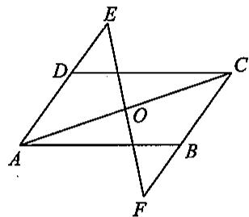  
第13题图

14. 如图, 在  $\square ABCD$  中,  $AC, BD$  交于点  $O$ ,  $EF$  过点  $O$ , 分别交  $CB, AD$  的延长线于点  $E, F$ . 求证:  $AE = CF$ .

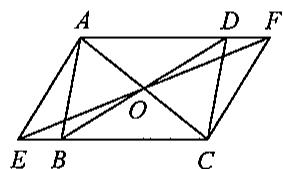  
第14题图

15. 画一条直线将下面的图形分成面积相等的两部分.

  
第15题图

# 23.2 平行四边形(3)

# 一、选择题

1. 下列条件不能判定四边形ABCD是平行四边形的是 （）

(A)  $AB = CD, AD = BC$ ;

(B)  $AB // CD, AD // BC$ ;

(C)  $AB = CD, AD // BC$ ;

(D)  $AB \parallel CD, AB = DC$ .

2. 已知四边形  $ABCD$  的对角线  $AC, BD$  相交于点  $O$ , 如果只给出  $AB // CD$ , 那么下列条件中能使四边形  $ABCD$  是平行四边形的是 ( )

(A)  $BD = AD$

(B)  $\angle DAB = \angle DBA$ ;

(C)  $AO = CO$

(D)  $\angle DBA = \angle CAB.$

3.  $A, B, C$  是平面内不在同一条直线上的三点， $D$  是平面内任意一点。若  $A, B, C, D$  四点恰能构成一个平行四边形，则在平面内符合这样条件的点  $D$  有 （）

(A)1个；

(B)2个；

(C)3个；

(D)4 个.

4. 如图， $\triangle ABC$  是边长为 4 的等边三角形， $P$  是  $\triangle ABC$  内的任意一点，过点  $P$  作  $EF \parallel AB$  分别交  $AC, BC$  于点  $E, F$ ，作  $GH \parallel BC$  分别交  $AB, AC$  于点  $G, H$ ，作  $MN \parallel AC$  分别交  $AB, BC$  于点  $M, N$ ，那么  $EF + GH + MN$  的值为（）

(A)4;

(B)6;

(C)8;

(D)10.

  
第4题图

# 二、填空题

5. 四边形  $ABCD$  中, 若  $AB // CD, AD // BC$ , 则四边形  $ABCD$  是  
6. 四边形ABCD中，若  $AB = CD, AD = BC$ ，则四边形ABCD是  
7. 在四边形ABCD中，  $AB = CD,AD = BC.$  若  $\angle B = 40^{\circ}$  ，则  $\angle D =$  
8. 在四边形ABCD中，  $AB = CD$  且  $AB / / CD.$  若  $AD = 32$  ，则  $BC = \_$  
9.如图，  $AD / / GH / / BC,AB / / EF / / DC$  ，图中平行四边形有 个.  
10. 一个四边形的四条边依次是  $a, b, c, d$ ，若四条边满足  $a^2 + b^2 + c^2 + d^2 = 2ac + 2bd$ ，则该四边形是平行四边形。这个命题是 ______ 命题（填“真”或“假”）。

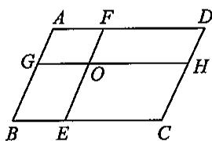  
第9题图

# 三、解答题

11. 如图，在四边形ABCD中，  $\angle A = \angle C,AB / / CD.$  求证：四边形ABCD是平行四边形

  
第11题图

12. 如图, 在  $\square ABCD$  中,  $AE, CF$  分别是  $\angle DAB, \angle BCD$  的平分线.

求证：四边形  $AFCE$  是平行四边形

  
第12题图

13. 如图，在  $\square ABCD$  中， $E, F$  分别是  $AB, CD$  的中点。

(1)求证：四边形EBFD为平行四边形；  
(2)对角线  $AC$  分别与  $DE, BF$  交于点  $M, N$ , 求证:  $\triangle ABN \cong \triangle CDM$ .

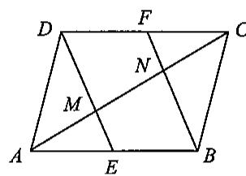  
第13题图

# 思维与拓展2

如图，在  $\triangle ABC$  中，  $AB = 3, AC = 4, BC = 5, \triangle ABD, \triangle ACE, \triangle BCF$  都是等边三角形，则四边形AEFD的面积为

# 23.2 平行四边形(4)

# 一、选择题

1.如图，在口ABCD中，  $EF / / AD,HG / / AB$  ，则图中平行四边形有 （）

(A)12个；

(B)9个；

(C)7个；

(D)5个.

2. 四边形中, 有两个角相等, 另两个角也相等, 则这个四边形. ( )

(A)一定是平行四边形；

(B)一定不是平行四边形；

(C)可能是平行四边形；

(D)以上结论都不对.

3. 已知四边形  $ABCD$ ，从下列条件： $AB // CD, BC // AD, AB = CD, BC = AD, \angle A = \angle C, \angle B = \angle D$  中任选两个，可以得出“四边形  $ABCD$  是平行四边形”这一结论的情况有 （）

(A)4种；

(B)9种；

(C)13种；

(D)15种.

# 二、填空题

4. 在四边形ABCD中，AC与BD交于点  $o$  若  $AO = OC,BO = DO$  ，则四边形ABCD是  
5. 在四边形  $ABCD$  中,  $\angle A = \angle C, \angle B = \angle D$ , 则四边形  $ABCD$  是_____, 根据是_____.  
6. 在四边形 \(ABCD\) 中, \(\angle A = \angle C = 108^\circ\). 若 \(\angle B = \_\_\_\_\_\_\_\_\_\_\_\_\_\_\_\_\_\_\_\_\_\_\_\_\_\_\_\_\_\_\_\_\_\_\_\_\_\_\_\_\_\_\_\_\_\_\_\_\_\_\_\_\_\_\_\_\_\_\_\_\_\_\_\_\_\_\_\_\_\_\_\_\_\_\_\_\_\_\_\_\_\_\_\_\_\_\_\_\_\_\_\_\_\_\_\_\_\_\_\_\_
A、B、C的三边形 \(ABCD\) 中, \(\angle A = \angle C = 108^\circ\). 若 \(\angle B = \_ \_ \_ \_ \_ \_ \_ \_ \_ \_ \_ \_ \_ \_ \_ \_ \_ \_ \_ \_ \_ \_ \_ \_ \_ \_ \_ \_ \_ \_ \_ \_ \_ \_ \_ \_ \_ \_ \_ \_ \_ \_ \_ \_ \_ \_ \_ \angle A = 120^\circ\). 若 \(\angle B = \_ \_ \_ \_ \_ \_ \_ \_ \_ \_ \_ \_ \_ \_ \_ \_ \angle A = 120^\circ\), 则此四边形是平行四边形.  
7. 在四边形  $ABCD$  中, 点  $E, F$  在对角线  $AC$  上, 点  $G, H$  在对角线  $BD$  上, 且  $AE = CF$ ,  $BG = DH$ , 则四边形  $EHFG$  是平行四边形. 这一结论是 ______ 的(填“正确”或“错误”).  
8. 在四边形  $ABCD$  中, 对角线  $AC, BD$  相交于点  $E$ ,  $\angle CBD = 90^\circ$ ,  $BC = 4$ ,  $BE = ED = 3$ ,  $AC = 10$ , 则四边形  $ABCD$  的面积为

# 三、解答题

9. 如图, 已知在四边形  $ABCD$  中,  $\angle B = \angle D, AB // CD$ . 求证: 四边形  $ABCD$  是平行四边形.

  
第9题图

10. 如图, 在  $\square ABCD$  中, 点  $E$  是边  $BC$  的中点, 连接  $AE$  并延长与  $DC$  的延长线交于点  $F$ .

(1)求证：  $CF = CD$  
(2)若  $AD = 13, AF = 10, AD = 2AB$  ，连接  $DE$  ，求  $DE$  的长

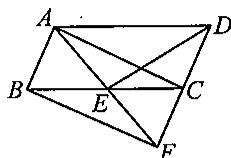  
第10题图

11. 如图, 在  $\square ABCD$  中,  $O$  是  $AC$  的中点,  $EF$  过点  $O$ , 分别与边  $AD, BC$  交于点  $E, F$ . 求证:  $EC \parallel AF$ .

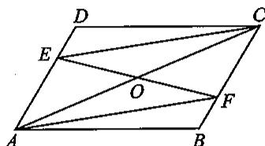  
第11题图

12. 如图, 在  $\square ABCD$  中, 点  $E, F, G, H$  分别在边  $AB, BC, CD, AD$  上, 且  $AH = CF, DG = BE$ . 求证:  $EG, HF$  互相平分.

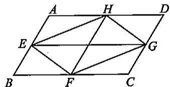  
第12题图

13. 如图, 直线  $l$  (形外) 过  $\square ABCD$  的顶点  $A$ , 分别过点  $B, C, D$  作直线  $l$  的垂线,  $E, F, G$  为垂足. 求证:  $CF = BE + DG$ .

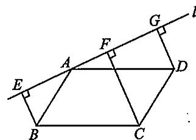  
第13题图

# 习题23.2

# 一、选择题

1. 下列说法不正确的是 （）

(A)平行四边形对边平行，对角相等；  
(B)一组对边平行，一组对边相等的四边形是平行四边形；  
(C)一组邻角互补，一组对角相等的四边形是平行四边形；  
(D)一组对边平行, 一组对角相等的四边形是平行四边形.

2.如图，在平行四边形ABCD中，AC与BD相交于点  $o$  ，则下列结论不一定成立的是 （）

(A)  $BO = DO$  
(B)  $CD = AB$ ;  
(C)  $\angle BAD = \angle BCD$ ;  
(D)  $AC = BD$

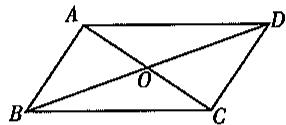  
第2题图

3. 下列条件中能判定一个四边形是平行四边形的是 （）

(A)两条对角线互相垂直；

(B)两条对角线相等；

(C)两条对角线互相平分；

(D)两条对角线互相垂直且相等

4. 在四边形  $ABCD$  中，从：①  $AB // CD$ ；②  $AB = CD$ ；③  $AD // BC$ ；④  $\angle B = \angle D$  这四个条件中任取两个条件，可以推出四边形  $ABCD$  是平行四边形的有 （）

(A)3种；

(B)4种；

(C)5种；

(D)6种.

# 二、填空题

5. 如图, 在  $\square ABCD$  中, 对角线  $AC, BD$  相交于点  $O$ , 图中全等三角形的对数为

  
第5题图

6. 若平行四边形中两个内角的度数比为  $1:3$ , 则其中较小的内角度数是

7. 如果平行四边形的一组对角互补,那么这个平行四边形的四个角都是

8. 在周长为 28 的平行四边形  $ABCD$  中, 若  $AB:BC = 4:3$ , 则  $CD =$  ________.

9. 在□ABCD中，  $\angle CBD = 70^{\circ}, BC = BD$  ，则  $\angle ADC =$

10. 平行四边形  $ABCD$  的对角线  $AC, BD$  相交于点  $O$ , 它们的长度之和为  $18 \mathrm{~cm}$ . 若  $\triangle OAD$  的周长为  $17 \mathrm{~cm}$ , 则  $AD =$  ________ cm.

11. 已知平行四边形  $ABCD$  的对角线  $AC, BD$  相交于点  $O$ , 若  $\triangle AOB$  的面积为  $6k$ , 则平行四边形  $ABCD$  的面积为

12. 如图, 过平行四边形  $ABCD$  对角线交点  $O$  的直线交  $AD$  于点  $E$ , 交  $BC$  于点  $F$ . 若  $AB = 5, BC = 6, OE = 2$ , 则四边形  $EFCD$  的周长为

  
第12题图

# 三、解答题

13. 如图, 在  $\square ABCD$  中,  $E, F$  是对角线  $BD$  上的两点, 且  $AE \perp BD$ ,  $CF \perp BD$ . 求证:  $AF = CE$ .

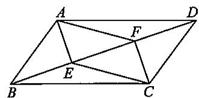  
第13题图

14. 如图, 在四边形  $ABCD$  中,  $AD \parallel BC, E, F$  分别是  $AB, CD$  上的点,  $OA = OC, OE = OF$ . 求证: 四边形  $ABCD$  是平行四边形.

  
第14题图

15. 如图, 在  $\triangle ABC$  中,  $BF$  平分  $\angle ABC$  交  $AC$  于点  $F$ ,  $DF \parallel BC$ , 点  $E$  在  $BC$  上,  $\angle DEB = \angle C$ . 求证:  $BD = CE$ .

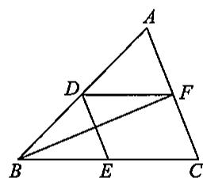  
第15题图

# 思维与拓展3

如图，在□ABCD中，  $BC = 2AB,M$  是  $AD$  的中点，  $CE\bot AB$  于点  $E$  求证：  $\angle DME = 3\angle AEM.$

# 23.3 矩形、菱形与正方形(1)

# 一、选择题

1.矩形具有而平行四边形不一定具有的性质是 （）

(A)对边相等；

(B)对角相等；

(C)对角互补；

(D)对角线互相平分.

2. 在矩形ABCD中，  $AB = 4,BC = 3$  ，则AC的值为 （）

(A)2;

(B)4;

(C)5;

(D)6.

3.如图，在矩形ABCD中，对角线AC、BD相交于点  $o,\angle ACB = 30^{\circ}$  ，则  $\angle AOB$  的大小为（）

(A)  $30^{\circ}$ ;

(B)  $60^{\circ}$ ;

(C)  $90^{\circ}$ ;

(D)  $120^{\circ}$ .

  
第3题图

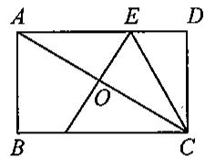  
第4题图

4. 如图，在矩形ABCD中，  $AB = 2,BC = 4$  ，对角线AC的垂直平分线分别交AD、AC于点E、O，连接CE，则CE的长为 （）

(A)3;

(B)3.5;

(C)2.5;

(D)2.8.

# 二、填空题

5. 若矩形一条较短的边长是 5, 两条对角线的夹角是  $60^{\circ}$ , 则对角线长是  
6. 矩形ABCD中，  $AE\bot BD$  于点  $E,CF\bot BD$  于点  $F$  ，若  $BE = 2,EF = 4$  ，则  $AB = \_$  
7. 矩形被两条对角线分成的四个小三角形的周长为 68, 对角线长 10, 则矩形的周长为  
8. 矩形的一个内角的平分线分长边为  $5\mathrm{cm}$  和  $4\mathrm{cm}$  两部分, 则此矩形的面积为  
9. 已知矩形的周长为 40, 被两条对角线分成的相邻两个三角形的周长的差为 8 , 则较长的边长为  
10. 已知四边形  $ABCD$  是矩形, 对角线  $AC, BD$  相交于点  $O$ , 若矩形  $ABCD$  的面积为  $48 \mathrm{~cm}^2$ , 则  $\triangle AOB$  的面积等于  $\mathrm{cm}^2$ .  
11. 矩形的两条对角线的夹角为  $60^{\circ}$ , 一条对角线与短边的和为 15, 则对角线的长为  
12. 如图, 矩形纸片  $ABCD$  中,  $E$  是  $AD$  的中点, 且  $AE = 1$ ,  $BE$  的垂直平分线  $MN$  恰好过点  $C$ , 则矩形的一边  $AB$  的长度为

  
第12题图

  
第13题图

# 三、解答题

13. 如图, 已知矩形  $ABCD, BE \parallel AC$  交  $DC$  的延长线于点  $E$ . 求证:  $\triangle BDE$  是等腰三角形.

14. 如图, 在矩形  $ABCD$  中,  $AB = 2BC$ , 在  $CD$  上取一点  $E$ , 使得  $AE = AB$ , 求  $\angle EBC$  的度数.

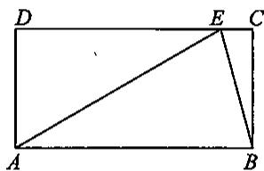  
第14题图

15. 如图,ABCD、CGEF是两个形状、大小完全一样的矩形，且构成L型图形，连接AC、EC、AE

(1)求证：  $\triangle ACE$  是等腰直角三角形；  
(2) 若  $AC = 2BC$ ，试求  $\angle APF$  的度数

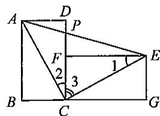  
第15题图

# 23.3 矩形、菱形与正方形(2)

# 一、选择题

1. 如图, 在菱形中, 对角线  $AC, BD$  相交于点  $O, E$  为  $AD$  的中点, 菱形  $ABCD$  的周长为 28 , 则  $OE$  的长等于 ( )

(A)3.5;

(B)4;

(C)7;

(D)14.

2.如图，已知  $AC\setminus BD$  是菱形ABCD的对角线，则下列结论一定正确的是 （）

(A)  $\triangle ABD$  与  $\triangle ABC$  的周长相等；  
(B)  $\triangle ABD$  与  $\triangle ABC$  的面积相等；  
(  $\dot{\mathbf{C}}$  )菱形的周长等于两条对角线之和的2倍；  
(D)菱形的面积等于两条对角线之和的2倍

第1题图

3. 下列命题正确的是 （）

(A)矩形的两条对角线互相垂直；

(B)矩形的两条对角线相等；

(C)菱形的两条对角线相等；

(D)菱形的两条对角线相等且互相垂直

4. 如果矩形的对角线长为  $2a$ ，相交的四个角中，较大的一个角是  $120^\circ$ ，那么这个矩形的周长是（ ）

(A)  $4a$

(B)  $8a$

(C)  $(2\sqrt{3} + 2)a$

(D)  $\sqrt{3} a^{2}$ .

5.如果菱形ABCD的边长为1,AE垂直平分BC于点  $E$  ，那么BD的长为 （）

(A)  $\frac{1}{2}$ ;

(B)  $\sqrt{3}$ ;

(C)  $\frac{\sqrt{3}}{2}$ ;

(D)条件不够不能计算.

6. 如图, 在矩形  $ABCD$  中, 点  $E, F$  分别在边  $AB, BC$  上, 且  $AE = \frac{1}{3} AB$ . 将矩形沿直线  $EF$  折叠, 点  $B$  恰好落在  $AD$  边上的点  $P$  处, 连接  $BP$  交  $EF$  于点  $Q$ . 对于下列结论: ①  $EF = 2BE$ ; ②  $PF = 2PE$ ; ③  $FQ = 4EQ$ ; ④  $\triangle PBF$  是等边三角形, 其中正确的是 ( )

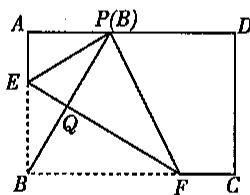  
第6题图

(A)①②；

(B)②③;

(C)①③;

(D)①④.

# 二、填空题

7. 矩形、菱形的性质复习（从边、角、对角线、对称性角度）：

<table><tr><td></td><td>边</td><td>角</td><td>对角线</td><td>对称性</td></tr><tr><td>矩形</td><td></td><td></td><td></td><td></td></tr><tr><td>菱形</td><td></td><td></td><td></td><td></td></tr></table>

8. 已知菱形的边长是 \(5 \mathrm{~cm}\), 一条对角线长为 \(8 \mathrm{~cm}\), 则另一条对角线长为 \(\_ \_ \_ \_ \_ \_ \_ \_ \_ \_ \_ \_ \_ \_ \_ \_ \_ \_ \_ \_ \_ \_ \_ \_ \_ \_ \_ \_ \_ \_ \_ \_ \_ \_ \_ \_ \_ \_ \_ \_ \_ \_ \_ \_ \_ \_ \_ \_ \_ \_ \_  
9. 矩形的对角线相交所成的锐角是 \(60^{\circ}\), 较短的边长为 \(8 \mathrm{~cm}\), 则矩形的另一条边长是 \(\_ \_ \_ \_ \_ \_ \_ \_ \_ \_ \_ \_ \_ \_ \_ \_ \_ \_ \_ \_ \_ \_ \_ \_ \_ \_ \_ \_ \_ \_ \_ \_ \_ \_ \_ \_ \_ \_ \_ \_ \_ \_ \_ \_ \_ \_ \_ \_ \_ \_ \_ cm\). 它的对角线长为 \(\_\_\_\_\_\_\_\_\_\_\_\_\_\_\_\_\_\_\_\_\_\_\_\_\_\_\_\_\_\_\_\_\_\_\_\_\_\_\_\_\_\_\_\_\_\_\_\_\_\_\_\_\_\_\_\_\_\_\_\_\_\_\_\_\_\_\_\_\_\_\_\_\_\_\_\_\_\_\_\_\_\_\_\_\_
A. 1 B. 2 C. 3 D. 4 E. 5 F. 6 G. 7 H. 8 I. 9 J. 10 K. 11 L. 12 M. 13 N. 14 O. 15 P. 16 Q. 17 R. 18 S. 19 T. 20 U. 21 V. 22 W. 23 X. 24 Y. 25 Z. 26  
10. 已知菱形的边长为  $4 \mathrm{~cm}$ , 一个角为  $60^{\circ}$ , 则菱形的两条对角线长分别为

11. 已知矩形 \(ABCD\) 的对角线 \(AC\) 与 \(BD\) 交于点 \(O\), 三角形 \(ABO\) 是等边三角形. 若 \(AB = 4 \mathrm{~cm}\), 则矩形 \(ABCD\) 的面积是 \(\_ \_ \_ \_ \_ \_ \_ \_ \_ \_ \_ \_ \_ \_ \_ \_ \_ \_ \_ \_ \_ \_ \_ \_ \_ \_ \_ \_ \_ \_ \_ \_ \_ \_ \_ \_ \_ \_ \_ \_ \_ \_ \_ \_ \_ \_ \_ \_ \_ \_ \_  
12. 已知菱形的一条边与它的两条对角线所成的两个角的大小之比是  $3: 2$ ，则菱形相邻的一组内角的度数是 ______.

# 三、解答题

13. 矩形  $ABCD$  的对角线长为  $10\mathrm{cm}$ , 面积为  $48\mathrm{cm}^2$ , 求它的周长.

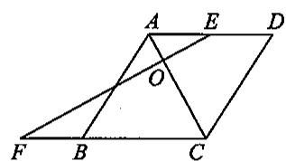

14. 如图, 在菱形  $ABCD$  中,  $E$  是  $AD$  的中点,  $EF \perp AC$  交  $CB$  的延长线于点  $F$ . 求证:  $AB, EF$  互相平分.

第14题图

15. 如图, 在矩形  $ABCD$  中,  $AE \perp BD$  于点  $E$ ,  $\angle DAE: \angle BAE = 3:1$ , 且  $M$  为  $OA$  的中点. 求证:  $ME \perp AC$ .

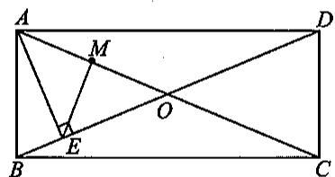  
第15题图

# 思维与拓展4

如图，在边长为1的菱形ABCD中，  $\angle DAB = 60^{\circ}$  ，连接对角线AC，以  $AC$  为边作第二个菱形ACEF，使  $\angle FAC = 60^{\circ}$  ，连接AE，再以AE为边作第三个菱形AEGH使  $\angle HAE = 60^{\circ},\dots \dots$  ，按此规律所作的第  $_n$  个菱形的边长是

# 23.3 矩形、菱形与正方形(3)

# 一、选择题

1.如图，正方形ABCD的对角线  $AC$  是菱形AEFC的一边，则  $\angle FAB$  等于 （）

(A)  $135^{\circ}$ ;

(B)  $45^{\circ}$ ;

(C)  $22.5^{\circ}$ ;

(D)  $30^{\circ}$ .

2. 在矩形ABCD中，  $AB = 2,AC\bot BD$  ，则  $AC$  等于 （）

(A)  $2\sqrt{2}$ ;

(B)3;

(C)  $2\sqrt{3}$ ;

(D)4.

  
第1题图

  
第3题图

  
第4题图

3. 如图, 正方形  $ABCD$  一边  $AD$  上任一点  $P$  到这个正方形两条对角线的距离之和等于对角线的 ( )

(A)  $\frac{1}{3}$ ;

(B)  $\frac{1}{2}$ ;

(C)  $\frac{1}{4}$ ;

(D)2倍

4.如图，  $P$  为正方形ABCD对角线AC上一点，若  $AP = AB$  ，则  $\angle CBP$  的度数是 （）

(A)  $15^{\circ}$ ;

(B)22.  $5^{\circ}$ ;

(C)  $30^{\circ}$ ;

(D)  $45^{\circ}$ .

# 二、填空题

5. 正方形是对角线 的菱形.  
6. 正方形是对角线________的矩形.  
7. 正方形的对角线长为 4 , 则它的面积是  
8. 在正方形  $ABCD$  中,  $AB = 18 \mathrm{~cm}$ , 对角线  $AC, BD$  相交于点  $O$ ,  $\triangle ABO$  的周长  $=$  ________ cm.  
9. 已知四边形  $ABCD$  为矩形，请你添加一个条件，使矩形  $ABCD$  成为正方形，你添加的条件是  
10. 如图,  $E$  为正方形  $ABCD$  内一点, 且  $\triangle ABE$  为等边三角形, 则  $\angle EDC =$

# 三、解答题

11. 如图, 正方形  $ABCD$  的周长是 24, 对角线  $AC, BD$  交于点  $O$ ,  $BC = BE$ , 求  $\triangle BEC$  的面积.

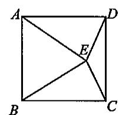  
第10题图

  
第11题图

12. 如图, 在正方形  $ABCD$  中,  $E, F$  分别是  $AB$  和  $AD$  上的点. 已知  $CE \perp BF$ , 垂足为  $M$ . 求证:

(1)  $\angle EBM = \angle ECB$ ;  
(2)  $EB = AF$ .

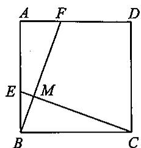  
第12题图

13. 如图, 四边形  $ABCD, BEFG$  均为正方形, 连接  $AG, CE$ . 求证:

(1)  $AG = CE$  
(2)  $AG \perp CE$ .

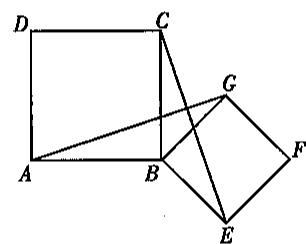  
第13题图

# 思维与拓展5

如图，四边形ABCD是正方形，直线  $l_{1}, l_{2}, l_{3}$  分别通过  $A, B, C$  三点，且  $l_{1} / / l_{2} / / l_{3}$ ，若  $l_{1}$  与  $l_{2}$  的距离为  $5, l_{2}$  与  $l_{3}$  的距离为7，则正方形ABCD的面积等于

# 习题23.3

# 一、选择题

1. 下列判断正确的是 （）

(A)四边相等的四边形是正方形；  
(B)对角线互相垂直的平行四边形是正方形；  
(C)四角相等的四边形是正方形；  
(D)对角线互相垂直平分且相等的四边形是正方形.

2.下列命题错误的是 （）

(A)对角线相等的菱形是正方形；

(B)对角线互相垂直的矩形是正方形；

(C)对角线互相垂直的平行四边形是正方形；

(D)正方形具有菱形的一切性质

3. □ABCD是正方形，需增加的条件是 （）

(A)邻边相等；

(B)邻角相等；

(C)对角线互相垂直且相等；

(D)对角线互相垂直且平分.

4.菱形的各条边的中垂线所围成的四边形是 （）

(A)矩形；

(B)正方形；

(C)菱形；

(D)平行四边形.

5. 在四边形ABCD中，对角线交点是  $O$  下列条件能判定四边形是正方形的条件是 （）

(A)  $AB / / CD,AB = CD,AC = BD;$

(B)  $AD / / BC,\angle A = \angle C;$

(C)  $AO = BO = CO = DO, AC \perp BD$ ;

(D)  $AC = CD, BO = DO, AB = BC.$

6. 从下列四个条件：①  $AB = BC$ ；②  $\angle ABC = 90^{\circ}$ ；③  $AC = BD$ ；④  $AC \perp BD$  中选两个作为补充条件，使平行四边形  $ABCD$  为正方形（如图）现有下列四种选法，你认为其中错误的是 （）

（ ）

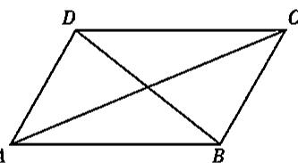

(A)①②;

(B)②③;

(C)①③;

(D)②④.

# 二、填空题

7. 矩形、菱形和正方形的性质回顾：

<table><tr><td>性质\图形</td><td>矩形</td><td>菱形</td><td>正方形</td></tr><tr><td>边</td><td></td><td></td><td></td></tr><tr><td>角</td><td></td><td></td><td></td></tr><tr><td>对角线</td><td></td><td></td><td></td></tr><tr><td>对称性</td><td></td><td></td><td></td></tr></table>

8.有一组邻边相等的 是正方形

9. 如图, 在正方形  $ABCD$  的外侧, 作等边三角形  $ADE$ , 则  $\angle BED$  的度数是

10. 现给出以下图形：①等腰三角形；②平行四边形；③矩形；④菱形；⑤正方

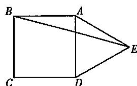  
第9题图

形,其中既是轴对称又是中心对称图形的是 (填序号).

11. 四条边长都等于  $a$  的四边形ABCD，对角线与一条边的夹角是  $45^{\circ}$ ，则这个四边形是

12. 如图, 正方形  $ABCD$  和正方形  $CEFG$  中, 点  $D$  在  $CG$  上,  $BC = 1$ ,  $CE = 3$ ,  $H$  是  $AF$  的中点. 则  $CH$  的长是

  
第12题图

# 三、解答题

13. 如图, 在 Rt $\triangle ABC$  中,  $\angle ACB = 90^\circ$ ,  $\angle CAB$  和  $\angle ABC$  的平分线交于点  $G$ , 过点  $G$  作  $GD \perp AC$ ,  $GE \perp BC$ ,  $GF \perp AB$ , 垂足分别为  $D, E, F$ .

求证：四边形  $CDGE$  是正方形

  
第13题图

14. 如图,  $P$  是正方形ABCD对角线BD上一点,  $PE \perp CD$  于点  $E$ ,  $PF \perp BC$  于点  $F$ .

请说明：  $AP = EF$

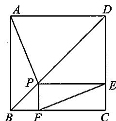  
第14题图

# 思维与拓展6

如图, 现有边长为 4 的正方形纸片  $ABCD$ ,  $P$  为  $AD$  边上的一点 (不与点  $A, D$  重合), 将正方形纸片折叠, 使点  $B$  落在点  $P$  处, 点  $C$  落在点  $G$  处,  $PG$  交  $DC$  于点  $H$ , 折痕为  $EF$ , 连接  $BP, BH$ .

(1)求证：  $\angle APB = \angle BPH$  
(2)求证：  $AP + HC = PH$  
(3)当  $AP = 1$  时，求  $PH$  的长

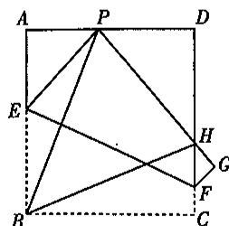

# 23.4 三角形的中位线与重心(1)

1. 如图, 小张想估测被池塘隔开的  $A 、 B$  两处景观之间的距离, 他先在  $A B$  外取一点  $C$ , 然后步测出  $A C 、 B C$  的中点  $D 、 E$ , 并步测出  $D E$  的长约为  $18 \mathrm{~m}$ , 由此估测  $A 、 B$  之间的距离约为 ( )

(A)  $18\mathrm{m}$

(B)  $24\mathrm{m}$

(C)  $36\mathrm{m}$

(D)  $54\mathrm{m}$

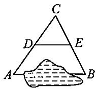  
第1题图

  
第2题图

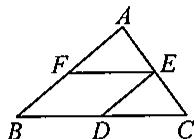  
第5题图

2. 如图, 在  $\triangle ABC$  中, 点  $D, E$  分别是  $AC, BC$  的中点, 若  $\angle A = 45^\circ$ ,  $\angle CED = 70^\circ$ , 则  $\angle C$  的度数为 ( )

(A)  $45^{\circ}$ ;

(B)  $50^{\circ}$ ;

(C)  $60^{\circ}$ ;

(D)  $65^{\circ}$ .

3.如果顺次连接四边形各边中点组成的四边形是矩形，那么原来的四边形的对角线 （）

(A) 互相平分；

(B)互相垂直；

(C)相等；

(D)相等且互相平分.

4. 已知三角形的三条中位线长分别为  $3\mathrm{cm}, 4\mathrm{cm}, 6\mathrm{cm}$ ，则这个三角形的周长是 （）

(A)  $3\mathrm{cm}$

(B)  $26~\mathrm{cm}$ ;

(C)  $24~\mathrm{cm}$ ;

(D)65 cm.

5. 如图，在  $\triangle ABC$  中， $D, E, F$  分别是  $BC, AC, AB$  的中点。若  $AB = 6, BC = 8$ ，则四边形  $BDEF$  的周长是 （）

(A)28;

(B)14;

(C)10;

(D)7.

# 二、填空题

6. 三角形各边的长分别为  $6\mathrm{cm},8\mathrm{cm}$  和  $10\mathrm{cm}$ ，则连接各边中点所成三角形的周长为  
7. 若三角形的周长为 \(56 \mathrm{~cm}\), 则它的三条中位线组成的三角形的周长是 \(\_ \_ \_ \_ \_ \_ \_ \_ \_ \_ \_ \_ \_ \_ \_ \_ \_ \_ \_ \_ \_ \_ \_ \_ \_ \_ \_ \_ \_ \_ \_ \_ \_ \_ \_ \_ \_ \_ \_ \_ \_ \_ \_ \_ \_ \_ \_ \_ \_ \_ \_  
8. 在 Rt $\triangle ABC$  中,  $\angle C = 90^\circ$ , 点  $D, E, F$  分别为  $AB, BC, AC$  边上的中点. 如果  $AC = 4 \mathrm{~cm}$ ,  $BC = 6 \mathrm{~cm}$ , 那么四边形  $CEDF$  是 , 它的边长分别为  
9. 若三角形一条中位线分三角形所成的新三角形与原三角形周长之和为  $60 \mathrm{~cm}$ , 则原三角形的周长为  
10. 若等腰三角形的两条中位线长分别是3和4，则它的周长是  
11. 如图, 四边形  $ABCD$  中,  $E, F, G$  分别是  $AD, BC, BD$  的中点. 若  $AB = CD = 6$ ,  $AD = EF = 3\sqrt{2}$ , 连接  $EG, GF, EF$ , 则  $\triangle EGF$  的形状是

  
第11题图

# 三、解答题

12. 如图, 在  $\triangle ABC$  中,  $BC > AC$ , 点  $D$  在  $BC$  上, 且  $DC = AC$ ,  $\angle ACB$  的平分线  $CF$  交  $AD$  于点  $F$ ,  $E$  是  $AB$  的中点, 连接  $EF$ .

求证:  $EF \parallel BC$ .

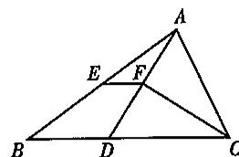  
第12题图

13. 如图， $\triangle ABC$  的中线  $BD, CE$  交于点  $O, F, G$  分别是  $OB, OC$  的中点。求证： $EF = DG$  且  $EF \parallel DG$

  
第13题图

14. 如图, 在  $\triangle ABC$  中,  $AE$  平分  $\angle BAC$ ,  $BE \perp AE$  于点  $E$ , 点  $F$  是  $BC$  的中点.

(1)如图①,  $BE$  的延长线与  $AC$  边相交于点  $D$ , 求证:  $EF = \frac{1}{2} (AC - AB)$ ;  
(2)如图②,请写出线段  $AB\setminus AC\setminus EF$  之间的数量关系，并说明理出.

  
图  $①$

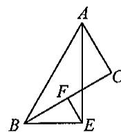  
图  $②$  
第14题图

# 23.4 三角形的中位线与重心(2)

# 一、选择题

1. 如图, 在  $\triangle ABC$  中, 点  $G$  是重心,  $AG$  的延长线交  $BC$  于点  $D$ ,  $GE \parallel AC$ , 交  $BC$  于点  $E$ . 若  $GD = 1$ , 则下列结论中, 正确的是 ( )

(A)  $AD = 3$

(B)  $DB = 3$ ;

(C)  $DE = 1$

(D)  $GE = 1$ .

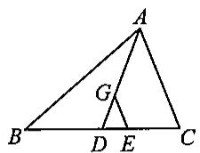  
第1题图

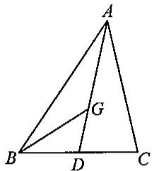  
第3题图

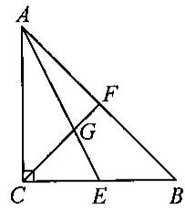  
第4题图

2.如果三角形的重心在它的一条高所在的直线上，那么这个三角形一定是 （）

(A)等腰三角形；

(B)直角三角形；

(C)等边三角形；

(D)等腰直角三角形.

3.如图，  $G$  是  $\triangle ABC$  的重心，  $S_{\triangle ABC} = 6$  ，则  $S_{\triangle GBD}$  等于 （）

(A)  $\frac{4}{3}$ ;

(B)1;

(C)2;

(D)以上答案都不对.

4.如图，等腰直角三角形ABC的中线AE、CF相交于点  $G$  ，若斜边AB的长为6，则AG长为（）

(A)3;

(B)  $3\sqrt{2}$ ;

(C)  $\sqrt{13}$ ;

(D)  $\sqrt{10}$ .

# 二、填空题

5. 如图, 在  $\triangle ABC$  中, 已知  $AB = AC = 17$ ,  $BC = 16$ , 点  $M$  是  $\triangle ABC$  的重心, 则  $AM$  的长是  
6. 已知点  $G$  是等边三角形  $ABC$  的重心,  $AG = 8$ , 则点  $G$  与边  $BC$  中点之间的距离是  
7. 如果直角三角形的斜边长为 18, 那么这个直角三角形的重心到直角顶点的距离为  
8. 如图， $O$  是  $\triangle ABC$  的重心， $S_{\triangle ABC} = 9 \, \text{cm}^2$ ，则  $S_{\triangle BCO} =$  ________.  
9. 在 Rt $\triangle ABC$  中,  $\angle C = 90^\circ, AB = 12, BD, AE$  是中线, 且  $BD$  和  $AE$  相交于点  $G$ , 则  $CG = \_$

  
第5题图

# 三、解答题

10. 如图,  $\triangle ABC$  中,  $AB = AC$ ,  $AD$  是高,  $BE$  是中线,  $AD$ ,  $BE$  交于点  $F$ ,  $BC = 10$ ,  $AF = 8$ , 求  $AB$  的长.

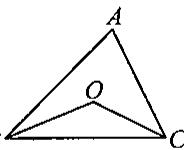  
第8题图

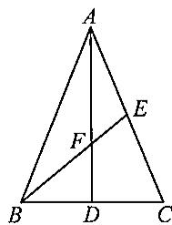  
第10题图

11. 如图, 在  $\triangle ABC$  中,  $AB = AC, BC = 6\mathrm{cm}, AB = 5\mathrm{cm}, AD$  是底边  $BC$  上的高,  $BE$  是  $AC$  边上的中线,  $BE$  与  $AD$  相交于点  $G$ , 求  $BE$  的长.

  
第11题图

12. 在  $\triangle ABC$  中,  $BC = 3, AC = 4, BC$  和  $AC$  边上的中线  $AE, BD$  互相垂直, 求  $AB$  的长.

# 思维与拓展7

如图，在  $\triangle ABC$  中，  $AB > AC,AD$  平分  $\angle BAC,BE\bot AD$  交  $AD$  的延长线于点  $E,M$  是  $BC$  的中点.求证：  $EM = \frac{1}{2} (AB - AC)$

# 习题23.4

# 一、选择题

1. 已知三角形的三条中位线长分别为  $3\mathrm{cm}, 4\mathrm{cm}, 5\mathrm{cm}$ ，则这个三角形最长的边的边长是（）

(A)  $6\mathrm{cm}$

(B)8 cm;

(C)  $10~\mathrm{cm}$ ;

(D)  $12\mathrm{cm}$

2. 在  $\triangle ABC$  中，点  $D, E, F$  分别为三边  $BC, AB, AC$  的中点，若  $AD = EF$  ，则  $\triangle ABC$  是 （ ）

(A)等腰直角三角形；

(B)等腰三角形；

(C)等边三角形；

(D)无法确定.

3.如图，在△ABC中，  $G$  是三角形的重心，  $AG\bot GC,AG = 6^{\circ},GC = 8$  ，则BG的长为 （）

(A)6;

(B)8

(C)10;

(D)12.

  
第3题图

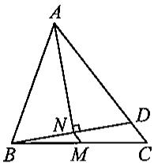  
第4题图

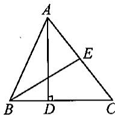  
第5题图

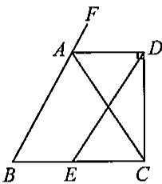  
第6题图

4. 如图，在  $\triangle ABC$  中， $M$  是  $BC$  的中点， $AN$  平分  $\angle BAC, BN \perp AN$  于点  $N$ . 已知  $AB = 10, MN = 3, BC = 15$ ，则  $\triangle ABC$  的周长为 （）

(A)28;

(B)31;

(C)40;

(D)41.

5. 如图, 在  $\triangle ABC$  中,  $AD$  是  $BC$  边上的高,  $BE$  是  $AC$  上的中线, 且  $AD = BE$ , 则  $\angle EBC$  的度数为 ( )

(A)  $15^{\circ}$ ;

(B)  $30^{\circ}$ ;

(C)  $45^{\circ}$ ;

(D)  $60^{\circ}$ .

6. 如图, 已知  $AD$  是  $\triangle ABC$  的外角  $\angle FAC$  的平分线,  $CD \perp AD$ ,  $E$  为  $BC$  的中点,  $AB = 13$ ,  $AC = 12$ , 则  $DE$  的长度为

(A)13;

(B)12;

(C)  $\frac{25}{2}$ ;

(D) 10.

# 二、填空题

7. 三角形各边的长分别为  $5\mathrm{cm},12\mathrm{cm}$  和  $13\mathrm{cm}$ ，则连接各边中点所成三角形的周长为  
8. 顺次连结三角形三边中点所成三角形的周长是12，则原三角形的周长为  
9. 三角形一条中位线分三角形所成的新三角形与原三角形面积之和为  $60 \mathrm{~cm}^{2}$ , 则原三角形的面积为  
10. 如图, 在四边形  $ABCD$  中,  $P$  是对角线  $BD$  的中点,  $E, F$  分别是  $AB, CD$  的中点,  $AD = BC$ ,  $\angle EPF = 150^\circ$ , 则  $\angle PFE$  的度数是  
11. 直角三角形斜边长为 6 , 则三角形的重心到斜边中点的距离为  
12. 如图, 已知  $\triangle ABC$  的周长为 1 , 连接  $\triangle ABC$  的三边中点构成第 2 个三角形, 再连接第 2 个三角形的三边中点构成第 3 个三角形, 依此类推, 第 2026 个三角形的周长是

  
第10题图

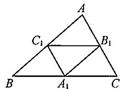

  
第12题图

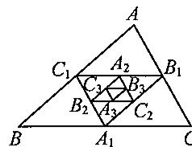

# 三、解答题

13. 如图, 在  $\triangle ABC$  中, 点  $M$  为  $BC$  的中点,  $AD$  平分  $\angle BAC$ ,  $BD \perp AD$ . 求证:  $\angle BMD = \angle C$ .

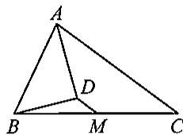  
第13题图

14. 如图, 在  $\triangle ABC$  中, 点  $F$  为  $BC$  的中点, 点  $D, E$  为  $\triangle ABC$  外的两点,  $\angle ADB = 90^\circ$ ,  $AD = DB$ ,  $\angle AEC = 90^\circ$ ,  $AE = EC$ . 求证:  $DF = EF$ .

  
第14题图

15. 如图①，对一个直角三角形，设计一种方案，将它分成若干块，再拼成一个与原三角形面积相等的矩形，请在图中画出分割的示意图；

如图②，对任意三角形，将它分成若干块，再拼成一个与原三角形面积相等的矩形，请在图中画出分割的示意图；  
如图③，对任意四边形，将它分成若干块，再拼成一个与原四边形面积相等的矩形，请在图中画出分割的示意图.

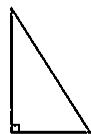  
图  $①$

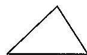  
图②

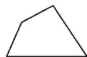  
图③  
第15题图

# 第23章 复习(1)

# 一、选择题

1. 下列条件能判断四边形是平行四边形的是 （）

(A)一条对角线平分另一条对角线；  
(B)一组对边平行, 另一组对边相等;  
(C)一组对边相等，一条对角线被另一条对角线平分；  
(D)一组对边平行, 一条对角线被另一条对角线平分.

2.如图，在平行四边形ABCD中，  $AC$  与BD相交于点  $o$  ，则下列结论不一定成立的是 （）

(A)  $BO = DO$  
(B)  $CD = AB$  
(C)  $\angle BAD = \angle BCD$ ;  
(D)  $AC = BD$

  
第2题图

3. 平行四边形的一条边长为 10 ,则它的两条对角线长度可能是 (   )

(A)4与6；

(B)20与30；

(C)6与8；

(D)8 与 12.

4.下列几组条件中，能判定一个四边形是平行四边形的条件是 （）

(A)两条对角线互相垂直；

(B)两条对角线相等；

(C)两条对角线互相平分；

(D)两条对角线互相垂直且相等

# 二、填空题

5. 已知  $\square ABCD$  对角线  $AC, BD$  相交于点  $O$ , 若  $\triangle AOB$  面积为 2, 则  $\square ABCD$  的面积为  
6. 若平行四边形中两个内角的度数比为  $1:3$ ，则其中较小的内角度数是  
7. 若一个平行四边形对角线长分别为 12、20，一边长为 8，则另一边长为 _______.  
8. 在  $\square ABCD$  中,  $\angle A + \angle C = 140^{\circ}$ , 则  $\angle B =$  
9. 如果平行四边形的一组对角互补，那么这个平行四边形的四个角都是  
10. 在周长为 28 的平行四边形  $ABCD$  中, 如果  $AB:BC = 4:3$ , 那么  $CD =$  ________.  
11. 在  $\square ABCD$  中, 对角线  $AC, BD$  相交于点  $O$ ,  $\triangle ABC$  是边长为 2 的等边三角形, 则  $\square ABCD$  的面积为  
12. 在  $\square ABCD$  中, 对角线  $AC, BD$  相交于点  $O$ ,  $AC \perp BD$ ,  $AC = 6$ ,  $BD = 8$ , 则  $\square ABCD$  中  $AB$  边上的高为

# 三、解答题

13. 如图, 已知  $\triangle ABC$  中,  $\angle ACB = 90^\circ$ , 点  $D, E$  分别是  $AC, AB$  的中点, 点  $F$  在  $BC$  的延长线上, 且  $\angle CDF = \angle A$ . 求证: 四边形  $DECF$  是平行四边形.

  
第13题图

14. 已知  $BD$  垂直平分  $AC, \angle BCD = \angle ADF, AF \perp AC$ .

(1)证明：四边形ABDF是平行四边形；  
(2) 若  $AF = DF = 5, AD = 6$ ，求  $AC$  的长.

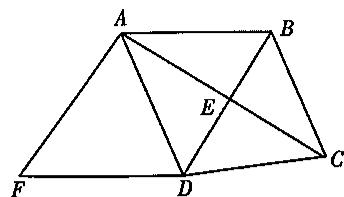  
第14题图

15. 如图①,  $l_{1}, l_{2}, l_{3}, l_{4}$  是一组平行线, 相邻两条平行线间的距离都是 1 个单位长度, 正方形  $AB-CD$  的 4 个顶点  $A, B, C, D$  都在这些平行线上, 过点  $A$  作  $AF \perp l_{3}$  于点  $F$ , 交  $l_{2}$  于点  $H$ , 过点  $C$  作  $CE \perp l_{2}$  于点  $E$ , 交  $l_{3}$  于点  $G$ .

(1)求证：△ADF≌△CBE;  
(2)求正方形ABCD的面积；  
(3)如图②，如果四条平行线不等距，相邻的两条平行线间的距离依次为  $h_1,h_2,h_3$  ，试用  $h_1,h_2$  、 $h_3$  表示正方形ABCD的面积S.

  
图  $①$

  
图  $②$  
第15题图

# 第23章 复习(2)

# 一、选择题

1.矩形、菱形、正方形都具有的性质是 （）

(A)两条对角线相等；

(B)对角线互相平分；

(C)对角线平分一组对角；

(D)对角线互相垂直.

2. 矩形的边长为  $10 \mathrm{~cm}$  和  $15 \mathrm{~cm}$ , 其中一个内角平分线将长边分成两部分, 这两部分的长分别为 ( )

(A)  $6\mathrm{cm}$  和  $9\mathrm{cm}$

(B)  $5\mathrm{cm}$  和  $10~\mathrm{cm}$

(C)  $4\mathrm{cm}$  和  $11\mathrm{cm}$

(D)  $7\mathrm{cm}$  和  $8\mathrm{cm}$

3.下列命题是真命题的是 （）

(A)对角线相等的四边形是矩形；

(B)对角线互相垂直的四边形都是菱形；

(C)对角线互相平分的四边形是平行四边形；

(D)对角线互相垂直平分的四边形是正方形.

4.顺次连接一个四边形各边中点，所得的四边形是正方形，那么这个四边形必是 （）

(A)矩形；

(B)菱形；

(C)正方形；

(D)对角线互相垂直且相等的四边形

# 二、填空题

5. 如果正方形  $ABCD$  的对角线  $AC = \sqrt{6}$ , 那么正方形  $ABCD$  的面积为  
6.如果矩形的对角线与一边的夹角为  $30^{\circ}$  ，对角线长为2，那么矩形的周长是  
7. 如图, 在菱形  $ABCD$  中,  $E, F$  分别是  $AB, AC$  的中点, 如果  $EF = 2$ , 那么菱形  $ABCD$  的周长是  
8. 在  $\mathrm{Rt}\triangle ABC$  中,  $\angle C = 90^{\circ}, AB = 12, BD, AE$  是中线, 且  $BD$  和  $AE$  相交于点  $G$ , 则  $CG = \_$  
9. 如果周长是  $12 \mathrm{~cm}$  的菱形的一条较短的对角线长是  $3 \mathrm{~cm}$ , 那么这个菱形较大的内角是  
10. 如图所示, 首先将一张正方形的纸片 (如图①) 按顺序三次折叠, 然后沿第三次折痕剪下一个四边形, 这个四边形一定是______（填一种特殊四边形名称）.

  
图  $①$

  
图  $②$

  
图  $③$

  
图  $④$

11. 如图, 在 Rt $\triangle ABC$  中,  $\angle ACB = 90^\circ, AC = 4, BC = 3, D$  为斜边  $AB$  上一动点, 以  $CD, CB$  为边作平行四边形  $CDEB$ , 当  $AD =$  ________时, 平行四边形  $CDEB$  为菱形.

  
第10题图  
第11题图

  
第12题图

12. 如图, 正方形  $ABCD$  经过旋转与正方形  $CEFD$  重合, 满足条件的旋转中心有 ______ 个.

# 三、解答题

13. 正方形  $ABCD$  的边长是  $6, F$  是  $AD$  上一点， $E$  为  $AB$  延长线上一点，且  $\angle FCE = 90^\circ$ .

(1)求证：  $\angle CFE = \angle CEF$  
(2)求四边形  $AECF$  的面积

  
第13题图

14. 已知: 如图, 四边形  $ABCD$  中,  $M, N$  分别为  $AD, BC$  边的中点. 求证:  $AB + DC \geqslant 2MN$ .

  
第14题图

# 思维与拓展8

准备一张矩形纸片和一张平行四边形纸片，尝试以下操作：

1. 把平行四边形割补成一个矩形, 怎样操作能使分割线的条数最少?  
2. 把矩形纸片割补成有一个角为  $60^{\circ}$  的平行四边形, 怎样操作能使分割线最少?

通过上述操作，你获得哪些经验？请与同学交流；

试一试：如图，四边形ABCD和CEFG均为正方形，请把它分割成一个更大的正方形，并使分割线的条数最少.

# 挑战压轴题23

1. 如图,  $\triangle ABC$  是等边三角形, 点  $D$  在边  $BC$  上, 且  $\triangle ADE$  是等边三角形, 边  $DE$  与  $AC$  相交于点  $O$ . 过点  $E$  作  $EF \parallel BC, EF$  分别与线段  $AB, AC, AD$  相交于点  $F, G, H$ , 连接  $CE$ .

(1)求证：四边形BCEF是平行四边形；  
(2) 连接  $DG$ , 如果  $AD \perp BC$ , 求证: 四边形  $D G E C$  是菱形.

  
第1题图

2. 如图①, 在梯形  $ABCD$  中,  $AD \parallel BC$ ,  $AB = CD$ ,  $\angle ABC = 60^\circ$ ,  $AD = 5$ ,  $BC = 13$ , 点  $O$  是对角线  $BD$  的中点. 点  $E$  为  $BC$  上一动点, 连接  $EO$ .

(1)求  $AB$  的长；  
(2)如果点  $E$  为  $BC$  的中点，连接  $CO$  ，求  $\triangle OEC$  的面积；  
(3)如图②, 延长  $EO$  交射线  $DA$  于点  $F$ , 连接  $DE, BF$ , 如果  $EF$  平分  $\angle BED$ , 求四边形  $BEDF$  的周长.

  
图  $①$  
第2题图

  
图  $②$

3. 如图, 梯形  $ABCD$  中,  $AB // CD$ ,  $BC = AD$ , 点  $E$  是  $CD$  延长线上一点,  $AE = AD$ ,  $AB = 2DE = 4$ ,  $CF$  垂直于射线  $EA$ , 垂足为点  $F$ .

(1)证明：四边形ABCE是平行四边形；  
(2) 连接  $FD$ , 如果  $\triangle AFD$  是等腰三角形, 求线段  $AE$  的长度.

  
第3题图

4. 已知在四边形  $ABCD$  中,  $AB \parallel CD$ ,  $\angle A = 90^\circ$ ,  $BE$  平分  $\angle ABC$ , 交边  $AD$  于点  $E$ .

(1)如图①，如果点  $E$  与点  $D$  重合， $AD = AB$ ，求证：四边形ABCD是正方形；  
(2)如果  $AB = 5,AD = 4.$

① 如图 ②, 当  $BC = \frac{8}{3}\sqrt{3}$  时, 求  $\angle EBC$  的度数;  
② 当  $\triangle BEC$  是直角三角形时, 求  $DE$  的长.

  
图  $①$

  
图  $②$  
第4题图

# 第24章 平面直角坐标系

# 24.1 平面直角坐标系(1)

# 一、选择题

1. 点  $A(x, y)$  的坐标满足  $x = 0$ ，则点  $A$  在 （）

(A)原点；

(B)  $x$  轴上；

(C)  $y$  轴上；

(D)  $x$  轴或  $y$  轴上.

2. 点  $P(a + 1, a + 2)$  在直角坐标系的  $x$  轴上，则点  $P$  的坐标是 （）

(A)(0,2);

(B)  $(0, -2)$ ;

(C)(-1,0);

(D)(1,0).

3. 直角坐标系中, 点  $P(x, y)$  在第二象限, 且点  $P$  到  $x$  轴、 $y$  轴的距离分别为 3、7, 则点  $P$  坐标为 ( )

(A)  $(-3, -7)$ ;

(B)(-3,7);

(C)(3,7);

(D)(-7,3).

4. 若  $|a| = 5, |b| = 4$  ，且点  $M(a,b)$  在第三象限，则点  $M$  的坐标是 （）

(A)(5,4);

(B)(-5,4);

(C)(—5，一4)；

(D)(5，-4).

# 二、填空题

5. 点  $A(-3,0)$  在 上.  
6. 已知  $x$  轴上的点  $P$  到  $y$  轴的距离是 3, 则点  $P$  坐标是  
7. 平面内的每一点都对应有唯一的 _______. 在平面直角坐标系  $xOy$  中的任意一点  $P$ , 过点  $P$  分别作  $x$  轴、 $y$  轴的垂线, 它们的垂足分别为点  $M, N$ , 如果点  $M$  在  $x$  轴上所对应的实数为  $a$ , 点  $N$  在  $y$  轴上所对应的实数为  $b$ , 那么点  $P$  所对应的有序实数对  $(a, b)$  叫作点  $P$  的坐标, 记作 _______, 其中  $a$  叫作 _______ ,  $b$  叫作 _______.  
8. 若(3,5)表示礼堂的第3列第5排的位置，则(6,9)表示礼堂里第________列第________排的位置。  
9. 点  $P$  位于  $y$  轴左方, 距  $y$  轴 3 个单位长度, 位于  $x$  轴上方, 距  $x$  轴 4 个单位长度, 则点  $P$  的坐标是  
10. 已知点  $A(4,0)$  和点  $B(0,x)$  两点，且线段  $AB$  与坐标轴围成的三角形的面积为8，则  $x$  的值是

# 三、解答题

11. 写出图中各点的坐标

点  $A$  的坐标是

点  $B$  的坐标是

点  $C$  的坐标是

点  $D$  的坐标是

点  $E$  的坐标是

点  $F$  的坐标是

点  $G$  的坐标是

点  $J$  的坐标是

  
第11题图

12. 设点  $M(a, b)$  为平面直角坐标系中的点.

(1)当  $a > 0, b < 0$  时，点  $M$  位于第几象限？  
(2)当  $ab > 0$  时，点  $M$  位于第几象限？  
(3)当  $a$  为任意有理数，且  $b < 0$  时，点  $M$  位于第几象限？

13. 如图所示, 在平面直角坐标系  $xOy$  中, 先描出点  $A(-2,4), B(-2,0), C(-3,3)$ , 再求  $\triangle ABC$  的面积.

  
第13题图

14. 如图, 平面内有  $A, B, C, D, E$  共五个点, 为了描述这些点的位置:

(1)试建立平面直角坐标系；  
(2) 写出点  $A, B, C, D, E$  的坐标；  
(3) 以线段  $AB$  为一边, 画出一个平行四边形.

  
第14题图

# 24.1 平面直角坐标系(2)

# 一、选择题

1. 在平面直角坐标系中，有点  $D(0,3), E(0,-2), F(6,-2)$ ，则  $\triangle DEF$  是 （）

(A)等腰三角形；

(B)等边三角形；

(C)直角三角形；

(D)等腰直角三角形.

2. 过点  $A(-2.5,3)$  和点  $B(-2.5,6)$  作直线，则直线  $AB$  （）

(A)平行于  $y$  轴；

(B)平行于  $x$  轴；

(C)与  $y$  轴相交；

(D)与  $y$  轴垂直.

3. 过点  $(-3,2)$  且平行于  $y$  轴的直线上的点 （）

(A) 横坐标都是一3；

(B) 纵坐标都是 2;

(C)横坐标都是2；

(D) 纵坐标都是一3.

4. 已知点  $Q(2x + 4, x^2 - 1)$  在  $y$  轴上，则点  $Q$  的坐标为 （）

(A)(0,4);

(B)(4,0);

(C)(0,3);

(D)(3,0).

# 二、填空题

5. 已知点  $E(-3,0), F(2,0)$ ，则  $EF =$  ________.  
6. 已知点  $A(\sqrt{3}, \sqrt{2} - 1), B(\sqrt{3}, \sqrt{2} + 1)$ ，则  $AB =$  ________.  
7. 已知点  $A(3, -2)$ , 点  $C$  在直线  $y = -2$  上, 且  $AC = 3$ , 则点  $C$  的坐标为  
8. 已知点  $A(-2,5), AB \parallel y$  轴，且  $AB = 6$  ，则点  $B$  的坐标是  
9. 经过点  $P(5, -2)$  且垂直于  $x$  轴的直线可以表示为  
10. 在平面直角坐标系中, 已知点  $P(3 - m, 2m - 4)$  在第一象限, 则实数  $m$  的取值范围是  
11. 若点  $P(x, y)$  的坐标满足  $x + y = xy$ ，则称点  $P$  为“和谐点”，请写出一个“和谐点”的坐标，如  
12. 已知点  $A(m, -2)$ , 点  $B(4, -m + 1)$ , 且直线  $AB \parallel x$  轴, 则  $m$  的值为

# 三、解答题

13. (1) 写出图中直角坐标平面内点  $A, B, C, D, E, F$  的坐标；

(2) 写出经过  $A, M$  两点的直线的表达式

  
第13题图

14. (1) 已知点  $A(1,3), B(2,3), C(-1,3), D(-3,3)$ ，经过这些点的直线与坐标轴的位置关系如何？  
(2)已知点  $E(3,1), F(3,2), G(3,3), H(3,-2)$ ，经过这些点的直线与坐标轴的位置关系如何？

15. 已知点  $A(a - 1, -2), B(-3, b + 1)$ ，根据以下要求，确定  $a, b$  的值

(1)直线  $AB / / y$  轴；  
(2) 直线  $AB \parallel x$  轴.

16. 如图, 求  $\triangle ABC$  的面积

  
第16题图

# 思维与拓展9

按要求写出棋子的位置（坐标）：

(1)图中棋子的位置（坐标）：

将 ，帅 ，马 ，士相 ；

(2)士再走一步后的位置是  
(3)相再走一步后可能的位置是  
(4)马再走一步后可能的位置是

# 24.1 平面直角坐标系(3)

# 一、选择题

1. 如图，在平面直角坐标系中，点  $O$  为坐标原点，点  $P, Q$  都在格点处，点  $P$  的坐标为(2,1)，则点  $Q$  的坐标为 （）

(A)(3,0);

(B)(0,2);

(C)(3,2)；

(D)(1,2).

  
第1题图

  
第2题图

  
第3题图

  
第4题图

2. 为培养青少年的科学态度和科学思维，某校创建了“科技创新”社团。小红将“科”“技”“创”“新”写在如图所示的方格纸中，若建立平面直角坐标系，使“创”“新”的坐标分别为  $(-2,0), (0,0)$ ，则“技”所在的象限为

(A)第一象限；

(B)第二象限；

(C)第三象限；

(D)第四象限.

3. 如图, 小明从点  $O$  出发, 先向西走 40 米, 再向南走 30 米到达点  $M$ , 如果点  $M$  的位置用  $(-40,-30)$  表示, 那么 (10,20) 表示的位置是

(A)点  $A$

(B)点  $B$

(C)点  $C$

(D)点  $D$

4. 蝴蝶是一种日间飞行的昆虫, 属于节肢动物, 如图是一只蝴蝶标本, 建立平面直角坐标系后, 该蝴蝶两“翅膀中部”  $A, B$  两点的坐标分别为  $(-2,1)$  和  $\left(1, \frac{5}{2}\right)$ , 则表示蝴蝶“头部”  $C$  点的坐标为 ( )

(A)  $\left(\frac{3}{2}, - 1\right);$

(B)  $\left(-1, \frac{3}{2}\right)$ ;

(C)  $\left(\frac{5}{2}, - 2\right)$

(D)  $\left(2, -\frac{5}{2}\right)$ .

# 二、填空题

5.  $A$  军团、 $B$  军团、 $C$  军团相对位置如图所示，每个小方格边长为1个单位长度，若建立如图所示的平面直角坐标系，则  $A$  军团的坐标为 _______， $B$  军团的坐标为 _______， $C$  军团的坐标为 _______。

  
第5题图

  
第6题图

6. 如图.

(1)若村庄  $A$  表示为(1,1)，工厂  $B$  表示为(3,3)，则学校  $C$  表示为  
(2)若学校  $C$  表示为  $(0,0)$ ，工厂  $B$  表示为  $(3,-1)$ ，则村庄  $A$  表示为

7. 如图，在一个平面区域内，一台雷达探测器测得在点  $A, B, C$  处有目标出现，按某种规则，点  $A, B$  的位置可以分别表示为  $(1,90^{\circ})$ ,  $(2,240^{\circ})$ ，则点  $C$  的位置可以表示为 ______.

  
第7题图

  
第8题图

8. 在一次寻宝游戏中，寻宝人找到了如图所示的两个标志点  $A(2,3), B(4,1)$ ，这两个标志点到“宝藏”点的距离都是 2，则“宝藏”点的坐标是

# 三、解答题

9. 园林部门为了对市内某旅游景区内的古树名木进行系统养护，建立了相关的地理信息系统，其中一项工作就是要确定这些古树的位置，已知该旅游景区有树龄百年以上的古松树4棵  $(S_{1}, S_{2}, S_{3}, S_{4})$  、古槐树6棵  $(H_{1}, H_{2}, H_{3}, H_{4}, H_{5}, H_{6})$  。为了加强对这些古树的保护，园林部门根据该旅游景区地图，将4棵古松树的位置用坐标表示为  $S_{1}(-4,3), S_{2}(-2,4), S_{3}(4,0), S_{4}(4,5)$  。

(1)请在图中画出对应的平面直角坐标系；  
(2)在所建立的平面直角坐标系中，写出6棵古槐树的位置的坐标；  
(3)已知  $S_{1}$  在  $H_{5}$  的北偏西  $45^{\circ}, 5.4$  米处，试用方向角和距离描述  $H_{5}$  相对于  $S_{1}$  的位置.

  
第9题图

10. 已知梯形  $ABCD$  如图所示,  $AD \parallel BC, AB \perp BC, AD = 4, BC = 6, AB = 3$ .

(1)请建立恰当的直角坐标系，并写出4个顶点的坐标；  
(2)若要使点  $A$  的坐标为  $(-3,3)$ ，该如何建立直角坐标系？

  
第10题图

# 习题24.1

# 一、选择题

1.如图，在平面直角坐标系中，坐标为  $(-2,3)$  的是 （）

(A)  $A$  点；

(B)  $B$  点；

(C)  $C$  点；

(D)  $D$  点.

2. 在平面直角坐标系中，点  $P(m^{2} + 2026, -2026)$  一定在 （）

(A)第一象限；

(B)第二象限；

(C)第三象限；

(D)第四象限.

3. 已知  $a + b > 0, ab > 0$ ，则在如图所示的平面直角坐标系中，小手盖住的点的坐标可能是（）

(A)  $(a,b)$ ;

(B)  $(-a, b)$ ;

(C)  $(-a, -b)$ ;

(D)  $(a, -b)$ .

  
第1题图

  
第3题图

  
第5题图

4. 在平面直角坐标系中, 有  $A(-2, b + 1), B(a - 5, 8)$  两点, 当  $AB \parallel x$  轴时, 点  $B$  在点  $A$  的右侧, 且  $A, B$  两点间的距离是 6 , 则  $a + b$  的算术平方根是 ( )

(A)  $\pm 2$

(B)2;

(C)±4;

(D)4.

5. 如图, 所有正方形的中心均在坐标原点, 且各边与  $x$  轴或  $y$  轴平行, 从内到外, 它们的边长依次为  $2, 4, 6, 8, \cdots$ , 顶点依次用  $A_{1}, A_{2}, A_{3}, A_{4}, \cdots$  表示, 则顶点  $A_{55}$  的坐标为 ( )

(A)(13,13);

(B)(-13，-13)；

(C)(14,14)；

(D)  $(-14, -14)$ .

# 二、填空题

6. 已知点  $A(-3,2), B(3,2)$ ，则  $A, B$  两点之间的距离为 _______.  
7. 若点  $O(-a + 1,3b - 5)$  是坐标原点，则点  $A(a,b)$  在第 象限  
8. 已知点  $A(2, n), B(m, -4)$  不重合。若线段  $AB \parallel x$  轴，且  $A, B$  到  $y$  轴的距离相等，则  $m = \_$ ， $n = \_$ ；若线段  $AB \parallel y$  轴，且  $A, B$  到  $x$  轴的距离相等，则  $m = \_$ ， $n = \_$ 。  
9. 如图, 在平面直角坐标系中, 正方形  $ABCD$  的面积为 16, 点  $A$  的坐标为  $(1,0)$ , 则点  $C$  的坐标为

  
第9题图

  
第10题图

10. 如图,  $A 、 B$  两点的坐标分别为  $(2,4), (6,0)$ , 点  $P$  是  $x$  轴上一点, 且三角形  $ABP$  的面积为 6 , 则点  $P$  的坐标为

11. 某中学参加运动会开幕式表演, 为了使表演方队整齐有序, 需要在操场上标记若干个关键点, 如图是几个关键点的位置, 若建立平面直角坐标系, 点  $A$  的坐标为  $(1,0)$ , 点  $B$  的坐标为  $(-1,3)$ , 则点  $C$  的坐标为

  
第11题图

  
第12题图

12. 如图，在中国象棋的残局上建立平面直角坐标系，如果“相”和“兵”的坐标分别是(3，-1)和(-3,1)，那么“卒”的坐标为

# 三、解答题

13. 在平面直角坐标系中, 已知点  $M(m - 2, 2m - 7)$ .

(1) 若点  $M$  在  $x$  轴上, 求  $m$  的值和点  $M$  的坐标;  
(2) 若点  $M$  在  $y$  轴上, 求  $m$  的值和点  $M$  的坐标.

14. 如图, 将直角三角形  $ABC$  放在平面直角坐标系中,  $\angle C = 90^\circ$ ,  $AC \parallel y$  轴,  $BC \parallel x$  轴, 点  $C(2,1)$ . 若  $AC = 3$ ,  $BC = 4$ , 求点  $A, B$  的坐标.

  
第14题图

# 思维与拓展10

如图，观察下列各点的排列规律：  $A(0,1),A_{1}(2,0),A_{2}(3,2),A_{3}(5,1),A_{4}(6,3),\dots .$

# 【归纳·应用】

(1)直接写出点  $A_{6}$  的坐标为 ，点  $A_{12}$  的坐标为  
(2) 若点  $A_{2n}$  的坐标为  $(3036, 1013)$ , 求  $n$  的值.

# 24.2 两点间的距离公式

# 一、选择题

1. 在平面直角坐标系中，点  $M(3,6)$  和点  $N(-3, - 2)$  之间的距离  $MN$  是 （）

(A)20;

(B)15;

(C)10;

(D)5.

2. 平面直角坐标系中，点  $P$  在  $x$  轴上，且到点  $A(1,2)$  的距离为  $\sqrt{5}$ ，则点  $P$  的坐标为 （）

(A)(2,0);

(B)(2,0)或(0,0);

(C)  $(0, -2)$ ;

(D)(0,6).

3.已知点  $A(2,3),B(-1, - 3),C(-3, - 7)$  ，则这三点的位置关系是 （）

(A)在同一直线上；

(B)是直角三角形的顶点；

(C)是等边三角形的顶点；

(D) 以上都不对.

# 二、填空题

4. 在  $y$  轴上且到原点距离为6的点的坐标为  
5. 点  $P(-3,4)$  到原点的距离是  
6. 已知点  $P$  在  $x$  轴的正半轴上且到  $y$  轴的距离为 5, 则点  $P$  的坐标为  
7. 在平面直角坐标系中, 已知点  $A$  和点  $B$  的坐标分别是  $(0,-6),(1,0)$ , 则  $\triangle AOB$  的周长是  
8. 已知  $\triangle ABC$  三个顶点的坐标分别是  $A(9, -9)$ ,  $B(13, -4)$ ,  $C(8, 0)$ ，则  $\triangle ABC$  是三角形。  
9. 如图, 在平面直角坐标系中, 已知点  $A(-2\sqrt{2}, 0)$  和点  $B(-\sqrt{2}, \sqrt{2})$ , 则  $\triangle AOB$  的边  $AB$  上的高为

# 三、解答题

10. 在平面直角坐标系中, 已知点  $A(-1,2)$  和点  $B(4,2)$ , 在  $x$  轴上找一点  $C$ , 使  $\angle ACB = 90^\circ$ , 求点  $C$  的坐标.

  
第9题图

11. 在如图所示的直角坐标平面内, 已知点  $A$  的坐标为  $(-3,4)$ , 点  $B$  的坐标为  $(8,6)$ , 点  $O$  为坐标原点.

(1) 试判断  $\triangle AOB$  的形状，并说明理由；  
(2)求边  $AB$  上中线的长.

  
第11题图

12. 已知直角坐标平面内有三点  $A(3,2), B(-1,-2), C(-3,0)$ ，试判断以这三点为顶点的  $\triangle ABC$  的形状：

13. 在平面直角坐标系  $xOy$  中, 对于任意两点  $P_{1}(x_{1}, y_{1})$  与  $P_{2}(x_{2}, y_{2})$  的直角距离, 给出如下定义: 若  $|x_{1} - x_{2}| \geqslant |y_{1} - y_{2}|$ , 则点  $P_{1}(x_{1}, y_{1})$  与点  $P_{2}(x_{2}, y_{2})$  的直角距离为  $|x_{1} - x_{2}|$ ; 若  $|x_{1} - x_{2}| < |y_{1} - y_{2}|$ , 则点  $P_{1}(x_{1}, y_{1})$  与点  $P_{2}(x_{2}, y_{2})$  的直角距离为  $|y_{1} - y_{2}|$ . 已知点  $A(-1,0)$ .

(1)若点  $B(3,1)$ ，则  $A,B$  两点的直角距离为 ______. 若点  $C(1,3)$ ，则  $A,C$  两点的直角距离为 ______；  
(2)点  $D$  为  $y$  轴上的一个动点.

①当  $A, D$  两点的直角距离为2时，写出满足条件的点  $D$  的坐标：  
②直接写出  $A, D$  两点的直角距离的最小值：

(3) 若点  $M$  的坐标为  $(m, n)$ , 且满足  $n = 3m - 1$ , 求  $A, M$  两点的直角距离的最小值.

# 思维与拓展 11

已知  $\triangle ABC$  为等腰三角形，点  $A, B$  的坐标分别为  $(1,0), (4,4)$ ，点  $C$  在  $x$  轴上，求点  $C$  的坐标.

# 24.3 平移与轴对称(1)

# 一、选择题

1. 已知平面直角坐标系内的  $\triangle ABC$ ，点  $C$  的坐标为(4,4)，将  $\triangle ABC$  向下平移5个单位长度，则平移后  $C$  点的坐标是 （）

(A)(9,4);

(B)(1,4);

(C)(4，-1)；

(D)(4,9).

2. 将点  $P(3, -5)$  先向左平移 2 个单位长度，再向上平移 4 个单位长度，则得到的点的坐标为（）

(A)(5,-1);

(B)(1，-9)；

(C)(1，-1)；

(D)(5，-9).

3. 点  $A(x, y)$  先向左平移 2 个单位长度，再向下平移 3 个单位长度，到达点的坐标是 （）

(A)  $(x + 2, y + 3)$ ;

(B)  $(x + 2, y - 3)$ ;

(C)  $(x - 2, y + 3)$ ;

(D)  $(x - 2, y - 3)$ .

4. 点  $A(2a - 4, a + 5)$  向下平移 2 个单位长度到点  $B$ ，若点  $B$  在  $x$  轴上，则点  $A$  的坐标是（）

(A)(2,8);

(B)(0,8);

(C)(-10,2);

(D)(-10,0).

# 二、填空题

5. 点  $P(0,0)$  向右平移7个单位长度所对应的点的坐标是

6. 点  $P(0,0)$  向下平移7个单位长度所对应的点的坐标是

7. 点  $A(-2,3)$  向上平移 5 个单位长度后的坐标是 ______ ，落在第 ______ 象限.

8. 点  $B(5, -6)$  向左平移3个单位长度后的坐标是 , 落在第象限.

9. 点  $C(-1,4)$  向下平移3个单位长度，向右平移4个单位长度后的坐标是 ______ ，落在第 ______ 象限.

10. 点  $D(3, -4)$  向 ______ 平移 ______ 个单位长度后，正好落在  $x$  轴上，坐标是 ______；点  $D(3, -4)$  向 ______ 平移 ______ 个单位长度后，正好落在  $y$  轴上，坐标是 ______。

11. 已知点  $A(-1,2)$ , 点  $B(2, -6)$ , 线段  $AB$  向下平移 4 个单位长度后得到  $A'B'$ , 则点  $A'$  的坐标是 , 点  $B'$  的坐标是

12. 已知  $\triangle ABC$ ，点  $A(-2,3), B(-1,1), C(2,5)$ ，现将  $\triangle ABC$  平移，使点  $A$  到点  $A_{1}(-4,4)$  的位置上，则点  $B_{1}$  的坐标是 _______，点  $C_{1}$  的坐标是 _______.

# 三、解答题

13. 如图, 将  $\triangle ABC$  向右平移 2 个单位长度, 再向下平移 3 个单位长度, 得到对应的  $\triangle A_{1}B_{1}C_{1}$ , 请分别写出点  $A_{1}, B_{1}, C_{1}$  的坐标.

  
第13题图

14. 点  $A(a, b)$  向右平移 3 个单位长度，再向下平移 2 个单位长度，到达点  $(1, -1)$ ，求  $a, b$  的值.

15. 如图,  $\triangle DEF$  是  $\triangle ABC$  经过某种变换后得到的图形, 分别写出点  $A$  与点  $D$ , 点  $B$  与点  $E$ , 点  $C$  与点  $F$  的坐标, 并观察它们的关系. 如果  $\triangle ABC$  中任一点  $M$  的坐标是  $(x, y)$ , 那么它的对应点  $N$  的坐标是什么?

  
第15题图

16. 如图, 在平面直角坐标系中, 第一次将  $\triangle OAB$  变换成  $\triangle OA_{1}B_{1}$ , 第二次将  $\triangle OA_{1}B_{1}$  变换成  $\triangle OA_{2}B_{2}$ , 第三次将  $\triangle OA_{2}B_{2}$  变换成  $\triangle OA_{3}B_{3}$ , 第四次将  $\triangle OA_{3}B_{3}$  变换成  $\triangle OA_{4}B_{4}$ .

  
第16题图

(1) 观察每次变换前后的三角形的变化规律, 若将 \(\triangle O A_{4} B_{4}\) 变换成 \(\triangle O A_{5} B_{5}\), 则 \(A_{5}\) 的坐标是 \_, B_{5}\) 的坐标是  
(2)若按第(1)问找到的规律将  $\triangle OAB$  进行  $n$  次变换，得到  $\triangle OA_{n}B_{n}$ ，比较每次变换中三角形顶点坐标有何变化，找出规律，推测  $A_{n}$  的坐标是 ， $B_{n}$  的坐标是

# 24.3 平移与轴对称(2)

# 一、选择题

1. 平面直角坐标系中，点  $P$  的坐标为  $(-4,3)$ ，则点  $P$  关于  $y$  轴对称的点的坐标是 （）

(A)(4,3);

(B)(-4，-3)；

(C)(3，-4)；

(D)(-4,5).

2.点  $P_{1}(-5,2)$  与点  $P_{2}(5, - 2)$  （

(A)关于  $x$  轴对称；

(B)关于  $y$  轴对称；

(C)关于原点对称；

(D) 以上都不对.

3.点  $A(a, - b)$  关于  $\mathcal{X}$  轴对称的点的坐标是 （）

(A)  $(a, -b)$ ;

(B)  $(-a, -b)$ ;

(C)  $(a,b)$ ;

(D)  $(-a, b)$ .

4.点  $P(\sqrt{2}, - \sqrt{2} +1)$  与点  $Q(-\sqrt{2},1 - \sqrt{2})$  关于下列对称的是 （）

(A)  $x$  轴；

(B)  $y$  轴；

(C)原点；

(D)直线  $y = -\sqrt{2} +1.$

# 二、填空题

5. 点  $A(0, -2)$  关于  $x$  轴的对称点的坐标是  
6. 点  $B(3,0)$  关于  $y$  轴的对称点的坐标是  
7. 直角坐标系内，点  $(-4, 2)$  和点  $(-4, -2)$  之间的距离是  
8. 在平面直角坐标系中, 有一点  $P(-4,2)$ , 若将点  $P$  向右平移 2 个单位长度, 再向上平移 1 个单位长度, 所得点  $P'$  的坐标为  
9. 如果点  $C$  在第四象限, 那么与点  $C$  关于原点  $O$  对称的点在第 象限.  
10. 点  $A(a,2),B(5,b)$  关于原点对称，则  $2a - 3b =$  
11. 点  $A(a, a + 5)$  向右平移 6 个单位长度到达点  $B$ , 点  $A$  与点  $B$  恰好关于  $y$  轴对称, 则点  $A$  的坐标是  
12. 点  $A(a, a + 5)$  向下平移 8 个单位长度到达点  $B$ , 点  $A$  与点  $B$  恰好关于  $x$  轴对称, 则点  $A$  的坐标是

# 三、解答题

13. 如图, 画出四边形  $OABC$  关于原点  $O$  对称的四边形  $OHMN$ , 再写出这两个四边形的顶点坐标.

A ,B ,C H ,M ,N

  
第13题图

14. 在平面直角坐标系中, 点  $A(a, -3)$  关于原点对称的点的坐标是  $B(1, b - 1)$ , 求点  $C(a, -b)$  关于  $y$  轴的对称点  $D$  的坐标.

15.  $\triangle ABC$  在直角坐标系内的位置如图所示

(1)分别写出点  $A,B,C$  的坐标；  
(2)把  $\triangle ABC$  向右平移2个单位长度得到  $\triangle A_{1}B_{1}C_{1}$ , 写出点  $A_{1}, B_{1}, C_{1}$  的坐标;  
(3) 若  $\triangle A_{2}B_{2}C_{2}$  与  $\triangle A_{1}B_{1}C_{1}$  关于原点对称, 写出点  $A_{2}, B_{2}, C_{2}$  的坐标.

  
第15题图

# 思维与拓展 12

如图，平行四边形ABCD的顶点A、B、D的坐标分别为A(0,0)，B(2,2)，D(4，-3).

(1)求点  $C$  的坐标；  
(2)求平行四边形ABCD的面积

# 习题24.2—24.3

# 一、选择题

1. 点  $M(-4,3)$  离原点的距离是 （）

(A)5;

(B)4;

(C)3;

(D)7.

2. 线段  $MN$  在直角坐标系中的位置如图所示，线段  $M_{1}N_{1}$  与  $MN$  关于  $y$  轴对称，则点  $M$  的对应的点  $M_{1}$  的坐标为 （）

  
第2题图

(A)(4,2);  
(B)(—4,2)；  
(C)(—4，—2）；  
(D)(4，一2).

3. 设平面直角坐标系的轴以  $1\mathrm{cm}$  作为长度单位，  $\triangle PQR$  的顶点坐标为  $P(0,3),Q(4,0),R(k,5)$  其中  $0 < k < 4$  ，若该三角形的面积为  $8\mathrm{cm}^2$  ，则  $k$  的值是 （）

(A)1;

(B)  $\frac{8}{3}$ ;

(C)2;

(D)  $\frac{1}{2}$ .

4. 如果矩形  $ABCD$  的对角线的交点与平面直角坐标系的原点重合，且点  $A$  和点  $B$  的坐标分别为  $(-3,2)$  和  $(3,2)$ ，那么矩形的面积为 （）

(A)32;

(B)24;

(C)6;

(D)8.

5. 在平面直角坐标系中, 线段  $CD$  是由线段  $AB$  平移得到的, 点  $A(-1,4)$  的对应点为  $C(4,2)$ , 则点  $B(-4,-1)$  的对应点  $D$  的坐标为 ( )

(A)(1,1);

(B)(1，-3)；

(C)(-1，-3)；

(D)(-1,1).

# 二、填空题

6. 已知：点  $A(-1,1)$ ，点  $B$  在  $x$  轴上，且  $AB = 2$ ，则  $B$  点的坐标为 _______.  
7. 已知:  $A(-2, x), B(-6, 2)$ , 且  $AB = 5$ , 则  $x =$  
8. 已知：  $A(-3,1), B(1,-4), C(2,5)$ ，则  $\triangle ABC$  是  
9. 平面直角坐标系中, 已知点  $A$  的坐标为  $(m, 3)$ . 若将点  $A$  先向下平移 2 个单位, 再向左平移 1 个单位后得到点  $B(1, n)$ , 则  $m + n =$  ________.  
10. 在平面直角坐标系中, 线段  $AB$  的两个端点的坐标分别为  $A(-2, 1), B(1, 3)$ , 将线段  $AB$  经过平移后得到线段  $A'B'$ , 若点  $A$  的对应点为  $A'(3, 2)$ , 则点  $B$  的对应点  $B'$  的坐标是  
11. 以  $A(-2,7), B(-2,-2)$  为端点的线段上任意一点的坐标可表示为  $(-2,y)(-2 \leqslant y \leqslant 7)$ . 现将这条线水平向右平移 7 个单位, 所得图形上任意一点的坐标可表示为  
12. 如图, 第一象限内有两点  $P(m - 3, n), Q(m, n - 2)$ , 将线段  $PQ$  平移使点  $P, Q$  分别落在两条坐标轴上, 则点  $P$  平移后的对应点的坐标是

  
第12题图

# 三、解答题

13. 如图, 在平面直角坐标系中, 三角形  $ABC$  的顶点坐标分别为  $A(-4,4), B(-5,1), C(-1,3)$ , 现将三角形  $ABC$  先向右平移 6 个单位长度, 再向下平移 5 个单位长度, 得到三角形  $A'B'C'$ .

(1)直接写出点  $A^{\prime},B^{\prime},C^{\prime}$  的坐标；  
(2)在平面直角坐标系中画出三角形  $A'B'C'$ ;  
(3)求在平移过程中，线段  $BC$  扫过的面积

  
第13题图

14. 已知: 点  $P(2m - 6, m + 2)$ .

(1) 若点  $P$  在  $y$  轴上, 求点  $P$  的坐标;  
(2) 若点  $P$  的纵坐标比横坐标大 6, 求点  $P$  在第几象限.

15. 如图, 在长方形  $OABC$  中,  $O$  为平面直角坐标系的原点, 点  $A$  的坐标为  $(a,0)$ , 点  $C$  的坐标为  $(0,b)$ , 且  $a, b$  满足  $\sqrt{a - 4} + |b - 6| = 0$ , 点  $B$  在第一象限内, 点  $P$  从原点出发, 以每秒 2 个单位长度的速度沿着路线  $O \rightarrow A \rightarrow B \rightarrow C \rightarrow O$  移动.

(1)求点  $B$  的坐标；  
(2)当点  $P$  移动4s时，求点  $P$  的坐标；  
(3) 在移动过程中, 当点  $P$  到  $x$  轴的距离为 5 个单位长度时, 求点  $P$  移动的时间.

  
第15题图

# 思维与拓展 13

已知在平面直角坐标系中放置了五个如图所示的正方形（用阴影表示），点  $B_{1}$  在  $y$  轴上，点  $C_1,E_1,E_2,C_2,E_3,E_4,C_3$  在  $\pmb{x}$  轴上，若正方形 $A_{1}B_{1}C_{1}D_{1}$  的边长为  $1,\angle B_1C_1O = 60^\circ ,B_1C_1 / / B_2C_2 / / B_3C_3$  ，则点  $A_{3}$  到  $\pmb{x}$  轴的距离是 （）

(A)  $\frac{\sqrt{3} + 3}{18}$ ;

(B)  $\frac{\sqrt{3} + 1}{18}$ ;

(C)  $\frac{\sqrt{3} + 3}{6}$ ;

$\mathrm{(D)}\frac{\sqrt{3} + 1}{6}$

# 第24章 复习(1)

# 一、选择题

1.下列判断正确的是

(A)  $y$  轴上的点的纵坐标都是0；  
(B)坐标平面内所有的点与所有实数对之间是一一对应的；  
(C)若点  $P(x,y)$  的坐标满足  $x\cdot y = 0$  ，则点  $P$  是坐标原点；  
(D)象限以两轴为界，  $x$  轴、  $y$  轴上的点都不在任何一个象限

2. 在平面直角坐标系中，一个长方形的三个顶点的坐标为  $(-1, -1), (-1, 2), (3, -1)$ ，则第四个顶点的坐标为 （）

(A)(2,3);

(B)(3,3);

(C)(2,2);

(D)(3,2).

3. 过点  $A(-1,5)$  且平行于  $x$  轴的直线上的点不可能是 （）

(A)(-8,5);

(B)(1，一5)；

(C)(5,5);

(D)(-5,5).

4.  $y$  轴上与点  $P(2, - 3)$  的距离等于2的点共有 （）

(A)0个；

(B)1个；

(C)2个；

(D)3个.

5. 点  $P(\sqrt{3}, -\sqrt{2})$  关于  $x$  轴对称的点的坐标是 （）

(A)  $(-\sqrt{3}, -\sqrt{2})$

(B)  $(-\sqrt{3},\sqrt{2})$

(C)  $(\sqrt{3}, \sqrt{2})$

(D)  $(-\sqrt{2},\sqrt{3})$

6. 若点  $A(9, -2)$  关于原点对称的点是  $B$ ，而点  $B$  关于  $y$  轴对称的点是  $C$ ，则点  $C$  的坐标是（ ）

(A)(2，-9)；

(B)(-9,2);

(C)(9,2);

(D)(-9,-2).

# 二、填空题

7. 在直角坐标平面内, 如果点  $A$  的横坐标是 3 , 纵坐标是  $-2\frac{1}{2}$ , 那么点  $A$  的坐标是 ________; 如果点  $M$  的横坐标是  $-3\frac{1}{4}$ , 纵坐标是 0, 那么点  $M$  的坐标是 ________.

8. 在直角坐标平面内，点  $A$  的坐标是  $(-3, y)$ ，点  $B$  的坐标是  $(x, 4)$ ，若  $A, B$  两点表示同一点，则  $x = \_$ ， $y = \_$ 。

9. 如图, 小强告诉小华图中  $A, B$  两点的坐标分别为  $(-2,3), (4,3)$ , 小华一下就说出了点  $C$  在同一坐标系中的坐标是

10. 点  $P(-1, -3)$  到  $x$  轴的距离为 , 到  $y$  轴的距离为  
11. 已知点  $P(x, y)$ , 且  $x^2 + y^2 = 0$ , 则点  $P$  在 _______ 上.  
12. 若点  $A(a, b)$  在第三象限，则点  $B(-a + 1, 3b - 5)$  在第 ______ 象限.  
13. 在  $x$  轴上到点  $P(2,3)$  的距离为 3 的点的坐标为  
14. 已知三角形的三个顶点的坐标分别是  $(0,0), (3,0), (3,-3)$ ，则这个三角形是____三角形，它的面积等于____.  
15. 点  $P_{1}(a, b)$  关于  $y$  轴的对称点是  $P_{2}$ , 则线段  $P_{1}P_{2}$  的长为

16. 小华将直角坐标系中的猫的图案向右平移了 3 个单位长度, 平移前两个猫眼的坐标为  $(-4, 3), (-2, 3)$ , 则移动后猫眼的坐标为  
17. 已知点  $P(a + 3b, 3)$  与点  $Q(-5, a + 2b)$  关于  $x$  轴对称，则  $a = \_\_\_\_\_\_\_\_ , b = \_\_\_\_\_\_\_\_ .$  
18. 在平面直角坐标系内, 有一条直线  $PQ$  平行于  $y$  轴, 已知直线  $PQ$  上有两个点, 坐标分别为  $(-a, -2)$  和  $(3, 6)$ , 则  $a = \_$ .

# 三、解答题

19. 已知点  $A(4,3), B(1,1), C(3,0)$ .

(1) 在图中标出  $A, B, C$  三点；  
(2)求  $\triangle ABC$  的面积

  
第19题图

20. 若点  $B(m + 1,3m - 5)$  到  $\pmb{x}$  轴的距离与它到  $\mathcal{V}$  轴的距离相等，求  $\pmb{m}$  的值

21. 在平面直角坐标系中, 一个正方形两个顶点的坐标分别为  $(0,0), (-2,0)$ , 求另两个点的坐标.

22. (1) 如果点  $A(-3, 2m + 1)$  关于原点对称的点在第四象限, 请求出  $m$  的取值范围;  
(2)如果点  $B(m + 1,3m - 5)$  到  $\pmb{x}$  轴的距离是它到  $_y$  轴距离的一半，那么你能求出  $_{m}$  的值吗？如能，把它求出来；如不能，请说明理由.

# 第24章 复习(2)

# 一、选择题

1. 在平面直角坐标系中，点  $P(-2, x^2 + 1)$  所在的象限是 （）

(A)第一象限；

(B)第二象限；

(C)第三象限；

(D)第四象限.

2.如果点  $M(a + b,ab)$  在第二象限，那么点  $N(a,b)$  在 （ ）

(A)第一象限；

(B)第二象限；

(C)第三象限；

(D)第四象限.

3. 如图，是某市几个旅游景点的大致位置示意图，如果用(0,0)表示新中莨山的位置，用(1,5)表示隆回花瑶的位置，那么城市南山的位置可以表示为 （）

(A)(2,1);

(B)(0,1);

(C)(-2，-1)；

(D)(-2,1).

  
第3题图

  
第4题图

4. 如图, 小明在操场上从点  $A$  出发, 先沿南偏东  $30^{\circ}$  方向走到点  $B$ , 再沿南偏东  $60^{\circ}$  方向走到点  $C$ , 这时,  $\angle ABC$  的度数是 ( )

(A)  $120^{\circ}$ ;

(B)  $135^{\circ}$ ;

(C)  $150^{\circ}$ ;

(D)  $160^{\circ}$ .

5. 将点  $A(-2, -3)$  向右平移 3 个单位长度得到点  $B$ ，则点  $B$  所处的象限是 （）

(A)第一象限；

(B)第二象限；

(C)第三象限；

(D)第四象限.

# 二、填空题

6. 若点  $P(a, a - 3)$  在第四象限，则  $a$  的取值范围是

7. 如果点  $P(a, -b)$  在第二象限，那么点  $Q(a + b, -ab)$  在第 ______ 象限  
8. 如图, 点  $A$  的坐标为(1,3), 点  $B$  在  $x$  轴上, 把三角形  $OAB$  沿  $x$  轴向右平移到三角形  $ECD$ . 若四边形  $ABDC$  的面积为 9 , 则点  $C$  的坐标为  
9. 已知点  $M(m + 3, 6 - 2m)$  到  $x$  轴、 $y$  轴的距离相等，则点  $M$  的坐标为 ______.  
10. 如果点  $P$  的坐标  $(x, y)$  满足  $x + y = xy$ , 那么称点  $P$  为“和谐点”. 若“和谐点”  $M$  到  $x$  轴的距离为 2 , 则点  $M$  的坐标为

# 三、解答题

11. 在平面直角坐标系中,  $A(0,4\sqrt{2}), B(0,-2\sqrt{2}), C(3,-\sqrt{2})$ , 求三角形  $ABC$  的面积

  
第11题图

12. 在平面直角坐标系中, 已知点  $A(6m + 7, 4m - 1)$ , 试分别根据下列条件, 求出点  $A$  的坐标.

(1)点  $A$  的纵坐标比横坐标小2；  
(2)点  $A$  到两坐标轴的距离相等

13. 已知  $a, b$  都是实数，设点  $A(a, b)$ ，若满足  $3a = 4b + 3$ ，则称点  $A$  为“梦想点”。

(1)判断点  $B(5,3)$  是否为“梦想点”；  
(2) 若点  $C(2m + 1, m - 2)$  是“梦想点”，求点  $C$  到  $x$  轴的距离.

# 思维与拓展 14

如图，在坐标系中放置一菱形OABC，已知  $\angle ABC = 60^{\circ},OA = 1.$  现将菱形OABC沿  $x$  轴的正方向无滑动翻转，每次翻转  $60^{\circ}$  ，连续翻转2026次，点  $B$  的落点依次为  $B_{1},B_{2},B_{3},B_{4},\dots$  ，则  $B_{2026}$  的坐标为

# 挑战压轴题24

1. 如图, 在直角坐标平面内, 已知点  $A$  的坐标  $(4,0)$ .

(1)图中点  $B$  的坐标是  
(2)点  $B$  关于原点对称的点  $C$  的坐标是 ，点  $A$  关于  $_y$  轴对称的点  $D$  的坐标是  
(3)△ABC的面积是  
(4) 在  $y$  轴上找一点  $F$ , 使  $S_{\triangle ADF} = S_{\triangle ABC}$ , 用坐标表示点  $F$  所有可能位置:

  
第1题图

2. 如图, 在平面直角坐标系内, 已知点  $A$  的坐标  $(-2,1)$ , 点  $B$  与点  $(-1,-1)$  关于原点  $O$  对称. 将点  $A$  向下平移 3 个单位长度到达点  $C$ .

(1)写出  $B, C$  两点的坐标；  
(2)判断  $\triangle ABC$  的形状；  
(3)若保持点  $C$  和点  $B$  的位置不变，允许点  $A$  的坐标发生变化，在如图所示的直角坐标平面内，你是否还能够找到其他的点 $A$  ，使  $\triangle ABC$  具备题(2)所判断出的形状？直接写出点  $A$  的坐标.

  
第2题图

3. 如图, 在直角坐标平面内, 已知点  $A(-4\sqrt{2}, 3\sqrt{2}), B(3\sqrt{2}, 4\sqrt{2})$ , 过点  $A, B$  分别作  $x$  轴的垂线, 垂足为点  $D, E$ .

(1) 说明  $OA \perp OB$  的理由；  
(2) 设  $P$  是  $y$  轴负半轴上的一点, 按  $O - A - P - B - O$  顺次连接起来所得图形的面积是  $\triangle AOB$  面积的  $\frac{7}{5}\sqrt{2}$ , 求点  $P$  的坐标;  
(3)在(2)的条件下，是否存在点  $Q$  ，使以  $O, P, Q$  为顶点的三角形与  $\triangle AOB$  全等？如果存在，请直接写出点  $Q$  的坐标；如果不存在，请说明理由.

  
第3题图

4.  $\triangle ABC$  在平面直角坐标系  $xOy$  中的位置如图1所示， $\angle ACB = 90^{\circ}$ ， $\angle BAC = 45^{\circ}$ ，点  $A, C$  在  $y$  轴上，边  $AB$  交  $x$  轴于点  $G, O$  是边  $AC$  中点， $AC = 8$ .

(1)分别写出点  $A,B$  的坐标：  $A(\_ \_ \_ \_ \_ \_ )$  ，  $B(\_ \_ \_ \_ \_ \_ )$  
(2)将  $\triangle ABC$  绕点  $A$  按顺时针方向旋转，点  $B, C$  分别落在点  $D, E$  处.

①如图2，如果线段  $AE$  与  $\pmb{x}$  轴交于点  $F,\triangle AGF$  的面积是12，写出点  $F$  的坐标：  $F(\_)$  
②如果边  $AD$  与  $\triangle ABC$  的边  $BC$  平行，那么小于  $180^{\circ}$  的旋转角的度数是

  
图1  
第4题图

  
图2

# 名校考题精选

# 名校考题精选(1)

# 一、选择题

1. 如图，在  $\square ABCD$  中，已知  $AB = 12, AD = 8, \angle ABC$  的平分线  $BM$  交  $CD$  边于点  $M$  ，则  $DM$  的长为 （）

(A)2;

(B)4;

(C)6;

(D)8.

  
第1题图

  
第2题图

  
图  $①$

  
图  $②$

  
第4题图

2. 两个矩形的位置如图所示，若  $\angle 1 = \alpha$  ，则  $\angle 2 =$  （）

(A)  $\alpha - 90^{\circ}$ ;

(B)  $\alpha - 45^{\circ}$ ;

(C)  $180^{\circ} - \alpha$

(D)  $270^{\circ} - \alpha$

3. 如图①所示的七巧板是我国古代劳动人民的发明之一, 被誉为“东方魔板”, 它是由五块等腰直角三角形、一块正方形和一块平行四边形组成的. 如图②所示的是一个用七巧板拼成的装饰图, 装饰图中的三角形顶点  $E, F$  分别在矩形ABCD的边  $AB, BC$  上,  $\triangle HGD$  的边  $GD$  在矩形AB-CD的边  $AD$  上, 则  $\frac{BF}{BE}$  的值为

(A)  $\frac{1 + \sqrt{2}}{2}$ ;

(B)  $\frac{\sqrt{2}}{2}$ ;

(C)  $\frac{2 + \sqrt{2}}{4}$ ;

$\frac{2 + \sqrt{2}}{2}$

4. 如图， $O$  为正方形  $ABCD$  对角线  $AC$  的中点， $\triangle ACE$  为等边三角形。若  $AB = 2$ ，则  $OE$  的长度为（）

(A)  $\frac{\sqrt{6}}{2}$ ;

(B)  $\sqrt{6}$ ;

(C)  $2\sqrt{2}$ ;

(D)  $2\sqrt{3}$ .

# 二、填空题

5. 如图, 以点  $A$  为圆心, 适当长为半径画弧, 分别交  $AE, AF$  于点  $B, D$ , 继续分别以点  $B, D$  为圆心, 线段  $AB$  的长为半径画弧交于点  $C$ , 连接  $BC, CD$ , 则所得四边形  $ABCD$  为菱形, 判定依据是

  
第5题图

  
第6题图

6. 如图, 在  $\square ABCD$  中,  $BF$  平分  $\angle ABC$ , 交  $AD$  于点  $F$ ,  $CE$  平分  $\angle BCD$ , 交  $AD$  于点  $E$ ,  $AB = 8$ ,  $EF = 1$ , 则  $BC$  的长为

7. 如图, 在  $\square ABCD$  中,  $\angle ADC = 119^\circ$ ,  $BE \perp DC$  于点  $E$ ,  $DF \perp BC$  于点  $F$ ,  $BE$  与  $DF$  交于点  $H$ , 则  $\angle BHF = \_$

  
第7题图

  
第8题图

  
第9题图

8. 如图，在菱形ABCD中，对角线AC与BD相交于点  $o$  ，若  $AB = 2\sqrt{5}\mathrm{cm},AC = 4\mathrm{cm}$  ，则BD的长为  
9. 菱形ABCD在平面直角坐标系中的位置如图所示，其中点  $A$  的坐标为(1,0)，点  $B$  的坐标为(0,  $\sqrt{3}$  )，动点  $P$  从点  $A$  出发，沿  $A\rightarrow B\rightarrow C\rightarrow D\rightarrow A\rightarrow B\rightarrow \dots \dots$  的路径在菱形的边上以每秒0.5个单位长度的速度移动.当  $P$  点移动到第2026s时，点  $P$  的坐标为

# 三、解答题

10. 将两个完全相同的含有  $30^{\circ}$  角的直角三角板在同一平面内按如图所示的位置摆放, 点  $A, E, B, D$  依次在同一条直线上, 连接  $AF, CD$ .

(1)求证：四边形  $AFDC$  是平行四边形；  
(2)已知  $BC = 6\mathrm{cm}$  ，当四边形AFDC是菱形时，AD的长为 cm.

  
第10题图

11. 如图, 在边长为 1 的正方形  $ABCD$  中,  $E$  是边  $CD$  的中点, 点  $P$  是边  $AD$  上一点 (与点  $A, D$  不重合), 射线  $PE$  与  $BC$  的延长线交于点  $Q$ .

(1)求证：△PDE≌△QCE;  
(2) 过点  $E$  作  $EF \parallel BC$  交  $PB$  于点  $F$ , 连接  $AF$ , 当  $PB = PQ$  时,

① 求证：四边形  $AFEP$  是平行四边形；  
② 请判断四边形  $AFEP$  是否为菱形，并说明理由.

  
第11题图

12. 如图, 在矩形  $ABCD$  中,  $AB = 8 \mathrm{~cm}, BC = 16 \mathrm{~cm}$ , 点  $P$  从点  $D$  出发向点  $A$  的方向运动, 运动到点  $A$  停止, 同时, 点  $Q$  从点  $B$  出发向点  $C$  的方向运动, 运动到点  $C$  即停止, 点  $P, Q$  的速度都是  $1 \mathrm{~cm} / \mathrm{s}$ . 连接  $PQ, AQ, CP$ , 设点  $P, Q$  运动的时间为  $t \mathrm{~s}$ .

(1)当  $t$  为何值时，四边形ABQP是矩形？  
(2)当  $t$  为何值时，四边形AQCP是菱形？  
(3)求(2)中菱形  $AQCP$  的周长和面积

  
第12题图

# 名校考题精选(2)

# 一、选择题

1. 在平面直角坐标系中，若点  $A(a,2)$  在第二象限内，则  $a$  的取值可以是 （）

(A)1;

(B)  $-\frac{3}{2}$ ;

(C)  $\frac{4}{3}$ ;

(D)4或--4.

2. 已知点  $A(1,0), B(0,2)$ ，点  $P$  在  $x$  轴上，且  $\triangle PAB$  的面积为 5，则点  $P$  的坐标为 （）

(A)(-4,0);

(B)(6,0);

(C)(-4,0)或(6,0);

(D)(0,12)或(0,-8).

3. 若点  $P(a + 3,2a + 4)$  在  $y$  轴上，则点  $P$  的坐标是 （）

(A)(-2,0);

(B)(0，-2)；

(C)(0,1);

(D)(1,0).

4. 将  $\triangle ABC$  各顶点的横坐标都乘一1，纵坐标不变，顺次连接这三个点，得到另一个三角形，下列选项正确的是 （）

5. 如图①，动点  $P$  从(0,3)出发，沿图中所示方向第1次碰到(3,0)，然后反弹，反弹时反射角等于入射角（如图②中的  $\angle 1 = \angle 2$ ），当点  $P$  第17次碰到矩形的边时，点  $P$  的坐标为 （）

  
图  $①$

  
图  $②$

第5题图

(A)(3,0);

(B)(0,3);

(C)(1,4);

(D)(8,3).

# 二、填空题

6. 在电影票上如果将“8排4号”记作(8,4)，那么(1,5)表示  
7. 线段  $AB$  两端点的坐标为  $A(-1,2), B(4,2)$ ，写出线段  $AB$  上其中一个点的坐标：  
8. 一只小虫从点  $A(-2,1)$  出发，先向左爬3个单位长度，再向上爬4个单位长度，到达点  $B$  处，则点  $B$  的坐标是  
9. 如图，在  $\triangle ABC$  中， $A, B, C$  三点的坐标分别为  $A(-1,3), B(-2,0), C(2,2)$ ，则  $\triangle ABC$  的面积是  
10. 第一象限内有两点  $P(m - 4, n), Q(m, n - 2)$ ，将线段  $PQ$  平移，使平移后的点  $P, Q$  都在坐标轴上，则点  $P$  平移后的对应点的坐标是  
11. 若点  $A(-3, m)$  在  $x$  轴上，则点  $B(m + 1, m - 2)$  所在的是第 ______ 象限.  
12. 如图, 点  $A(0,1)$ , 点  $A_{1}(2,0)$ , 点  $A_{2}(3,2)$ , 点  $A_{3}(5,1), \cdots$ , 按照这样的规律下去, 点  $A_{2026}$  的坐标为

  
第9题图

  
第12题图

# 三、解答题

13. 在图中标明了李明家附近的一些地方, 设每一格代表 1 个单位长度, 已知李明家位于  $(-2, -1)$ .

(1)建立平面直角坐标系，写出学校、邮局的坐标；  
(2)某星期日早晨，李明从家里出发，沿着  $(-1, - 2),(1, - 2),(2, - 1),(1, - 1),(1,3),(-1,$  0)，  $(0, - 1)$  的路线转了一下后回到家里，用线段顺次连接李明家和他在路上经过的地方，你能得到什么图形？

  
第13题图

14. 已知当  $m, n$  都是实数，且满足  $2m = 8 + n$  时，称  $P\left(m - 1, \frac{n + 2}{2}\right)$  为“开心点”。

(1) 判断点  $A(5,3), B(4,10)$  是否为“开心点”，并说明理由；  
(2) 若点  $M(a, 2a - 1)$  是“开心点”，请判断点  $M$  在第几象限，并说明理由.

15. 在平面直角坐标系  $xOy$  中, 对于点  $P(x,y)$ , 我们把  $P'(y-1,-x+1)$  叫作点  $P$  的相似点, 已知点  $A_1$  的相似点为  $A_2$ , 点  $A_2$  的相似点为  $A_3$ , 点  $A_3$  的相似点为  $A_4, \cdots$ , 这样依次得到点  $A_1, A_2, A_3, A_4, \cdots$ .

(1)若点  $A_{1}$  的坐标为  $(2,1)$ ，则点  $A_{3}$  的坐标为 ______，点  $A_{2026}$  的坐标为 ______；  
(2)若点  $A_{2028}$  的坐标为  $(-3,2)$ ，设  $A_{1}(x,y)$ ，求  $x + y$  的值.

16. 如图①, 在平面直角坐标系中, 点  $A, B$  的坐标分别为  $(-1,0), (3,0)$ , 现同时将点  $A, B$  先向上平移 2 个单位长度, 再向右平移 1 个单位长度, 得到点  $A, B$  的对应点  $C, D$ , 连接  $AC, BD, CD$ .

(1)直接写出点  $C, D$  的坐标，并求四边形ABCD的面积；  
(2)如图②，点  $P$  是线段BD上的一个动点，连接PC、PO,当点  $P$  在线段BD上运动时，试探究 $\angle OPC,\angle PCD,\angle POB$  的数量关系，并证明你的结论.

  
图  $①$

  
图  $②$  
第16题图

# 各区考题精选

# 各区考题精选(1)

# 一、选择题

1.下列命题中是真命题的是 （）

(A)对角线互相垂直的四边形是平行四边形；(B)有一个角是直角的四边形是矩形；  
(C)对角线互相平分的四边形是菱形； (D)对角线互相垂直的矩形是正方形.

2. 如图, 点  $A 、 D$  在直线  $a$  上, 点  $B 、 C$  在直线  $b$  上, 连接  $A B 、 A C 、 B D 、 C D$ , 已知  $S_{\triangle A B C} = S_{\triangle D B C}, A B / / C D$ , 则下列说法错误的是 ( )

(A)  $AD = BC$

(B)  $\angle BAD = 180^{\circ} - \angle ABC$ ;

(C)  $AC \perp BD$ ;

(D)四边形ABCD是平行四边形

  
第2题图

  
第3题图

  
第5题图

3. 如图, 在菱形  $ABCD$  中, 对角线  $AC, BD$  相交于点  $O$ , 点  $E$  为  $CD$  的中点. 若  $OE = 3$ , 则菱形  $AB-CD$  的周长为 ( )

(A)6;

(B)12;

(C)24;

(D)48.

4. 如果  $a$  是任意实数，那么点  $P(a - 2, a + 1)$  一定不可能在 （）

(A)第一象限；

(B)第二象限；

(C)第三象限；

(D)第四象限

5. 如图, 所有正方形的中心均在坐标原点, 且各边与  $x$  轴或  $y$  轴平行, 从内到外, 它们的边长依次为  $2,4,6,8,\dots$ , 顶点依次用  $A_{1}, A_{2}, A_{3}, A_{4}, \dots$  表示, 则顶点  $A_{55}$  的坐标为 ( )

(A)(13,13);

(B)(—13，—13)；

(C)(14,14)；

(D)(—14，—14).

# 二、填空题

6. 如图, 把两根钢条 \(OA\)、\(OB\) 的一个端点连在一起, 点 \(C\)、\(D\) 分别是 \(OA\)、\(OB\) 的中点, 若 \(CD = 4 \mathrm{~cm}\), 则该工件内槽宽 \(AB\) 的长为 \(\_ \_ \_ \_ \_ \_ \_ \_ \_ \_ \_ \_ \_ \_ \_ \_ \_ \_ \_ \_ \_ \_ \_ \_ \_ \_ \_ \_ \_ \_ \_ \_ \_ \_ \_ \_ \_ \_ \_ \_ \_ \_ \_ \_ \_ \_ \_ \_ \_ \_ \_

  
第6题图

  
第7题图

7. 小敏不慎将一块平行四边形玻璃打碎成如图所示的四块，为了能在商店配到一块与原来相同的平行四边形玻璃，她带来了两块碎玻璃，其编号应该是

8. 在菱形ABCD中，  $\angle A = 30^{\circ}$  ，在同一平面内，以对角线BD为底边作顶角为  $120^{\circ}$  的等腰三角形BDE，则  $\angle EBC$  的度数为

9. 如图，在口ABCD中，对角线AC、BD交于点  $O,AB\bot AC,AH\bot BD$  于点  $H$  ，若  $AB = 2,BC = 2\sqrt{3}$  则  $AH$  的长为

  
第9题图

  
图  $①$

  
图（  
第10题图

  
第15题图

10. 如图, 图①是一种矩形钟表, 图②是钟表示意图, 钟表数字 2 的刻度在矩形  $ABCD$  的对角线  $BD$  上, 钟表中心在矩形  $ABCD$  对角线的交点  $O$  上. 若  $AB = 10 \mathrm{~cm}$ , 则  $BC =$  _______.  
11. 若多项式  $x^{2} - ny + 2x + y + 1$  中不含字母  $y$ , 有一点  $Q(n^{2} + 1, 2n)$ , 则  $Q$  点关于  $y$  轴的对称点的坐标是  
12. 已知点  $A(1,1)$  在平面直角坐标系中，在坐标轴上确定点  $P$  使  $\triangle AOP$  为等腰三角形，则符合条件的点  $P$  共有 ______ 个。  
13. 如果点  $M(1 - x, 1 - y)$  在第二象限，那么点  $N(1 - x, y - 1)$  在第 ______ 象限，点  $Q(x - 1, 1 - y)$  在第 ______ 象限。  
14. 在平面直角坐标系中, 已知点  $A(-4,3), B(1,5)$ , 现将线段  $AB$  平移, 使点  $A$  与坐标原点  $O$  重合, 则点  $B$  平移后的坐标是  
15. 如图, 已知  $A_{1}(1,0), A_{2}(1,1), A_{3}(-1,1), A_{4}(-1,-1), A_{5}(2,-1), \cdots$ , 则点  $A_{2026}$  的坐标为

# 三、解答题

16. 已知点  $P(3m + 6, m - 1)$ , 试分别根据下列条件, 求出点  $P$  的坐标.

(1)点  $P$  的纵坐标比横坐标大5；  
(2)点  $P$  在过点  $A(-1,3)$  且与  $\pmb{x}$  轴平行的直线上.

17. 如图, 在平面直角坐标系中, 已知  $\square OABC$  的顶点  $A(a,0), C(b,c)$ , 且点  $D$  是  $OA$  的中点, 点  $P$  在线段  $BC$  上由点  $B$  向点  $C$  运动. 若  $a, b, c$  满足  $(a - 10)^2 + \sqrt{b - 2} + |c - 4| = 0$ .

(1)求点  $B$  的坐标；  
(2) 若点  $P$  运动的速度为每秒 2 个单位长度, 运动的时间为  $t$  秒, 当四边形  $PCDA$  是平行四边形时, 求  $t$  的值;  
(3)当  $\triangle ODP$  是等腰三角形时，写出点  $P$  的坐标

  
第17题图

# 各区考题精选(2)

# 一、选择题

1. 点  $M$  的坐标为  $(-3, -4)$ ，则下列说法正确的是 （）

(A)点  $M$  到  $\pmb{x}$  轴的距离是3；

(B)点  $M$  到  $\pmb{x}$  轴的距离是一4；

(C)点  $M$  到  $\pmb{x}$  轴的距离是4；

(D)点  $M$  到  $\pmb{x}$  轴的距离是一3.

2. 过  $A(-2,2), B(-2,-3)$  两点作直线，下列说法中正确的是 （）

(A)  $AB \perp x$  轴；

(B)  $AB \perp y$  轴；

(C)  $AB / / x$  轴；

(D)  $AB$  过原点.

3.  $\triangle ABC$  的三个顶点的坐标分别为  $A(2,1), B(4,3), C(0,2)$ ，将  $\triangle ABC$  平移到  $\triangle A'B'C'$  处，其中点  $A$  的对应点为  $A'(-1,3)$ ，则点  $C$  的对应点  $C'$  的坐标为 （）

(A)(-3,6);

(B)(2，一1)；

(C)(-3,4);

(D)(2,5).

4. 如图, 在  $\square ABCD$  中, 过点  $D$  作  $DE \perp AB$ , 垂足为  $E$ , 过点  $B$  作  $BF \perp AC$ , 垂足为  $F$ . 若  $AB = 6$ ,  $AC = 8$ ,  $DE = 4$ , 则  $BF$  的长为

(A)4;

(B)3;

(C)  $\frac{5}{2}$ ;

(D)2.

5. 如图，在 Rt $\triangle ABC$  中， $AB = 4$ ，点  $M$  是斜边  $BC$  的中点，以  $AM$  为边作正方形  $AMEF$ . 若  $S_{\text{正方形}AMEF} = 16$ ，则  $S_{\triangle ABC}$  等于（）

(A)  $4\sqrt{3}$ ;

(B)  $8\sqrt{3}$ ;

(C)12;

(D)16.

  
第4题图

  
第5题图

  
第6题图

6. 如图, 在菱形  $ABCD$  中,  $AB = 5 \mathrm{~cm}, \angle ADC = 120^{\circ}$ . 点  $E, F$  同时由  $A, C$  两点出发, 分别沿  $AB$ 、 $CB$  方向向点  $B$  匀速移动 (到点  $B$  为止), 点  $E$  的速度为  $1 \mathrm{~cm} / \mathrm{s}$ , 点  $F$  的速度为  $2 \mathrm{~cm} / \mathrm{s}$ , 经过  $t$  秒  $\triangle DEF$  为等边三角形, 则  $t$  的值为

(A)  $\frac{3}{4}$ ;

(B)  $\frac{4}{3}$ ;

(C)  $\frac{3}{2}$ ;

(D)  $\frac{5}{3}$ .

# 二、填空题

7. 在平面直角坐标系  $xOy$  中， $\square OABC$  的三个顶点分别为  $O(0,0), A(3,0), B(4,2)$ ，则其第四个顶点是 ______.  
8. 如图, 在菱形  $ABCD$  中,  $\angle B = 50^\circ$ , 点  $E$  在  $CD$  上, 若  $AE = AC$ , 则  $\angle BAE = \_\_\_\_\_\_\_\_\_$ .

  
第8题图

  
第10题图

9. 以正方形ABCD的边AD为边作等边三角形ADE，则∠BEC的度数是

10. 如图所示, 已知正方形  $ABCD$  中, 点  $E$  在边  $DC$  上,  $DE = 2$ ,  $EC = 1$ , 把线段  $AE$  绕点  $A$  旋转, 使点  $E$  落在直线  $BC$  上的点  $F$  处, 则  $F, C$  两点间的距离为  
11. 如图, 在平面直角坐标系中, 四边形  $ABCD$  是平行四边形, 点  $A$  的坐标为  $(-1,0)$ , 点  $B$  的坐标为  $(0,-2)$ , 点  $D$  的坐标为  $(2,0)$ . 将  $\square ABCD$  平移, 使点  $A$  移动到点  $A^{\prime}(-2,1)$ , 则平移后点  $C$  的对应点  $C^{\prime}$  的坐标为

  
第11题图

  
第12题图

12. 如图, 已知菱形  $OABC$  的顶点  $O(0,0), B(2,2)$ , 该菱形绕点  $O$  每秒旋转  $45^{\circ}$ , 则第 60 秒时, 菱形的对角线交点  $D$  的坐标为

# 三、解答题

13. 如图, 在平面直角坐标系中, 三角形  $ABC$  的顶点坐标为  $A(-4,3), B(-4,-1), C(-1,0)$ . 将三角形  $ABC$  向右平移 6 个单位长度, 再向上平移 3 个单位长度, 得到对应的三角形  $A_{1}B_{1}C_{1}$ .

(1) 画出三角形  $A_{1}B_{1}C_{1}$ , 并写出点  $A_{1}$  的坐标;  
(2)直接写出三角形  $ABC$  的面积

  
第13题图

14. 已知点  $P(2m + 4, m - 1)$ , 分别根据下列条件, 求出点  $P$  的坐标

(1)点  $P$  在  $_y$  轴上；  
(2)点  $P$  在过点  $A(-3, - 4)$  ，且与  $\pmb{x}$  轴平行的直线上

15. 如图, 在平面直角坐标系  $xOy$  中, 矩形  $OABC$  的顶点  $A, C$  分别在  $x$  轴、 $y$  轴上, 点  $D$  在  $BC$  上, 过点  $D$  作  $DE \perp AD$  分别交  $x$  轴、 $y$  轴于点  $E, F$ , 过点  $E$  作  $EG \perp DE$  交  $y$  轴于点  $G$ , 连接  $AG$ , 且  $DA = EG$ .

(1)求证：四边形  $ADEG$  是矩形；  
(2)点  $B$  坐标为  $(m,n)$ ，且  $m, n$  满足  $m^2 - 12m + 36 + \sqrt{n - 4} = 0$ . 连接  $DG$  交  $x$  轴于点  $H$ .

① 求  $OG$  的长；  
② 求点  $H$  的坐标.

  
第15题图

  
备用图

16. 问题背景：如图，已知四边形  $ABCD$  是正方形， $P$  是射线  $DC$  上一点，连接  $AP$ ，在  $AP$  右侧以  $AP$  为边作正方形  $AEFP$ ，连接  $BE$ . 探究  $PC, CB, BE$  之间的数量关系.

(1)问题发现：如图①，当点  $P$  在线段  $DC$  上时， $PC, CB, BE$  之间的数量关系是  
(2)问题探究：如图②，当点  $P$  在  $DC$  的延长线上时，(1)中结论是否仍然成立？若成立，请给予证明；若不成立，请你写出正确结论，再给予证明；  
(3)问题拓展：如图③，当点  $P$  在  $DC$  的延长线上时，设  $AP$  与  $BC$  交于点  $Q$  ，若  $AD = 2, BQ = QC$  ，求  $BF$  的长.

  
图  $①$

  
图  $②$  
第16题图

  
图  $③$

# 各区考题精选(3)

# 一、选择题

1. 如图, 菱形  $ABCD$  的对角线长分别为 6 和 8 , 点  $P$  是对角线  $AC$  上任意一点 (不与点  $A, C$  重合),  $PE \parallel BC$  交  $AB$  于点  $E$ ,  $PF \parallel CD$  交  $AD$  于点  $F$ , 则阴影部分的面积是

(A)12;

(B)11;

(C)10;

(D)24.

  
第1题图

  
第2题图

  
第3题图

  
第5题图

2. 如图, 在矩形  $ABCD$  中,  $AB = 6, BC = 8$ , 过对角线的交点  $O$  作  $EF \perp AC$  交  $AD$  于点  $E$ , 交  $BC$  于点  $F$ , 则  $DE$  的长是

(A)1;

(B)  $\frac{7}{4}$ ;

(C)2;

(D)  $\frac{12}{5}$ .

3.如图，点  $A,B$  的坐标分别为  $(2,0),(0,1)$  ，若将线段  $AB$  平移至  $A_{1}B_{1}$  ，则  $a + b$  的值为 （ ）

(A)2;

(B)3;

(C)4;

(D)5.

4. 在平面直角坐标系中，一个长方形的三个顶点的坐标分别为  $(-1, -1), (-1, 2), (3, -1)$ ，则其第四个顶点的坐标为（）

(A)(2,2);

(B)(3,2);

(C)(3,3);

(D)(2,3).

5. 如图, 在矩形  $ABCD$  中,  $AB = 6$ ,  $AD = 8$ , 且有一点  $P$  从  $B$  点沿着  $BD$  向  $D$  点移动. 若过  $P$  点作  $AB$  的垂线交  $AB$  于  $E$  点, 过  $P$  点作  $AD$  的垂线交  $AD$  于  $F$  点, 则  $EF$  的长度最小为 ( )

(A)  $\frac{14}{5}$ ;

(B)  $\frac{24}{5}$ ;

(C)5;

(D)7.

# 二、填空题

6. 如图, 在等腰三角形  $ABC$  中,  $\angle A = 120^\circ$ , 顶点  $B$  在  $\square ODEF$  的边  $DE$  上, 已知  $\angle 1 = 40^\circ$ , 则  $\angle 2 = \_\_\_\_\_\_\_\_$

  
第6题图

  
第8题图

7. 在平面直角坐标系中， $\square OABC$  的三个顶点的坐标分别为  $O(0,0), A(3,0), B(4,2)$ ，则其第四个顶点  $C$  的坐标是

8. 如图, 在  $\square ABCD$  中, 点  $M$  为  $AD$  上一点,  $AM = 2DM$ ,  $BM$  平分  $\angle ABC$ , 点  $E, F$  分别是  $BM$ 、 $CM$  的中点, 若  $EF = 3cm$ , 则  $AB$  的长为 ________ cm.

9. 在平面直角坐标系中, 已知点  $A(-\sqrt{5}, 0), B(\sqrt{5}, 0)$ , 点  $C$  在  $x$  轴上, 且  $AC + BC = 6$ , 写出满足条件的所有点  $C$  的坐标:

10. 如图, 在矩形  $ABCD$  中,  $E$  是边  $AD$  上一点,  $F, G$  分别是  $BE, CE$  的中点, 连接  $AF, DG, FG$ , 若  $AF = 3, DG = 4, FG = 5$ , 矩形  $ABCD$  的面积为

  
第10题图

  
第11题图

  
第12题图

11. 如图, 在菱形  $ABCD$  中, 对角线  $AC = 6, BD = 8, M, N$  分别是  $BC, CD$  的中点,  $P$  是线段  $BD$  上的一个动点, 则  $PM + PN$  的最小值是  
12. 如图, 矩形  $ABCD$  的面积为 5 , 它的两条对角线交于点  $O_{1}$ , 以  $AB, AO_{1}$  为两邻边作  $\square ABC_{1}O_{1}$ ,  $\square ABC_{1}O_{1}$  的对角线交于点  $O_{2}$ , 同样以  $AB, AO_{2}$  为两邻边作  $\square ABC_{2}O_{2}$  …以此类推, 则  $\square ABC_{n}O_{n}$  的面积为

# 三、解答题

13. 如图, 已知  $\triangle ABC$  经过平移后得到  $\triangle A_{1}B_{1}C_{1}$ , 点  $A$  与点  $A_{1}$ 、点  $B$  与点  $B_{1}$ 、点  $C$  与点  $C_{1}$  分别是对应点, 观察各对应点坐标之间的关系, 解答下列问题:

(1)分别写出点  $A$  与点  $A_{1}$  点  $B$  与点  $B_{1}$  点  $C$  与点  $C_1$  的坐标；  
(2) 若点  $P(x, y)$  通过上述的平移规律平移后得到的对应点为  $Q(3,5)$ , 求点  $P$  的坐标.

  
第13题图

14. 如图, 在长方形  $OABC$  中,  $O$  为平面直角坐标系的原点, 点  $A$  的坐标为  $(a,0)$ , 点  $C$  的坐标为  $(0,b)$ , 且  $a, b$  满足  $\sqrt{a - 8} + |b - 12| = 0$ , 点  $B$  在第一象限内, 点  $P$  从原点出发, 以每秒 2 个单位长度的速度沿着  $O \rightarrow A \rightarrow B \rightarrow C \rightarrow O$  的线路移动.

(1)点  $B$  的坐标为 ；当点  $P$  移动5秒时，点  $P$  的坐标为  
(2)在移动过程中，当点  $P$  移动11秒时，求三角形OPB的面积；  
(3)在(2)的条件下，坐标轴上是否存在点  $Q$  ，使三角形  $OPQ$  的面积与三角形  $OPB$  的面积相等，若存在，求点  $Q$  的坐标；若不存在，请说明理由.

  
第14题图

  
备用图

15. 如图①，正方形ABCD的边长是2,E为对角线BD上一动点，∠ECF=90°,CE=CF,当点E从点B运动到点D的过程中，回答下列问题：

(1)求对角线  $BD$  的长度；  
(2)求  $\triangle DEF$  周长的最小值；  
(3)如图②, 在线段  $AD$  上取一点  $G$ , 连接  $BG$  和  $FG$ , 当  $BG \perp FG$  时, 试探究  $BG$  和  $FG$  的数量关系.

  
图  $①$  
第15题图

  
图  $②$