# 新

# 教材

教师用它能

# 学生用它能自学 Xin Jiaocai Quanjie

丛书主编：钟书

教材内容全解

教材习题全有

新课标

数学

年级下

# 目 录

本书习题答案

教材习题答案

# 1 20以内数的加减法（二）

1.退位减法 1  
2.大家来做减法 10  
3. 讲讲算算 13   
4.组算式 19

第1单元知识梳理 24  
第1单元综合练习 24

# 2 100以内数的认识

1.数数 28  
2.数的读写 35   
3.数的组成 40  
4.数的位置 44  
5.认识100 47  
6.比较100以内数的大小 56  
7.数的排序 62   
8.相邻的数 68  
9.相邻的整十数 72

第2单元知识梳理 75  
第2单元综合练习 76

# 3 时间的初步认识

1.整时 79  
2.半时 84

第3单元知识梳理 88  
第3单元综合练习 88

# 4 100以内数的加减法（一）

1.不进位加法 90  
2.进位加法 99  
3.连加 107

第4单元知识梳理 113  
第4单元综合练习 114

# 5 长度的比较与测量

1.长度的比较 117   
2.长度的测量 123  
3.线段 134

第5单元知识梳理 141  
第5单元综合练习 142

# 6 身体上的尺子

1.用身体上的尺子量一量 146  
2.量一量身体上的尺子 151  
3.布置教室—挂彩旗 157

第6单元知识梳理 160  
第6单元综合练习 161

# 7 数学广场

1.找规律 163   
2.数墙的秘密 170

第7单元知识梳理 174  
第7单元综合练习 175

# 8 复习

1.100以内数的认识 178   
2.100以内数的加减法和应用 183  
3.时间、长度和找规律 190

第8单元综合练习 198

# 20以内数的加减法（二）

# 1. 退位减法

重点 掌握20以内数退位减法的算法，并能正确计算。

难点 借助小棒理解20以内数退位减法的算理。

# 教材例题·学一学

# 知识点 十几减 9、8、7、6

# 学前准备

算一算。

$$
1 0 - 5 = \quad 1 0 - 8 = \quad 1 0 - 9 = \quad 1 0 - 4 =
$$

$$
1 0 - 3 = \quad 1 0 - 7 = \quad 1 0 - 6 = \quad 1 0 - 2 =
$$

84ε∠91乙S:姜景美

# 教材例题

【例1】12条，吃掉9条。问：还剩几条？（教材第1页）

# 例题讲解

# 1. 读题，理解题意

一共有12条鱼，被小猫吃了9条，求还剩多少条鱼，已知总数和其中一个部分数，求另一个部分数，用减法计算。列式为12-9。

# 2. 用平十法（分拆减数）计算12-9

因为12个位上的数字是2，所以把9分成2和7。

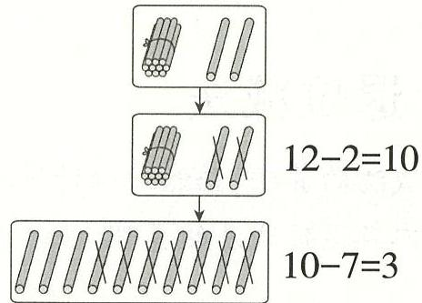

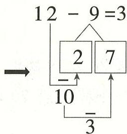

先算 $12 - 2 = 10$ ，再算 $10 - 7 = 3$ 。

# 3. 解决问题

$$
1 2 - 9 = 3
$$

归纳 总结 用平十法（分拆减数）计算十几减9时，将9分成几和另一个数，先用十几减几等于10，再用10减另一个数。

【例2】12-9 还可以怎样算？（教材第3页）

# 例题讲解

# 1. 用破十法（分拆被减数）计算 12-9

先把12分成10和2。

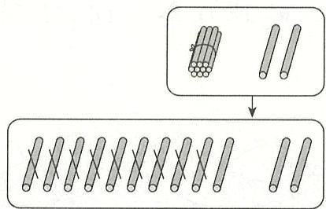

先把12根小棒分成10根和2根，再从10根中减去9根剩下1根，最后把剩下的1根和2根合起来。

先算: $10 - 9 = 1$

再算： $1 + 2 = 3$

# 2. 解决问题

还可以分拆被减数。

# 归纳总结

用破十法（分拆被减数）计算十几减9时，将十几分成10和几，先用10减9等于1，再用1加几。

【例3】算一算。（教材第2页练一练第2题第4小题）

$$
1 3 - 8 = \square
$$

# 例题讲解

# 1. 用平十法（分拆减数）计算 13-8

因为13个位上的数字是3，所以把8分成3和5。

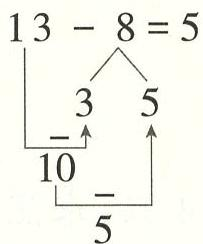

先算 $13 - 3 = 10$ ，再算 $10 - 5 = 5$

所以 $13 - 8 = 5$ 。

# 2. 用破十法（分拆被减数）计算13-8

把13分为10和3。

先算 $10 - 8 = 2$ ，再算 $3 + 2 = 5$

所以 $13 - 8 = 5$ 。

# 3. 解决问题

$$
1 3 - 8 = 5
$$

# 归纳总结

计算十几减9、8、7、6时，可以用破十法（分拆被减数）或平十法（分拆减数）来计算。

# 知识点

# 十几减 5、4、3、2

# 学前准备

$$
4 + 9 =
$$

$$
3 + 8 =
$$

$$
3 + 9 =
$$

$$
4 + 7 =
$$

$$
5 + 8 =
$$

$$
2 + 9 =
$$

$$
4 + 8 =
$$

$$
5 + 9 =
$$

# 教材例题

【例1】和一共有11只，其中有4只。问：有多少只？（教材第4页）

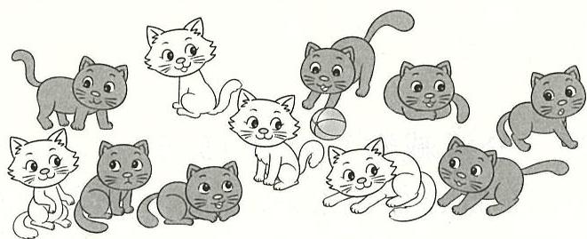

# 例题讲解

# 1. 读题，理解题意

白猫和黑猫一共有11只，其中白猫有4只，求黑猫有多少只，就是已知总数和其中一个部分数，求另一个部分数，用减法计算，列式为11-4。

# 2. 探究 11-4 的计算方法

方法一：用平十法（分拆减数）计算。

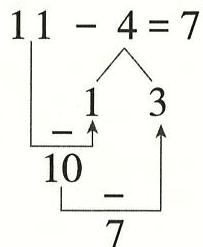

方法二：用破十法（分拆被减数）计算。

方法三：做减法，想加法。

因为 $4 + \boxed{7} = 11$ ，所以 $11 - 4 = 7$ 。

# 3. 解决问题

$$
1 1 - 4 = 7
$$

# 归纳总结

计算十几减 5、4、3、2 的方法: 平十法 (分拆减数)、破十法 (分拆被减数) 及想加法做减法。

# 知识点3

# 20减几

# 学前准备

算一算。

$$
1 0 - 5 =
$$

$$
1 0 - 4 =
$$

$$
1 0 - 6 =
$$

$$
1 0 - 3 =
$$

$$
1 0 - 7 =
$$

$$
1 0 - 8 =
$$

$$
1 0 - 9 =
$$

$$
1 0 - 2 =
$$

81乙εL9S:美景幸

# 教材例题

【例1】一共有20根，拿走4根。问：还剩多少根？（教材第6页）

# 例题讲解

# 1. 读题，理解题意

一共有20根棒棒糖，拿走了4根，求还剩下多少根，就是已知总数和其中一个部分数，求另一个部分数，用减法计算，列式为 $20 - 4$

2. 探究 20-4 的计算方法

先算 $10 - 4 = 6$ ，再算 $10 + 6 = 16$ 所以 $20 - 4 = 16_{\circ}$

3. 解决问题

$$
2 0 - 4 = 1 6
$$

归纳总结

计算20减几时，把20分成2个10，先算10减几，然后再用10减几的得数加上10。

# 误区警示·想一想

【误区1】计算 $16 - 8$

错解

错误分析没有理解“破十法”导致错误。用“破十法”计算16-8时，把16分成6和10，应先算 $10 - 8 = 2$ ，再算 $6 + 2 = 8$ ，而不是连减两次。

正解

归纳总结

用“破十法”（分拆被减数）计算十几减几时，先减后加。

【误区2】巧算17-9。

错解 $17 - 9 = 7$

错误分析 被减数个位上的数没有加1。

正解 $17 - 9 = 8$

归纳总结

巧算“十几减9”的方法：把被减数个位上的数加1，就得到“十几减9”的差。

# 解题策略·用一用

# 综合运用

# 运用十几减 9 的知识解决比较算式结果大小的问题

【例1】请把下列算式按结果从小到大的顺序排列起来。

18-9

11-9

15-9

17-9

13-9

16-9

思路导引思路一：先算出每个算式的结果，再比较大小。

思路二：

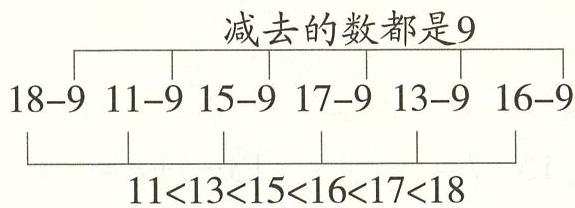

由于减数相同，所以被减数越大，结果就越大；被减数越小，结果就越小。

正确答案 $11 - 9 <   13 - 9 <   15 - 9 <   16 - 9 <   17 - 9 <   18 - 9$

方法总结

解决此类问题时，可以先算出每个算式的结果，再比较大小；也可以根据算式的特点比较大小：若减数相同，则被减数越大，差越大，若被减数相同，则减数越小，差越大。

# 方法运用 运用代入法解决图形算式问题

【例1】已知□=7，☆=9， $\bigcirc = 6$ ，则 $+\bigcirc -\bigcirc$ 和 $17 - \text{冠} +\bigcirc$ 分别

等于多少？

思路导引 将图形所代表的数代入由图形组成的算式中进行计算即可。

正确答案 $4 + 0 - \text{☆} = 4$ $17 - \text{☆} + 0 = 14$

# 方法总结

解决此类问题时，可以先把图形换成数，再进行计算；若题中没有直接给出每个图形所代表的数，则可以先求出每个图形所代表的数，再把图形换成数进行计算。

# 综合练习·做一做

1. 算一算，填一填。

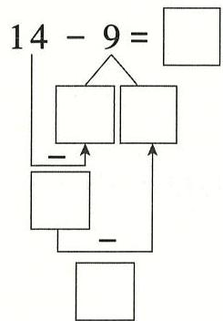

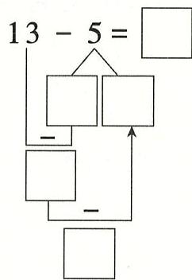

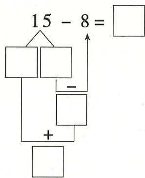

2. 直接写出得数。

$$
1 8 - 9 =
$$

$$
1 1 - 4 =
$$

$$
1 5 - 7 =
$$

$$
1 3 - 5 + 8 =
$$

$$
1 1 - 2 =
$$

$$
1 1 - 8 =
$$

$$
1 3 - 6 =
$$

$$
1 2 - 3 + 7 =
$$

3. 在 $\bigcirc$ 里填上“>”“<”或“=”。

$$
1 5 - 9 \bigcirc 4
$$

$$
1 6 - 7 \bigcirc 1 8
$$

$$
1 8 - 9 \bigcirc 9
$$

$$
9 + 8 \bigcirc 1 4 - 8
$$

$$
1 1 - 7 \bigcirc 7 + 7
$$

$$
1 2 - 4 \bigcirc 1 5 - 6
$$

4. 在 $\bigcirc$ 里填上合适的数。

$$
\text {心} + 5 = 1 2
$$

$$
1 1 + \heartsuit = 1 6
$$

$$
1 5 - \text {心} = 9
$$

$$
1 2 - 3 = \heartsuit
$$

$$
1 4 = \text {心} + 8
$$

$$
1 4 - 5 = \text {心}
$$

5. 看图列式计算。

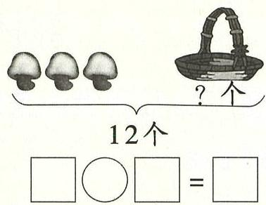

6. 一(1)班有17名男生，9名女生，1名男生和1名女生坐一桌，还剩多少名男生没有同桌？

7. (1) 如果送给小熊 6 个萝卜, 那么小灰兔还剩几个萝卜?

(2) 如果送给小熊 7 个萝卜, 那么小灰兔还剩几个萝卜?

(3)请你再提出一个数学问题并解答。

# 拓展题

8. 把 4,5,6,7 这四个数填入□中（每个数只能用一次），使等式成立。

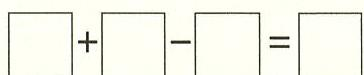

# 2. 大家来做减法

重点 认识减法表, 掌握 20 以内数的退位减法。

难点 灵活运用20以内数的退位减法解决问题。

# 教材例题·学一学

# 知识点 20以内数的退位减法表

# 学前准备

算一算。

$$
1 5 - 9 =
$$

$$
1 4 - 6 =
$$

$$
1 3 - 7 =
$$

$$
1 2 - 5 =
$$

$$
1 8 - 9 =
$$

$$
1 4 - 9 =
$$

$$
1 3 - 8 =
$$

$$
1 7 - 8 =
$$

6566989：美美美

# 教材例题

【例1】填一填，你发现了什么？（教材第7页）

<table><tr><td rowspan="17" colspan="6"></td><td>18-9=</td></tr><tr><td></td></tr><tr><td>16-7=</td></tr><tr><td>16-9=</td></tr><tr><td></td></tr><tr><td>15-6=</td></tr><tr><td>15-7=</td></tr><tr><td></td></tr><tr><td>14-5=</td></tr><tr><td></td></tr><tr><td>13-4=</td></tr><tr><td></td></tr><tr><td>12-3=</td></tr><tr><td></td></tr><tr><td>11-2=</td></tr><tr><td></td></tr><tr><td>10-1=</td></tr></table>

# 例题讲解

# 1. 整体观察表格

减法表中蕴涵着一定的规律，可以横着看，也可以竖着看，还可以斜着看找出其中的规律。

# 2. 做减法运算完成表格

(1) 有算式的直接计算出得数。  
(2) 从左边起, 按列来完成。

减数的规律：第1列是1，第2列是2，根据规律第3列是3，第4列是 $4,\dots \dots$ ，第几列就是几。

被减数的规律：第2列被减数是11和10，依次小1，第4列也是依次小1，第3列是12和10，根据规律中间应填11，也是依次小1，…

(3) 根据规律完成表格。

<table><tr><td></td><td></td><td></td><td></td><td></td><td></td><td></td><td>18-9=9</td></tr><tr><td></td><td></td><td></td><td></td><td></td><td>17-8=9</td><td>17-9=8</td><td></td></tr><tr><td></td><td></td><td></td><td></td><td>16-7=9</td><td>16-8=8</td><td>16-9=7</td><td></td></tr><tr><td></td><td></td><td></td><td>15-6=9</td><td>15-7=8</td><td>15-8=7</td><td>15-9=6</td><td></td></tr><tr><td></td><td></td><td>14-5=9</td><td>14-6=8</td><td>14-7=7</td><td>14-8=6</td><td>14-9=5</td><td></td></tr><tr><td></td><td>13-4=9</td><td>13-5=8</td><td>13-6=7</td><td>13-7=6</td><td>13-8=5</td><td>13-9=4</td><td></td></tr><tr><td></td><td>12-3=9</td><td>12-4=8</td><td>12-5=7</td><td>12-6=6</td><td>12-7=5</td><td>12-8=4</td><td>12-9=3</td></tr><tr><td>11-2=9</td><td>11-3=8</td><td>11-4=7</td><td>11-5=6</td><td>11-6=5</td><td>11-7=4</td><td>11-8=3</td><td>11-9=2</td></tr><tr><td>10-1=9</td><td>10-2=8</td><td>10-3=7</td><td>10-4=6</td><td>10-5=5</td><td>10-6=4</td><td>10-7=3</td><td>10-8=2</td></tr></table>

# 3. 观察表格中的变化规律

(1) 横着看: 每一行被减数分别相同, 从左到右减数依次大 1 , 差依次小 1 ; 从下往上每行算式的个数依次少 1 。  
(2)竖着看：从上往下每一列的被减数依次小1，减数分别相同，差依次小1；从左往右每列算式的个数依次多1。  
(3)斜着看：从左下到右上，被减数依次大1，减数也依次大1，差分别相等。

# 综合练习·做一做

1. 根据 20 以内数的退位减法表填一填。

<table><tr><td>13-4=</td></tr><tr><td>12-3= 12-4=</td></tr><tr><td>11-2= 11-4=</td></tr><tr><td>10-2= 10-3=</td></tr><tr><td>10-6= 10-9=</td></tr></table>

2. 算一算。

$$
1 5 - 9 =
$$

$$
1 6 - 7 =
$$

$$
1 8 - 9 =
$$

$$
1 2 - 5 =
$$

$$
1 4 - 8 =
$$

$$
1 4 - 9 =
$$

$$
1 3 - 7 =
$$

$$
1 2 - 8 =
$$

3. 找规律，填一填。

$$
1 4 - 6 =
$$

$$
1 4 - 7 =
$$

$$
1 4 - 8 =
$$

$$
(\quad) - (\quad) =
$$

$$
1 0 - 4 =
$$

$$
1 1 - 4 =
$$

$$
1 2 - 4 =
$$

$$
(\quad) - (\quad) =
$$

$$
1 4 - 5 =
$$

$$
1 5 - 6 =
$$

$$
1 6 - 7 =
$$

$$
(\quad) - (\quad) =
$$

# 拓展题

4. 填数。

使横行、竖行上的3个数相加的和都等于下面（ ）里的数。

  
(12)

(11)   

<table><tr><td>3</td><td></td><td>1</td></tr><tr><td></td><td>2</td><td></td></tr><tr><td>5</td><td></td><td></td></tr></table>

# 3. 讲讲算算

重点 根据情境能判断用加法还是减法解决问题。

难点 理解加、减法应用题,能准确运用加、减法解决生活问题。

# 教材例题·学一学

# 知识点 退位减法的应用

# 学前准备

看图列式计算。

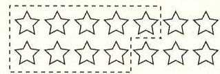

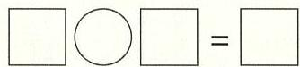

$8 = \mathrm{t} - \mathrm{{zI}}\;5 = 6 - 7\mathrm{I}$ ：季景李浮

# 教材例题

【例1】球筐里原来有13个，投了一些后，还

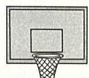

剩5个。问：投了几个？（教材第11页）

# 例题讲解

1. 读题，理解题意

已知篮球筐里原来有13个篮球，乐乐投了一部分后，剩下5个，求乐乐投了几个，就是已知总数和一个部分数，求另一个部分数。

投了几个？ 还剩5个

球筐里原来有13个

根据图示可知用减法计算，列式为 $13 - 5$ 。

# 2. 解决问题

$13 - 5 = 8$ （个）

答：投了8个。

# 归纳总结

已知总数和其中一个部分数, 求另一个部分数, 用减法计算。

# 知识点2

# 进位加法的应用

# 学前准备

看图列式计算。

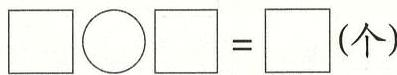

$$
\varepsilon I = \varsigma + 8 \quad \varsigma I = 9 + 6: \text {类 易 杀 类}
$$

# 教材例题

【例1】球筐里有一些，投了8个后，还剩

5个。问：球筐里原来有多少个？（教材第12页）

# 例题讲解

# 1. 读题，理解题意

球筐里原来有一些篮球，乐乐投了8个后，球筐里还有5个。求球筐里原来有多少个，就是求投了的篮球个数和球筐里还剩下的篮球个数的和。

投了8个

还剩5个

球筐里原来有多少个？

已知两个部分数，求总数，用加法计算，列式为 $8 + 5$

# 2. 解决问题

$8 + 5 = 13$ （个）

答：球筐里原来有13个

# 归纳总结

已知两个部分数，求总数，用加法计算。

# 误区警示·想一想

【误区1】操场上参加跳绳比赛的男生有13人，男生比女生少6人，女生有多少人？

错解 $13 - 6 = 7$ （人） 答：女生有7人。

错误分析 错解错在看到“男生比女生少6人”中的“少”字就用减法计算了。该条件也可以说成“女生比男生多6人”，由此可知，女生多，男生少，应用加法求女生的人数。

正解 $13 + 6 = 19$ （人） 答：女生有19人。

# 归纳总结

解决这类问题时，一定要先看清谁比谁多或谁比谁少，要求的是“多”的那个量还是“少”的那个量，然后确定应该用加法计算还是用减法计算。

# 解题策略·用一用

# 方法运用运用观察法和分析法从图中获取信息

【例1】一共有14根木头，大象运走了根，还剩几根？

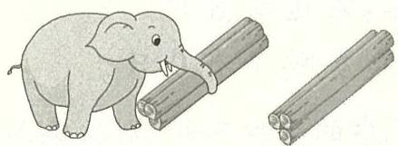

$\square \bigcirc \square = \square$ （根）

# 思路导引

已知条件： $①$ 一共有14根木头。两次共运走14根木头，运走了6根， $②$ $\rightarrow$ 了6根。求还剩几根，用减法计算。所求问题：还剩几根？

规范解答 $14 - 6 = 8$ （根） 答：还剩8根。

方法 总结 在解决此类问题时，要挖掘图中的信息，先确定共运走的，然后数出共运走的根数，再计算。

# 方法运用 2从不同角度观察并收集信息

【例1】一共有 15 只鸭子：

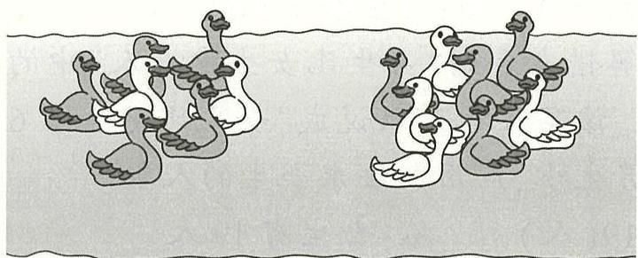

(1) 左边有 7 只, 右边有几只?  
(2) 白鸭子有 6 只, 灰鸭子有几只?

思路导引 第一个问题是把全部鸭子按位置分，左边有7只，求右边有几只，用减法计算，列式为15-7；第二个问题是把全部鸭子按颜色分，白鸭子有6只，求灰鸭子有几只，用减法计算，列式为15-6。

# 规范解答

(1) $15 - 7 = 8$ （只） 答：右边有8只。  
(2) $15 - 6 = 9$ （只） 答：灰鸭子有9只。

方法总结 同一个情境，若观察的角度不同，则收集到的信息也不同；若提出的问题不同，则解决问题的具体方案也不同。

# 综合练习·做一做

# 1. 直接写出得数。

$$
1 5 - 9 =
$$

$$
6 + 7 =
$$

$$
1 2 - 5 =
$$

$$
1 2 - 3 + 4 =
$$

$$
1 6 - 9 =
$$

$$
8 + 7 =
$$

$$
1 5 - 7 =
$$

$$
6 + 5 - 8 =
$$

$$
5 + 9 =
$$

$$
1 8 - 9 =
$$

$$
1 3 - 8 =
$$

$$
4 + 7 - 3 =
$$

# 2. 算一算，填一填。

$$
9 + \square = 1 3
$$

$$
5 + \square = 1 2
$$

$$
5 + 6 = \square
$$

$$
1 2 - 4 = \square
$$

$$
1 3 - \square = 5
$$

$$
1 2 - \square = 3
$$

# 3. 看图列式计算。

(1)

?支

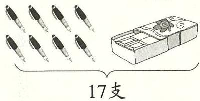

(2)

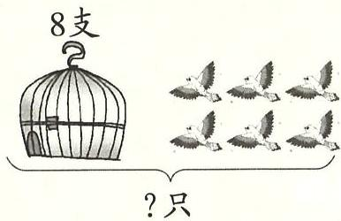

$$
\square \bigcirc \square = \square (\quad)
$$

$$
\square \bigcirc \square = \square (\quad)
$$

4. 爸爸买回来 17 桶鸽子粮食, 哥哥和弟弟这个月给鸽子喂了 9 桶, 现在还剩多少桶?

# 5. 拾贝壳。

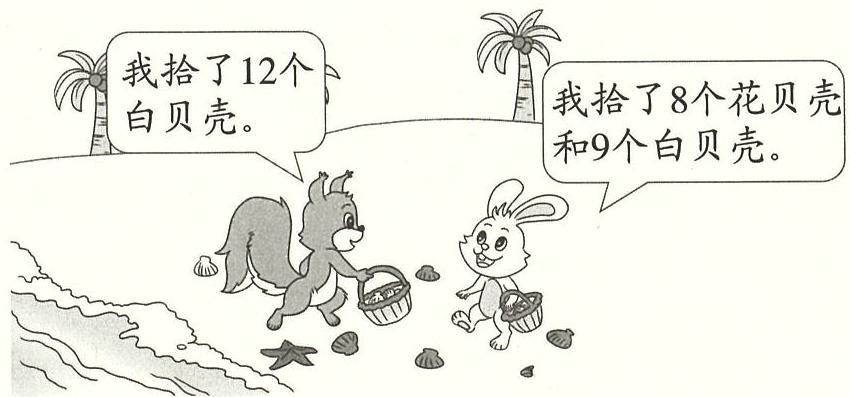

(1)小白兔一共拾了多少个贝壳？  
(2)请你再提出一个数学问题，并解答。

# 拓展题

6. 找出对应的已知条件和问题组成一个数学问题, 并解答。

① 红红和亮亮跳绳,一共跳了17下。  
② 红红有 4 根跳绳。  
(3) 红红跳了 9 下。  
(4)亮亮跳了多少下?

# 4. 组算式

<table><tr><td>重点</td><td>能根据同一幅图列出两个加法算式和两个减法算式,并能准确计算。</td></tr><tr><td>难点</td><td>感知两个数相加,调换它们的位置,结果不变;能理解加法是减法的逆运算。</td></tr></table>

# 教材例题·学一学

# 知识点 一图四式

# 学前准备

看图列式计算。

(1)

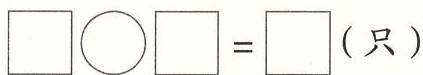

(2)

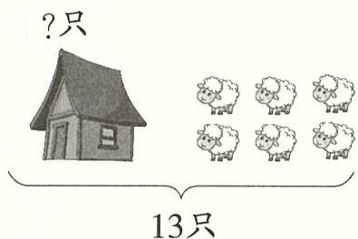

$L = 9 - \varepsilon I(2)$ $\varepsilon I = L + 9(I)$ ：类是单类

# 教材例题

【例1】看图, 写两个加法算式和两个减法算式。(教材第 13 页)

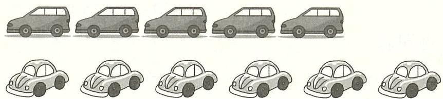

# 例题讲解

1. 观图，理解题意

图中上面有5辆小汽车，下面有6辆小汽车，数一数一共有11辆小汽车。

# 2. 从不同角度分析，并列算式

11是总数，5和6是部分数，求总数时用加法，即求两个部分的和，列式为 $5 + 6$ 或 $6 + 5$ ；求其中一个部分时用减法，如求上面小汽车有多少辆，列式为11-6，求下面小汽车有多少辆，列式为11-5。

# 3. 计算方法

$$
5 + 6 = \quad 6 + 5 = \quad 1 1 - 5 = \quad 1 1 - 6 =
$$

方法一：可以用20以内数的进位加法和退位减法分别算出结果。

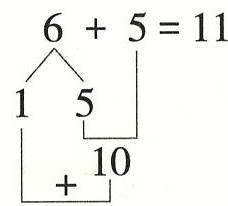

方法二：可以看图直接数出结果。

方法三：根据一个加法算式的结果推导出其他算式的结果。

$$
5 + 6 = \boxed {1 1} \Longrightarrow \left\{ \begin{array}{l} 6 + 5 = \boxed {1 1} \\ 1 1 - 5 = \boxed {6} \\ 1 1 - 6 = \boxed {5} \end{array} \right.
$$

# 4. 解决问题

$$
5 + 6 = 1 1 \quad 6 + 5 = 1 1 \quad 1 1 - 5 = 6 \quad 1 1 - 6 = 5
$$

# 归纳总结

1. 一般情况下, 根据一幅图中的两部分, 如果把两部分合在一起, 求一共有多少, 可以列出两个加法算式; 如果知道总数和其中一部分, 求另一部分有多少, 可以列出两个减法算式。

2. 当一幅图中的两部分数量相同时, 只能列出一个加法算式和一个减法算式。

# 解题策略·用一用

# 方法运用 运用综合法解决写加、减法算式的问题

【例1】从3、7、8、11、15这5个数中选出3个，写出两个加法算式和两个减法算式。

$$
\square + \square = \square
$$

$$
\square + \square = \square
$$

$$
\boxed { \begin{array}{r l} \hline \hline \hline \hline \hline \hline \hline \hline \hline \hline \hline \hline \hline \hline \hline \hline \hline \hline \hline \hline \hline \hline \hline \hline \hline \hline \hline \hline \hline \hline \hline \hline \hline \hline ① - ② = ③} & \\ \hline \hline \hline \hline \hline \hline \hline \hline \hline \hline \hline \hline \hline \hline \hline \hline \hline \hline \hline \hline \hline \hline \hline \hline \hline \hline \hline \hline \hline \hline \hline \hline \hline
$$

$$
\boxed { \begin{array}{c} \end{array} } - \boxed { \begin{array}{c} \end{array} } = \boxed { \begin{array}{c} \end{array} }
$$

思路导引 运用试数的方法从小到大试：

(1)3和8的和是11,所以3、8和11这3个数满足条件。   
$② 7$ 和8的和是15，所以7、8和15这3个数也满足条件。

正确答案 $3 + 8 = 11$ $8 + 3 = 11$ $11 - 3 = 8$ $11 - 8 = 3$

或 $7 + 8 = 15$ $8 + 7 = 15$ $15 - 7 = 8$ $15 - 8 = 7$

方法总结

解决用所给数组算式这类题的关键是从所给数中选出能组成算式的几个数。

# 方法运用 2 借助中间量解决看图列式问题

【例1】看图列式计算。

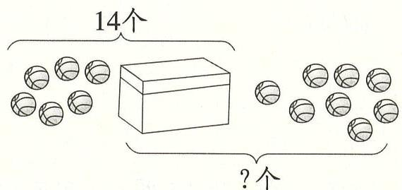

思路导引 将上图分为两部分来思考。

14个一部分：

外面的6个球和盒子里面的球一共是14个，可以求出盒子里

面有 $14 - 6 = 8$ （个）球。

8个 号 号 号 号 号 号 号 号 号 号 号 号 号 号 号 号 号 号 号 号 号 号 号 号 号 号 号 号 号 号 号 号 号 号 号 号 号 号 号 号 号 号 号 号 号 号 号 号 号 号 口

盒子里面的8个球和外面的8个球，合起来是几个？求总数用加法计算，列式为 $8 + 8$ 。

规范解答 $14 - 6 = 8$ （个） $8 + 8 = 16$ （个）

方法 总结 解决此类问题的关键是先将一幅图分成两部分来看，再根据已知条件求出中间量，最后求出结果。

# 综合练习·做一做

1. 直接写出得数。

$$
1 5 - 9 =
$$

$$
9 + 7 =
$$

$$
5 + 8 =
$$

$$
1 2 - 6 + 5 =
$$

$$
3 + 9 =
$$

$$
1 2 - 8 =
$$

$$
1 1 - 6 =
$$

$$
1 7 - 9 + 6 =
$$

$$
4 + 9 =
$$

$$
1 1 - 3 =
$$

$$
1 2 - 7 =
$$

$$
1 8 - 9 + 5 =
$$

2. 看图写算式。

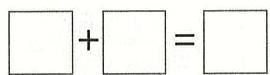

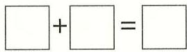

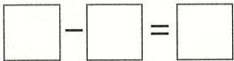

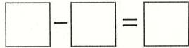

3. 从下面的数卡中选 3 张, 组成两个加法算式和两个减法算式。

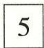

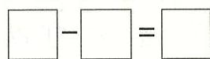

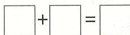

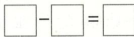

4. 填表。

<table><tr><td></td><td></td><td></td><td></td></tr><tr><td>原有</td><td>18根</td><td>16个</td><td>()个</td></tr><tr><td>卖出</td><td>()根</td><td>8个</td><td>7个</td></tr><tr><td>还剩</td><td>9根</td><td>()个</td><td>6个</td></tr></table>

5. 屋顶上有 14 只燕子。

(1)飞走了9只燕子，还剩几只燕子？

(2)还剩5只燕子，飞走了几只燕子？

# 拓展题

6. 看图编故事，并列式计算。

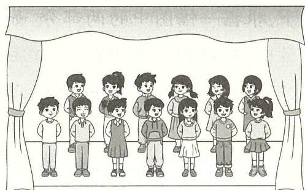

用加法解决：

问： ？

列式计算：

用减法解决：

问： ？

列式计算：

# 第1单元知识梳理

<table><tr><td>具体内容</td><td>重点知识</td></tr><tr><td>退位减法</td><td>1.用平十法(分拆减数)计算十几减9时,将9分成()和()数,先用()减()等于(),再用()减另一个数。2.用破十法(分拆被减数)计算十几减9时,将十几分成()和几,先用()减()等于(),再用()加()。3.计算20减几时,先把20分成()个(),先算()减几,然后再加上()。</td></tr><tr><td>大家来做减法</td><td>减法表中蕴含着一定的规律,可以横着看,也可以()着
看,还可以()着看出其中的规律。</td></tr><tr><td>讲讲算算</td><td>1.已知总数和其中一个部分数,求另一个部分数,用()法计算。
2.已知两个部分数,求总数,用()法计算。</td></tr><tr><td>组算式</td><td>一般情况下,根据一幅图中的两部分,如果把两部分合在一起,求一共有多少,可以列出两个()法算式;如果知道总数和其中一部分,求另一部分有多少,可以列出两个()法算式。</td></tr></table>

# 第1单元综合练习

# 一、算一算。

$$
1 5 - 6 =
$$

$$
1 2 - 4 =
$$

$$
1 5 - 7 =
$$

$$
1 6 - 9 + 8 =
$$

$$
1 1 - 3 =
$$

$$
1 1 - 8 =
$$

$$
1 3 - 6 =
$$

$$
1 2 - 9 + 7 =
$$

# 二、填一填。

1. 在 $\bigcirc$ 里填上“>”“<”或“=”。

$$
1 5 - 7 \bigcirc 4
$$

$$
1 4 - 9 \bigcirc 8
$$

$$
1 4 - 5 \bigcirc 9
$$

$$
1 2 - 8 \bigcirc) 1 3 - 8
$$

$$
1 1 - 9 \bigcirc 9 + 9
$$

$$
1 2 - 7 \bigcirc 1 5 - 6
$$

2. 在 $\bigcirc$ 里填上合适的数。

$$
\bigcirc + 5 = 1 2
$$

$$
1 1 - \text {心} = 1 0
$$

$$
1 5 - \text {心} = 9
$$

$$
1 2 - 3 = \text {心}
$$

$$
9 + 7 = \text {心} + 8
$$

$$
1 4 - \text {心} = 5
$$

3. 想一想，算一算，填一填。

# 三、看图列式计算。

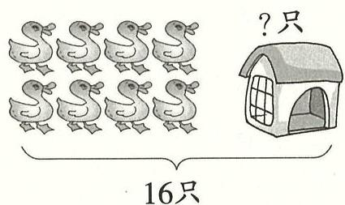

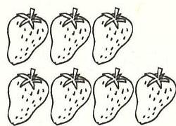

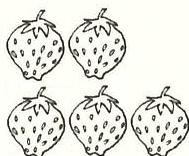

13块

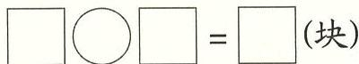

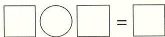

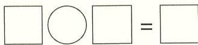

# 四、解决问题。

1. 再过几年, 小刚的年龄和小强现在的年龄一样大?

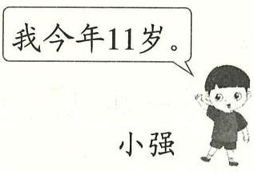

2. 选出合适的条件填在横线上（填序号），并解答。

$①$ 有7只

② 有8只

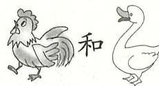

共有15只， ，有多少只？

$\boxed{\begin{array}{rl}\end{array}}\boxed{\begin{array}{rl}\end{array}} = \boxed{\begin{array}{rl}\end{array}}$ （只）

3.一（1）班的体育小组有14个小朋友。

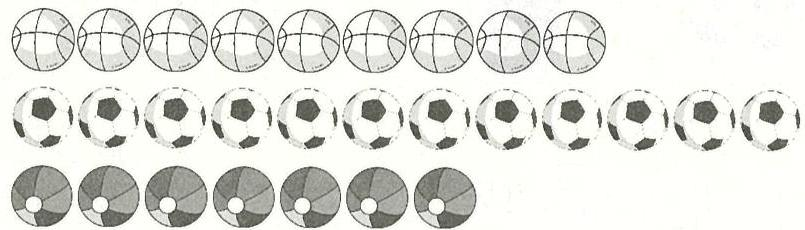

(1) 每人一个篮球, 还缺几个篮球?

(2)有8个小朋友喜欢踢足球，每人一个，还剩几个？

（3）请你再提出一个数学问题，并解答。

# 五、填数。

使横行、竖行上三个数相加的和都等于11。

<table><tr><td>3</td><td>7</td><td></td></tr><tr><td></td><td>2</td><td></td></tr><tr><td>5</td><td></td><td></td></tr></table>

参考答案：退位减法：1. 几 另一个 十几 几 10 10

2.10 10 9 1 1 几 3.2 10 10 10

大家来做减法：竖 斜

讲讲算算：1.减 2.加

组算式：加减

# 1. 数数

# 重点

会以十作为计数单位, 十个十个地数 100 以内的数, 并能用计数器表示数。

# 难点

对物体进行计数,并能用计数器表示数。

# 教材例题·学一学

# 知识点 十个十个地数

# 学前准备

数一数，填一填。

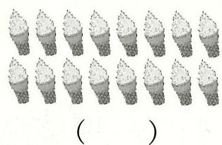

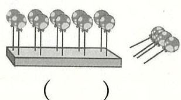

AI 8I 9I 2I SI

# 教材例题

【例1】数一数，一共有多少颗？（教材第16页）

# 例题讲解

# 1. 一个一个地数

想要知道一共有多少颗糖，可以一颗一颗地数，一、二、三、…、十八、十九、二十、二十一、二十二、二十三，一共有二十三颗糖。

# 2. 十个十个地数

先十颗十颗地数,再一颗一颗地数:

10颗圈1次是1个十，

圈2次是2个十，即二十。

二十三

# 重点提示

1. 10个一是1个十。   
2. 圈出几个十就是几十。

1个十，2个十，2个十是二十，数到二十再接着一颗一颗地数，可以数到二十三。所以一共有二十三颗糖。

# 3. 解决问题

一共有二十三颗

归纳总结 数较多物体的数量时，可以十个一圈，先十个十个地数，不足十个的再一个一个地数。

【例2】数一数，一共有多少根？（教材第17页）

# 例题讲解

# 1. 十个十个地数

1. 捆小棒是 10 根, 所以先十个十个地数, 一共有 6 捻小棒, 是 6 个十, 即六十; 接着再数单根的, 六十一、六十二、六十三、六十四, 所以一共有六十四根小棒。

# 2. 在计数器上拨数

1捆小棒是10根，6捆表示6个十，在十位上拨6颗珠子表示6个十，还剩单独的4根，在个位上拨4颗珠子，表示4个一。如下图所示：

# 3. 解决问题

一共有六十四根。

归纳总结 在计数器上拨珠表示数时，有几个十就在十位上拨几颗珠子表表示几十，剩下的在个位上拨珠子，有几个一就拨几颗珠子。

【误区1】数一数，并在计数器上涂一涂。

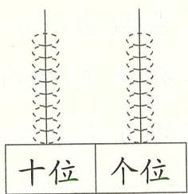

（ ）颗

错解 56

错误分析在计数器上拨珠子时，十位和个位上的数拨反了。有56颗草莓，5在十位上表示有5个十，所以在十位上拨5颗珠子；个位上是6，表示6个一，所以在个位上拨6颗珠子。

正解 56

归纳总结

在计数器上拨珠子时,有几个十,就在十位上拨几颗珠子;有几个一,就在个位上拨几颗珠子。

# 解题策略·用一用

# 方法运用 运用数数的方法解决实际问题

【例1】用不同的方法数一数下面的气球一共有多少个。

思路导引 要数出一共有多少个气球, 需先观察气球的排列, 气球的排列方式没有规律, 所以不能按行或列来数。可以选择不同的方法来数。

方法一：一个一个地数。

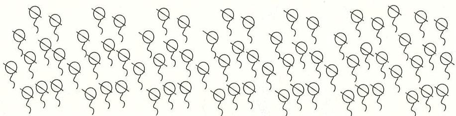

一个一个地数，边数边划，最后数到七十一，所以一共有71个气球。

方法二：两个两个地数。

两个两个地数，边数边圈，每次圈两个，最后圈的两个数到七十，剩下一个不圈，单个数，数到七十一，所以一共有71个气球。

方法三：五个五个地数。

五个五个地数，边数边圈，每次圈五个，最后圈的五个数到七十，  
剩下一个不圈，单个数，数到七十一，所以一共有71个气球。  
方法四：十个十个地数。

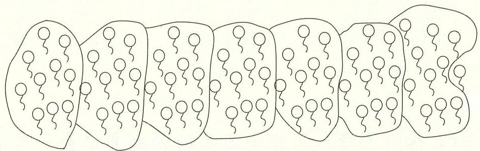

十个十个地数, 边数边圈, 每次圈十个, 最后圈的十个数到七十,剩下一个不圈, 单个数, 数到七十一, 所以一共有 71 个气球。

# 正确答案 71 个

# 方法总结

数物体的个数时，可以一个一个地数、两个两个地数、五个五个地数，也可以十个十个地数，边数边圈一圈或者划一划。

# 综合练习·做一做

# 1. 十个一圈数一数，填一填。

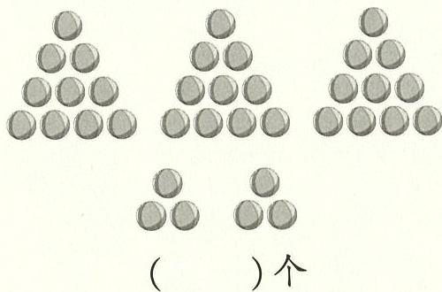

  
（ ）个

  
（ ）颗

2. 按计数器下面的数涂一涂。

# 拓展题

3. 在古代, 人们曾经采用摆小石块的方法来记数。用 $\bullet$ 表示十, 用 $\bullet$ 表示一, 按此记数方法, 请写出下面的数。

# 2. 数的读写

重点 会读、写100以内的数,认识并能在数位表中正确表示数。

难点 理解数位的意义。

# 教材例题·学一学

# 知识点 100以内数的读写

# 学前准备

数一数，写一写，读一读。

写作( )

读作( )

写作( )

读作( )

写作（

读作（

${Ct} + {tI} +  = {0c} \uparrow   + {LI} :$ 姿景丰姿

# 教材例题

【例1】一共有多少个苹果?

一共有多少支铅笔？(教材第18页)

# 例题讲解

1. 观察图，用计数器表示出数

左图问一共有多少个苹果，观察图并数一数可知，图中有3盒和6个苹果，每盒里面有10个苹果，所以有3个十，在计数器的十位上拨3颗珠子，6个苹果表示6个一，在计数器

的个位上拨6颗珠子,如下左图。

右图问一共有多少支铅笔，观察图并数一数可知，图中有5盒铅笔，每盒10支，所以有5个十，在计数器的十位上拨5颗珠子，如下右图。

# 2. 在数位表中表示数

(1) 认识数位表, 如下图:

<table><tr><td>十位</td><td>个位</td></tr><tr><td></td><td></td></tr></table>

从右边起，第一位是个位，表示几个一，第二位是十位，表示几个十。

(2) 明确读写方法。

左图中苹果的个数包括3个十和6个一，在十位上写3，在个位上写6,3个十和6个一合起来是36。读36时，先读十位上的3，十位上的3表示3个十，读出三十，个位上的6表示6个一，读六，所以36读作三十六，如下面左图。

右图中铅笔的支数包括5个十，在十位上写5；没有一，在个位上写0占位，即50。读50时，先读十位上的5，十位上的5表示5个十，读出五十，个位上是0，且个位上的0不读出来，如下面右图。

<table><tr><td>十位</td><td>个位</td></tr><tr><td>3</td><td>6</td></tr></table>

写作：36

<table><tr><td>十位</td><td>个位</td></tr><tr><td>5</td><td>0</td></tr></table>

读作：三十六

写作：50

读作：五十

# 3. 解决问题

一共有36个苹果。 一共有50支铅笔。

# 4. “50”个位上的“0”可以不写吗

在写整十数时, 有几个十就在十位上写几, 个位上的 0 表示有 0 个一, 所以要写 0 占位, 0 不可以不写。但读数的时候 0 不读出来。

# 归纳总结

100以内数的读写：（1)读数时从高位读起，十位上是几就读几十，个位上是几就读几，末尾的0不读；(2)写数时从高位写起，有几个十就在十位上写几，有几个一就在个位上写几，如果个位上一个计数单位也没有，就写0占位。

# 误区警示·想一想

【误区1】读出下面各数。

30读作（三零） 58读作（五十8）

错误分析 错在没有掌握读数的方法。读30时，个位上的0不读出来；读58时，个位上的8要读作八。

正解三十 五十八

# 归纳总结

读数时从高位读起，十位上是几就读几十，个位上是几就读几，个位上的0不读。而且读数时，要用汉字写出来。

【误区2】写出下面各数。

六十写作(610) 七十八写作(708)

错误分析 错在没有掌握写数的方法。误认为“六十”先写6，再写10；“七十八”先写70，再写8。

正解 60 78

# 归纳总结

写数时要从高位写起，“几十”就在十位上写几，“几”就在个位上写几。如果个位上一个计数单位也没有，就写0占位。

# 解题策略·用一用

# 方法运用 运用列举法解决问题

【例1】在 $40\sim 70$ 这些数中，数字“6”出现了多少次？

思路导引 要想知道 $40 \sim 70$ 这些数中数字“6”出现了多少次，我们可以按顺序一一列举。

规范解答 $3 + 10 = 13$ （次）答：数字“6”出现了13次。

# 方法总结

解答此类问题时，可以按顺序列举，先列举要求的数字在个位上出现的情况，然后列举要求的数字在十位上出现的情况，再把这两种情况合起来即可。

# 综合练习·做一做

1. 圈一圈，填一填。

(1)

<table><tr><td>十位</td><td>个位</td></tr><tr><td></td><td></td></tr></table>

写作：

读作：

(2)

<table><tr><td>十位</td><td>个位</td></tr><tr><td></td><td></td></tr></table>

写作：

读作：

2. 看图写数并读一读。

写作：

读作：

写作：

读作：

写作：

读作：

3. 写一写或读一读生活中的数。

写作：

写作：

读作：

# 拓展题

4. 一个两位数，十位上的数字比个位上的数字小3，这个两位数可能是多少？（把所有可能的数都写出来）

# 3. 数的组成

重点 借助数位表理解100以内数的组成。

难点 掌握100以内数的组成。

# 教材例题·学一学

# 知识点 100以内数的组成

# 学前准备

填一填。

(1) // ( )个十和( )个一合起来是( ),读作( )。  
(2) ( )个十合起来是( ),读作( )。  
(3)15是由（ ）个十和（ ）个一组成的。

S I (ε) += 0Z Z (Z) 三+ E I E I (I):

# 教材例题

【例1】一共有多少个 $\odot$ ？（教材第20页）

# 例题讲解

1. 观察图，理解题意

左边有5盒乒乓球，每盒10个，有5个十，右边有3个球，即3个一，求一共有多少个乒乓球。  
2. 借助加法理解数的组成

求一共有多少个乒乓球, 就是求 5 个十和 3 个一合起来是多少,

5个十是50,3个一是 $3,50 + 3 = 53$ ，所以一共有53个乒乓球。

# 3. 借助数位表理解数的组成

有5个十，所以在十位上写5；有3个一，所以在个位上写3，53表示在数位表中如下所示：

<table><tr><td>十位</td><td>个位</td></tr><tr><td>5</td><td>3</td></tr></table>

所以，53是由5个十和3个一组成的。

# 4. 解决问题

$50 + 3 = 53$ （个）

答：一共有53个。

归纳总结

几十是由几个十组成的，几十几是由几个十和几个一组成的。

# 误区警示·想一想

【误区1】由8个一和5个十组成的数是（85）。

错误分析 对100以内数的组成理解不清，错误地直接按照题目叙述的顺序写数了，有8个一应在个位上写8，有5个十应在十位上写5。

正解 58

归纳总结

根据数的组成写数时, 有几个十就在十位上写几, 有几个一就在个位上写几。

# 解题策略·用一用

# 综合运用 运用数的组成知识解决组两位数的问题

【例1】有一个两位数, 个位与十位上的数字的和是 8 , 这样的两

位数你能写出几个？请写一写。

思路导引 由题意可知, 要写出的两位数个位与十位上的数字的和是 8 , 因此可以根据 8 的组成来解题。看哪两个数字合起来是 8 , 这两个数字组成的两位数即为所求。列表如下:

<table><tr><td>十位</td><td>8</td><td>7</td><td>6</td><td>5</td><td>4</td><td>3</td><td>2</td><td>1</td></tr><tr><td>个位</td><td>0</td><td>1</td><td>2</td><td>3</td><td>4</td><td>5</td><td>6</td><td>7</td></tr></table>

正确答案 能写出8个，分别是 $80,71,62,53,44,35,26,17$

# 方法总结

解决此题时，先把每一种情况都列在表中，且个位和十位上的数字可以相同，但要注意十位上的数字不能为0。

# 综合练习·做一做

# 1. 填一填。

（ ）个十和（ ）个一合起来是（ ）。

（ ）个十和（

个一合起来是（ ）。

（ ）个十和（ ）个 （ ）个十和（ ）个一合起来是（ ）。 一合起来是（ ）。

$(\quad) + (\quad) = (\quad)$ $(\quad) + (\quad) = (\quad)$

（ ）是由（ ）个十 （ ）是由（ ）个十和（ ）个一组成的。 和（ ）个一组成的。

# 2. 小动物回家,连一连。

# 拓展题

3. 从 3,6,9 这三个数字中选出两个数字组成符合要求的两位数。

# 4. 数的位置

<table><tr><td rowspan="2">重点难点</td><td>知道100以内的数在直线上的位置,能填出直线上的点对应的方框中缺少的数。</td></tr><tr><td>理解数与直线上的点的一一对应关系。</td></tr></table>

# 教材例题·学一学

# 知识点 数在直线上的位置

# 学前准备

在里填上合适的数。

61 L1 S1 21 6 L v 2: 妻妻李

# 教材例题

【例1】在下图中找到23的位置。（教材第21页）

# 1. 认识直线上的点对应的数

观察直线上的点和数, 从 0 到 10 , 有 10 小格, 所以每一小格表示 1 , 如下图所示:

# 2. 找 23 在直线上对应的位置

要找到23在直线上的位置，方法一：一小格一小格地数，从0开始往右数，0、1、2、3、……、20、21、22、23；方法二：一大格一大格地数，从0开始往右数，0、10、20，然后再一小格一小格地往右数，21、22、23；方法三：直线上整十数已经给出，所以从20开始往右数，数3小格就是23。

# 3. 解决问题

# 归纳总结

在直线上找对应数的位置的方法：①一小格一小格地从0开始往右数；②根据数的组成可知几十几是由几十和几组成的，先从0开始往右数到几十，再一小格一小格地数剩下的几小格；③直接从几十开始，一小格一小格地数几小格即可。

【例2】在下图中找到46的位置，2格2格地往右数，数到56。（教材第21页）

# 例题讲解

# 1. 在直线上找46对应的位置

观察图, 起点是 30 , 要找 46 , 所以先找到 40 , 从 40 开始, 再往右一小格一小格地数, 40、41、42、43、44、45、46。并把数标注在直线上如下图所示:

# 2. 在直线上找 56 对应的位置

从 46 开始, 2 格 2 格地往右数, 46、48、50、52、54、56, 如下图所示:

# 解题策略·用一用

# 方法运用 运用列举法解决问题

【例1】有一筐桃子，个数比三十多、比四十少，小明两个两个地数，正好数完；小东三个三个地数，也正好数完。你知道这筐桃子共有多少个吗？

思路导引 桃子个数比三十多、比四十少, 先按要求分别数一数。

两个两个地数：2、4、6、8、……、30、32、34、36、38。

三个三个地数：3、6、9、12、…、30、33、36、39。

比较两次所数的数，发现符合要求的数只有36，所以这筐桃子共有36个。

正确答案 这筐桃子共有36个。

方法解答此类题时，可先列举出每种数法中符合要求的数，然后在所总结 给范围内找出同时符合各种数法要求的数，该数即所求的数。

# 综合练习·做一做

1. 填一填。

(1)

(1)在上面找出25、47和79。  
② $a = (\quad)$ ， $b = (\quad)$ ， $c = (\quad)$ 。

(2) a b c d e f g h i 0 10 20 30 40 50 60 70 80 90 100

$$
\begin{array}{l} a = (\quad) \quad b = (\quad) \quad c = (\quad) \\ d = (\quad) \quad e = (\quad) \quad f = (\quad) \\ g = (\quad) \quad h = (\quad) \quad i = (\quad) \\ \end{array}
$$

2. 按要求数一数。

(1) 在上图中从 40 开始, 2 格 2 格地往右数, 数到 52。  
(2) 在上图中从 55 开始, 5 格 5 格地往右数, 数到 80。

# 拓展题

3.猫和老鼠同时从图中的位置起跳，猫每次跳3格，老鼠每次跳2格。到数（ ）时，猫能追上老鼠。

# 5. 认识 100

重点 理解 10 个十是 100 , 初步学习整十数加减整十数。

难点 知道几个十就是几十, 10 个十是 100。

# 教材例题·学一学

# 知识点 认识100

# 学前准备

填一填。

(1)5个十和6个一是（ ）。  
（2）从90开始数，90、（ ）、92、（ ）、（ ）、（ ）。  
(3)从30开始，十个十个地数，30、40、（ ）、（ ）

0L 09 0S (ε) §6 +6 £6 I6 (乙) 9S (I):等量导数

# 教材例题

【例1】99根/，再添1根是多少根？（教材第24页）

# 例题讲解

1. 用小棒摆一摆

99根小棒就是9捆和9根小棒，即9个十和9个一，再添1根，就是再添1个一，9个一加1个一是10个一，10个一是1个十。

2. 认识计数单位 “百”

9个十加1个十是10个十，10个十是1个百。

“百”也是计数单位，10个一就是1个十，10个十就是1个百，100个一就是1个百。

# 3. 明确 100 以内数的数位表

数位表中,从右边起,第一位是个位,表示几个一,第二位是十位,表示几个十,第三位是百位,表示几个百。

# 4. 借助数位表明确 100 的读写方法

在百位上写1，表示1个百；十位和个位上一个计数单位也没有，写0占位，写作100；百位上的“1”读作一百，十位和个位上的0都不读出来，所以读作一百。

<table><tr><td>百位</td><td>十位</td><td>个位</td></tr><tr><td>1</td><td>0</td><td>0</td></tr></table>

写作：100 读作：一百

# 5. 解决问题

再添1根是100根

# 归纳总结

1. 数位表中,从右边起第一位是个位,第二位是十位,第三位是百位。  
2.10 个一是 1 个十, 10 个十是 1 个百。“一”“十”“百”都是计数单位。

# 知识点2 认识整十数

# 学前准备

填一填。

(1)从10开始，十个十个地数，10、（ ）、40、

( )、60。

(2)由3个十组成的数是（ ）。

0ε（乙） 0S 0ε 0ε (I)：等量导体

# 教材例题

【例1】用积木搭一搭。（教材第25页）

1块积木是1个一。

10块积木拼成一条，是1个十。

10条积木拼成一板，是1个百。

1 个十 10  
2 个十 20个十  
_ 个十  
_ 个十  
_ 个十  
_ 个十  
_ 个十  
_ 个十  
_ 个十  
_ 个十  
_ 个十  
_ 个十  
_ 个十  
_ 个十  
_ 个十  
_ 个十  
_ 个十  
_ 个十  
_ 个十  
_ 个十  
_ 个十  
_ 个十  
_

# 例题讲解

# 1. 看图理解题意

1块积木表示1个一，把10块积木摆成一条，就是1个十，即一条表示1个十。

1个一

1个十

2. 认识整十数

1条(10块)积木表示1个十，写作10,2条积木表示2个十，写作 $20,\dots \dots ,10$ 条积木表示10个十，写作100。像10、20、30、40、……、100这样的数就是整十数。

# 知识点3 整十数的加减法

# 学前准备

算一算。

$$
5 + 3 =
$$

$$
4 + 3 =
$$

$$
4 + 6 =
$$

$$
3 + 2 =
$$

$$
5 + 5 =
$$

$$
4 + 2 =
$$

$$
1 + 8 =
$$

$$
2 + 7 =
$$

6 6 9 0I S 0I L 8:

# 教材例题

【例1】看图列式。（教材第27页）

# 例题讲解

1. 看图列式

左边有2条积木块，共2个十，表示20，右边有3条积木，共3个十，表示30，根据题意可以列式如下：

$$
2 0 + 3 0 =
$$

$$
3 0 + 2 0 =
$$

$$
5 0 - 2 0 =
$$

$$
5 0 - 3 0 =
$$

2. 整十数加减法的计算方法

2个十加3个十，是5个十，即50;5个十减2个十是3个十，

即30,5个十减3个十是2个十，即20。

# 3. 解决问题

$$
2 0 + 3 0 = 5 0 \quad 3 0 + 2 0 = 5 0 \quad 5 0 - 2 0 = 3 0 \quad 5 0 - 3 0 = 2 0
$$

归纳 总结 计算整十数加减整十数时，可以先把两个整十数看成以“十”为单位的数，再相加或相减，得几，和或差就是几十。

# 知识点4 百数表

# 学前准备

把20以内的数按从小到大的顺序写下来。

6I 8I

# 教材例题

【例1】在方格中填数。（教材第28页）

百数表  

<table><tr><td>1</td><td>2</td><td>3</td><td>4</td><td>5</td><td>6</td><td>7</td><td>8</td><td>9</td><td>10</td></tr><tr><td>11</td><td>12</td><td>13</td><td></td><td>15</td><td>16</td><td>17</td><td>18</td><td>19</td><td>20</td></tr><tr><td>21</td><td>22</td><td>23</td><td>24</td><td>25</td><td>26</td><td>27</td><td>28</td><td></td><td></td></tr><tr><td>31</td><td>32</td><td>33</td><td>34</td><td>35</td><td>36</td><td>37</td><td>38</td><td>39</td><td>40</td></tr><tr><td>41</td><td>42</td><td></td><td></td><td>45</td><td>46</td><td>47</td><td></td><td>49</td><td></td></tr><tr><td></td><td></td><td></td><td>54</td><td>55</td><td>56</td><td>57</td><td>58</td><td></td><td>60</td></tr><tr><td>61</td><td></td><td>63</td><td>64</td><td></td><td>66</td><td>67</td><td>68</td><td>69</td><td>70</td></tr><tr><td>71</td><td></td><td>73</td><td>74</td><td></td><td>76</td><td>77</td><td>78</td><td></td><td></td></tr><tr><td>81</td><td>82</td><td>83</td><td>84</td><td></td><td>86</td><td>87</td><td>88</td><td></td><td></td></tr><tr><td>91</td><td>92</td><td>93</td><td>94</td><td>95</td><td>96</td><td>97</td><td>98</td><td>99</td><td>100</td></tr></table>

# 例题讲解

# 1. 完成表格

上面是百数表, 表中有部分数缺少, 先按 100 以内数的顺序

完成表格如下;

百数表  

<table><tr><td>1</td><td>2</td><td>3</td><td>4</td><td>5</td><td>6</td><td>7</td><td>8</td><td>9</td><td>10</td></tr><tr><td>11</td><td>12</td><td>13</td><td>14</td><td>15</td><td>16</td><td>17</td><td>18</td><td>19</td><td>20</td></tr><tr><td>21</td><td>22</td><td>23</td><td>24</td><td>25</td><td>26</td><td>27</td><td>28</td><td>29</td><td>30</td></tr><tr><td>31</td><td>32</td><td>33</td><td>34</td><td>35</td><td>36</td><td>37</td><td>38</td><td>39</td><td>40</td></tr><tr><td>41</td><td>42</td><td>43</td><td>44</td><td>45</td><td>46</td><td>47</td><td>48</td><td>49</td><td>50</td></tr><tr><td>51</td><td>52</td><td>53</td><td>54</td><td>55</td><td>56</td><td>57</td><td>58</td><td>59</td><td>60</td></tr><tr><td>61</td><td>62</td><td>63</td><td>64</td><td>65</td><td>66</td><td>67</td><td>68</td><td>69</td><td>70</td></tr><tr><td>71</td><td>72</td><td>73</td><td>74</td><td>75</td><td>76</td><td>77</td><td>78</td><td>79</td><td>80</td></tr><tr><td>81</td><td>82</td><td>83</td><td>84</td><td>85</td><td>86</td><td>87</td><td>88</td><td>89</td><td>90</td></tr><tr><td>91</td><td>92</td><td>93</td><td>94</td><td>95</td><td>96</td><td>97</td><td>98</td><td>99</td><td>100</td></tr></table>

# 2. 观察表格

(1) 整体观察表格, 从上到下有 10 行, 从左到右有 10 列, 而且表中的数是按从小到大的顺序排列的。  
(2) 横着看: ①左右相邻的两个数之间相差 1 。②从第二行起, 每一行十位上的数字都相同 (每一行的最后一个数除外), 个位上的数字从左到右分别是 1、2、3、4、5、6、7、8、9, 依次增大 1 。  
(3) 竖着看: ①上下相邻的两个数之间相差 10 。②每一列个位上的数字都相同, 十位上的数字从上到下分别是 1、2、3、4、5、6、7、8、9, 依次增大 1 (不含第一行和最后一列) 。③最后一列的前 9 个数都是整十数, 最后一个数是 100 。  
(4)斜着看：①从左下到右上的斜行，相邻两个数之间相差9。②从左上到右下的斜行，相邻两个数之间相差11。

归纳总结 在百数表中，无论是竖着观察、横着观察还是斜着观察，都有不同的排列规律。

# 误区警示·想一想

【误区1】计算: $30 + 60 =$ $70 - 20 =$

错解 $30 + 60 = 9$ $70 - 20 = 5$

错误分析在计算整十数加、减整十数时，只把十位上的数相加、减了，忘记在得数的后面添上1个0。

正解 $30 + 60 = 90$ $70 - 20 = 50$

归纳 总结 在计算整十数加、减整十数时，把整十数看成以“十”为单位的数相加、减，并且要在得数的末尾添上1个0。

# 解题策略·用一用

# 方法运用 运用等分法或画示意图法解决实际问题

【例1】乐乐给明明多少辆小汽车，他们的小汽车就同样多？

思路导引思路一 由题意知，乐乐有50辆小汽车，明明有30辆小汽车，先求出两人小汽车的总辆数，用加法计算，列式为 $50 + 30$ ；再把计算结果分成相等的两份，其中一份与明明小汽车辆数的差（或乐乐小汽车辆数与其中一份的差）就是乐乐给明明的小汽车辆数。

思路二 根据题意, 先求出乐乐比明明多多少辆小汽车, 用减法计算, 列式为 50-30; 再把多出的部分分成相等的两份。如下图:

多出的部分

乐乐：  
明明：分成相等的2份，将其中的一份给明明

规范解答 方法一： $30 + 50 = 80$ （辆） 80辆的一半是40辆。

$50 - 40 = 10$ （辆）或 $40 - 30 = 10$ （辆）。

方法二： $50 - 30 = 20$ （辆） 20辆的一半是10辆。

答：乐乐给明明10辆小汽车，他们的小汽车就同样多。

# 方法总结

已知两个数（一多一少），要使这两个数同样多，求多的数需要给少的数多少，有两种解题方法：①用两个数的和的一半减去较小数或用较大数减去两个数的和的一半。②把两个数的差分成相等的两份，其中的一份数即为多的数给少的数。

# 综合练习·做一做

# 1. 填一填。

写作：

读作：

(2)9个十是（ ），3个十是（ ），100里面有（ ）个10,100里面有（ ）个50。

(3)2个 $10 + 1$ 个 $10 = (\quad)$ 个 $10\quad 20 + 10 = (\quad)$

7个10-3个 $10 = (\quad)$ 个10 $(\quad) - (\quad) = (\quad)$

(4)5个 $10 + 2$ 个 $10 = (\quad)$ 个 $10\quad (\quad) + (\quad) = (\quad)$

10个10-6个 $10 = (\quad)$ 个10 $(\quad) - (\quad) = (\quad)$

# 2. 找规律填数。

(1) 46

47

☆

49

☆

☆

(2) 45

50

☆

#

65

☆

(3) $100$

☆

98

97

☆

☆

3. 根据百数表中数的排列规律，在空格中填上合适的数。

12 13

(2) 18

(3) 33

4. 看图列式计算。

5. 比一比，算一算。

$$
9 - 4 =
$$

$$
5 + 2 =
$$

$$
3 + 2 + 1 =
$$

$$
9 0 - 4 0 =
$$

$$
5 0 + 2 0 =
$$

$$
3 0 + 2 0 + 1 0 =
$$

6. 解决问题。

池塘里鸭子有20只，鹅有40只。

(1)鸭子和鹅一共有多少只？

(2)鹅比鸭子多多少只？

# 拓展题

7. 从20、30、40、50、60、70、80这七个数中选出六个数填在下面的括号中，使等式成立。（每个数只能用一次）

$(\quad) + (\quad) = (\quad) + (\quad) = (\quad) + (\quad)$

# 6. 比较 100 以内数的大小

重点

能正确比较 100 以内两个数的大小。

难点

掌握并能灵活运用不同的方法比较 100 以内两个数的大小。

# 教材例题·学一学

# 知识点 / 比较 100 以内数的大小

# 学前准备

1. 看图写数。

2. 比较大小。（在 $\bigcirc$ 里填上“>”“<”或“=”）

109

78

$2\bigcirc 12$

16①12

$20 \times 18$

1515

$=  <  <  ><  ><$ 乙 ${9L}\;\varepsilon {1}\;{97}^{ \circ  }\mathrm{I}$ ：等差数列

# 教材例题

【例1】比较大小。（教材第29页）

73

$25061$

38035

# 例题讲解

1. 用计数器比较 100 以内数的大小

（1）比较73和7的大小。

73是由7个十和3个一组成的，7是由7个一组成的，用计数器表示如下：

73是两位数，7是一位数，两位数比一位数大；或者先比较十位上的数，73十位上的数是7,7十位上的数是 $0,7 > 0$ ，所以 $73 > 7$ 。

(2) 比较 25 和 61 的大小。

25是由2个十和5个一组成的，61是由6个十和1个一组成的，用计数器表示如下：

先比较十位上的数， $2 < 6$ ，所以 $25 < 61$ 。

(3) 比较 38 和 35 的大小。

38是由3个十和8个一组成的，35是由3个十和5个一组成的，在计数器上表示如下：

先比较十位上的数, $3 = 3$ , 十位上的数相等, 无法比较出这两

个数的大小，再比较个位上的数 $8 > 5$ ，所以 $38 > 35$ 。

# 2. 利用数在直线上的位置比较 100 以内数的大小

在直线上把要比较的一组数标出来，如比较25和61的大小：

观察直线上的数，因为标在右边的数比标在左边的数大，61在25的右边，所以61大于25，即 $25 < 61$ 。同理，利用数在直线上的位置可以比较出： $73 > 7, 38 > 35$ 。

# 3. 解决问题

73>7 25<61 38>35

# 归纳总结

比较100以内数的大小的方法：

1.根据数的特点进行比较：位数不同，位数多的数就大；位数相同，先比较十位上的数，十位上的数大的那个数就大；若十位上的数相同，再比较个位上的数，个位上的数大的那个数就大。

2. 根据数在直线上的位置比较大小：在直线上，标在右边的数比标在左边的数大。

# 误区警示·想一想

【误区1】比较大小。

89(>90

错误分析没有掌握比较两位数大小的方法。十位上 $8 < 9$ ，所以 $89 < 90$ 。

正解 $89 \times 90$

# 归纳总结

比较两位数的大小时，先看十位上的数，十位上的数大的两位数就大；十位上的数相同，再看个位上的数，个位上的数大的两位数就大。

# 解题策略·用一用

# 思维运用运用观察法和比较法解决填数问题

【例1】仔细观察下图中的“>”和“<”，把15、25、35、45填在合适的 $\bigcirc$ 里。

# 思路导引

# 正确答案

方法总结

解决此题时，要认真观察，先确定哪个 $\bigcirc$ 里填最大的数，哪个 $\bigcirc$ 里填最小的数，再将其他数填在相应的 $\bigcirc$ 里。

# 方法运用 运用推理法解决填数问题

【例1】在□里填上合适的数。

(1) $46 > \boxed{6}$

(2) $37 < 3$

# 思路导引

(1) $46>$ 6

(2) $37 < 3$

个位: $6 = 6$

十位： $4 > 0,1,2,3$

十位： $3 = 3$ 里填个位： $7 <   8,9\}$ 8或9。

十位上的数不能为 $0^{j}$

正确答案 (1) 1、2 或 3 (2) 8 或 9

方法总结

解决此题时,先确定所填数的范围,再根据要求选取恰当的数。

# 综合练习·做一做

# 1. 填一填, 比一比。

(1)

(2)

2. 小鸟回家。连一连。

大于60的数

小于60的数

(38

61

56

90

51

49

85

24

3. 在 $\bigcirc$ 里填上“>”“<”或“=”。

3678

$250$ 23

55

6789

8934

$45056$

$100 \text{①} 98$

$40 \bigcirc 14$

66067

3343

$25052$

60 $\bigcirc$ 69

4. 在□里填上合适的数。

(1) $32 < 3$ $\boxed{ }$ <39

(2) $40 < \square 0 < 90$

# 拓展题

5. 观察图中的“>”和“<”，把8、15、38、62填在合适的 $\bigcirc$ 里。

# 7. 数的排序

重点 掌握100以内数的顺序。难点 能用“多一些”“少一些”“多得多”“少得多”“差不多”描述两个数之间的大小关系。

# 教材例题·学一学

# 知识点 描述数的大小关系

# 学前准备

在 $\bigcirc$ 里填上“ $>$ ”“ $<$ ”或“ $=$ ”。

$36025$

2855

$26\bigcirc 18$

1626

56056

44

$<  =  ><  >  <$ ：类景异类

# 教材例题

【例1】按照从小到大的顺序排一排。（教材第31页）

# 例题讲解

# 1. 看图获取信息

观察图，图中4个小朋友手里都有一张数卡，上面的数分别是51、5、95和50。

# 2. 读题理解题意

要求把数按从小到大的顺序排列，也就是把51、5、95和50这四个数按从小到大的顺序排列起来。

# 3. 按从小到大的顺序排列数

(1) 通过比较四个数的位数, 先找出最小的数: 只有 5 是一位数, 其他三个数都是两位数, 所以 5 最小。  
(2) 比较其他三个位数相同的两位数: 位数相同, 先比较十位上的数, $9 > 5$ , 所以 95 最大。  
(3) 比较 51 和 50 的大小: 51 和 50 十位上的数相同, 再比较个位上的数, $1 > 0$ , 所以 $51 > 50$ 。

# 4. 解决问题

按从小到大的顺序排列为 $5 < 50 < 51 < 95$ 。

# 5. 描述两个数的大小或两个数量的多少关系

(1)大(多)得多和小(少)得多：两个数相差很多，常用“大得多”或“小得多”来描述这两个数的大小关系，如95比5大得多或5比95小得多；两种物体相差很多，常用“多得多”或“少得多”来描述这两种物体的多少关系，如有80个，有15个，的个数比的个数多得多或的个数比的个数少得多。

(2)差不多、大（多）一些和小（少）一些：两个数相差很少，常用“差不多”、“大一些”或“小一些”来描述这两个数的大小关系，如51和50差不多，或51比50大一些，或50比51小一些。两种物体相差不多，常用“差不多”、“多一些”或“少一些”来描述这两种物体的多少关系，如有80个，有75个，的个数和的个数差不多，或的个数比的个数多一些，或的个数比的个数少一些。

1.排列100以内一组数的大小时，先按位数比较大小，分出一位数和两位数，一位数按10以内数的顺序排列，两位数再依次比较十位和个位上的数，按顺序排列。

2. 在具体情境中比较物体的多少时, 如果两个物体的数量比较接近, 那么可以说大数量比小数量 “多一些” 或小数量比大数量 “少一些”; 如果两个物体的数量相差很多, 那么可以说大数量比小数量 “多得多” 或小数量比大数量 “少得多”。

# 归纳总结

# 误区警示·想一想

【误区1】有一个数，比30大得多，比90小一些，这个数可能是多少？在符合要求的数的下面画“√”。

<table><tr><td>21</td><td>33</td><td>82</td><td>98</td></tr><tr><td></td><td></td><td></td><td></td></tr></table>

# 错解

<table><tr><td>21</td><td>33</td><td>82</td><td>98</td></tr><tr><td></td><td>√</td><td></td><td></td></tr></table>

错误分析 没有理解“大得多”、“小一些”的含义，导致选择错误。比30大得多，就是比30大很多，只有82和98符合，同时还需满足比90小，所以只有82符合。

# 正解

<table><tr><td>21</td><td>33</td><td>82</td><td>98</td></tr><tr><td></td><td></td><td>√</td><td></td></tr></table>

归纳总结 在几个数中选择符合要求的数时，要先确定选数的范围，再确定选择哪个数。

# 解题策略·用一用

# 方法运用 用推理法解决比较多少问题

【例1】某校二年级有三个班,根据小朋友的对话,请你猜一猜哪个班人数最多,哪个班人数最少。

# 思路导引

二班人数比三班人数少得多 三班人数 $>$ 一班人数 $>$ 二班人数

正确答案 三班人数最多，二班人数最少。

方法总结

解决此题时，先根据已知条件中对相关联的量的描述，判断各个数量间的大小关系，再确定谁最多，谁最少。

# 综合运用

# 运用“

# 多一些”

# “少一些”

# 的知识解决猜数问题

【例1】妈妈买了一件上衣, 她让爸爸和明明猜上衣的价钱。爸爸说: “80 元。”妈妈说: “不对, 比 80 元少一些。”明明说: “70 元。”妈妈说: “不对, 比 70 元多一些。”这件上衣可能是多少钱? (在合适的价钱下面画“√”)

<table><tr><td>82元</td><td>75元</td><td>68元</td></tr><tr><td></td><td></td><td></td></tr></table>

思路导引根据爸爸、妈妈和明明的对话进行分析、判断。

比80元少一些衣服的价钱在70元和80元之间，符合要求比70元多一些的只有75元。

# 正确答案

<table><tr><td>82元</td><td>75元</td><td>68元</td></tr><tr><td></td><td>√</td><td></td></tr></table>

方法总结

先根据已知条件找出数量的范围，再根据所给的数量确定答案。

# 综合练习·做一做

1. 在你认为合适的说法后面画 $\bigcirc$ 。

  
58只

  
15只

  
63只

（1）的只数比 的只数少得多。（  
（2）的只数和 的只数差不多。（  
（3）的只数比 的只数多得多。（

2. 把乌龟的年龄按从大到小的顺序排列。

60岁 82岁 43岁 45岁 84岁 （）>( ）>( ）>( ）

3. 在合适的答案下面画“√”。

(1)

我吃的害虫比你我吃了56只吃的小虫。害虫。吃的是多少只害虫？

<table><tr><td>60只</td><td>49只</td><td>20只</td><td>13只</td></tr><tr><td></td><td></td><td></td><td></td></tr></table>

(2) 上学期小宇得到了 29 朵红花, 小丽得到的红花数量和小宇差不多, 小丽得到了多少朵红花?

<table><tr><td>50朵</td><td>39朵</td><td>20朵</td><td>27朵</td></tr><tr><td></td><td></td><td></td><td></td></tr></table>

4. 三个小朋友参加游泳比赛。壮壮游到终点用了25秒，比林林快一些，贝贝比林林慢得多，林林可能用了多少秒？（画“○”）贝贝可能用了多少秒？（画“△”）

<table><tr><td>23秒</td><td>28秒</td><td>55秒</td></tr><tr><td></td><td></td><td></td></tr></table>

5. 看一看，在括号里填上合适的数。

(1)（ ）比（ ）大一些。  
(2)（ ）比（ ）大得多。  
(3)（ ）比（ ）小得多。  
(4) ( )比( )小一些。

# 拓展题

6. 在合适的答案下面画“√”。

<table><tr><td>96</td><td>64</td><td>88</td><td>57</td></tr><tr><td></td><td></td><td></td><td></td></tr></table>

# 8. 相邻的数

重点 能找出已知数的相邻数。

难点 能用不同的方法找出已知数的相邻数。

# 教材例题·学一学

# 知识点 找已知数的相邻数

# 学前准备

按顺序填一填。

(1) $1,2,3,(\quad),5,(\quad),(\quad),(\quad),(\quad)$ 。  
(2)40、41、（ ）、43、（ ）、（ ）、（ ）、（ ）。

L9 94 68 L 9 (I)：

# 教材例题

【例1】找出与 43 相邻的数。（教材第 33 页）

# 例题讲解

# 1. 找相邻数的方法

方法一：在直线上先找43，再找43的相邻数。先在直线上找到已知数43，如下图所示：

要找一个数的相邻数需要找到其左边和右边两边的相邻数，左边相邻的数就是43前面的一个数，即42，右边相邻的数就是43后面的一个数，即44，如下图所示：

方法二：通过数数的方法，找43的相邻数。可以从40开始数，40、41、42、43、44。数到它后面的一个数即可。43前面的数是42，后面的数是44。

方法三：通过加“1”或减“1”的方法，找43的相邻数。43-1 $= 42,43 + 1 = 44$ 。所以与43相邻的数是42和44。

# 2. 解决问题

与43相邻的数是42和44。

# 归纳总结

找一个已知数的相邻数的方法：①在直线上找到已知数对应的点，再找已知点前面和后面的两个点对应的数。②用数数的方法找。③通过加“1”或减“1”的方法找。

# 解题策略·用一用

# 方法运用 运用找相邻数的方法解决找数问题

【例1】连一连。

思路导引 解决此类问题时，要根据已知条件确定每只小动物说的数是多少。

小兔:与50相邻的数是49和51,根据火车上的数可知选49。

小猴：10个十是一个百，即 $100$ 。

小鸟: 与 79 相邻的数是 78 和 80 , 根据火车上的数可知选 80 。

青蛙: 从七十二向前数, 数到第三个数, 即七十一、七十、

六十九。

小熊：从47向前数，第一个数是46。

# 正确答案

# 方法总结

明确数的顺序和相邻数的概念是解决本题的关键。

# 综合练习·做一做

# 1. 填一填。

(1)由9个十和8个一组成的数是（ ），一个一个地数，与它相邻的两个数是（ ）和（ ）。

(2)

与17相邻的数是（ ）和（ ）。

与35相邻的数是（ ）和（ ）。

与66相邻的数是（ ）和（ ）。

与90相邻的数是( )和( )。

# 2. 看图填空。

(1) 写出字母 $a, b, c, d, e, f, g, h$ 表示的数。

$$
a = \square
$$

$$
b = \square
$$

$$
c = \square
$$

$$
d = \square
$$

$$
e = \square
$$

$$
f = \square
$$

$$
g = \square
$$

$$
h = \square
$$

(2) 写出与 $a, b, c, d, e, f, g, h$ 相邻的数。

3. 填写相邻的数。

4. 通过加 1、减 1 得出下面各数的相邻数。

38+1= 38-1=

69+1= 69-1=

47{47+1= 47-1=

50+1= 50-1=

# 9. 相邻的整十数

重点

能找出已知数相邻的整十数。

难点

掌握通过加减法得出已知数相邻的整十数。

# 教材例题·学一学

# 知识点 找已知数相邻的整十数

# 学前准备

填一填。

(1) 10、()、30、()、()、60、70。  
(2)由5个十组成的数是（ ）。

0S（乙） 0S 0v 0z（I）：

# 教材例题

【例1】找出与 43 相邻的整十数。（教材第 35 页）

# 例题讲解

1. 找与一个数相邻的整十数的方法

方法一: 在直线上先找 43 , 再找与 43 相邻的整十数。

先在直线上找到已知数 43 , 如下图所示:

要找一个数相邻的整十数,需要找到其左边和右边最近的整十数,左边最近的整十数是40,右边最近的整十数是50,如右图所示:

方法二：通过数数的方法，找与43相邻的

整十数。找它前面的整十数可以从43开始倒着数，43、42、41、40，数到第一个整十数40即可。找它后面的整十数，可

以从43开始往后数，43、44、45、46、47、48、49、50，数到一个整十数即可。

方法三：通过加或减的方法，找与43相邻的整十数。 $43 - 3 =$ $40,43 + 7 = 50$ 。所以与43相邻的整十数是40和50。

# 2. 找与一个数最接近的整十数

与 43 相邻的整十数是 40 和 50 ,从直线上可以看出 40 和 43 之间

有3格，50和43之间有7格，如右图所示：

$3 < 7$ ，所以与43最接近的整十数是 $40$ 。

# 3. 解决问题

与43相邻的整十数是40和50。

# 归纳总结

1. 找一个数相邻的整十数的方法: ① 在直线上找到已知数对应的点, 再找已知点前面和后面最近的两个整十数。② 用数数的方法。③ 通过加或减的方法。

2. 直线上离一个数最近的整十数就是这个数最接近的整十数。

# 解题策略·用一用

# 综合运用 相邻数的综合运用

【例1】看图完成下列各题。

(1) 在直线上标出: 25, 43, 58, 70, 81。  
(2)与 25 相邻的数是( )和( )。  
(3)与58相邻的整十数是（ ）和（ ），与它最接近的整十数是（ ）。

# 思路导引

(1) 先找到对应的数，在直线上标出所给的这几个数。  
(2)找与25相邻的数，先找到25，与25相邻的数是它前面的第一个数24和后面的第一个数26。

(3) 先找到 58, 与它相邻的整十数分别是它前面的第一个整十数 50 和后面第一个整十数 60。与它最接近的是 60。

# 正确答案

(1)

(2) 24

26 (3)50 60 60

方法总结

解决找一个数的相邻数、相邻整十数和最接近的整十数的问题时，先找到这个数是解题的关键。

# 综合练习·做一做

1. 写出下列数相邻的整十数。

15

24

30

73

48

62

53

85

2. 在直线上标出 8、19、45、69、78 并填空。

与8最接近的整十数是( ）；与89最接近的整十数是（ ）；与78最接近的整十数是( ）；与19最接近的整十数是（ ）。

3. 通过加和减，得到相邻的整十数。

$$
3 4 + 6 =
$$

$$
7 2 + 8 =
$$

$$
3 4 - 4 =
$$

$$
7 2 - 2 =
$$

$$
5 8 + \underline {{\quad}} = \underline {{\quad}}
$$

$$
9 7 + \underline {{\quad}} = \underline {{\quad}}
$$

$$
5 8 - \underline {{\quad}} = \underline {{\quad}}
$$

$$
9 7 - \underline {{\quad}} = \underline {{\quad}}
$$

4.与67最接近的一个整十数是（ ），与这个整十数相邻的两个数是（ ）和（ ）。

5.比30大，比50小的整十数是（ ），与它相邻的两个整十数是（ ）和（ ）。

# 第2单元知识梳理

<table><tr><td>具体内容</td><td>重点知识</td></tr><tr><td>数数</td><td>1.数较多物体的数量时,可以十个十个地数,不够十个的再()地数。2.在计数器上拨珠表示数时,有几个十就在()位上拨几颗珠子表表示几个()，剩下的在()位上拨珠，有几个()就拨几颗珠子。3.数物体的个数时,可以()地数、()地数、()地数,也可以()地数,边数边圈一圈或者划一划。</td></tr><tr><td>数的读写</td><td>1.读数时从()位读起，()位上是几就读()，个位上是几就读()，末尾的0()。2.写数时从()位写起,有几个()就在()位上写几,有几个()就在()位上写几;如果个位上一个计数单位也没有,就写()占位。</td></tr><tr><td>数的组成</td><td>几十是由()组成的,几十几是由()组成的。</td></tr><tr><td>数的位置</td><td>数和直线上的()是一一对应的。</td></tr><tr><td>认识100</td><td>1.数位表中,从右边起第一位是()位,第二位是()位,第三位是()位。2.10个一是1个()，10个十是1个()。“一”“十”“百”都是计数单位。3.像10、20、30、40、……、100这样的数就是()数。4.计算整十数加减整十数时,可以先把两个整十数看成以()为单位的数,再相加或减,得几,和或差就是()。</td></tr><tr><td>比较100以内数的大小</td><td>1.100以内的数比较大小,位数不同,位数多的数就()，位数相同,先比较()位上的数,十位上的数相同,再比较()位上的数。2.在直线上,标在右边的数比标在左边的数()。</td></tr><tr><td>数的排序</td><td>在具体情境中比较事物的多少时,如果两个数的大小比较接近,那么可以说大数比小数()或小数比大数();如果两个数的大小相差很多,那么可以说大数比小数()或小数比大数()。</td></tr><tr><td>相邻的数</td><td>找一个已知数的相邻数的方法:①在直线上找到已知数对应的()，再找已知点前面和后面的两个点对应的()。 ②用数()的方法找。③通过()或()的方法。</td></tr><tr><td>相邻的 整十数</td><td>在直线上离一个数最近的()就是与这个数最接近的整 十数。</td></tr></table>

# 第2单元综合练习

# 一、填一填。

1. 由5个十和9个一组成的数是（ ），与它相邻的两个数是（ ）和（ ）。

2.100 是一个（ ）位数，它里面有（ ）个十，比它少2个十的数是（ ）。

3.

写作：

读作：

写作：

读作：

写作：

读作：

4.6个十和6个一合起来是（ ）。

5.与63相邻的数是（ ）和（ ），与它相邻的整十数是（ ）和（ ），最接近63的整十数是（ ）。

6.学校有三个活动小组，请你根据下面的两句话猜一猜。

①书法小组的人数比舞蹈小组的人数少一些。  
② 舞蹈小组的人数比篮球小组的人数多得多。

（ ）小组的人数最多，（ ）小组的人数最少。

# 二、在 $\bigcirc$ 里填上“>”或“<”。

$230$ 32

9089

$7807$ 个十和8个一

7580

$100 \times 90$

54 5个一和4个十

# 三、看图填空。

1. 写出 $a, b, c, d, e, f, g, h$ 表示的数。

$$
a = \square
$$

$$
b = \square
$$

$$
c = \square
$$

$$
d = \square
$$

$$
e = \square
$$

$$
f = \square
$$

$$
g = \square
$$

$$
h = \square
$$

2. 写出与 $a, b, c$ 相邻的数。

<table><tr><td></td><td>a</td><td></td></tr></table>

<table><tr><td></td><td>b</td><td></td></tr></table>

<table><tr><td></td><td>c</td><td></td></tr></table>

3. 写出与 $d, e, f$ 相邻的整十数。

<table><tr><td></td><td>d</td><td></td></tr></table>

<table><tr><td></td><td>e</td><td></td></tr></table>

<table><tr><td></td><td>f</td><td></td></tr></table>

# 四、算一算。

$$
2 0 + 4 0 =
$$

$$
7 0 - 5 0 =
$$

$$
8 0 + 1 0 =
$$

$$
8 0 - 1 0 =
$$

$$
1 0 + 5 0 =
$$

$$
1 0 0 - 7 0 =
$$

$$
1 0 + 1 0 =
$$

$$
3 8 - 8 =
$$

$$
9 0 - 3 0 =
$$

$$
5 0 + 3 0 =
$$

$$
4 0 - 4 0 =
$$

$$
7 7 - 7 =
$$

# 五、按要求排列数。

1. 按从大到小的顺序把下列各数排列起来。

36

52

41

18

26

58

48

98

78

56

49

2. 按从小到大的顺序把下列各数排列起来。

14 19 26 28 58 59 47 82 68 97 38 30 80

# 六、解决问题。

1.小白兔一共收获40个萝卜。如果送给山羊伯伯10个萝卜，那么还剩多少个？

$$
\square \bigcirc \square = \square (\quad)
$$

2. 美美采了10个蘑菇，丽丽采了20个蘑菇，美美和丽丽一共采了多少个蘑菇？

$$
\square \bigcirc \square = \square (\quad)
$$

七、从3、8、0这三个数中选两个数组成不同的两位数，其中最大的两位数是多少？最小的两位数是多少？

参考答案：数数：1.一个一个 2.十 十个一 3.一个一个两个两个 五个五个 十个十个数的读写：1.高 十 几十 几不读 2.高 十十一个0

数的组成：几个十 几个十和几个一

数的位置：点

认识 100:1.个 十 百 2. 十 百 3. 整十 4. 十 几十

比较 100 以内数的大小: 1. 大 十 个 2. 大

数的排序：多一些 少一些 多得多 少得多

相邻的数：点 数 数 加1 减1

相邻的整十数：整十数

# 时间的初步认识

# 1. 整时

<table><tr><td>重点</td><td>认识钟表及钟面的构成,知道并能分辨时针和分针,掌握认读 整时的方法。</td></tr><tr><td>难点</td><td>能正确说出钟面上的时刻。</td></tr></table>

# 教材例题·学一学

# 知识点 认识钟表

# 学前准备

请你说一说：你平时用什么确定时间的。

如： $\frac{1}{2}x - 1 > 3 - \frac{3}{2}x$

# 教材例题

【例1】钟面上有什么？（教材第39页）

# 例题讲解

# 1. 钟面的特点

(1) 钟面上的数: 钟面上有 1~12 这 12 个数, 这 12 个数把钟面分成了 12 个相等的大格。  
(2)认识指针。钟面上有两根指针。较长的是分针，较短的是时针。如下图：

# 2. 指针的运动

分针走得快，时针走得慢，而且时针和分针都朝着同一个方向运动。

# 重点提示

时针和分针运动的方向称为顺时针方向。

# 3. 解决问题

钟面上有分针（长针）和时针（短针），还有 $1 \sim 12$ 的数字。

# 归纳总结

钟面上有 $1 \sim 12$ 这 12 个数; 钟面上的短针叫时针, 钟面上的长针叫分针; 时针走得慢, 分针走得快。

# 知识点2

# 认识几时

# 学前准备

说一说你都见过哪些钟表。

- 上相当选择器 $x > 1$ 一职业影响：类是条该

# 教材例题

【例1】看钟面写时间。（教材第40页）

# 例题讲解

# 1. 看图，分析图意

左图, 乐乐在看书, 钟面上的时针指向 10 , 分针指向 12 , 是 10 时, 根据实际情况可知是上午 10 时, 也可以写作 $10:00$ ; 右图三个小朋友在跳绳, 钟面上的时针指向 2 , 分针指向 12 , 根据实际情况可知是下午 2 时, 也可写作 $2:00$ 。

# 2. 整时的表示

  
10时 10:00

  
2时 2:00

# 重点提示

分针指向12是整时的标志。

整时写成几时或电子表的形式，几时用电子表的形式表示是在“：”的前面写几，在“：”的后面写“00”。

# 3.探究整时分针与时针的位置

归纳 总结 分针指向12，这时就是整时，时针指向几就是几时。

# 误区警示·想一想

【误区1】根据给出的时刻在钟面上画出时针和分针。

# 错解

错误分析 把时针和分针画反了。时针短, 分针长。时针应指向 4 , 分钟应指向 12 。

# 正解

归纳 总结 画整时，分针指向12，时针指向给定的数，分针长，时针短。

# 解题策略·用一用

# 方法运用运用推理法解决经过时间的相关问题

【例1】按规律画出最后一个钟面上的时针和分针。

思路导引 前三个钟面上所表示的时刻依次是2时、4时、6时，三者之间有如下关系：

2时 $\frac{1}{2 + 2 = 4}\rightarrow 4$ 时 $4 + 2 = 6$ 时

每个钟面上所表示的时刻过2小时就是下一个钟面上所表示的时刻。根据这一规律可知，第四个钟面上所表示的时刻应该是8时 $(6 + 2 = 8)$ ，即分针指向12，时针指向8。

# 正确答案

方法 总结 解决此类问题时，要根据已知钟面上所表示的时刻发现规律，确定未知钟面上所表示的时刻，画指针时要区分好时针和分针。

# 综合练习·做一做

1. 连一连。

7时

8时

4时

10时

# 2. 填一填。

(1) 钟面上长的针是 ( )针, 短的针是 ( )针。  
(2)钟面上有( )个数字。  
(3) 分针指向( )时, 表示整时。  
(4)当分针和时针都指向12时，是（ ）时。

# 3. 用两种方法写出下面的时刻。

# 4. 在正确的时刻下面画“√”。

(12时 6时)

(1时 12时)

(9时 12时)

# 5. 画出时针和分针。

2时

3时

12时

6时

# 拓展题

# 6. 写出时间，并按规律画出最后一个钟面上的分针和时针。

# 2. 半时

重点 掌握认读半时的方法。

难点 能正确说出钟面上的时刻。

# 教材例题·学一学

# 知识点 认识半时

# 学前准备

你认识下面钟表上的时刻吗？说一说。

49

46

$f\left( s\right)  = \frac{1}{2} - \frac{1}{3} + \frac{1}{4} + \cdots  + \frac{1}{n + 1} + \frac{1}{n + 2} + \cdots  + \frac{1}{n + 1}$

轴 ${OI}$ : 每条半径

# 教材例题

【例1】（教材第41页）

7时

7:00

7时半

7:30

8时

8:00

# 例题讲解

# 1. 认识几时半

先明确乐乐各个时刻在干什么：

写半时写成几时半或电子表的形式，几时半用电子表的形式表示是在“：”的前面写几，在“：”的后面写“30”。

# 2. 探究半时分针与时针的位置

时针走过7，指向7和8的中间。

分针指向6。

7时半

7:30

# 重点提示

分针指向6是几时半的标志。此时针正好指向某两个数的正中间。

分针指向6,这时就是半时,时针走过几就是几时半。

# 3. 区分几时和几时半

7时

7:00

7时半

7:30

<table><tr><td></td><td>几时</td><td>几时半</td></tr><tr><td>分针指向</td><td>12</td><td>6</td></tr><tr><td>时针指向</td><td>某个数</td><td>某两个数的正中间</td></tr></table>

归纳总结 1.分针指向12，时针指向几就是几时。2.分针指向6，时针走过几就是几时半

# 误区警示·想一想

【误区1】钟面上所表示的时刻是（12时半）。

错误分析 看错了时针和分针，钟面上的分针指向12，时针指向6，是整时，而不是半时。

正解 6时

归纳 总结 解决此类题的关键是分清时针和分针以及时针和分针的指向，分针指向12是整时，分针指向6是半时。

# 解题策略·用一用

# 方法运用 根据指针运动的特点解决时间问题

【例1】根据现在钟面上的时刻写出2小时后钟面上的时刻。

思路导引（1）钟面上现在的时刻是4时，2小时后是6时 $(4 + 2 = 6)$ ，分针还是指向12，时针指向 $6_{\circ}$

(2) 钟面上现在的时刻是 1 时半, 2 小时后是 3 时 $(1 + 2 = 3)$ 半, 分针还是指向 6 , 时针指向 3 和 4 的中间。

正确答案 (1) 6 时 (2) 3 时半

# 方法总结

解决此类问题的关键是明确过了几小时，过几小时就是整时加几，时针对应走几大格，分针的位置不变。

# 综合练习·做一做

# 1. 填一填。

(1)分针指向6,时针指向8和9的正中间，此时是（ ）。  
(2)分针指向12，时针指向8，此时是（ ）。  
(3)分针指向6,时针指向9和10的中间,此时是( )。

# 2. 连一连。

11时半

6时

7时半

9时

# 3. 用两种方法写出下面的时刻。

# 4. 按给出的时间画出所缺的时针和分针。

8:30

3:30

10:30

5:30

# 第3单元知识梳理

<table><tr><td>具体内容</td><td>重点知识</td></tr><tr><td>整时</td><td>1.钟面上有( )个数。 2.钟面上的短针是( )针,长针是( )针。 3.( )针走得快,( )针走得慢。 4.分针指向( ),这时就是整时,时针指向3就是( )时。</td></tr><tr><td>半时</td><td>分针指向( ),时针走过5,就是( )时半。</td></tr></table>

# 第3单元综合练习

# 一、填一填。

1. 钟面上有( )个数, 有 2 根指针, 长的是( )针, 短的是( )针。  
2. 分针指向 12, 时针指向 11, 是( )时。  
3. 分针指向 6, 时针指向 6 和 7 的正中间, 此时是 ( )时半。

4.当时针和分针重合在一起时，是( )时。（填整时）

# 二、判断。（对的画“√”，错的画“×”）

# 三、按要求完成下面各题。

1. 看钟表写时间。

2. 画出下面各钟面上的时针与分针。

3. 写出相应的时刻。

1小时前是 再过2小时时 分 是 时

4小时前 再过1小时30分是 时 是 时 分

# 四、明明家的挂钟几时就敲几下，半时敲一下，从下午2时到下午6时，明明家的挂钟一共敲了多少下？

参考答案：整时：1.12 2.时 分 3.分 时 4.12 3半时：65

# 1. 不进位加法

# 重点

理解并掌握两位数加一位数(不进位)、两位数加整十数、两位数加两位数(不进位)的计算方法。

# 难点

理解只有相同数位上的数才能直接相加的算理。

# 教材例题·学一学

# 知识点 两位数加一位数（不进位）和两位数加整十数的计算方法

# 学前准备

算一算。

$$
1 3 + 4 =
$$

$$
1 6 + 2 =
$$

$$
1 4 + 5 =
$$

$$
1 7 + 2 =
$$

$$
2 0 + 9 =
$$

$$
4 0 + 8 =
$$

$$
6 0 + 8 =
$$

$$
3 0 + 9 =
$$

$$
3 0 + 2 0 =
$$

$$
5 0 + 4 0 =
$$

$$
7 0 + 2 0 =
$$

$$
2 0 + 6 0 =
$$

08 06 06 09 69 89 87 62 61 61 81 L1:

# 教材例题

【例1】（教材第43~44页）

（1）和一共采了多少个？  
（2）和一共采了多少个？

# 例题讲解

1. 观图，理解题意并列式

采了23个。求和一共采了多少个，就是采了2个。把23个和2个合在一起，用加法计算，列式为 $23 + 2$   
采了23个。求和一共采了多少个，就是采了20个。把23个和20个合在一起，用加法计算，列式为 $23 + 20$

2. 探究 $23 + 2$ 的计算方法

方法一：利用数数的方法计算。

从23开始一个一个地往后数2个数，23、24、25，所以 $23 + 2$ $= 25$ 。

方法二：借助摆小棒利用数的组成计算。

先把3根小棒与2根小棒合起来，是先把3根小棒与2根小棒合起来，是先把3根小棒与2根小棒合起来，是5根小棒；再把5根小棒与2根小棒合起来，是2捆零5根小棒，即25根小棒。因此 $23 + 2 = 25$

即： $23 + 2 = 25$ 先算 $3 + 2 = 5$ 20+再算 $20 + 5 = 25$ +5

# 重点提示

先把几个一和几个一相加，再把所得的结果和整十数相加。

方法三：用计数器计算。

# 3. 探究 $23 + 20$ 的计算方法

方法一：借助摆小棒利用数的组成计算。

方法二：利用计数器计算。

# 4. 议一议: $23 + 20$ 和 $23 + 2$ 计算时有什么不同

两位数加整十数要先把十位上的数相加，两位数加一位数要先把个位上的数相加。

# 5. 解决问题

(1) $23 + 2 = 25$ (个)

答：和一共采了25个。

(2) $23 + 20 = 43$ (个)

答：和一共采了43个。

# 归纳总结

1. 两位数加一位数（不进位），相同数位上的数相加，也就是先把两位数个位上的数与一位数相加，再用所得的结果加整十数。  
2. 两位数加整十数, 先把两位数分成整十数和一位数, 再把整十数和整十数相加, 最后用所得的结果加一位数。

# 知识点2 两位数加两位数（不进位）的计算方法

# 学前准备

算一算。

$$
2 0 + 3 0 =
$$

$$
5 0 + 4 0 =
$$

$$
5 0 + 2 0 =
$$

$$
6 0 + 2 0 =
$$

$$
5 0 + 7 =
$$

$$
9 0 + 6 =
$$

$$
7 0 + 5 =
$$

$$
8 0 + 9 =
$$

68 SL 96 LS 08 0L 06 OS·美景季爱

# 教材例题

【例1】图书角有故事书37本，科技书12本。问：故事书和科技书一共有多少本？（教材第45页）

# 例题讲解

# 1. 理解题意并列式

故事书有37本，科技书有12本，求故事书和科技书一共有多少本，就是把37本故事书和12本科技书合在一起，用加法计算，列式为 $37 + 12$ 。

# 2. 探究 $37 + 12$ 的计算方法

方法一：借助摆小棒利用数的组成计算。

3捆和7根小棒表示37根小棒。

1捆和2根小棒表示12根小棒。

7个一加2个一是9个一，

3个十加1个十是4个十。

4个十与9个一合起来是49。

3捆和1捆小棒合起来是4捆小棒，表示40根小棒。

7根小棒和2根小棒合起来是9根小棒。

小华是这样算的：

$$
7 + 2 = 9
$$

$$
3 0 + 1 0 = 4 0
$$

$$
4 0 + 9 = 4 9
$$

方法二：利用计数器计算。

# 重点提示

先把整十数相加，再把个位上的数相加，最后把两个结果加起来。

现在十位上有4颗珠子，个位上有9颗珠子，得出： $37 + 12 = 49$

# 3. 用竖式计算

# 4. 解决问题

$37 + 12 = 49$ （本）

答：故事书和科技书一共有49本。

# 归纳总结

两位数加两位数（不进位）的竖式计算方法：相同数位对齐，从个位加起。个位上的数相加的得数写在个位上，十位上的数相加的得数写在十位上。

# 误区警示·想一想

【误区1】算一算。

（1） $53 + 40 = \boxed{57}$

(2) $42 + 36 =$ 79

先算 $3 + 4 = 7$

先算 $40 + 30 = 70, 2 + 6 = 9,$

再算 $50 + 7 = 57$

再算 $70 + 9 = 79$

错误分析（1）没有将相同数位上的数相加，个位上 $3 + 0 = 3$ ，十位上 $5 + 4 = 9$ ，正确结果是93；(2)计算 $2 + 6 = 9$ 出错，应该是 $2 + 6 = 8,40 + 30 = 70,70 + 8 = 78_{\circ}$

正解 (1) $53 + 40 = 93$

(2) $42 + 36 = \boxed{78}$

先算 $50 + 40 = 90$

先算 $40 + 30 = 70,2 + 6 = 8,$

再算 $90 + 3 = 93$

再算 $70 + 8 = 78$

方法 总结 计算两位数加整十数或两位数加两位数（不进位）时，将相同数位上的数相加。

# 解题策略·用一用

# 方法运用 运用推理法解决竖式谜问题

【例1】算式中的图形表示的数各是多少？

思路导引 个位： $+2 = 7$ $5 + 2 = 7$

十位： $6 + ⑧ = 9$ $6 + 3 = 9$

正确答案 $= (5)$ （20 $\text{日} =$ （3）

方法 总结 解决这类问题时，也可以利用“和减一个加数等于另一个加数”的方法计算出各数位上的未知数。

# 综合练习·做一做

1. 看图列式计算。

2. 算一算。

$$
2 4 + 3 =
$$

$$
3 2 + 4 0 =
$$

$$
4 5 + 4 =
$$

$$
5 7 + 3 0 =
$$

$$
5 3 + 5 =
$$

$$
6 8 + 3 0 =
$$

$$
8 2 + 7 =
$$

$$
2 6 + 5 0 =
$$

3. 用竖式算一算。

$$
+ \begin{array}{c c} 3 & 2 \\ + 5 & 0 \end{array}
$$

$$
+ \begin{array}{c c} 2 & 5 \\ + 3 & 2 \end{array}
$$

$$
+ \begin{array}{c c} 4 & 7 \\ 5 & 1 \end{array}
$$

$$
+ \begin{array}{l l} 6 & 3 \\ + 3 & 6 \end{array}
$$

4.小狗吃骨头。（把得数相同的算式连一连）

56+3

46+30

63+24

5. 在 $\bigcirc$ 里填上“>”“<”或“=”。

$$
2 7 + 3 0 \bigcirc 5 8
$$

$$
6 3 + 5 \bigcirc 4 7 + 2 0
$$

$$
4 2 + 3 6 \bigcirc 3 5 + 4 4
$$

$$
8 4 + 4 \bigcirc 8 6
$$

$$
5 6 + 2 0 \bigcirc 7 1 + 5
$$

$$
7 2 + 2 7 \bigcirc 6 2 + 2 6
$$

6.兔爸爸和兔宝宝一共运了多少根萝卜？

兔爸爸

算式：

答：兔爸爸和兔宝宝一共运了根萝卜。

7.瓣（bai）玉米。

(1) 小熊和熊爸爸一共掰了多少个玉米？

算式：

答：

(2)用下面的袋子能装下熊爸爸和熊妈妈掰的玉米吗？

  
装80个

算式： 比一比：

答：

# 拓展题

8.根据竖式，求出、和各代表几。

# 2. 进位加法

重点

掌握两位数加一位数、两位数加两位数进位加法的计算方法，并能熟练计算。

难点

理解“个位相加满10，向十位进1”的算理。

# 教材例题·学一学

# 知识点 两位数加一位数（进位）的计算方法

# 学前准备

算一算。

$$
5 + 8 = \quad 7 + 5 = \quad 6 + 9 = \quad 8 + 8 =
$$

$$
2 0 + 3 = \quad 3 0 + 5 = \quad 5 0 + 2 = \quad 7 0 + 6 =
$$

$$
4 0 + 1 5 = \quad 6 0 + 1 8 = \quad 7 0 + 1 4 = \quad 8 0 + 1 2 =
$$

26 88 88 SS 98 ZS S E 97 91 SI ZI EI:

# 教材例题

【例1】原来有27个鸡蛋，又拿来5个鸡蛋。问：现在一共有多少个鸡蛋？（教材第49页）

# 例题讲解

1. 观图，理解题意并列式

原来有27个鸡蛋，又拿来5个鸡蛋，求现在一共有多少个鸡蛋，就是把27个鸡蛋和5个鸡蛋合在一起，用加法计算，列式为 $27 + 5$ 。

2. 探究 $27 + 5$ 的计算方法

# 3. 解决问题

$$
2 7 + 5 = 3 2 (\text {个})
$$

答：现在一共有32个鸡蛋。

【例2】 $27 + 5$ 还可以怎样算？（教材第50页）

# 例题讲解

# 1. 探究 $27 + 5$ 的其他计算方法

方法一：借助摆小棒利用数的组成计算。

方法二：用竖式计算。

进位的“1”表示1个十，写在十位上，要写得小一些。

# 2. 解决问题

$$
2 7 + 5 = 3 2
$$

# 归纳总结

两位数加一位数(进位)的计算方法：(1)先把两位数凑成整十数，再加余下的数。(2)先把两位数个位上的数与一位数相加，再把结果与整十数相加。(3)用竖式计算时，相同数位对齐，从个位算起；个位相加满10，要向十位进1；加到哪一位，得数就写在那一位上。

# 学前准备

用竖式计算。

$$
3 6 + 2 0 =
$$

$$
2 6 + 9 =
$$

$$
5 4 + 8 =
$$

$$
\begin{array}{c c} \frac {9}{8} & + \end{array}
$$

$$
\begin{array}{c c} \triangleright & \varsigma \end{array}
$$

$$
\text {2 9} = 8 + \text {4 5}
$$

$$
\begin{array}{c c c} \varsigma & \varepsilon \\ \hline 6 & ^ {\text {I}} + \end{array}
$$

$$
9 \text {乙}
$$

$$
\varsigma \varepsilon = 6 + 9 \mathcal {Z}
$$

$$
\begin{array}{c c} 9 & \varsigma \\ \hline 0 & \text {乙} + \end{array}
$$

$$
\begin{array}{c c} 9 & \epsilon \end{array}
$$

$$
9 S = 0 C + 9 \varepsilon
$$

：

# 教材例题

【例1】苹果树和桃树一共有多少棵？（教材第51页）

# 例题讲解

# 1. 观图，理解题意并列式

苹果树有38棵，桃树有25棵，求苹果树和桃树一共有多少棵，就是把38棵苹果树和25棵桃树合在一起，用加法计算，列式为 $38 + 25$

# 2. 探究 $38 + 25$ 的计算方法

# 3. 解决问题

$38 + 25 = 63$ （棵）

答: 苹果树和桃树一共有 63 棵。

归纳总结

两位数加两位数(进位)的竖式计算方法:相同数位对齐,从个位加起,个位相加满10,向十位进1;加到哪一位,得数就写在那一位上。

# 误区警示·想一想

【误区1】用竖式计算。

(1) $37 + 5 = 32$

(2) $49 + 25 = 64$

(3) $51 + 39 = 9$

$$
\begin{array}{c c} & 3 \quad 7 \\ + & 5 \\ \hline & 3 \quad 2 \end{array}
$$

$$
\begin{array}{c c} & 4 \quad 9 \\ + & 2 \quad 5 \\ \hline & 6 \quad 4 \end{array}
$$

$$
\begin{array}{c} \text {+} \quad 3 \quad 9 \\ \hline \quad 9 \end{array}
$$

错误分析（1）个位上 $7 + 5 = 12$ ，满10应向十位进1，没有进1导致计算错误。（2）个位上 $9 + 5 = 14$ ，满10应向十位进1，十位上 $4 + 2 = 6$ ，没有加进位的1导致计算错误。（3）个位上 $1 + 9 = 10$ 进位后个位上没有写0占位，导致计算结果变成一位数。

# 正解

(1) $37 + 5 = 42$

(2) $49 + 25 = 74$

(3) $51 + 39 = 90$

$$
\begin{array}{c c} & 3 \\ + & _ {1} \end{array} \begin{array}{c c} 7 \\ 5 \end{array}
$$

$$
\begin{array}{c c} & 4 \\ + & 2 \\ & 1 \end{array} \quad 5
$$

$$
\begin{array}{c c} & 5 \quad 1 \\ + & 3 \quad 9 \\ \hline & 9 \quad 0 \end{array}
$$

# 方法总结

计算进位加法时，相同数位对齐，从个位加起，个位相加满10，向十位进1；十位上的数相加后要加进位的1；个位上计算的结果进1后是0时，要写0占位。

# 解题策略·用一用

# 方法运用 运用“年龄差不变”的规律解决年龄问题

【例1】妈妈今年多少岁？

思路导引 小林出生时妈妈26岁，所以妈妈比小林大26岁。根据“年龄差不变”的规律，小林7岁时，妈妈仍比小林大26岁。用小林今年的年龄加小林和妈妈的年龄差求出妈妈今年的年龄。

规范解答 $26 + 7 = 33$ （岁）

答：妈妈今年33岁。

# 方法总结

无论经过多少年，两人的年龄差不变，用小林今年的年龄加上两人的年龄差就是妈妈今年的年龄。

# 方法运用2 运用画图法解决实际问题

【例1】平平和芳芳都有一些口算卡片，平平给芳芳28张口算卡片后，两人的口算卡片同样多，原来平平的口算卡片比芳芳多少张？

思路导引根据题意，平平给芳芳28张口算卡片后，两人的口算卡片同样多。画图如下：

原来平平的口算卡片比芳芳多？张

平平：芳芳： 给芳芳28张。

平平给的28张。

从图中可以看出，平平把自己比芳芳多出的口算卡片分成同样多的两份，一份给芳芳，另一份留给自己，这时两人的口算卡片张数同样多，因此原来平平的口算卡片比芳芳多两个28张。

规范解答 $28 + 28 = 56$ （张）

答：原来平平的口算卡片比芳芳多56张。

# 方法总结

如果从一个量中取出一部分给另一个量后，两个量相等，那么原来多的量比少的量多两个取出的部分。

# 综合练习·做一做

1. 算一算。

$$
2 4 + 8 =
$$

$$
3 7 + 6 =
$$

$$
6 5 + 9 =
$$

$$
7 2 + 8 =
$$

$$
5 3 + 9 =
$$

$$
8 6 + 7 =
$$

$$
4 9 + 3 =
$$

$$
5 8 + 7 =
$$

2. 用竖式计算。

$$
4 5 + 9 =
$$

$$
3 9 + 4 =
$$

$$
6 3 + 2 8 =
$$

$$
8 + 5 6 =
$$

$$
4 9 + 2 7 =
$$

$$
5 4 + 3 6 =
$$

3. 找出下面各题错误的原因，把序号填在（ ）里，并改正。

37 +5 87

（

2 4 +3 9 5 3

（

改正：

改正：

(1)个位相加满 10 后, 没有向十位进 1 。  
(2)相同数位没有对齐。

4. 现在校园里一共有多少棵树？

算式：

答：现在校园里一共有棵树。

5. 学校手工社团、绘画社团、音乐社团的人数情况如下表。

<table><tr><td></td><td>手工社团</td><td>绘画社团</td><td>音乐社团</td></tr><tr><td>男生人数</td><td>9人</td><td>28人</td><td>26人</td></tr><tr><td>女生人数</td><td>16人</td><td>25人</td><td>18人</td></tr></table>

请你根据各社团的人数情况，安排合适的教室。

（1）手工社团应该去（ ）号教室。

(2)绘画社团应该去（ ）号

1号教室能坐60人，  
2号教室能坐45人，  
3号教室能坐30人。

教室。

(3)音乐社团应该去（ ）号教室。

6. 小兰出生时,爸爸28岁。小兰今年7岁,爸爸今年多少岁?

7.哥哥和弟弟一起捡贝壳，哥哥捡的贝壳比弟弟多，哥哥给弟 16个贝壳后，两人的贝壳同样多。弟弟比哥哥少捡了多少个贝壳？

# 拓展题

8. 根据竖式填一填。

(1) $\square 4$ $\square = ()$

$$
\frac {+ 3 \triangle}{6 1} \quad \triangle = (\quad)
$$

(2) $5 \quad \bigcirc \quad \bigcirc = (\quad)$

$$
\begin{array}{c c} + & \star 8 \\ \hline 9 & 4 \end{array} \quad \star = (\quad)
$$

# 3. 连加

重点 掌握连加的运算顺序及竖式计算方法。

难点 能运用连加的知识解决生活中的实际问题。

# 教材例题·学一学

# 知识点 连加的计算方法

# 学前准备

1.算一算。

$$
1 8 + 5 + 2 0 =
$$

$$
2 6 + 3 0 + 3 =
$$

$$
3 2 + 6 + 4 0 =
$$

$$
4 7 + 2 1 + 6 =
$$

$$
2 4 + 3 5 + 7 =
$$

$$
5 3 + 9 + 1 7 =
$$

2. 用竖式计算。

$$
3 4 + 5 2 =
$$

$$
4 8 + 5 =
$$

$$
2 7 + 6 9 =
$$

$$
\begin{array}{c c} 9 & 6 \\ \hline 6 & 9 \end{array} +
$$

$$
\begin{array}{c c} \mathcal {L} & \text {乙} \\ \hline \end{array}
$$

$$
9 6 = 6 9 + \angle 2
$$

$$
\begin{array}{c c c} \varepsilon & \varsigma \\ \hline \varsigma & ^ {\intercal} + \end{array}
$$

$$
8 \nvdash
$$

$$
\varepsilon \varsigma = \varsigma + 8 \dot {v}
$$

$$
\begin{array}{c c} 9 & 8 \\ \hline \text {乙} & \text {s} + \end{array}
$$

$$
\begin{array}{c c} \triangleright & \varepsilon \end{array}
$$

$$
6 L 9 9
$$

$$
9 8 = \text {乙} S + \text {乙} \cdot \text {乙}
$$

$$
\begin{array}{c c} \text {t} \angle & 8 \angle \\ \hline \end{array}
$$

$\therefore$ 有 $\left\lbrack  {1,2}\right\rbrack   = 1.$

# 教材例题

【例1】快递员给三个小区一共派送了多少件？（教材第52页）

<table><tr><td>美丽小区</td><td>和谐小区</td><td>幸福小区</td></tr><tr><td>29件</td><td>35件</td><td>28件</td></tr></table>

# 例题讲解

# 1. 观察图、表，获取数学信息

快递员给美丽小区派送了29件，给和谐小区派送了35件，给幸福小区派送了28件，求给三个小区一共派送了多少件快递。

# 2. 理解题意并列式

求给三个小区一共派送了多少件快递，就是把给三个小区派送的快递合起来，用加法计算，列式为 $29 + 35 + 28$ 。

# 3. 探究 $29 + 35 + 28$ 的计算方法

(1) 算法分析: $29 + 35 + 28$ 是一道连加算式, 计算顺序和一位数连加的计算顺序相同, 都是按照从左往右的顺序进行计算。

(2)计算方法。

方法一：列两个竖式进行计算。

$$
2 9 + 3 5 + 2 8 = 9 2 (\text {件})
$$

$$
\begin{array}{r l r l r l} & {\text {先 求 出} 2 9} & & {2} & {9} & {\quad 6} & {4} & {\quad \text {再 用} 6 4 \text {加 上 第}} \\ & {\text {与} 3 5 \text {的 和}} & {\Longrightarrow} & {+} & {3} & {5} & {+} & {2} & {8} & {\Longleftarrow} & {\text {三 个 加 数} 2 8, \text {求}} \\ & {\text {是} 6 4.} & & {\frac {1}{6}} & {4} & {\quad \frac {1}{9}} & {2} & {\quad \text {出 总 和 是} 9 2.} \end{array}
$$

方法二：列一个竖式进行计算。

$$
2 9 + 3 5 + 2 8 = 9 2 (\text {件})
$$

$$
\begin{array}{r l} & \text {先 求 出 2 9 与 3 5 的} \\ & \text {和 是} 6 4, \text {再 把 第} \\ & \text {三 个 加 数} 2 8 \text {直 接} \\ & \text {写 在} 6 4 \text {的 下 面 继 续 计 算 。} \end{array} \quad \begin{array}{r l} & 2 \\ & + 3 \\ & \frac {1}{6} \\ & + 2 \\ & \frac {1}{9} \end{array} \quad \begin{array}{r l} & 9 \\ & 5 \\ & \frac {1}{4} \\ & 8 \\ & \frac {1}{2} \end{array}
$$

# 重点提示

个位相加满10要向十位进1，十位上的数相加时，别忘加进位的1。

# 4. 解决问题

$29 + 35 + 28 = 92$ （件）

答：快递员给三个小区一共派送了92件。

# 归纳总结

1. 计算连加算式时, 要按照从左往右的顺序进行计算。  
2. 列竖式计算时，可以列两个竖式计算，也可以列一个竖式计算。

# 误区警示·想一想

【误区1】用竖式计算：(1) $27 + 34 + 25 =$ (2) $38 + 28 + 19 =$

错解 (1) $27 + 34 + 25 = 76$ (2) $38 + 28 + 19 = 75$

$$
\begin{array}{c c c} & 2 & 7 \\ + & 3 & 4 \\ \hline & 5 & 1 \\ + & 2 & 5 \\ \hline & 7 & 6 \end{array}
$$

$$
\begin{array}{c c c} & 3 & 8 \\ + & 2 & 8 \\ \hline & 6 & 6 \\ + & 1 & 9 \\ \hline & 7 & 5 \end{array}
$$

错误分析 (1) 计算 $27 + 34$ 时, 个位上 $4 + 7 = 11$ , 向十位进 1, 十位上 $2 + 3 = 5$ , 没有加进位的 1 导致计算错误。(2) 计算 $66 + 19$ 时, 个位上 $6 + 9 = 15$ , 没有向十位进 1, 导致计算错误。

正解 (1) $27 + 34 + 25 = 86$ (2) $38 + 28 + 19 = 85$

$$
\begin{array}{c c c} & 2 & 7 \\ + & 3 & 4 \\ \hline & 6 & 1 \\ + & 2 & 5 \\ \hline & 8 & 6 \end{array}
$$

$$
\begin{array}{c c c} & 3 & 8 \\ + & 2 & 8 \\ \hline & 6 & 6 \\ + & 1 & 9 \\ \hline & 8 & 5 \end{array}
$$

# 方法总结

用竖式计算连加算式时,每步加法都从个位加起,个位相加满 10 ,向十位进 1 ;十位上的数相加后要加进位的 1 。

# 解题策略·用一用

# 方法运用 运用推理法解决填数问题

【例1】在 $\bigcirc$ 里填上合适的数，使每条线上三个数的和都是70。

思路导引在 $\bigcirc$ 里标上字母,从有两个数的那条线开始计算。

$$
\begin{array}{l} \begin{array}{r l} & 1 7 + 2 9 + A = 7 0 \\ & 1 7 + 2 9 = 4 6 \end{array} \Bigg \} \Longrightarrow 4 6 + A = 7 0 \\ & 4 6 + 2 4 = 7 0 \Bigg \} \Longrightarrow A = 2 4 \\ \begin{array}{r l} & 1 7 + 1 8 + B = 7 0 \\ & 1 7 + 1 8 = 3 5 \end{array} \Big \} \Longrightarrow 3 5 + B = 7 0 \\ & 3 5 + 3 5 = 7 0 \Big \} \Longrightarrow B = 3 5 \\ \left. \begin{array}{l} 2 9 + B + C = 7 0 \\ B = 3 5 \end{array} \right\} \Longrightarrow \left. \begin{array}{l} 2 9 + 3 5 + C = 7 0 \\ 2 9 + 3 5 = 6 4 \end{array} \right\} \Longrightarrow \left. \begin{array}{l} 6 4 + C = 7 0 \\ 6 4 + 6 = 7 0 \end{array} \right\} \Longrightarrow C = 6 \\ \end{array}
$$

正确答案

方法 总结 解决此类问题时，从已知数较多的那条线入手，再借用前面所求得的数，求其他数。

# 综合练习·做一做

# 1. 用竖式计算。

$$
4 2 + 2 7 + 9 =
$$

$$
2 4 + 4 3 + 2 8 =
$$

$$
3 7 + 1 6 + 2 9 =
$$

# 2. 看图列式计算。

23个

26个

?个

18个

17辆

38辆

25辆

?辆

□O□O□=（个） □O□O□=（辆）

3. 一(2)班有15人在扫地，16人在擦窗，11人在排桌椅，一(2)班一共有多少人？

4.三人一共折了多少只纸船？

5.射击比赛。

<table><tr><td></td><td>第一局</td><td>第二局</td><td>第三局</td><td>合计环数</td></tr><tr><td></td><td>25环</td><td>24环</td><td>20环</td><td></td></tr><tr><td></td><td>27环</td><td>23环</td><td>26环</td><td></td></tr><tr><td></td><td>31环</td><td>28环</td><td>24环</td><td></td></tr></table>

(1) 完成上表。

在比赛中是第（ ）名，（ ）是第一名。

# 拓展题

6. 在框里填上不同的数，使每一横行、竖行、斜行上的三个数的和都是54。

<table><tr><td></td><td></td><td></td></tr><tr><td></td><td>18</td><td></td></tr><tr><td>15</td><td></td><td>9</td></tr></table>

# 第4单元知识梳理

<table><tr><td>具体内容</td><td>重点知识</td></tr><tr><td>不进位加法</td><td>1.两位数加一位数(不进位),()数位上的数相加,也就是先把两位数()位上的数与一位数相加,再用所得的结果加整十数。2.两位数加整十数,先把两位数分成整十数和()位数,再把整十数和整十数相加,最后用所得的结果加()数。3.两位数加两位数(不进位)的计算方法:(1)先把整十数相加,再把个位上的数相加,最后把两个结果加起来。(2)用竖式计算时,( )数位对齐,从( )位加起。个位上的数相加的得数写在( )位上,十位上的数相加的得数写在( )位上。</td></tr><tr><td>进位加法</td><td>1.两位数加一位数(进位)的口算方法:(1)先把两位数凑成()数,再加余下的数。(2)先把两位数( )位上的数与一位数相加,再把结果与( )数相加。2.两位数加一位数(进位)的竖式计算方法:( )数位对齐,从( )位算起;个位相加满10,要向( )进1。3.两位数加两位数(进位)的竖式计算方法:( )数位对齐,从( )位加起,个位相加满( ),向十位进( )。</td></tr><tr><td>连加</td><td>1.计算连加算式时,要按照( )的顺序进行计算。2.列竖式计算时,可以列( )个竖式计算,也可以列( )个竖式计算。</td></tr></table>

# 第4单元综合练习

# 一、计算。

1. 算一算。

$$
3 2 + 6 = \quad 4 7 + 4 0 = \quad 6 4 + 8 = \quad 3 7 + 9 + 4 =
$$

$$
5 3 + 4 = \quad 2 8 + 5 0 = \quad 8 9 + 7 = \quad 2 6 + 3 0 + 7 =
$$

$$
8 5 + 3 = \quad 3 6 + 2 0 = \quad 4 4 + 6 = \quad 4 8 + 5 + 4 0 =
$$

2. 用竖式计算。

$$
7 8 + 5 = \quad 4 3 + 5 6 = \quad 5 8 + 2 7 = \quad 2 9 + 6 5 =
$$

$$
2 5 + 3 4 + 1 8 = \quad 3 6 + 2 7 + 2 8 =
$$

3. 连一连。

# 二、填空。

1.花园里有一些月季花，搬走42盆后，剩下的和搬走的同样多，原来有（ ）盆月季花。  
2. 朵朵参加了“我为树木做体检”志愿活动。她计划参与检查100棵树，上午参与检查了28棵，下午参与检查了36棵，这一天她一共参与检查了（）棵树。  
3.同学们排队，亮亮的前面有15名同学，后面有26名同学，他所在的这队共有（ ）名同学。  
4. 在 $\bigcirc$ 里填上“>”“<”或“=”。

$$
3 7 + 6 \bigcirc 4 2
$$

$$
5 2 + 4 0 \bigcirc 9 5
$$

$$
2 8 + 9 + 3 0 \bigcirc 6 7
$$

$$
2 5 + 4 3 \bigcirc 6 5
$$

$$
3 8 + 1 2 \bigcirc 6 0
$$

$$
1 5 + 1 8 + 2 3 \bigcirc 6 5
$$

# 三、解决问题。

1. 看图列式计算。

44个

26个

?个

28只

47只

15只

?只

$\square \bigcirc \square = \square$ （个）

$\square \bigcirc \square \bigcirc \square = \square$ （只）

2.85名同学和9名老师去春游，租哪两辆车比较合适？

  
限乘客65人

  
限乘客10人

  
限乘客30人

3. 果园里的苹果和梨丰收了，工人们把摘下来的苹果和梨分别装在筐里。

(1) 原来一共有多少筐苹果?

(2)果园里有48筐梨，现在梨和苹果一共有多少筐？

4. 车上有 21 个男乘客, 15 个女乘客, 每人一个座位, 还多 18 个乘客座, 车上一共有多少个乘客座?

参考答案: 不进位加法: 1. 相同 2. 一 一位

3.相同 个个十

进位加法: 1. 整十个 整十 2. 相同个 十位

3.相同 个 10 1

连加：1.从左往右 2.两一

# 5 长度的比较与测量

# 1. 长度的比较

重点 会将物体的一端对齐, 比较物体的长短。

难点 初步学会在方格纸上比较物体的长短。

# 教材例题·学一学

# 知识点 直接比较物体的长短

# 学前准备

比一比，哪根绳子长？在里画“√”。

·

# 教材例题

【例1】谁的绳子长？（教材第56页）

# 例题讲解

1. 观图，理解题意

小华、欢欢和乐乐拿着长短不同的跳绳在练习跳绳,要求不

用任何辅助工具, 直接比较三根绳子的长短, 看看谁的绳子长。

# 2. 比较三根绳子的长短

# 重点提示

比较绳子的长短时，要把绳子拉直，先把一端对齐，再比较另一端，另一端长的绳子就长。

由图可知，乐乐的绳子最长。

# 3. 解决问题

乐乐的绳子最长。

归纳 总结 比较物体的长短时，将一端对齐，直接观察另一端，即可比较出物体的长短。

# 知识点2 在方格纸上比较物体的长短

# 学前准备

比一比, 长的画“√”。

：美

# 教材例题

【例1】虚线边长,还是实线边长? (教材第 56 页)

118 一年级数学下

# 例题讲解

1. 观图、读题，理解题意

这是一张彩纸，要求不借助任何工具比较出虚线边和实线边哪条边长。

2. 方法探究

方法一：用折叠的方法比较。

像下图这样，把虚线边斜折过来，与实线边重合，就可以看出哪条边长。

# 重点提示

斜折之后，相当于把虚线边和实线边一端对齐。

斜折后发现实线边长一点。

方法二：在方格纸上数方格比较。

方格纸中，每一小格都是大小相等的小正方形，每个小正方形的四条边的长度都相等。

# 重点提示

用方格纸比较物体的长短时，方格的大小必须相等。

虚线边占5格，实线边占6格，所以实线边长。

3. 解决问题

实线边长。

【例2】比一比，说一说。（教材第57页试一试）

比 长。

比 短。

和 一样长。

# 例题讲解

1. 观图、读题，理解题意

图中有一些学习用品，借助方格纸比较这些学习用品的长度，占格子数最多的物体最长，占格子数最少的物体最短，占格子数相同的物体同样长。

2. 数出每种学习用品各占几格

重点提示物体在方格纸中要沿着边线水平或竖直摆放，数格子时，要沿着物体的长边数。

占9格，占5格，占4格，占5格，占7格。

3. 解决问题

比长，比或或长，或比长；比或或短，或比或短；和一样长。（答案不唯一）

归纳 总结 用数格子的方法可以比较不在同一起点的物体的长短。

# 解题策略·用一用

# 综合运用 结合生活实际比较物体的长短

【例1】在短的绳子后面的 里画“√”。

120 一年级数学下

思路导引在比较这两根绳子的长短时，不要只看两根绳子的起始端和末端是否对齐，还应关注这两根绳子的不同之处。第一根绳子是直的，第二根绳子中间有弯曲的地方，第二根绳子拉直后比第一根绳子长。

方法 在比较物体的长短时，要看物体是直的还是弯曲的，结合实际情况进行判断。总结

# 综合练习·做一做

1. 比一比, 填一填。

2. 比较线的长短，按从短到长的顺序填写编号。

3.4 只小狗跑得一样快, 谁最先到家? 在 $\square$ 里画 “√”。

# 拓展题

4. 按从长到短的顺序填写编号。

# 2. 长度的测量

重点

认识长度单位米和厘米，能用直尺测量实物的长度。

难点

从直接比较过渡到间接比较，并通过间接比较经历统一长度单位的过程，进而认识统一长度单位的必要性。

# 教材例题·学一学

# 知识点 认识统一长度单位的必要性

# 学前准备

数一数，下面物体的长各占多少格？

  
长（ ）格

  
长（ ）格

9:美景秀

# 教材例题

【例1】测量一枚的长度。（教材第58页）

# 例题讲解

1. 观图，理解题意

测量一枚的长度，可以把放在方格纸上数一数占几格。

2. 探究测量方法

(1) 在方格纸上测量。

  
占6格

  
占5格

得出：两张方格纸每一格的长度不相等，同一枚测量的格数也不同。

(2) 测量中的发现。

同一物体, 用不同的长度单位的测量工具去测量, 测量出的结果一般是不一样的。要想测量出的结果一样, 就需要有统一的测量工具和长度单位。

(3) 认识常见的测量工具——尺。

测量同一物体的长度, 要想测量出的结果一样, 就必须使用统一的测量工具——尺。下面是几种常见的尺。

  
软尺  
直尺

# 重点提示

虽然这些尺的形状不同，大小不同，但上面的长度单位是相同的。

归纳总结 在测量物体的长度时，要使用同样的长度单位，也就是要统一长度单位，这样才能得到同样的测量结果。

# 知识点2 认识厘米和用“厘米”作单位测量物体的长度

# 学前准备

填一填。

  
（ ）个食指宽

  
（ ）个纸条宽

# 教材例题

【例1】认识厘米。找一找，哪些物体的长度大约是1厘米？（教材第59页）

# 例题讲解

1. 在直尺上认识长度单位——厘米

直尺上一大格表示1厘米。

厘米是国际上统一使用的长度单位。厘米可以用字母“cm”表示。

2. 结合生活实际感知 1 厘米的长度

田字格的边大约长1厘米。

食指的宽大约是1厘米。

橡皮厚大约1厘米。

【例2】用直尺测量 $\square$ 的长度。（教材第59页）

# 例题讲解

1. 明确测量工具及单位

用以“厘米”为单位的直尺进行测量。

2. 探究测量方法

(1)先把的一端与尺的刻度“0”对齐，再看另一端对准的刻度。

尺的另一端对准刻度3，表示3个1厘米，3个1厘米是3厘米。（2）把尺的刻度2对准的一端，的另一端对准刻度5，如下图所示。两个刻度相减，得出的长度是 $5 - 2 = 3$ （厘米）。

重点提示测量物体的长度时，物体的一端必须和尺子的某个刻度对齐。

【例3】选一支铅笔，用直尺量一量。（教材第60页）

# 例题讲解

1. 观图、读题，理解题意

任选一支铅笔，用以“厘米”为单位的直尺测量长度。

2. 测量铅笔的长度并比较

铅笔的一端对准直尺的刻度“0”，另一端对准的刻度比9多一点，铅笔的长度比9厘米多一点。

铅笔的一端对准直尺的刻度“0”，另一端对准的刻度比9少一点，铅笔的长度比9厘米少一点。

比9厘米多一点或少一点，都接近9厘米，所以两支铅笔的长度大约都是9厘米。

# 归纳总结

1.在以“厘米”为单位的尺上，每相邻两个刻度之间的长度都是1厘米。  
2. 用“厘米”作单位测量物体的长度的方法：把尺的刻度“0”对准物体的一端，物体的另一端对着刻度几，就是几厘米；如果物体的一端不是对着尺的刻度“0”，而是对着其他刻度，那么物体两端所对着的两个刻度之差就是物体的长度。

# 知识点3 认识米及米与厘米的关系

# 学前准备

粉笔长（ ）厘米，3支这样的粉笔接起来长（ ）厘米，10支这样的粉笔接起来长（ ）厘米。

00I 0E 0I:

# 教材例题

【例1】认识米。找一找，哪些物体的长度大约是1米？（教材第61页）

# 例题讲解

# 1. 借助米尺认识“米”

下面的尺子是米尺。

# 1米

(1) 米尺是用“米”作单位的测量工具。  
(2)测量更长的物体可以用米尺，“米”也是长度单位，可以用“m”表示。  
(3) 米尺上, 从刻度 “0” 到刻度 “100” 之间的长度就是 1 米。

# 2. 结合生活实际感知1米的长度

【例2】在米尺上数一数：1米里面有多少个1厘米？（教材第62页）例题讲解

1. 在米尺上数一数，1 米里面有多少个 1 厘米

米尺上有100个小格，每个小格的长度是1厘米，一共有100个1厘米。如下图所示：

1米里面有100个1厘米。

2. 探究米和厘米之间的关系

100个1厘米是100厘米。如下图所示：

观察上面的米尺，得出100厘米就是1米，即1米 $= 100$ 厘米，可以写成 $1\mathrm{m} = 100\mathrm{cm}$

【例3】用米尺量一量自己的课桌，填一填。（教材第62页试一试）

# 知识巧记

长度单位很简单，米和厘米最常见，之间进率是100，灵活应用是关键。

# 例题讲解

# 1. 观图、读题，理解题意

用米尺量一量自己的课桌的高和两条腿间的距离，分别填出大约是多少厘米。

# 2. 确定用米尺量的方法

测量课桌的高度时，将米尺的刻度“0”对准课桌腿的最下端，观察课桌的桌面对着刻度几，课桌的高度就是几厘米；测量课桌的两条腿间的距离时，将米尺的刻度“0”对准课桌左边腿的最左端，观察课桌右边腿的最右端对着刻度几，课桌两条腿间的距离就是几厘米。如下图：

# 3. 测量结果

课桌的高度大约是60厘米，两条腿间的距离大约是40厘米。

# 归纳总结

1. 米和厘米之间的关系：1米 $= 100$ 厘米，可以写成 $1\mathrm{m} = 100\mathrm{cm}$ 。

2. 用米尺测量物体长度的方法：将米尺的刻度“0”与物体的一端对齐，且米尺与物体的一条边对齐，物体的另一端对着刻度几，物体的长度就是几厘米。

# 误区警示·想一想

【误区1】哪种测量法对？钉子的长度大约是多少？

  
①

  
②

  
3

错解第①种测量法正确。

错误分析 没掌握用直尺测量物体长度的方法。测量时要把直尺的刻度“0”对准钉子的一端，将钉子紧贴着直尺，再看钉子的另一端对着刻度多少，钉子的长度就是多少厘米。

正解第 $③$ 种量法是正确的，钉子的长度大约是4厘米。

# 方法总结

用直尺测量物体的长度时，将直尺的刻度“0”与物体的一端对齐，直尺紧贴且与物体的一条边对齐，物体的另一端对着刻度几，物体的长度就是几厘米。

# 解题策略·用一用

方法运用 运用数形结合法解决用缺少刻度的直尺测量长度问题

【例1】下面这把尺子上只有3个刻度，它可以直接测量出几种

长度？分别是多少厘米？

思路导引 尺子上只有3个刻度，根据测量物体长度的方法，将尺子的刻度“0”与物体的一端对齐，可以测量出2厘米和5厘米的长度；还可以将刻度2”作为起点，刻度“2”和刻度“5”之间的长度是 $5 - 2 = 3$ （厘米），如图所示：

正确答案 它可以直接测量出3种长度，分别是2厘米、5厘米和3厘米。

方法 总结 用直尺测量物体的长度时，物体两端对着的两个刻度之差就是物体的长度。

# 方法运用2运用图示法解决求两个物体接在一起的长度问题

【例1】把两根16厘米长的木条接在一起，重叠部分长2厘米，接好后的木条的长度是多少厘米？

思路导引一根木条长16厘米，两根木条的总长度是 $16 + 16 = 32$ （厘米）。重叠部分长2厘米，从总长度中减去重叠部分的长度就是接好后的木条的长度。如图所示：

规范解答 $16 + 16 = 32$ （厘米） $32 - 2 = 30$ （厘米）

答：接好后的木条的长度是30厘米。

方法 总结 求两个物体接在一起的长度时，可以用两个物体的长度之和减去重叠部分的长度。

# 综合练习·做一做

1. 在括号里填上合适的单位。

身高约95（ ）单人床宽约2（ ）练习本长26（ ）

2.量一量，填一填。

长（ ）厘米， 长（ ）厘米，长（ ）厘米。

3. 算一算，填一填。

100厘米 $= (\quad)$ 米 35厘米 $+65$ 厘米 $=$ （ ）米  
1米-40厘米 $=$ （ ）厘米

4. 在 $\bigcirc$ 里填上“>”“<”或“=”。

6厘米 $\bigcirc 6$ 米 54 厘米 $\bigcirc 45$ 厘米

1米-1厘米 $\bigcirc$ 99厘米 1米 $\bigcirc$ 100厘米

90厘米 $\bigcirc$ 2米 3米+2米 $\bigcirc$ 60厘米

5. 小蜗牛和蚂蚁赛跑。

(1) 已经爬了（ ）厘米，还要爬10厘米才能到终点，这条赛道全长（ ）米。  
(2) 已经爬了（ ）厘米，还要爬（ ）厘米才能到终点。  
（3）现在比多爬了（ ）厘米。

6. 下面这把尺子上只有 4 个刻度, 它可以直接测量出几种长度? 分别是多少厘米?

<table><tr><td>0cm</td><td>3</td><td>4</td><td>8</td></tr></table>

# 拓展题

7. 将 3 根 6 米长的竹竿接在一起, 重叠部分的长度是 1 米, 接好后的竹竿长多少米?

# 3. 线段

重点 初步认识线段，能用尺测量线段的长度和画指定长度的线段。难点 初步认识线段。

# 教材例题·学一学

# 知识点 线段的认识、测量及画指定长度的线段

# 学前准备

里一量。

纸条长（ ）厘米。

棒棒糖长（ ）厘米。

8 S :

# 教材例题

【例1】量一量。（教材第63页）

# 例题讲解

1. 观图，说出小棒的长度

小棒的一端对准尺子的刻度“0”，另一端对准尺子的刻度4，这根小棒长4厘米。

【例2】画一画。（教材第63页）

134 一年级数学下

# 例题讲解

# 1.探究画线段的方法

方法一：先从刻度“0”到刻度“4”画一条直直的线，再在刻度“0”和刻度“4”处分别画一个端点，最后标出线段的长度。

4厘米

方法二：先在刻度“0”和刻度“4”处分别画一个端点，再画一条直直的线把两个端点连起来，最后标出线段的长度。

4厘米

方法三：先在刻度“0”处画一个端点，再从刻度“0”到刻度“4”画一条直直的线，然后在刻度“4”处画另一个端点，最后标出线段的长度。

4厘米

# 2. 解决问题

4厘米

这是一条长4厘米的线段。

# 重点提示

测量线段的长度与测量物体长度的方法相同。

线段是直的, 线段可以量出长度, 线段还有两个端点。

# 3. 测量线段的长度

尺子的刻度 “0” 与线段的一端对齐。

这条线段的长度是 2 厘米。

【例3】找一找。（教材第63页）

在生活中，你还发现了哪些线段？

# 例题讲解

1. 看图、读题，理解题意

找出图中的线段，并说说发现的生活中的线段。

2. 找图中的线段

上面三个图中，黑色线都是直的，都能量出长度，都有两个端点，这些线都是线段。

# 3. 在生活中发现的线段

(1) 如下图所示, 练习本和尺子的边都是直的, 都有两个端点, 都能量出长度, 这些物体的边都是线段。

(2) 如下图所示, 这些图形的每条边都是直的, 都有两个端点, 都可以量出长度, 所以这些图形的边都是线段。

# 归纳总结

1.线段是直的，有两个端点，可以量出长度。  
2. 画线段的方法：以直尺的刻度“0”为起点，是几厘米就沿着直尺的边画到刻度几，在起点和终点处分别画一个端点，并标出线段的长度。  
3. 测量线段长度的方法: 把直尺的刻度“0”对准线段的一端, 线段的另一端对着的刻度就是线段的长度。

# 误区警示·想一想

【误区1】画一条5厘米长的线段。

错解 5厘米

错误分析图中没标出两个端点。画线段时，先从刻度“0”到刻度“5”画一条直的线，再在刻度“0”和刻度“5”处分别画一个端点，最后标出线段的长度。

正解 5厘米

方法 总结 画线段时，要标出两个端点和具体长度。

# 解题策略·用一用

# 方法运用运用画图法解决实际问题

【例1】4颗比较亮的星星之间最多可以画出几条线段？

思路导引 将4颗比较亮的星星看作4个点，分别用字母表示其大概的相对位置。如下所示：

按顺序连接每两个点，如下所示：

先以 $A$ 点为起点，分别与 $B$ 点、 $C$ 点、 $D$ 点连线。

  
画出3条线段

再以 $B$ 点为起点，分别与 $C$ 点、 $D$ 点连线。

  
画出2条线段

最后以 $C$ 点为起点，与 $D$ 点连线。

  
画出1条线段

把每次画出的线段条数加起来就是线段的总条数。

规范解答 $3 + 2 + 1 = 6$ （条）

答：4颗比较亮的星星之间最多可以画出6条线段。

方法总结

在画线段的过程中，两点之间只能画出一条线段，不能重复画。

# 方法运用2

# 运用分类计数法解决数线段问题

【例1】下图中一共有多少条线段？

思路导引 分类数线段。如下图所示：

由图可知，线段的总条数就是5种线段条数的和。

规范解答 $5 + 4 + 3 + 2 + 1 = 15$ （条）

答：一共有15条线段。

# 方法总结

数图中的线段时，先数出基本线段的条数，然后依次加上比基本线段的条数少1的数，加到1为止，即线段的总条数 $= n + (n - 1) + (n - 2) + \dots + 1$ （ $n$ 为基本线段的条数）。

# 综合练习·做一做

1. 下面的图形中, 是线段的画“ $\sqrt{}$ ”。

2. 写出下面各线段的长度。

3.量一量，填一填。

4. 画一画。

(1) 画一条3厘米长的线段。

(2) 画一条比4厘米短2厘米的线段。

5. 先量一量,再计算。

第一条线段· （ ）厘米

第二条线段· （ ）厘米

第三条线段· （ ）厘米

(1) 第二条线段比第三条线段长几厘米？

(2)请你再提出一个数学问题并解答。

6. 下面有 5 个点, 在每两个点之间画一条线段, 一共能画出多少条线段? 画一画。

# 拓展题

7. 下图中一共有多少条线段？

# 第5单元知识梳理

<table><tr><td>具体内容</td><td>重点知识</td></tr><tr><td>长度的 比较</td><td>1.直接比较物体的长短:将物体的一端对齐,直接观察另一 端,另一端()的物体较长。 2.在方格纸上比较物体的长短:将物体放在同一张方格纸 上,占格子数()的物体较长;用数格子的方法可以比 较不在同一起点的物体的长短。</td></tr><tr><td>长度的 测量</td><td>1.在测量物体的长度时,要使用()的长度单位,也就是 要()长度单位。 2.厘米是国际上统一使用的长度单位,厘米可以用字母 “()”表示。 3.用“厘米”作单位测量物体长度的方法:(1)把直尺的刻度“0” 对准物体的一端,物体的另一端对着刻度几就是( ); (2)物体的一端不是对着直尺的刻度“0”,那么物体两端 的()就是物体的长度。 4.测量更长的物体可以用米尺,米尺是用“米”作单位的测量 工具;米可以用“( )”表示。 5.米和厘米之间的关系:1米=( )厘米,可以写成1m= ( )cm。 6.用米尺测量物体长度的方法:(1)将米尺的刻度“0”与物 体的一端对齐,且米尺与物体的一条边对齐,物体的另一 端对着刻度几,物体的长度就是几( ),(2)物体的一 端不是对着米尺的刻度“0”,物体两端的( )就是 物体的长度。</td></tr></table>

续表

<table><tr><td>具体内容</td><td>重点知识</td></tr><tr><td>线段</td><td>1.线段是()的,有()端点,可以测量出()。2.画线段的方法:以直尺的刻度“0”为(),是几厘米就 沿着直尺的边画到(),在起点和终点处分别画 ),并标出()。3.测量线段长度的方法:(1)把直尺的刻度“(”)对准线 段的一端,线段的另一端对着的()就是线段的 ( );(2)线段的一端不是对着直尺的刻度“0”,线段两 端的()就是线段的()。</td></tr></table>

# 第5单元综合练习

# 一、填空。

1. 在方格纸上比较长度，（ ）号粉笔最长，（ ）号粉笔最短。

2.

长（ ）厘米， 长（ ）厘米。

3. 左图这条线段长（ ）厘米，如果从尺子的

3 厘米处开始测量, 这条线段的另一端在 ( ) 厘米处。

4.如果将下图的绳子拉直，它的长度大约是（ ）厘米。

5. 在 $\bigcirc$ 里填上“>”“<”或“=”。

2米 $\bigcirc$ 20厘米 100厘米 $\bigcirc$ 10米  
95厘米 $\bigcirc$ 5米 40厘米 $+60$ 厘米 $\bigcirc$ 1米  
3米-2米 $\bigcirc$ 32厘米 5米+4米 $\bigcirc$ 54厘米

6.如下图所示，纸条 $①$ 长（ ）厘米，纸条 $②$ 长（ ）厘米，将两条纸条粘在一起后长（ ）厘米，重叠粘在一起的部分长（ ）厘米。

# 二、选一选。

1.木条有多长？正确的是（ ）。

(1)

②

2. 的长度大约是（ ）。

(1)3 厘米

②3米

(3)10 厘米

3.下图中共有（ ）条线段。

(1)7

(2)9

(3)10

# 三、按要求画出下列线段。

1. 画一条4厘米长的线段。

2. 画一条比2厘米长3厘米的线段。

# 四、解决问题。

1. 小丽说：“我一步走50厘米”。小敏说：“我一步走68厘米”。谁的一步长？长多少厘米？

2. 一根钢管，王师傅锯了4次后，每段长20厘米，这根钢管原来长多少米？

3.

(1) 将这三块木块叠起来后, 最高是多少厘米? 最矮是多少厘米?

(2)如图,这样叠起来的物体的高是多少厘米?

参考答案: 长度的比较: 1. 长 2. 多

长度的测量: 1. 同样 统一 $2. \mathrm{~cm}$ 3. 几厘米 刻度之差

4.m 5.100 100 6. 厘米 刻度之差

线段：1.直 两个 长度 2.起点 刻度几 一个端点

线段的长度

3.0 刻度 长度 刻度之差 长度

# 身体上的尺子

# 1. 用身体上的尺子量一量

# 重点

知道每个人身体上的尺子,如脚长、一拃长等,并会用自己身体上的尺子测量物体的长。

# 难点

理解用身体上的尺子测量物体的长度的不精确性。

# 教材例题·学一学

# 知识点 找身体上的尺子及用身体上的尺子估测

# 学前准备

填一填。

大约（ ）个长。

大约（ ）个长。

大约（ ）个长。

E 9 $\forall  :$ 等量条件

# 教材例题

【例1】要测量物体的长度，我们没带尺，怎么办？有时候，我们只要使用身体上的尺子量一量、比一比，就能解决长度测量的问题。图中的妈妈如何知道这件衣服乐乐是否能穿？小朋友在做什么？（教材第66~67页）

# 例题讲解

# 1. 观察画面，理解图意

乐乐：“妈妈用“拃(zha)”来测量这件衣服我是否能穿。”

小海：“我用“度（tuǒ）”来测量黑板的长度。”

欢欢：“我用脚长来测量讲台的长度。”

发现：每个人都用自己身体上不同的部位作为尺子测量物体的长度。

# 2. 探究测量方法

(1) 妈妈用量这件衣服乐乐是否能穿。

乐乐的左肩到右肩有几个的长，这件衣服的左肩到右肩也有几个的长，这件衣服就能穿。

(2) 小海用 测量黑板的长度。

展开双臂，左 小海沿黑板的长边从一端开始，用手和右手两指 直直地量到另一端，量几次，黑板的长边尖间的距离是一度。 大约就有几个 长。

(3) 欢欢用测量讲台的长度。

一脚长就是鞋底的长。

欢欢先用一只脚的脚跟与讲台长的一端对齐，再用脚跟接脚尖的方法一脚一脚直直地向前走，走到讲台的另一端，走几次，讲台的长大约就有几脚长。

# 3. 发现

生活中可以用身体的某一部位作为测量工具测量物体的长度。

# 归纳总结

1. 可以借助身体上合适的部位作为尺子测量物体的长度。

2. 身体上的尺子总是随身携带，使用非常方便。

# 综合运用 选择身体上合适的尺子解决实际问题

【例1】小明用“身体尺”测量物体的长度，数学书大约长（ ）。

(1)2 度

②2 脚

(3)2 作

# 思路导引

数学书大约长2度，不符合实际；

数学书大约长2脚，不符合实际；

数学书大约长2拃,符合实际。

# 正确答案 ③

方法总结

结合“一度、一脚和一拃”分别大概有多长，再联系实际估测长度。

# 综合练习·做一做

1. 请你用合适的“身体尺”量一量、填一填。（填序号）

(1) 教室的长大约有 40 ( )。  
(2)课桌的长大约有6（ ）。  
(3)数学书的短边大约有1（ ）。

(4)教室的门的宽大约有1（ ）。

2.选一选。

(1)小强量课桌的宽有多长，选身体上的尺子（ ）比较合适。

(2) 小辉用身体上的尺子测量长度, 下面的描述正确的是 ( )。

①黑板的长大约是3个   
② 数学书大约厚 3 个   
$③$ 教室的宽大约是3个

3. 选择自己身体上的尺子估一估，量一量。

<table><tr><td>物品名称</td><td>身体上的尺子</td><td>测量结果</td></tr><tr><td>文具盒的长度</td><td></td><td></td></tr><tr><td>学校报栏的长</td><td></td><td></td></tr></table>

# 2. 量一量身体上的尺子

# 重点

测量身体上的尺子的长度，并会用身体上的尺子测量物体的实际长度。

# 难点

会用身体上的尺子测量物体的实际长度。

# 教材例题·学一学

# 知识点 测量身体上的尺子

# 学前准备

用直尺量一量，填一填。

记号笔长（ ）厘米

体温计长（ ）厘米

II 8: 妻妻异类

# 教材例题

【例1】你知道自己身体上的尺子有多长吗？你还想了解身体上哪些部位的长度？（教材第68页）

欢欢：“估计我的大约多长？实际测量多长？”

乐乐：“估计我的大约多长？实际测量多长？”

小海：“估计我的手腕一周大约多长？实际测量多长？”

# 例题讲解

1. 读题，理解题意

估计欢欢、乐乐、小海身体上的尺子有多长，并用尺测量；估计自己身体上其他部位的长度。

# 2. 估计并测量身体上的尺子的长度

【例2】小活动：先估一估你身体部位的长度，然后选择工具测量，并记录结果。（教材第69页）

<table><tr><td>身体部位</td><td>估计长度</td><td>测量工具</td><td>测量结果</td></tr><tr><td></td><td></td><td>□直尺 □米尺 □软尺</td><td></td></tr><tr><td></td><td></td><td>□直尺 □米尺 □软尺</td><td></td></tr><tr><td></td><td></td><td>□直尺 □米尺 □软尺</td><td></td></tr><tr><td></td><td></td><td>□直尺 □米尺 □软尺</td><td></td></tr></table>

# 例题讲解

# 1. 观题和表格，理解题意

先估计表格中身体部位的长度，再选择测量工具测量，并写出测量结果。

2.填写表格，并比较身体部位的估计长度和实际测量结果乐乐：

<table><tr><td>身体部位</td><td>估计长度</td><td>测量工具</td><td>测量结果</td></tr><tr><td></td><td>13厘米</td><td>√直尺 米尺 软尺</td><td>14厘米</td></tr><tr><td></td><td>18厘米</td><td>√直尺 米尺 软尺</td><td>19厘米</td></tr><tr><td></td><td>1米</td><td>□直尺 米尺 软尺</td><td>120厘米</td></tr><tr><td></td><td>11厘米</td><td>□直尺 米尺 软尺</td><td>12厘米</td></tr></table>

欢欢：

欢欢的 长大约是10厘米，欢欢的 比1个 长一些儿，大约是17厘米；欢欢的 大约是9个 长，大约是96厘米；欢欢的 大约是9个 长，大约是97厘米。如下表：

<table><tr><td>身体部位</td><td>估计长度</td><td>测量工具</td><td>测量结果</td></tr><tr><td></td><td>10厘米</td><td>√直尺 米尺 软尺</td><td>13厘米</td></tr><tr><td></td><td>17厘米</td><td>√直尺 米尺 软尺</td><td>18厘米</td></tr><tr><td></td><td>96厘米</td><td>√直尺 米尺 软尺</td><td>104厘米</td></tr><tr><td></td><td>97厘米</td><td>直尺 米尺 软尺</td><td>104厘米</td></tr></table>

小华：

<table><tr><td>身体部位</td><td>估计长度</td><td>测量工具</td><td>测量结果</td></tr><tr><td></td><td>12厘米</td><td>√直尺 □米尺 □软尺</td><td>13厘米</td></tr><tr><td></td><td>18厘米</td><td>√直尺 □米尺 □软尺</td><td>19厘米</td></tr><tr><td></td><td>95厘米</td><td>□直尺 □米尺 √软尺</td><td>1米</td></tr><tr><td></td><td>96厘米</td><td>□直尺 □米尺 √软尺</td><td>1米</td></tr></table>

比较后得出：乐乐估计的身体部位的长度比实际测量的要短一些。

乐乐的 是14厘米，可以根据 的长度估计 和

的长度。

# 3. 测量后的发现

欢欢的 的长度和小华的 都等于自己的身高。

归纳 一个人“一度”（展开双臂后左手和右手两指尖间的距离）等于总结 自己的身高。

# 方法运用运用分析法解决估计长度问题

【例1】有一棵大树，明明和三个小朋友一起手拉手才能将它的树干围住。如果用绳子围树干一圈，大约需要（ ）米长的绳子。

(1) $1 \times 2 = 3$

(2)4

(3)8

思路导引 一个小朋友两臂伸开后左手和右手两指尖的距离大约是1米，明明和三个小朋友一起手拉手才能将大树的树干围住，就是四个小朋友手拉手将大树的树干围住，树干一圈的长度就是四个小朋友两臂伸开后左手和右手两指尖的距离的和，大约是4米，所以大约需要4米长的绳子。

# 正确答案 ②

方法总结

几个小朋友一起手拉手将树干围住，树干一圈的长度就是几个小朋友两臂伸开后左手和右手两指尖的距离和。

# 综合练习·做一做

# 1. 填一填。

（1）你的 长约是（ ）厘米，（ ）个 长约是1米。

(2) 在（ ）里填上“米”或“厘米”。

我的身高是120（ ），我的宽约1（ ），我的大约长1（ ）。

(3)一个人的长度大约等于他的身高，明明的大

约长1米，他的身高大约是（ ）厘米。

2. 选一选。

(1) 小红想准确测量一下教室的长, 她选用 ( ) 做工具比较好。

(2)比较下面自己身体上尺子的长度，（ ）最长。

(3)下面这些“身体上的尺子”, 长约1米的是( )。

(4) 街心公园有一条走廊, 刚好够 6 个一年级同学伸开手臂手拉手排成一行 (如图), 这条走廊大约长 ( ) 米。

(1)2

(2)6

(3)60

3. 苗苗的身高是 100 厘米, 大树的高度大约是多少米?

# 3. 布置教室——挂彩旗

# 重点

能用身体上的尺子测量物体的长度,并能根据物体的长度与身体上尺子的关系解决问题。

# 难点

根据物体的长度与身体上尺子的关系解决问题。

# 教材例题·学一学

# 知识点 用身体上的尺子测量物体的长度

# 学前准备

用自己身体上的尺子量一量家里物体的长度。

# 教材例题

【例1】小活动 选取合适长度的彩旗布置教室。（教材第70页）

在黑板上挂彩旗，应该领取多长的彩旗？

# 例题讲解

1. 读题，理解活动要求

在黑板上挂彩旗,用身体上的尺子量一量,应该领取多长的彩旗。

2. 用身体上的尺子量黑板的长度，选取合适长度的彩旗

在黑板上挂彩旗时,彩旗需要下垂,所以彩旗的总长度比黑

板长。由 可知，黑板的长大约是2个 的长，

需要挂3个长的彩旗。黑板长度是 $2 + 2 = 4$ （个）

的长，需要挂 $3 + 3 = 6$ （个） 长的彩旗。

# 3. 在教室的其他地方挂彩旗

在教室里墙壁上的展板上和教室的窗户上可以挂彩旗。挂彩旗时，先用量出展板的长和窗户的长分别有几个，再根据在2个长的物体上需要挂3个长的彩旗，算出展板和窗户的长分别有几组2个长，就是几个3相加，求出的和是多少，就需要领取多少个长的彩旗。

# 解题策略·用一用

# 方法运用 运用分析法解决实际问题

【例1】用彩带挂气球时，3个长的彩带上能挂5个气球，如下图。6个长的彩带上一共能挂多少个气球？

思路导引3个 长的彩带上挂5个气球，要求6个长的彩带上能挂多少个气球，就是接着画3个 长的彩带，需要再增加5个气球，但是增加的第1个气球和原来的第5个气球重叠，所以应增加 $5 - 1 = 4$ （个）气球。如下图：

规范解答 $5 + 5 = 10$ （个） $10 - 1 = 9$ （个）

答：6个长的彩带上一共能挂9个气球。

# 方法总结

增加相同 的长度时，增加的气球的个数是原来气球的个数减去重叠的1个气球。

# 综合练习·做一做

1.同学们要把不同颜色的球用彩带串起来装扮教室的窗户，如下图所示，窗户上3个的长度需要挂4个长的彩带。教室共有2个同样的窗户，需要挂多少个长的彩带？

# 拓展题

2. 小林的两只脚（）共长36厘米，他用脚跟接脚尖的方法沿着一条小路直直地走了8次（为1次），如果每走2次栽一棵剑兰，这条小路一边上能栽多少棵剑兰？每相邻两棵剑兰相距多少厘米？（小路两端都栽种剑兰）

# 第6单元知识梳理

<table><tr><td>具体内容</td><td>重点知识</td></tr><tr><td>用身体上的尺子量一量</td><td>1. 是拇指和中指两个()的距离;用测量时,直直地量,量()，就有()的长。2. 是展开双臂,左手和右手()的距离;从一端开始,用直直地量到另一端,量()，大约就有()的长。3. 一脚长就是()的长;先用一只脚的脚跟与要测量物体的一端对齐,再用()的方法一脚一脚沿着物体的边直直地向前走,走到另一端,走()，大约就有()长。</td></tr><tr><td>量一量身体上的尺子</td><td>1.每个人身上的尺子的长度都可以测量，()（一作）是13厘米，()（一度）是1米多一些，()（一脚）是17厘米，()（手腕一周）长是12厘米。2. 大约和自己的()一样。3.不同的人身上的尺子的长度可能()。</td></tr><tr><td>布置教室 挂彩旗</td><td>先用或测量教室里需要挂彩旗的地方的长度,再选择合适长度的彩旗。</td></tr></table>

# 第6单元综合练习

# 一、填一填。

1. 小朋友们, 当我们身边没有尺子, 却想知道物体的长度时, 该怎么办呢? 对, 我们可以用自己“身体上的尺子”去测量。比如, ( ) 长约 13 厘米, ( ) 长约 18 厘米, ( ) 长约 1 米。有了这些“身体上的尺子”, 我们就可以用 ( ) 测量学校报栏的长, 用 ( ) 测量数学书的宽。(填序号)

(1)

(3)

2.我们身体上有很多“尺子”可以帮助我们测量。比如聪聪的食指宽约为1厘米，他正在用食指量图中铅笔的长度。请你估计这支铅笔的长大约是（ ）厘米。

# 二、选一选。

1. 比较自己身上的尺子，（ ）最长。

$①$

②

③

2. 下面( )大约是12厘米。（以一年级小朋友为例）

(1)

②

③

3.用我们身体上的尺子量课桌的长，大约是5个（ ）。

(1)

②

3

4.用小朋友身体上的尺子量教室门的宽，大约是（ ）。

$① 8$ 个

$② 8$ 个

③4个

5. 这根绳子长约（ ）厘米。

(1)45

(2)60

(3)90

# 三、解决问题。

1. 用身体上的尺子估一估，再量一量。

<table><tr><td></td><td>用 估 计</td><td>测量 结果</td></tr><tr><td>课桌长</td><td></td><td></td></tr><tr><td>课桌宽</td><td></td><td></td></tr></table>

<table><tr><td></td><td>用估计</td><td>测量结果</td></tr><tr><td>卧室长</td><td></td><td></td></tr><tr><td>卧室宽</td><td></td><td></td></tr></table>

2. 妈妈要给冰箱做一块台布，盖在冰箱的上面。台布盖在冰箱上面后，前面、后面、左面和右面下垂的长度都是10厘米。冰箱台布的长是多少厘米？宽是多少厘米？

先用我的测量冰箱上面的长和宽，我的长约18厘米，长测量了3次，宽测量了2次。

参考答案: 用身体上的尺子量一量: 1. 指尖间 几次 几个

2.指尖间 几次 几个

3.鞋底 脚跟接脚尖 几次几脚

量一量身体上的尺子：2. 身高 3. 不同

# 1. 找规律

重点 发现简单事物的排列规律。

难点 确定后续事物的排列规律。

# 教材例题·学一学

# 知识点 图形、数字的简单排列规律

# 学前准备

接着摆，应是哪个图形？圈起来。

(1)

(2) 1 2 1 2 1 2 1 （1 2）

（）(2) （）（I）：

# 教材例题

【例1】串珠子。（教材第72页）

乐乐串的：

小华串的：

欢欢串的：

他们串的珠子都是按规律排列的。你发现其中的规律了吗？

# 例题讲解

1. 观察画面，获取信息，初步感知排列的规律

从图中可以看出，乐乐、小华、欢欢串的珠子都不是随意排列的，而是有规律地排列的，找出排列规律。

2. 找出图中珠子的排列规律，理解按规律排列的意义

(1)乐乐串的珠子的排列规律。

乐乐串的珠子的排列规律：1颗、1颗重复排列。

(2) 小华串的珠子的排列规律。

小华串的珠子的排列规律：1颗、1颗、1颗重复排列。

(3)欢欢串的珠子的排列规律。

欢欢串的珠子的排列规律：1颗 $\odot$ 、2颗重复排列。

小结：通过观察可知，乐乐、小华、欢欢串的珠子都是按顺序依次重复出现的，像这样按顺序依次重复出现就是按规律排列。

# 重点提示

找规律可以从多角度出发，如颜色、数量、形状等。

【例2】根据三位小伙伴串珠的规律，你能给空白的珠子涂色吗？（教材第72页试一试）

# 例题讲解

1. 读题，理解题意

根据上面串珠的规律,给空白的珠子涂色。

# 2. 根据规律探究空白珠子的颜色

（1）乐乐串的珠子的排列规律是1颗、1颗重复排列，空白的2颗珠子也应是1颗、1颗。  
(2) 小华串的珠子的排列规律是 1 颗 $\bigcirc$ 、1 颗 $\bigcirc$ 、1 颗重复排列, 空白的 3 颗珠子也应是 1 颗 $\bigcirc$ 、1 颗 $\bigcirc$ 、1 颗 $\bigcirc$ 。  
(3) 欢欢串的珠子的排列规律是 1 颗 $\bigcirc$ 、2 颗重复排列, 空白的 3 颗珠子也应是 1 颗 $\bigcirc$ 、2 颗。

# 3. 正确解答

# 归纳总结

图形、数或其他事物以不同的颜色、形状或其他形式为一组重复排列,就称之为有规律排列。

# 知识点2

# 数列的简单排列规律

# 学前准备

接着填，应该是哪个数？

(1)1,3,5,7,9， ， ， ，  
(2)4,6,8,10,12, , ,

02 8I 9I vI (乙) LI SI EII(I)：

# 教材例题

【例1】找规律，填一填。（教材第73页练一练第4题）

# 例题讲解

# 1. 读题，理解题意

题中有两排数，从每排数中找出相邻数之间的变化规律，然后根据相邻数的变化规律把缺少的数或运算补充完整，并写出下一个数。

# 2.寻找规律

$1 + 5 = 6, 6 + 5 = 11, 11 + 5 = 16$ ，前一个数加5等于后一个数，即后一个数比前一个数大5。

$20 - 3 = 17, 17 - 3 = 14, 14 - 3 = 11$ ，前一个数减3等于后一个数，即后一个数比前一个数小3。

# 3. 解决问题

# 归纳总结

一列数中，从第2个数开始，每个数都是前一个数加或减一个固定的数得到的，解决这样的数列的填数问题时，可以根据一列数每次递增或递减多少来找规律。

# 误区警示·想一想

【误区1】找规律，画一画。

△□□△□□△□□

错解 $\triangle \square \triangle \square$

错误分析 错在没有找准所给图形的排列规律，画出的图形的排列规律与原图形的排列规律不符。这组图形的排列规律是1个△和2个□重复出现。

正解 $\triangle \square \square \triangle$

方法 总结 按重复出现的图形的形状和数量找规律。

【误区2】找规律填数。

20,18,16, ,

错解 20,18,16，15，14，13

错误分析 错在没有按照数的排列规律填数。题中数的排列规律是相邻两个数后一个数比前一个数小2。

正解 20,18,16，14 ，12 ，10

方法总结 根据相邻两个数后一个数比前一个数多或少的数接着写数。

# 解题策略·用一用

# 方法运用 运用推理法解决排列规律问题

【例1】下图中的珠子是按一定的规律排列的。现在有部分珠子

被遮住了，请你画一画被遮住的珠子。

思路导引从珠子的颜色看，它的排列规律是白色、灰色、黑色这三种颜色循环出现；从珠子的颗数看，它的排列规律是（1，1，1）、（2，2，2）、（3，3，3）……如下图，所以这幅图中被遮住的是3颗灰色的珠子和3颗黑色的珠子。

# 正确答案

方法 总结 按规律画珠子时，既要考虑颗数的排列规律，又要考虑颜色的排列规律。

# 方法运用2运用观察法解决找规律填数问题

【例1】按照前面几个数的排列规律填数。

3,4,7,11,18,( ），( ），（ ）。

思路导引 通过观察发现，在这一列数中， $3 + 4 = 7, 4 + 7 = 11, 7 + 11 = 18, \dots$ ，从第三个数开始，每个数都等于前面两个数的和。

正确答案 3,4,7,11,18,(29),(47),(76)。

# 方法总结

在找规律填数时，如果每相邻两个数之间增加或减少的数不同，那么要认真观察题中各个数之间的关系，找出规律，再根据找出的规律填数。

# 综合练习·做一做

1. 在后面的框里圈出符合规律的图形。

168 一年级数学下

(2) $\rightarrow \downarrow \leftarrow \uparrow \rightarrow \downarrow \leftarrow \uparrow \rightarrow \_ \leftarrow \uparrow \boxed {\rightarrow \downarrow \leftarrow \uparrow}$

# 2. 找规律涂色。

(1)

(2)

# 3. 找规律填数。

(1)2,3,5,2,3,5,2,3，（ ），（ ），（ ）。  
(2)3,9,15,21，（ ），（ ），（ ）。  
(3)4,5,9,14,23,(  ), (  ), (  )。

4. 下图中，长方形纸片盖住的有几颗白珠子？几颗黑珠子？这串珠子一共有多少颗？

# 拓展题

5. 学校的大门前有规律地摆放了一些花。串红、串红、月季、万寿菊、串红、串红、月季、万寿菊……串红、串红、月季、万寿菊。你知道第15盆是什么吗？在下面表示出你的想法吧！我是这样想的：

答：第15盆是（ ）。

# 2. 数墙的秘密

重点 探究数墙上数的排列规律,并根据规律在数墙上填数。

难点 根据数墙上数的排列规律在数墙上填数。

# 教材例题·学一学

# 知识点 观察数墙，找出数墙上数的规律

# 学前准备

找规律填一填。

(1)

(2)

(I) : 婆影参差

# 教材例题

【例1】砌数墙。（教材第74页）

议一议 你能找到数墙的秘密吗？

# 例题讲解

# 1. 观图，理解题意

观察图中的数墙，从上往下或从下往上，找出数墙上数与数之间的关系，并推导其规律。

# 2.探究数墙上数与数之间的关系及规律

(1) 数墙上数的特点: 从底层到顶层, 越往上数越大; 从顶层到底层, 越往下数越小。  
(2)数墙上数与数之间的关系和规律。

第二层的8等于底层的5与3的和，10等于3与7的和；最高层的18等于第二层的8与10的和，即：

$$
\begin{array}{l} 5 + 3 = 8 \\ 8 = 5 + 3 \\ \end{array}
$$

$$
\begin{array}{l} 3 + 7 = 1 0 \\ 1 0 = 3 + 7 \\ \end{array}
$$

$$
\begin{array}{l} 8 + 1 0 = 1 8 \\ 1 8 = 8 + 1 0 \\ \end{array}
$$

# 3. 解决问题

数墙的秘密：下面相邻两块数砖上数的和是其上面一块数砖上的数，上面每一块数砖上的数都可以拆成对应的下面相邻两块数砖上的数。

# 归纳总结

数墙上数的规律：上面每一块数砖上的数都是它下面相邻两块数砖上数的和。

# 解题策略·用一用

# 方法运用运用观察法解决求数墙上未知数的问题

【例1】想一想， $\star, \bullet, \triangle, \text{♥}$ 分别代表什么数？

★=（ ） ▲=（ ）

思路导引 数墙最上层的数已经给出是18，因为最上层的数是它下面相邻的两个数的和，即 $18 = \star + 8$ ；所以 $\star = 18 - 8 = 10$ ；同理推出 $\bullet = 10 - 7 = 3, \triangle = 3 - 1 = 2, \text{心} = 7 - 2 = 5$ 。

正确答案 $\star = 10\quad \bullet = 3\quad \triangle = 2\quad \text{心} = 5$

方法总结 数墙上，上面每一块数砖上的数都可以拆成对应的下面相邻两块数砖上的数。

# 综合练习·做一做

1. 填三级数墙。

2. 填四级数墙。

# 拓展题

3. 数墙中的图形各代表什么数？

(1)

☆=（

$\bigcirc = (\quad)$

$\triangle = ()$

(2)

$= ()$

$\triangle = ()$

$\bullet = (\quad)$

★=（

=（

心=（

# 第7单元知识梳理

<table><tr><td>具体内容</td><td>重点知识</td></tr><tr><td>找规律</td><td>1.图形的简单排列规律,按图形的颜色、形状或其他形式的特点找规律。例如:按规律,横线上应该放什么?圈一圈。(1)□□□□□□□□□□□□(□□)(2)○○○○○○○○○○○○○○○○○○○○○○○○○○○○○○○○○○○○○○○○○○○○○○○○○○○○○○○○○○○○○○○○○○○○○○○○○○○○○○○○○○○○○○○○○○○○○○○○○○○○</td></tr><tr><td>数墙的秘密</td><td>1.数墙上数的规律:数墙上,上面每一块数砖上的数都是它下面相邻两块数砖上数的( ),上面每一块数砖上的数都可以( )对应的下面相邻两块数砖上的数。2.应用数墙上数的规律填数墙。例如:填数墙。</td></tr></table>

# 第7单元综合练习

# 一、按要求做题。

1. 按规律, 接着再画 5 个图形。

(1)△△O□△△O□   
(2) $\square \bigcirc \square \bigcirc \bigcirc \bigcirc \bigcirc$

2. 按规律接着在 里画一画，再数一数。

上图中，有（ ）个，有（ ）个。

3.找规律填一填。

(1) $1, 1, 2, 1, 1, 2, 1, 1, 2, (\quad), (\quad), (\quad)$ 。  
(2) 20, 15, 10, ( ), ( )。  
(3)2,10,18,(  ),(  ),(  )。

4.填数墙。

# 二、选一选。

1.按规律接着摆，下一个应该是（ ）。

①

②

(3)

2. 下面的箱子中 $\bigcirc$ 有（ ）个。

(1)

(2)

(3)

3.13,23,33，□，53,63，中应填的数是（ ）。

(1)30

(2)43

(3)53

4. 下边的框里从上到下, 从左到右依次应该填( )。

(1) $26, 14, 3$

(2) $27, 15, 3$

(3)33,21,3

# 三、解决问题。

1. 儿童节快到了,同学们用彩旗布置教室。

（1）按规律接着在旗上写文字，第16面旗上写（ ）字。

(2)16面彩旗中，红旗有（ ）面，蓝旗有（ ）面，黄旗有（ ）面。

2. 根据规律画一画，数一数，填一填。

(1) 先找规律，在中间空白处画出少的图形。  
(2)在上面这串图形中，有（ ）个，有（ ）个。

(3) $\bigcirc$ 比多( )个, 再加( )个就和一样多了。

3. 先仔细观察，再画一画，填一填。

如果按规律继续摆，那么第五幅图中一共有（）个

参考答案：找规律：1.(1)(□） (2)（O） 2.(1)60 50 40 (2)27 34

数墙的秘密:1.和 拆成

# 复习

# 1. 100 以内数的认识

# 知识回顾·理一理

1. 数数 一个一个地数、两个两个地数、五个五个地数或十个十个地数。

2. 认识计数单位 数位表中, 从右边起第一位是个位, 计数单位是“一(个)”; 第二位是十位, 计数单位是“十”; 第三位是百位, 计数单位是“百”。

3.100以内数的读法 读数时，从最高位读起，百位上是几就读几百，十位上是几就读几十，个位上是几就读几，末尾的0不读。

4.100以内数的写法 写数时，从最高位写起，有几个百就在百位上写几，有几个十就在十位上写几，有几个一就在个位上写几。除最高位外，哪一位上一个计数单位也没有，就写0占位。

5.100以内数的组成一个数，个位上是几表示几个一，十位上是几表示几个十；几个十加几就是几十几，几十几是由几个十和几个一组成的；1个百是10个十。

6. 比较 100 以内数的大小 位数不同, 位数多的数就大。位数相同, 先比十位, 十位上的数大的数就大; 十位上的数相同, 再比个位, 个位上的数大的数就大。

7.100以内数的排序 0~100各数，越往后越大。两数相差很少用“多一些”“少一些”“差不多”来描述；两数相差很多用

“多得多”“少得多”来描述。

8. 相邻的数和相邻的整十数 相邻的数相差 1, 相邻的整十数相差 10。

# 考点归纳·学一学

# 考点 100 以内数的组成及读、写方法

【例1】一个两位数，个位上是5，表示（ ）个（ ），十位上是9，表示（ ）个（ ），这个数写作（ ），读作（ ）。

思路导引一个两位数的个位上是几就表示几个一，十位上是几就表示几个十。写数和读数都要从最高位起；写数时，除最高位外，哪一位上一个计数单位也没有，就写0占位；读数时，十位上是几就读几十，个位上是几就读几，注意个位上的0不读。

正确答案 5 - 9 + 95 九十五

# 考点2 100以内数的大小比较

【例1】在 $\bigcirc$ 内填入“>”“<”或“=”。

62 65 87 78 100 99

思路导引 比较两个数的大小，位数不同，位数多的数就大。位数相同，先比十位，十位上的数大的那个数就大；十位上的数相同，再比个位，个位上的数大的那个数就大。62 $\bigcirc$ 65, 十位上 $6 = 6$ ，个位上 $2 < 5$ ，所以 $62 < 65; 87 \bigcirc$ 78，十位上 $8 > 7$ ，所以 $87 > 78; 100 \bigcirc$ 99, 100 是三位数，99 是两位数，100 的位数多，所以 $100 > 99$ 。

正确答案 $62 < 65$ $87 > 78$ $100 > 99$

# 考点3

# 100以内数的排序

【例1】根据下面的情境图和表中的数据，用“多一些”“少一些”“多得多”“少得多”填空。

  
小红

  
小花

  
小明

<table><tr><td>小明</td><td>小红</td><td>小花</td></tr><tr><td>26下</td><td>64下</td><td>80下</td></tr></table>

小明比小花踢得 ，小红比小花踢得

小红比小明踢得 ，小花比小红踢得

思路导引比较小明、小红和小花踢的下数，80下 $\rightharpoondown$ 64下 $\rightharpoonup$ 26下，小明踢得最少，小花踢得最多，小红踢得和小花相差较少，和小明相差较多。所以小明比小花踢得少得多，小红比小花踢得少一些，小红比小明踢得多得多，小花比小红踢得多一些。

正确答案 少得多 少一些 多得多 多一些

# 考点4

# 相邻的数和相邻的整十数

【例1】一个两位数，个位上的数是6，十位上的数是3，这个数是（ ）；与这个数相邻的两个数是（ ）和（ ），与这个数相邻的两个整十数是（ ）和（ ），与这个数最接近的整十数是（ ）。

思路导引 个位上是 6, 十位上是 3 的数是 36; 从 30 到 40, 一个一个地数, 可知与 36 相邻的数有哪些; 根据数的顺序, 36 在 30 和 40 之间, 所以与 36 相邻的整十数是 30 和 40; 从 30 再数 6 个数到 36, 从 36 再数 4 个数到 40, 可知与这个数最接近的整十数是 40。

正确答案 36 35 37 30 40 40

# 综合复习·练一练

# 1. 填一填。

(1) 看图写数。

（ ）颗

（ ）个

(2)

写作：（

读作：（）

写作：（

读作：（

写作：（

读作：（

(3)在66中，右边的“6”在（ ）位上，表示（ ）个（ ）；左边的“6”在（ ）位上，表示（ ）个（ ）。

（4）十位上是9，个位上是8的数是（ ），这个数由（ ）个十和（ ）个一组成，与这个数相邻的数是（ ）和（ ），这个数再加（ ）就是100。

(5) 在 $\bigcirc$ 内填入“>”“<”或“=”。

40个一 $5$ 个十

5649

98100

6个十 $\bigcirc$ 6个一

72076

69 96

# 2. 选一选。

(1) 个位上是 9 的数是 ( )。

(1)79

(2)97

(3)90

(2)和63最接近的整十数是( )。

(1)50

(2)60

(3)70

(3)从1写到100，一共要写（ ）个“9”。

(1) $19$

(2) $20$

(3)21

（4） $7 > 65$ ，里最小可以填（ ）。

(1)5

(2)6

(3)7

(5)下面各数中，个位上的数比十位上的数多4的是（ ）。

(1)84

$②$ 58

(3)37

3. 0 10 20 30 40 50 60 70 80 90 100

(1) 在图上标出 25、43、58、70 和 81。  
(2)与43相邻的数是（ ）和（ ）。  
(3)与58相邻的整十数是（ ）和（ ），与它最接近的整十数是（ ）。

4. 三个小朋友看同样页数的书。谁看的页数最多？

  
小林 小兰 小军

5. 美术小组有 45 人, 书法小组的人数比美术小组的人数少得多, 体育小组的人数比美术小组的人数多一些, 书法小组和体育小组各有多少人? (在合适的答案下面画“√”)

<table><tr><td>小组名称</td><td>52人</td><td>13人</td><td>38人</td></tr><tr><td>书法小组</td><td></td><td></td><td></td></tr><tr><td>体育小组</td><td></td><td></td><td></td></tr></table>

# 2.100 以内数的加减法和应用

# 知识回顾·理一理

# 一、100以内数的加减法

1.20以内数退位减法的计算方法 破十法（分拆被减数）、平十法（分拆减数）、想加法做减法。

2. 整十数加、减整十数的计算方法 先把整十数看成以“十”为计数单位的数，再相加、减，得几就是几十。

3. 两位数加一位数（不进位）的计算方法 相同数位上的数相加，也就是先把两位数个位上的数与一位数相加，再用所得的结果加整十数。

4. 两位数加整十数的计算方法 先把两位数分成整十数和一位数，再把整十数和整十数相加，最后用所得的结果加一位数。

5. 两位数加两位数（不进位）的计算方法

（1）口算方法，先把整十数相加，再把个位数相加，最后把两个结果加起来。

(2) 竖式计算方法, 相同数位对齐, 从个位算起。个位上的数相加的得数写在个位上, 十位上的数相加的得数写在十位上。

6. 两位数加一位数（进位）的计算方法

（1）口算方法，先把两位数凑成整十数，再加余下的数；也可以先把两位数个位上的数与一位数相加，再把结果与整十数相加。

(2) 竖式计算方法, 相同数位对齐, 从个位算起; 个位相加满 10 , 要向十位进 1 。

7. 两位数加两位数（进位）的竖式计算方法相同数位对齐，从个位算起，个位相加满10，要向十位进1。

8. 连加的计算方法

(1) 按照从左到右的顺序进行计算。  
(2)列竖式计算时，可以列两个竖式计算，也可以列一个竖式计算。

# 二、解决问题。

1. 已知整体和其中的一部分, 求另一部分, 用减法计算。  
2. 已知部分求整体, 用加法计算。

# 考点归纳·学一学

# 考点 100以内数的加减法

【例1】直接写得数。

$$
\begin{array}{l l l l} 1 6 - 9 = & 2 0 - 7 = & 3 0 + 5 0 = & 8 0 - 6 0 = \\ 3 5 + 6 0 = & 4 3 + 5 = & 2 7 + 8 = & 3 2 + 4 6 = \end{array}
$$

思路导引 16-9, 先算 $16 - 6 = 10$ , 再算 $10 - 3 = 7$ ; 也可以先算 $10 - 9 = 1$ , 再算 $6 + 1 = 7$ 。20-7, 先算 $10 - 7 = 3$ , 再算 $10 + 3 = 13$ 。30+50, 想: 3个十加5个十等于8个十, 即80。80-60, 想: 8个十减6个十等于2个十, 即20。35+60, 把35分成30和5, 先算 $30 + 60 = 90$ , 再算 $90 + 5 = 95$ 。43+5和27+8, 先把两位数个位上的数与一位数相加, 再把结果与整十数相加。32+46, 先算 $30 + 40 = 70$ , 再算 $2 + 6 = 8$ , 最后算 $70 + 8 = 78$ 。

# 正确答案 7 13 80 20 95 48 35 78

【例2】直接写得数。

$$
\begin{array}{l l l} 4 + 8 + 7 = & 1 2 - 3 - 6 = & 5 + 7 - 8 = \\ 5 0 + 2 0 + 9 = & 8 0 - 3 0 - 4 0 = & 4 2 + 6 + 2 0 = \end{array}
$$

# 184 一年级数学下

思路导引 连减、连加和加减混合算式，按从左到右的顺序进行计算。

正确答案 19 3 4 79 10 68

【例3】用竖式计算。

$$
4 8 + 7 =
$$

$$
5 3 + 2 6 =
$$

$$
4 2 + 3 9 =
$$

$$
2 7 + 4 5 =
$$

$$
3 4 + 3 + 4 0 =
$$

$$
8 + 2 7 + 4 6 =
$$

$$
3 6 + 1 8 + 3 9 =
$$

思路导引相同数位对齐，从个位算起，个位相加满10，要向十位进1；计算连加算式时，按照从左到右的顺序进行计算，可以列两个竖式计算，也可以列一个竖式计算。

规范解答 $48 + 7 = 55$ $53 + 26 = 79$ $42 + 39 = 81$ $27 + 45 = 72$

$$
\begin{array}{c c c} & 4 & 8 \\ + & _ {1} & 7 \\ \hline & 5 & 5 \end{array}
$$

$$
\begin{array}{c c} 5 & 3 \\ + 2 & 6 \\ \hline 7 & 9 \end{array}
$$

$$
\begin{array}{c c} & 4 \quad 2 \\ + & 3 \quad 9 \\ \hline & 8 \quad 1 \end{array}
$$

$$
\begin{array}{c c c} & 2 & 7 \\ + & 4 & 5 \\ \hline & 7 & 2 \end{array}
$$

$$
3 4 + 3 + 4 0 = 7 7
$$

$$
8 + 2 7 + 4 6 = 8 1
$$

$$
3 6 + 1 8 + 3 9 = 9 3
$$

$$
\begin{array}{c c c c c} & 3 & 4 & 3 & 7 \\ + & 3 & + & 4 & 0 \\ \hline 3 & 7 & 7 & 7 \end{array}
$$

$$
\begin{array}{c c c} & 8 & 3 \\ + \frac {2}{1} & 7 & + \frac {4}{1} \\ \hline 3 & 5 & 8 \\ \hline \end{array}
$$

$$
\begin{array}{c c} 3 & 6 \\ + \frac {1}{1} & 8 \\ 5 & 4 \end{array}
$$

$$
\begin{array}{c c c} & 5 & 4 \\ + & 3 & 9 \\ \hline & 9 & 3 \end{array}
$$

# 考点2 100以内数的加减法的应用

【例1】看图列式计算。

(1) 原来有 13 只。

(2) 原来有多少只？

(3)

O□O□=（ ）

思路导引（1）原来有13只兔子，跑了5只，求房子里剩下多少只，已知总数和一部分，求另一部分，用减法计算。（2）游走3只鸭子，还剩下9只，求原来有多少只，已知部分求总数，用加法计算。（3）一共有20粒松子，先圈起来6粒，又圈起来5粒，用连减计算。

规范解答 (1) $13 - 5 = 8$ （只） (2) $9 + 3 = 12$ （只）

(3) $20 - 6 - 5 = 9$ (粒)

【例2】还要做多少面？

思路导引 要做15面，已经做了6面，求还要做多少面，已知总数和一部分，求另一部分，用减法计算。

规范解答 $15 - 6 = 9$ （面）答：还要做9面

【例3】兰兰第一天折了24只纸鹤，第二天折了26只纸鹤。两天一共折了多少只？兰兰再折17只够吗？

思路导引 知道兰兰第一天和第二天折的纸鹤只数, 求两天一共折了多少只, 已知部分求总数, 用加法计算; 再加上 17 只, 求出

兰兰一共折的只数，最后和66只比较；如果等于或比66只多，就够；如果比66只少，就不够。

规范解答 $24 + 26 = 50$ （只） $50 + 17 = 67$ （只） 67只 $\rightharpoondown$ 66只

答：两天一共折了50只，兰兰再折17只够了。

【例4】李老师要买一个地球仪、一个足球和一个书包（如下图），带90元够吗？

  
18元

  
45元

  
36元

思路导引 先算出买一个地球仪、一个足球和一个书包花的钱数, 然后和 90 元比较, 小于或等于 90 元则够, 大于 90 元则不够。

规范解答 $18 + 45 + 36 = 99$ （元） 99元 $\rightharpoondown$ 90元

答：带90元不够。

# 综合复习·练一练

1. 直接写得数。

$$
1 2 - 7 =
$$

$$
3 0 + 5 0 =
$$

$$
2 3 + 4 0 =
$$

$$
6 4 + 5 =
$$

$$
1 1 - 8 =
$$

$$
9 0 - 7 0 =
$$

$$
4 6 + 8 =
$$

$$
3 3 + 6 5 =
$$

$$
8 + 7 - 9 =
$$

$$
2 0 - 6 - 8 =
$$

$$
3 0 + 2 4 + 9 =
$$

2. 在 $\bigcirc$ 内填入“>”“<”或“=”。

$$
1 4 - 8 \bigcirc 1 5 - 9
$$

$$
4 + 3 9 \bigcirc 4 0 + 3 9
$$

$$
6 8 + 7 \bigcirc 6 7 + 8
$$

$$
6 5 + 7 \bigcirc 5 6 + 7
$$

$$
2 3 + 1 6 \bigcirc 2 6 + 1 3
$$

$$
2 5 + 4 7 \bigcirc 3 5 + 3 5
$$

3. 用竖式计算。

$$
3 8 + 6 =
$$

$$
2 4 + 6 5 =
$$

$$
5 8 + 3 4 =
$$

$$
4 6 + 2 9 =
$$

$$
6 2 + 7 + 3 0 =
$$

$$
5 + 4 7 + 3 9 =
$$

$$
1 9 + 3 5 + 2 8 =
$$

4. 看图列式计算。

?颗

20颗

5. 小林背诵了多少首古诗？

6. 东圳事迹教育基地设有新中国水利史上“变害为利、造福人民”的生动实践、东圳事迹等室内展区和室外教育园。二(1)班有33人，二(2)班有29人，这两个班的同学一起去参观东圳事迹教

育基地, 租一辆车够坐吗?

限载乘客60人

7. 他们三人一共回收了多少节电池？够装一盒送到处理站吗？

8. 选择合适的问题或条件（在横线上填序号），并解答。

同学们摘草莓。小丽摘了23颗，小美摘了27颗。

如果 ,那么她们现在有多少颗？

①她们一共摘了多少颗

(2)小丽比小美少摘了几颗

(3) 送给幼儿园小朋友 20 颗

$④$ 再摘18颗

# 3. 时间、长度和找规律

# 知识回顾·理一理

# 一、时间的初步认识

1. 认识钟面 钟面上一共有 $1 \sim 12$ 个数, 较长的指针是分针, 较短的指针是时针。

# 2. 整时

(1) 分针指向 12, 时针指向几就是几时。  
(2)写整时写成几时或电子表的形式，几时用电子表的形式表示是在“：”的前面写几，在“：”的后面写“00”。

# 3. 半时

(1) 分针指向 6 , 时针走过几就是几时半。  
(2)写半时写成几时半或电子表的形式，几时半用电子表的形式表示是在“：”的前面写几，在“：”的后面写“30”。

# 二、长度的比较与测量

# 1. 长度的比较

（1）直接比较物体的长短时，将物体的一端对齐，直接观察另一端，另一端长的物体较长。  
(2)在方格纸上比较物体的长短时，将物体放在同一张方格纸上，占格子数多的物体较长。

# 2. 认识厘米和米

(1)量比较短的物体，通常用“厘米”作单位，厘米用字母“cm”表示；量比较长的物体，通常用“米”作单位，米用字母“m”表示。

(2)用“厘米”作单位测量物体的长度时，把直尺的刻度“0”对准物体的一端，物体的另一端对着刻度几就是几厘米。

(3) 米和厘米之间的关系: $1 \text{米} = 100$ 厘米。

# 3. 线段

(1) 线段是直的, 有两个端点, 可以量出长度。  
(2)测量线段的长度时，先把直尺的刻度“0”对准线段的一端，线段的另一端对着刻度几，线段的长度就是几厘米。  
(3) 画线段时, 以直尺的刻度“0”为起点, 是几厘米就沿着直尺的边线画到刻度几, 在起点和终点处分别画一个端点, 并标出线段的长度。

# 三、身体上的尺子

可以借助身体上合适的部位作为测量工具测量物体的长度，身体上的尺子有 和等。

# 四、找规律

1.图形的简单排列规律 按图形的颜色、形状或其他形式的特点找规律。  
2. 数列的简单排列规律 按照数重复的特点或按照一列数每次递增或递减多少找规律。  
3. 数墙上数的规律 数墙上,上面每一块数砖上的数都是它下面相邻两块数砖上数的和。

# 考点归纳·学一学

# 考点 认识钟表

【例1】用两种方式写出下面各钟面上的时间。

思路导引第一个钟面，分针指向12，时针指向4，钟面上的时间是4时，即 $4:00$ 。第二个钟面，分针指向6，时针指向6和7的正中间，钟面上的时间是6时半，即 $6:30$ 。第三个钟面，分针指向12，时针也指向12，钟面上的时间是12时，即 $12:00$ 。第四个钟面，分针指向6，时针指向10和11的正中间，钟面上的时间是10时半，即 $10:30$ 。

正确答案 4时 6时半 12时 10时半

4:00 6:30 12:00 10:30

# 考点2 长度的比较

【例1】下面的文具，按从长到短排列为 $\_ >\_ >\_ >$ 。（填序号）

思路导引数数这些文具分别占了几格，占的格越多就越长。 $①$ 占5格， $②$ 占3格半， $③$ 占4格， $④$ 占6格多一点儿， $⑤$ 占2格半，所以图中的文具按从长到短排列为： $④ > ① > ③ > ② > ⑤$

正确答案 ④ ① ③ ② ⑤

# 厘米和米的认识

【例1】在（ ）里填上合适的长度单位。

床长约2（ ）。

橡皮长约2（ ）。

思路导引量比较长的物体，通常用“米”作单位；量比较短的物体，通常用“厘米”作单位。床比较长，应选用“米”作单位；橡皮比较短，应选用“厘米”作单位。

正确答案 米 厘米

# 测量和画线段的方法

【例1】先测量出下面这条线段的长度，再画一条比它长2厘米的线段。

思路导引 测量线段的长度时, 先把尺子的刻度“0”对准线段的左端, 再看线段的右端对着刻度几, 就是几厘米。画一条比它长2厘米的线段, 先把这条线段的长度加上2厘米, 求出要画的线段的长度, 再从尺子的刻度“0”画起, 画到求得的长度所对应的刻度的位置, 并标出线段的长度。

# 考点5 找规律

【例1】按规律接着画一组。

(1)O O 00000   
(2)△□ ▲△□ □ ▲△□ □ □ ▲

思路导引 先从颜色、形状、数量的变化和排列顺序等方面找出规律，再画出下一组。

（1）中，图形的排列规律是“2个 $\bigcirc$ 、2个 $\bigcirc$ ”重复出现，横线前面的图形是2个 $\bigcirc$ ，则横线上的一组图形是2个 $\bigcirc$ 和2个 $\bigcirc$ 。  
(2)中，图形的排列规律是：每组中 $\triangle$ 和 $\triangle$ 的个数不变，分别为1个、2个、3个，依次增加1个，横线前面的一组图形中有3个，则横线上的一组图形是1个、4个和1个。

正确答案 (1)OOO (2)△□□ □

【例2】找规律填数。

(1)24,20,16,12,( ），( ）。  
(2) 22, 28, 34, 40, ( ), ( )。

思路导引（1）观察前4个数， $24 - 4 = 20,20 - 4 = 16,16 - 4 = 12$ ，由此可以得出，这组数的排列规律是后一个数比前一个数少 $4 _ { \circ }$   
(2) 观察前 4 个数, $22 + 6 = 28$ , $28 + 6 = 34$ , $34 + 6 = 40$ , 由此可以得出, 这组数的排列规律是后一个数比前一个数多 6。

正确答案 (1)8 4 (2)46 52

# 综合复习·练一练

# 1. 填一填。

(1) 看钟面写时间。

：

：

：

：

(2)在括号里填上合适的长度单位。

高约4（ ）身体长约2（ ）高约16（ ）长约2（ ）

(3)在括号里填上合适的数。

100厘米 $=$ （ ）米

25 厘米 + 55 厘米 = ( ) 厘米

1米-30厘米 $=$ （ ）厘米

36厘米+64厘米=（ ）米

(4)找规律填数。

$13,4,7,3,4,7,( \quad)$ ）

$26,14,22,( \quad)$ ，（ ），46，（

(5) 填数墙。

# 2. 选一选。

(1) 下面（ ）线最长。

(1) A

(2) B

(3) C

(2) 下面的钟面, ( ) 是 $7: 30$ 。

(1)

(2)

(3)

(3) 下面是 3 根电线的长度, 最长的是 ( )。

(1)96 厘米

②1米

(3)80 厘米

(4)用我们身体上的尺子量教室的宽，大约是7个（ ）。

(1)

②

(5)如下图，下面这串珠子被挡住的部分（挡住3颗珠子）是（ ）。

$①$

$②$

$③$

3. 看时间, 画出缺少的时针或分针。

  
3时

  
8时半

  
11:00

  
4:30

4. 先测量出下面线段的长度, 再画一条比它短 4 厘米的线段。

（ ）厘米

5. 平平用 20 个海螺和扇贝按规律穿了一串手链, 但掉了 7 个, 掉了几个 , 几个 ?

# 第8单元综合练习

# 一、算一算。

1. 直接写得数。

$$
1 3 - 7 =
$$

$$
2 3 + 6 =
$$

$$
3 0 + 5 0 =
$$

$$
1 4 - 8 + 5 =
$$

$$
3 2 + 7 =
$$

$$
6 0 + 2 9 =
$$

$$
6 7 + 8 =
$$

$$
2 0 - 7 - 4 =
$$

$$
8 + 4 6 =
$$

$$
3 7 + 4 0 =
$$

$$
2 4 + 3 5 =
$$

$$
4 3 + 2 0 + 1 5 =
$$

2. 用竖式计算。

$$
6 3 + 9 =
$$

$$
2 6 + 4 3 =
$$

$$
5 4 + 2 8 =
$$

$$
4 5 + 4 9 =
$$

$$
4 6 + 8 + 2 0 =
$$

$$
9 + 2 7 + 5 6 =
$$

$$
3 6 + 1 7 + 3 8 =
$$

# 二、填一填。

1. 按顺序填。

2. 一个数由6个十和5个一组成，这个数是（ ），读作（ ），和它相邻的两个整十数是（ ）和（ ）。

3.用2、6、0、8四张数字卡片可以组成（ ）个不同的两位数，把它们按从大到小的顺序排列是（ ）。

4. 在（ ）里填合适的长度单位。

高12( ） 身体长8( ） 身高1( ） 宽50( ）

5.65 厘米-5 厘米 = ( ) 厘米

42 厘米 + 58 厘米 = ( ) 米

6. 看钟面在 里填时间。

我们在操场上进行体育活动，活动结束，

回到家。

7. 在 $\bigcirc$ 内填入“>”“<”或“=”。

13-89

$40 + 50 \times 80$

1米 $\bigcirc$ 100厘米

16-78

23+6 30

98厘米 $\bigcirc$ 1米

8.找规律接着填。

(1)2,5,2,5，（ ），（ ）。  
(2)15,21,27，（ ），（ ）。

# 三、选一选。

1.下图是从百数表中取出的一部分，被“熊猫头”图挡住的数是（ ）。

(1)65   
(2)67   
(3)68

76

87

2. $\bullet \square \triangle \bullet \square \triangle \bullet$ 按规律，横线上的图形是（ ）。

$①$

(2)

(3)

3. $32 + 16 <   \boxed{4},$ 里最小可以填（

(1) $4$

(2)5

(3)6

4. 用直尺量一条线段的长度, 这条线段长( )。

(1)5 厘米

(2)4 厘米

(3) 厘米

5.在计算一道加法算式时，思思按照右面的思路进行计算，这道加法算式可能是（ ）。

$3 + 9 = 12$

${40} + {30} = {70}$

$70 + 12 = 82$

(1) $40 + 39$

(2) $43 + 30$

(3) $43 + 39$

6. 下面的数墙,从上到下,从左到右依次应填( )。

(1) $40, 20, 13$   
$241,21,13$   
$43,23,13$

# 四、按要求做题。

1. 画一条比下面的铅笔短7厘米的的线段。

2. 先填一填，再按规律画出最后一个钟面的时针和分针。

2:00

：

：

：

# 五、解决问题。

1.如图，李阿姨卧室的墙长3米，她想在床边靠墙的位置安放一个床头柜，买图中的床头柜合适吗？请说明理由。

2. 每人发一本新书, 40 本书够吗?

3. 中国结是中国特有的民间手工编织艺术。王老师用一根红丝绳编了2个中国结，还剩24厘米，这根红丝绳原

来长多少厘米？

编一个中国结需要36厘米红丝绳。

4. 下午有多少名同学在博物馆参观？

5. 买玩具。

24元

35元

16元

18元

（1）小芳买了 和，一共花了多少元？

(2) 小林有 60 元, 他能买哪三样玩具?