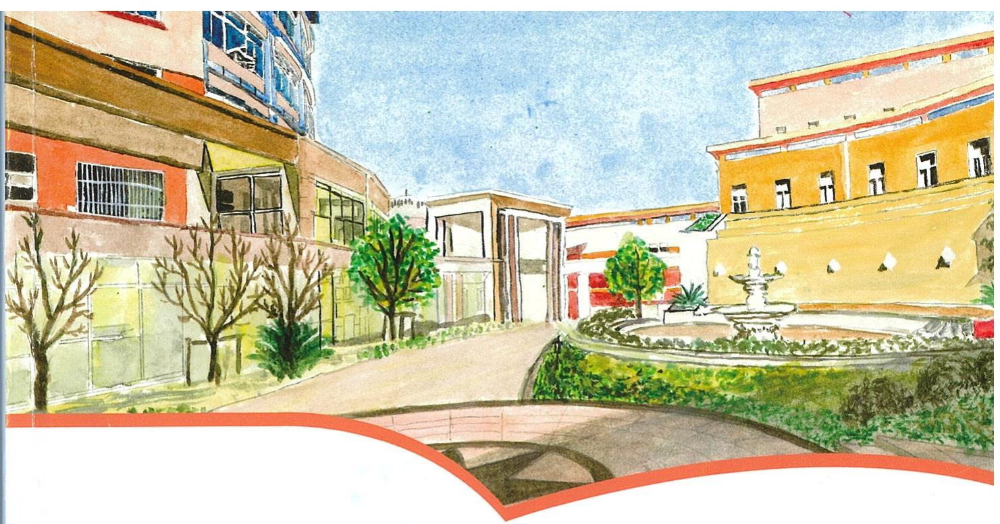

# 协和数学练习册

# SUIS MATHS WORKBOOK

五年级

第二学期

班级 P5B

姓名 李承言Leo学号 23

上海市民办偶和双语学校

SHANGHAI UNITED INTERNATIONAL SCHOOL HONGQIAO CAMPUS

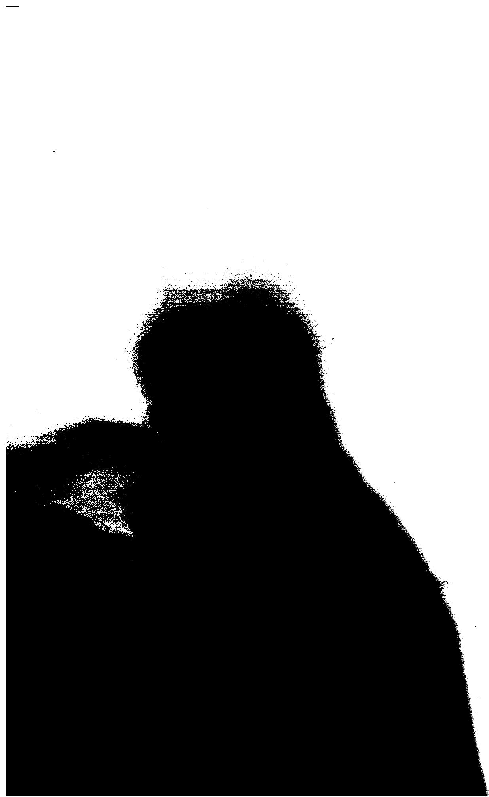

# 目录

# Contents

# 一 复习与提高

单元小贴士 3

1 小数的四则混合运算 ……4  
2方程（1）  
3方程（2） 9  
4 自然数 12

单元练习 14

# 二 正数和负数的初步认识

单元小贴士 17

1 正数和负数（1）……18  
2 正数和负数（2）……20  
3数轴 23  
单元练习 26

# 三 简易方程（二）

单元小贴士 28

1和倍、差倍、和差问题（1）  
30  
2和倍、差倍、和差问题（2）  
32  
3相遇问题（1） 35  
4相遇问题（2） 38  
5相遇问题（3） 41  
6相遇问题（4） 44

7 追及问题（1）……48  
8 追及问题（2）……51  
9 盈亏问题 56  
10 综合练习… 60  
单元练习 64

# 四 几何小实践

单元小贴士 68

1体积与体积单位 70  
2长方体与正方体的认识 73  
3长方体与正方体的体积（1） 75  
4长方体与正方体的体积（2） 78  
5 组合体的体积（1）……83  
6 组合体的体积（2）……86  
7长方体与正方体的表面积（1） 92  
8长方体与正方体的表面积（2） 95  
9 表面积的变化（1）……99  
10 表面积的变化（2） ……102  
11体积与容积（1） 107

12 体积与容积（2）……110

13体积与质量 115

单元练习 118

# 五 可能性

单元小贴士… 122

1可能性和可能性大小 123  
2可能情况的个数· 124单元练习· 125

# 六 总复习

单元小贴士… 130

1数与运算· 131  
2方程与代数… 135  
3 图形与几何……140  
4统计与初步· 144

单元练习 146

# 一. 复习与提高

单元小贴士

Unit Tips

# 方程

6  $(\mathrm{x} + 3.6)\div 2 = 2.6\mathrm{x} + 14.8$

分析：先将左边式子化简，得  $(6\div 2)(x + 3.6) = 2.6x + 14.8.$

$$
6 (x + 3. 6) \div 2 = 2. 6 x + 1 4. 8
$$

解：  $(6\div 2)(x + 3.6) = 2.6x + 14.8$

$$
3 (x + 3. 6) = 2. 6 x + 1 4. 8
$$

$$
3 x + 1 0. 8 = 2. 6 x + 1 4. 8
$$

$$
3 x - 2. 6 x = 1 4. 8 - 1 0. 8
$$

$$
0. 4 \mathrm {x} = 4
$$

$$
x = 4 \div 0. 4
$$

$$
x = 1 0
$$

# 自然数

0是自然数  
相邻的两个自然数相差1.  
$\bullet$  最小的自然数是0，没有最大的自然数  
$\bullet$  自然数6可以表示：

（1）个数：例如6个皮球  
（2）序数：例如小胖排在第6位  
（3）量数：例如这箱梨重6千克  
（4）计算结果：例如  $5 + 1 = 6$  
（5）重复计算的次数：  $3 + 3 + 3 + 3 + 3 + 3 = 6\times 3.$  
（6）编码：例如邮政编码、身份证号码中出现的6等

# 1. 小数的四则混合运算

# 基础练习

# Core Exercises

# 一. 直接写得数。

$$
1. 5 + 0. 0 5 = 1. 5 5 \quad 2. 4 \times 5 = 1 2 \quad 1 4. 3 - 6. 7 - 2. 3 = 5. 3   0. 6 3 \times 1 0 = 6. 3 \quad 2 7. 4 \div 0. 0 1 = . 2 7 4 0 \quad 1 2. 5 \times 1. 3 \times 0. 8 = 1 3   8 \div 0. 1 2 5 = 6. 4 \quad 3 1. 2 \times 0 \div 4 = \mathrm {U} \quad 3. 9 \times 4. 2 + 5. 8 \times 3. 9 = 3 9
$$

# 二．填空题。

$\left( 1\right) {120} \div  {4.8} = \left( {120}\right)  \div  {48} = {0.012} \div  \left( {{0.0004B}\text{ }}\right)  = {40} \div  \left( {1.6}\right)$  
（2）12.8连续减去0.16，要减（9）次，最后结果是0。  
(3) 13.04 除以 3.1 , 如果商是 4.2 , 则余数为 (0.02)。  
(4)比大小：  ${6.5} \times  {0.99} < {6.5}$ ${7.4} \div  {1.01} < {7.4}$ ${2.3} \div  {0.8}\;{3.2} \div  {0.8}$ ${15.8} \times  {100} > {15.8} \div  {100}$

# 三. 将下列各数从小到大排列。

$$
4. 0 \dot {1} \dot {4} 4. 4 0 1 4. 0 \dot {1} \dot {4} 4. 0 \dot {1} \dot {4} 4. 0 1 4 4. 0 1 4 <   4. \dot {0} 1 \dot {4} <   4. 0 \dot {1} \dot {4} <   4. 0 1 \dot {4} <   4. 4 0
$$

# 四．竖式计算，并用“四舍五入”法将得数凑整。

$$
1 6. 5 \times 0. 8 4 \approx 1 3. 9
$$

(得数凑整到十分位)

$$
\frac {\frac {1 6 . 5}{0 . 8 4}}{\frac {1 3 . 2 0}{1 3 . 8 6 8}}
$$

$$
0. 4 \div 0. 7 4 \approx 0. 5 4   (\mathrm {得 数 凑 整 到 百 分 位})   0. 7 4 \div 0. 4 0 0   \frac {0 . 5 4}{3 7 0}   \frac {0 . 6 9 6}{4 0}
$$

# 五. 用递等式计算（能简则简）。

$$
\begin{array}{l} 2. 6 \div 0. 5 \div 0. 1 2 5 \div 8 \quad (2. 7 \times 1. 4 + 6. 6 \times 2. 7) \times 0. 2 5 \\ = 2. 6 \div 0. 5 \div (0. 1 2 5 \times 8) = 2. 7 \times (1. 4 + 6. 6) \times 0. 2 5 \\ - 5. 2 \div 1 = 2. 7 \times (8 \times 0. 2 5) \\ = 5. 2 = 2. 7 \times 2 \\ = 5. 4 \\ \end{array}
$$

$$
\begin{array}{l} 6. 8 \div (3. 4 \times 1 2. 5) \quad \times (6 - 2. 6) \times [ (1 2. 6 - 5. 4) \times 0. 4 - 1. 2 8 ] \\ = 6. 8 \div 3. 4 \div 1 2. 5 = 3. 4 \times [ 7. 2 \times 0. 4 - 1. 2 8 ] \\ = 2 \div 1 2. 5 = 3. 4 \times [ 2. 8 8 - 1. 2 8 ] \\ = (1. 2 \times 8) \div (1 2. 5 \times 8) = 3. 4 \times 1. 6 \\ = 1 6 \div 1 0 0 = 5. 4 4 \\ \end{array}
$$

# 六．应用题。

(1) 有一个筑路队要修筑一条路, 原计划平均每天筑路 70 米, 12 天可以完成, 实际 3 天就筑路 240 米, 完成计划需要几天?

$$
(1 2 \times 7 0) \div (2 4 0 \div 3)
$$

$$
= 8 4 0 \div 8 0
$$

$$
= 1 0. 5 (\mathrm {天})
$$

告,完成计划需要10.5天。

（2）一个长方形的面积和一个正方形的面积相等，正方形的边长是1.2分米，长方形的长是1.6分米，求长方形的周长。

答：长方形的周长是5dm。

$$
\begin{array}{l} (1. 2 \times 1. 2 \div 1. 6 + 1. 6) \times 2 \\ = (1. 4 4 \div 1. 6 + 1. 6) \times 2 \\ = (0. 9 + 1. 6) \times 2 \\ = 2. 5 \times 2 \\ = 5 d m \\ \end{array}
$$

# 举一反三

# Challenges

# 一．递等式计算（能巧算的要巧算）。

$$
\begin{array}{l} \begin{array}{r l} {1 2 0 \times 4 \times 0. 2 5 \times 0. 7} & {7. 6 \times 2 5 + 7 6 \times 7. 6 - 7. 6} \\ {= (1 2 0 \times 0. 7) \times (4 \times 0. 2 5)} \\ {= 8 4 \times 1} \\ {= 8 4} \end{array} \\ [ 7 2. 3 \div 1 5 - (2. 3 8 + 1. 0 8) ] \times 2. 5 \quad 1. 2 \times 9. 9 + 0. 1 2 \\ \end{array}
$$

# 二．选择题。

（1）把1.744，1.74，1.744，1.74，1.74从小到大排列，第4个数是（ ）。

A. 1.744

B. 1.74

C. 1.  $\dot{7} 4\dot{4}$

D. 1.74

（2）如果  $a \times 2.5 = b \div 2.5$  （ $a, b \neq 0$ ），那么  $a$  与  $b$  比较的结果是（ ）。

A.a大于b B.a小于b C.a大于或等于b D.a小于或等于b

# 2. 方程

# 基础练习（1）

# Core Exercises

# 一．解方程（打\*的检验）。

$$
\begin{array}{l} 4 x \div 3 = 2 4 \quad 3 (7 6 - 2 x) = 3 6 \\ 4. 2 x - 0. 2 4 \times 3 = 6 \quad 9 x + 7 x - x = 4. 5 \\ 8. 1 - 3 x = 6 x \quad 2 4 \div x + 0. 2 4 = 0. 4 8 \\ 6 x + 9 = 2. 4 \times 5 \quad 5 (x - 3) \div 2 = 2 0 \\ 1 0. 5 (x - 4) = 2. 5 x \quad 4 + 5 (2 x + 3) = 2 0 \\ \end{array}
$$

$$
\begin{array}{l} 3 x + 2 4. 6 = 5 x - 1 2 \quad x \div 2. 5 + 0. 8 = 2. 1 4 \\ 7 x \div 3 = 0. 2 1 \quad 5 (x + 9) \div 2 = 4 0 \\ 9 (2 x - 5) \div 6 = 5 4 \quad 4 5 + 5 x - 3 x = 7 0 \\ 6. 4 8 \div x = 8 \times 9 \quad 0. 7 5 x - 0. 3 \times 2 = 1. 8 \\ 7. 2 + 3 x = 5 x \quad * 2. 7 x - 3 2 = 1. 1 x \\ * 2 4 - 7 x = 4 x + 2 \\ \end{array}
$$

# 3. 方程

# 基础练习（2）

# Core Exercises

一．化简。

$$
\begin{array}{l} 4 x \times 6 = \quad 3 x + 5 x + 6 = \quad 3 a + 5 a + 6 b - 5 b = \\ 1 7 y - y + 8 y = \quad 2 x \div 8 + x \div 4 = \quad m \div 2 - m \div 5 = \\ \end{array}
$$

二. 解方程（打*要检验）。

$$
3 2 x - 7 x - 5 x = 4 2 0 \quad 4 (x - 8) \div 5 = 6
$$

$$
3 x \div 2 + 5 = 2 0 \quad 9. 6 x \div 6 - 1 2. 6 x \div 9 = 5. 5
$$

$$
(2 5 x + 4 x + x) \div 3 = 5 0 \quad 4 + 2 (3 5 - x) = 1 0
$$

$$
* 4 x + 6 3. 9 = 9 x - 2 x \quad * 3 5 \div 7 = 4 0 \div 2 x
$$

# 三．文字题。

（1）3.6与2.5积加上某数的一半是10.2，某数是多少？  
（2）一个数的5倍正好等于这个数与3.4的和，求这个数。  
（3）一个数的3倍比它的4.5倍少3.9，这个数是多少？  
（4）甲数是65，比乙数的3倍少10，乙数是多少？  
（5）某数被0.01除的商加上这个数，和是3.03，求这个数。  
（6）一个数的5.1倍减去36的差，等于这个数的3.1倍，求这个数。

举一反三

Challenges

一．解方程。

$$
\begin{array}{l} 6 x \div 2 + 1 5 x \div 3 = 8. 1 6 \\ 9 x \div 2 - 5 x \div 2 = 1 7. 8 \\ \end{array}
$$

$$
\begin{array}{l} x \div 2 + x \div 1 0 = 1 2. 6 \\ 1 4. 4 x \div 2 - 1 0. 8 x \div 4 = 5 4 + 4. 5 \\ \end{array}
$$

# 二. 列方程解决问题。

方程  $x - 0.8 = 2.4$ ，与方程  $ax = 9.6$  有相同的解，求  $a$  的值。

# 4. 自然数

# 基础练习

# Core Exercises

# 一．选择题。

（1）下列各数中（ ）是自然数。

A. 1

B. 1.1

C.  $\frac{3}{4}$

D. 以上都不是

（2）最小的自然数是（ ）。

A. 0

B. 1

C. 0.1

D. 不存在

（3）最大的自然数是（ ）。

A. 9

B. 99

C. 999

D. 不存在

（4）如果一个自然数是a，那么接在它后面的一个自然数是（）。

A. a-1

B. a

C. a+1

D. a+2

二. 将下列各数按要求分类。

56

32

17 20

640000

100 100

999.9

0.0001

9305

11111

13 53

自然数

小数

分数

$\therefore m = \frac{3}{11}$

# 三．判断题。

（1）两个自然数的差一定是自然数。  
（2）在相邻的两个自然数中，后一个数总比前一个数大1。（ ）  
（3）一个自然数不是奇数，就是偶数。  
（4）最大的自然数是999999999。

# 举一反三

# Challenges

# 一．填空题。

（1）如果用  $\mathrm{n}$  表示一个自然数，那么  $\mathrm{n}$  后一个自然数是（ ），比  $\mathrm{n}$  大10的数是（ ）。  
（2）两个自然数的和是5，它们的积是0，这两个自然数是（ ）和（ ）。  
（3）三个连续自然数的和是255，其中最小的一个是（ ）。

# 二．选择题。

（1）若a是自然数，则下面一定是自然数的是（ ）。

A.  $a \div 2$

B.  $a - a \div 3$

C. 7a

D.  $a \div 5 \times 4$

（2）最大的自然数是（ ）。

A. 99 9999

B. 10000 0000

C. 不存在的

D. 300 亿

（3）大于300，小于400的自然数的和是（ ）。

A. 350

B. 700

C. 3500

D. 34650

# 三．解决问题。

（1）三个连续的自然数和是327，求这三个连续的自然数分别是几？  
（2）两个连续的偶数的和乘它们的差，积是124，这两个偶数的积是多少？

# 单元练习

# Unit Exercises

一. 直接写得数。

$$
0. 3 9 \div 1. 3 = 6. 6 + 0. 6 6 = 8. 4 \div (2. 3 + 1. 9) =
$$

$$
3 \div 0. 5 + 7. 8 = \quad 8 + 0. 2 5 \times 4 = \quad (5 - 5 \times 0) \times 0. 4 =
$$

$$
7 7 \div 0. 7 7 \times 1 0 0 = 2 \times 4. 9 = 1 2. 4 - (1 2. 4 - 8) =
$$

二．竖式计算。

$$
3. 0 8 \times 6. 4 5 = 2. 1 3 \div 3. 3 =
$$

三．解方程。

$$
7 2. 6 x \div 6 = 1 0. 8 9 \quad 0. 6 (x + 1. 7) \div 1. 2 = 1 9. 2
$$

四. 用递等式计算（能简则简）。

$$
2. 8 \div 1. 4 - 1. 4 \times 0. 5 \quad 7. 1 7 - 3. 7 9 + 2. 8 3 - 6. 2 1
$$

$2.5 \times 4.44$  （6-2.5） $\times [12.6 - 5.4) \div 0.4]$  
$47.6\div [32.5 - (11.04\div 2 - 1.02)]$ $4.8\div (40\times 0.8)$  
五. 列综合算式计算。

（1）一个数的2.5倍比84.5的6倍少7，求这个数。

（2）3.5与6.4的积，除以77.4与2.6的和，商是多少？

六. 应用题。

一辆汽车运石子，第一天5次运了22.5吨，第二天7次运了31.5吨，第三天运了6次，平均每次运4.5吨。

①这辆汽车平均每天运多少吨？②这辆汽车平均每次运多少吨？

七．填空题。

（1）自然数的个数是（ ），相邻的两个自然数相差（ ）。  
（2）一个三位小数四舍五入后结果是0.50，这个三位小数最小是（ ），最大是（ ）。  
（3）在0.879，0.8,0.87，0.87这四个数中，从大到小排列在第三位的数是（ ）。  
（4）a只兔子和b只鸡，共有（ ）只脚。（用含有字母的式子表示。）

# 二. 正数和负数的初步认识

单元小贴士

Unit Tips

# 正数和负数

$①$  前面有“  $+$  ”号的数都是正数，“  $+$  ”号可以省略不写；前面有“一”号的数都是负数。零既不是正数，也不是负数。  
②在日常生活或生产实际中，我们常用正数和负数来表示具有相反意义的量。例如： $10^{\circ}\mathrm{C}$  表示零上  $10^{\circ}\mathrm{C}$ ， $-5^{\circ}\mathrm{C}$  表示零下  $5^{\circ}\mathrm{C}$ 。

# 易错题

① 潜水员潜水，他第一次下潜5米，记作一5米，如果他继续下潜6米，这时他一共下潜了（11）米。

分析：从题中得知，潜水员两次下潜，分别为-5米和-6米，因此两次一同下潜几米，应从加法角度来解答：  $5 + 6 = 11$  （米）。

$②$  一幢大楼18层，地面以下有2层。地面以上第3层记作  $+3$  层，地面以下第1层记作（-1）层，地面以上第5层记作（  $+5$  ）层。

分析：从题中得知，第3层记作  $+3$  层，说明以地平面为“0”，地面以下第一层记作  $-1$  层，地面以上第5层记作  $+5$  层。

# 数轴

① 数轴三要素：原点、正方向、单位长度。  
② 数轴的画法：确定原点；规定正方向；选取单位长度。

# 1. 正数和负数

# 基础练习（1）

# Core Exercises

# 一．填空题。

（1）在日常生活或生产实际中，我们常用（ ）和（ ）来表示具有相反意义的量。前面有“十”号的数都是（ ），前面有“一”号的数都是（ ）。

（2）零既不是（ ），也不是（ ）。  
（3）  $+15^{\circ}C$  读作：（ ）；零下  $2^{\circ}C$  记作：（ ） $-20^{\circ}C$  读作：（ ）；零上  $13^{\circ}C$  记作：（ ）

# 二. 将下列各数分类。

+6 4.3 -0.1 0 -5 +10.74   
 $\frac{3}{10}$  520 +2 20 -999.99

正数：  
负数：  
既非正数，又非负数：

# 三．判断题。

（1）因为  $+11, +7$  前面带有“  $+$  ”是正数，9前面没有带“  $+$  ”所以9不是正数。  
（2）  $-18^{\circ}C$  表示零下  $18^{\circ}C$  。  
（3）数分为正数和负数。

# 四. 用递等式计算。

$3.76 + 117\div 36 - 0.44$ $40.2 - 2.04\times 6\times 0.5 - 19.8$

$6.8 + (8.8 - 5.3) + 3.5 \times 3$ $85.6 - 3.605 \times (200 \div 25 - 8)$

# 五. 应用题。

（1）一个大梨重0.45千克，一个菠萝的重量是它的2.2倍，一个大西瓜的重量是菠萝重量的8倍，这个西瓜重多少千克？  
（2）植树节到了，少先队员参加植树活动，第一天植树155棵，比第二天少植15棵，第三天植的树是第二天的1.3倍，三天共植几棵？  
（3）一列客车与一列货车从相距855千米的两个车站同时相对开出，9小时相遇，货车每小时行52.5千米，客车每小时行多少千米？

# 2. 正数和负数

# 基础练习（2）

# Core Exercises

# 一．填空题。

（1）如果小华家月收入2500元记作2500元，那么他家这个月水、电、煤气支出200元应记作（ ）元。  
（2）河道中的水位比正常水位低0.2米，记作一0.2米，那么比正常水位高0.5米，记作（ ）。  
（3）一物体可以左右移动，向左移动12米，记作—12米，“记作8米”表示向（ ）移动（ ）米。  
（4）如果进了3个球记作  $+3$  ，那么失2球，应记作（ ）。

# 二.下图每小格为3米，小胖开始位置为0处（向东为正）。

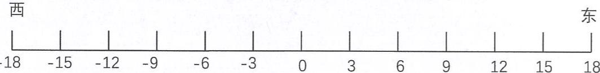

（1）如果小胖从0处向西行6米，记作：  
（2）如果小胖的位置是15米，表示向 走 米。  
(3)如果小胖先向东行12米，再向西行15米，他现在的位置记作

# 三.超市某袋食品包装上有如下字体：“净含量：  $500\mathrm{mL}\pm 10\mathrm{mL}$

这是什么意思？

完成下表：质量检查部门对这种食品进行了抽查，结果如下表（单位：mL）

<table><tr><td></td><td>1</td><td>2</td><td>3</td><td>4</td><td>5</td><td>6</td><td>7</td><td>8</td><td>9</td><td>10</td></tr><tr><td>含量</td><td>490</td><td>503</td><td>510</td><td>498</td><td>509</td><td>504</td><td>499</td><td>492</td><td>504</td><td>491</td></tr><tr><td>比净含量多少mL</td><td></td><td></td><td></td><td></td><td></td><td></td><td></td><td></td><td></td><td></td></tr></table>

上表说明了什么？

四. 用递等式计算（能简则简）。

46.9—13.56—4.44 8.936—（2.936—2.578）

$13.944 \div [(9 - 0.48 \times 1.25) \times 0.4]$ $(2.5 + 0.25 + 25.25) \times 1.6$

# 举一反三

# Challenges

# 一．填空题。

（1）下面的表格是全国各地的一天中的气温变化情况（单位：  $^\circ C$  ）。

<table><tr><td>城市</td><td>深圳</td><td>广州</td><td>天津</td><td>上海</td><td>江西</td><td>哈尔滨</td></tr><tr><td>最高气温</td><td>20</td><td>22</td><td>8</td><td>5</td><td>9</td><td>-1</td></tr><tr><td>最低气温</td><td>15</td><td>16</td><td>-3</td><td>-1</td><td>3</td><td>-13</td></tr><tr><td>温差</td><td></td><td></td><td></td><td></td><td></td><td></td></tr></table>

（2）一天中午12时的气温是  $7^{\circ}C$  ，傍晚5时的气温比中午12时下降了4摄氏度，凌晨4时的气温比中午12时低  $8^{\circ}C$  ，傍晚5时的气温是（ ），凌晨4时的气温是（ ）。

二．列综合式计算。

5.2的6倍加上比8.4大4.8的数，和是多少？

三．应用题。

一个泥工小组，第一天砌砖593块，第二天砌砖805块，第三天比第一天多砌砖124块，第一天、第三天平均每天砌砖多少块？三天平均每天砌砖多少块？

# 3.数轴

# 基础练习

# Core Exercises

一．填空题。

（1）用数轴上的点表示数，所有表示正数的点都在原点的（ ）边，所有表示负数的点都在原点的（ ）边，原点是表示（ ）和（ ）的点的分界点。  
（2）在单位长度为1的数轴上，+4和-4相隔（ ）个单位长度。

二. 看图填空。

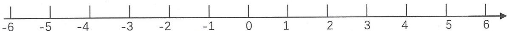

（1）在原点（ ）边，离开原点（ ）个单位长度的点所表示的数是2。  
（2）在原点（ ）边，离开原点（ ）个单位长度的点所表示的数是-5。

三. 按要求填空。  
-3，-2，+5,0,4，-4这些数中，正数有（ ），负数有（ ），（ ）既不是正数也不是负数。

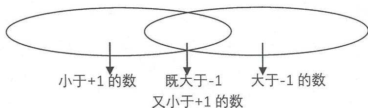

将上列各数从大到小排列：

四. 比较下列各数的大小。

$$
- \frac {2}{5} \bigcirc - \frac {2}{9} \quad 0 \bigcirc + 0. 1 \quad - 3. 5 \bigcirc - 2. 5 \quad - \frac {1}{2} \bigcirc - 1. 3
$$

五. 将下列各数分类。

$$
+ 1 7, - 1, 0, - 1. 3, + 1. 4, + \frac {4}{5}, 9, - \frac {2}{3}, - 1 0, - \frac {7}{9}, + 2. 6
$$

正数：

负数：

自然数：

分数：

小数：

六. 递等式计算。

$$
0. 4 \div 0. 4 - 0. 4 + 0. 4 \times 0. 4 \quad (0. 4 + 0. 4 - 0. 4 \times 0. 4) \div 0. 4
$$

$$
0. 4 \div 0. 4 - (0. 4 + 0. 4) \times 0. 4 [ (0. 4 - 0. 4) \times 0. 4 + 0. 4 ] \div 0. 4
$$

七. 解方程。

$$
3. 5 \times 8 + 1 0 x = 8 9 \quad 1 0 x - 4 \times 0. 7 = 1. 2
$$

# 举一反三

# Challenges

一. 写出点A、B、C、D表示的数：

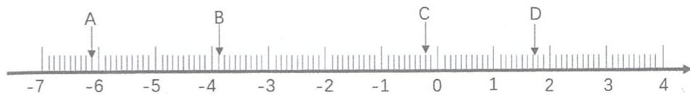

点A表示的数是（ ）点B表示的数是（

点C表示的数是（ ）点D表示的数是（

二. 在下列数轴上找出表示-5.3，+1.6，-2.7，-0.9，3.1的点，并用A、B、C、D、E表示。

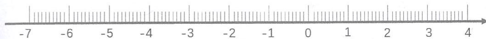

三．在下列数轴上找到表示  $-\frac{3}{4}, -\frac{1}{2}, \frac{1}{3}$  的点。

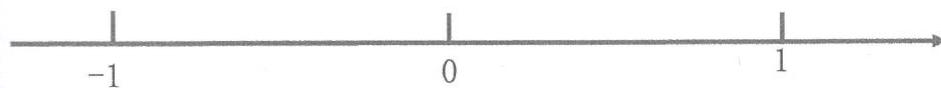

四. 比较  $-\frac{5}{7}, \frac{1}{7}, -\frac{2}{7}, +\frac{3}{7}$  的大小，并用“<”连接。

# 单元练习

# Unit Exercises

# 一．递等式计算（能简算的要简算）。

$3.4 \div 0.25$

$51\times 7.5 - 49\times 7.5 - 7.5$

$5.4\div 0.25\div 4$

$80.8\times 0.125$

# 二. 解方程并检验。

4（5.6x—18）=144

$8\times 3.3 - 3x = 2.4$

# 三．填空题。

（1）在数轴上的点，越往左数就越（ ），越往右数就越（ ）。  
（2）如果把高出地面的高度记作正的，某广播电台的发射天线高出地面75米，记作 ；附近的地下人行道低于地面5米，记作  
（3）如果把顺时针方向旋转  $45^{\circ}$  ，记作一  $45^{\circ}$  ，那么逆时针方向旋转  $45^{\circ}$  ，记作

（4）写出4个比-1大，比  $+2$  小的数（ ）、（ ）、（ ）、（ ）。  
（5）将仓库一周内货物的进出情况填入表格，运进为正。

周一运进43吨，周二运出14吨，周三运出18吨，周四运进58吨，周五运进12吨，周六运出37吨，周日运出21吨。

<table><tr><td>星期</td><td>一</td><td>二</td><td>三</td><td>四</td><td>五</td><td>六</td><td>日</td><td>结余</td></tr><tr><td>进出量</td><td></td><td></td><td></td><td></td><td></td><td></td><td></td><td></td></tr></table>

（6）写出比-2大，比  $+4$  小的整数：（ ）。  
（7）把  $+2$  ，0，-2，1，-3填入相应的圈内。

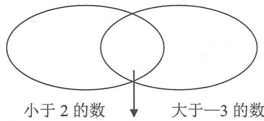  
小于2有大于一3的数

（8）在一格表示1的数轴上，原点右边5个单位长度的点表示（ ），左边3个单位长度的点表示（ ），这两点相距（ ）个单位长度。

# 四．选择题。

（1）如果一个班级平均分是92分，若以平均分为标准，平均分以上为正，那么小胖考了90分，记作（ ）

A. +90分

B. -90分

C. +2 分

D. -2 分

（2）-3，-3.2，-2.3，-2.03中，最小的数是（ ）

A. -2.3

B. -2.03

C. -3.2

D. -3

# 三. 简易方程（二）

单元小贴士

Unit Tips

# 相遇问题

# 中点问题

例：两辆汽车同时从两地相对开出，甲车行164千米时与乙车相遇。这时甲离两地中点还有15千米，已知乙车每小时行48.5千米，相遇时乙车行了多少小时？

分析：画线段图分析

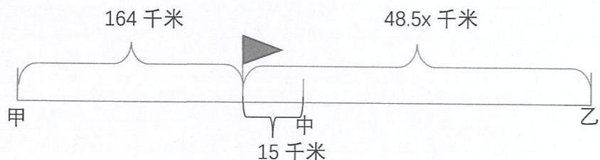

等量关系：① 甲车的行驶路程  $+15$  千米  $=$  乙车的行驶路程  $-15$  千米解：设相遇时乙车行了  $x$  小时。

48.5x-15=164+15  
48.  $5\mathrm{x} = 179 + 15$  
48.  $5\mathrm{x} = 194$

x=4

答：相遇时乙车行了4小时

等量关系：②甲车的行驶路程-乙车的行驶路程  $= (15 \times 2)$  千米解：设相遇时乙车行了  $\mathrm{x}$  小时。

48.  $5\mathrm{x} - 164 = 15\times 2$  
48.  $5\mathrm{x} = 30 + 164$  
48.5x=194

x=4

答：相遇时乙车行了4小时

# 易错题

A、B两地相距420千米，两辆汽车同时从A地开往B地，甲车每小时行42千米，乙车每小时行28千米，甲车到达B地后立即返回A地，在途中与乙车相遇。两车从出发到相遇经过多少小时？

分析：由于“甲车到达B地后立即返回A地，”因此，总路程是2个420千米。

等量关系：甲车行的路程+乙车行的路程=2×420

解：设两车从出发到相遇经过  $x$  小时。

$$
\begin{array}{l} 4 2 x + 2 8 x = 4 2 0 \times 2 \\ 7 0 x = 8 4 0 \\ x = 1 2 \\ \end{array}
$$

答：两车从出发到相遇经过12小时。

# 追及问题

# 易错题

同学们排队去看电影，队伍长600米，以每秒2米的速度前进。排尾的王老师以每秒4米的速度跑到排头给张老师送电影票，王老师需要多少秒才能将电影票交给张老师？

分析：从条件“排尾的王老师以每秒4米的速度跑到排头给张老师送电影票”看出，这是追及问题。

等量关系：王老师走的路程  $=$  张老师走的路程  $+$  队伍长度。

解：设王老师需要  $\mathbf{x}$  秒才能将电影票交给张老师。

$$
\begin{array}{l} 4 x = 2 x + 6 0 0 \\ 2 x = 6 0 0 \\ x = 3 0 0 \\ \end{array}
$$

答：王老师需要300秒才能将电影票交给张老师。

# 1. 列方程解决问题——“和倍”“差倍”“和差”问题

# 基础练习（1）

# Core Exercises

# 一．直接写得数。

28-2.8=  $72\div 0.9 =$  5.8+4.2÷0.06=  
15.3+9.7= 6.33×5= (10-3.4)×0.8=  
8.6—4.9= 49.49÷0.7= 12.5×8—8=

# 二.解方程（打※要检验）。

5.  $5 + 6x = 28.3$  19.2+1.8x=7.8x

※0.7(x-2.4)=11.2 ※9.5x-1=7.1x+5

# 三．列方程解应用题。

（1）一个平行四边形的周长是  $54\mathrm{cm}$  ，其中一条边长为  $12\mathrm{cm}$  ，那么这条边的邻边长多少？

（2）有一块三角形石板，面积为  $48\mathrm{dm}^2$  ，已知它的高为  $8\mathrm{dm}$  ，那么与之对应的底边长是多少？  
（3）一个直角梯形，上底为  $3\mathrm{cm}$  ，是直角腰的一半，它的面积是 $21\mathrm{cm}^2$  ，那么这个梯形的下底长多少？  
（4）一个梯形花坛的面积是64平方米，上底与下底长度和是16米，求这个梯形花坛的高。  
（5）小巧有两根丝带，长度相差0.8米，且第一根丝带的长度是第二根的2倍，求两根丝带的长度各是多少？  
（6）小丁丁的两个抽屉里共有78本书，且第一个抽屉的书比第二个抽屉多18本，两个抽屉各放多少本？

# 2.列方程解决问题——“和倍”“差倍”“和差”问题

# 基础练习（2）

# Core Exercises

# 一. 直接写得数。

61.3-36.8=  $18.5\times 0.6 =$  8.3÷0.2=

45.6+24.7=  $32\div 0.5 =$  58.6×0.6=

94.6-28.9= 43.7×0.9= 84.5÷0.5=

# 二．解方程。

7.8-x=3.6+x 0.4（2-3x）=2x

3.  $4x - 4.1 + 1.6x = 6.4$  （10x-4.8）÷4=0.6

# 三．列方程解应用题。

（1）小雅把自己制作的208颗幸运星分放在2个瓶子里，第一个瓶子放的幸运星比第二个瓶子的2倍还多10颗，这两个瓶子里各放了多少颗幸运星？

（2）有两根电线，第二根的长度是第一根的2.5倍，如果把第二根电线剪去12米，那么这两根电线的长度就相等，第二根电线原来长度是多少？

（3）爸爸比小明大29岁，今年爸爸的年龄比小明的6倍多4岁，爸爸和小明各几岁？

（4）李老师花了285元买来足球、排球各3个，一个足球比一个排球贵15元，一个足球要多少钱？

# 举一反三

# Challenges

# 一．列方程解决问题

（1）一块平行四边形的钢板，底的长度是28厘米，比高度的3倍少5厘米，这块钢板的面积是多少平方厘米？  
（2）甲乙两数之和是99，乙数末尾添上0后和甲数相等。甲乙两数各是多少？  
（3）一箱苹果、一箱梨、和一箱橘子共重80千克，苹果的重量是梨的2倍，梨的重量是橘子的3倍，苹果、梨、橘子各有多少千克？  
（4）一个梯形的下底是上底的2.5倍，上底延长9厘米之后，这个梯形就变成一个平行四边形，这个梯形高是6厘米，求梯形的面积。

# 3.列方程解决问题一一相遇问题

# 基础练习（1）

# Core Exercises

一．解方程。

5  $(3x - 8) = 125$

4（x-13）=23+x

6  $(2x + 1.5) = 5x + 58$

15.6-2（x-7.4）=12.4

二．列方程解应用题。

（1）小丁丁和小巧从相距2500米的图书馆和游泳池同时出发，相对而行，10分钟后相遇。如果小丁丁行走的速度是150米/分，那么小巧的行走速度是每分钟多少米？  
（2）小胖、小丁丁两人从相距27千米两地同时相向而行，小胖每小时行5千米，小丁丁每小时行4千米，几小时后两人相遇？

（3）两地相距570千米，一辆轿车和一辆卡车分别从两地出发，相向而行。轿车先行了90千米后，卡车才出发，3小时后，两车在途中相遇。已知卡车的速度是60千米/时，求轿车的速度。  
（4）甲乙两人骑自行车分别从相距86千米的两地出发相向而行，甲先行20千米后，乙再出发，甲的速度是18千米/时，乙的速度是15千米/时，乙出发几小时后两人在途中相遇？  
（5）上海到拉萨的铁路全4373千米，一列客车和一列货车分别从上海和拉萨两地出发相向而行，客车先行117千米后货车再出发，客车的速度是61.6千米/时，货车的速度是50.4千米/时，货车经过几小时后与客车在途中相遇？

（6）甲乙两人骑自行车分别从相距95千米的两地出发相向而行，甲先行8千米后乙再出发，乙出发3小时后，两人在途中相遇。已知甲的速度是16千米/时，求乙的速度。  
（7）小亚和小巧同时从相距1620米的两地出发相向而行。小亚每分钟行80米，10分钟后两人还相距50米，求小巧的速度。  
（8）两车分别从相距580千米的两地相对开出，甲车每小时行50千米，行了310千米后，乙车才出发，乙车和每小时行40千米，乙车开出几小时后两车相遇？

# 4.列方程解决问题一一相遇问题

# 基础练习（2）

# Core Exercises

# 一．解方程。

（1）  $16 - 3x = 2x - 6$

(2)  $0.4(5x + 4) = 1.8$

（3）7  $(\mathrm{x - 1.2}) = 5\mathrm{x - 7.6}$

# 二.用递等式计算（能简便的要用简便方法计算）。

（1）  $2.5\times (6.1 - 0.26)\times 0.4$

(2)  $3.64 \times 98 + 3.64 + 3.64$

# 三. 列综合算式或方程计算。

（1）12.7减去4.5与0.6的积，所得的差除1，商是多少？

（2）某数的8倍加上10等于这个数的10倍减去8，求这个数。

# 四. 列方程解应用题。

（1）甲乙两车同时从相距260千米的两地相向而行，3.4小时后还相距5千米，甲车每小时行45千米，乙车每小时行多少千米？  
（2）甲乙两车从相距20千米的AB两地同时出发，相背而行。甲车每小时行46.5千米，乙车每小时行43.5千米，几小时后两车相距200千米？  
（3）两列火车同时从相距541千米的甲乙两地相向而行，客车每小时行78千米，货车每小时行48千米，多少小时后两车还相距100千米？

（4）一条公路长2.5千米，两支施工队同时从公路的两端往中间铺柏油，第一队平均每天铺柏油0.04千米，20天后两队还相距0.7千米，第二队平均每天铺柏油多少千米？  
（5）上海到拉萨的铁路全长4373千米，一列客车和一列货车同时从两地出发相向而行，客车的速度是61.6千米/时，货车的速度是50.4千米/时，几小时后两车还相距117千米？  
（6）两辆汽车同时从相距380千米的两地出发相向而行，一辆汽车的速度是75千米/时，另一辆汽车的速度是83千米/时，几小时后两车还相距64千米？  
（7）小亚和小巧同时从相距1620米的两地出发相向而行，小亚每分钟行80米，10分钟后两人相遇后又相距50米，求小巧的速度。

# 5.列方程解决问题一一相遇问题

# 基础练习（3）

# Core Exercises

# 一．递等式计算。（能简便的要用简便方法计算）

$(1 - 0.2)\times (4 - 3.68)\div 0.01$  38.78-19.59+41.22-30.41

(12.6-0.75+0.25)÷(5.5×0.2) 8÷[(40.75-9.5)×0.4]+0.36

# 二. 列方程解应用题。

（1）甲乙两车分别以每小时100千米和68千米的速度同时从AB两地相对开出，在途中相遇，相遇时甲车比乙车多行320千米，两车开出几小时后相遇？  
（2）两车同时从甲乙两地相向而行，小汽车的速度是60千米/时，卡车的速度是48千米/时，两车相遇时小汽车比卡车多行30千米，甲乙两地相距多少千米？

（3）两辆汽车同时从两地相对开出，甲车行164千米时与乙车相遇。这时甲车离两地中点还有15千米，已知乙车每小时行48.5千米，相遇时乙车行了多少小时？  
（4）两辆汽车同时从两地出发相向而行，3小时后在离中点15千米处相遇，已知快车的速度是88千米/时，求慢车的速度。  
（5）甲乙两地之间的路程是470千米，一辆客车和一辆卡车同时从两地出发相向而行，途中客车因加油而停了半小时，结果卡车3.2小时后与客车相遇。已知卡车平均每小时行76千米，求客车平均每小时行多少千米？

（6）小巧和小亚练习打字，小巧平均每分钟打字31个，小亚平均每分钟打字38个，小巧先打了7分钟后，小亚才开始打，多少分钟后两人打的字一样多？  
（7）AB两地之间的路程是10.5千米，小李和小王分别从两地出发，相向而行。小李15:00出发，平均每分钟走0.07千米，小王15:20出发，小王经25分钟后与小李相遇，小王平均每分钟走多少千米？  
（8）北京和呼和浩特之间的铁路全长660千米，一列客车和一列货车同时从两地出发相向而行。途中货车因让道停了0.5小时，结果客车6小时后与货车在途中相遇。已知客车的速度是66千米/时，求货车的速度。

# 6.列方程解决问题一一相遇问题

# 基础练习（4）

# Core Exercises

# 一．解方程。（打★要验算）

5  $(3.6 + x)\div 2 = 20.25$

★0.9（12-x）=0.6(x-2)

# 二. 递等式计算：（能巧算要巧算）。

$3.78 \times 7.8 + 37.8 \times 0.12 + 3.78$

28.78-18.59+51.22-31.41

$(3.06 \div 0.75 + 3.06 \div 0.25) \div 0.01$

# 三. 列综合算式或方程解。

（1）4除1.84的商加上2个0.5的积，和是多少？

（2）一个数的2倍比它的一半多7.5，这个数是多少？

# 五. 列方程解应用题。

（1）甲乙两人骑自行车分别从相距75千米的两地出发相向而行。甲先出发，0.5小时后乙再出发，乙出发2小时后两人在途中相遇。已知甲的速度是18千米/时，求乙的速度。

（2）小亚和小巧同时从相距2700米的两地出发相向而行，途中小巧因购物停10分钟，结果小亚25分钟后与小巧在途中相遇。已知小亚的速度是72米/分，求小巧的速度。

（3）甲乙两队合作修一条长4.2千米的公路。甲队平均每天修200米，乙队每天修180米，甲队先修，两天后乙队才开工。乙队开工几天后两队能把这条路修完？  
（4）一个圆形水池，周长1160米，两个同学同时从同点出发，围绕水池相背而行，走10分钟后相遇。已知一个同学的行走速度是62米/分，求另一个同学的行走速度。  
（5）同学们排队去看电影，队伍长600米，以每秒2米的速度前进。排头的王老师以每秒4米的速度跑到排尾给张老师送电影票，王老师需要多少秒钟能将电影票交给张老师？

# 举一反三

# Challenges

列方程解应用题。

（1）小丁丁和小巧在一个环形跑道的同一地点同时出发背向而行，小丁丁每秒跑5.8米，小巧每秒跑4.2米，经过40秒钟两人相遇。如果两人在同一地点同时出发同向而行，几秒钟后两人相遇？  
（2）甲乙两地相距420千米，客车从甲地出发开往乙地，每小时行50千米，4小时后货车从乙地出发开往甲地，又经过2小时两车相遇，相遇后各自继续前进，哪辆车先到达终点？请列式计算说明。  
（3）甲乙两人分别骑车从相距245千米的AB两地同时出发，相向而行，经过5小时相遇。已知甲每小时比乙多行3千米，甲再行多少千米就能到达B地？

# 7.列方程解决问题一一追及问题

# 基础练习（1）

# Core Exercises

# 一．简便计算。

$$
1. 8 \times 1. 5 \div 1. 8 \times 1. 5
$$

$$
6. 4 \times 1 1 \times (2. 5 \times 0. 1 2 5)
$$

# 二. 列方程解决问题。

（1）小胖和小雅先后离开电影院赶回学校，小胖以120米/分的速度走出600米后，小雅以150米/分的速度追了上去，照这样的速度，几分钟后小雅才能追上小胖？

（2）小巧和小雅家相距750米，某天，两人同时从自己家出发，朝同一方向行进，小雅在前，小巧在后，小巧每分钟行100米，小雅每分钟行75米，几分钟后小巧能追上小雅？

（3）小强和小玲看一本同样的故事书，小强每天看20页，小玲每天看25页，小强看了40页后，小玲才开始看，结果两人同时看完，小玲看这本书用了几天？

（4）AB两地相距18千米，甲乙两车同时分别从AB两地向同一方向驶出，甲车在前，乙车在后，甲车每小时行48千米，1.5小时后乙车追上甲车，求乙车的速度。

（5）甲乙两车同时从相距120千米两地出发同向而行，甲车每小时行88千米，乙车每小时行73千米，几小时后甲车追上乙车？

（6）小亚和小巧比赛爬山，小亚爬了200米后小巧从山脚出发，小亚平均每分钟爬70米，小巧平均每分钟爬80米，几分钟后小巧追上小亚？

（7）师徒两人加工同样的零件，徒弟每小时加工18个，师傅每小时加工25个，徒弟先加工35个，师傅才开始加工，师傅做了几小时后，师徒两人加工的零件相等？  
（8）小胖和小丁丁各自打一份字数相同的文件，小胖每分钟打40个字，小丁丁先打了60个字之后，小胖才开始打，15分钟后两人同时完成任务，小丁丁每分钟打多少字？  
（9）一艘快艇从甲港经乙港开往丙港，每小时行38千米。同时一艘轮船从乙港开往丙港，4小时后两船同时到达丙港。已知甲乙两港相距24千米，求轮船的速度。

# 8.列方程解决问题一一追及问题

基础练习（2）

Core Exercises

一．解方程。

$$
1 6 x - 1 0 = 6 x + 2 4 0
$$

$$
5 (2 4 - x) = 1 0 x
$$

二．列综合算式或方程计算。

（1）一个数的一半比1.6除8的商少1.5，求这个数。  
（2）一个数减去0.6的差的1.2倍比这个数的3倍少66.42，求这个数？

# 三．列方程解应用题。

（1）光明小学五年级学生步行到郊外旅行，（1）班学生组成前队，步行速度是4千米/时，（2）班学生组成后队，速度为6千米/时，前队出发一小时后，后队才出发，几小时后在途中追上前队？

（2）小胖家离学校1000米，小胖早上以70米/分的速度从家出发去学校上学，5分钟后，小胖的爸爸发现他忘带语文书，于是爸爸立即以170米/分的速度去追小胖，并且在途中追上，爸爸追上小胖用了多长时间？追上小胖时，离学校还有多远？  
（3）妈妈下班步行回家，若按常速走平均每分钟走60米，由于今天家中有事，她加快速度，平均每分钟走70米，结果提前4分钟到家，今天妈妈下班回家走了多少分钟？  
（4）林玲和晶晶同时从相隔1千米的两地相背而行，林玲每小时行3千米，晶晶骑自行车每小时行12千米，3小时后两人相距多少千米？

（5）小巧和小胖合作打一篇1850字的文章，小巧平均每分钟打36个字，小胖平均每分钟比小巧多打2个字，几分钟后，两人还剩下148个字没有打？  
（6）刘老师和宋老师从学校出发骑车去光明电影院看电影，刘老师每分钟行220米，宋老师每分钟行280米，刘老师出发3分钟后，宋老师去追赶，结果两人同时到达电影院，宋老师骑了多少分钟？如果刘老师18:00出发，电影18:30开映前能赶到电影院吗？  
（7）一艘轮船和一艘快艇从上海出发开往普陀山，轮船先开3小时，轮船的速度是64千米/时，快艇的速度是160千米/时，快艇出发几小时后追上轮船？

（8）一队学生从学校出发进行野营训练，每分钟行75米，20分钟后，学校要将一紧急通知传给队长，通讯员从学校出发，骑自行车以每分钟225米的速度追，通讯员用多长时间追上队伍？  
（9）一辆轿车和一辆客车从上海出发开往南京，轿车比客车迟开0.5小时，轿车的速度为96千米/时，客车的速度是80千米/时，轿车出发几小时后能追上客车？  
（10）甲乙两车同时从A地出发开往B地，甲车的速度是64千米/时，乙车在半路上因故障停下来维修0.5小时，结果甲车在出发2.5小时后与乙车同时到达B地，求乙车的速度。

# 举一反三

# Challenges

列方程解应用题。

（1）甲、乙两人从A地到B地，乙每分钟走65米，先走了300米后甲才出发，20分钟后甲追上乙。求甲的速度。  
（2）甲乙两人从A地到B地，甲以每分钟80米的速度去追先出发的乙，已知乙每分钟走65米。甲用20分钟追上乙。乙比甲先出发多少米？  
（3）甲乙两地相距360千米，客车和货车同时从甲地出发驶向乙地，客车每小时行60千米，货车每小时行40千米，客车到达乙地后停留0.5小时，又以原速返回甲地，问从甲地出发后几小时两车相遇？

# 9.列方程解决问题——盈亏问题

# 基础练习

# Core Exercises

# 一．解方程，并检验。

4.5—0.6（x—1）=2.1

7.5—  $\mathrm{x} = 3$  （7.3—x）

# 二．列方程解应用题。

（1）小丁丁去文具店买圆珠笔，他所带的钱买4支还多1.60元，买6支就会差0.10元，那么每支圆珠笔多少钱？小丁丁带了多少钱？

（2）学校有一些同学参加植树节活动，如果这些同学按每组固定人数分组，若分成12组就会多11人，若分成14组就会少9人，那么有多少同学参加植树活动？每组有多少人？

（3）小雅向图书馆借阅一本书，如果每天看40页，就会比规定的借期提前2天看完；如果每天看30页，就要比借期晚1天看完，借期为几天？全书共有多少页？  
（4）学校为春游活动租了一些车辆，如果每车坐45位同学，则可空出15个座位；如果每车坐60位同学，则会空出1辆车，学校共租了几辆车？有多少位同学参加了春游活动？  
（5）儿童节时，公园里有52个小朋友在排队准备划船，他们一共租了11条船，正好坐满；每条大船可坐6人，每条小船可坐4人。这些小朋友租了几条大船，几条小船？

（6）盒子里有相同粒数的奶糖和水果糖，如果每天吃3粒奶糖和5粒水果糖，当水果糖吃完时奶糖还剩下10粒，问一共吃了多少天？盒子里原来有奶糖和水果糖各多少粒？

（7）学校分配宿舍，每间宿舍住7人，则多出5人；每间宿舍住8人，则最后一间只住2人，宿舍和学生各有多少？

# 举一反三

# Challenges

列方程解决问题。

（1）水果店有甲乙两筐苹果，如果给甲筐加入15个苹果，两筐苹果就一样多；如果给乙筐加入145个苹果，乙筐的苹果数就是甲筐的3倍，原来甲乙两筐的苹果各有多少个？  
（2）欢欢和乐乐共有50张邮票，如果欢欢给乐乐3张，则两人的邮票张数相等，原来两人各有多少张邮票？  
（3）今年弟弟8岁，哥哥14岁，当两人的年龄之和是48岁时，他们分别是多少岁？  
（4）学校分给每个班级5个皮球和3个排球，排球正好分完，皮球还剩20个，已知皮球的个数是排球的2倍，学校有几个班级？

# 10. 列方程解决问题

# 综合练习

# Comprehensive Exercises

# 一．递等式计算，能巧算的巧算。

21.8-21.8×3.8÷7.6 5.12÷[0.5×（8.54-7.9）]

$12.5\times (0.8 + 2.4)\times 25$ $5.7\times 3.6 - 3.6 + 3.6\times 5.3$

# 二．先化简，再求值。

当  $a = 2,3$  ，  $b = 4,4$  时，求  $5a - b - 3a + 2$  的值

# 三.列方程解应用题。

（1）小华妈妈比小华大31岁，妈妈的年龄比小华的3倍还多5岁。小华和妈妈今年几岁？

（2）一块梯形的菜地上底长40米，下底比上底长20米。这块菜地的面积1500平方米，它的高是多少米？  
（3）一条隧道长223米，两个工程队从两侧开始施工，第一队先挖39米后，第二队才开始挖，第一队平均每天可挖3.9米，第二队平均每天可挖4.1米，共要多少天两队可以完成这项工程？  
（4）小胖和小丁丁两家的路程是2070米，两人同时从家里出发相向而行，途中小胖顺路去银行办了一点事耽误了10分钟，小丁丁15分钟后与小胖在途中相遇，已知小丁丁每分钟行68米，小胖平均每分钟行多少米？  
（5）学校组织学生乘车去秋游，如果每辆客车乘45人，则有10人不能乘车；如果每辆客车多坐5人，恰好多余了一辆车，问学校一共租了几辆客车？有多少学生去秋游？

（6）从学校到电影院相距5100米，甲乙两人跑步相对而行，甲每分钟跑50米，乙每分钟跑60米，途中甲的鞋带松了，停1分钟，乙遇到熟人停4分钟，从出发到两人相遇需要几分钟？

# 四．选择题。

（1）改变一个长方形活动框架的四个直角，使它变成平行四边形，那么原来的长方形与现在的平行四边形比（ ）。

A. 周长变了、面积变了

B. 周长不变、面积不变

C. 周长不变、面积变了

D. 周长变了、面积不变

（2）a与b都不是0，5（a+b）比  $5\mathrm{a + b}$  相差（ ）。

A. 4个b

B. 3个b

C. 2 个 b

D. 4 个 a

（3）计算梯形面积S，已知梯形上、下底是a、b，高h，下面错误的算法是（ ）。

A.  $S = (a + b) \times h \div 2$

B.  $S = \left( {a + b}\right)  \times  \left( {h \div  2}\right)$

C.  $S = a h \div 2 + b h \div 2$

D.  $S = a h \div 2 + b h$

# 五.填空，写出计算过程。

（1）A、B两数之和是51.37，如果把A数的小数点向右移动一位就和B数相等，原来B数是（ ）。

（2）汽车的速度是40千米/时，m小时行（ ）千米。

（3）已知6（9.6-x）÷2=2.4，那么  $3(x - 0.5) = ()$

（4）小胖在心里想了一个数，把这个数加上3.6之后再除以1.2，得到的结果是8，小胖心里想的这个数是（ ）。

六．选择题。

（1）爸爸今年a岁，比小明大b岁，小明去年（ ）岁。

A.  $a + b$

B. a+b-1

C。a-b

D、a—b—1

（2）在一个长方形的四个角上各剪去一个边长1厘米的正方形，剩下的图形周长（ ）

A. 减少4厘米

B. 减少8厘米

C. 增加 8 厘米

D. 和原来周长相等

（3）两个完全相同的三角形拼成一个平行四边形，三角形的边长分别是6厘米，8厘米和10厘米，这个平行四边形的周长最大是（ ）厘米。

A. 28

B. 32

C. 36

D. 48

（4）一个三角形和一个平行四边形的高和面积相等，平行四边形的底是三角形的（ ）。

A.  $\frac{1}{2}$

B.  $\frac{1}{4}$

C. 2 倍

D. 4 倍

七. 判断题。

（1）把一个长方形框架拉成一个平行四边形，两者相比周长不同，面积不同。

（2）在一个单位长度表示1的数轴上，相隔4个单位长度的只可能是  $+2$  和一2。

(3)  $4(x - 8) + 6 = 40$  ，解：  $x - 8 + 6 = 10, x = 10 + 8 - 6, x = 12$  （

# 单元练习

# Unit Exercises

# 一．解方程。

12.5x-43=8.4x-6.1 0.5（3x-0.4）=0.6+1.3x

9  $(23 + x)\div 3 = 126$  0.5（8-2x）+3=5.4

# 二．先化简，再求值。

当  $a = 1.6$  ，  $b = 2.5$  时，求ab一  $\mathbf{a}^2$  的值。

# 三．列方程解答。

（1）某数的5.7倍比它的3.2倍多37.5，求这个数。

(2) 一个数与3的和的4倍，正好等于这个数的6倍，求这个数。

# 四. 列方程解应用题。

（1）哥哥每分钟走75米，弟弟每分钟走60米，两人同时同地出发背向而行，10分钟后哥哥转身追弟弟，哥哥追上弟弟需要多少时间？  
（2）小丁丁打算在规定的期限内看一本书，如果每天看20页，那么还会剩下16页来不及看；如果每天看25页，那么最后一天只需看6页，这本书一共有多少页？  
（3）一艘敌舰在离我海防哨所5.5千米处，以400米/分的速度逃跑，我快艇立即从哨所出发，航行11分钟就追上敌舰，我快艇每分钟行多少米？

（4）印刷厂要装订一批少儿读物，计划每天装订640册，需要24天。如果要提前4天完成，每天要多装订多少册？  
（5）五年级同学去春游，如果每辆车坐30人，则多出20人；如果每辆车坐50人，则空出2辆车，五年级共有多少名学生？  
（6）小胖练习跑步，刚开始练习时平均每秒跑5米，训练一段时间后现在平均每秒跑6米，结果同样的路程他现在可以提前50秒跑完，现在小胖跑完全程需要多长时间？  
（7）小亚家与电影院相距1800米，小亚从家里出发，以75米/分的速度步行去电影院，12分钟后，妈妈发现小亚忘带电影票，就立即以255米/分的速度跑步帮她送去，妈妈能在小亚到达电影院之间追上她吗？

# 五. 选择题。

（1）养鸡场样的母鸡比公鸡多2100只，母鸡的只数比公鸡的4倍多120只，公鸡有多少只？

解：设公鸡有  $\mathbf{x}$  只，以母鸡的只数为等量关系，正确的方程是（ ）。

A.  $4x + 120 - x = 2100$  
B.  $2100 - x = 4x + 120$  
C.  $2100 + x = 4x + 120$  
D.  $4 \mathrm{x} - 120 - \mathrm{x} = 1200$

（2）甲从A地到B地，如果每分钟走60米，就要迟到10分钟；如果每分钟走75米，就能在限定的时间内到达，求限定的时间。

解：设限定的时间为  $\mathbf{x}$  分钟，以两地距离为等量关系，正确的方程是（ ）

A.  $60(x - 10) = 75x$

B.  $60(x + 10) = 75x$

C.  $75(x - 10) = 60x$

D.  $75(x + 10) = 60x$

（3）一个长方形的周长为56厘米，长比宽多6厘米，求这个长方形的长。

解：设这个长方形的长为  $\mathbf{x}$  厘米，以周长为等量关系，正确的方程是（ ）

A.  $x + (x + 6) = 56$

B.  $x + (x - 6) = 56$

C.  $2\left( {\mathrm{x} + \mathrm{x} - 6}\right)  = {56}$

D.  $56 \div (x + x - 6) = 2$

(4)东西两村相距750米，甲乙两人分别从东西两村同时出发向西而行，甲每分钟行100米，乙每分钟行75米，几分钟后甲追上乙？

解：设  $\mathbf{x}$  分钟后甲追上乙，以乙走的路程为的等量关系，正确的方程是（ ）

A.  $100x = 75x + 750$

B.  $100 \mathrm{x} - 750 = 75 \mathrm{x}$

C.  $100 \mathrm{x} + 750 = 75 \mathrm{x}$

D.  $100 \mathrm{x} - 75 \mathrm{x} = 750$

# 四. 几何小实践

# 单元小贴士

# Unit Tips

# 长方体和正方体的特征

<table><tr><td>名称</td><td>图例</td><td>面</td><td>棱</td><td>顶点</td></tr><tr><td></td><td></td><td>6个</td><td>12条</td><td></td></tr><tr><td rowspan="2">长方体</td><td></td><td>都是长方形 相对的面完全相同</td><td>按长、宽、高分可分为4组,按长度相等且平行的棱,可分为3组 棱长总和=4(a+b+h)</td><td rowspan="3">8个</td></tr><tr><td></td><td>有2个相对面是正方形,另外4个面是完全相同的长方形</td><td>有8条长度相等的棱,另外4条长度相等且平行 棱长总和=4a+8h</td></tr><tr><td>正方体</td><td></td><td>都是正方形,所有的面完全相同</td><td>所有的棱长度都相等 棱长总和=12a</td></tr></table>

# 体积

正方体的体积  $=$  棱长  $\times$  棱长  $\times$  棱长

V=a³

$\mathrm{V = S_{\text{底}}h}$

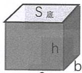

# 表面积

正方体的表面积：  $S = 6a^2$

五个面（无盖）的正方体表面积：  $S = 5a^2$

长方体的表面积：  $S = 2$  （ah+bh+ab）

五个面的长方体表面积：

少上面或下面：  $S = 2$  （ah+bh）+ab

少左面或右面：S=2（ab+bh）+ah

少前面或后面：  $S = 2$  （ab+ah）+bh

# 侧面总面积

侧面总面积一般指物体除顶面和底面，其他面的面积之和。

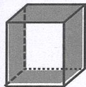

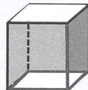

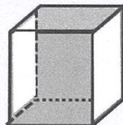

长方体因为可以调整摆放的位置，少掉一组对面的4个面的面积都可以

用求侧面积的方法计算。把少掉的一组对面摆放为底面和顶面，则：

长方体的侧面积=底面周长×高；  $S_{\text{侧}} = C_{\text{底}} h$

例：水泥厂制一根长方体铁皮通风管，管口是边长为30厘米的正方形，管全长2米，需要多少平方米的的铁皮？

分析：通风管道没有两个底面，即求这个通风管道的侧面积。

长方体铁皮通风管的侧面积=管口正方形周长×管子的长度

解：  $30\mathrm{cm} = 0.3\mathrm{m}$

$\mathrm{S}_{\text{侧}} = \mathrm{C}_{\text{底}} \mathrm{h}$  
$= 4\times 0.3\times 2$  
$= 2.4$  （平方米）

答：需要2.4平方米的铁皮。

# 1. 体积与体积单位

# 基础练习

# Core Exercises

# 一．填空题。

（1）一个棱长为1分米的正方体的木箱，最多能做个1立方厘米的正方体木块。

（2）单位换算。

$80000\mathrm{dm}^3 = \_ \mathrm{cm}^3$

0.39cm= dm

$9900\mathrm{cm}^3 = \_ \_ \_ \_ \_ \mathrm{m}^3$

0.  $01\mathrm{cm}^3 = \_ \_ \_ \_ \_ \mathrm{dm}^3$

0.  $15\mathrm{m}^3 = \_ \_ \_ \_ \mathrm{dm}^3$

$20\mathrm{m}^3 =$  cm³

0.0094dm³= cm³

$10001\mathrm{cm}^3 = \_ \mathrm{dm}^3 = \_ \mathrm{m}^3$

$5500\mathrm{dm}^3 +450\mathrm{cm}^3 = \_ \_ \_ \_ \_ \mathrm{dm}^3$

0.  $06\mathrm{m}^{3} = \_ \mathrm{dm}^{3} = \_ \mathrm{cm}^{3}$

7.  $36\mathrm{dm}^3 - 3600\mathrm{cm}^3 =$  ________ cm³

$6\mathrm{m}^{3} = \mathrm{\_}\mathrm{dm}^{3} = \mathrm{\_}\mathrm{cm}^{3}$

1.  $4\mathrm{dm}^3 - 140\mathrm{cm}^3 =$  ________ cm³

0.  $007\mathrm{m}^3 - 700\mathrm{cm}^3 =$  cm³

（3）从小到大排列。

0.6m³, 6.6dm³, 6cm³

从大到小排列：

$5\mathrm{m}^3 50\mathrm{dm}^3,5500\mathrm{cm}^3$ $55\mathrm{dm}^3$

$3703\mathrm{dm}^3$  ，  $7.7\mathrm{m}^3$  ，  $7300000\mathrm{cm}^3$  ，  $7\mathrm{m}^{3}30\mathrm{dm}^{3}$

（4）右面是用2立方厘米的小正方体搭成的图形，一共用了 块，它的体积是 立方厘米。

（5）右图中的图形一共有 块小正方体，其中看不见的有 块。

原正方体不移动，搭成一个正方体，至少还要_块小正方体。

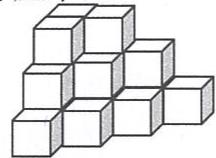

（6）填入适当的单位。

一块橡皮的体积8（ ）我国领土面积约960万（

一本汉语词典的体积约0.9（ ）一头大象重7（ ）

一间教室的面积约50（ ）

# 二．判断题。

（1）物体所占空间的大小叫做体积。  
（2）一个西瓜被切成两半后，体积变小了。  
（3）  $300\mathrm{mL}$  水倒入大杯子后体积比倒入小杯子后大。（ ）  
（4）一杯水喝掉一口后体积变小了。

# 三．递等式计算，能巧算的巧算。

$7.5 \times 4.2 + 15.9 \times 15$

$6.8\div (3.4\times 12.5)$

$7.2\times 1.8\div 3.6\div 2.5\div 0.4$ $(6.2\times 12.5 + 12.5\times 2.6)\div 2.2$

# 四．解方程。

$\mathrm{x} + 17 = 5(\mathrm{x} - 3)$

8.8—5（x—0.2）=1.2

# 举一反三

# Challenges

1.有一块橡皮泥，第一次把它捏成正方体，第二次把它捏成长方体，第三次把它捏成球，这三次捏成的物体哪个体积最大？

2. 下面的立体图形是由相同的小正方体拼成的，（ ）和（ ）可以平成一个长方体。

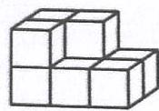

A

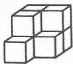

B

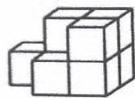

C

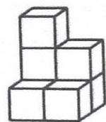

D

# 2. 长方体与正方体的认识

# 基础练习

# Core Exercises

一．填空题。

（1）棱长是5米的正方体，它由（ ）块边长为1米的正方体积木块搭成，它的体积是（ ）。  
（2）在一个长方体中，相对的面（ ），面积也（ ）；有（ ）组互相平行的棱，每组的长度（ ）。  
（3）正方体的六个面（ ），面积也（ ），  
12条棱的长度（ ）。所以，正方体是（ ）的长方体。  
（4）一个长方体的12条棱中，至少有（ ）条棱相等。二．判断题。  
（1）长方体的三条棱分别叫它的长、宽、高。……（ ）  
（2）有三个面是正方形的长方体一定是正方体。……（ ）  
（3）因为正方体有6个相等的面，所以正方体有24条相等的棱。  
（4）长方体的6个面，可能有两个面是正方形。  
（5）有6个面，12条棱，8个顶点的形体一定是长方体。…（  
（6）如果长方体的相邻两个面的都是正方形，那它就是正方体。  
（7）有6个面的物体一定是长方体。  
（8）一个长方体有一组相对面是正方形，其余4个面的面积一定相等。

# 三．应用题。

（1）一个正方体的棱长为12厘米，棱长之和是多少厘米？  
（2）一个长方体的棱长之和为132厘米，其中长15厘米，宽10厘米，高是多少厘米？  
（3）一个长方体和一个正方体的棱长之和相等，已知这个长方体长3厘米，宽2厘米，高1厘米，那么正方体的棱长是多少？  
（4）一个长8分米，宽2分米，高5分米的长方体盒子内能放多少个棱长2分米的正方体木块？  
（5）用一块棱长12分米的正方体木料，能切割出多少个棱长是3分米的小正方体木块？（不计损耗）

# 3. 长方体与正方体的体积

# 基础练习（1）

# Core Exercises

# 一. 直接写得数。

$$
\begin{array}{l} 0. 2 4 \times 5 = \quad 0. 8 \div (0. 1 - 0. 0 2) = \quad 3 \div 0. 1 5 = \\ 1. 7 - 0. 7 5 - 0. 2 5 = \quad 6. 5 \times 4 \div 6. 5 \times 4 = \quad 0. 6 + 0. 0 4 = \\ \end{array}
$$

# 二．递等式计算，能巧算要巧算。

$$
1 6. 5 \times 4. 8 - 9 7. 6 \div 3 2 + 3. 8 5 \quad 3 4 0 \div (1. 7 \times 2. 5)
$$

$$
1 2. 5 \times 6. 4 \times 0. 2 5 \quad (2. 5 \times 8. 8 + 2. 5 \times 0. 8) \times 1. 2 5
$$

# 三．填空题。

（1）长方体的棱可分为（ ）组，相对的（ ）条棱为一组，它们互相（ ），而且长度（ ）。  
（2）把3个棱长2厘米的正方体木块粘合成一个长方体，这个长方体的长是（ ）厘米，宽是（ ）厘米，高是（ ）厘米，体积是（ ）立方厘米。  
（3）一个长方体棱长总和48厘米，宽和高都是3厘米，长是（ ）厘米，体积是（ ）立方厘米。

（4）一个正方体棱长0.5分米，棱长总和是（ ）分米，体积是（ ）立方分米。  
（5）750立方分米  $=$  （ ）立方米

0.024立方米  $=$  （ ）立方分米  $=$  （ ）立方厘米四．判断题。

（1）1立方米大于1平方米。  
（2）两个长方体的棱长总和相等，它们的体积也相等。（）  
（3）正方体的棱长是0.1米，它的体积是1立方分米。（）  
(4)  $5^{3} = 15$  （

# 五．选择题。

（1）长方体棱长之和是60厘米，长是6厘米，宽是5厘米，高是（ ）厘米。

A. 6

B. 5

C. 4

D. 2

（2）一个棱长3分米的正方体木块，可以分切成棱长1分米的正方体（ ）块。

A. 6

B. 9

C. 18

D. 27

（3）正方体的棱长扩大2倍，它的体积扩大（ ）倍。

A. 2

B. 4

C. 6

D. 8

六. 根据下面个立体图，在括号里填上适当的数：（小正方体棱长为2厘米）

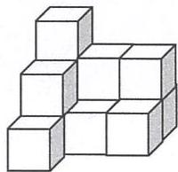

由（ ）个小正方体组成，

体积是（ ）立方厘米。

# 七．应用题。

（1）把长10厘米，宽6厘米，高8厘米的长方体木块锯成最大的正方体，求最大的正方体的体积是多少？

（2）50本数学书摆成一个长18厘米，宽13厘米，高25厘米的长方体，平均每本书的体积是多少立方厘米？

（3）把一块棱长1分米的正方体铁块锻造成宽5厘米，高10厘米的长方体铁条，这个铁条的长是多少厘米？

（4）一个游泳池，长50米，宽30米，如果每小时放水200立方米，多少时间才能使水深达1.8米？

# 4. 长方体与正方体的体积

# 基础练习（2）

# Core Exercises

# 一．解方程。

$12.5 \times 4 - 4x = 18$

$5\mathrm{x} = 2$  （1.  $5\mathrm{x} + 3$  ）

1.5（x—8）=x—7

15（5x-4）÷5=45

# 二. 列综合算式计算。

（1）1.75与0.5的和被它们的差的2倍除，商是多少？  
（2）一个数的5倍等于它的2倍与1.2的和，求这个数。

# 三．应用题。

（1）一个长方体，底面是正方形，它的侧面积是320平方厘米，高是10厘米，这个长方体的体积是多少立方厘米？  
（2）一个正方体水箱，高10分米，里面盛满了水，如果把水全部倒入一个长10分米，宽20分米的长方体水箱里，水深为多少分米？  
（3）一个正方体钢块体积是729立方分米，高是9分米则底面积是多少平方分米？  
（4）把一块棱长15厘米的正方体铅块，锻打成宽4厘米，高2.5厘米的长方体，这个长方体的长是多少厘米？

（5）一个长方体的长、宽、高分别是10厘米、6厘米、7厘米，如高增加2厘米，那么新的长方体体积比原来增加多少立方厘米？  
（6）有一块棱长是40厘米的正方体钢锭，将它锻造成高和宽都是20厘米的长方体钢材，锻造后的钢材长多少厘米？

# 举一反三

# Challenges

# 一．选择题。

把长宽高分别为  $3\mathrm{cm},5\mathrm{cm},2\mathrm{cm}$  的小长方体和长宽高分别为 $5\mathrm{cm},6\mathrm{cm},3\mathrm{cm}$  的小长方体合在一起，拼成为一个大长方体，这个大长方体的长宽高分别是（ ）

A.  $8\mathrm{\;{cm}},{11}\mathrm{\;{cm}},3\mathrm{\;{cm}}$

B.  $5 \mathrm{~cm}, 3 \mathrm{~cm}, 8 \mathrm{~cm}$

C.  ${10}\mathrm{\;{cm}},9\mathrm{\;{cm}},5\mathrm{\;{cm}}$

D.  $11 \mathrm{~cm}, 10 \mathrm{~cm}, 6 \mathrm{~cm}$

# 二．应用题。

（1）一个长方体12条棱长度的总和是48厘米，底面是周长18厘米，高是多少厘米？  
（2）用一段铁丝，正好可以做一个长7厘米，宽6厘米，高5厘米的长方体框架。如果用这段铁丝做一个正方体的框架，这个正方体的体积是多少立方厘米？  
（3）一只长方体的水箱里装满了水，这时放入一块高和宽都是1分米的长方体石块，水溢出4立方分米，这块石块的长是多少分米？

（4）一块长方体的钢材长是8厘米，横截面是周长20厘米的正方形，这块长方体钢材的体积是多少？  
（5）一个长方体木块长  $5\mathrm{cm}$  ，宽  $4\mathrm{cm}$  ，高  $3\mathrm{cm}$  ，从这木块上锯下一个尽可能大的正方体，求剩下部分的体积。  
（6）一块平行四边形的钢板，底的长度是28厘米，比高度的3倍少5厘米，这块钢板的面积是多少平方厘米？

# 5. 组合体的体积

# 基础练习（1）

# Core Exercises

一．直接写得数。

$$
\begin{array}{l} 0. 2 5 \times 1 2 = \quad 8. 3 \div 1 0 0 = \quad 9. 8 + 0. 5 + 9. 7 = \\ 5. 6 - 2. \frac {4}{1} - 1. 6 = \quad 0. 5 6 \div 0. 7 \times 0. 8 = \quad 0. 4 - 0. 4 \div 4 = \\ 0. 1 - \frac {1}{1 0 0} = \quad 9. 6 \div 0. 9 6 \times 0. 1 = \quad 3. 5 + 2. 5 \times 1 0 = \\ \end{array}
$$

二. 递等式计算，能巧算的巧算。

$$
1 0 \div 0. 1 2 5 \div 0. 1 2 5 \times 1 0 \quad (2. 8 + 2. 9 5 + 3. 0 5 + 1. 1 4 + 0. 0 6) \div 5
$$

三．解方程。

$$
5. 6 x - 4. 5 \div 3 = 5. 5 \quad 3. 5 x - 1 4. 5 = 3. 5 - x
$$

四. 列综合算式或方程解。

（1）25除以一个数的2倍，商是3余1，求这个数。

（2）12除4.8的商，乘比3.7大0.5的数，结果是多少？

# 五．填空题。

（1）正方体的棱长扩大4倍，它的体积扩大（ ）倍。  
（2）用一根铁丝正好制成一个长10厘米，宽和高都是5厘米的长方体框架，这根铁丝长（ ）。  
（3）（ ）+9.32-36.49=（ ）-36.49=30.71

# 六. 求下列组合体的体积。（单位：厘米）

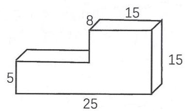

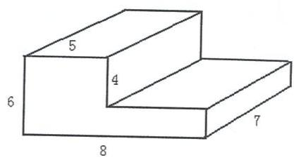

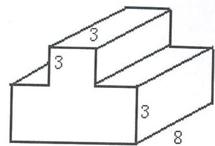  
9

# 七．应用题。

（1）一只长方体的水箱，底面是正方形，高5分米，底面周长30分米，它的体积是多少分米？  
（2）一个木箱，从里面量长8分米，宽5.6分米，高4.8分米。最多能放入棱长为4厘米的小正方体木块多少个？  
（3）一个底面是正方形的长方体，侧面展开恰好是正方形，长方体的高为8分米，它的体积是多少？

# 6. 组合体的体积

# 基础练习（2）

# Core Exercises

# 一．填空题。

（1）中国移动神州行“来电畅听”套餐，每月缴费情况如下：每月固定租费16元，拨打电话每分钟0.13元，小胖妈妈这个月共拨打电话为  $\mathbf{x}$  分钟，她这个月应缴手机话费（ ）元。  
（2）一个长方体长8厘米，宽5厘米，高4厘米，如果长和宽都不变，高增加2厘米，那么体积增加（ ）。  
（3）比-1大，比  $+1$  小的一位小数共有（ ）个，这些小数的总和是（ ）。  
（4）38分钟+（ ）小时=56分钟

# 二．选择题。

（1）AB两地相距3300米，甲乙两人同时从两地相向而行，甲每分钟行82米，乙每分钟行83米，几分钟后两人相遇？解：设x分钟后两人相遇，正确的方程是（ ）

A.  $82x + 83 = 3300$

B.  ${82} + {83}\mathrm{x} = {3300}$

C.  ${82}\mathrm{x} + {83}\mathrm{x} = {3300}$

(2)一副三角板不能拼出（ ）的角

A.  ${15}^{ \circ  }$

B.  $20^{\circ}$

C.  ${135}^{ \circ  }$

D.  $150^{\circ}$

（3）一本数学书的体积约是117（

A.立方米

B. 立方厘米

C. 立方分米

# 三．判断题。

（1）三个连续自然数的和一定小于这三个数的积。……（

（2）在一个长方体中，从一个顶点出发的三条棱的和是7.5分米，这个长方体的棱长总和是30分米。  
（3）  $3\mathrm{X} = \mathrm{X}\cdot \mathrm{X}\cdot \mathrm{X}$

# 四．应用题。

（1）将边长16厘米的正方形纸板剪成四块同样大小的正方形纸板，每块正方形纸板的周长是多少厘米？面积是多少平方厘米？

（2）两个步行的人同时从同一点向相反方向走，第一个人每小时走4千米，第二个人每小时走3.5千米，如果第二个人先走2小时，那么两个人再同行几小时后，他们之间的距离为37千米？（列方程解）

（3）某校参加六一杯小学数学竞赛，原定考场若干个。如果增加2个考场，每个考场正好坐24人，如果减少2个考场，每个考场正好坐30人。原定几个考场？参加这次竞赛的学生共有多少人？

# 五. 求组合体的体积。（单位：米）

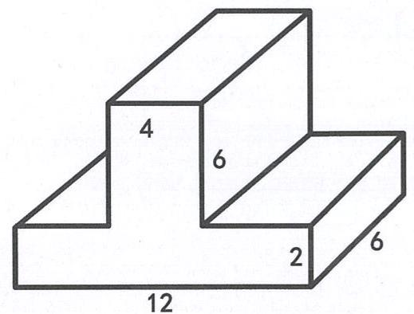

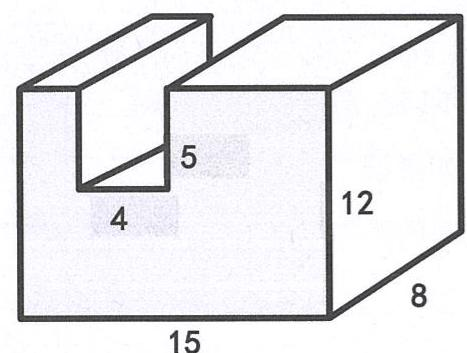

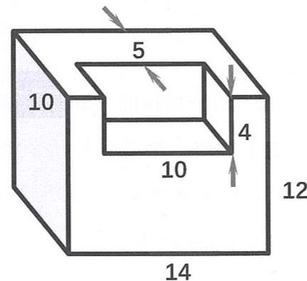

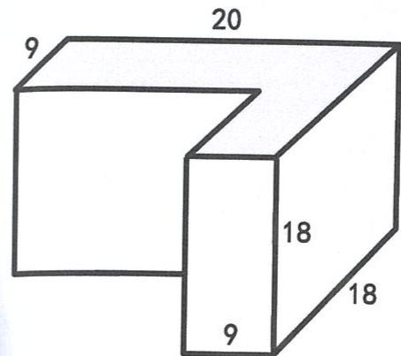

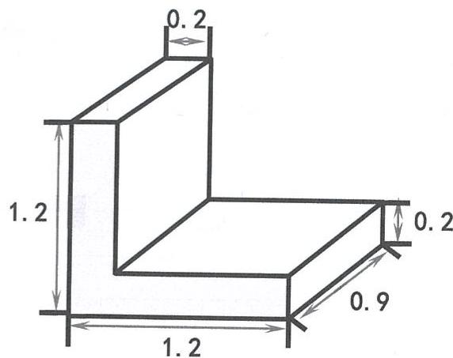

举一反三

Challenges

求组合体的体积。（单位：cm）

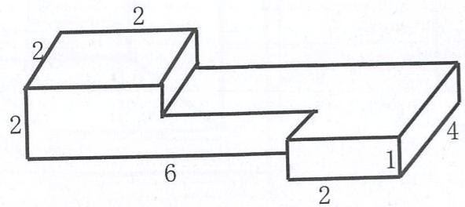

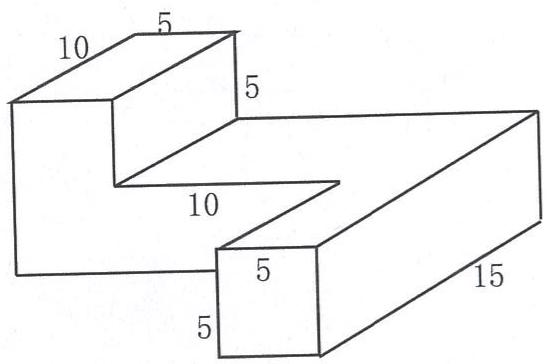

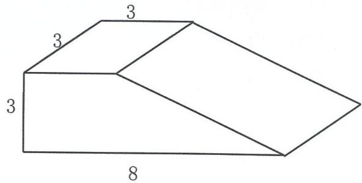

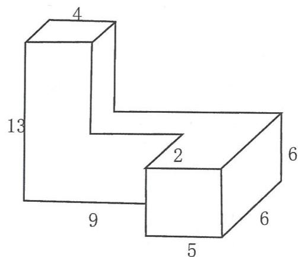

# 7. 长方体和正方体的表面积

# 基础练习（1）

# Core Exercises

# 一．填空题。

（1）长方体长2厘米，宽3厘米，高5厘米，体积是________，表面积是________。  
（2）一个正方体棱长总和是6分米，它的体积是 立方厘米。  
（3）一个长方体的体积是0.02立方分米，底面是边长0.2分米正方形，它的高是 分米。  
（4）把一块面积是9平方分米的正方形铁皮的四个角剪去四个正方形，把余下部分做成一个无盖的正方体形状的盒子，这个盒子的铁皮总面积是 平方分米。

# 二．选择题。

（1）正方体棱长之和是2.4分米，它的表面积是（ ）平方分米。

A. 0.04

B. 0.008

C. 0.24

D. 2.4

（2）一个长方体的长、宽、高分别是5厘米、4厘米、3厘米，这个长方体的棱长总和是（ ）

A.48厘米

B. 36 厘米

C. 24 厘米

D. 12 厘米

（3）一个棱长4米的正方体鱼池，占地（ ）平方米。

A. 8

B. 16

C. 64

D. 96

（4）正方体棱长扩大2倍，表面积就扩大（ ）

A. 2 倍

B.4倍

C.6倍

D. 8 倍

（5）把2个棱长3厘米的正方体拼成一个长方体，表面积比原来两个正方体的表面积之和减少（ ）平方厘米。

A.  $3 \mathrm{~cm}^{2}$

B.  $6{\mathrm{\;{cm}}}^{2}$

C.  $9 \mathrm{~cm}^{2}$

D.  $18 \mathrm{~cm}^{2}$

（6）一个长方体的底面是边长3厘米的正方形，高是5厘米，它的表面计算式是（ ）

A.  $3 \times 3 \times 5$

B.  $3 \times 5 \times 4 + 3 \times 3$

C.  $(3 \times 5 + 3 \times 5) \times 2 + 3 \times 3$

D.  $3 \times 5 \times 4 + 3 \times 3 \times 2$

# 三．判断题。

（1）一个正方体的表面积是这个正方体的一个面的面积的6倍。  
(2) 一个棱长4分米的正方体，它的表面积是48平方分米。  
（3）表面积相等的两个长方体，它们的体积一定相等。  
(4) 如果长方体中相邻两个面都是正方形, 那么它一定是正方体。

# 四．应用题。

（1）一个长方体纸箱，长8分米，宽6分米，高5分米。在箱子外面的四侧糊上商标纸，至少需要多少平方分米的纸？箱内放长2分米、宽1.5分米、厚2.5分米的纸盒，最多可以放多少个？

（2）一种长方体形状的有盖木箱，长8分米，宽5分米，高6分米，加工20只这样的木箱，至少需要木板多少平方米？加工好的这些木箱堆放在仓库里共占多少空间？

（3）两个正方体搭成下图的形状，它们的棱长分别是8厘米和4厘米，求这个组合体的表面积。

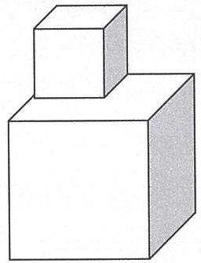

（单位：厘米）

# 8. 长方体和正方体的表面积

基础练习（2）

Core Exercises

一．递等式计算（能简便的要简便计算）。

$111\div 1.25$ $39.078\div 0.78\times 1.5$

二．解方程。

4（3.2x-2.5）=79.6-12.8 7(x+6)-3x=4(3x+5)

三.填空题。

（1）长方体底面是周长为12厘米的正方形，高是2.5厘米，这个长方体的体积是（ ），表面积是（ ）。  
（2）与自然数  $\mathbf{n}$  相邻的两个数分别是（ ），（ ）。  
（3）离开原点4.5个单位长度的点表示的数是（ ）。四．应用题。  
（1）一个长方体形状的金鱼缸，长0.6米，宽0.3米，高0.4米，做这个金鱼缸要多少平方米玻璃？

（2）在展览厅里有6根长方体柱子，高4米，底面是边长0.5米的正方形，在装修时，要在柱子表面贴上大理石，大约需要大理石多少平方米？

（3）有一张长30厘米，宽20厘米的长方形铁皮，在四角上减去边长为5厘米的正方形后，将它做成一个无盖的盒子，这个盒子的容积是多少立方厘米？

五. 求组合体的体积。（单位：厘米）

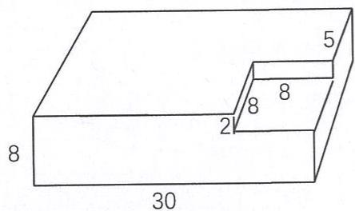

# 举一反三

# Challenges

解决问题。

（1）一个长方体鱼缸，长40厘米，宽25厘米，高15厘米，鱼缸内水深10厘米。

(1)求缸内水的体积。

②求缸内与水接触部分的面积。

③如果往缸内投入20个玻璃球（被水淹没），是水面上升了0.5厘米，那么每个玻璃球的体积是多少？

④如果每分钟往鱼缸内投10个玻璃球，多少分钟后，水面与缸口齐平？

（2）一个长方体，体积是240立方厘米，前面和左面的面积分别是60平方厘米和40平方厘米。这个长方体的表面积是多少平方厘米？  
（3）一个长方体的高增加3厘米后就成了一个正方体，表面积比原来增加60平方厘米，这个正方体的体积是多少立方厘米？  
（4）一个长方体木块长5厘米，宽4厘米，高3厘米，现在从这木块上锯下两个尽可能大的正方体，求剩下部分的体积。

# 9. 表面积的变化

# 基础练习（1）

# Core Exercises

一．判断题。

（1）从数轴上看，左边的数总比右边的数小，右边的数总比左边的数大。  
（2）在数轴上0表示起点。  
（3）在数轴上的原点两旁离原点距离相等的两个点所表示的数是一样大的。  
（4）正数大于一切负数，负数都小于0。  
（5）-12比-10小。

二. 看图计算。  
（1）如下图，都是由棱长为2厘米的小正方体拼成的，表面积是各减少了多少？

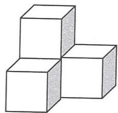

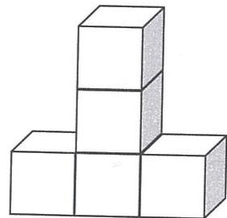

（2）一个棱长为4分米的正方体，在它的角上挖掉一块棱长为2分米的小正方体，它的表面积发生了什么变化？是增加、减少、相等还是无法确定？

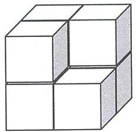

# 三. 作图计算。

将8个棱长为1分米的正方体，拼成一个长方体，表面积各是多少？

拼法1：

长  $=$  （ ）分米，宽  $=$  （ ）分米，高  $=$  （ ）分米。

图： 表面积：

拼法2：

长  $=$  （ ）分米，宽  $=$  （ ）分米，高  $=$  （ ）分米。

图： 表面积：

拼法3：

长  $=$  （ ）分米，宽  $=$  （ ）分米，高  $=$  （ ）分米。

图： 表面积：

体积发生了什么变化？

# 四．解决问题。

（1）把一个长12分米的长方体分割成两个大小相等的正方体，这两个正方体的表面积之和比原来的长方体的表面积增加了多少平方分米？

（2）一个正方体的棱长是  $6\mathrm{cm}$  ，把它截成3个大小相等的长方形体，表面积比原来增加多少  $\mathrm{cm}^2$  ？

# 10. 表面积的变化

基础练习（2）

Core Exercises

一．解方程。

$$
3 \times 1. 8 + 3 x = 6
$$

$$
1 2 - x \div 2 = 8
$$

$$
3 (8 + x) \div 2 = 1 8
$$

$$
3. 5 + 2 (x - 5) = 8
$$

# 二．应用题。

（1）有两个大小一样的长方体，长为  $8\mathrm{cm}$  ，宽为  $5\mathrm{cm}$  ，高为 $3\mathrm{cm}$  ，如果把两个长方体拼成一个较大的长方体，表面积最大是多少平方厘米？表面积最小是多少平方厘米？

（2）将一根长6厘米，高和宽都是2厘米的长方体木料截成三个小正方体，每个小正方体的表面积是多少？三个小正方体的表面积之和比原来长方体的表面积增加多少平方厘米？

（3）将两盒长20厘米，宽15厘米，高4厘米的糖果盒用纸包装起来，至少需要多大的包装纸（接缝处不计）？

（4）将三个长、宽、高分别是5厘米、3厘米、1厘米的火柴盒叠在一起，表面积最大是多少平方厘米？表面积最小是多少平方厘米？（请作图计算）

（5）一个底面是正方形的长方体，高缩短5厘米后就成一个正方体，而且表面积减少120平方厘米，求原来的长方体的表面积。  
（6）一个长方体如果高增加2厘米就成一个正方体，而且表面积增加56平方厘米，原来长方体的表面积是多少平方厘米？  
（7）一个长方体长16分米，高6分米，沿水平方向横切成两个小长方体，表面积就增加160平方分米，求原长方体的体积。

（8）一块正方形铁皮，面积为900平方厘米，在它的四角剪去四个面积相等的小正方形，焊接成一个无盖的正方体铁皮盒（接缝处不计），则这个铁皮盒的表面积是多少？  
（9）一块棱长12厘米的正方体木块，让它慢慢浸入一个放红墨水的水池里，它入水的深度是棱长的一半，求这块正方体的木块染上红墨水的面积？  
（10）一个抽屉长30厘米，高20厘米，宽60厘米，做这样的木料，抽屉需要用木料多少平方厘米？

# 举一反三

# Challenges

解决问题。

（1）一个长方体的木料长2米，宽和高都是2分米，把这个木料横截成0.5米长的4段，表面积一共增加了多少平方分米？  
（2）一个长方体的体积是  $96\mathrm{cm}^3$  ，如果把它的长缩短2厘米，就成一个正方体，这个正方体的表面积是  $96\mathrm{cm}^2$  ，则这个长方体的长是多少？  
（3）把长36厘米的长方体钢块平均切成4段，表面积增加24平方厘米，每段钢块的体积是多少立方米？如果截面是一个正方形，这块长方体钢块原来的表面积是多少？

# 11. 体积与容积

# 基础练习（1）

# Core Exercises

一．递等式计算，能巧算要巧算。

$$
\begin{array}{l} 6 8 \times 7. 5 - 3 5 \times 7. 5 + 3 3 \times 2. 5 \\ 8. 8 - 0. 8 \times 8. 8 - 0. 8 \\ \end{array}
$$

$$
\begin{array}{l} 0. 4 5 \times 3. 2 \times 1. 2 5 \\ 1 4. 0 2 - 3. 5 + 4. 9 8 - 5. 5 \\ \end{array}
$$

二.解方程：（打※要验算）。

$$
6 (x + 2. 5) = 1 3 x - 2 x
$$

$$
6 (2. 5 x - 1 0) \div 3 = 7. 5
$$

$$
\text {※} (4 - x) \div 3 = 2 - x
$$

# 三．填空题。

（1）把750毫升水倒入棱长10厘米的正方体容器里，水深（ ）厘米。

（2）单位换算

0.  $75\mathrm{dm}^3 =$  （ ）L 4.8dm=（ ）mL

3.  $5\mathrm{dm}^3 =$  （ ）mL  $3000\mathrm{cm}^3 =$  （ ）L

$20000\mathrm{mL} = (\quad)\mathrm{L} = (\quad)\mathrm{cm}^3$

0.216m³=（ ）mL 7090mL=（ ）dm³

# 四．应用题。

（1）一个正方体的油箱，从里面量得棱长是2.5分米，在这个油箱中倒入油，测得油深0.8分米。问：一共倒入了多少毫升油？

（2）一个长方体鱼缸长1.2米，宽0.5米，高0.8米，已知做鱼缸的玻璃厚度不计，如果在鱼缸里灌满水，共可能装多少升水？

（3）有一块长方形纸板，长40厘米，宽35厘米，从四个角切掉边长为6厘米的正方形，要求做成一个没有盖的盒子，算出它的容积是多少毫升？

（4）一个长方体水箱，长8分米，宽5分米，水深4分米，将一个钢球浸没在水中，水面升高0.5分米，这个钢球的体积是多少？

（5）有一只长150厘米，宽50厘米，高40厘米的水箱，里面装着满水，这时放入一块高和长是20厘米的长方体石块，水溢出4升，这块石头的宽是多少厘米？

12. 体积与容积

基础练习（2）

Core Exercises

一．递等式计算，能简则简。

12.8-2.8×0.6

$9.5 \times 4.3 + 0.95 \times 47 + 95$

$6.4\times (12.5\times 0.125)$

$(1 - 0.2)\times (4 - 3.68)\div 0.01$

38.78-19.59+41.22-30.41

$8\div [(40.75 - 9.5)\times 0.4] + 0.36$

二．解方程。

$3(x + 6) = 27x - 30$

$24 - 7\mathrm{x} = 4\mathrm{x} + 2$

# 三.选择题。

(1) 一个长方体的长、宽、高分别扩大3倍，它的体积就扩大（）倍。

A. 3

B. 6

C. 9

D. 27

（2）一支眼药水瓶的容积大约是10（ ）。

A. 毫升

B. 升

C. 千克

D. 克

（3）下面哪个图形不是正方体的展开图。（）

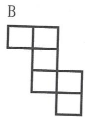

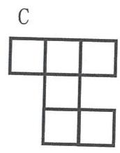

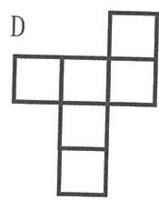

# 四.应用题。

（1）把80升水倒入底面是正方形的水箱中，底面边长40厘米，倒完后水箱中的水面有多高？

（2）一个长方体玻璃鱼缸长61厘米，宽31厘米，高40.5厘米，玻璃厚0.5厘米，（1）求鱼缸的容积。（2）鱼缸内水面离缸口5厘米，鱼缸内共有水多少升？

（3）一个长方体铁皮空水箱，底面是边长5分米的正方形，高是4分米，如果以每秒0.02升的速度往里面放水，需要多少时间才能放满半箱水？  
（4）一个正方体水箱，每条棱长4分米，内装水深3分米，在这个水箱里投入一个铁球，水面上升到3.6分米，求这只铁球的体积。  
（5）将一块棱长2厘米的正方体小石块，投入一个长方体鱼缸，如果鱼缸底面长20厘米，宽10厘米，那么水面将上升多少厘米？  
（6）一个长方体水箱从里面量长、宽、高分别是40厘米、30厘米、20厘米，里面放了一个长方体铜块，并注满了水，取出铜块后，水面下降了1厘米，已知铜块长15厘米，宽10厘米，求铜块的高。

# 举一反三

# Challenges

解决的问题。

（1）一个长方体的玻璃缸，长5分米，宽4分米，高3.5分米，缸内有水，水面离缸口2厘米，现在往缸内放一块棱长1.8分米的正方体石块，这时缸内的水是否会溢出？如果不会，那么水面离缸口还有多少距离？如果会，那么溢出的水的体积是多少？  
（2）甲容器的底面长30厘米，宽20厘米，乙容器的底面是边长20厘米的正方形，两个容器内装有同样高度的水，将一铁块投入甲容器，水面升高2厘米，如果将同样大小的铁块投入乙容器，这时哪一个容器内的水面高？高出几厘米？  
（3）一个长方体容器，从内部测量长30厘米，宽20厘米，高150厘米，里面注有15厘米的热水，在容器里浸没一个石块后，水面上升到了18厘米，这个石块的体积是多少？

（4）某工厂要生产一种出口的茶叶罐，长18厘米，宽18厘米，高15厘米。  
$①$  这种茶叶罐的体积是多少？  
②做一只这样的茶叶罐需要用铁皮多少？  
③在这只茶叶罐的四周贴上包装纸，需要多少包装纸？  
（5）将生产出的茶叶罐集装成箱，箱子长1.8米，宽0.9米，高1.2米，一只箱子可以装几个茶叶罐？

# 13. 体积与质量

# 基础练习

# Core Exercises

# 一．应用题。

（1）学校沙坑长8米，宽3米，深60厘米，每立方米的黄沙重1500千克，填满这个沙坑需要黄沙多少吨？  
（2）一个粮仓，里面长20米，宽12米，如果存放的稻谷高3.5米，一升的稻谷重量是0.78千克。这个粮仓存放的稻谷有多少千克？  
（3）一个铁皮油箱，长和宽都是25厘米，高40厘米，做这只油箱需要多少铁皮？（接缝处不计）这个油箱能装汽油多少千克？（每升油重0.82千克）

（4）一块长方体的黄铜重10.68千克，已知这块黄铜长20厘米，宽12厘米，每立方分米的黄铜重8.9千克，这块黄铜的高是多少厘米？  
（5）已知5立方米木料重3吨，那么1.8吨重的木料体积是多少立方米？  
（6）用2厘米厚的玻璃做一个长方体鱼缸，从鱼缸外侧量鱼缸长54厘米，宽30厘米，高42厘米，如果每立方米水重1吨，那么这个鱼缸共能装水多少吨？

# 举一反三

# Challenges

解决问题。

（1）一根横截面为正方形的长方体木料，表面积为114平方厘米，锯去一个最大的正方体后，剩下的表面积为54平方厘米，锯下的正方体木料表面积是多少平方厘米？  
（2）50个同学去划船，有下面两种船：大船每条坐6人，租金8元；小船每条坐4人，租金6元，最省钱的方案是大船租多少条，小船租多少条？  
（3）把两个正方体拼成一个长方体后，表面积减少162平方厘米，求拼成长方体的体积。

# 单元练习

# Unit Exercises

# 一．填空题。

（1）要搭成一个棱长2厘米的正方体，需要棱长1厘米的小正方体（ ）个。  
（2）一个正方体的棱长是a，这个正方体的棱长之和是（ ），表面积是（ ），体积是（ ）。  
（3）一个正方体的底面积为64平方厘米，那么它的体积为（ ）。  
（4）一个长方体的棱长总和是48厘米，长是5厘米，宽3厘米，那么这个长方体的表面积是（ ），体积是（ ）。  
（5）一个长40厘米，截面是正方形的长方体，如果长增加5厘米，表面积增加80平方厘米，原来长方体的表面积是（ ）。

# 二. 选择合适的单位。

一桶食用油5（ ） 一瓶雪碧1.25（

一间房间的大小45（ ） 一袋鲜牛奶250（ ）

一本字典厚约0.9（ ） 一块橡皮大小约8（

# 三．比大小。

$3703\mathrm{dm}^3$  7.7m³ 506L 65000cm³ 810mL 810cm³ 909L 9090dm³

# 四. 单位换算。

5.5L—5000mL=（ ）dm³ 170dm³=( ）m³  
88800cm³+0.2dm³= （ ）L 7.82mL=（ ）cm³  
8.4dm³=( ）cm³ 9.5dm³=( ）L=( ）mL

# 五．选择题。

（1）下列各图，能做成正方体的是（ ）。

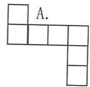

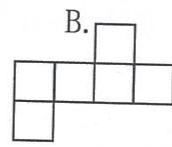

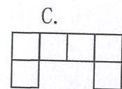

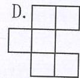

（2）甲、乙两个长方体体积相等，其中甲长方体长4厘米，宽6厘米；乙长方体长2厘米，宽3厘米，那么乙的高度是甲的高度的（ ）。

A.2倍 B.二分之一 C.4倍 D.四分之一六．应用题。

（1）有一个长50米，宽30米，深2.6米得长方体游泳池，在它的四周和底部贴瓷砖，如果每平方米的瓷砖需要24元，一共要花费多少元？

（2）一个正方体油箱，棱长5分米，里面盛满汽油，如果把这些汽油全部倒入另一个长8分米，宽5分米的长方体油箱内，汽油深多少米？

（3）有一个正方体的水箱（有盖），从外面测量得棱长3.5米，已知箱壁厚10厘米，这个正方体水箱最多可能存放多少立方米水？  
（4）一块长方形铁皮长20厘米，宽16厘米，四角剪去边长4厘米的正方形，可以做成一个无盖的长方体盒子，求盒子的容积。

七. 求组合体的体积。（单位：厘米）

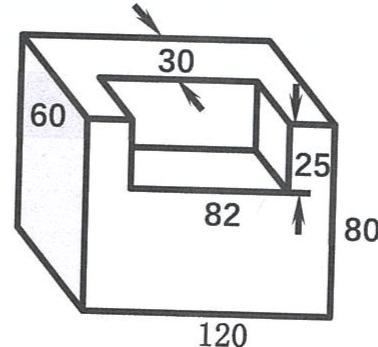

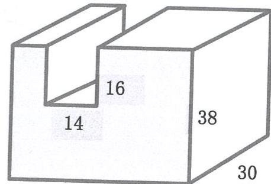  
42

# 五. 可能性

单元小贴士

Unit Tips

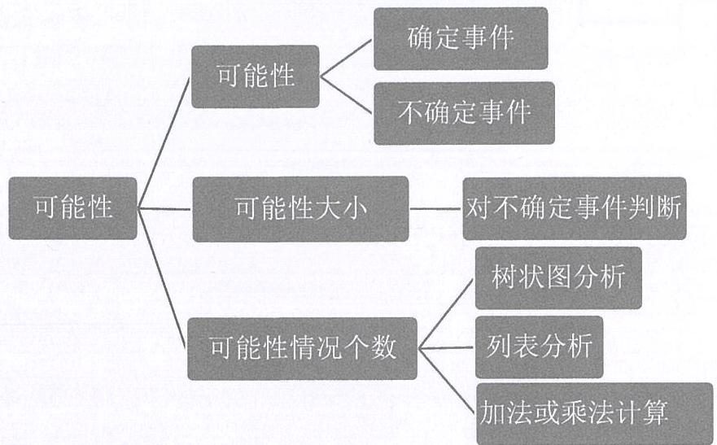

# 易错题分析

- 同时抛两枚硬币，落地时同时正面朝上的可能性是（）  
分析：  $① A$  正，  $B$  正  $② A$  反  $B$  正  $③ A$  反，  $B$  正  $④ A$  反，  $B$  反所以同时抛两枚硬币同时正面朝上的可能性是四分之一。  
- 有三张分别写有 4,5,8 的数字卡片,每次抽出两张组成一个两位数, 组成的两位数是 2 的倍数的可能性小于不是 2 的倍数的可能性 ( )

分析：从三张数字卡片中每次抽出两张组成一个两位数，组成的两位数有45,48,54,58,84,85.其中2的倍数的数有48，54，58，84，不是2的倍数的有45,85，因此组成的两位数是2的倍数的可能性大。

# 1. 可能性和可能性大小

基础练习

Core Exercises

一．填空题。

（1）一个袋中装有4个红球，2个黄球，2个白球，1个黑球，它们除颜色外都相同，任意摸出一个球，摸到________的可能性最大，摸到________的可能性最小，摸到________和________的可能性相同。

二．选择题。

(1) 同时掷两个相同的数点块, 则下列事件中不可能发生的是 ( )

A. 点数之和 12

B. 点数之和小于3

C. 点数之和大于 4 且小于 8

D. 点数之和 13

（2）一个转盘被划分乘6个相同大小的图形，并标上1、2、3、4、5、6，指针停在每个格子上的可能性相等，4位同学各自发表下述规则，其中正确的是（ ）

A. 如果指针前三次都停在 3 号上, 下次就一定不会停在 3 号上。  
B. 只要指针连续转六次，一定会有一次停在 6 号上。  
C.运气好的时候，只要在转动前默默想好让指针停在6号上，指针停在6号上的可能性就会大。  
D. 指针停在奇数号和停在偶数号的可能性相等。

三．应用题。

小李从标有1到20序号的20张卡片中任意抽取一张，抽到序号是2的倍数与序号是5的倍数的可能性哪个大？

# 2.可能情况的个数

# 基础练习

# Core Exercises

列式解答，也可以借助画图法。

（1）快餐店里有4种汉堡，3种饮料和2种甜品。

① 汉堡和饮料各选一种，一共有多少种不同的选法？

② 汉堡和甜品各选一种，一共有多少种不同的选法？

③汉堡、饮料和甜品各选一种，一共有多少种不同的选法？

（2）从0,1,2,3，这四张数字卡片中依次抽出3张拼成一个三位数，一共能拼出多少个不同的三位数，其中有多少个偶数？

# 单元练习

# Unit Exercises

# 第一部分概念题。

# 一．填空题。

（1）  $350\mathrm{cm}^2 = (\mathrm{\Delta})\mathrm{m}^2$ $4\mathrm{m}^{3}40\mathrm{dm}^{3} = (\mathrm{\Delta})\mathrm{m}^{3}$

$7200\mathrm{mL} =$  （ ）dm³860kg=（ ）g

（2）一个长方体长8厘米，宽5厘米，高4厘米，如果长和宽都不变，高增加2厘米，那么表面积增加

（ ），体积增加（ ）。

（3）盒子里有5个球：  $\bigcirc \bullet \bigcirc \bigcirc \bigcirc$  ，小丁丁任意摸一个再放回，他连续摸了4次都是O，他第5次摸到的球

（ ）是  $\bullet$  。（填“一定”、“可能”、“不可能”）

（4）小丁丁、小胖、小巧和小亚组成一个四人学习小组，要选出一名组长和一名副组长，总共有（ ）种不同的选法。

（5）6.09立方分米  $=$  （ ）升

59升  $=$  （ ）立方厘米

（6）一个长方体的长为0.6分米，宽为5厘米，高为3厘米，则这个长方体体积是（ ）立方厘米。

（7）一个长方体油箱，储油50升，从里面量油箱长0.5米，宽为0.4米，则油深（ ）米。

（8）一个棱长为10厘米的正方体木块，可以分割成（ ）个棱长为5厘米的小正方体。

（9）将两个长、宽、高分别为10厘米、8厘米、6厘米的长方体拼成一个较大的长方体，表面积最多减少（ ）平方厘米；最少减少（ ）平方厘米。

（10）一个长方体的硬纸板箱，长12分米，宽9分米，高3分米，里面可以容纳（ ）个棱长3分米的小正方体纸板箱。  
（11）从0,1,2,3，这四张数卡中依次抽出两张，拼成两位数，总共能拼出（ ）个不同的两位数。  
（12）有1,2,3,5四张数卡，从中抽出三张，能拼出（ ）个不同的三位数，（ ）个三位偶数。

# 二．选择题。

（1）用12个棱长相等的正方体，任意摆成一个长方体，共有（ ）种不同的摆法。

A. 2 种

B. 3 种

C. 4 种

D. 5 种

（2）从1,3,5,7四张卡片中依次抽出2张，所得的两个数之和是（ ）的可能性最大。

A. 6

B. 8

C. 10

D. 12

（3）口袋中有9个相同的球，球上分别标着1到9的9个数字，任意摸出一个球，摸到1,2,3,4,5,6,7,8,9的可能性是（ ）的。

A. 相等

B. 不相等

C. 不一定

D. 无法确定

（4）一根15分米长的长方体木料，平均锯成3段，表面积增加9.6平方分米，这根木料的体积是（ ）

A.6立方分米

B. 12 立方分米

C. 24 立方分米

D. 36 立方分米

（5）两个长是7厘米，宽是5厘米，高是3厘米的长方体拼成一个高是6厘米的大长方体。这个大长方体的表面积比原来两个长方体的表面积之和减少了（ ）平方厘米。

A. 30

B. 35

C. 42

D. 70

（6）一个长方体木箱，从里面量长9分米，宽4分米，高6分米，这个木箱里面可以完整地放入（ ）个棱长是3分米的正方体木块。

A. 6

B. 7

C. 8

D. 9

（7）从3,4,5,6这四张数字卡片中任意抽出两张，抽出的两张数字卡片上的数字之和的可能性最大是（ ）

A. 7

B. 8

C. 9

D. 10

# 第二部分应用。

（1）师徒两人加工零件，师傅每小时加工48个，徒弟每小时加工42个，徒弟先加工半小时后师傅才开始，师傅加工多少小时后，师徒两人加工的零件数相等？

（2）甲乙两车同时从相距595千米的两地相向而行，4小时后两车还相距255千米，已知甲车每小时行40千米，乙车每小时行多少千米？两车继续前进，再行几小时才能相遇？  
（3）两个港口相距1154千米，甲乙两艘轮船同时从这两个港口出发相向而行，甲船每小时行35千米，乙船每小时行37千米，开出1小时后，甲船因有紧急任务，返回原港又立即起航与乙船继续相向而行，乙船经过多少小时与甲船相遇？  
（4）AB两地相距600千米，甲行完全程要25小时，乙行完全程要20小时，甲从A地出发，4小时后乙也从A地出发，乙要行多少路才能追上甲？

（5）两列火车分别从甲乙两站同时开出，相向而行，一列火车每小时行120千米，另一列火车每小时行102千米，这两列火车在离两站中点36千米处相遇，相遇时各行多少小时？  
（6）把一块重448千克的正方体钢材锻造成高和宽都是8分米的长方体钢材，这段钢材有多长？（每立方分米钢材重7千克）  
（7）甲乙两车从相距18千米两地同时出发，同向而行，甲车在前，每小时行60千米，乙车在后，每小时行72千米，则几小时后乙车可以追上甲车？

# 六. 总复习

单元小贴士

Unit Tips

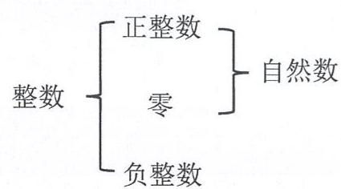  
数与运算

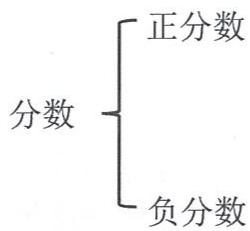

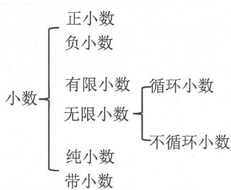

数位顺序表  

<table><tr><td></td><td colspan="18">整数部分</td><td></td></tr><tr><td></td><td>...</td><td colspan="4">亿级</td><td colspan="4">万级</td><td colspan="9">个级</td><td></td></tr><tr><td>数位</td><td>...</td><td>千亿位</td><td>百亿位</td><td>十亿位</td><td>亿位</td><td>千万位</td><td>百万位</td><td>十万位</td><td>万位</td><td>千位</td><td>百位</td><td>十位</td><td>个位</td><td>.</td><td>十分位</td><td>百分位</td><td>千分位</td><td>万分位</td><td>...</td></tr><tr><td>计数单位</td><td>...</td><td>千亿</td><td>百亿</td><td>十亿</td><td>亿</td><td>千万</td><td>百万</td><td>十万</td><td>万</td><td>千</td><td>百</td><td>十</td><td>-个</td><td>.</td><td>十分之一</td><td>百分之一</td><td>千分之一</td><td>万分之一</td><td>...</td></tr></table>

# 图形与几何

书本上的知识点需要关注哦！

$\bullet$  线与角归纳整理 书本P95  
$\bullet$  基本图形整理 书本P96  
$\bullet$  周长与面积 书本P98  
表面积与体积 书本P98

# 1. 数与运算

基础练习

Core Exercises

一. 直接写出得数。

7.3+3.7= 5.2-4.8= 3.75×8=  
 $4\div 0.25 =$  9.9+0.1÷0.01= (6.25-2.5）×4.8=  
估算：  $119.6\times 5.04\approx$ $\frac{9}{10} -\frac{13}{100} +\frac{3}{1000} =$ $44 - 4.56 =$ $0.45\div 9 =$  2.4×  
73.  $8 + 27.2 =$ $1.2 + 0.8\times 2 =$ $6.23\div 7.2\approx$  
$12.5\times (7.2 + 0.8) =$  （得数凑整到百分位）

二. 列竖式计算。

$2.46\times 6.5$ $41.6\div 4.2$

（积凑整到十分位） （商凑整到百分位）

三．递等式计算（能简算的要简算）。

$(2.5 \times 8.8 + 2.5 \times 0.8) \times 1.25$ $(3.72 + 0.48) \div [(2 - 0.6) \times 0.02]$

$4.02 \times 3.5 + 4.8 \div 0.8 + 0.93$ $(15 \times 2.7 + 4.05) \div (1 - 0.01)$

四．文字题。

（1）10.25减去。0.8除3.2的商，所得的差，再乘以4.8，积是多少？

（2）某数的1.2倍减去1.4，正好等于它的一半加上3.5，求某数。

五．应用题。

（1）某厂原计划每月生产零件300个，改进工艺后，9个月的产量就比全年计划还多720个。现在平均每月生产零件多少个？

（2）运输公司第一天运货物82.5吨，比第二天运的3倍少1.2吨，两天共运货物多少吨？

（3）一间教室的面积是48平方米，要用方砖铺地，先铺18平方米，用去方砖162块。照这样计算，铺完这间教室还要用方砖多少块？

（4）某小学五年级有三个班，一班人数是三班的1.12倍，二班人数比三班少3人，三个班共有153人。问三个班各有多少人？

六．判断题。

（1）两个三位小数的乘积最多是六位小数。  
（2）三个小数都是-0.2，它们的积是-0.6。………（ ）七．填空题。  
（1）一个数加上一万是一亿，这个数是由（ ）个万组成的。  
（2）4吨5千克  $=$  （ ）吨  $=$  （ ）千克  
（3）12.5元可以买什锦糖4千克，1元钱可以买什锦糖（ ）千克。  
（4）甲乙两数的差是5，积是150，这两个数的和是（ ）。

# 举一反三

# Challenges

# 一．递等式计算（能巧算的要巧算）

$$
\begin{array}{l} [ 0. 3 1 \times 8 + (1 - 0. 7 4) ] \div 0. 1 \quad 0. 5 8 \times 1. 7 + 1. 7 \times 1. 4 2 + 8. 3 \times 2 \\ [ 5. 6 + 6. 5 \times (6. 2 5 - 2. 6 5) ] \div 2. 5 \\ \end{array}
$$

# 二．填空题。

（1）将0.3，0.303,0.303,0.03从小到大排列：（ ）。  
（2）n是一个自然数，与  $\mathrm{n + 3}$  相邻的数分别是（ ）和（ ）。  
（3）三个连续自然数之和是180，那么其中最大的一个自然数是（ ）。  
（4）用四舍五入法把9.994999999精确到百分位是（ ）。  
（5）一个三位小数用四舍五入发凑整到百分位后是4.50，则这个三位小数最大是（ ）。

# 2.方程与代数

# 基础练习

# Core Exercises

一．解方程。

$$
3 (x + 5) - x = 3 9 \quad 1 2 0 x = 7 5 (x + 1 2) \quad 0. 6 (x + 1) = x - 0. 8
$$

$$
3 x - 4 = x + 6 \quad 0. 9 (1 2 - x) = 0. 6 (x - 2)
$$

# 二. 化简求值。

（1）当  $a = 12$  时，求5（2a-a）的值。

（2）当  $m = 5$ ， $n = 4$  时，求  $9.2m + 6n - 0.2m$  的值。

（3）当  $a = 19.8$  ，  $b = 1.25$  ，  $c = 14.6$  ，求ab-abc的值。

# 三. 列综合算式或方程解答。

（1）甲乙两数相差15.6，乙数比甲数的3倍多7.8，求甲数。  
（2）某数减去1.5的差的1.5倍是10.5，求某数。  
（3）8个0.9比一个数的2.8倍少1.2，求这个数。  
（4）甲乙两数相差15.6，乙数比甲数的3倍多7.8，求甲数。

四．应用题。

（1）甲仓存粮是乙仓的1.4倍，如果从甲仓运1.2吨到乙仓，那么乙仓比甲仓多0.4吨。原来乙仓存粮多少吨？

（2）有7筐苹果，如果每筐里取出苹果20千克，那么7筐里剩下的苹果正好等于105千克。问原来每筐苹果重多少千克？

（3）一个长方体形状的罐头盒，长12厘米，宽8厘米，高10厘米，这个罐头盒的容积是多少立方厘米？如果在它的四周围上商标纸，商标纸的面积是多少平方厘米？

# 举一反三

# Challenges

# 一．列方程解决问题

（1）五年级同学到公园划船，如果每船坐7人，则剩下3人没有座位，如果每船坐9人，则多出1只船，那么一共有多少只船？有多少个学生？  
（2）甲乙两人从A地到B地，甲以每分80米的速度去追先出发的乙，已知乙每分走65米。甲用20分钟追上乙。乙比甲先出发多少米？  
（3）有两堆煤，甲堆重量是乙堆的3倍，如果甲堆运出80吨，乙堆运进40吨，则两堆重量相等。原来两堆各有多少吨？

（4）甲地到乙地是斜坡路，一辆汽车上山每小时行30千米，下山每小时行45千米，往返一次共用去3小时。甲、乙两地相距多少千米？

（5）幼儿园分给每个小朋友5块饼干和2颗奶糖，奶糖正好分完，饼干还有30块。已知饼干的块数是奶糖颗数的3倍。问：共有多少个小朋友？饼干有多少块？奶糖有多少颗？  
（6）甲乙两地相距450千米，一辆客车从甲地出发2小时后，一辆货车才从乙地相对开出，又经过3小时两车相遇，已知客车每小时比货车多行10千米，则客车每小时行多少千米？

# 3.图形与几何

# 基础练习

# Core Exercises

# 一．选择

（1）一个正方体的棱长扩大至2倍，它的表面积就扩大至（ ）倍。

A. 2

B. 4

C. 6

D. 24

（2）如图是一个正方体展开图，在原正方体中，两个相对面的两数之和最大是（ ）。

A. 45

B. 48

C. 50

D. 58

（3）如图是七巧板拼成的正方形，其中的三块面积分别是  $\mathrm{S}_1$  、  $\mathrm{S}_2$  、  $\mathrm{S}_3$  ，则下列式子中正确的是（）。

A.  $S_{1} + S_{2} = S_{3}$

B.  $3 \mathrm{~S}_{1} + \mathrm{S}_{2} = \mathrm{S}_{3}$

C.  $S_{3} - 2 S_{2} = S_{1}$

D.  $2 \mathrm{~S}_{1} + \mathrm{S}_{2} = \mathrm{S}_{3}$

# 二．填空题。

（1）  $0.008\mathrm{m}^3 =$  （ ）ml 4小时48分  $=$  （ ）小时  
（2）2.159 的小数点后第143位上的数字是（ ）。  
（3）如图，图中有（ ）条线段，（ ）条直线，（ ）条射线。

（4）梯形的上底为a，下底为b，高为h，它的面积是（ ），当上底与下底相等时，梯形变成（ ）形，这时的面积公式是（ ）。  
（5）一个长方体的表面积是184平方分米，底面面积是20平方分米，且底面周长是18分米，这个长方体的体积是（ ）。

三．判断题。

（1）相邻两边分别是  $6\mathrm{cm}$  和  $8\mathrm{cm}$  的平行四边形，它的面积不会超过  $47.99\mathrm{cm}^2$  。  
（2）正方体的表面积是  $6\mathrm{m}^2$  ，如果把它的棱长各增加  $2\mathrm{m}$  ，体积就增加  $26\mathrm{m}^3$  。

# 四. 解决问题。

（1）如图，求阴影部分的面积。

（2）如图，直角梯形上底为6厘米，下底为9厘米， $S_{\text{阴}} = 18$  平方厘米，求直角梯形的面积。

（3）一个长方体的体积是240立方厘米，下底面的面积是48平方厘米，右面的面积是30平方厘米，这个长方体的表面积是多少平方厘米？

# 举一反三

# Challenges

# 一．填空题。

用三个同样大小的正方体拼成一个长方体，长方体的表面积是168平方厘米，每个小正方体的表面积是（ ）。

# 二．应用题。

（1）如图，两个正方形的边长分别是6厘米和2厘米，阴影部分的面积是多少平方厘米？

（2）一辆卡车车厢的底面积是4.8平方米，装运一种长方体形状的包装箱，包装箱的长、宽、高分别为0.6米，0.5米和0.4米。如果放两层，这辆卡车最多能装多少个这样的包装箱？

（3）将2本同样大小的书包成一包，书的长30厘米，高3厘米，宽20厘米，问最小需要多少平方厘米的包装纸？（接缝处不计）

（4）一个长方体油箱从里面量长30厘米，宽25厘米，在油箱中浸没一个钢制零件后，油深为18分米；如果把零件从油箱中取出，油就下降到16分米，已知每立方分米钢重7.9千克，这个零件重多少千克？

（5）如图，一个长方体木块，按图示锯成两块。

$①$  每一块的体积是多少？

②如果截面的长是  $10\mathrm{cm}$  ，那么每一块的表面积是多少？

（6）有一个梯形，高是5厘米，下底是上底的1.8倍，如果上底增加4.8厘米，下底和高都不变时，这时就变成一个平行四边形，求：（1）梯形的上底；（2）梯形的面积。

# 3. 统计与初步

# 基础练习

# Core Exercises

# 一．应用题。

（1）物流公司第一天派15辆车运货60吨，第二天派10辆车运货35吨，平均每天运货多少吨？这两天平均每辆车运货多少吨？  
（2）明明去肯德基打工，前三个月的月平均工资是900元，加上第四个月的工资后，他的月平均工资是950元。明明第四个月的工资是多少元？  
（3）在一次数学测验中，包括小明在内的6名学生的平均分为70分，其中小明得了96分，则小明以外的另5位学生的平均分为多少？

（4）甲、乙两人平均年龄18岁，乙、丙两人平均年龄20岁，甲、丙两人平均年龄16岁。甲、乙、丙三人年龄各是多少岁？

# 三．填空题。（请在空白处写出计算过程）

（1）在一次数学考试中，五（1）班总分为3715.5分，女生有21人，平均分为81.5分，男生的平均分为83.5分，五（1）班有男生（ ）人。  
（2）50个数的平均数是38，如果把其中两个数55与45去掉，那么余下数的平均数是（ ）。

# 单元练习

# Unit Exercises

# 一．解方程。

$$
\begin{array}{l} 4 (3. 2 x - 2. 5) = 2 2 \\ 7 x - 6 \times 1. 4 = 3 x \\ \end{array}
$$

# 二．递等式计算（能简算的要简算）。

$$
[ 0. 3 1 \times 8 + (1 - 0. 7 4) ] \div 0. 1 \quad (7. 8 + 2. 2 \times 5) \div (4 - 3. 0 6)
$$

$$
[ (7. 6 - 5. 8) \times 0. 8 - 1 ] \times 5. 5 \quad 5. 2 6 + 1. 8 9 - 3. 2 6
$$

# 三．列综合式或方程解。

（1）36除18的商减去1.8与0.2的积，差是多少？

（2）一个数的3.5倍与0.49的和等于2.24除以1.6的商，求这个数。

# 四．填空题。

（1）一瓶3升的油，用去1.8升，还剩（ ）毫升。  
（2）一个平行四边形相邻两边的长分别是9厘米和5厘米，其中一条边上的高是6厘米，这个平行四边形面积是（ ）平方厘米。  
（3）一个长方体鱼池，长50米，宽45米，一根进水管每分钟可以进水18立方米，如果要蓄水2.4米深，需要进水（ ）分钟。  
（4）口袋中混放着6个同样的塑料球，上面分别标有1、2、3、4、5、6.甲乙两人做游戏，规定摸出的球号码大于3，甲得1分；摸出的球号码小于3，乙得1分；摸出3号球，两人各得1分。（ ）

得分的机会多。（填“甲”或“乙”）

# 五．选择题。

（1）有两个锐角的三角形（

A. 一定是锐角三角形

C. 一定是钝角三角形

B. 一定是直角三角形

D. 不能确定哪种类型的三角形

（2）四舍五入得到了数36.5，这个数不可能是（

A. 36.555

B. 36.549

C. 36.495

D. 36.501

(3)  $\mathrm{m}$  是纯小数,  $\mathrm{n}$  大于 1 , 下列算式中答案一定大于 1 的是 (   )

A.  $m \div m$

B. mn

C.  $n \div m$

D.  $n - m$

（4）一段木料的长用“米”作单位是一个两位小数，用四舍五入法保留一位小数约是5.0米，木料的长应在（ ）之间。

A.4米到6米

C. 4.94 米到 5.14 米

B. 4.95 米到 5.04 米

D. 4.95 米到 5.1 米

# 六．应用题。

（1）电机厂计划15天生产1050只配件，实际每天生产的比计划的2倍少35只，实际完成这批任务要用几天？  
（2）5. 小明家的厨房间地面是一个长  $3\mathrm{m}$  、宽  $2.4\mathrm{m}$  的长方形，要在地面上铺地砖。现有A、B两种规格的长方形或正方形地砖，单价与尺寸如右表所示。

① 如果全部用 A 种地砖铺，需要多少块？

<table><tr><td></td><td>单价</td><td>尺寸</td></tr><tr><td>A</td><td>15元</td><td>长40cm，宽30cm</td></tr><tr><td>B</td><td>10元</td><td>边长30cm</td></tr></table>

②如果全部用B种地砖铺，需要多少元？