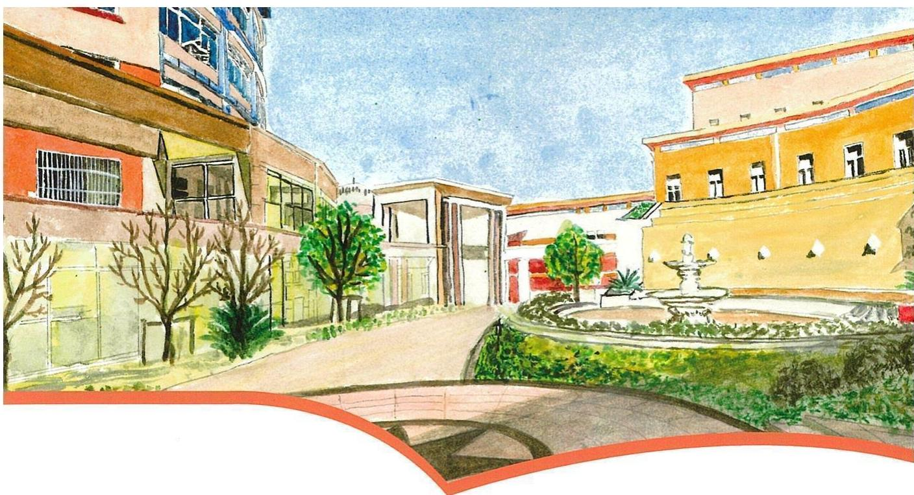

# 协和数学练习册

# SUIS MATHS WORKBOOK

三年级 第二学期

班级

姓名

学号

# 目录

# Contents

# 一复习与提高

单元小贴士… 3

1 小复习… 4  
2 带小括号的四则运算……7  
3 面积的估测……10  
4 平方米 … 13  
5 组合图形的面积 16  
单元练习… 22

1 整体与部分 80  
2 几分之一 83  
3 几分之几 88  
单元练习… 93

# 五 计算器

# 二 用两位数乘除

单元小贴士… 25

1 速度、时间、路程 …… 26  
2 整十数与两位数相乘……33  
3 两位数与两位数相乘 35  
4 两位数与三位数相乘 41  
5 整十数除两、三位数……47  
6 两位数除两、三位数 50  
7 两位数除多位数 57  
单元练习… 66

3 使用计算器计算……101  
单元练习… 105

# 六 几何小实践

单元小贴士… 107

1周长· 108  
2长方形、正方形的周长 114  
单元练习· 121

# 七 整理与提高

单元小贴士 123

1乘与除… 124  
2分数… 127  
3 解决问题 …………………… 130  
4周长与面积… 135  
5 谁围出的面积大…… 138  
6 搭配 … 140

7数一数 143

8放苹果 145

单元练习 147

# 一. 复习与提高

单元小贴士

Unit Tips

归纳：

1. 四则混合运算

在计算四则混合运算式题时，若有小括号，根据运算法则，应先算括号里面的算式，再算括号外面的算式。

2. 不规则图形面积

对于不规则图形面积，很难用公式求出它们的面积，利用数方格的方法可以估测它的面积。根据“大于等于半格的算1格，小于半格的可以不算”的原则进行分类计数。如果有些图形边界不是很清楚，答案略有误差应该也算正确。

3. 平方分米

长度单位换算中，米、分米和厘米相邻两个长度单位之间的进率时10；而在面积单位换算中，平方米、平方分米和平方厘米相邻两个面积单位之间的进率是100，不能混淆。

4. 组合图形面积

组合图形面积的计算，可以运用“割”、“补”或“移”的方法，将图形转换为我们已经学过的基本图形：长方形或正方形，然后利用对应的面积公式进行计算。

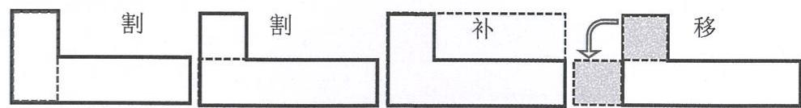

# 1. 小复习

# 基础练习

# Core Exercises

# 一．直接写得数。

<table><tr><td>500÷5=</td><td>6×70=</td><td>6×500=</td><td>250+630÷9=</td></tr><tr><td>2×300=</td><td>562+6=</td><td>420÷7=</td><td>4×80×5=</td></tr><tr><td>630÷7=</td><td>480÷8=</td><td>707-8=</td><td>490÷7×8=</td></tr><tr><td>80×9=</td><td>85÷8=</td><td>90÷3=</td><td>50×4÷2=</td></tr></table>

# 二.竖式计算（打\*的要验算）。

$$
* 7 4 2 \times 9 = \quad 5 6 7 \div 8 = \quad 1 8 4 8 \div 7 =
$$

$$
8 3 6 \times 4 = \quad * 8 4 0 \div 6 = \quad 5 2 4 \div 4 =
$$

# 三. 递等式计算（能巧算就巧算）。

$$
5 4 \times 9 + 2 7 4 \quad 1 2 6 \times 7 - 4 3 5 \quad 7 1 7 \div 3 \times 4
$$

$$
9 8 1 \div 3 - 5 7 \quad 4 2 5 + 1 7 5 \times 6 \quad 2 5 4 + 1 6 7 + 3 3 3
$$

# 四．选择题。

有A、B两个盒子，A盒中有54粒糖，B盒中有一粒糖，如果每次从A盒中拿出7粒糖放入B盒，那么，几次后，A盒中的糖将被全部拿完？观察下面竖式，箭头所指的“49”所表示的实际意义是（ ）

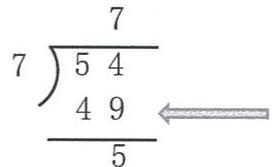

A.需要拿49次

B.B 盒中现在有 49 粒糖

C. 还剩 49 粒糖没拿

# 五．填空题。

（1）□  $293\div 5$  ，要使商是三位数，里最大可以填（ ）。  
（2）8  $5\div 4$  ，要使商中间有0，里最大可以填（ ）。  
（3）  $503\times 2$  ，用百位上的“5”与“2”相乘，积是（

# 六．应用题。

小明今年12岁，爸爸今年的年龄是小明的4倍，爷爷今年的年龄是爸爸今年年龄的2倍少16岁，问爷爷明年几岁？

举一反三

Challenges

算式谜。

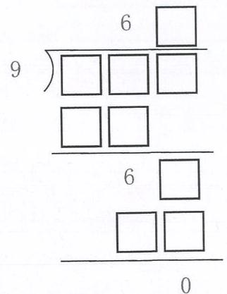

巧算。

$$
(2 0 0 + 1 9 8 + 1 9 6 + \dots + 2) - (1 + 3 + 5 + \dots + 1 9 9)
$$

# 2. 带小括号的四则运算

基础练习

Core Exercises

一.竖式计算（打\*的要验算）。

$$
3 0 2 \times 6 =
$$

$$
* 7 2 8 \div 9 =
$$

二．递等式计算（能巧算的要巧算）。

$$
3 \times (6 1 2 \div 6)
$$

$$
(3 7 4 - 1 8 5) \times 9
$$

$$
(1 7 5 + 5 0) \div 9
$$

三. 把分步计算列成综合算式。

(1)  $300 - 45 = 255$

(2)  $37 + 59 = 96$

$$
2 5 5 \div 5 = 5 1
$$

$$
1 0 0 - 9 6 = 4
$$

综合算式：

综合算式：

(3)  $27 \div 9 = 3$

(4)  $5 \times 6 = 30$

$$
5 6 1 \div 3 = 1 8 7
$$

$$
3 0 + 1 0 = 4 0
$$

综合算式：

综合算式：

# 四. 列综合算式计算。

（1）239与689的和是8的几倍？  
（2）1000与259的差是3的几倍？

# 五．填空题。

小马虎在计算  $160 \div (4 + \square)$  时，把括号丢了，计算结果是46。那么正确的计算结果应该是（ ）。

# 六．应用题。

（1）一批钢材重480吨，大卡车先运走335吨，剩下的用小卡车运，每辆小卡车一次运5吨，剩下的钢材几次才能运完？  
（2）商店里有两种笔记本，一种售价16元，一种售价18元，如果每种都买6本，共需要多少钱？

（3）学校先买了48盒白粉笔，再买了72盒彩色粉笔，将这些粉笔平均分给8个班级，每个班级能分到多少盒粉笔？（有几种解题方法就写几种）

举一反三

Challenges

# 填空题。

（1）小亚今年13岁，妈妈的年龄比小亚的年龄的3倍小2岁，再过2年妈妈是（ ）岁。  
（2）用4、7、5三个数字编一个两位数乘一位数的算式，得到的最大积是（ ），最小积是（ ）。

# 3. 面积的估测

# 基础练习

# Core Exercises

# 一. 直接写出得数。

$$
\begin{array}{l} 9 \times 6 0 = \quad 1 2 \times 6 = \quad 4 \times 2 5 = \quad 6 3 + 2 7 \div 9 = \\ 8 1 0 0 \div 9 0 = 2 4 \div 8 = 8 1 \div 3 = 1 0 0 - 1 0 0 \times 0 = \\ \end{array}
$$

# 二. 竖式计算。

（1）  $5080\times 5 =$

（2）  $87\div 7 =$

# 三. 递等式计算（能巧算的要巧算）。

(1)  $78 \times 36 - 16 \times 78$

(2)  $354 - 178 + 22$

（3）  $7\times (512 - 206)$

（4）  $99 + 99\times 99$

（5）  $587 + 215 - 287$

(6)  $237 + 386 + 163 + 114$

# 四．应用题。

（1）小胖和他的爸爸、妈妈、爷爷、奶奶住在160平方米的房子里，问他家人均住房面积是多少？

（2）一座农场原来的试验田，长是11米，宽是70米，扩建后面积是1040平方米，比原来面积增加了多少？

# 五．如果右图中每个小正方形的边长都是1厘米，那么阴影部分的面积大约是多少？

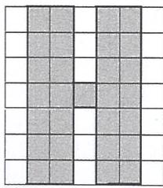

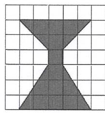

C图形

D图形

E图形

F图形

面积有（ ）cm²

面积有（ ）cm²

面积有（ ）cm²

面积有（ ）  $\mathrm{cm}^2$

举一反三

Challenges

一．如图，用10个小正方形拼成一个长方形，总面积是40平方厘米。那么阴影部分的面积是（ ）平方厘米。

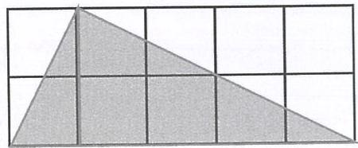

二. 将下面分成大小与形状相同的 3 块，并且每块带 1 个圆圈。

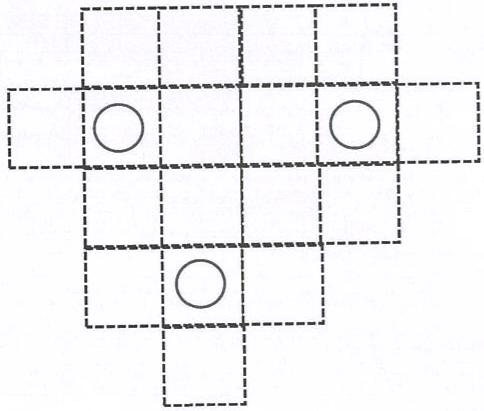

4. 平方米

基础练习

Core Exercises

一．递等式计算，能巧算的要巧算。

1022-234-166  $34\times 86 + 86\times 6$  9000-120×4

$35\times 5 + 78\times 6$ $99\times 11 - 99$ $64\times 3\times 5$

二. 在括号里圈出一个合适的单位。

（1）小胖家的建筑面积是108（平方米平方分米 平方厘米）。  
（2）日记本的封面大约为2（平方米 平方分米 平方厘米）。  
（3）小区的游泳池占地300（平方米 平方分米 平方厘米）。  
（4）小巧的手掌大约有100（平方米 平方分米 平方厘米）。  
（5）小亚房间的窗户面积大约为4（平方米平方分米平方厘米）。

三. 单位换算。

40dm=（ ）m  $20\mathrm{mm} =$  （ ）cm  $15\mathrm{kg} =$  （ ）g

$26\mathrm{m}^2 = (\quad)\mathrm{dm}^2\quad 11\mathrm{d}\mathrm{m}^2 = (\quad)\mathrm{cm}^2\quad 17\mathrm{kg} = (\quad)\mathrm{g}$

$400\mathrm{cm}^2 = (\mathrm{\Omega})\mathrm{dm}^2$ $5700\mathrm{dm}^2 = (\mathrm{\Omega})\mathrm{m}^2$

300  $\mathrm{dm}^2 =$  （ ）  $\mathfrak{m}^2 = (\quad)\quad \mathfrak{cm}^2$

$70\mathrm{m}^2 = (\mathrm{\Omega})\mathrm{dm}^2 = (\mathrm{\Omega})\mathrm{cm}^2$

四．在括号里填上合适的单位：

一张邮票的面积是6（ ）。课桌长80（ ）。

数学练习本长25（ ），宽20（ ），它的面积是500（ ）。

黑板面积大约3（ ）。

五．填入适当的单位，使等式成立。

1（ ）+9（ ）=1（ ）；1（ ）+99（ ）=1（ ）

六．应用题。

（1）一个车间长20米，宽12米，中间留出宽1米，长20米的通道，在车间里每4平方米装一台机床，问一共可以安装多少台机床？

（2）一个卫生间的地面是长方形，长是3米，宽是20分米，这个卫生间地面的面积是多少平方米？用边长2分米的正方形地砖铺地，至少需要这样的地砖多少块？

举一反三

Challenges

（1）下面这些算式显然是不成立的，如果在每个数的后面添上合适的计量单位，那么等式就成立了，你来试试看！

70（ ）+30（ ）=1（ ） 6（ ）+4（ ）=1（ ）

14（ ）+10（ ）=1（ ） 3（ ）+4（ ）=1（ ）

（2）一个长方形，如果宽不变，长增加3分米，面积就增加21平方分米；如果长不变，宽减少2厘米，面积就减少20平方分米。这个长方形原来的面积是多少平方分米？

# 5. 组合图形的面积（1）

# 基础练习

# Core Exercises

# 一.竖式计算（打\*的要验算）。

$$
3 0 7 \times 6 =
$$

$$
* 4 1 9 \div 9 =
$$

# 二. 根据右图把下面的算式和下图配对。

算式一：  $2\times 2 + (3 + 2 + 3)\times 2$  （

2

算式二：  $(2 + 2)\times (3 + 2 + 3) - 2\times 3\times 2$

（

算式三：  $2\times 2\times 2 + 3\times 2\times 2$  （

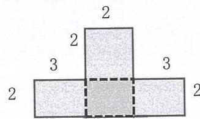  
(1)

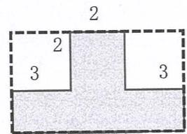  
(2）

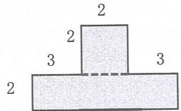  
(3）

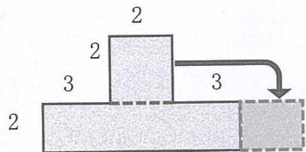  
(4)

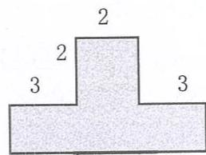

# 花园的面积有多大？（单位：米）

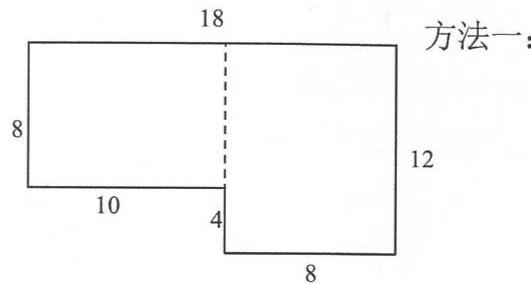

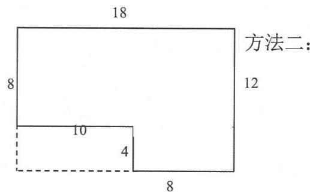

四. 计算下列图形的面积（单位：厘米）。

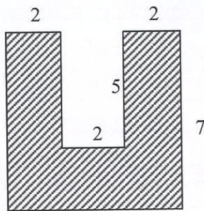

五.如图所示（图中单位：米），小区中的一个花圃，花圃中有两条宽为3米的小路。请你算算花圃面积多大。

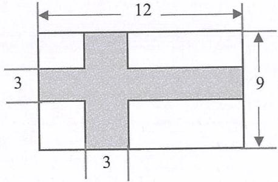

举一反三

Challenges

用4块长和宽分别是  $5\mathrm{cm}$  ，  $2\mathrm{cm}$  的瓷砖拼成的图形（如图所示，单位  $\mathrm{cm}$  )，当中空白部分的面积是多少？

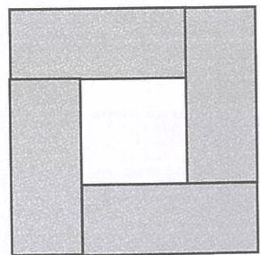

# 5. 组合图形的面积（2）

基础练习

Core Exercises

一．下列三种图形面积的计算方法是否正确？正确的在括号里

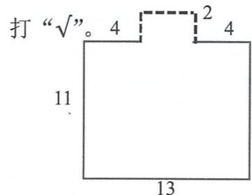

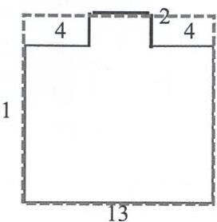

方法一：

$13\times 11 - 4\times 2 - 4\times 2$  （

单位：分米

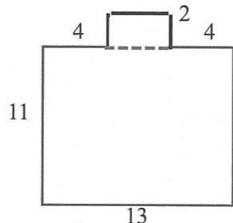

方法二：

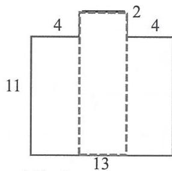

方法三：

$13\times 11 + (13 - 4 - 4)\times 2$  （ ）  $4\times 11\times 2 + (13 - 4\times 2)\times (11 + 2)$  （

二．两个相同的长方形，长7厘米，宽3厘米，按下图所示叠放在一起，这个图形的面积是多少平方厘米？

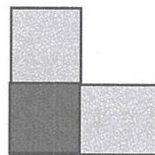

三．填空题。

正方形的面积9平方分米，如果它的边长扩大到原来10倍，面积变为（ ）平方分米。

四．选择题。

（1）在一个边长2分米的正方形里面可以完整摆放（ ）个面积是1平方厘米的小正方形。

A. 4

B. 400

C. 40

（2）“6平方分米”与“600平方厘米”比较，（

A. 大小相同，意义相同

B. 大小相同, 意义不相同

C. 大小不相同，意义相同

五. 按照从小到大的顺序排列：

350平方分米、35平方米、30000平方厘米、3500平方厘米

六．应用题。

（1）有一种播种机，作业宽度是2米，用拖拉机牵引，按每小时行6千米计算，每小时可以播种多少平方米？

（2）王大伯要沿着一面墙为一个养鸡舍，鸡舍的长是25米，宽是9米（如图），需要多长的篱笆围？鸡舍的面积是多少平方分米？

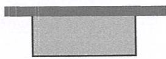

举一反三

Challenges

（1）如图所示，两个完全一样的长方形（长、宽分别是4米和2米）交叠，交叠部分是一个边长1米的正方形，求阴影部分面积。

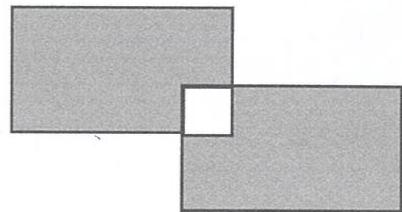

（2）一个正方形和一个长方形有一部分重叠在一起，两个图形没有重叠的部分面积相差多少平方厘米？

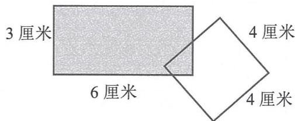

# 单元练习

# Unit Exercises

# 一．口算。

$$
\begin{array}{l} 9 0 \div 2 = \quad 8 5 \div 8 5 = \quad 2 0 \times 8 = \quad 8 5 \times 3 = \\ 6 0 0 \div 2 = \quad 8 \times 6 + 8 \times 1 4 = \quad 9 \times 8 \times 1 2 5 = \quad 1 2 6 - 1 2 6 \times 0 = \\ 8 0 0 \div 4 = \quad 9 6 \div 4 = \quad 3 6 0 \div 6 = \quad 4 8 + 5 2 = \\ \end{array}
$$

# 二. 递等式计算(能巧算的巧算)。

$$
6 4 7 - 2 3 5 - 1 6 5 \quad 7 4 5 - 2 8 2 + 2 5 5 \quad 9 2 4 \div 4 \times 5
$$

$$
(7 9 8 + 2 2 6) \div 4 \quad 3 \times 4 8 7 - 6 9 9 \quad 4 8 4 - (6 8 + 4 0 1)
$$

$$
(2 0 9 8 - 1 1 0 9) \times 6 \quad 9 1 5 \times 7 - 7 \times 1 1 5 \quad 4 8 0 \div (3 0 \div 6)
$$

# 三．填空题。

$$
8 0 \mathrm {d m} = (\quad) \mathrm {c m} \quad 5 \mathrm {m} = (\quad) \mathrm {c m} \quad 9 0 0 0 \mathrm {c m} = (\quad) \mathrm {m}
$$

$$
4 \mathrm {m} ^ {2} = (\quad) \mathrm {d m} ^ {2} \quad 7 \mathrm {d m} ^ {2} = (\quad) \mathrm {c m} ^ {2} \quad 4 2 \mathrm {m} ^ {2} = (\quad) \mathrm {d m} ^ {2}
$$

$$
6 9 \mathrm {d} \mathrm {m} ^ {2} = (\quad) \mathrm {c m} ^ {2} \quad 5 0 0 0 \mathrm {d} \mathrm {m} ^ {2} = (\quad) \mathrm {m} ^ {2} \quad 8 4 0 0 \mathrm {c} \mathrm {m} ^ {2} = (\quad) \mathrm {d m} ^ {2}
$$

$$
8 0 \text {平 方 米} = (\quad) \text {平 方 厘 米} 6 0 0 0 \text {平 方 厘 米} = (\quad) \text {平 方 分 米}
$$

# 四．应用题。

（1）妈妈每月给李华零用钱28元，可是李华只用去25元，这样他一年可以节约多少钱？  
（2）小红练毛笔字，第一天和第二天写的同样多，第三天写了15个字，比第二天多写4个字，第一天和第二天共写了多少字？  
（3）小明计划每天写24个字，实际上他每天多写了6个字，这样小明一星期要写字多少个？  
（4）一个制鞋厂生产男鞋1200双，生产的女鞋比男鞋少342双，是生产的童鞋的3倍，生产童鞋多少双？

（5）有一块长25米，宽10米的菜园，如果把长和宽都增加5米，菜园面积增加多少？

（6）有一块长20米，宽10米的长方形地，如果在这块地内的四周修筑1米宽的小路，中间植草皮，草地面积是多少？小路的面积是多少？

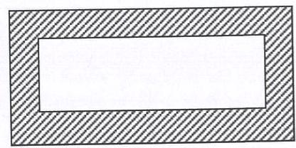

五. 计算下面阴影部分的面积（单位：厘米）。

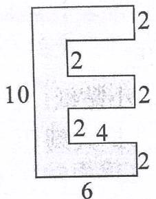

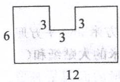

# 二. 用两位数乘除

单元小贴士

Unit Tips

因数末尾有0的乘法竖式

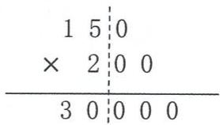

先将两个因数0前的数相乘，然后再将两个因数所有的0都添加到乘积后即可。竖式计算时，注意将因数0前的数对齐进行计算。

“四舍试商”法

试商时，把除数看作整十数，相乘时，商要和题目中的除数相乘。

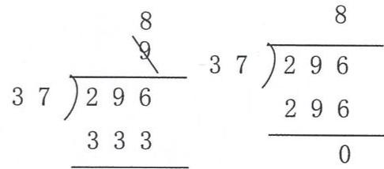

想：296 里有几个 30？  
9 个 30， $9 \times 37 > 296$ ，商 9 太大，改商 8。

“五入试商”法

除数是两位数且不是整十数时，若某个位大于等于5，把除数按“五入”法将其看作整十数进行试商。

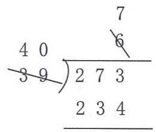

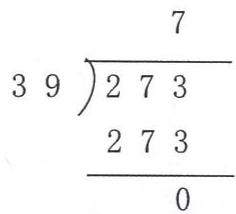

想：273里有几个40？  
6个40，  $6\times 69 = 234$  ，余数39，余数与除数相等，商6太小，改商7。

“同头无除，除商 9”

若除数的最高位数字和被除数最高位数字相同，且被除数的前两位比除数小，又比较接近除数时，可以试商9。

想：108 里有几个 10？  
10 个 10， $10 \times 12 > 108$ ，商 6 太大，改商 9。

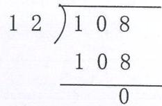

# 1. 速度、时间、路程(1)

# 基础练习

# Core Exercises

# 一. 直接写出得数。

$$
4 2 7 \div 6 =
$$

$$
5 5 0 \div 5 =
$$

$$
1 5 \div 8 =
$$

$$
2 5 \times 8 =
$$

$$
2 \times 3 2 + 5 6 =
$$

$$
8 0 \times 1 2 5 =
$$

# 二. 递等式计算，能巧算的要巧算。

$$
3 1 2 \times (6 3 \div 9)
$$

$$
1 0 6 + 2 0 4 \times 5
$$

$$
2 5 5 0 \div 5 - 3 4 9
$$

$$
7 0 0 0 - 4 2 5 \times 8
$$

$$
8 7 \times 4 + 4 \times 1 3
$$

$$
4 7 6 - 8 8 + 1 2
$$

# 三．填空题。

(1)将读法写在（ ）里。

300千米/时（ ） 4厘米/分（

(2)一艘帆船7分钟行走了3346米，它的速度是（ ）。  
(3)一艘宇宙飞船飞行600000米只用了8秒钟，它的飞行速度是（ ）。  
(4)一架客机从甲地飞往相距1396千米的乙地，用了2小时，这架客机的速度是（ ）。

# 五．判断题。

(1)一只飞蛾6分钟飞行了96米，96米就是它的飞行速度。（）  
(2)只要知道路程和通过这段路程所用的时间就可以求出速度。  
(3)六十八千米每小时可以表示成68千米/时。……（）  
(4)判断一个物体运动的速度，不仅要看它运动的距离，还要看通过这段距离所用的时间，速度是由距离和时间两个量决定的。

# 六. 选择题。

(1)甲数是760，是乙数的2倍多10，乙数是多少？正确的列式是（ ）。

A.  ${760} \times  2 + {10}$

B.  $(760 + 10) \times 2$

C. (760-10)  $\div 2$

D.  $(760 + 10) \div 2$

(2)摩托车2分钟行了2500米，它的速度是（ ）。

A. 2500 米/分

B. 1250 米/秒

C. 75千米/时

D. 1250 米/时

(3)如果路程是685千米，行驶时间是5小时，那么速度是（ ）。

A. 137 千米

B. 137 千米/时

C. 137 千米/分

D. 137 千米/秒

(4)成人的行走速度大约是（ ）。

A. 70 米/分

B. 70 米/秒

C. 7 米/时

D. 7 米/分

七．应用题。

（1）小玲从学校到家的距离是1500米，如果她走路到校要用30分钟，她爸爸骑车送她到校只要10分钟，爸爸的骑车速度是小玲步行速度的几倍？  
（2）欢欢和乐乐进行跑步训练，欢欢7分钟跑504米，乐乐9分钟跑612米，问谁跑得快？  
（3）轿车的速度是12米/秒，7:15出发，7:24到达目的地，这辆轿车行驶了多少米？

举一反三

Challenges

解决问题。

（1）甲车的速度是78千米/时，按照这样的速度，4小时可以行驶多少千米？同样的路程乙车行驶6小时，乙车每小时行多少千米？  
（2）小胖在正常情况下5分钟走300米，周末小胖要去看19:00的电影，而电影院要求观众提前10分钟到。如果小胖家离电影院有1400米，小胖18:30从家出发，他的速度应比正常速度加快多少才能看上电影？

1. 速度、时间、路程(2)

基础练习

Core Exercises

一．递等式计算（能巧算的要巧算）。

$366 + 34\times 6$ $810 - 9\times 29$  486-227-173

$701\times 5 - 560$ $303\div 3\times 30$ $1005 - 1000\div 8$

# 二．填空题。

（1）填表。

<table><tr><td></td><td>速度</td><td>时间</td><td>路程</td></tr><tr><td>步行</td><td>55米/分</td><td>8分钟</td><td></td></tr><tr><td>自行车</td><td></td><td>3小时</td><td>36千米</td></tr><tr><td>汽车</td><td>60千米/时</td><td></td><td>480千米</td></tr><tr><td>飞机</td><td></td><td>6秒</td><td>1800米</td></tr></table>

# 三. 选择题。

(1)树懒是世界上爬行最慢的哺乳动物，一只树懒6分钟爬行12米，  $12\div 6$  的商表示（

A. 树懒爬行的路程

B. 树懒爬行的时间

C. 树懒爬行的速度

(2) 妈妈 4 小时行 360 千米, 她乘的是什么交通工具? ( )

A. 飞机

B.汽车

C. 自行车

(3)蝴蝶3小时飞  $84\mathrm{km}$  ，蜜蜂4小时飞  $96\mathrm{km}$  ，（ ）飞得快。

A. 蝴蝶

B. 蜜蜂

C. 无法确定

(4)有两部教科影片，第一部长600米，要放映8分钟；另一部长1200米，要比第一部多用（ ）才能放映完。

A.6分钟

B. 7 分钟

C. 8 分钟

D. 9 分钟

四．填空题。

(1)小明家到学校有540米，他每天上学走9分钟，他每分钟大约走（ ）米。  
(2)从A地到B地，甲行驶6天到达，乙行驶8天到达，已知甲每天比乙多行驶80千米，则乙的行驶速度是（）千米/天。五．应用题。

（1）甲乙两车同时从相距445千米的两地相对开出，甲车每小时行48千米，4小时后与乙车相距25千米（两车未相遇），乙车每小时行多少千米？  
（2）甲乙两地相距1128千米，一列火车已经行驶408千米，剩下的路程用3小时行完，平均每小时行驶多少千米？  
（3）小淘气家距离奶奶家36千米，爸爸下午2:55从家出发骑车去奶奶家接小淘气，接到小淘气后爸爸立即骑车回家，到家后，爸爸手机显示17:55，爸爸平均每小时骑行多少千米？

# 举一反三

# Challenges

# 一．填空题。

在一次长跑比赛中，甲以8千米/时的速度跑完全程，时间为75分钟，而乙先以10千米/时的速度跑完全程的一半，最后以6千米/时的速度跑完全程，则（ ）获胜。（填“甲”或“乙”）写出你的思考过程：

# 2. 整十数与两位数相乘

# 基础练习

# Core Exercises

# 一. 直接写出答案。

<table><tr><td>25×40=</td><td>70×14=</td><td>84×20=</td><td>26×30=</td></tr><tr><td>60×31=</td><td>500×19=</td><td>16×50=</td><td>49×300=</td></tr><tr><td>700×12=</td><td>600×16=</td><td>84×400=</td><td>260×70=</td></tr></table>

# 二. 根据  $87 \times 13 = 1131$  ，直接写出下列各题的答案。

<table><tr><td>870×130=</td><td>8700×130=</td></tr><tr><td>8700×1300=</td><td>870×1300=</td></tr></table>

# 三. 用递等式计算（能巧算的要巧算）。

$$
3 6 0 0 0 \div 1 2 5 \div 8 \quad 1 2 5 \times 2 5 \times 8 \times 4
$$

# 四．填空题。

（1）口算  $13\times 20$  时，可以先算  $13\times 2$  ，再在得数末尾添上（ ）个0，结果是（ ）。  
（2）  $25\times 80$  的积的末尾有（ ）个0；

$80\times 50$  的积的末尾有（ ）个0

# 五. 选择题。

(1)某班同学的平均体重是  $25\mathrm{kg}$ ，那么全班40人重（）

A.  $1000\mathrm{kg}$  B.  $100\mathrm{kg}$  C.  $10000\mathrm{kg}$

(2)下面算式中，与  $42\times 30$  的计算结果不同的是（

A.  ${420} \times  3$

B.  $21 \times 60$

C.  ${402} \times  3$

(3)一个坏掉的水龙头一分钟浪费50克水，1小时浪费（ ）千克水。

A. 50

B. 3000

C. 3

# 六．应用题。

（1）一个新建学校需要配备29个教室的课桌椅，每个教室要配备40套，一共要配多少套？

（2）一辆马车的速度是350米/分，30分钟可以行驶多少米？

举一反三

Challenges

应用题。

小胖下午4时从学校出发步行回家，他步行的速度是65米/分，4时20分正好到家，小胖家到学校的距离有多远？

# 3. 两位数与两位数相乘（1）

基础练习

Core Exercises

一. 直接写出得数。

$$
2 4 \times 5 = \quad 3 2 \times 6 = \quad 2 5 \times 8 = \quad 2 5 0 0 \times 8 0 =
$$

$$
2 4 \times 5 0 = \quad 3 2 \times 6 0 0 = \quad 1 6 \times 5 0 0 = \quad 4 8 0 + 3 5 0 =
$$

$$
1 6 0 \times 4 0 = \quad 4 1 0 \times 5 0 = \quad 4 9 \times 8 = \quad 5 8 \times 3 0 =
$$

二. 将计算过程补充完整。

$27\times 48$

$27\times 48$

$$
\begin{array}{l} = 2 7 \times (\quad) \times (\quad) = 3 0 \times 4 8 - (\quad) \times 4 8 \\ = (\quad) \times (\quad) = (\quad) - (\quad) \\ = (\quad) = (\quad) \\ \end{array}
$$

三. 用分拆的方法计算。

$$
1 6 \times 2 9 \quad 4 8 \times 2 5 \quad 2 6 \times 3 2
$$

四．列竖式计算。

$$
1 5 \times 3 = \quad 6 8 \times 2 9 = \quad 4 6 \times 5 6 =
$$

$37\div 2 =$ $55\times 36 =$ $49\div 6 =$

五．递等式计算。

$63\times 64 + 63\times 36$ $72\times 125$

六．列式计算。

（1）2个68的积是多少？

（2）最大的两位数与24的积比248大多少？

七．应用题。

学校组织学生观看电影，平均每班32人，有20个班级，电影院有1000个座位，如果全校学生都坐进去，还能容纳多少人？

举一反三

Challenges

一．选择题。

（1）两个数相乘，积比1000大得多，比2000少一些，可能是（ ）

A.  $39\times 48$  B.  $42\times 54$  C.  $21\times 51$

（2）一个装3000毫升水的水壶，如果把里面的水倒入34个容积为88毫升的杯子里，（ ）完全倒满。

A.不能 B.能。 C.不确定

二．应用题。

电影院有1300个座位，中心小学有28个班级，平均每个班有45人，如果学生全部去看电影，电影院能坐满吗？如果没有坐满，还有多少个座位空着？

# 3. 两位数与两位数相乘（2）

# 基础练习

# Core Exercises

# 一. 直接写出得数。

$$
\begin{array}{l} 3 0 \times 1 2 = \quad 4 5 \times 1 2 = \quad 3 6 \times 2 2 = \\ 5 4 \times 3 0 = \quad 2 4 \times 4 1 = \quad 8 4 \times 1 5 = \\ \end{array}
$$

# 二．先估，再算。

（1）73个42是多少？估：结果在（ ）与（ ）之间；  
算：  $73\times 40 =$  （ ）；  $73\times 2 =$  （ ）；  $73\times 42 =$  （  
（2）29个67是多少？估：结果在（ ）与（ ）之间；  
算：  $29\times 60 =$  （ ）；  $29\times 7 =$  （ ）；  $29\times 67 =$  （ ）

# 三. 竖式计算。

$$
1 8 \times 2 2 = \quad 1 5 \times 3 4 = \quad 8 7 \times 2 6 =
$$

$$
5 6 \times 5 4 = \quad 9 8 \times 4 4 = \quad 6 6 \times 5 5 =
$$

# 五．应用题。

（1）小丁丁家1个月用电约52千瓦，照这样计算，他家一年大约用电多少千瓦时？

（2）学校有825人去春游，一共准备了18辆同样的客车，这种客车1辆最多能坐45人，能保证人人有座位吗？  
（3）1台电扇的价格是85元，1台空调的价格比1台电扇价格的43倍还多45元，1台空调多少元？  
（4）小朋友去春游，48人1组，排了22组，还多25人，去春游的有多少个小朋友？

# 举一反三

# Challenges

# 一．应用题。

学生排队做课间操，笑笑站在左起第11列，右起第12列；从前面数她是第8个，从后面数她是第14个，已知每列的人数相同，则做课间操的学生一共有多少人？

# 二. 在□里填上合适的数，使竖式成立。

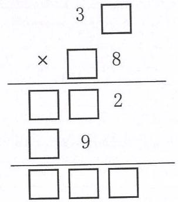

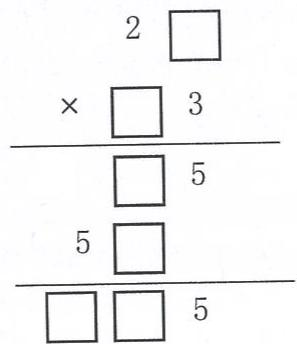

# 4. 两位数与三位数相乘（1）

# 基础练习

# Core Exercises

# 一. 直接写出得数。

<table><tr><td>53×60=</td><td>400×28=</td><td>700×19=</td><td>17×72+28×17=</td></tr><tr><td>75×300=</td><td>7×7+7=</td><td>18×4=</td><td>136×9-36×9=</td></tr><tr><td>128×300=</td><td>6×8+6=</td><td>17×5=</td><td>8×125×9=</td></tr></table>

# 二．填一填。

<table><tr><td>746
× 22
1492…() ×()
1492 …() ×()
16412</td><td>634
× 35
3170 …表示()
1902 …表示()
22190</td></tr></table>

# 三. 用分拆的方法算一算。

$24\times 112$ $37\times 426$ $264\times 39$

# 四．列竖式计算。

$5\times 468 =$ $706\times 23 =$ $46\times 379 =$

$736\times 25 =$

$36 \times 103 =$

$954 \div 9 =$

# 五．应用题。

（1）学校要购置19台录音机，每台215元，带4000元够吗？  
（2）光华电机厂一个月节电135度，照这样计算，一年节电多少度？  
（3）一台电视机的价格是875元，一台电脑的价格是电视机的23倍还多135元，一台电脑多少元？如果两样都买需要多少元？

举一反三

Challenges

# 一．应用题。

甲乙两车同时从A地出发赶往B地，甲车每小时行驶48千米，经过12小时到达B地，乙车每小时行驶24千米，当甲车到达B地时，乙车距离B地还有多少千米？

# 二. 在  $\square$  里填上合适的数，使竖式成立。

14

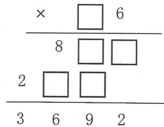

# 4. 两位数与三位数相乘（2）

# 因数末尾有零的乘法

# 基础练习

# Core Exercises

# 一. 直接写出得数。

$$
\begin{array}{l} 7 0 \times 1 3 = \quad 2 4 \times 5 0 = \quad 2 5 0 \times 4 0 = \quad 8 6 \times 5 0 = \\ 7 0 \times 1 3 0 = \quad 2 4 0 \times 5 0 = \quad 4 0 0 \times 2 5 0 = \quad 8 6 0 0 \times 3 0 0 = \\ \end{array}
$$

# 二．列竖式计算。

$$
3 5 0 \times 2 6 0 = 1 7 0 \times 5 2 0 = 4 7 0 \div 3 =
$$

$$
5 6 0 \times 2 4 0 = 1 6 0 \div 4 = 1 6 \times 1 2 5 0 =
$$

$$
8 0 0 \times 2 5 0 = 2 4 0 \times 2 5 0 0 = 8 5 0 \times 7 8 0 =
$$

# 三．递等式计算。

$$
1 4 \times 8 6 + 6 5 \quad 9 6 \div 6 \times 8 9 \quad (1 3 5 + 2 4 5) \times 4 2
$$

# 四．判断题。

(1)两个数相乘，积的末尾有两个零，那么因数的末尾一定有两个零。  
(2)两个数相乘，一个因数的末尾有两个零，另一个因数的末尾有一个零，那么积的末尾有三个零。  
(3)  $250 \times 40 = 1000$

# 五．选择题。

（1）  $4800\times 250$  的末尾有（ ）个零。

A. 2 B. 3 C. 4 D. 5

（2）下面算式中，计算正确的是（

A.  $240\times 50 = 1200$  B.  $250\times 400 = 10000$  
C.  $80 \times 125 = 10000$  D.  $500 \times 600 = 30000$

（3）下面算式中，（ ）得数最大

A.  $210 \times 43$  B.  $21 \times 430$  C.  $420 \times 31$

# 六．应用题。

一只啄木鸟1天大约能吃650只害虫，照这样计算，这只啄木鸟半年（每月按30天计算）能吃多少只害虫？

举一反三

Challenges

# 一．选择题。

$2 \square 7 \times \square 6$  是一个三位数乘两位数的算式，那么下面三个数中有可能是它的得数的是（）

A. 6538

B. 10332

C. 32512

# 二．填空题。

一块苗圃占地650平方米，现在要把苗圃的面积扩大到原来的12倍，扩大后的苗圃面积比原来增加了（ ）平方米。

# 三．应用题。

用403与一个数相乘，小胖在计算时把个位上的3错看成了8，得到的结果比正确答案大了60，正确答案是多少？

# 5. 整十数除两三位数

基础练习

Core Exercises

# 一. 括号里最大能填几？

$20\times (\quad) <   191\quad 60\times (\quad) <   358\quad 80\times (\quad) <   526$

$30\times (\quad) <   196\quad 50\times (\quad) <   438\quad 70\times (\quad) <   232$

# 二. 列竖式计算

$742\times 36 =$ $607\div 30 =$ $548\div 90 =$

$89\div 20 =$ $436\div 70 =$ $406\times 50 =$

# 三. 递等式计算（能巧算的要巧算）。

$144\div (4\times 2)$  536-274-136  $5\times$  （135+247）

四．填空题。

（1）  $368\div 70$  ，商是（）位数，商在（）位上，商是（ ）。  
（2）  $30\times \square < 181$  ，里最大填（ ）；  $40\times \square >281$  里最小填（ ）。  
(3)要使  $684 \div \square 0$  的商是两位数，□里可以填（ ）。

五. 应用题。

（1）张老师买来一捆786厘米长的丝带，要剪成80厘米长的小段，最多可以剪几段？还剩下多少？  
（2）甲乙两地相距1650千米，一辆汽车从甲地开往乙地用了25小时，正好行了全程的一半，问这辆汽车平均每小时行驶多少千米？  
（3）一堆煤重445吨，一艘大船运走162吨。剩下的用一艘小船运，每次运60吨，再运多少次可以完成？

举一反三

Challenges

应用题。

（1）一块长方形绿地长25米，面积200平方米，扩建后宽不变，长变长些，面积变为600平方米。扩建后长方形绿地长多少米？

（2）从420里面减去一个整十数，用得到的差再除以这个整十数，商是6，这个整十数是多少？

# 6. 两位数除两、三位数（1）

# 基础练习

# Core Exercises

# 一.选择题。

（1）  $240\div 32$  ，试商时会把32看作30来试商，得到的商（

A. 偏大

B. 偏小

C. 刚好

D. 无法确定

（2）试商时，如果发现余数比除数大，应把商（ ）

A.改大

B.改小

C. 不变

D. 无法确定

（3）王老师准备了154本练习本，准备平均分发给三（1）班的45位同学，下列叙述正确的有（ ）句。

①每人最多分到2本，还剩余64本  
②每人做多分到3本，还剩余19本  
(3)如果再拿来 19 本, 那么就可以正好分完  
(4)如果拿走19本，那么就可以正好分完

A. 1

B. 2

C. 3

D. 4

# 二．填空题。

（1）算式  $5\boxed{3}\div 55$  ，要使商是一位数，□里可以填（）。  
（2） $68 \div 43$  的商大于5而小于10，里可以填（ ）。

# 三. 竖式计算。

$263 \div 83 =$

$372 \div 69 =$

$659\div 82 =$

# 四．应用题。

（1）某广告公司新进450米材料制作条幅，每个条幅用13米的木板材料，这些材料可以做成多少条幅？  
（2）张老师带120元买羽毛球，买了16个同样的羽毛球，还剩40元，每个羽毛球的售价是多少元？

举一反三

Challenges

# 一．应用题。

（1）同学们做体操，原来每行站13人，共站成23行，最后一行少11人。如果现在站成32行，那么平均每行站多少人？  
（2）一批货物有160吨，原计划安排8辆卡车来运，现在可以多安排12辆，现在每辆卡车要比原来少装多少吨货物？

# 6. 两位数除两、三位数（2）

# 基础练习

# Core Exercises

# 一．选择题。

（1）  $394\div 65$  在试商时把65看作70，得到的商容易（

A. 偏大

B. 偏小

C. 刚好

D. 无法确定

（2）已知“  $125\div p = k\dots 20$  ”是一道有余数的整数出发，若p为两位数，则它代表的数共有（ ）个。

A. 5

B. 4

C. 3

D. 2

# 二．填空题。

（1）计算  $626 \div 69$  时，可以把除数看作（ ）去试商比较简便，商是（ ）位数。  
（2）小丁丁在计算除法时，把除数63误看成36，结果得到的商是15，还余17，正确的商是（ ），余数是（ ）。

（3）最大能填几？

$30\times$  （ ）<104  $608 > 70\times$  （ ）  $60\times$  （ ）<235

$57\times$  （ ）<400  $700 > 9\times$  （ ）  $26\times$  （ ）<216

四．竖式计算。

$$
3 2 8 \div 5 6 =
$$

$$
3 7 4 \div 4 0 =
$$

$$
6 0 8 \div 7 6 =
$$

# 五．列式计算。

（1）已知甲数的16倍比乙数多13，乙数是131，那么甲数是多少？

（2）一个工人一天生产492个羽毛球，如果每96个羽毛球装一箱，最多能装多少箱？还剩多少个？

举一反三

Challenges

# 一．应用题。

春天，王叔叔准备了146元买树苗，每棵16元，买3棵送1棵，最多能买多少棵这样的树苗？

二. 在□里填入合适的数字，使商是一位数且没有余数，并补全竖式。

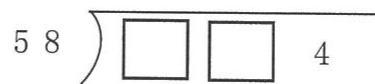

# 6. 两位数除两、三位数（3）

# 基础练习

# Core Exercises

# 一．选择题。

（1）  $463\div 4$  □，商是9，□里最小可以填（

A. 6

B. 7

C. 8

（2）计算  $278\div 28$  时，观察后可直接先商（

A. 7

B. 8

C. 9

# 二．填空题。

（1）要使  $45 \div 45$  的商是一位数，□里有（）种填法。  
（2）小胖在计算一道没有余数的出发算式时，错将被除数108看成168，结果得到的商多5，那么这道题除数是（ ），正确商是（ ）。  
（3）不计算，判断商是几位数。

49 491商是（ ）位数

商是（ ）位数

商是（ ）位数

# 三．竖式计算。

$342 \div 38 =$

$85 \div 13 =$

$782 \div 78 =$

# 四．递等式计算。

$945 \div 15 + 270$

(600-384)  $\div 36$

$204\times 13 - 574\div 7$

# 五．应用题。

（1）如下图，小丁丁从家到学校需要走15分钟，他以同样的速度从学校到体育馆，要走多少分钟？

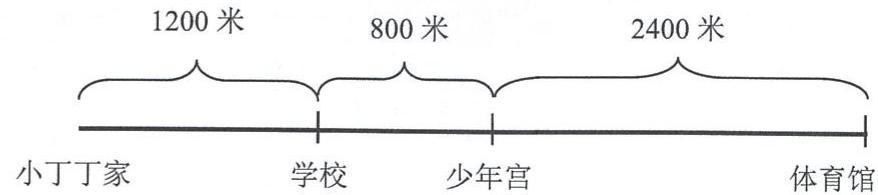

（2）王老师带600元买跳绳，买了同样的跳绳64根，还剩88元。每根跳绳的价钱是多少元？

（3）在一道没有余数的除法算式中，被除数、除数与商的和是389，商是38，被除数和除数分别是多少？

举一反三

Challenges

# 一．应用题。

两个工程队修一条长378米的路，甲工程队单独修需要18天，乙工程队单独修需要21天，如果两个工程队一起修，9天能修完这条路？

# 二. 在  $\square$  里填数。

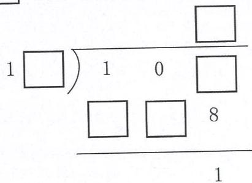

# 7. 两位数除多位数（1）

基础练习

Core Exercises

# 一.选择题。

（1）  $1458\div 56$  ，商是（ ）位数。

A. 一

B. 两

C. 三

（2）若  $47\div 35$  的商时两位数，则里最小填（

A. 3

B. 4

C. 5

# 二．填空题。

（1）在1512中连续减42，要减（ ）次，结果刚好是0。  
（2）一个三位数除以40，商是一个两位数，余数是19，这个三位数最小是（ ），最大是（ ）。  
（3）按要求在□里填入合适的数字。

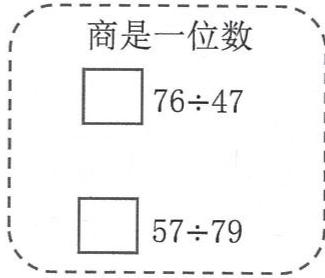

# 三. 竖式计算。

$726 \div 66 =$

$358 \div 27 =$

$2188 \div 22 =$

四. 递等式计算。

$780 \div 65 \times 12$

$4224 \div (24 \times 4)$

五. 列式计算。

（1）甲数是7476，是乙数的84倍，乙数是多少？

（2）2262除以26的商减去18的差再除以23的结果是多少？

六．应用题。

（1）甲乙两城相距1620千米，一辆汽车从甲城开往乙城，前7小时行420千米，照这样的速度，汽车行完全程一共需要多少小时？

（2）施工队修一条长2034米的公路，已经修32天，还剩下50米没有修，平均每天修多少米？

举一反三

Challenges

一．应用题。

花生糖每千克18元，玉米糖每千克12元，高粱糖每千克15元，把这三种糖取同样的质量混合成什锦糖出售，售出多少千克才能获得420元的营业额？

二. 在下面的□里填上合适的数字使算式成立。

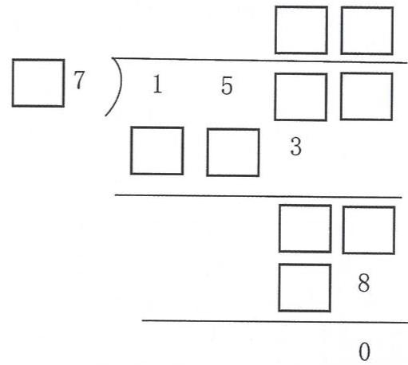

# 7. 两位数除多位数（2）

# 基础练习

# Core Exercises

# 一.选择题。

（1）以下说法正确的有（ ）个

(1)被除数末尾是0，商的末尾一定是0；  
$25771\div 57$  商中间有0  
③被除数中间有0的除法，中间的0不用除，直接在它对应的商的数位商写0就可以。

A. 1

B. 2

C. 3

（2）有480个鸡蛋，每16个装一盒，装这些鸡蛋需要（）个盒子。

A. 3

B. 20

C. 30

# 二．填空题。

（1）要使  $6 \square 7 \div 65$  的商的末尾是0，□里可以填的数字有（）个，最大可以填（ ）。  
（2）  $542\boxed{6}\div 54$  ，要使商中间有两个0，且没有余数，□里应填（ ）。

# 三. 竖式计算。

$870 \div 29 =$

$3220 \div 46 =$

7315÷35-

四．改错。

改正：

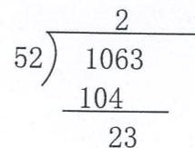

改正：

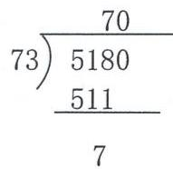

改正：

# 五．应用题。

（1）光明小学食堂买来1575千克大米，这些大米可以吃15天，食堂平均每天吃多少千克大米？  
（2）工厂新进一批原料，每天加工90千克，35天加工完。为了提前完成任务，需要一个月（30天）完成。那么每天应加工多少千克？

# 举一反三 Challenges

把竖式补充完整。

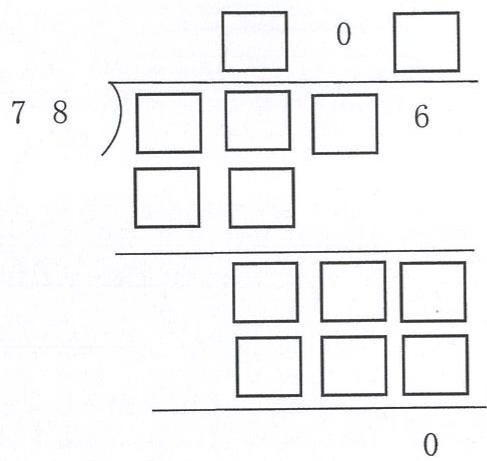

# 7. 两位数除多位数（3）

# 基础练习

# Core Exercises

# 一．填空题。

（1）除数是两位数，先看被除数的（ ），当（ ）时，就看被除数的前三位，除到哪一位，商就写在（ ），哪一位不够商1，就（ ）。  
（2）  $3648\div 27$  ，商的最高位在（ ）位上，商是（ ）位数。  
（3）  $1725\div 36$  ，商的最高位在（ ）位上，商是（ ）位数。  
（4）  $47360 \div 49$  ，可以把除数看成（ ）来试商，商的最高位在（ ）位上，商是（ ）位数。  
（5）  $798\div \square 9$  ，要使商是两位数，□里最大填（ ）；要使商是一位数，□可填（ ）。

# 二. 竖式计算。

$$
2 5 6 \div 1 3 = 3 5 0 0 \div 6 5 = 4 5 3 2 0 \div 4 6 =
$$

$$
2 0 7 8 \div 7 8 = \quad 5 4 8 0 \div 2 7 = \quad 3 2 4 0 \div 5 5 = =
$$

# 三．填表.

<table><tr><td>被除数</td><td>1139</td><td></td><td>2081</td><td>4307</td></tr><tr><td>除数</td><td>75</td><td>14</td><td>49</td><td>12</td></tr><tr><td>商</td><td></td><td>471</td><td></td><td></td></tr><tr><td>余数</td><td></td><td>13</td><td>23</td><td></td></tr></table>

# 四．应用题。

（1）超市里有1416千克的过期商品需要搬到仓库处理，一辆推车可以运商品85千克，需要多少辆推车才能一次性运完？

（2）李老师计划用600元买一些学习用品，先买4个书包，每个92元，余下的钱购买同样的文具盒，每个文具盒的价格是18元，可以买多少个文具盒？

举一反三

Challenges

把竖式补充完整。

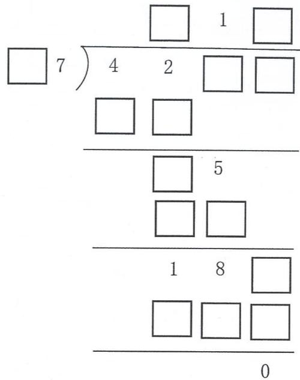

# 单元练习

# Unit Exercises

# 一.列竖式计算（带\*的要验算）。

$$
4 6 4 \times 3 8 = \quad 9 8 2 \div 2 4 = \quad * 7 1 4 0 \div 6 8 =
$$

$$
1 0 3 5 3 \div 4 5 = \quad 4 2 1 8 - 1 4 3 9 + 4 2 7 = \quad * 2 6 0 \times 1 8 =
$$

# 二. 递等式计算（能巧算的要巧算）。

$$
1 5 4 \times 3 1 + 7 2 4 \quad 4 3 5 - 1 7 8 + 5 6 5 \quad 4 0 0 0 - 1 7 2 5 - 2 7 5
$$

$$
1 7 3 + 2 7 \times 1 8 \quad 8 1 \times 7 1 - 7 1 \times 2 1 \quad 8 4 3 - 2 4 3 \div 3
$$

# 三.列式计算。

（1）一个数被26除，商23，余6，这个数是几？

（2）最小三位数与最大两位数的积除以最小三位数与1的差，结果是多少？

# 四．填空题。

(1)

<table><tr><td>速度</td><td>时间</td><td>路程</td></tr><tr><td>15米/秒</td><td></td><td>210米</td></tr><tr><td>36千米/时</td><td>9小时</td><td></td></tr><tr><td></td><td>8分钟</td><td>816米</td></tr></table>

（2）  $6357\div 34$  ，商的最高位在（ ）位上，商是（ ）位数。  
（3）  $2436\div 55$  ，商的最高位在（ ）位上，商是（ ）位数。  
（4）  $698\div \square 8$  ，要使商是两位数，□里最大能填（ ），要使商是一位数，□可填（ ）。

# 五．应用题。

（1）电池厂一小时能生产电池3250节，每36节可装一盒，这1小时生产的能装几盒？还差多少节又可装一盒？

（2）一架飞机5小时飞行3500千米，一辆汽车每小时的速度是35千米，这架飞机的速度是汽车的多少倍？飞机速度比汽车快多少？

（3）四年级160个同学代表学校去参加体操比赛，统一穿白色运动鞋，学校直接与厂家订购，每双鞋25元，因购买数量多，厂家决定赠送10双鞋子，学校还需要付多少钱？

（4）有甲乙两辆车分别从AB两地出发，同向而行，已知AB两地相距50千米，甲每小时行60千米，乙每小时行75千米，问3小时后两车相距多远？

# 三. 统计

单元小贴士

Unit Tips

单元知识点

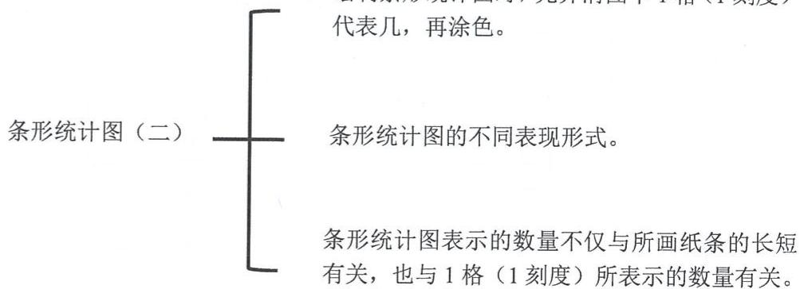

绘制条形统计图要点：

首先要确定最大的数据和最小的数据分别是多少，然后根据最大、最小的数据来确定1格代表多少合适，然后再涂格子时要注意直条与横轴垂直，同一个统计图中的直条宽度要相等。另外，在直条上方注明具体的数量，更加便于查看数据。

# 1.条形统计图（二）（1）

# 基础练习

# Core Exercises

一.填出下列条形统计图中一格表示多少，直条表示多少。

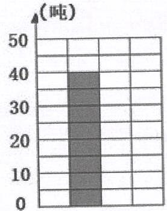  
(1)

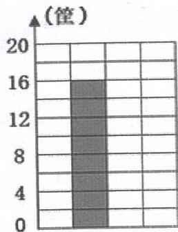  
(2)

1格表示（ ）吨

直条表示（ ）吨

1格表示（ ）筐

直条表示（ ）筐

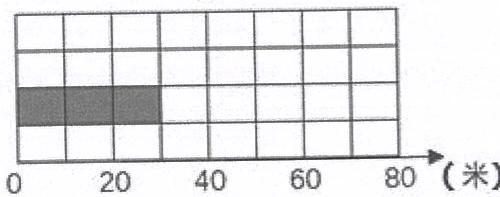  
3

  
4

1格表示（ ）米

1格表示（ ）箱

直条表示（ ）米

直条表示（ ）箱

二. 第32届东京奥运会，中国代表团取得了38枚金牌、32枚银牌和18枚铜牌，共计88块奖牌。下图是部分国家获取金牌的统

计情况：

根据条形统计图回答下列问题。

1. 在上面的条形统计图中，1格表示（ ）枚金牌。

2. 中国的金牌数排第（ ），与金牌数最多的国家相差（ ）枚。

三. 便民超市统计了上一周矿泉水的销售情况（超市销售的矿泉水共有A、B、C、D四种），请你仔细观察下面条形统计图，完成下列问题：

1. 在上面的条形统计图中，1格表示（ ）箱矿泉水。

  
便民超市上一周矿泉水销售情况统计图

2. 便民超市上一周一共销售了多少箱矿泉水？

列式计算：

四. 直接写得数。

$$
3 4 5 + 2 3 + 5 5 = \quad 8 0 \times 4 0 - 2 0 0 = \quad (\quad) \div 8 \times 4 = 3 6
$$

$$
2 4 \times 1 9 + 2 4 = \quad 1 2 5 \times 8 0 \times 2 = \quad 6 \times (\quad) \times 4 0 = 2 4 0
$$

$$
7 7 \times 3 \div 7 = 1 0 0 0 \div 1 2 5 \times 8 = (\quad) \div 9 \div 8 = 0
$$

五．用竖式计算。

$$
9 0 0 0 \div 2 4 = \quad 7 8 0 \times 1 2 3 = \quad 8 0 0 8 \div 1 2 4 =
$$

六．递等式计算，能巧算的要巧算。

$$
1 0 4 \times 2 4 \div 5 2 \quad 4 8 \times 5 3 + 5 3 \times 5 2 \quad (8 0 2 + 2 1 0) \div 2 3
$$

举一反三

Challenges

小胖用围棋子围成一个长方形和一个正方形。长方形的长边摆了8枚棋子，宽边摆了5枚棋子；正方形每边摆了10枚棋子（两个图形没有公共边）。小胖围这两个图形共用了多少枚棋子？

1.条形统计图（二）（2）

基础练习

Core Exercises

一．递等式计算，能巧算的要巧算。

$2242 \div (711 - 673)$

$158 + 242 \times 18$

$3264\div 16 - 168$

# 二. 列式计算。

（1）47与15的差乘它们的和，积是多少？

（2）88除44的2倍，商是多少？

二. 参加学校运动会的各年级运动员人数如下表所示：

<table><tr><td>年级</td><td>一</td><td>二</td><td>三</td><td>四</td><td>五</td><td>合计</td></tr><tr><td>运动员(人)</td><td>40</td><td>50</td><td>95</td><td>65</td><td></td><td>330</td></tr></table>

这个统计表不小心被弄脏了，你能想办法根据已知数据画出条形统计图吗？

# 三、根据行知小学四年级报名社团人数统计表回答问题。

<table><tr><td>社团</td><td>机器人</td><td>烹饪</td><td>足球</td><td>金话筒</td><td>气象观察</td><td>管乐</td></tr><tr><td>人数(人)</td><td>30</td><td>55</td><td>60</td><td>46</td><td>29</td><td>20</td></tr></table>

  
行知小学四年级报名社团人数情况统计图

（1）根据统计表，把统计图补充完整。  
（2）参加（ ）社团的人最多，比气象观察多（ ）人。  
（3）如果每个社团上限45人，将会有多少名同学需要重新调剂？

列式计算：

# 举一反三

# Challenges

（1）一本故事书，小明12天看完，小华要比小明多2天看完，小明每天比小华多看5页。这本书有多少页？

（2）四名同学测量体重，结果分别是36千克、42千克、37千克、40千克。小亚说：“我比小丁丁重，比小胖轻。”小丁丁说：“我比小巧重。”把这四人体重从轻到重排列为：

（ ）<（ ）<（ ）<（ ）

# 单元练习

# Unit Exercises

一．直接写得数。

$$
1 2 1 2 \div 6 = (3 6 + 4 4) \div 2 0 = 2 0 0 \div 2 5 \times 4 =
$$

$$
3 6 - 3 6 \div 4 = \quad 5 3 4 \div (\quad) = (\quad) \dots \dots 2 4
$$

$$
1 0 5 \times 2 0 = 2 6 7 \text {米} \div 3 \text {秒} =
$$

二.竖式计算，（打※的要验算）。

$$
2 0 6 \times 9 5 0 0 = \quad 6 8 6 8 0 \div 3 4 = \quad \text {※} 4 8 2 7 \div 4 7 =
$$

在下面竖式的口里填入合适的数字，使竖式成立。

# 三．递等式计算，能巧算的要巧算。

$$
2 5 \times 1 3 \times 4 0 \quad 1 9 7 8 \div (9 1 7 - 8 3 1) \quad 9 9 \times 1 0 2 - 9 9 - 9 9
$$

# 四．列式计算。

（1）331减去289的差被42除， (2)2个25相乘的积除以5，商是多少？ 结果是多少？

# 五. 选择题。

（1）三个学生进行60米赛跑。小胖跑了13秒，小丁丁每秒跑50米，小亚跑了10秒。这三个人中（ ）跑得最快。

A.小胖 B.小丁丁 C.小亚 D.无法比较

（2）  $18\times 29$  下列算法中不正确的是（

A.  $18\times 30 - 18\times 1$  B.  $10\times 29\times 8$

C.  $18 \times 20 + 18 \times 9$  D.  $20 \times 29 - 2 \times 29$

六．应用题。

（1）小巧每分钟走75米，小胖骑自行车5分钟能行1250米。从学校与图书馆相距1500米，那么小巧和小胖各用15分钟能从学校到达图书馆吗？

小亚的解答：  $75\times 15 = 1125\mathrm{m} <   1500\mathrm{m}$  ，所以小巧15分钟不能到达图书馆；

$1250 \times 2 = 2500 \mathrm{~m} > 1500 \mathrm{~m}$ , 所以小胖 15 分钟内能到达图书馆。

这个“2”表示的是（

你认为小亚的思路对吗？（

请说明理由：

（2）一辆客车的速度是75千米/时，它经过路牌2小时后，距离南京还有多少千米？

距上海  $300\mathrm{km}$  距南京  $600\mathrm{km}$

如果这辆客车再经过5小时必须到达南京，那么它的速度至少是多少千米/时？

（3）一架客机上午9:30从甲地飞往乙地，下午1:30到达乙地，已知甲乙两地间的距离是3000千米，这架客机平均每小时飞行多少千米？

# 四. 分数的初步认识（一）

单元小贴士

Unit Tips

知识点归纳：

1. 将一个整体平均分成几份，其中一份的数量就是几分之一整体的数量。取其中的几份就是这个整体的几分之几。

2. 对于相同的整体，平均分的份数越多，每一份就越小，反之，平均分的份数越少，每一份就越大。

难点解析：

1. 同一根绳子上的  $\frac{1}{4}$  米和  $\frac{1}{4}$  比，长短无法确定。

$\frac{1}{4}$  米和  $\frac{1}{4}$  是两个不同的概念，  $\frac{1}{4}$  米表示的是长度，而  $\frac{1}{4}$  表示整体的部分，因此无法确定。

2. 小巧和小丁丁都有一盒饼干，他们都吃了自己饼干的三分之一，那么（）剩的饼干多。

小巧和小丁丁各自的一盒饼干的总块数没有被确认是否相同，将不同的整体都平均分成3份，取其中的1份，无法比较吃掉饼干的多少，同样也无法确定剩下的饼干数。

# 1.整体与部分

# 基础练习

# Core Exercises

一．把符合要求的字母或序号填入括号内。

A.

B.

①

$③$

$④$

1. 将图（ ）看作整体，（ ）和（ ）是它的部分；  
2. 将图（ ）看作整体，（ ）和（ ）是它的部分。

# 二. 看图填空。

1.图（1）中，将（ ）看作整体，（ ）、（ ）

和（ ）是它的部分。

图（2）中，将（ ）看作整体，（ ）是它的部分。

  
图（1）

  
图（2）

三.列竖式计算（打\*的要验算）。

$$
1 0 5 0 \times 2 4 0 =
$$

$$
7 3 8 0 \div 3 6 =
$$

$$
* 2 4 1 2 \div 2 4 =
$$

# 四. 想一想、填一填。

1. 根据所给图形的个数，画出剩余部分，再推算整体的个数。

（1）图1中有5个  $\bullet$  ，占整体的一半，整体是（ ）个  $\bullet$  。  
（2）图2中有3个■，是整体平均分成三份后其中的一份，整体体是（）个。  
（3）图3中有4个▲，占整体的一半的一半，整体是（ ）个

  
图1

  
图2

  
图3

五. 递等式计算（能巧算就巧算）。

$$
1 0 8 \times 2 2 + 7 7 8
$$

$$
1 2 3 \times 2 0 8
$$

$$
(1 2 7 6 + 8 6 8) \div 3 2 - 3 2
$$

$$
4 8 8 + (7 2 5 + 2 1 2) + 1 7 5
$$

举一反三

Challenges

把一个正方形平均分成4个部分，你有几种不同的分法？试着画一画。

2.几分之一（1）

基础练习

Core Exercises

一. 看一看，写一写。

（1）一个披萨饼被分成同样大小的6块，每一块都是这个披萨的（ ），是（ ）个披萨饼。

（2）一条巧克力被分成同样大小的8块，每一块都是这条巧克力的（ ），是

（3）观察总结：一个（ ）平分成（ ）部分，每一部分就是整体的（ ）。

二. 读出下列各分数。

$\frac{1}{3}$  读作：  $\frac{1}{8}$  读作：

三. 写出下列各分数，并说说它们表示什么含义。

九分之一 写作：

表示：

四. 在每幅图里圈出苹果，分别表示出它的  $\frac{1}{4}$ 。

五．折纸课上，小明拿出一张纸，折出这张纸的  $\frac{1}{2}$  ，并涂色。小李也拿出一张同样大小的纸，折出这张纸的  $\frac{1}{2}$  ，并涂色，两人的折法如下图，他们的涂色部分一样大吗？为什么？

六. 选择题。

（1）下列阴影部分能用  $\frac{1}{4}$  表示的是（

A.

B.

C.

（2）一根木头被锯了6次，平均每段是这根木头总长度的（ ）

A.  $\frac{1}{2}$

B.  $\frac{1}{5}$

C.  $\frac{1}{6}$

D.  $\frac{1}{7}$

举一反三

Challenges

有一本故事书，小胖第一天看了全书的一半，第二天看了剩下的书的一半，你知道小胖还剩这本书的几分之几没有看吗？

2. 几分之一（2）

基础练习

Core Exercises

一. 直接写得数。

$$
4 0 0 0 \div 8 0 = \quad 8 0 \times 5 0 0 = \quad 4 4 1 0 \div 9 0 = \quad 4 3 2 0 \div 6 0 =
$$

$$
5 3 6 5 \div (\quad) = 7 6 \dots \dots 4 5 \quad 3 2 4 \div (\quad) = 8 \dots \dots 4
$$

$$
6 6 \times (\quad) = 2 2 4 4 \quad (\quad) \times 7 0 = 5 7 5 4 0 \quad 8 4 4 \div 4 4 =
$$

二. 列竖式计算（打*的要验算）。

$$
4 6 4 \times 3 8 = \quad * 7 1 4 0 \div 6 8 = \quad 1 0 3 5 3 \div 4 5 =
$$

二. 分绳子。

1米长的绳子被分成同样长的4部分，每一部分绳子的长度是1米的（ ），是（ ）米。

三.每条纸带的长度都是1米，下列各图的阴影部分长度分别是多少米（用分数表示）？

阴影部分的长度是 米。

四．选择题。

(1)下列各图中，（ ）的涂色部分是整体的四分之一。

A.

B.

C.

D.

(2)云云和亮亮分别喝两瓶同样多的饮料，云云喝了  $\frac{1}{3}$ ，亮亮喝了  $\frac{1}{4}$ ，剩下的饮料相比，（ ）

A.云云多 B.亮亮多 C.一样多

(3)要使  $\frac{1}{8} >\frac{1}{\text{一}}$  括号里应填（

A.7 B.8 C.9

(4) 甲数的  $\frac{1}{7}$  与乙数的  $\frac{1}{9}$  相等。（甲数、乙数均不为0），那么甲数（）乙数。

A. > B. < C. = D. 无法确定

# 五. 判断题。

（1）两个分数的分子都为1，分母大的分数大。……（ ）  
（2）把18个橘子分成6份，每份是它的  $\frac{1}{6}$

# 六. 填空题。

（1）1米的  $\frac{1}{8}$  是  $\frac{()}{()}$  米；  $\frac{1}{10}$  厘米是1厘米的  
（2）  $\frac{1}{5}$  千克是（ ）千克的  $\frac{1}{5}$ ，1吨的  $\frac{()}{()}$  是  $\frac{1}{9}$  吨。  
（3）用一把20厘米长的直尺去量1米长的绳子，需要量（ ）次，每次测量的长度占全长的  $\frac{()}{()}$  是  $\frac{()}{()}$  米。

六. 如图是一盘苹果。

小敏：我拿了这盘苹果的  $\frac{1}{2}$ 。  
小聪：我拿了这盘苹果的  $\frac{1}{4}$ 。

他们各拿了几个苹果？谁拿的多？

举一反三

Challenges

# 一．填空题。

（1）做一个零件甲用  $\frac{1}{5}$  小时，乙用  $\frac{1}{6}$  小时，（ ）的效率高。  
（2）如图，两张纸条的后面部分被遮住了，只露出同样长的部分，原来第（ ）张纸条长一些。

第一张

第二张

二. 学校图书馆有 1526 本科技书和 874 本连环画, 每个班级分到这些书的  $\frac{1}{6}$ , 每个班级可分到多少本?

# 3.几分之几（1）

# 基础练习

# Core Exercises

# 一．填空题。

（1）把一条线段平均分成7份，每一份是这条线段的（ ），其中的三份是这条线段的（ ）。

（2）3个  $\frac{1}{8}$  是（ ）。

（3）  $\frac{11}{13}$  中包含（ ）个  $\frac{1}{13}$

（4）一根铁丝长1米，把它平均分成9段，每段长（ ）。

（5）分母是10，分子比分母少3，这个分数是（ ）。

# 二. 用分数表示图中的阴影部分或圈出部分。

（ ）或（

（ ）或（

# 三. 按所给分数将下面各图涂色。

# 四. 下图中黑色图形是整体的几分之一？

举一反三

Challenges

# 一．填空题。

（1）如图，涂色部分占整个图形的（ ），再涂上5块，涂色部分就占（ ）。

（2）把一段木料平均分成6段，每段占全长的（ ），假设锯一次的时间相同，那么每锯一次的时间占总时间的（ ）。

# 3.几分之几（2）

# 基础练习

# Core Exercises

# 一．填空题。

（1）把1米长的铁丝平均分成9段，取其中的1段是（ ），取其中的5段是1米的（ ）。

（2）10千克糖果平均分给5个班级，每班分到的糖果重（ ）千克，每班分到的糖果是总数的（ ）。

（3）图中阴影部分的面积是整体的（ ）空白部分是整体的（ ）

（4）3个  $\frac{1}{5}$  米是（ ）米 （ ）个（ ）厘米是  $\frac{16}{20}$  厘米  
1元的（ ）是  $\frac{8}{100}$  元 （ ）千克是1千克的  $\frac{2}{8}$

# 二. 根据右图选择。（把正确答案的序号写在括号里）

(1)看图数一数：★是图形总个数的（），☆是图形总个数的（ ）。

A.  $\frac{1}{10}$

B. -1

C.  $\frac{4}{10}$

D.  $\frac{4}{6}$

(2)如图，这时如果拿走2个★，那么★是图形总个数的（ ）。

A.  $\frac{6}{10}$

B.

C.  $\frac{6}{8}$

D.  $\frac{4}{8}$

(3)如图，★有6个，☆有4个。如果要使☆占图形总个数的  $\frac{1}{2}$  下列答案错误的是（ ）。

A. 拿走 2 个★

B. 拿走 1 个  $\star$ , 同时拿来 1 个☆

C. 拿来 2 个☆

D. 拿走 1 个☆, 同时拿来 1 个★

三. 判断。（正确的在括号里打“√”，错误的在括号里打“×”）

1. 一根纸带分成9段，4段是这根纸带的  $\frac{4}{9}$  。……（）

涂色部分是三角形总数的  $\frac{6}{10}$  也可以说是三角形总数的

3. 两个长方形，分别剪下其中的  $\frac{4}{6}$  用来做手工，剪下的图形大小一定相等。（）

4.1可以是10个  $\frac{1}{10}$  ，也可以是3个  $\frac{1}{3}$  四.选择。（把正确答案的序号写在括号里）

(1)把一个蛋糕平均分成8块，小亚和小丁丁各吃了2块，小胖吃了3块，他们一共吃了蛋糕的（ ），小巧吃了剩下的部分，小巧吃了整个蛋糕的（ ）。

A.  $\frac{7}{8}$

B.  $\frac{5}{8}$

C.  $\frac{1}{8}$

D.  $\frac{3}{8}$

(2) 小丁丁和小巧做同样的模型飞机，小丁丁用了  $\frac{1}{3}$  小时，小巧用了 30 分钟，他们俩谁做得快？比较的结果是（ ）。

A. 小丁丁做得快

B. 小巧做得快

B. C.一样快

D. 无法判定谁做得快

举一反三

Challenges

想一想，填一填。

我把12根蜡烛看作一个整体，盘子中蜡烛的根数是整体的（），盘子外蜡烛的根数是整体的（），它们合起来就是一个整体。

我也把12根蜡烛看作一个整体，（ ）的蜡烛根数是整体的  $\frac{9}{12}$  ，（ ）的蜡烛根数是整体的  $\frac{()}{()}$  ，它们合起来就是一个整体。

同学们，你们能像小亚和小丁丁一样也来试一试吗？和同伴说一说，再写下来。

把12根蜡烛看作一个整体，（ ）的蜡烛根数是整体的  $\frac{()}{()}$  （ ）的蜡烛根数是整体的  $\frac{()}{()}$  ，它们合起来就是一个整体。

# 单元练习

# Unit Exercises

# 一. 选择题。

（1）小丁丁有一些饼干，分给小胖  $\frac{1}{2}$  后，剩下的再分给小巧  $\frac{1}{2}$ ，最后剩下3块饼干给小亚，小丁丁原来有（ ）块饼干。

A.6

B.8

C.9

D.12

（2）一本书有120页，先看这本书的  $\frac{1}{2}$ ，剩下的页数用5天看完，剩下的页数平均每天看（ ）页。

A.24

B.20

C.16

D.12

# 二. 填空题。

（1）1可以看作是3个  $\frac{1}{\left( \begin{array} { c } { 1 } \\ { 0 } \end{array} \right)}$  ，也可以看作是（ ）个  $\frac{1}{5}$  。  
（2）一个大正方形平均分成16个小正方形，先将其中的8个剪下，然后再剪下2个，剪下的小正方形的面积占大正方形的（ ），16个小正方形是（ ）个大正方形。  
（3）一段路长20千米，工程队已经修了它的  $\frac{2}{5}$ ，是（ ）千米；没修的占这条路全长的（ ），是（ ）千米。

三. 比大小。  $\frac{1}{3}$  （ ）  $\frac{1}{4}$

$\frac{7}{7}$  （ ）1

2 6 5

四．竖式计算。

$$
4 0 5 \times 2 3 0 =
$$

$$
3 0 5 0 5 \div 5 0 =
$$

五．递等式计算，能巧算要巧算。

$$
4 2 6 0 \div 6 0 \times 1 0 4
$$

$$
3 4 5 \times 1 5 - 4 5 \times 1 5
$$

$$
6 3 0 0 - 6 0 \times 7 0
$$

$$
8 5 2 - 3 7 6 - 2 7 6 - 5 2
$$

$$
1 8 2 1 - (6 7 2 + 8 2 1) + 6 7 2
$$

$$
5 5 0 \div 1 1 + 4 4
$$

六．列综合式计算。

58乘3的积加上112，和是多少？

440除412加28的和，商是多少？

七．应用题。

（1）小红带20元去买学习用品，买笔记本用去这些钱的  $\frac{1}{4}$ ，买钢笔用去这些钱的  $\frac{2}{5}$ ，买笔记本和钢笔共用去多少元？

（2）妈妈买了一箱牛奶，总共36盒，小胖想将其中的  $\frac{1}{5}$  放进冰箱，他能做到吗？（每小盒不可拆封）

# 五. 计算器

单元小贴士

Unit Tips

单元知识框架

# 方法与技巧

1. 在读取算盘表示的数时，要看清在哪一档上定位，如果定位发生错误，会影响整个读书。

2. 定位确定后，从右往左分别是个位、十位、百位、千位、万位，……，然后对应有几个算珠就相应地读取，而且空位的不能忽略不计，只要在最高位的右侧都要读取。

# 1. 从算筹到计算器

# 基础练习

# Core Exercises

# 一．列竖式计算。

$256 \div 13 =$

$3500 \div 65 =$

$45320 \div 46 =$

# 二. 递等式计算（能巧算要巧算）。

103+73-159+57

$83 \times 91 + 131 \times 83$

197-46+67-13

$38 + 54\times 126 - 52$

$25 \times (26 \times 4)$

$25\times 44$

# 三．列式计算。

（1）56加上44的和是多少？25减20的差是多少？用所得的和除以所得的差，商是多少？

（2）350减去86的差是多少？所得的差是6的多少倍？

（3）128减去119的差，再乘以407，积是多少？

# 四. 写出下面算盘表示的数。

写作：

写作：

# 五. 在算盘上涂色，表示下列各数。

  
728

  
5010

  
60454

  
17036

举一反三

Challenges

# 一．想一想，算一算。

小朋友们，让我们一起在算盘上做游

（1）小丁丁在算盘上拨数，他用四颗算珠在算盘上表示的最大的四位数是（ ），最小的四位数是（ ）。  
（2）小巧在算盘上用3颗算珠拨出一个最大的三位数和一个最大的两位数，它们差是（ ）

# 二．下面竖式中每个方框表示一个数字，方框表示的数字可以相同，也可以不相同，那么这6个方框的总和是多少？

2. 计算器

基础练习

Core Exercises

一．填一填。

怎样按键计算？请在方框里填入适当的数与运算符号。

$$
4 3 9 6 + 2 0 8 9 =
$$

$$
7 2 8 \times 2 3 5 =
$$

接通电源后，这样按键：

接通电源后，这样按键：

# 二. 想一想，填一填。

我想用计算器计算  $369396 \div 9$  的结果。

（1）小胖先按被除数（如右图所示），他按出的被除数是否正确吗？（ ）（填“对”或“错”）

如果错了，请在下面写出正确按法。

接通电源后，依次按下按钮：

（2）小胖把“÷”键按成了“+”键，想要修改（如上图所示），他按这个按键合理吗？（ ）（填“合理”或“不合理”）。如果你认为不合理，请在上图计算器中圈出正确的按键。

三．竖式计算。

$$
6 2 3 \times 5 0 8 =
$$

$$
7 0 4 0 \div 3 5 = 3 6 9 0 0 \div 2 8 =
$$

举一反三

Challenges

一．填空题。

（1）用计算器按下 2 8 X 2 4 CE 2 5 = 时，显示屏显示的结果是（ ）。  
（2）张明在计算器上按  $35 \times 239$  时，不小心把239按成了329，发现按错了，就按了一次“CE”键，又按了239和“=”键，显示屏显示的结果（ ） $35 \times 239$  的结果。（选填“是”或“不是”）

二．解决问题。

（1）用计算器计算“ $136 \times 49$ ”时，发现数字键“4”坏了。如果还用这个计算器，你会怎样计算？请写出算式。  
（2）小华在用计算器计算  $216 \times \square$  时，把“×”按成了“+”，得到的结果是237，请你计算出正确的结果。

3. 使用计算器计算（1）

基础练习

Core Exercises

一．竖式计算。

$$
1 0 4 8 8 \div 2 3 =
$$

$$
4 9 8 5 \times 2 1 2 =
$$

二. 递等式计算。

$$
2 6 7 5 \times (1 2 0 \div 2 4)
$$

$$
(2 1 5 9 + 6 7 5) \times 2 6
$$

$$
6 8 9 1 + 2 0 3 7 - 5 6 4 7
$$

$$
8 7 2 2 \div 8 9 \times 5 8
$$

三.选择题。（把正确答案的序号写在括号里）

（1）用计算器计算  $11335\times 55779$  ，正确的积是（ ）。

A. 632254965

B. 632244965

C. 632234965

D. 632224965

（2）小巧在用计算器计算“496050+250348”时，因为按错了一个键，这样计算结果多出来30000。她出错的原因可能是（ ）。

A. 将 496050 中的 9 按成了 6

B. 将 250348 中的 0 按成了 3

C. 将 250348 中的 5 按成了 8

D. 将 496050 中的 4 按成了 7

（3）小丁丁用计算器计算“ $19200 \div 1600$ ”时，不小心把19200按成了1920，但他仍然计算出了正确结果，他输入的算式可能是（ ）。

A.  $1920 \div 100$

B.  $1920 \div 16$

C.  $1920 \div 160$

D.  $1920 \div 1600$

四．小亚的计算器上数字键“8”坏了。你能用小亚的计算器算出下面各题的得数吗？（请你把按键过程用综合算式表示）

$1985\times 32$

$2156 \div 28$

综合算式：

综合算式：

举一反三

Challenges

读一读，算一算。

一个没有关紧的水龙头，每天大约浪费18千克的水，你觉得不多？那就拿好你的计算器，让我们来算笔账！

一个没关紧的水龙头，一年（按365天计算）大约要浪费（ ）千克的水。

请节约用水，快把水龙头关紧吧

如果每户家庭每天需要4桶水这些水最多够（ ）户家庭用一天。

如果将这些水过滤成每桶25千克的桶装水，算算最多能装满（ ）桶。

# 3.使用计算器计算（2）

基础练习

Core Exercises

一．算一算，找规律。

(1)用计算器计算。

<table><tr><td>1×1=</td><td>1×9=</td></tr><tr><td>11×11=</td><td>21×9=</td></tr><tr><td>111×111=</td><td>321×9=</td></tr></table>

(2) 通过上面的计算，你发现规律了吗？现在，不计算，你能直接写出下面算式的结果吗？

<table><tr><td>1111×1111=</td><td>4321×9=</td></tr><tr><td>11111×11111=</td><td>54321×9=</td></tr><tr><td>111111×111111=</td><td>654321×9</td></tr></table>

# 二. 算一算，推一推。

先用计算器算出前四题的得数，再直接填写后两题的算式和结果。

<table><tr><td>1×8+1=</td></tr><tr><td>12×8+2=</td></tr><tr><td>123×8+3=</td></tr><tr><td>1234×8+4=</td></tr><tr><td>_×_+</td></tr><tr><td>_×_+</td></tr></table>

# 举一反三

# Challenges

# 一．用计算器探究。

小巧在2022年3月份的月历上发现了有趣的数学问题。

<table><tr><td colspan="7">3月</td></tr><tr><td>日</td><td>一</td><td>二</td><td>三</td><td>四</td><td>五</td><td>六</td></tr><tr><td></td><td></td><td>1</td><td>2</td><td>3</td><td>4</td><td>5</td></tr><tr><td>6</td><td>7</td><td>8</td><td>9</td><td>10</td><td>11</td><td>12</td></tr><tr><td>13</td><td>14</td><td>15</td><td>16</td><td>17</td><td>18</td><td>19</td></tr><tr><td>20</td><td>21</td><td>22</td><td>23</td><td>24</td><td>25</td><td>26</td></tr><tr><td>27</td><td>28</td><td>29</td><td>30</td><td>31</td><td></td><td></td></tr></table>

(1)用计算器计算出方框中9个数的和是（ ）。想一想：这9个数的和与方框正中间的数15有什么关系？

我发现：

(2)要使这9个数的和是153，正中间的数是（ ），这9个数应该怎么框？请你在上面2022年3月份的月历中框一框，再用计算器验证。

# 二．巧算：

(1)  $1 + 2 + 3 + 4 + 5 + \dots + 100$

(2)  $200 - 198 + 196 - 194 + \dots + 8 - 6 + 4 - 2$

# 单元练习

# Unit Exercises

一．竖式计算。

$$
4 5 0 7 \times 6 5 =
$$

$$
3 0 9 6 8 \div 4 9 =
$$

二. 递等式计算。

$$
7 8 \times 3 7 \times 1 5
$$

$$
1 0 7 5 2 \div 4 2 \times 6 3
$$

$$
3 8 7 7 2 + 3 2 1 \times 4 4
$$

$$
3 8 7 7 2 \div 2 7 - 9 8 4
$$

三.小亚和小巧到书城去调查，得到下面一组数据。

<table><tr><td></td><td>3月1日</td><td>3月2日</td><td>3月3日</td><td>3月4日</td><td>3月5日</td><td>3月6日</td><td>3月7日</td></tr><tr><td>《数学小博士》</td><td>30</td><td>34</td><td>28</td><td>30</td><td>29</td><td>27</td><td>32</td></tr><tr><td>《趣味数学》</td><td>22</td><td>20</td><td>19</td><td>21</td><td>18</td><td>17</td><td>23</td></tr><tr><td>《数学练习》</td><td>12</td><td>15</td><td>10</td><td>11</td><td>11</td><td>12</td><td>13</td></tr></table>

（1）从3月1日-3月7日这7天，最受欢迎的书是（ ），  
卖得最少的书是（ ）。  
（2）平均每天售出《数学小博士》（ ）本。

平均每天售出《趣味数学》（ ）本。

平均每天售出《数学练习》（ ）本。

（3）按这样计算3月可能售出：

《数学小博士》（ ）本。

《趣味数学》（ ）本。

《数学练习》（ ）本。

# 四．算一算，找规律。

（1）  $1\times 1 =$  （2）  $9\times 9 - 1 =$

$$
1 1 \times 1 1 = \quad 9 8 \times 9 - 2 =
$$

$$
1 1 1 \times 1 1 1 = \quad 9 8 7 \times 9 - 3 =
$$

$$
1 1 1 1 \times 1 1 1 1 = \quad 9 8 7 6 \times 9 - 4 =
$$

$$
1 1 1 1 1 \times 1 1 1 1 1 = \quad 9 8 7 6 5 \times 9 - 5 =
$$

$$
1 1 1 1 1 1 \times 1 1 1 1 1 1 = \quad 9 8 7 6 5 4 \times 9 - 6 =
$$

五．小胖在使用计算器计算一道除法算式时，把被除数的前两位按反了，结果得到的商时87437，已知这道除法算式的除数是5，正确的商应该是多少？

# 六. 整理与提高

单元小贴士

Unit Tips

单元知识点框架

难点解析：

1. 通常情况下“凹”字形的周长计算时，我们会用“平移”的方法，把图形变形为长方形或正方形，但也需要观察，是否有些边不能平移，还要再

  
A

  
B

  
C

加。

2. 将一个长方形或正方形切割成若干个小长方形后，这些小长方形周长总和大于原来的图形周长。

1.周长（1）

基础练习

# Core Exercises

一. 直接写得数。

$$
8 \times 9 \div 8 \times 9 =
$$

$$
3 4 8 \div 4 =
$$

$$
(\quad) \times 2 5 = 1 0 0 0
$$

$$
2 4 \times 5 - 2 0 =
$$

$$
2 5 + 7 5 \times 2 =
$$

$$
6 0 \times (4 9 0 \div 7 0) =
$$

二．用竖式计算。

$$
1 5 6 0 \times 1 2 0 0 =
$$

$$
2 8 4 2 2 \div 1 4 =
$$

$$
3 4 9 0 - 1 3 8 8 =
$$

三．递等式计算，能巧算的要巧算。

$$
4 5 \times 4 5 + 4 5 \times 5 6 - 4 5
$$

$$
2 6 0 0 \div 2 5 \div 4
$$

$$
3 2 0 0 \times 1 6 \div 8 0
$$

四．列式计算。

（1）甲数是488，比乙数的3倍少112，乙数是几？

（2）255与197的和比324的2倍少多少？

五. 选择题。

（1）小丁丁和爸爸去晨练，他们沿着湖边小路跑了一圈，这一圈的长指的长度是（）。

A. 湖的周长

B. 小路的面积

C. 湖水的深度

D. 湖面的宽度

（2）小胖用5根小棒分别摆出甲、乙两个图形（如下图），比一比它们的周长，结果是（）。

A. 甲的周长比乙的长

B. 乙的周长比甲的长

C. 甲和乙的周长一样长

D. 不能确定

六．填空题。

（1）小丁丁沿着小公园的小路走了一圈，这个小公园的周长是（ ）米。

（2）周末，小丁丁、小胖和小巧绕着小区花坛散步。小丁丁从A点出发，经过B点、C点、再回到A点，共行走了52米。小胖从A点出发，走到B点又原路返回，共行走了50米。小巧从C点出发，经过B点到达A点，共行走了48米。这个花坛的周长是（）米。

举一反三

Challenges

一.如图，把一个长方形框架拉成一个新图形，那么这个新图形的周长（ ）原来长方形周长。（填“>”、“<”或“=”）

二. 四个相同的小正方形，每个正方形边长1厘米，拼成多连块图形（拼时小正方形之间至少有一边重合），共有多少种不同拼法？拼成的图形中，周长最短的是多少厘米？

1.周长（2）

基础练习

Core Exercises

一. 说说下面图形的周长是多少？（每个小方格的边长为  $1\mathrm{cm}$ ）

图形A的周长是：（ ）cm

图形B的周长是：（ ）cm

图形C的周长是：（ ）cm

图形D的周长是：（ ）cm

图形E的周长是：（ ）cm

# 二. 选择题。

（1）图中甲图形的周长（ ）乙图形的周长。（图中每个小方格的边长是1厘米）

A. 大于 B. 小于 C. 等于 D. 无法比较

（2）下图中，（ ）图形的周长与其他图形的周长不相等。

（3）一个 所有的边都相等，每条边长3厘米，这个图形的周长是（ ）厘米。

A. 15

B. 60

C. 30

# 三．综合应用。

（1）小巧沿着学校的操场跑道，跑了2圈后又跑了200米，这时她一共跑了1000米，这个操场跑道的周长是多少米？

（2）下面这个四边形的周长是多少？如果从这个图形中剪下一个最大的长

方形，剩下的图形的周长是多少厘米？

举一反三

Challenges

一. 一块三角形草地，每条边都一样长，中间有一条小道，如图，D是BC的中点，甲乙两人从点A处出发，各自沿着“  $\rightarrow$  ”走，穿过中间小道，回到起点，两人走的路一样长吗？

二.如图，一只蚂蚁沿着格子线从A点爬到B点，如果每格边长是8厘米，这只蚂蚁最少要爬多少厘米才能到达B点？

# 2.周长的计算（1）

# 基础练习

# Core Exercises

# 一．递等式计算，能巧算的要巧算。

$$
1 2 5 \times (8 0 - 4)
$$

$$
2 6 3 9 \div (7 2 8 \div 5 6)
$$

$$
1 1 5 2 \div 7 2 \times 3 9
$$

$$
1 2 5 \times 1 6 \div 2 5
$$

$$
1 2 5 \times 8 8
$$

$$
9 9 + 9 9 \times 9 9
$$

$$
3 7 \times 3 7 + 3 7 \times 6 4
$$

$$
(5 7 + 2 9) \times 1 5 0
$$

$$
2 5 0 \times 1 8 \times 4 \times 3
$$

# 二．列式计算。

（1）3除2个24相乘的积，商是多少？

（2）810减747的差乘225加195的和，积是多少？

# 三．填表。

<table><tr><td>长</td><td>宽</td><td>周长</td></tr><tr><td>20cm</td><td>8cm</td><td></td></tr><tr><td>12dm</td><td>9dm</td><td></td></tr><tr><td>9m</td><td>5m</td><td></td></tr></table>

<table><tr><td>边长</td><td>周长</td></tr><tr><td>4cm</td><td></td></tr><tr><td>8m</td><td></td></tr><tr><td>25dm</td><td></td></tr></table>

# 四. 选择。（把正确答案的字母编号写在括号里）

（1）一个长方形，长8厘米，宽5厘米。下面计算它的周长列式错误的是（ ）。

A.  $8 + 5 + 8 + 5$

B.  $(8 + 5) \times 2$

C.  $8 + 5 \times 2$

D.  $8 \times 2 + 5 \times 2$

（2）将2个边长都是6厘米的正方形拼成一个长方形，这个长方形的周长就是（）。

A.  $12 \mathrm{~cm}$

B.  $24 \mathrm{~cm}$

C.  $36 \mathrm{~cm}$

D.  ${48}\mathrm{\;{cm}}$

五. 想一想，填一填。

如下图，小亚用小正方形测量长方形纸片的面积。每个小正方形的面积是1平方厘米，这个长方形的面积是（ ），周长是（ ）。

# 六．应用题。

（1）一个周长为500米的长方形运动场，量出宽是65米，它的长是多少米？  
（2）一个长方形的游泳池，长是50米，宽是25米，这个游泳池的周长是多少？

（3）一块正方形桌布的边长是15分米，这块桌布的周长是多少？

（4）如图用22米长的篱笆靠墙围起了一个长方形养鸡场，已知它的宽是6米，它的长是多少？

举一反三

Challenges

（1）一块边长是10分米的正方形木板和一块长10分米、宽5分米同样厚的木板，拼成一个大长方形，这个长方形的周长是多少？面积是多少？  
（2）长方形的菜园面积为120平方米，长为12米，它的周长是多少米？  
（3）把7个完全相同的小长方形拼成如图所示的大长方形，已知每个小长方形的长10厘米，求拼成的大长方形周长。

# 2.周长的计算（2）

基础练习

Core Exercises

一．填空题。

（1）爸爸把一根16分米的木条做成一个面积最大的正方形相框（损耗忽略不计）这个相框的边长是（ ）厘米。  
（2）根据国际足联对足球场的相关规定，国际比赛足球场的尺寸要求如下：长度110米，宽度75米，国际比赛足球场的周长是（ ）米。

# 二. 选择题。

（1）一个长方形，长8厘米，宽5厘米，下面计算它的周长的列式错误的是（ ）

A.  $8 + 5 + 8 + 5$

B.  $(8 + 5) \times 2$

C.  $8 + 5 \times 2$

（2）一个正方形的周长是8厘米，它的边长是（ ）厘米。

A. 32

B. 2

C. 4

（3）把下面图中的一个长方形和一个正方形拼成一个长方形，周长是（ ）

A.32 厘米

B. 35 厘米

C. 40 厘米

  
8厘米

4厘米

（4）如图，正方形中图①与图②周长相比（ ）

A. 相等

B. 图①长

C. 图②长

三. 将一根18厘米长的铁丝围成不同的长方形，能围出几种？它们的长和宽分别是多少？

<table><tr><td>长(cm)</td><td></td><td></td><td></td><td></td><td></td></tr><tr><td>宽(cm)</td><td></td><td></td><td></td><td></td><td></td></tr></table>

# 四．应用题。

（1）一个长方形的长为18米，宽比长少3米，这个长方形的周长是多少？

（2）2022年北京冬奥会冰壶赛场场地长4572厘米，宽5米，如果在赛场的四周围上挡板，大约需要多少厘米的挡板？

举一反三

Challenges

（1）一个正方形的周长是32厘米，如果把它剪成两个相同的长方形，每个长方形的周长是多少厘米？  
（2）如图，两个涂色正方形的周长的和是20厘米，整个图形的面积是多少？

# 2.周长的计算（3）

基础练习

Core Exercises

# 一．选择题。

（1）红红用50厘米长的彩带围成一个如图1所示的图形，明明用50厘米长的绳子围成一个如图2所示的图形，比较这两个图形的周长和面积。（）

A.周长相等，面积相等。  
B.周长相等，面积不等。  
C.周长不等，面积不等。

  
图1

  
图2

（2）如图，每个小正方形面积是1平方厘米，长方形面积是（ ）

A. 14 平方厘米  
B.21 平方厘米  
C. 28 平方厘米

# 二. 判断题。

（1）边长4厘米的正方形周长和面积相等。  
（2）周长相等的长方形和正方形，正方形面积一定大。……（ ）

# 三．综合应用。

（1）一根绳子正好围成一个长为24厘米，宽为6厘米的长方形。如果用这根绳子围成一个正方形，那么围成的正方形的边长是多少厘米？

（2）小巧把一个周长为32厘米的正方形，剪成两个相同的长方形，每个长方形的周长是多少厘米？（温馨提示：先画图，再计算）

举一反三

Challenges

（1）把长3厘米，宽2厘米的长方形按如图所示方法一层一层地摆下去，摆到第20层时，所得到的图形的周长是多少厘米？

（2）一个长方形，长15厘米，宽8厘米，像右图那样折，行成四个三角形，那么，这四个三角形周长是多少厘米？

# 单元练习

# Unit Exercises

一．填空题。

(1)4平方米  $=$  平方分米 平方米  $= 1500$  平方分米  
(2)把两个边长是2分米的正方形拼成一个长方形，长方形的周长是 分米。  
(3)王叔叔骑车的速度是12米/秒，照这样计算，他每分能骑 米。  
(4)  $384 \div 47$  要使商是两位数，被除数的最高位填________；要使商是三位数，被除数的最高位填________。  
(5)一个圆平分成6份。每一份都是这个圆的____。涂色的有这样的3份，涂色部分是这个长方形的____。

二．判断题。

(1)一个长方形的长是8厘米，宽是6厘米，周长是14厘米。……（ ）  
(2)边长是4厘米的正方形周长是16。

四．选择题。

(1)一个长方形的长是36厘米，宽是3分米，这个长方形的周长是（ ）

A.  ${78}\mathrm{\;{cm}}$

B.  ${39}\mathrm{\;{cm}}$

C.  ${39}\mathrm{\;{dm}}$

D.  $132 \mathrm{~cm}$

(2)一个正方形的边长是4米，那么这个正方形的周长是（ ）

A.  $16 \mathrm{~m}^{2}$

B.  ${1600}\mathrm{\;{dm}}$

C.  ${160}\mathrm{\;{dm}}$

D.  $160 \mathrm{~m}$

五．应用题。

(1)一个长方形的长是25厘米，是宽的5倍，那么这个长方形的周长是多少？面积是多少？

(2)一段48厘米的铁丝，被剪成4段相同的长度，每段可以围成边长是几厘米的正方形？

(3)一个长方形鱼池，长是25米，宽是20米，扩建后长和宽都增加了5米，周长增加几米？

(4) 有一个边长是 10 厘米的正方形，如果从四角各剪去一个边长是 1 厘米的小正方形，剩下图形的周长是多少？

六．求出下列图形的周长。

# 七. 整理与提高

单元小贴士

Unit Tips

“格子算法”

$$
4 7 \times 3 5 =
$$

# 周长与面积

1. 周长与面积是两个不同的概念，解题时要分辨清楚求的是周长还是面积。  
2. 当正方形边长扩大4倍时，正方形的周长也扩大4倍，正方形面积扩大16倍。

因为：正方形周长  $=$  边长  $\times 4$

正方形面积  $=$  边长  $\times$  边长

当边长扩大4倍，即边长  $\times 4$

当边长扩大4倍，即边长  $\times 4$

则，正方形周长  $= \text{边长} \times 4 \times 4$

则，正方形面积  $=$  边长  $\times 4\times$  边长  $\times 4$

即，正方形的周长扩大4倍，

即，正方形面积扩大16倍。

# 谁围出的面积大？

当长方形周长一定时，长方形的长和宽越接近，面积就越大。

# 1.乘与除

# 基础练习

# Core Exercises

一. 直接写出得数。

$$
4 0 0 \times 8 0 =
$$

$$
1 1 0 \times 9 0 =
$$

$$
1 2 0 \times 5 0 =
$$

$$
3 3 0 \times 6 0 =
$$

$$
4 0 \times 2 3 0 =
$$

$$
3 2 0 \times 5 0 0 =
$$

二. 用2、4、6、8四个数编“两位数乘两位数”的题。先估一估它们的积，再用竖式计算。

积最大的是：  $\square \square \times \square \square =$  积最小的是：  $\square \square \times \square \square =$

三. “格子算法”试一试：  $36 \times 54 =$

四．填空题。

（1）要使  $243 \div \square 4$  的商是一位数，□里最小填（ ）。  
（2）  $54\text{口} 8 \div 27$  ，要使商的十位和个位都是0，□里最大填（  
（3）  $370\div \square = 12\dots \dots 10$  ，口里填（ ）时算式正确。

五．在“口  $67\div 36$  ”的方框里分别填上2、5、8，得到的商的位数相同吗？请先估算再竖式计算。

$$
\square 6 7 \div 3 6 =
$$

$$
\square 6 7 \div 3 6 =
$$

$$
\square 6 7 \div 3 6 =
$$

估：（商是位数） 估：（商是位数） 估：（商是位数）

六. 选哪些数卡时，能使商中含有零。请先估一估，再竖式计算。

34)354

4

7 8

商（有、没有）零， 商（有、没有)零， 商（有、没有)零， 商（有、没有)零，零在商的（ ）位。 零在商的（ ）位。 零在商的（ ）位。 零在商的（ ）位。

举一反三

Challenges

# 一．选择题。

3  $2\div 34$  的商是两位数，里可以填的数有（）种情况。

A. 3

B. 4

C. 5

D. 6

二．小华在计算一道除法算式时，把被除数419写错成479，这样得到的商比原来多3，而余数正好相同。这道除法算式的除数和余数各是多少？

2.分数

基础练习

Core Exercises

一．想一想，填一填。

1. 把2箱可乐平均分成8份，每一份是（ ）瓶可乐；平均分成6份，每一份是（ ）瓶可乐。

2.

我打算拿走这些可乐的  $\frac{3}{8}$ 。

我要拿走这些可乐的  $\frac{2}{6}$ 。

每箱24瓶

你认为谁拿走的更多些？谈谈你的理由。

3.

我想整瓶整瓶地拿走两箱可乐的  $\frac{1}{7}$ 。

我觉得你 做到（填“能”或“不能”），因为：

如果你是小亚，你会拿走几分之几呢？

我想拿走

# 二．解决问题。

（1）小胖、小亚、小丁丁到小巧家玩，小巧妈妈把一个西瓜平均切成12块请大家吃。

小亚：我吃了一块。小胖：我吃了这个西瓜的  $\frac{1}{4}$

小丁丁：我吃了这个西瓜的  $\frac{1}{6}$ 。

（ ）吃得最多，吃了（ ）块。

这时，小巧说：“我吃了你们剩下的  $\frac{1}{3}$  ”，她吃了（ ）块西瓜。

(2) 看图填空:

$① 8$  个苹果的  $\frac{1}{8}$  是（ ）个苹果；  $② 8$  个苹果的  $\frac{1}{4}$  是（ ）个苹果；  
(3)4个苹果是8个苹果的（ ）。

三．递等式计算。

$386 + 518\div 14$  8007-1680÷12

$465\div 15\times 28$ $35\times (281 + 43)$

举一反三

Challenges

一. 书架上有4本书，《故事大王》（100页）、《喜洋洋》漫画（200页）、《神探柯南》（250页）、《格林童话》（150页），小亚看了一本书的  $\frac{2}{5}$ ，正好是80页，你知道她看的是哪本书吗？

二．小巧今年的年龄是妈妈的  $\frac{1}{3}$  ，两年前，母子年龄相差24岁，四年后，小巧的年龄是几岁？

3.解决问题（1）

基础练习

Core Exercises

一．竖式计算。

$27 \times 405 =$

$380 \times 205 =$

$601\times 320 =$

$876 \div 73 =$

$3029 \div 19 =$

$1008 \div 73 =$

二. 递等式计算。

$574\times 14 + 322$

(502-298)  $\div 12$

$3450\div 46 - 33$

$6650 \div 38 \div 25$

$25 \times (281 + 43)$

$3774\div (100 - 63)$

# 二. 选择题。

超市店员要分装216瓶矿泉水，每12瓶装一箱，一共能装几箱？

$①$  列式：  $216\div 12 = 18$  ，表示把这些矿泉水

A.平均分12份

B.装满12箱

C. 能装 18 箱

$②$  其中216是

A. 除数

B. 被除数

C. 被减数

D. 因数

# 三．判断题。

(1)

从我家走到学校，我走了5分钟。

从我家走到学校，我走了8分钟。

小胖比小巧走得快。

(2）

我家到学校300米，我走了5分钟。

我家到学校也是300米，我走了5分钟。

小胖比小巧走得快。

# 四. 解决问题。

（1）果园里有苹果树48棵，桃树是苹果树的2倍多4棵，果园里苹果树共多少棵？

（2）果园里有苹果树48棵，是桃树的2倍多4棵，果园里桃树和苹果树一共有多少棵树？

（3）小胖从家到学校，如果他的行走速度是90米/分，那么10分钟就可以到校。小胖家离学校多少米？如果小胖要在6分钟内跑到学校，那么他的速度至少应该是多少？

举一反三

Challenges

（1）小亚和小丁丁各自绕300米的操场走一圈，小亚的速度是60米/分，小丁丁用了6分钟，他俩谁走的快？为什么？  
（2）小伙伴俱乐部有210位成员，周六他们结伴到青少年活动基地活动。 $①$  每14人一组，共可以分成多少组？  
②每组需预交活动费840元，每人应付多少元？  
③活动结束后核算，共用去10266元，有结余还是超支了？结余或超支多少元？

# 3. 解决问题（2）

# 基础练习

# Core Exercises

# 一.填空题。

（1） $501 \div 35$ ，使商是两位数，方框里填（ ），要使商是三位数，方框里填（ ）。  
（2）一个正方形的面积是16平方米，它的边长是（ ）分米。  
（3）小胖从家到学校骑自行车，5千米骑了20分钟，他骑车的速度是（ ）。

# 二. 选择题。

（1）11774除以29的商是（ ）位数，商的最高位在（ ）位。

A. 两

B. 三

C. 百

D. 十

（2） $\triangle \div \square = 17 \dots 25$ ， $\square$  最小是（ ），这时  $\triangle$  是（ ）。

A. 24

B. 26

C. 433

D. 467

（3）  $6\text{口} 23\div 63$  商的最高位在百位上，□里最小填（ ）。

A. 3

B. 4

C. 5

D. 6

# 三．应用题。

（1）食堂买来面粉和大米各25袋，面粉每袋25千克，大米每袋50千克，面粉比大米少多少千克？

（2）养鸡场有公鸡46只，母鸡比公鸡的25倍少20只，养鸡场共有鸡多少只？

（3）小李家有母鸡24只，比公鸡多18只，母鸡只数是公鸡的几倍？

（4）妈妈带50元钱去超市，买了3瓶醋，每瓶8元，然后用剩下的钱买鸡精，每袋12元，最多可以买几袋？还余几元？

（5）要装配210台电脑，已经装了6天，每天装配15台，剩下的每天装配20台，还要几天才能装完？

举一反三

Challenges

三年级学生去春游，师生共207人。

A.每辆大客车可以乘45人，这些师生需要几辆大客车？  
B. 每辆面包车可以乘 29 人，所有人都坐面包车，需要租几辆？  
C.一辆大客车租金300元，一辆面包车租金200元，请你设计一个租车方案，使价钱既便宜又合理。

4.周长与面积

基础练习

Core Exercises

一. 列竖式计算（自选一题验算）。

$$
9 1 0 \times 1 3 0 =
$$

$$
3 6 4 \div 6 2 =
$$

$$
5 0 8 0 \div 6 7 =
$$

二. 用递等式计算（能巧算就巧算）。

$$
2 3 \times 3 2 \div 4 6
$$

$$
5 7 5 \div 2 5 \times 2 1 0
$$

$$
1 5 \times 2 4 + 2 4 \times 8 5
$$

三．填空题。

1.一幢教学大楼占地约1000（ ），学校操场的跑道长400（ ）。  
2.一个正方形边长8分米，它的面积是（ ）。  
3.如右图所示，甲、乙两个图形的周长相比，甲乙；甲、乙两个图形的面积相比，甲乙。（填“>、<”或  $=$  ）  
4.边长为  $4\mathrm{m}$  的正方形，它的周长是（ ），面积是（ ）。  
5.计算528乘7时，用百位上的5乘7得（ ）。  
6.  $005 \div 7$  要使商是四位数，□里可以填（ ）。

7. 换算：

1米  $=$  （ ）分米

17平方分米  $=$  （ ）平方厘米

1200平方厘米  $=$  （ ）平方分米

24平方米  $=$  （ ）平方分米

# 四．选择题。

（1）做了20朵 每个小组做几朵？ 符合线段图的算式是（ ）。

一共36朵

A.  $36 - 20 \div 2$

B.  $36 - 20 \div 3$

C.  $(36 - 20) \div 2$

（2）满足1000（ ）=1（ ）的是（ ）。

A. 1000 厘米=1 米

B. 1000 克  $= 1$  千克

C. 1000 平方厘米  $= 1$  平方米

（3）一块正方形地砖的边长是2分米，铺  $10\mathrm{m}^2$  的地面需要（ ）这样的地砖

A.25块

B.50块

C. 250 块

五. 按要求，看图计算图形的周长或面积。

面积：

# 六.解决问题。

(1)用绳子围出的长方形面积是252平方厘米（下图），求这个长方形的周长。

18厘米

(2）用上面这根绳子围一个正方形，它的面积是多少？

举一反三

Challenges

如图，小巧家的墙外有个长14米、宽9米的院子，要想在院子的四周围栅栏，怎么围，所用的栅栏最少？需要多少米栅栏？

# 5.谁围出的面积大

# 基础练习

# Core Exercises

# 一. 直接写出得数。

$$
2 4 0 - 2 4 0 \div 3 =
$$

$$
1 0 8 - 4 0 + 6 0 =
$$

$$
5 5 \times 5 \div 1 1 =
$$

$$
1 2 5 \times 8 \div 1 2 5 \times 8 =
$$

$$
9 \times 9 + 9 9 =
$$

$$
2 3 \times 1 1 - 2 3 =
$$

$$
(2 8 + 8 2) \times 1 0 =
$$

$$
\left(\quad\right) \div 1 2 = 2 \dots \dots 1 0
$$

# 二.竖式计算。

$$
5 8 \times 3 9 0 =
$$

$$
3 0 6 \times 4 7 0 =
$$

$$
4 8 2 3 \div 5 6 =
$$

# 三. 递等式计算。

$$
9 9 9 \times 3 \div 9
$$

$$
9 0 1 0 \div 1 7 \times 3 9
$$

$$
8 0 \times (6 2 5 \div 2 5)
$$

# 三．填空题。

（1）用12根1厘米长的小棒围成一个长方形，面积最大是（ ）平方厘米。  
（2）当周长相等时，长方形的长和宽的长度相差越（ ），它的面积就越大。

四. 请用22根棉签来围出各种长方形，在表格中记录相关数据。  

<table><tr><td>周长</td><td colspan="5"></td></tr><tr><td>宽</td><td></td><td></td><td></td><td></td><td></td></tr><tr><td>长</td><td></td><td></td><td></td><td></td><td></td></tr><tr><td>面积</td><td></td><td></td><td></td><td></td><td></td></tr></table>

# 五．综合应用。

在一块空地上，小丁丁用24米的木栅栏围一个长方形花坛（长和宽取整米数），围出的花坛面积最大是多少？

举一反三

# Challenges

1. 小兔要在自家的墙上建造周长是 14 分米的长方形窗户，要使阳光照进屋子里最多，该如何设计窗户的长和宽？（长和宽取整分米数）

2. 如图，用 26 米长的竹栅栏在一块两面靠墙的空地里围一片长方形菜地（长和宽均取整数米，墙足够长），有（）种不同的围法，围成的最大面积是（ ）平方米。

6. 搭配

基础练习

# Core Exercises

一．竖式计算。

$9072 \div 90 =$

$230 \times 56 =$

二. 递等式计算，能巧算的要巧算。

314-3060÷12

$84\times 38\div 76$

三. 想一想，填一填。

1.

我抽到三张数字卡，它们能组成的最小的三位数是（ ），最大的三位数是（ ），一共可以组成（ ）个

没有重复数字的三位数。

2.有3位小朋友打电话，每两个人通一次电话，一共要通（ ）次话。

四. 选择题。（把正确选项的编号填入括号里）

1.

学校体育室里有篮球、排球、羽毛球、足球四种球，我想借两样，有（）种不同的借法。

B. 4

C. 6

2. 每人选一个主食，一个饮品，有（ ）种搭配方案？

A. 4

B. 12

C. 7

主食 饮品

小笼包 牛奶

面条 豆浆

肉包 果汁

生煎

举一反三

Challenges

1. 小胖、小亚、小巧三人进行乒乓球单循环赛，结果3人获胜的场数各不相同。问第一名胜了几场？

2. 一个四位数，千位上的数小于3，百位上不是  $0 \sim 7$  的数字，十位上不是 $0 \sim 6$  的数字，个位上是  $7 \sim 9$  的数字，这个四位数一共有多少种可能？

# 7. 数一数

基础练习

Core Exercises

一．填空题。

（1）一条纸带对折平分，每一部分是这条纸带的（ ）；再对折平分后，每一部分是这条纸带的（ ）。  
（2）6块蛋糕装一盒，1块蛋糕是这盒蛋糕数的（ ），3块蛋糕是这盒蛋糕数的（ ），6块蛋糕是（ ）盒。  
（3）一打铅笔有12支，1支铅笔占一打铅笔的（ ），5支铅笔占一打铅笔的（ ）。  
（4）一条公路一星期修好，平均每天修这条公路的（ ），3天修了这100条公路的（ ）。  
（5）11分钟  $=$  （ ）小时（用分数表示）  
（6）把一根木料平均锯成若干块，第一次用去了3块，比第二次多用去10块，还剩下6块，前两次共用去全长的（ ）。

# 二. 列竖式计算。

$96\times 3060 =$

$24888 \div 34 =$

$8004 \div 26 =$

# 三.用递等式计算（能巧算就巧算）。

$134 \times 12 - 34 \times 12$

$56 - 56\times 3\div 8$

$(640 + 32)\div 6 + 120$

1500-（840-74×3） 76+137-24+363  $36\times (255\div 5 - 38)$

四．认真数一数。

(1)下面图形中有（ ）个三角形。  
(2) 下图中有多少条线段？

（ ）条线段

(3) 下图中有多少个角？

（ ）个角

举一反三

Challenges

一．数图形。

(1)下图中有多少个三角形？

（ ）个三角形

(2) 下图中有多少个正方形？

（ ）个正方形

# 8.放苹果

# 基础练习

# Core Exercises

一.直接写得数。

$14\times 40 - 34 =$ $72 + () = 720$  （  $)\times 5 + ()\times 4 = 81$

$50\div 5\times 18 =$  （ ）  $\times 50 = 4000$  （ ）  $\times 3 +$  （ ）  $\times 5 = 56$

$46 + 54\times 2 =$  （ ）÷70=300  $24\div () + 16\div () = 5$

二.竖式计算。

$9036 \div 49 =$ $38 \times 3008 =$ $5697 \div 57 =$

三. 递等式计算。

9852-472-276-1052 7821-(4672+1821)+672  $125\times 32$

四. 想一想，填一填。

学校新买了3只足球，要把它们放入2个相同大小的篮子中，可以怎么放？

<table><tr><td></td><td>篮子1</td><td>篮子2</td></tr><tr><td>放法1</td><td></td><td></td></tr><tr><td>放法2</td><td></td><td></td></tr><tr><td>放法3</td><td></td><td></td></tr><tr><td>放法4</td><td></td><td></td></tr></table>

通过观察，可以发现

五. 判断题。（正确的打“√”，错误的打“×”）

1. 把4个桔子放到3个盘子中，至少有1个盘子里有2个或2个以上的桔子。  
2.学校举行迎新活动，小张等5个同学去搬6张小椅子，小张一个人不可能搬3张椅子。

# 六．选择题。

1. 下列说法中，有（）句说法描述正确。

① 给正方体的6个面分别涂上不同的5种颜色，不论怎么涂，至少有3个面颜色相同。  
②公交车上有13名乘客，他们中至少有2个人的生日在同一个月内。  
$③$  任意找3个人，则至少有2个人的性别相同。

A. 0

B. 1

C. 2

D. 3

举一反三

Challenges

# 一.选择题。

（1）三（1）班有学生50人，三（1）至少（ ）人是在同一个月出生的。

A. 4

B. 5

C. 6

（2）袋子里有6种颜色的小球各8个，从中至少取出（ ）个才能保证有5个球颜色相同。

A. 6

B. 11

C. 25

# 二．综合运用。

袋中有4个红球，5个黄球和6个黑球，那么至少摸出几个球，才能保证一定有一个是红球？

# 单元练习

# Unit Exercises

一.竖式计算。

$9072 \div 90 =$

$230 \times 56 =$

二. 递等式计算，能简便的要简便。

$62\times$  （368÷16）

$28\times 72 + 28\times 28$

# 三．填空题。

（1）小胖把4块边长是15厘米的正方形瓷砖拼成一个长方形，这个长方形的面积是（ ），周长是（ ）。

(2)  $\frac{3}{10}$  米  $=$  （ ）分米 （ ）米/秒  $= 120$  米/分

（3）  $6\text{口} 8 \div 6$  ，要使商中间有0且没有余数，□里填（ ）。

（4）公鸡有9只，母鸡有10只，再添（ ）个公鸡，公鸡只数占鸡的总只数的  $\frac{1}{2}$ 。

（5）用16根1厘米长的小棒拼一个长方形（包括正方形），面积最大是（ ）平方厘米。

（6）一块正方形地砖的边长是2分米，铺  $10\mathrm{m}^2$  的地面需要（ ）这样的地砖。

（7）把一张长方形的纸，折出  $\frac{1}{16}$  ，需要对折（ ）次。

# 四．选择题。

（1）用10根火柴围出长方形，共有 种不同的围法。

A. 2

B. 3

C. 4

D. 5

（2）用12根火柴围出长方形（包括正方形），围出的长方形面积最大的

A. 6

B. 7

C. 8

D. 9

（3）把一个长4厘米的长方形拆成两个同样大的正方形，周长（ ）了（ ）厘米。

A. 增加

B. 减少

C. 4

D. 8

（4）用4个边长相同的小正方形拼成下列5种图形，周长相等有（ ）

个图形。

A. 2

B. 3

C. 4

D. 5

五. 求下列组合图形的周长和面积。

七.应用题。

(1)一个长方形的花坛长是  $38\mathrm{cm}$ ，宽为  $22\mathrm{cm}$ ，如果一个人的步距约为  $30\mathrm{cm}$ ，他绕花坛两周共要走多少步？

(2) 一块长方形白菜地长15米，宽5米，在这块地里共收白菜825千克，平均每平方米收白菜多少千克？

(3)用12米长的篱笆围一个花坛，请你算一算，最大可以围出多大？

# Where

