# 第二十二章 四边形

# 22.1(1) 多边形的内角和

A组

# 一、填空题

1. 一个7边形从一个顶点出发的对角线把7边形分成了____个三角形,因此7边形的内角和为____。  
2.  $n$  边形的内角和为  $1620^{\circ}$ , 则这个  $n$  边形的边数  $n =$  
3. 已知  $n$  边形的外角和等于它的内角和, 则  $n =$  
4. 从  $n$  边形的一个顶点出发, 最多可以引 条对角线, 这些对角线可以将这个多边形分成 个三角形  
5. 一个多边形的每一个内角都是  $108^{\circ}$ , 那么这个多边形的边数为  
6. 一个多边形的边数增加 1 ,那么这个多边形的内角和增加_____。  
7. 十边形的内角和是  
8.  $n$  边形的内角和是  $180^{\circ}$ , 则  $n =$  
9. 从七边形的一个顶点出发可以作 条对角线,把七边形分成了 个三角形  
10. 如果多边形的每一个内角都等于  $60^{\circ}$ , 那么它的内角和是  
11.  $n$  边形的内角和的度数随  $n$  的增加而_____. (填“增大” “不变”或“减小”)

# 二、选择题

1. 多边形的内角和不可能是( )

A.  $180^{\circ}$

B.1260°

C.  $2160^{\circ}$

D.  $1500^{\circ}$

2. 一个多边形的外角中,钝角的个数不可能是( )

A.1 个

B.2 个

C.3 个

D.4 个

3. 四边形中,如果有一组对角都是直角,那么另一组对角可能( )

A.都是钝角

B.都是锐角

C.一个锐角、一个钝角

D.一个锐角、一个直角

4. 若从一个多边形的一个顶点出发, 最多可以引 10 条对角线, 则它是( )

A. 十三边形

B.十二边形

C.十一边形

D. 十边形

# 三、解答题

1. 一个多边形的每一个外角都等于  $24^{\circ}$ , 求这个多边形的边数

2. 已知一个多边形的内角和与外角和的差为  $1440^{\circ}$ , 求这个多边形的边数

3.已知在五边形  $ABCDE$  中，  $AE / / CD$ ，  $\angle A = 107^\circ$ ，  $\angle B = 121^\circ$ ，求  $\angle C$  的度数

4. 如图所示,六边形的每个内角都是  $120^{\circ}$ ,  $AB = 1$ , 且  $BC = CD = 3, DE = 2$ , 求该六边形的周长

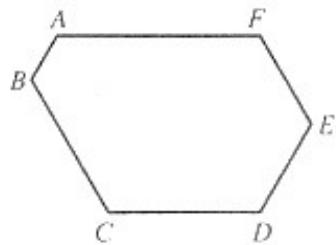

5. 在五边形 ABCDE 中, 若  $\angle A: \angle B: \angle C: \angle D: \angle E = 1:2:3:4:5$ , 求  $\angle C$  的度数  
6.如图，求  $\angle A + \angle B + \angle C + \angle D + \angle E + \angle F$  的度数

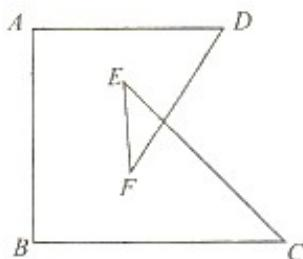

# B组

1.课本上介绍了求多边形的内角和的方法是过  $n$  边形的一个顶点作对角线，把  $n$  边形分成 $(n - 2)$  个三角形，把求多边形的问题转化成三角形内角和的问题.从而得到  $n$  边形的内角和等于  $(n - 2)\cdot 180^{\circ}$  现在再提供两种添辅助线的方法，请你证明  $n$  边形的内角和定理

(1)如图，  $P$  为  ${n}$  边形  $A_{1}A_{2}\dots A_{n}$  内一点,联结  $PA_{1},PA_{2}\dots .PA_{n}$  那么  ${n}$  边形被分成了  $_n$  个三角形，由此推理  ${n}$  边形的内角和定理

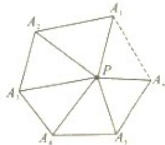

(2)如图，  $P$  为  $n$  边形  $A_{1}A_{2}\dots \dots A_{n}$  边  $A_{1}A_{2}$  的任意一点,联结  $PA_{3},PA_{4}\dots \dots PA_{n}$  那么  $n$  边形被分成了  $(n - 1)$  个三角形，由此推理  $n$  边形的内角和定理

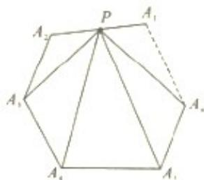

2. 一个广场地面的一部分如图所示, 地面的中央是一块正六边形的地砖, 周围用正角形和正方形的大理石地砖拼成, 从里往外共 12 层 (不包括中央的正六边形地砖), 每一层的外界都围成一个多边形. 若中央正六边形地砖的边长是 0.5 米, 则第 12 层的外边界所围成的多边形的周长是多少?

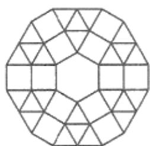

# 22.2(1) 平行四边形

A组

# 一、填空题

1. 在平行四边形  $ABCD$  中，如果  $\angle A + \angle C = 120^\circ$  那么  $\angle B =$  
2. 已知平行四边形的周长为 56 厘米,两邻边之比为 3:1 ,则四边形较长的边长为_____  
3.已知在平行四边形ABCD中，  $AB = 6,BC\setminus AB$  边上的高分别为64，则  $BC$  边长为  
4. 已知在平行四边形  $ABCD$  中,  $\angle A = 60^\circ$ ,  $AD = 6$  厘米,  $AB = 4$  厘米, 则平行四边形  $ABCD$  的面积为  
5. 平行四边形  $ABCD$  的周长为 28 厘米,  $AB:BC = 3:4$ , 那么  $AB =$  厘米  
6. 平行四边形两邻边分别是 4 和 6 ,其中一边上的高是 3 ,平行四边形的面积是  
7. 如果  $\square ABCD$  的周长为  $30cm, AB = 12cm$ , 那么  $BC =$  ________ cm  
8. □ABCD中,  $\angle A$  与  $\angle D$  的度数的比为  $2:3$ , 则  $\angle B$  的度数是  
9.如图，在ABCD中，AE⊥BC垂足为E，  $BE = AB,EC = AE$

则  $\angle DCA =$  度

10. □ABCD中,如果  $\angle A$  比  $\angle B$  大  $20^{\circ}$ ,那么  $\angle C$  的度数是  
11. 平行四边形一组邻边长为  $3cm$  和  $6cm$ , 这两边的夹角是  $60^\circ$ , 则平行四边形的面积是  $\_ \_ \_ \_ \_ \_ \_ \_ cm^2$  
12.如图，在ABCD中，AE、AF分别是BC、CD上的高若  $\angle B = 50^{\circ}$  ，则  $\angle 1 =$

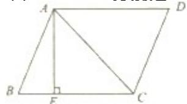

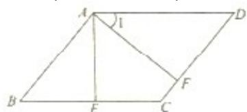

度

# 二、选择题

1. 平行四边形是( )

A.轴对称图形

B. 既是轴对称图形,又是中心对称图形

C.中心对称图形

D.既不是轴对称图形,也不是中心对称图形

2. 用两个全等的三角形(三边互不相等)拼成不同的四边形,其中不同的平行四边形的个数有( )

A.1 个

B.2 个

C.3个

D.4 个

3. 下列条件中,能判断四边形是平行四边形的条件是( )

A.一组对边平行

B.四条边相等

C.一组对边平行,另一组对边相等

D.两条对角线相等

4. 已知平行四边形  $ABCD$  的周长为 40 厘米,  $\triangle ABC$  的周长为 25 厘米, 则对角线  $AC$  长为( )

A.5厘米

B.15 厘米

C.6 厘米

D.16 厘米

5. 以不在同一直线上的三点为顶点可以作出的平行四边形的个数有( )

A. 4 个

B. 3 个

C. 2 个

D. 1 个

6. 如图,在  $\square ABCD$  中,对角线  $AC$  与  $BD$  交于点  $O$ , 则与  $\triangle ABC$  面积相等的三角形的个数 ( )

A. 4 个

B. 3 个

C. 2 个

D. 1 个

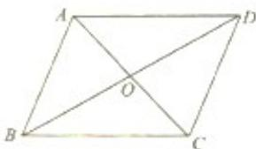

# 三、解答题

1. 如图所示，已知在平行四边形  $ABCD$  中， $AE \perp BC$  于点  $E, AF \perp CD$  于点  $F$ ， $BC:CD = 3:2, AB = EC$ ，求  $\angle EAF$  的度数

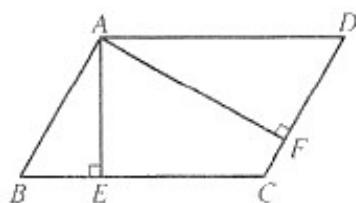

2. 在平行四边形  $ABCD$  中,  $\angle B = 70^\circ$ , 求平行四边形各角的度数

3. 如图所示, 在平行四边形  $ABCD$  中, 点  $E \setminus F$  分别是  $BC \setminus AD$  上的点, 且  $BE = DF$ , 求证:  $\triangle ABE \cong \triangle CDF$

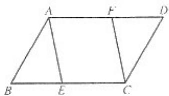

4. 如图所示,在平行四边形  ${ABCD}$  中,  ${BC} = {2AB}$  ,点  $E$  为  ${BC}$  的中点

(1) 求证:  $AE$  平分  $\angle BAD$  
(2) 求  $\angle AED$  的度数

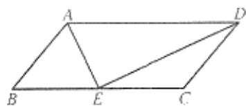

5. 在  $\square ABCD$  中,  $AD$  长比  $AB$  长的 2 倍少 2 厘米,  $AB$  长的 5 倍比  $AD$  的 3 倍多 1 厘米, 求  $\square ABCD$  的周长.

1.如图，已知ABCD中，  $DE\bot AB$  于  $E$  ，  $DF\bot BC$  于  $F$  ，且  $\angle EDF = 60^{\circ}$

(1) 求  $\square ABCD$  各角的大小;  
(2) 若  $DE:DF = 2:3$ ， $\square ABCD$  的周长是  $100cm$ ，求  $\square ABCD$  各边的长

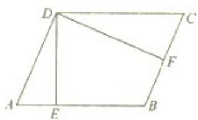

2. 如图所示,已知在平行四边形  $ABCD$  中,点  $E$  在  $AC$  上,且  $AE = 2EC$ ,点  $F$  在  $AB$  上,且  $BF = 2AF$ ,如果  $\triangle BEF$  的面积为 2 ,求平行四边形  $ABCD$  的面积是多少?

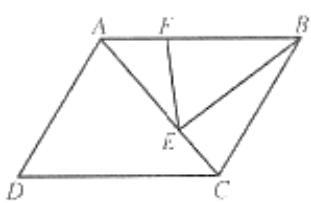

# 22.2(3) 平行四边形

A组

# 一、填空题

1.如图所示，在平行四边形ABCD中，  $AB = 6,AD = 8$  ，AE平分∠BAD交BD于点E，则

$$
E C = \underline {{}}
$$

2. 在四边形  $ABCD$  中,  $AB = CD$ , 要使这个四边形成为平行四边形, 则可添加的一个条件可以是  
3.平行四边形的周长是  $20$  ，相邻两边上的高分别为2和  $^3$  ，则它的面积为  
4. 在平行四边形  $ABCD$  中， $AE \perp BC, AF \perp CD$ ，垂足分别为点  $E$ 、点  $F$ ，若  $\angle B = 60^\circ, BE = 2, DF = 3$  则平行四边形  $ABCD$  的周长为  
5. 两组对边____或____的四边形是平行四边形  
6. 用边长分别为 2 厘米、3 厘米、4 厘米的两个全等三角形拼成四边形,可拼成____个平行四边形  
7.如图，ABCD中，  $G$  是  $CD$  上一点，BG交AD延长线于点  $E,AF = CG,\angle DGE = 90^{\circ}$

则  $\angle AFD =$

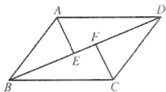

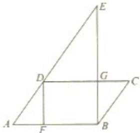

# 二、选择题

1. 在平行四边形  $ABCD$  中,  $\angle A, \angle B, \angle C, \angle D$  的度数之比可能是( )

A.  $2: 1: 2: 1$

B.  $1: 2: 2: 1$

c.  $1: 2: 3: 4$

D.  $2: 2: 2: 1$

2. 如图所示,在平行四边形  $ABCD$  中,下列各式不一定正确的是( )

A.  $\angle 1 + \angle 3 = 180^{\circ}$

B.  $\angle 1 + \angle 2 = 180^{\circ}$

C.  $\angle 2 + \angle 3 = 180^{\circ}$

D.  $\angle 3 + \angle 4 = 180^{\circ}$

3. 在平行四边形  $A B C D$  中, 如图所示, 对角线  $A C 、 B D$  交于点  $O$ , 将  $\triangle A O D$  平移至  $\triangle B E C$  的位置, 图中与  $B E$  相等的线段有( )

A.1条

B.2条

C.3条

D.4条

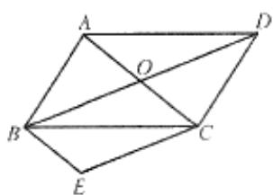

# 三、解答题

1. 如图所示,在平行四边形  $ABCD$  中,点  $E \setminus F$  分别在边  $BC$  和  $AD$  上,且  $\angle BAE = \angle DCF$ ,求证: 四边形  $AECF$  是平行四边形

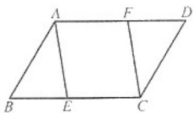

2.如图所示，已知四边形ABCD是平行四边形，∠BCD的平分线CF交边AB于点F，∠ADC的平分线DG交边AB于点  $G$  ，CF与DG交于点E,求证：  $AF = GB$

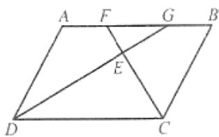

3. 如图所示,已知在平行四边形  $ABCD$  中,平行于对角线  $AC$  的直线  $MN$  分别交  $DA 、 DC$  的延长线于点  $M 、 N$ , 交  $BA 、 BC$  于点  $P 、 Q$  求证:  $MQ = NP$

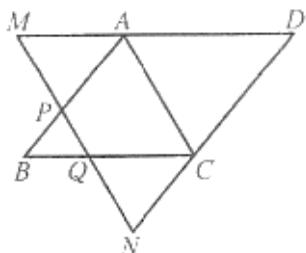

4. 已知直线  $MN$  平行于  $\triangle ABCD$  的对角线  $BD$ , 延长  $\triangle ABCD$  的四边  $AB, DC, BC, AD$  交  $MN$  于点  $E, F, G, H$ , 求证:  $EF = GH$

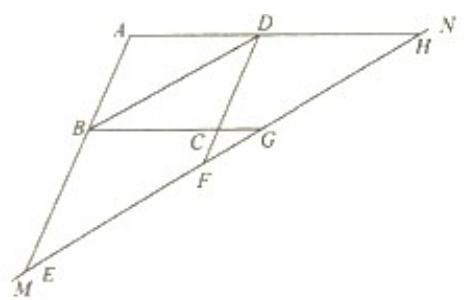  
B组

1. 如图,在  $\square ABCD$  中,对角线  $AC\setminus BD$  相交于点  $O$  ，  $AF\bot BD,CE\bot BD$  垂足分别为 $F\setminus E,$  试判断四边形  $AFCE$  是什么四边形，并证明你的结论

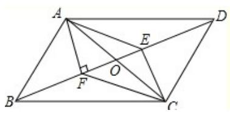

2. 如图,在  $\square ABCD$  中,  $E \sim G$  分别为  $AD \sim BC$  的中点,  $BF = DH$ , 求证: 四边形  $EFGH$  是平行四边形.

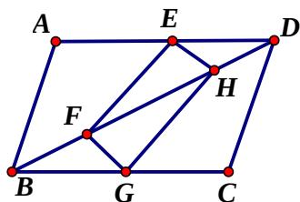

3. 分别以  $\triangle ABC$  的三条边长，在边  $BC$  的同侧作等边三角形  $\triangle ABD \cong \triangle EBC \cong \triangle FAC$ ，求证：四边形  $ADEF$  是平行四边形

# 22.2(5) 平行四边形

A组

# 一、填空题

1. 在平行四边形  $ABCD$  中,过顶点  $A$  的高垂直平分  $BC$ , 若  $AB$  的长是 5 厘米,  $BC$  的长是 6 厘米,则平行四边形  $ABCD$  的面积是  
2. 如图所示,在平行四边形  $A B C D$  中,  $E F / / A C$ , 与  $\triangle A B E$  面积相等的三角形有______个, 它们是__________.  
3. 如图在  $\triangle MBN$  中,  $BM = 6$ , 点  $A, C, D$  分别在  $MB, BN, NM$  上, 四边形  $ABCD$  为平行四边形,

$$
\angle N D C = \angle M D A _ {\text {, 则 平 行 四 边 形}} A B C D _ {\text {的 周 长 是} \_}
$$

4. 延长平行四边形  $ABCD$  的一边  $AB$  到  $E$ , 使  $BE = BD$ , 联结  $DE$  交  $BC$  于点  $F$ , 若  $AB = 1, \angle DAB = 120^\circ, \angle CFE = 135^\circ$ , 则  $AC$  的长是  
5.在四边形ABCD中，若  $\angle A = \angle C,\angle B = \angle D$  ，则四边形ABCD是____根据是

6.  $BD$  是平行四边形  $ABCD$  的对角线, 点  $E \setminus F$  在  $BD$  上, 要使四边形  $AECF$  是平行四边形, 还需要添加一个条件是

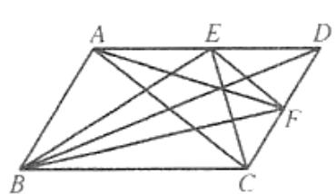

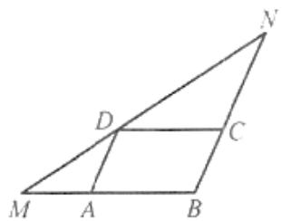

# 二、选择题

1. 平行四边形的两邻边分别为  $3$  和  $4$ , 那么对角线的长  $d$  必定( )

A.  $d > 1$

B.  $d < 7$

C.  $1 < d < 7$

D.  $d > 1$  或  $d < 7$

2. 若平行四边形的两邻边分别为  $a = 3$  厘米,  $b = 5$  厘米, 则它们的对应高  $h_{a}: h_{b}$  ( )

A.  $5: 3$

B.  $3: 5$

C.  $10: 3$

D.  $3: 10$

3. 平行四边形的一边长是 14 , 则它的两条对角线的长可以是 ( )

A.16和12

B.18和10

C.36和6

D.16和18

4. 在平行四边形  $ABCD$  中, 对角线相交于点  $O$ , 点  $E, F$  在  $BD$  上, 且  $BE = DF$ , 图中关于  $O$  点成中心对称的三角形有( )

A.3对

B.4对

C.5对

D.6对

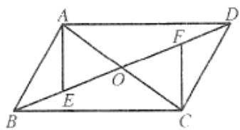

# 三、解答题

1. 如图所示,已知  $\triangle ABC$  与  $\triangle ADE$  都是等边三角形,且  $CD = BF$ ,求证:四边形  $CDEF$  是平行四边形

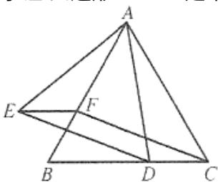

2.如图所示，在四边形ABCD中，对角线AC、BD相交于点  $o$  点  $E,F$  分别是BO、OD的中点，且四边形AECF是平行四边形，试判断四边形ABCD是不是平行四边形，并说明理由

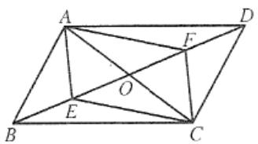

3. 已知在平行四边形  $ABCD$  中,  $\angle B = 60^\circ$ , 点  $E, F$  分别是  $AB, CD$  的中点,  $AB = 2AD$ , 求证:  $AC = \sqrt{3} EF$

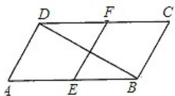

4. 已知：如图，在  $\square ABCD$  中， $O$  是  $AC$  的中点， $EF$  过点  $O$ ，分别与  $AD$ 、 $BC$  交于点  $E$ 、 $F$ ，求证： $EC$  平行且等于  $AF$

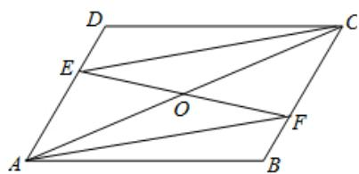

5. 在四边形  $ABCD$  中， $AD // BC$ ，且  $AD > BC, BC = 9cm, P \sim Q$  分别从  $A \sim C$  同时出发， $P$  以1厘米/秒的速度由  $A$  向  $D$  运动， $Q$  以2厘米/秒的速度由

$C$  向  $B$  运动，问几秒时，四边形ABQP是平行四边形？

# B组

1. 已知:  $\square ABCD, AE \perp BD$  于点  $E, CF \perp BD$  于点  $F, G, H$  分别为  $AD, BC$  的中点求证:  $EF$  和  $GH$  互相平分.

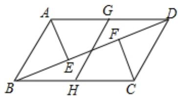

2.如图所示，在平行四边形ABCD中，  $E\setminus F$  分别在  $CD\setminus AD$  上，联结  $AE$  和  $CF$  交于点  $P$  且  $AE = CF$  .求证：PB平分∠APC

# 22.3(2) 特殊的平行四边形

# A组

# 一、填空题

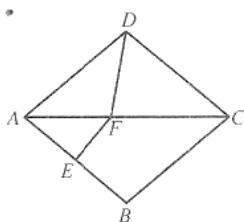

1. 在平行四边形  $ABCD$  中, 若添加一个条件 , 则四边形  $ABCD$  是矩形; 若添加一个条件 , 则四边形  $ABCD$  是菱形  
2. 菱形的两条对角线分别是  $6$  厘米和  $8$  厘米, 则菱形的边长为________面积为________  
3. 如图所示,在菱形  $ABCD$  中,  $\angle BAD = 80^\circ$ ,  $AB$  的垂直平分线交对角线  $AC$  于点  $F$ , 点  $E$  为垂足, 联结  $DF$ , 则  $\angle CDF =$  
4.矩形相邻两边的比为  $2:3$  ，面积为54，则矩形的周长为  
5. 菱形的一边与两条对角线所构成的两角比为  $5: 4$ , 则它的较小的角度数为  
6. 菱形的两个内角的度数比是  $1: 5$ , 如果高是 2 , 那么此菱形的周长是  
7. 如果菱形的周长为 \(20 \mathrm{~cm}\), 两条对角线的长之和为 \(14 \mathrm{~cm}\), 那么它的面积是 \(\_ \_ \_ \_ \_ \_ \_ \_ \_ \_ \_ \_ \_ \_ \_ \_ \_ \_ \_ \_ \_ \_ \_ \_ \_ \_ \_ \_ \_ \_ \_ \_ \_ \_ \_ \_ \_ \_ \_ \_ \_ \_ \_ \_ \_ \_ \_ \_ \_ \_ \_  
8. 已知菱形  $ABCD$  中的两条对角线  $AC = 8, BD = 6$ , 那么对角线  $AC \sim BD$  的交点到任一边的距离等于  
9. 如图,菱形  $A B C D$  的一条对角线  $A C$  上一点  $O$  到菱形一边  $A D$  的距离为 2 ,那么点  $O$  到边  $A B$  的距离

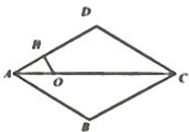  
第9题

  
第10题  
第11题

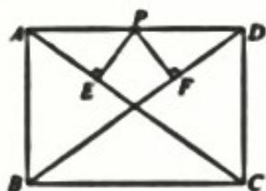

11. 如图,在矩形  $A B C D$  中,若将矩形折叠,使  $B$  点和  $D$  点重合,那么折痕  $E F$  分矩形面积之比为  
12. 如图, 矩形  $ABCD$  中,  $AB = 3, BC = 4$ ,  $P$  是边  $AD$  上的动点,  $PE \perp AC$  于点  $E$ ,

$PF\bot BD$  于点  $F$  ，则  $PE + PF$  的值为

# 二、选择题

1. 能判断平行四边形是菱形的条件是( )

A. 一个角是直角

B.对角线相等

C.一组邻角相等

D.对角线互相垂直

2. 已知直线  $l$  是四边形  $ABCD$  的对称轴，如图所示，如果

$AD / / BC$  现有下列四个结论：

$$
① A B / / C D; ② A B = C D; ③ A B \perp B C; ④ A D = D C
$$

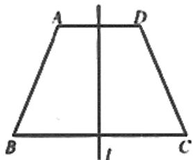

其中正确结论的个数有( )

A.1 个

B.2 个

C.3 个

D.4 个

3. 在菱形  $ABCD$  中,  $\angle ADC = 120^\circ$ , 则  $BD:AC$  等于( )

A.  $\sqrt{3}: 2$

B.  $\sqrt{3}: 3$

C.  $1: 2$

D.  $\sqrt{3}: 1$

4. 菱形的一边和等腰直角三角形的一直角边等长,且菱形的一个角是  $150^{\circ}$ , 则菱形和三角形的面积之比是( )

A.  $1: 2$

B.  $2: 3$

C.  $2: 1$

D.  $1 : 1$

5. 如果菱形  $ABCD$  的边长为 1,  $AE$  垂直平分  $BC$  于  $E$ , 那么  $BD$  等于 ( )

A.  $\frac{1}{2}$

B.  $\sqrt{3}$

C.  $\frac{\sqrt{3}}{2}$

D. 以上都不对

6. 在矩形  $ABCD$  中， $DE \perp AC$  于  $E$ ， $\angle ADE = \angle CDE$ ，那么  $\angle EDB$  的度数是（）

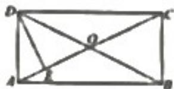

A.  $22.5^{\circ}$

B.  $30^{\circ}$

C.  $45^{\circ}$

D.  $60^{\circ}$

# 三、解答题

1. 如图所示,在菱形  $ABCD$  中,  $\angle A$  与  $\angle B$  的度数比为  $1: 2$ , 周长是  $48$  厘米. 求

(1) 两条对角线的长度  
(2)菱形的面积

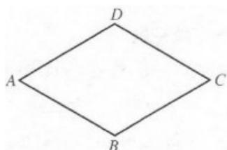

2. 如图所示, 在  $\triangle ABC$  中,  $AD$  平分  $\angle BAC$ ,  $DE // AC$ ,  $DF // AB$ . 试说明四边形  $AEDF$  是菱形

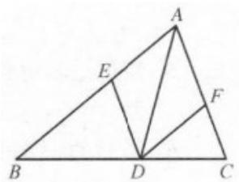

3. 如图所示,四边形  $ABCD$  为矩形,两条对角线交于点  $O$ ,  $CE \parallel DB$ , 交  $AB$  的延长线于点  $E$ ,求证:  $AC = CE$ .

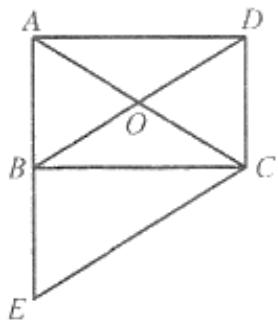

4. 在菱形  $ABCD$  中, 对角线  $AC \cdot BD$  交于点  $O$ ,  $AC = 16$ ,  $BD = 12$ , 求菱形的高  
5. 如图,把矩形  ${ABCD}$  的一边  ${AD}$  沿直线  ${AP}$  对折过来,使点  $D$  落在边  ${BC}$  上的点  $E$  处,已

知  $AD = 15cm, AB = 12cm$  求折痕线段  $AP$  的长

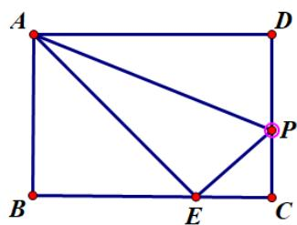

# B组

1.如图：四边形ABCD为菱形，对角线  $AC = 8,BD = 6$  ，对角线相交于点  $O,P$  是边AD上一点.(P点与  $D$  点可重合)

(1) 如果  $P$  是  $AD$  的中点, 求  $\Delta PAB$  的面积;  
(2) 设  $AP = x, \triangle PAB$  面积为  $y$ , 写出  $y$  关于  $x$  的函数解析式, 并写出定义域

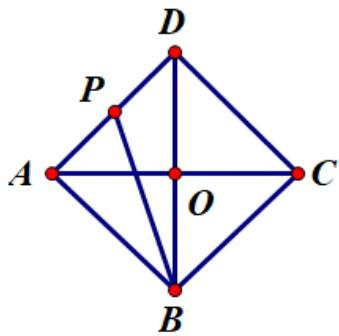

2. 如图所示, 将矩形  $ABCD$  沿着直线  $BD$  对折, 使点  $C$  落在点  $C$  处,  $BC$  交  $AD$  于点

$E,AD = 8,AB = 4$  求  $\triangle BED$  的面积

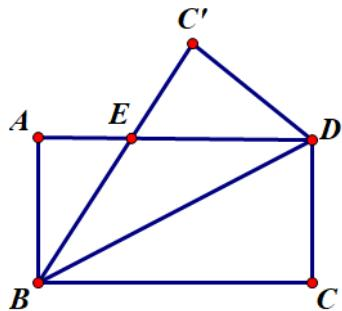

# 22.3(4)特殊的平行四边形

# A组

# 一、填空题

1. 已知正方形的面积为  $4$ , 则正方形的边长为 , 对角线长为  
2. 如图所示,正方形  $ABCD$  的周长是 20 厘米,则矩形  $EFCG$  的周长为

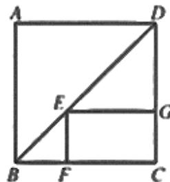

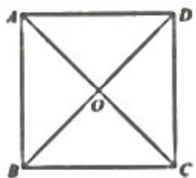

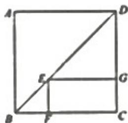

第2题

第3题

第8题

第10题

3.如图所示，根据图中所给的尺寸和比例，可知这个“十”字标志的周长为  
4. 如果用正三角形和正方形组合能够铺满地面,那么每个顶点周围有____个正三角形和____个正方形  
5. 一个正方形的对角线长  $3$  厘米, 则它的面积为  
6. 点  $P$  为正方形对角线  $AC$  上一点,且  $AP = AB$ ,则  $\angle ABP =$  
7. 正方形共有 条对称轴,它的对称中心是  
8. 正方形  $ABCD$  的对角线  $AC$  和  $BD$  相交于  $O$ , 周长为  $12cm$ , 那么图中共有 ______ 个等腰直角三角形,  $O$  点到四个顶点的距离之和是 ______ cm  
9. 正方形的对角线长为 22 ,则它的面积为  
10. 如图所示,正方形  $A B C D$  的周长为  $16, E$  是对角线  $B D$  上任意一点,则矩形  $E F C G$  的周长为  
11. 如图,在正方形  $A B C D$  中,  $E$  是  $B C$  边的中点, 如果  $D E = 10$ , 那么四边形  $A B E D$  的面积是  
12. 如图,  $E$  是正方形  $ABCD$  的边  $BC$  的延长线上一点,  $CE = CA$ ,  $AE$  与  $CD$  相交于点  $F$ ,

那么  $\angle AFC =$

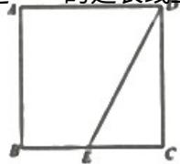

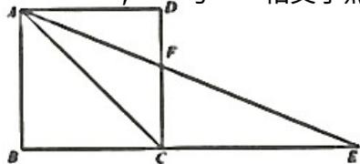

# 二、选择题

1. 在线段、角、等边三角形、等腰三角形、平行四边形、矩形、菱形、正方形、圆、等腰梯形这十种图形中,既是轴对称图形又是中心对称图形的共有( )

A.4种

B.5种

C.7种

D.8种

2. 如果一个四边形的两条对角线互相平分、互相垂直且相等,那么这个四边形是( )

A.矩形

B.菱形

C.正方形

D.菱形、矩形或正方形

3.如图所示，四边形ABCD是正方形延长BC至点  $E$  ，使  $CE = CA$  ，联结AE交CD于点  $F$

则  $\angle AFC$  的度数是( )

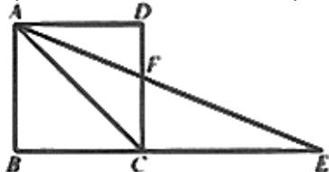

A.  $112.5^{\circ}$

B.  $125^{\circ}$

C.  $135^{\circ}$

D.  $150^{\circ}$

4. 一条直线把正方形的周长分两等份,则这样的直线有( )

A.2条

B.4条

C.8条

D. 无数条

5.如图，已知四边形ABCD,OEFG在同一平面内，都是边长为2的正方形，且  $o$  是正方形

ABCD对角线的交点,则两正方形的公共部分的面积是（）

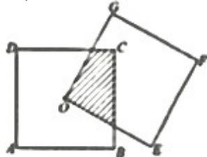

A. 1

B. 2

C. 2

D. 一个变量,无法确定

6. 正方形具有而矩形没有的性质是( )

A. 对角线互相平分

B. 四个内角都是直角

C. 对角线相等

D. 每条对角线平分一组对角

# 三、解答题

1、如图，正方形ABCD的周长是24，对角线AC、BD相交于点O，E是BD上一点，且

$BE = BC$  ，求：(1)  $\angle ACE$  的度数；(2）△BCE的面积.

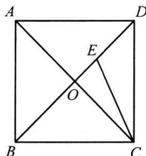

2.如图，四边形ABCD、DEFG都是正方形，求证：  $AE = CG$

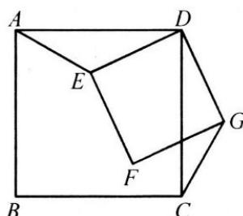

3.如图所示，已知在△ABC中，  $\angle A = 90^{\circ}$  ，∠ABC的平分线交  $AC$  于点  $D,AH\setminus DF$  都垂直

于  $BC$  点  $H \sim F$  为垂足, 求证: 四边形  $AEFD$  为菱形

4.如图所示，ABCD是正方形，  $AE / / BD,BE = BD,BE$  交AD于点  $F$  ，求证：  $\triangle DEF$  是等腰三角形

5.如图，正方形ABCD中，  $E$  是DB延长线上一点，且  $\angle ECB = 15^{\circ}$  求证  $EC = BD$

# B组

1. 如图，在正方形ABCD中，E、F是AB、BC上两点，且  $\angle EDF = 45^{\circ}$ ， $DP \perp EF$  于点P.

求证：  $DP = DA$

2.如图所示，已知四边形ABCD为正方形，点  $M$  为  $BC$  边中点，将正方形折起，使点  $M$  与  $A$  重合，设折痕为  $EF$  ，则  $\frac{ME}{ME} = \frac{2}{3} AB$  求△AEM的面积与正方形ABCD面积的比

# 22.4 梯形

A组

# 概念回顾

梯形问题中，常添加的辅助线有：

# 一、填空题

1. 若直角梯形的一条腰与一条对角线相等且互相垂直,则上、下底边之比等于_____.  
2. 如图所示,已知在梯形  $ABCD$  中,  $AB // CD, AB = 12, CD = 8$ , 点

$E 、 F$  分别是  $A C 、 B D$  的中点, 则  $E F =$

3. 若直角梯形的一组对角的度数之和是另一组对角的度数之和的一半,则这个梯形中最小的内角的度数是_____。

4. 若梯形面积为 144 ,且两底的比为  $4: 5$ , 高为 16 ,则梯形的上、下底分别为  
5. 已知直角梯形两腰之比为  $1: 2$ , 那么该梯形的最小角是  
6. 已知直角梯形的一腰长为 10 ,这条腰与底边的夹角是  $60^{\circ}$ ,较短的底边长是 4 ,则另一条底的长是  
7. 梯形的上底长为  $a c m$ , 下底为  $b c m$ , 它的一条对角线把它分成两部分的面积之比为  
8. 已知梯形  $ABCD$  中,  $AD \parallel BC$ , 对角线  $AC$ 、 $BD$  相交于点  $O$ ,  $\triangle AOB$  与  $\triangle BOC$  的面积分

别为  $2 \text{平}$ , 则梯形  $ABCD$  的面积是

9. 如图,在梯形  $ABCD$  中,  $AB // CD, BC // DE$ , 若  $\triangle AED$  的周

长为  $20, D C = 3$ , 那么这个梯形的周长是

10. 若直角梯形一腰与下底的长都是 \(40 \mathrm{~cm}\), 且它们的夹角 \(60^{\circ}\), 则梯形的上底是 \(\_ \_ \_ \_ \_ \_ \_ \_ \_ \_ \_ \_ \_ \_ \_ \_ \_ \_ \_ \_ \_ \_ \_ \_ \_ \_ \_ \_ \_ \_ \_ \_ \_ \_ \_ \_ \_ \_ \_ \_ \_ \_ \_ \_ \_ \_ \_ \_ \_ \_ \_  
11. 直角梯形  $A B C D$  中,上底为 3 ,一个下底角为  $30^{\circ}$ ,斜腰长等于 4 ,则梯形的面积为  
12. 直角梯形的两底分别为  $3$  和  $7$ , 斜腰与底边的夹角为  $45^{\circ}$ , 那么梯形的高为  
13. 如图,在梯形  $A B C D$  中,

$$
\angle D C B = 9 0 ^ {\circ}, A B / / C D, A B = 2 5, B C = 2 4
$$

A,将该梯形折叠，点恰好

与点  $D$  重合,  $B E$  为折痕, 那么  $A D$  的长度为

14. 已知梯形上、下底分别为  $25$ ，一腰长为 4，则另一腰  $x$  的取值范围是

# 二、选择题

1. 有两个角相等的梯形是( )

A.直角梯形或等腰梯形

B.直角梯形

C.一般梯形

D.等腰梯形

2. 在四边形  $ABCD$  中,  $AD // BC, AC = BD$ , 则四边形  $ABCD$  是( )

A.平行四边形

B.等腰梯形

C.矩形

D.等腰梯形或矩形

3. 下列命题正确的是( )

A.凡是梯形对角线都相等

B.一组对边平行,另一组对边相等的四边形是梯形

C.同一底上的两个角相等的梯形是等腰梯形

D. 只有两个角相等的梯形是等腰梯形

4. 梯形  $ABCD$  的上底与高相等, 下底是上底的 3 倍, 则底角是( )

A.  $30^{\circ}$

B.  $45^{\circ}$

C.  $60^{\circ}$

D.不能确定

5. 已知,梯形  $A B C D$  的周长为  $40$  厘米,同一底上两个底角都为  $60^{\circ}$  若腰长为  $8$  厘米,则梯形的两底之长为 ( )

A. 10 厘米, 14 厘米 B. 12 厘米, 16 厘米 C. 8 厘米, 12 厘米 D. 8 厘米, 16 厘米

6. 已知: 梯形  $ABCD$  中,  $AB \parallel DC$ ,  $AB = 5$ ,  $BC = 32$ ,  $\angle BCD = 45^\circ$ ,  $\angle CDA = 60^\circ$ , 那么  $CD$  的长等于 ( )

A.  $7 + \frac{2}{3}\sqrt{3}$

B. 8

C.  $8 + 3\sqrt{3}$

D.  $8 + \sqrt{3}$

# 三、解答题

1. 如图所示,在梯形  $A B C D$  中,  $A D / / B C, D E / / A B, \triangle C D E$  的周长为 36 厘米,  $A D = 6$  厘米

求梯形  $ABCD$  的周长

2. 如图所示，在梯形  $ABCD$  中， $AD \parallel BC, AD = 5, CD = 3\sqrt{2}, \angle BCD = 45^\circ,$

$\angle C B A = 60^{\circ}$ , 求梯形的周长

3. 如图所示,已知在梯形  $ABCD$  中,  $AD \parallel BC$ ,  $\angle ABC = 60^\circ$ ,  $AB = AD$ ,  $AE$  是梯形的高, 且  $BE = 1$ , 求  $AD$  的长

B组

1. 如图所示,在梯形  $A B C D$  中,  $A D / / B C$ , 对角线  $A C \perp B D$ , 且  $A C = 5$  厘米,  $B D = 12$  厘米求该梯形的面积

# 22.5(2) 等腰梯形

A组

# 一、填空题

1. 等腰梯形是轴对称图形,它的对称轴是  
2. 若等腰梯形有一个角为  $120^{\circ}$ , 上、下底长分别为 4 厘米、12 厘米则它的周长为  
3. 已知梯形的上下底长分别为 1 厘米和 4 厘米,且两条对角线的长分别为 3 厘米和 4 厘米,则梯形的面积为  
4. 等腰梯形上底与下底的差等于一腰的长,那么腰与下底的夹角是  
5. 等腰梯形的一条对角线与一条腰垂直,如果两条腰长的和为 12 ,两条对角线长的和为 16 ,那么较长的一条底的长为  
6. 等腰梯形的一个角是  $45^{\circ}$ , 一条腰长为 8 , 如果较短的底长为  $3 \sqrt{2}$ , 那么较长的底长等于

# 二、选择题

1. 下列关于等腰梯形的判断,正确的是( )

A.两底相等 B.同底上的两底角互补 C.每两个角相等 D.对角线交点在对称轴上

2. 在等腰梯形  $ABCD$  中,如图所示,  $AD \parallel BC, AC 、 BD$  相交于点  $O$ , 则

$O$  有下列四个结论①  $AC = BD$ ;② 梯形ABCD是轴对称图形;③

$\angle ADB = \angle DAC;$  ④  $\triangle AOD \cong \triangle AOB$ . 其中正确的是( )

A.①③④

B.①②④

C.①②③

D.②③④

3. 以线段  $a = 16, b = 13, c = 10, d = 6$  为边作梯形,其中  $a \sim c$  作为梯形的两底,这样的梯形能作( )

A. 无数个

B.2 个

C.1 个

D.0 个

4. 已知梯形的两个对角分别是  $78^{\circ}$  和  $120^{\circ}$ , 则另两个角分别是( )

A.  $78^{\circ}$  或  $120^{\circ}$

B.  $102^{\circ}$  或  $60^{\circ}$

C.  $120^{\circ}$  或  $78^{\circ}$

D.  $60^{\circ}$  或  $120^{\circ}$

5. 梯形的对角线互相垂直,其中一条对角线长是 5 厘米,另一条对角线等于 4 厘米,那么这个

梯形的面积是（）A. 20

B. 10

C. 9

D. 40

6. 下列说法正确的个数有 ( )

(1) 在同一底边上的两个内角相等的梯形是等腰梯形  
(2)对角线相等的梯形是等腰梯形  
(3) 等腰梯形既是轴对称图形, 又是中心对称图形  
(4) 一组对边平行, 另一组对边相等的四边形一定是等腰梯形

A. 4 个

B. 3 个

C. 2 个

D. 1 个

# 三、解答题

1. 如图所示,在等腰梯形  $A B C D$  中,  $A D / / B C, A B = C D = A D, A C = B C$ .

(1) 图中有多少个等腰三角形?请你找出来  
(2) 求梯形各个角的度数

2. 如图所示,在  $\triangle ABC$  中,  $AB = AC, BD \sim CE$ , 分别平分  $\angle B \sim \angle C$ , 求证: 四边形  $EBCD$  是等腰梯形

3. 如图所示,在等腰梯形  $ABCD$  中,  $AD \parallel BC$ ,  $AB = CD$ , 点  $E$  是梯形外一点, 且  $EA = ED$ . 求证:  $EB = EC$

4. 已知: 线段  $a, b, c$ , 求作: 等腰梯形  $ABCD$ , 使其上底为  $a$ , 下底是  $b$ , 腰长为  $c$

5. 已知:如图,在  $Rt\triangle ABC$  中,  $D$  是斜边  $AB$  的中点,  $DF // BC, EF // DC$ , 交  $BC$  的延长线于

点  $E$  ，求证：四边形BEFD是等腰梯形

# B组

1. 已知: 如图, 点  $E$  在正方形  $ABCD$  的对角线上,  $CF \perp BE$  交  $BD$  于点  $G$ ,  $F$  是垂足. 求证:

四边形  $ABGE$  是等腰梯形

2. 如图所示,在梯形  $ABCD$  中,  $\angle B = 90^\circ$ ,  $AB = 14$  厘米,  $AD = 18$  厘米,  $BC = 21$  厘米, 点  $P$  从点  $A$  开始沿  $AD$  边向点  $D$  以 1 厘米/秒的速度移动, 点  $Q$  从点  $C$  开始沿  $CB$  向点  $B$  以 2 厘米/秒的速度移动, 如果点  $P \sim Q$  分别从两点同时出发, 多少秒后, 梯形  $PBQD$  是等腰梯形

# 22.6(2) 三角形、梯形的中位线

# A组

# 一、填空题

1. 梯形的两条对角线的中点的连线长为 7 ,上底长为 8 ,则下底长为  
2. 若等腰梯形的腰长是 5 厘米,中位线是 6 厘米,则它的周长是_____厘米  
3. 若梯形的一底长是 14 厘米中位线长是 16 厘米,则另一底长为_____厘米  
4. 已知梯形中位线长是 5 厘米,高是 4 厘米,则梯形的面积是  
5. 等腰梯形的中位线长 3.6 厘米,一腰垂直对角线,一底角为  $60^{\circ}$ , 则梯形的周长为  
6. 已知直角梯形的一条对角线把梯形分成一个直角三角形和一个边长为 4 厘米的等边三角

形,则此梯形的中位线长为 厘米

7. 一个梯形的上底长  $4cm$ ，下底长  $6cm$ ，则其中位线长为 ______ cm  
8. 一个梯形的上底长  $10 \mathrm{~cm}$ , 中位线长  $16 \mathrm{~cm}$ , 则其下底长为  
9. 已知梯形的中位线长为  $6cm$ ，高为  $8cm$ ，则该梯形的面积为 ________ cm²  
10. 已知等腰梯形的周长为  $80 \mathrm{~cm}$ , 中位线与腰长相等, 则它的中位线长  
11. 已知梯形的面积  $12cm^2$ ，底边上的高是  $4cm$ ，则该梯形中位线长是 ______ cm  
12. 一个梯形中位线的长是高的 2 倍, 面积是  $18cm^2$ , 则这个梯形的高是  
13. 梯形的中位线长为  $15 \mathrm{~cm}$ , 一条对角线将中位线分成  $1: 2$  两部分, 则梯形两底的长分别为  
14. 等腰梯形的一个内角为  $45^{\circ}$ , 高为  $h$ , 中位线是  $m$ , 则其两底长分别为  
15. 直角梯形一腰与下底都等于 4 ,且它们的夹角为  $60^{\circ}$ , 则其中位线长为

# 二、选择题

1. 若顺次联结四边形各边中点组成的四边形是菱形,那么原四边形的对角线( )

A. 互相平分

B.互相垂直

C.相等

D.相等且互相平分

2. 顺次联结下列各四边形中点所得的四边形是矩形的是( )

A.等腰梯形

B.矩形

C.平行四边形

D.菱形或对角线互相垂直的四边形

3. 已知在直角梯形中,上底和斜腰长均为  $a$ , 且斜腰和下底的夹角是  $60^{\circ}$ , 则梯形中位线长为( )

A.  $\frac{3}{4} a$

B. a

C.  $\frac{5}{4} a$

D.以上都不对

4. 如果梯形的中位线长为  $20$ , 它被一条对角线分成两段的差为 5 , 则两底长为( )

A.15和25

B.15 和 30

C.20和30

D.以上都不对

5. 如果等腰梯形底角为  $45^{\circ}$ , 高等于上底, 那么梯形的中位线和高的比为 ( )

A.  $1: 2$

B.  $2: 1$

C.  $1: 3$

D.  $2: 3$

6. 若等腰梯形两底角为  $30^{\circ}$ , 腰长为 8 厘米, 高和上底相等, 那么梯形中位线长为 ( )

A.  $8 \sqrt{3}$  厘米

B. 10 厘米

C.  $(4\sqrt{3} + 4)$  厘米

D.  $16 \sqrt{3}$  厘米

# 三、解答题

1. 如图所示,已知  $CD$  是  $\triangle ABC$  的高, 点  $E 、 F 、 G$  分别是  $BC 、 AB 、 AC$  上的中点, 求证:

$$
F G = D E
$$

2. 如图所示,在梯形  $ABCD$  中,  $\angle ABC = 60^{\circ}$ , 腰  $AB$  长为  $10$  厘米, 中位线  $EF$  长为  $18$  厘米, 求梯形  $ABCD$  的面积

3. 如图所示,在梯形  $ABCD$  中,  $AB // DC, AB + CD = BC$ , 点  $E$  是腰  $AD$  的中点, 求证:

$BE \perp EC$ , 且  $BE$  平分  $\angle ABC$

4. 如图所示,在梯形  $ABCD$  中,  $AD // BC$ ,  $AB = CD$ ,  $EF$  是中位线,  $\angle ABC = 60^\circ$ ,  $BD$  平分

$\angle ABC, EF = 12$  厘米求梯形  $ABCD$  的面积

5如图，等腰梯形ABCD，AD//BC,EF是中位线，且  $EF = 15cm,\angle ABC = 60^{\circ},BD$  平分 $\angle ABC$  ，求梯形ABCD的周长.

B组

1. 如图，在等腰梯形ABCD中，AB  $\parallel$  DC，CG⊥AB于点G，对角线AC⊥BC于点O，EF是中位线．求证：  $CG = EF$  ：

2. 如图所示,在梯形  $ABCD$  中,  $AB \parallel DC$ , 点  $M 、 N$  分别是两对角线  $BD 、 AC$  的中点, 求证

$$
M N / / D C _ {\text {且}} M N = \frac {1}{2} (D C - A B)
$$

# 22.7平面向量

A组

# 概念回顾

(1) 有向线段: 具有方向的线段叫做有向线段. 三要素:  $\_$  、  $\_$  、  $\_$  
(2) 向量的概念: 既有____又有____的量叫做向量.  
(3) 向量的表示方法: (1) 图形表示 (如图); (2) 符号表示: 用字母

等表示; 或用有向线段的起点与终点字母表示, 如  $A B$ ;

(4) 向量的长度: 向量  $AB$  的大小 (长度) 称为向量的 , 记作  $\left|AB\right|$ .  
(5) 平行向量: 方向相同或相反的向量叫做____向量; 0 与任意向量平行.  
(6) 相等向量: 长度相等且方向相同的向量叫做____向量. 向量  $a$  与  $b$  相等, 记作  $a = b$ .  
(7) 相反向量: 长度相等且方向相反的向量叫做____向量. 向量  $a$  的相反向量记为  $-a$ .

# 一、填空题

1. 已知  $a \nmid b$  为非零向量,且  $a$  与  $b$  不平行,若  $c / / a$ ,则  $c$  与  $b$  必定  
2. 在平行四边形  $ABCD$  中, 写出所有与  $AB$  平行的向量  
3. 在四边形  $ABCD$  中, 如果  $AB = DC$ , 那么与  $CB$  相等的向量是

4.已知直角坐标平面内两点  $A(-2,1),B(2,3)$  则  $\left|AB\right| =$  
5. 如图,在  $\square A B C D$  中,与  $A B$  相等的向量 ,与  $B C$  平行的向量  
6.如图，点  $B$  是线段  $AC$  上的点，则以点  $A\setminus B\setminus C$  为起点的向量有

# 二、选择题

1. 若  $a, b$  是两个不平行的非零向量，并且  $a \parallel c, b \parallel c$ ，则向量  $c$  等于（ ）

A. a

B.  $b$

C. 0

D.  $c$  不存在

2. 四边形  $ABCD$  中, 若向量  $AB$  与  $CD$  是平行向量, 则四边形  $ABCD$  是( )

A.平行四边形

B.梯形

C.平行四边形或梯形

D.不是平行四边形,也不是梯形

3. 如图所示,在圆  $O$  中,向量  $O B \cdot O C \cdot A O$  是( )

A.有相同方向的向量

B.单位向量

C.相等的向量

D.模相等的向量

4. 下列说法不正确的是( )

A.相等的向量都平行

B.平行的向量都相等或相反

C.相反的向量都平行

D.不相等的向量就不平行

5. 下列命题中,正确命题的个数有 (   )

若  $\left|a\right| = \left|b\right|$  则  $a = b$

$② \left| A B \right| = \left| B A \right|$

$③$  若  $a / / b,b\parallel c,$  则  $a / / c$ $④$  若  $a / / b,$  则  $a$  、  $b$  的方向相同或相反

A. 4 个

B. 3 个

C. 2 个

D. 1 个

# 三、解答题

1. 设由一点  $O$  向东行走6米, 然后再向北行走6米, 终点为  $P$ , 求  $OP$  的长度和方向

2. 判断下列命题是否正确，并说明理由

(1) 向量就是有向线段

(2) 若  $a \parallel b, b \parallel c$ , 则  $a \parallel c$

(3) 若  $a = b, b = c$ ，则  $a = c$

(4) 非零向量  $AB$  与  $BA$  是平行向量

3. 如图所示,  $D 、 E 、 F$  分别为  $\triangle ABC$  三边中点

(1)找出与  $EF$  平行的向量  
(2) 找出与  $DE$  相等的向量  
(3)找出与  $DF$  模相等的向量

# B组

1. 用有向线段(比例尺选用  $1:100000$  ) 表示两个点的相对位置

(1) 点  $A$  在点  $B$  的南偏西  $30^{\circ}$  的 2 千米处;  
(2) 点  $P$  在点  $Q$  的东北方向 3 千米处

2. 如图所示,  $O$  为正六边形  $A B C D E F$  的对称中心, 完成下列各题:

(1) 与  $AB \subset CD EF$  相等的向量  
(2) 与  $AO \cdot AF \cdot OB$  互为相反的向量  
(3)与  ${EF}$  平行的向量

3.如图，将一个向量  $AB$  放在平面直角坐标系内．若它的起点A在原点，终点B在直线

$y = x$  ，  $y = -x + 2$  的交点上，则

(1) 求出它的终点 B 的坐标;  
(2) 求出  $|AB|$ ;  
(3) 在平面直角坐标系中分别画出一个与  $AB$  相等、相反、模相等的向量，并标出它们的坐标起点、终点所在的坐标.

# 22.8(2) 平面向量的加法

# A组

# 一、填空题

1. 多个向量的加法也可以用向量的________法则

2.  $OA + OC + BO + CO =$

3. 等边  $\triangle ABC$  的中心为  $O$ , 则  $AO + BO + CO =$

4. 一条渔船距对岸 4 千米现以 2 千米/时的速度向垂直于对岸的方向划去, 到达岸时, 船的实际航程为 8 千米, 则河水的流速为 _______ 千米/时

5. 叫做零向量

6. 向量加法的交换律用符号表示为 ,结合律用符号表示为

7. 如图,已知五边形  $A B C D E$ , 适当选用它的几条边作向量, 把下列向量用所作的向量的关系式表示出来

(1) \(AC = \_ \_ \_ \_ \_ \_ \_ \_ \_ \_ \_ \_ \_ \_ \_ \_ \_ \_ \_ \_ \_ \_ \_ \_ \_ \_ \_ \_ \_ \_ \_ \_ \_ \_ \_ \_ \_ \_ \_ \_ \_ \_ \_ \_ \_ \_ \_ \_ \_ \_ \_
(2) \(BE = \_\_\_\_\_\_\_\_\_\_\_\_\_\_\_\_\_\)
(3) \(CE = \_\_\_\_\_\_\_\_\_\_\_\_\_\_\_\_\_\)
(4) \(DE = \_\_\_\_\_\_\_\_\_\_\_\_\_\_\_\_\)
(5) \(AE = \_\_\_\_\_\_\_\_\_\_\_\_\_\_\_\_\)
(6) \(BD = \_\_\_\_\_\_\_\_\_\_\_\_\_\_\_\)
(7) \(BC = \_\_\_\_\_\_\_\_\_\_\_\_\_\_\_\)
(8)

8. 如图,梯形  $A B C D$  中,  $A D / / B C$ , 过  $D$  作  $D E / / A C$  交  $B C$  的延长线于  $E$ , 在图中指出下列几个向量的和向量

(1) \(BD + AC + DA = \_ \_ \_ \_ \_ \_ \_ \_ \_ \_ \_ \_ \_ \_ \_ \_ \_ \_ \_ \_ \_ \_ \_ \_ \_ \_ \_ \_ \_ \_ \_ \_ \_ \_ \_ \_ \_ \_ \_ \_ \_ \_ \_ \_ \_ \_ \_ \_ \_ \_ \_
(2) AB + BC + EB = \_
(3) AB + BC + CD = \_
(4) CD + AB + CD = \_
(5) CD + AB + CD = \_
(6) CD + AB + CD = \_
(7) CD + CD + AB = \_
(8) CD + CD + CD = \_
(9) CD + CD + CD + AB = \_
(10) CD + CD + CD + CD = \_
(11) CD + CD + CD + CD = \_
(12) CD + CD + CD + CD = \_
(13) CD + CD + CD + CD = \_
(14) CD + CD + CD + CD = \_
(15) CD + CD + CD + CD = \_
(16) CD + CD + CD + CD = \_
(17) CD + CD + CD + CD = \_
(18) CD + CD + CD + CD = \_
(19) CD + CD + CD + CD = \_
(20) CD + CD + CD + CD = \_
(21) CD + CD + CD + CD = \_
(22) CD + CD + CD + CD = \_
(23) CD + CD + CD + CD = \_
(24) CD + CD + CD + CD = \_
(25) CD + CD + CD + CD = \_
(26) CD + CD + CD + CD = \_
(27) CD + CD + CD + CD = \_
(28) CD + CD + CD + CD = \_
(29) CD + CD + CD + CD = \_
(30) CD + CD + CD + CD = \_
(31) CD + CD + CD + CD = \_
(32) CD + CD + CD + CD = \_
(33) CD + CD + CD + CD = \_
(34) CD + CD + CD + CD = \_
(35)  
(3)  $AB + BC + CD = \_ \_ \_ \_ \_ \_ \_ \_ \_ \_ \_ \_ \_ \_ \_ \_ \_ \_ \_ \_ \_ \_ \_ \_ \_ \_ \_ \_ \_ \_ \_ \_ \_ \_ \_ \_ \_ \_ \_ \_ \_ \_ \_ \_ \_ \_ \_ \_ \_ (4)$

# 二、选择题

1. 如图所示,在平行四边形  $ABCD$  中,下列关系式正确的是( )

A.  $OA + OB = AB$

B.  $AB + BC = BD$

C.  $AO + OC = CA$

D.  $BA + BC = BD$

2.如图所示，在三角形ABC中，点  $D\setminus E\setminus F$  分别是 $BC\setminus CA\setminus AB$  的中点，则  $AD + BE + CF$  等于( ）

A.  $AB + AC + BC$

B. 0

C.  $AB + AC + CB$  D. 0

3. 下列说法正确的是( )

A.方向相同的向量,都是相等的向量

B 模相等的向量是相等的向量

C.方向相反的两个向量之和是零向量

D.向量加法满足交换律

4. 在四边形  $ABCD$  中,  $AD = BC$ , 且  $\left|AB\right| = \left|AD\right|$ , 则四边形  $ABCD$  是( )

A.平行四边形

B.矩形

C.菱形

D.梯形

# 三、解答题

1. 如图所示,  $ABCD$  是任意四边形, 边  $AD \sim BC$  的中点分别为  $E \sim F, AF$  的延长线上点  $G$ ,而  $F$  恰为  $AG$  的中点, 联结  $EF, BG, AC$ . 试找出

(1) 与  $AB$  相等的向量(2) 与  $AC$  相等的向量(3) 与  $EF$  平行的向量(4) 与  $AC$  相反的向量

2.如图所示，已知向量  $a\pmb{b}\pmb{c}$  求作向量：  $a + b + c$  ：

3. 如图所示,在四边形  $ABCD$  中,用  $AB \cdot BC \cdot CD$  表示(1)  $AC$  (2)  $AD$

4. 根据下列各题的条件,判断四边形  ${ABCD}$  是什么四边形

(1)  $AD = BC$  
(2)  $A D \parallel B C$ , 且  $A B$  与  $C D$  不平行.

5.如图，已知向量  $a\text{b}\mathfrak{c}$  ，求作  $a + b + c$

6. 如图,在四边形  $ABCD$  中,设  $AB = a, AD = b, BC = c$ , 用  $a \neq c$  表示向量  $DC$ .

7. 画图验证:  $AB + BC + CD + DE + EF = AF$

# B组

1. 判断下列等式是否正确，并说明理由

(1)  $AB + BC = AD + BC + DB$  
(2)  $AB + DC + EA + ED + BC = EC + EC$

2. 如图所示, 某观测站  $C$  在城的南偏西  $20^{\circ}$  方向上, 且  $AC = 20$  千米, 从城  $A$  出发有一条公路, 走向是南偏东  $40^{\circ}$ , 公路上的  $B$  处有一人正沿着公路向城  $A$  走去. 走 20 千米后到达  $D$  处. 测得  $CD = 20$  千米, 这时此人距城  $A$  多少千米

# 22.9(2) 平面向量的减法

A组

# 一、填空题

1. 在平行四边形中  $AB - AD =$  
2.化简：  $AB - AC - DB - ED =$  
3. 如图所示,在正六边形  ${ABCDEF}$  中,与  ${OA} - {OB}$  相等的向量是_____.  
4. 如图所示,四边形  $ABCD$  是等腰梯形,

则  $OC - \underline{\underline{\mathbf{\alpha}}} = AC - \underline{\underline{\mathbf{\alpha}}} = BC - \underline{\underline{\mathbf{\alpha}}} = DC$

5. 四边形  $ABCD$  的对角线  $AC, BD$  相交于点  $E$ ,

则  $BC + CD = \_ ,AB - AC = \_ .$

6. 已知正方形  $ABCD$  的对角线相交于点  $O$ , 若  $AO = a, BO = b$ , 则  $a + b =$  ________.

$$
a - b = \underline {{}}
$$

7. 在四边形  $ABCD$  中,  $AC = AB + AD$ , 则  $ABCD$  是  
8. 化简  $(AB - AD) + (BE - DE)$  的结果是  
9. 化简:  $OM - ON + MN =$  
10.计算：  $AB - AC + BC =$

11. 化简:  $AB - AC + BE =$  
12. 已知在梯形  $ABCD$  中,  $AD // BC$ . 写出所有与  $BC$  平行的向量

# 二、选择题

1. 下列说法中正确的是( )

A.平行向量的方向必相同

B.和向量为零向量的两个向量必是相反向量

C.零向量与任何向量的和向量的方向不确定

D.两个相反向量的和向量必是零向量

2. 四边形  $ABCD$  是等腰梯形, 则下列判断正确的是( )

A.  $AC = BD$

B.  $A D = B C$

C.  $AB - AC = CB$

D.  $AD - AB = DB$

3. 如图所示,在  $\triangle ABC$  中,  $AB = AC$ , 点  $D 、 E$  分别是两腰的中点则

下列判断正确的是( )

A.  $AB = AC$

B.  $AB - AE = AC - AD$

C.  $BC - BD = CB - CE$

D.  $\left|AB - AE\right| = \left|AC - AD\right|$

4. 在四边形  $ABCD$  中, 如果  $AB = DC$ , 且  $\left|AB - AD\right| = \left|BA - BC\right|$

四边形  $ABCD$  是( )

A.平行四边形

B.矩形

C.菱形

D.正方形

5. 点  $D 、 E 、 F$  分别是  $\triangle A B C$  三边  $A B 、 B C 、 C A$  的中点, 则下列等式不成立的是 ( )

A.  $FD + DA = FA$

B.  $FD + DE + EF = 0$

C.  $D E + D A = E C$

D.  $DA + DE = DF$

6. 在梯形  $AB \sim BC \sim CA$  中,  $AD // BC$ ,  $AB = CD$ , 那么下列结论中正确的是( )

A.  $AB$  与  $DC$  是相等向量

B.  $AC$  与  $BD$  是相等向量

C.  $A D$  与  $C B$  是相反向量

D.  $AD$  与  $CB$  是平行向量

# 三、解答题

1.如图所示，已知  $a\text{b}\mathfrak{c}$  ，用两种方法画出向量  $a - b - c$

2. 如图所示,已知向量  $AB = a, AD = b$ ,  $\angle DAB = 120^\circ$ , 且  $\left|a\right| = \left|b\right| = 3$ , 求  $\left|a + b\right|$  和  $\left|a - b\right|$

3. 河流流速是向东 4 千米/小时,一个游泳者在水流影响下以  $4 \sqrt{3}$  千米/小时的速度正好从南岸游向北岸,求游泳者在静水中的速度

4. 如图所示,在梯形  $ABCD$  中,  $AB // CD$ , 点  $P$  为  $AB$  上一点,  $AD = a, AP = b, CD = c$ .

(1) 用向量  $a \not b c$  表示  $D P$  和  $P C$  
(2) 在图中作出  $AD + DP + PC$

5. 如图， $\triangle ABC$  中  $M, N, P$  分别是  $AB, AC, BC$  边的中点，在图中画出：

$$
P M + B M - P N
$$

  
B组

1.如图，点  $E$  在平行四边形ABCD的对角线BD上

(1) 填空:  $BC + BA =$

$$
B C - A E = \underline {{}}
$$

(2) 求作:  $BC + AE$

2. 如图,四边形  $ABCD$  的对角线  $AC$ 、 $BD$  交于点  $E$ ,

(1) 填空:  $AB + BC = \_$ ;  $AB - AD = \_$ .

(2) 求作:  $BC + BE$

3.(1)已知  $A,B,C$  是平面内的三点，  $\left|AB\right| = a,\left|BC\right| = b(a > b > 0)$  模的取值范围

(2) 如图所示, 在  $\triangle ABC$  中,  $AD$  是  $BC$  边上的中线,  $AB - AD$  与  $AD - AC$  是不是相等的向量? 为什么?

# 2特殊的平行四边形

# 一．菱形的性质（共7小题）

1. （2022 春·青浦区校级期中）如图，菱形ABCD的对角线相交于点O，延长BC至点E，使  $CE = BC$  ，联结DE，若  $\angle E = 70^{\circ}$  ，则  $\angle OBC =$  
2. （2022 春·杨浦区校级期中）菱形的边长为 10 厘米，一条对角线为 16 厘米，它的面积是 ______ 平方厘米。  
3. (2022 春・徐汇区期末)如图, 菱形  $A B C D$  中, 如果  $A B = 3, B D = 2$ , 那么菱形  $A B C D$  的面积为

4. （2022 春・上海期中）已知菱形ABCD中，对角线  $AC = 12$  ，  $BD = 16$  ，则菱形ABCD的面积是  
5. （2022 春・虹口区期中）如果菱形的边长为 5 , 相邻两内角的度数之比为  $1: 2$ , 那么该菱形较长的对角线长为  
6. （2022 春·青浦区校级期中）菱形ABCD中， $\angle B = 60^{\circ}$ ，点  $E$ 、 $F$  分别在边BC、CD上，且  $\angle EAF = 60^{\circ}$ 。求证： $AE = AF$ 。

7. （2022 春·杨浦区校级期中）已知：如图菱形ABCD，点E，F分别为边BC，CD上的动点（不与端点重合），且  $\angle EAF = \angle B = 60^{\circ}$

(1) 求证:  $AE = AF$ ;  
(2) 如果  $AB = 8$ ，设  $BE = x, AE = y$ ，求  $y$  与  $x$  的函数关系式和定义域；  
(3）在（2）的基础上，当  $x$  取何值时，  $S_{\triangle AEF}$  与  $S_{\triangle CEF}$  面积比值为7.

  
图1  
备用图

# 二．菱形的判定（共5小题）

8. (2022 春・青浦区校级期中) 下列命题是真命题的是 ( )

A. 有一组对边平行, 另一组对边相等的四边形是平行四边形  
B. 两条对角线相等的四边形是矩形  
C. 一条对角线平分一组对角的四边形是菱形  
D. 对角线互相垂直平分的四边形是菱形

9. （2022 春・奉贤区校级期末）如图, 直线  $y = -x + 2$  与  $x$  轴,  $y$  轴分别交于点  $A 、 B$ , 点  $C$  在  $y$  轴上, 点  $D$  为平面内

一点，若四边形ACDB恰好构成一个菱形，请写出点  $D$  的坐标

10. （2022 春·虹口区期中）如图， $\triangle ABC$  中， $AD$  是  $\angle BAC$  的平分线， $E$  是  $AC$  上一点， $AE = AB$ ， $EF \parallel BC$  交  $AD$  于  $F$ ， $BE$  与  $AD$  交于  $G$ .

求证：四边形BDEF是菱形.

11．（2021春·杨浦区期末）如图，已知BD、BE分别是∠ABC与它的邻补角的平分线，AE⊥BE，AD⊥BD，垂足分别为E、D，联结CD、DE，DE与AB交于点O，CD∥AB．求证：四边形OBCD是菱形.

12．（2021春·奉贤区期中）如图，已知在四边形ABCD中，AD  $\| BC$  ，点  $E$  为BC中点，

BD⊥DC，EA平分∠DEB.

(1) 求证:  $AE = DC$ ;  
(2) 求证: 四边形  $ABED$  是菱形.

# 三．菱形的判定与性质（共3小题）

13. （2021 春・黄浦区期末）如图, 在四边形  $A B C D$  中,  $A D \| B C$ ,  $B C = 2 A D$ ,  $\angle B A C = 90^{\circ}$ ,点  $E$  为  $B C$  的中点

(1) 求证: 四边形  $A E C D$  是菱形;  
(2) 联结  $BD$ , 如果  $BD$  平分  $\angle ABC, AD = 2$ , 求  $BD$  的长.

14. （2021 春・徐汇区期中）如图, 四边形  $A B C D$  中,  $B D$  垂直平分  $A C$ , 垂足为点  $F, E$  为四边形  $A B C D$  外一点, 且  $\angle A D E = \angle B A D, A E \perp A C$

(1) 求证: 四边形  $A B D E$  是平行四边形;  
(2) 如果  $DA$  平分  $\angle BDE, AB = 5, AD = 6$ , 求  $AC$  的长.

15. (2021 春・普陀区期中)已知, 如图, 在  $\square ABCD$  中, 分别在边  $BC 、 {AD}$  上取两点, 使

得  $CE = DF$  ，连接  $EF$  ，  $AE$  、  $BF$  相交于点  $O$  ，若  $AE \perp BF$ .

(1) 求证: 四边形  $ABEF$  是菱形;  
(2) 若四边形  $A B E F$  的周长为 16,  $\angle B E F = 120^{\circ}$ , 求  $A E$  的长.

# 四．矩形的性质（共6小题）

16. (2022 春・青浦区校级期中) 下面性质中菱形有而矩形没有的是 ( )

A. 邻角互补

B. 对角线互相垂直

C. 对角线相等

D. 对角线互相平分

17. （2022 春・杨浦区校级期中）矩形的一条边长是  $a$ , 两条对角线的夹角为  $60^{\circ}$ , 则矩形的另外一条边长等于 ( )

A.  $\frac{1}{2} a$

B.  $\frac{\sqrt{3}}{2} a$

C.  $\sqrt{3} a$  或  $\frac{\sqrt{3}}{3} a$

D.  $2 a$

18. （2022 春・长宁区校级期末）如图, 矩形  $ABCD$  的对角线相交于点  $O$ , 点  $E 、 F$  分别在  $OA 、 OD$  上,  $EF \parallel BC$ , 求证: 四边形  $BCFE$  是等腰梯形.

19. (2022 春・徐汇区期末)如图, 将矩形  $A B C D$  的边  $B C$  延长至点  $E$ , 使  $C E = B D$ , 联结  $A E$  交对角线  $B D$  于点  $F$ , 交边  $C D$  于点  $G$ , 如果  $\angle A D B = 38^{\circ}$ , 那么  $\angle E$  的大小为

20. （2022 春·宝山区校级月考）如图：在直角坐标系里点  $B(0,4)$ ，已知  $ABDO$  为矩形， $\angle DBO = 30^\circ$ ，则点  $A$  坐标为 _______.

21. （2021 春・杨浦区校级期中）如图, 矩形  $ABCD$  的对角线  $AC$  与  $BD$  相交于点  $O$ , 以  $AO, AB$  为邻边作平行四边形  $ABC_{1}O, AC_{1}$  交  $OB$  于点  $O_{1}$ ; 以  $AO_{1}, AB$  为邻边作平行四边

形  $ABC_{2}O_{1}\dots$  ，若  $S_{\text{矩形}ABCD} = a$  ，则  $\mathrm{S}_{\text{平行四边形}ABC_{2021}} = 0_{2020} = \_ .$

# 五．矩形的判定（共6小题）

22. (2022 春・杨浦区校级期中) 下列条件不能判定一个四边形是矩形的是 (   )

A. 四个内角都相等  
B. 四条边都相等  
C. 对角线相等且互相平分  
D. 对角线相等的平行四边形

23. （2022 春・青浦区校级期中）四边形  $ABCD$  的对角线  $AC$ 、 $BD$  互相平分，要使它成为矩形，可添加条件（）

A.  $AB = CD$

B.  $AC = BD$

C. AB  $\parallel$  CD

D. AC⊥BD

24. (2021 春・奉贤区期中) 下列说法不正确的是 ( )

A. 两组对边分别相等的四边形是平行四边形  
B. 对角线相等的平行四边形是矩形  
C. 一个角是直角的四边形是矩形  
D. 对角线互相平分且垂直的四边形是菱形

25. (2022 春・虹口区期中) 如图, 在四边形  $A B C D$  中, 点  $G$  在边  $B C$  的延长线上,  $C E$  平分  $\angle B C D$ ,  $C F$  平分  $\angle G C D$ ,  $E F \| B C$  交  $C D$  于点  $O$ , 点  $O$  为  $C D$  的中点.

求证：四边形DECF是矩形.

证明：CE平分∠BCD,

$$
\therefore \quad = \quad .
$$

:EFBC,

$$
\therefore = \quad .
$$

于是，

同理，  $= \_ .$

（请继续完成证明过程）

26. (2022 春・奉贤区校级月考)如图,已知: 在四边形  ${ABCD}$  中,  $E$  为边  ${CD}$  的中点,  ${AE}$

与边BC的延长线相交于点  $F$  ，且  $AE = EF$  ，  $BC = CF$

(1) 求证: 四边形  $ABCD$  是平行四边形;  
(2) 当  $AF = 2BE$  时，求证：四边形ABCD是矩形.

27. (2022 春・静安区期中)已知：如图，在平行四边形ABCD中，点E、F分别是

AD、BC的中点，点G、H分别在边AB、CD上，且  $AG = CH$

(1) 求证:  $\triangle AGE \cong \triangle CHF$ ;  
(2) 若  $\angle AEG + \angle BFG = 90^{\circ}$ , 求证: 四边形  $EGFH$  是矩形.

# 六．矩形的判定与性质（共3小题）

28. (2022 春・青浦区校级期中) 如图, 在 Rt  $\triangle ABC$  中,  $\angle C = 90^{\circ}, BC = 6, AC = 8, M$  为斜边  $AB$  上一动点, 过点  $M$  分别作  $MD \perp AC$  于点  $D$ , 作  $ME \perp CB$  于点  $E$ , 则线段  $DE$  的最小值为

29. (2022 春・杨浦区校级期中)已知, 如图,  $B E, B D$  是  $\triangle A B C$  中  $\angle A B C$  的内、外角平分

线，  $AD\bot BD$  于  $D$  ，AE⊥BE于点  $E$  ，延长AE交BC的延长线于点  $N$

求证：  $DE = BN$

30．（2022春·青浦区校级期中）如图，在四边形ABCD的中，  $AB\| CD$  ，对角线AC，BD相

交于点  $O$  ，且  $AO = CO$  ，  $\triangle OAB$  是等边三角形.

(1) 求证: 四边形  $ABCD$  是矩形;  
(2) 若  $S_{\text{四边形}ABCD} = 4\sqrt{3}$ , 求  $BD$  的长.

# 七．正方形的性质（共5小题）

31.（2022春·静安区期中）如图，正方形ABCD中，延长BC到E，使  $CE = CA$  ，AE交CD于F，那么  $\angle AFD = \_$  
32. （2022 春·浦东新区校级期中）如图，已知正方形ABCD的边长为5厘米，EG $\| AD$ ，点  $H$  在边AD上， $\triangle CEH$  的面积为8平方厘米，则  $FG =$  厘米.

52

33.（2022春·杨浦区校级期中）如图，E为正方形ABCD外一点，AE=AD，BE交AD于

点  $F$  ，则  $\angle BED = \_$  。

34. （2022 春·浦东新区校级期中）已知正方形  $ABCD$ ，以  $CD$  为边作等边  $\triangle CDE$ ，则  $\angle ADE$  的度数是  
35.（2022春·上海期中）在正方形ABCD中，边长为8，点  $P$  是对角线AC上一点， $CP = 2\sqrt{2}$ ， $E$  是射线AB上一点，联结  $PE$ ，射线  $PF \perp PE$  交直线AD于  $F$ ，当  $AC = CE$  时， $AF =$

# 八．正方形的判定（共4小题）

36.（2022春·长宁区校级期末）在四边形ABCD中，  $\angle A = \angle B = \angle C = 90^{\circ}$  ，如果再添加一个条件可证明四边形是正方形，那么这个条件可以是（）

A.  $AB = BC$

B.  ${AB} = {CD}$

C.  $AC = BD$

D.  $\angle D = 90^{\circ}$

37. (2022 春・杨浦区校级期中) 下列命题为假命题的是 ( )

A. 四个内角相等的四边形是矩形  
B. 对角线的交点到各边距离都相等的四边形是菱形  
C. 有两组邻边相等的四边形是平行四边形  
D. 一组邻边相等的矩形是正方形

38. (2022 春・宝山区校级月考)如图, 在  $\square ABCD$  中, 对角线  ${AC}$  、  ${BD}$  交于点  $O$  ,  $E$  是  ${BD}$

延长线上的点，且  $\triangle ACE$  是等边三角形.

(1) 求证: 四边形  $ABCD$  是菱形.  
(2) 若  $\angle AED = 2\angle EAD$  ，求证：四边形ABCD是正方形.

39. (2022 春・上海期中)如图, 在  $\triangle ABC$  中,  $AB = AC$ ,  $AD \perp BC$ , 垂足为点  $D$ ,  $AN$  是

$\triangle ABC$  外角  $\angle CAM$  的平分线，  $CE\bot AN$  ，垂足为点  $N$

(1) 求证: 四边形  $ADCE$  为矩形;  
(2) 当  $\triangle ABC$  满足什么条件时, 四边形  $ADCE$  为正方形? 给出证明.

# 九．正方形的判定与性质（共1小题）

40. (2019 $\cdot$ 杨浦区二模)已知: 如图, 在  $\triangle ABC$  中,  $AB = BC$ ,  $\angle ABC = 90^{\circ}$ , 点  $D 、 E$  分别是边  $A B 、 B C$  的中点, 点  $F 、 G$  是边  $A C$  的三等分点,  $D F 、 E G$  的延长线相交于点  $H$ , 连接  $H A 、 H C$ .

求证：（1）四边形FBGH是菱形；

(2) 四边形  $ABCH$  是正方形.

# 4平面向量及加减运算

# 考点一：平面向量

# 一、单选题

1. (2022 春・八年级课时练习) 下列关于空间向量的命题中, 正确命题的个数是 ( )

(1) 任一向量与它的相反向量都不相等;  
(2) 长度相等、方向相同的两个向量是相等向量;  
③ 平行且模相等的两个向量是相等向量；  
④ 若  $a \neq b$  ，则  $|a| \neq |b|$  
(5) 两个向量相等, 则它们的起点与终点相同.

A. 0

B. 1

C. 2

D. 3

2. (2022 春・八年级课时练习) 下列各量中是向量的是 ( )

A. 时间

B. 速度

C. 面积

D. 长度

3. (2022 春・八年级课时练习) 在下列说法中正确的有 ( )

(1) 在物理学中, 作用力与反作用力是一对共线向量;  
(2) 温度有零上温度和零下温度, 因此温度也是向量;  
(3) 方向为南偏西  $60^{\circ}$  的向量与北偏东  $60^{\circ}$  的向量是共线向量;  
④ 平面上的数轴都是向量

A. 1个

B. 2 个

c. 3个

D. 4个

4. (2022 春・八年级课时练习) 下列说法正确的个数为 (   )

(1) 面积、压强、速度、位移这些物理量都是向量  
② 零向量没有方向  
(3) 向量的模一定是正数  
(4) 非零向量的单位向量是唯一的

A. 0

B. 1

C. 2

D. 3

5. (2022 春・八年级课时练习) 如果  $AB = CD$ , 那么下列结论正确的是 ( )

A.  $AC = DB$ ;

B.  $AC = DB$ ;

C.  $AD = BC$ ;

D.  $AD = CB$

6. （2022 春·八年级课时练习）分别以正方形  $ABCD$  的四个顶点为起点与终点的所有有向线段能表示的不同向量有（）

A. 4个

B. 6个

c. 8个

D. 12个

7. (2022 春・上海・八年级期末)如果  $EF = MN$  , 那么下列结论中正确的是 ( )

EN  $\models FM$  A.

B.  $\overline{EM}$  与  $\overline{FN}$  是相等向量

C.  $\overline{EN}$  与  $MF$  是相反向量

D.  $\overline{EN}$  与  $MF$  是平行向量

# 二、解答题

8. (2022 春・上海・八年级专题练习)如图,  $E 、 F 、 G$  分别为等边三角形的边  $A B 、 A C$  、

BC 的中点，在以 A、B、C、E、F、G 为起点或终点的

的向量.

# 考点二：平面向量的加法

# 一、单选题

1. (2022·上海·八年级专题练习) 化简  $AB + BC + CD + DE =$  （ ）

A. 0

B. 0

C.  $A E$

D. EA

2. (2022·上海·八年级专题练习) 式子  $\left( {{AB} + {MB}}\right)  + \left( {{BO} + {BC}}\right)  + {OM}$  化简结果是(   )

A.  $AO$

B.  $AC$

C.  $B C$

D. AM

3. (2022·上海·八年级专题练习) 点  $O$  是平行四边形  $ABCD$  的两条对角线的交点,

$AO + OC + CB$  等于（ ）

A.  $AB$

B.  $BC$

C. CD

D. 0

4. (2022·上海·八年级专题练习)如图ABCD是平行四边形, 则在向量  $CB + AB =$  ( )

A. AC

B. CA

C.  $B D$

D.  $DB$

5. (2022·上海·八年级专题练习) 如图, 已知向量  $a, b, c$ , 那么下列结论正确的是 ( )

A.  $a + b = c$

B.  $a + b = -c$

C.  $a - b = -c$

D.  $b + c = a$

6. (2022·上海·八年级专题练习) 如图, 在正六边形  $A B C D E F$  中,  $B A + C D + F B$  等于 ( )

A. 0

B.  $BE$

C. AD

D.  $CF$

7. (2022 春・上海・八年级期末)已知正方形  $ABCD$  的边长为 1 , 设  $n = AB + BC$ , 那么  $n$  的模为 ( )

A.  $\sqrt{3}$

B. 1

C.  $\sqrt{2}$

D. 2

8. (2022 春・上海・八年级专题练习) 在平行四边形  $ABCD$  中, 设  $AB = a$ ,  $AD = b$ , 点  $O$

是对角线  $AC$  与  $BD$  的交点，那么向量  $OC$  可以表示为（）

A.  $\frac{1}{2} \vec{a} + \frac{1}{2} \vec{b}$ ;

B.  $\frac{1}{2} \vec{a} - \frac{1}{2} \vec{b}$ ;

C.  $-\frac{1}{2} \vec{a} + \frac{1}{2} \vec{b}$ ;

D.  $-\frac{1}{2} \vec{a} - \frac{1}{2} \vec{b}$ .

# 二、解答题

9. (2022 春・上海闵行・八年级上海市民办文绮中学校考阶段练习) 已知: 如图, 在等腰梯形  $ABCD$  中,  $AD \parallel BC$ ,  $BC = 2AD$ ,  $E$  为  $BC$  的中点, 设  $AB = a$ ,  $AD = b$ .

(1) 填空:  $BD = \_$ ;  $DC = \_$ ;  $AC = \_$ ; (用  $a$ ,  $b$  的式子表示)  
(2) 在图中求作  $B E + D C$ . (不要求写出作法, 只需写出结论即可)

10. (2022 春・上海・八年级专题练习)已知向量  $\vec{a} 、 \vec{b}$

求作：  $a - 2b$  ：

# 考点三：平面向量的减法

# 一、单选题

1. (2022 春・八年级课时练习)如图,在梯形  ${ABCD}$  中,  ${AD}\parallel {BC}$  ,向量  ${AC} - {AB} =$  (   )

A. AB B. BC C. CB D. AD

# 二、填空题

2. (2022 春・上海・八年级上海市进才中学校考期中)计算：  $AB - AC + BC =$  
3. (2022 春・上海・八年级专题练习) 已知在平行四边形  $ABCD$  中, 设  $AB = a$ ,  $AD = b$ , 那么用向量  $a$  、 $b$  表示向量  $CA =$  ________.

# 三、解答题

4.（2022春·上海·八年级专题练习）如图，在△ABC中，点D、E分别在边AB、AC上，DE  $\parallel$  BC，且  $DE = \frac{2}{3} BC$

(1) 如果  $AC = 6$ , 求 AE 的长;  
(2) 设  $AB = a$  ，  $AC = b$  ，求向量DE（用向量  $a$  、  $b$  表示）.

5. （2022 春・上海・八年级专题练习）已知向量  $a, b$  ，（如图），请用向量的加法的平行四边形法则作向量  $a + b$  （不写作法，画出图形）

6. (2022 春・上海・八年级专题练习) 一条渔船距对岸  $4 \mathrm{~km}$ , 以  $2 \mathrm{~km} / \mathrm{h}$  速度向垂直于对岸的方向划去, 到达对岸时, 船的实际航程为  $8 \mathrm{~km}$ , 求河水的流速.

7. (2022 春・上海・八年级专题练习) 如图, 在  $A B C D$  中,  $A B \parallel C D$ ,  $A D = B C$ ,  $\angle B = 60^{\circ}$ ,  $A C$  平分  $\angle D A B$ .

(1)求  $\angle ACB$  的度数；  
(2)如果  $AD = 1$  ，请直接写出向量  $DC$  和向量  $BC + CD + DA$  的模.

# 2四边形复习

# 一、选择题

1. 在下列命题中, 真命题是 ( )

A. 同位角相等

B. 到角的两边距离相等的点在这个角的平分线上

C. 两锐角互余

D. 直角三角形斜边上的中线等于斜边的一半

2. 如图, 把矩形  $ABCD$  沿  $EF$  对折后使两部分重合, 若  $\angle 1 = 50^{\circ}$ , 则  $\angle AEF =$  ( )

A.  ${110}^{ \circ  }$

B.  $115^{\circ}$

C.  ${120}^{ \circ  }$

D.  ${130}^{ \circ  }$

3. 如果平行四边形一边长为  $12 \mathrm{~cm}$ , 那么两条对角线的长度可以是 ( )

A.  $8 \mathrm{~cm}$  和  $16 \mathrm{~cm}$

B.  $10 \mathrm{~cm}$  和  $16 \mathrm{~cm}$

C.  $8 \mathrm{~cm}$  和  $14 \mathrm{~cm}$

D.  $10 \mathrm{~cm}$  和  $12 \mathrm{~cm}$

4. 在菱形ABCD中，对角线AC、BD相交于O，如果菱形ABCD的周长为20，  $\mathrm{BD} = 6$

则下列结论中，正确的是（）

A. AC=8

B. AC=4

C. 菱形 ABCD 的面积为 48

D. 菱形 ABCD 的高为 9.6

5. 矩形、菱形、正方形都具有的性质是 ( )

A. 对角线相等

B. 对角线互相平分

C. 对角线互相垂直

D. 对角线互相平分且相等

6. 在四边形  $A B C D$  中, 对角线  $A C$  和  $B D$  交于点  $O$ , 下列条件能判定这个四边形是菱形的是 ( )

A.  $AD \parallel BC, \angle A = \angle C$

B.  $AC = BD, AB \parallel CD, AB = CD$

C.  $AB \parallel CD, AC = BD, AC \perp BD$

D.  $AO = CO, BO = DO, AB = BC$

# 二、填空题

7.  $E \setminus F \setminus G \setminus H$  依次为四边形ABCD各边的中点，若四边形ABCD满足________，  
那么四边形EFGH是矩形；若四边形ABCD满足____，那么四边形EFGH是菱形.  
8. 菱形的一条对角线长和它的边长相等, 那么这个菱形最大的内角是______度.  
9. 八边形内角和等于________，外角和等于________。  
10. 如果一个多边形的边数增加  $1$ , 它的内角和就增加十分之一, 那么这个多边形的边数是  
11. 菱形的周长是 52, 一对角线的长是 10, 这菱形的面积是  
12. 矩形ABCD中,DE⊥AC,∠ADE=36°,那么∠ACD=______度.  
13. 菱形的周长 24, 一个内角是  $120^{\circ}$ , 那么菱形的两条对角线的长分别是____和____.  
14. 菱形的两条对角线分别为 10 和 12, 则此菱形的边长为  
15. 已知 AD 是  $\triangle ABC$  的角平分线, E, F 分别是边 AB, AC 的中点, 连结 DE, DF. 再不连结其

他线段的前提下,要是四边形 AEDF 成为菱形, 还需添加一个条件, 这个条件可以是______。

16. 已知菱形ABCD的周长为  $20^{cm}$ , 且相邻两内角之比是  $1: 2$ , 则菱形的两条对角线的长和面积分别是  
17. 在五边形  $ABCDE$  中，若  $\angle A + \angle B + \angle C + \angle D = 440^\circ$ ，则  $\angle E =$  
18. 计算：  $AB + BC + CD =$

# 三、解答题

19. 已知:如图,在等腰梯形  $ABCD$  中,  $AD \parallel BC, AB = DC$ , 点  $E$  为边  $BC$  上一点, 且  $AE = DC$

(1) 求证: 四边形  $A E C D$  是平行四边形;  
(2) 当  $\angle B = 2\angle DCA$  时, 求证四边形  $A E C D$  是菱形.

20. 如图，在  $\triangle ABCD$  中，点  $E$  是  $BC$  边的中点，设  $AB = a, BE = b$

(1) 试用向量  $a \sqrt{b}$  表示向量  $DE$ , 则  $DE =$  
(2) 在图中求作:  $\frac{BA - BE}{BE}, \frac{EC + ED}{ED}$ .

(保留作图痕迹，不要求写作法，但要写出结果)

21. 如图，矩形ABCD的对角线相交于点O，DE//AC，CE//BD,

求证：四边形OCED是菱形.

22. 如图，在  $\square ABCD$  中，  $AB = AE$

(1) 求证:  $AC = ED$ ;  
(2) 若 AE 平分  $\angle DAB$ ,  $\angle EAC = 25^\circ$ . 求  $\angle ACD$  的度数.

23. 已知平行四边形  $ABCD$ ，对角线  $AC$ 、 $BD$  相交于点  $O$ ，且  $CA = CB$ ，延长  $BC$

至点  $E$  ，使  $CE = BC$  ，联结  $DE$  ：

(1) 当  $AC \perp BD$  时，求证： $BE = 2CD$ ；

(2）当  $\angle ACB = 90^{\circ}$  时，求证：四边形  $ACED$  是正方形.

24. 如图: 在正方形  $A B C D$  中, 对角线  $A C 、 B D$  相交于点  $O$ ,  $\angle B A C$  的平分线  $A F$

交  $BD$  于点  $E$  ，交  $BC$  于点  $F$  ：

求证：(1)  $BE = BF$ ；

(2)  $OE = \frac{1}{2} CF$

25. 如图，已知在正方形  $ABCD$  中， $AB = 2$ ，点  $E$  为线段  $AC$  上一点（点  $E$  不与  $A$ 、 $C$  重合），

$DE$  ，过点  $E$  作  $EF \perp DE$  。交射线  $BC$  于点  $F$  ，以  $DE$  、  $EF$  为邻边作矩形  $DEFG$  。

(1) 求证:  $DE = EF$ ;  
(2) 连接  $CG$  、  $EG$  ，设  $AE = x$  ，  $\triangle ECG$  的面积为  $y$  。求  $y$  关于  $x$  的函数关系式并写出定义域；  
(3) 设  $EG$  、  $CD$  相交于点  $H$  如果  $\Delta EDH$  是等腰三角形, 求线段  $AE$  的长.

# 23.2 事件发生的可能性

# A组

# 一、选择题

1. 下列事件中,确定事件的是( )

A.掷一枚6个面分别标有  $1 \sim 6$  数字的骰子,骰子停止运动后偶数点朝上  
B.从一副扑克牌中任意抽出一张牌,花色是红桃  
C. 任意选中电视的某一个频道, 正在播放动画片  
D.在一年出生的 367 名学生中,至少有两个人的生日在同一天

2. 下列事件中:① 日落西山;② 今天下雨;③ 两个数,绝对值大的数大;④ 常温下,水必沸腾.是必然事件的个数有( )

A. 0 个

B.1 个

C.2 个

D.3 个

3. 甲乙两人掷两枚 6 个面分别标有  $1 \sim 6$  数字的骰子, 规定掷出 “和不小于 7” 甲胜, “和不大于 6” 则乙胜, 那么, 这个游戏 ( )

A.对甲乙都公平

B.对甲有利

C.对乙有利

D.无法判断

4. 在一次向“希望工程”捐款的活动中，已知小刚的捐款数比他所在学习小组中13人捐款的平均数多2元，捐款数从多到少排序，则下列判断中，正确的是（）

A.小刚在小组中捐款数不可能是最多的  
B.小刚在小组中捐款数可能排在第12位  
C.小刚在小组中捐款数不可能比捐款数排在第7位的同学的少  
D.小刚在小组中捐款数可能是最少的

5. 一副去掉大小王的扑克牌有 52 张, 任意抽牌最少要抽多少张牌, 才能保证有 4 张是同一花色的? ( )

A. 4 张

B. 12 张

C. 13 张

D. 52 张

6. 下列说法中,正确的个数是 (   )

(1) 可能性很小的事件也是有可能发生的  
(2) 如果一件事件发生的可能性很大,那么它就必然发生  
(3) 可能性很大的事也是有可能不发生的  
(4) 如果一件事情发生的可能性很小, 那么它就不可能发生

A. 0 个

B. 1 个

C. 2 个

D. 3 个

# 二、填空题

7. 不可能发生是指事件发生的机会为  
8. 闭上眼睛,从装了100只标有  $1 \sim 100$  的小球的口袋中一次任意摸一个球,摸到号码是4的倍数和5的倍数中, ______的可能性更大  
9. 抛掷两枚四个面分别标有 1,2,3,4 的四面体骰子, 写出这个实验中的一个随机事件 , 写出这个实验中的一个必然发生的事件是

10.有两个盒子，第一个盒子有3个红球和1个白球，第二个盒子有3个红球和2个白球，从第 个盒子中摸到红球的可能性大

11. 一副国际象棋中,黑棋有 16 个,其中兵有 8 个,车、马、象各 2 个,王和后各 1 个,从中任取一个棋子,选到____的可能性最大

12. 随机事件发生的可能性大小,要经过 来确定的

13. 从一副扑克牌中任意取出一张牌是大王,该事件________发生。(填“不太可能”或“很有可能”)

14. 掷两枚 1 元硬币, 用  $P_{1}, P_{2}$  分别表示两枚硬币正面朝上, 一正一反朝上的可能性大小, 则  $P_{1} - P_{2}$  (填 “>” “<” 或 “=”)

15. 根据生活经验判断下列事件发生的可能性的大小.(在横线上填入编号)

(1) 一盒子中有 9 个红球, 1 个绿球, 它们形状大小一样, 只是颜色不同, 任意取出一个球是红球;  
(2) 从一副52张扑克牌(没有大、小王)中,抽出一张牌是黑色的(黑桃或梅花);  
(3) 小明一口气喝下三瓶  $550 \mathrm{ml}$  的矿泉水;  
(4)掷一枚质地均匀的正方体骰子,掷得的点数为奇数

其中很有可能的事件： 不太可能的事件： 有可能的事件：

# 三、解答题

16. 指出下列事件中,哪些是必然事件,哪些是不可能事件哪些是随机事件

(1)两直线平行,内错角相等;(2)刘翔再次打破110米栏的世界纪录;(3)打靶命中靶心;(4)掷一次骰子,向上一面是3点;(5)13个人中,至少有两个人出生的月份相同;(6)经过有信号灯的十字路口,遇见红灯;(7)在装有3个球的布袋里摸出4个球;(8)物体在重力的作用下自由下落

17. 有一个质地均匀的正方体,一面涂上红色,两面涂上黄色,三面涂上绿色,用  $P_{1} \sim P_{3}$  依次表示抛掷出“红”、“黄”、“绿”、“红或黄或绿”、“蓝”的可能性大小,请你将它们的可能大小按照从小到大的顺序排列

18. 有5张卡片上各写2、4、6、8、10中的一个数,指出下列事件是必然事件,还是随机事件,还是不可能事件?  
(1) 从中任取一张是偶数(2) 从中任取一张是奇数(3) 从中任取一张是3的倍数

19. 试比较下列事件发生的可能性大小，并按可能性从大到小排列

(1)掷一枚质地均匀的正方体骰子，出现的点数为7；  
(2) 从一个装有 2 个白球, 1 个红球的袋子中任取一球, 取到白球  
(3) 在分别标有  $1 \sim 9$  连续正整数的九张卡片中,随机抽取两张,和等于 17

# B组

1.抛一枚硬币，正面朝上的概率  $P(A)$  是  $\frac{1}{2}$ $P(A)\times 2 = \frac{1}{2}\times 2 = 1$  ，可知在相同的条件下重复2次，肯定可以扔得正面朝上，你认为这种说法对吗？为什么？

# 23.3(2) 事件的概率

A组

# 一、选择题

1. 某市民政部门:“五一”期间举行“即开式福利彩票”的销售活动,发行彩票 10 万张(每张彩票 2 元),在这些彩票中,设置如下奖项:如果花 2 元钱购买 1 张彩票,那么所得奖金不少于 50 元的概率是( )

<table><tr><td>奖金(元)</td><td>1000</td><td>500</td><td>100</td><td>50</td><td>10</td><td>2</td></tr><tr><td>数量(个)</td><td>10</td><td>40</td><td>150</td><td>400</td><td>1000</td><td>10000</td></tr></table>

A.0.0005

B.0.006

C.0.005

D.0.002

2. 在一个暗箱里放入除颜色外其他都相同的 3 个红球和 11 个黄球, 搅拌均匀后随机取一个球, 取到红球的概率是 ( )

A.  $\frac{3}{11}$

B.  $\frac{8}{11}$

C.  $\frac{11}{14}$

D.  $\frac{3}{14}$

3. 从甲地到乙地可坐飞机、火车、汽车,从乙地到丙地可坐飞机、火车、汽车、轮船,某人乘坐以上交通工具,从甲地经乙地到丙地的方法有( )

A.4种

B.7种

C.12种

D.81种

4. 同时掷两个质地均匀的骰子,两个骰子的点子数不相同的概率是( )

A.  $\frac{5}{6}$

B.  $\frac{1}{3}$

C.  $\frac{1}{6}$

D.  $\frac{1}{36}$

# 二、填空题

5. 小明有两件上衣,三条长裤,则他有______种不同的穿法  
6. 如图所示,是一个转盘转盘分成 7 个相同的扇形,颜色分为红黄绿三种,指针固定,转动转盘后任其自由停止,则指向红色的概率是_____;不指向黄色的概率是_____。  
7. 掷 2 枚一元钱的硬币和 3 枚一角钱的硬币, 1 枚一元钱的硬币和至少 1 枚一角钱的硬币的正面朝上的概率是  
8. 两双袜子,一双黄色,一双黑色,小明早上急匆匆穿上袜子就上学,那么小明所穿袜子正好穿对的概率是  
9. 在“石头、剪刀、布”的游戏中,两人做同样手势的概率是  
10. 等可能实验具有的特点有试验的结果是 , 各种结果可能出现的机会是 , 任何两个结果同时出现

11. 一个不透明的袋中装有除颜色外其余均相同的 7 个黄球和 2 个绿球, 从中摸出一个, 则摸到黄球的概率是  
12.掷一枚质地均匀的正方体骰子，掷得面朝上的点数为合数的概率为  
13.随意掷出两个骰子,其所得点数之和恰好为7的概率是  
14. 在盒子中有 10 个相同的球, 它们的标号分别为  $1,2,\ldots,10$ , 从中任取一球, 则此球的号码为偶数的概率为  
15. 有四条线段,长度分别为 1、3、5、7. 从这四条线段中任取三条,则所取三条线段能构成一个三角形的概率为  
16. 从  $1 \sim 100$  这 100 个数字中任意选取一个数字, 取到的数是 3 的倍数的概率是  
17. 在一副扑克牌中拿出 3 张方块,2 张红桃的牌共 5 张,洗匀后,从中任取 2 张牌恰好是同花色的概率是

# 三、解答题

1. 口袋里有 3 张卡片,一张两面都是  $\star$ ,一张两面都是  $\bigcirc$ ,还有一张一面是  $\star$ 、另一面是  $\bigcirc$ . 现在摸出一张卡片摆在桌面上,大家看见是  $\star$ ,那么这张卡片的另一面也是  $\star$  的概率是多少

3.抛一枚硬币，正面朝上的概率为  $P_{1}$  ；掷一枚普通的正方体骰子，掷得的点数小于7的概率为 $P_{2}$  口袋中有红、黄、白球各一个，从中一次摸出两个红球的概率为  $P_{3}$  将  $P_{1},P_{2},P_{3}$  从小到大排列

4. 如图所示,在边长为 25 厘米的正方形中挖去边长为 23 厘米的两个等腰直角三角形,现有均匀的粒子散落在正方形中,问粒子落在中间带形区域的概率是多少?

# B组

1. 甲、乙两人用一副52张的扑克牌(去掉大小王)进行摸牌游戏。结果甲有三次摸到红牌(红桃和方块),而乙没有一次摸到红牌。如果两人继续摸牌,那么下一次谁摸到红牌的机会比较大?

2. 抛掷两枚均匀的硬币,计算

(1) 两枚都出现正面的概率;  
(2) 一枚出现正面、一枚出现反面的概率

3. 有10个型号相同的杯子，其中一等品6个，二等品3个，三等品1个从中任取一个，取到一等品的概率为多少？

4. 某号码锁有 6 个拨盘, 每个拨盘有从 0 到 9 共十个数字, 当 6 个拨盘上的数字组成某一个六位数字号码(开锁号码)时, 锁才能打开, 如果不知道开锁号码, 试开一次就把锁打开的概率是多少?

5. 有五条线段的长分别为2、4、6、8、10,从中任取三条能构成三角形的概率是多少?

# 23.4(1) 概率计算举例

A组

# 一、选择题

1. 抛掷一枚一元硬币三次,出现两次币值面向上的概率是( )

A.  $\frac{1}{3}$

B.  $\frac{2}{3}$

C.  $\frac{3}{8}$

D.  $\frac{3}{4}$

2. 某种产品 100 件, 其中一等品 40 件, 二等品 45 件, 三等品 15 件, 从中抽取一件不是三等品的概率是 ( )

A.  $\frac{3}{20}$

B.  $\frac{2}{5}$

C.  $\frac{9}{20}$

D.  $\frac{17}{20}$

3. 同时掷三个质地均匀的骰子出现至少两个相同点数的概率是( )

A.  $\frac{1}{216}$

5 B. 36

C.  $\frac{1}{6}$

4 D.

4. 九年级 250 名学生中参加数学竞赛的有 40 名, 参加英语竞赛的有 60 名, 两科都参加竞赛的有 10 名, 现在从九年级学生名单中随机抽取名学生, 下列说法错误的是 ( )

A.  $P$  （该生两科都参加竞赛）  $= 0.04$

B.

$P$  （该生参加数学竞赛）  $= 0.16$

C.  $P$  (该生只参加英语竞赛) = 0.2

D.  $P$  (该生不参加竞赛)  $= 0.64$

5. 如图,图中的两个转盘分别被均匀地分成 5 个和 4 个扇形,每个扇形上都标有数字,同时自由转动两个转盘,转盘停止后,指针都落在奇数上的概率是 ( )

A.  $\frac{2}{5}$

B.  $\frac{3}{10}$

3 C. 20

D.  $\frac{1}{5}$

# 二、填空题

6. 小射手为练习射击,共射击 60 次,其中 36 次击中靶子,试估计小射手依次击中靶子的概率为  
7. 小红、小张,在一起做游戏,需要确定的游戏的先后顺序,他们约定用“剪子,包袄,锤子”的方式确定,小红取胜的概率是

8. 从两副拿掉大小王的扑克牌中,各抽取一张,两张牌都是方块的概率是

2

9. 袋子中共有 15 个大小相同的红球、白球, 任意摸出一球为红球的概率是 5 , 袋中红球有______个, 白球有______个

10. 在等可能试验过程中,遇到分步或交叉试验时,往往借助于 “_____图” 的方法来分析所有等可能结果,也可用_____的方法来分析所有的等可能结果

11. 如中奖率是  $5 \%$ , 那不中奖率为

12. 小成在书店买了一套故事书,有上中下三册,要整齐地摆放在书架上,有____种顺序不同的摆放。其中恰好摆成“下,中,上”顺序的概率为____。

13. 如图一只小狗在的方砖上行走,最终停在阴影方砖上的概率是  
14. 一个盒子里有 4 个除颜色外,其余都相同的玻璃球,一个红色,一个绿色,2 个白色,现随机地从盒子里一次取出两个球,则这两个球都是白球的概率__________.  
15. 从0到10这十一个数字中任取一个数, 取一个数恰好为素数概率为

# 三、解答题

16. 在一个布口袋里装着红色、黑色、蓝色、白色的小球各 5 个, 将它们在布袋内搅匀, 随机地从布袋中取球假如小张第一次和第二次取球都恰好取出了白球, 他把这两次取出的两个白球放在一边的桌子上, 从搅匀了剩下的小球中随机地摸第 3 个球, 那么这次他还是恰好取出一个白球的概率是多少?

17. 某产品出现次品的概率为 0.05 ,任意抽取这种产品 600 件,求这批产品大约有多少件次品

18. 小华有 3 张卡片,上面分别标有 2、2、3,小明有 2 张卡片,上面分别标有 4、5,小华和小明分别从自己的卡片中随机抽取一张,求抽取的两张卡片的数字和为 6 的概率

19.在一个布袋里有黄、绿颜色的球各1个,拿出一个记下颜色,再放回去,这样一共拿了三次

则拿三个黄色球的机会有多大?拿到两个黄色球、一个绿色球的机会有多大?

# B组

1. 小王有 5 件衬衫, 其中 3 件是白衬衫, 4 条长裤, 其中 2 条是黑色的, 一天晚上, 灯坏了, 他顺手拿了衬衫和长裤穿上出门, 他走到路灯下发现自己穿白衬衫和黑长裤概率是多少?

2. 将正面分别标有数字 2,3,4 背面花色相同的三张卡片洗匀后，背面朝上放在桌面上

(1) 随机地取出一张, 求抽的偶数的概率是多少?  
(2) 随机的抽取一张作为个位上的数字 (不放回) 再抽取一张作为十位上的数字, 请你画出树形图, 并根据树形图求恰好取到 24 的概率是多少?

3. 在围棋盒中有  $x$  颗黑子和  $y$  颗白子, 从盒中随机取出一个棋子, 如果它是黑色棋子的概率是

3 8

(1) 写出  $y$  与  $x$  的函数关系式

(2) 若往盒子中再放进 10 颗黑子, 则取得黑子的概率变为  $\frac{1}{2}$ , 求  $x$  和  $y$  的值

# 第23章概率初步1

# 一、选择题

1. 下列事件中，属于确定事件的是（）

A. 抛掷一枚质地均匀的骰子, 正面向上的点数是 6  
B. 抛掷一枚质地均匀的骰子, 正面向上的点数大于 6  
C. 抛掷一枚质地均匀的骰子, 正面向上的点数小于 6  
D. 抛掷一枚质地均匀的骰子 6 次, “正面向上的点数是 6” 至少出现一次

2.在下列事件中，确定事件共有（）

(1) 买一张体育彩票中大奖;  
(2) 抛掷一枚硬币, 落地后正面朝上;  
(3) 在只装有 2 只红球、3 只黄球的袋子中, 摸出 1 只白球;  
④ 初二（1）班共有37名学生，至少有3名学生的生日在同一个月。

A. 1 个

B. 2 个

C. 3 个

D. 4 个

3. 下列事件中，是必然事件的是（）

A. 购买一张彩票，中奖

B. 射击运动员射击一次，命中靶心

C. 经过有交通信号灯的路口，遇到红灯

D. 任意画一个三角形, 其内角和是  $180^{\circ}$

4. 不透明的袋子中只有 4 个黑球和 2 个白球, 这些球除颜色外无其他差别, 随机从袋子中一次摸出 3 个球, 下列事件是不可能事件的是 ( )

A. 3 个球都是黑球 B. 三个球中有黑球 C. 3 个球都是白球 D. 3 个球中有白球

5.事件“关于  $y$  的方程  $a^2 y + y = 1$  有实数解”是（）

A. 必然事件

B. 随机事件

C. 不可能事件

D. 以上都不对

6. 从 -1、2、3、-6 这四个数中任取两数，分别记为  $m$ 、 $n$ ，那么点  $(m, n)$  在函数  $y$

6  $\equiv$  x图象的概率是（ ）

A.  $\frac{1}{2}$

B.  $\frac{1}{3}$

C.  $\frac{1}{4}$

D.  $\frac{1}{8}$

# 二、填空题

7.掷一枚材质均匀的骰子，掷得的点数是合数的概率是  
8.从0，1，2，3四个数字中任取三个数字组成没有重复数字的三位数，那么组成的三位数是奇数的概率是  
9. 从0，1，2，3这四个数字中任取3个数，三个数中不含0的概率是____.  
10. 如果从初三（1）、（2）、（3）班中随机抽取一个班与初三（4）班进行一场拔河比赛，那么恰好抽到初三（1）班的概率是______。  
11. 袋中装有除颜色外其余均相同的 5 个红球和 3 个白球。从袋中任意摸出一个球, 则摸出的球是红球的概率为  
12. 四张完全相同的卡片上，分别画有菱形、矩形、等腰梯形和直角梯形。如果从中任意抽取 1 张卡片，抽得的卡片上所画图形恰好是中心对称图形的概率是 ______.

13.抛一枚质地均匀的硬币，正面朝上的概率为 ，因此，抛20次硬币，必有10次正面朝上. （填“对”或“错”）  
14. 一个不透明的袋中装有 4 个白球和若干个红球, 这些球除颜色外其他都相同, 摇匀后随机摸出一个球, 如果摸到白球的概率为 0.4 , 那么红球有_____个.  
15. 一个不透明的袋子中装有 4 张一模一样的卡片，上面分别写着数字 3、4、5、6，从袋中随机摸出两张卡片，那么摸到两张卡片上写的数字之和为偶数的概率是____.  
16.在一个不透明布袋里装有3个白球、2个红球和  $a$  个黄球，这些球除颜色不同其它没有

任何区别．若从该布袋里任意摸出1个球，该球是黄球的概率为  $\frac{1}{2}$  ，则  $a$  等于

17. 在阳光中学举行的春季运动会上, 小亮和大刚报名参加 100 米比赛, 预赛分  $A, B, C$ ,

D四组进行，运动员通过抽签来确定要参加的预赛小组，小亮和大刚恰好抽到同一个组的概率是____.

# 三、解答题

18.布袋中放有  $x$  只白球、  $y$  只黄球、2只红球，它们除颜色外其他都相同，如果从布袋中

1 8

随机摸出一个球，恰好是红球的概率是。

(1) 试写出  $y$  与  $x$  的函数关系式；  
(2) 当  $x = 6$  时, 求随机地取出一只黄球的概率  $P$ .

19. (1) 从 2、3、8 三个数中任选一个数, 选出的数是偶数的概率是____;  
(2) 从 2、3、8 三个数中任选两个组成两位数，在组成的所有两位数中任意抽取一个数，这个数恰好能被 4 整除的概率是多少？（请用列表法或树状图法说明）

20. 只有 1 和它本身两个因数且大于 1 的正整数叫做素数。我国数学家陈景润哥德巴赫猜想的研究中取得了世界领先的成果。哥德巴赫猜想是“每个大于 2 的偶数都表示为两个素数的和”。如  $20 = 3 + 17$ 。

(1) 从 7、11、19、23 这 4 个素数中随机抽取一个, 则抽到的数是 7 的概率是____;  
(2) 从 7、11、19、23 这 4 个素数中随机抽取 1 个数, 再从余下的 3 个数中随机抽取 1 个数, 用画树状图或列表的方法, 求抽到的两个素数之和等于 30 的概率.

21. 一个不透明的袋子中装有四个小球，上面分别标有数字 -2，-1，0，1，它们除了数字不一样外，其它完全相同。

(1) 随机从袋子中摸出一个小球, 摸出的球上面标的数字为正数的概率是____.  
(2) 小聪先从袋子中随机摸出一个小球, 记下数字作为点 M 的纵坐标, 如图, 已知四边形 ABCD 的四个顶点的坐标分别为 A (-2, 0), B (0, -2), C (1, 0), D (0, 1), 请用画树状图或列表法, 求点 M 落在四边形 ABCD 所围成的部分内（含边界）的概率.

