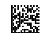
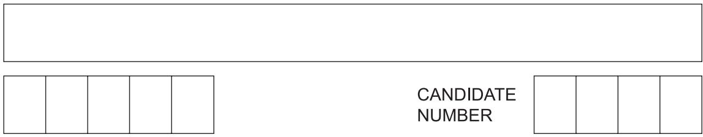
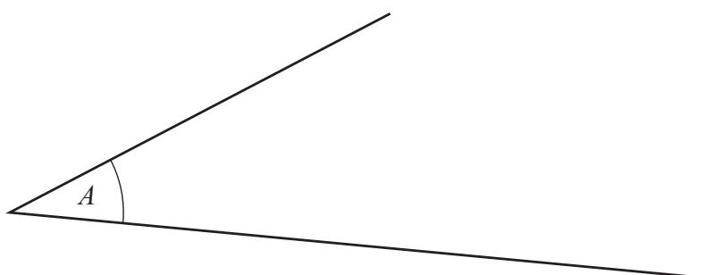
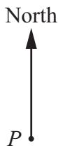
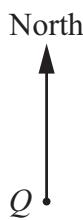
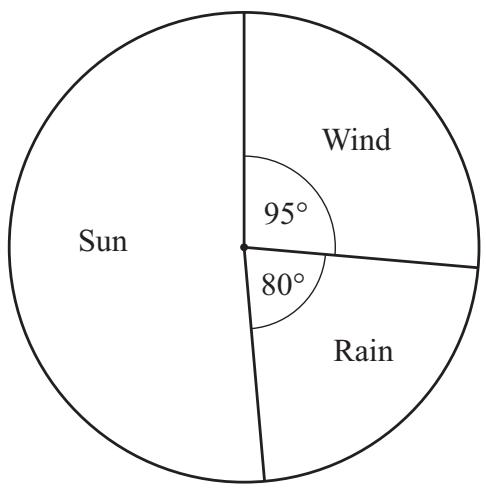
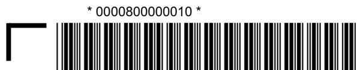
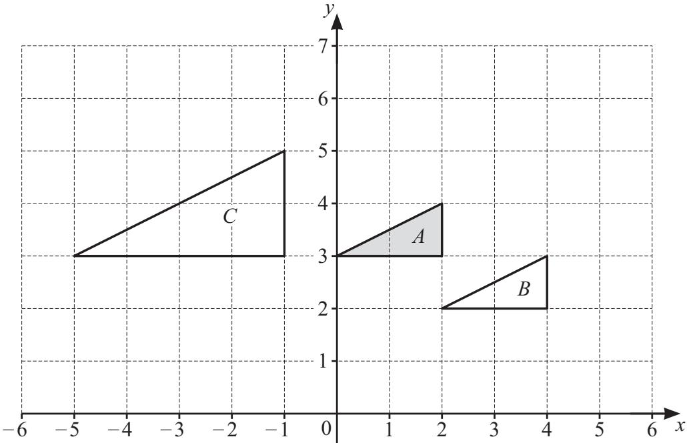
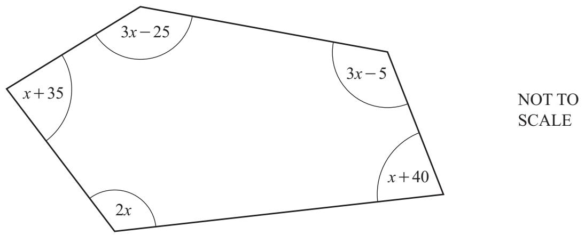

# Cambridge IGCSE

CANDIDATE

NAME

CENTRE

NUMBER

# MATHEMATICS

0580/32

Paper 3 Calculator (Core)

February/March 2025

1 hour 30 minutes

You must answer on the question paper.

You will need: Geometrical instruments

# INSTRUCTIONS

Answer all questions.   
- Use a black or dark blue pen. You may use an HB pencil for any diagrams or graphs.   
- Write your name, centre number and candidate number in the boxes at the top of the page.   
Write your answer to each question in the space provided.   
- Do not use an erasable pen or correction fluid.   
- Do not write on any bar codes.   
- You should use a scientific calculator where appropriate.   
You may use tracing paper.   
- You must show all necessary working clearly.   
- Give non-exact numerical answers correct to 3 significant figures, or 1 decimal place for angles in degrees, unless a different level of accuracy is specified in the question.   
For $\pi$ , use either your calculator value or 3.142.

# INFORMATION

The total mark for this paper is 80.   
The number of marks for each question or part question is shown in brackets [ ].

# List of formulas

Area, $A$ , of triangle, base $b$ , height $h$ .

$$
A = \frac {1}{2} b h
$$

Area, $A$ , of circle of radius $r$ .

$$
A = \pi r ^ {2}
$$

Circumference, $C$ , of circle of radius $r$ .

$$
C = 2 \pi r
$$

Curved surface area, $A$ , of cylinder of radius $r$ , height $h$ .

$$
A = 2 \pi r h
$$

Curved surface area, $A$ , of cone of radius $r$ , sloping edge $l$ .

$$
A = \pi r l
$$

Surface area, $A$ , of sphere of radius $r$ .

$$
A = 4 \pi r ^ {2}
$$

Volume, $V$ , of prism, cross-sectional area $A$ , length $l$ .

$$
V = A l
$$

Volume, $V$ , of pyramid, base area $A$ , height $h$ .

$$
V = \frac {1}{3} A h
$$

Volume, $V$ , of cylinder of radius $r$ , height $h$ .

$$
V = \pi r ^ {2} h
$$

Volume, $V$ , of cone of radius $r$ , height $h$ .

$$
V = \frac {1}{3} \pi r ^ {2} h
$$

Volume, $V$ , of sphere of radius $r$ .

$$
V = \frac {4}{3} \pi r ^ {3}
$$

1 Taj is $3\frac{1}{4}$ years old.

Work out her age in months.

months [1]

2 Div has $25 to buy some cups which cost $4.25 each.

Calculate the maximum number of cups he can buy and the change he receives.

Number of cups

Change \$ [3]

3

(a) Measure angle $A$

[1]

(b) Write down the mathematical name of this type of angle.

[1]

4

<table><tr><td>30</td><td>31</td><td>32</td><td>33</td><td>34</td><td>35</td><td>36</td><td>37</td><td>38</td><td>39</td></tr></table>

From this list, write down the number that is

(a) a multiple of 13

[1]

(b) a factor of 140

[1]

(c) the largest prime number

[1]

(d) divisible by an even cube number

[1]

(e) $20\%$ of 190.

[1]

5 (a) A farmer plants $t$ trees each day.

Write an expression for the number of trees he plants in $d$ days.

[1]

(b) A train has $p$ passengers.

$x$ passengers get off the train and $y$ passengers get on the train.

Write an expression for the number of passengers on the train now.

[1]

6 Raj thinks of a negative number, $n$

He adds 10 to $n$ and then multiplies by 5.

The answer is 30.

Work out the value of $n$ .

$$
n = \dots \dots \dots \dots \dots \dots \dots \dots \tag {2}
$$

7 The diagram shows a straight line crossing a pair of parallel lines.

Complete these statements.

(a) Angle $A$ and angle .. are corresponding angles. [1]   
(b) Angle $A$ and angle $e$ are angles. [1]

8 These are the first four terms of a sequence.

31 24 17 10

(a) Write down the term-to-term rule for continuing this sequence.

[1]

(b) Find the next two terms in this sequence.

[2]

(c) Find the $n$ th term.

[2]

9 A cuboid measures $3\mathrm{cm}$ by $7\mathrm{cm}$ by $11\mathrm{cm}$ .

Calculate the surface area of the cuboid.

$\mathrm{cm}^2$ [3]

10 The table shows an ordered stem-and-leaf diagram.

$A, B$ and $C$ are missing numbers.

<table><tr><td>0</td><td>2</td><td>A</td><td></td><td></td><td></td></tr><tr><td>1</td><td>1</td><td>3</td><td>B</td><td>7</td><td></td></tr><tr><td>2</td><td>0</td><td>4</td><td>6</td><td>C</td><td></td></tr></table>

Key:1|3 represents 13

For the ten numbers

the range is 27   
the median is 16   
the mean is 16.5 .

(a) Work out the values of $A, B$ and $C$ .

$A =$

$B =$

$C =$

[5]

(b) Complete this statement.

There is no mode because

[1]

11 The scale drawing shows the positions of two lighthouses, $P$ and $Q$ . The scale is 1 centimetre represents 0.8 kilometres.

Scale: $1\mathrm{cm}$ to $0.8\mathrm{km}$

(a) (i) Find the actual distance between $P$ and $Q$ .   
(ii) Measure the bearing of $Q$ from $P$ .

km [2]

(b) A boat, $B$ , is on a bearing of $127^{\circ}$ from $P$ Calculate the bearing of $P$ from $B$

[1]

[2]

12 Mo asks some people if they prefer sun, rain or wind.

The pie chart shows the results.

45 more people prefer wind than rain.

Work out how many people prefer sun.

[4]

13 Xie changes 2000 dollars into krona.

1 dollar $= 0.615$ euros

1 krona $= 0.087$ euros

Use the exchange rates to calculate how many krona she receives.

Give your answer correct to the nearest krona.

krona [3]

10

14 (a) Factorise.

$$
8 x ^ {2} - 2 x
$$

[2]

(b) Expand the brackets and simplify.

$$
5 (2 m - 1) + 3 (m + 7)
$$

[2]

15 (a) A car travels $95\mathrm{km}$ in 2 hours and 15 minutes.

Calculate the average speed of the car in $\mathrm{km / h}$

km/h [1]

(b) Convert $8\mathrm{m / s}$ into $\mathrm{km / h}$

km/h [2]

16 (a) Chi shares $480 in the ratio 2 : 3 : 7.

Calculate the value of the largest share.

$ [2]

(b) Simplify these ratios.

(i) $98:147$

[1]

(ii) $2^{450}: 2^{452}$

[1]

17 (a) Solve.

$$
\frac {x}{3} = 1 8
$$

$x =$ [1]

(b) $\frac{6^9}{6^y} = 6^{11}$

Find the value of $y$ .

$y =$ [1]

(c) Simplify.

$$
\frac {a ^ {6} b ^ {- 2}}{a ^ {4} b ^ {3}}
$$

[2]

18 (a) Clare invests $12000 for 3 years at a rate of $8\%$ per year compound interest.

Calculate the value of her investment at the end of the 3 years. Give your answer correct to the nearest $10.

$ [3]

(b) Zak invests $560 for one year. After one year his investment is worth $630.

Calculate the percentage increase.

$\%$ [2]

19 (a) Write 2025 as the product of its prime factors.

[2]

(b) Write 2025 as a product of two square numbers that are both greater than one.

[1]

20 The diagram shows three shapes, $A, B$ and $C$ , on a $1 \, \text{cm}^2$ grid.

(a) On the grid, draw the image of shape $A$ after a rotation, $90^{\circ}$ clockwise, centre $(0,3)$ . [2]   
(b) Describe fully the single transformation that maps

(i) shape $A$ onto shape $B$ [2]   
(ii) shape $A$ onto shape $C$ [3]

(c) Calculate the size of the smallest angle in triangle $C$

[2]

21 (a) Show that the sum of the interior angles of a pentagon is $540^{\circ}$ .

[1]

(b) In this part, all angles are in degrees.

The diagram shows the five interior angles of a pentagon, written in terms of $x$ .

(i) Write down an expression, in terms of $x$ , for the sum of the interior angles of the pentagon. Give your answer in its simplest form.

[2]

(ii) Work out the value of $x$

$x =$ [2]

# BLANK PAGE

Permission to reproduce items where third-party owned material protected by copyright is included has been sought and cleared where possible. Every reasonable effort has been made by the publisher (UCLES) to trace copyright holders, but if any items requiring clearance have unwittingly been included, the publisher will be pleased to make amends at the earliest possible opportunity.

To avoid the issue of disclosure of answer-related information to candidates, all copyright acknowledgements are reproduced online in the Cambridge Assessment International Education Copyright Acknowledgements Booklet. This is produced for each series of examinations and is freely available to download at www.cambridgeinternational.org after the live examination series.

Cambridge Assessment International Education is part of Cambridge Assessment. Cambridge Assessment is the brand name of the University of Cambridge Local Examinations Syndicate (UCLES), which is a department of the University of Cambridge.