# 提取的题目

**总数**: 846

---

## 19.1 平方根与立方根

### 例1 (例题)

**题目**: 例① 实数  $\sqrt{16}$  的算术平方根是

**解答**: 分析 一个正数的正的平方根叫作它的算术平方根，由此即可求出结果. 解  $\sqrt{16} = 4, 4$  的算术平方根是2，所以实数  $\sqrt{16}$  的算术平方根是2. 说明 此题主要考查了算术平方根的概念，但要注意此题容易错

---

### 例2 (例题)

**题目**: 例② 若代数式  $\sqrt{1 - 2x} +\sqrt{2x + 3}$  有意义，则  $x$  的取值范围是

**解答**: 分析 根据算术平方根有意义的条件可得不等式组，再解不等式组即可. 解 由题意，得  $\left\{ \begin{array}{l}1 - 2x\geqslant 0,\\ 2x + 3\geqslant 0. \end{array} \right.$ 解得  $-\frac{3}{2} \leqslant x \leqslant \frac{1}{2}$ .

---

### 例3 (例题)

**题目**: 例③ 已知  $x, y$  是实数，且  $\sqrt{3x + 4} + y^2 - 6y + 9 = 0$ ，若  $axy - 3x = y$ ，求实数  $a$  的值.

**解答**: 解 由已知，得  $\sqrt{3x + 4} + (y - 3)^2 = 0.$ $$
\therefore 3 x + 4 = 0, y - 3 = 0.
$$ $$
\therefore x = - \frac {4}{3}, y = 3.
$$ $$
\because a x y - 3 x = y,
$$ $$
\therefore - \frac {4}{3} \times 3 a - 3 \times \left(- \frac {4}{3}\right) = 3.
$$ $$
\therefore a = \frac {1}{4}.
$$

---

### 1 (练习题)

**题目**: 1.  $x$  取何值时，下列各式有意义？ (1)  $\sqrt{3 - 6x}$ ; (2)  $\frac{\sqrt{x + 2}}{x - 5}$ .

---

### 2 (练习题)

**题目**: 2. 求下列各数的算术平方根： (1) 81; (2) 169; (3) 2.89; (4) 0.0289; (5)  $\frac{361}{196}$ .

---

### 3 (练习题)

**题目**: 3. 化简： (1)  $\sqrt{121}$ ; (2)  $\sqrt{1.44}$ ; (3)  $\sqrt{4^2}$ ; (4)  $(\sqrt{15})^2$ (5)  $\sqrt{0.000361}$ .

---

### 4 (练习题)

**题目**: 4. 已知  $\sqrt{4.84} = 2.2$ ，化简：(1)  $\sqrt{4840000}$ ；(2)  $\sqrt{0.0484}$ .

---

### 5 (练习题)

**题目**: 5. 已知  $a, b$  是有理数，且  $(4 + \sqrt{3})a + (2 - \sqrt{3})b = 6 + 3\sqrt{3}$ ，求  $a, b$  的值

---

### 例1 (例题)

**题目**: 例① 判断： （1）  $a^2$  的正平方根是  $\pmb{a}$ （2）196的平方根是一14. (3)  $-a^{2}$  没有平方根. （4）平方根与原数相同的有0，1两数 (5)  $\sqrt{16}$  的平方根是  $\pm 4$ .

**解答**: 解 (1) 错误.  $a$  可能是负数 （2）错误.196的平方根是士14 （3）错误.若  $a$  等于0，则  $-a^2$  等于0，0有平方根 （4）错误.1的平方根是  $\pm 1$ （5）错误.  $\sqrt{16} = 4, 4$  的平方根是  $\pm 2$ . 说明 对于第(5)题，注意求的不是16的平方根，而是  $\sqrt{16}$  的平方根，要先求出16的正平方根等于4，再求4的平方根.

---

### 例2 (例题)

**题目**: 例② 已知某正数的平方根是  $1 - 2a$  和  $a + 3$ , 求  $a$  的平方根.

**解答**: 解：某正数的平方根是  $1 - 2a$  和  $a + 3$ $$
\therefore (1 - 2 a) + (a + 3) = 0.
$$ 解得  $a = 4$

---

## 19.1(三) 立方根

### 例1 (例题)

**题目**: 例① 计算：(1)  $\sqrt{2^2}$ ， $\sqrt{(-2)^2}$ ， $\sqrt{a^2}$ ；(2)  $\sqrt[3]{2^3}$ ， $\sqrt[3]{(-2)^3}$ ， $\sqrt[3]{a^3}$ .

**解答**: 解 (1)  $\sqrt{2^2} = 2, \sqrt{(-2)^2} = 2, \sqrt{a^2} = |a| = \begin{cases} a & (a > 0), \\ 0 & (a = 0), \\ -a & (a < 0). \end{cases}$ (2)  $\sqrt[3]{2^3} = 2, \sqrt[3]{(-2)^3} = -2, \sqrt[3]{a^3} = a$ .

---

### 例2 (例题)

**题目**: 例② 解下列各题： （1）求下列各式的值：  $-\sqrt[3]{-\frac{343}{8}},\sqrt[3]{(-10)^6},\sqrt[3]{-60\times 18\times 25};$ （2）求256的平方根的立方根； （3）求  $x^3 + 729 = 0$  中  $x$  的值； （4）如果  $\sqrt[3]{200a}$  是一个整数，那么满足条件最大的负整数  $a$  是什么？

**解答**: (1)  $-\sqrt[3]{-\frac{343}{8}} = \sqrt[3]{\frac{343}{8}} = \frac{7}{2}$ . $$
\begin{array}{l} \sqrt [ 3 ]{(- 1 0) ^ {6}} = \sqrt [ 3 ]{1 0 ^ {6}} = 1 0 0. \\ \sqrt [ 3 ]{- 6 0 \times 1 8 \times 2 5} = - \sqrt [ 3 ]{5 \times 3 \times 2 ^ {2} \times 2 \times 3 ^ {2} \times 5 ^ {2}} = - \sqrt [ 3 ]{2 ^ {3} \times 3 ^ {3} \times 5 ^ {3}} = - 3 0. \\ \end{array}
$$ （2）：256的平方根是  $\pm 16$  ，∴256的平方根的立方根是  $\pm 2\sqrt[3]{2}$ (3)  $\because x^3 + 729 = 0, \therefore x^3 = -729$ .  $\therefore x = -9$ . （4） $\because 200a = 2^3 \times 5^2 \times a$ ， $\therefore$  满足  $\sqrt[3]{200a}$  是一个整数的  $a = -5 \times k^3 (k$  为整数). 所以最大的负整数  $a$  是-5.

---

### 例3 (例题)

**题目**: 例③ 已知  $\sqrt[3]{0.23} \approx 0.6127, \sqrt[3]{2.3} \approx 1.320, \sqrt[3]{23} \approx 2.844$ . 求  $\sqrt[3]{230},\sqrt[3]{-23000},\sqrt[3]{0.0023}$  的近似值

---

### 1 (练习题)

**题目**: 1. 如果一个数的平方等于  $a$ ，那么这个数叫作 _______.

---

### 2 (练习题)

**题目**: 2.  $\frac{4}{9}$  的平方是 ，  $\frac{4}{9}$  的平方根是

---

### 3 (练习题)

**题目**: 3.  $a$  是正数  $x$  的一个平方根，则 也是正数  $x$  的平方根

---

### 4 (练习题)

**题目**: 4. 的平方根等于它本身

---

### 5 (练习题)

**题目**: 5. 若  $x - \frac{1}{2}$  没有平方根, 则  $x$  的取值范围是

---

### 6 (练习题)

**题目**: 6.  $a$  的相反数的平方根记作 ，它有意义的条件是

---

### 7 (练习题)

**题目**: 7. (1) 当  $x \geqslant 5$  时,  $\sqrt{(5 - x)^2} = \_$ ; (2) 当  $x < -4$  时,  $\sqrt{(x + 4)^2} = \_$ .

---

### 8 (练习题)

**题目**: 8. 若  $\sqrt{(2a - 3)^2} = 3 - 2a$ ，则  $a$  的取值范围是

---

### 9 (练习题)

**题目**: 9. 下列语句正确的是（ ） A.  $\sqrt{\frac{1}{4}}$  的平方根是  $\frac{1}{2}$ B.  $\sqrt{\frac{1}{16}}$  的平方根是土  $\frac{1}{2}$ C.  $\frac{1}{16}$  的平方根是  $\frac{1}{4}$ D.  $\frac{1}{4}$  的平方是  $\pm \frac{1}{2}$

---

### 10 (练习题)

**题目**: 10. 下列式子正确的有（ ）. ①  $\sqrt{36} = \pm 6$ ; ②  $-\sqrt{36} = -6$ ③  $\sqrt{-6^2} = 6$ ; ④  $\sqrt{(-2)^2} = 2$ ⑤  $\sqrt{(-6)^2} = (\sqrt{-6})^2$ A. 1 个 B. 2 个 C. 3 个 D. 4 个

---

### 11 (练习题)

**题目**: 11. 求下列各式的值： (1)  $\sqrt{169} =$ (2)  $-\sqrt{2\frac{7}{9}} =$ (3)  $\pm \sqrt{0.0361} = \_$ (4)  $\sqrt{\left(-\frac{3}{4}\right)^2} = \_$ (5)  $-\sqrt{\left(-1 + \frac{1}{2}\right)^{2}} = \_$ (6)  $-\sqrt{(\pi - 4)^2} = \underline{\quad}$

---

### 12 (练习题)

**题目**: 12. 求下列式子中  $x$  的值： (1)  $0.04x^{2} = 9$ (2)  $\frac{1}{2} x^2 + \frac{1}{6} = \frac{2}{9}$ ; (3)  $\sqrt{\frac{4}{9}} x^2 - \sqrt{1\frac{7}{9}} = \sqrt{64}$ ; (4)  $\left(x - \frac{2}{5}\right)^2 = \frac{1}{4}.$

---

### 13 (练习题)

**题目**: 13. 已知  $\sqrt{x - 4} + \sqrt{y + 3} = 0$ ，求  $2x - y$  的值

---

### 14 (练习题)

**题目**: 14. 若  $2a + 3$  和  $a + 6$  是一个正数的两个平方根, 则这个正数是多少?

---

### 15 (练习题)

**题目**: 15. 已知  $|2029 - a| + \sqrt{a - 2030} = a$ ，求  $a - 2029^2$  的值

---

### 16 (练习题)

**题目**: 16. 已知  $|a - b - 1| + \sqrt{(3a - 2b - 1)^2} = 0$ ，求  $a + 4b^2$  的平方根

---

### 17 (练习题)

**题目**: 17. 求使得  $\sqrt{175m}$  是一个自然数的最小正整数  $m$ .

---

## 19.2 实数

### 例1 (例题)

**题目**: 例① 将  $0.2\dot{3}\dot{4}$  化成分数

---

### 1 (练习题)

**题目**: 1. 如果一个数的立方等于  $a$ ，那么这个数叫作  $a$  的 _______，用符号表示为 _______，而  $-\sqrt[3]{a}$  表示 _______.

---

### 2 (练习题)

**题目**: 2.（1）一27的立方根是 ；（2）  $\frac{1}{125}$  的立方根是 (3)  $\left| - \frac{1}{64} \right|$  的立方根是

---

### 3 (练习题)

**题目**: 3. 平方根等于本身的数是 ，立方根等于本身的数是

---

### 4 (练习题)

**题目**: 4. 若  $\sqrt[3]{-a} = -\sqrt[3]{-a}$ , 则  $a =$

---

### 5 (练习题)

**题目**: 5. 是  $\frac{1}{4}$  的负的平方根，又是 的立方根

---

### 6 (练习题)

**题目**: 6. 化简：(1)  $\sqrt[3]{(5 - \pi)^{3}} =$  ________；(2)  $\sqrt[3]{(1 - x)^{3}} =$  ________.

---

### 7 (练习题)

**题目**: 7. 若  $\sqrt[3]{0.0468} \approx 0.3604$ ，则  $(-36.04)^{3} \approx$  ________.

---

### 8 (练习题)

**题目**: 8. 下列说法正确的是（ ） A.  $-\frac{1}{16}$  没有立方根 B.  $-\frac{125}{512}$  的立方根是  $\frac{5}{8}$  和  $-\frac{5}{8}$ C. 729 的平方根的立方根是 3 D. 一4 是一64 的立方根

---

### 9 (练习题)

**题目**: 9. 计算： (1)  $\sqrt[3]{(-8)^2}$ ; (2)  $-\sqrt[3]{216}$ ; (3)  $-\sqrt[3]{-1\frac{61}{64}}$ (4)  $\sqrt[3]{-3 - \frac{3}{8}}$ ; (5)  $\sqrt[3]{a^3}$ ; (6)  $\sqrt[3]{(-a)^6}$ .

---

### 10 (练习题)

**题目**: 10. 求下列式子中  $x$  的值： (1)  $8x^{3} = 125$ (2)  $\sqrt[3]{x} = -3$ ; (3)  $8x^{3} - 2 = \frac{10}{27}$ ; (4)  $2(x - 2)^{3} = 16.$

---

### 11 (练习题)

**题目**: 11. 已知一个正方体的棱长是  $4\mathrm{cm}$ , 现制作一个正方体, 使它的体积是原正方体体积的2倍, 求所作正方体的棱长.

---

### 12 (练习题)

**题目**: 12. 已知  $a + 2$  的平方根是  $\pm 2, 6a + b + 7$  的立方根是 3, 求  $a^2 + b$  的平方根.

---

### 13 (练习题)

**题目**: 13. 已知  $a$  是  $\sqrt[3]{80}$  的整数部分, 求  $a$  的平方根

---

### 14 (练习题)

**题目**: 14. 已知  $\sqrt[3]{3x + 8}$  和  $\sqrt[3]{3y - 5}$  互为相反数, 求  $\sqrt[3]{x + y}$  的值.

---

### 15 (练习题)

**题目**: 15. 若  $a$  没有平方根, 试化简:  $|a| - \sqrt[3]{a^3} + \sqrt{a^2}$ .

---

### 16 (练习题)

**题目**: 16. 已知甲、乙、丙三个数，甲  $= 5 + \sqrt{15}$ ，乙  $= 3 + \sqrt{17}$ ，丙  $= 1 + \sqrt{19}$ ，则甲、乙、丙的大小关系是（ ）. A. 丙  $<$  乙  $<$  甲 B. 乙  $<$  甲  $<$  丙 C. 甲  $<$  乙  $<$  丙 D. 甲  $=$  乙  $=$  丙

---

### 1 (练习题)

**题目**: 1. (1)  $\sqrt{256}$  的平方根是 ________；(2) ________ 的立方根是一3.

---

### 2 (练习题)

**题目**: 2.（1）  $30\frac{1}{4}$  的平方根为 ；(2)  $0.64\times (-10)^{2}$  的算术平方根为

---

### 3 (练习题)

**题目**: 3. 若  $\sqrt{3} \approx 1.732, \sqrt{30} \approx 5.477$ ，则  $\sqrt{30000} \approx$  ________.

---

### 4 (练习题)

**题目**: 4. 若  $-1331$  的立方根是  $-11$ , 则立方根是 0.11 的数是

---

### 5 (练习题)

**题目**: 5. 求下列各式中  $x$  的取值范围： (1)  $\sqrt{-(x - 2)^2}$ (2)  $\frac{\sqrt{x - 1}}{\sqrt{9 - 3x}}$

---

### 6 (练习题)

**题目**: 6. (1)  $7 - \sqrt{7}$  的整数部分是 , 小数部分是 (2)  $9 - 2\sqrt{5}$  的整数部分是 ,小数部分是

---

### 7 (练习题)

**题目**: 7. 一64的三次方根是

---

### 8 (练习题)

**题目**: 8. 使  $\sqrt[3]{-a} = -\sqrt[3]{a}$  成立的条件是

---

### 9 (练习题)

**题目**: 9. 如果  $a + b = 0, ab \neq 0$ ，那么  $\frac{\sqrt{b^2}}{a} + \frac{\sqrt{a^2}}{b} = \_$

---

### 10 (练习题)

**题目**: 10. 把  $\sqrt{3}$  的小数部分记作  $a$ ，把  $\sqrt{9}$  的正平方根记作  $b$ ，那么  $a^2 + 2b = \_\_\_\_\_\_\_\_\_\_\_.$

---

### 11 (练习题)

**题目**: 11. 下列说法正确的是（ ）. A. 一个数的平方根总有两个 B. 一个数的立方根有两个 C. 1 的立方根是  $\pm 1$ D. 1 的平方根是  $\pm 1$

---

### 12 (练习题)

**题目**: 12. 下列式子表达不正确的是（ ） A.  $-\sqrt{18}$  是 18 的平方根 B.  $-\sqrt{144} = -12$ C.  $\sqrt{49} = \pm 7$ D.  $-4$  是  $-64$  的立方根

---

### 13 (练习题)

**题目**: 13. 计算： (1)  $-\sqrt{3.61} \times \sqrt{0.04}$ ; (2)  $\pm \sqrt{2 - \frac{23}{36}}$ ; (3)  $\sqrt{0.0081} \times \sqrt[3]{-125}$ ; (4)  $\sqrt{2.89} - \sqrt[3]{0.512}$ .

---

### 14 (练习题)

**题目**: 14. 当  $x$  为何值时，下列各式有意义？ (1)  $\sqrt{2 - 4x}$ ; (2)  $\sqrt[3]{5x - 3}$ ; (3)  $\frac{(x - 1)^0}{\sqrt[3]{x}}$

---

### 15 (练习题)

**题目**: 15. 求值:  $\sqrt{9 + a} - \sqrt{16 - 3a} + \sqrt{4a + 1} + \sqrt{-a^2}$ .

---

### 16 (练习题)

**题目**: 16. 已知  $A = \frac{\sqrt{2x + 3y - 1} - \sqrt{2 - 4x - 6y} + 2y}{\sqrt{7x - 4y - 18} + \sqrt{4y - 7x + 18} - x}$ , 求  $A$  的平方根.

---

## 19.2（二） 无理数

### 例2 (例题)

**题目**: 例② 将  $0.1\dot{2}\dot{3} + 0.4\dot{5}\dot{6}$  化成分数

**解答**: 解 将第一个无限循环小数化成分数： 设  $x = 0.123$  ，那么  $10x = 1.23.$  ① $$
1 0 0 0 x = 1 2 3. \dot {2} \dot {3}. \quad ②
$$ $②$  一  $①$  ，得  $990x = 122.$ 解得  $x = \frac{61}{495}$ 所以  $0.1\dot{2}\dot{3} = \frac{61}{495}$ 同理，  $0.45\dot{6} = \frac{226}{495}$ 所以  $0.1\dot{2}\dot{3} + 0.4\dot{5}\dot{6} = \frac{61}{495} + \frac{226}{495} = \frac{287}{495}.$

---

### 1 (练习题)

**题目**: 1. 请你写出下列无限循环小数的循环节和简便记法： (1) 0.33333…; (2) 0.13061306…； （3）8.347564756…； （4）0.235535535…； (5) 2.1212121…; (6) 12.12345345…

---

### 2 (练习题)

**题目**: 2. 将下列无限循环小数化成分数： (1) 0.8i; (2) 3.  $\dot{7}$ ; (3) 4.36; (4) 12.  $\dot{7}0\dot{2}$ .

---

### 3 (练习题)

**题目**: 3. 将下列无限循环小数化成分数： (1) 0.65; (2) 8.38; (3)  $2.0\dot{7}\dot{2}$ ; (4) 2.361.

---

### 4 (练习题)

**题目**: 4. 计算:  $1.25 \times 0.3 + 1.25 \times \frac{1}{3} + 1.25 \times 0.6$ .

---

### 5 (练习题)

**题目**: 5. 计算:  $0.1\dot{4} + 0.2\dot{5} + 0.3\dot{6} + 0.4\dot{7} + 0.5\dot{8}$ .

---

### 6 (练习题)

**题目**: 6. 计算:  $1. \dot{4} + 2. \dot{5} + 3. \dot{6} + 4. \dot{7} + 5. \dot{8} + 6. \dot{9}$ .

---

### 例1 (例题)

**题目**: 例① 求证：  $\sqrt{7}$  是一个无理数

**解答**: 证明 假设  $\sqrt{7}$  是一个有理数, 则  $\sqrt{7} = \frac{a}{b}$  ( $a, b$  是互素的两个正整数). 两边平方，得  $7 = \frac{a^2}{b^2}$ 于是  $a^2 = 7b^2$  ，则  $a^2$  是7的倍数，所以  $\pmb{a}$  也是7的倍数 设  $a = 7m$  (  $m$  是正整数)，就有  $(7m)^{2} = 7b^{2}$ 于是  $b^{2} = 7m^{2}$  ，则  $b^{2}$  是7的倍数，所以  $\pmb{b}$  也是7的倍数 可见  $a, b$  不是互素的，与前面假设的  $a, b$  互素相矛盾。 所以  $\sqrt{7}$  不是一个有理数 因此  $\sqrt{7}$  是一个无理数

---

### 例2 (例题)

**题目**: 例② 判断： （1）无理数一定是带根号的数； （2）一个数的平方根不是正数，就是负数； （3）因为  $\frac{22}{7}$  的值接近  $\pi$  ，所以  $\frac{22}{7}$  是无理数； （4）无限小数都是无理数

**解答**: 解 (1) 错误. 如:  $\pi$  等数. （2）错误.0的平方根0 (3) 错误.  $\frac{22}{7}$  是分数, 所以是有理数. （4）错误.无限循环小数是有理数，不是无理数

---

### 例3 (例题)

**题目**: 例③ 判断： （1）因为  $\sqrt{2}$  在1与2之间，所以1与2之间只有一个无理数； （2）任何两个有理数之间都有无数个无理数； （3）无理数都是无限小数； （4）两个无理数可以比较大小

**解答**: 解 (1) 错误. 如  $\sqrt{\frac{3}{2}}$  也在 1 与 2 之间, 也是无理数. （2）正确. （3）正确. （4）正确.

---

### 1 (练习题)

**题目**: 1. 叫作无理数

---

### 2 (练习题)

**题目**: 2. 请写出在4和5之间的一个无理数

---

### 3 (练习题)

**题目**: 3. 化简：(1)  $|\pi - 3.142| = \_$ ；(2)  $|-1 - \sqrt{5}| = \_$ .

---

### 4 (练习题)

**题目**: 4.（1）比  $2 + \sqrt{13}$  大的最小整数是 ；（2）比  $5 - \sqrt[3]{3}$  小的最大整数是

---

### 5 (练习题)

**题目**: 5. 下列语句正确的是（ ） A. 无理数都是无限小数 B. 无限小数都是无理数 C. 带根号的数都是无理数 D. 不带根号的数一定不是无理数

---

### 6 (练习题)

**题目**: 6. 下列语句正确的是（ ） A. 无理数之间不可以比较大小 B. 有理数与无理数无法比较大小 C. 无理数一定是无限不循环小数 D. 一个正无理数的算术平方根可能是有理数

---

## 19.2(三) 实数与数轴

### 7 (练习题)

**题目**: 7. 下列说法错误的有（ ）. ①  $\frac{\pi}{3}$  是分数； ②  $\pi$  是无限小数； ③  $\frac{\sqrt{2}}{2}$  是分数； ④  $a^0 = 1$  ； ⑤ 0 是有理数. A. 1 个 B. 2 个 C. 3 个 D. 4 个

---

### 8 (练习题)

**题目**: 8. 下列说法错误的有（ ） ① 一个无理数不是正数就是负数； ② 0 是最小的有理数，没有最大的无理数； ③ 无理数都是开方开不尽的数； A. 1 个 B. 2 个 C. 3 个 D. 4 个

---

### 9 (练习题)

**题目**: 9. 请判断  $3\sqrt{5}$  在哪两个整数之间，并说明理由。

---

### 10 (练习题)

**题目**: 10. 求证:  $\sqrt{13}$  是无理数

---

### 11 (练习题)

**题目**: 11. 计算:  $(- \sqrt{7})^2 - (\sqrt{13})^4 + \frac{10}{\sqrt[3]{0.001}}.$

---

### 例1 (例题)

**题目**: 例① 已知下列各数： $$
\sqrt {3 6}, - 3, 0. \dot {7}, 3. 1 4 1 5, 0. \dot {1} \dot {4} \dot {9}, - \frac {5}{1 2},
$$ 0.2020020002…（两个2之间依次多1个0）， $\left|1 - \sqrt{3}\right|, - \sqrt{28},\frac{31}{11},\frac{\pi}{4},0.$ （1）属于无理数的是： （2）属于非负实数的是：

**解答**: 解（1）属于无理数的是：0.2020020002…， $\left|1 - \sqrt{3}\right|$ ， $-\sqrt{28}$ ， $\frac{\pi}{4}$ 。 (2) 属于非负实数的是:  $\sqrt{36}, 0.7, 3.1415, 0.149, 0.2020020002 \cdots, |1 - \sqrt{3}|$ ,  $\frac{31}{11}$ ,  $\frac{\pi}{4}$ , 0. 说明 判断一个数是有理数还是无理数，一般从观察数的形式入手，而有些数常常形似而实非。如  $\sqrt{36}$  形似无理数，而实是有理数； $\frac{\pi}{4}$  形似分数，而实是无理数。

---

### 例2 (例题)

**题目**: 例② 若将三个数  $\sqrt{3}, \sqrt{7}, \sqrt{11}$  表示在如图 19-1 所示的数轴上，其中能被墨迹覆盖的数是

**解答**: 解 因为  $-2 < -\sqrt{3} < -1, 2 < \sqrt{7} < 3, 3 < \sqrt{11} < 4$ ，所以能被墨迹覆盖的数是 $\sqrt{7}$

---

### 例3 (例题)

**题目**: 例③ 实数  $a, b$  在数轴上的对应点的位置如图19-2所示，下列结论正确的是（ ）. A.  $b > -1$ B.  $-b > 2$ C.  $a + b > 0$ D.  $ab > 0$

**解答**: 解 由数轴可知  $-2 < b < -1$ ，故选项A不符合题意. 由数轴可知  $-2 < b < -1$ ，所以  $1 < -b < 2$ ，故选项B不符合题意。 由数轴可知  $2 < a < 3$  ，而  $-2 < b < -1$  ，所以  $a + b > 0$  ，故选项C符合题意. 由数轴可知  $2 < a < 3$  ，而  $-2 < b < -1$  ，所以  $ab < 0$  ，故选项D不符合题意. 故选 C.

---

### 1 (练习题)

**题目**: 1.  $\sqrt{9}$  的平方根是

---

### 2 (练习题)

**题目**: 2. 如果一个数的立方根是一3，那么这个数是

---

### 3 (练习题)

**题目**: 3. 计算：(1)  $\sqrt[3]{(-8)^2} = \_$ ；(2)  $-\sqrt[3]{343} = \_$ (3)  $\sqrt{3.7^2 - 1.2^2} = \_$

---

### 4 (练习题)

**题目**: 4.  $n$  是正整数，计算：  $-\left[-(-1)^{2n}\right]^{2n + 1} = \underline{\quad}$

---

### 5 (练习题)

**题目**: 5. 比较大小：(1)  $\left| -\sqrt{3} \right|$  ________ 2；(2)  $3\sqrt{13}$  ________ 11. (填“<”“>”或“=”）

---

### 6 (练习题)

**题目**: 6. 如果  $x^{2} = 64$ ，那么  $\sqrt[3]{x} =$  ________.

---

### 7 (练习题)

**题目**: 7.（1）等式  $\sqrt{a^2} = a$  成立的条件是 （2）等式  $\sqrt{a^2} = -a$  成立的条件是

---

### 8 (练习题)

**题目**: 8. 已知下列各数： ①  $(- \sqrt{2})^0, ② \sqrt[3]{8}, ③ 0, ④ \sqrt{9}, ⑤ 0.010010001 \cdots$  （两个1之间依次多1个0），⑥  $\frac{\pi}{2}$ ，⑦  $-0.3, ⑧ |1 - \sqrt{3}|$ ，⑨ 3.1415，⑩ 2.01. 属于无理数的是： ；（填序号） 属于非负有理数的是： .（填序号）

---

### 9 (练习题)

**题目**: 9. 已知数轴上的四点  $A, B, C, D$  所对应的实数依次是  $\sqrt{2}, -\frac{2}{3}, 2\frac{1}{2}, -\sqrt{5}, O$  为原点. （1）求线段  $OA$  ，  $OB$  ，  $OC$  ，  $OD$  的长度； (2) 求线段  $BD, BC, AC$  的长度.

---

### 10 (练习题)

**题目**: 10. 已知  $2m - 5$  的相反数是  $-9, 3n + 1$  的立方根是  $-2$ . （1）求  $m, n$  的值； （2）求  $m - 3n$  的平方根

---

### 例1 (例题)

**题目**: 例① 比较下列各组数的大小： （1）  $4\sqrt{5}$  和  $5\sqrt{3}$ (2)  $a$  和  $\sqrt{a} (0 < a < 1)$ ; (3) 若  $b > 0, a < 0, c < 0$ ，且  $|c| > |b| > |a|$ ，比较  $a, b, c, a + b, a + c$  的大小.

**解答**: 解 (1)  $\because 4\sqrt{5} = \sqrt{16 \times 5} = \sqrt{80}, 5\sqrt{3} = \sqrt{25 \times 3} = \sqrt{75}$ , 又  $\because \sqrt{80} > \sqrt{75}$ $$
\therefore 4 \sqrt {5} > 5 \sqrt {3}.
$$ (2)  $\because a - \sqrt{a} = \sqrt{a} (\sqrt{a} - 1)$ , 又  $\because 0 < a < 1$ $$
\therefore 0 <   \sqrt {a} <   1.
$$ $$
\therefore \sqrt {a} - 1 <   0.
$$ $\therefore a - \sqrt{a} = \sqrt{a} (\sqrt{a} -1) <   0$  ，即  $a <   \sqrt{a}$

---

## 19.2(五) 实数的运算

### 例1 (例题)

**题目**: 例① 计算：  $-\sqrt{\frac{4}{9}} \div (\sqrt[3]{8^2} - 0.1^{-1}) \times [-3^2 - (-2)^3 + \sqrt{(-2)^2}]$ .

**解答**: 解 原式  $= -\frac{2}{3} \div (4 - 10) \times (-9 + 8 + 2) = -\frac{2}{3} \times \left(-\frac{1}{6}\right) \times 1 = \frac{1}{9}$ .

---

### 例2 (例题)

**题目**: 例② 计算： (1)  $\sqrt{2.1^{2} + 2.8^{2}}$ ; (2)  $\sqrt{2\sqrt{3}\left(\sqrt{3} + \frac{\sqrt{3}}{2}\right)}$ (3)  $-\sqrt{30^2 - 24^2}$ ; (4)  $(3\sqrt{2} - 1)(3\sqrt{2} + 1)$ ; (5)  $\sqrt{3 - 2\sqrt{2}}$

**解答**: 解 (1)  $\sqrt{2.1^2 + 2.8^2} = \sqrt{0.7^2 \times (3^2 + 4^2)} = 3.5.$ (2)  $\sqrt{2\sqrt{3}\left(\sqrt{3} + \frac{\sqrt{3}}{2}\right)} = \sqrt{2 \times 3 + 3} = \sqrt{9} = 3.$ (3)  $-\sqrt{30^2 - 24^2} = -\sqrt{(30 + 24)(30 - 24)} = -\sqrt{6 \times 54} = -18.$ (4)  $(3\sqrt{2} - 1)(3\sqrt{2} + 1) = (3\sqrt{2})^2 - 1^2 = 17.$ (5)  $\sqrt{3 - 2\sqrt{2}} = \sqrt{1^2 - 2\sqrt{2} + (\sqrt{2})^2} = \sqrt{(1 - \sqrt{2})^2} = |1 - \sqrt{2}| = \sqrt{2} - 1.$

---

### 1 (练习题)

**题目**: （1）数轴上表示2和5的两点之间的距离是 ，数轴上表示一2和一5的两点之间的距离是 ，数轴上表示2和一5的两点之间的距离是 ；

---

### 2 (练习题)

**题目**: (2) 数轴上表示  $x$  和 1 的  $A$  和  $B$  两点之间的距离是 , 若  $|AB| = 2$ , 那么  $x$  为

---

### 3 (练习题)

**题目**: （3）当  $|x - 1| + |x - 2|$  取最小值时，相应的  $x$  的取值范围是 ______ ，此时取得的最小值为 ______ 。

---

### 1 (练习题)

**题目**: 1. 数轴上的点与一一对应

---

### 2 (练习题)

**题目**: 2. 化简：(1)  $|\sqrt{3} - 3| = \_$ ；(2)  $|\pi - 3.1416| = \_$ .

---

### 3 (练习题)

**题目**: 3.（1）绝对值最小的实数是 ；（2）绝对值小于  $\sqrt{6}$  的整数是

---

### 4 (练习题)

**题目**: 4. 若  $|a| = \sqrt{(-3)^2}$ , 则  $a =$

---

### 5 (练习题)

**题目**: 5. (1)  $2 + \sqrt{3}$  的相反数是 ______；(2)  $\sqrt{(-1 - \sqrt{5})^2}$  的相反数是 ______.

---

### 6 (练习题)

**题目**: 6. 在数轴上, 如果  $A, B$  两点所对应的数分别为  $a, b$ , 则  $A, B$  两点之间的距离  $AB$  为

---

### 7 (练习题)

**题目**: 7. 比较下列各数的大小（填“>”“=”或“<”）： (1)  $-\sqrt{15} - \sqrt{17}$ ; (2)  $-\sqrt{3} - 2.5;$ (3)  $\sqrt{8^2}$ $\sqrt{(-8)^2}$ ; (4)  $2 + \sqrt{7}$ $\sqrt{3} + 2\sqrt{2}$ .

---

### 8 (练习题)

**题目**: 8. 下列语句正确的是（ ） A. 实数  $m$  的倒数是  $\frac{1}{m}$ B. 负数  $a$  和它的相反数之差的绝对值是  $2a$ C. 任何实数的绝对值都是正数 D. 若实数  $a, b$  满足  $\sqrt[3]{a} = \sqrt[3]{b}$ , 则  $a = b$

---

### 9 (练习题)

**题目**: 9. 若  $a, b$  是实数，则下列各式中不一定是实数的是（ ）. A.  $a + b$ B.  $ab$ C.  $\sqrt{a^{2} + b^{2}}$ D.  $\sqrt{ab}$

---

### 10 (练习题)

**题目**: 10. 已知数轴上的四点  $A, B, C, D$  所对应的实数依次是  $\sqrt{2}, \sqrt{5}, 2\sqrt{2}, -\sqrt{2}$ . （1）在数轴上描出点  $A, B, C, D$ （2）求线段  $AB$  ，  $BC$  ，  $CD$  ，  $AC$  的长度

---

### 11 (练习题)

**题目**: 11. 若实数  $a, b, c$  满足  $a < 0, b > 0, c < 0$ , 且  $|c| > |b| > |a|$ , 比较  $a, b, c, |a + b|$ ,  $2a + c$  的大小, 并用“<”号连接起来.

---

### 12 (练习题)

**题目**: 12. 如图, 一只蚂蚁从点  $A$  沿数轴向右爬了 2 个单位长度到达点  $B$ , 点  $\dot{A}$  表示  $-\sqrt{2}$ , 设点  $B$  所表示的数为  $m$ . （1）求  $|m + 1| + |m - 1|$  的值； (2) 在数轴上还有  $C, D$  两点分别表示实数  $c$  和  $d$ , 且  $\left|2c + d\right|$  与  $\sqrt{d + 4}$  互为相反数, 求  $2c - 3d$  的平方根. $$
\begin{array}{c c c c c c} & A _ {1} & B _ {1} & & & \\ - 2 & - 1 & 0 & 1 & 2 & 3 \end{array}
$$ （第12题）

---

### 1 (练习题)

**题目**: 1. 若  $\sqrt{(1 + x)^2} = 6$  ，则  $x =$

---

### 2 (练习题)

**题目**: 2. 已知  $x^{2} = a^{2} + b^{2}$ , 若  $a = \frac{1}{3}, b = -\frac{1}{4}$ , 则  $x =$

---

### 3 (练习题)

**题目**: 3. 计算： $\sqrt{6} - |\sqrt{6} - 3| = \_$

---

### 4 (练习题)

**题目**: 4. 当  $x =$  时， $-\sqrt{x^2 + 7}$  取到最大值

---

## 19.2(六） 科学记数法

### 5 (练习题)

**题目**: 5. 若  $\sqrt{x^2 + 3x + 2} = \sqrt{x + 1} \cdot \sqrt{x + 2}$ , 则  $x$  的取值范围是

---

### 6 (练习题)

**题目**: 6. 计算： (1)  $3\sqrt{5} + 2\sqrt{5} - 9\sqrt{5} = \underline{\quad}$ ;

---

### 7 (练习题)

**题目**: 6. 计算： (2)  $5\sqrt{3} + 3\sqrt{3} - \left(2\sqrt{3} + \frac{\sqrt{3}}{2}\right) = \_$

---

### 8 (练习题)

**题目**: 6. 计算： (3)  $\sqrt{\frac{1}{4}} \div \sqrt{25} = \_$

---

### 9 (练习题)

**题目**: 6. 计算： (4)  $\sqrt{17^2 - 8^2} = \_$

---

### 10 (练习题)

**题目**: 6. 计算： (5)  $(5\sqrt{5} -\sqrt{5})\div \sqrt{5} =$

---

### 11 (练习题)

**题目**: 6. 计算： (6)  $\frac{6\sqrt{6} + \sqrt{6} - 6}{\sqrt{6}} = \underline{\quad}$ .

---

### 12 (练习题)

**题目**: 7. 计算： (1)  $3\sqrt{3} - \left(2\sqrt{3} - \frac{1}{2}\sqrt{3}\right)$ ;

---

### 13 (练习题)

**题目**: 7. 计算： (2)  $\sqrt{10} \times 2\sqrt{5} \div \frac{1}{\sqrt{10}}$ ;

---

### 14 (练习题)

**题目**: 7. 计算： (3)  $(2 + \sqrt{6})(3 - \sqrt{6})$

---

### 15 (练习题)

**题目**: 7. 计算： (4)  $\left(\sqrt{5} - \frac{3}{\sqrt{5}}\right)^2$ ;

---

### 16 (练习题)

**题目**: 7. 计算： (5)  $(3\sqrt{3} - 3)(\sqrt{3} + 1)$ ;

---

### 17 (练习题)

**题目**: 7. 计算： (6)  $(3\sqrt{2} + 2\sqrt{3})^2 (2\sqrt{3} - 3\sqrt{2})^2.$

---

### 18 (练习题)

**题目**: 8. 计算： (1)  $(\sqrt{3} - \sqrt{2})^2 (\sqrt{3} + \sqrt{2})^2$ ;

---

### 19 (练习题)

**题目**: 8. 计算： (2)  $(\sqrt{3} - \sqrt{2})^2 (2\sqrt{3} + 2\sqrt{2}) + (5 - 2\sqrt{6})^0;$

---

### 20 (练习题)

**题目**: 8. 计算： (3)  $(\sqrt{7} + \sqrt{6})^{2030}(\sqrt{6} - \sqrt{7})^{2029}$ ;

---

### 21 (练习题)

**题目**: 8. 计算： (4)  $\left(\frac{\sqrt{2}}{2}\right)^{2} - (\sqrt{3} -\sqrt{6})(\sqrt{6} +\sqrt{3}) + \sqrt{(-3)^{2}}.$

---

### 9 (练习题)

**题目**: 9. 若  $5 + \sqrt{7}$  的小数部分是  $a, 5 - \sqrt{7}$  的小数部分是  $b$ , 求  $ab + 5b$  的值.

---

### 10 (练习题)

**题目**: 10. 当  $x = \sqrt{22} - 1$  时, 求  $x^2 + 2x + 4$  的值.

---

### 11 (练习题)

**题目**: 11. 已知  $x, y$  是有理数，且  $x, y$  满足  $2x^{2} + 3y + y\sqrt{2} = 23 - 3\sqrt{2}$ ，求  $x + y$  的值.

---

### 12 (练习题)

**题目**: 12. 已知等式  $\sqrt{a(x - a)} + \sqrt{a(y - a)} = \sqrt{x - a} - \sqrt{a - y}$  在实数范围内成立, 其中  $a, x, y$  是两两不同的实数, 求  $\frac{3x^2 + xy - y^2}{x^2 - xy + y^2}$  的值.

---

### 例1 (例题)

**题目**: 例① 下列近似数各精确到哪一个数位？ （1）2000； (2) 0.6180; (3) 7.20万； (4)  $5.10 \times 10^{5}$ .

**解答**: 解 (1) 精确到个位. （2）精确到万分位 （3）精确到百位. （4）精确到千位. 说明 带单位或用科学记数法表示的近似数，确定精确到哪一位时要注意连同所带的单位一起考虑.如第(3)题的7.20万是精确到0.01万，即百位；第(4)题的  $5.10 \times 10^{5}$  是精确到  $0.01 \times 10^{5}$ ，即千位.

---

### 例2 (例题)

**题目**: 例② 地球表面积约为  $5.1 \times 10^{8} \mathrm{~km}^{2}$ , 平均每平方千米的地球表面上, 一年内从太阳得到的能量相当于燃烧  $1.3 \times 10^{8} \mathrm{~kg}$  煤所产生的能量. 一年内, 地球从太阳得到的能量约相当于燃烧多少吨煤产生的能量 (结果用科学记数法表示)?

**解答**: 解  $5.1 \times 10^{8} \times 1.3 \times 10^{8} \div 1000 = 6.63 \times 10^{13}(t)$ . 答：一年内从太阳得到的能量约相当于燃烧  $6.63 \times 10^{13} \mathrm{t}$  煤产生的能量。

---

### 例3 (例题)

**题目**: 例③ 填空题： （1）将320541用科学记数法表示为 (2)  $1.423 \times 10^{4}$  按四舍五入精确到千位是 （3）-0.0000512用科学记数法表示为

**解答**: 解 (1)  $3.20541 \times 10^{5}$ . (2)  $1.4 \times 10^{4}$ . (3)  $-5.12 \times 10^{-5}$ .

---

### 1 (练习题)

**题目**: 1.近似数0.61510精确到 位

---

### 2 (练习题)

**题目**: 2.近似数3.25万精确到 位.

---

### 3 (练习题)

**题目**: 3.近似数1.00精确到 位.

---

### 4 (练习题)

**题目**: 4.近似数  $2,07\times 10^{6}$  精确到 位.

---

### 5 (练习题)

**题目**: 5. 地球的赤道半径长约  $6378000\mathrm{m}$ ，按下列精确度要求，用科学记数法表示这个数的近似数： （1）精确到万位

---

### 6 (练习题)

**题目**: 6. 下列数据是近似数的是（ ） A. 某大楼共有 88 层 B. 一本书有 274 页 C. 某同学身高  $1.62 \mathrm{~m}$ D. 教室中有 40 名学生

---

### 7 (练习题)

**题目**: 7. 若 10.2 亿是由四舍五入取得的近似数, 则它是精确到 ( ). A. 十分位 B. 千万位 C. 亿位 D. 十亿位

---

### 8 (练习题)

**题目**: 8. 一个数由四舍五入得到的近似数是32，则这个数不可能是（ ）. A. 32.49 B. 31.52 C. 32.09 D. 32.50

---

### 9 (练习题)

**题目**: 9. 按照要求, 用四舍五入法对下列各数取近似值: （1）0.76589（精确到千分位）；

---

### 10 (练习题)

**题目**: 9. 按照要求, 用四舍五入法对下列各数取近似值: （2）1.6982（精确到0.01）；

---

### 11 (练习题)

**题目**: 9. 按照要求, 用四舍五入法对下列各数取近似值: （3）289.91（精确到个位）；

---

### 12 (练习题)

**题目**: 9. 按照要求, 用四舍五入法对下列各数取近似值: （4）0.00300（精确到千分位）；

---

### 13 (练习题)

**题目**: 9. 按照要求, 用四舍五入法对下列各数取近似值: （5）-2.07（精确到十分位）；

---

### 14 (练习题)

**题目**: 9. 按照要求, 用四舍五入法对下列各数取近似值: （6）378912673（精确到千位）.

---

### 15 (练习题)

**题目**: 10. 请探究  $\sqrt{10}$  的十分位上的数字是多少.

---

### 16 (练习题)

**题目**: 11. 如果精确数  $a$  精确到 0.001 的近似数是 4.685, 那么  $a$  的取值范围是什么?

---

### 17 (练习题)

**题目**: 12. 已知  $a = \sqrt{15} - \sqrt{13}$ ,  $b = 4 - \sqrt{14}$ , 试比较  $a, b$  的大小.

---

### 18 (练习题)

**题目**: 13. 已知  $4a^{2} + \sqrt{a + 2b} + |2b + c| = 4a - 1$ ，求  $\sqrt{a + b + c}$  的值.

---

### 19 (练习题)

**题目**: 14. 求代数式  $\sqrt{x} + \sqrt{x - 1} + \sqrt{x - 2}$  的最小值.

---

### 20 (练习题)

**题目**: 15. 已知  $a$  为实数, 且满足  $\left|200 - a\right| + \sqrt{a - 201} = a$ , 求  $a - 200^2$  的值.

---

## 20.1 二次根式及其性质

### 1 (练习题)

**题目**: （3）289.91（精确到个位）；

---

### 2 (练习题)

**题目**: （4）0.00300（精确到千分位）；

---

### 3 (练习题)

**题目**: （5）-2.07（精确到十分位）；

---

### 4 (练习题)

**题目**: （6）378912673（精确到千位）.

---

### 1 (练习题)

**题目**: 1. (1)  $\sqrt{0.04}$  的平方根是 ______；(2)  $\left(-\frac{1}{8}\right)^{2}$  的立方根是 ______.

---

### 2 (练习题)

**题目**: 2. 若  $\sqrt[3]{x} + \frac{1}{8} = 0$ ，则  $x =$  ________.

---

### 3 (练习题)

**题目**: 3. 在下列各数:  $\frac{1}{7}, -\pi, \sqrt{9}, -\sqrt{5}, 1.3, \sqrt{2} - 1, 0.010010001 \cdots$  (两个 1 之间依次多一个 0),  $\sqrt{8}$  中, 无理数有 ______ 个.

---

### 4 (练习题)

**题目**: 4. 若  $6.24 \approx 2.498^{2}$ ,  $62.4 \approx 7.899^{2}$ , 则  $\sqrt{0.624} \approx \_\_\_\_\_\_\_\_\_ , \sqrt{62400} \approx \_\_\_\_\_\_\_\_\_ .$

---

### 5 (练习题)

**题目**: 5. 求下列各式中  $x$  的取值范围：(1)  $\sqrt{-(x-2)^2}$  (2)  $\frac{\sqrt{x-1}}{\sqrt{9-3x}}$ .

---

### 6 (练习题)

**题目**: 6. 比较大小：(1)  $-\sqrt{11} - \sqrt{5}$ ; (2)  $-\sqrt{3} + \sqrt{2} - \sqrt{3}$ . (填“<”“>”或“=”）

---

### 7 (练习题)

**题目**: 7.近似数  $1.010\times 10^{6}$  精确到 位

---

### 8 (练习题)

**题目**: 8. 化简:  $\sqrt{(2 - \sqrt{6})^2} =$

---

### 9 (练习题)

**题目**: 9. 若一个半径为  $\sqrt{3} \mathrm{~cm}$  的圆的面积扩大为原来的 3 倍, 则扩大后的圆的半径是

---

### 10 (练习题)

**题目**: 10. 如果  $x, y$  满足  $4x^{2} + 2y^{2} - 4x + 4y + 3 = 0$ , 那么  $2xy$  的立方根是

---

### 11 (练习题)

**题目**: 11. 若一个正整数的算术平方根为  $a$ ，则比这个正整数大3的数的算术平方根为（ ）. A.  $a + 3$ B.  $\sqrt{a} + 3$ C.  $\sqrt{a^{2} + 3}$ D.  $a^2 + 3$

---

### 12 (练习题)

**题目**: 12. 若实数  $a$  在数轴上的位置如图所示, 则化简  $|1 - a| + \sqrt{a^2}$  的结果为( ). A. 1 B. -1 C.  $1 - 2a$ D.  $2a - 1$

---

### 13 (练习题)

**题目**: 13. 下列语句中，正确的有（ ）. ① 4 的平方根是 2； ② 125 的平方根是  $\pm 5$ ③  $\sqrt{\frac{4}{9}}$  的平方根是  $\frac{2}{3}$ ④  $\sqrt{81}$  的平方根是3. A. 0 个 B. 1 个 C. 3 个 D. 4 个

---

### 14 (练习题)

**题目**: 14. 计算： (1)  $(4\sqrt{3} - \sqrt{3}) \times \frac{\sqrt{3}}{2}$ ; (2)  $\sqrt{(\sqrt{5} - 3)^2} - \left(\frac{3}{4}\sqrt{5} - 1\right)$ ; (3)  $(\sqrt{3} - 1)^2 + (\sqrt{3} - 2)^2 - 2 \times (\sqrt{3} - 1) \times (\sqrt{3} - 2)$ .

---

### 15 (练习题)

**题目**: 15. 已知  $x = \sqrt{21} - 3$ , 求  $x^3 + 9x^2 + 6x - 37$  的值.

---

### 16 (练习题)

**题目**: 16. 已知  $x, y$  是有理数，并且  $x, y$  满足等式  $2x^{2} + 2y + \sqrt{2}y = 42 - 4\sqrt{2}$ ，求  $x + y$  的值

---

### 17 (练习题)

**题目**: 17. 已知  $a, b$  分别是  $5 - \sqrt{5}$  的整数部分和小数部分，求  $4ab - b^{2}$  的值

---

### 18 (练习题)

**题目**: 18. 若  $y = \frac{\sqrt{x^2 - 4} + \sqrt{4 - x^2}}{x - 2} + \sqrt{16}$ ，求  $x^2 + y$  的立方根

---

### 19 (练习题)

**题目**: 19. 已知  $a + b = \sqrt{2030} + \sqrt{2029}$ ,  $a - b = \sqrt{2030} - \sqrt{2029}$ , 求  $(ab)^2$  的值.

---

### 20 (练习题)

**题目**: 20. 若  $m$  满足  $\sqrt{3x + 5y - 2 - m} + \sqrt{2x + 3y - m} = \sqrt{x - 199 + y} \cdot \sqrt{199 - x - y}$ , 试确定  $m$  的值.

---

### 1 (练习题)

**题目**: 1. 若  $x^{2} = 4, y^{2} = 9$ ，则  $x + y =$  ________.

---

### 2 (练习题)

**题目**: 2. 数轴上点  $A$  表示数-1, 若  $AB = 3$ , 则点  $B$  所表示的数为

---

### 3 (练习题)

**题目**: 3. 若  $-\frac{\sqrt{10}}{2} < x < \frac{\sqrt{5}}{2}$ , 且  $x$  是整数, 则  $x$  的值是

---

### 4 (练习题)

**题目**: 4. 若  $\sqrt[3]{2.9} \approx 1.426, \sqrt[3]{29} \approx 3.072, \sqrt[3]{0.29} \approx 0.6619$ ，则  $\sqrt[3]{290} \approx \_$ ， $\sqrt[3]{-29000} \approx \_$ ， $\sqrt[3]{0.0029} \approx \_$ 。

---

### 5 (练习题)

**题目**: 5. 比较大小：(1)  $\sqrt{0.1} \quad \sqrt[3]{0.1}$ ; (2)  $-\frac{4}{7} \quad -\frac{1}{4}\sqrt{5}$ . (填“<”“>”或“=”）

---

### 6 (练习题)

**题目**: 6. 一个正偶数的算术平方根是  $a$ ，那么与这个正偶数相邻且比它大的偶数的平方根可表示为

---

### 7 (练习题)

**题目**: 7.近似数17.6万精确到 位.

---

### 8 (练习题)

**题目**: 8. 若  $\sqrt{x - 1} + \frac{1}{\sqrt{x}} + \frac{1}{\sqrt[3]{x - 2}}$  有意义, 则  $x$  应满足

---

### 9 (练习题)

**题目**: 9. 如果实数  $x$  满足  $x - \sqrt{x^2} = 2x$ ，那么  $x$  的取值范围是

---

### 10 (练习题)

**题目**: 10. 化简:  $\frac{\left|3\sqrt[3]{x^3} - 2\sqrt{x^2}\right|}{x} = \_$

---

### 11 (练习题)

**题目**: 11. 化简：(1)  $\sqrt{(3 - \sqrt{11})^2} =$  ________；(2)  $\sqrt{(\sqrt{3} - \sqrt{2})^2} =$  ________.

---

### 12 (练习题)

**题目**: 12. (1) 若  $\sqrt{a} - \frac{1}{\sqrt{a}} = 5$ ，则  $a + a^{-1} = \_$ (2) 若  $\sqrt{a} + \frac{1}{\sqrt{a}} = 2$ ，则  $a^{256} + a^{-256} - 2 = \_$

---

### 13 (练习题)

**题目**: 13. 如果  $a$  是实数, 那么下列说法中正确的是( ). A.  $2a$  是偶数 B.  $a < {4a}$ C.  $\sqrt{a^{4}} = a^{2}$ D.  $a^{2} > a$

---

### 14 (练习题)

**题目**: 14. 实数  $a$  在数轴上的位置如图所示，则  $a, -a, \frac{1}{a}, a^2$  的大小关系是（ ）. （第14题） A.  $a < - a < \frac{1}{a} < a^{2}$ B.  $-a < \frac{1}{a} < a < a^{2}$ C.  $\frac{1}{a} < a < a^{2} < -a$ D.  $\frac{1}{a} < a^{2} < a < -a$

---

### 15 (练习题)

**题目**: 15. 要使  $\sqrt[3]{(4 - m)^3} = 4 - m, m$  的取值为（ ）. A.  $m \leqslant 4$ B.  $m \geqslant 4$ C.  $0 \leqslant m \leqslant 4$ D. 一切实数

---

### 16 (练习题)

**题目**: 16. 计算： (1)  $(-1)^{2030} + \left(\frac{1}{2}\right)^{-2} - |1 - \sqrt{2}| - \sqrt{25} + \left(\frac{1}{\sqrt{3} - 1}\right)^{0}$ ; (2)  $(2 - \sqrt{3})(2 + \sqrt{3}) + (-1)^{2029}(\sqrt{2} -\pi)^{0} - \left(\frac{1}{2}\right)^{-2};$ (3)  $\sqrt{(-1)^2} + \sqrt{1.6 \times 62.5} + \left|\sqrt[3]{-11\frac{25}{64}}\right| + \sqrt{(-0.5)^{200}} \times (-2)^{103} - (\sqrt{3} - 2)^0.$

---

### 17 (练习题)

**题目**: 17. 设  $x, y$  为有理数，且  $(2 + \sqrt{3})x + (3 - \sqrt{3})y = 8 - \sqrt{3}$ ，求  $\sqrt{y - x}$  的值

---

### 18 (练习题)

**题目**: 18. 已知  $\frac{\sqrt{2m + n} + |m^2 - 9|}{\sqrt{2 - m}} = 0$ ，求  $3m + 6n$  的立方根。

---

### 19 (练习题)

**题目**: 19. 已知  $b < a < 0$ ， $a^2 + b^2 - 8ab = 0$ ，求  $\frac{a + b}{a - b}$  的值

---

### 20 (练习题)

**题目**: 20. 已知  $\sqrt{x} + \sqrt{y - 1} + \sqrt{z - 2} = \frac{1}{2}(x + y + z)$ ，求  $x, y, z$  的值

---

### 21 (练习题)

**题目**: 21. 阅读材料, 解答下列问题 一般地， $n$  个相同的因数  $a$  相乘： $\underbrace{a \cdot a \cdot \cdots \cdot a}_{n \text{个}}$ ，记为  $a^n$ 。若  $a^n = b (a > 0$  且  $a \neq 1, b > 0)$ ，则  $n$  叫作以  $a$  为底  $b$  的对数，记为  $\log_a b$ （即  $\log_a b = n$ ）。如  $3^4 = 81$ ，则 4 叫作以 3 为底 81 的对数，记为  $\log_3 81$ （即  $\log_3 81 = 4$ ）。 （1）计算下列各对数的值： $$
\log_ {2} 4 = \underline {{\quad}}, \log_ {2} 1 6 = \underline {{\quad}}, \log_ {2} 6 4 = \underline {{\quad}};
$$ (2) 观察 (1) 中的各值, 三个数 4, 16, 64 之间满足怎样的关系式? 而  $\log_2 4, \log_2 16, \log_2 64$  之间又满足怎样的关系式? （3）由(2)的结果，可归纳出对数的加法运算： $$
\log_ {a} m + \log_ {a} n = \quad (a > 0, a \neq 1, m > 0, n > 0).
$$ 根据幂的运算法则:  $a^n \cdot a^m = a^{n+m}$  以及对数的含义证明上述结论.

---

### 例1 (例题)

**题目**: 例①  $x$  为何值时，下列各式在实数范围内有意义？ (1)  $\sqrt{x - 4} + \sqrt{8 - x}$ ; (2)  $\sqrt{\frac{x^2 + 1}{2 - x}}$ ; (3)  $\frac{2 - \sqrt{x}}{\sqrt[3]{1 - x^2}}$ .

**解答**: 分析 二次根式  $\sqrt{a}$  有意义的条件是  $a \geqslant 0$ . 第(1)题中两个二次根式的被开方式都为非负时, 字母  $x$  取公共部分; 第(2)题中注意分式的分母不为零及二次根式被开方式非负的综合运用; 第(3)题中奇次根式的被开方式的取值是任意实数. 解 (1) 由  $x - 4 \geqslant 0$ , 得  $x \geqslant 4$ ; 由  $8 - x \geqslant 0$ , 得  $x \leqslant 8$ . 所以，当  $4 \leqslant x \leqslant 8$  时， $\sqrt{x - 4} + \sqrt{8 - x}$  有意义. (2) 由  $\frac{x^2 + 1}{2 - x} \geqslant 0$ , 得  $2 - x > 0$ . 解得  $x < 2$ . 所以，当  $x < 2$  时  $\sqrt{\frac{x^2 + 1}{2 - x}}$  有意义. (3) 由  $\sqrt[3]{1 - x^2} \neq 0$ , 得  $x \neq \pm 1$ ; 且  $x \geqslant 0$ . 所以，当  $x \geqslant 0$  且  $x \neq 1$  时， $\frac{2 - \sqrt{x}}{\sqrt[3]{1 - x^2}}$  有意义. 说明 求解这一类问题的方法是由二次根式中被开方式大于或等于零列出不等式，同时要考虑代数式成立的条件，要形成看到偶次根式立即作出被开方式非负，看到分式立即作出分母非零的反应.

---

### 例2 (例题)

**题目**: 例② 化简：  $(\sqrt{b - a})^2 +\sqrt{a^2 - 2ab + b^2}.$

**解答**: 分析 要考虑二次根式有意义的条件，发掘题目中隐含的条件. 解 由  $\sqrt{b - a}$  有意义，可得  $b\geqslant a$ 所以，原式  $= b - a + |a - b| = b - a + b - a = 2b - 2a.$ 说明 掌握这个性质，写成绝对值这一步是必要步骤，不要省略跳步，以免出差错。

---

### 1 (练习题)

**题目**: 1.（1）若  $\sqrt{-a^2}$  是有意义的二次根式，则  $a$

---

### 2 (练习题)

**题目**: (2) 若  $\sqrt{-\frac{1}{a}}$  是有意义的二次根式, 则  $a$  ________.

---

### 3 (练习题)

**题目**: 2. (1) 若  $\sqrt{(1 - b)^2} = b - 1$ ，则  $b \quad 1$ ; (2) 若  $(\sqrt{1 - b})^2 = b - 1$ ，则  $b \quad 1$ .

---

### 4 (练习题)

**题目**: 3. 已知  $y = \sqrt{2 - x} + \sqrt{x - 2} + 5$ ，则  $y: x$  的值为

---

### 5 (练习题)

**题目**: 4. 已知实数  $a$  满足  $\sqrt{a - 2026} + |2025 - a| = a$ , 则  $a - 2025^2 =$  ________.

---

### 6 (练习题)

**题目**: 5. 下列各式中对任意实数  $a$  都能成立的是( ). A.  $|a - 1| = a - 1$ B.  $\sqrt{a} \cdot \sqrt{a} = a$ C.  $\sqrt{a} \cdot \sqrt{\frac{1}{a}} = 1$ D.  $\sqrt{(1 - a)^2} = \sqrt{(a - 1)^2}$

---

### 7 (练习题)

**题目**: 6. 若  $a, b, c$  为实数，且  $\sqrt{a + 1} + |b - 1| + \sqrt{(2 - c)^2} = 0$ ，则  $a^{100} + b^{100} + c^3$  的结果为（ ）. A. 10 B. 8 C. 6 D. 4

---

### 8 (练习题)

**题目**: 7. 在代数式  $\sqrt[3]{8}$ ,  $\sqrt{-4}$ ,  $\sqrt{2a^2}$ ,  $\sqrt{a^2}$ ,  $\sqrt{(-6)^2}$ ,  $\sqrt{2a - 1}$ ,  $\sqrt{a^2 + 2}$ ,  $\sqrt{-5x}$  ( $x \leqslant 0$ ),  $\sqrt{(x + 3)^2}$ ,  $\sqrt{-x^2 - 1}$  中, 有意义的二次根式的个数为（ ）. A. 4 B. 5 C. 6 D. 7

---

### 9 (练习题)

**题目**: 8.  $x$  取何值时，下列各式在实数范围内有意义？ (1)  $\sqrt{2 - 3x}$ ; (2)  $\sqrt{\frac{1}{3x - 6}}$ ; (3)  $\frac{\sqrt{x + 4}}{x - 3}$ ; (4)  $\sqrt{x + 4} + \sqrt{x - 3}$ ; (5)  $\sqrt{2x + 6} - \frac{1}{\sqrt{-3x}}$ ; (6)  $\sqrt{\frac{x}{x - 2}}$ ; (7)  $\sqrt{6 - x} + \frac{2}{2 - \sqrt{x}}$ ; (8)  $\frac{2 - \sqrt{x}}{\sqrt[3]{1 - x^2}}$ .

---

### 10 (练习题)

**题目**: 9. 已知  $\sqrt{x - 2y + 5} + \sqrt{2x + y - 1} = 0$ ，求  $x, y$  的值

---

### 11 (练习题)

**题目**: 10.  $x, y$  都是实数，且  $y < \sqrt{x - 1} + \sqrt{1 - x} + \frac{1}{2}$ ，化简： $\frac{\sqrt{1 - 2y + y^2}}{y - 1}$

---

### 例1 (例题)

**题目**: 例① 计算： (1)  $\sqrt{\frac{64}{9} \times \frac{144}{169}}$ ; (2)  $\sqrt{(-4)\times\frac{25}{16}\times(-196)}$ (3)  $\sqrt{20^2 - 16^2}$ .

**解答**: 分析 利用  $\sqrt{ab} = \sqrt{a} \cdot \sqrt{b} (a \geqslant 0, b \geqslant 0)$  进行计算. 解 (1)  $\sqrt{\frac{64}{9} \times \frac{144}{169}} = \sqrt{\frac{64}{9}} \times \sqrt{\frac{144}{169}} = \frac{8}{3} \times \frac{12}{13} = \frac{32}{13}$ . (2)  $\sqrt{(-4)\times\frac{25}{16}\times(-196)} = \sqrt{4\times\frac{25}{16}\times 196} = \sqrt{4}\times \sqrt{\frac{25}{16}}\times \sqrt{196} = 2\times \frac{5}{4}\times 14 = 35.$ (3)  $\sqrt{20^2 - 16^2} = \sqrt{(20 + 16)(20 - 16)} = \sqrt{36 \times 4} = \sqrt{36} \times \sqrt{4} = 6 \times 2 = 12.$ 说明 计算时, 首先注意被开方数为非负数, 其次被开方数若是加减形式, 则应先因式分解化成积的形式才可以运用二次根式的性质.

---

### 例2 (例题)

**题目**: 例② 化简：(1)  $\sqrt{a^2(a - b)^2} (a < b < 0)$ ；(2)  $\sqrt{\frac{25y^3}{9x^4}}$ 。

**解答**: 解 (1)  $\sqrt{a^2(a - b)^2} = \sqrt{a^2} \cdot \sqrt{(a - b)^2} = |a| \cdot |a - b|$ . 因为  $a < 0, a < b$ ，则  $a - b < 0$ ，所以，原式  $= -a(b - a) = a^2 - ab$ . (2)  $\sqrt{\frac{25y^3}{9x^4}} = \frac{\sqrt{25} \cdot \sqrt{y^3}}{\sqrt{9} \cdot \sqrt{x^4}} = \frac{5|y|\sqrt{y}}{3|x^2|}$ . 因为  $x^{2} > 0, y \geqslant 0$  ，所以，原式  $= \frac{5y}{3x^2}\sqrt{y}$ 说明 在根式的化简中，要根据字母的取值情况进行判断

---

### 例3 (例题)

**题目**: 例③ 下列根式中，哪些是最简二次根式？ $$
\sqrt {2 7 a ^ {3}}, \frac {1}{2} \sqrt {3 a}, \sqrt {\frac {x y}{2}}, \sqrt {a ^ {2} + b ^ {2}}, \sqrt {2 3}, \sqrt [ 3 ]{2 x y}.
$$

**解答**: 分析 最简二次根式的前提条件是二次根式，被开方数满足的两个条件可简单地记为：被开方数 不含分母; 被开方数中因式的指数小于根指数. 解 最简二次根式有：  $\frac{1}{2}\sqrt{3a},\sqrt{a^2 + b^2},\sqrt{23}.$ 说明  $\sqrt{a^2 + b^2}$  中虽然  $a$  与  $b$  的指数都是 2, 但它们都不是被开方数  $a^2 + b^2$  的指数, 所以  $\sqrt{a^2 + b^2}$  是最简二次根式.

---

### 例4 (例题)

**题目**: 例④ 将下列各式化简为最简二次根式：

---

### 例3 (例题)

**题目**: 例③ 下列根式中，哪些是最简二次根式？ $$
\sqrt {2 7 a ^ {3}}, \frac {1}{2} \sqrt {3 a}, \sqrt {\frac {x y}{2}}, \sqrt {a ^ {2} + b ^ {2}}, \sqrt {2 3}, \sqrt [ 3 ]{2 x y}.
$$ 分析 最简二次根式的前提条件是二次根式，被开方数满足的两个条件可简单地记为：被开方数 不含分母; 被开方数中因式的指数小于根指数.

**解答**: 解 最简二次根式有：  $\frac{1}{2}\sqrt{3a},\sqrt{a^2 + b^2},\sqrt{23}.$ 说明  $\sqrt{a^2 + b^2}$  中虽然  $a$  与  $b$  的指数都是 2, 但它们都不是被开方数  $a^2 + b^2$  的指数, 所以  $\sqrt{a^2 + b^2}$  是最简二次根式.

---

### 例4 (例题)

**题目**: 例④ 将下列各式化简为最简二次根式： (1)  $\sqrt{41^2 - 40^2}$ ; (2)  $\sqrt{98x^4y^5}$ ; (3)  $\sqrt{6\frac{3}{16}}$ (4)  $\sqrt{\frac{75m^3n^2}{2}} (n < 0)$ ; (5)  $\sqrt{\frac{16x^3 + 36x^2y}{4x - 9y}} (4x > 9y > 0)$ . 分析 把一个二次根式化成最简二次根式的一般做法是：①把被开方数分解素因数或因式；②把根号内可以开出的因式(或因数)移到根号外面；③化去根号内的分母.

**解答**: 解 (1)  $\sqrt{41^2 - 40^2} = \sqrt{(41 + 40)(41 - 40)} = \sqrt{81} = 9.$ (2)  $\sqrt{98x^4y^5} = \sqrt{7^2 \times 2 \cdot x^4y^4 \cdot y} = 7x^2y^2\sqrt{2y}$ . (3)  $\sqrt{6\frac{3}{16}} = \sqrt{\frac{99}{16}} = \sqrt{\frac{3^2\times 11}{2^4}} = \frac{3}{4}\sqrt{11}.$ (4)  $\sqrt{\frac{75m^3n^2}{2}} = \sqrt{\frac{5^2\times 3\cdot m^2\cdot n^2\cdot m\cdot 2}{2\times 2}} = \frac{5}{2} |mn|\sqrt{6m}.$ 由  $\frac{75m^3n^2}{2} \geqslant 0$  且  $n^2 > 0$ , 得  $m \geqslant 0$ . 又因为  $n < 0$ , 所以, 原式  $= -\frac{5mn}{2}\sqrt{6m}$ . (5)  $\sqrt{\frac{16x^3 + 36x^2y}{4x - 9y}} = \sqrt{\frac{4x^2(4x + 9y)(4x - 9y)}{(4x - 9y)(4x - 9y)}}$ . 因为  $4x > 9y > 0$  ，则  $4x - 9y > 0$  ，所以，原式  $= \frac{2x}{4x - 9y}\sqrt{16x^2 - 81y^2}.$ 说明 被开方数为单项式、多项式(能分解成几个因式的积的形式)或分式时，抓住求最简二次根式的步骤，注意因式正负的判定.

---

### 1 (练习题)

**题目**: 1. 当  $x = 3$  时,  $2x - \sqrt{4 - 4x + x^2}$  的值是

---

### 2 (练习题)

**题目**: 2. 已知  $b > a > 0$ ，化简： $\sqrt{\frac{49a^2}{(a - b)^2}} =$

---

### 3 (练习题)

**题目**: 3. 等式  $\sqrt{\frac{x + 1}{x - 2}} = \frac{\sqrt{x + 1}}{\sqrt{x - 2}}$  成立的条件是

---

### 4 (练习题)

**题目**: 4. 已知  $a, b, c$  在数轴上的位置如图所示，化简： $$
\sqrt {a ^ {2}} + \sqrt {(c - a) ^ {2}} - \sqrt {(a + b) ^ {2}} + \sqrt {(b + c) ^ {2}} =
$$

---

### 5 (练习题)

**题目**: 5. 已知  $b < 0$ ，将  $\sqrt{\frac{a}{b}}$  化为最简二次根式得 _______.

---

### 6 (练习题)

**题目**: 6. 要使  $\sqrt{x^3 + 3x^2} = -x\sqrt{x + 3}$ , 那么  $x$  的取值范围是

---

### 7 (练习题)

**题目**: 7. 当  $x = 3$  时，二次根式  $m\sqrt{2x^2 + 5x + 7}$  的值为  $\sqrt{10}$ ，则  $m = \_$

---

### 8 (练习题)

**题目**: 8. 如果  $\sqrt{m(m - 3)} = \sqrt{m} \cdot \sqrt{m - 3}$ , 那么( ). A.  $m \geqslant 0$ B.  $m \geqslant 3$ C.  $0 \leqslant m \leqslant 3$ D.  $m$  为一切正实数

---

### 9 (练习题)

**题目**: 9. 使  $\sqrt{108x}$  是正整数的最小正整数  $x$  的值是（ ）. A. 1 B. 108 C. 3 D. 12

---

### 10 (练习题)

**题目**: 10. 对于任何实数  $a, b$ ，下列等式正确的是（ ）. A.  $\sqrt{ab} = \sqrt{a} \cdot \sqrt{b}$ B.  $\sqrt{a^{4}} = a^{2}$ C.  $\sqrt{a^{2} + b^{2}} = a + b$ D.  $\sqrt{-\frac{x}{y^3}} = \sqrt{-\frac{x}{y^2y}} = \frac{1}{y}\sqrt{-\frac{x}{y}}$

---

### 11 (练习题)

**题目**: 11. 对于二次根式  $\sqrt{x^2 + 9}$ ，下列说法不正确的是（ ）. A. 它是一个无理数 B. 它是一个正实数 C. 它是一个最简二次根式 D. 它的最小值是 3

---

### 12 (练习题)

**题目**: 12. 在  $\sqrt{5x^5}, \sqrt{\frac{ab}{3}}, \sqrt{11y}, \sqrt{16x^2 - 9}, \sqrt{12a}, \frac{\sqrt{2x}}{2}, \sqrt{x^3 - x^2}$  中, 最简二次根式的个数是（ ）. A. 5 B. 4 C. 3 D. 2

---

### 13 (练习题)

**题目**: 13. 当  $a > 0$  时，化简  $\sqrt{-a^3x}$  所得的结果是（ ）. A.  $a \sqrt{ax}$ B.  $a \sqrt{-a x}$ C.  $a \sqrt{ax}$ D.  $-a\sqrt{-ax}$

---

### 14 (练习题)

**题目**: 14. 把下列各式化成最简二次根式： (1)  $\sqrt{25m^3}$ ; (2)  $\sqrt{1\frac{4}{5}}$ (3)  $\sqrt{(-8)^2 - 4 \times (-4)}$ ; (4)  $\sqrt{\left(3\frac{1}{2}\right)^2 + \left(\frac{1}{2}\right)^2};$ (5)  $\sqrt{\frac{7(a - b)}{81(a + b)}} (a > b)$ ; (6)  $\sqrt{\frac{1}{a^2} - \frac{1}{b^2}} (b < a < 0)$ ; (7)  $\sqrt{\frac{-x^3}{(x - 1)^2}}$ ; (8)  $\sqrt{(m^2 + n^2)^2 - (m^2 - n^2)^2} (mn < 0)$ ; (9)  $\frac{a}{a^2 - 1}\sqrt{\frac{(a - 1)^2}{a^4}} (0 < a < 1)$ .

---

### 15 (练习题)

**题目**: 15. 计算： (1)  $\sqrt{0.04 \times 81}$ ; (2)  $\sqrt{32 \times (-3) \times 15 \times (-4)}$ ; (3)  $\sqrt{3.7^2 - 1.2^2}$ ; (4)  $\sqrt{4\frac{4}{9}}$ (5)  $\sqrt{\frac{0.01 \times 64}{0.36 \times 324}}$ ; (6)  $\sqrt{\frac{1}{25} - \frac{1}{169}}$ .

---

### 16 (练习题)

**题目**: 16. 化简下列各式： (1)  $\sqrt{12a^2b^3} (a > 0)$ ; (2)  $\sqrt{-ax^3} (a > 0)$ ; (3)  $xy\sqrt{\frac{x^3}{100y^2}} (x\geqslant 0,y <   0)$ (4)  $\sqrt{x^4y + x^2y^3 - 2x^3y^2}$  ( $x < 0 < y$ ); (5)  $\sqrt{\frac{15m^2n}{1.25\times 0.03}} (m\geqslant 0)$

---

### 17 (练习题)

**题目**: 17. 用30枚长  $3\mathrm{cm}$  、宽  $2.5\mathrm{cm}$  的邮票摆成一个正方形，则这个正方形的边长是多少？

---

### 18 (练习题)

**题目**: 18. 已知  $x = 0.44$ ，求二次根式  $\sqrt{1 - x - x^2 + x^3}$  的值

---

### 19 (练习题)

**题目**: 19. 已知  $a + b = -4, ab = 1$ ，求  $a\sqrt{\frac{a}{b}} + b\sqrt{\frac{b}{a}}$  的值.

---

### 20 (练习题)

**题目**: 20. 化简:  $\sqrt{1 + \frac{1}{n^2} + \frac{1}{(n + 1)^2}}$  (  $n$  是正整数).

---

### 例 (例题)

**题目**: 例 化简:  $\sqrt{27 - 10\sqrt{2}}$

**解答**: 解 原式  $= \sqrt{27 - 2\sqrt{50}} = \sqrt{25} - \sqrt{2} = 5 - \sqrt{2}$ .

---

### 1 (练习题)

**题目**: (1)  $\sqrt{18 + 8\sqrt{2}}$

---

### 2 (练习题)

**题目**: (2)  $\sqrt{17 - 12\sqrt{2}}$

---

### 3 (练习题)

**题目**: (3)  $\sqrt{2 + \sqrt{3}}$ .

---

## 20.2 二次根式的运算

### 例① (例题)

**题目**: 例① 下列根式中，哪些是同类二次根式？ $$
\sqrt {7 5}, \frac {1}{2} \sqrt {\frac {1}{2 7}}, - \sqrt {1 8}, \frac {1}{2 \sqrt {3}}, \sqrt {\frac {a ^ {4}}{3 b ^ {2}}}.
$$

**解答**: 分析 二次根式一定要化成最简二次根式后才能判定是否是同类二次根式. 同类二次根式要求化成的最简二次根式的被开方数完全相同, 而根号外的因数可以不同. $$
\sqrt {7 5} = \sqrt {2 5 \times 3} = 5 \sqrt {3}. \quad \frac {1}{2} \sqrt {\frac {1}{2 7}} = \frac {1}{2} \sqrt {\frac {3}{3 ^ {3} \times 3}} = \frac {1}{1 8} \sqrt {3}.
$$ $$
- \sqrt {1 8} = - \sqrt {9 \times 2} = - 3 \sqrt {2}. \quad \frac {1}{2 \sqrt {3}} = \frac {\sqrt {3}}{2 \times 3} = \frac {\sqrt {3}}{6}.
$$ $$
\sqrt {\frac {a ^ {4}}{3 b ^ {2}}} = \sqrt {\frac {3 a ^ {4}}{3 b ^ {2} \cdot 3}} = \frac {a ^ {2}}{3 | b |} \sqrt {3}.
$$ 同类二次根式有： $\sqrt{75}, \frac{1}{2}\sqrt{\frac{1}{27}}, \frac{1}{2\sqrt{3}}, \sqrt{\frac{a^4}{3b^2}}.$ 说明 关于同类二次根式判别的最后结论应该是原来的二次根式，而不是它们相应的最简二次根式.

---

### 例② (例题)

**题目**: 例② 最简二次根式  $a + \frac{1}{2} b\sqrt{2a + 3b}$  与  $\sqrt{3a - b + 7}$  是同类二次根式，求  $a, b$  的值.

**解答**: 分析 由于这两个根式已经是最简二次根式，说明其根指数都是2，且是同类二次根式，则被开方数相同，即得关于  $a, b$  的方程组. 解 由题意，得  $\begin{cases} a + \frac{1}{2} b = 2, \\ 2a + 3b = 3a - b + 7. \end{cases}$  解得  $\begin{cases} a = 1, \\ b = 2. \end{cases}$ 所以，  $a$  的值是1，  $b$  的值是2

---

### 例③ (例题)

**题目**: 例③ 合并下列各式中的同类二次根式： (1)  $3\sqrt{40} - \sqrt{\frac{2}{5}} + 3\sqrt{0.1}$ ; (2)  $x\sqrt{\frac{1}{x}} + \sqrt{4y} - \left(\frac{\sqrt{x}}{2} - y\sqrt{\frac{1}{y}}\right)$ .

**解答**: 分析 合并之前先将各项化成最简二次根式，是同类二次根式的将系数相加减。 解 (1) 原式  $= 3\sqrt{4 \times 10} - \sqrt{\frac{2 \times 5}{5 \times 5}} + 3\sqrt{\frac{10}{10 \times 10}} = 6\sqrt{10} - \frac{1}{5}\sqrt{10} + \frac{3}{10}\sqrt{10} = \frac{61}{10}\sqrt{10}$ . （2）原式  $= x\sqrt{\frac{x}{x\cdot x}} +\sqrt{4y} -\left(\frac{\sqrt{x}}{2} -y\sqrt{\frac{y}{y\cdot y}}\right) = \sqrt{x} +2\sqrt{y} -\frac{\sqrt{x}}{2} +\sqrt{y}$ $$
= \frac {\sqrt {x}}{2} + 3 \sqrt {y}.
$$ 说明 当合并同类二次根式的结果中的系数是带分数时，一定要用假分数表示.

---

### 例④ (例题)

**题目**: 例④ 计算： (1)  $(\sqrt{108} - \sqrt{45}) - \left(\sqrt{125} - \sqrt{1\frac{1}{3}}\right)$ ; (2)  $4b\sqrt{\frac{a}{b}} + \frac{2}{a}\sqrt{a^3b} - 3a\sqrt{\frac{b}{a}} - \sqrt{9ab} (b < 0)$ .

**解答**: 分析 计算二次根式加减法，必须先把每个根式都化简成最简二次根式，然后再合并同类二次根式，去括号时注意符号变化. 解 (1) 原式  $= \sqrt{9 \times 4 \times 3} - \sqrt{9 \times 5} - \sqrt{25 \times 5} + \sqrt{\frac{4 \times 3}{3 \times 3}}$ $$
= 6 \sqrt {3} - 3 \sqrt {5} - 5 \sqrt {5} + \frac {2}{3} \sqrt {3} = \frac {2 0}{3} \sqrt {3} - 8 \sqrt {5}.
$$ （2）已知  $b < 0$  ，可得  $a < 0$ 所以，原式  $= -4\sqrt{ab} - 2\sqrt{ab} + 3\sqrt{ab} - 3\sqrt{ab} = -6\sqrt{ab}$ 说明 ①二次根式加减运算中有括号一般先去括号；②二次根式前的因数若是带分数，用假分数表示；③二次根式前的字母因式应整理、合并.

---

### 1 (练习题)

**题目**: 1. 判断题(下列根式若是同类二次根式，在括号内填“√”；若不是，填“×”）： (1)  $\sqrt{a}$  和  $2\sqrt{ab}$

---

### 2 (练习题)

**题目**: (2)  $\sqrt{\frac{y}{x}}$  和  $\sqrt{\frac{x}{y}}$

---

### 3 (练习题)

**题目**: (3)  $2\sqrt{0.5}$  和  $\frac{\sqrt{8}}{2}$

---

### 4 (练习题)

**题目**: (4)  $\sqrt{2x^3}$  和  $\sqrt{2a^3}$

---

### 5 (练习题)

**题目**: (5)  $\sqrt{20^3}$  和  $\sqrt{18}$

---

### 6 (练习题)

**题目**: (6)  $\sqrt{xy}$  和  $\sqrt{\frac{1}{x^2} - \frac{1}{y^2}}$

---

### 7 (练习题)

**题目**: 2.  $x$  取4，8，12，16中的 时，  $\sqrt{x}$  与  $\sqrt{2}$  是同类二次根式

---

### 8 (练习题)

**题目**: 3. 当  $a =$  时, 最简二次根式  $-2\sqrt{3a - 7}$  与  $3\sqrt{2a - 3}$  是同类二次根式.

---

### 9 (练习题)

**题目**: 4. 三角形的三边长分别为  $\sqrt{20} \mathrm{~cm}, \sqrt{40} \mathrm{~cm}, \sqrt{45} \mathrm{~cm}$ , 那么它的周长为

---

### 10 (练习题)

**题目**: 5. 如果最简二次根式  $\sqrt{3a - 8}$  和  $\sqrt{17 - 2a}$  是同类二次根式, 那么使  $\sqrt{4a - 2x}$  有意义的  $x$  的取值范围是 6. 最简根式  $3^{\sqrt[3a - 4]{2a + b - 5}}$  与  $-\sqrt[2a - 2]{a - 3b + 9}$  是同类二次根式, 那么合并这两个根式的结果为

---

### 11 (练习题)

**题目**: 7. 计算:  $\sqrt{20} - \sqrt{45} =$

---

### 12 (练习题)

**题目**: 8. 计算:  $\sqrt{81a^3} - 5a\sqrt{a} + \frac{3}{a}\sqrt{4a^5} =$

---

### 13 (练习题)

**题目**: 9. 当  $a = 3$  时，代数式  $9\sqrt{a} + 7\sqrt{4a} - 5\sqrt{16a}$  的值为 10. 求出括号内的代数式，使等式成立： (1) ( ) - 2√32 - (4√18 - √18) = -3√2;

---

### 14 (练习题)

**题目**: (2)  $2\sqrt{x^3y^2} - \left[3x\sqrt{\frac{1}{x}} - \sqrt{9x} - 2\left(\right.\right] = \frac{\sqrt{xy^2}}{y} (y > 0).$ 11. 若等腰三角形两条边长分别为  $6\sqrt{2}$  和  $\sqrt{32}$ , 则它的周长为 12. 已知  $b < 0$ ，化简： $\sqrt{a^2} - \sqrt{\frac{a}{b}} - \sqrt{\frac{b}{a}} + \sqrt{\frac{b}{a} + \frac{a}{b} + 2} =$  ________. 13. 与  $\sqrt{12a}$  是同类二次根式的是（ ）.

---

### 15 (练习题)

**题目**: A.  $\sqrt{\frac{3}{ab}}$ B.  $\sqrt{54a^{3}}$ C.  $-\sqrt{\frac{1}{27a}}$ D.  $\sqrt{\frac{48}{a^{2}}}$

---

### 16 (练习题)

**题目**: 14. 下列二次根式是同类二次根式的是（ ）. A.  $\sqrt{0.36}$  和  $2\sqrt{0.6}$ B.  $\sqrt{3a^2b}$  和  $-2\sqrt{ab^2}$ C.  $\sqrt{a^{2} - b^{2}}$  和  $\frac{\sqrt{a^2 + b^2}}{2}$

---

### 17 (练习题)

**题目**: D.  $\frac{b}{a} \sqrt{a^3 b^5 c}$  和  $4a^2 b \sqrt{\frac{b}{ac}}$ 15. 下列说法正确的是( ). A. 同类二次根式一定是最简二次根式 B. 被开方数不同的二次根式一定不是同类二次根式 C. 任何两个二次根式都可以化成同类二次根式 D. 两个二次根式若不是同类二次根式就不能合并

---

### 18 (练习题)

**题目**: 16. 下列计算正确的是( ). A.  $3 + \sqrt{2} = 3\sqrt{2}$ B.  $3\sqrt{2a} + 3\sqrt{3a} = 3\sqrt{5a}$ C.  $m \sqrt{a} - n \sqrt{a} = m - n \sqrt{a}$ D.  $\frac{4}{a} \sqrt{5 a^{3}} + \sqrt{125 a} = 9 \sqrt{5 a}$

---

### 19 (练习题)

**题目**: 17. 在下列各组二次根式中，不可以合并的是（ ）. A.  $\sqrt{45}$  和  $\sqrt{20}$ B.  $\frac{1}{3}\sqrt{8}$  和  $\frac{1}{5}\sqrt{\frac{1}{2}}$ C.  $\sqrt{12}$  和  $\sqrt{18}$ D.  $\sqrt{24}$  和  $\sqrt{54}$

---

### 18 (练习题)

**题目**: 18. 合并下列同类二次根式： (1)  $\frac{2}{3}\sqrt{9x} + 2\sqrt{\frac{x}{4}} - 3x\sqrt{\frac{1}{x}}$ ;

---

### (1) (练习题)

**题目**: (2)  $6\sqrt{0.75} + \sqrt{18} - \sqrt{12} - 3\sqrt{\frac{1}{3}} - \frac{10}{\sqrt{2}}$ ;

---

### (2) (练习题)

**题目**: (3)  $2a\sqrt{3ab^2} - \frac{b}{3}\sqrt{27a^3} + 4ab\sqrt{\frac{3}{4}a} (b \geqslant 0)$ ;

---

### (3) (练习题)

**题目**: (4)  $6\sqrt{xy} - 2\sqrt{xy^3} + 5\sqrt{x^3y} (x \leqslant 0)$ .

---

## 20.2（二） 二次根式的乘法和除法

### 18 (练习题)

**题目**: 18. 合并下列同类二次根式： (1)  $\frac{2}{3}\sqrt{9x} + 2\sqrt{\frac{x}{4}} - 3x\sqrt{\frac{1}{x}}$ ; (2)  $6\sqrt{0.75} + \sqrt{18} - \sqrt{12} - 3\sqrt{\frac{1}{3}} - \frac{10}{\sqrt{2}}$ ; (3)  $2a\sqrt{3ab^2} - \frac{b}{3}\sqrt{27a^3} + 4ab\sqrt{\frac{3}{4}a} (b \geqslant 0)$ ; (4)  $6\sqrt{xy} - 2\sqrt{xy^3} + 5\sqrt{x^3y} (x \leqslant 0)$ .

---

### 19 (练习题)

**题目**: 19. 计算： (1)  $\frac{1}{3}\left(\sqrt{108} -\sqrt{4\frac{1}{2}} -6\sqrt{\frac{1}{3}}\right) - 2\left(\sqrt{\frac{1}{8}} -\frac{1}{3}\sqrt{27}\right);$ (2)  $\left(3\sqrt{0.5} - 5\sqrt{\frac{1}{3}}\right) - (2\sqrt{0.125} - \sqrt{20})$ (3)  $\left(\sqrt{24} -\sqrt{\frac{1}{2}} +2\sqrt{\frac{2}{3}}\right) - \left(\sqrt{\frac{1}{8}} +\sqrt{6}\right)$ (4)  $7\sqrt{a} + 5\sqrt{a^2x} - 4\sqrt{\frac{b^2}{a}} - 6\sqrt{\frac{b^2x}{9}} (b < 0)$ ; (5)  $2n\sqrt{\frac{m}{n}} - \frac{3}{mn}\sqrt{m^3n^3} + \frac{5}{m}\sqrt{m^3n} (m < 0)$ .

---

### 20 (练习题)

**题目**: 20. 先化简，再求值： (1) 已知  $a = 3, b = 2$ ，求  $a\sqrt{12ab^2} - (\sqrt{3a^5} + b\sqrt{3ab^2}) + 5a\sqrt{8a^2b}$  的值； (2) 已知  $m = \frac{1}{2}$ ,  $n = \frac{1}{8}$ , 求  $\frac{m - n}{\sqrt{m} - \sqrt{n}} + \frac{m + 9n - 6\sqrt{mn}}{\sqrt{m} - 3\sqrt{n}} - \frac{m\sqrt{m} + n\sqrt{n}}{m - \sqrt{mn} + n}$  的值.

---

### 21 (练习题)

**题目**: 21. 最简二次根式  $\sqrt{5b - 3a}$  和  $\sqrt[b-2]{|a - 10|}$  是同类二次根式, 则  $a, b$  各取何值?

---

### 22 (练习题)

**题目**: 22. 已知  $x$  是正整数,  $\sqrt{2x + 5}$  与  $\sqrt{3}$  是同类二次根式, 则  $x$  的最小值是多少?

---

### 1 (练习题)

**题目**: 1. 当 ______ 时，代数式  $\frac{\sqrt{2 - x}}{x + 1}$  有意义.

---

### 2 (练习题)

**题目**: 2. 当 ______ 时，代数式  $\sqrt{6 - x} + \frac{2}{2 - \sqrt{x}}$  有意义.

---

### 3 (练习题)

**题目**: 3. 若  $\sqrt{\frac{x}{x - 1}}$  是二次根式，则  $x$  需满足

---

### 4 (练习题)

**题目**: 4. 化简：(1)  $\sqrt{(2\sqrt{3} - 5)^2} =$  ________；(2)  $\sqrt{(2\sqrt{3} - 3\sqrt{2})^2} =$  ________。

---

### 5 (练习题)

**题目**: 5. 化简:  $\sqrt{\frac{n^2}{4m}} (n < 0) =$

---

### 6 (练习题)

**题目**: 6. 若  $\sqrt{x + y - 2} + (y + z - 1)^2 + |x + z - 3| = 0$ ，则  $x = \_$ ， $y = \_$ ， $z = \_$ 。

---

### 7 (练习题)

**题目**: 7. 在二次根式  $5\sqrt{\frac{1}{5b}}, \sqrt{\frac{16}{5}b}, \frac{3}{2}\sqrt{\frac{2}{3}b}$  中，是同类二次根式的是

---

### 8 (练习题)

**题目**: 8. 在实数范围内因式分解:  $a^4 + 3a^2 - 10 =$

---

### 9 (练习题)

**题目**: 9. 已知实数  $x, y$  满足  $y < \sqrt{4x - 1} + \sqrt{1 - 4x} - 1$ , 化简:  $\frac{2}{1 + y}\sqrt{\frac{1 + y - y^2 - y^3}{x}} =$

---

### 10 (练习题)

**题目**: 10. 已知  $\sqrt{43 - a}$  和  $\sqrt{8}$  是同类二次根式，则符合条件的整数  $a$  有 ______ 个，其中最大值为 ______。

---

### 11 (练习题)

**题目**: 11. 已知  $a = \sqrt{2} - 1, b = 2\sqrt{2} - \sqrt{6}, c = \sqrt{6} - 2$ ，用“<”连接它们得

---

### 12 (练习题)

**题目**: 12. 已知  $0 < a < 1$ ，且  $a + \frac{1}{a} = 7$ ，则  $\sqrt{a} - \frac{1}{\sqrt{a}}$  的值为 ______.

---

### 13 (练习题)

**题目**: 13. 化简:  $\sqrt{a + 9} - \sqrt{16 - 2a} + \sqrt{4 + 3a} + \sqrt{-a^2} =$

---

### 14 (练习题)

**题目**: 14. 已知  $a > b > 0$ ，化简： $\frac{a - b}{a}\sqrt{\frac{a^2 - ab}{a^3 - 2a^2b + ab^2}} = \_$

---

### 15 (练习题)

**题目**: 15. 若最简根式  $\sqrt[2x + y]{3x - y + 2}$  与  $\sqrt[3y - x + 5]{2x - 5y + 13}$  是同类根式, 则  $x + y =$

---

### 16 (练习题)

**题目**: 16. 若  $x - 5y - 4\sqrt{xy} = 0$  且  $y \neq 0$ ，则  $\frac{x}{y} =$  ________.

---

### 17 (练习题)

**题目**: 17. 下列各组二次根式是同类二次根式的是(   ). A.  $\sqrt{72}$  和  $\sqrt{48}$ B.  $\sqrt{9xy^3}$  和  $\sqrt{\frac{x}{y}} (x > 0)$ C.  $\sqrt{4y x^{3}}$  和  $\sqrt{2x y} (x > 0)$ D.  $\sqrt{zyx^3}$  和  $\sqrt{zy} (x > 0)$

---

### 18 (练习题)

**题目**: 18. 下列二次根式是最简二次根式的是（ ）. A.  $\sqrt{52x}$ B.  $\sqrt{\frac{1}{2}}$ C.  $\sqrt{x^{2} + y^{2}}$ D.  $\sqrt{x^{2} - 2x y + y^{2}}$

---

### 19 (练习题)

**题目**: 19. 若  $a + |a| = 0$ ，则  $\sqrt{(a + 1)^2} + \sqrt{(a - 1)^2}$  的值是（ ）. A. 2 B.  $-2a$ C. 2 或一  $2a$ D.  $2 a$

---

### 20 (练习题)

**题目**: 20. 若  $\sqrt{x^3 + 4x^2} = -x\sqrt{x + 4}$ , 则  $x$  的取值范围是( ). A.  $x \leqslant 0$ B.  $x\geq -4$ C.  $-4 \leqslant x \leqslant 0$ D.  $-4 \leqslant x < 0$

---

### 21 (练习题)

**题目**: 21. 将  $x \sqrt{-\frac{1}{x}}$  根号外的因式移入根号内，得到的结果为（ ）. A.  $\sqrt{-x}$ B.  $-\sqrt{-x}$ C.  $-\sqrt{x}$ D.  $\sqrt{x}$

---

### 22 (练习题)

**题目**: 22. 若  $a, b$  都是有理数，且  $a + \sqrt{2}b = (3 - 2\sqrt{2})^2$ ，则（ ）. A.  $a = 11, b = -6$ B.  $a = 17, b = -6$ C.  $a = 11, b = -12$ D.  $a = 17, b = -12$

---

### 23 (练习题)

**题目**: 23. 若  $\frac{1}{a - b}\sqrt{a^2 - 2ab + b^2} = -1$ ，则  $a$  和  $b$  的关系是（ ）. A.  $a < b$ B.  $a \leqslant b$ C.  $a > b$ D.  $a \geqslant b$

---

### 24 (练习题)

**题目**: 24. 代数式  $\sqrt{x} + \sqrt{x - 1} + \sqrt{x - 2}$  的最小值是（ ）. A. 0 B. 1 C.  $1 + \sqrt{2}$ D. 不存在

---

### 25 (练习题)

**题目**: 25. 已知  $y = \sqrt{\frac{x^2 - 2}{5x - 4}} - \sqrt{\frac{x^2 - 2}{4 - 5x}} + 2$ ，求  $x^2 + y^2$  的值

---

### 26 (练习题)

**题目**: 26. 已知  $0 < x < 1$ ，化简： $\sqrt{\left(x - \frac{1}{x}\right)^2 + 4} - \sqrt{\left(x + \frac{1}{x}\right)^2 - 4}$ .

---

### 27 (练习题)

**题目**: 27. 先化简, 再求值:  $x \sqrt{\frac{5}{x}} + \sqrt{\frac{x}{5}} + \sqrt{\frac{5}{x} + \frac{x}{5} + 2} + \sqrt{\frac{5}{x} + \frac{x}{5} - 2}$ , 其中  $x = 125$ .

---

### 28 (练习题)

**题目**: 28. 已知  $x + y = -5, xy = 2$ ，求  $y\sqrt{\frac{y}{x}} + x\sqrt{\frac{x}{y}}$  的值

---

### 例1 (例题)

**题目**: 例① 计算： (1)  $\sqrt{15} \times \sqrt{1\frac{2}{3}} \div \sqrt{2.4}$ ; (2)  $\frac{1}{a}\sqrt{\frac{a}{a^2 - b^2}} \div \frac{b}{a}\sqrt{\frac{a + b}{a - b}} \cdot \frac{a + b}{a}\sqrt{\frac{1}{a}} (a + b > 0)$ .

**解答**: 解 (1) 原式  $= \sqrt{15} \times \sqrt{\frac{5}{3}} \div \sqrt{\frac{24}{10}} = \sqrt{15 \times \frac{5}{3} \times \frac{10}{24}} = \sqrt{\frac{5^3}{12}} = \sqrt{\frac{5^2 \times 5 \times 3}{4 \times 3 \times 3}} = \frac{5}{6} \sqrt{15}$ . (2) 原式  $= \left(\frac{1}{a} \cdot \frac{a}{b} \cdot \frac{a + b}{a}\right) \sqrt{\frac{a}{(a + b)(a - b)} \cdot \frac{a - b}{a + b} \cdot \frac{1}{a}} = \frac{a + b}{ab} \sqrt{\frac{1}{(a + b)^2}} = \frac{1}{ab}$ .

---

### 例2 (例题)

**题目**: 例② 已知等腰三角形的周长为  $2\sqrt{10} + \sqrt{2}$ ，面积为  $\frac{\sqrt{15}}{2}$ ，且其中一边的长为  $\sqrt{10}$ ，求该等腰三角形底边上的高.

**解答**: 分析 等腰三角形的周长及一边已知，求另一边时有两种可能，即  $\sqrt{10}$  为腰或底边；又已知三角形面积，可求底边上的高.

---

## 20.2(三） 分母有理化

### 1 (练习题)

**题目**: 1. 计算：(1)  $\sqrt{3} \times \sqrt{6} = \_$ ；(2)  $\sqrt{1\frac{1}{3}} \div \sqrt{\frac{3}{4}} = \_$ .

---

### 2 (练习题)

**题目**: 2.  $(\sqrt{3} - 2)^{2026} \cdot (2 + \sqrt{3})^{2027} = \underline{\quad}$

---

### 3 (练习题)

**题目**: 3. 若三角形一边是  $\sqrt{42} \mathrm{~cm}$ , 这边上的高是  $\sqrt{30} \mathrm{~cm}$ , 则这个三角形的面积为

---

### 4 (练习题)

**题目**: 4. 已知  $x > 0, y > 0$ ，化简： $x\sqrt{xy} \div y\sqrt{\frac{x}{y}} \cdot \sqrt{\frac{y}{x}} =$  ________.

---

### 5 (练习题)

**题目**: 5. 若  $a, b$  为有理数，且  $\frac{2\sqrt{3} - b}{3 - a\sqrt{3}} = \sqrt{3} + 1$ ，则  $a = \_$ ， $b = \_$

---

### 6 (练习题)

**题目**: 6. 下列计算错误的个数是( ). ①  $4\sqrt{5} \times 2\sqrt{5} = 8\sqrt{5}$ ②  $4\sqrt{3} \times 4\sqrt{2} = 4\sqrt{6}$ ③  $\frac{\sqrt{27} - \sqrt{12}}{3} = \sqrt{9} - \sqrt{4} = 1$ ; ④  $\frac{6 - \sqrt{2}}{\sqrt{2}} = 3\sqrt{2} - 1.$ A. 1 C. 3 D. 4

---

### 7 (练习题)

**题目**: 7. 计算： (1)  $\sqrt{17} \div \sqrt{3\frac{2}{5}} \times \sqrt{\frac{3}{5}}$ ; (2)  $\frac{1}{2}\sqrt{6} \times 4\sqrt{\frac{1}{12}} \div \frac{2}{3}\sqrt{1\frac{1}{2}}$ ; (3)  $3\sqrt{\frac{b}{x}} \div \left(-2\sqrt{\frac{b}{a}}\right) \cdot \sqrt{\frac{x}{a}}$ ; (4)  $3\sqrt{\frac{b}{x}} \div \left(-2\sqrt{\frac{b}{a}} \cdot \sqrt{\frac{x}{a}}\right)$ ; (5)  $\frac{2x^2}{3} \cdot \sqrt{\frac{9}{x}} + 6\sqrt{\frac{x^3}{4}} - x^3\sqrt{\frac{1}{x^3}}$ ; (6)  $-3\sqrt{\frac{3m^2 - 3n^2}{2a^2}} \div \frac{3}{2}\sqrt{\frac{m + n}{a^2}} \cdot \sqrt{\frac{a^2}{m - n}} (a > 0)$ ; (7)  $(\sqrt{18} + \sqrt{48}) \times (\sqrt{2} - \sqrt{12}) \div (\sqrt{3} - \sqrt{2})^2$ .

---

### 8 (练习题)

**题目**: 8. 求比  $(\sqrt{6} + \sqrt{5})^6$  大的最小整数

---

### 例1 (例题)

**题目**: 例① 将下列各题分母有理化： (1)  $\frac{3}{\sqrt{12}}$ (2)  $\frac{2x + 3\sqrt{y}}{2x - 3\sqrt{y}}$ (3)  $\frac{4a^2 - b^2}{\sqrt{2a + b}}$ (4)  $\frac{12}{\sqrt{2} + \sqrt{3} - \sqrt{5}}$ .

**解答**: 解 (1)  $\frac{3}{\sqrt{12}} = \frac{3 \times \sqrt{3}}{2\sqrt{3} \times \sqrt{3}} = \frac{\sqrt{3}}{2}$ . (2)  $\frac{2x + 3\sqrt{y}}{2x - 3\sqrt{y}} = \frac{(2x + 3\sqrt{y})^2}{(2x - 3\sqrt{y}) \cdot (2x + 3\sqrt{y})} = \frac{4x^2 + 12x\sqrt{y} + 9y}{4x^2 - 9y}$ . (3)  $\frac{4a^2 - b^2}{\sqrt{2a + b}} = \frac{(2a + b)(2a - b)\cdot\sqrt{2a + b}}{\sqrt{2a + b}\cdot\sqrt{2a + b}} = (2a - b)\sqrt{2a + b}.$ (4)  $\frac{12}{\sqrt{2} + \sqrt{3} - \sqrt{5}} = \frac{12(\sqrt{2} + \sqrt{3} + \sqrt{5})}{(\sqrt{2} + \sqrt{3} - \sqrt{5})(\sqrt{2} + \sqrt{3} + \sqrt{5})} = \frac{12(\sqrt{2} + \sqrt{3} + \sqrt{5}) \times \sqrt{6}}{2\sqrt{6} \times \sqrt{6}}$ $$
= 2 \sqrt {3} + 3 \sqrt {2} + \sqrt {3 0}.
$$

---

### 例2 (例题)

**题目**: 例② (1) 计算:  $\sqrt{6} \div (\sqrt{3} + \sqrt{2})$ ; (2) 解不等式:  $2(x + 1) - \sqrt{2} < \sqrt{6}(x - 1)$ .

**解答**: 解 (1)  $\sqrt{6} \div (\sqrt{3} + \sqrt{2}) = \frac{\sqrt{6}}{\sqrt{3} + \sqrt{2}} = \frac{\sqrt{6} (\sqrt{3} - \sqrt{2})}{3 - 2} = 3\sqrt{2} - 2\sqrt{3}$ . (2)  $2(x + 1) - \sqrt{2} < \sqrt{6} (x - 1)$ . $$
2 x + 2 - \sqrt {2} <   \sqrt {6} x - \sqrt {6}.
$$ $$
\begin{array}{l} (2 - \sqrt {6}) x <   \sqrt {2} - \sqrt {6} - 2. \\ x > \frac {\sqrt {2} - \sqrt {6} - 2}{2 - \sqrt {6}}. \\ x > 2 \sqrt {6} - \sqrt {2} - \sqrt {3} + 5. \\ \end{array}
$$ $\therefore$  原不等式的解集为  $x > 2\sqrt{6} - \sqrt{2} - \sqrt{3} + 5.$

---

### 1 (练习题)

**题目**: 1. 把下列各式的有理化因式填在括号内（每式只需写出一个有理化因式） (1)  $\sqrt{a}$ : ( ）； (2)  $\sqrt{27}$ : ( ）； (3)  $\sqrt{3a - 4b}$ : ( ）； (4)  $\sqrt{5} - 7$ : ）； (5)  $m\sqrt{a} - n\sqrt{b}$ : ）； (6)  $2a + \sqrt{a + 1} - 1$ : ）； (7)  $1 + \sqrt{2} + \sqrt{3} + \sqrt{6}$ : ）.

---

### 2 (练习题)

**题目**: 2. 比较大小:  $2\sqrt{3} - \sqrt{10}$  _______  $3\sqrt{2} - 4$ . (填“<”“>”或“=”)

---

### 3 (练习题)

**题目**: 3. 已知  $x = \sqrt{5} - \sqrt{3}$ ,  $y = \sqrt{5} + \sqrt{3}$ , 则  $\left(\frac{1}{x} - 1\right)\left(\frac{1}{y} - 1\right)$  的值为

---

### 4 (练习题)

**题目**: 4. 已知  $x = \frac{\sqrt{2} + \sqrt{3}}{\sqrt{2} - \sqrt{3}}, y = \frac{\sqrt{3} - \sqrt{2}}{\sqrt{3} + \sqrt{2}}$  则  $x^{2} + y^{2}$  的值为

---

### 5 (练习题)

**题目**: 5. 不等式  $2(x - 1) < \sqrt{5} x$  的解集为

---

### 6 (练习题)

**题目**: 6. 设  $\frac{3\sqrt{3} + 5}{\sqrt{3} + 1}$  的整数部分为  $a$ ，小数部分为  $b$ ，则  $a^2 + b^2$  的值为（ ）. A.  $13 + 2\sqrt{3}$ B.  $11 + 2\sqrt{3}$ C.  $11 - 2\sqrt{3}$ D.  $13 - 2\sqrt{3}$

---

### 7 (练习题)

**题目**: 7. 下列说法正确的是（ ） A.  $\sqrt{2} \div (\sqrt{2} + \sqrt{6}) = 1 + \frac{\sqrt{2}}{\sqrt{6}} = \frac{3 + \sqrt{3}}{3}$ B.  $2\sqrt{7} - 3\sqrt{5}$  的有理化因式一定是  $2\sqrt{7} + 3\sqrt{5}$ C.  $a\sqrt{x} - b\sqrt{y}$  与  $a\sqrt{x} + b\sqrt{y}$  互为有理化因式 D.  $\sqrt{a - b}$  的有理化因式可以是  $\sqrt{a + b}$

---

### 8 (练习题)

**题目**: 8.  $M = \sqrt{a + 1} -\sqrt{a}$  ，  $N = \sqrt{a} -\sqrt{a - 1}$  ,其中  $a > 1$  ，则( ). A.  $M = N$

---

## 20.2（四） 二次根式的混合运算

### 8 (练习题)

**题目**: 8.  $M = \sqrt{a + 1} -\sqrt{a}$  ，  $N = \sqrt{a} -\sqrt{a - 1}$  ,其中  $a > 1$  ，则( ). A.  $M = N$ B.  $M > N$ C.  $M < N$ D.  $M, N$  的大小关系由  $\alpha$  决定

---

### 9 (练习题)

**题目**: 9. 把下列各式分母有理化 (1)  $\frac{2}{\sqrt{18}}$ (2)  $\frac{2 - \sqrt{2}}{1 - \sqrt{2}}$ ; (3)  $\frac{4a^2 - 9}{\sqrt{2a - 3}}$ (4)  $\frac{x - 9}{3 + \sqrt{x}} (x\neq 9)$ (5)  $\frac{\sqrt{x - 1} - \sqrt{x + 1}}{\sqrt{x - 1} + \sqrt{x + 1}}$ ; (6)  $\frac{x - y}{x\sqrt{y} - y\sqrt{x}};$ (7)  $\frac{x\sqrt{x} + y\sqrt{y}}{\sqrt{x} + \sqrt{y}}$ (8)  $\frac{\sqrt{3} + \sqrt{5}}{3 - \sqrt{6} - \sqrt{10} + \sqrt{15}}$ ; (9)  $\frac{8 + 2\sqrt{15} - \sqrt{10} - \sqrt{6}}{\sqrt{5} + \sqrt{3} - \sqrt{2}}.$

---

### 10 (练习题)

**题目**: 10. 计算： (1)  $\frac{1}{\sqrt{3} + \sqrt{2}} + \frac{1}{\sqrt{2} - 1} - \frac{2}{\sqrt{3} + 1}$ ; (2)  $\frac{1}{x - \sqrt{1 + x^2}} -\frac{1}{x + \sqrt{1 + x^2}};$ (3)  $\frac{1}{2 + \sqrt{2}} + \frac{1}{3\sqrt{2} + 2\sqrt{3}} + \dots + \frac{1}{100\sqrt{99} + 99\sqrt{100}}.$

---

### 11 (练习题)

**题目**: 11. 设  $x = \frac{\sqrt{n + 1} - \sqrt{n}}{\sqrt{n + 1} + \sqrt{n}}$ ,  $y = \frac{\sqrt{n + 1} + \sqrt{n}}{\sqrt{n + 1} - \sqrt{n}}$  (n 为正整数), 如果  $2x^{2} + 234xy + 2y^{2} = 2030$  成立, 求  $n$  的值.

---

### 例1 (例题)

**题目**: 例① 计算下列各题： (1)  $(\sqrt{2} + 2\sqrt{3} - \sqrt{6})^2 (\sqrt{2} - 2\sqrt{3} + \sqrt{6})^2 + \frac{\sqrt{6} + \sqrt{3}}{\sqrt{6} - \sqrt{3}};$ (2)  $\left(\sqrt{a} + \frac{b - \sqrt{ab}}{\sqrt{a} + \sqrt{b}}\right) \div \left(\frac{b}{\sqrt{ab} + b} + \frac{b}{\sqrt{ab} - b}\right) \div \frac{a + b}{\sqrt{ab}}.$

**解答**: 分析 利用  $a^2 b^2 = (ab)^2$  计算，可以使运算简便；对各式熟练地进行变形，能约分的先约分，使运算简便. 解 (1) 原式  $= \left[(\sqrt{2})^{2} - (2\sqrt{3} - \sqrt{6})^{2}\right]^{2} + \frac{(\sqrt{6} + \sqrt{3})^{2}}{3}$ $$
\begin{array}{l} = (2 - 1 2 + 1 2 \sqrt {2} - 6) ^ {2} + 3 + 2 \sqrt {2} \\ = 2 8 8 + 2 5 6 - 3 8 4 \sqrt {2} + 3 + 2 \sqrt {2} = 5 4 7 - 3 8 2 \sqrt {2}. \\ \end{array}
$$ (2) 原式  $= \frac{a + b}{\sqrt{a} + \sqrt{b}} \div \frac{2\sqrt{ab}}{a - b} \div \frac{a + b}{\sqrt{ab}} = \frac{a + b}{\sqrt{a} + \sqrt{b}} \cdot \frac{a - b}{2\sqrt{ab}} \cdot \frac{\sqrt{ab}}{a + b} = \frac{\sqrt{a} - \sqrt{b}}{2}$ . 说明 二次根式的混合运算首先要注意运算顺序：先乘除，后加减，有括号的先算括号里的。其次要把各根式都化成最简二次根式。

---

### 例2 (例题)

**题目**: 例② 已知  $9 + \sqrt{13}$  与  $9 - \sqrt{13}$  的小数部分分别是  $a$  和  $b$ , 求  $ab - 3a + 4b + 8$  的值.

**解答**: 分析 一个代数式的小数部分等于该式减去该式的整数部分. 解  $9 + \sqrt{13}$  的小数部分  $a = 9 + \sqrt{13} - 12 = \sqrt{13} - 3.$ $9 - \sqrt{13}$  的小数部分  $b = 9 - \sqrt{13} - 5 = 4 - \sqrt{13}$ . $$
a b - 3 a + 4 b + 8 = (a + 4) (b - 3) + 2 0 = (\sqrt {1 3} + 1) (1 - \sqrt {1 3}) + 2 0 = 1 - 1 3 + 2 0 = 8.
$$

---

### 例3 (例题)

**题目**: 例③ 先化简，再求值：  $\left(\frac{x + 2\sqrt{xy} + y}{\sqrt{x} + \sqrt{y}} + \frac{1}{\sqrt{x} - \sqrt{y}}\right) \div \frac{x - y + 1}{\sqrt{x}}$  ，其中  $x = 2 - \sqrt{3}$ ， $y = 2 + \sqrt{3}$

**解答**: 解 原式  $= \frac{(\sqrt{x} + \sqrt{y})(\sqrt{x} - \sqrt{y}) + 1}{\sqrt{x} - \sqrt{y}} \cdot \frac{\sqrt{x}}{x - y + 1} = \frac{x + \sqrt{xy}}{x - y}$ . 当  $x = 2 - \sqrt{3}$  ，  $y = 2 + \sqrt{3}$  时，原式  $= \frac{3 - \sqrt{3}}{-2\sqrt{3}} = \frac{1 - \sqrt{3}}{2}.$

---

### 例4 (例题)

**题目**: 例④ 解方程或不等式： (1) 解方程:  $\sqrt{48} + 5x = \sqrt{0.12} + 6\sqrt{3} - 6x$ ; （2）解不等式：  $x - \sqrt{27} < 3x - \sqrt{0.75}$

**解答**: 分析 按照解一元一次方程和解一元一次不等式的方法去求解. 解 (1) 原方程化为  $4\sqrt{3} + 5x = \frac{\sqrt{3}}{5} + 6\sqrt{3} - 6x$ $$
1 1 x = \frac {1 1}{5} \sqrt {3}.
$$ $$
x = \frac {\sqrt {3}}{5}.
$$ 所以原方程的根为  $x = \frac{\sqrt{3}}{5}$ （2）原不等式化为  $x - 3x < 3\sqrt{3} - \frac{\sqrt{3}}{2}$ $$
- 2 x <   \frac {5}{2} \sqrt {3}.
$$ $$
x > - \frac {5}{4} \sqrt {3}.
$$ 所以原不等式的解集为  $x > -\frac{5}{4}\sqrt{3}$

---

### 1 (练习题)

**题目**: 1. 计算：(1)  $(\sqrt{7} - 2\sqrt{3})(2\sqrt{3} + \sqrt{7}) = \_$ ；(2)  $(7\sqrt{2} - 1)(\sqrt{2} + 2) = \_$ .

---

### 2 (练习题)

**题目**: 2. 化简：(1)  $\frac{\sqrt{2}}{2 - \sqrt{5}} = \_$ ；(2)  $\frac{\sqrt{7} + \sqrt{5}}{\sqrt{7} - \sqrt{5}} = \_$ ；(3)  $\frac{3\sqrt{2} - 2\sqrt{3}}{3\sqrt{2} + 2\sqrt{3}} = \_$ .

---

### 3 (练习题)

**题目**: 3. 若  $a = \frac{1}{\sqrt{3} + 2}, b = \frac{1}{\sqrt{3} - 2}$ , 则  $a^2 - 2ab + b^2$  的值为

---

### 4 (练习题)

**题目**: 4.  $2 - \sqrt{5}$  的绝对值是 ，倒数是

---

### 5 (练习题)

**题目**: 5. (1) 若  $\sqrt{3} x - 1 = 2x$ ，则  $x = \_\_\_\_\_\_\_\_$ ；(2) 不等式  $\sqrt{5} x - 6 < 3\sqrt{5} x$  的解集为 \_\_\_\_\_\_\_\_\。

---

### 6 (练习题)

**题目**: 6.  $\triangle ABC$  的一条边长为  $b$ , 这条边上的高为  $\sqrt{2a}$ ,  $S_{\triangle ABC} = \frac{\sqrt{3}}{3} a$ , 则  $b$  的值为

---

### 7 (练习题)

**题目**: 7. 计算:  $(\sqrt{3} - 2)^5 \times (\sqrt{3} + 2)^5 + \frac{\sqrt{3} + 2}{\sqrt{3} - 2} =$

---

### 8 (练习题)

**题目**: 8. 已知  $x - 2\sqrt{xy} + y = 0 (x > 0, y > 0)$ , 则  $\frac{3x - \sqrt{xy} + y}{5x + 3\sqrt{xy} - 4y}$  的值为

---

### 9 (练习题)

**题目**: 9. 已知  $a = \frac{1}{2 + \sqrt{3}}$ ，则  $\frac{a^2 - 1}{a + 1} - \frac{\sqrt{a^2 - 2a + 1}}{a^2 - a}$  的值为 ______.

---

### 10 (练习题)

**题目**: 10. 已知  $x = \frac{\sqrt{3} - \sqrt{2}}{\sqrt{3} + \sqrt{2}}, y = \frac{\sqrt{3} + \sqrt{2}}{\sqrt{3} - \sqrt{2}}$  则  $\frac{y}{x^2} + \frac{x}{y^2}$  的值为

---

### 11 (练习题)

**题目**: 11. 若  $a = 1 - \sqrt{2}, b = -\frac{1}{\sqrt{2} + 1}$ , 则  $a$  与  $b$  的关系是( ). A.  $a, b$  互为相反数 B.  $a, b$  相等 C.  $a, b$  互为倒数 D.  $a, b$  互为有理化因式

---

### 12 (练习题)

**题目**: 12. 计算： (1)  $2\sqrt{0.5} - \left(\frac{1}{2}\sqrt{8} - \sqrt{12}\right)$ ; (2)  $-\frac{4}{3}\sqrt{18} \div \left(2\sqrt{8} \times \frac{1}{3}\sqrt{54}\right)$ ; (3)  $(\sqrt{5} - 1)^2 + \frac{4}{\sqrt{5} - 1}$ ; (4)  $(2\sqrt{3} - \sqrt{6})(1 + \sqrt{2}) - \left(\frac{1}{\sqrt{3} + \sqrt{2}}\right)^{2}$ ; (5)  $\frac{2\sqrt{3}}{3 + \sqrt{3}} + \sqrt{12} - (\sqrt{3} + 1)^2 + 4\sqrt{\frac{3}{4}} \div \sqrt{5\frac{1}{3}}$ ; (6)  $\sqrt{\frac{y}{8}} - \left[x\sqrt{\frac{y}{2x^2}} - \left(\frac{y}{2x}\sqrt{\frac{x^2}{2y}} + xy^2\sqrt{\frac{8}{x^2y^3}}\right)\right](x > 0)$ .

---

### 13 (练习题)

**题目**: 13. 解下列不等式或方程组： (1) 解不等式:  $3x - \frac{\sqrt{27}}{2} < 6x + \sqrt{54}$ ; (2）解方程组：  $\begin{cases} 3x - y = \sqrt{\frac{2}{3}},\\ x + 3y = \sqrt{96}. \end{cases}$

---

### 14 (练习题)

**题目**: 14. 解下列方程或不等式： (1) 解方程:  $\sqrt{15} x = \sqrt{3\frac{3}{8}} \times (-\sqrt{20})$ ; （2）解不等式：  $\sqrt{5} x > 3\sqrt{5} x - 6\sqrt{3}$

---

### 15 (练习题)

**题目**: 15. 先化简, 再求值:  $\left[\frac{4}{(\sqrt{a} + \sqrt{b})(\sqrt{a} - \sqrt{b})} + \frac{\sqrt{a} + \sqrt{b}}{\sqrt{ab}(\sqrt{b} - \sqrt{a})}\right] \div \frac{\sqrt{a} - \sqrt{b}}{\sqrt{ab}}$ , 其中  $a = 1$ ,  $b = 2$ .

---

### 16 (练习题)

**题目**: 16. 先化简, 再求值:  $1 + \sqrt{1 - x^2} + \left( \frac{\sqrt{1 + x}}{\sqrt{1 + x} - \sqrt{1 - x}} + \frac{1 - x}{\sqrt{1 - x^2} + x - 1} \right) \left( \sqrt{\frac{1}{x^2} - 1} - \frac{1}{x} \right)$ , 其中  $x = \sqrt{\frac{2}{3}}$ .

---

### 17 (练习题)

**题目**: 17. 已知  $\sqrt{x} = \sqrt{a} - \frac{1}{\sqrt{a}}$  求  $\frac{x + 2 + \sqrt{4x + x^2}}{x + 2 - \sqrt{4x + x^2}}$ .

---

## 第21章 一元二次方程

### 例1 (例题)

**题目**: 例① 判断下列关于  $x$  的方程是不是一元二次方程： (1)  $(x + 2)(x - 3) = x^2$ ; (2)  $x^{2} + 15\sqrt{x} - 14 = 0$ (3)  $(m^2 + 3)x^2 + \sqrt{3}x - 2 = 0$ ; (4)  $x^{2} + \frac{1}{x^{2}} = 4$ ; (5)  $x^3 - x^2 - 1 = 0$ ; (6)  $(k - 1)x^{2} - 6kx + 5 = 0.$

**解答**: 分析 判断一个方程是否为一元二次方程，从三个方面着手：①判断方程是不是整式方程；②方程中是否只含有一个未知数；③未知数的最高次数是不是2.

---

## 21.2 一元二次方程的解法

### 例2 (例题)

**题目**: 例② 把下列关于  $x$  的一元二次方程化成一般形式，并写出各项及其系数： (1)  $(2x - 1)(3x - 1) = 9;$ (2)  $(x - 1)^{2} - x = \frac{3}{2} (x^{2} - 2)$ ; (3)  $(m - 3)x^{2} - 5mx + 7m = 2mx - 6.$

**解答**: 分析 一元二次方程通过去分母、去括号、移项和合并同类项后整理成一般形式，它的特征是左边为关于  $x$  的二次三项式，右边为0. 解 (1) 整理, 得  $6x^{2} - 5x - 8 = 0$ . 二次项为  $6x^{2}$ , 一次项为  $-5x$ , 常数项为  $-8$ ; 二次项系数为 6, 一次项系数为  $-5$ . (2) 整理, 得  $x^{2} + 6x - 8 = 0$ . 二次项为  $x^{2}$ , 一次项为  $6x$ , 常数项为  $-8$ ; 二次项系数为 1, 一次项系数为 6. (3) 整理, 得  $(m - 3)x^{2} - 7mx + 7m + 6 = 0$ . 当  $m \neq 3$  时, 二次项为  $(m - 3)x^{2}$ , 一次项为  $-7mx$ , 常数项为  $7m + 6$ ; 二次项系数为  $m - 3$ , 一次项系数为  $-7m$ . 说明 项与其系数的差别在于项含有未知数，而系数不含有未知数

---

### 1 (练习题)

**题目**: 1. 一个两位数，十位上的数字为  $x$ ，个位上的数字比十位上的数字多5，且这个两位数等于比它个位数字小2的那一个数的平方，根据题意可列方程__________化为一般形式是__________.

---

### 2 (练习题)

**题目**: 2. 某校为绿化校园，在一块长  $20\mathrm{m}$  、宽  $15\mathrm{m}$  的长方形空地的中央建造一个面积为  $150\mathrm{m}^2$  的长方形花圃，要使四周留出一条宽相等的小路，若设小路的宽为  $x\mathrm{m}$ ，根据题意可列方程__________，化为一般形式为__________。

---

### 3 (练习题)

**题目**: 3. 已知  $(n + 2)x^{n^2 - 2} - 5x - 3n = 0$  是关于  $x$  的一元二次方程，则  $n^2 - n + 1 =$

---

### 4 (练习题)

**题目**: 4. 已知关于  $x$  的方程  $ax^2 + 3x + 2 = x(1 - 3x + b)$  是一元二次方程，则这个方程的一次项是 _______， $a$  的取值范围是 _______.

---

### 5 (练习题)

**题目**: 5. 已知关于  $x$  的一元二次方程  $(m - \sqrt{5})x^{2} + 3x + m^{2} - 5 = 0$  的一个根是 0, 则  $m =$

---

### 6 (练习题)

**题目**: 6. 若  $m^2 x^2 - (2x + 1)^2 + (n - 3)x + 5 = 0$  是关于  $x$  的一元二次方程，且不含  $x$  的一次项，则  $m, n$  的取值范围是  $m$ ,  $n$ .

---

### 7 (练习题)

**题目**: 7. 当  $k =$  时, 关于  $x$  的方程  $(k - 3)x^{2} - 3x + 2 = x(1 - x)$  不是一元二次方程

---

### 8 (练习题)

**题目**: 8. 已知关于  $x$  的方程  $-x^{2} + mx - 3m + 2 = 0$  的二次项系数化为1后，各项系数之和为5，则  $m =$

---

### 9 (练习题)

**题目**: 9. 已知关于  $x$  的方程  $(m - 5)x^{m - 7} + (m + 3)x^2 - 3 = 0$ , 当  $m =$  ________时, 它是一元二次方程.

---

### 10 (练习题)

**题目**: 10. 已知  $2 + \sqrt{3}$  是方程  $x^{2} - 4x + 1 = 0$  的一个根, 则这个方程的另一个根是( ). A. 1 B. 2 C.  $2 - \sqrt{3}$ D.  $\sqrt{3} - 2$

---

### 11 (练习题)

**题目**: 11. 已知关于  $x$  的方程  $x^{2} - 7x + 15 = k$  的一个根是 2, 则  $k$  的值是 ( ). A. -5 B. 5 C. -3 D. -11

---

### 12 (练习题)

**题目**: 12. 已知  $a + c = b$ ，则关于  $x$  的方程  $ax^2 + bx + c = 0 (a \neq 0)$  必有一根是（ ）. A. 1 B. -1 C. ±1 D. 0

---

### 13 (练习题)

**题目**: 13. 已知关于  $x$  的一元二次方程  $a(x + 1)(x + 2) + b(x + 2)(x + 3) + c(x + 3)(x + 1) = 0$  有根0和1, 求  $a:b:c$ .

---

### 14 (练习题)

**题目**: 14. 已知  $a$  是方程  $x^{2} - 2027x + 1 = 0$  的一个根, 求  $a^{2} - 2026a + \frac{2027}{a^{2} + 1}$  的值.

---

### 15 (练习题)

**题目**: 15. 已知  $a$  是方程  $x^{2} - 5x - 2027 = 0$  的一个根, 求  $\frac{(a - 2)^{3} - (a - 1)^{2} + 1}{a - 2}$  的值.

---

### 例1 (例题)

**题目**: 例① 用因式分解法解下列关于  $x$  的方程： (1)  $13x = x^2 + 36$ ; (2)  $3(x + 1)^{2} - (2x - 1)^{2} = 0;$ (3)  $\sqrt{3} (x^2 - 1) - 1 = x(x - 2)$ ; (4)  $x^{2} + 3bx - a^{2} + ab + 2b^{2} = 0.$

**解答**: 分析 用因式分解法解一元二次方程应先写成一般形式，然后等号的左边用提取公因式、平方差公式、完全平方公式、十字相乘、分组分解等原因式分解的方法化为两个一次因式的乘积，从而求得方程的根. 解 (1) 移项, 得  $x^{2} - 13x + 36 = 0$ . 左边因式分解，得  $(x - 4)(x - 9) = 0$ 解得  $x = 4$  或  $x = 9$ 所以原方程的根为  $x_{1} = 4, x_{2} = 9$ . （2）左边因式分解，得  $(\sqrt{3} x + \sqrt{3} + 2x - 1)(\sqrt{3} x + \sqrt{3} - 2x + 1) = 0.$ 由此得  $(\sqrt{3} + 2)x = 1 - \sqrt{3}$  或  $(2 - \sqrt{3})x = \sqrt{3} + 1$ 解得  $x = 5 - 3\sqrt{3}$  或  $x = 5 + 3\sqrt{3}$ 所以原方程的根为  $x_{1} = 5 - 3\sqrt{3}, x_{2} = 5 + 3\sqrt{3}$ . （3）移项、因式分解，得  $\sqrt{3} (x + 1)(x - 1) = (x - 1)^2.$ 移项、因式分解，得  $(\sqrt{3} x + \sqrt{3} -x + 1)(x - 1) = 0.$ 解得  $x = -2 - \sqrt{3}$  或  $x = 1$ 所以原方程的根为  $x_{1} = -2 - \sqrt{3}, x_{2} = 1$ . （4）原方程变形为  $x^{2} + 3bx - (a - 2b)(a + b) = 0.$ 左边因式分解，得  $[x - (a - 2b)][x + (a + b)] = 0.$ 解得  $x = a - 2b$  或  $x = -a - b$ . 所以原方程的根为  $x_{1} = a - 2b$  ，  $x_{2} = -a - b$

---

### 例2 (例题)

**题目**: 例② 已知  $(m^{2} + n^{2})(m^{2} + n^{2} + 1) = 6$  ，求  $m^2 +n^2$  的值

**解答**: 分析 把  $m^2 + n^2$  看成一个整体, 解关于  $m^2 + n^2$  的方程, 并注意  $m^2 + n^2$  的非负性. 解 原方程变形为  $(m^2 + n^2)^2 + (m^2 + n^2) - 6 = 0$ . 因式分解，得  $(m^{2} + n^{2} + 3)(m^{2} + n^{2} - 2) = 0.$ 解得  $m^2 + n^2 = 2$  或  $m^2 + n^2 = -3$  (不合题意, 舍). 所以  $m^2 + n^2$  的值为 2.

---

### 1 (练习题)

**题目**: 1.（1）方程  $7x^{2} = x$  的根为 ；(2）方程  $(x - 1)^{2} = 1 - x$  的根为

---

### 2 (练习题)

**题目**: 2. 如果代数式  $y^{2} + 7y + 2$  与  $y - 3$  的值相等，那么  $y =$

---

### 3 (练习题)

**题目**: 3. 写出一个以1，-3为根的一元二次方程：

---

### 4 (练习题)

**题目**: 4. 若代数式  $4x^{2} - 2x - 5$  与  $2x^{2} + 1$  的值互为相反数，则  $x$  的值为

---

### 5 (练习题)

**题目**: 5. 关于  $x$  的一元二次方程  $(m + 2)x^{2} + x - m^{2} - 5m - 6 = 0$  有一个根为0，则  $m =$

---

## 21.2（二）用开平方的方法解特殊的一元二次方程

### 例1 (例题)

**题目**: 例① 用开平方法解下列关于  $x$  的方程： (1)  $3(2x - 5)^{2} - 12 = 2(2x - 5)^{2} + 4;$ (2)  $9(x - 1)^{2} - 25(x + 2)^{2} = 0$ ; (3)  $m^2 x^2 + 2m^2 nx = n^2 - m^2 n^2 (m \neq 0)$ .

**解答**: 解 (1) 原方程化为  $(2x - 5)^{2} = 16$ . 由此得  $2x - 5 = 4$  或  $2x - 5 = -4$ . 解得  $x = 4.5$  或  $x = 0.5$ 所以原方程的根为  $x_{1} = 4.5, x_{2} = 0.5$ . （2）原方程化为  $[3(x - 1)]^2 = [5(x + 2)]^2.$ 由此得  $3x - 3 = 5x + 10$  或  $3x - 3 = -5x - 10$ . 解得  $x = -\frac{13}{2}$  或  $x = -\frac{7}{8}$ . 所以原方程的根为  $x_{1} = -\frac{13}{2}, x_{2} = -\frac{7}{8}$ . （3）原方程化为  $(mx + mn)^2 = n^2$ 由此得  $mx + mn = n$  或  $mx + mn = -n$ . 解得  $x = \frac{n - mn}{m}$  或  $x = -\frac{n + mn}{m}$ . 所以原方程的根为  $x_{1} = \frac{n - mn}{m}, x_{2} = -\frac{n + mn}{m}$ .

---

### 例2 (例题)

**题目**: 例② 解关于  $x$  的一元二次方程：  $x^{2} = m + 2$

**解答**: 分析  $m$  的符号与方程的根的情况的关系需要讨论，特别注意当  $m = -2$  时方程有重根 解 当  $m + 2 > 0$  ，即  $m > -2$  时， $x = \pm \sqrt{m + 2}$ ；当  $m + 2 = 0$  ，即  $m = -2$  时， $x_1 = x_2 = 0$ ；当  $m + 2 < 0$  ，即  $m < -2$  时，方程没有实数根。 所以当  $m > -2$  时，原方程的根为  $x_{1} = \sqrt{m + 2}$ ， $x_{2} = -\sqrt{m + 2}$ ；当  $m = -2$  时，原方程的根为  $x_{1} = x_{2} = 0$ ；当  $m < -2$  时，原方程没有实数根。

---

### 1 (练习题)

**题目**: 1. 关于  $x$  的一元二次方程  $ax^2 + c = 0$  有实数根的条件是

---

### 2 (练习题)

**题目**: 2.（1）方程  $x^{2} - 0.81 = 0$  的根为 ；(2）方程  $2x^{2} + 9 = 0$  的根为

---

### 3 (练习题)

**题目**: 3.（1）方程  $36x^{2} - 0.25 = 0$  的正的实根为 (2) 方程  $3 - (2x - 1)^{2} = 0$  的负的实根为

---

### 4 (练习题)

**题目**: 4. 若关于  $x$  的方程  $(x - a)^2 + b = 0$  有实数根, 则  $b$  的取值范围是

---

### 5 (练习题)

**题目**: 5. 若关于 \(x\) 的方程 \(3x^{2} = a^{2}\) 与 \(9x^{2} = 4\) 的根相同，则 \(a = \_\_\_\_\_\_\_\_\_\_\_\_\_\_\_\_\_\_\_\_\_\_\_\_\_\_\_\_\_\_\_\_\_\_\_\_\_\_\_\_\_\_\_\_\_\_\_\_\_\_\_\_\_\_\_\_\_\_\_\_\_\_\_\_\_\_\_\_\_\_\_\_\_\_\_\_\_\_\_\_\_\_\_\_\_\_\_\_\_\_\_\_\_\_\_\_\_\_

---

### 6 (练习题)

**题目**: 6. 若  $2x + 1$  与  $2x - 1$  互为倒数，则实数  $x$  的值为

---

### 7 (练习题)

**题目**: 7. 当 ______ 时，一元二次方程  $ax^2 + bx + c = 0 (a \neq 0)$  一般用开平方法求解； 当 时，一元二次方程  $ax^2 + c = 0 (a \neq 0)$  有两个相同的实数根； 当  $a, c$  同号时，一元二次方程  $ax^2 + c = 0 (a \neq 0)$  实数根（填“有”或“没有”）； 当  $a, c$  异号时，一元二次方程  $ax^2 + c = 0 (a \neq 0)$  有两个不同的实数根，它们分别是  $x_1 = \_$ ， $x_2 = \_$ 。

---

### 8 (练习题)

**题目**: 8. 下列方程能用开平方法解的是（ ） A.  $x^{2} = \sqrt{3} - 2$ B.  $(2 - \sqrt{5})x^{2} + 1 = 0$ C.  ${\left( x + 4\right) }^{2} + \sqrt{5} = \sqrt{3}$ D.  $(x + \sqrt{3})(\sqrt{3} - x) = 4$

---

### 9 (练习题)

**题目**: 9. 用开平方法解下列关于  $x$  的方程： (1)  $3x^{2} - 75 = 0$ (2)  $(x + 4)^{2} - 8 = 0$ (3)  $(2x - \sqrt{3})^2 = 0$ (4)  $(x + 3)^2 = (1 - 2x)^2$ ; (5)  $(3x + \sqrt{5})^2 - 18 = 0$ ; (6)  $4(\sqrt{3} x + \sqrt{2})^2 = 9$ ; (7)  $4(3x - 1)^2 = 25(2x + 1)^2$ (8)  $(x - a)^2 + 2ab = a^2 + b^2$ ; (9)  $mx^2 + n = 0 (m \neq 0)$ .

---

### 10 (练习题)

**题目**: 10. 若关于  $x$  的方程  $(3x - 1)^2 = a$  有两个不相等的实数根,  $(2x + 1)^2 = b$  有两个相等的实数根,  $(4 - 7x)^2 = c$  无实数根, 试比较  $a, b, c$  的大小, 并用“<”连接.

---

### 11 (练习题)

**题目**: 11. 某商场在国庆节假期实行让利销售，全部商品一律打九折，这样每天所获得的利润恰是销售收入的  $25\%$ 。已知第一天的销售收入是6.25万元，并且每天的销售收入都有增长，第三天的利润是2.25万元。 (1) 求第三天的销售收入； (2) 求第二天和第三天销售收入平均每天的增长率.

---

## 21.2(三） 一般的一元二次方程的解法——配方法

### 例1 (例题)

**题目**: 例① 用配方法求： (1)  $-2x^{2} + 5x + 1$  的最大值； (2)  $5x^{2} - 8xy + 4y^{2} + 2x + 4$  的最小值.

**解答**: 分析 通过配方，把一个代数式化成一个常数加上或减去几个完全平方式的和的形式，当这些完全平方式同时为零时，就可以求得这个式子的最值. 解 (1)  $-2x^{2} + 5x + 1 = -2\left(x^{2} - \frac{5}{2} x - \frac{1}{2}\right)$ $$
\begin{array}{l} = - 2 \left[ \left(x - \frac {5}{4}\right) ^ {2} - \frac {2 5}{1 6} - \frac {1}{2} \right] \\ = - 2 \left(x - \frac {5}{4}\right) ^ {2} + \frac {3 3}{8}. \\ \end{array}
$$ 所以，当  $x = \frac{5}{4}$  时， $-2x^{2} + 5x + 1$  取得最大值  $\frac{33}{8}$ . (2)  $5x^{2} - 8xy + 4y^{2} + 2x + 4 = 4x^{2} - 8xy + 4y^{2} + x^{2} + 2x + 1 + 3$ $$
= 4 (x - y) ^ {2} + (x + 1) ^ {2} + 3.
$$ 所以，当  $x = -1$  且  $y = -1$  时， $5x^{2} - 8xy + 4y^{2} + 2x + 4$  取得最小值3.

---

### 例2 (例题)

**题目**: 例② 用配方法解下列方程： (1)  $x^{2} + 3x - 1 = 0$ (2)  $2x^{2} - \sqrt{2} x - 30 = 0$ .

**解答**: 分析 用配方法解方程的步骤是：先将二次项系数化为1，方程的左边是二次项和一次项，右边是常数项，然后在方程的左右两边添上“一次项系数一半的平方”，使左边为含未知数的完全平方式，右边是非负数，最后用开平方的方法解方程. 解 (1) 原方程化为  $x^{2} + 3x = 1$ . $$
x ^ {2} + 3 x + \left(\frac {3}{2}\right) ^ {2} = 1 + \frac {9}{4}.
$$ $$
\left(x + \frac {3}{2}\right) ^ {2} = \frac {1 3}{4}.
$$ 解得  $x + \frac{3}{2} = \frac{\sqrt{13}}{2}$  或  $x + \frac{3}{2} = -\frac{\sqrt{13}}{2}$ . 所以原方程的根为  $x_{1} = \frac{\sqrt{13} - 3}{2}, x_{2} = -\frac{\sqrt{13} + 3}{2}$ . （2）原方程化为  $x^{2} - \frac{\sqrt{2}}{2} x = 15.$ $$
x ^ {2} - \frac {\sqrt {2}}{2} x + \left(\frac {\sqrt {2}}{4}\right) ^ {2} = 1 5 + \frac {1}{8}.
$$ $$
\left(x - \frac {\sqrt {2}}{4}\right) ^ {2} = \frac {1 2 1}{8}.
$$ 解得  $x - \frac{\sqrt{2}}{4} = \frac{11\sqrt{2}}{4}$  或  $x - \frac{\sqrt{2}}{4} = -\frac{11\sqrt{2}}{4}$ . 所以原方程的根为  $x_{1} = 3\sqrt{2}, x_{2} = -\frac{5}{2}\sqrt{2}$ .

---

### 例1 (例题)

**题目**: 例① 用公式法解下列方程： (1)  $4x^{2} - 2x - 1 = 0$ (2)  $(x - 1)^{2} + \sqrt{2} (x - 1) - 1 = 0.$

**解答**: 分析 用公式法解一元二次方程的步骤是：①确定  $a, b, c$  的值. ②计算  $b^{2} - 4ac$  的值. ③当  $b^{2} - 4ac > 0$  时，代入求根公式  $x = \frac{-b \pm \sqrt{b^{2} - 4ac}}{2a}$  求得方程的根；当  $b^{2} - 4ac = 0$  时，方程的根为  $x_{1} = x_{2} = -\frac{b}{2a}$ ；当  $b^{2} - 4ac < 0$  时，方程没有实数根. 解 (1)  $a = 4, b = -2, c = -1, b^2 - 4ac = (-2)^2 - 4 \times 4 \times (-1) = 20.$

---

### 1 (练习题)

**题目**: 1. 填空： (1)  $x^{2} + 8x + \_ = (x + \_)^{2}$ ;

---

### 2 (练习题)

**题目**: (2)  $x^{2} - 10x + \_ = (x - \_)^{2}$ ;

---

### 3 (练习题)

**题目**: (3)  $x^{2} - 5x + \_ = (x - \_)^{2}$ ;

---

### 4 (练习题)

**题目**: (4)  $x^{2} + \frac{3}{2} x + \underline{\quad} = (x + \underline{\quad})^{2}$ ;

---

### 5 (练习题)

**题目**: (5)  $x^{2} + 6\sqrt{2} x + \_ = (x + \_)^{2}$ ;

---

### 6 (练习题)

**题目**: (6)  $x^{2} - bx + \_ = (x - \_)^{2}$ ;

---

### 7 (练习题)

**题目**: (7)  $2x^{2} - x + 5 = 2(x - \_)$

---

### 8 (练习题)

**题目**: (8)  $3x^{2} + \sqrt{2} x - 6 = 3(x + \_)$

---

### 9 (练习题)

**题目**: 2. 用配方法解方程  $2x^{2} + 4x + 1 = 0$  ，配方后得到的方程是

---

### 10 (练习题)

**题目**: 3. 把  $5x^{2} - 2x + 1$  化成  $a(x + m)^2 + k$  的形式是

---

### 11 (练习题)

**题目**: 4. 若  $a^2 + 2a + b^2 - 2b + 2 = 0$ ，则  $\frac{b + 2a}{b - 2a} =$  ________.

---

### 12 (练习题)

**题目**: 5. 若  $x^{2} - mx + \frac{1}{4}$  是完全平方式, 则  $m$  的值为

---

### 13 (练习题)

**题目**: 6. 关于  $y$  的方程  $y^{2} - 4y = 9996$  ，用 法解，方程的根为

---

### 14 (练习题)

**题目**: 7. 方程  $x^{2} + y^{2} - 8x + 10y + 16 = 0$  的整数解有 对.

---

### 15 (练习题)

**题目**: 8. 不论  $x, y$  是什么实数，代数式  $x^{2} + y^{2} + 2x - 4y + 7$  的值（ ）. A. 总不小于 2 B. 总不小于 7 C. 可为任意实数 D. 可能为负数

---

### 16 (练习题)

**题目**: 9. 一元二次方程  $x^{2} + px + q = 0$  在用配方法配成  $(x + m)^{2} = n$  时，下面叙述正确的是（ ）. A.  $m$  是  $p$  的一半 B.  $m$  是  $p$  的一半的平方 C.  $m$  是  $p$  的2倍 D.  $m$  是  $p$  一半的相反数

---

### 17 (练习题)

**题目**: 10. 将下列方程化为  $(x + p)^2 = q$  的形式： (1)  $x^{2} + 4x = 1;$

---

### 18 (练习题)

**题目**: (2)  $x^{2} - 2\sqrt{6} x = 10;$

---

### 19 (练习题)

**题目**: (3)  $x^{2} + \frac{3}{4} x = 1$ ;

---

### 20 (练习题)

**题目**: (4)  $2x^{2} - 5x + 10 = 0$

---

### 21 (练习题)

**题目**: (5)  $3x^{2} - 8x + 3 = 0$ ;

---

### 22 (练习题)

**题目**: (6)  $2 + 9x - 4x^{2} = 0.$

---

### 23 (练习题)

**题目**: 11. 用配方法解下列方程： (1)  $x^{2} - 6x - 11 = 0$

---

### 24 (练习题)

**题目**: (2)  $3x^{2} - 2x - 7 = 0$

---

### 25 (练习题)

**题目**: (3)  $2x^{2} - 3x + \frac{1}{2} = 0$

---

### 26 (练习题)

**题目**: (4)  $0.4x^{2} - 0.8x = 1$ ;

---

### 27 (练习题)

**题目**: (5)  $y^{2} + 2(\sqrt{3} + 1)y + 2\sqrt{3} = 0$ ;

---

### 28 (练习题)

**题目**: (6)  $x^{2} - 3mx = n(m, n$  为常数， $9m^{2} + 4n \geqslant 0)$

---

### 29 (练习题)

**题目**: (7)  $a^2 x^2 - 6ax - 24 = 0$  (  $a$  为常数，  $a \neq 0$  ).

---

### 30 (练习题)

**题目**: 12. 某商店如果将进货价为每件 10 元的商品按每件 12 元售出, 每天可销售 200 件, 这种商品每涨价 1 元, 其销售量就减少 10 件, 那么将售价定为每件多少元时, 商店一天所获利润最大? 最大利润是多少?

---

### 31 (练习题)

**题目**: 13. 已知  $a + b - 2\sqrt{a - 1} - 4\sqrt{b - 2} = 3\sqrt{c - 3} - \frac{1}{2} c - 5$ ，求  $a + b + c$  的值

---

## 21.2(五） 用合适的方法解一元二次方程

### 例1 (例题)

**题目**: 例① 用公式法解下列方程： (1)  $4x^{2} - 2x - 1 = 0$ (2)  $(x - 1)^{2} + \sqrt{2} (x - 1) - 1 = 0.$ 分析 用公式法解一元二次方程的步骤是：①确定  $a, b, c$  的值. ②计算  $b^{2} - 4ac$  的值. ③当  $b^{2} - 4ac > 0$  时，代入求根公式  $x = \frac{-b \pm \sqrt{b^{2} - 4ac}}{2a}$  求得方程的根；当  $b^{2} - 4ac = 0$  时，方程的根为  $x_{1} = x_{2} = -\frac{b}{2a}$ ；当  $b^{2} - 4ac < 0$  时，方程没有实数根.

**解答**: 解 (1)  $a = 4, b = -2, c = -1, b^2 - 4ac = (-2)^2 - 4 \times 4 \times (-1) = 20.$ 代入求根公式，得  $x = \frac{2\pm\sqrt{20}}{8} = \frac{1\pm\sqrt{5}}{4}$ 所以原方程的根为  $x_{1} = \frac{1 + \sqrt{5}}{4}, x_{2} = \frac{1 - \sqrt{5}}{4}$ . （2）设  $(x - 1) = y$  ，则原方程可化为  $y^{2} + \sqrt{2} y - 1 = 0.$ $$
a = 1, b = \sqrt {2}, c = - 1, b ^ {2} - 4 a c = (\sqrt {2}) ^ {2} - 4 \times 1 \times (- 1) = 6.
$$ 代入求根公式，得  $y = \frac{-\sqrt{2} \pm \sqrt{6}}{2}$ ，即  $x - 1 = \frac{-\sqrt{2} \pm \sqrt{6}}{2}$ 所以原方程的根为  $x_{1} = \frac{2 - \sqrt{2} + \sqrt{6}}{2}, x_{2} = \frac{2 - \sqrt{2} - \sqrt{6}}{2}$ .

---

### 例2 (例题)

**题目**: 例② 用公式法解关于  $x$  的方程：  $kx^{2} + 2(k - 2)x + (k - 3) = 0(k\leqslant 4$  且  $k\neq 0)$  解  $\because k\neq 0$ $\therefore$  该方程为一元二次方程 $$
a = k, b = 2 k - 4, c = k - 3, b ^ {2} - 4 a c = (2 k - 4) ^ {2} - 4 k (k - 3) = 1 6 - 4 k \geqslant 0.
$$

**解答**: 代入求根公式，得  $x = \frac{4 - 2k \pm \sqrt{16 - 4k}}{2k} = \frac{2 - k \pm \sqrt{4 - k}}{k}$ . 所以原方程的根为  $x_{1} = \frac{2 - k + \sqrt{4 - k}}{k}, x_{2} = \frac{2 - k - \sqrt{4 - k}}{k}$ .

---

### 1 (练习题)

**题目**: 1. 用公式法解一元二次方程  $ax^2 + bx + c = 0 (a \neq 0)$  时，要先确定 ______ 的值，计算 ______ 的值，当 ______ 时，才能代入求根公式 ______ ，求出方程的根，当 ______ 时，不需要代入公式就能判定这个方程 ______ .

---

### 2 (练习题)

**题目**: 2. 一元二次方程  $ax^2 + bx + c = 0 (a \neq 0)$ , 如果方程有两个实数根, 那么这两个实数根的和为 , 它们的积为

---

### 3 (练习题)

**题目**: 3. 方程  $x(6x + 1) + 4x - 3 = 2\left(2x - \frac{1}{2}\right)$ , 则  $b^{2} - 4ac =$

---

### 4 (练习题)

**题目**: 4. 当  $t$  ______ 时, 关于  $x$  的方程  $x^{2} - 3x + t = 0$  可用公式法求解

---

### 5 (练习题)

**题目**: 5. 一元二次方程  $-x^{2} + 2\sqrt{2} x = 2$  用求根公式求解，先确定  $a, b, c$  的值，正确的是（ ）. A.  $a = 1, b = 2\sqrt{2}, c = -2$ B.  $a = 1, b = -2\sqrt{2}, c = 2$ C.  $a = -1, b = -2\sqrt{2}, c = -2$ D.  $a = -1, b = 2\sqrt{2}, c = 2$

---

### 6 (练习题)

**题目**: 6. 已知  $a, b, c$  都是实数，下列方程中，两个根为  $\frac{b \pm \sqrt{b^2 + 4ac}}{2a}$  的方程是（ ）. A.  $ax^2 +bx + c = 0(a\neq 0)$ B.  $ax^2 -bx + c = 0(a\neq 0)$ C.  $a x^{2} + b x = c (a \neq 0)$ D.  $a x^{2} = b x + c (a \neq 0)$

---

### 7 (练习题)

**题目**: 7. 用公式法解下列方程： (1)  $\frac{x^2 - 2}{3} + \frac{x}{2} = x$ ; (2)  $\frac{1}{2} x^2 - 5\sqrt{2} x + 1 = 0;$ (3)  $0.09y^{2} - 0.21y + 0.1 = 0;$ (4)  $4x^2 - (\sqrt{2} + 8)x + \sqrt{2} = 0$ ; (5)  $8x^{2} - 1 = (3x - 1)(2x + 3)$ ; (6)  $2x^{2} - mx - n^{2} = 0 (m, n$  为常数）； (7)  $2x^{2} - (s - 3t)x - s^{2} + t^{2} = 0(s, t$  为常数）； (8)  $x(3x - 4) = (x + \sqrt{3})(x - \sqrt{3})$ ; (9)  $2x^{2} - 2\sqrt{3} x - \sqrt{3} = \sqrt{3} x^{2} + 2;$ (10)  $(k + 1)x^{2} - 2(k - 3)x + k = 0$  (  $k$  为常数).

---

### 8 (练习题)

**题目**: 8. 当  $x$  取何值时，多项式  $x^{2} - 3$  的值与多项式  $2x^{2} + 5x - 7$  的值相等？

---

### 9 (练习题)

**题目**: 9. 已知  $a, b, c$  都是实数，且满足  $(2 - a)^{2} + \sqrt{a^{2} + b + c} + |c + 8| = 0, ax^{2} + bx + c = 0$  求代数式  $x^{2} + x + 1$  的值.

---

### 10 (练习题)

**题目**: 10. 解方程:  $(x^{2} + x)(x^{2} + x - 3) - 3(x^{2} + x) + 8 = 0$ .

---

### 例1 (例题)

**题目**: 例① 用适当的方法解下列方程： (1)  $(2x - \sqrt{3})^2 = x^2$ ; (2)  $x^{2} - 4\sqrt{2} x + 6 = 0;$ (3)  $(2x - 3)^{2} - x(x - 2) = 1$ ; (4)  $\sqrt{3} x = \sqrt{2} (x + 1)(x - 1)$ . 分析 要根据一元二次方程的特点，合理而灵活地选择适当的方法，使解方程合理、简捷、正确.如(1)采用开平方法，(2)采用配方法，(3)和(4)化为一般形式后再选择因式分解法或公式法.

**解答**: 解 (1) 两边开平方, 得  $2x - \sqrt{3} = x$  或  $2x - \sqrt{3} = -x$ . 解得  $x = \sqrt{3}$  或  $x = \frac{\sqrt{3}}{3}$ . 所以原方程的根为  $x_{1} = \sqrt{3}$  ，  $x_{2} = \frac{\sqrt{3}}{3}$ (2) 配方, 得  $x^{2} - 4\sqrt{2} x + (2\sqrt{2})^{2} = -6 + (2\sqrt{2})^{2}$ . 由此得  $(x - 2\sqrt{2})^2 = 2$ 解得  $x = 2\sqrt{2} \pm \sqrt{2}$ 所以原方程的根为  $x_{1} = 3\sqrt{2}, x_{2} = \sqrt{2}$ （3）化为一般形式，得  $3x^{2} - 10x + 8 = 0$ 因式分解，得  $(3x - 4)(x - 2) = 0$ 解得  $x = \frac{4}{3}$  或  $x = 2$ 所以原方程的根为  $x_{1} = \frac{4}{3}, x_{2} = 2.$ （4）化为一般形式，得  $\sqrt{2} x^2 -\sqrt{3} x - \sqrt{2} = 0.$ $$
b ^ {2} - 4 a c = (\sqrt {3}) ^ {2} + 4 \times \sqrt {2} \times \sqrt {2} = 1 1.
$$ 由求根公式，得  $x = \frac{\sqrt{3} \pm \sqrt{11}}{2\sqrt{2}} = \frac{\sqrt{6} \pm \sqrt{22}}{4}$ . 所以原方程的根为  $x_{1} = \frac{\sqrt{6} + \sqrt{22}}{4}, x_{2} = \frac{\sqrt{6} - \sqrt{22}}{4}$ .

---

### 例2 (例题)

**题目**: 例②  $\triangle ABC$  的三边长  $a, b, c$  是方程  $x^{2} - 7x + 6 = 0$  的根，求  $\triangle ABC$  的周长. 分析 方程的根有两个：1和6，三角形三边长可能是1或6中的任何一个，有多种可能，但必须满足“三角形两边之和大于第三边”这个条件.

**解答**: 解 由  $x^{2} - 7x + 6 = 0$  ，解得  $x_{1} = 1, x_{2} = 6.$ 不妨设  $a \geqslant b \geqslant c$ ，并且满足  $b + c > a$ ，有以下几种可能： ① 当  $a = b = c = 1$  时,  $C_{\triangle ABC} = 3$ ; ② 当  $a = b = c = 6$  时， $C_{\triangle ABC} = 18$ ③ 当  $a = b = 6, c = 1$  时， $C_{\triangle ABC} = 13$ ④ 当  $a = 6, b = c = 1$  时， $b + c < a$ ，不能构成三角形。 所以， $\triangle ABC$  的周长为3或18或13.

---

### 1 (练习题)

**题目**: 1. 如果一个一元二次方程没有常数项，一般可用 法解这个方程比较简便，且方程一定有一个根为 ；如果一个一元二次方程没有一次项，一般可用 法解这个方程比较简便.

---

### 2 (练习题)

**题目**: 2. 一元二次方程  $ax^2 + bx + c = 0 (a \neq 0)$  有实根，它的求根公式是

---

### 3 (练习题)

**题目**: 3. 如果代数式  $-2x^{2} + \frac{1}{3} x$  的值等于0，那么  $x =$

---

### 4 (练习题)

**题目**: 4. 已知三角形的两边长分别为 1 和 2, 第三边长为方程  $2x^{2} - 5x + 3 = 0$  的根, 则这个三角形的周长为

---

### 5 (练习题)

**题目**: 5. 解下列方程：①  $2x^{2} - 50 = 0$ ；②  $9x^{2} - 12x - 1 = 0$ ；③  $8x^{2} + 15x + 6 = 0$ ；④  $3(2x - 1)^{2} = 2(2x - 1)$ 。较简便的方法是（ ）. A. 依次为: 开平方法, 配方法, 公式法, 因式分解法 B. 依次为: 因式分解法, 公式法, 配方法, 开平方法 C. ①用开平方法, ②③用公式法, ④用因式分解法 D. ①用开平方法, ②用配方法, ③④用因式分解法

---

### 6 (练习题)

**题目**: 6. 下列方程适合用公式法求解的是（ ）

---

## 21.3 一元二次方程的判别式

### 例1 (例题)

**题目**: 例① 不解方程，判别下列关于  $x$  的方程的根的情况： (1)  $x^{2} - 6x + 1 = 0$ (2)  $9x^{2} + 12x + 4 = 0$ ; (3)  $2x^{2} + 2 = x$ (4)  $2x^{2} - (p - 7)x = 13 - p.$

**解答**: 解 (1)  $\because \Delta = (-6)^{2} - 4 = 32 > 0$ $\therefore$  原方程有两个不相等的实数根 (2)  $\because \Delta = 12^{2} - 4 \times 9 \times 4 = 0$ $\therefore$  原方程有两个相等的实数根 （3）原方程化为一般形式为  $2x^{2} - x + 2 = 0$ $$
\because \Delta = (- 1) ^ {2} - 4 \times 2 \times 2 = - 1 5 <   0,
$$ $\therefore$  原方程没有实数根 （4）原方程化为一般形式为  $2x^{2} - (p - 7)x + p - 13 = 0.$ $$
\because \Delta = (7 - p) ^ {2} - 4 \times 2 \times (p - 1 3) = p ^ {2} - 2 2 p + 1 5 3 = (p - 1 1) ^ {2} + 3 2 > 0,
$$ $\therefore$  原方程有两个不相等的实数根

---

## 21.3(二） 一元二次方程的根的判别式的应用

### 例1 (例题)

**题目**: 例① 已知关于  $x$  的方程  $2x^{2} - (k - 9)x + k^{2} + 3k + 4 = 0$  有两个相等的实数根，求  $k$  的值，并求出方程的根.

**解答**: 分析 方程有两个不相等的实数根，就是  $\Delta = 0$ 。求方程的根的时候注意重根。 解  $\because$  方程有两个相等的实数根， $$
\therefore \Delta = 0, \text {即} (k - 9) ^ {2} - 8 (k ^ {2} + 3 k + 4) = 0.
$$ 化简，得  $k^2 +6k - 7 = 0$ 解得  $k = -7$  或  $k = 1$ 当  $k = -7$  时，原方程为  $2x^{2} + 16x + 32 = 0.$  解此方程，得  $x_{1} = x_{2} = -4.$ 当  $k = 1$  时，原方程为  $2x^{2} + 8x + 8 = 0.$  解此方程，得  $x_{1} = x_{2} = -2.$

---

### 例2 (例题)

**题目**: 例② 关于  $x$  的一元二次方程  $(k - 1)x^{2} + 2\sqrt{k} x + 3 = 0$  有两个不相等的实数根，求  $k$  的最大整数值.

**解答**: 分析 注意题目条件中的隐含条件，即  $k - 1 \neq 0$  及  $k \geqslant 0$ . 解 原方程是关于  $x$  的一元二次方程， $\therefore k - 1 \neq 0$  ，即  $k \neq 1$ 又由  $\sqrt{k}$  有意义，得  $k\geqslant 0$ $\because$  方程有两个不相等的实数根， $$
\therefore \Delta = (2 \sqrt {k}) ^ {2} - 4 \times 3 (k - 1) = 1 2 - 8 k > 0. \text {解 得} k <   \frac {3}{2}.
$$ $\therefore$  满足  $k \neq 1$  且  $0 \leqslant k < \frac{3}{2}$  的最大整数是 0. 说明 因为所给的方程是关于  $x$  的一元二次方程，所以一定要保证  $k - 1 \neq 0$  的条件.

---

### 1 (练习题)

**题目**: 1. 叫作一元二次方程  $ax^2 + bx + c = 0 (a \neq 0)$  的判别式。当判别式 ______ 时，方程有两个不相等的实数根 ______；当判别式 ______ 时，方程有两个相等的实数根为 ______；当判别式小于零时，方程根的情况为 ______。

---

### 2 (练习题)

**题目**: 2. 不解方程, 判别下列关于  $x$  的方程的根的情况. “有两个不相等的实数根”用“A”表示, “有两个相等的实数根”用“B”表示, “没有实数根”用“C”表示. (1)  $-\sqrt{2} x^{2} + \sqrt{14} x = 0.$  （ (2)  $3x^{2} + 20 = 1.$  （ (3)  $9x^{2} + 11x + 4 = 0.$  （ (4)  $\frac{3}{4} x^2 -\sqrt{3} x + 1 = 0.$  （ (5)  $(2x + 5)^{2} = x - 1.$  （ (6)  $kx^{2} - \sqrt{2} x = \frac{k + 2}{4} (k\neq 0).$  （ (7)  $x^{2} - mx + \frac{1}{2} m^{2} + m + \frac{3}{2} = 0.$  （ (8)  $(8k^{2} + 1)x^{2} - 4kx + 1 = 0.$  （

---

### 3 (练习题)

**题目**: 3. 关于  $x$  的一元二次方程  $x^{2} - mx - n = 0$  的判别式是

---

### 4 (练习题)

**题目**: 4. 已知关于  $y$  的方程  $y^{2} + 3y - m = 0$  的判别式的值为13，则  $m =$

---

### 5 (练习题)

**题目**: 5. 若关于  $x$  的方程  $ax^2 - 3x + 2 = 0$  没有实数根，则  $a$  的取值范围是

---

### 6 (练习题)

**题目**: 6. 方程  $3x(2 - x) = 7$  的根的情况是

---

### 7 (练习题)

**题目**: 7. 若关于  $x$  的方程  $(m + 3)x^{2} + (2m + 5)x + m = 0$  有两个相等的实数根，则  $m =$

---

### 8 (练习题)

**题目**: 8. 若关于  $x$  的方程  $(m - 1)x^{2} - 2mx + m = 3$  有两个不相等的实数根，则  $m$  的取值范围是

---

### 9 (练习题)

**题目**: 9. 下列方程中有两个相等的实数根的是（ ）. A.  $2x^{2} - \sqrt{5} x + 1 = 0$ B.  $\sqrt{3} x^{2} = 3x - \sqrt{2}$ C.  $x^{2} + \frac{1}{4} = x$ D.  $x^{2} - 3x + \sqrt{2} = 0$

---

### 10 (练习题)

**题目**: 10. 关于  $x$  的方程  $(1 - \sqrt{2})x^{2} + mx - (\sqrt{2} + 1) = 0$ ，以下四个结论中正确的是（ ）. A.  $m$  为任意数时, 方程总有两个不相等的实数根 B.  $m$  为任意数时, 方程无实数根 C. 只有当  $m = 2$  时, 方程才有两个相等的实数根 D. 当  $m = \pm 2$  时, 方程有两个相等的实数根

---

### 11 (练习题)

**题目**: 11. 已知关于  $x$  的一元二次方程  $(1 - 2m)x^{2} - 2\sqrt{m + 1} x = 1$  有两个实数根, 求  $m$  的取值范围.

---

### 12 (练习题)

**题目**: 12. 如果关于  $x$  的方程  $mx^2 - 2(m + 2)x + m + 5 = 0$  没有实数根, 试判断关于  $x$  的方程  $(m - 5)x^2 - 2(m - 1)x + m = 0$  的根的情况.

---

### 13 (练习题)

**题目**: 13. 关于  $x$  的两个方程  $x^{2} + 4mx + 4m^{2} + 2m + 3 = 0, x^{2} + (2m + 1)x + m^{2} = 0$  中至少有一个方程有实数根，求  $m$  的取值范围.

---

### 1 (练习题)

**题目**: 1. 已知  $m$  是常数, 方程甲:  $x^{2} - 2x - m = 0$  无实数根, 则判断方程乙:  $x^{2} + 2mx + 1 + 2(m^{2} - 1)(x^{2} + 1) = 0$  的根的情况是

---

### 2 (练习题)

**题目**: 2. 求证关于  $x$  的方程  $mx^2 + (m + 6)x + 3 = 0$  必有实数根

---

### 3 (练习题)

**题目**: 3. 不解方程，判别下列关于  $x$  的方程的根的情况： (1)  $\frac{9}{2} x^2 + 2 = 6x$ ; (2)  $(8k^{2} + 1)x^{2} - 4kx + 1 = 0$ ; (3)  $x^{2} + (k - 2)x + k = 4.$

---

### 4 (练习题)

**题目**: 4. 判断下列关于  $x$  的方程的根的情况： (1)  $kx^{2} - 4x + 4 = 0$ (2)  $(a + 1)x^{2} - 2a^{2}x + a^{3} = 0.$

---

### 5 (练习题)

**题目**: 5. 已知  $m$  是常数, 如果方程  $(m + 1)x^{2} + (2m - 1)x + (m - 1) = 0$  没有实数根, 试判断方程  $(m - 3)x^{2} - 2(m + 3)x - (m + 5) = 0$  的根的情况.

---

### 6 (练习题)

**题目**: 6. 已知关于  $x$  的方程  $(2 + k)x^{2} + 6kx + 4k + 1 = 0$ . （1）若方程只有一个根，求  $k$  的值，并求此时方程的根； (2) 若方程有两个相等的实数根, 求  $k$  的值, 并求此时方程的根.

---

### 7 (练习题)

**题目**: 7. 已知  $a, b, c$  是  $\triangle ABC$  的三边长，若方程  $ax^2 + 2\sqrt{b^2 + c^2}x + 2(b + c) = 2a$  有两个相等的实数根，试判断  $\triangle ABC$  的形状.

---

### 8 (练习题)

**题目**: 8. 已知实数  $x, y$  满足方程  $(x + 3)^2 + y^2 + (x - y)^2 = 3$ , 求  $x, y$  的值.

---

### 9 (练习题)

**题目**: 9. 已知实数  $a, b$  满足  $16a^{2} + 2a + 8ab + b^{2} - 1 = 0$ , 求  $3a + b$  的最小值.

---

## 21.4 一元二次方程的根与系数的关系

### 10 (练习题)

**题目**: 10. 已知  $m, n$  为整数，关于  $x$  的一元二次方程  $x^{2} + (7 - m)x + 3 + n = 0$  有两个不相等的实数根， $x^{2} + (4 + m)x + n + 6 = 0$  有两个相等的实数根， $x^{2} - (m - 4)x + n + 1 = 0$  没有实数根，求  $m, n$  的值.

---

### 11 (练习题)

**题目**: 11. 当  $m$  是什么整数时, 关于  $x$  的一元二次方程  $mx^{2} - 4x + 4 = 0$  与  $x^{2} - 4mx + 4m^{2} - 4m - 5 = 0$  的根都是整数?

---

### 12 (练习题)

**题目**: 12. 已知有且仅有一个实数使关于  $x$  的方程  $x^4 + 6x^3 + 9x^2 - 3px^2 - 9px + 2p^2 = 0$  成立，求  $p$  的值.

---

### 例1 (例题)

**题目**: 例① 已知方程  $2x^{2} - 3x - 5 = 0$  的两根为  $x_{1}, x_{2}$ , 求: (1)  $x_{1}^{2} + x_{2}^{2}$ ; (2)  $x_{1}^{3} + x_{2}^{3}$ ; (3)  $x_{1}^{5} + x_{2}^{5}$ .

**解答**: 分析 根据韦达定理，得  $x_{1} + x_{2} = \frac{3}{2}$  ，  $x_{1}\cdot x_{2} = -\frac{5}{2}$  ，所有与  $x_{1},x_{2}$  有关的轮换式都可以求. 解 由韦达定理，得  $x_{1} + x_{2} = \frac{3}{2}, x_{1} \cdot x_{2} = -\frac{5}{2}$ . (1)  $x_{1}^{2} + x_{2}^{2} = (x_{1} + x_{2})^{2} - 2x_{1}x_{2} = \frac{9}{4} - 2 \times \left(-\frac{5}{2}\right) = \frac{29}{4}$ . （2）由(1)的结果，得 $$
\begin{array}{l} x _ {1} ^ {3} + x _ {2} ^ {3} = \left(x _ {1} + x _ {2}\right) \left(x _ {1} ^ {2} + x _ {2} ^ {2}\right) - x _ {1} x _ {2} ^ {2} - x _ {2} x _ {1} ^ {2} \\ = \left(x _ {1} + x _ {2}\right) \left(x _ {1} ^ {2} + x _ {2} ^ {2}\right) - x _ {1} x _ {2} \left(x _ {1} + x _ {2}\right) \\ = \frac {3}{2} \times \frac {2 9}{4} - \left(- \frac {5}{2}\right) \times \frac {3}{2} = \frac {1 1 7}{8}. \\ \end{array}
$$ （3）由(1)、(2)的结果，得 $$
\begin{array}{l} x _ {1} ^ {4} + x _ {2} ^ {4} = \left(x _ {1} + x _ {2}\right) \left(x _ {1} ^ {3} + x _ {2} ^ {3}\right) - x _ {1} x _ {2} \left(x _ {1} ^ {2} + x _ {2} ^ {2}\right) \\ = \frac {3}{2} \times \frac {1 1 7}{8} - \left(- \frac {5}{2}\right) \times \frac {2 9}{4} = \frac {6 4 1}{1 6}. \\ \end{array}
$$ 所以  $x_{1}^{5} + x_{2}^{5} = (x_{1} + x_{2})(x_{1}^{4} + x_{2}^{4}) - x_{1}x_{2}(x_{1}^{3} + x_{2}^{3})$ $$
= \frac {3}{2} \times \frac {6 4 1}{1 6} - \left(- \frac {5}{2}\right) \times \frac {1 1 7}{8} = \frac {3 0 9 3}{3 2}.
$$

---

### 例2 (例题)

**题目**: 例② 已知关于  $x$  的方程  $5x^{2} + kx - 6 = 0$  的一个根是2，求另一个根及  $k$  的值. 分析 根据方程根的意义，将  $x = 2$  代入原方程，可求  $k$  的值，再由根与系数的关系求出方程的另 一个根.

**解答**: 解 方法1 设方程的另一个根为  $x_{1}$ 由韦达定理，得  $x_{1} + 2 = -\frac{k}{5}, 2x_{1} = -\frac{6}{5}$ 解得  $x_{1} = -\frac{3}{5}, k = -7.$ 方法2 将  $x = 2$  代入方程，得  $5 \times 2^{2} + 2k - 6 = 0.$  解得  $k = -7.$ 设方程的另一根为  $x_{1}$ 由韦达定理，得  $x_{1} + 2 = \frac{7}{5}$  ，从而  $x_{1} = -\frac{3}{5}$ 故方程的另一个根为  $-\frac{3}{5}, k$  的值为  $-7$ . 说明 根据一元二次方程的根与系数的关系  $x_{1} + x_{2} = -\frac{b}{a}, x_{1} \cdot x_{2} = \frac{c}{a}$  易得另一根及  $k$  的值.

---

### 例3 (例题)

**题目**: 例③ 已知关于  $x$  的方程  $2x^{2} - mx - 2m + 1 = 0$  的两根的平方和等于  $\frac{29}{4}$ , 求  $m$  的值.

**解答**: 解 设方程的两根为  $x_{1}, x_{2}$ 由韦达定理，得  $x_{1} + x_{2} = \frac{m}{2}, x_{1}x_{2} = \frac{1 - 2m}{2}$ 由题意，得  $x_{1}^{2} + x_{2}^{2} = \frac{29}{4}$  即  $(x_{1} + x_{2})^{2} - 2x_{1}x_{2} = \frac{29}{4}$ $$
\therefore \left(\frac {m}{2}\right) ^ {2} - 2 \times \frac {1 - 2 m}{2} = \frac {2 9}{4}.
$$ 整理，得  $m^2 + 8m - 33 = 0$ 。解得  $m_1 = 3, m_2 = -11$ . 当  $m = 3$  时，  $\Delta = m^2 +8(2m - 1) = 49 > 0.$ 当  $m = -11$  时，  $\Delta = m^2 +8(2m - 1) = -63 < 0$  ，方程无实数根.故  $m = -11$  不合题意，舍去. 所以  $m$  的值为3.

---

### 1 (练习题)

**题目**: 1. 已知关于  $x$  的方程  $x^{2} - 3x - 5 = 0$  的两个实数根为  $x_{1}, x_{2}$ , 则  $x_{1}x_{2}$  的值为

---

### 2 (练习题)

**题目**: 2.  $x_{1}, x_{2}$  是一元二次方程  $x^{2} - 4x + 1 = 0$  的两个实数根，则  $x_{1} + x_{2} - x_{1}x_{2}$  的值为

---

### 3 (练习题)

**题目**: 3. 若  $x = -2$  是关于  $x$  的方程  $x^{2} + ax + 2 = 0$  的一个根，则此方程的另一个根是

---

### 4 (练习题)

**题目**: 4. 若实数  $a, b$  分别满足  $a^2 - 4a + 3 = 0, b^2 - 4b + 3 = 0$ , 且  $a \neq b$ , 则  $(a + 1)(b + 1)$  的值为

---

### 5 (练习题)

**题目**: 5. 已知关于  $x$  的方程  $x^{2} - 2mx + m^{2} + m - 1 = 0$  有两个不相等的实数根  $x_{1}, x_{2}$ , 且  $x_{1} + x_{2} - x_{1}x_{2} = -5$ , 则实数  $m$  的值为

---

### 6 (练习题)

**题目**: 6. 关于  $x$  的方程  $x^{2} - 2mx + m^{2} - 4 = 0$  的两个根  $x_{1}, x_{2}$  满足  $x_{1} = 2x_{2} + 3$ ，且  $x_{1} > x_{2}$ ，则  $m$  的值为 ______.

---

### 7 (练习题)

**题目**: 7. 已知  $x_{1}, x_{2}$  是方程  $2x^{2} - 6x + 3 = 0$  的两根，求下列各式的值： (1)  $x_{1}^{2} x_{2} + x_{1} x_{2}^{2}$ ; (2)  $(x_{1} + x_{2})^{2}$ ; (3)  $\left(x_{1} + \frac{1}{x_{1}}\right)\left(x_{2} + \frac{1}{x_{2}}\right)$ ; (4)  $\frac{1}{x_1^2} + \frac{1}{x_2^2}$ .

---

### 8 (练习题)

**题目**: 8. 已知关于  $x$  的方程  $x^{2} + (2k + 1)x + k^{2} = 0$  的两个实数根的平方和是7，求  $k$  的值.

---

### 9 (练习题)

**题目**: 9. 已知  $\alpha, \beta$  是方程  $x^{2} + 99x + 1 = 0$  的两个根，则代数式  $(1 + 100\alpha + \alpha^{2})(1 + 101\beta + \beta^{2})$  的值是（ ）. A. 4 B. 3 C. 2 D. 1

---

### 10 (练习题)

**题目**: 10. 已知方程  $x^{2} - 2027x + 1 = 0$  的两根分别为  $m, n$ , 则  $m^{2} - \frac{2027}{n}$  的值为( ). A. 2027 B. -1 C. 1 D. 2027

---

### 11 (练习题)

**题目**: 11. 如果关于  $x$  的方程  $ax^2 + (a + 2)x + 9a = 0$  有两个不相等的实数根  $x_1, x_2$ , 且  $x_1 < 1 < x_2$ , 那么实数  $a$  的取值范围是

---

### 例1 (例题)

**题目**: 例① 求一个一元二次方程，它的两根分别是方程  $5x^{2} + 2x - 3 = 0$  各根的负倒数.

**解答**: 解 设方程  $5x^{2} + 2x - 3 = 0$  的两根分别为  $x_{1}, x_{2}$ . 由一元二次方程根与系数的关系，得  $x_{1} + x_{2} = -\frac{2}{5}, x_{1} \cdot x_{2} = -\frac{3}{5}$ . 设所求方程为  $y^{2} + py + q = 0$  ，它的两根为  $y_{1}, y_{2}$ 由已知，得  $y_{1} = -\frac{1}{x_{1}}, y_{2} = -\frac{1}{x_{2}}.$ 由一元二次方程根与系数的关系，得 $$
p = - \left(y _ {1} + y _ {2}\right) = - \left(- \frac {1}{x _ {1}} - \frac {1}{x _ {2}}\right) = \frac {1}{x _ {1}} + \frac {1}{x _ {2}} = \frac {x _ {1} + x _ {2}}{x _ {1} x _ {2}} = \frac {- \frac {2}{5}}{- \frac {3}{5}} = \frac {2}{3},
$$ $$
q = y _ {1} \cdot y _ {2} = \left(- \frac {1}{x _ {1}}\right) \cdot \left(- \frac {1}{x _ {2}}\right) = \frac {1}{x _ {1} x _ {2}} = - \frac {5}{3}.
$$ 故所求方程为  $y^{2} + \frac{2}{3} y - \frac{5}{3} = 0$ ，即  $3y^{2} + 2y - 5 = 0$

---

## 21.5 一元二次方程的应用

### 例2 (例题)

**题目**: 例② 已知三个不同的实数  $a, b, c$  满足  $a - b + c = 3$ , 关于  $x$  的方程  $x^2 + ax + 1 = 0$  和  $x^2 + bx + c = 0$  有一个相同的实数根, 关于  $x$  的方程  $x^2 + x + a = 0$  和  $x^2 + cx + b = 0$  也有一个相同的实数根. 求  $a, b, c$  的值. 分析 将题设中所给的四个方程编号为①、②、③、④. 设  $x_{1}$  是方程①和方程②的一个相同的实 数根， $x_{2}$  是方程③和方程④的一个相同的实数根，得到关于  $x_{1}$  与  $x_{2}$  的解析式，进而求出  $a$  的值，再求出  $b, c$  的值.

**解答**: 解 依次将题设中所给的四个方程编号为①、②、③、④. 设  $x_{1}$  是方程①和方程②的一个相同的实数根，则 $$
\left\{ \begin{array}{l} x _ {1} ^ {2} + a x _ {1} + 1 = 0, \\ x _ {1} ^ {2} + b x _ {1} + c = 0. \end{array} \right.
$$ 两式相减，解得  $x_{1} = \frac{c - 1}{a - b}$ 设  $x_{2}$  是方程③和方程④的一个相同的实数根，则 $$
\left\{ \begin{array}{l} x _ {2} ^ {2} + x _ {2} + a = 0, \\ x _ {2} ^ {2} + c x _ {2} + b = 0. \end{array} \right.
$$ 两式相减，解得  $x_{2} = \frac{a - b}{c - 1}$ 所以  $x_{1}x_{2} = 1$ 又因为方程①的两根之积等于1,于是  $x_{2}$  也是方程①的根，即  $x_{2}^{2} + ax_{2} + 1 = 0.$ 又因为  $x_{2}^{2} + x_{2} + a = 0$  ，两式相减，得  $(a - 1)x_{2} = a - 1.$ 若  $a = 1$  ，则方程  $①$  无实根，所以  $a\neq 1$  ，故  $x_{2} = 1$ 将  $x = 1$  代入方程③和方程④，得  $a = -2, b + c = -1$ . 又由  $a - b + c = 3$  ，解得  $b = -3, c = 2$ . 综上所述，  $a = -2$  ，  $b = -3$  ，  $c = 2$

---

### 例 (例题)

**题目**: 例 在实数范围内因式分解： (1)  $x^{2} - 6x - 3$ (2)  $-6x^{2} + 2x + 1$ ; (3)  $x^{2} + 3xy - 2y^{2}$ ; (4)  $5x^{2}y^{2} + 8xy + 1.$

**解答**: 分析 在利用公式  $ax^2 + bx + c = a(x - x_1)(x - x_2)$  时，右边的  $a$  不要漏掉；在  $(x - x_1)$  和  $(x - x_2)$  中，减号不要搞错；对于两个字母的二次齐次式，可将其中一个字母看成常数，那么就可以看成关于另一个字母的二次三项式，再利用公式进行因式分解；最后一题中可将原式看成关于  $xy$  的一个二次三项式. 解 (1) 方程  $x^{2} - 6x - 3 = 0$ . $$
b ^ {2} - 4 a c = (- 6) ^ {2} - 4 \times 1 \times (- 3) = 4 8.
$$ 方程的两个实数根为 $$
x _ {1} = \frac {6 + \sqrt {4 8}}{2} = 3 + 2 \sqrt {3}, x _ {2} = \frac {6 - \sqrt {4 8}}{2} = 3 - 2 \sqrt {3}.
$$ 所以，原式  $= (x - 3 - 2\sqrt{3})(x - 3 + 2\sqrt{3})$ (2) 方程  $-6x^{2} + 2x + 1 = 0$ . $$
b ^ {2} - 4 a c = 2 ^ {2} - 4 \times (- 6) \times 1 = 2 8.
$$ 方程的两个实数根为 $$
x _ {1} = \frac {- 2 + \sqrt {2 8}}{- 1 2} = \frac {1 - \sqrt {7}}{6}, x _ {2} = \frac {- 2 - \sqrt {2 8}}{- 1 2} = \frac {1 + \sqrt {7}}{6}.
$$ 所以，原式  $= -6\left(x - \frac{1 - \sqrt{7}}{6}\right)\left(x - \frac{1 + \sqrt{7}}{6}\right).$ (3) 方程  $x^{2} + 3xy - 2y^{2} = 0$ ，看成关于  $x$  的方程 $$
b ^ {2} - 4 a c = (3 y) ^ {2} - 4 \times 1 \times (- 2 y ^ {2}) = 1 7 y ^ {2}.
$$ 方程的两个实数根为 $$
x _ {1} = \frac {- 3 + \sqrt {1 7}}{2} y, x _ {2} = \frac {- 3 - \sqrt {1 7}}{2} y.
$$ 所以，原式  $= \left(x + \frac{3 - \sqrt{17}}{2} y\right)\left(x + \frac{3 + \sqrt{17}}{2} y\right).$ （4）方程  $5x^{2}y^{2} + 8xy + 1 = 0$  ，看成关于  $xy$  的方程 $$
b ^ {2} - 4 a c = 8 ^ {2} - 4 \times 5 \times 1 = 4 4.
$$ 方程的两个实数根为 $$
(x y) _ {1} = \frac {- 8 + \sqrt {4 4}}{1 0} = \frac {- 4 + \sqrt {1 1}}{5}, (x y) _ {2} = \frac {- 8 - \sqrt {4 4}}{1 0} = \frac {- 4 - \sqrt {1 1}}{5}.
$$ 所以，原式  $= 5\left(xy + \frac{4 - \sqrt{11}}{5}\right)\left(xy + \frac{4 + \sqrt{11}}{5}\right).$

---

### 1 (练习题)

**题目**: 1. 若关于  $x$  的方程  $x^{2} - 4x + c = 0$  的一个根为  $2 + \sqrt{3}$ ，则方程的另一个根为 ______， $c$  的值为 ______.

---

### 2 (练习题)

**题目**: 2. 已知关于  $x$  的方程  $2x^{2} - mx + 3 = 0$  的两个实数根的平方和为 5, 则  $m$  的值为

---

### 3 (练习题)

**题目**: 3. 已知关于  $x$  的方程  $x^{2} - 13x + k = 0$  的两个实数根  $\alpha, \beta$  满足条件  $\alpha - 3\beta = 1$ ，则  $k$  的值为

---

### 4 (练习题)

**题目**: 4. 已知关于  $x$  的方程  $x^{2} - mx + 2m - 1 = 0$  的两个实数根的平方和为 23, 则  $m$  的值为

---

### 5 (练习题)

**题目**: 5. 已知  $\alpha, \beta$  是方程  $x^{2} + 2x - 5 = 0$  的两根，则  $\alpha^{2} + \alpha\beta + 2\alpha$  的值为

---

### 6 (练习题)

**题目**: 6. 已知  $\alpha, \beta$  是方程  $x^{2} + 5x + 2 = 0$  的两根，则  $\sqrt{\frac{\beta}{\alpha}} + \sqrt{\frac{\alpha}{\beta}}$  的值为

---

### 7 (练习题)

**题目**: 7. 下列命题： ① 若  $x = 1$  是关于  $x$  的方程  $ax^2 + bx + c = 0$  的根，则  $x = 1$  也是关于  $x$  的方程  $cx^2 + bx + c = 0$  的根； ② 若  $b > a + c$  ，则关于  $x$  的方程  $ax^2 + bx + c = 0$  一定有两个不相等的实数根； ③ 若关于  $x$  的方程  $ax^2 + bx + c = 0$  的两根为  $x_1, x_2$ , 则关于  $x$  的方程  $cx^2 + bx + a = 0$  的两根为  $\frac{1}{x_1}, \frac{1}{x_2}$ ; ④ 关于  $x$  的方程  $ax^2 + bx + c = 0$  的两根为  $x_1, x_2$ , 若  $abc > 0$ . 则  $x_1 < 0, x_2 < 0$ . 其中正确的是 (填序号)

---

### 8 (练习题)

**题目**: 8. 已知  $x_{1}, x_{2}$  是关于  $x$  的方程  $x^{2} - kx + \frac{1}{4}k(k + 4) = 0$  的两个根，且满足  $(x_{1} - 1)(x_{2} - 1) = \frac{13}{4}$ ，求  $k$  的值.

---

### 9 (练习题)

**题目**: 9. 已知方程  $x^{2} - 9x + 8 = 0$ ，求一个一元二次方程，它的一个根为原方程两根和的倒数，另一个根为原方程两根差的平方。

---

### 10 (练习题)

**题目**: 10. 阅读材料, 解答下列问题: 已知  $x_{1}, x_{2}$  是关于  $x$  的方程  $ax^{2} + bx + c = 0$  的两个实数根，若满足  $\left|x_{1} - x_{2}\right| = 1$  ，则称此类方程为“差根方程”。在学习了求根公式法解方程后，小聪同学发现： $|x_{1} - x_{2}| = \left|\frac{-b + \sqrt{b^{2} - 4ac}}{2a} - \frac{-b - \sqrt{b^{2} - 4ac}}{2a}\right| = \left|\frac{\sqrt{b^{2} - 4ac}}{a}\right| = 1,$  最后得到“差根方程”中  $a, b, c$  之间的关系是  $b^{2} - 4ac = a^{2}$ 。 （1）请通过计算判断方程  $x^{2} + 7x + 12 = 0$  是否是“差根方程”； (2) 若方程  $x^{2} + 2x - k + 1 = 0$  是“差根方程”，请求出  $k$  的值以及方程的两个根； (3) 若关于  $x$  的“差根方程”  $a(x + m)^2 + b = 0 (a, m, b$  均为常数,  $a \neq 0)$  的一个根是  $x = 3$ , 则关于  $x$  的方程  $a(x + m + 4)^2 = -b$  是“差根方程”吗? 若是, 求出它的根; 若不是, 请说明理由.

---

### 11 (练习题)

**题目**: 11. 若关于  $x$  的方程  $x^{2} + ax + b = 0$  和  $x^{2} + bx + a = 0$  有且只有一个公共根，求  $(a + b)^{99}$  的值.

---

### 12 (练习题)

**题目**: 12. 已知实数  $s, t$  满足  $2s^2 + 3s - 1 = 0, 2t^2 + 3t - 1 = 0$  且  $s \neq t$ , 求  $\frac{1}{s} - \frac{1}{t}$  的值.

---

### 13 (练习题)

**题目**: 13. 关于  $x$  的一元二次方程  $x^{2} + 2mx + 2n = 0$  有两个整数根且两根乘积为正, 关于  $y$  的一元二次方程  $y^{2} + 2ny + 2m = 0$  也有两个整数根且两根乘积为正. 给出四个结论: ① 这两个方程的根都是负根； $② m ^ { 2 } <  2 n$ ③  $(m - 1)^2 + (n - 1)^2 \geqslant 2$ ; ④  $-1 \leqslant 2m - 2n \leqslant 1$ . 其中正确的结论是 .（填序号）

---

### 1 (练习题)

**题目**: 1. 若关于  $x$  的方程  $2x^{2} - 3xy - y^{2} = 0$  的两个根是  $x_{1} = \frac{3 + \sqrt{17}}{4} y, x_{2} = \frac{3 - \sqrt{17}}{4} y$ , 则在实数范围内因式分解  $-2x^{2} + 3xy + y^{2} =$

---

### 2 (练习题)

**题目**: 2. 当  $m$  时, 二次三项式  $2x^{2} - x + m$  在实数范围内能因式分解.

---

### 3 (练习题)

**题目**: 3. 把  $x^{2} + 2x + n$  因式分解得  $(x + 1 + \sqrt{5})(x + 1 - \sqrt{5})$ ，则  $n$  的值为

---

### 4 (练习题)

**题目**: 4. 在实数范围内把  $2x^{2} + 3x - 1$  因式分解为  $2\left(x + \frac{3 + \sqrt{17}}{4}\right)(x - m)$ , 则  $m$  的值为

---

### 5 (练习题)

**题目**: 5. 若二次三项式  $ax^2 + 3x + 4$  在实数范围内不能因式分解, 则  $a$  的取值范围是

---

### 6 (练习题)

**题目**: 6. 下列多项式不能在实数范围内因式分解的是（ ）. A.  $x^{2} - 3$ B.  $x^{2} + x - 1$ C.  $x^{2} - x + 1$ D.  $x^{2} + 3x + 1$

---

### 7 (练习题)

**题目**: 7. 多项式  $2x^{2} + 3xy - 4y^{2}$  在实数范围内因式分解正确的是（ ）. A.  $\left(x - \frac{3 - \sqrt{41}}{4} y\right)\left(x - \frac{3 + \sqrt{41}}{4} y\right)$ B.  $2\left(x - \frac{-3 - \sqrt{41}}{4} y\right)\left(x - \frac{-3 + \sqrt{41}}{4} y\right)$ C.  $2\left(x + \frac{-3 - \sqrt{41}}{4} y\right)\left(x + \frac{-3 + \sqrt{41}}{4} y\right)$ D.  $\left(x - \frac{-3 - \sqrt{41}}{4} y\right)\left(x - \frac{-3 + \sqrt{41}}{4} y\right)$

---

### 8 (练习题)

**题目**: 8. 若二次三项式  $4x^{2} - 7x + m$  是一个完全平方式，则  $m$  的值为（ ）. A. 49 B.  $\frac{49}{4}$ C.  $\frac{49}{16}$ D.  $\frac{49}{64}$

---

### 9 (练习题)

**题目**: 9. 在实数范围内因式分解： (1)  $3m^{2} + mn - 2n^{2}$ ; (2)  $4a^{2} - 4a - 5$ ; (3)  $x^{2} - 2\sqrt{2} xy - 3y^{2}$ ; (4)  $x^4 - 2x^2 - 3$ ; (5)  $(x^{2} + x)^{2} - 1$ ; (6)  $\frac{1}{2} y^2 - \frac{1}{3} xy - \frac{1}{6} x^2$ ; (7)  $2x^{2}y^{2} + 3xy - 4$ (8)  $\sqrt{2} m^2 + (2\sqrt{3} + 1)m + \sqrt{6}$ .

---

### 10 (练习题)

**题目**: 10. 已知二次三项式  $9x^{2} - (m + 6)x + m - 2$  是一个完全平方式, 求  $m$  的值.

---

### 11 (练习题)

**题目**: 11. 已知多项式  $3mx^{2} + (6m - 1)x + 3m + 1$  在实数范围内可以因式分解为关于  $x$  的两个一次因式的乘积, 求实数  $m$  的取值范围.

---

### 12 (练习题)

**题目**: 12. 已知二次三项式  $x^{2} - kx - 8$  可在整数范围内因式分解, 求整数  $k$  的值.

---

### 13 (练习题)

**题目**: 13. 已知关于  $x$  的方程  $x^{2} - 2kx + k^{2} + 2 = 2(1 - x)$  有两个实数根  $x_{1}, x_{2}$ . （1）求实数  $k$  的取值范围； （2）若方程的两个实数根满足  $|x_1 + x_2| = x_1 x_2 - 22$ ，求  $k$  的值.

---

### 1 (练习题)

**题目**: 1. 关于  $x$  的方程  $2x^{2} - (2m + 1)x + m = 0$  的根的判别式的值是9，则  $m$  的值为

---

### 2 (练习题)

**题目**: 2. 设  $x_{1}, x_{2}$  是方程  $3x^{2} - 5x - 1 = 0$  的两根, 则代数式  $\frac{x_{1}}{x_{2}} + \frac{x_{2}}{x_{1}}$  的值是

---

### 3 (练习题)

**题目**: 3. 在实数范围内因式分解：  $-2x^{2} + 8xy - 5y^{2} =$

---

### 4 (练习题)

**题目**: 4. 写出一个二次项系数为 1, 且两根为  $\sqrt{3} + 2$  和  $\sqrt{3} - 2$  的一元二次方程的一般形式

---

### 5 (练习题)

**题目**: 5. 将多项式  $x^{2}y^{2} - 3xy + 1$  在实数范围内因式分解，其结果为

---

### 6 (练习题)

**题目**: 6. 不解方程, 判定关于  $x$  的方程  $x^{2} + 2m^{2} = 2\sqrt{2}mx$  根的情况是

---

### 7 (练习题)

**题目**: 7. 关于  $x$  的方程  $kx^{2} + (2k - 1)x + k = \frac{5}{4}$  有两个实数根，则  $k$  的取值范围是

---

### 8 (练习题)

**题目**: 8. 一人群中, 如果有一人患流感, 经过两轮传染后共有 121 人患了流感. 设每轮传染中平均一个人传染  $x$  人, 则列出关于  $x$  的方程是

---

### 9 (练习题)

**题目**: 9. 将进货价为 40 元的商品按 50 元售出时, 能卖出 500 个. 已知这种商品每个涨价 1 元, 其销售量就减少 10 个. 为了赚得 8000 元的利润, 又要顾客得益, 应进货 ______ 个.

---

### 10 (练习题)

**题目**: 10. 关于  $x$  的方程  $x^{2} + (k + 2)x + 4k = 4$  有两个相等的实数根，则  $k$  的值为

---

### 11 (练习题)

**题目**: 11. 关于  $x$  的方程  $(a - 1)x^{2} + 2ax + a - 3 = 0$  有实数根，则  $a$  的取值范围是

---

### 12 (练习题)

**题目**: 12. 若关于  $x$  的一元二次方程  $mx^{2} - 2(m + 1)x + m + 1 = 0$  有实数根，则实数  $m$  的取值范围是

---

### 13 (练习题)

**题目**: 13. 若多项式  $x^{2} - ax + 2a - 3$  是一个完全平方式，则实数  $a$  的值为

---

### 14 (练习题)

**题目**: 14. 当  $k \leqslant -1$  时, 关于  $x$  的一元二次方程  $2(k + 1)x^{2} + 4kx + 2k = 1$  的根的情况是

---

### 15 (练习题)

**题目**: 15. 若关于  $x$  的方程  $2x^{2} - 2x + 3a - 4 = 0$  有两个不相等的实数根，则  $|a - 2| = \sqrt{a^2 + 16 - 8a} =$  ________.

---

### 16 (练习题)

**题目**: 16. 某村的粮食产量在两年内从 45 万千克增长到 88.2 万千克, 则平均每年增长的百分率是

---

### 17 (练习题)

**题目**: 17. 在实数范围内因式分解：（1）  $x^{2} - 2\sqrt{2} x - 3 =$ (2)  $9x^{2} - 12xy + y^{2} = \_$ (3)  $(x^{2} + x)^{2} - 2x(x + 1) - 3 =$

---

### 18 (练习题)

**题目**: 18. 若关于  $x$  的一元二次方程  $x^{2} + (2k + 1)x + k^{2} + 1 = 0$  的两个不相等的实数根  $x_{1}, x_{2}$  满足  $x_{1} + x_{2} = -x_{1}x_{2}$ ，则  $k$  的值是

---

### 19 (练习题)

**题目**: 19. 关于  $x$  的方程  $2x^{2} + 2(m + 1)x + (m - 4) = 0$  的根的情况是（ ）. A. 必有两个实数根 B. 没有实数根 C. 必有两个相等的实数根 D. 以上都不对

---

### 20 (练习题)

**题目**: 20. 已知  $a, b, c$  是  $\triangle ABC$  的三条边长，关于  $x$  的方程  $(b + c)x^2 + \sqrt{2}(a - c)x - \frac{3}{4}(a - c) = 0$  有两个相等的实数根，则  $\triangle ABC$  的形状为（ ）. A. 等腰三角形 B. 等边三角形 C. 直角三角形 D. 不能确定形状

---

### 21 (练习题)

**题目**: 21. 若关于  $x$  的方程  $(x + a)(x + b) + (x + b)(x + c) + (x + c)(x + a) = 0$  （其中  $a, b, c$  均为正数）有两个相等的实数根，则以  $a, b, c$  为长的线段首尾相接组成的是（ ）. A. 等腰非等边三角形 B. 等边三角形 C. 直角三角形 D. 不能确定形状

---

### 22 (练习题)

**题目**: 22.二次三项式  $-4y^{2} + 8y - 1$  因式分解的结果是（ ）. A.  $\left(y - \frac{2 - \sqrt{3}}{2}\right)\left(y - \frac{2 + \sqrt{3}}{2}\right)$ B.  $-4\left(x - \frac{2 - \sqrt{3}}{2}\right)\left(x - \frac{2 + \sqrt{3}}{2}\right)$ C.  $-(2y - 2 - \sqrt{3})(2y - 2 + \sqrt{3})$ D.  $4\left(y - 1 - \frac{\sqrt{3}}{2}\right)\left(1 + \frac{\sqrt{3}}{2} - y\right)$

---

### 23 (练习题)

**题目**: 23. 关于  $x$  的方程  $(2m - 1)x^{2} - (m + 2)x + 1 = 0$  的根的情况是（ ）. A. 有两个不相等的实数根 B. 有两个相等的实数根 C. 没有实数根 D. 以上都不对

---

### 24 (练习题)

**题目**: 24. 用合适的方法解下列方程： （1）用配方法解：  $6x = 3 - 2x^{2}$ (2)  $3(2x - 1)^{2} - 4(2x - 1) = 4;$ (3)  $x(3x - 8) = (x + \sqrt{3})(x - \sqrt{3})$ .

---

### 25 (练习题)

**题目**: 25. 已知关于  $x$  的方程  $x^{2} - 2mx - 3m^{2} + 8m - 4 = 0$ . （1）求证：方程一定有两个实数根； （2）若原方程的两个实数根中一个小于5，另一个大于2，求  $m$  的取值范围.

---

### 26 (练习题)

**题目**: 26. 已知关于  $x$  的一元二次方程  $x^{2} - kx + 2k - 1 = 0$  的两个实数根分别为  $x_{1}, x_{2}$ , 且  $x_{1}^{2} + x_{2}^{2} = 7$ , 求  $(x_{1} - x_{2})^{2}$  的值.

---

### 27 (练习题)

**题目**: 27. 在解一元二次方程时, 小明同学粗心地将  $x^{2}$  项的系数与常数项对换了, 使得方程也变了. 他正确地解出了这个不同的方程, 得到一个根是 2, 另一根等于原方程的一个根. 求原方程两根的平方和的值.

---

### 28 (练习题)

**题目**: 28. 当  $a$  在什么范围内取值时, 关于  $x$  的方程  $\left|x^{2} - 5x\right| = a$  有且只有两个不相等的实数根?

---

## 21.5(二) 列方程解实际问题

### 2250 (练习题)

**题目**: (2)  $3(2x - 1)^{2} - 4(2x - 1) = 4;$

---

### 2251 (练习题)

**题目**: (3)  $x(3x - 8) = (x + \sqrt{3})(x - \sqrt{3})$ .

---

### 例1 (例题)

**题目**: 例① 要建造一个面积为  $150\mathrm{m}^2$  的长方形仓库，为节约材料，仓库的一边靠墙，墙长  $a\mathrm{m}$ ，另三边用铁栅栏围成，且在与墙平行的一边要开一扇  $2\mathrm{m}$  宽的门，已知铁栅栏材料的总长为  $33\mathrm{m}$ 。 （1）当  $a = 25$  时，长方形仓库的长与宽应分别为多少米？ （2）题中的长度  $a$  对长方形仓库的长与宽有怎样的影响？请具体说明.

**解答**: 分析 本题的等量关系是长方形的面积  $= \text{长} \times \text{宽}$ . 在选择未知数时, 选择设垂直于墙的一边长为  $x \mathrm{~m}$ . 在表示平行于墙的一边时, 应注意铁栅栏总长  $33 \mathrm{~m}$ , 还有  $2 \mathrm{~m}$  宽的门, 实际三边总长为  $35 \mathrm{~m}$ . 此外, 墙长  $a \mathrm{~m}$ , 对本题的解有限制作用, 要根据平行于墙一边的长度进行分类讨论. 解（1）设长方形仓库垂直于墙的一边长为  $x\mathrm{m}$  ，则另一边长为  $(33 + 2 - 2x)\mathrm{m}$ 由题意，得  $x(35 - 2x) = 150$  ，即  $2x^{2} - 35x + 150 = 0.$ 解得  $x_{1} = 10$  ，  $x_{2} = 7.5$ 当  $x = 10$  时， $35 - 2x = 15 < 25$ ，符合题意 当  $x = 7.5$  时， $35 - 2x = 20 < 25$  ，符合题意 答：长方形仓库的长为  $15\mathrm{m}$ ，宽为  $10\mathrm{m}$ ，或长为  $20\mathrm{m}$ ，宽为  $7.5\mathrm{m}$ 。 (2) 当  $a < 15 \mathrm{~m}$  时, 满足条件的长方形不存在. 当  $15\mathrm{m}\leqslant a < 20\mathrm{m}$  时，只能建成长为  $15\mathrm{m}$ ，宽为  $10\mathrm{m}$  的长方形仓库。 当  $a \geqslant 20\mathrm{m}$  时，可建成长为  $15\mathrm{m}$ ，宽为  $10\mathrm{m}$ ，或长为  $20\mathrm{m}$ ，宽为  $7.5\mathrm{m}$  的长方形仓库。

---

### 例2 (例题)

**题目**: 例② 某商场10月的营业额为10万元，12月的营业额为12.32万元.已知该商场12月比11月的月增长率与11月比10月的月增长率相比，增加了2个百分点，求12月比11月的月增长率.

**解答**: 解 设11月比10月的月增长率为  $x$ ，则12月比11月的月增长率为  $x + 2\%$ 由题意，得  $10(1 + x)(1 + x + 2\%) = 12.32.$ 解得  $x_{1} = 0.1 = 10\%$  ，  $x_{2} = -2.12$  （不合题意，舍去） 当  $x = 10\%$  时， $x + 2\% = 12\%$ . 答：12月比11月的月增长率为  $12\%$

---

### 1 (练习题)

**题目**: 1. 若连续两个偶数的积是 48, 则这两个数是

---

### 2 (练习题)

**题目**: 2. 某厂一月的产值为50万元，第一季度的产值比一月的3倍还多32万元，设平均每月的增长率为  $x$ ，则所列的方程为

---

### 3 (练习题)

**题目**: 3. 若一块长方形土地的面积为  $600 \mathrm{~m}^{2}$ , 它的长比宽多  $10 \mathrm{~m}$ , 则这块长方形土地的长为______, 宽为______.

---

### 4 (练习题)

**题目**: 4. 某种产品原价为每件700元，连续两次降价后每件448元，若每次降价的百分率相同，则每次降价的百分率为

---

### 5 (练习题)

**题目**: 5. 有 \(46 \mathrm{~m}\) 长的竹篱笆, 要围成一边靠墙 (墙长 \(25 \mathrm{~m}\))、面积是 \(260 \mathrm{~m}^{2}\) 的长方形鸡场, 则鸡场的长为 \(\_ \_ \_ \_ \_ \_ \_ \_ \_ \_ \_ \_ \_ \_ \_ \_ \_ \_ \_ \_ \_ \_ \_ \_ \_ \_ \_ \_ \_ \_ \_ \_ \_ \_ \_ \_ \_ \_ \_ \_ \_ \_ \_ \_ \_ \_ \_ \_ \_ \_ \_ m\), 宽为 \(\_\_\_\_\_\_\_\_\_\_\_\_\_\_\_\_\_\_\_\_\_\_\_\_\_\_\_\_\_\_\_\_\_\_\_\_\_\_\_\_\_\_\_\_\_\_\_\_\_\_\_\_\_\_\_\_\_\_\_\_\_\_\_\_\_\_\_\_\_\_\_\_\_\_\_\_\_\_\_\_\_\_\_\_\_\_\_\_\_\_\_\_\_\_\_\_\_\_\_\_\_
A. \(1000000000\) B. \(1000000000\) C. \(1000000000\) D. \(1000000000\)

---

### 6 (练习题)

**题目**: 6. 某超市一月的营业额为 200 万元, 一月、二月、三月的营业额共 1000 万元, 若平均每月增长率为  $x$ , 则由题意列方程应为 ( ). A.  $200(1 + x)^{2} = 1000$ B.  $200 + 200 \times 2x = 1000$ C.  $200 + 200 \times 3x = 1000$ D.  $200[1 + (1 + x) + (1 + x)^{2}] = 1000$

---

### 7 (练习题)

**题目**: 7. 某商品两次价格上调后，单价从4元变为4.84元，则平均每次调价的百分率是（ ）. A.  $9\%$ B.  $10\%$ C.  $11\%$ D.  $12\%$

---

### 8 (练习题)

**题目**: 8. 用一块长  $80 \mathrm{~cm}$  、宽  $60 \mathrm{~cm}$  的长方形薄钢片，在四个角上截去四个相同的边长为  $x \mathrm{~cm}$  的小正方形，然后做成底面积为  $1500 \mathrm{~cm}^{2}$  的没有盖的长方体盒子，为求出  $x$  ，根据题意列方程并整理后得（ ）. A.  $x^{2} - 70x + 825 = 0$ B.  $x^{2} + 70x - 825 = 0$ C.  $x^{2} - 70x - 825 = 0$ D.  $x^{2} + 70x + 825 = 0$

---

### 9 (练习题)

**题目**: 9. 有两块木板, 第一块的长是宽的 2 倍, 第二块的长比第一块的长少  $2 \mathrm{~m}$ , 宽是第一块宽的 3 倍, 已知第二块木板的面积比第一块大  $108 \mathrm{~m}^{2}$ , 这两块木板的长和宽分别是 ( ). A. 第一块木板长  $18 \mathrm{~m}$  、宽  $9 \mathrm{~m}$ , 第二块木板长  $16 \mathrm{~m}$  、宽  $27 \mathrm{~m}$ B. 第一块木板长  $12 \mathrm{~m}$  、宽  $6 \mathrm{~m}$ , 第二块木板长  $10 \mathrm{~m}$  、宽  $18 \mathrm{~m}$ C. 第一块木板长  $9 \mathrm{~m}$  、宽  $4.5 \mathrm{~m}$ , 第二块木板长  $7 \mathrm{~m}$  、宽  $13.5 \mathrm{~m}$ D. 以上都不对

---

### 10 (练习题)

**题目**: 10. 学校生物小组有一块长  $38 \mathrm{~m}$  、宽  $22 \mathrm{~m}$  的长方形试验田, 为了管理方便, 准备沿平行于两边的方向纵、横各开辟一条等宽的小道. 要使种植面积为  $665 \mathrm{~m}^{2}$ , 小道的宽应为多少?

---

### 11 (练习题)

**题目**: 11. 如图, 某小区规划在一个长  $40 \mathrm{~m}$  、宽  $26 \mathrm{~m}$  的长方形场地ABCD上, 修建三条同样宽的道路, 使其中两条与  $AB$  平行, 另一条与  $AD$  平行, 其余部分种草. 要使每块草坪的面积都为  $144 \mathrm{~m}^{2}$ , 求道路的宽度.

---

### 12 (练习题)

**题目**: 12. 某公司去年的各项经营收入中，经营电脑配件的收入为600万元，占全年经营总收入的 $40\%$ 。该公司预计明年经营总收入要达到2160万元，且计划从去年到明年，每年经营总收入的年增长率相同。今年预计经营总收入为多少万元？

---

### 13 (练习题)

**题目**: 13. 商场某品牌童装平均每天可售出20件，每件盈利40元。为了迎接“六一”国际儿童节，商场决定采取适当的降价措施，扩大销售量，增加盈利，减少库存。经市场调查发现：如果每件童装每降价2元，那么平均每天就可多售出4件。要想平均每天在销售这种童装上盈利1200元，那么每件童装应降价多少元？

---

### 例1 (例题)

**题目**: 例① 解下列关于  $x$  的方程： (1)  $\frac{2x}{x^2 + 2x - 3} + \frac{1}{x + 3} = 1$ ; (2)  $\frac{x + 2}{x - 2} - \frac{16}{x^2 - 4} = \frac{1}{x + 2}$ .

**解答**: 分析 把各分母因式分解, 便于找出最简公分母. 此外在解完“整式化”的方程后一定要注意验根. 验根的方法是将根代入最简公分母, 若使分母为零, 则这个根即为方程的增根. 解 (1)  $\frac{2x}{(x + 3)(x - 1)} + \frac{1}{x + 3} = 1.$ 去分母，得  $2x + x - 1 = x^2 + 2x - 3.$ 化为一般形式，得  $x^{2} - x - 2 = 0$ 解得  $x = 2$  或  $x = -1$ 经检验，  $x = 2$  或  $x = -1$  都是原方程的根 所以原方程的根为  $x_{1} = 2, x_{2} = -1$ . (2)  $\frac{x + 2}{x - 2} - \frac{16}{(x + 2)(x - 2)} = \frac{1}{x + 2}$ . 去分母，得  $(x + 2)^{2} - 16 = x - 2$ 化为一般形式，得  $x^{2} + 3x - 10 = 0$ 解得  $x = 2$  或  $x = -5$ 经检验，  $x = -5$  是原方程的根，  $x = 2$  是增根 所以原方程的根为  $x = -5$

---

### 例2 (例题)

**题目**: 例②  $m$  为何值时，分式方程  $\frac{x - 1}{x - 2} +\frac{2 - x}{x + 1} = \frac{2x + m}{x^2 - x - 2}$  的根为负数？

**解答**: 分析 分式方程的根为负数，要将使根为负数的增根的  $m$  的值除去. 解 去分母，得  $(x + 1)(x - 1) - (x - 2)^{2} = 2x + m.$ 解得  $x = \frac{m + 5}{2}$ 由题意，得  $x < 0$  且  $x \neq -1$  ，即  $\frac{m + 5}{2} < 0$  且  $\frac{m + 5}{2} \neq -1$ . 所以  $m$  的取值范围是  $m < -5$  且  $m \neq -7$ .

---

### 1 (练习题)

**题目**: 1. 分式方程  $\frac{2}{x - 2} - \frac{8}{x^2 - 4} = 1$  去分母后，可化成整式方程 ________，在解这个方程的过程中，______ 增根（填“产生”或“不产生”）.

---

### 2 (练习题)

**题目**: 2. 若关于  $x$  的分式方程  $\frac{7 - m}{x(x + 1)} - \frac{7}{x + 1} = \frac{1}{x}$  有根, 则  $m$  的取值范围是

---

## 21.5

### 例1 (例题)

**题目**: 例① 在抗洪救灾中，某厂家在规定的天数内要生产3600个帐篷支援救灾工作，但由于灾情严重，不但要在原计划基础上增加  $10\%$  的总量，还要比原计划提前3天完成。经预测，要完成新计划，平均每天的生产总量要比原计划多20个。求原计划每天生产的帐篷个数。

**解答**: 分析 等量关系为实际比原计划提前3天完成 各量用表格表示如下： [Table Row] <tr><td>计划</td><td>工作量/个</td><td>工作效率/(个/天)</td><td>工作时间/天</td></tr> [Table Row] <tr><td>原计划</td><td>3600</td><td>x</td><td>3600/x</td></tr> [Table Row] <tr><td>新计划</td><td>3600×(1+10%)</td><td>x+20</td><td>3600(1+10%)/x+20</td></tr> 解 设原计划每天生产帐篷  $x$  个. 由题意，可列方程  $\frac{3600}{x} -\frac{3600(1 + 10\%)}{x + 20} = 3.$ 化为整式方程，得  $x^{2} + 140x - 24000 = 0$ 解得  $x_{1} = 100$  ，  $x_{2} = -240$ 经检验，  $x = 100$  是所列方程的根且符合题意 答：原计划每天生产帐篷100个.

---

### 例2 (例题)

**题目**: 例②  $A, B$  两地相距  $50 \mathrm{~km}$ , 甲骑自行车从  $A$  地前往  $B$  地,  $1 \mathrm{~h} 30 \mathrm{~min}$  后乙骑摩托车也从  $A$  地前往  $B$  地, 结果乙比甲先到  $1 \mathrm{~h}$ . 已知乙的速度是甲的 2.5 倍, 求甲、乙两人的速度.

**解答**: 分析 本题的相等关系：甲的行进时间  $= \text{乙}$  的行进时间  $+1 + 1\frac{1}{2}$ . 解 设甲的速度为  $x \mathrm{~km} / \mathrm{h}$ , 则乙的速度为  $2.5x \mathrm{~km} / \mathrm{h}$ . 根据题意，可列方程  $\frac{50}{x} = \frac{50}{2.5x} + 1 + 1\frac{1}{2}$ . 解得  $x = 12$ 经检验，  $x = 12$  是所列方程的根且符合题意 乙的速度  $= 2.5x = 30\mathrm{km / h}$ 答：甲的速度是  $12\mathrm{km / h}$  ，乙的速度是  $30\mathrm{km / h}$

---

### 3 (练习题)

**题目**: 3. 当  $m =$  时, 方程  $\frac{x - 1}{x - 3} = \frac{m}{x - 3}$  无实数根.

---

### 4 (练习题)

**题目**: 4. 若关于  $x$  的方程  $\frac{ax + 1}{x - 1} = 1$  有增根, 则  $a$  的值为

---

### 5 (练习题)

**题目**: 5. 方程  $\frac{6}{x + 1} = \frac{5}{x - 4}$  的根为

---

### 6 (练习题)

**题目**: 6. 当  $x =$  时，分式  $\frac{x^2}{x - 1}$  与  $\frac{x}{1 - x}$  的和等于2.

---

### 7 (练习题)

**题目**: 7. 若关于  $x$  的方程  $\frac{2}{x + 2} - \frac{1}{x - 2} = \frac{k}{4 - x^2}$  有增根, 则  $k$  的值是

---

### 8 (练习题)

**题目**: 8. 若关于  $x$  的方程  $\frac{x - 3}{x - 2} = \frac{m}{2 - x}$  有增根，则  $m$  的值是

---

### 9 (练习题)

**题目**: 9. 在公式  $\frac{1}{u} + \frac{1}{v} = \frac{1}{f}$  中, 已知  $u, f$  且  $u \neq f$ , 那么  $v =$

---

### 10 (练习题)

**题目**: 10. 方程  $x - \frac{5}{x - 2} = 2 - \frac{5}{x - 2}$  的根的情况是（ ）. A. 只有一根  $x = 2$ B. 任意实数都是方程的根 C. 方程没有实数根 D. 方程的根为  $x \neq 2$  的任意实数

---

### 11 (练习题)

**题目**: 11. 解下列关于  $x$  的方程： (1)  $\frac{2}{x} -\frac{3}{x + 1} = 2;$ (2)  $\frac{6x}{x^2 - 9} + \frac{3}{3 - x} = 1 - \frac{1}{x + 3}$ ; (3)  $\frac{x}{2 - x} - 1 = \frac{x - 26}{3(x^2 - 4)}$ ; (4)  $\frac{1}{2 - x} - 1 = \frac{1}{x - 2} - \frac{6 - x}{3x^2 - 12}$ ; (5)  $\frac{1}{x - 8} + \frac{1}{x - 4} = \frac{1}{x - 7} + \frac{1}{x - 5}$ ; (6)  $\frac{1}{x(x - 1)} + \frac{1}{x(x + 1)} + \dots + \frac{1}{(x + 9)(x + 10)} = \frac{11}{12}.$

---

### 12 (练习题)

**题目**: 12. 已知关于  $x$  的方程  $\frac{x + 1}{x + 2} - \frac{x}{x - 1} = \frac{a}{x^2 + x - 2}$  的根为正数, 求  $a$  的取值范围.

---

### 13 (练习题)

**题目**: 13. 已知  $x = 3$  是方程  $\frac{10}{x + 2} + \frac{k}{x} = 1$  的一个根, 求  $k$  的值和这个方程其余的根.

---

### 14 (练习题)

**题目**: 14. 若关于  $x$  的方程  $\frac{2k}{x - 1} - \frac{x}{x^2 - x} = \frac{kx + 1}{x}$  只有一个根, 求  $k$  的值.

---

### 15 (练习题)

**题目**: 15. 已知形如  $x + \frac{1}{x} = a + \frac{1}{a}$  的方程的根为  $x_{1} = a, x_{2} = \frac{1}{a}$ . 解方程：  $\frac{x^2 + x + 1}{x^2 + 1} +\frac{2x^2 + x + 2}{x^2 + x + 1} = \frac{19}{6}.$

---

### 1 (练习题)

**题目**: 1. 甲地到乙地的铁路长  $1750 \mathrm{~km}$ , 火车提速后速度增加了  $100 \mathrm{~km} / \mathrm{h}$ , 运行时间缩短了  $2 \mathrm{~h}$ , 设原速度为  $x \mathrm{~km} / \mathrm{h}$ , 可列方程

---

### 2 (练习题)

**题目**: 2. 一艘小艇顺流航行  $24\mathrm{~n~}$  mile 到达目的地，然后逆流返回出发地，共用了  $3\frac{1}{3}\mathrm{h}$ ，已知水流速度为3节(3n mile/h)，设小艇在静水中的速度为  $x$  节，可列方程

---

### 3 (练习题)

**题目**: 3. 要完成一件工作，甲单独做要比甲、乙、丙合作多用10天，乙单独做要比甲、乙、丙合作多用18天，丙在合作中完成全部任务的  $\frac{3}{8}$ ，则甲、乙、丙三人合作 天才能完成任务。

---

### 4 (练习题)

**题目**: 4. 某工程队承担了修建地铁两个站点间  $2400 \mathrm{~m}$  的隧道工程任务，由于采用了新技术，现在每个月比原计划多挖进了  $60 \mathrm{~m}$ ，因此比原计划提前 2 个月完成任务，则完成此项工程原计划每个月需挖进  $\mathrm{m}$ ，如果每天的施工费用为 2.5 万元（每月按 30 天计算），那么该工程队现在完成此项工程共需  $\mathrm{m}$  万元。

---

### 5 (练习题)

**题目**: 5. 某水果店店主用 300 元以相同的单价购进一批苹果, 发现其中  $10 \mathrm{~kg}$  已烂掉, 其余苹果每千克按进价加 2 元作零售价出售, 卖剩  $20 \mathrm{~kg}$  后按零售价六折出售, 全部卖完后共赚 110 元. 店主进货时苹果的单价是多少?

---

### 6 (练习题)

**题目**: 6. 某河的水流速度为  $2\mathrm{km / h}$ .  $A$ ， $B$  两地相距  $36\mathrm{km}$ ，一动力橡皮船从  $A$  地出发，逆流向上去  $B$  地，出航  $1\mathrm{h}$ ，机器发生故障，橡皮船随水向下漂流， $30\mathrm{min}$  后，机器修复，继续向  $B$  地开去，但船速比修复前慢了  $1\mathrm{km / h}$ ，到达  $B$  地比预定时间迟了  $54\mathrm{min}$ . 求橡皮船故障前在静水中的速度.

---

### 7 (练习题)

**题目**: 7. 甲、乙两人绕湖而行，甲绕湖一周需  $3\mathrm{h}$ 。现两人同时背向出发，乙自遇甲后再行  $4\mathrm{h}$  才能到达出发点。求乙绕湖一周所需的时间。

---

### 8 (练习题)

**题目**: 8. 小明和小莉两人分别从甲、乙两地同时出发同向而行，小明经过乙地，再经过  $3 \mathrm{~h} 12 \mathrm{~min}$  在丙地追上小莉，这时两人所走的路程和为  $36 \mathrm{~km}$ ，而甲、丙两地的距离等于小莉走  $5 \mathrm{~h}$  的路程。求甲、乙两地距离。

---

### 9 (练习题)

**题目**: 9. (欧拉与农妇卖鸡蛋问题) 两个农妇一共带 100 个鸡蛋上市, 两人蛋数不同, 但卖得的钱数是一样的, 于是第一个农妇对第二个农妇说: “如果你的鸡蛋换给我, 我可以卖得 15 个钱.” 第二个农妇答道: “但是你的鸡蛋如果换给我, 我就只能卖得  $6 \frac{2}{3}$  个钱.” 两个农妇每人各带了多少个鸡蛋?

---

### 10 (练习题)

**题目**: 10. 甲桶中装有含盐  $20\%$  的盐水  $40\mathrm{kg}$ , 乙桶中装有含盐  $4\%$  的盐水  $60\mathrm{kg}$ . 现在从甲桶中取出一些盐水放入空的丙桶, 再从乙桶中取出一些盐水放入空的丁桶, 然后将丁桶盐水全部倒入甲桶, 把丙桶盐水全部倒入乙桶, 结果甲、乙两桶成为含盐浓度相同的盐水. 若已知从乙桶取出并倒入丁桶的盐水质量是从甲桶取出并倒入丙桶的盐水质量的 6 倍, 则从甲桶取出并倒入丙桶的盐水是多少千克?

---

### 1 (练习题)

**题目**: 1. 一次同学聚会时，大家一见面就互相握手，一共握了45次，则参加聚会的同学共 _______人.

---

### 2 (练习题)

**题目**: 2. 某款轿车原价  $a$  万元，现在平均每次降价  $x\%$ ，经过连续两次降价后的车价是

---

### 3 (练习题)

**题目**: 3. 学校组织为家庭困难儿童捐资助学活动。其中八年级(1)班和八年级(2)班捐款总额分别为 1000 元和 900 元。已知八年级(1)班比八年级(2)班少 5 名学生，而八年级(1)班的人均捐款额比八年级(2)班的人均捐款额多 5 元。设八年级(1)班有学生  $x$  名，则可列方程

---

### 4 (练习题)

**题目**: 4. 某市为了进一步缓解交通拥堵现象，决定修建一条从市中心到机场的轻轨铁路。为使工程能提前3个月完成，需要将原定的工作效率提高  $12\%$  ，则原计划完成这项工程用________个月。

---

### 5 (练习题)

**题目**: 5. 一个数和它的正的平方根的和是6，则这个数是

---

### 6 (练习题)

**题目**: 6. 甲、乙两人分别从  $A, B$  两地同时出发，匀速相向而行，在距离  $B$  地  $6 \mathrm{~km}$  处相遇，相遇后两人又继续前进，当他们分别到达  $B$  地、 $A$  地后立刻返回，又在距  $A$  地  $4 \mathrm{~km}$  处相遇，若甲回到原处比乙早  $20 \mathrm{~min}$ ，则甲的速度为 _______，乙的速度为 _______。

---

### 7 (练习题)

**题目**: 7. 某学校用 420 元钱到商场购买某消毒液, 经过还价, 每瓶便宜 0.50 元, 结果比用原价多买了 20 瓶, 设原价每瓶  $x$  元, 则可列出方程 ( ). A.  $\frac{420}{x} -\frac{420}{x - 0.5} = 20$ B.  $\frac{420}{x - 0.5} - \frac{420}{x} = 20$ C.  $\frac{420}{x} - \frac{420}{x - 20} = 0.5$ D.  $\frac{420}{x - 20} -\frac{420}{x} = 0.5$

---

### 8 (练习题)

**题目**: 8. 有一位同学生病住院，需缴纳医药费1440元，班委发动了一部分同学捐款（每人捐款数相同），捐款活动后，又有8位同学也要加入捐款，这样使原来参加的每位同学的捐款比预计少20元之外，还正好可以买一包16元的奶粉，则原来参加捐款的人数为（ ）. A. 20 B. 28 C. 50 D. 72

---

### 9 (练习题)

**题目**: 9. 甲、乙两人骑自行车同时从相距  $60\mathrm{km}$  的  $A, B$  两地相向而行，甲从  $A$  地出发至  $2\mathrm{km}$  时，想起有东西忘在  $A$  地，即返回去取，又立即从  $A$  地向  $B$  地行进，甲、乙两人恰好在  $AB$  中点相遇，已知甲的速度比乙的速度快  $2.5\mathrm{km/h}$ ，求甲、乙两人的速度。设乙的速度是  $x\mathrm{km/h}$ ，所列方程正确的是（ ）. A.  $\frac{32}{x + 2.5} = \frac{30}{x}$ B.  $\frac{32}{x - 2.5} = \frac{30}{x}$ C.  $\frac{34}{x - 2.5} = \frac{30}{x}$ D.  $\frac{34}{x + 2.5} = \frac{30}{x}$

---

### 10 (练习题)

**题目**: 10. 某商场在“五一”期间实行让利销售，全部商品一律按九折销售，这样每天所获得的利润恰是销售收入的  $20\%$ 。第一天的销售收入是4万元，并且每天的销售收入都有增长，第三

---

## 22.1 直角三角形

### 例1 (例题)

**题目**: 例① 如图22-1,已知：在锐角三角形ABC中，  $\angle ABC = 2\angle C,AD\bot BC$  于点  $D,E$  为  $AC$  的中点，  $ED$  的延长线交  $AB$  的延长线于点  $F$ 求证：  $BF = BD$

**解答**: 分析 要证  $BF = BD$  ，可考虑证明  $\angle F = \angle BDF$  ，利用外角定理只需证明  $\angle ABC = 2\angle BDF$  即可，由  $E$  为  $AC$  的中点，可得  $DE = CE$  ，即  $\angle C = \angle EDC = \angle BDF$ 证明  $\because AD \perp BC$  于点  $D, E$  为  $AC$  的中点， $\therefore DE = \frac{1}{2} AC = CE$  （直角三角形的斜边上的中线等于斜边的一半）. $$
\begin{array}{l} \therefore \angle E D C = \angle C. \\ \because \angle E D C = \angle B D F, \\ \therefore \angle B D F = \angle C. \\ \because \angle A B C = \angle F + \angle B D F, \text {又} \because \angle A B C = 2 \angle C, \\ \therefore \angle F + \angle B D F = 2 \angle C = 2 \angle B D F. \\ \therefore \angle F = \angle B D F. \\ \therefore B F = B D. \\ \end{array}
$$

---

### 例2 (例题)

**题目**: 例② 如图22-2，在△ABC中，BE⊥AC于点E，CF⊥AB于点F，D是边BC的中点，连接DF，EF，DE. （1）求证：  $DE = DF$ （2）若  $\triangle DEF$  是等边三角形，则  $\triangle ABC$  应满足什么条件？

---

### 2 (练习题)

**题目**: 10. 某商场在“五一”期间实行让利销售，全部商品一律按九折销售，这样每天所获得的利润恰是销售收入的  $20\%$ 。第一天的销售收入是4万元，并且每天的销售收入都有增长，第三 天的利润是1.25万元，求： （1）第三天的销售收入； （2）第二天和第三天销售收入平均每天的增长率

---

### 3 (练习题)

**题目**: 11. 甲、乙两城间的铁路路程为  $2400 \mathrm{~km}$ . 经过技术改造, 列车实施提速, 提速后比提速前速度增加  $40 \mathrm{~km} / \mathrm{h}$ , 列车从甲城到乙城的行驶时间减少  $2 \mathrm{~h}$ . 这条铁路在现有条件下安全行驶速度不得超过  $250 \mathrm{~km} / \mathrm{h}$ . 请你用学过的数学知识说明: 在这条铁路的现有条件下, 列车还可以再次提速吗?

---

### 4 (练习题)

**题目**: 12. 某工程若由甲、乙两队合作 6 天完成, 厂家需付甲、乙两队共 8700 元; 若由乙、丙两队合作 10 天完成, 厂家需付乙、丙两队共 9500 元; 若由甲、丙两队合作, 5 天完成全部工程的  $\frac{2}{3}$ , 厂家需付甲、丙两队 5 天共 5500 元. （1）甲、乙、丙各队单独完成全部工程各需多少天？ (2) 若工期要求不超过 15 天完成全部工程, 则由哪队单独完成此项工程费用最少? 请说明理由.

---

### 5 (练习题)

**题目**: 13. 某工程队承担了铺设一段长  $3\mathrm{km}$  的地铁轨道的光荣任务，铺设  $600\mathrm{m}$  后，该工程队改进技术，每天比原来多铺设  $10\mathrm{m}$ ，结果共用了80天完成任务。该工程队改进技术后每天铺设轨道多少米？

---

### 6 (练习题)

**题目**: 14. 有一特殊材料制成的质量为  $30\mathrm{g}$  的泥块, 现把它切开为大小两块, 将较大泥块放在一架不等臂天平的左盘, 称得质量为  $27\mathrm{g}$ , 又将较小泥块放在该天平的右盘, 称得质量为  $8\mathrm{g}$ . 若只考虑天平的臂长不等, 其他因素忽略, 试求出两个泥块的质量.

---

### 1 (练习题)

**题目**: 1. 已知一元二次方程  $(x + a)(2x + 3) = 5a^{2} - 2$ . 整理成关于  $x$  的一元二次方程的一般形式为 , 其一次项为 ; 整理成关于  $a$  的一元二次方程的一般形式为 , 其一次项系数为

---

### 2 (练习题)

**题目**: 2. 当  $x =$  时，代数式  $2x^{2} + 7x - 1$  与  $6x + 2$  的值相等

---

### 3 (练习题)

**题目**: 3. 若  $x^{2} + y^{2} + 2x - 4y + 5 = 0$  ，则  $x + y$  的值为

---

### 4 (练习题)

**题目**: 4. 关于  $x$  的一元二次方程  $kx^{2} - 6x + 1 = 0$  有两个不相等的实数根，则  $k$  的取值范围是

---

### 5 (练习题)

**题目**: 5. 已知  $x_{1}, x_{2}$  是方程  $x^{2} - 3x + 1 = 0$  的两个实数根，则  $\frac{1}{x_1} + \frac{1}{x_2}$  的值为

---

### 6 (练习题)

**题目**: 6. 方程  $x^{2} - 16 = 0$  的根是

---

### 7 (练习题)

**题目**: 7. 关于  $x$  的方程  $x^{2} + kx + 3 = 0$  的一个根是一1, 则  $k$  的值为 , 另一根为

---

### 8 (练习题)

**题目**: 8. 关于  $x$  的方程  $\frac{x + 1}{x + 2} - \frac{x}{x - 1} = \frac{a}{x^2 + x - 2}$  的根为正数，则  $a$  的取值范围是

---

### 9 (练习题)

**题目**: 9. 设  $x_{1}, x_{2}$  是关于  $x$  的方程  $x^{2} - 2(k + 1)x + k^{2} + 2 = 0$  的两个不同的实数根, 且  $(x_{1} + 1)(x_{2} + 1) = 8$ , 则  $k$  的值是

---

### 10 (练习题)

**题目**: 10. 若关于  $x$  的方程  $x^{2} + kx + 6 = 0$  的根是整数， $k$  的值可以是 ______（只要求写出一个）

---

### 11 (练习题)

**题目**: 11. 方程  $(m + 2)x^{|m|} + 3mx + 1 = 0$  是关于  $x$  的一元二次方程，则（ ）. A.  $m = \pm 2$ B.  $m = 2$ C.  $m = -2$ D.  $m$  的值无法确定

---

### 12 (练习题)

**题目**: 12. 若  $\sqrt{m - 2} + (1 - n)^2 = 0$ ，则下列方程中是关于  $x$  的一元二次方程的为（ ）. A.  $(m^{2} - 4)x^{2} + 5x - n = 0$ B.  $(m - 2n)\left(\frac{1}{2} x^2 -x\right) = 0$ C.  $(n^{2} - 1)(x^{2} + 1) + mx + mn = 0$ D.  $(n - 2)x^{2} + (m - 1)x = 0$

---

### 13 (练习题)

**题目**: 13. 在一幅长  $80 \mathrm{~cm}$  、宽  $50 \mathrm{~cm}$  的长方形风景画的四周镶一条金色纸边，制成一幅长方形挂图，如果要使整个挂图的面积是  $5400 \mathrm{~cm}^{2}$ ，设金色纸边的宽为  $x \mathrm{~cm}$ ，那么  $x$  满足的方程是（ ）. A.  $x^{2} + 130x - 1400 = 0$ B.  $x^{2} - 130x - 1400 = 0$ C.  $x^{2} + 65x - 350 = 0$ D.  $x^{2} - 65x - 350 = 0$

---

### 14 (练习题)

**题目**: 14. 用配方法解关于  $x$  的方程  $x^{2} + px + q = 0$  时，此方程可变形为（ ）. A.  $\left(x + \frac{p}{2}\right)^{2} = \frac{p^{2}}{4}$ B.  $\left(x + \frac{p}{2}\right)^{2} = \frac{p^{2} - 4q}{4}$ C.  $\left(x - \frac{p}{2}\right)^{2} = \frac{p^{2} + 4q}{4}$ D.  $\left(x - \frac{p}{2}\right)^{2} = \frac{4q - p^{2}}{4}$

---

### 15 (练习题)

**题目**: 15. 某班同学毕业时都将自己的照片向全班其他同学各送一张表示留念, 全班共送 1560 张照片, 如果设全班有  $x$  名同学, 根据题意列出方程为 ( ). A.  $x(x + 1) = 1560$ B.  $x(x - 1) = 1560$ C.  $\frac{1}{2} x(x + 1) = 1560$ D.  $\frac{1}{2} x(x - 1) = 1560$

---

### 16 (练习题)

**题目**: 16. 解下列方程： (1)  $3m^{2} - 7m - 4 = 0$  (配方法); (2)  $(2x - 5)^{2} - (x + 4)^{2} = 0$ ; (3)  $x^{2} + 2(\sqrt{2} -1)x + 3 - 2\sqrt{2} = 0;$ (4)  $\frac{1}{2}\left[1 - \frac{3}{2} y\left(y - \frac{8}{3}\right)\right] = y + \frac{5}{6}.$

---

### 17 (练习题)

**题目**: 17. 如图, 一块长和宽分别为  $60 \mathrm{~cm}$  和  $40 \mathrm{~cm}$  的长方形铁皮, 要在它的四角截去四个相等的小正方形, 折成一个无盖的长方体水槽, 使它的底面积为  $800 \mathrm{~cm}^{2}$ , 求截去正方形的边长.

---

### 18 (练习题)

**题目**: 18. 已知关于  $x$  的方程  $ax^2 + bx + c = 0 (a \neq 0)$ . （1）已知  $a, c$  异号，试说明此方程根的情况； (2) 若该方程的根是  $x_{1} = -1, x_{2} = 3$ , 试求方程  $a(x + 2)^{2} + b(x + 2) + c = 0$  的根.

---

### 19 (练习题)

**题目**: 19. 已知  $\alpha, \beta$  是方程  $x^{2} + 2x - 4 = 0$  的两个实数根，求出下列代数式的值： (1)  $\alpha + \beta (\alpha + 1)$ ; (2)  $\alpha^2 + 4\alpha + 2\beta$ .

---

### 20 (练习题)

**题目**: 20. 已知关于  $x$  的一元二次方程  $x^{2} + 2x + 2k - 5 = 0$  有两个不相等的实数根. （1）求  $k$  的取值范围； （2）若方程的两个实数根分别为  $\alpha, \beta$ ，且  $\alpha + 2\beta = 5$ ，求  $k$  的值.

---

### 21 (练习题)

**题目**: 21.  $A, B$  两城间的铁路路程为  $3600 \mathrm{~km}$ . 为了缩短从  $A$  城到  $B$  城的行驶时间，列车实施提速，提速后速度比提速前速度每小时增加  $40 \mathrm{~km}$ （1）如果列车提速前速度是  $160 \mathrm{~km/h}$ ，提速后从  $A$  城到  $B$  城的行驶时间减少  $t \mathrm{~h}$ ，求  $t$  的值； (2) 如果提速后从  $A$  城到  $B$  城的行驶时间减少  $3 \mathrm{~h}$ , 又这条铁路规定列车安全行驶速度不超过  $280 \mathrm{~km} / \mathrm{h}$ , 那么列车提速后速度是否符合规定? 请说明理由.

---

### 22 (练习题)

**题目**: 22. 如果关于  $x$  的一元二次方程  $ax^2 + bx + c = 0$  有两个实数根, 且其中一个根为另一个根的 2 倍, 则称这样的方程为“倍根方程”. (1) 方程 ①  $x^{2} - 3x + 2 = 0$ ; 方程 ②  $x^{2} - 2x - 8 = 0$ ; 方程 ③  $2x^{2} - 3x + 1 = 0$ . 这几个方程中, 是“倍根方程”的是 _______. (填序号) (2) 一般规律探究: 我们知道, 若一元二次方程  $ax^2 + bx + c = 0$  的两根为  $x_1, x_2$ , 则有  $x_1 + x_2 = -\frac{b}{a}$ ,  $x_1x_2 = \frac{c}{a}$ , 请根据以上关系探究: 若一元二次方程  $ax^2 + bx + c = 0$  是“倍根方程”, 则  $a, b, c$  满足什么数量关系? （3）若关于  $x$  的方程  $(x - 1)(mx - n) = 0$  是“倍根方程”，求  $\frac{2n}{m}$  的值.

---

## 22.1（二） 直角三角形全等的判定

### 例1 (例题)

**题目**: 例① 如图22-3，在△ABC中，∠ABC的平分线与AC的垂直平分线相交于点  $N$  ，过点  $N$  作ND⊥AB于点D，NE⊥BC于点E. 求证：  $AD = CE$ 分析 要证明  $AD = CE$  ，由已知可证  $\triangle BND \cong \triangle BNE$  ，则  $DN = EN$  由点  $N$  在  $AC$  的垂直平分线上，连接  $AN$  ，  $CN$  后，可得  $AN = CN$  ，进而可得  $\mathrm{Rt}\triangle ADN \cong \mathrm{Rt}\triangle CEN$  ，所以  $AD = CE$

**解答**: 证明 连接  $AN, CN$ . $\because BN$  是  $\angle ABC$  的平分线， $\therefore \angle DBN = \angle EBN$  （角平分线的定义）. $\because ND \perp AB, NE \perp BC,$ $\therefore \angle BDN = 90^{\circ} = \angle BEN.$ 在  $\triangle BND$  和  $\triangle BNE$  中， $$
\because \left\{ \begin{array}{l} \angle B D N = \angle B E N, \\ \angle D B N = \angle E B N, \\ B N = B N, \end{array} \right.
$$ $\therefore \triangle BND \cong \triangle BNE(AAS)$ . $\therefore DN = EN$ 点  $N$  在  $AC$  的垂直平分线上， $\therefore AN = CN.$ 在Rt△ADN和Rt△CEN中， $$
\begin{array}{l} \because \left\{ \begin{array}{l} D N = E N, \\ A N = C N, \end{array} \right. \end{array}
$$ $\therefore \mathrm{Rt}\triangle ADN \cong \mathrm{Rt}\triangle CEN(\mathrm{HL}).$ $\therefore AD = CE.$

---

### 例2 (例题)

**题目**: 例② 如图22-4,已知：在锐角三角形ABC和锐角三角形  $A_{1}B_{1}C_{1}$  中， $AD$  与  $A_{1}D_{1}$  分别是高，且  $AB = A_{1}B_{1}$ ， $AD = A_{1}D_{1}$ ， $BC = B_{1}C_{1}$ . 求证：  $\triangle ABC\cong \triangle A_{1}B_{1}C_{1}$

**解答**: 证明  $\because AD$  与  $A_{1}D_{1}$  分别是  $\triangle ABC$  和  $\triangle A_{1}B_{1}C_{1}$  的高， $$
\therefore \angle A D B = 9 0 ^ {\circ} = \angle A _ {1} D _ {1} B _ {1}.
$$ 在  $\mathrm{Rt}\triangle ABD$  和  $\mathrm{Rt}\triangle A_1B_1D_1$  中， $$
\begin{array}{r l} & \therefore \left\{ \begin{array}{l} A B = A _ {1} B _ {1}, \\ A D = A _ {1} D _ {1}, \end{array} \right. \end{array}
$$ $$
\therefore \mathrm {R t} \triangle A B D \cong \mathrm {R t} \triangle A _ {1} B _ {1} D _ {1} (\mathrm {H L}).
$$ $$
\therefore \angle B = \angle B _ {1}.
$$ 在  $\triangle ABC$  和  $\triangle A_{1}B_{1}C_{1}$  中， $$
\begin{array}{l} \left\{A B = A _ {1} B _ {1}, \right. \\ \therefore \left\{\angle B = \angle B _ {1}, \right. \\ B C = B _ {1} C _ {1}, \end{array}
$$ $$
\therefore \triangle A B C \cong \triangle A _ {1} B _ {1} C _ {1} (\text {S A S}).
$$

---

### 1 (练习题)

**题目**: 1. 如图, 在  $\triangle ABC$  中,  $\angle ACB = 90^\circ$ ,  $CD \perp AB$  于点  $D$ , 写出图中相等的锐角:

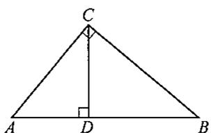

---

### 2 (练习题)

**题目**: 2. 如图，在  $\triangle ABC$  中， $\angle ACB = 90^{\circ}$ ， $D$  为  $AB$  的中点，写出图中相等的线段：

---

### 3 (练习题)

**题目**: 3. 如图，在  $\triangle ABC$  中， $\angle ACB = 90^\circ$ ， $D$  为  $AB$  的中点，点  $E$  在  $CD$  上， $CE = BC$ ，若  $\angle A = 20^\circ$  则  $\angle EBD$  的度数为

---

### 4 (练习题)

**题目**: 4. 如图, 在  $\triangle ABC$  中,  $\angle ACB = 90^\circ$ ,  $\angle A = 35^\circ$ ,  $CD \perp AB$  于点  $D$ ,  $E$  是  $AC$  的中点, 则  $\angle EDB$  的度数为

---

### 5 (练习题)

**题目**: 5. 如图, 已知: 在  $\triangle ABC$  中,  $\angle ACB = 90^\circ$ ,  $D$  是  $AB$  的中点, 延长  $BC$  到点  $E$ , 使  $CE = AD$ , 连接  $DE$ . 求证：  $\angle B = 2\angle E$

---

### 6 (练习题)

**题目**: 6. 如图, 已知: 在  $\triangle ABC$  中,  $\angle C = 2\angle B$ ,  $AD \perp AB$  交  $BC$  于点  $D$ . 求证：  $BD = 2AC$

---

### 7 (练习题)

**题目**: 7. 如图, 在  $\triangle ABC$  中,  $\angle ACB = 90^\circ$ ,  $M$  是  $AB$  的中点,  $E, F$  分别是  $AC, BC$  延长线上的点, 且  $CE = CF = \frac{1}{2} AB$ . 求  $\angle EMF$  的度数.

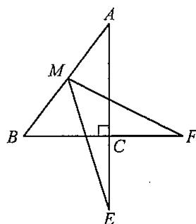

---

### 8 (练习题)

**题目**: 8. 如图, 已知:  $AE$ ,  $BD$  相交于点  $C$ ,  $AB = AC$ ,  $DC = DE$ ,  $F$ ,  $G$ ,  $H$  分别是  $AD$ ,  $BC$ ,  $CE$  的中点. 求证：  $FG = FH$

---

### 9 (练习题)

**题目**: 9. 如图, 已知: 在  $\triangle ABC$  中,  $\angle ACB = 90^\circ$ ,  $AB$  的垂直平分线  $DE$  交  $\angle ACB$  的平分线于点  $E$ , 交  $AB$  于点  $D$ . 求证：  $CD = ED$

---

### 10 (练习题)

**题目**: 10. 如图, 已知: 在  $\triangle ABC$  中, 边  $AB$  上的高  $CF$  、边  $BC$  上的高  $AD$  与边  $CA$  上的高  $BE$  交于点  $H$ ,  $N$ ,  $M$  分别为  $AH$  和  $BC$  的中点. 求证:  $MN$  是线段  $EF$  的中垂线

---

### 1 (练习题)

**题目**: 1. 如图, 已知: 在  $\triangle ABC$  中,  $BD \perp AC$  于点  $D$ ,  $CE \perp AB$  于点  $E$ , 且  $BD = CE$ . 求证：(1)  $\triangle EBC \cong \triangle DCB$ ；(2)  $DE \parallel BC$ .

---

### 2 (练习题)

**题目**: 2. 如图, 已知:  $BE \perp AC$  于点  $E$ ,  $CF \perp AB$  于点  $F$ , 且  $BE = CF$ ,  $BE$ ,  $CF$  交于点  $D$ . 求证:  $AD$  平分  $\angle BAC$ .

---

## 22.2 角平分线

### 2 (练习题)

**题目**: 2. 如图, 已知:  $BE \perp AC$  于点  $E$ ,  $CF \perp AB$  于点  $F$ , 且  $BE = CF$ ,  $BE$ ,  $CF$  交于点  $D$ . 求证:  $AD$  平分  $\angle BAC$ .

---

### 3 (练习题)

**题目**: 3. 如图,  $AD \parallel BC$ ,  $\angle A = 90^\circ$ ,  $E$  是  $AB$  上的一点,  $\angle EDC = \angle ECD$ ,  $AE = BC$ . 请判断  $\triangle DEC$  的形状, 并证明.

---

### 4 (练习题)

**题目**: 4. 如图, 已知:  $AC$  交  $BD$  于点  $G$ ,  $AE \perp BD$  于点  $E$ ,  $CF \perp BD$  于点  $F$ ,  $AD = BC$ ,  $BE = DF$ . 求证：  $AG = CG$

---

### 5 (练习题)

**题目**: 5. 如图, 已知: 在  $\triangle ABC$  中,  $AD \perp BC$  于点  $D$ ,  $BE \perp AC$  于点  $E$ , 交  $AD$  于点  $H$ , 且  $AD = BD$ ,  $AC = BH$ . 求证：  $\angle ABC = \angle BCH$

---

### 6 (练习题)

**题目**: 6. 如图, 已知: 在 Rt $\triangle ABC$  中,  $\angle ACB = 90^\circ$ ,  $CD$  是斜边  $AB$  上的高, 在  $AB$  上截取  $AE = AC$ , 过点  $E$  作  $EF \parallel CD$ , 交  $BC$  于点  $F$ ,  $EG \perp BC$  于点  $G$ . 求证：  $DE = EG$

---

### 例1 (例题)

**题目**: 例① 如图22-5，已知：  $BN$  平分  $\angle ABC$  ，  $P$  为  $BN$  上一点，  $PD\bot BC$  于点  $D$  ，  $AB + BC = 2BD$ 求证： $\angle BAP$  与  $\angle BCP$  互补

**解答**: 证明 过点  $P$  作  $PE \perp BA$ , 交  $BA$  的延长线于点  $E$ . $\because BN$  平分  $\angle ABC, PD \perp BC, PE \perp BA,$ $\therefore PE = PD$  （角平分线上的点到这个角的两边所在直线的距离相等）. 在  $\mathrm{Rt}\triangle BEP$  和  $\mathrm{Rt}\triangle BDP$  中， $$
\begin{array}{l} \because \left\{ \begin{array}{l} P E = P D, \\ B P = B P, \end{array} \right. \\ \therefore \mathrm {R t} \triangle B E P \cong \mathrm {R t} \triangle B D P (\mathrm {H L}). \\ \therefore B E = B D. \\ \because A B + B C = 2 B D, B C = B D + D C, A B = B E - A E = B D - A E, \\ \therefore B D - A E + B D + D C = 2 B D. \\ \therefore D C = A E. \\ \end{array}
$$ 在  $\triangle APE$  和  $\triangle CPD$  中， $$
\begin{array}{r l} & {\therefore \left\{ \begin{array}{l l} {P E = P D,} \\ {\angle A E P = \angle C D P,} \\ {A E = D C,} \end{array} \right.} \end{array}
$$ $$
\therefore \triangle A P E \cong \triangle C P D (\text {S A S}).
$$ $$
\therefore \angle P A E = \angle B C P.
$$ $$
\because \angle P A E + \angle B A P = 1 8 0 ^ {\circ},
$$ $\therefore \angle BCP + \angle BAP = 180^{\circ}$  ，即  $\angle BAP$  与  $\angle BCP$  互补.

---

### 例2 (例题)

**题目**: 例② 如图22-6,已知:在Rt△ABC中，  $\angle BAC = 90^{\circ}$  ，  $AD$  是斜边BC上的高，  $BF$  平分  $\angle ABC$  ，交  $AC$  于点  $F$  ，交 $AD$  于点  $E$  ，  $EG / / BC$  交  $AC$  于点  $G$ 求证：  $AF = CG$

**解答**: 证明 过点  $F$  作  $FH \perp BC$  于点  $H$ . $\because AD$  是斜边  $BC$  上的高， $$
\therefore \angle A D C = 9 0 ^ {\circ}.
$$ $$
\therefore \angle D A C + \angle C = 1 8 0 ^ {\circ} - 9 0 ^ {\circ} = 9 0 ^ {\circ}.
$$ $$
\because \angle B A D + \angle D A C = \angle B A C = 9 0 ^ {\circ},
$$ $$
\therefore \angle B A D = \angle C.
$$ $\because BF$  平分  $\angle ABC$ $\therefore \angle ABF = \angle CBF$  （角平分线的定义）. $$
\because \angle A E F = \angle A B F + \angle B A D,
$$ $$
\angle A F E = \angle C B F + \angle C,
$$ $$
\therefore \angle A E F = \angle A F E.
$$ $$
\therefore A E = A F.
$$ $\because BF$  平分  $\angle ABC, FA \perp AB, FH \perp BC,$ $\therefore AF = FH$  （角平分线上的点到这个角的两边所在直线的距离相等）. $$
\begin{array}{l} \therefore A E = F H. \\ \because E G / / B C, \\ \therefore \angle A G E = \angle C, \angle A E G = \angle A D C = 9 0 ^ {\circ}. \\ \because F H \perp B C, \therefore \angle F H C = 9 0 ^ {\circ}. \\ \therefore \angle A E G = \angle F H C. \\ \end{array}
$$ 在  $\triangle AEG$  和  $\triangle FHC$  中， $$
\because \left\{ \begin{array}{l} \angle A E G = \angle F H C, \\ \angle A G E = \angle C, \\ A E = F H, \end{array} \right.
$$ $$
\therefore \triangle A E G \cong \triangle F H C (A A S).
$$ $$
\therefore A G = C F.
$$ $\therefore AG - FG = CF - FG$  ，即  $AF = CG$ 说明 由于  $BF$  平分  $\angle ABC$ , 且  $FA \perp AB$ , 由平分线的性质定理考虑, 过点  $F$  作  $FH \perp BC$  于点  $H$ , 可得  $AF = FH$ .

---

### 1 (练习题)

**题目**: 1.  $\angle AOB$  的平分线上一点  $M$ , 点  $M$  到  $OA$  的距离为  $1.5 \mathrm{~cm}$ , 则点  $M$  到  $OB$  的距离为

---

### 2 (练习题)

**题目**: 2. 如图， $\angle AOB = 60^{\circ}$ ， $CD \perp OA$  于点  $D$ ， $CE \perp OB$  于点  $E$ ，且  $CD = CE$ ，则  $\angle DOC$  的度数为

---

### 3 (练习题)

**题目**: 3. 如图, 在  $\triangle ABC$  中,  $\angle C = 90^\circ$ ,  $AD$  是  $\angle BAC$  的平分线,  $DE \perp AB$  于点  $E$ , 且  $DE = 3\mathrm{cm}$ ,  $BD = 5\mathrm{cm}$ , 则  $BC$  的长为 ________ cm.

---

### 4 (练习题)

**题目**: 4. 如图,  $CD$  为 Rt $\triangle ABC$  斜边上的高,  $\angle BAC$  的平分线分别交  $CD, CB$  于点  $E, F, FG \perp AB$ , 垂足为点  $G$ , 若  $CF = 3\mathrm{cm}$ , 则  $CE$  的长为

---

### 5 (练习题)

**题目**: 5. 如图, 已知  $AB, CD$  相交于点  $E$ , 过点  $E$  作  $\angle AEC$  及  $\angle AED$  的平分线  $EP$  与  $EM$  并反向延长, 则直线  $EP$  与  $EM$  的位置关系是

---

### 6 (练习题)

**题目**: 6. 如图, 在  $\triangle ABC$  中,  $\angle ACB = 90^\circ$ ,  $BE$  平分  $\angle ABC$ ,  $DE \perp AB$  于点  $D$ , 如果  $AC = 3\mathrm{cm}$ , 那么  $AE + DE$  等于( ). A.  $2 \mathrm{~cm}$ B.  $3 \mathrm{~cm}$ C.  $4 \mathrm{~cm}$ D.  $5\mathrm{\;{cm}}$

---

### 7 (练习题)

**题目**: 7. 如图, 已知  $AB = AC$ ,  $AE = AF$ ,  $BE$  与  $CF$  交于点  $D$ , 有下列结论: ①  $\triangle ABE \cong \triangle ACF$ ; ②  $\triangle BDF \cong \triangle CDE$ ; ③  $D$  在  $\angle BAC$  的平分线上. 以上结论中，正确的是（ ）. A. 只有 ① B. 只有② C. 只有①和② D. ①②③

---

### 8 (练习题)

**题目**: 8. 如图, 已知: 在 Rt $\triangle ABC$  中,  $\angle C = 90^\circ$ ,  $AC = BC$ ,  $AD$  是  $\angle A$  的平分线, 交  $CB$  于点  $D$ . 求证:  $AB = AC + CD$ .

---

### 9 (练习题)

**题目**: 9. 如图, 已知:  $\angle B = \angle C = 90^\circ$ ,  $M$  是  $BC$  的中点,  $AM$  平分  $\angle DAB$ . 求证：DM平分∠ADC.

---

## 22.2（二） 角平分线的综合运用

### 10 (练习题)

**题目**: 10. 如图, 已知:  $AD \parallel BC$ ,  $DB$  平分  $\angle ADC$ ,  $CE$  平分  $\angle BCD$ , 交  $AB$  于点  $E$ , 交  $BD$  于点  $O$ . 求证：点  $O$  到  $EB$  与  $ED$  的距离相等

---

### 11 (练习题)

**题目**: 11. 如图, 已知: 在  $\triangle ABC$  中,  $\angle CAB$  和  $\angle ABC$  的平分线  $AD$ ,  $BE$  交于点  $P$ , 连接  $CP$ . （1）求证：  $CP$  平分  $\angle ACB$ （2）如图(1)，当  $\triangle ABC$  为等边三角形时，求证：  $EP = DP$ (3) 如图(2), 当  $\triangle ABC$  不是等边三角形, 但  $\angle ACB = 60^{\circ}$  时, (2) 中的结论是否还成立? 若成立, 请证明; 若不成立, 请说明理由.

---

### 例1 (例题)

**题目**: 例① 如图22-7，已知：  $AP$  ，  $BP$  分别平分  $\angle DAB$ $\angle CBA,PE,PF$  分别垂直于  $AD,BC$  ，垂足为点  $E,F$ 求证：点  $P$  在  $EF$  的垂直平分线上

**解答**: 分析 要证明点  $P$  在  $EF$  的垂直平分线上，只需证明  $PE = PF$  即可.  $AP, BP$  分别平分  $\angle DAB, \angle CBA$  ，因此过点  $P$  作  $PG \perp AB$  ，即可得到  $PE = PG, PF = PG$  ，从而得到  $PE = PF$ . 证明 过点  $P$  作  $PG \perp AB$ , 垂足为点  $G$ . ∵AP平分∠DAB，PE⊥AD，PG⊥AB, $\therefore PE = PG$  （角平分线上的点到这个角的两边所在直线的距离相等）. 同理  $PF = PG$ $$
\therefore P E = P F.
$$ 点  $P$  在  $EF$  的垂直平分线上

---

### 例2 (例题)

**题目**: 例② 如图22-8，  $AD$  是等腰三角形ABC底边上的高，  $E,F$  为  $AD$  上两点，且 $\angle ABE = \angle EBF = \angle FBC,CF$  的延长线交AB于点  $G$ 求证：（1） $\triangle GBF$  为等腰三角形； (2)  $GE \parallel BF$ .

**解答**: 分析 本题第(2)题的证明比较困难，发现  $BE$  是  $\angle GBF$  的平分线，利用角平分线的两个定理易证  $GE$  也是  $\angle AGF$  的平分线，即在第(1)题的基础上，易证  $GE \parallel BF$ . 证明 (1)  $\because AD$  是等腰三角形  $ABC$  底边上的高， $\therefore AF$  垂直平分  $BC$ $$
\therefore F B = F C.
$$ $$
\therefore \angle F B C = \angle F C B.
$$ $$
\because \angle G F B = \angle F B C + \angle F C B,
$$ $$
\therefore \angle G F B = 2 \angle F B C.
$$ $$
\because \angle A B E = \angle E B F = \angle F B C,
$$ $$
\therefore \angle G B F = 2 \angle F B C.
$$ $$
\therefore \angle G F B = \angle G B F.
$$ $\therefore \triangle G B F$  为等腰三角形 (2) 过点  $E$  作  $EP \perp GF$  于点  $P, EQ \perp BF$  的延长线于点  $Q, ER \perp AB$  于点  $R$ . $$
\begin{array}{l} \because F B = F C, F D \perp B C, \\ \therefore \angle B F D = \angle C F D. \\ \because \angle B F D = \angle E F Q, \angle C F D = \angle E F G, \\ \therefore \angle E F Q = \angle E F G. \\ \end{array}
$$ $\therefore EP = EQ$  （角平分线上的点到这个角的两边所在直线的距离相等）. $\because BE$  平分  $\angle GBF, EQ \perp BF, ER \perp AB,$ $\therefore ER = EQ$  （角平分线上的点到这个角的两边所在直线的距离相等）. $$
\therefore E P = E R.
$$ $\therefore \angle AGF = 2\angle EGA$  （在角的内部，到角的两边所在直线距离相等的点，在这个角的平分线上）. $$
\because \angle A G F = \angle G F B + \angle G B F = 2 \angle G B F,
$$ $\therefore 2\angle EGA = 2\angle GBF$  ，即  $\angle EGA = \angle GBF$ $$
\therefore G E / / B F.
$$

---

### 1 (练习题)

**题目**: 1. 如图, 在  $\triangle ABC$  中,  $AD$  是边  $BC$  上的高,  $AE$ ,  $BF$  分别是  $\angle BAC$ ,  $\angle ABC$  的平分线,  $\angle BAC = 50^\circ$ ,  $\angle ABC = 60^\circ$ , 则  $\angle EAD + \angle ACD$  的度数为

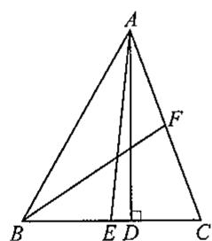

---

### 2 (练习题)

**题目**: 2. 如图, 在  $\triangle ABC$  中,  $\angle ABC$  和  $\angle ACB$  的平分线相交于点  $O$ ,  $\angle OBC + \angle OCB = 70^{\circ}$ , 则  $\angle BAO$  的度数为

---

### 3 (练习题)

**题目**: 3. 如图, 在  $\triangle ABC$  中,  $BE$ ,  $CD$  分别是  $\angle ABC$ ,  $\angle ACB$  的角平分线, 且  $BD + CE = BC$ , 则  $\angle A$  的度数为

---

### 4 (练习题)

**题目**: 4. 如图, 已知:  $BD$  平分  $\angle ABC$ ,  $AB = BC$ ,  $P$  是  $BD$  延长线上的一点,  $PF \perp AD$  于点  $F$ ,  $PG \perp DC$  于点  $G$ . 求证：  $PF = PG$

---

### 5 (练习题)

**题目**: 5. 如图, 已知: 在  $\triangle ABC$  中,  $AD$  平分  $\angle BAC$ ,  $DE \parallel AC$ ,  $EF \perp AD$  交  $BC$  的延长线于点  $F$ . 求证：  $\angle FAC = \angle B$

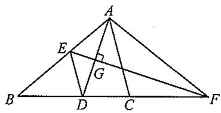

---

### 6 (练习题)

**题目**: 6. 如图, 已知:  $PB$  是  $\triangle ABC$  的外角  $MBC$  的平分线,  $AP$  平分  $\angle MAN$ ,  $PM \perp AB$ ,  $PN \perp AC$ , 点  $M$  和  $N$  分别为垂足. 求证:  $PC$  平分  $\angle BCN$ .

---

### 7 (练习题)

**题目**: 7. 如图, 在  $\triangle ABC$  中,  $OE, OF$  分别是边  $AB, AC$  的垂直平分线,  $\angle OBC, \angle OCB$  的平分线相交于点  $G$ , 判断  $OG$  与  $BC$  的位置关系, 并证明你的判断.

---

### 1 (练习题)

**题目**: 1. 如果两个直角三角形的 边和 边对应相等,那么这两个直角三角形全等 (简记为 HL).

---

### 2 (练习题)

**题目**: 2. 在直角三角形中, 若斜边上的中线长是 15 , 则斜边长为

---

### 3 (练习题)

**题目**: 3. 在等腰直角三角形中, 若斜边上的中线与斜边长的和是 8 , 则斜边长为

---

### 4 (练习题)

**题目**: 4. 在直角三角形中, 若斜边上的中线长是 6 , 斜边上的高的长是 4 , 则此三角形的面积为

---

### 5 (练习题)

**题目**: 5. 如图, 将两个全等的直角三角形的直角顶点重合, 若  $\angle AOC = 20^\circ$ ,  $\angle A = 60^\circ$ , 则  $\angle OEC$  的度数为

---

### 6 (练习题)

**题目**: 6. 如图, 已知  $\angle AOB$  和直线  $l$ , 在  $\angle AOB$  内部求作一点  $P$ , 使点  $P$  到  $OA$ ,  $OB$  的距离相等, 且点  $P$  在直线  $l$  上.

---

### 7 (练习题)

**题目**: 7. 如图, 在直线  $b$  上求作点  $P$ , 使得点  $P$  到两相交直线  $a$  和直线  $c$  的距离相等.

---

### 8 (练习题)

**题目**: 8. 如图, 已知  $\angle AOB$  和点  $M$ , 在  $\angle AOB$  内部求作点  $P$ , 使点  $P$  到  $OA$ ,  $OB$  的距离相等, 且  $OP = MP$ .

---

### 9 (练习题)

**题目**: 9. 如图, 已知:  $AC = BD$ ,  $AD \perp AC$ ,  $BD \perp BC$ . 求证：  $AD = BC$

---

### 10 (练习题)

**题目**: 10. 如图, 已知:  $BF \perp AD$ ,  $EC \perp AD$ , 垂足分别为点  $F, C$ ,  $BC = EF$ ,  $AB \parallel DE$ . 求证: (1)  $BC \parallel EF$ ; (2)  $AB = DE$ .

---

## 22.3 勾股定理

### 11 (练习题)

**题目**: 11. 如图, 在 Rt $\triangle ABC$  中, 斜边  $AB$  的中垂线  $DE$  分别交  $AB$ ,  $AC$  于点  $D$ ,  $E$ ,  $\angle ACD = 2\angle CBE$ . 求  $\angle A$  的大小.

---

### 12 (练习题)

**题目**: 12. 如图, 已知: 在  $\triangle ABC$  中,  $AD$  是  $BC$  上的高,  $CE$  是  $AB$  上的中线,  $DC = BE$ ,  $DG \perp CE$ , 垂足为点  $G$ . 求证：  $\angle AEC = 3\angle DCE.$

---

### 13 (练习题)

**题目**: 13. 如图, 已知: 在  $\triangle ABC$  中,  $AB = AC$ ,  $\angle A = 108^\circ$ ,  $BD$  平分  $\angle ABC$ , 交  $AC$  于点  $D$ . 求证:  $BC = AC + CD$ .

---

### 14 (练习题)

**题目**: 14. 如图, 在四边形  $ABCD$  中,  $AC$  平分  $\angle BAD$ , 过点  $C$  作  $CE \perp AB$  于点  $E$ , 且  $AE = \frac{1}{2} (AB + AD)$ , 求  $\angle ABC + \angle ADC$  的度数.

---

### 15 (练习题)

**题目**: 15. 如图, 已知: 在  $\triangle ABC$  中,  $AD \perp CA$  于点  $A$ , 交  $BC$  于点  $D$ . （1）若  $\angle B = 40^{\circ}$  ，  $\angle C = 20^{\circ}$  ，求证：  $CD = 2AB$ （2）若  $\angle B = 50^{\circ}$  ，  $\angle C = 25^{\circ}$  ，(1)中的结论还成立吗？ （3） $\angle B$  与  $\angle C$  满足何种数量关系时， $CD = 2AB$  恒成立？

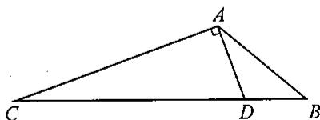

---

### 16 (练习题)

**题目**: 16. 如图, 在等边三角形  $ABC$  中,  $D, E$  分别是  $BC, AC$  上的点, 且  $AE = CD, AD$  与  $BE$  相交于点  $F, CF \perp BE$ , 求  $AF:BF$  的值.

---

### 17 (练习题)

**题目**: 17. 如图, 在  $\triangle ABC$  中,  $\angle BAC = 90^\circ$ ,  $AD \perp BC$  于点  $D$ ,  $\angle BCA$  的角平分线交  $AD$  于点  $F$ , 交  $AB$  于点  $E$ ,  $FG \parallel BC$  交  $AB$  于点  $G$ .  $AE = 4$ ,  $AB = 14$ , 求  $BG$  的长.

---

### 例1 (例题)

**题目**: 例① 如图22-9, 在  $\mathrm{Rt}\triangle ABC$  中,  $\angle ACB = 90^{\circ}$ ,  $BC = 15$ ,  $AB$  比  $AC$  大9,  $CD \perp AB$  于点  $D$ . 求  $CD$  的长.

**解答**: 分析 在  $\mathrm{Rt}\triangle ABC$  中，由  $BC = 15$  ， $AB$  比  $AC$  大9，可根据勾股定理列方程，求出  $AC$  ， $AB$  的长，再由面积法  $\frac{1}{2} AC \cdot BC = \frac{1}{2} AB \cdot CD$  ，可求出  $CD$  的长. 解 在  $\mathrm{Rt}\triangle ABC$  中， $\angle ACB = 90^{\circ}$ ， $BC = 15$ ， $AB$  比  $AC$  大 9. 设  $AC = x$  ，则  $AB = x + 9$ 由  $AC^2 +BC^2 = AB^2$  （勾股定理），得  $x^{2} + 15^{2} = (x + 9)^{2}$ 解得  $x = 8$  则  $AC = 8$  ，  $AB = 17$ $$
\begin{array}{l} \because \frac {1}{2} A C \cdot B C = \frac {1}{2} A B \cdot C D, \\ \therefore \frac {1}{2} \times 8 \times 1 5 = \frac {1}{2} \times 1 7 C D. \\ \therefore C D = \frac {1 2 0}{1 7}. \\ \end{array}
$$ 所以  $CD$  的长为  $\frac{120}{17}$

---

### 例2 (例题)

**题目**: 例② 如图22-10，在长方形ABCD中，  $AB = 8$  ，  $BC = 4$  ，将长方形沿AC折叠，点  $D$  落在  $D^{\prime}$  处，求重叠部分△AFC的面积

**解答**: 解  $\because$  在长方形ABCD中，  $AB / / CD$ $$
\therefore \angle D C A = \angle B A C.
$$ 由折叠知  $\triangle ADC \cong \triangle AD'C$ $$
\therefore \angle D C A = \angle A C F.
$$ $$
\begin{array}{l} \therefore \angle B A C = \angle A C F. \\ \therefore A F = C F. \\ \end{array}
$$ 设  $AF = CF = x$  ，则  $FB = 8 - x$ 在  $\mathrm{Rt}\triangle BCF$  中，  $BF^{2} + BC^{2} = CF^{2}$  （勾股定理）， $$
\therefore (8 - x) ^ {2} + 4 ^ {2} = x ^ {2}.
$$ 解得  $x = 5$ $$
\begin{array}{l} \therefore A F = 5. \\ \therefore S _ {\triangle A F C} = \frac {1}{2} A F \cdot B C = \frac {1}{2} \times 5 \times 4 = 1 0. \\ \end{array}
$$ 所以重叠部分  $\triangle AFC$  的面积为10.

---

### 1 (练习题)

**题目**: 1. 在 Rt $\triangle ABC$  中,  $\angle C = 90^\circ$ ,  $\angle A = 45^\circ$ ,  $AB = 3$ , 则  $AC$  的长为

---

### 2 (练习题)

**题目**: 2. 在  $Rt\triangle ABC$  中,  $\angle C = 90^{\circ}$ ,  $\angle A = 30^{\circ}$ ,  $AC = 3$ , 则  $AB$  的长为

---

### 3 (练习题)

**题目**: 3. 若一个直角三角形的两边长分别是 3, 4, 则第三边的长为

---

### 4 (练习题)

**题目**: 4. 已知等边三角形的边长为 3 , 则此三角形的面积为

---

### 5 (练习题)

**题目**: 5. 如图, 在  $\triangle ABC$  中,  $\angle B = 45^\circ$ ,  $\angle C = 30^\circ$ ,  $AC = m$ , 求  $AB$  的长.

---

### 6 (练习题)

**题目**: 6. 如图, 一块直角三角形纸片, 两条直角边  $AB = 6$ ,  $BC = 8$ , 将直角边  $AB$  折叠, 使它落在斜边  $AC$  上, 折痕为  $AD$ , 求  $BD$  的长.

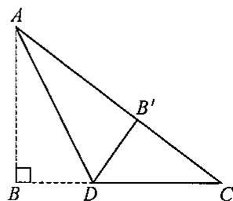

---

### 7 (练习题)

**题目**: 7. 如图, 在 Rt $\triangle ABC$  中,  $\angle ACB = 90^\circ$ ,  $\angle B = 60^\circ$ ,  $D$  是斜边  $AB$  的中点,  $BC = 2$ , 求  $\triangle ADC$  的周长.

---

### 8 (练习题)

**题目**: 8. 已知一直角三角形的周长为  $4 + \sqrt{26}$ , 斜边上的中线长为 2, 求这个直角三角形的面积.

---

### 9 (练习题)

**题目**: 9. 如图, 已知: 在 Rt $\triangle ABC$  中,  $\angle ACB = 90^\circ$ ,  $D, E$  分别是边  $BC, AC$  上任意的点. 求证:  $AD^2 + BE^2 = AB^2 + DE^2$ .

---

### 10 (练习题)

**题目**: 10. 如图, 已知: 在 Rt $\triangle ABC$  中,  $\angle BAC = 90^\circ$ ,  $AB = AC$ ,  $E$ ,  $F$  是  $BC$  上的两点, 且  $\angle EAF = 45^\circ$ . 求证：  $BE^{2} + CF^{2} = EF^{2}$

---

### 例1 (例题)

**题目**: 例① 如图22-11, 直线  $MN$  是沿南北方向的一条公路, 某施工队在公路的点  $A$  测得北偏西  $30^{\circ}$  的方向上有一栋别墅  $C$ , 朝正北方向走了  $400 \mathrm{~m}$  到达点  $B$  后, 测得别墅  $C$  在北偏西  $75^{\circ}$  的方向上. 如果要从别墅  $C$  修一条通向  $MN$  的最短的小路, 请你求出这条小路的长.

**解答**: 解 过点  $B$  作  $BD \perp AC$  于点  $D$ , 过点  $C$  作  $CE \perp MN$  于点  $E$ , 取  $AB$  中点  $F$ , 连接  $DF$ . $$
\begin{array}{l} \because \angle B A C = 3 0 ^ {\circ}, \angle C B E = 7 5 ^ {\circ}, \\ \therefore \angle B C A = \angle C B E - \angle B A C = 4 5 ^ {\circ}. \\ \end{array}
$$ 在Rt△ABD中， $$
\begin{array}{l} \because \angle A D B = 9 0 ^ {\circ}, \angle B A C = 3 0 ^ {\circ}, \\ \therefore \angle A B D = 6 0 ^ {\circ}. \\ \end{array}
$$ $\because F$  是  $AB$  的中点， $$
\begin{array}{l} \therefore D F = B F = A F. \\ \therefore \angle B D F = \angle A B D = 6 0 ^ {\circ}. \\ \therefore \angle B F D = 6 0 ^ {\circ} = \angle B D F. \\ \end{array}
$$ $\therefore BD = BF = \frac{1}{2} AB = 200, AD = \sqrt{AB^2 - BD^2} = 200\sqrt{3}$  （勾股定理）. 在  $\mathrm{Rt}\triangle CBD$  中， $$
\begin{array}{l} \because \angle B D C = 9 0 ^ {\circ}, \angle B C A = 4 5 ^ {\circ}, \\ \therefore \angle C B D = 4 5 ^ {\circ} = \angle B C A. \\ \therefore C D = B D = 2 0 0. \\ \therefore A C = A D + C D = 2 0 0 \sqrt {3} + 2 0 0. \\ \end{array}
$$

---

### 例1 (例题)

**题目**: 例① 如图22-11, 直线  $MN$  是沿南北方向的一条公路, 某施工队在公路的点  $A$  测得北偏西  $30^{\circ}$  的方向上有一栋别墅  $C$ , 朝正北方向走了  $400 \mathrm{~m}$  到达点  $B$  后, 测得别墅  $C$  在北偏西  $75^{\circ}$  的方向上. 如果要从别墅  $C$  修一条通向  $MN$  的最短的小路, 请你求出这条小路的长.

**解答**: 解 过点  $B$  作  $BD \perp AC$  于点  $D$ , 过点  $C$  作  $CE \perp MN$  于点  $E$ , 取  $AB$  中点  $F$ , 连接  $DF$ . $$
\begin{array}{l} \because \angle B A C = 3 0 ^ {\circ}, \angle C B E = 7 5 ^ {\circ}, \\ \therefore \angle B C A = \angle C B E - \angle B A C = 4 5 ^ {\circ}. \\ \end{array}
$$ 在Rt△ABD中， $$
\begin{array}{l} \because \angle A D B = 9 0 ^ {\circ}, \angle B A C = 3 0 ^ {\circ}, \\ \therefore \angle A B D = 6 0 ^ {\circ}. \\ \end{array}
$$ $\because F$  是  $AB$  的中点， $$
\begin{array}{l} \therefore D F = B F = A F. \\ \therefore \angle B D F = \angle A B D = 6 0 ^ {\circ}. \\ \therefore \angle B F D = 6 0 ^ {\circ} = \angle B D F. \\ \end{array}
$$ $\therefore BD = BF = \frac{1}{2} AB = 200, AD = \sqrt{AB^2 - BD^2} = 200\sqrt{3}$  （勾股定理）. 在  $\mathrm{Rt}\triangle CBD$  中， $$
\begin{array}{l} \because \angle B D C = 9 0 ^ {\circ}, \angle B C A = 4 5 ^ {\circ}, \\ \therefore \angle C B D = 4 5 ^ {\circ} = \angle B C A. \\ \therefore C D = B D = 2 0 0. \\ \therefore A C = A D + C D = 2 0 0 \sqrt {3} + 2 0 0. \\ \end{array}
$$ 在Rt△ACE中， $$
\because \angle A E C = 9 0 ^ {\circ}, \angle C A E = 3 0 ^ {\circ},
$$ $\therefore$  同理可得  $CE = \frac{1}{2} AC = \frac{1}{2} (200\sqrt{3} + 200) = 100\sqrt{3} + 100.$ 答：这条小路长为  $(100\sqrt{3} + 100)\mathrm{m}$ 说明 这是个实际应用的问题, 从别墅  $C$  修一条通向  $MN$  的最短的小路的长度即为点  $C$  到直线  $MN$  的垂线段  $CE$  的长度; 解决此问题关键是建立正确的数学模型, 再综合利用直角三角形的有关性质和勾股定理进行计算.

---

### 例2 (例题)

**题目**: 例② 如图22-12, 公路  $MN$  和公路  $PQ$  在点  $P$  处交汇, 且  $\angle QPN = 30^{\circ}$ , 点  $A$  处有一所中学,  $AP = 160\mathrm{m}$ , 假设拖拉机行驶时, 周围  $100\mathrm{m}$  以内会受到噪声的影响, 那么拖拉机在公路  $MN$  上沿  $PN$  方向行驶时, 学校是否会受到噪声影响? 请说明理由. 如果受影响, 已知拖拉机的速度为  $18\mathrm{km/h}$ , 那么学校受影响的时间为多少秒?

**解答**: 解 作  $AD \perp BC$  于点  $D$ , 取  $AP$  中点  $E$ , 连接  $DE$ , 以  $A$  为圆心,  $100\mathrm{m}$  为半径画弧交直线  $MN$  于点  $B, C$ , 连接  $AB, AC$ . 在Rt△ADP中， $$
\because \angle A D P = 9 0 ^ {\circ}, \angle A P D = 3 0 ^ {\circ},
$$ $$
\therefore \angle P A D = 6 0 ^ {\circ}.
$$ $\because E$  是  $AP$  的中点， $$
\therefore D E = A E = P E.
$$ $$
\therefore \angle E D A = \angle P A D = 6 0 ^ {\circ}.
$$ $$
\therefore \angle A E D = 6 0 ^ {\circ} = \angle E D A.
$$ $$
\therefore A D = A E = \frac {1}{2} A P = 8 0 <   1 0 0.
$$ 所以学校会受影响. $$
\because A B = A C, A D \perp B C,
$$ $\therefore BC = 2BD$  （等腰三角形三线合一）. 在Rt△ABD中， $$
\because \angle A D B = 9 0 ^ {\circ}, A D = 8 0, A B = 1 0 0,
$$ $\therefore BD = \sqrt{AB^2 - AD^2} = 60$  （勾股定理）. $$
\therefore B C = 2 B D = 1 2 0.
$$ $$
\because 1 8 \mathrm {k m} / \mathrm {h} = 5 \mathrm {m} / \mathrm {s},
$$ $$
\therefore 1 2 0 \div 5 = 2 4.
$$ 答：学校会受拖拉机的影响，其受影响的时间为  $24\mathrm{s}$

---

### 1 (练习题)

**题目**: 1. 若一个三角形的三个内角之比为  $1:2:3$ ，则这三个角所对的边之比为

---

### 2 (练习题)

**题目**: 2. 已知直角三角形的三边长为连续偶数，则此三角形的周长为

---

### 3 (练习题)

**题目**: 3. 已知等腰三角形  $ABC$  的底边  $BC$  上有一点  $D, AD = 13, BD = 21, BC = 32$ , 则  $AC$  的长为

---

### 4 (练习题)

**题目**: 4. 如图, 在 Rt $\triangle ABC$  中,  $\angle C = 90^\circ$ ,  $AD$  平分  $\angle BAC$ ,  $AB = 5$ ,  $AC = 3$ . （1）求  $BC$  的长； (2) 把  $\triangle ACD$  沿直线  $AD$  折叠, 点  $C$  落在点  $E$  处, 求  $DE$  的长.

---

### 5 (练习题)

**题目**: 5. 如图, 在 Rt $\triangle ABC$  中,  $\angle ACB = 90^\circ$ , 点  $D$  是  $AB$  的中点, 点  $E$  在  $AC$  上, 点  $E, D, F$  在一条直线上, 且  $ED = FD$ . （1）求证：  $CB\bot FB$ (2) 若  $EF \perp CD$ , 且  $AC = 4$ ,  $CB = 2$ , 求  $CE$  的长.

---

### 6 (练习题)

**题目**: 6. 如图, 一架梯子  $AB$  长  $25 \mathrm{~m}$ , 斜靠在一面墙上, 梯子底端离墙  $7 \mathrm{~m}$ . （1）这个梯子的顶端距地面有多高？ (2) 如果梯子的顶端下滑了  $4 \mathrm{~m}$ , 那么梯子的底端在水平方向滑动了几米? (3) 当梯子的顶端下滑的距离与梯子的底端水平滑动的距离相等时, 这时梯子的顶端距地面有多高?

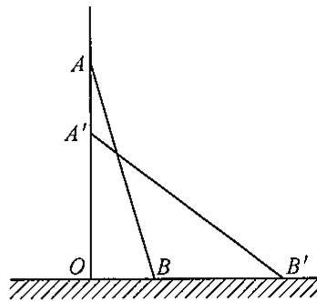

---

### 7 (练习题)

**题目**: 7. 如图, 某幼儿园为了加强安全管理, 决定将园内的滑梯的倾角由  $45^{\circ}$  降为  $30^{\circ}$ , 已知原滑梯  $AB$  的长为  $5 \mathrm{~m}$ , 点  $D, B, C$  在同一水平地面上. （1）改善后滑梯会加长多少（精确到  $0.01\mathrm{m}$  ？ (2) 若滑梯的正前方能有  $3 \mathrm{~m}$  长的空地就能保证安全, 原滑梯的前方有  $6 \mathrm{~m}$  长的空地, 像这样改造是否可行? 说明理由. (参考数据:  $\sqrt{2} = 1.414, \sqrt{3} = 1.732, \sqrt{6} = 2.449$ )

---

### 8 (练习题)

**题目**: 8. 如图, 在气象站台  $A$  的正西方向  $240 \mathrm{~km}$  的  $B$  处有一台风中心, 该台风中心以  $20 \mathrm{~km} / \mathrm{h}$  的速度沿北偏东  $60^{\circ}$  的  $BD$  方向移动, 在距离台风中心  $130 \mathrm{~km}$  内的地方都要受到其影响. （1）台风中心在移动过程中，与气象台  $A$  的最短距离是多少？ （2）台风中心在移动过程中，气象台受台风影响的时间会持续多长？

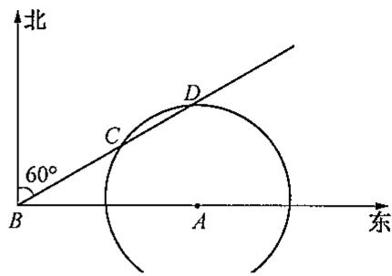

---

### 9 (练习题)

**题目**: 9. 如图,  $A$  和  $B$  两个村子在河边  $CD$  的同侧, 两村到河边的距离分别为  $AC = 1\mathrm{km}$ ,  $BD = 3\mathrm{km}$ ,  $CD = 3\mathrm{km}$ . 现在河边  $CD$  建一座水厂, 建成后的水厂可以直接向  $A$  和  $B$  两村送水, 也可以先将水送至一村再转送至另一村. 铺设水管费用为每千米2万元, 试在河边  $CD$  选择水厂位置, 使铺设水管费用最省, 并求出铺设水管的总费用(精确到0.01万元).

---

### 1 (练习题)

**题目**: 1. 若直角三角形两直角边的比是  $3:4$ , 斜边长是 20, 则它的面积为

---

### 2 (练习题)

**题目**: 2. 等边三角形的边长为 2 , 则它的面积为

---

### 3 (练习题)

**题目**: 3. 直角三角形周长为  $12\mathrm{cm}$ ，斜边长为  $5\mathrm{cm}$ ，则它的面积为

---

### 4 (练习题)

**题目**: 4. 若直角三角形的三边长分别是  $n + 1, n + 2, n + 3$ ，则  $n$  的值为 _______.

---

### 5 (练习题)

**题目**: 5. 等腰三角形的两边长为 4 和 2, 则底边上的高是 , 面积是

---

### 6 (练习题)

**题目**: 6. 一个直角三角形一条直角边为  $16\mathrm{cm}$  ，它所对的角为  $60^{\circ}$  ，则斜边上的高为

---

### 7 (练习题)

**题目**: 7. 能成为直角三角形三边长的三个正整数叫作勾股数（如3，4，5），请再写出一组不同的勾股数

---

### 8 (练习题)

**题目**: 8. 如图, 图中数字是所在正方形的面积, 则字母  $B$  所代表的正方形的面积是

---

### 9 (练习题)

**题目**: 9. 某直角三角形两直角边长的比为  $2:1$ , 斜边长  $10 \mathrm{~cm}$ , 则该直角三角形的面积为

---

### 10 (练习题)

**题目**: 10.如图，长方体长、宽、高分别为  $4\mathrm{cm}$  ，  $3\mathrm{cm}$  ，  $12\mathrm{cm}$  ，则  $BD_{1}$  的长为

---

### 11 (练习题)

**题目**: 11. 四个三角形的边长分别是 ① 3, 4, 5; ② 4, 7, 8  $\frac{1}{2}$ ; ③ 7, 24, 25; ④  $3\frac{1}{2}$ ,  $4\frac{1}{2}$ ,  $5\frac{1}{2}$ . 其中是直角三角形的为（ ）. A. ①② B. ①③ C. ①④ D. ①②③

---

### 12 (练习题)

**题目**: 12. 如果线段  $a, b, c$  能组成直角三角形，则它们的比可以是（ ）. A.  $1 : 2 : 4$ B.  $1 : 3 : 5$ C.  $3 : 4 : 7$ D.  $5 : {12} : {13}$

---

### 13 (练习题)

**题目**: 13. 小明想做一个直角三角形的木架，以下四组木棒中，刚好能够做成的一组是（ ）. A.  $9 \mathrm{~cm}, 12 \mathrm{~cm}, 15 \mathrm{~cm}$ B.  $7 \mathrm{~cm}, 12 \mathrm{~cm}, 13 \mathrm{~cm}$ C.  $12 \mathrm{~cm}, 15 \mathrm{~cm}, 17 \mathrm{~cm}$ D.  $3 \mathrm{~cm}, 4 \mathrm{~cm}, 7 \mathrm{~cm}$

---

### 14 (练习题)

**题目**: 14. 小明想知道学校旗杆的高度，他发现旗杆上的绳子垂到地面还多  $1\mathrm{m}$ ，当他把绳子的下端拉开  $5\mathrm{m}$  后，发现下端刚好接触地面，则旗杆的高是（ ）. A.  $8 \mathrm{~m}$ B.  $10 \mathrm{~m}$ C.  $12 \mathrm{~m}$ D.  $14 \mathrm{~m}$

---

## 22.3(三) 勾股定理的逆定理及其证明

### 15 (练习题)

**题目**: 15. 若直角三角形的两条直角边长分别为  $3\mathrm{cm}, 4\mathrm{cm}$ ，则斜边上的高为（ ）. A.  $\frac{5}{2} \mathrm{~cm}$ B.  $\frac{5}{12} \mathrm{~cm}$ C.  $5\mathrm{\;{cm}}$ D.  $\frac{12}{5} \mathrm{~cm}$

---

### 16 (练习题)

**题目**: 16. 直角三角形斜边的平方等于两直角边乘积的2倍，则这个三角形的最小锐角为（ ）. A.  $15^{\circ}$ B.  $30^{\circ}$ C.  $45^{\circ}$ D.  $75^{\circ}$

---

### 17 (练习题)

**题目**: 17. 在  $\triangle ABC$  中， $\angle C = 90^\circ$ ， $BC = a$ ， $AC = b$ ， $AB = c$ ， $a = 5$ ， $c - b = 1$ ，求  $b, c$  的长。

---

### 18 (练习题)

**题目**: 18. 甲、乙两船同时从港口  $A$  出发，甲以  $12\mathrm{~nmile/h}$  的速度向北偏东  $35^{\circ}$  航行，乙向南偏东  $55^{\circ}$  航行。 $2\mathrm{~h}$  后，甲到达  $C$  岛，乙到达  $B$  岛，若  $C$  与  $B$  相距  $40\mathrm{~nmile}$ ，则乙的速度是多少？

---

### 19 (练习题)

**题目**: 19. 如图, 在四边形  $ABCD$  中,  $\angle DAB = \angle DCB = 90^\circ$ , 对角线  $AC$  与  $BD$  相交于点  $O$ ,  $M$ ,  $N$  分别是  $BD$ ,  $AC$  的中点. （1）求证：  $MN\bot AC$ (2) 当  $AC = 8\mathrm{cm}$ ,  $BD = 10\mathrm{cm}$ , 且  $\angle AOB = 60^{\circ}$  时, 求  $OM$  的长.

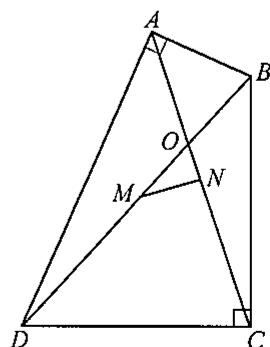

---

### 20 (练习题)

**题目**: 20. 如图，细心观察，认真分析各式，然后解答问题： $$
\begin{array}{l} (\sqrt {1}) ^ {2} + 1 = 2, S _ {1} = \frac {\sqrt {1}}{2}; \\ (\sqrt {2}) ^ {2} + 1 = 3, S _ {2} = \frac {\sqrt {2}}{2}; \\ (\sqrt {3}) ^ {2} + 1 = 4, S _ {3} = \frac {\sqrt {3}}{2}; \\ \end{array}
$$ 中 中 （1）用含有  $n$  （ $n$  是正整数)的等式表示上述变化规律； (2) 推算出  $OA_{10}$  的长； (3) 求出  $S_{1}^{2} + S_{2}^{2} + S_{3}^{2} + \dots + S_{10}^{2}$  的值.

---

### 例1 (例题)

**题目**: 例① 如图22-13,在四边形ABCD中，  $\angle B = 90^{\circ}$ $AB = 3$  ，  $BC = 4$  ，  $CD = 12$  ，  $AD = 13.$  求四边形ABCD的面积 分析 要求四边形ABCD的面积，发现此四边形不是特殊的四边形，由于  $\angle B = 90^{\circ}$ ，可以连接  $AC$ ，得到  $AC = 5$ ，在  $\triangle ADC$  中， $AC = 5$ ， $CD = 12$ ， $AD = 13$ ，由勾股定理的逆定理可判断此三角形是直角三角形，所以求四边形面积转化为求两个直角三角形的面积和.

**解答**: 解 连接  $AC$ $$
\because \angle B = 9 0 ^ {\circ}, A B = 3, B C = 4,
$$ $\therefore AC^{2} = AB^{2} + BC^{2} = 25$  （勾股定理）. $$
\therefore A C = 5.
$$ $$
\because A C ^ {2} + C D ^ {2} = 1 6 9, A D ^ {2} = 1 6 9,
$$ $$
\therefore A C ^ {2} + C D ^ {2} = A D ^ {2}.
$$ $\therefore \angle ACD = 90^{\circ}$  （勾股定理的逆定理）. $$
\therefore S _ {\text {四 边 形} A B C D} = S _ {\triangle A B C} + S _ {\triangle A C D} = \frac {1}{2} A B \cdot B C + \frac {1}{2} A C \cdot C D = 3 6.
$$

---

### 例2 (例题)

**题目**: 例② 如图22-14， $\triangle ABC$  是等边三角形， $P$  是三角形内一点， $PA = 3$ ， $PB = 4$ ， $PC = 5$ 。求  $\angle APB$  的度数。 分析 要求  $\angle APB$  的度数，在  $\triangle APB$  中很难求。根据题意， $PA = 3$ ， $PB = 4$ ， $PC = 5$ ，这三条线段的长正好可以组成直角三角形，因此可把  $\triangle ABP$  绕点  $B$  顺时针旋转  $60^{\circ}$ ，则点  $A$  与点  $C$  重合，点  $P$  到点  $D$  的位置。连接  $PD$ ，可得  $\triangle PBD$  是等边三角形， $\triangle PDC$  是以  $PC$  为斜边的直角三角形，进而可求出  $\angle BDC = \angle BDP + \angle CDP = 150^{\circ}$ 。

**解答**: 解  $\because \triangle ABC$  是等边三角形， $$
\therefore \angle A B C = 6 0 ^ {\circ}, A B = B C.
$$ 把  $\triangle ABP$  绕点  $B$  顺时针旋转  $60^{\circ}$ , 则点  $A$  与点  $C$  重合, 点  $P$  到点  $D$  的位置. 连接  $PD$ . $$
\because B P = B D, \angle P B D = 6 0 ^ {\circ},
$$ $$
\therefore \angle B P D = \angle B D P = \frac {1 8 0 ^ {\circ} - 6 0 ^ {\circ}}{2} = 6 0 ^ {\circ}.
$$ $\therefore \triangle PBD$  是等边三角形 $$
\therefore P D = P B = 4.
$$ $$
\because C D = P A = 3, P C = 5,
$$ $$
\therefore C D ^ {2} + P D ^ {2} = P C ^ {2}.
$$ $\therefore \triangle PDC$  是直角三角形，且  $\angle PDC = 90^{\circ}$  （勾股定理的逆定理）. $$
\therefore \angle B D C = \angle B D P + \angle P D C = 1 5 0 ^ {\circ}.
$$ $$
\therefore \angle A P B = \angle B D C = 1 5 0 ^ {\circ}.
$$ 说明此题在直接求  $\angle APB$  的度数不方便时，通过  $\angle APB$  绕点  $B$  顺时针旋转到  $\angle BDC$  的位置，同时把  $\angle BDC$  分成  $\angle BDP + \angle PDC$  来求.

---

### 1 (练习题)

**题目**: 1. 在  $\triangle ABC$  中, 若  $\angle A = \frac{1}{2} \angle B = \frac{1}{3} \angle C$ ,  $AC = 3\sqrt{3}$ , 则  $\angle A$  的度数为 ,  $AB$  的长为 , 面积  $S_{\triangle ABC}$  为

---

### 2 (练习题)

**题目**: 2. 已知两条线段的长分别为  $5 \mathrm{~cm}$  和  $12 \mathrm{~cm}$ , 当第三条线段的长为 ________ 时, 这三条线段能组成一个直角三角形.

---

### 3 (练习题)

**题目**: 3. 在  $\triangle ABC$  中, 点  $D$  为  $BC$  的中点,  $BD = 3$ ,  $AD = 4$ ,  $AB = 5$ , 则  $AC$  的长为

---

### 4 (练习题)

**题目**: 4. 现有两根木棒, 它们的长度分别是  $40 \mathrm{~cm}$  和  $50 \mathrm{~cm}$ , 若要钉成一个三角形木架, 其中有一个角为直角, 所需另外最短的木棒长度是

---

### 5 (练习题)

**题目**: 5. 等腰三角形的周长是  $20\mathrm{cm}$ , 底边长是  $6\mathrm{cm}$ , 则底边上的高是

---

### 6 (练习题)

**题目**: 6. 如图, 在 Rt $\triangle ABC$  中,  $\angle ACB = 90^\circ$ ,  $AC = 12$ ,  $BC = 5$ ,  $AM = AC$ ,  $BN = BC$ , 则  $MN$  的长为

---

### 7 (练习题)

**题目**: 7. 在  $\triangle ABC$  中， $AB = 2k$ ， $AC = 2k - 1$ ， $BC = 3$ ，当  $k =$  ________时， $\angle C = 90^\circ$

---

### 8 (练习题)

**题目**: 8. 下列命题中是假命题的是( ). A. 在  $\triangle ABC$  中, 若  $\angle B = \angle C - \angle A$ , 则  $\triangle ABC$  是直角三角形 B. 在  $\triangle ABC$  中, 若  $a^2 = (b + c)(b - c)$ , 则  $\triangle ABC$  是直角三角形 C. 在  $\triangle ABC$  中, 若  $\angle A: \angle B: \angle C = 3:4:5$ , 则  $\triangle ABC$  是直角三角形 D. 在  $\triangle ABC$  中, 若  $BC:AC:AB = 5:4:3$ , 则  $\triangle ABC$  是直角三角形

---

### 9 (练习题)

**题目**: 9. 若  $\triangle ABC$  的三边长  $a, b, c$  满足  $(a - b)(a^2 + b^2 - c^2) = 0$ ，则  $\triangle ABC$  是（ ）. A. 等腰三角形 B. 等边三角形 C. 等腰直角三角形 D. 等腰三角形或直角三角形

---

### 10 (练习题)

**题目**: 10. 将直角三角形的三边长扩大相同的倍数后，得到的三角形是（ ）. A. 直角三角形 B. 锐角三角形 C. 钝角三角形 D. 等腰三角形

---

### 11 (练习题)

**题目**: 11. 观察下列几组数据: ① 3, 4, 5; ② 4, 5, 6; ③ 6, 8, 10; ④ 7, 24, 25. 其中能作为直角三角形三边长的有( ). A. 1 组 B. 2 组 C. 3 组 D. 4 组

---

### 12 (练习题)

**题目**: 12. 如果  $\triangle ABC$  的三边长分别为  $a, b, c$ , 且满足  $a^2 + b^2 + c^2 + 50 = 6a + 8b + 10c$ , 判断  $\triangle ABC$  的形状.

---

## 22.3（四） 勾股定理及其逆定理的应用

### 13 (练习题)

**题目**: 13. 阅读下列解题过程： 已知  $a, b, c$  为  $\triangle ABC$  的三边长，且满足  $a^2c^2 - b^2c^2 = a^4 - b^4$ ，试判定  $\triangle ABC$  的形状. 解  $\because a^2c^2 - b^2c^2 = a^4 - b^4$ ，① $$
\begin{array}{l} \therefore c ^ {2} \left(a ^ {2} - b ^ {2}\right) = \left(a ^ {2} + b ^ {2}\right) \left(a ^ {2} - b ^ {2}\right). \tag {②} \\ \therefore c ^ {2} = a ^ {2} + b ^ {2}. \quad ③ \\ \end{array}
$$ $\therefore \triangle ABC$  为直角三角形 （1）上述解题过程，从哪一步开始出现错误？请写出该步的序号 （2）错误的原因是 (3) 本题正确的结论是

---

### 14 (练习题)

**题目**: 14. 图(1)是用硬纸板做成的两个全等的直角三角形, 两直角边的长分别为  $a$  和  $b$ , 斜边长为  $c$ . 图(2)是以  $c$  为直角边的等腰直角三角形. 请你开动脑筋, 将它们拼成一个能证明勾股定理的图形. （1）画出拼成的这个图形的示意图，写出它是什么图形； （2）用这个图形证明勾股定理； (3) 假设图(1)中的直角三角形有若干个, 你能运用图(1)中所给的直角三角形拼出另一种能证明勾股定理的图形吗? 请画出拼后的示意图(无需证明).

---

### 15 (练习题)

**题目**: 15. 如图, 已知: 在正方形  $ABCD$  中,  $E$  是  $BC$  的中点,  $F$  为  $CD$  上的一点, 且  $CF = \frac{1}{4} CD$ . 求证:  $\triangle AEF$  是直角三角形.

---

### 16 (练习题)

**题目**: 16. 如图, 已知: 在 Rt $\triangle ABC$  中,  $\angle ACB = 90^\circ$ ,  $CD \perp AB$  于点  $D$ , 设  $AC = b$ ,  $BC = a$ ,  $AB = c$ ,  $CD = h$ . 求证：(1)  $c + h > a + b$ （2）以  $a + b, c + h, h$  为三边可构成一个直角三角形

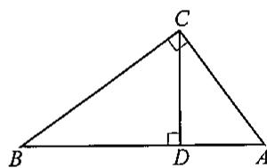

---

### 例1 (例题)

**题目**: 例① 将一副三角板如图22-15放置，其中  $\angle C = \angle EDB = 90^{\circ}$ ， $\angle A = 45^{\circ}$ ， $\angle E = 30^{\circ}$ ， $AB = DE = 6$ 。求重叠部分四边形  $DBCF$  的面积。 分析 要求四边形  $D B C F$  的面积, 发现  $\triangle A B C$  的面积减去  $\triangle A D F$  的面积较方便, 而且这两个三角形都是等腰直角三角形, 由题意可知  $\triangle A B C$  的面积易求, 而对于  $\triangle A D F$  的面积只要求出  $A D$  长即可, 在 Rt $\triangle B D E$  中, 由  $\angle E = 30^{\circ}$ ,  $D E = 6$ , 可求  $B D = 2 \sqrt{3}$ , 因此  $A D = 6 - 2 \sqrt{3}$ , 从而  $\triangle A D F$  的面积可求.

**解答**: 解 取  $BE$  的中点  $M$ , 连接  $DM$ . 在Rt△BDE中， $$
\begin{array}{l} \because \angle E D B = 9 0 ^ {\circ}, \angle E = 3 0 ^ {\circ}, \\ \therefore \angle E B D = 6 0 ^ {\circ}. \\ \end{array}
$$ $\because M$  是  $BE$  的中点， $$
\therefore D M = B M = E M.
$$ $$
\therefore \angle M D B = \angle E B D = 6 0 ^ {\circ}.
$$ $$
\therefore \angle B M D = 6 0 ^ {\circ}.
$$ $$
\therefore B D = B M = \frac {1}{2} B E.
$$ $\because EB^{2} = BD^{2} + ED^{2}$  （勾股定理）， $$
\therefore B D = \frac {\sqrt {3}}{3} E D = 2 \sqrt {3}.
$$ 在Rt△ABC中， $$
\begin{array}{l} \because \angle C = 9 0 ^ {\circ}, \angle A = 4 5 ^ {\circ}, \\ \therefore \angle A B C = 4 5 ^ {\circ}. \\ \therefore A C = B C. \\ \because A B ^ {2} = A C ^ {2} + B C ^ {2}. \\ \therefore A C = B C = \frac {\sqrt {2}}{2} A B = 3 \sqrt {2}. \\ \end{array}
$$ $$
\therefore S _ {\triangle A B C} = \frac {1}{2} \cdot A C \cdot B C = 9.
$$ $$
\because \angle A = 4 5 ^ {\circ}, \angle E D B = 9 0 ^ {\circ},
$$ $$
\therefore \angle A F D = 9 0 ^ {\circ} - 4 5 ^ {\circ} = 4 5 ^ {\circ}.
$$ $$
\therefore D F = A D = 6 - 2 \sqrt {3}.
$$ $$
\therefore S _ {\triangle A D F} = \frac {1}{2} \cdot A D \cdot D F = \frac {1}{2} (6 - 2 \sqrt {3}) ^ {2} = 2 4 - 1 2 \sqrt {3}.
$$ $$
\therefore S _ {\text {四 边 形} D B C F} = S _ {\triangle A B C} - S _ {\triangle A D F} = 1 2 \sqrt {3} - 1 5.
$$

---

### 例2 (例题)

**题目**: 例② 如图22-16，  $P$  是凸四边形ABCD内一点，过点  $P$  作  $AB, BC, CD, DA$  的垂线，垂足分别为点  $E, F, G, H$  ，已知  $AH = 3, HD = 4, DG = 1, GC = 5, CF = 6, FB = 4$  ，且  $BE - AE = 1$  . 求四边形ABCD的周长. 解 连接  $PA, PB, PC, PD$ . $$
\because P E \perp A B,
$$ $$
\therefore \angle A E P = \angle B E P = 9 0 ^ {\circ}.
$$ $$
\therefore P A ^ {2} = A E ^ {2} + P E ^ {2}, P B ^ {2} = P E ^ {2} + B E ^ {2} (\text {勾 股 定 理}).
$$ $$
\therefore P B ^ {2} - P A ^ {2} = B E ^ {2} - A E ^ {2}.
$$ 同理  $PA^2 -PD^2 = AH^2 -HD^2$ $$
P D ^ {2} - P C ^ {2} = D G ^ {2} - G C ^ {2},
$$ $$
P C ^ {2} - P B ^ {2} = C F ^ {2} - F B ^ {2}.
$$ $$
\therefore B E ^ {2} - A E ^ {2} + A H ^ {2} - H D ^ {2} + D G ^ {2} - G C ^ {2} + C F ^ {2} - F B ^ {2} = 0.
$$ $$
\because A H = 3, H D = 4, D G = 1, G C = 5, C F = 6, F B = 4, \text {且} B E - A E = 1,
$$ $$
\therefore (B E + A E) (B E - A E) = 1 1.
$$ $$
\therefore B E + A E = 1 1.
$$ $$
\therefore \text {四 边 形} A B C D \text {的 周 长} = A B + B C + C D + D A = 3 4.
$$

---

### 1 (练习题)

**题目**: 1. 在直角三角形中，以直角边为边长的两个正方形的面积分别为36和64，则以斜边为边长的正方形的面积为

---

### 2 (练习题)

**题目**: 2. 在  $\triangle ABC$  中， $\angle C = 90^\circ$ ，若  $AB = 5$ ，则  $AB^2 + AC^2 + BC^2$  的值为 _______.

---

### 3 (练习题)

**题目**: 3. 一根旗杆在离地面  $9\mathrm{m}$  处断裂(但仍相连), 旗杆顶部落在离旗杆底部  $12\mathrm{m}$  处, 则旗杆折断之前的长度为

---

### 4 (练习题)

**题目**: 4. 如果梯子的底端离建筑物  $8\mathrm{m}$ ，那么  $17\mathrm{m}$  长的梯子可以到达建筑物的高度是

---

### 5 (练习题)

**题目**: 5. 若直角三角形的两边长为 12 和 5, 则以第三边为边长的等边三角形的面积是

---

### 6 (练习题)

**题目**: 6. 在  $\triangle ABC$  中， $AB = 15, AC = 13$  ，边  $BC$  上的高  $AD = 12$  ，则  $\triangle ABC$  的周长为

---

### 7 (练习题)

**题目**: 7. 已知在  $\mathrm{Rt}\triangle ABC$  中， $\angle C = 90^\circ$ ，若  $BC + AC = 14$ ， $AB = 10$ ，则  $\mathrm{Rt}\triangle ABC$  的面积是（ ）. A. 24 B. 36 C. 48 D. 60

---

### 8 (练习题)

**题目**: 8. 等腰三角形底边上的高为 6, 周长为 36, 则三角形的面积为 ( ). A. 56 B. 48 C. 40 D. 32

---

### 9 (练习题)

**题目**: 9. 若直角三角形一直角边的长为 9, 另两边为连续自然数, 则此三角形的周长为 ( ). A. 121 B. 120 C. 90 D. 不能确定

---

### 10 (练习题)

**题目**: 10. 放学以后, 小红和小颖从学校分手, 分别沿东南方向和西南方向回家, 若小红和小颖行走的速度都是  $40 \mathrm{~m} / \mathrm{min}$ , 小红用  $15 \mathrm{~min}$  到家, 小颖用  $20 \mathrm{~min}$  到家, 则小红和小颖家的直线距离为 ( ). A.  $600 \mathrm{~m}$ B.  $800 \mathrm{~m}$ C.  $1000 \mathrm{~m}$

---

### 10 (练习题)

**题目**: 10. 放学以后, 小红和小颖从学校分手, 分别沿东南方向和西南方向回家, 若小红和小颖行走的速度都是  $40 \mathrm{~m} / \mathrm{min}$ , 小红用  $15 \mathrm{~min}$  到家, 小颖用  $20 \mathrm{~min}$  到家, 则小红和小颖家的直线距离为 ( ). A.  $600 \mathrm{~m}$ B.  $800 \mathrm{~m}$ C.  $1000 \mathrm{~m}$ D. 不能确定

---

### 11 (练习题)

**题目**: 11. 观察下列几组数据：①  $m^2 + n^2$ ， $2mn$ ， $m^2 - n^2$ （ $m > n > 0$ ）；② 三边长之比为  $1: 2: 3$ ；③  $\triangle ABC$  的三边长为  $a$ ， $b$ ， $c$ ，满足  $a^2 - b^2 = c^2$ 。其中能作为直角三角形三边长的有（ ）。 A. 1组 B. 2 组 C. 3 组 D. 0 组

---

### 12 (练习题)

**题目**: 12. 如图, 公路上  $A, B$  两点相距  $25 \mathrm{~km}, C, D$  为两村庄,  $DA \perp AB$  于点  $A, CB \perp AB$  于点  $B$ , 已知  $DA = 15 \mathrm{~km}, CB = 10 \mathrm{~km}$ , 现在要在公路  $AB$  上建一车站  $E$ . （1）若使得  $C, D$  两村到  $E$  站的距离相等， $E$  站建在离  $A$  站多少千米处？ （2）若使得  $C, D$  两村到  $E$  站的距离和最短， $E$  站建在离  $A$  站多少千米处？

---

### 13 (练习题)

**题目**: 13. 如图, 将一个边长分别为 4, 8 的矩形纸片  $ABCD$  折叠, 使点  $C$  与点  $A$  重合, 则  $EF$  的长是多少?

---

### 14 (练习题)

**题目**: 14. 如图, 在四边形  $ABCD$  中,  $AB = BC = 2$ ,  $CD = 3$ ,  $DA = 1$ , 且  $\angle B = 90^\circ$ , 求  $\angle DAB$  的度数.

---

### 15 (练习题)

**题目**: 15. 如图, 在  $\triangle ABC$  中,  $AB = 3$ ,  $AC = 4$ ,  $BC = 5$ , 现将它折叠, 使点  $C$  和点  $B$  重合. （1）画出折痕  $DE$ (2) 求出折痕  $DE$  的长.

---

### 16 (练习题)

**题目**: 16. 如图, 在 Rt $\triangle ABC$  中,  $\angle B = 90^\circ$ ,  $AB = BC$ ,  $AD$  是边  $BC$  上的中线,  $EF$  是  $AD$  的垂直平分线, 交  $AB$  于点  $E$ , 交  $AC$  于点  $F$ . 求  $AE:BE$  的值.

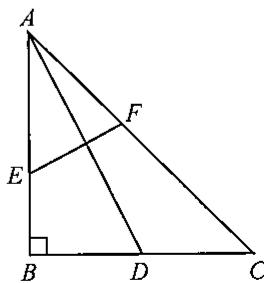

---

### 17 (练习题)

**题目**: 17. 如图(1)，分别以  $\mathrm{Rt}\triangle ABC$  三边为直径向外作三个半圆，其面积分别用  $S_{1}, S_{2}, S_{3}$  表示，则不难证明  $S_{1} = S_{2} + S_{3}$ . 问题1：如图(2)，分别以  $\mathrm{Rt}\triangle ABC$  三边为边向外作三个正方形，其面积分别用  $S_{1}, S_{2}, S_{3}$  表示，那么  $S_{1}, S_{2}, S_{3}$  之间有什么关系（不必证明）？ 问题2：如图(3)，分别以  $\mathrm{Rt}\triangle ABC$  三边为边向外作三个正三角形，其面积分别用  $S_{1}, S_{2}, S_{3}$  表示，请你确定  $S_{1}, S_{2}, S_{3}$  之间的关系并加以证明； 问题3：若分别以  $\mathrm{Rt}\triangle ABC$  三边为边向外作三个正  $n$  边形，其面积分别用  $S_{1}, S_{2}, S_{3}$  表示，请你猜想  $S_{1}, S_{2}, S_{3}$  之间的关系.

---

### 1 (练习题)

**题目**: 1. 等腰直角三角形的斜边为2，则它的面积是

---

### 2 (练习题)

**题目**: 2. 三角形三个内角之比为  $1:2:3$  ，则这个三角形三边长之比为 （从小到大排列）.

---

### 3 (练习题)

**题目**: 3. 若一个直角三角形的两边长为 3 和 4, 则此三角形斜边上的中线长为

---

### 4 (练习题)

**题目**: 4. 如图, 所有的四边形都是正方形, 所有的三角形都是直角三角形, 其中最大正方形的边长为 7 , 则正方形  $A, B, C, D$  的面积之和为

---

### 5 (练习题)

**题目**: 5. 如图， $\angle A = 60^\circ$ ， $\angle D = \angle B = 90^\circ$ ， $AB = 2$ ， $CD = 1$ ，则四边形  $ABCD$  的周长为

---

### 6 (练习题)

**题目**: 6. 如图, 在三角形纸片  $ABC$  中,  $\angle C = 90^\circ$ ,  $\angle A = 30^\circ$ ,  $AC = 3$ , 折叠该纸片, 使点  $A$  与点  $B$  重合, 折痕与  $AB$ ,  $AC$  分别相交于点  $D$ ,  $E$ , 折痕  $DE$  的长为

---

### 7 (练习题)

**题目**: 7. 在  $\triangle ABC$  中， $\angle A = 60^\circ, CD \perp AB, BC = 2CD, AD = \sqrt{3}$ ，则  $AB$  的长为

---

### 8 (练习题)

**题目**: 8. 等腰直角三角形  $ABC$  的斜边  $BC = 4$ ,  $\triangle DBC$  为等边三角形, 那么  $A$  与  $D$  两点的距离是

---

### 9 (练习题)

**题目**: 9.  $CD$  是  $\mathrm{Rt}\triangle ABC$  斜边  $AB$  上的高，若  $AB = 1, AC:BC = 4:1$  ，则  $CD$  的长为

---

### 10 (练习题)

**题目**: 10. 在  $\triangle ABC$  中， $AB = 15$ ， $AC = 13$ ，边  $BC$  上的高  $AD = 12$ ，则  $\triangle ABC$  的面积为

---

### 11 (练习题)

**题目**: 11. 直角三角形斜边的平方等于两直角边乘积的2倍，则这个三角形的最大锐角是（ ）. A.  $15^{\circ}$ B.  $30^{\circ}$ C.  $45^{\circ}$ D.  ${75}^{ \circ  }$

---

### 12 (练习题)

**题目**: 12. 下列命题错误的是（ ）. A. 若一个三角形的两边的垂直平分线的交点在第三边上, 则该三角形一定是直角三角形 B. 三角形三边中线的交点到三角形三个顶点的距离相等 C. 三角形三个内角平分线的交点到三边距离相等 D. 等腰直角三角形斜边上的高等于斜边的一半

---

### 13 (练习题)

**题目**: 13. 五根小木棒, 其长度分别为 7, 15, 20, 24, 25, 现想把它们摆成两个直角三角形, 图中正确的是 ( ).

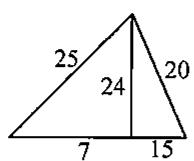

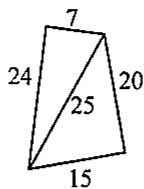

---

### 14 (练习题)

**题目**: 14. 如图, 已知  $\angle AOB$  及直线  $a$ , 在  $\angle AOB$  的内部求作点  $P$ , 使它到  $OA$ ,  $OB$  及直线  $a$  的距离相等 (用尺规作图, 不写画法).

---

### 15 (练习题)

**题目**: 15. 如图, 将矩形  $ABCD$  沿  $AE$  折叠, 使点  $D$  刚好落在边  $BC$  上的点  $F$  处,  $AB = 3$ ,  $AD = 5$ , 求  $EF$  的长.

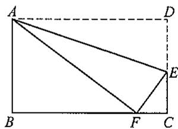

---

### 16 (练习题)

**题目**: 16. 如图, 在 Rt $\triangle ABC$  中,  $\angle C = 90^\circ$ ,  $AC = BC$ ,  $AD$  是  $\angle A$  的平分线, 交  $CB$  于点  $D$ . （1）求证：  $AB = AC + CD$ (2) 若  $AC = 3$ , 求  $BD$  的长.

---

### 17 (练习题)

**题目**: 17. 如图(1)，一架长  $4\mathrm{m}$  的梯子  $AB$  斜靠在与地面  $OM$  垂直的墙壁  $ON$  上，梯子与地面的倾斜角  $\alpha$  为  $60^{\circ}$ ，梯子顶端  $A$  沿  $NO$  下滑，同时底端  $B$  沿  $OM$  向右滑行。 （1）如图(2)，设点  $A$  下滑到点  $C$  ，点  $B$  向右滑行到点  $D$  ，并且  $AC:BD = 2:3$  ，试计算梯子顶端  $A$  沿  $NO$  下滑多少米； (2) 如图(3), 当点  $A$  下滑到点  $A'$ , 点  $B$  向右滑行到点  $B'$  时, 梯子  $AB$  的中点  $P$  也随之运动到点  $P'$ . 若  $\angle POP' = 15^\circ$ , 试求  $AA'$  的长.

---

### 18 (练习题)

**题目**: 18. 如图, 在 Rt $\triangle ABC$  中,  $\angle ACB = 90^\circ$ ,  $AC = BC$ , 点  $D$  是边  $AB$  上一点,  $AE \perp AB$ , 且  $AE = BD$ ,  $DE$  与  $AC$  相交于点  $F$ . （1）试判断  $\triangle CDE$  的形状，并证明你的结论； (2) 若  $AC = 1$  ，且  $\triangle AEF$  是等腰三角形，求  $AE$  的长度

---

### 1 (练习题)

**题目**: 1. 命题“直角三角形两条直角边的平方和等于斜边的平方”的逆命题是

---

### 2 (练习题)

**题目**: 2. 如果一个直角三角形斜边上的中线与斜边所成的锐角为  $56^{\circ}$ , 那么这个直角三角形的较小的内角度数是

---

### 3 (练习题)

**题目**: 3. 在  $\mathrm{Rt}\triangle ABC$  中， $\angle C = 90^{\circ}$ ， $AC = 6$ ， $BC = 8$ ，则  $AB$  上的高  $CD$  的长为

---

### 4 (练习题)

**题目**: 4. 在  $\mathrm{Rt}\triangle ABC$  中， $\angle C = 90^\circ$ ， $CD$  是边  $AB$  上的中线， $CD = 5$ ， $\angle A = 30^\circ$ ，那么  $BC$  的长为

---

### 5 (练习题)

**题目**: 5. 已知等腰直角三角形  $ABC$  的斜边  $BC = 16$ ,  $BD$  是  $\angle B$  的平分线,  $DE \perp BC$ , 垂足为点  $E$ , 那么  $\triangle DEC$  的周长是

---

### 6 (练习题)

**题目**: 6. 如图, 在 Rt $\triangle ABC$  中,  $\angle C = 90^\circ$ , 斜边  $AB$  的垂直平分线交边  $AB$  于点  $E$ , 交边  $BC$  于点  $D$ , 如果  $\angle B = 28^\circ$ , 那么  $\angle CAD$  的度数为

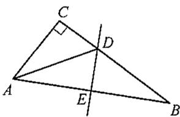

---

### 7 (练习题)

**题目**: 7. 如图, 在  $\triangle ABC$  中,  $AB = AC$ ,  $\angle A = 120^\circ$ ,  $D$  是边  $BC$  的中点,  $DE \perp AB$ , 垂足为点  $E$ , 如果  $AE = 2$ , 那么  $AB$  的长为

---

### 8 (练习题)

**题目**: 8. 如图, 已知在  $\triangle ABC$  中,  $CD$  平分  $\angle ACB$ ,  $\angle A = 2\angle B$ ,  $BC = a$ ,  $AC = b$ , 则  $AD =$  _______. (用含  $a, b$  的代数式表示)

---

### 9 (练习题)

**题目**: 9. 已知等腰三角形底边上的高为 8, 周长为 32, 则这个三角形的面积是

---

## 期末测试卷

### 1 (练习题)

**题目**: 1.  $x$  的倒数是  $\sqrt{3} - 2$ , 则  $x =$  ________.

---

### 2 (练习题)

**题目**: 2. 已知  $|2 - 3x|$  与  $(\sqrt{y + 4})^2$  互为相反数，则  $\sqrt[3]{6x - y}$  的平方根是

---

### 3 (练习题)

**题目**: 3. 当  $x =$  时， $\sqrt{x^2 + 3x}$  与  $\sqrt{x + 15}$  既是最简二次根式，又是同类二次根式。

---

### 4 (练习题)

**题目**: 4.  $x = \sqrt{22} - 1$  时, 则  $x^2 + 2x + 6$  的立方根是

---

### 5 (练习题)

**题目**: 5. 若  $\sqrt{x^2 - x^3} = -x\sqrt{1 - x}$ , 则  $x$  的取值范围是

---

### 6 (练习题)

**题目**: 6. 若关于  $x$  的方程  $x^{2} - 6x + k = 0$  没有实数根, 则  $k$  的取值范围是

---

### 7 (练习题)

**题目**: 7. 如图， $\angle AOB = 30^\circ$ ， $OB = 10$ ，在射线  $OA$  上找一点  $C$ ，使得  $\triangle BOC$  是锐角三角形，若设  $OC = x$ ，则  $x$  的取值范围是

---

### 8 (练习题)

**题目**: 8. 已知关于  $x$  的方程  $mx^{2} - (m + 2)x + m + 1 = 0$  有两个实数根, 且这两个根的平方和等于 1 , 那么  $m$  的值为

---

### 9 (练习题)

**题目**: 9. 两年前生产  $1t$  甲种药品的成本是5000元，生产  $1t$  乙种药品的成本是6000元。随着生产技术的进步，现在生产  $1t$  甲种药品的成本是3000元，生产  $1t$  乙种药品的成本是3600元，则甲药品成本的年平均下降率 ________ 乙药品成本的年平均下降率。（填“大于”“小于”或“等于”）

---

### 10 (练习题)

**题目**: 10. 一个二次项系数不为 1 的一元二次方程的两个根分别为  $x_{1} = \frac{1}{2}, x_{2} = -\frac{5}{2}$ ，请写出一个满足条件的一元二次方程

---

### 11 (练习题)

**题目**: 11. 如图,  $\angle BAC$  的平分线与  $BC$  的垂直平分线相交于点  $P$ ,  $PE \perp AB$ ,  $PF \perp AC$ , 垂足分别为点  $E, F$ . 若  $AB = 12$ ,  $AC = 6$ ,  $AP = 10$ , 则  $PE$  的长为

---

### 12 (练习题)

**题目**: 12. Rt $\triangle ABC$  中, 已知  $\angle C = 90^\circ$ , 有一点  $D$  同时满足以下三个条件: ① 在直角边  $BC$  上; ② 在  $\angle CAB$  的角平分线上; ③ 在斜边  $AB$  的垂直平分线上. 那么  $\angle B$  的度数为

---

### 13 (练习题)

**题目**: 13. 在  $\mathrm{Rt}\triangle ABC$  中， $\angle C = 90^\circ$ ， $CD \perp AB$ ， $AB = 2BC$ ，那么  $\frac{DB}{AD}$  的值是

---

### 14 (练习题)

**题目**: 14. 如图, 在  $\triangle ABC$  中,  $\angle ACB = 90^\circ$ ,  $AC = BC$ , 三角形的顶点恰在相互平行的三条直线  $l$ ,  $m, n$  上. 如果直线  $l$ ,  $m$  之间的距离为 1, 直线  $m$ ,  $n$  之间的距离为 2, 那么  $AB$  的长为

---

### 15 (练习题)

**题目**: 15. 如图, 在 Rt $\triangle ABC$  中, 已知  $\angle C = 90^\circ$ ,  $\angle B = 60^\circ$ ,  $AC = 8\sqrt{3}$ , 点  $D$  在边  $BC$  上,  $BD = 3CD$ , 点  $B$  绕点  $D$  旋转至点  $E$ , 如果点  $E$  恰好落在 Rt $\triangle ABC$  的边上, 那么  $\triangle DBE$  的面积为

---

### 16 (练习题)

**题目**: 16. 将 3596720 精确到万位是（ ）. A. 3590000 B. 3600000 C.  $360 \times 10^{4}$ D.  $3.60 \times 10^{6}$

---

### 17 (练习题)

**题目**: 17. 设  $\sqrt{x} = \frac{1}{\sqrt{a}} - \sqrt{a}$ , 则  $\sqrt{4x + x^2}$  的值为( ). A.  $a - \frac{1}{a}$ B.  $\frac{1}{a} - a$ C.  $a + \frac{1}{a}$ D. 不能确定

---

### 18 (练习题)

**题目**: 18. 若直角三角形两直角边上的中线分别是  $5, 2\sqrt{10}$ , 则斜边长为( ). A. 10 B.  $5\sqrt{2}$ C.  $\sqrt{13}$ D.  $2 \sqrt{13}$

---

### 19 (练习题)

**题目**: 19. 如图, 在  $\triangle ABC$  中,  $\angle A = 60^\circ$ ,  $AB > AC$ , 两内角的平分线  $CD$ ,  $BE$  交于点  $O$ ,  $OF$  平分  $\angle BOC$  交  $BC$  于点  $F$ , 下列说法中错误的有( ). $① \angle B O C = 1 2 0 ^ { \circ }$ $②$  连接AO，则AO平分  $\angle BAC$ $③ OD = OE$ $④ A, O, F$  三点在同一条直线上；  $⑤ BD + CE = BC.$

---

### 1 (练习题)

**题目**: 1.实数  $\sqrt{25}$  的平方根是

---

### 2 (练习题)

**题目**: 2. 设  $a, b, c$  是  $\triangle ABC$  的三边长，化简  $\sqrt{(a - b - c)^2} + \sqrt{(b - c - a)^2} + \sqrt{(c - a - b)^2}$  的结果是

---

### 3 (练习题)

**题目**: 3. 若  $x > 0, y > 0$ ，且  $x - 6y = -\sqrt{xy}$ ，则  $\frac{x - 2\sqrt{xy}}{y + 3\sqrt{xy}}$  的值为 ______.

---

### 4 (练习题)

**题目**: 4. 在实数范围内因式分解：  $3x^{2} - 7xy - 2y^{2} =$

---

### 5 (练习题)

**题目**: 5. 若关于  $x$  的方程  $mx^2 - (m + 2)x + m + 1 = 0$  有两个实数根, 且这两个根的平方和等于 1, 则  $m$  的值为

---

### 6 (练习题)

**题目**: 6. 已知三角形的两边长分别是 1 与 2, 第三边的数值是方程  $2x^{2} - 5x + 3 = 0$  的根, 则这个三角形的周长是

---

### 7 (练习题)

**题目**: 7. 关于  $x$  的方程  $kx^{2} + 2x + 3 = 2x^{2}$  有两个实数根，则  $k$  的取值范围是

---

### 8 (练习题)

**题目**: 8. 在  $\triangle ABC$  中,  $AB = \sqrt{5}$ ,  $AC = \sqrt{2}$ , 边  $BC$  上的高  $AD = 1$ , 则  $BC$  的长为

---

### 9 (练习题)

**题目**: 9. 在四边形  $ABDC$  中, 连接  $BC$ ,  $\angle A = \angle BCD = 90^\circ$ ,  $\angle D = 30^\circ$ ,  $\angle ABC = 45^\circ$ , 若  $BC = \sqrt{2}$ , 则四边形  $ABDC$  的面积为

---

### 10 (练习题)

**题目**: 10. 如图, 在  $\triangle ABC$  中,  $AB = AC$ ,  $D$ ,  $E$  是  $\triangle ABC$  内两点,  $AD$  平分  $\angle BAC$ ,  $\angle EBC = \angle E = 60^\circ$ , 若  $BE = 6$ ,  $DE = 2$ , 则  $BC$  的长为

---

### 11 (练习题)

**题目**: 11. 若三角形中有一边上的中线长恰好等于这边的长, 则这个三角形称为“好玩三角形”. 如果  $\mathrm{Rt} \triangle ABC$  是“好玩三角形”,  $\angle C = 90^\circ$ , 那么  $\frac{BC}{AC} =$

---

### 12 (练习题)

**题目**: 12. 在  $\mathrm{Rt}\triangle ABC$  中， $\angle C = 90^\circ$ ， $AC = 4\mathrm{cm}$ ， $BC = 3\mathrm{cm}$ 。现将  $\triangle ABC$  进行折叠，使顶点  $A$ ， $B$  重合，折痕分别交边  $AB$ ， $AC$  于点  $D$ ， $E$ ，则折痕  $DE =$  ________ cm.

---

### 13 (练习题)

**题目**: 13. 如图, 在 Rt $\triangle ABC$  中,  $\angle ABC = 90^\circ$ ,  $AB = BC = 2$ , 将  $\triangle ABC$  绕点  $C$  逆时针旋转  $60^\circ$ , 得到  $\triangle MNC$ , 连接  $BM$ , 那么  $BM$  的长是

---

### 14 (练习题)

**题目**: 14. 如图, 在  $\triangle ADE$  中,  $\angle E = 22^\circ$ , 延长  $AD$  至点  $B$ , 使得  $BD = AD$ , 过点  $B$  作  $BC \perp AE$ , 垂足为点  $C$ , 线段  $BC$  交边  $DE$  于点  $F$ , 且  $EF = AB$ , 则  $\angle ADE$  度数为

---

### 15 (练习题)

**题目**: 15. 如图, 在 Rt $\triangle ABC$  中,  $\angle ACB = 90^\circ$ ,  $\angle A = 30^\circ$ ,  $BC = 4$ . 以点  $C$  为旋转中心把  $\triangle ABC$  旋转到  $\triangle A'B'C$ , 使点  $B$  在边  $A'B'$  上, 边  $A'C$  与边  $AB$  相交于点  $D$ . 则  $\triangle ABC$  与  $\triangle A'B'C$  重叠部分的面积为

---

### 16 (练习题)

**题目**: 16. 如图, 在  $\triangle ABC$  中,  $\angle C = 90^\circ$ ,  $AB = 10$ ,  $AC = 6$ , 点  $M$  是边  $AB$  的中点, 若将  $\triangle ABC$  绕着点  $M$  旋转, 使点  $C$  与点  $A$  重合, 得到  $\triangle DEA$ , 点  $D$  对应点  $A$ , 点  $E$  对应点  $B$ , 且  $AE$  交  $CB$  于点  $P$ , 那么  $CP$  的长是

---

### 17 (练习题)

**题目**: 17. 下列各式中，计算错误的是（ ） A.  $\sqrt{14x} \cdot \sqrt{7x} = 7\sqrt{2} \cdot x (x \geqslant 0)$ B.  $3\sqrt{2 - y} - \sqrt{2 - y} = 3$ C.  $\sqrt{9a} +\sqrt{25a} = 8\sqrt{a}$  （  $a\geqslant 0$  ） D.  $\sqrt{60b} \div \sqrt{5b} = 2\sqrt{3}$

---

### 18 (练习题)

**题目**: 18. 已知一元二次方程  $M: ax^2 + bx + c = 0$  和  $N: cx^2 + bx + a = 0$ ，其中  $a \neq c$ . 以下结论中，错误的是（ ）. A. 如果方程  $M$  有两个不相等的实数根, 那么方程  $N$  也有两个不相等的实数根 B. 如果方程  $M$  的两根符号相同, 那么方程  $N$  的两根符号也相同 C. 如果5是方程  $M$  的一个根，那么  $\frac{1}{5}$  是方程  $N$  的一个根 D. 如果方程  $M$  和方程  $N$  有一个相同的根, 那么这个根必是  $x = 1$

---

### 19 (练习题)

**题目**: 19.下列命题的逆命题是假命题的有（ ） ① 线段垂直平分线上的任意一点到这条线段两个端点的距离相等； (2) 关于某一条直线对称的两个三角形全等; (3) 全等三角形的对应角相等; (4) 直角三角形斜边上的中线等于斜边的一半. A. 0 个 B. 1 个 C. 2 个 D. 3 个

---

### 20 (练习题)

**题目**: 20. 如图, 在 Rt $\triangle ABC$  中,  $\angle BAC = 90^\circ$ ,  $AD \perp BC$ , 垂足为点  $D$ , 点  $E$ ,  $F$  分别是  $AB$ ,  $AC$  的中点,  $\angle C = 30^\circ$ ,  $BC = 4cm$ , 则四边形  $AEDF$  的周长是( ). A.  $4 \mathrm{~cm}$ B.  $4 \sqrt{3} \mathrm{~cm}$

---

## 三、解答题（共4小题，第22题6分，第23题6分，第24题8分，第25题8分，共28分）

### 20 (练习题)

**题目**: 20. 如图, 在 Rt $\triangle ABC$  中,  $\angle BAC = 90^\circ$ ,  $AD \perp BC$ , 垂足为点  $D$ , 点  $E$ ,  $F$  分别是  $AB$ ,  $AC$  的中点,  $\angle C = 30^\circ$ ,  $BC = 4cm$ , 则四边形  $AEDF$  的周长是( ). A.  $4 \mathrm{~cm}$ B.  $4 \sqrt{3} \mathrm{~cm}$ C.  $(2 + \sqrt{3})\mathrm{cm}$ D.  $(2 + 2\sqrt{3})\mathrm{cm}$

---

### 21 (练习题)

**题目**: 21. 下列条件不一定能够判定直角三角形的是( ). A.三条边长的比是  $1:\sqrt{10}:3$ B. 三条边长分别是24，7，25 C. 三个角的度数比为  $2:3:5$ D. 有一条边等于另一条边的一半

---

### 22 (练习题)

**题目**: 22. 化简:  $\sqrt{\frac{b}{8}} - \left[a\sqrt{\frac{b}{2a^2}} - \left(\frac{b}{2a}\sqrt{\frac{a^2}{2b}} + ab^2\sqrt{\frac{8}{a^2b^3}}\right)\right] (a > 0)$ .

---

### 23 (练习题)

**题目**: 23. 已知关于  $x$  的方程  $x^{2} + 2(a - 1)x + a^{2} - 7a - 4 = 0$  的两个实数根为  $x_{1}, x_{2}$ , 且满足  $x_{1}x_{2} - 3x_{1} - 3x_{2} - 2 = 0$ . 求  $\left(1 + \frac{4}{a^2 - 4}\right) \cdot \frac{a + 2}{a}$  的值.

---

### 24 (练习题)

**题目**: 24. 如图, 已知: 在  $\triangle ABC$  中,  $\angle ACB = 45^\circ$ ,  $AD$  是边  $BC$  上的高,  $G$  是  $AD$  上一点, 点  $E, F$  分别是  $AB, CG$  的中点, 且  $DE = DF$ . 求证：  $BD = GD$

---

### 25 (练习题)

**题目**: 25. 如图, 在  $\triangle ABC$  中,  $\angle ABC = 90^\circ$ , 点  $E$  为  $AC$  的中点. 操作: 过点  $C$  作  $BE$  的垂线, 过点  $A$  作  $BE$  的平行线, 两直线相交于点  $D$ , 在  $AD$  的延长线上截取  $DF = BE$ . 连接  $EF$ ,  $BD$ . （1）试判断  $EF$  与  $BD$  之间的位置关系，并证明你的结论； (2) 如果  $AF = 13, CD = 6$ , 求  $AC$  的长.

---

### 26 (练习题)

**题目**: 26. 如图, 点  $D$  在射线  $AB$  上, 且  $AD = 2$ , 点  $P$  是射线  $AC$  上的一个动点, 线段  $PD$  的垂直平分线与射线  $AC$  交于点  $E$ , 与  $\angle BAC$  的平分线交于点  $F$ . 连接  $DF, PF$ . （1）当  $DF \parallel AC$  时，求证： $AD = PF$ ； (2) 当  $\angle BAC = 60^{\circ}$  时, 设  $AP = x$ ,  $AF = y$ , 用含  $x$  的代数式表示  $y$ .

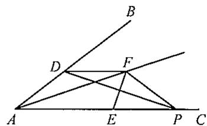

---

### 27 (练习题)

**题目**: 27. 如图, 在  $\triangle ABC$  中,  $\angle ACB = 90^\circ$ ,  $\angle BAC = 30^\circ$ ,  $BC = 6$ . 点  $D$  是  $AB$  的中点, 点  $E$  是射线  $BC$  上的一动点 (点  $E$  与点  $B$  不重合), 点  $F$  在  $ED$  的延长线上, 且  $DF = DE$ ,  $DG \perp EF$ , 垂足为点  $D$ ,  $DG$  交边  $AC$  于点  $G$ . (1) 求证:  $AF \parallel BC$ ; (2) 当  $CE = 1$  时, 直接写出  $AG$  的长.

---

### 28 (练习题)

**题目**: 28. 如图, 在  $\triangle ABC$  纸片中,  $\angle C = 90^\circ$ ,  $AC = 6$ ,  $AB = 10$ . 按图所示的方法将  $\triangle ACD$  沿  $AD$  折叠, 使点  $C$  恰好落在边  $AB$  上的点  $C'$  处. （1）求折痕  $AD$  长； (2) 若点  $P$  是边  $AB$  上的动点（点  $P$  与点  $A, B$  不重合），设  $AP = x$ ， $\triangle APD$  的面积为  $y$ 。请用含  $x$  的代数式表示  $y$ ； (3) 在(2)的条件下, 当  $\triangle APD$  是等腰三角形时, 求  $AP$  的长.

---

