学习

唯有，如影随形，如鸟觅食

才可能，如诗如画

# 同步练习册

# 数学 第5章 六年级下

MATH

EXERCISE BOOK

# 5.1比的意义

# A组

1. 下列各数中，与5：2不相等的是（ ）.

(A)  $\frac{10}{4}$

(B)  $\frac{5}{2}$

（C）  $\frac{2}{5}$

（D）  $\frac{15}{6}$

2. 0.25吨：40千克的比值是（B）.

(A) 0.00625

（B）6.25

（C）0.16

（D）1.6

3. 某班有学生50名，其中男女学生人数之比是2:3，男生人数为（C）.

(A) 2人

（B）3人

（C）20人

（D）30人

4.2.75:5  $\frac{1}{2}$  的比值是（B）.

(A) 2

(B) 0.5

（C）  $\frac{2}{11}$

（D）  $\frac{4}{11}$

5. 一个比的前项是12，后项是15，这个比是  $12:15$  ，比值是  $\frac{4}{5}$

6.如果比的前项与后项相等，那么比值是

7. 求比值：  $60:5 = 12$ $\frac{1}{8}: \frac{1}{4} = \frac{1}{2}$

8. 求比值：30厘米：1.2米  $= 0.25$  ，  $\frac{1}{5}$  小时：20分钟  $= 0.6$

9. 某校六（1）班有50位学生，今天有1位学生病假，则该班今天到校的学生人数与全班人数的比是  $49:50$  ，病假学生人数：到校学生人数的比值是  $\frac{1}{49}$

10. 一个比的后项是18，比值是  $\frac{2}{3}$ ，则这个比的前项是  $12$

11. 求下列各比的比值：

（1）14:21

$$
\begin{array}{l} \mathrm {解} \because 1 4 \div 2 1 \\ = \frac {1 4}{2} \times \frac {1}{2 4} \\ = \frac {2}{3} \\ \end{array}
$$

（2）7.5:6

$$
\begin{array}{l} \mathrm {解}: = \frac {1 5}{2} \div 6 \\ = \frac {\frac {1}{2}}{\frac {5}{4}} \times \frac {1}{6 2} \\ \end{array}
$$

（3）0.6:1.5

$$
\begin{array}{l} \mathrm {角 甲} = \frac {3}{5} \div \frac {3}{2} \\ = \frac {\frac {2}{3}}{\frac {2}{5}} \times \frac {2}{3} \\ \end{array}
$$

(4)  $\frac{7}{8}: \frac{2}{21}$

解：  $= \frac{7}{8} \times  \frac{21}{2}$

$$
= \frac {1 4 7}{1 6}
$$

(5)  $1\frac{1}{2}: 2\frac{2}{3}$

$$
\begin{array}{l} \mathrm {解}: = \frac {3}{2} \div \frac {8}{3} \\ = \frac {3}{2} \times \frac {3}{8} \\ = \frac {9}{1 6} \\ \end{array}
$$

（6）  $2\frac{2}{3}\div 1.6$

$$
\begin{array}{l} \mathrm {解} = \frac {8}{3} \div \frac {8}{5} \\ = \frac {1 8}{5} \times \frac {5}{2 1} \\ = \frac {5}{3} \\ \end{array}
$$

12. 汽车3小时行135千米，自行车2小时行24千米，求：

(1) 汽车行的路程与自行车行的路程的比的比值:  ${135} \div  {24} = \frac{{135}^{45}}{248} = \frac{45}{8}$  
（2）自行车所用的时间与汽车所用的时间的比；  $2:3$  
（3）自行车行的速度与汽车行的速的比的比值

$$
\begin{array}{l} 2 4 \div 2 = 1 2 (k m / h) \\ 1 3 5 \div 3 = 4 5 (k m / h) \\ 1 2: 4 5 = \frac {1 3}{4 5 . 1 5} = \frac {4}{1 5} \\ \end{array}
$$

13. 单独完成一项工程，甲队需 15 天，乙队需 17 天，求：

（1）单独完成这项工程甲队与乙队所用时间之比； 15:17  
(2)甲队与乙队的工作效率之比的比值.  $\frac{1}{15} \div  \frac{1}{17} = \frac{17}{15}$

14. 东方明珠电视塔的高度是468米，上海中心大厦的高度是632米，求东方明珠电视塔与

上海中心大厦的高度之比

[{468} \div  {632} = {468} \cdot  {632}]

# B组

4. 已知一杯糖水中糖与水的重量之比是 1:100, 这个比的意义是 (C).

（A）每100克糖水中含有1克糖

（B）糖的比水的重量少99克

（C）每1份糖中要倒入100份水

（D）水的重量比糖的重量多99克

2. 如果  $a$  是  $b$  的  $\frac{7}{10}$ , 那么  $b$  和  $a$  的比为  $(B)$ . 表示  $a$  和  $b$  的 7:1 分, 则  $b$  和  $10$  分

(A) 7:10

(B) 10:7

（C）3:7

(D)  $1 \frac{3}{7}$

3. 时钟的分针与时针的旋转速度的比值为12

4. 妈妈买5斤苹果用去10元，买3斤梨用去3.6元，苹果与梨的单价比的比值为  $\frac{5}{3}$

5. 求下列各式中的  $x$  值：

(1)  $8.4: x = 1.5$ ;

$$
\mathrm {解}: 8. 4 \div x = 1. 5
$$

$$
1. 5 x = 8. 4
$$

$$
x = 5 \cdot 6
$$

(2)  $x:3\frac{1}{2} = 2\frac{1}{3}$ .

$$
\mathrm {解} \quad x \div \frac {7}{2} = \frac {7}{3}   x = \frac {4 9}{6}
$$

6. 一大一小两个圆，已知重叠部分的面积既是大圆面积的  $\frac{1}{7}$ ，又是小圆面积的  $\frac{1}{4}$ ，求大圆非重叠部分面积与小圆非重叠部分面积的比值。

解：设大圆重叠为  $x$

$$
\therefore 7 x - x = 6 x
$$

$$
\mathrm {设 小 圆 重 叠 为} y
$$

$$
\therefore 4 y - y = 3 y
$$

$$
6 x: 3 y = 6 \div 3 = 2
$$

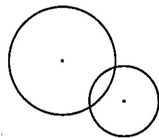

# 5.2 比的基本性质（1）

A组

1. 比的基本性质：  
2. 请用表达式表示比的基本性质：

3. (1)  $0.7:0.5 = \_\_\_\_\_\_\_\_\_\_ : 5.$  
（2）  $60:45 = 4$

4.  $12:8 = 24:$ $= \_ :4 = 27$  
5. 在括号内填上适当的数：

(1)  $\frac{81}{(\quad)} = 9:5$  
(2)  $\frac{2}{3} = \frac{2 + 4}{3 + (\quad)}$  
6. 化简  $\frac{2}{5}: 4$  得（ ）.

(A) 1:10

(B) 8:5

（C）10:1

(D)·5:8

7. 5克盐溶解在45克水中，则盐和盐水质量的最简整数比为（ ）.

(A) 1:9

(B) 9:1

（C）1:10

(D) 10:1

8. 把下列各比化成后项是 100 的比

（1）3:20

（2）48:500

(3) 1.2:2

(4)  $1\frac{1}{8}: 1\frac{1}{4}$

9. 把下列各比化成最简整数比：

（1）25:40

$$
\mathrm {解}: = (2 5 \div 5): (4 0 \div 5)
$$

$$
= 5: 8
$$

（2）0.75:4.5

$$
\mathrm {解} = (0. 7 5 \div 0. 7 5): (4. 5 \div 0. 7 5) \mathrm {解} =
$$

$$
= 1: 6
$$

（3）0.85:0.25

(4)  $1.5: \frac{1}{3}$

(5)  $\frac{2}{5}: 4$

(6)  $\frac{2}{3}:\frac{3}{4}$

(7)  $2\frac{4}{5}: 3.5$

(8)  $1\frac{3}{4}:\frac{5}{6}$

(9)  $1\frac{4}{5}: 1\frac{1}{6}$

10. 把下列各比化成最简整数比：

（1）  $1\frac{1}{2}$  千克：500克

（2）1.2时：1时20分

（3） $\frac{1}{5}$  小时：12分钟

11. 六 (1) 班有男生 20 人, 女生 18 人, 求下列各比:

（1）男生人数：女生人数

（2）女生人数：男生人数

（3）男生人数：全班人数

（4）女生人数：全班人数

# B组

1. 两个数的比值是  $\frac{4}{3}$ ，比的前项与后项同时乘以3，那么最简整数比是  
2. 如果  $x:y = 7:15$  ，那么  $x:(x + y) = \_ \_$  
3. 某年级的男、女人数比是 5:7，共 144 人，则男生有 ______ 人。  
4. 将一个比的前项扩大2倍，比的后项扩大3倍，这个比的比值与原来比值相比（）

（A）扩大了

（B）缩小了

（C）不变

（D）无法确定

5. 一段绳子原长15米，用去了3米，余下的绳长与原来的绳长的最简整数比是（ ）.

(A) 5:1

(B) 1:5

（C）4:5

（D）5:4

6. 一项工程，如果甲队单独做3天完成，乙队单独做5天完成，那么甲、乙两队的工作效率的最简整数比是（ ）.

(A) 3:5

(B)  $\frac{1}{3}:\frac{1}{5}$

（C）5:3

(D) 3:2

7. 甲、乙两人加工300个同样的零件，甲在10分钟内完成6个，乙在5分钟内完成6个，求：（1）甲、乙两人各完成300个零件的速度比.

（2）甲、乙两人各完成300个零件的时间比

# 5.2 比的基本性质（2）

# A组

1. 如果  $a:b = m:n$  ，  $b:c = n:k$  ，那么  $a:b:c =$  
2. 如果  $k \neq 0$ ，那么  $a:b:c = ak: \quad \therefore \quad = \frac{a}{k}: \quad \therefore \quad : \quad .$  
3. 化成最简整数比:  $\frac{1}{2}: \frac{1}{3}: \frac{1}{6} =$  
4. 因为  $x:y = 0.8:1.2 = \_$  :6，  $y:z = 2:7 = 6:\_$ ，所以  $x:y:z = \_$ .  
5. 如果  $a:b = 3:4$  ，  $b:c = 4:3$  ，那么  $a:b:c =$  
6. 如果  $x:y = 2:3$  ，  $y:z = 6:5$  ，那么  $x:y:z =$  
7. 如果  $a:b = 2:3$  ，  $a:c = 2:5$  ，那么  $a:b:c =$  
8. 超市销售一种什锦糖果，其中含6千克的水果软糖，9千克的水果硬糖和15千克的咖啡软糖，则水果软糖与水果硬糖的质量比为 ，三种糖果的质量之比为  
9. 将 16:64:24 化成最简整数比为（A）.

(A)  $2 : 8 : 3$

（B）4:16:6

（C）2:8:5

（D）10:32:5

10. 已知  $x:y = 2:3$  ，  $y:z = 5:7$  ，则  $x:y:z$  等于（B）.

(A)  $2 : 3 : 7$

(B) 10:15:21

（C）2:7:15

(D)  $2: 8: 7$

11. 如果  $x:y = 0.5:3$  ，  $y:z = 3:0.8$  ，则  $x:y:z$  是（D）.

(A)  $5:3:8$

(B) 1:6:8

（C）5:30:4

(D)  $5: 30: 8$

12. 把下列各连比化成最简整数比：

（1）12:24:32

(2)  $\frac{1}{3}: \frac{1}{4}: \frac{1}{5}$

（3）1.6:2.4:4

（4）0.45米：3.6分米：8.1厘米

（5）15分：1.5时：1时15分

（6）120分钟：1.2小时：1小时20分钟

13. 利用已知条件，求  $a:b:c$ .

（1）  $a:b = 2:3$  ，  $b:c = 4:5$

(2)  $a:b = 3:5, b:c = 6:7$

(3)  $a:b = 8:9, b:c = 3:4$

(4)  $a:b = 3:4, b:c = \frac{1}{4}: \frac{1}{3}$

（5）  $a:b = 0.5:0.8$  ，  $b:c = 1.2:0.5$

(6)  $a:b = 2:5$  ，  $a:c = 5:8$

(7)  $a:b = \frac{1}{2}: \frac{1}{3}, a:c = \frac{1}{4}: \frac{1}{2}$

(8)  $a:b = 0.2:0.3$ ,  $c:b = \frac{1}{4}: \frac{1}{3}$

# B组

1. 已知  $a$  是  $b$  的  $\frac{3}{5}$ ,  $b$  是  $c$  的  $\frac{1}{2}$ , 则  $a:b:c =$  ________.  
2. 若  $ab:bc:ac = 10:12:15$  ，则  $a:b:c =$  
3. 已知甲的  $\frac{4}{5}$  正好是乙数的  $\frac{5}{6}$ ，则甲、乙两个数的比值是  
4. 把 4 米长的竹竿插入水中，露出水面部分是  $2 \frac{3}{5}$  米，那么入水部分和露出水面部分的长度之比是  
5. 小明 2 分钟打 140 个字, 小杰 3 分钟打 180 个字, 则小明与小杰打字的速度比是  
6. 若三角形三个内角的度数之比为  $2:3:1$ ，则其中最大的角的度数为（ ）.

(A)  $60^{\circ}$

（B）  $90^{\circ}$

（C）  $120^{\circ}$

（D）  $150^{\circ}$

7. 在8:9中，如果前项增加16，要使比值不变，那么后项应（ ）.

（A）增加16

（B）乘以3

（C）不变

（D）无法确定

8. 如果一项工程，甲队单独做3天完成，乙队单独做5天完成，丙队单独做6天完成，那么甲、乙、丙三队的工作效率最简整数比是（ ）.

(A)  $3:5:6$

(B)  $1 : 5 : 2$

（C）10:6:5

(D)  $\frac{1}{3}: \frac{1}{5}: \frac{1}{6}$

9. 如图，大小两个圆重叠在一起，重叠部分占小圆的  $\frac{2}{5}$ ，占大圆的  $\frac{1}{7}$ ，求小圆面积与大圆面积之比。

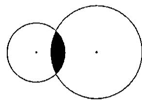

10. 下图是某公园的设计图，其中正方形的  $\frac{3}{4}$  是草地，圆的  $\frac{6}{7}$  是竹林，求正方形与圆的面积比。

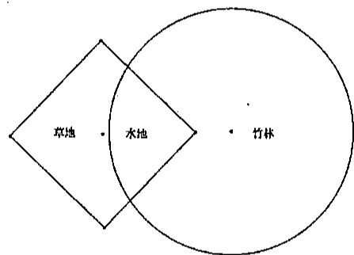

11．黑火药是我国的四大发明之一，它所用的主要原料有硝酸钾、硫磺、木炭，这三种原料的重量配比是15:2:3，要配制这种火药240千克，需取三种原料各多少千克？

# 5.3 比例（1）

A组

1.  $a, b, c, d$  四个量中，如果__________，那么就说  $a, b, c, d$  成比例。也就是表示两个比__________的式子叫做比例。  
2. 其中第____比例项  $a$  和第____比例项  $d$  叫做____，第____比例项  $b$  和第____比例项  $c$  叫做____。  
3. 如果两个 _______ 相同，即  $a:b = b:c$ ，那么把  $b$  叫做  $a$  和  $c$  的 _______。  
4. 比例的基本性质：如果  $a:b = c:d$  （或  $\frac{a}{b} = \frac{c}{d}$ ），那么________。反之，如果  $a, b, c, d$  ______，且  $ab = cd$ ，那么________或________。  
5. 比例的基本性质实现了 ______ 与 ______ 之间的转化。  
6. 比例  $\frac{4}{6} = \frac{2}{3}$  中，比例内项是 ________；比例外项是 ________。  
7. 如果  $0.7 \times 8 = 1.4 \times 4$ ，用0.7和8做内项，写出一个比例式为  
8. 已知  $4: x = 5: 12$  ，则  $x =$  
9.如果2是  $x$  和5的比例中项，那么  $x = \_$  已知  $b$  正整数，且  $b$  是4和9的比例中项，则  $b = \_$  
10. 若  $4x = 5y$  ，则  $x:y =$  
11. 若  $7: x = 4: y$ ，则  $x: y =$  ________.  
12. 下列各比能与3:2组成比例的是（ ）.

(A) 6:4

(B) 9:4

（C）2:3

(D) 4:6

13. 下列四组数不能组成比例式的是（ ）.

(A) 2、3、4、6

（B）1、2、2、4

（C）0.1、0.3、0.5、1.5

（D）  $\frac{1}{2},\frac{1}{3},\frac{1}{4},\frac{1}{5}$

14. 已知一个比例的两个内项之积为 40，则两个外项不可能是（ ）.

(A) 40和1

（B）2和15

（C）2和20

（D）4和10

15. 如果  $4: a = 7: b$  ，那么  $a: b$  等于（ ）.

(A) 4:7

(B) 7:4

（C）28:1

(D) 1:28

16. 已知  $a \times \frac{1}{4} = b \times \frac{1}{3}$ , 那么下列各式成立的是（ ）.

(A)  $a:b = \frac{1}{4}:\frac{1}{3}$

（B）  $b:a = \frac{1}{3}:\frac{1}{4}$

(C)  $a:b = \frac{1}{3}:\frac{1}{4}$

(D)  $a:3 = b:4$

17. 求下列各式中的  $x$  :

(1)  $6: 10 = x: 7$ ;

(2)  $\frac{x}{16} = \frac{3}{2}$ ;

(3)  $x:\frac{4}{3} = \frac{1}{2}:\frac{8}{3}$ ;

(4)  $x: 13.5 = 2\frac{4}{5}$ ;

(5)  $3:2 = (x + 4):x$

(6)  $1\frac{3}{4} = \frac{x + 10}{12}$ .

18. 当  $x$  取何值时，它与2、3、4可以组成一个比例？

19. 已知  $a:b:c = 2:3:4$  ，  $a + b + c = 27$  ，求  $2a - 3b + 4c$  的值

20. 已知  $\frac{a}{2} = \frac{b}{3} = \frac{c}{4}$ , 求  $a:b:c$  ( $a, b, c$  均不为零).

# B组

1. 若  $b$  是  $a$  和  $c$  的比例中项，则  $\therefore b = c$  或  $b^2 = c$ .  
2. 如果  $3.75 \times 2 = 1.2 \times 6.25$ ，用3.75和2作比例外项，写出一个比例式  
3. 如果  $a \times 8 = b \div 6$ ，那么  $a:b = \_$ ：  
4. 已知被减数与差的比 5:3，减数是 120，被减数是  
5. 下列说法不正确的是（ ）.

（A）若  $a, b, c, d$  成比例，则  $2a, 2b, 2c, 2d$  也成比例；  
（B）若  $a$  ，  $b$  ，  $c$  ，  $d$  成比例，则  $a$  ，  $2b$  ，  $2c$  ，  $d$  也成比例；  
（C）若  $a, b, c, d$  成比例，则  $2a, 2b, c, d$  也成比例；  
（D）若  $a$  ，  $b$  ，  $c$  ，  $d$  成比例，则  $2a$  ，  $b$  ，  $2c$  ，  $d$  也成比例

6. 如果  $a = 2$  ，  $b = 4$  ，  $c = 8$  ，那么（ ）.

（A）  $a$  ，  $b$  ，  $c$  的第四比例项是7

（B）  $3a$  ，  $2b$  和  $3c$  的第四比例项为18

（C）  $c$  是  $a$  ，  $b$  的比例中项

（D）  $b$  是  $a$  ，  $c$  的比例中项

7. 已知  $x:2y = 3:4$  ，则  $x:y$  为（ ）.

(A) 3:8

(B) 3:2

（C）6:2

(D) 6:8

8. 一张照片长12厘米，宽8厘米，将它缩印后放到书里，长变为5厘米，则宽是多少厘米？

# 5.3比例（2）

# A组

1. 小丽买5个梨用去3.3元，现在购买18个梨需要 元  
2. 房产博览会上，某楼盘的模型是按照1:500的比例尺制作的，该楼盘1号楼模型高7厘米，它的实际高度是 米.  
3. 一张照片长12厘米，宽8厘米，将它缩印后放到书里，宽变为5厘米，则长是 厘米.  
4. 已知长方形的长与宽的比是 5:3，若宽为 6 厘米，则长方形的面积是 ______ 平方厘米。

5. 如图，平行四边形中相邻两边  $AB:AD = 4:3$  ，如果 $AD = 4.5$  厘米，那么  $AB$  的长度是 厘米

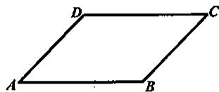

6. 已知线段  $AB = 2$  厘米， $CD = 8$  厘米，若线段  $EF$  是  $AB$  与  $CD$  的比例中项，则  $EF$  长为 ______ 厘米.  
7. 已知  $x$  是 3、4、5 的第四比例项，则  $x =$  
8. 将  $2 \times 1.5 = 0.5 \times 6$  化成比例式，正确的是（ ）.

(A)  $\frac{2}{1.5} = \frac{0.5}{6}$

(B)  $2:6 = 1.5:0.5$

（C）  $6:1.5 = 2:0.5$

(D)  $6:0.5 = 1.5:2$

9. 已知  $\frac{1}{3} \times 4.5 = \frac{3}{5} \times 2.5$ ，下面哪个比例式不成立（ ）.

(A)  $\frac{1}{3}:\frac{3}{5} = 4.5:2.5$

(B)  $\frac{1}{3}: \frac{3}{5} = 2.5: 4.5$

（C）  $4.5:\frac{3}{5} = 2.5:\frac{1}{3}$

(D)  $2.5:\frac{1}{3} = 4.5:\frac{3}{5}$

10. 一个零件长为2.5厘米，如果画在图纸上为5厘米，那么图纸上的尺寸与实际尺寸的比是（ ）.

(A) 1:20

(B) 20:1

（C）1:2

(D) 2:1

11. 妈妈买8斤猪肉用了60元，如果买同样的5斤猪肉要用（ ）.

（A）35元

（B）42元

（C）37.5元

（D）40元

12. 如果 20 元钱可以买 3 个西瓜，现在要买 9 个这样的西瓜需要（ ）.

（A）30元

（B）27元

（C）60元

（D）90元

13. 一辆汽车2小时行驶120千米，按照这样的速度，3.5小时行驶（ ）千米

(A) 180

(B) 210

（C）240

（D）350

14. 某工人 4 小时加工零件 120 个，他加工 600 个零件需要多少小时？

15. 小杰 12 分钟可以打 480 个字. 照这样的速度, 他 1 小时可以打多少个字?

16. 有一种小瓶装消毒液净重50克，小明妈妈买回8千克瓜果，现需将这些生吃的瓜果进行消毒，取出10克消毒液需加水多少千克？

（消毒参考值：1.瓜果、餐具、厨房用品1:500；2.衣物、物体表面1:300）

17. 如图，将 1.5 米长的竹竿直立在地面上，测得竹竿的影长为 1.6 米，同时测得旗杆的影长为 8 米。已知旗杆的高与其影长的比等于竹竿的长与其影长的比，求旗杆的高。

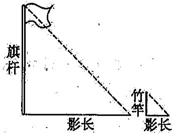

18. 一个比例的两个外项互为倒数，其中一个内项是2.4，求另一个内项是多少？

# B组

1. 在一幅比例尺1:5000000的地图上测量得到  $A$  市与  $B$  市之间的距离是2.5厘米，则  $A$  市与  $B$  市之间的实际距离是 ______ 千米.  
2. 在一幅地图上量得甲、乙两地相距6厘米，乙、丙两地相距8厘米，已知甲、乙两地间的实际距离是120千米，乙、丙两地的实际距离是________；这幅地图的比例尺是________。  
3. 两个三角形的面积相等，若底边之比为  $3:2$  ，则底边上的高之比是  
4. 用2，3，4再配一个比这三个数都大的数________，使它们组成比例，组成的比例式是________。  
5. 某校语文教师人数与数学教师人数之比是13:7，若语文教师2人改行教数学，则人数的比是3:2，原来语文、数学教师各有多少人？

6. 某校女生与全校总人数的比是  $7:15$ ，转进8名女生后. 女生占全校人数的  $\frac{15}{31}$ ，现在该校有多少名学生？

# 5.4 百分比的意义（1）

# A组

1. 把  $\frac{16}{25}$  写成百分比是（ ）.

(A)  $0.64\%$

(B)  $6.4\%$

（C）  $64\%$

（D）  $640\%$

2. 百分数  $150\%$  化为最简分数为（ ）.

(A)  $\frac{2}{3}$

(B)  $1\frac{1}{2}$

(C)  $\frac{15}{100}$

（D）  $1\frac{5}{10}$

3. 一批产品，其中合格产品与不合格产品的比是4:1. 不合格产品的数量占这批产品总数的（ ）.

(A)  $25\%$

(B)  $20\%$

（C）  $30\%$

（D）以上答案都不正确

4. 已知甲重60千克，乙重54千克，下列表述正确的是（ ）.

（A）甲比乙重  $10\%$

（B）乙比甲约轻  $11\%$

（C）甲比乙约重  $10\%$

（D）乙比甲轻  $10\%$

5.  $30.5\%$  读作________；百分之十点七写作________。  
6. 把小数化成百分数：0.37=________，2.073=________.  
7. 把百分数化成小数：  $46\% = \_$  ，  $320\% = \_$  
8. 把分数化为百分数：  $\frac{1}{2} = \_$  ，  $1\frac{5}{8} = \_$  
9. 把百分数化成分数：  $75\% = \_ \_ \_ \_ \_ \_ , 120\% = \_ \_ \_ \_ \_ \_ .$

10. 如图，阴影部分面积占整个图形面积的百分之几

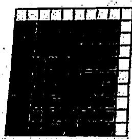  
$\%$

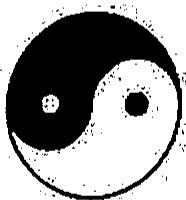  
$\%$

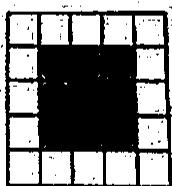  
$\%$

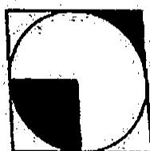  
$\%$

11. 把下列各比化成后项是 100 的比

（1）320:500

(2)  $1\frac{1}{2}: 2$

(3) 1.3:25

12. 将下列的百分数化成最简分数

（1）  $4\%$

(2）  $65\%$

(3)  $12.5\%$

13. 某学校有学生 2000 人，六年级学生共 400 人，六 (1) 班学生 40 人. 问：

（1）六（1）班学生占六年级学生人数的百分之几？

（2）六（1）班学生占全校学生人数的百分之几？

# B组

1. 在  $2\frac{1}{3}$ ，2.3， $233\%$ ，2.3这四个数中，最小的数是（ ）.

(A)  $2\frac{1}{3}$

(B) 2.3

（C）  $233\%$

(D) 2.3

2.下列说法中，正确的是（ ）.

(A)  $a:b = \frac{2}{5}$ , 表示  $a$  是  $b$  的  $4\%$

（B）百分数都不大于1

（C）一个数的  $\frac{1}{4}$  与它的  $25\%$  一定相等

（D） $95\%$  是 9.5

3. 比较大小：  $6.5\%$  6.5  
4. 甲数是乙数的  $25\%$  ，则乙数是甲数的  $\%$  
5. 1小时的  $40\%$  是 分钟  
6.  $4:2 = \frac{1}{4}$  ：  $= 200\%$

7. 把下列各比化成百分比：

(1)  $1:4$

(2) 2.1:2.5

(3)  $1.8: 2\frac{2}{5}$

(4)  $2 \frac{1}{4}: 1 \frac{2}{7}$

8. 计算：

(1)  $1\frac{1}{4} \times 3\frac{1}{5} + (1 + 25\%) \times 4\frac{5}{6}$

(2)  $(3 - 45\% \div 90\%) \div 60\%$

(3)  $(12.5\% \times \frac{1}{9}) \times 40\% \times 18$

(4)  $2\frac{3}{5} - \frac{8}{13} \times 260\%$

# 5.4 百分比的意义（2）

# A组

1. 下列各数中与  $\frac{4}{5}$  不相等的是（ ）.

(A) 0.8

(B)  $80\%$

（C）  $\frac{8}{10}$

（D）  $8\%$

2.  $1 + 0.5\%$  等于（ ）.

(A)  $1.5\%$

(B)  $1.05\%$

（C）  $100.5\%$

（D）  $105\%$

3. 一桶油用去  $40\%$  ，正好用了20千克，这桶油原来的重量是（ ）.

（A）40千克

（B）24千克

（C）50千克

（D）8千克

4. 火车从  $A$  地到  $B$  地，原来要5小时，现在只要4小时，时间减少了（ ）

(A)  $20\%$

(B)  $25\%$

（C）  $10\%$

（D）  $80\%$

5.  $3.5\%$  写成小数是  $\frac{4}{25}$  化成百分数是  
6. 把  $1\frac{3}{4}$  化成百分数 _______，把  $25\%$  化成小数是 _______.  
7.30米是120米的  $\%$  
8. 某数的  $30\%$  是54，这个数是  
9.  $5:4 = \_$  ________ % = ________ （小数）.  
10. 120 的  $20\%$  是 ________；一个数的  $20\%$  是 120，这个数是 ________。  
11. 把下列各数化成百分数：

(1) 0.1

(2）0.0102

(3)  $\frac{3}{10}$

(4) 1

12. 把下列各百分数化成小数或整数：

（1）  $5\%$

(2）  $60\%$

(3)  $1.75\%$

（4）  $150\%$

13. 把下列各百分数化成最简分数：

(1)  $0.2\%$

(2）  $40\%$

（3）  $32\%$

（4）  $37.5\%$

（5）  $337.5\%$

(6)  $20.23\%$

14. 求下列各题的商，并把所得的商化成百分数（除不尽的在百分号前保留一位小数）.

(1)  $2 \div 7$

（2）  $280\div 70$

(3)  $\frac{12}{13} \div \frac{7}{6}$

(3)  $3 \div \frac{2}{3}$

# B组

1. 如果甲：乙  $= 3:2$  ，则甲是乙的（ ）.

(A)  $150\%$

(B)  $66.7\%$

（C）  $15\%$

(D)  $60\%$

2.一台电脑原价2800元，现打八折，那么这台电脑的现价为（ ）.

(A) 原价的  $80\%$

（B）原价的  $8.5\%$

（C）原价的  $5\%$

（D）比原价降低  $3.95\%$

3. 甲数和乙数的比是  $3:4$ ，甲数是乙数的  $\%$ 。  
4. 将 1.22、1.2、 $1\frac{2}{100}$ 、 $120\%$  按从小到大的顺序排列是  
5. 0.36里有 个  $1\%$  
6.  $\frac{2}{3}$  的  $25\%$  是 ，  $\frac{2}{3}$  是  $\frac{8}{15}$  的  
7. 某厂上半年完成计划产值的  $44\%$  ，下半年又完成计划产值的  $66\%$  ，则这个厂全年增产多少？  
8. 上海某工业园区是市政府与外商共同投资兴建的。其中市政府投资30亿元，占外商投资的  $10\%$  ，那么建设此工业园区共投资了多少亿元？

# 5.5 百分比的应用（1）

# A组

1. 某班昨天上课出席48人，缺席2人，则出席率的算式是（ ）.

(A)  $\frac{2}{48} \times 100\%$

(B)  $\frac{2}{48 + 2} \times 100\%$

（C）  $\frac{48}{48} \times 100\%$

(D)  $\frac{48}{48 + 2} \times 100\%$

2. 小兰养了98只蚕，全部存活，则存活率是（ ）.

(A)  $98\%$

(B)  $80\%$

（C）  $100\%$

（D）98

3. 一堆煤重1000吨，每天用去120吨，则每天用煤（ ）.

(A)  $12\%$

(B)  $2.4\%$

（C）  $120\%$

(D)  $1.2\%$

4. 将一包种子做发芽试验，其中发芽的90粒，没有发芽的10粒，发芽率是（ ）.

(A)  $10\%$

(B)  $90\%$

（C）  $90.9\%$

(D)  $110\%$

5. 32是50的  $\%$  ，60是80的  $\%$  
6. 一根长10米的绳子，剪去4米，剪去了  $\%$  
7. 一根长10米的绳子，剪去它的  $40\%$  ，剪去 米  
8. 某班有40人，数学期中考试5人不及格，及格人数是全班总人数的  $\%$  
9. 小明五年级期末考试数学成绩为80分，这次期中的成绩提高了  $10\%$  ，他这次期中考试的成绩是 分.  
10. 小明五年级期末考试数学成绩为80分，这次考试是88分，他的数学成绩提  $\%$  
11. 赵叔叔做了 1500 个零件，经过检验，发现有 3 个废品，求合格率是多少？废品率是多少？

12. 下面是某校六（1）班数学期中考试成绩统计表：  

<table><tr><td>成绩</td><td>100分</td><td>90-99分</td><td>80-89分</td><td>70-79分</td><td>60-69分</td><td>59分以下</td></tr><tr><td>人数</td><td>1</td><td>10</td><td>14</td><td>7</td><td>5</td><td>3</td></tr></table>

若60分以上是及格，80分以上是良好，90分以上是优秀，求这个班这次数学考试成绩的优秀率、良好率和及格率.

13. 一汽汽车销售公司，今年4月份销售了250辆  $A$  型汽车，5月份销售  $A$  型汽车的数量比4月份下降了  $20\%$ 。预计6月份的销售量将比5月份的销售量再下降  $5\%$ 。求：

（1）5月份这个销售公司销售了  $A$  型汽车多少辆？  
（2）6月份这个销售公司将销售  $A$  型汽车多少辆？

14. 下表是某超市2015年各季度产值统计表：

<table><tr><td>季度</td><td>第一季度</td><td>第二季度</td><td>第三季度</td><td>第四季度</td></tr><tr><td>产值（万元）</td><td>380</td><td>400</td><td>432</td><td></td></tr></table>

（1）计算第三季度产值比第二季度产值增长百分之几  
（2）若计划第四季度的增长率比第三季度再提高2个百分点，则第四季度的产值是多少万元？

# B组

1. 某商店一套电动玩具 11 月份的售价是 108 元，12 月份的售价是 84 元，那么这套玩具约降价了（ ）.

(A)  $28.6\%$

(B)  $22.2\%$

(C)  $20.3\%$

（D）  $24\%$

2. 六（1）班50人参加数学测验，试卷上有5道应用题，全班共错了23道题，这个班的学生解应用题的正确率是（ ）.

(A)  $90.8\%$

(B)  $46\%$

（C）  $42.5\%$

（D）  $57.5\%$

3. 小明这次期中考试考了88分，比五年级期末提高了  $10\%$  ，他五年级期末考试考了 分.  
4. 一件商品，原价比现价少  $30\%$  ，若现价为560元，则原价为 元  
5. 检验一批零件，117个合格，3个不合格，它的不合格率是

6. 右图中阴影部分的面积占全图面积的  $\%$

7. 100个零件， $3\%$  是不合格的，取出25个合格的零件后，不合格的目前占了百分之几？

8. 检验员检验一批电脑的合格率是  $98\%$  ，不合格的电脑有98台，求合格的电脑有多少台？

# 5.5 百分比的应用（2）

A组

1. 今年来我国国内生产总值的变化统计图如图，从图上判断，下列结论中，不正确的是（ ）.

（A）水平的数轴表示的含义是年份  
（B）竖直的数轴表示的含义是国内生产总值  
（C）这4年中，每年的国内生产总值不断增长  
（D）这4年中，每年的国内生产总值不断减少

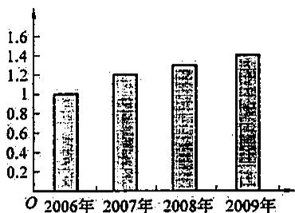

2. 在如图中应当填入的百分比是（ ）.

(A)  $30\%$

(B)  $25\%$

（C）  $35\%$

（D）  $60\%$

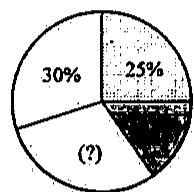

3. 如图，某中学制作了300名学生选择棋类、武术、摄影、刺绣四门校本课程情况的扇形统计图，从图中可以看出选择刺绣的学生的人数为（ ）名。

(A) 33

(B) 3

（C）39

(D) 42

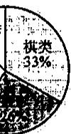

4. 如图是我国在28届奥林匹克运动会上获得奖牌数的统计图，则获得的金牌数占所获得的奖牌数的  $\%$  （保留1位小数）

5. 六（1）班同学每个月收看电视节目的情况，经调查如统计表所示：

<table><tr><td></td><td>看动画</td><td>看连续剧</td><td>看体育</td><td>看新闻</td></tr><tr><td>人数</td><td>18</td><td>8</td><td>10</td><td>5</td></tr></table>

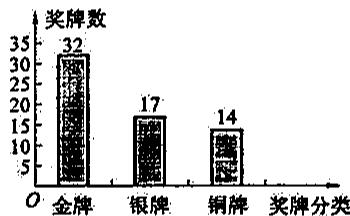

则看新闻的人数占全班人数的百分比是 ________。（保留1位小数）

6. 某校对六年级300名新生进行了数学摸底考试，请根据下表计算出各分数段的人数占全体学生人数的百分数.

（注：原始成绩均为整数，分数段中的成绩可含最低值，不含最高值）

<table><tr><td>分数段</td><td>人数</td><td>百分比</td></tr><tr><td>0~60</td><td>27</td><td></td></tr><tr><td>60~70</td><td>39</td><td></td></tr><tr><td>70~80</td><td>75</td><td></td></tr><tr><td>80~90</td><td></td><td></td></tr><tr><td>90~101</td><td>63</td><td></td></tr></table>

7. 某校六年级共有两个班级，两个班男、女生人数统计如图所示，求该年级中男生人数是

年级总人数的百分比.

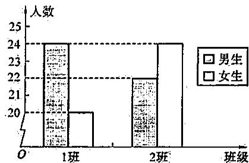

8. 如图为一箱鸡蛋的重量分布直方图，根据图表提供的信息回答下列问题：

（1）重量在56克～65克的鸡蛋个数占这箱鸡蛋总数的几分之几？  
（2）重量在56克以下与重量在60克以上的鸡蛋个数的比是多少？

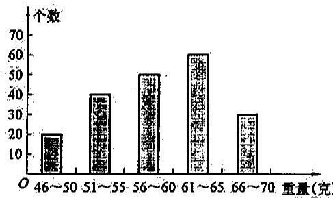

9. 如图是某校一年的支出经费的具体情况，根据图中的信息，回答下列问题：

（1）求课时经费的支出是所有费用的百分之几？  
（2）该学校这一年的支出费用是多少？

# B组

1. 如图是某超市在月底盘点时对饮料和饼干类食品销售的统计情况：

（1）矿泉水占饮料类和饼干类这两类消费的百分之几？  
（2）如果果汁出售了500千克，问：饼干卖出多少千克？

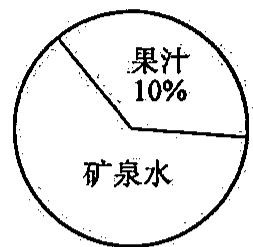  
饮料类

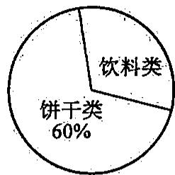

2. 某次测验，全班平均分为77分，及格率为  $90\%$  ，及格学生的平均分为80分，问：不及格学生的平均分是多少？

# 5.5百分比的应用（3）

# A组

1. 一种电视机现以七五折出售，就是指现价是（ ）.

（A）原价的  $75\%$

（B）原价的  $25\%$

（C）原价的  $7.5\%$

（D）比原价降低了的  $75\%$

2. 一件外套原价每件300元，在降价60元后出售，这件外套的售价打（ ）.

（A）六折

（B） 七折

（C） 七五折

（D）八折

3. 一件标有一定价格的商品，如果先提价  $10\%$  ，然后又降价  $10\%$  出售，那么这件商品的售价与原价相比是（ ）.

（A）提价了

（B）降价了

（C）没降也没提

（D）无法确

定

4. 某品牌手机进价为 800 元。现在 1000 元售出，盈利 ______ 元，盈利率 ______ 。  
5. 一件商品的售价为2000元, 其盈利率为  $25\%$ , 则此商品的成本价 ________ 元.  
6. 一种新款电冰箱提价  $10\%$  出售，就是提价 成. 现价是原价的  $\%$  
7. 某商店每台电扇的成本250元，盈利率  $20\%$  ，商家每售出一台电扇，赚了 元  
8.一台电视机成本价是2000元，商店以2600元出售，商店的盈利率是  $\%$  
9. 一套玩具的成本是50元，如果制造商赚  $20\%$  ，零售商赚  $10\%$  。问：

（1）零售商进货一套需多少元钱？  
（2）零售商出售这套玩具的定价是多少元？

10. 某商场“十一”酬宾，所有商品九五折出售。

（1）一台冰箱原价2700元，现在售价为多少元？  
（2）小明家买了一台彩电，付了1900元，这台彩电原价为多少元？

11. 一双运动鞋售价525元，其盈利率为  $40\%$  ，求这双运动鞋的成本价？  
12. 建造一栋大楼，实际投资 1800 万元，比计划节约了两成，求计划投资多少万元？  
13. 某书店开展喜迎元旦双重促销活动：①凡购买故事书有相应的折扣（见下表）；②折扣后金额超过50元而不超过100元的减5元，折扣后金额超过100元而不超过200元的减10元，折扣后金额超过200元减20元。

<table><tr><td>故事书数量（本）</td><td>折扣</td></tr><tr><td>1——10</td><td>九折</td></tr><tr><td>11——20</td><td>八五折</td></tr><tr><td>20本以上</td><td>八折</td></tr></table>

（1）小红买了3本故事书付了36元，求这3本故事书的原价是多少元？  
（2）小明买了13本故事书付了126元，求这13本故事书的原价是多少元？

# B组

1. 一商店批进衬衫500件，每件进货价为30元，准备每件加价  $30\%$  出售

问：（1）预计总共可以盈利多少元？  
（2）当这批衬衫售出  $90\%$  以后，决定将余下的按八折继续售出，这样这批衬衫全部售完，实际盈利多少元？

2. “六一”儿童节到了，许多商家为了吸引顾客，纷纷使出打折的招数。有一件玩具原价200元，打六折后商家的盈利率还是达到了  $20\%$  ，求这件玩具的成本价。  
3. 房地产商有两套住房均以 300 万元的价格卖出，其中一套赚了  $25\%$  ，另一套亏了  $25\%$  ，试判断房地产商是赚了还是亏了，或者是不赚不亏？如果是赚或亏，那么赚了或亏了多少？

# 5.5 百分比的应用（4）

# A组

1. 下列数量关系中错误的是（ ）.

（A）利息  $=$  本金  $\times$  利率  $\times$  期数

（B）利息税  $=$  利息  $\times$  税率

（C）本利和  $=$  本金  $+$  利息

（D）税后本利和  $=$  （本金  $+$  利息）  $\times$  税率

2. 若银行定期储蓄一年的年利率是  $2.25\%$  ，则月利率应该是（ ）.

(A)  $2.25\%$

(B)  $27\%$

（C）  $0.1875\%$

(D)  $0.225\%$

3. 三年存款的月利率为  $0.25\%$  ，则这种存款的年利率为  
4. 计税金额是200000元，适用税率是  $15\%$  ，应交纳税额是 元.  
5. 计税金额是 40000 元，应交纳税额 4200 元，税率是 ________。  
6. 小丽将 2000 元存入银行，存期三年，年利率是  $2.8\%$  ，问到期后小丽可从银行取回本利和 ______ 元。  
7. 小明买彩票中了 500 万元大奖，需缴纳  $20\%$  的个人所得税，那么小明实际可以获得 ______ 万元。  
8. 小丽将压岁钱 1500 元存入银行，定期 3 年，到期得到税前本利和 1770 元，则定期三年的存款的年利率为  
9. 超市六月份营业额3000万元，缴纳了150万元的营业税．那么营业税的税率是  
10. 服装厂去年以全年产值为计税金额，共应纳税额28万元，服装产值税率为  $7\%$  ，该服装厂去年全年产值为 ______ 万元。  
11. 王老师从报社获得了 1800 元的稿费，按照国家税收标准，超过 1000 元的部分按照  $20\%$  的税率纳税，王老师实际得到稿费 ______ 元。  
12. 王阿姨将4万元存入银行，存期五年，存款年利率是  $4.5\%$  ，到期需付  $20\%$  的利息税，问王阿姨到期可得税后利息多少元？

13. 某单位向银行贷款20万元，月利率为  $0.8\%$  ，借期3年，问该单位货款到期应向银行还本利和共多少万元？  
14. 教育储蓄所得的利息不用纳利息税。爸爸为笑笑存了三年期的教育储蓄基金，年利率为  $5.40\%$  ，到期后共领到了本金和利息 23240 元。爸爸为笑笑存的教育储蓄基金的本金是多少？  
15. 某酒店平均每月营业额40万元，按规定除了按营业额的  $5\%$  交纳营业税以外，还要按营业税的  $7\%$  缴纳城市维护建设税。该酒店一年应缴纳这两种税共多少万元？

# B组

1. 银行加息是控制通胀的一种有效的调控手段，2010年银行将一年期存款利率在原来2.  
2.25%的基础上提高了0.25个百分点，小明在利率提高后将自己的压岁钱2000元存入银行，存期一年，求到期后小明税前能比原来多拿多少利息？

2. 依法纳税是每个公民应尽的义务。《中华人民共和国个人所得税法》规定，公民的每月工资、薪金不超过800元不需交税，超过部分按不同的税率交税，详细的税率如下表：

<table><tr><td>级别</td><td>全月应纳所得税金额</td><td>税率（%）</td></tr><tr><td>1</td><td>不超过500部分</td><td>5</td></tr><tr><td>2</td><td>超过500元至2000元部分</td><td>10</td></tr><tr><td>3</td><td>超过2000元至5000元部分</td><td>15</td></tr><tr><td>4</td><td>超过5000元至10000元部分</td><td>20</td></tr><tr><td>…</td><td>…</td><td>…</td></tr></table>

（1）某企业经理月薪7000元，他每月应交税多少元？  
（2）若他本月交税400元，那么他的工资是多少元？

# 5.6等可能事件（1）

# A组

1. 不透明的袋子里有除颜色外其他都相同的红、黄、绿3只小球，随意摸出1只，它是（ ）.

（A）红色小球

（B）黄色小球

（C）绿色小球

（D）都有可能

2. 小红在解一道4选1的选择题时，由于她不会做，于是就猜了一个答案，则小红本题答对的可能性大小是（ ）.

(A)  $\frac{1}{4}$

(B)  $\frac{1}{3}$

（C）  $\frac{1}{2}$

(D)  $\frac{2}{3}$

3. 一本200页的书，随手翻开1页，则翻到页码数能被4整除的可能性大小是（ ）.

(A)  $\frac{1}{6}$

(B)  $\frac{1}{2}$

（C）  $\frac{1}{4}$

(D)  $\frac{1}{3}$

4. 有编号为1到10的10个篮球，小丽从中任意拿走一个，那么小丽拿到的篮球的编号为5的整数倍的可能性的大小是（ ）.

(A)  $\frac{1}{10}$

(B)  $\frac{1}{5}$

（C）  $\frac{1}{20}$

(D)  $\frac{1}{2}$

5. 把一枚质地均匀的硬币抛掷 1 次，反面向上的可能性大小是 ________；若掷 2 次，得到 2 次国徽朝上的可能性大小是 ________。  
6. 掷一枚骰子，点数 5 朝上的可能性的大小是 ______；朝上的数是 3 的倍数的可能性的大小是 ______。  
7. 掷一枚骰子，点数大于2的可能性大小为  
8. 有50张已编号的卡片（从1号到5号），从中取1张卡号是3的倍数的可能性大小为  
9.6（1）班有男生22人，女生18人，老师随机叫1位同学，被叫到的同学是女生的可能性大小是  
10. 一个布袋中装有5个白球，2个红球，8个黄球，每个球除颜色外都相同，搅匀后，随机从布袋中摸出1个黄球的可能性的大小是

11. 一个圆盘等分为8块扇形区域，其中有1块蓝色区域、2块红色区域、3块白色区域、2块黄色区域，指针绕着中心旋转，求：

（1）指针落在白色区域的可能性的大小；  
（2）指针落在黄色区域的可能性的大小.

12. 任意掷一枚骰子，求：

（1）点数4朝上的可能性的大小；  
（2）素数点数朝上的可能性的大小

13. 一副52张的扑克牌（无大王、小王），从中任意取出一张，共有52种等可能的结果。

（1）说出抽到  $A$  的所有可能的结果；  
（2）求抽到梅花  $A$  的可能性的大小；  
（3）求抽到  $A$  的可能性的大小；  
（4）求抽到梅花的可能性的大小

14. 任意掷一枚骰子，求：

（1）偶数点朝上的可能性的大小；  
（2）是3的倍数的点数朝上的可能性的大小；  
（3）是合数的点数朝上的可能性的大小.

15. 六（2）班举行联欢活动，同学们把写有 1 号到 40 号学号的小纸条放入一个箱中，从中任意抽取一张纸条，求：

（1）抽到学号是25号的可能性的大小；  
（2）抽到能被5整除的学号的可能性的大小

# B组

1. 如图，甲转盘被分成3个面积相等的扇形，乙转盘被分成2个面积相等的扇形，小丽和小杰利用它们来做决定获胜与否的游戏。规定小丽转甲盘一次、小杰转乙盘一次为一次游戏，若两个指针所指区域内的数之和为6或7，则小丽获胜；否则，是小杰获胜。请你

写出两人获胜的可能性大小分别是多少？

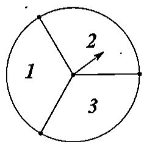  
甲

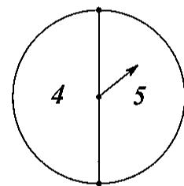  
乙

2. 有两个圆盘，一个四等分，一个三等分，用字母和数字表示区域，如  $A1$  ，  $A2$  等

（1）写出所有的结果；  
（2）求结果是  $B$  奇数的可能性的大小

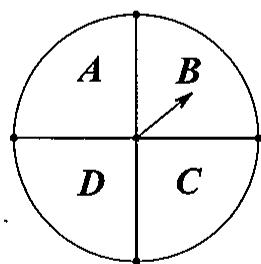

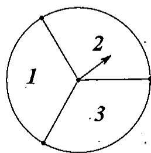

# 5.6等可能事件（2）

# A组

1. 气象预报员报道：“本市明天降雨的概率是  $90\%$ ”这句话的意思是（ ）.

（A）明天  $90\%$  的时间要下雨  
（B）明天一定会下雨  
（C）明天  $10\%$  的时间不下雨  
（D）明天下雨的可能性是  $90\%$  ，但也有可能不下雨

2. 把一个圆盘8等分，指针落在某一个区域的可能性是（ ）.

(A)  $\frac{1}{4}$

(B)  $\frac{1}{6}$

（C）  $\frac{1}{8}$

(D)  $\frac{1}{2}$

3. 有10张卡片，上面的编号为1到10，从中任取1张，则抽到卡号为合数的可能性为（ ）.

(A)  $10\%$

(B)  $20\%$

（c）  $30\%$

(D)  $50\%$

4. 将圆盘分成7块，其中有3块红色区域，3块蓝色区域，1块白色区域，指针绕着中心旋转，以下判断正确的是（ ）.

（A）指针箭头停在红色区域的可能性大小是  $\frac{1}{3}$  
（B）指针箭头停在红色区域的可能性是停在白色区域可能性的3倍  
（C）指针箭头停在红色区域的可能性和停在蓝色区域的可能性大小一样  
（D）以上说法都不对

5. 投掷两枚大小相同的均匀骰子，所得点数之和是 5 的可能性为 _______.  
6. 把只有颜色不同的 1 个红球和 2 个白球装入一个不透明的口袋里搅匀，从中随机地一次摸出 2 个球，得 1 红球 1 白球得可能性得大小是  
7. 有两把不同的锁和三把钥匙，其中两把钥匙分别能打开其中一把锁，第三把钥匙不能打开这两把锁，任意取出一把钥匙去开任意的一把锁，一次打开锁的可能性大小为 _______.  
8. 把一圆盘分成面积大小之比为  $1:2:3$  三个区域，指针绕着中心旋转，求指针落在最小区域的可能性大小是

9. 将分别标有数字 2、3、5 的三张质地、大小完全一样的卡片背面朝上放在桌子上.

（1）随意抽取一张，求抽到奇数的可能性大小；  
（2）随意抽取一张作为个位上的数字（不放回），再抽取一张作为十位上的数字，能组成哪些两位数？并求出抽取到的两位数恰好是35的可能性大小.

10. 盒子内有黑、白、红三种球共 100 个，如果黑球个数：白球个数  $= 1:3$ ，白球个数：红球个数  $= 1:2$ ，那么从盒子中任意拿 1 个球，求：

（1）拿到红球的可能性的大小；  
（2）拿到1个黑球或1个白球的可能性的大小

11. 甲袋中有红球4个、白球2个，乙袋中有蓝球7个，白球1个，每个球除颜色外都相同。问：从甲袋中任意摸1球，从乙袋中也任意摸1球，都摸到白球的可能性是多少？

12. 图为梅花和红心两组牌, 每组牌面上的数字都分别是 1, 2, 3, 如果从每组牌中各抽 1 张,

并将牌面上的数字相加，得数字和，求：

（1）牌面上的数字和为偶数的可能性大小；  
（2）牌面上的数字和为几的可能性最大？这个可能性是多少？

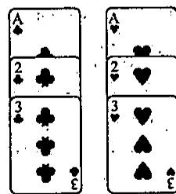

13. 小明和小亮玩一个游戏，三张大小、质地都相同的卡片上分别标有数字 1，2，3，现将标有数字一面朝下，小明从中任意抽取 1 张，记下数字后放回洗匀，然后小亮从中任意抽取 1 张，计算小明和小亮抽得的两个数字之和，如果和为奇数则小明胜，如果和为偶数则小亮胜。

（1）用列表法，列出小明和小亮抽得的数字之和所有可能出现的情况；  
（2）请判断该游戏对双方是否公平，并说明理由

# B组

1. 随机抛掷一枚用均匀材料做的骰子，计算：

（1）抛掷一次，朝上的一面出现的点数是素数的可能性是多少？  
（2）抛掷两次，将第一次朝上的一面的点数作为十位上的数字，第二次朝上的点数作为一个位上的数字，组成的两位数是素数的可能性是多少？  
（3）抛掷三次，依次把第一次、第二次、第三次朝上的点数作为三位数的百位上的数、十位上的数、个位上的数，组成的三位数是5的倍数的可能性是多少？

2. 一个不透明口袋中装有红球6个，黄球9个，绿球3个，这些球除颜色外没有区别。从中任意摸出一个球。

（1）计算摸到的是绿球的可能性的大小；  
（2）如果要使摸到绿球的可能性为  $\frac{1}{4}$ ，需要在这这个口袋中再放入多少个绿球？