# 提取的题目

**总数**: 372

---

## Review What You Know!

### 1 (练习题)

**题目**: 1. A(n) is a decimal that ends in repeating zeros.

---

### 2 (练习题)

**题目**: 2. A(n) ________ is a decimal in which a digit or digits repeat endlessly.

---

### 3 (练习题)

**题目**: 3. A(n) ________ is either a counting number, the opposite of a counting number, or zero.

---

### 4 (练习题)

**题目**: 4. A(n) ________ is a number that can be used to describe a part of a whole, a part of a set, a location on a number line, or a division of whole numbers.

---

### 5 (练习题)

**题目**: 5. 5.692

---

### 6 (练习题)

**题目**: 6. -0.222222...

---

### 7 (练习题)

**题目**: 7. 7.0001

---

### 8 (练习题)

**题目**: 8.7.28

---

### 9 (练习题)

**题目**: 9. 1.178

---

### 10 (练习题)

**题目**: 10. -4.03479

---

### 11 (练习题)

**题目**: 11.2·2

---

### 12 (练习题)

**题目**: 12.  $-5\cdot (-5)$

---

### 13 (练习题)

**题目**: 13.7·7

---

### 14 (练习题)

**题目**: 14.  $-6\cdot (-6)\cdot (-6)$

---

### 15 (练习题)

**题目**: 15.  ${10} \cdot  {10} \cdot  {10}$

---

### 16 (练习题)

**题目**: 16.  $-9\cdot (-9)\cdot (-9)$

---

### 17 (练习题)

**题目**: 17.  $(4\cdot 10) + (5\cdot 100)$

---

### 18 (练习题)

**题目**: 18.  $\left( {2 \cdot  {100}}\right)  + \left( {7 \cdot  {10}}\right)$

---

### 19 (练习题)

**题目**: 19.  $\left( {6 \cdot  {100}}\right)  - \left( {1 \cdot  {10}}\right)$

---

### 20 (练习题)

**题目**: 20.  $(9\cdot 1,000) + (4\cdot 10)$

---

### 21 (练习题)

**题目**: 21.  $(3\cdot 1,000) - (2\cdot 100)$

---

### 22 (练习题)

**题目**: 22.  $(2\cdot 10) + (7\cdot 100)$

---

## Lesson 1-1

### EXAMPLE 1 (例题)

**题目**: EXAMPLE 1

Write Repeating Decimals as Fractions
Scan for Multimedia

The Sluggers baseball team ended the season with the highest win percentage in their division. What is the Slugger's winning percentage written as a fraction?
Statistics are often rounded. Here, the decimal 0.555... or 0.5 is rounded to the thousandths place.

Locate 0.555... on a number line.
The decimal number 0.555... is between 0.5 and 0.6; so it is between  $\frac{1}{2}$ , or  $\frac{5}{10}$ , and  $\frac{6}{10}$ .

Reasoning How do you know that the repeating decimal 0.555... can be written as a fraction?
Write the repeating decimal as a fraction.
Assign a variable to represent the repeating decimal.
Let  $x = 0.5$
$$
1 0 \cdot x = 1 0 \cdot 0. \overline {{5}}
$$
$$
1 0 x = 5. \overline {{5}}
$$
$$
1 0 x - x = 5. \overline {{5}} - 0. \overline {{5}}
$$
$$
9 x = 5
$$
$$
\frac {9 x}{9} = \frac {5}{9}
$$
$$
x = \frac {5}{9}
$$
The Sluggers won  $\frac{5}{9}$  of their games.
Because 0.5 has 1 repeating digit, multiply each side of the equation by  $10^{1}$ , or 10.
Subtract 0.5 from each side of the equation, then solve for  $x$ . Because  $x = 0.5$ , you can subtract  $x$  from one side and 0.5 from the other side.

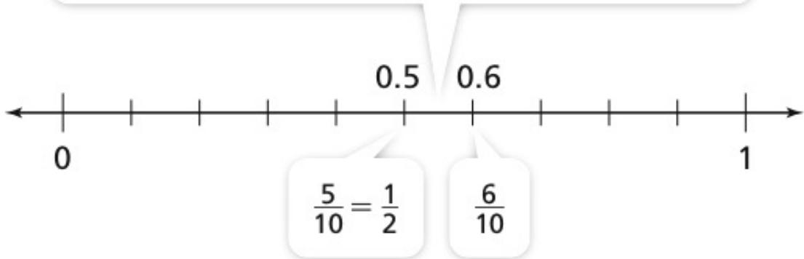

---

### Try It! (练习题)

**题目**: Try It!
In another baseball division, one team had a winning percentage of 0.444.... What fraction of their games did this team win?
The team won of their games.

---

### Convince Me! (练习题)

**题目**: Convince Me! How do you know what power of ten to multiply by in the second step at the right?
Let  $x = 0.\overline{4}$
$$
\begin{array}{l} \boxed { \begin{array}{r l} \end{array} } \cdot x = \boxed { \begin{array}{r l} \end{array} } \cdot 0. \overline {{4}} \\ \boxed { \begin{array}{c} \hline \hline \hline \hline \hline \hline \hline \hline \hline \hline \hline \hline \hline \hline \hline \hline \hline \hline \hline \hline \hline \hline \hline \hline \hline \hline \hline \hline \hline \hline \hline \hline \hline \hline 0. 5 m ^ {2} = 0. 5 m ^ {2} = 0. 5 m ^ {2} = 0. 5 m ^ {2} = 0. 5 m ^ {2} = 0. 5 m ^ {2} = 0. 5 m ^ {2} = 0. 5 m ^ {2} = 0. 5 m ^ {2} = 0. 5 m ^ {2} = \\ - x = \boxed {0. 4} \\ \boxed { \begin{array}{c} \hline \hline \hline \hline \hline \hline \hline \hline \hline \hline \hline \hline \hline \hline \hline \hline \hline \hline \hline \hline \hline \hline \hline \hline \hline \hline \hline \hline \hline \hline \hline \hline \hline \hline 0. 5 m ^ {2} = 1. 0 m ^ {2} = 1. 5 m ^ {2} = 2. 0 m ^ {2} = 3. 0 m ^ {2} = 4. 0 m ^ {2} = 5. 0 m ^ {2} = 6. 0 m ^ {2} = 7. 0 m ^ {2} = 8. 0 m ^ {2} = 9. 0 m ^ {2} = 1 0. 0 m ^ {2} = 1 1. 0 m ^ {2} = 1 2. 0 m ^ {2} = 1 3. 0 m ^ {2} = 1 4. 0 m ^ {2} = 1 5. 0 m ^ {2} = 1 6. 0 m ^ {2} = 1 7. 0 m ^ {2} = 1 8. 0 m ^ {2} = 1 9. 0 m ^ {2} = 2 0. 0 m ^ {2} = 2 1. 0 m ^ {2} = 2 2. 0 m ^ {2} = 2 3. 0 m ^ {2} = 2 4. 0 m ^ {2} = 2 5. 0 m ^ {2} = 2 6. 0 m ^ {2} = 2 7. 0 m ^ {2} = 2 8. 0 m ^ {2} = 2 9. 0 m ^ {2} = 3 0. 0 m ^ {2}} \\ x = \boxed {} \\ \end{array}
$$

---

### Try It! (练习题)

**题目**: Try It!
Write the repeating decimal 0.6333... as a fraction.

---

### EXAMPLE 3 (例题)

**题目**: EXAMPLE 3

Write Decimals with Multiple Repeating Digits as Fractions
Write 2.09 as a mixed number.
Let  $x = 2.09$
${100} \cdot  x = {100} \cdot  {2.09}$
$$
1 0 0 x - x = 2 0 9. \overline {{0 9}} - 2. \overline {{0 9}}
$$
$$
9 9 x = 2 0 7
$$
$$
x = \frac {2 0 7}{9 9} \text {o r} 2 \frac {1}{1 1}
$$
The repeating decimal has 2 repeating digits, so multiply each side of the equation by  $10^{2}$ , or 100.
Subtract  $x$  from one side of the equation and its equivalent 2.09 from the other side of the equation.
Use Structure How do you know that subtracting  $x$  from one side of the equation and subtracting 2.09 from the other side results in an equivalent equation?

---

### Try It! (练习题)

**题目**: Try It!
Write the repeating decimal 4.1363636... as a fraction.

---

### 1 (练习题)

**题目**: 1. Essential Question How can you write repeating decimals as fractions?

---

### 2 (练习题)

**题目**: 2. Use Structure Why do you multiply by a power of 10 when writing a repeating decimal as a rational number?

---

### 3 (练习题)

**题目**: 3. Be Precise How do you decide by which power of 10 to multiply an equation when writing a decimal with repeating digits as a fraction?

---

### 4 (练习题)

**题目**: 4. A survey reported that  $63.63\%$  of moviegoers prefer action films. This percent represents a repeating decimal. Write it as a fraction.

---

### 5 (练习题)

**题目**: 5. A student estimates the weight of astronauts on the Moon by multiplying their weight by the decimal 0.16666.... What fraction can be used for the same estimation?

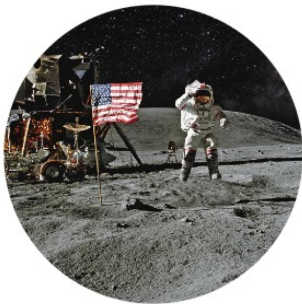

---

### 6 (练习题)

**题目**: 
6. Write 2.3181818... as a mixed number.

---

### 7 (练习题)

**题目**: 7. Write the number 0.21212121... as a fraction.

---

### 8 (练习题)

**题目**: 8. Write 3.7 as a mixed number.

---

### 9 (练习题)

**题目**: 9. Write the number shown on the scale as a fraction.

---

### 10 (练习题)

**题目**: 10. Tomas asked 15 students whether summer break should be longer. He used his calculator to divide the number of students who said yes by the total number of students. His calculator showed the result as 0.9333....
a. Write this number as a fraction.
b. How many students said that summer break should be longer?

---

### 11 (练习题)

**题目**: 11. Write 0.87 as a fraction.

---

### 13 (练习题)

**题目**: 13. Write 1.48 as a mixed number.

---

### 14 (练习题)

**题目**: 14. Write 0.6 as a fraction.

---

### 15 (练习题)

**题目**: 15. A manufacturer determines that the cost of making a computer component is \(2.161616. Write the cost as a fraction and as a mixed number.

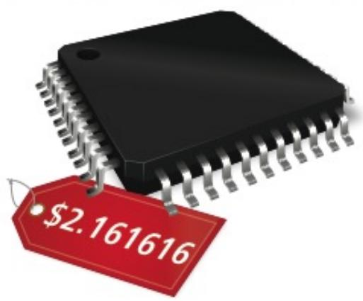

---

### 16 (练习题)

**题目**: 16. Reasoning When writing a repeating decimal as a fraction, does the number of repeating digits you use matter? Explain.

---

### 17 (练习题)

**题目**: 17. Higher Order Thinking When writing a repeating decimal as a fraction, why does the fraction always have only 9s or 9s and 0s as digits in the denominator?

---

### 18 (练习题)

**题目**: 18. Which decimal is equivalent to  $\frac{188}{11}$ ? 8.NS.1.1
A  ${17.09}$
$⑧$  17.009
$\odot$  17.1709
$⑤$  17.17090

---

### 19 (练习题)

**题目**: 19. Which repeating decimal is equal to each fraction? 8.NS.1.1
[Table Row] <tr><td></td><td>0.17</td><td>0.351</td></tr>
[Table Row] <tr><td>348/990 = 58/165</td><td>□</td><td>□</td></tr>
[Table Row] <tr><td>316/900 = 79/225</td><td>□</td><td>□</td></tr>
[Table Row] <tr><td>351/999 = 13/37</td><td>□</td><td>□</td></tr>
[Table Row] <tr><td>16/90 = 8/45</td><td>□</td><td>□</td></tr>
[Table Row] <tr><td>17/99</td><td>□</td><td>□</td></tr>

---

## Lesson 1-2

### A (练习题)

**题目**: A. Construct Arguments Is Nora or Sofia correct? Explain your reasoning.

---

### B (练习题)

**题目**: B. Use Structure What is another nonterminating decimal number that can not be written as a fraction.

---

### Focus (练习题)

**题目**: Construct Arguments Is 0.12112111211112... a rational number? Explain.

---

### EXAMPLE 1 (例题)

**题目**: EXAMPLE 1

Identify Irrational Numbers

The Venn diagram shows the relationships among rational numbers.
How would you classify the number 0.24758326...?
Reasoning How can you use the definition of each number set to classify numbers?

0.24758326...
The decimal expansion does not terminate or repeat, so it cannot be written as a ratio of two integers.
The number 0.24758326... is not a rational number.
Numbers that are not rational are called irrational. An irrational number is a number that cannot be written in the form  $\frac{a}{b}$ , where  $a$  and  $b$  are integers and  $b \neq 0$ .

The number 0.24758326... is irrational because the decimal expansion is nonrepeating and nonterminating.

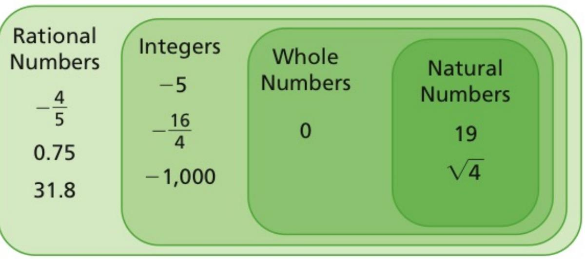

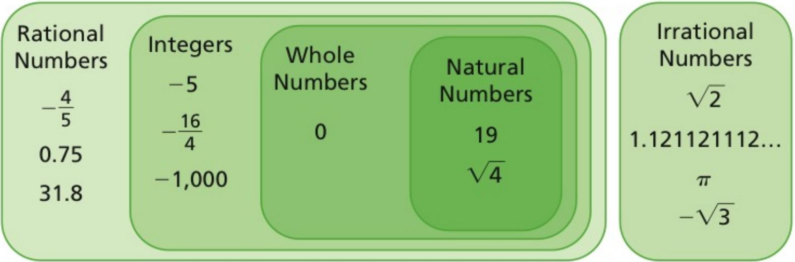

**解答**: The decimal expansion does not terminate or repeat, so it cannot be written as a ratio of two integers.
The number 0.24758326... is not a rational number.
Numbers that are not rational are called irrational. An irrational number is a number that cannot be written in the form  $\frac{a}{b}$ , where  $a$  and  $b$  are integers and  $b \neq 0$ .
The number 0.24758326... is irrational because the decimal expansion is nonrepeating and nonterminating.

---

### Try It! (练习题)

**题目**: Try It!
Classify each number as rational or irrational.
[Table Row] <tr><td>π</td><td>3.565565556...</td></tr>
[Table Row] <tr><td>0.04053661...</td><td>-17</td></tr>
[Table Row] <tr><td>0.76</td><td>3.275</td></tr>

---

### Convince Me! (练习题)

**题目**: Convince Me! Construct Arguments Jen classifies the number
4.567 as irrational because it does not repeat. Is Jen correct?
Explain.

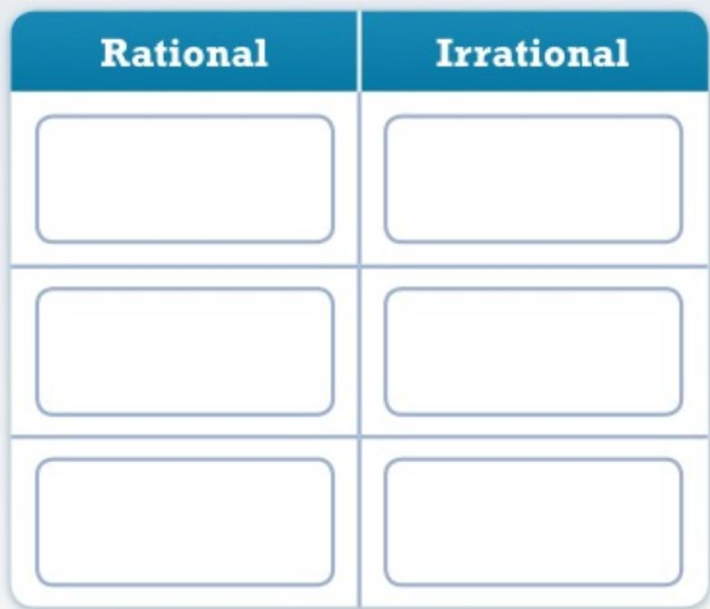

---

### Classify √3 (练习题)

**题目**: Classify  $\sqrt{3}$
$\sqrt{3}$  means "the nonnegative square root of 3."
The square root of a number is a number that when multiplied by itself equals the original number. The radical symbol  $\sqrt{}$  is used to denote the nonnegative square root.

---

### EXAMPLE 3 (例题)

**题目**: EXAMPLE 3

Classify Numbers as Rational or Irrational
Classify each number as rational or irrational. Explain how you classified each number.
-81,572
√11
5.636336333...
√16

**解答**: -81,572 is an integer and can be written as the fraction  $\frac{-81,572}{1}$  so it is rational.
Rational
-81,572
√16
Irrational
√11
5.636336333...
11 is not a perfect square, so  $\sqrt{11}$  is irrational.
The number 16 is a perfect square, so  $\sqrt{16} = 4$  is rational.
This decimal expansion does not repeat or terminate, so it is irrational.

---

### Try It! (练习题)

**题目**: Try It!
Classify each number as rational or irrational and explain.
2 3
√25
-0.75
√2
7,548,123

---

### 1 (练习题)

**题目**: 1. Essential Question How is an irrational number different from a rational number?

---

### 2 (练习题)

**题目**: 2. Reasoning How can you tell whether a square root of a whole number is rational or irrational?

---

### 3 (练习题)

**题目**: 3. Construct Arguments Could a number ever be both rational and irrational? Explain.

---

### 4 (练习题)

**题目**: 4. Is the number 65.4349224... rational or irrational? Explain.

---

### 5 (练习题)

**题目**: 5. Is the number  $\sqrt{2,500}$  rational or irrational? Explain.

---

### 6 (练习题)

**题目**: 6. Classify each number as rational or irrational.
4.27 0.375 0.232342345... √62 -1
[Table Row] <tr><td>Rational</td><td>Irrational</td></tr>
[Table Row] <tr><td></td><td></td></tr>
[Table Row] <tr><td></td><td></td></tr>
[Table Row] <tr><td></td><td></td></tr>

---

### 7 (练习题)

**题目**: 7. Is 5.787787778... a rational or irrational number? Explain.

---

### 8 (练习题)

**题目**: 8. Is  $\sqrt{42}$  rational or irrational? Explain.

---

### 9 (练习题)

**题目**: 9. A teacher places seven cards, lettered A-G, on a table. Which cards show irrational numbers?

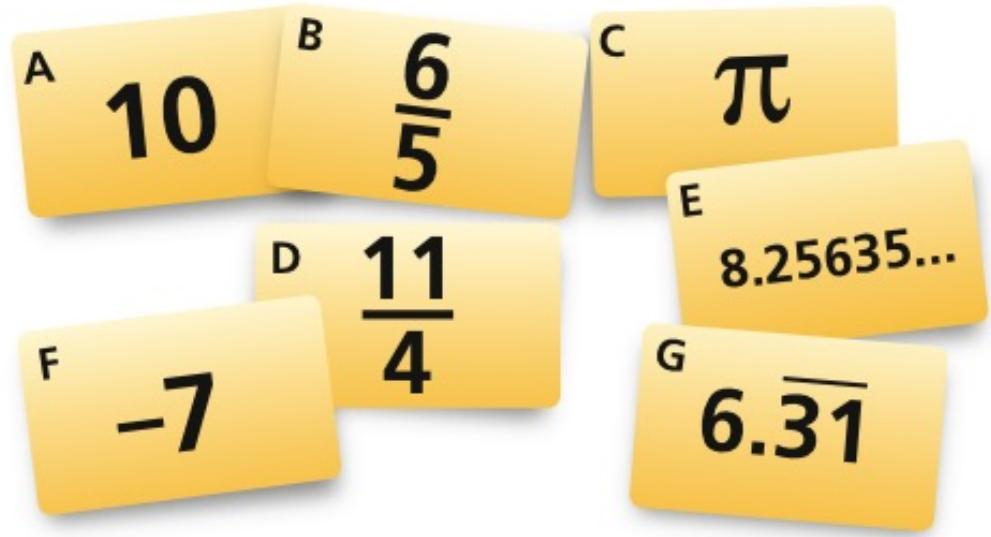

---

### 10 (练习题)

**题目**: 10. Circle the irrational number in the list below.
7.27  $\frac{5}{9}$ $\sqrt{15}$ $\sqrt{196}$

---

### 11 (练习题)

**题目**: 11. Lisa writes the following list of numbers.
5.737737773...，26,√45,-2,0,9
a. Which numbers are rational?
b. Which numbers are irrational?

---

### a (练习题)

**题目**: a. Which numbers are rational?

---

### b (练习题)

**题目**: b. Which numbers are irrational?

---

### 12 (练习题)

**题目**: 12. Construct Arguments Deena says that 9.565565556... is a rational number because it has a repeating pattern. Do you agree? Explain.

---

### 13 (练习题)

**题目**: 13. Is  $\sqrt{1,815}$  rational? Explain.

---

### 14 (练习题)

**题目**: 14. Is the decimal form of  $\frac{13}{3}$  a rational number? Explain.

---

### 15 (练习题)

**题目**: 15. Write the side length of the square rug as a square root. Is the side length a rational or irrational number? Explain.

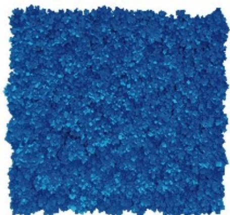

---

### 6 (练习题)

**题目**: 6. Classify each number as rational or irrational.
4.27 0.375 0.232342345... √62 -1

---

### 16 (练习题)

**题目**: 16. Reasoning The numbers 2.888... and 2.999... are both rational numbers. What is an irrational number that is between the two rational numbers?

---

### 17 (练习题)

**题目**: 17. Higher Order Thinking You are given the expressions  $\sqrt{76 + n}$  and  $\sqrt{2n + 26}$ . What is the smallest value of  $n$  that will make each number rational?

---

### 18 (练习题)

**题目**: 18. Which numbers are rational? 8.NS.1.1
1. 1.111111...
II. 1.567
III. 1.101101110...
A II and III
B III only
$\odot$  II only
D I and II
E I only
F None of the above

---

### 19 (练习题)

**题目**: 19. Determine whether the following numbers are rational or irrational. 8.NS.1.1
[Table Row] <tr><td></td><td>Rational</td><td>Irrational</td></tr>
[Table Row] <tr><td>8/5</td><td>□</td><td>□</td></tr>
[Table Row] <tr><td>π</td><td>□</td><td>□</td></tr>
[Table Row] <tr><td>0</td><td>□</td><td>□</td></tr>
[Table Row] <tr><td>√1</td><td>□</td><td>□</td></tr>
[Table Row] <tr><td>4.46466...</td><td>□</td><td>□</td></tr>
[Table Row] <tr><td>-6</td><td>□</td><td>□</td></tr>
[Table Row] <tr><td>√2</td><td>□</td><td>□</td></tr>

---

## Lesson 1-3

### EXAMPLE 1 (例题)

**题目**: EXAMPLE 1

Approximate an Irrational Number
Scan for Multimedia

Darcy wants to add the ribbon shown along the diagonal of the rectangular flag she is designing. Does Darcy have enough ribbon? Explain.

Approximate  $\sqrt{74}$  using perfect squares.
Because 74 lies between the two consecutive perfect squares 64 and 81,  $\sqrt{74}$  is located between  $\sqrt{64}$  and  $\sqrt{81}$ .

Find a better approximation by squaring decimals between 8 and 9. Then compare.
Reasoning Which decimals can you use to find a better approximation?

The length of the diagonal,  $\sqrt{74}$ , is about 8.6 feet. Darcy does not have enough ribbon.

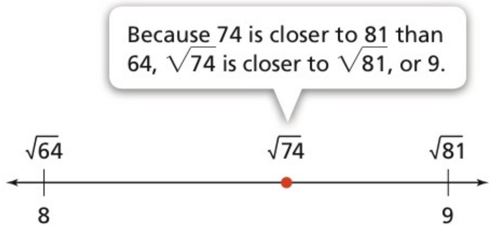

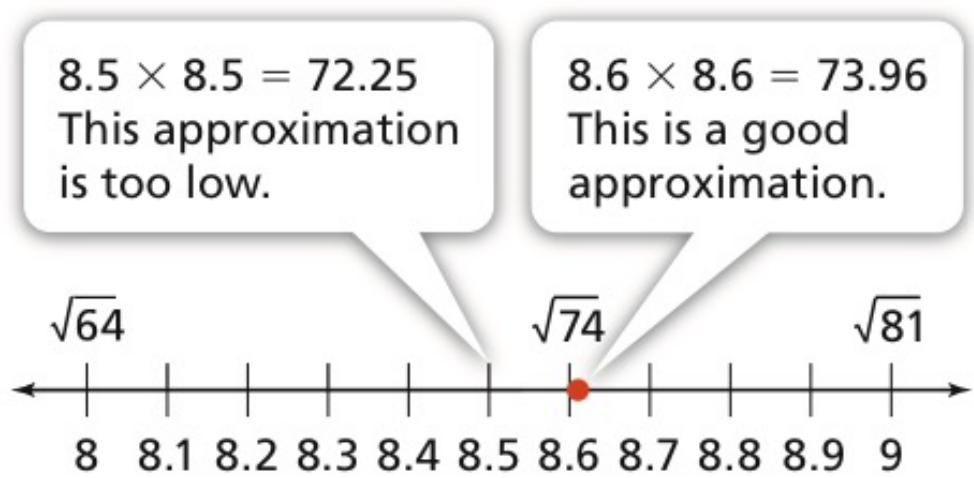

---

### Try It! (练习题)

**题目**: Try It!
Between which two whole numbers is  $\sqrt{12}$ ?

Convince Me! Which of the two numbers is a better estimate for  $\sqrt{12}$ ? Explain.

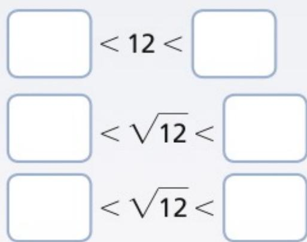

---

### Convince Me! (练习题)

**题目**: Convince Me! Which of the two numbers is a better estimate for  $\sqrt{12}$ ? Explain.

---

### Compare (练习题)

**题目**: Compare  $\sqrt{32}$  and 5.51326... . Plot each number at its approximate location on a number line.
STEP 1 Approximate  $\sqrt{32}$  by using perfect squares.
$$
\begin{array}{l} 2 5 <   3 2 <   3 6 \\ \sqrt {2 5} <   \sqrt {3 2} <   \sqrt {3 6} \\ 5 <   \sqrt {3 2} <   6 \\ \end{array}
$$
Look for Relationships

---

### EXAMPLE 3 (例题)

**题目**: EXAMPLE 3

Compare and Order Rational and Irrational Numbers
Compare and order the numbers below.
$$
\pi^ {2}, 9 \frac {1}{2}, 9. 8, 9. \overline {{5}}, \sqrt {9 4}
$$
STEP 1 Use rational approximation to estimate the values of irrational numbers.
$$
\begin{array}{l} \pi^ {2} \approx 3. 1 4 \times 3. 1 4 \approx 9. 8 5 9 6 \\ 9 \frac {1}{2} = 9. 5 \\ 9. 8 \\ 9. \overline {{5}} = 9. 5 5 5 5 \dots \\ \sqrt {9 4} \approx 9. 7 \\ \end{array}
$$
STEP 2 Plot each approximation on a number line.

$$
\mathrm {S o}, 9 \frac {1}{2} <   9. \overline {{5}} <   \sqrt {9 4} <   9. 8 <   \pi^ {2}.
$$

---

### Try It! (练习题)

**题目**: Try It!
Compare and order the following numbers:
$$
\sqrt {1 1}, 2 \frac {1}{4}, - 2. 5, 3. \overline {{6}}, - 3. 9 7 6 2 1 \dots
$$

---

### 1 (练习题)

**题目**: 1. Essential Question How can you compare and order rational and irrational numbers?

---

### 2 (练习题)

**题目**: 2. Reasoning The "leech" is a technical term for the slanted edge of a sail. Is the length of the leech shown closer to 5 meters or 6 meters? Explain.

---

### 3 (练习题)

**题目**: 3. Construct Arguments Which is a better approximation of  $\sqrt{20}$ , 4.5 or 4.47? Explain.

---

### 4 (练习题)

**题目**: 4. Approximate  $\sqrt{39}$  to the nearest whole number.

---

### 5 (练习题)

**题目**: 5. Approximate  $\sqrt{18}$  to the nearest tenth and plot the number on a number line.

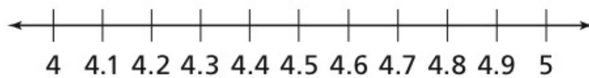

---

### 6 (练习题)

**题目**: 6. Compare 5.7145... and  $\sqrt{29}$ . Show your work.

---

### 7 (练习题)

**题目**: 7. Compare and order the following numbers:  $5.2, -5.6, 3\frac{9}{10}, \sqrt{21}$

---

### 8 (练习题)

**题目**: 8. Leveled Practice Find the rational approximation of  $\sqrt{15}$ .
a. Approximate using perfect squares.

b. Locate and plot  $\sqrt{15}$  on a number line. Find a better approximation using decimals.

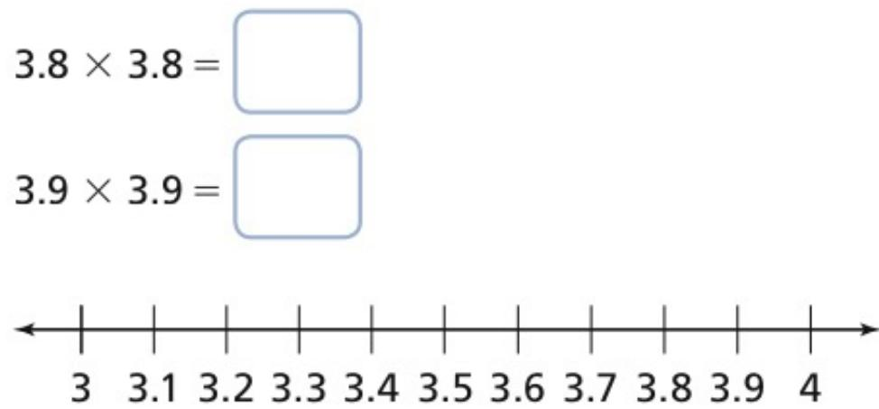

---

### 9 (练习题)

**题目**: 9. Compare  $-1.96312\ldots$  and  $-\sqrt{5}$ . Show your work.

---

### 10 (练习题)

**题目**: 10. Does  $\frac{1}{6}, -3, \sqrt{7}, -\frac{6}{5}$ , or 4.5 come first when the numbers are listed from least to greatest? Explain.

---

### 11 (练习题)

**题目**: 11. A museum director wants to hang the painting on a wall. To the nearest foot, how tall does the wall need to be?

---

### 12 (练习题)

**题目**: 12. Dina has several small clay pots. She wants to display them in order of height, from shortest to tallest. What will be the order of the pots?

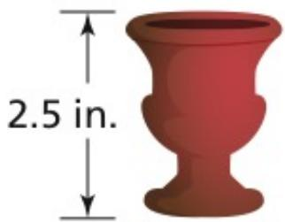

---

### 13 (练习题)

**题目**: 13. Rosie is comparing  $\sqrt{7}$  and 3.44444... . She says that  $\sqrt{7} > 3.44444$  ... because  $\sqrt{7} = 3.5$ .
a. What is the correct comparison?
b. Critique Reasoning What mistake did Rosie likely make?

---

### 14 (练习题)

**题目**: 14. Model with Math Approximate  $-\sqrt{23}$  to the nearest tenth. Draw the point on the number line.

---

### 15 (练习题)

**题目**: 15. Higher Order Thinking The length of a rectangle is twice the width. The area of the rectangle is 90 square units. Note that you can divide the rectangle into two squares.
a. Which irrational number represents the length of each side of the squares?
b. Estimate the length and width of the rectangle.
Area  $= 90$  square units

---

### 16 (练习题)

**题目**: 16. Which list shows the numbers in order from least to greatest? 8.NS.1.2
A  $-4, -\frac{9}{4}, \frac{1}{2}, 3.7, \sqrt{5}$
B  $-4, -\frac{9}{4}, \frac{1}{2}, \sqrt{5}, 3.7$
C  $-\frac{9}{4},\frac{1}{2},3.7,\sqrt{5}, - 4$
(2)  $\sqrt{\frac{9}{4}} - 4, \frac{1}{2}, 3.7, \sqrt{5}$

---

### 17 (练习题)

**题目**: 17. The area of a square poster is 31 square inches. Find the length of one side of the poster. Explain. 8.EE.1.2
PART A
To the nearest whole inch
PART B
To the nearest tenth of an inch

---

### Solve & Discuss It! (练习题)

**题目**: Solve & Discuss It!
Matt and his dad are building a tree house. They buy enough flooring material to cover an area of 36 square feet. What are all possible dimensions of the floor?

---

## Lesson 1-4

### EXAMPLE 1 (例题)

**题目**: EXAMPLE 1

Evaluate Cube Roots to Solve Problems
Scan for Multimedia

Leah is building a bird house for purple martins, birds that prefer cube-shaped birdhouses. What are the dimensions of each square piece of wood Leah needs to build the 216 cubic-inch birdhouse?
Reasoning What do you know about the length, width, and height of the birdhouse?

Draw and label a cube to represent the birdhouse.

$$
\begin{array}{l} 2 1 6 = s \cdot s \cdot s \\ 2 1 6 = s ^ {3} \\ \end{array}
$$
A number that is a cube of an integer is a perfect cube.
The number 216 is also a perfect cube.
To find the value of  $s$ , find the cube root of 216. The cube root of a number is a number whose cube is equal to that number.
The symbol  $\sqrt[3]{\cdot}$  means the cube root of a number.
$$
\begin{array}{l} \sqrt [ 3 ]{2 1 6} = \sqrt [ 3 ]{6 \cdot 6 \cdot 6} \\ = \sqrt [ 3 ]{6 ^ {3}} \\ = 6 \\ \end{array}
$$
Taking the cube root and cubing a number are inverse operations.
The dimensions of each square piece of wood are 6 inches by 6 inches.

**解答**: Try It!
A cube-shaped art sculpture has a volume of 64 cubic feet. What is the length of each edge of the cube?
The length of each edge is feet.
$$
\begin{array}{l} \sqrt [ 3 ]{6 4} = \sqrt [ 3 ]{\square \cdot \square \cdot \square} \\ \sqrt [ 3 ]{6 4} = \sqrt [ 3 ]{\square} ^ {3} \\ \sqrt [ 3 ]{6 4} = \boxed {} \\ \end{array}
$$
Convince Me! How can you find the cube root of 64?

---

### EXAMPLE 2 (例题)

**题目**: EXAMPLE 2

Evaluate Perfect Squares and Perfect Cubes

ACTIVITY

**解答**: ASSESS
Evaluate.
A.  $\sqrt[3]{64}$
$$
\begin{array}{l} \sqrt [ 3 ]{6 4} = \sqrt [ 3 ]{4 \cdot 4 \cdot 4} \\ = \sqrt [ 3 ]{4 ^ {3}} \\ = 4 \\ \end{array}
$$
B.  $\sqrt{100}$
$$
\begin{array}{l} \sqrt {1 0 0} = \sqrt {1 0 \cdot 1 0} \\ = \sqrt {1 0 ^ {2}} \\ = 1 0 \\ \end{array}
$$
C.  $\sqrt{49}$
$$
\begin{array}{l} \sqrt {4 9} = \sqrt {7 \cdot 7} \\ = \sqrt {7 ^ {2}} \\ = 7 \\ \end{array}
$$
D.  $\sqrt[3]{8}$
$$
\begin{array}{l} \sqrt [ 3 ]{8} = \sqrt [ 3 ]{2 \cdot 2 \cdot 2} \\ = \sqrt [ 3 ]{2 ^ {3}} \\ = 2 \\ \end{array}
$$

Try It!
Evaluate.

---

### A (练习题)

**题目**: A.  $\sqrt[3]{64}$
$$
\begin{array}{l} \sqrt [ 3 ]{6 4} = \sqrt [ 3 ]{4 \cdot 4 \cdot 4} \\ = \sqrt [ 3 ]{4 ^ {3}} \\ = 4 \\ \end{array}
$$

---

### B (练习题)

**题目**: B.  $\sqrt{100}$
$$
\begin{array}{l} \sqrt {1 0 0} = \sqrt {1 0 \cdot 1 0} \\ = \sqrt {1 0 ^ {2}} \\ = 1 0 \\ \end{array}
$$

---

### C (练习题)

**题目**: C.  $\sqrt{49}$
$$
\begin{array}{l} \sqrt {4 9} = \sqrt {7 \cdot 7} \\ = \sqrt {7 ^ {2}} \\ = 7 \\ \end{array}
$$

---

### D (练习题)

**题目**: D.  $\sqrt[3]{8}$
$$
\begin{array}{l} \sqrt [ 3 ]{8} = \sqrt [ 3 ]{2 \cdot 2 \cdot 2} \\ = \sqrt [ 3 ]{2 ^ {3}} \\ = 2 \\ \end{array}
$$

---

### EXAMPLE 3 (例题)

**题目**: EXAMPLE 3
Evaluate Square Roots to Solve Problems
Sean cuts one sheet of colorful poster paper to cover the bulletin board exactly. What are the dimensions of the poster paper?
Find the square root of the area to find the side lengths of the bulletin board.
$$
\begin{array}{l} \sqrt {1 4 4} = \sqrt {1 2 \cdot 1 2} \\ = \sqrt {1 2 ^ {2}} \\ = 1 2 \\ \end{array}
$$
Each side of the bulletin board measures 12 inches. Sean will need to cut a 12-inch by 12-inch sheet of poster paper.

---

### 1 (练习题)

**题目**: 1. Essential Question How do you evaluate cube roots and square roots?

---

### 2 (练习题)

**题目**: 2. Generalize A certain number is both a perfect square and a perfect cube. Will its square root and its cube root always be different numbers? Explain.

---

### 3 (练习题)

**题目**: 3. Critique Reasoning A cube-shaped box has a volume of 27 cubic inches. Bethany says each side of the cube measures 9 inches because  $9 \times 3 = 27$ . Is Bethany correct? Explain your reasoning.

---

### 4 (练习题)

**题目**: 4. A cube has a volume of 8 cubic inches. What is the length of each edge of the cube?

---

### 5 (练习题)

**题目**: 5. Below is a model of the infeld of a baseball stadium. How long is each side of the infeld?

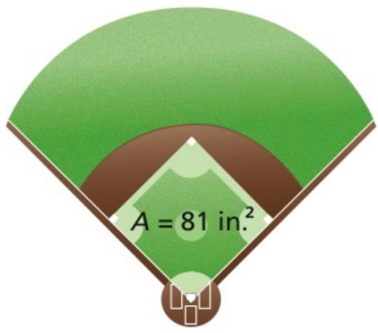

---

### 6 (练习题)

**题目**: 6. Julio cubes a number and then takes the cube root of the result. He ends up with 20. What number did Julio start with?

---

### 7 (练习题)

**题目**: Leveled Practice In 7 and 8, evaluate the cube root or square root.
7. Relate the volume of the cube to the length of each edge.

Edge length Edge length Edge length

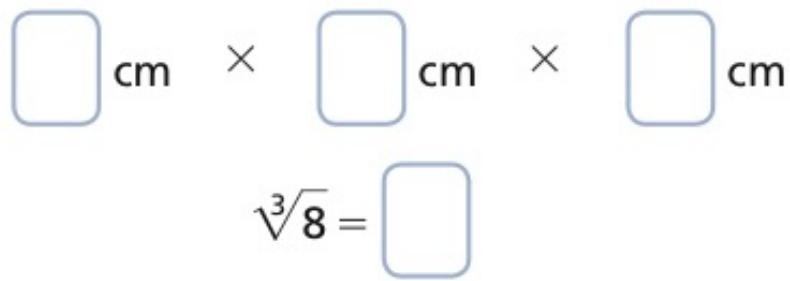

---

### 8 (练习题)

**题目**: 
8. Relate the area of the square to the length of each side.

Side length Side length

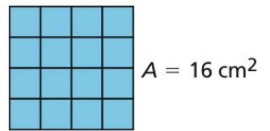

---

### 9 (练习题)

**题目**: 9. Would you classify the number 169 as a perfect square, a perfect cube, both, or neither? Explain.

---

### 10 (练习题)

**题目**: 10. The volume of a cube is 512 cubic inches. What is the length of each side of the cube?

---

### 11 (练习题)

**题目**: 11. A square technology chip has an area of 25 square centimeters. How long is each side of the chip?

---

### 12 (练习题)

**题目**: 12. Would you classify the number 200 as a perfect square, a perfect cube, both, or neither? Explain.

---

### 13 (练习题)

**题目**: 13. A company is making building blocks. What is the length of each side of the block?

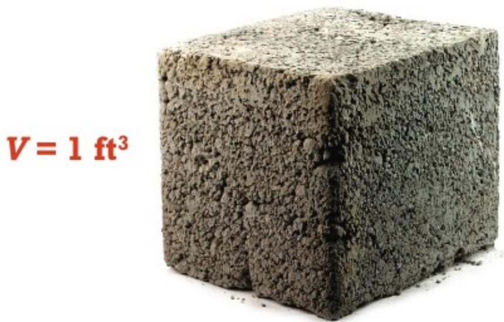

---

### 14 (练习题)

**题目**: 14. Mrs. Drew wants to build a square sandbox with an area of 121 square feet. What is the total length of wood Mrs. Drew needs to make the sides of the sandbox?

---

### 15 (练习题)

**题目**: 15. Construct Arguments Diego says that if you cube the number 4 and then take the cube root of the result, you end up with 8. Is Diego correct? Explain.

---

### 16 (练习题)

**题目**: 16. Higher Order Thinking Talia is packing a moving box. She has a square-framed poster with an area of 9 square feet. The cube-shaped box has a volume of 30 cubic feet. Will the poster lie flat in the box? Explain.

---

### 17 (练习题)

**题目**: 17. Which expression has the greatest value? 8.EE.1.2
A  $\sqrt{49} \cdot 2$
B  $\sqrt{49} -\sqrt{16}$
$\odot \sqrt{25} +\sqrt{16}$
D  $\sqrt{25} \cdot 3$

---

### 18 (练习题)

**题目**: 18. A toy has various shaped objects that a child can push through matching holes. The area of the square hole is 8 square centimeters. The volume of a cube-shaped block is 64 cubic centimeters. 8.EE.1.2
PART A
Which edge length can you find? Explain.
PART B
Will the block fit in the square hole? Explain.

---

### Solve & Discuss It! (练习题)

**题目**: Solve & Discuss It!

---

### 662 (练习题)

**题目**: Janine can use up to 150 one-inch blocks to build a solid, cube-shaped model. What are the dimensions of the
possible models that she can build? How many blocks would Janine use for each model? Explain.

---

## Lesson 1-5

### 679 (练习题)

**题目**: Reasoning Janine wants to build a model using  $\frac{1}{2}$ -inch cubes. How many  $\frac{1}{2}$ -inch cubes would she use to build a solid, cube-shaped model with side lengths of 4 inches? Show your work.

---

### EXAMPLE 1 (例题)

**题目**: EXAMPLE 1

Solve Equations Involving Perfect Squares

Darius is restoring a square tabletop. He wants to finish the outside edges with a piece of decorative molding. What total length of molding will Darius need?

Draw a diagram to represent the tabletop.

Use the formula  $A = s^2$  to find each side length. To solve, take the square root of both sides of the equation.
$$
\begin{array}{l} A = s ^ {2} \\ 2 5 = s ^ {2} \\ \sqrt {2 5} = \sqrt {s ^ {2}} \\ \pm 5 = s \\ \end{array}
$$
Because  $5^{2} = 5 \times 5 = 25$
$$
\begin{array}{l} \text {a n d} (- 5) ^ {2} = - 5 \times - 5 = 2 5, \\ s = 5 \text {a n d} s = - 5, \text {o r} s = \pm 5. \\ \end{array}
$$
Since length is positive, each side length of the tabletop is 5 feet. Darius needs 20 feet of decorative molding.

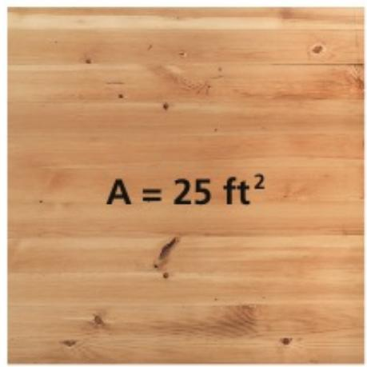

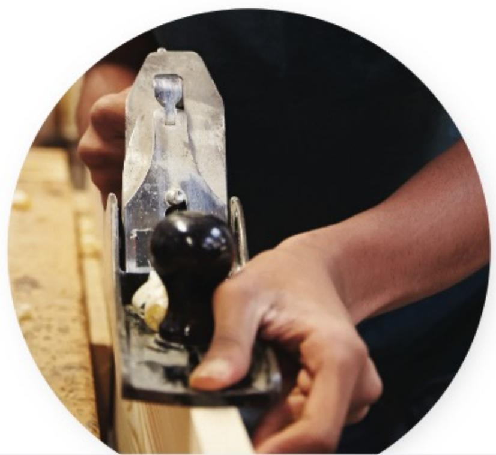

**解答**: Generalize In general, an equation of the form  $x^{2} = p$ , where  $p$  is a positive rational number, has two solutions,  $x = \pm \sqrt{p}$ .

---

### Try It! (练习题)

**题目**: Try It!
What is the side length,  $s$ , of the square below?

$$
\begin{array}{l} A = s ^ {2} \\ \boxed { \begin{array}{l} \end{array} } = s ^ {2} \\ \boxed { \begin{array}{l} \end{array} } = \sqrt {s ^ {2}} \\ \pm \square = s \\ \end{array}
$$
Each side of the square measures meters.

---

### Convince Me! (练习题)

**题目**: Convince Me! Why are there two possible solutions to the equation  $s^2 = 100$ ? Explain why only one of the solutions is valid in this situation.

---

### 703 (练习题)

**题目**: Kyle has a large, cube-shaped terrarium for his iguana. He wants to cover the opening with a square screen. What are the dimensions,  $s,$  for the screen?
$$
\begin{array}{l} V = s ^ {3} \\ 3 4 3 = s ^ {3} \\ \sqrt [ 3 ]{3 4 3} = \sqrt [ 3 ]{s ^ {3}} \\ 7 = s \\ \end{array}
$$
The value of s is not  $\pm \sqrt[3]{343}$  because
$$
\begin{array}{l} (- 7) ^ {3} = - 7 \times - 7 \times - 7 \\ = - 3 4 3. \\ \end{array}
$$
Each edge of the terrarium is 7 feet, so the dimensions of the screen are 7 feet by 7 feet.

---

### Try It! (练习题)

**题目**: Try It!
Solve  $x^3 = 64$ .

---

### EXAMPLE 3 (例题)

**题目**: EXAMPLE 3

Solve Equations Involving Imperfect Squares and Cubes
Solve for  $x$ .
A.  ${x}^{2} = {50}$
$$
\sqrt {x ^ {2}} = \sqrt {5 0}
$$
$$
x = \pm \sqrt {5 0}
$$
Because 50 is not a perfect square, write the solution using the square root symbol.
There are two possible solutions,  $x = +\sqrt{50}$  and  $x = -\sqrt{50}$ .
B.  $x^{3} = 37$
$$
\sqrt [ 3 ]{x ^ {3}} = \sqrt [ 3 ]{3 7}
$$
$$
x = \sqrt [ 3 ]{3 7}
$$
$x = \sqrt[3]{37}$  is an exact solution of the equation.
There is one possible solution,  $x = \sqrt[3]{37}$ .

**解答**: Try It!
a. Solve  $a^3 = 11$ .
b. Solve  $c^2 = 27$ .

---

### 8 (练习题)

**题目**: 8.  ${z}^{2} = 1$
$$
\begin{array}{l} \sqrt {\square} = \sqrt {\square} \\ z = \pm \boxed {} \\ \end{array}
$$
The solutions are and

---

### 9 (练习题)

**题目**: 9.  $a^3 = 216$
$$
\begin{array}{l} \sqrt [ 3 ]{\square} = \sqrt [ 3 ]{\square} \\ a = \boxed {} \\ \end{array}
$$

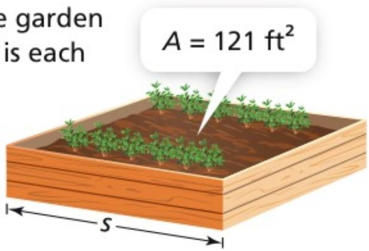

---

### 10 (练习题)

**题目**: 10. Solve  $v^2 = 47$ .

---

### 11 (练习题)

**题目**: 11. The area of a square photo is 9 square inches. How long is each side of the photo?

---

### 12 (练习题)

**题目**: 12. Solve the equation  $y^{2} = 81$ .

---

### 13 (练习题)

**题目**: 13. Solve the equation  $w^3 = 1,000$ .

---

### 14 (练习题)

**题目**: 14. The area of a square garden is shown. How long is each side of the garden?

---

### 15 (练习题)

**题目**: 15. Solve  $b^{2} = 77$ .

---

### 16 (练习题)

**题目**: 16. Find the value of  $c$  in the equation  $c^3 = 1,728$ .

---

### 17 (练习题)

**题目**: 17. Solve the equation  $v^3 = 12$ .

---

### 18 (练习题)

**题目**: 18. Higher Order Thinking Explain why  $\sqrt[3]{-\frac{8}{27}}$  is  $-\frac{2}{3}$ .

---

### 19 (练习题)

**题目**: 19. Critique Reasoning Manolo says that the solution of the equation  $g^2 = 36$  is  $g = 6$  because  $6 \times 6 = 36$ . Is Manolo's reasoning complete? Explain.

---

### 20 (练习题)

**题目**: 20. Evaluate  $\sqrt[3]{-512}$ .
a. Write your answer as an integer.
b. Explain how you can check that your result is correct.

---

### 21 (练习题)

**题目**: 21. Yael has a square-shaped garage with 228 square feet of floor space. She plans to build an addition that will increase the floor space by  $50\%$ . What will be the length, to the nearest tenth, of one side of the new garage?

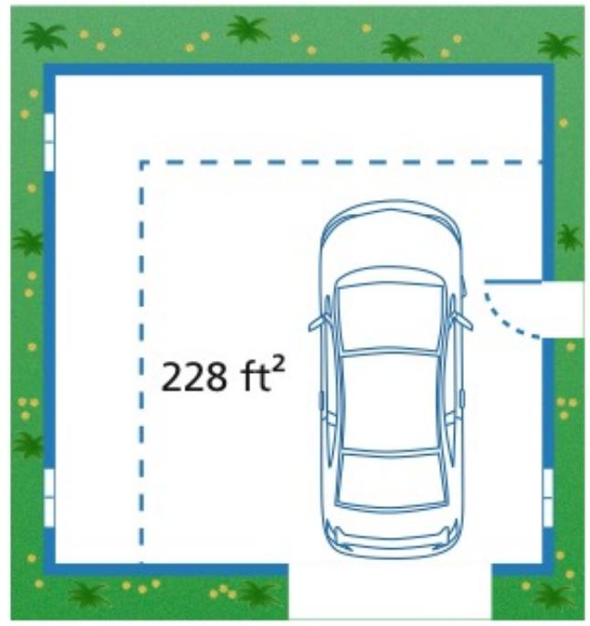

---

### 22 (练习题)

**题目**: 22. The Traverses are adding a new room to their house. The room will be a cube with a volume of 6,859 cubic feet. They are going to put in hardwood floors, which costs $10 per square foot. How much will the hardwood floors cost? 8.EE.1.2

---

### 23 (练习题)

**题目**: 23. While packing for their cross-country move, the Chen family uses a crate that has the shape of a cube. 8.EE.1.2
PART A
If the crate has the volume  $V = 64$  cubic feet, what is the length of one edge?
PART B
The Chens want to pack a large, framed painting. If the framed painting has the shape of a square with an area of 12 square feet, will the painting fit flat against a side of the crate? Explain.

---

### 1 (练习题)

**题目**: 1. Vocabulary How can you show that a number is a rational number? Lesson 1-2 8.NS.1.1

---

### 2 (练习题)

**题目**: 2. Which shows  $0.23$  as a fraction? Lesson 1-1 8.NS.1.1
A  $\frac{2}{33}$
7 6
23
D  $\frac{7}{30}$

---

### 3 (练习题)

**题目**: 3. Approximate  $\sqrt{8}$  to the nearest hundredth. Show your work. Lesson 1-3 8.NS.1.2

---

### 4 (练习题)

**题目**: 4. Solve the equation  $m^2 = 14$ . Lesson 1-5 8.EE.1.2

---

### 5 (练习题)

**题目**: 5. A fish tank is in the shape of a cube. Its volume is  $125\mathrm{ft}^3$ . What is the area of one face of the tank? Lessons 1-4 and 1-5 8.EE.1.2

---

### 6 (练习题)

**题目**: 6. Write 1.12 as a mixed number. Show your work. Lesson 1-1 8.NS.1.1

---

### MID-TOPIC PERFORMANCE TASK (练习题)

**题目**: MID-TOPIC PERFORMANCE TASK
Six members of the math club are forming two teams for a contest. The teams will be determined by having each student draw a number from a box.
PART A 8.NS.1.1
The table shows the results of the draw. The students who drew rational numbers will form the team called the Tigers. The students who drew irrational numbers will form the team called the Lions.
List the members of each team.
[Table Row] <tr><td>Student</td><td>Number Drawn</td></tr>
[Table Row] <tr><td>Lydia</td><td>√38</td></tr>
[Table Row] <tr><td>Marcy</td><td>6.34</td></tr>
[Table Row] <tr><td>Caleb</td><td>√36</td></tr>
[Table Row] <tr><td>Ryan</td><td>6.343443444...</td></tr>
[Table Row] <tr><td>Anya</td><td>6.34</td></tr>
[Table Row] <tr><td>Chan</td><td>√34</td></tr>
PART B 8.NS.1.2
The student on each team who drew the greatest number will be the captain of that team. Who will be the captain of the Tigers? Show your work.
PART C 8.NS.1.2
Who will be the captain of the Lions? Show your work.

---

### Solve & Discuss It! (练习题)

**题目**: Solve & Discuss It!

One band's streaming video concert to benefit a global charity costs $1.00 to view.
The first day, the concert got 2,187 views. The second day, it got about three times as many views. On the third day, it got 3 times as many views as on the second day. If the trend continues, how much money will the band raise on Day 7?

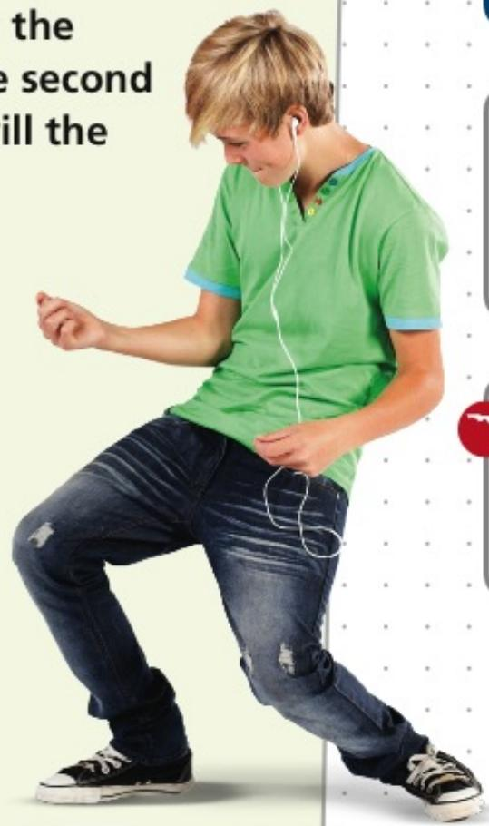

---

## Lesson 1-6

### EXAMPLE 1 (例题)

**题目**: EXAMPLE 1

Multiply Exponential Expressions: Same Base

The weight of a juvenile alligator is shown on the right. The adult alligator weighs about  $2^{6}$  times more than the juvenile. How can you determine the weight of the adult alligator?
Look for Relationships How do the two weights relate?

ONE WAY Write the two expressions in expanded form.

ANOTHER WAY Use the Product of Powers Property.
$$
2 ^ {3} \times 2 ^ {6} = 2 ^ {3 + 6} = 2 ^ {9}
$$
The Product of Powers Property states that when multiplying two powers with the same base, add the exponents.

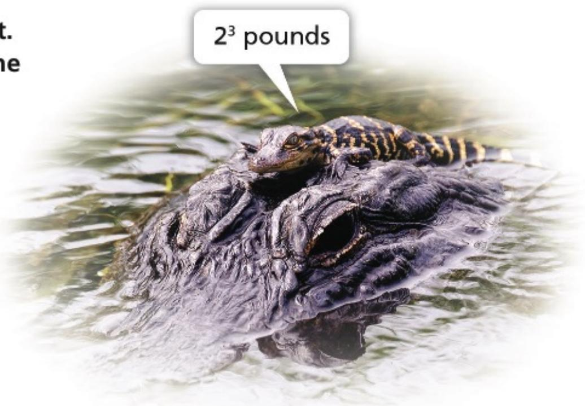

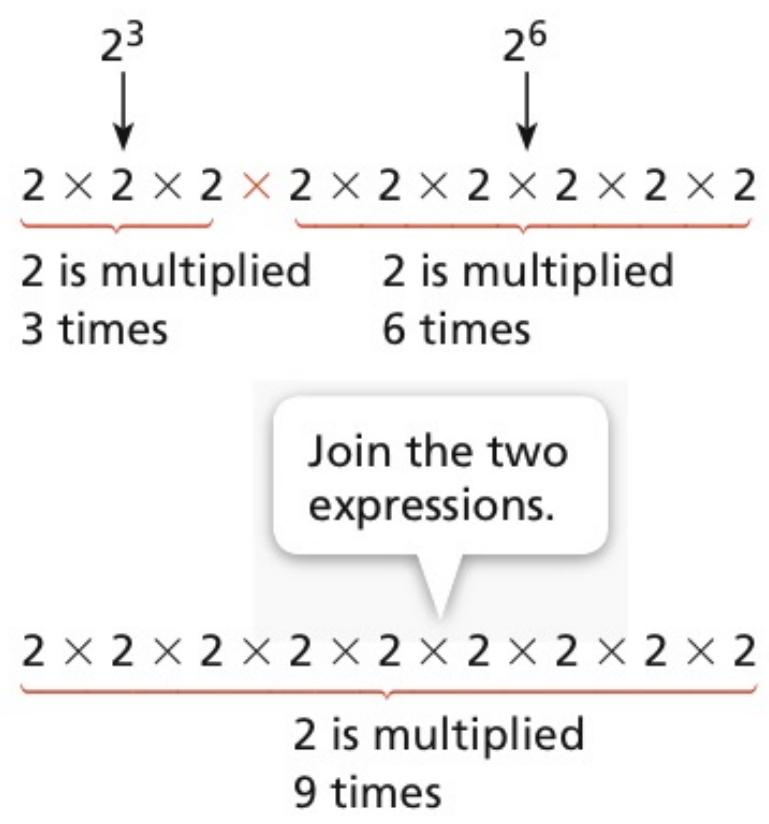

**解答**: Try It!
The local zoo welcomed a newborn African elephant that weighed  $3^{4}$  kg. It is expected that at adulthood, the newborn elephant will weigh approximately  $3^{4}$  times as much as its birth weight. What expression represents the expected adult weight of the newborn elephant?
Convince Me! Explain why the Product of Powers Property makes mathematical sense.

---

### Try It! (练习题)

**题目**: Try It!
The local zoo welcomed a newborn African elephant that weighed  $3^{4}$  kg. It is expected that at adulthood, the newborn elephant will weigh approximately  $3^{4}$  times as much as its birth weight. What expression represents the expected adult weight of the newborn elephant?

---

### EXAMPLE 3 (例题)

**题目**: EXAMPLE 3

Find the Power of a Power
Write an equivalent expression for  $(5^{2})^{4}$
$$
\begin{array}{l} (5 ^ {2}) ^ {4} = (5 ^ {2}) (5 ^ {2}) (5 ^ {2}) (5 ^ {2}) \\ 5 ^ {2} \text {m u l t i p l i e d 4 t i m e s} \\ = 5 ^ {(2 + 2 + 2 + 2)} \\ = 5 ^ {8} \\ \end{array}
$$
Use the Product of Powers Property to add the exponents.
The Power of Powers Property states that to find the power of a power, multiply the exponents.

---

### EXAMPLE 4 (例题)

**题目**: EXAMPLE 4

Divide Exponential Expressions: Same Base
Write an equivalent expression for  $6^{5} \div 6^{3}$ .
$$
6 ^ {5} \div 6 ^ {3} = \frac {6 ^ {5}}{6 ^ {3}}
$$
Write as a fraction.
$$
6 \text {m u l t i p l i e d} 5 \text {t i m e s}
$$
$$
= \frac {6 \times 6 \times 6 \times 6 \times 6}{6 \times 6 \times 6}
$$
6 multiplied 3 times

---

### EXAMPLE 4 (例题)

**题目**: EXAMPLE 4

Divide Exponential Expressions: Same Base
Write an equivalent expression for  $6^{5} \div 6^{3}$ .

**解答**: $$
6 ^ {5} \div 6 ^ {3} = \frac {6 ^ {5}}{6 ^ {3}}
$$
Write as a fraction.
$$
6 \text {m u l t i p l i e d} 5 \text {t i m e s}
$$
$$
= \frac {6 \times 6 \times 6 \times 6 \times 6}{6 \times 6 \times 6}
$$
6 multiplied 3 times
Remember,  $\frac{6}{6} = 1$ .
$$
\begin{array}{l} = \frac {6 \times \boxed {6 \times 6 \times 6} \times 6}{\boxed {6 \times 6 \times 6}} \\ = 6 \times 6 \text {o r} 6 ^ {2} \\ \end{array}
$$
The Quotient of Powers Property states that when dividing two exponential expressions with the same base, subtract the exponents.

---

### 1 (练习题)

**题目**: 1. Essential Question How do properties of integer exponents help you write equivalent expressions?

---

### 2 (练习题)

**题目**: 2. Look for Relationships If you are writing an equivalent expression for  $2^{3} \cdot 2^{4}$ , how many times would you write 2 as a factor?

---

### 3 (练习题)

**题目**: 3. Construct Arguments Kristen wrote  $5^{8}$  as an expression equivalent to  $(5^{2})^{4}$ . Her math partner writes  $5^{6}$ . Who is correct?

---

### 4 (练习题)

**题目**: 4. Critique Reasoning Tyler says that an equivalent expression for  $2^{3} \times 5^{3}$  is  $10^{9}$ . Is he correct? Explain.

---

### 5 (练习题)

**题目**: 5. Write an equivalent expression for  $7^{12} \cdot 7^4$ .

---

### 6 (练习题)

**题目**: 6. Write an equivalent expression for  $(8^{2})^{4}$

---

### 7 (练习题)

**题目**: 
Using exponents, write two equivalent expressions for the area of the rectangle.

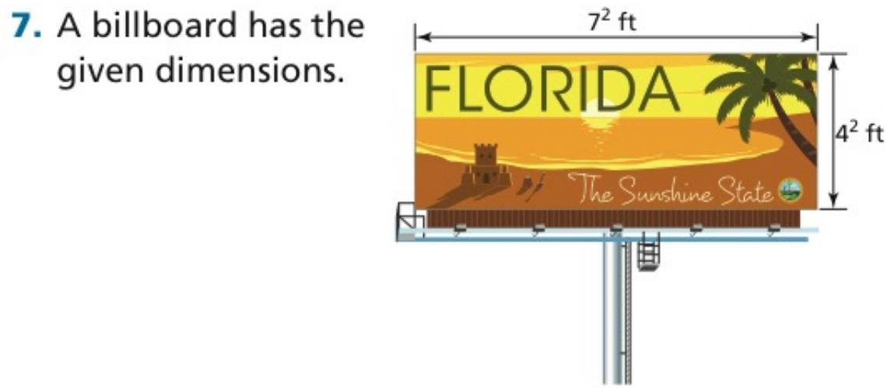

---

### 8 (练习题)

**题目**: 8. Write an equivalent expression for  $18^{9} \div 18^{4}$ .

---

### 9 (练习题)

**题目**: 9.  ${2}^{8} \cdot  {2}^{4}$
$$
\begin{array}{l} 2 ^ {8} \cdot 2 ^ {4} = 2 ^ {8} \boxed {4} \\ = \square \square \\ \end{array}
$$

---

### 10 (练习题)

**题目**: 10.  $\frac{8^7}{8^3}$ $\frac{8^7}{8^3} = 8^7$  3  $= \boxed { }$

---

### 11 (练习题)

**题目**: 11. (34)5
$$
\begin{array}{r l} (3 ^ {4}) ^ {5} & = 3 ^ {4} \boxed {} \\ & = \boxed {} \end{array}
$$

---

### 12 (练习题)

**题目**: 12.  ${3}^{9} \cdot  {2}^{9}$
$$
3 ^ {9} \cdot 2 ^ {9} = \left(\square \cdot \square\right) ^ {\square}
$$

---

### 13 (练习题)

**题目**: 13. a. How do you multiply powers that have the same base?

---

### 14 (练习题)

**题目**: 14. Which expressions are equivalent to  $2^{11}$ ? Select all that apply.
23 12
$2^{7}\cdot 2^{4}$
29 2
$2^{2} \cdot 2^{9}$

---

### 15 (练习题)

**题目**: 15.  $(4^{4})^{3}$

---

### 16 (练习题)

**题目**: 16.  $\frac{3^{12}}{3^3}$

---

### 17 (练习题)

**题目**: 17.  ${4}^{5} \cdot  {4}^{2}$

---

### 18 (练习题)

**题目**: 18.  $6^{4} \cdot 2^{4}$

---

### 19 (练习题)

**题目**: 19. Critique Reasoning Alberto incorrectly stated that  $\frac{5^7}{5^4} = 1^3$ . What was Alberto's error? Explain your reasoning and find the correct answer.

---

### 20 (练习题)

**题目**: 20. Is the expression  $8 \times 8^5$  equivalent to  $(8 \times 8)^5$ ? Explain.

---

### 21 (练习题)

**题目**: 21. Is the expression  $(3^{2})^{-3}$  equivalent to  $(3^{3})^{-2}$ ? Explain.

---

### 22 (练习题)

**题目**: 22. Is the expression  $3^{2} \cdot 3^{-3}$  equivalent to  $3^{3} \cdot 3^{-2}$ ? Explain.

---

### 23 (练习题)

**题目**: 23. Model with Math What is the width of the rectangle written as an exponential expression?

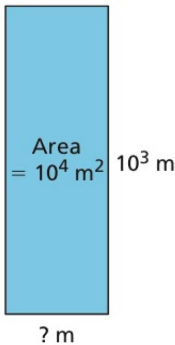

---

### 24 (练习题)

**题目**: 24. Simplify the expression  $\left(\left(\frac{1}{2}\right)^3\right)^3$

---

### 25 (练习题)

**题目**: 25. Higher Order Thinking Use a property of exponents to write  $(3b)^{5}$  as a product of powers.

---

### 26 (练习题)

**题目**: 26. Select all the expressions equivalent to  $4^{5} \cdot 4^{10}$ . 8.EE.1.1
${4}^{5} + {4}^{10}$
${4}^{3} \cdot  {4}^{5}$
${4}^{3} \cdot  {4}^{12}$
$4^{3} + 4^{12}$
${4}^{18} - {4}^{3}$
$4^{15}$

---

### 27 (练习题)

**题目**: 27. Your teacher asks the class to evaluate the expression  $(2^{3})^{1}$ . Your classmate gives an incorrect answer of 16. 8.EE.1.1
PART A Evaluate the expression.

PART B What was the likely error?
A Your classmate divided the exponents.
B Your classmate multiplied the exponents.
$\odot$  Your classmate added the exponents.
$\langle \widehat{\mathbb{C}}\rangle$  Your classmate subtracted the exponents.

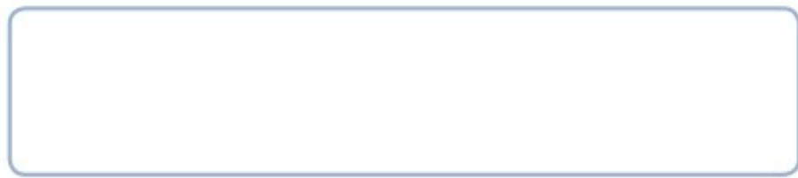

---

## Lesson 1-7

### EXAMPLE 1 (例题)

**题目**: EXAMPLE 1

The Zero Exponent Property

Marchella is playing a card-matching game with some classmates. Four matches have been made. It is Marchella's turn, and she chooses  $3^{0}$ . What card would complete her match?

Organize the information in a table and look for a pattern.
[Table Row] <tr><td>Exponent Form</td><td>Simplified Form</td></tr>
[Table Row] <tr><td>34</td><td>81</td></tr>
[Table Row] <tr><td>33</td><td>27</td></tr>
[Table Row] <tr><td>32</td><td>9</td></tr>
[Table Row] <tr><td>31</td><td>3</td></tr>
[Table Row] <tr><td>30</td><td>?</td></tr>
As the exponent decreases by one, the product is divided by 3.
$$
3 \div 3 = 1, \text {s o} 3 ^ {0} = 1.
$$
ANOTHER WAY Use the Quotient of Powers Property.
$$
\begin{array}{l} 3 ^ {3} \div 3 ^ {3} \\ = 3 ^ {3 - 3} = 3 ^ {0} \\ \end{array}
$$
When dividing two exponential expressions with the same base, subtract the exponents.
and
$$
\frac {3 ^ {3}}{3 ^ {3}} = \frac {3 \times 3 \times 3}{3 \times 3 \times 3} = 1
$$
so  $3^0 = 1$
The Zero Exponent Property states that  $a^0 = 1$  (assuming  $a \neq 0$ ).

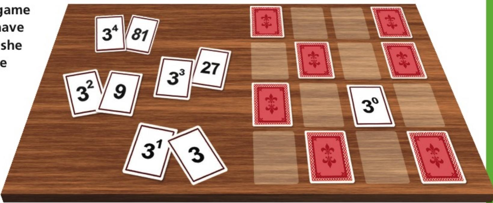

**解答**: Try It!
Evaluate.
a. (-7)  ${}^{0}$
b. (43)
c.  ${1}^{0}$
d.  $(0.5)^{0}$
Convince Me! Why is  $2(7^{0}) = 2?$

---

### EXAMPLE 3 (例题)

**题目**: EXAMPLE 3

Expressions with Negative Exponents

---

### 1 (练习题)

**题目**: 1. Essential Question What do the Zero Exponent and Negative Exponent Properties mean?

---

### 2 (练习题)

**题目**: 2. Reasoning In the expression  $9^{-12}$ , what does the negative exponent mean?

---

### 3 (练习题)

**题目**: 3. Reasoning In the expression  $3(2^0)$ , what is the order of operations? Explain how you would evaluate the expression.

---

### 4 (练习题)

**题目**: 4. Simplify  $1,999,999^{0}$ .

---

### 5 (练习题)

**题目**: 5. a. Write  $7^{-6}$  using a positive exponent.
b. Rewrite  $\frac{1}{10^{-3}}$  using a positive exponent.

---

### 6 (练习题)

**题目**: 6. Evaluate  $27x^{0}y^{-2}$  for  $x = 4$  and  $y = 3$

---

### 7 (练习题)

**题目**: 7.
[Table Row] <tr><td>Exponent</td><td>Simplified</td></tr>
[Table Row] <tr><td>44</td><td>256</td></tr>
[Table Row] <tr><td>43</td><td></td></tr>
[Table Row] <tr><td>42</td><td></td></tr>
[Table Row] <tr><td>41</td><td></td></tr>
[Table Row] <tr><td>40</td><td></td></tr>

---

### 8 (练习题)

**题目**: 8.
[Table Row] <tr><td>Exponent</td><td>Simplified</td></tr>
[Table Row] <tr><td>(-2)4</td><td>16</td></tr>
[Table Row] <tr><td>(-2)3</td><td>□</td></tr>
[Table Row] <tr><td>(-2)2</td><td>□</td></tr>
[Table Row] <tr><td>(-2)1</td><td>□</td></tr>
[Table Row] <tr><td>(-2)0</td><td>□</td></tr>

---

### 9 (练习题)

**题目**: 9. Given:  $(-3.2)^{0}$
a. Simplify the given expression.
b. Write two expressions equivalent to the given expression. Explain why the three expressions are equivalent.

---

### 10 (练习题)

**题目**: 10. Simplify each expression for  $x = 6$ .
a.  $12x^{0}(x^{-4})$
b.  ${14}\left( {x}^{-2}\right)$

---

### 11 (练习题)

**题目**: In 11 and 12, compare the values using  $>, <$ , or  $=$ .

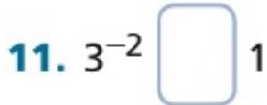

---

### 12 (练习题)

**题目**: In 11 and 12, compare the values using  $>, <$ , or  $=$ .

---

### 13 (练习题)

**题目**: In 13 and 14, rewrite each expression using a positive exponent.
13.  $9^{-4}$

---

### 14 (练习题)

**题目**: In 13 and 14, rewrite each expression using a positive exponent.
14.  $\frac{1}{2^{-6}}$

---

### 15 (练习题)

**题目**: 15. Given:  $9y^{0}$
a. Simplify the expression for  $y = 3$ .
b. Construct Arguments Will the value of the given expression vary depending on  $y$ ? Explain.

---

### 16 (练习题)

**题目**: 16. Simplify each expression for  $x = 4$ .
a.  $-5x^{-4}$
b.  $7{x}^{-3}$

---

### 17 (练习题)

**题目**: 17. Evaluate each pair of expressions.
a.  $(-3)^{-8}$  and  $-3^{-8}$
b.  $(-3)^{-9}$  and  $-3^{-9}$

---

### 18 (练习题)

**题目**: 18. Be Precise To win a math game, Lamar has to pick a card with an expression that has a value greater than 1. The card Lamar chooses reads  $\left(\frac{1}{2}\right)^{-4}$ . Does Lamar win the game? Explain.

---

### 19 (练习题)

**题目**: 19. Simplify the expression. Assume that  $x$  is nonzero. Your answer should have only positive exponents.
$$
x ^ {- 1 0} \cdot x ^ {6}
$$

---

### 20 (练习题)

**题目**: 20. Higher Order Thinking

---

### EXAMPLE 3 (例题)

**题目**: EXAMPLE 3

Expressions with Negative Exponents
Write the expression  $\frac{1}{7^{-3}}$  with a positive exponent.
$$
\frac {1}{7 ^ {- 3}} = \frac {1}{\frac {1}{7 ^ {3}}}
$$
Use the Negative Exponent Property.
$$
= 1 \cdot \frac {7 ^ {3}}{1}
$$
Multiply by the reciprocal of the denominator.
$$
= 7 ^ {3}
$$

---

### 20 (练习题)

**题目**: 20. Higher Order Thinking
a. Is the value of the expression  $\left(\frac{1}{4^{-3}}\right)^{-2}$  greater than 1, equal to 1, or less than 1?
b. If the value of the expression is greater than 1, show how you can change one sign to make the value less than 1. If the value is less than 1, show how you can change one sign to make the value greater than 1. If the value is equal to 1, show how you can make one change to make the value not equal to 1.

---

### 21 (练习题)

**题目**: 21. Which expressions are equal to  $5^{-3}$ ? Select all that apply. 8.EE.1.1
125
${125}^{-1}$
53
1 5
1 125

---

### 22 (练习题)

**题目**: 22. Which expressions have a value less than 1 when  $x = 4$ ? Select all that apply. 8.EE.1.1
3 0
$\frac{{x}^{0}}{{3}^{2}}$
1 6-x
1 10
$3x^{-4}$

---

## Lesson 1-8

### EXAMPLE 1 (例题)

**题目**: EXAMPLE 1

Estimate Very Large Quantities

Janelle is comparing the estimated populations of Japan and China. The estimated population of Japan is 126,818,019. The estimated population of China is shown. How can Janelle compare the two populations more easily?
Use Structure You can estimate large quantities and write them in a format that is easier to compare.

STEP 1 Estimate each population by rounding to the greatest place value. Then write the number as a single digit times a power of 10.
Population of China
1,402,941,487
rounds to 1,000,000,000
$1 \times 10^{9}$
Count the zeros to determine the power of 10.
Population of Japan
126,818,019
rounds to 100,000,000
$1 \times 10^{8}$
STEP 2 Compare the estimated values.
$$
1 0 ^ {9} > 1 0 ^ {8}
$$
$$
1 \times 1 0 ^ {9} > 1 \times 1 0 ^ {8}
$$
Janelle can use estimates using powers of 10 to compare the populations more easily.

**解答**: Try It!
Light travels 299,792,458 meters per second. Sound travels at 332 meters per second. Use a power of 10 to compare the speed of light to the speed of sound.
299,792,458 rounded to the greatest place value

There are zeros in the rounded number. The estimated speed of light
is  $\times 10$  meters per second.
$3\times 10 > 3\times 10$  so the speed of light is faster than the speed of sound.
Convince Me! Country A has a population of 1,238,682,005 and Country B has a population of 1,106,487,394. How would you compare these populations?

---

### EXAMPLE 3 (例题)

**题目**: EXAMPLE 3
Find How Many Times as Much
How does the Gross Domestic Product (GDP) of Canada compare to that of the United States?
STEP 1 Write each GDP as a single digit times a power of 10.
Canada: 1,785,387,000,000,000  $\approx$  2,000,000,000,000,000
$$
= 2 \times 1 0 ^ {1 5}
$$
USA: 17,348,075,000,000,000 ≈ 20,000,000,000,000,000
$$
= 2 \times 1 0 ^ {1 6}
$$
Count the zeros to determine the power of 10.
STEP 2 Compare the two estimates.
$$
(2 \times 1 0 ^ {1 6}) > (2 \times 1 0 ^ {1 5})
$$
The U.S. GDP is about 10 times greater than that of Canada.

---

### 1 (练习题)

**题目**: 1. Essential Question When would you use powers of 10 to estimate a quantity?

---

### 2 (练习题)

**题目**: 2. Construct Arguments Kim writes an estimate for the number 0.00436 as  $4 \times 10^{3}$ . Explain why this cannot be correct.

---

### 3 (练习题)

**题目**: 3. Be Precise Raquel estimated 304,900,000,000 as  $3 \times 10^{8}$ . What error did she make?

---

### 4 (练习题)

**题目**: 4. Use a single digit times a power of 10 to estimate the height of Mt. Everest to the nearest ten thousand feet.

Mt. Everest is 29,035 feet tall.

---

### 5 (练习题)

**题目**: 5. A scientist records the mass of a proton as 0.0000000000000000000016726231 gram. Use a single digit times a power of 10 to estimate the mass.

---

### 6 (练习题)

**题目**: 6. The tanks at the Georgia Aquarium hold approximately  $8.4 \times 10^{6}$  gallons of water. The tanks at the Audubon Aquarium of the Americas hold about 400,000 gallons of water. Use a single digit times a power of 10 to estimate how many times greater the amount of water is at the Georgia Aquarium.

---

### 7 (练习题)

**题目**: 7. A city has a population of 2,549,786 people. Estimate this population to the nearest million. Express your answer as the product of a single digit and a power of 10.
Rounded to the nearest million, the population is about
Written as the product of a single digit and a power of ten, this number is  $\times 10$ .

---

### 8 (练习题)

**题目**: 8. Use a single digit times a power of 10 to estimate the number 0.00002468.
Rounded to the nearest hundred thousandth, the number is about
Written as a single digit times a power of ten, the estimate is  $\times 10$ .

---

### 9 (练习题)

**题目**: 9. The approximate circumferences of Earth and Saturn are shown. How many times greater is the circumference of Saturn than the circumference of Earth?
The circumference of Saturn is  $\times 10\mathrm{km}$
Saturn's circumference is about times greater than the circumference of Earth.

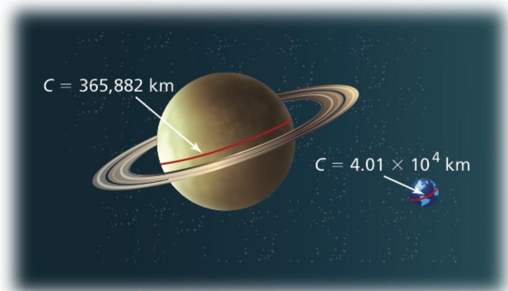

---

### 10 (练习题)

**题目**: 10. Estimate 0.037854921 to the nearest hundredth. Express your answer as a single digit times a power of ten.

---

### 11 (练习题)

**题目**: 11. Compare the numbers  $6 \times 10^{-6}$  and  $2 \times 10^{-8}$ .
a. Which number has the greater value?
b. Which number has the lesser value?
c. How many times greater is the greater number?

---

### 12 (练习题)

**题目**: 12. Taylor made \(43,785 last year. Use a single digit times a power of ten to express this value rounded to the nearest ten thousand.

---

### 13 (练习题)

**题目**: 13. The length of plant cell A is  $8 \times 10^{-5}$  meter. The length of plant cell B is 0.000004 meter. How many times greater is plant cell A's length than plant cell B's length?

---

### 14 (练习题)

**题目**: 14. Critique Reasoning The diameter of one species of bacteria is shown. Bonnie approximates this measure as  $3 \times 10^{-11}$  meter. Is she correct? Explain.

---

### 15 (练习题)

**题目**: 15. The populations of Cities A and B are  $2.6 \times 10^{5}$  and 1,560,000, respectively. The population of City C is twice the population of City B.
The population of City C is how many times the population of City A?

---

### 16 (练习题)

**题目**: 16. Earth is approximately  $5 \times 10^{9}$  years old. For which of these ages could this be an approximation? 8.EE.1.3
A 4,762,100,000 years
B 48,000,000,000 years
$\odot$ $4.45 \times 10^{9}$  years
D  $4.249999999 \times 10^{9}$  years

---

### 17 (练习题)

**题目**: 17. PART A
Express 0.00000298 as a single digit times a power of ten rounded to the nearest ten millionth. 8.EE.1.3
PART B
Explain how negative powers of 10 make small numbers to write and compare. 8.EE.1.3

---

## Lesson 1-9

### EXAMPLE 1 (例题)

**题目**: EXAMPLE 1

Write Large Numbers in Scientific Notation
Scan for multimedia

Louisa is researching the approximate distance between Earth and the Sun. Her father told her that the distance is  $9.296 \times 10^{7}$  miles. In an astronomy book, she found the following.
Which distance is correct?

92,960,000 miles
Louisa's father used scientific notation to express the approximate distance because the distance is so great. Numbers in scientific notation have two factors.
$$
9. 2 9 6 \times 1 0 ^ {7}
$$
The first factor is always a number greater than or equal to 1 and less than 10.
The second factor is always a power of 10.
Write the number in standard form in scientific notation.
Place the decimal point after the first nonzero digit.

Count the number of digits after the decimal point to determine the power of 10.
The two numbers represent the same distance.

**解答**: Try It!
The height of Angel Falls, the tallest waterfall in the world, is 3,212 feet. How do you write this number in scientific notation?

Convince Me! Why do very large numbers have positive exponents when written in scientific notation? Explain.

---

### EXAMPLE 2 (例题)

**题目**: EXAMPLE 2

Write Small Numbers in Scientific Notation

ACTIVITY

ASSESS
What is the width of a red blood cell written in scientific notation?
Write the number as the product of two factors.
Place the decimal after the first nonzero digit.
Count the number of digits before the decimal point to determine the power of 10.

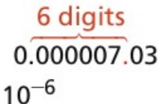

**解答**: The width of the red blood cell, expressed in scientific notation, is  $7.03 \times 10^{-6}$  meter.

---

### 1 (练习题)

**题目**: 1. Essential Question What is scientific notation and why is it used?

---

### 2 (练习题)

**题目**: 2. Critique Reasoning Taylor states that 2,800,000 in scientific notation is  $2.8 \times 10^{-6}$  because the number has six places to the right of the 2. Is Taylor's reasoning correct?

---

### 3 (练习题)

**题目**: 3. Construct Arguments Sam will write 0.000032 in scientific notation. Sam thinks that the exponent of 10 will be positive. Do you agree? Construct an argument to support your response.

---

### 4 (练习题)

**题目**: 4. Express 586,400,000 in scientific notation.

---

### 5 (练习题)

**题目**: 5. The genetic information of almost every living thing is stored in a tiny strand called DNA. Human DNA is  $3.4 \times 10^{-8}$  meter long. Write the length in standard form.

---

### 6 (练习题)

**题目**: 6. The largest virus known to man is the Megavirus, which measures 0.00000044 meter across. Express this number in scientific notation.

---

### 7 (练习题)

**题目**: 7. How would you write the number displayed on the calculator screen in standard form?

---

### 8 (练习题)

**题目**: 8. The Sun is  $1.5 \times 10^{8}$  kilometers from Earth.
$1.5 \times 10^{8}$  is written as in standard form.

---

### 9 (练习题)

**题目**: 9. Brenna wants an easier way to write 0.000000000000000587.
0.0000000000000000587 is written as  $\times 10$  in scientific notation.

---

### 10 (练习题)

**题目**: 10. Is  $23 \times 10^{-8}$  written in scientific notation? Justify your response.

---

### 11 (练习题)

**题目**: 11. Is  $8.6 \times 10^{7}$  written in scientific notation? Justify your response.

---

### 12 (练习题)

**题目**: 12. Simone evaluates an expression using her calculator. The calculator display is shown at the right. Express the number in standard form.

---

### 13 (练习题)

**题目**: 13. Express the number 0.00001038 in scientific notation.

---

### 14 (练习题)

**题目**: 14. Express the number 80,000 in scientific notation.

---

### 15 (练习题)

**题目**: 15. Peter evaluates an expression using his calculator. The calculator display is shown at the right. Express the number in standard form.

---

### 9 (练习题)

**题目**: 16. a. What should you do first to write  $5.871 \times 10^{-7}$  in standard form?
b. Express the number in standard form.

---

### 16b (练习题)

**题目**: b. Express the number in standard form.

---

### 17 (练习题)

**题目**: 17. Express  $2.58 \times 10^{-2}$  in standard form.

---

### 18 (练习题)

**题目**: 18. At a certain point, the Grand Canyon is approximately 1,600,000 centimeters across. Express this number in scientific notation.

---

### 12 (练习题)

**题目**: 
19. The length of a bacterial cell is  $5.2 \times 10^{-6}$  meter. Express the length of the cell in standard form.

---

### 20 (练习题)

**题目**: 20. Higher Order Thinking Express the distance 4,300,000 meters using scientific notation in meters, and then in millimeters.

---

### 14 (练习题)

**题目**: 
Assessment Practice
21. Which of the following numbers are written in scientific notation? 8.EE.1.3
${12} \times  {10}^{6}$
12
${6.89} \times  {10}^{6}$
6.89
0.4
$4 \times  {10}^{-1}$

---

### 22 (练习题)

**题目**: 22. Jean's calculator display shows the number to the right. 8.EE.1.4
PART A
Express this number in scientific notation.

---

### 15 (练习题)

**题目**: 22. Jean's calculator display shows the number to the right. 8.EE.1.4
PART A
Express this number in scientific notation.

PART B
Express this number in standard form.

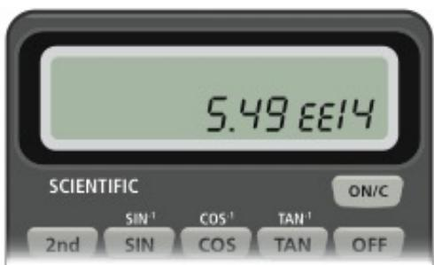

---

### 16 (练习题)

**题目**: 3- ACT MATH

ACT1
1. After watching the video, what is the first question that comes to mind?

---

### 17 (练习题)

**题目**: 2. Write the Main Question you will answer.

---

### 18 (练习题)

**题目**: 3. Construct Arguments Predict an answer to this Main Question. Explain your prediction.

---

### 19 (练习题)

**题目**: 4. On the number line below, write a number that is too small to be the answer. Write a number that is too large.

5. Plot your prediction on the same number line.

---

### 20 (练习题)

**题目**: 3-Act Mathematical Modeling: Hard-Working Organs

Go Online | PearsonRealize.com

MAFS.K12.MP.4.1 Model with mathematics. Also MP.1.1, MP.3.1, MP.5.1
MAFS.8.EE.1.1 Know and apply the properties of integer exponents to generate equivalent numerical expressions. Also 8.EE.1.3

---

### 21 (练习题)

**题目**: 6. What information in this situation would be helpful to know? How would you use that information?

---

### 22 (练习题)

**题目**: 7. Use Appropriate Tools What tools can you use to get the information you need? Record the information as you find it.

8. Model with Math Represent the situation using the mathematical content, concepts, and skills from this topic. Use your representation to answer the Main Question.

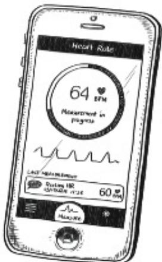

---

### 23 (练习题)

**题目**: 9. What is your answer to the Main Question? Is it greater or less than your prediction? Explain why.

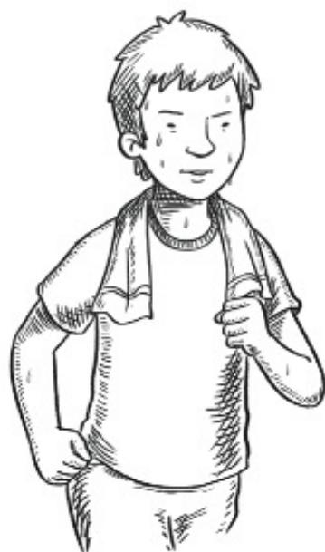

---

### 24 (练习题)

**题目**: ACT3
10. Write the answer you saw in the video.

---

### 25 (练习题)

**题目**: 11. Reasoning Does your answer match the answer in the video? If not, what are some reasons that would explain the difference?

---

### 26 (练习题)

**题目**: 12. Make Sense and Persevere Would you change your model now that you know the answer? Explain.

---

### 27 (练习题)

**题目**: Reflect
13. Model with Math Explain how you used a mathematical model to represent the situation. How did the model help you answer the Main Question?

---

### 28 (练习题)

**题目**: 14. Generalize What pattern did you notice in your calculations? How did that pattern help you solve the problem?

---

### 29 (练习题)

**题目**: SEQUEL
15. Use Structure How many times does a heart beat in a lifetime? Use your solution to the Main Question to help you solve.

---

### 30 (练习题)

**题目**: 
Solve & Discuss It!

ACTIVITY
The homecoming committee wants to fly an aerial banner over the football game. The banner is 1,280 inches long and 780 inches tall. How many different ways can the area of the banner be expressed?

---

## Lesson 1-10

### EXAMPLE 1 (例题)

**题目**: EXAMPLE 1

Add or Subtract Numbers in Scientific Notation
Scan for Multimedia

The mass of Earth and the mass of the Moon are shown. How much greater is the mass of Earth than that of the Moon?
Use Structure What does the exponent tell you about the magnitude of the number?

ONE WAY Write the masses in standard form and then subtract.
$$
\begin{array}{l} 5. 9 7 \times 1 0 ^ {2 4} = 5, 9 7 0, 0 0 0, 0 0 0, 0 0 0, 0 0 0, 0 0 0, 0 0 0, 0 0 0 \\ 7. 3 5 \times 1 0 ^ {2 2} = 7 3, 5 0 0, 0 0 0, 0 0 0, 0 0 0, 0 0 0, 0 0 0, 0 0 0 \\ 5, 9 7 0, 0 0 0, 0 0 0, 0 0 0, 0 0 0, 0 0 0, 0 0 0, 0 0 0 \\ - 7 3, 5 0 0, 0 0 0, 0 0 0, 0 0 0, 0 0 0, 0 0 0 \\ 5, 8 9 6, 5 0 0, 0 0 0, 0 0 0, 0 0 0, 0 0 0, 0 0 0 \\ \end{array}
$$
The difference is about  $5.8965 \times 10^{24}$  kilograms.

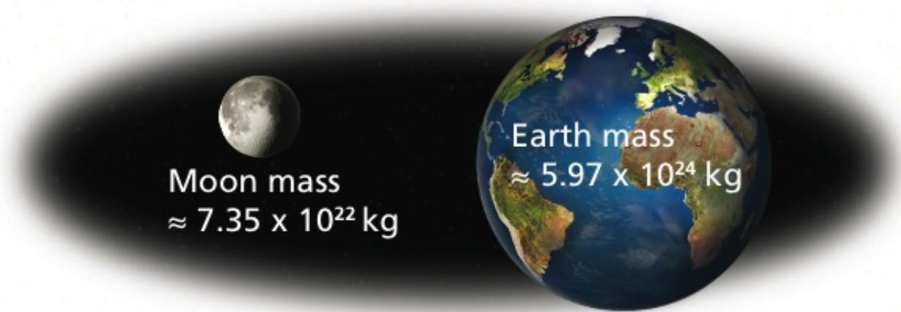

**解答**: ANOTHER WAY Write the masses using the same power of 10. Then subtract.

---

### Try It! (练习题)

**题目**: Try It!
The planet Venus is on average  $2.5 \times 10^{7}$  kilometers from Earth. The planet Mars is on average  $2.25 \times 10^{8}$  kilometers from Earth. When Venus, Earth, and Mars are aligned, what is the average distance from Venus to Mars?
$$
\begin{array}{l} 2. 2 5 \times 1 0 ^ {8} = (2. 2 5 \times \square \times \square) \\ = \boxed { \begin{array}{l} \end{array} } \times 1 0 ^ {7} \\ \end{array}
$$
$$
\begin{array}{l} 2. 5 \times 1 0 ^ {7} + \boxed {} \times 1 0 ^ {7} = (2. 5 + \boxed {}) \times 1 0 ^ {7} \\ = \boxed { \begin{array}{l} \end{array} } \times 1 0 ^ {7} \\ = \boxed {} \times \boxed {} \\ \end{array}
$$

---

### EXAMPLE 2 (例题)

**题目**: EXAMPLE 2

Multiply Numbers in Scientific Notation

The Confederation Bridge connects New Brunswick to Prince Edward Island. The main part of the bridge rests on piers that form 43 segments. What is the approximate length of the main part of the bridge? Express your answer in scientific notation.
STEP 1 Write an expression to represent the problem situation.
$$
\begin{array}{l} (8. 2 \times 1 0 ^ {2}) \times 4 3 \\ = (8. 2 \times 1 0 ^ {2}) \times (4. 3 \times 1 0 ^ {1}) \\ \end{array}
$$

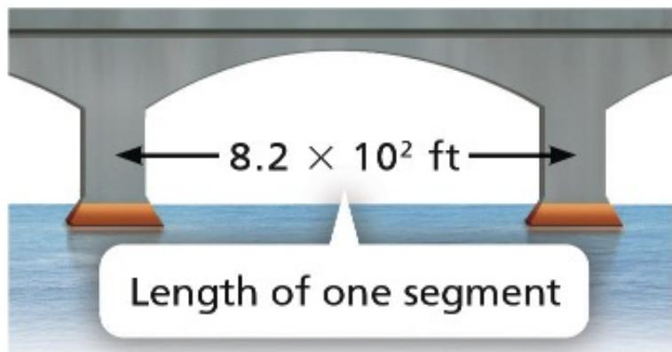

**解答**: Express both numbers in scientific notation.
STEP 2 Multiply.
$$
\begin{array}{l} (8. 2 \times 1 0 ^ {2}) \times (4. 3 \times 1 0 ^ {1}) \\ = (8. 2 \times 4. 3) \times (1 0 ^ {2} \times 1 0 ^ {1}) \\ = 3 5. 2 6 \times (1 0) ^ {2 + 1} \\ = 3 5. 2 6 \times 1 0 ^ {3} \\ = 3. 5 2 6 \times 1 0 ^ {4} \\ \end{array}
$$
Remember: The Product of Powers Property states that when multiplying powers with the same base, you add the exponents.
The first factor must be less than 10 and greater than or equal to 1.
The length of the main part of the bridge is approximately  $3.5 \times 10^{4}$  feet.

---

### EXAMPLE 3 (例题)

**题目**: EXAMPLE 3

Divide Numbers in Scientific Notation
A queen ant lays  $1.83 \times 10^{6}$  eggs over a period of 30 days.
Assuming she lays the same number of eggs each day, about how many eggs does she lay in one day? Express your answer in scientific notation.
First, write 30 in scientific notation:  $3.0 \times 10^{1}$
Then, divide.
$$
(1. 8 3 \times 1 0 ^ {6}) \div (3. 0 \times 1 0 ^ {1})
$$
$$
\frac {1 . 8 3 \times 1 0 ^ {6}}{3 . 0 \times 1 0 ^ {1}}
$$
$$
\frac {1 . 8 3}{3 . 0} \times \frac {1 0 ^ {6}}{1 0 ^ {1}}
$$
$$
(1. 8 3 \div 3. 0) \times (1 0 ^ {6} \div 1 0 ^ {1})
$$
$$
0. 6 1 \times 1 0 ^ {5}
$$
$$
6. 1 \times 1 0 ^ {4}
$$

**解答**: The Quotient of Powers Property states that when dividing powers with the same base, you subtract the exponents.
The queen ant lays about  $6.1 \times 10^{4}$  eggs per day.

---

### Try It! (练习题)

**题目**: Try It!
There are  $1 \times 10^{14}$  good bacteria in the human body. There are  $2.6 \times 10^{18}$  good bacteria among the spectators in a soccer stadium. About how many spectators are in the stadium? Express your answer in scientific notation.

---

### 1 (练习题)

**题目**: 1. Essential Question How does using scientific notation help when computing with very small or very large numbers?

---

### 2 (练习题)

**题目**: 2. Use Structure When multiplying and dividing two numbers in scientific notation, why do you sometimes have to rewrite one factor?

---

### 3 (练习题)

**题目**: 3. Use Structure For the sum of  $(5.2\times 10^{4})$  and  $(6.95\times 10^{4})$  in scientific notation, why will the power of 10 be  $10^{5}$ ?

---

### 4 (练习题)

**题目**: 4. A bacteriologist estimates that there are  $5.2 \times 10^{4}$  bacteria growing in each of 20 petri dishes. About how many bacteria in total are growing in the petri dishes? Express your answer in scientific notation.

---

### 5 (练习题)

**题目**: 5. The distance from Earth to the Moon is approximately  $1.2 \times 10^{9}$  feet. The Apollo 11 spacecraft was approximately 360 feet long. About how many spacecraft of that length would fit end to end from Earth to the Moon? Express your answer in scientific notation.

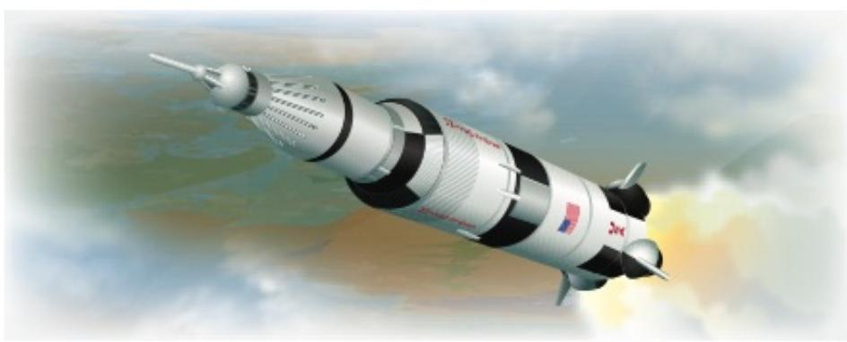

---

### 6 (练习题)

**题目**: 6. The mass of Mars is  $6.42 \times 10^{23}$  kilograms. The mass of Mercury is  $3.3 \times 10^{23}$  kilograms.
a. What is the combined mass of Mars and Mercury expressed in scientific notation?
b. What is the difference in the mass of the two planets expressed in scientific notation?

---

### 7 (练习题)

**题目**: 7.  ${\left( 7 \times  {10}^{-6}\right) }\left( {7 \times  {10}^{-6}}\right)$

---

### 8 (练习题)

**题目**: 8.  $(3.76\times 10^{5}) + (7.44\times 10^{5})$

---

### 9 (练习题)

**题目**: 9. What is the value of  $n$  in the equation  $1.9 \times 10^{7} = (1 \times 10^{5})(1.9 \times 10^{n})$ ?

---

### 10 (练习题)

**题目**: 10. Find  $(5.3\times 10^{3}) - (8\times 10^{2})$  Express your answer in scientific notation.

---

### 11 (练习题)

**题目**: 11. What is the mass of 30,000 molecules? Express your answer in scientific notation.

Mass of one molecule of oxygen  $= 5.3\times 10^{-23}$  gram

---

### 12 (练习题)

**题目**: 12. Critique Reasoning Your friend says that the product of  $4.8 \times 10^{8}$  and  $2 \times 10^{-3}$  is  $9.6 \times 10^{-5}$ . Is this answer correct? Explain.

---

### 13 (练习题)

**题目**: 13. Find  $\frac{7.2 \times 10^{-8}}{3 \times 10^{-2}}$ . Write your answer in scientific notation.

---

### 14 (练习题)

**题目**: 14. A certain star is  $4.3 \times 10^{2}$  light years from Earth. One light year is about  $5.9 \times 10^{12}$  miles. How far from Earth (in miles) is the star? Express your answer in scientific notation.

---

### 15 (练习题)

**题目**: 15. The total consumption of fruit juice in a particular country in 2006 was about  $2.28 \times 10^{9}$  gallons. The population of that country that year was  $3 \times 10^{8}$ . What was the average number of gallons consumed per person in the country in 2006?

---

### 16 (练习题)

**题目**: 16. The greatest distance between the Sun and Jupiter is about  $8.166 \times 10^{8}$  kilometers. The greatest distance between the Sun and Saturn is about  $1.515 \times 10^{9}$  kilometers. What is the difference between these two distances?

---

### 17 (练习题)

**题目**: 17. What was the approximate number of pounds of garbage produced per person in the country in one year? Express your answer in scientific notation.

Garbage generated in country:  $6.958 \times 10^{10}$  pounds Population of country:  $4.57 \times 10^{6}$  people

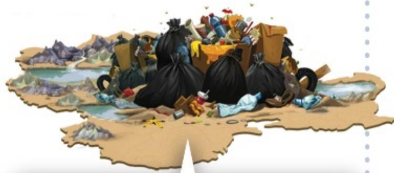

---

### 18 (练习题)

**题目**: 18. Higher Order Thinking
a. What is the value of  $n$  in the equation  $1.5 \times 10^{12} = (5 \times 10^5)(3 \times 10^n)$ ?
b. Explain why the exponent on the left side of the equation is not equal to the sum of the exponents on the right side.

---

### 19 (练习题)

**题目**: 19. Find  $(2.2 \times 10^{5}) \div (4.4 \times 10^{-3})$ . When you regroup the factors, what do you notice about the quotient of the decimal factors? How does this affect the exponent of the quotient? 8.EE.1.4

---

### 20 (练习题)

**题目**: 20. Which expression has the least value? 8.EE.1.4
(A)  $(4.7 \times 10^{4}) + (8 \times 10^{4})$
(7.08 × 10³) + (2.21 × 10³)
$(5.43\times 10^{8}) - (2.33\times 10^{8})$
(9.35 × 10^6) - (6.7 × 10^6)

---

## LESSON 1-1 Rational Numbers as Decimals

### 1 (练习题)

**题目**: 1.0.7

---

### 2 (练习题)

**题目**: 2.0.04

---

### 3 (练习题)

**题目**: 3.4.45

---

### 4 (练习题)

**题目**: 4.2.191919...

---

### Example (例题)

**题目**: Write 1.0505... as a mixed number.
$$
\begin{array}{l} x = 1. \overline {{0 5}} \\ 1 0 0 \cdot x = 1 0 0 \cdot 1. \overline {{0 5}} \\ 1 0 0 x = 1 0 5. \overline {{0 5}} \\ 1 0 0 x - x = 1 0 5. \overline {{0 5}} - 1. \overline {{0 5}} \\ 9 9 x = 1 0 4 \\ x = \frac {1 0 4}{9 9} \text {o r} 1 \frac {5}{9 9} \\ \end{array}
$$

---

### Example (例题)

**题目**: Example
Write 1.0505... as a mixed number.

**解答**: $$
\begin{array}{l} x = 1. \overline {{0 5}} \\ 1 0 0 \cdot x = 1 0 0 \cdot 1. \overline {{0 5}} \\ 1 0 0 x = 1 0 5. \overline {{0 5}} \\ 1 0 0 x - x = 1 0 5. \overline {{0 5}} - 1. \overline {{0 5}} \\ 9 9 x = 1 0 4 \\ x = \frac {1 0 4}{9 9} \text {o r} 1 \frac {5}{9 9} \\ \end{array}
$$

---

## LESSON 1-2 Understand Irrational Numbers

### Example (例题)

**题目**: Example
Classify  $-\sqrt{50}$  as rational or irrational.

**解答**: The number  $-\sqrt{50}$  is irrational because 50 is not the square of any integer.

---

### 1 (练习题)

**题目**: 1. Determine which numbers are irrational. Select all that apply.
√36
23
-4.232323...
0.151551555...
0.35
□π

---

### 2 (练习题)

**题目**: 2. Classify  $-0.25$  as rational or irrational. Explain.

---

### Example (例题)

**题目**: Example
Compare and order the following numbers.  
Locate each number on a number line.
$$
7. \overline {{8}}, 7 \frac {4}{5}, \sqrt {5 6}
$$

**解答**: Write each number in decimal form.
$$
\begin{array}{l} 7. \overline {{8}} = 7. 8 8 8 8 \dots \\ 7 \frac {4}{5} = 7. 8 \\ \sqrt {5 6} \approx 7. 5 \\ \end{array}
$$

$$
\mathrm {S o}, \sqrt {5 6} <   7 \frac {4}{5} <   7. \overline {{8}}.
$$

---

### 1 (练习题)

**题目**: 1. Between which two whole numbers does  $\sqrt{89}$  lie?
√89 is between and

---

### 2 (练习题)

**题目**: 2. Compare and order the following numbers. Locate each number on a number line.
$$
2. \overline {{3}}, \sqrt {8}, 2. 5, 2 \frac {1}{4}
$$

---

## LESSON 1-4 Evaluate Square Roots and Cube Roots

### Example (例题)

**题目**: Example
A monument has a cube shape with a volume of 729 cubic meters. What is the length of each edge of the monument?

**解答**: $$
\begin{array}{l} \sqrt [ 3 ]{7 2 9} = \sqrt [ 3 ]{9 \cdot 9 \cdot 9} \\ = \sqrt [ 3 ]{9 ^ {3}} \\ = 9 \\ \end{array}
$$
So, the length of each edge is 9 meters.

---

### 2 (练习题)

**题目**: 2.100

---

### 5 (练习题)

**题目**: 5. A gift box is a cube with a volume of 512 cubic inches. What is the length of each edge of the box?

---

### Example (例题)

**题目**: Example
Mattie wants to build a square deck to make a kiddie play area of 144 square feet. What will be the length of each side of the deck?
Use the formula  $A = s^2$  to find each side length.

**解答**: $$
\begin{array}{l} 1 4 4 = s ^ {2} \\ \sqrt {1 4 4} = \sqrt {s ^ {2}} \\ \pm 1 2 = s \\ \end{array}
$$
Length cannot be negative, so the length of each side of the deck will be 12 feet.

---

### 1 (练习题)

**题目**: 1.  $x^{3} = 64$

---

### 2 (练习题)

**题目**: 2.  $x^{2} = 49$

---

### 3 (练习题)

**题目**: 3.  ${x}^{3} = {25}$

---

### 4 (练习题)

**题目**: 4.  $x^{2} = 125$

---

### 5 (练习题)

**题目**: 5. A container has a cube shape. It has a volume of 216 cubic inches. What are the dimensions of one face of the container?

---

## LESSON 1-6 Use Properties of Integer Exponents

### Example (例题)

**题目**: Example
Write an equivalent expression for  $(4^{3})^{2}$

**解答**: $$
(4 ^ {3}) ^ {2} = (4 ^ {3}) (4 ^ {3})
$$

---

### Example (例题)

**题目**: Write an equivalent expression for  $(4^{3})^{2}$
$$
(4 ^ {3}) ^ {2} = (4 ^ {3}) (4 ^ {3})
$$

---

### 1 (练习题)

**题目**: 1.  ${6}^{4} \cdot  {6}^{3}$

---

### 2 (练习题)

**题目**: 2.  $(3^{6})^{-2}$

---

### 3 (练习题)

**题目**: 3.  ${7}^{3} \cdot  {2}^{3}$

---

### 4 (练习题)

**题目**: 4.  ${4}^{10} \div  {4}^{4}$

---

### Example (例题)

**题目**: Evaluate the expression for  $x = 2$  and  $y = 4$ .
$$
\begin{array}{l} \frac {2}{y ^ {- 2}} + 5 x ^ {0} = \frac {2}{(4) ^ {- 2}} + 5 (2) ^ {0} \\ = \frac {2 (4 ^ {2})}{1} + 5 (1) \\ = 2 (1 6) + 5 (1) \\ = 3 2 + 5 \\ = 3 7 \\ \end{array}
$$

---

### 1 (练习题)

**题目**: 1.  $9^{-4}$

---

### 2 (练习题)

**题目**: 2.  $\frac{1}{3^{-5}}$

---

### 3 (练习题)

**题目**: 3.  $- 4{x}^{-2} + 3{y}^{0}$

---

### 4 (练习题)

**题目**: 4.  $2{x}^{0}{y}^{-2}$

---

## LESSON 1-8 Use Powers of 10 to Estimate Quantities

### Example (例题)

**题目**: Keisha is about 1,823,933 minutes old. Write this age as a single digit times a power of 10.
First round to the greatest place value. 1,823,933 is about 2,000,000.
Write the rounded number as a single digit times a power of 10.
$$
2, 0 0 0, 0 0 0 = 2 \times 1 0 ^ {6}
$$

**解答**: Keisha is about  $2 \times 10^{6}$  minutes old.

---

### 1 (练习题)

**题目**: 1. In the year 2013 the population of California was about 38,332,521 people. Write the estimated population as a single digit times a power of 10.

---

### 2 (练习题)

**题目**: 2. The wavelength of green light is about 0.00000051 meter. What is this estimated wavelength as a single digit times a power of 10?

---

### 3 (练习题)

**题目**: 3. The land area of Connecticut is about 12,549,000,000 square meters. The land area of Rhode Island is about 2,707,000,000 square meters. How many times greater is the land area of Connecticut than the land area of Rhode Island?

---

### Example (例题)

**题目**: Write 65,700,000 in scientific notation.
First, place the decimal point to the right of the first nonzero digit.
Then, count the number of digits to the right of the decimal point to determine the power of 10. 65,700,000 in scientific notation is  $6.57 \times 10^{7}$ .

---

### 1 (练习题)

**题目**: 1. Write 803,000,000 in scientific notation.

---

### 2 (练习题)

**题目**: 2. Write 0.0000000068 in scientific notation.

---

### 3 (练习题)

**题目**: 3. Write  $1.359 \times 10^{5}$  in standard form.

---

### 4 (练习题)

**题目**: 4. The radius of a hydrogen atom is 0.000000000025 meter. How would you express this radius in scientific notation?

---

## LESSON 1-10 Operations with Numbers in Scientific Notation

### Example (例题)

**题目**: Multiply  $(4.2 \times 10^{5}) \times (2.5 \times 10^{3})$ .
$$
\begin{array}{l} (4. 2 \times 1 0 ^ {5}) \times (2. 5 \times 1 0 ^ {3}) \\ = (4. 2 \times 2. 5) \times (1 0 ^ {5} \times 1 0 ^ {3}) \\ = 1 0. 5 \times 1 0 ^ {8} \\ = 1. 0 5 \times 1 0 ^ {9} \\ \end{array}
$$

---

### 1 (练习题)

**题目**: 1.  $(2.8 \times 10^{4}) \times (4 \times 10^{5})$

---

### 2 (练习题)

**题目**: 2.  $(6\times 10^{9})\div (2.4\times 10^{3})$

---

### 3 (练习题)

**题目**: 3.  $(4.1\times 10^{4}) + (5.6\times 10^{6})$

---

### 4 (练习题)

**题目**: 4. The population of Town A is  $1.26 \times 10^{5}$  people. The population of Town B is  $2.8 \times 10^{4}$  people. How many times greater is the population of Town A than the population of Town B?

---

### A (练习题)

**题目**: A  $-377 = x - 1,000$

---

### B (练习题)

**题目**: B  ${x}^{3} = 1,{000}$

---

### C (练习题)

**题目**: C  $x^{3} = -8$

---

### D (练习题)

**题目**: D  $x + 7 =  - {209}$

---

### F (练习题)

**题目**: F  $x + 19 = -9$

---

### J (练习题)

**题目**: J  ${14} + x =  - {19}$

---

### L (练习题)

**题目**: L  $m - 2.02 = -0.58$

---

### M (练习题)

**题目**: M  $-3.09 + x = -0.7$

---

### N (练习题)

**题目**: $\mathrm{N} - 2.49 = -5 + x$

---

### 1711 (练习题)

**题目**: $x - {3.5} =  - {3.1}$

---

### T (练习题)

**题目**: T  $q - 0.63 = 1.16$

---

### V (练习题)

**题目**: V  $8.3 + x = 12.1$

---

### A (练习题)

**题目**: A  $y - {11} = {49}$

---

### B (练习题)

**题目**: B  $x + 8 = {20}$

---

### C (练习题)

**题目**: C  ${z}^{3} =  - 1,{331}$

---

### D (练习题)

**题目**: D  ${11} + x = 3$

---

### E (练习题)

**题目**: E  $x - 14 = -7.96$

---

### F (练习题)

**题目**: F  ${14} + x =  - 9$

---

### G (练习题)

**题目**: G  $d + 200 = 95$

---

### H (练习题)

**题目**: H  ${x}^{2} = {144}$

---

### K (练习题)

**题目**: K  $-12 = t - 15.95$

---

### P (练习题)

**题目**: P  $0.3 + x = 11$

---

### R (练习题)

**题目**: R  $x - 3 = -21$

---

### S (练习题)

**题目**: S  $-7 = -70 + y$

---

