# 提取的题目

**总数**: 3653

---

## 1 Review of number concepts > 1.1 Different types of numbers > Exercise 1.1

### 1 (练习题)

**题目**: 1 Here is a set of numbers:  $\{-4, -1, 0, \frac{1}{2}, 0.75, 3, 4, 6, 11, 16, 19, 25\}$
List the numbers from this set that are:
a natural numbers

---

### 1 (练习题)

**题目**: 1 Here is a set of numbers:  $\{-4, -1, 0, \frac{1}{2}, 0.75, 3, 4, 6, 11, 16, 19, 25\}$
List the numbers from this set that are:
a natural numbers
b even numbers
c odd numbers
d integers
negative integers
f fractions
9 square numbers
h prime numbers
neither square nor prime.

---

### 2 (练习题)

**题目**: 2 List:
a the next four odd numbers after 107
b four consecutive even numbers between 2008 and 2030
c all odd numbers between 993 and 1007
d the first five square numbers
e four decimal fractions that are smaller than 0.5
f four common fractions that are greater than  $\frac{1}{2}$  but smaller than  $\frac{3}{4}$

---

### 3 (练习题)

**题目**: 3 State whether the following will be odd or even.
a the sum of two odd numbers
b the sum of two even numbers
c the sum of an odd and an even number
d the square of an odd number
the square of an even number
f an odd number multiplied by an even number

---

### 4 (练习题)

**题目**: 4 There are many other types of numbers. Find out what these numbers are and give an example of each.
a Perfect numbers
b Palindromic numbers
c Narcissistic numbers (in other words, numbers that love themselves!)

---

## 1 Review of number concepts > 1.1 Different types of numbers > Exercise 1.2

### 1 (练习题)

**题目**: 1 Rewrite each of these statements using mathematical symbols.
a 19 is less than 45
b 12 plus 18 is equal to 30
0.5 is equal to  $\frac{1}{2}$
0.8 is not equal to 8.0
e -34 is less than 2 times -16
f therefore the number  $x$  equals the square root of 72
a number  $(x)$  is less than or equal to negative 45
h  $\pi$  is approximately equal to 3.14
5.1 is greater than 5.01
j the sum of 3 and 4 is not equal to the product of 3 and 4
k the difference between 12 and -12 is greater than 12
the sum of -12 and -24 is less than 0.
m the product of 12 and a number  $(x)$  is approximately -40

---

### 2 (练习题)

**题目**: 2 Say whether these mathematical statements are true or false.
a  $0.599 > 6.0$
b  $5\times 1999$  is approximately equal to 10000
8.1=810
$6.2 + 4.3 = 4.3 + 6.2$
e  $20\times 9\geqslant 21\times 8$
f 6.0=6
g -12>-4
19.9≤20
1000>199×5
j 16=4
$35\times 5\times 2\neq 350$
20÷4=5÷20
m 20-4≠4-20
${20} \times  4 \neq  4 \times  {20}$

---

### 3 (练习题)

**题目**: 3 Work with a partner.
a Look at the symbols used on the keys of your calculator. Say what each one means in words.
b List any symbols that you do not know. Try to find out what each one means.

---

## 1 Review of number concepts > 1.2 Multiples and factors

### WORKED EXAMPLE 1 (例题)

**题目**: WORKED EXAMPLE 1
a What are the first three multiples of 12?
b Is 300 a multiple of 12?

**解答**: Answers
a 12,24,36
Multiply 12 by 1, 2 and then 3.
$$
\begin{array}{l} 1 2 \times 1 = 1 2 \\ 1 2 \times 2 = 2 4 \\ 1 2 \times 3 = 3 6 \\ \end{array}
$$
b Yes, 300 is a multiple of 12.
Divide 300 by 12. If it goes exactly, then 300 is a multiple of 12.
$$
3 0 0 \div 1 2 = 2 5
$$

---

## 1 Review of number concepts > 1.2 Multiples and factors > Exercise 1.3

### 1 (练习题)

**题目**: 1 List the first five multiples of:

---

### 1h (练习题)

**题目**: h 100

---

### 2 (练习题)

**题目**: 2 Use a calculator to find and list the first ten multiples of:

---

### 2d (练习题)

**题目**: d 114

---

### 2e (练习题)

**题目**: e 299

---

### 2f (练习题)

**题目**: f 350

---

### 2g (练习题)

**题目**: g 1012

---

### 2h (练习题)

**题目**: h 9123

---

### 3 (练习题)

**题目**: 3 List:

---

### 3a (练习题)

**题目**: a the multiples of 4 between 29 and 53

---

### 3b (练习题)

**题目**: b the multiples of 50 less than 400

---

### 3c (练习题)

**题目**: c the multiples of 100 between 4000 and 5000.

---

### 4 (练习题)

**题目**: 4 Here are five numbers: 576, 396, 354, 792, 1164. Which of these are multiples of 12?

---

### 5 (练习题)

**题目**: 5 Which of the following numbers are not multiples of 27?

---

### WORKED EXAMPLE 2 (例题)

**题目**: WORKED EXAMPLE 2
Find the lowest common multiple of 4 and 7.

**解答**: Answer
$$
M _ {4} = 4, 8, 1 2, 1 6, 2 0, 2 4, 2 8, 3 2
$$
List several multiples of 4.
$$
M _ {7} = 7, 1 4, 2 1, 2 8, 3 5, 4 2
$$
List several multiples of 7.
$$
\mathrm {L C M} = 2 8
$$
Find the lowest number that appears in both sets. This is the LCM.

---

## 1 Review of number concepts > 1.2 Multiples and factors > Exercise 1.4

### 1 (练习题)

**题目**: Exercise 1.4
1 Find the lowest common multiple of:

---

### 1a (练习题)

**题目**: a 2 and 5

---

### 1b (练习题)

**题目**: b 8 and 10

---

### 1c (练习题)

**题目**: 6 and 4

---

### 1d (练习题)

**题目**: d 3 and 9

---

### 1 (练习题)

**题目**: 1 Find the lowest common multiple of:
a 2 and 5
b 8 and 10
6 and 4
d 3 and 9
e 35 and 55
f 6 and 11

---

### 2 (练习题)

**题目**: 2 Is it possible to find the highest common multiple of two or more numbers?
Give a reason for your answer.

---

### WORKED EXAMPLE 3 (例题)

**题目**: WORKED EXAMPLE 3
a 12
b 25
c 110

**解答**: Answers
a F12=1,2,3,4,6,12
Find pairs of numbers that multiply to give 12:
$$
\begin{array}{l} 1 \times 1 2 \\ 2 \times 6 \\ 3 \times 4 \\ \end{array}
$$
b  $F_{25} = 1,5,25$
Write the factors in numerical order.
$$
1 \times 2 5
$$
$$
5 \times 5
$$
Do not repeat the 5.
c  $F_{110} = 1,2,5,10,11,22,55,110$
$$
\begin{array}{l} 1 \times 1 1 0 \\ 2 \times 5 5 \\ 5 \times 2 2 \\ 1 0 \times 1 1 \\ \end{array}
$$

---

## 1 Review of number concepts > 1.2 Multiples and factors > Exercise 1.5

### 1 (练习题)

**题目**: 1 List all the factors of:
a 4
b5
C 8
d 11
e 18
12
g 35
h 40
i 57
j 90
k 100
132
m 160
n 153
360

---

### 2 (练习题)

**题目**: 2 Which number in each set is not a factor of the given number?
a 14
{1,2,4,7,14}
b 15
{1,3,5,15,45}
c 21
{1,3,7,14,21}
d 33
{1,3,11,22,33}
e 42
{3,6,7,8,14}

---

### 3 (练习题)

**题目**: 3 State true or false in each case.
a 3 is a factor of 313
b 9 is a factor of 99
3 is a factor of 300
d 2 is a factor of 300
e 2 is a factor of 122488
f 12 is a factor of 60
g 210 is a factor of 210
8 is a factor of 420

---

### 4 (练习题)

**题目**: 4 What is the smallest factor and the largest factor of any number?

---

### WORKED EXAMPLE 4 (例题)

**题目**: WORKED EXAMPLE 4
Find the highest common factor of 8 and 24.

**解答**: Answer

---

## 1 Review of number concepts > 1.2 Multiples and factors > Exercise 1.6

### 1 (练习题)

**题目**: 1 Find the highest common factor of each pair of numbers.
a 3 and 6
b 24 and 16
c 15 and 40
d 42 and 70
32 and 36
f 26 and 36
g 22 and 44
42 and 48

---

### 2 (练习题)

**题目**: 2 Not including the factor provided, find two numbers less than 20 that have:
a an HCF of 2
b an HCF of 6

---

### 3 (练习题)

**题目**: 3 What is the highest common factor of two different prime numbers?
Give a reason for your answer.

---

### 4 (练习题)

**题目**: 4 Simeon has two lengths of rope. One piece is 72 metres long and the other is 90 metres long. He wants to cut both lengths of rope into the longest pieces of equal length possible. How long will the pieces be?

---

### 5 (练习题)

**题目**: 5 Ms Sanchez has 40 canvases and 100 tubes of paint to give to the students in her art group. What is the largest number of students she can have if she gives each student an equal number of canvases and an equal number of tubes of paint?

---

### 6 (练习题)

**题目**: 6 A jeweller has 300 blue beads, 750 red beads and 900 silver beads, which are used to make bracelets. Each bracelet must have the same number and colour of beads. What is the maximum number of bracelets that can be made with these beads?

---

## 1 Review of number concepts > 1.3 Prime numbers

### 1 (练习题)

**题目**: a What is Goldbach's strong conjecture?

---

### 2 (练习题)

**题目**: b A Peruvian mathematician, Harald Helfgott, has published a largely accepted proof of Goldbach's weak conjecture. Find out more about this.

---

### 3 (练习题)

**题目**: a Riemann built his ideas on the prime number theorem. Find out what this is and express it in simple language.

---

## 1 Review of number concepts > 1.3 Prime numbers > Exercise 1.7

### 1 (练习题)

**题目**: 1 Which is the only even prime number?

---

### 2 (练习题)

**题目**: 2 How many odd prime numbers are there that are less than 50?

---

### 3 (练习题)

**题目**: 3 a List the composite numbers greater than four, but less than 30.
b Try to write each composite number on your list as the sum of two prime numbers. For example:  $6 = 3 + 3$  and  $8 = 3 + 5$ .

---

### 4 (练习题)

**题目**: 4 Twin primes are pairs of prime numbers that differ by two. List the twin prime pairs up to 100.

---

### 5 (练习题)

**题目**: 5 Is 149 a prime number? Explain how you decided.

---

### Worked Example 5 (例题)

**题目**: WORKED EXAMPLE 5
Write the following numbers as the product of prime factors.
a 36
b 48

**解答**: Answers
Using a factor tree

$$
3 6 = 2 \times 2 \times 3 \times 3
$$

$$
4 8 = 2 \times 2 \times 2 \times 2 \times 3
$$
Write the number as two factors.
If a factor is a prime number, circle it.
If a factor is a composite number, split it into two factors.
Keep splitting until you end up with two primes.
Using division
$$
\begin{array}{c c} 2 & 3 6 \\ 2 & 1 8 \\ 3 & 9 \\ 3 & 3 \\ & 1 \end{array}
$$
$$
\begin{array}{c c} 2 & 4 8 \\ 2 & \frac {2 4}{2 4} \\ 2 & 1 2 \\ 2 & 6 \\ 3 & 3 \\ & 1 \end{array}
$$
$$
3 6 = 2 \times 2 \times 3 \times 3
$$
$$
4 8 = 2 \times 2 \times 2 \times 2 \times 3
$$
Write the primes in ascending order with  $\times$  signs.
Divide by the smallest prime number that will go into the number exactly.
Continue dividing, using the smallest prime number that will go into your new answer each time.
Stop when you reach 1.
Write the prime factors in ascending order with  $\times$  signs.

---

## 1 Review of number concepts > 1.3 Prime numbers > Exercise 1.8

### 1 (练习题)

**题目**: 1 Express the following numbers as the product of prime factors.
a 30
f 504
b 24
g 650
c 100
h 1125
d 225
i 756
e 360
i 9240

---

### Worked Example 6 (例题)

**题目**: WORKED EXAMPLE 6
Find the HCF of 168 and 180.

**解答**: Answer
$$
1 6 8 = 2 \times 2 \times 2 \times 3 \times 7
$$
First express each number as a product of prime factors. Use tree diagrams or division to do this.
$$
1 8 0 = 2 \times 2 \times 3 \times 3 \times 5
$$
Underline the factors common to both numbers.
$$
2 \times 2 \times 3 = 1 2
$$
Multiply these out to find the HCF.
$$
H C F = 1 2
$$

---

### Worked Example 7 (例题)

**题目**: WORKED EXAMPLE 7

---

### 1 (练习题)

**题目**: 1 Express the following numbers as the product of prime factors.
a 30

---

### 2 (练习题)

**题目**: f 504

---

### 4 (练习题)

**题目**: g 650

---

### 5 (练习题)

**题目**: c 100

---

### 6 (练习题)

**题目**: h 1125

---

### 7 (练习题)

**题目**: d 225

---

### 8 (练习题)

**题目**: i 756

---

### 9 (练习题)

**题目**: e 360

---

### 10 (练习题)

**题目**: i 9240

---

### 7 (例题)

**题目**: Find the LCM of 72 and 120.

**解答**: Answer
$$
7 2 = 2 \times 2 \times 2 \times 3 \times 3
$$
First express each number as a product of prime factors. Use tree diagrams or division to do this.
$$
1 2 0 = 2 \times 2 \times 2 \times 3 \times 5
$$
Underline the largest set of multiples of each factor.
$$
2 \times 2 \times 2 \times 3 \times 3 \times 5 = 3 6 0
$$
List these and multiply them out to find the LCM.
$$
\mathrm {L C M} = 3 6 0
$$

---

## 1 Review of number concepts > 1.3 Prime numbers > Exercise 1.9

### 1 (练习题)

**题目**: 1 Find the HCF of these numbers by using prime factors.
a 48 and 108

---

### 2 (练习题)

**题目**: b 120 and 216

---

### 3 (练习题)

**题目**: c 72 and 90

---

### 4 (练习题)

**题目**: d 52 and 78

---

### 5 (练习题)

**题目**: 100 and 125

---

### 6 (练习题)

**题目**: f 154 and 88

---

### 7 (练习题)

**题目**: g 546 and 624

---

### 8 (练习题)

**题目**: h 95 and 120

---

### 2 (练习题)

**题目**: 2 Use prime factorisation to determine the LCM of the following numbers.
a 54 and 60

---

### 3 (练习题)

**题目**: b 54 and 72

---

### 4 (练习题)

**题目**: c 60 and 72

---

### 5 (练习题)

**题目**: 48 and 60

---

### 6 (练习题)

**题目**: 120 and 180

---

### 7 (练习题)

**题目**: f 95 and 150

---

### 8 (练习题)

**题目**: g 54 and 90

---

### 9 (练习题)

**题目**: h 90 and 120

---

### 3 (练习题)

**题目**: 3 Determine both the HCF and LCM of the following numbers.
a 72 and 108

---

### 4 (练习题)

**题目**: b 25 and 200

---

### 5 (练习题)

**题目**: 95 and 120

---

### 6 (练习题)

**题目**: d 84 and 60

---

### 4 (练习题)

**题目**: 4 A radio station runs a phone-in competition for listeners. Every 30th caller gets a free airtime voucher and every 120th caller gets a free mobile phone. How many listeners must phone in before one receives both an airtime voucher and a free phone?

---

### 5 (练习题)

**题目**: 5 Li runs round a track in 12 minutes. Jaleel runs round the same track in 18 minutes. If they start together, how many minutes will pass before they both cross the start line together again?

---

### 6 (练习题)

**题目**: 6 The number  $p$  can be written as a product of the three prime numbers  $x, y$  and  $z$ , where  $x, y$  and  $z$  are all different.
a How many factors does the number  $p$  have?

---

### 7 (练习题)

**题目**: Another number  $q$  can be written as the product of four different primes.
b How many factors does  $q$  have?

---

### 8 (练习题)

**题目**: The number  $r$  can be written as a product of  $n$  different prime numbers.
c How many factors does  $r$  have?

---

## 1 Review of number concepts > 1.4 Working with directed numbers > Exercise 1.10

### 1 (练习题)

**题目**: Exercise 1.10
1 Express each of these situations using a directed number.
a a profit of $100

---

### 2 (练习题)

**题目**: b 25 km below sea level

---

### 3 (练习题)

**题目**: c a drop of 10 marks

---

### 4 (练习题)

**题目**: d a gain of  $2\mathrm{kg}$

---

### 5 (练习题)

**题目**: e a loss of  $1.5\mathrm{kg}$

---

### 6 (练习题)

**题目**: 8000 m above sea level

---

### 7 (练习题)

**题目**: g a temperature of  $10^{\circ}C$  below zero

---

### 8 (练习题)

**题目**: a fall of  $24\mathrm{m}$

---

### 9 (练习题)

**题目**: i a debt of $2000

---

### 10 (练习题)

**题目**: an increase of $250

---

### 11 (练习题)

**题目**: k a time two hours behind local time

---

### 12 (练习题)

**题目**: a height of  $400\mathrm{m}$

---

## 1 Review of number concepts > 1.4 Working with directed numbers > Exercise 1.11

### 1 (练习题)

**题目**: 1 Copy the numbers and fill in  $<$  or  $>$  to make a true statement.
a 2□8

---

### 2 (练习题)

**题目**: b 4□9

---

### 3 (练习题)

**题目**: c 12□3

---

### 4 (练习题)

**题目**: d 6□-4

---

### 6 (练习题)

**题目**: f -2□4

---

### 7 (练习题)

**题目**: g -2□-11

---

### 8 (练习题)

**题目**: h -12□-20

---

### 9 (练习题)

**题目**: i -8□0

---

### 10 (练习题)

**题目**: j -2□2

---

### 11 (练习题)

**题目**: k -12□-4

---

### 12 (练习题)

**题目**: -32□-3

---

### 13 (练习题)

**题目**: m 0□-3

---

### 14 (练习题)

**题目**: n -3□11

---

### 15 (练习题)

**题目**: 12-89

---

### 16 (练习题)

**题目**: P -3□0

---

### 2 (练习题)

**题目**: 2 Arrange each set of numbers in ascending order.
a -8,7,10,-1,-12

---

### 3 (练习题)

**题目**: 4.-3.-4.-10,9,-8

---

### 4 (练习题)

**题目**: c -11,-5,-7,7,0,-12

---

### 5 (练习题)

**题目**: d -94,-50,-83,-90,0

---

### 3 (练习题)

**题目**: 3 Write down the missing integer in each of these calculations.
a  $7 + \square = 3$

---

### 4 (练习题)

**题目**: b -1.7 +□=8.3

---

### 5 (练习题)

**题目**: c -7+□=-21

---

### 6 (练习题)

**题目**: d 8-□=11

---

### 7 (练习题)

**题目**: e  $4 - \square = 6.7$

---

### 8 (练习题)

**题目**: f -8-□=-13

---

### 9 (练习题)

**题目**: g  $12\div \square = -2$

---

### 10 (练习题)

**题目**: h -18÷□=3

---

### 11 (练习题)

**题目**: i  $\square -3 = -9$

---

### 12 (练习题)

**题目**: j -3x□=12

---

### 13 (练习题)

**题目**: k  $\square \times 4 = -16$

---

### 14 (练习题)

**题目**: 1  $\square \times -4 = 20$

---

### 4 (练习题)

**题目**: 4 Study the temperature graph carefully.

a What was the temperature on Sunday 14 January?

---

### 5 (练习题)

**题目**: b By how much did the temperature drop from Sunday 14 to Monday 15?

---

### 6 (练习题)

**题目**: c What was the lowest temperature recorded?

---

### 7 (练习题)

**题目**: What is the difference between the highest and lowest temperatures?

---

### 8 (练习题)

**题目**: e On Monday 29 January the temperature changed by -12 degrees. What was the temperature on that day?

---

### 5 (练习题)

**题目**: 5 Manu has a bank balance of $45.50. He deposits $15.00 and then withdraws $32.00. What is his new balance?

---

### 6 (练习题)

**题目**: 6 A bank account is $420 overdrawn.
a Express this as a directed number.

---

### 7 (练习题)

**题目**: b How much money needs to be deposited for the account to have a balance of $500?

---

### 8 (练习题)

**题目**: c $200 is deposited. What is the new balance?

---

### 7 (练习题)

**题目**: 7 A diver  $27\mathrm{m}$  below the surface of the water rises  $16\mathrm{m}$ . At what depth is the diver now?

---

### 8 (练习题)

**题目**: 8 On a cold day in New York, the temperature at 6 a.m. was  $-5^{\circ}C$ . By noon, the temperature had risen by  $8^{\circ}C$ . By 7 p.m. the temperature had dropped by  $11^{\circ}C$  from its value at noon. What was the temperature at 7 p.m.?

---

### 12 (练习题)

**题目**: 9 Local time in Abu Dhabi is four hours ahead of local time in London. Local time in Rio de Janeiro is three hours behind local time in London.
a If it is 4p.m. in London, what time is it in Abu Dhabi?

---

### 13 (练习题)

**题目**: b If it is 3a.m. in London, what.time is it in Rio de Janiero?

---

### 14 (练习题)

**题目**: c If it is 3p.m. in Rio de Janeiro, what time is it in Abu Dhabi?

---

### 15 (练习题)

**题目**: d If it is 8 a.m. in Abu Dhabi, what time is it in Rio de Janeiro?

---

### 16 (练习题)

**题目**: 10 A fuel tank at a workshop should be refilled when the gauge shows 0; however, there is a 100 litre reserve in the tank, so the level can drop below 0 if the tank is not filled on time.
a On 3 March, the gauge indicated 412 litres above the 0 mark. On 31 March the level had dropped to -66 litres. Calculate the mean rate of fuel use per day.

---

### 17 (练习题)

**题目**: b On 1 April, the tank was topped up. The workshop owner estimates that this amount of fuel would be enough for 30 days, after which the level should be 0. How much fuel was added to the tank?

---

## 1 Review of number concepts > 1.5 Powers, roots and laws of indices

### WORKED EXAMPLE 8 (例题)

**题目**: WORKED EXAMPLE 8
Use your calculator to find:
a 192
b 93
c 324
d 512

**解答**: Answers
a  $19^{2} = 361$
Enter 1 9 x²
b 93=729
Enter 9 x3
c 324=18
Enter 3 2 4
d 512=8
Enter 5 1 2

---

### WORKED EXAMPLE 9 (例题)

**题目**: WORKED EXAMPLE 9
Without using a calculator find:
a 324
b 512

**解答**: Answers
a  $324 = \underbrace{2\times 2}_{2}\times \underbrace{3\times 3}_{3}\times \underbrace{3\times 3}_{3}$
$$
2 \times 3 \times 3 = 1 8
$$
$$
\sqrt {3 2 4} = 1 8
$$
b  $512 = \underbrace{2\times 2\times 2}_{2}\times \underbrace{2\times 2\times 2}_{2}\times \underbrace{2\times 2\times 2}_{2}$
$$
2 \times 2 \times 2 = 8
$$
$$
\sqrt [ 3 ]{5 1 2} = 8
$$
Group the factors into pairs, and write down the square root of each pair.
Multiply the roots together to get the square root of 324.
Group the factors into threes, and write the cube root of each group.
Multiply together to get the cube root of 512.

---

## 1 Review of number concepts > 1.5 Powers, roots and laws of indices > Exercise 1.12

### 1 (练习题)

**题目**: Exercise 1.12

1 Write down the value of:

---

### c (练习题)

**题目**: c 11²

---

### 1 (练习题)

**题目**: 
1 Write down the value of:
a 32
b 72
c 11²
d 12
100²
f 14²
9 13
h 33
43
j 103

---

### 2 (练习题)

**题目**: 2 Calculate:
a 212
b 192
c 322
d 682
e 63
f 93
9 1003
h 183
i 303
j 200

---

### 3 (练习题)

**题目**: 
3 Find a value of  $x$  to make each of these statements true.
a  $x\times x = 25$
b  $x\times x\times x = 8$
$x\times x = 121$
d  $x\times x\times x = 729$
$x\times x = 324$
f  $x\times x = 400$
g  $x\times x\times x = 8000$
h  $x\times x = 225$
i  $x\times x\times x = 1$
j  $\sqrt{x} = 9$
k  $\sqrt{1} = x$
√x=81
m 3x=2
1 1
64=x

---

### 4 (练习题)

**题目**: 4 Use a calculator to find the following roots.
a 9
b 64
c√1
d 4
100
0
81
h 400
1√1296
j
√1764
k 38
3T
m 3-27
n 64
C
1000
3-216
512
729
s -1728
t
√5832

---

### 5 (练习题)

**题目**: 5 Use the given product of prime factors to find the square root of each number. Show your working.
a  $324 = 2\times 2\times 3\times 3\times 3\times 3$
b  $225 = 3\times 3\times 5\times 5$
$784 = 2\times 2\times 2\times 2\times 7\times 7$
2025=3×3×3×3×5×5
e  $19600 = 2\times 2\times 2\times 2\times 5\times 5\times 7\times 7$
f  $250000 = 2\times 2\times 2\times 2\times 5\times 5\times 5\times 5\times 5\times 5$

---

### 6 (练习题)

**题目**: 6 Use the given product of prime factors to find the cube root of each number. Show your working.
a  $27 = 3\times 3\times 3$
b  $729 = 3\times 3\times 3\times 3\times 3\times 3$
2197=13×13×13
d  $1000 = 2\times 2\times 2\times 5\times 5\times 5$
15625=5×5×5×5×5×5
f  $32768 = 2\times 2\times 2\times 2\times 2\times 2\times 2\times 2\times 2\times 2\times 2\times 2\times 2\times 2\times 2$

---

### 7 (练习题)

**题目**: 7 Calculate:
a (25)²
b
c
d (32)
9+√16
√9+16
g 36+64
h 36+64
100-36
√100-√36
k 25×√4
√25×4
m 9×4
√9×√4
36 1 4
√36 P 4

---

### 8 (练习题)

**题目**: 8 Find the length of the edge of a cube with a volume of:
a  $1000\mathrm{cm}^3$
b 19683cm
c 68921mm3
d  $64000\mathrm{cm}^3$

---

### 9 (练习题)

**题目**: 9 If the symbol  $\star$  means 'add the square of the first number to the cube of the second number', calculate:
a 2★3
3★2
c 1★4
d 4★1
2★4
f 4★2
1★9
h 9★1
i 5★2
2★5

---

### 10 (例题)

**题目**: WORKED EXAMPLE 10
Express these numbers as products of their prime factors in index form.
a 200
b 19683

**解答**: Answers
These diagrams are a reminder of the factor tree and division methods for finding the prime factors.
a

$$
\begin{array}{l} = 2 \times 2 \times 2 \times 5 \times 5 \\ 2 0 0 = 2 ^ {3} \times 5 ^ {2} \\ \end{array}
$$
b

$$
\begin{array}{l} = 3 \times 3 \times 3 \times 3 \times 3 \times 3 \times 3 \times 3 \times 3 \\ 1 9 6 8 3 = 3 ^ {9} \\ \end{array}
$$

---

## 1 Review of number concepts > 1.5 Powers, roots and laws of indices > Exercise 1.13

### 1 (练习题)

**题目**: 1 Evaluate.
a  $2^{4}\times 2^{3}$

---

### 2 (练习题)

**题目**: b 35 64

---

### 3 (练习题)

**题目**: c 3+√256

---

### 4 (练习题)

**题目**: d 24x7776

---

### 5 (练习题)

**题目**: 4625 26

---

### 6 (练习题)

**题目**: 84÷（32）

---

### 7 (练习题)

**题目**: 2 Which is greater and by how much?
a  $8^{0}\times 4^{4}$  or  $2^{4}\times 3^{4}$

---

### 8 (练习题)

**题目**: 4625×36or729×4

---

### 9 (练习题)

**题目**: 3 Express the following as products of prime factors, in index notation.
a 64

---

### 10 (练习题)

**题目**: b 243

---

### 11 (练习题)

**题目**: c 400

---

### 12 (练习题)

**题目**: d 1600

---

### 13 (练习题)

**题目**: 16384

---

### 14 (练习题)

**题目**: f 20736

---

### 15 (练习题)

**题目**: g 59049

---

### 16 (练习题)

**题目**: h 390625

---

### 17 (练习题)

**题目**: 4 Write several square numbers as products of prime factors, using index notation. What can you say about the index needed for each prime?

---

## 1 Review of number concepts > 1.5 Powers, roots and laws of indices > Exercise 1.14

### 1 (练习题)

**题目**: 
1 Decide whether each statement is true or false. If it is false, work out the correct answer.
a  $4^{3}\times 4^{5} = 4^{8}$

---

### 2 (练习题)

**题目**: 3 3 3 3 3

---

### 3 (练习题)

**题目**: $4^{5}\div 4^{2} = 4^{3}$

---

### 4 (练习题)

**题目**: d  $(8^{3})^{2} = 8^{5}$

---

### 5 (练习题)

**题目**: $34^{0} = 1$

---

### 6 (练习题)

**题目**: f  $7^{4}\times 7^{3} = 7^{7}$

---

### 7 (练习题)

**题目**: 210 25

---

### 8 (练习题)

**题目**: 1010÷105=10²

---

### 9 (练习题)

**题目**: i  $(5^{-2})^4 = 5^2$

---

### 10 (练习题)

**题目**: j  $(-2^{4})^{2} = -2^{6}$

---

### 11 (练习题)

**题目**: 7-2 k 7-3 7

---

### 12 (练习题)

**题目**: 1 -（5²）0=1

---

### 13 (练习题)

**题目**: 2 Simplify. Leave your answers in index notation.
a  $10^{3} \times 10^{4}$

---

### 14 (练习题)

**题目**: b  $3^{10} \times 3^{-5}$

---

### 15 (练习题)

**题目**: 2x2x2-1

---

### 16 (练习题)

**题目**: d  $10^{0} \times 10^{-3}$

---

### 17 (练习题)

**题目**: 105 e 104

---

### 18 (练习题)

**题目**: 126 f 126

---

### 19 (练习题)

**题目**: 3-4 g 3 3

---

### 20 (练习题)

**题目**: h  $4^{-3}\div 4^{4}$

---

### 21 (练习题)

**题目**: i (34)3

---

### 22 (练习题)

**题目**: j  $(5^{-2})^{2}$

---

### 23 (练习题)

**题目**: k  $(4^{2})^{-3}$

---

### 24 (练习题)

**题目**: 1 (43)0

---

### 1 (练习题)

**题目**: 
1 Decide whether each statement is true or false. If it is false, work out the correct answer.
a  $4^{3}\times 4^{5} = 4^{8}$
3 3 3 3 3
$4^{5}\div 4^{2} = 4^{3}$
d  $(8^{3})^{2} = 8^{5}$
$34^{0} = 1$
f  $7^{4}\times 7^{3} = 7^{7}$
210 25
1010÷105=10²
i  $(5^{-2})^4 = 5^2$
j  $(-2^{4})^{2} = -2^{6}$
7-2 k 7-3 7
1 -（5²）0=1

---

### 2 (练习题)

**题目**: 2 Simplify. Leave your answers in index notation.
a  $10^{3} \times 10^{4}$
b  $3^{10} \times 3^{-5}$
2x2x2-1
d  $10^{0} \times 10^{-3}$
105 e 104
126 f 126
3-4 g 3 3
h  $4^{-3}\div 4^{4}$
i (34)3
j  $(5^{-2})^{2}$
k  $(4^{2})^{-3}$
1 (43)0

---

### 3 (练习题)

**题目**: 3 Substitute  $a = 2, b = 3$  and  $c = \frac{1}{2}$  to find the value of each expression.
a  $a^{-1} + b^{-1}$
b  $(ab)^{-2}$
c  $(a^{2}c)^{-1}$
d  $a^{-1}b^{-1}c$

---

### 4 (练习题)

**题目**: 4 Evaluate.
a  ${3}^{-1}$
b 4-1
c  $2^{-1}$
d  $4^{-2}$
e  $2^{-4}$

---

### 5 (练习题)

**题目**: 5 Express each value with a negative index.
a  $\frac{1}{4}$
b  $\frac{1}{5}$
1 7
d  $\frac{1}{3^3}$
1 1 104
1 28
1 7
1 2x32

---

### 6 (练习题)

**题目**: 
6 Evaluate.
a  $\left(\frac{4}{9}\right)^{-2}$
b  $8^{\circ}\times 10^{3}$
12²×4-3
d (23)-2
e  $(-3)^{2}\times \left(\frac{1}{2}\right)^{-2}$
(10-6)3 2
g 2+3+2
h (-3)²+（）

---

### 7 (练习题)

**题目**: 7 Rewrite each expression in the form of  $3^x$  (in other words, as a power of 3).
a 3
b 9
c 729
d  $\frac{1}{27}$
e  $\frac{1}{3}$
f 1
1 9 243
h -√81

---

### 11 (例题)

**题目**: WORKED EXAMPLE 11
Work out the value of:
a 273
b 251.5

**解答**: Answers
a 27 3 27
$$
\begin{array}{l} = (3) ^ {2} \\ = 9 \\ \end{array}
$$
$\frac{2}{3} = 2 \times \frac{1}{3}$ , so you square the cube root of 27.
b  $25^{1.5} = 25^{\frac{3}{2}}$
Change the decimal to a fraction.
$$
\begin{array}{l} = (\sqrt {2 5}) ^ {3} \\ = (5) ^ {3} \\ = 1 2 5 \\ \end{array}
$$

---

## 1 Review of number concepts > 1.5 Powers, roots and laws of indices > Exercise 1.15

### 1 (练习题)

**题目**: 1 Rewrite each expression using a root symbol.
a 25
b 3
c  $40^{\frac{1}{3}}$
d 6
e 3
4 2
g 12
h 5

---

### 2 (练习题)

**题目**: 2 Write each expression using index notation.
a 5
b 8
313
d 11
e （√9）²
f (6)
g (32)
2(12)

---

### 3 (练习题)

**题目**: 3 Use a calculator to evaluate.
a 25
b 27
c 8
d 16
e 216
f 0.125
g 46
h 125-1
i  $32^{-\frac{1}{3}}$
j 8i
k 216
2560.75

---

### 4 (练习题)

**题目**: 4 The number of calories a mammal uses when they are at rest can be worked out using the formula  $C = 70 \times m^{\frac{1}{2}}$ , where  $m$  is the mass of the animal in kilograms.
a Express the formula using a root sign.
b A cat has a mass of 5.5 kilograms. Work out how many calories it consumes while it is at rest.
c How many calories would a  $5000\mathrm{kg}$  elephant consume at rest?

---

## 1 Review of number concepts > 1.6 Order of operations

### 12 (例题)

**题目**: WORKED EXAMPLE 12
Simplify.
a  $7\times (3 + 4)$
b (10 - 4) × (4 + 9)
c 45-[20×(4-3)]

**解答**: Answers
a  $7\times 7 = 49$
b  $6\times 13 = 78$
$45 - [20\times 1] = 45 - 20 = 25$

---

## 1 Review of number concepts > 1.6 Order of operations > Exercise 1.16

### 1 (练习题)

**题目**: 1 Calculate. Show the steps in your working.
a  $(4 + 7)\times 3$
b (20-4)÷4
c  $50\div (20 + 5)$
d  $6\times (2 + 9)$
e  $(4 + 7)\times 4$
f (100-40)×3
g  $16 + (25\div 5)$
19-（12+2）
i 40÷(12-4)
100÷(4+16)
k  $121\div (33\div 3)$
15×(15-15)

---

### 2 (练习题)

**题目**: 2 Calculate.
a  $(4 + 8)\times (16 - 7)$
b (12-4)×(6+3)
c (9+4)-(4+6)
d (33+17)÷(10-5)
e  $(4\times 2) + (8\times 3)$
f  $(9\times 7)\div (27 - 20)$
g (105-85)÷(16÷4)
h (12+13)÷5²
i  $(56 - 6^{2})\times (4 + 3)$

---

### 3 (练习题)

**题目**: 3 Simplify. Show the steps in your working.
a  $5\times 10 + 3$
b  $5\times (10 + 3)$
$2 + 10\times 3$
d  $(2 + 10)\times 3$
e  $23 + 7\times 2$
$6\times 2\div (3 + 3)$
15-5 2x5
$\left( {{17} + 1}\right)  \div  9 + 2$
16-4 4-1
17+3×21
48-（2+3）×2
12×4-4×8
m  $15 + 30\div 3 + 6$
n  $20 - 6\div 3 + 3$
10-4×2-2

---

### 4 (练习题)

**题目**: 4 Simplify.
a  $18 - 4\times 2 - 3$
b 14-(21÷3)
24÷8×(6-5)
d  $42\div 6 - 3 - 4$
$5 + 36\div 6 - 8$
f  $(8 + 3)\times (30\div 3)\div 11$

---

### 5 (练习题)

**题目**: 5 Simplify. Remember to work from the innermost grouping symbols to the outermost.
a  $4 + [12 - (8 - 5)]$
b  $6 + [2 - (2\times 0)]$
8+ [60-(2+8)]
d 200-[(4+12)-(6+2)]
$200\times \{100 - [4\times (2 + 8)]\}$
f  $\{6 + [5\times (2 + 30)]\} \times 10$

---

## 1 Review of number concepts > 1.6 Order of operations

### 13 (例题)

**题目**: WORKED EXAMPLE 13
Calculate.
4+28 a 17-9
b 36÷4+100-36

**解答**: Answers
a  $(4 + 28)\div (17 - 9)$
b 36÷4+100-36
$$
\begin{array}{l} = 3 2 \div 8 \\ = \sqrt {9} + \sqrt {6 4} \\ = 4 \\ = 3 + 8 \\ = 1 1 \\ \end{array}
$$

---

## 1 Review of number concepts > 1.6 Order of operations > Exercise 1.16

### 3 (练习题)

**题目**: a  $5\times 10 + 3$

---

### 3 (练习题)

**题目**: b  $5\times (10 + 3)$

---

### 3 (练习题)

**题目**: $2 + 10\times 3$

---

### 3 (练习题)

**题目**: d  $(2 + 10)\times 3$

---

### 3 (练习题)

**题目**: e  $23 + 7\times 2$

---

### 3 (练习题)

**题目**: $6\times 2\div (3 + 3)$

---

### 3 (练习题)

**题目**: 15-5 2x5

---

### 3 (练习题)

**题目**: $\left( {{17} + 1}\right)  \div  9 + 2$

---

### 3 (练习题)

**题目**: 16-4 4-1

---

### 3 (练习题)

**题目**: 17+3×21

---

### 3 (练习题)

**题目**: 48-（2+3）×2

---

### 3 (练习题)

**题目**: 12×4-4×8

---

### 3 (练习题)

**题目**: m  $15 + 30\div 3 + 6$

---

### 3 (练习题)

**题目**: n  $20 - 6\div 3 + 3$

---

### 3 (练习题)

**题目**: 10-4×2-2

---

### 4 (练习题)

**题目**: a  $18 - 4\times 2 - 3$

---

### 4 (练习题)

**题目**: b 14-(21÷3)

---

### 4 (练习题)

**题目**: 24÷8×(6-5)

---

### 4 (练习题)

**题目**: d  $42\div 6 - 3 - 4$

---

### 4 (练习题)

**题目**: $5 + 36\div 6 - 8$

---

### 4 (练习题)

**题目**: f  $(8 + 3)\times (30\div 3)\div 11$

---

### 5 (练习题)

**题目**: a  $4 + [12 - (8 - 5)]$

---

### 5 (练习题)

**题目**: b  $6 + [2 - (2\times 0)]$

---

### 5 (练习题)

**题目**: 8+ [60-(2+8)]

---

### 5 (练习题)

**题目**: d 200-[(4+12)-(6+2)]

---

### 5 (练习题)

**题目**: $200\times \{100 - [4\times (2 + 8)]\}$

---

### 5 (练习题)

**题目**: f  $\{6 + [5\times (2 + 30)]\} \times 10$

---

### 5 (练习题)

**题目**: g  $[(30 + 12) - (7 + 9)]\times 10$

---

### 5 (练习题)

**题目**: h  $1000 - [6\times (4 + 20) - 4\times (3 + 0)]$

---

### 6 (练习题)

**题目**: a  $20 - 4\div 2$

---

### 6 (练习题)

**题目**: 31-10 b 14-7

---

### 6 (练习题)

**题目**: 100-40 5×4

---

### 6 (练习题)

**题目**: d 100-36

---

### 6 (练习题)

**题目**: f 90-9

---

### 7 (练习题)

**题目**: a  $(1 + 4)\times 20 + 5 = 1 + (4\times 20) + 5$

---

### 7 (练习题)

**题目**: b  $6\times (4 + 2)\times 3 > (6\times 4)\div 2\times 3$

---

### 7 (练习题)

**题目**: 8+（5-3）×2<8+5-（3×2）

---

### 7 (练习题)

**题目**: d  $100 + 10\div 10 > (100 + 10)\div 10$

---

### 8 (练习题)

**题目**: a  $3\times 4 + 6 = 30$

---

### 8 (练习题)

**题目**: b  $25 - 15\times 9 = 90$

---

### 8 (练习题)

**题目**: 40-10×3=90

---

### 8 (练习题)

**题目**: d  $14 - 9\times 2 = 10$

---

### 8 (练习题)

**题目**: 12+3÷5=3

---

### 8 (练习题)

**题目**: f  $19 - 9\times 15 = 150$

---

### 8 (练习题)

**题目**: g  $10 + 10\div 6 - 2 = 5$

---

### 8 (练习题)

**题目**: h  $3 + 8\times 15 - 9 = 66$

---

### 8 (练习题)

**题目**: $9 - 4\times 7 + 2 = 45.$

---

### 8 (练习题)

**题目**: 10-4×5=30

---

### 8 (练习题)

**题目**: k  $6\div 3 + 3\times 5 = 5$

---

### 8 (练习题)

**题目**: 15-6÷2=12

---

### 8 (练习题)

**题目**: m  $1 + 4\times 20\div 5 = 20$

---

### 8 (练习题)

**题目**: n  $8 + 5 - 3\times 2 = 20$

---

### 8 (练习题)

**题目**: $36 + 3\times 3 - 3 = 6$

---

### 8 (练习题)

**题目**: $3 \times 4 - 2 \div 6 = 1$

---

### 8 (练习题)

**题目**: q  $40\div 4 + 1 = 11$

---

### 8 (练习题)

**题目**: $6 + 2\times 8 + 2 = 24$

---

### 9 (练习题)

**题目**: a 0,2,5,10
□-□÷□=□

---

### 9 (练习题)

**题目**: b 9,11,13,18
□-□÷□=□

---

### 9 (练习题)

**题目**: 1,3,8,14,16
□÷（□-□）-□=□

---

### 9 (练习题)

**题目**: d 4,5,6,9,12
$(\square + \square) - (\square - \square) = \square$

---

### WORKED EXAMPLE 14 (例题)

**题目**: WORKED EXAMPLE 14
Use a calculator to find:
a  $3 + 2\times 9$
b (3 + 8) × 4
c  $(3\times 8 - 4) - (2\times 5 + 1)$

**解答**: Answers
a 21 Enter 3 + 2 9
b 44 Enter 3 + 8 ） 4
c 9 Enter 3 8 - 4 ） - 2 5 + 1 ）

---

### WORKED EXAMPLE 14 (例题)

**题目**: b (3 + 8) × 4

**解答**: b 44 Enter 3 + 8 ） 4

---

### WORKED EXAMPLE 14 (例题)

**题目**: c  $(3\times 8 - 4) - (2\times 5 + 1)$

**解答**: c 9 Enter 3 8 - 4 ） - 2 5 + 1 ）

---

## 1 Review of number concepts > 1.6 Order of operations > Exercise 1.17

### 1 (练习题)

**题目**: 1 Use your calculator to find the answers.

---

### 1 (练习题)

**题目**: a  $10 - 4\times 5$

---

### 1 (练习题)

**题目**: b  $12 + 6\div 7 - 4$

---

### 1 (练习题)

**题目**: $3 + 4\times 5 - 10$

---

### 1 (练习题)

**题目**: d  $18\div 3\times 5 - 3 + 2$

---

### 1 (练习题)

**题目**: e  $5 - 3\times 8 - 6\div 2$

---

### 1 (练习题)

**题目**: $7 + 3\div 4 + 1$

---

### 1 (练习题)

**题目**: g (1+4)×20-5

---

### 1 (练习题)

**题目**: h  $36\div 6\times (3 - 3)$

---

### 1 (练习题)

**题目**: i  $(8 + 8) - 6 \times 2$

---

### 1 (练习题)

**题目**: j  $100 - 30\times (4 - 3)$

---

### 1 (练习题)

**题目**: k  $24\div (7 + 5)\times 6$

---

## 1 Review of number concepts > 1.7 Rounding and estimating

### WORKED EXAMPLE 15 (例题)

**题目**: WORKED EXAMPLE 15
Round 64.839906 to:
a the nearest whole number
b 1 decimal place
c 3 decimal places.

**解答**: Answers
a 64.839906
4 is in the units place.
64.839906
The next digit is 8, so you will round up to get 5.
$= 65$  (to nearest whole number)
To the nearest whole number.
b 64.839906
8 is in the first decimal place.
64.839906
The next digit is 3, so the 8 will remain unchanged.
$= 64.8(1\mathrm{d.p.})$
Correct to 1 decimal place.
c 64.832906
9 is in the third decimal place.
64.839906
The next digit is 9, so you need to round up.
$= 64.840(3\mathrm{d}.p.)$
When you round 9 up, you get 10, so carry one to the previous digit and write 0 in the place of the 9.
Correct to 3 decimal places.

---

### WORKED EXAMPLE 16 (例题)

**题目**: WORKED EXAMPLE 16
Round:
a 1.076 to 3 significant figures
b 0.00736 to 1 significant figure
c 23 512 435 to 2 significant figures

**解答**: Answers
a 1.0Z6
$$
= 1. 0 8 (3 \mathrm {s}. \mathrm {f}.)
$$
The third significant figure is the 7. The next digit is 6, so round 7 up to get 8.
Correct to 3 significant figures.
b 0.00Z36
$$
= 0. 0 0 7 (1 \mathrm {s}. \mathrm {f}.)
$$
The first significant figure is the 7. The next digit is 3, so 7 will not change.
Correct to 1 significant figure.
c 23512475
$$
= 2 4 0 0 0 0 0 0 (2 \mathrm {s}. \mathrm {f}.)
$$
The second significant figure is 3. The next digit is 5, so 3 will round up to 4.
Include the zeros and state the level of accuracy.

---

## 1 Review of number concepts > 1.7 Rounding and estimating > Exercise 1.18

### 1 (练习题)

**题目**: 1 Round each number to 2 decimal places.
a 3.185
b 0.064
c 38.3456
d 2.149

0.999

---

### 2 (练习题)

**题目**: 2 Round each number to the nearest 100.
a 456
b 53438
c 3012.567
d 38.299

10060

---

### 3 (练习题)

**题目**: 3 Round each number to the nearest 10000.
a 629534
b 100999
c 9016
d 12064

155179

---

### 4 (练习题)

**题目**: 4 Express each number correct to:
4 significant figures
ii 3 significant figures
iii 1 significant figure
a 4512
b 12305
c 65238

320.55
e 25.716
f 0.000765
g 1.0087

7.34876
0.00998
j 0.02814
k 31.0077

0.0064735

---

### 5 (练习题)

**题目**: 5 Change  $2\frac{5}{9}$  to a decimal using your calculator. Express the answer correct to:
a 3 decimal places
b 2 decimal places
1 decimal place
d 3 significant figures
e 2 significant figures
f 1 significant figure

---

### WORKED EXAMPLE 17 (例题)

**题目**: WORKED EXAMPLE 17
Estimate the value of:
4.6+3.9 a 398
b 42.2-5.1

**解答**: Answers
4.6+3.9 is approximately equal to 5+4 398 400
$$
= \frac {9}{2 0} = \frac {4 . 5}{1 0} = 0. 4 5
$$
Check the estimate:
$$
\frac {4 . 6 + 3 . 9}{3 9 8} = 0. 4 2 6 (3 \mathrm {s . f .})
$$
Round the numbers to 1 significant figure.
If you use a calculator you will find the exact value and see that the estimate was good.
b  $\sqrt{42.2 - 5.1}$  is approximately equal to  $\sqrt{40 - 5}$
$$
= \sqrt {3 5}
$$
$$
i s \text {a p p r o x i m a t e l y e q u a l t o} \sqrt {3 6}
$$
$$
= 6
$$
Begin by rounding each value to 1 significant figure.
Notice that if you round 35 up to 36 you get a square number and you can easily take the square root.

---

## 1 Review of number concepts > 1.7 Rounding and estimating > Exercise 1.19

### 1 (练习题)

**题目**: 1 The calculator displays show the answers that a student got for each calculation. Write an estimate for each calculation and say whether the calculator answer is sensible or not.
a  $(7.1)^{2}\div 9.9$
0.5091919192
b  $4\times \pi \times 3^{2}$
75.39822369
c  $5\times 7.9$
395
d  $50 \times 7.9$
395
$3 \times 292.5$
87.75
9.78 f 6.28 0.53
26.97884374

---

### 2 (练习题)

**题目**: 2 Estimate the value of each of the following. Show the rounded values that you use.
23.6 a 6.3
4.3 b 0.087x3.89
7.21×0.46 c 9.09
4.82×6.01 d 2.54+1.09
48 e 2.54+4.09
f  $(0.45 + 1.89)(6.5 - 1.9)$
23.8+20.2 g 4.7+5.7
109.6-45.1 h 19.4-13.9
(2.52)²×√48.99
223.8×45.1
k √9.26 × √99.87
${\left( 4.1\right) }^{3} \times  {\left( {1.9}\right) }^{4}$

---

### 3 (练习题)

**题目**: 3 Work out the actual answer for each part of question 2, using a calculator.
How good were your estimates? How could you improve them?

---

### 1 (练习题)

**题目**: 1 What would you round to in the following situations? Give reasons for your answers.
a A real-life problem involving whole numbers, for example bricks or numbers of people.
b Problems involving money amounts.
c Calculations using numbers in the millions.
d Scientific calculations with original values to four places.
e Problems involving irrational numbers (such as  $\pi$ ).

---

### 2 (练习题)

**题目**: 2 What have these students done to estimate?
[{7.6} \times  {0.518}]
Marwan  $\frac{{17} - {75} \times  {5.7}}{8.7}$  is approximately equal to  $\frac{2 \times  6}{1} = {12}$
a Why is each strategy useful?
b Why do you use the  $=$  symbol in some parts of the estimation but state 'is approximately equal to' in others?

---

### 3 (练习题)

**题目**: 3 What situations can you think of where it is helpful to make sure your estimate is:
a an overestimate
b an underestimate?

---

### 1 (练习题)

**题目**: 
1 Find the difference between the sum of the three largest prime numbers smaller than 20 and the product of the three smallest prime numbers. [3]

---

### 2 (练习题)

**题目**: The product of two numbers is -36 and difference between the same two numbers is 13. Find the two possible pairs of numbers. [3]

---

### 3 (练习题)

**题目**: 3 Find the number that is one fifteenth of its own square. [2]

---

### 4 (练习题)

**题目**: 4 Find the highest common factor of
$$
2 \times 2 \times 2 \times 3 \times 3 \times 3 \times 3 \times 5 \times 7 \times 7 \times 1 1 \times 1 3
$$
and
$$
2 \times 2 \times 2 \times 3 \times 3 \times 3 \times 7 \times 1 1 \times 1 1 \times 1 3 \tag {3}
$$

---

### 5 (练习题)

**题目**: 
5 The number 154.45ABC, where A, B and C represent the third, fourth and fifth decimal places in the number, is rounded to 4 decimal places and the answer is 154.4574. None of A, B or C are zero.
List all the possible sets of values of A, B and C. [4]

---

### 6 (练习题)

**题目**: 
6 By expressing 1080 as a product of prime factors, determine whether 1080 is a cube number. Explain your answer. [4]

---

### 7 (练习题)

**题目**: 7 a Find two numbers that have a sum of 94 and a product of 2013. [2]
b Find two numbers have a difference of 19 and a product of 1170. [2]

---

### 8 (练习题)

**题目**: 
8 Simplify.
a  $6\times 2 + 4\times 5$  [2] b  $4\times (100 - 15)$  [2]
c  $(5 + 6)\times 2 + (15 - 3\times 2) - 6$  [2] d  $-3\times 5 - 6\times -8$  [2]
-3×(-5-6)+4×-6 [2] f (-8+4)³+(-2)4 [2]

---

### 9 (练习题)

**题目**: 
9 Insert  $+, -, \times$  or  $\div$  into each blank square, to make the calculation work.
a 57-38=11
[2]
b  $(5\text{口} 3^{2})\times 6 + 8\text{口} (-2) = -28$
[2]

---

### 10 (练习题)

**题目**: 10 Add brackets to this statement to make it true.
$$
7 + 1 4 \div 4 - 1 \times 2 = 1 4
$$
[2]

---

### 11 (练习题)

**题目**: 11 Use your calculator to find
$$
\frac {5 ^ {3} - 3 ^ {2}}{2 ^ {3} + 3 ^ {2} \times 1 1 - 2 \sqrt {1 1}}
$$
Round your answer to 3 significant figures.
[2]

---

### 12 (练习题)

**题目**: 12 a Without using a calculator, estimate the value of
$$
\frac {4 . 8 - 5 . 1 ^ {2}}{\sqrt {2 4 . 6}}
$$
[3]
b Use your calculator to find the difference between your estimate and the exact answer.
[2]

---

### 13 (练习题)

**题目**: 13 Arrange the following numbers in order, starting with the smallest.
A  $4\times (4 + 4\times 4)$
B  $\frac{4^3}{4\times 4} +4$
C  $\frac{4^2 - 4}{4} -4$
D  $4^{2} - 4^{2}\times 4 + \frac{4}{4}$  [3]

---

### 14 (练习题)

**题目**: 14 Find the exact values of
a√98+√72
[2]
b  $(3^{-2} + 2^{-3})\times 216^{3}$
[3]
（√2）²+23）
[2]
d
[2]
16 1 81
[2]

---

### 15 (练习题)

**题目**: 
15 a Express 60 and 36 as products of primes.
[2]
b Hence find the LCM of 60 and 36.
[2]
Planet Cancer has two moons, Anderson and Barberon. Anderson completes a full orbit of Canceron every 60 days, and Barberon completes a full single orbit of Canceron in 36 days. If Anderson, Barberon and Canceron lie on a straight line on 1 March 2023, on which date will this next be true? [2]

---

### 16 (练习题)

**题目**: 
16 A code is developed as follows. Each letter of the alphabet is given a number, in order from 1 to 26. So  $A = 1$ ,  $B = 2$ ,  $C = 3$ , ...,  $Z = 26$ .
For any word with three letters, the numbers corresponding to its letters are written as powers of the prime numbers 2, 3 and 5 in order and the answers are multiplied together.
Find the word with code 7500.
[2]

---

## 2 Making sense of algebra

### 1 (练习题)

**题目**: 1 How do you write each of these using algebra? Choose A, B or C.
a a×a
A 2°
B 2a
C  ${a}^{2}$
b  $p$  multiplied by 5 and then added to 3.
A  $5p + 3$
B  $5(\rho +3)$
C  $p + 15$
c x cubed and then multiplied by 3.
A  $3x^{3}$
B (3x)³
C  $9{x}^{3}$

---

### 2 (练习题)

**题目**: 2 A class was asked to simplify four expressions containing indices. These are the answers:
a 1
b
a-m-n
C
a+
d
a
Write an expression they could have simplified in each case.

---

### 3 (练习题)

**题目**: 3 These three examples contain some common mistakes that students make in algebra.
[Table Row] <tr><td>Example 1
Removing brackets</td><td>Example 2
Multiplying fractions</td><td>Example 3
Simplifying fractions</td></tr>
[Table Row] <tr><td>3x - (x - 2) = 3x - x - 2</td><td>3(x + 4)/5 = 3x + 12/15</td><td>x + 2/2 = x</td></tr>
a What is the error in each example?
b What is the correct answer?

---

### 4 (练习题)

**题目**: 4 Work in pairs or small groups. Consecutive numbers are those that follow each other, for example 4 and 5 are consecutive.
a Use algebra to show why the sum of two consecutive numbers will always be odd.
b Will the sum of three consecutive numbers always be even? Use algebra to justify your answer.

---

## 2 Making sense of algebra > 2.1 Using letters to represent unknown values

### WORKED EXAMPLE 1 (例题)

**题目**: WORKED EXAMPLE 1
Use algebra to write an expression in terms of  $h$  (which represents average height) for:
a a height 12 cm shorter than average
b a height 2a taller than average
a height twice the average height
d a height half the average height.

**解答**: Answers
a  $h - 12$  Shorter than means less than, so you subtract.
b  $h + 2a$  Taller than means more than, so you add. 2a is unknown, but it can still be used in the expression.
$2\times h = 2h$  Twice means two times, so you multiply by two.
d  $h\div 2 = \frac{h}{2}$  Half means divided by two.

---

### WORKED EXAMPLE 2 (例题)

**题目**: WORKED EXAMPLE 2
Write expressions in terms of  $x$  to represent:
a the number times four
b the sum of the number and five
c six times the number minus two
d half the number.

**解答**: Answers
a x times four Let  $x$  represent 'the number'.
$$
= x \times 4 \quad \text {R e p l a c e ' t i m e s f o u r ' w i t h} \times 4.
$$
Leave out the  $\times$  sign, write the number before the variable.
TIP
Mathematicians write the product of a number and a variable with the number first to avoid confusion with powers. For example, you would write  $x \times 5$  is as  $5x$  and not as  $x5$ , which is easy to confuse with  $x^5$ .
WORKED EXAMPLE 2 CONTINUED
b Sum of x and five
$$
= x + 5
$$
Let  $x$  represent 'the number'.
Sum of means  $^+$  , replace five with 5.
Six times x minus two
$$
= 6 \times x - 2
$$
Let  $x$  represent 'the number'.
Times means  $\times$  and minus means -, insert numerals.
$$
= 6 x - 2
$$
Leave out the  $\times$  sign.
d Half x
$$
= x \div 2
$$
Let  $x$  represent 'the number'.
$$
= \frac {x}{2}
$$
Half means  $\times \frac{1}{2}$  or  $\div 2$
Write the division as a fraction.

---

## 2 Making sense of algebra > 2.1 Using letters to represent unknown values > Exercise 2.1

### 1 (练习题)

**题目**: 1 Rewrite each expression in its simplest form.
a  $6\times x\times y$

---

### 1a (练习题)

**题目**: a  $6\times x\times y$

---

### 1b (练习题)

**题目**: b 7xaxb

---

### 1c (练习题)

**题目**: $x\times y\times z$

---

### 1d (练习题)

**题目**: d  $2\times y\times y$

---

### 1e (练习题)

**题目**: e  $a\times 4\times b$

---

### 1f (练习题)

**题目**: f  $x\times y\times 12$

---

### 1g (练习题)

**题目**: $5 \times b \times a$

---

### 1h (练习题)

**题目**: h  $y\times z\times z$

---

### 1i (练习题)

**题目**: i  $6\div x$

---

### 1j (练习题)

**题目**: j  $4x\div 2y$

---

### 1k (练习题)

**题目**: k  $(x + 3)\div 4$

---

### 1l (练习题)

**题目**: $m\times m\times m\div m\times m$

---

### 1m (练习题)

**题目**: m  $4\times x + 5\times y$

---

### 1n (练习题)

**题目**: n  $a\times 7 - 2\times b$

---

### 1o (练习题)

**题目**: $2\times x\times (x - 4)$

---

### 1p (练习题)

**题目**: $3 \times (x + 1) \div 2 \times x$

---

### 1q (练习题)

**题目**: q  $2\times (x + 4)\div 3$

---

### 1r (练习题)

**题目**: r  $(4\times x)\div (2\times x + 4\times x)$

---

### 2 (练习题)

**题目**: 2 Let the unknown number be  $m$ . Write expressions for:
a the sum of the unknown number and 13

---

### 2a (练习题)

**题目**: a the sum of the unknown number and 13

---

### 2b (练习题)

**题目**: a number that will exceed the unknown number by five

---

### 2c (练习题)

**题目**: c the difference between 25 and the unknown number

---

### 5 (练习题)

**题目**: d the unknown number cubed

---

### 6 (练习题)

**题目**: a third of the unknown number plus three

---

### 7 (练习题)

**题目**: f four times the unknown number take away twice the number.

---

### 3 (练习题)

**题目**: 3 Let the unknown number be  $x$ . Write expressions for:
a three more than x

---

### 4 (练习题)

**题目**: b six less than x

---

### 5 (练习题)

**题目**: ten times x

---

### 6 (练习题)

**题目**: d the sum of -8 and  $x$

---

### 7 (练习题)

**题目**: the sum of the unknown number and its square

---

### 8 (练习题)

**题目**: a number which is twice  $x$  more than  $x$

---

### 9 (练习题)

**题目**: 9 the fraction obtained when double the unknown number is divided by the sum of the unknown number and four.

---

### 4 (练习题)

**题目**: 4 A book and a pack of markers cost  $x$  dollars.
a If the book costs $10 what does the pack of markers cost?

---

### 5 (练习题)

**题目**: b If the pack of markers is three times the price of the book, what does the book cost?

---

### 6 (练习题)

**题目**: c If the book costs $ (x - 15), what does the pack of markers cost?

---

### 5 (练习题)

**题目**: 5 A woman is  $m$  years old.
a How old will she be in ten years' time?

---

### 6 (练习题)

**题目**: b How old was she ten years ago?

---

### 7 (练习题)

**题目**: Her son is half her age. How old is the son?

---

### 6 (练习题)

**题目**: 6 Three people win a prize of $p.
a If they share the prize equally, how much will each receive?

---

### 7 (练习题)

**题目**: b If one of the people wins three times as much money as the other two, how much will each receive?

---

## 2 Making sense of algebra > 2.2 Substitution

### 3 (例题)

**题目**: WORKED EXAMPLE 3
Given that  $a = 2$  and  $b = 8$ , evaluate:
a ab

**解答**: Answers
$\mathrm{a}\;\mathrm{{ab}} = \mathrm{a} \times  \mathrm{b}$
$= 2\times 8$
16
Put back the multiplication sign.
Substitute the values for  $a$  and  $b$ .
Calculate the answer.

---

### 3 (例题)

**题目**: WORKED EXAMPLE 3 CONTINUED
b  $3b - 2a = 3\times b - 2\times a$

**解答**: $$
\begin{array}{l} = 3 \times 8 - 2 \times 2 \\ = 2 4 - 4 \\ = 2 0 \\ \end{array}
$$
Put back the multiplication signs.
Substitute the values for  $a$  and  $b$ .
Use the order of operations rules.
(x before -).
Calculate the answer.

---

### 3 (例题)

**题目**: c  $2a^{3} = 2\times a^{3}$

**解答**: $$
\begin{array}{l} = 2 \times 2 ^ {3} \\ = 2 \times 8 \\ = 1 6 \\ \end{array}
$$
Put back the multiplication signs.
Substitute the value for  $a$ .
Work out  $2^{3}$  first (grouping symbols first).
Calculate the answer.

---

### 3 (例题)

**题目**: d  $2a(a + b) = 2\times a\times (a + b)$

**解答**: $$
\begin{array}{l} = 2 \times 2 \times (2 + 8) \\ = 4 \times 1 0 \\ \end{array}
$$
Put back the multiplication signs.
Substitute the values for  $a$  and  $b$ .
In this case you can carry out two steps at the same time: multiplication outside the bracket, and the addition inside.
Calculate the answer.

---

## 2 Making sense of algebra > 2.2 Substitution > Exercise 2.2

### 1 (练习题)

**题目**: 1 Evaluate the following expressions for  $x = 3$
a 3x

---

### 2 (练习题)

**题目**: 1 Evaluate the following expressions for  $x = 3$
e  $2x^{2}$

---

### 3 (练习题)

**题目**: 1 Evaluate the following expressions for  $x = 3$
i 2(x-1)

---

### 4 (练习题)

**题目**: 1 Evaluate the following expressions for  $x = 3$
m 10x 6

---

### 5 (练习题)

**题目**: 1 Evaluate the following expressions for  $x = 3$
b 10x

---

### 6 (练习题)

**题目**: 1 Evaluate the following expressions for  $x = 3$
f 10-x

---

### 7 (练习题)

**题目**: 1 Evaluate the following expressions for  $x = 3$
4x j 2

---

### 8 (练习题)

**题目**: 1 Evaluate the following expressions for  $x = 3$
(4x+2) n 7

---

### 9 (练习题)

**题目**: 1 Evaluate the following expressions for  $x = 3$
4x-2

---

### 10 (练习题)

**题目**: 1 Evaluate the following expressions for  $x = 3$
g  $x^{2} + 7$

---

### 11 (练习题)

**题目**: 1 Evaluate the following expressions for  $x = 3$
6x k 3

---

### 12 (练习题)

**题目**: 1 Evaluate the following expressions for  $x = 3$
3(x+2) 7x+9

---

### 13 (练习题)

**题目**: 1 Evaluate the following expressions for  $x = 3$
d  $x^{3}$

---

### 14 (练习题)

**题目**: 1 Evaluate the following expressions for  $x = 3$
h  $x^{3} + x^{2}$

---

### 15 (练习题)

**题目**: 1 Evaluate the following expressions for  $x = 3$
90 1 x

---

### 2 (练习题)

**题目**: 2 What is the value of each expression when  $a = 3$  and  $b = 5$  and  $c = 2$ ?
a abc

---

### 3 (练习题)

**题目**: 2 What is the value of each expression when  $a = 3$  and  $b = 5$  and  $c = 2$ ?
d  $3b - 2(a + c)$

---

### 4 (练习题)

**题目**: 2 What is the value of each expression when  $a = 3$  and  $b = 5$  and  $c = 2$ ?
g  $ab + bc + ac$

---

### 5 (练习题)

**题目**: 2 What is the value of each expression when  $a = 3$  and  $b = 5$  and  $c = 2$ ?
j (b-c）+（a+c）

---

### 6 (练习题)

**题目**: 2 What is the value of each expression when  $a = 3$  and  $b = 5$  and  $c = 2$ ?
m  $\frac{4b}{a} +c$

---

### 7 (练习题)

**题目**: 2 What is the value of each expression when  $a = 3$  and  $b = 5$  and  $c = 2$ ?
P  $\frac{3abc}{10a}$

---

### 8 (练习题)

**题目**: 2 What is the value of each expression when  $a = 3$  and  $b = 5$  and  $c = 2$ ?
8a 3 a+b

---

### 9 (练习题)

**题目**: 2 What is the value of each expression when  $a = 3$  and  $b = 5$  and  $c = 2$ ?
b a²b

---

### 10 (练习题)

**题目**: 2 What is the value of each expression when  $a = 3$  and  $b = 5$  and  $c = 2$ ?
e  $a^2 +c^2$

---

### 11 (练习题)

**题目**: 2 What is the value of each expression when  $a = 3$  and  $b = 5$  and  $c = 2$ ?
h  $2(ab)^{2}$

---

### 12 (练习题)

**题目**: 2 What is the value of each expression when  $a = 3$  and  $b = 5$  and  $c = 2$ ?
k (a+b)(b-c)

---

### 13 (练习题)

**题目**: 2 What is the value of each expression when  $a = 3$  and  $b = 5$  and  $c = 2$ ?
4b² n

---

### 14 (练习题)

**题目**: 2 What is the value of each expression when  $a = 3$  and  $b = 5$  and  $c = 2$ ?
6b² (a+c)²

---

### 15 (练习题)

**题目**: 2 What is the value of each expression when  $a = 3$  and  $b = 5$  and  $c = 2$ ?
6ab -2bc

---

### 16 (练习题)

**题目**: 2 What is the value of each expression when  $a = 3$  and  $b = 5$  and  $c = 2$ ?
c  $4a + 2c$

---

### 17 (练习题)

**题目**: 2 What is the value of each expression when  $a = 3$  and  $b = 5$  and  $c = 2$ ?
${4b} - {2a} + c$

---

### 18 (练习题)

**题目**: 2 What is the value of each expression when  $a = 3$  and  $b = 5$  and  $c = 2$ ?
i  $3(a + b)$

---

### 2 (练习题)

**题目**: 2 What is the value of each expression when  $a = 3$  and  $b = 5$  and  $c = 2$ ?
a abc
d  $3b - 2(a + c)$
g  $ab + bc + ac$
j (b-c）+（a+c）
m  $\frac{4b}{a} +c$
P  $\frac{3abc}{10a}$
8a 3 a+b
b a²b
e  $a^2 +c^2$
h  $2(ab)^{2}$
k (a+b)(b-c)
4b² n
6b² (a+c)²
6ab -2bc
c  $4a + 2c$
${4b} - {2a} + c$
i  $3(a + b)$
3bc 1 ac
$2\left( {a + b}\right)$
$\left(\frac{1}{2} abc\right)^{2}$
u (a²bc³)²

---

### 3 (练习题)

**题目**: 3 Work out the value of  $y$  in each formula when:
i  $x = 0$
ii  $x = 3$
iii  $x = 4$
iv  $x = 10$
V
$x = 50$
a  $y = 4x$
b  $y = 3x + 1$
$y = 100 - x$
d  $y = \frac{x}{2}$
e  $y = x^{2}$
100f y=
g  $y = 2(x + 2)$
h  $y = 2(x + 2) - 10$
i  $y = 3x^{3}$

---

### 4 (练习题)

**题目**: 4 A sandwich costs  $3 and a drink costs$ 2.
a Write an expression to show the total cost of buying  $x$  sandwiches and  $y$  drinks.
b Find the total cost of: i four sandwiches and three drinks ii 20 sandwiches and 20 drinks iii 100 sandwiches and 25 drinks.

---

### 5 (练习题)

**题目**: 5 The formula for finding the perimeter of a rectangle is  $P = 2(l + w)$ , where  $l$  represents the length and  $w$  represents the width of the rectangle.
Find the perimeter of a rectangle if:
a the length is  $12\mathrm{cm}$  and the width is  $9\mathrm{cm}$
b the length is  $2.5\mathrm{m}$  and the width is  $1.5\mathrm{m}$
c the length is  $20cm$  and the width is half as long.
d the breadth is  $2\mathrm{cm}$  and the length is the cube of the width.

---

### 6 (练习题)

**题目**: 6 a Find the value of the expression  $n^2 + n + 41$  when:
i  $n = 1$
ii  $n = 3$
iii  $n = 5$
iv  $n = 10$
b What do you notice about all of your answers?
c Why is this different when  $n = 41?$

---

## 2 Making sense of algebra > 2.3 Simplifying expressions

### WORKED EXAMPLE 6 (例题)

**题目**: WORKED EXAMPLE 6
Simplify.
a 4a+2a+3a
b 4a+6b+3a
c  $5x + 2y - 7x$
d  $2p + 5q + 3q - 7p$
e 2ab+3a2b-ab+3ab2

**解答**: Answers
a 4a+2a+3a
b 4a+6b+3a

---

## 2 Making sense of algebra > 2.3 Simplifying expressions > Exercise 2.3

### 1 (练习题)

**题目**: 1 Identify the like terms in each set.
a  $6x, - 2y,4x,x$

---

### 2 (练习题)

**题目**: 1 Identify the like terms in each set.
b x,-3y,3 4-5y

---

### 3 (练习题)

**题目**: 1 Identify the like terms in each set.
c ab,4b,-4ba,6a

---

### 4 (练习题)

**题目**: 1 Identify the like terms in each set.
d 2,-2x,3xy,3x,-2y

---

### 5 (练习题)

**题目**: 1 Identify the like terms in each set.
e 5a,5ab,ab,6a,5

---

### 6 (练习题)

**题目**: 1 Identify the like terms in each set.
f -1xy,-yx,-2y,3,3x

---

### 7 (练习题)

**题目**: 2 Simplify by adding or subtracting like terms.
a  ${2y} + {6y}$

---

### 8 (练习题)

**题目**: 2 Simplify by adding or subtracting like terms.
b  $9x - 2x$

---

### 9 (练习题)

**题目**: 2 Simplify by adding or subtracting like terms.
10x+3x

---

### 10 (练习题)

**题目**: 2 Simplify by adding or subtracting like terms.
d  $21x + x$

---

### 11 (练习题)

**题目**: 2 Simplify by adding or subtracting like terms.
e  $7x - 2x$

---

### 12 (练习题)

**题目**: 2 Simplify by adding or subtracting like terms.
4y-4y

---

### 13 (练习题)

**题目**: 2 Simplify by adding or subtracting like terms.
9x-10x

---

### 14 (练习题)

**题目**: 2 Simplify by adding or subtracting like terms.
h  $y - 4y$

---

### 15 (练习题)

**题目**: 2 Simplify by adding or subtracting like terms.
5x-x

---

### 16 (练习题)

**题目**: 2 Simplify by adding or subtracting like terms.
j 9xy-2xy

---

### 17 (练习题)

**题目**: 2 Simplify by adding or subtracting like terms.
k 6pq-2qp

---

### 18 (练习题)

**题目**: 2 Simplify by adding or subtracting like terms.
14xyz-xyz

---

### 19 (练习题)

**题目**: 2 Simplify by adding or subtracting like terms.
m 4x²-2x²

---

### 20 (练习题)

**题目**: 2 Simplify by adding or subtracting like terms.
n 9y²-4y²

---

### 21 (练习题)

**题目**: 2 Simplify by adding or subtracting like terms.
$y^{2} - 2y^{2}$

---

### 22 (练习题)

**题目**: 2 Simplify by adding or subtracting like terms.
14ab²-2ab²

---

### 23 (练习题)

**题目**: 2 Simplify by adding or subtracting like terms.
9x²y-4x²y

---

### 24 (练习题)

**题目**: 2 Simplify by adding or subtracting like terms.
10xy²-8xy²

---

### 25 (练习题)

**题目**: 3 Simplify.
a  $2x + y + 3x$

---

### 26 (练习题)

**题目**: 3 Simplify.
b  $4y - 2y + 4x$

---

### 27 (练习题)

**题目**: 3 Simplify.
6x-4x+5x

---

### 28 (练习题)

**题目**: 3 Simplify.
d  $10 + 4x - 6$

---

### 29 (练习题)

**题目**: 3 Simplify.
4xy-2y+2xy

---

### 30 (练习题)

**题目**: 3 Simplify.
$5x^{2} - 6x^{2} + 2x$

---

### 31 (练习题)

**题目**: 3 Simplify.
g  $5x + 4y - 6x$

---

### 32 (练习题)

**题目**: 3 Simplify.
h  $3y + 4x - x$

---

### 33 (练习题)

**题目**: 3 Simplify.
i  $4x + 6y + 4x$

---

### 34 (练习题)

**题目**: 3 Simplify.
j  $9x - 2y - x$

---

### 35 (练习题)

**题目**: 3 Simplify.
k  $12x^{2} - 4x + 2x^{2}$

---

### 36 (练习题)

**题目**: 3 Simplify.
12x²-4x²+2x²

---

### 37 (练习题)

**题目**: 3 Simplify.
m 5xy-2x+7xy

---

### 38 (练习题)

**题目**: 3 Simplify.
${xy} - {2xz} + {7xy}$

---

### 39 (练习题)

**题目**: 3 Simplify.
3x²-2y²-4x²

---

## 2 Making sense of algebra > 2.3 Simplifying expressions

### 6 (例题)

**题目**: WORKED EXAMPLE 6
Simplify.
a 4a+2a+3a

**解答**: a 4a+2a+3a
$$
\begin{array}{l} = 9 a \\ = 7 a + 6 b \\ \end{array}
$$
Terms are all like.
Add the coefficients, write the term.

---

## 2 Making sense of algebra > 2.3 Simplifying expressions > Exercise 2.3

### 7 (例题)

**题目**: WORKED EXAMPLE 7
Simplify.
a  $4\times 3x$
b  $4x\times 3y$
4ab×2bc
d  $7x\times 4yz\times 3$

**解答**: Answers
a  $4\times 3x = 4\times 3\times x$
$$
\begin{array}{l} = 1 2 \times x \\ = 1 2 x \\ \end{array}
$$
Insert the missing  $\times$  signs.
Multiply the numbers first.
Write in simplest form.
b  $4x\times 3y = 4\times x\times 3\times y$
$$
\begin{array}{l} = 1 2 \times x \times y \\ = 1 2 x y \\ \end{array}
$$
Insert the missing  $\times$  signs.
Multiply the numbers.
Write in simplest form.
4ab×2bc = 4×a×b×2×b×c
Insert the missing  $\times$  signs.
$$
= 8 \times a \times b \times b \times c
$$
Multiply the numbers, then

---

### WORKED EXAMPLE 8 (例题)

**题目**: WORKED EXAMPLE 8
Simplify.
12x a 3
12xy b 3x
7xy 70y
d  $\frac{2x}{3}\times \frac{4x}{2}$

**解答**: Answers
a  $\frac{12x}{3} = \frac{12x}{3} = \frac{4x}{1} = 4x$
Divide both top and bottom by 3 (making the numerator and denominator smaller so that the fraction is in its simplest form is called cancelling).
b  $\frac{12xy}{3x} = \frac{12xy}{3x} = \frac{4\times y}{1} = 4y$
Cancel and then multiply.
WORKED EXAMPLE 8 CONTINUED
7xy 7xy x 70y 10 10 10 Canel. 10
d  $\frac{2x}{3} \times \frac{4x}{2} = \frac{2 \times x \times 4 \times x}{3 \times 2}$  Insert  $\times$  signs and multiply.
$$
\begin{array}{l} = \frac {4 8 x ^ {2}}{6 3} \quad \text {C a n c e l .} \\ = \frac {4 x ^ {2}}{3} \\ \end{array}
$$
or  $\frac{12x}{3} \times \frac{4x}{21} = \frac{1x}{3} \times \frac{4x}{1} = \frac{4x^2}{3}$  Cancel first, then multiply.

---

## 2 Making sense of algebra > 2.3 Simplifying expressions > Exercise 2.4

### 1 (练习题)

**题目**: Exercise 2.4
1 Multiply.
a  $2\times 6x$
b  ${4y} \times  2$
c  $3m\times 4$
d  $2x\geq 3y$
$4x\times 2y$
f  $9x\times 3y$
9  $8y\times 3z$
${2x} \times  {3y} \times  2$
4xyx2xy
4xyx
k  $9y\times 3xy$
$4y \times  {2x} \times  {3y}$
m  $2a\times 4ab$
n 3ab×4bc
6abc×2a
P  $8abc\times 2ab$
$4 \times  {2ab} \times  {3c}$
12x²x2x3y²

---

### 2 (练习题)

**题目**: 2 Simplify.
a  $3\times 2x\times 4$
b  $5x\times 2x\times 3y$
$2x\times 3y\times 2xy$
d  $xy\times xz\times x$
$2 \times  2 \times  {3x} \times  4$
$f\left( x\right)  = 4 \times  {2x} \times  3{x}^{2}y$
xxy²x
${2a} \times  {3ab} \times  {2c}$
10x2y3
$4 \times  x \times  2 \times  y$
k  $9\times x^{2}\times xy$
$4xy^{2} \times 2x^{2}y$
m  $7xy\times 2xz\times 3yz$
4xyx2y7
$9\times xyz\times 4xy.$
3x²y×2xy²×3xy
9x2xyx3x2
$2x\times xy^{2}\times 3xy$

---

### 3 (练习题)

**题目**: 3 Simplify.
15r a 3
40r b 10

---

## 2 Making sense of algebra > 2.4 Working with brackets

### WORKED EXAMPLE 9 (例题)

**题目**: WORKED EXAMPLE 9
Expand the following expressions.
a 2(2x+6)
b 4(7-2x)
c  $2x(x + 3y)$
d  $xy(2 - 3x)$

**解答**: Answers

For parts (a) to (d) write out the expression, or do the multiplication mentally.

Follow these steps when multiplying by a term outside a bracket:
- Multiply the term on the left-hand inside of the bracket first - shown by the red arrow labelled i.
- Then multiply the term on the right-hand side - shown by the blue arrow labelled ii.
Then add the answers together.
WORKED EXAMPLE 9 CONTINUED
c
$$
\begin{array}{r l} \underset {\text {i}} {\text {i}} & = 2 x \times x + 2 x \times 3 y \\ \underset {\text {i}} {\text {i}} & = 2 x ^ {2} + 6 x y \end{array}
$$
d
$$
\begin{array}{r l} \underset {\mathrm {i}} {\mathrm {i}} & = x y \times 2 - x y \times 3 x \\ \underset {\mathrm {i i}} {\mathrm {i}} & = 2 x y - 3 x ^ {2} y \end{array}
$$

---

## 2 Making sense of algebra > 2.4 Working with brackets > Exercise 2.5

### 1 (练习题)

**题目**: Exercise 2.5
1 Expand:
a  $2(x + 6)$

---

### 2 (练习题)

**题目**: b  $3(x + 2)$

---

### 3 (练习题)

**题目**: c 4(2x+3)

---

### 4 (练习题)

**题目**: d 10(x-6)

---

### 5 (练习题)

**题目**: e· 4(x-2)

---

### 6 (练习题)

**题目**: f 3(2x-3)

---

### 7 (练习题)

**题目**: g 5(a+4)

---

### 8 (练习题)

**题目**: h  $6(4 + a)$

---

### 9 (练习题)

**题目**: i 9(a+2)

---

### 10 (练习题)

**题目**: j 7(2c-2d)

---

### 11 (练习题)

**题目**: k 2(3c-2d)

---

### 12 (练习题)

**题目**: 4(c+4d)

---

### 13 (练习题)

**题目**: m 5(2x-2y)

---

### 14 (练习题)

**题目**: n 6(3x-2y)

---

### 15 (练习题)

**题目**: 3(4y-2x)

---

### 16 (练习题)

**题目**: 4(s-4t²)

---

### 17 (练习题)

**题目**: q 9(t²-s)

---

### 18 (练习题)

**题目**: 7(4t+t²)

---

### 2 (练习题)

**题目**: 2 Remove the brackets to expand these expressions.
a  $2x(x + y)$

---

### 3 (练习题)

**题目**: b  $3y(x - y)$

---

### 4 (练习题)

**题目**: c  $2x(x + 2y)$

---

### 5 (练习题)

**题目**: d  $4x(3x - 2y)$

---

### 6 (练习题)

**题目**: e  $xy(x - y)$

---

### 7 (练习题)

**题目**: f  $3y(4x + 2)$

---

### 8 (练习题)

**题目**: g 2ab(9-4b)

---

### 9 (练习题)

**题目**: h  $2a^{2}(3 - 2b)$

---

### 10 (练习题)

**题目**: i  $3a^{2}(4 - 4b)$

---

### 11 (练习题)

**题目**: j 4a(9-2b)

---

### 12 (练习题)

**题目**: k 5b(2-a)

---

### 13 (练习题)

**题目**: 1  $3a(4 - b)$

---

### 14 (练习题)

**题目**: m  $2x^{2}y(y - 2x)$

---

### 15 (练习题)

**题目**: n 4xy²(3-2x)

---

### 16 (练习题)

**题目**: 3xy²(x+y)

---

### 17 (练习题)

**题目**: P  $x^{2}y(2x + y)$

---

### 18 (练习题)

**题目**: q  $9x^{2}(9 - 2x)$

---

### 19 (练习题)

**题目**: r  $4xy^{2}(3 - x)$

---

### 3 (练习题)

**题目**: 3 Given the formula for area,  $A =$  length  $\times$  width, write an expression for  $A$  in terms of  $x$  for each of the following rectangles. Expand the expression to give  $A$  in simplest terms.
a

---

### 4 (练习题)

**题目**: b

---

### 5 (练习题)

**题目**: C

---

### 10 (例题)

**题目**: WORKED EXAMPLE 10
Expand and simplify where possible.
a  $6(x + 3) + 4$

**解答**: a  $6(x + 3) + 4 = 6x + 18 + 4$
$$
= 6 x + 2 2
$$
Remove the brackets.
Add like terms.

---

### 11 (例题)

**题目**: b 2(6a+1)-2a+4

**解答**: b  $2(6a + 1) - 2a + 4 = 12a + 2 - 2a + 4$
$$
= 1 0 a + 6
$$
Remove the brackets.
Add or subtract like terms.

---

### 12 (例题)

**题目**: c  $2x(x + 3) + x(x - 4)$

**解答**: $2x(x + 3) + x(x - 4) = 2x^{2} + 6x + x^{2} - 4x$

---

## 2 Making sense of algebra > 2.4 Working with brackets > Exercise 2.6

### 1 (练习题)

**题目**: 1 Expand and simplify.
a  $2(5 + x) + 3x$

---

### 2 (练习题)

**题目**: b  $3(y - 2) + 4y$

---

### 3 (练习题)

**题目**: c  $2x + 2(x - 4)$

---

### 4 (练习题)

**题目**: d  $4x + 2(x - 3)$

---

### 5 (练习题)

**题目**: e  $2t(4 + t) - 5$

---

### 6 (练习题)

**题目**: f 4(x+2)-7

---

### 7 (练习题)

**题目**: g 6+3(x-2)

---

### 8 (练习题)

**题目**: 4x+2(2x+3)

---

### 9 (练习题)

**题目**: 2x+3+2(2x+3)

---

### 10 (练习题)

**题目**: j  $3(2h + 2) - 3h - 4$

---

### 11 (练习题)

**题目**: k  $6d + 2(d + 3)$

---

### 12 (练习题)

**题目**: 7y+y(x-4)-4

---

### 13 (练习题)

**题目**: m  $2x(x + 4) - 4$

---

### 14 (练习题)

**题目**: n  $2y(2x - 2y + 4)$

---

### 15 (练习题)

**题目**: 2s(5-4s)-4s²

---

### 16 (练习题)

**题目**: p  $3x(2x + 4) - 9$

---

### 17 (练习题)

**题目**: q 3y(y+2)-4y²

---

### 18 (练习题)

**题目**: r  $2(x - 1) + 4x - 4$

---

### 2 (练习题)

**题目**: 2 Simplify these expressions by removing brackets and collecting like terms.
a  $4(x + 40) + 2(x - 3)$

---

### 3 (练习题)

**题目**: b  $2(x - 2) + 2(x + 3)$

---

### 4 (练习题)

**题目**: c  $3(x + 2) + 4(x + 5)$

---

### 5 (练习题)

**题目**: d  $8(x + 10) + 4(3 - 2x)$

---

### 6 (练习题)

**题目**: 4(x²+2)+2(4-x²)

---

### 7 (练习题)

**题目**: 4p（p+1）+2p（p+3）

---

### 8 (练习题)

**题目**: g  $3p(4q - 4) + 4(3pq + 4p)$

---

### 9 (练习题)

**题目**: h  $2x(5y - 4) + 2(6x - 4xy)$

---

### 10 (练习题)

**题目**: i  $3x(4 - 8y) + 3(2xy - 5x)$

---

### 11 (练习题)

**题目**: j  $3(6x - 4y) + x(3 - 2y)$

---

### 12 (练习题)

**题目**: k  $3x^{2}(4 - x) + 2(5x^{2} - 2x^{3})$

---

### 13 (练习题)

**题目**: x(x-y）+3(2x-y)

---

### 14 (练习题)

**题目**: m  $4(s - 2) + 3s(4 - t)$

---

### 15 (练习题)

**题目**: n  $x(x + y) + x(x - y)$

---

### 16 (练习题)

**题目**: 2x(x+y）+2(x²+3xy)

---

### 17 (练习题)

**题目**: p  $x(2x + 3) + 3(5 - 2x)$

---

### 18 (练习题)

**题目**: q 4(2k-3)+(k-5)

---

### 19 (练习题)

**题目**: r  $3(4xy - 2x) + 5(3x - xy)$

---

### WORKED EXAMPLE 11 (例题)

**题目**: WORKED EXAMPLE 11
Expand and simplify the following expressions.
a -3(x+4)
b 4(y-7)-5(3y+5)
c  $8(p + 4) - 10(9p - 6)$

**解答**: a -3(x+4)
$$
\begin{array}{l} - 3 (x + 4) = - 3 x - 1 2 \\ - 3 \times x = - 3 x \text {a n d} - 3 \times 4 = - 1 2 \\ \end{array}
$$
b  $4(y - 7) - 5(3y + 5) = 4y - 28 - 15y - 25$
$$
= - 1 1 y - 5 3
$$
Remember that the negative sign is attached to the 3.
Remember that both terms in the second bracket are multiplied by -5.
Collect like terms and simplify.
WORKED EXAMPLE 11 CONTINUED
8(p+4)-10(9p-6)=8p+32-90p+60
$$
= - 8 2 p + 9 2
$$
Remove the brackets. Pay attention to the negative signs.
Collect like terms and simplify.

---

### 12 (例题)

**题目**: b 4(y-7)-5(3y+5)

**解答**: b  $4(y - 7) - 5(3y + 5) = 4y - 28 - 15y - 25$
$$
= - 1 1 y - 5 3
$$
Remember that the negative sign is attached to the 3.
Remember that both terms in the second bracket are multiplied by -5.
Collect like terms and simplify.

---

### 13 (例题)

**题目**: c  $8(p + 4) - 10(9p - 6)$

**解答**: 8(p+4)-10(9p-6)=8p+32-90p+60
$$
= - 8 2 p + 9 2
$$
Remove the brackets. Pay attention to the negative signs.
Collect like terms and simplify.

---

## 2 Making sense of algebra > 2.4 Working with brackets > Exercise 2.7

### 1 (练习题)

**题目**: Exercise 2.7
1 Expand each of the following and simplify your answers as far as possible.
a -10(3p+6)

---

### 2 (练习题)

**题目**: b -3(5x+7)

---

### 2 (练习题)

**题目**: 2 Expand each of the following and simplify your answers as far as possible.
a 2-5(x+2)

---

### 3 (练习题)

**题目**: 3 Expand each expression and simplify your answers as far as possible.
a  $8x - 2(3 - 2x)$

---

## 2 Making sense of algebra > 2.5 Indices

### WORKED EXAMPLE 12 (例题)

**题目**: WORKED EXAMPLE 12
Write each expression using index notation.
a xxxxx
b  $x\times x\times x\times y\times y\times y\times y$

**解答**: Answers
a XxXxXxX=x4
Count how many times  $x$  is multiplied by itself to give you the index.
b  $x\times x\times x\times y\times y\times y\times y = x^3 y^4$
Count how many times  $x$  is multiplied by itself to get the index of  $x$ ; then work out the index of  $y$  in the same way.

---

### WORKED EXAMPLE 13 (例题)

**题目**: WORKED EXAMPLE 13
Simplify.
a  $x^{2}\times x^{3}$
b  $2x^{2}y\times 3xy^{4}$

---

## 2 Making sense of algebra > 2.5 Indices > Exercise 2.8

### 1 (练习题)

**题目**: 1 Simplify.
a  $x^{2}\times x^{6}$

---

### 2 (练习题)

**题目**: b  $a^2\times a^8$

---

### 3 (练习题)

**题目**: c  $y^{2}\times y^{0}$

---

## 2 Making sense of algebra > 2.5 Indices

### 14 (例题)

**题目**: WORKED EXAMPLE 14
Simplify.
a  $\frac{x^6}{x^2}$
b 6a 3a²
10x3y2 5xy

**解答**: Answers
a  $\frac{x^6}{x^2} = x^{6 - 2} = x^4$
Subtract the indices.
b 6a 6 6 a5 3 a2 3 3
Divide (cancel) the coefficients.
$$
= \frac {2}{1} \times a ^ {5 - 2}
$$
Subtract the indices.
$$
= 2 a ^ {3}
$$
10x3y² 10x3x3x2 5xy
Divide the coefficients.
$$
= \frac {2}{1} \times x ^ {3 - 1} \times y ^ {2 - 1}
$$
Subtract the indices.
$$
= 2 x ^ {2} y
$$

---

### 15 (例题)

**题目**: WORKED EXAMPLE 15
Simplify.
a  $(x^{3})^{6}$
b (3x4y3)2
c (p3)4÷(p6)2

**解答**: Answers
a  $(x^{3})^{6} = x^{3\times 6}$
$$
= x ^ {1 8}
$$
b  $(3x^{4}y^{3})^{2}$
$$
\begin{array}{l} = 3 ^ {2} \times x ^ {4 \times 2} \times y ^ {3 \times 2} \\ = 9 x ^ {8} y ^ {6} \\ \end{array}
$$
Multiply the indices.
c (p3)4÷(p6)2
$$
\begin{array}{l} = p ^ {3 \times 4} \div p ^ {6 \times 2} \\ = p ^ {1 2} \div p ^ {1 2} \\ = p ^ {1 2 - 1 2} \\ = p ^ {0} \\ = 1 \\ \end{array}
$$
Square each of the terms to remove the brackets and multiply the indices.
Expand the brackets first by multiplying the indices. Divide by subtracting the indices.

---

## 2 Making sense of algebra > 2.5 Indices > Exercise 2.8

### 4 (练习题)

**题目**: d  $x^{9}\times x^{4}$

---

### 5 (练习题)

**题目**: e  $y^{2}\times y^{7}$

---

### 6 (练习题)

**题目**: f  $y^{3}\times y^{4}$

---

### 7 (练习题)

**题目**: g  $y\times y^{5}$

---

### 8 (练习题)

**题目**: $\mathrm{t} \times  \mathrm{t}$

---

### 9 (练习题)

**题目**: i  $3x^{4}\times 2x^{3}$

---

### 10 (练习题)

**题目**: j  $3y^{2}\times 3y^{4}$

---

### 11 (练习题)

**题目**: k  $2m\times m^3$

---

### 12 (练习题)

**题目**: 1  $3s^3\times 2s^4$

---

### 13 (练习题)

**题目**: m  $5x^{3}\times 3$

---

### 14 (练习题)

**题目**: n  $8x^{4}\times x^{3}$

---

### 15 (练习题)

**题目**: 4=6×2z

---

### 16 (练习题)

**题目**: P  $x^{2}\times 4x^{5}$

---

### 2 (练习题)

**题目**: 2 Simplify.
a  $x^{6}\div x^{4}$

---

### 3 (练习题)

**题目**: b  $g^{12}\div g^3$

---

### 4 (练习题)

**题目**: c  $y^4\div y^3$

---

### 5 (练习题)

**题目**: d  $k^3\div k$

---

### 6 (练习题)

**题目**: f  $\frac{x^6}{x^4}$

---

### 7 (练习题)

**题目**: 6x5 2x3

---

### 8 (练习题)

**题目**: 9p7 h 3p4

---

### 9 (练习题)

**题目**: 12y² 3y

---

### 10 (练习题)

**题目**: 3x4 j 6x3

---

### 11 (练习题)

**题目**: 15x3 k 5x3

---

### 12 (练习题)

**题目**: 9b4 3b3

---

### 13 (练习题)

**题目**: m 3x3 9x4

---

### 14 (练习题)

**题目**: 16a²b² n 4ab

---

### 15 (练习题)

**题目**: 12xy² 12xy²

---

### 3 (练习题)

**题目**: 3 Simplify.
a

---

### 6 (练习题)

**题目**: d (y²)²

---

### 7 (练习题)

**题目**: e (2x²)5

---

### 8 (练习题)

**题目**: f (3c²d²)²

---

### 10 (练习题)

**题目**: h  $(5x^{2})^{3}$

---

### 11 (练习题)

**题目**: i （a²b²）

---

### 12 (练习题)

**题目**: j （x²y4）5

---

### 13 (练习题)

**题目**: k (xy)

---

### 14 (练习题)

**题目**: (4gh²)²

---

### 15 (练习题)

**题目**: m (3x²)4

---

### 16 (练习题)

**题目**: n (xy6)4

---

### 4 (练习题)

**题目**: 4 Use the appropriate laws of indices to simplify these expressions.
a  $2x^{2}\times 3x^{3}\times 2x$

---

### 5 (练习题)

**题目**: b  $4\times 2x\times 3x^{2}y$

---

### 6 (练习题)

**题目**: 4k×k×k2

---

### 7 (练习题)

**题目**: d （x²）²-4x²

---

### 8 (练习题)

**题目**: 11x³×4(a²b)²

---

### 9 (练习题)

**题目**: f 4x(x²+7)

---

### 10 (练习题)

**题目**: g x²(4x-x）

---

### 11 (练习题)

**题目**: x8÷（x3）²

---

### 12 (练习题)

**题目**: 7x²y²÷（x³y）²

---

### 13 (练习题)

**题目**: （4x²×3x4） 6x

---

### 14 (练习题)

**题目**: k  $\left(\frac{a^4}{b^2}\right)^3$

---

### 15 (练习题)

**题目**: x8x（xy）4 (2x²)4

---

### 16 (练习题)

**题目**: m (8x²)9

---

### 17 (练习题)

**题目**: n 4x²2x3÷(2x)0

---

### 18 (练习题)

**题目**: (4x²y³)² (2xy)³

---

## 2 Making sense of algebra > 2.5 Indices > Exercise 2.9

### 1 (练习题)

**题目**: 1 State whether the following are true or false.
a  $4^{-2} = \frac{1}{16}$
b  $8^{-2} = \frac{1}{16}$
x-3=1 3x
d  $2x^{-2} = \frac{1}{x}$

---

### 2 (练习题)

**题目**: 2 Write each expression so it has only positive indices.
a  $x^{-2}$
b y-3
c  $(xy)^{-2}$
d  $2x^{-2}$
e  $12x^{-3}$
f 7y-3
g 8xy-3
h  $12x^{-3}y^{-4}$

---

### 3 (练习题)

**题目**: 3 Simplify. Write your answer using only positive indices.
a  ${b}^{-3} \times  {b}^{4}$
b  $2x^{-3}\times 3x^{-3}$
4s³÷12s7
d
e  ${\left( 2{x}^{2}\right) }^{-3}$
f  $(c^{-2})^3$
g  $x^{-3}\div x^{-4}$
[h\frac{{x}^{-2}}{{x}^{3}}]
i  $a^4 b^{-3}\times a^3 b^{-2}$
j
$(x^{4}y^{-2})^{3}\times (xy^{3})^{-2}$
k
2x5y3 4 2x²y-4 x7
1
m³n-6 m5n-9 m-4n7 m-2n4
m
3mn 2mn

---

### 4 (练习题)

**题目**: 4 Find the value of  $x$  in each equation.
a  $3^{x} = 81$
b  $2^{x} = 32$
4-2=1

---

### WORKED EXAMPLE 18 (例题)

**题目**: 1 Rewrite using root signs.
a y
b x
C X

**解答**: Answers
a  $y^{\frac{1}{2}} = \sqrt{y}$
b x=
x=√x
2 Write in index notation.
a  $\sqrt{90}$
b 64
4X
d  $\sqrt[5]{(x - 2)}$

---

### WORKED EXAMPLE 19 (例题)

**题目**: WORKED EXAMPLE 19
$$
\sin \Delta \text {p l i f y} \left(\sqrt [ 5 ]{a ^ {2}}\right) ^ {\frac {3}{2}} \times \left(\sqrt [ 3 ]{a ^ {5}}\right) ^ {\frac {1}{3}}
$$

**解答**: Answer
$$
\left(\frac {1}{3}\right) ^ {\frac {1}{3}} \times \left(\sqrt [ 3 ]{a ^ {5}}\right) ^ {\frac {1}{3}} = \left(\frac {1}{3}\right) ^ {\frac {1}{3}} \times \left(a \frac {1}{3}\right) ^ {\frac {1}{3}}
$$
Apply the rule  $\sqrt{a^m} = a^m$
$$
= a ^ {\frac {3}{5}} \times a ^ {\frac {1}{3}}
$$

---

### 2 (练习题)

**题目**: 2 Write in index notation.
a  $\sqrt{90}$
b 64
4X
d  $\sqrt[5]{(x - 2)}$

---

### 20 (例题)

**题目**: WORKED EXAMPLE 20
if  $2^{x + 3} = \frac{1}{16}$  find the value of  $x$ .

**解答**: Answer
[ 2^{x + 3} = \frac{1}{16} ] Rewrite the fraction as a power of 2 with a negative index.
$$
2 ^ {x + 3} = 2 ^ {- 4}
$$
Equate the indices.
$$
x + 3 = - 4
$$
$$
x = - 7
$$

---

## 2 Making sense of algebra > 2.5 Indices > Exercise 2.10

### 1 (练习题)

**题目**: 1 Simplify.
a  $x^{\frac{1}{2}}\times x^{\frac{1}{2}}$
b xx

---

### 2 (练习题)

**题目**: 2 find the value of  $x$  in each of these equations.
a  $2^{x} = 64$
b 196=14
$x^{\frac{1}{2}} = 7$
d (x-1)²=64
e  $3^{x} = 81$
4=256
g 2-1= 64
h  $3^{x - 1} = 81$
1 9-81
j  $3^{x} = 81$
k 64=2
16x=8

---

### 1 (练习题)

**题目**: 1 For a number,  $n$  write an expression for:
a the sum of the number and 12 [1]

---

### 2 (练习题)

**题目**: b twice the number minus four [1]

---

### 3 (练习题)

**题目**: c the number multiplied by  $x$  and then squared [1]

---

### 4 (练习题)

**题目**: d the square of the number cubed. [1]

---

### 5 (练习题)

**题目**: 2 If  $n$  is any positive integer,
a Write an expression that is an even number for all possible values of  $n$  [1]

---

### 6 (练习题)

**题目**: b Explain why  $2n + 1$  is always an odd number. [1]

---

### 7 (练习题)

**题目**: Every positive odd number  $p$  can be written in the form  $p = 2n + 1$ .
c Write an expression, in terms of  $n$ , for the next largest odd number after  $p$ . [1]

---

### 8 (练习题)

**题目**: d Use your answer to part (c) to show that any two consecutive odd numbers always add up to an even number. [3]

---

### 9 (练习题)

**题目**: 3 Walls are made from bricks with algebraic expressions written on the sides. Each expression is made by adding the two expressions underneath, like this.

a Here is another wall. Write an expression for the brick at the top. [2]

---

### 10 (练习题)

**题目**: 
b Make a copy of the next wall and fill in the missing expressions. [3]

---

### 11 (练习题)

**题目**: 
c Another wall is made with six bricks as before. The expressions in the bottom bricks are  $2h, j,$  and  $2k$  reading left to right, where  $h, j$  and  $k$  are integers. Explain why the top brick always contains an even number. [4]

---

### 12 (练习题)

**题目**: 4 Simplify.
a  $9xy + 3x + 6xy - 2x$
[2]

---

### 13 (练习题)

**题目**: b  $6xy - xy + 3y$
[2]

---

### 14 (练习题)

**题目**: 5 Simplify.
a 3b4 1 3
[2]

---

### 15 (练习题)

**题目**: b 2(x3)2
[2]

---

### 16 (练习题)

**题目**: 3x2x²
[2]

---

### 17 (练习题)

**题目**: d (4ax²)0
[2]

---

### 18 (练习题)

**题目**: e  $4x^{2}y\times x^{3}y^{2}$
[2]

---

### 19 (练习题)

**题目**: f  $3x^{-4}\times 5x^{6}$
[2]

---

### 20 (练习题)

**题目**: 3x5 6x-6 74x-4
[3]

---

### 21 (练习题)

**题目**: h (4x-5)2
[2]

---

### 22 (练习题)

**题目**: i  $\left(\frac{3x}{4y}\right)^3$
[3]

---

### 23 (练习题)

**题目**: 4x12y-3 12x-7y9
[3]

---

### 24 (练习题)

**题目**: 14p5q-4 5pq-7 k 30p4q4 2p-4q5
[3]

---

### 25 (练习题)

**题目**: 6 Simplify  $7x^{3}y^{2}\times (2x)^{3} - (4x^{3}y)^{2} - 4xy^{2}\times 10x^{5}$  [3]

---

### 26 (练习题)

**题目**: 7 Find the value of  $(x + 5) - (x - 5)$  when:
a  $x = 1$
[1]

---

### 5 (练习题)

**题目**: 5 Simplify.
a 3b4 1 3
[2]
b 2(x3)2
[2]
3x2x²
[2]
d (4ax²)0
[2]
e  $4x^{2}y\times x^{3}y^{2}$
[2]
f  $3x^{-4}\times 5x^{6}$
[2]
3x5 6x-6 74x-4
[3]
h (4x-5)2
[2]
i  $\left(\frac{3x}{4y}\right)^3$
[3]
4x12y-3 12x-7y9
[3]
14p5q-4 5pq-7 k 30p4q4 2p-4q5
[3]

---

### 7 (练习题)

**题目**: 7 Find the value of  $(x + 5) - (x - 5)$  when:
a  $x = 1$
[1]
b  $x = 0$
[1]
$x = 5$
[1]

---

### 8 (练习题)

**题目**: 8  $s = \frac{1}{2} (u + v)t$
Without using a calculator find  $s$  if  $u = \frac{2}{5}, v = 4\frac{1}{2}, t = 3$ .
Write your answer as a simplified fraction. [3]

---

### 9 (练习题)

**题目**: 9 Expand each expression and simplify if possible.
a  $5(x - 2) + 3(x + 2)$
[3]
b  $5x(x + 7y) - 2x(2x - y)$
[3]

---

### 10 (练习题)

**题目**: 10 a  $m(m - n) - n(n - m)$
[3]
b  $x(y - z) + y(z - x) + z(x - y)$
[3]

---

### 11 (练习题)

**题目**: 11 Simplify and write the answers with positive indices only.
a  $x^{5}\times x^{-2}$
[2]
$b$ $\frac{8{x}^{2}}{2{x}^{4}}$
[2]
c  $(2x - 2)^{-3}$
[2]

---

### 12 (练习题)

**题目**: 12 Find the value of each unknown when:
a  $4^{x} = 64$
[2]
$3^{x} - 5 = 22.$
[2]
$4\times 6^{p} = 864$
[2]

---

### 13 (练习题)

**题目**: 13 If  $a = 3, b = 2$  and  $c = -1$ , find the value of  $a^b - c^a + b^a$  [2]

---

### 14 (练习题)

**题目**: 14 Simplify.
a  $3x^{\frac{1}{2}}\times 5x^{\frac{1}{2}}$
[2] b  $(81y^{6})^{\frac{1}{2}}$
[2] c  $(64x^{3})^{\frac{1}{3}}$  [2]

---

### 15 (练习题)

**题目**: 15 Find the value of  $x$  when:
a  $\left(\frac{1}{2}\right)^x = 8$
[2] b
1 3 27
[2]
125=5
[2]
d  $125^{x} = \frac{1}{5}$
[2]

---

### 16 (练习题)

**题目**: 16  $p = 2^x$  and  $q = 2^y$
Find, in terms of  $p$  and  $q$ :
a  $2^{x + y}$
[2]
b  $2^{x + y - 2}$
[2]
C
$2^{3x}$
[2]

---

### 17 (练习题)

**题目**: 17 Find the value of  $n$  for which:
a  $n^{-1} = 2^{-2}$
[2] b  $4^{n} = (\sqrt[4]{32})^{3}$
[2]

---

## 3 Lines, angles and shapes > 3.1 Lines and angles > Exercise 3.1

### 1 (练习题)

**题目**: 1 For each angle listed:
state what type of angle it is (acute, right or obtuse)
ii estimate its size in degrees
iii use a protractor to measure the actual size of each angle to the nearest degree.
a BAC
b BAD
${BAE}$
d CAD
e CAF
f CAE
9 DAB
DAE
i DAF

2 What is the size of reflex angle  $DAB$  in the diagram for question 1?

---

### 2 (练习题)

**题目**: 2 What is the size of reflex angle  $DAB$  in the diagram for question 1?

---

### 3 (练习题)

**题目**: 3 This protractor is circular.
a How is this different from the  $180^{\circ}$  protractor?
b Write instructions to teach someone how to use a circular protractor to measure the size of an obtuse angle.
c How would you measure a reflex angle with a circular protractor?

---

### WORKED EXAMPLE 2 (例题)

**题目**: WORKED EXAMPLE 2
Draw each angle:
a  $ABC = 76^{\circ}$
b  $XYZ = 195^{\circ}$

**解答**: Answers
a

Use a ruler to draw a line to represent one arm of the angle, make sure the line extends beyond the protractor.
Mark the vertex (B).

Place your protractor on the line with the centre at the vertex.
Measure the size of the angle you wish to draw and mark a small point.

Remove the protractor and use a ruler to draw a line from the vertex through the point.
Label the angle correctly.
b

For a reflex angle, draw a line as in (a) but mark one arm (X) as well as the vertex (Y). The arm should extend beyond the vertex to create a  $180^{\circ}$  angle.

---

## 3 Lines, angles and shapes > 3.1 Lines and angles > Exercise 3.2

### 1 (练习题)

**题目**: 1 Use a ruler and a protractor to accurately draw the following angles:
a  ${ABC} = {80}^{ \circ  }$
b  $PQR = 30^{\circ}$
c  $XYZ = 135^{\circ}$
d  $EFG = 90^{\circ}$
e  ${KLM} = {210}^{ \circ  }$
f  $JKL = 355^{\circ}$

---

### 1 (练习题)

**题目**: 1 Use your protractor to measure each angle and give them a rating from 1 to 4 for accuracy (1 is not very accurate and 4 is extremely accurate).

---

### 2 (练习题)

**题目**: 2 What hints can you give people to help them draw angles as accurately as possible?

---

### WORKED EXAMPLE 3 (例题)

**题目**: WORKED EXAMPLE 3
Find the size of the angle marked  $x$  in each of these figures. Give reasons.

a  $72^{\circ} + x = 90^{\circ}$  angle ABC  $= 90^{\circ}$  comp angles)
$$
\begin{array}{l} x = 9 0 ^ {\circ} - 7 2 ^ {\circ} \\ x = 1 8 ^ {\circ} \\ \end{array}
$$
You are told that angle ABC is a right angle, so you know that  $72^{\circ}$  and  $x$  are complementary angles. This means that  $72^{\circ} + x = 90^{\circ}$ , so you can solve to find the value of  $x$ .

**解答**: 
b  $48^{\circ} + 90^{\circ} + x = 180^{\circ}$  (angles on line)
$$
\begin{array}{l} x = 1 8 0 ^ {\circ} - 9 0 ^ {\circ} - 4 8 ^ {\circ} \\ x = 4 2 ^ {\circ} \\ \end{array}
$$
You can see that  $48^{\circ}$  the right angle and  $x$  are angles on a straight line. Angles on a straight line add up to  $180^{\circ}$ . So you can rearrange to make  $x$  the subject.

c  $x = 30^{\circ}$  (vertically opposite angles)
You know that when two lines intersect, the resulting vertically opposite angles are equal.  $x$  and  $30^{\circ}$  are vertically opposite, so  $x = 30^{\circ}$

---

### 3 (例题)

**题目**: 
b  $48^{\circ} + 90^{\circ} + x = 180^{\circ}$  (angles on line)

---

## 3 Lines, angles and shapes > 3.1 Lines and angles > Exercise 3.3

### 1 (练习题)

**题目**: 1 In the following diagram, name:
a a pair of complementary angles
b a pair of equal angles
a pair of supplementary angles
d the angles on line DG
e the complement of angle EBF
f the supplement of angle EBC.

---

### 2 (练习题)

**题目**: 2 In each diagram, find the value of each angle marked with a letter.
a

b

C

d

e

f

9

h

i

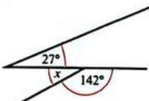

---

### 3 (练习题)

**题目**: 3 Find the value of  $x$  in each of the following diagrams.
a

b

C

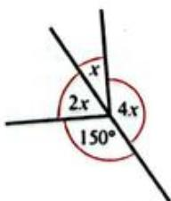

---

### 4 (练习题)

**题目**: 4 Two angles are supplementary. The first angle is twice the size of the second. What are their sizes?

---

### 5 (练习题)

**题目**: 5 One of the angles formed when two lines intersect is  $127^{\circ}$ . What are the sizes of the other three angles?

---

### WORKED EXAMPLE 4 (例题)

**题目**: WORKED EXAMPLE 4
Find the size of angles  $a, b$  and  $c$  in this figure.

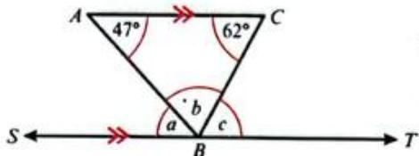

**解答**: Answer
$a = 47^{\circ}$  (CAB alt SBA)
$c = 62^{\circ}$  (ACB alt CBT)
$a + b + c = 180^{\circ}$  (angles on line)
$\therefore b = 180^{\circ} - 47^{\circ} - 62^{\circ}$
$b = 71^{\circ}$
CAB and SBA are alternate angles and are equal. ACB and CBT are alternate angles and equal.
Angles on a straight line  $= 180^{\circ}$
You know the values of  $a$  and  $c$ , so can use these to find  $b$ .

---

## 3 Lines, angles and shapes > 3.1 Lines and angles > Exercise 3.4

### 1 (练习题)

**题目**: 1 Calculate the size of all angles marked with letters in the following diagrams. Give reasons.

---

### 2 (练习题)

**题目**: 2 Decide whether  $AB\| DC$  in each of these examples. Give a reason for your answer.

---

### a (练习题)

**题目**: a If  $x + y = 180$  then  $180 - x = []?$

---

### b (练习题)

**题目**: b If  $x + y = 180$  then  $y = []$

---

### c (练习题)

**题目**: c If  $y = 180 - x$  and  $z = 180 - x$  what is  $y?$

---

### d (练习题)

**题目**: d If  $x = y$  and  $y = z$  , what can you say about  $x$  and  $z?$

---

### 2 (练习题)

**题目**: 2 How can you show in general terms that  $x = y$  in each of these diagrams? Share your reasoning and proof with your group.

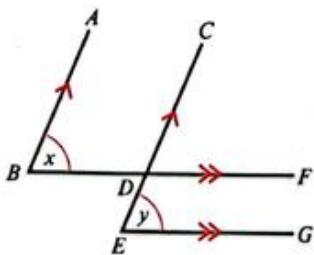

---

## 3 Lines, angles and shapes > 3.2 Triangles

### 5a (例题)

**题目**: WORKED EXAMPLE 5
Find the value of the unknown angles in each triangle. Give reasons for your answers.
a  $82^{\circ} + 30^{\circ} + x = 180^{\circ}$  (angle sum of triangle)

**解答**: $$
\begin{array}{l} x = 1 8 0 ^ {\circ} - 8 2 ^ {\circ} - 3 0 ^ {\circ} \\ x = 6 8 ^ {\circ} \\ \end{array}
$$

---

### 5b (例题)

**题目**: b  $2x + 90^{\circ} = 180^{\circ}$  （angle sum of triangle）

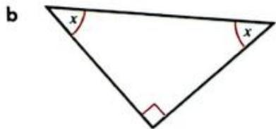

**解答**: $$
\begin{array}{l} 2 x = 1 8 0 ^ {\circ} - 9 0 ^ {\circ} \\ 2 x = 9 0 ^ {\circ} \\ x = 4 5 ^ {\circ} \\ \end{array}
$$

---

### 5c (例题)

**题目**: WORKED EXAMPLE 5 CONTINUED
C

c

**解答**: $$
\begin{array}{l} 7 0 ^ {\circ} + 3 5 ^ {\circ} + x = 1 8 0 ^ {\circ} \\ x = 1 8 0 ^ {\circ} - 1 0 5 ^ {\circ} \\ x = 7 5 ^ {\circ} \\ y = 7 5 ^ {\circ} \\ 7 0 ^ {\circ} + y + z = 1 8 0 ^ {\circ} \\ 7 0 ^ {\circ} + 7 5 ^ {\circ} + z = 1 8 0 ^ {\circ} \\ x = 1 8 0 ^ {\circ} - 7 5 ^ {\circ} - 7 0 ^ {\circ} \\ z = 3 5 ^ {\circ} \\ \text {o r} z = 3 5 ^ {\circ} \\ \end{array}
$$
(anglesumof triangle)
(corresponding angles)
(anglesumof triangle)
(corresponding angles)

---

### 6 (例题)

**题目**: WORKED EXAMPLE 6
Find the size of angle  $x, y$  and  $z$ .
a

a  $x = 60^{\circ} + 80^{\circ}$
b

b  $y + 70^{\circ} = 125^{\circ}$
c

40°+z=110°

**解答**: $$
x = 1 4 0 ^ {\circ}
$$
(exterior angle of triangle)
$$
y = 1 2 5 ^ {\circ} - 7 0 ^ {\circ}
$$
$$
y = 5 5 ^ {\circ}
$$
(exterior angle of triangle)
$$
z = 1 1 0 ^ {\circ} - 4 0 ^ {\circ}
$$
$$
z = 7 0 ^ {\circ}
$$
(exterior angle of triangle ABC)

---

### WORKED EXAMPLE 6 (例题)

**题目**: WORKED EXAMPLE 6
Find the size of angle  $x, y$  and  $z$ .

**解答**: a

a  $x = 60^{\circ} + 80^{\circ}$
$$
x = 1 4 0 ^ {\circ}
$$
(exterior angle of triangle)
b

b  $y + 70^{\circ} = 125^{\circ}$
$$
y = 1 2 5 ^ {\circ} - 7 0 ^ {\circ}
$$
$$
y = 5 5 ^ {\circ}
$$
(exterior angle of triangle)
c

40°+z=110°
$$
z = 1 1 0 ^ {\circ} - 4 0 ^ {\circ}
$$
$$
z = 7 0 ^ {\circ}
$$
(exterior angle of triangle ABC)

---

### WORKED EXAMPLE 7 (例题)

**题目**: WORKED EXAMPLE 7
Find the size of angle  $x$ .

**解答**: Answer
$$
\begin{array}{l} \text {A n g l e A C B} = 5 0 ^ {\circ} \\ \therefore C A B = 1 8 0 ^ {\circ} - 5 0 ^ {\circ} - 5 0 ^ {\circ} \\ C A B = 8 0 ^ {\circ} \\ \end{array}
$$
$$
\begin{array}{l} \text {A n g l e} A C D = 8 0 ^ {\circ} \\ \therefore A D C = 8 0 ^ {\circ} \\ \therefore x = 1 8 0 ^ {\circ} - 8 0 ^ {\circ} - 8 0 ^ {\circ} \\ x = 2 0 ^ {\circ} \\ \end{array}
$$
(base angles isos triangle ABC)
angle sum of triangle ABC)
(alt angles)
(base angles isos triangle ADC)
(angle sum of triangle ADC)

---

## 3 Lines, angles and shapes > 3.2 Triangles > Exercise 3.5

### Exercise 3.5 (练习题)

**题目**: Exercise 3.5
1 Find the size of each marked angle. Give reasons.

---

### 1a (练习题)

**题目**: a

---

### 1b (练习题)

**题目**: b

---

### 1C (练习题)

**题目**: C

---

### 2a (练习题)

**题目**: 2 Calculate the value of  $x$  in each case. Give reasons.
a

---

### 2b (练习题)

**题目**: b

---

### 3 (练习题)

**题目**: 3 What is the size of the angle marked  $x$  in these figures? Show all steps and give reasons.

---

## 3 Lines, angles and shapes > 3.3 Quadrilaterals

### WORKED EXAMPLE 8 (例题)

**题目**: WORKED EXAMPLE 8
Find the size of each marked angle in each of these figures.
a Parallelogram

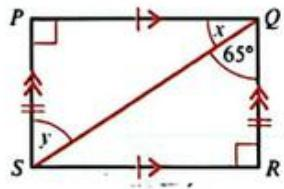

**解答**: a  $x = 110^{\circ}$
$$
y = 7 0 ^ {\circ}
$$
$$
z = 1 1 0 ^ {\circ}
$$
(co-interior angles)
(opposite angles of || gram)
(opposite angles of || gram)
b Rectangle

b  $x + 65^{\circ} = 90^{\circ}$
$$
\therefore x = 9 0 ^ {\circ} - 6 5 ^ {\circ}
$$
$$
x = 2 5 ^ {\circ}
$$
$$
y = 6 5 ^ {\circ}
$$
(right angle of rectangle)
(alt angles)
c Quadrilateral

c Angle  $X K Y = 360^{\circ} - 70^{\circ} - 145^{\circ} - 80^{\circ}$
$$
\therefore \text {A n g l e} X K Y = 6 5 ^ {\circ}
$$
$$
\therefore x = 1 8 0 ^ {\circ} - 6 5 ^ {\circ} - 6 5 ^ {\circ}
$$
$$
x = 5 0 ^ {\circ}
$$
(anglesumofquad)
(base angles isos triangle)
angle sum of triangle KXY

---

## 3 Lines, angles and shapes > 3.3 Quadrilaterals > Exercise 3.6

### 1 (练习题)

**题目**: 1 A quadrilateral has two diagonals that intersect at right angles.
a What quadrilaterals could it be?
b The diagonals are not equal in length. What quadrilaterals could it NOT be?

---

### 2 (练习题)

**题目**: 2 Find the value of  $x$  in each of these figures. Give reasons.

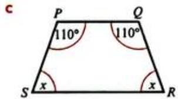

---

### 3 (练习题)

**题目**: 3 Find the value of  $x$  in each of these figures. Give reasons.

---

## 3 Lines, angles and shapes > 3.4 Polygons

### WORKED EXAMPLE 9 (例题)

**题目**: WORKED EXAMPLE 9
Find the angle sum of a decagon and state the size of each interior angle if the decagon is regular.

**解答**: Answers
sum of interior angles
$$
= (n - 2) \times 1 8 0 ^ {\circ}
$$
Sum of angles
$$
= (1 0 - 2) \times 1 8 0 ^ {\circ}
$$
A decagon has 10 sides, so  $n = 10$ .
$$
= 1 4 4 0 ^ {\circ}
$$
$$
= \frac {1 4 4 0}{1 0}
$$
$$
= 1 4 4 ^ {\circ}
$$
A regular decagon has 10 equal angles.
Size of one angle.

---

### WORKED EXAMPLE 10 (例题)

**题目**: WORKED EXAMPLE 10
A polygon has an angle sum of  $2340^{\circ}$ . How many sides does it have?

---

## 3 Lines, angles and shapes > 3.4 Polygons > Exercise 3.7

### 1 (练习题)

**题目**: 1 Copy and complete this table.
[Table Row] <tr><td>Number of sides in the polygon</td><td>5</td><td>6</td><td>7</td><td>8</td><td>9</td><td>10</td><td>12</td><td>20</td></tr>
[Table Row] <tr><td>Angle sum of interior angles</td><td></td><td></td><td></td><td></td><td></td><td></td><td></td><td></td></tr>

---

### 2 (练习题)

**题目**: 2 Find the size of one interior angle for each of the following regular polygons.
a pentagon
b hexagon
c octagon
d decagon
e dodecagon (12 sides)
a 25-sided polygon

---

### 3 (练习题)

**题目**: 3 A regular polygon has 15 sides. Find:
a the sum of the interior angles
b the sum of the exterior angles
c the size of each interior angle
the size of each exterior angle.

---

### 4 (练习题)

**题目**: 4 A regular polygon has  $n$  exterior angles of  $15^{\circ}$ . How many sides does it have?

---

### 5 (练习题)

**题目**: 5 Find the value of  $x$  in each of these irregular polygons.

---

## 3 Lines, angles and shapes > 3.5 Circles

### 3.5 (练习题)

**题目**: Parts of a circle
Study the following diagrams carefully and then work through Exercise 3.8 to make sure you know and can use the names of circle parts correctly.

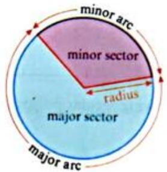

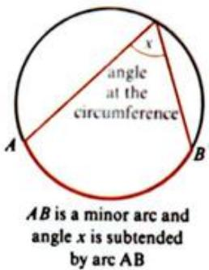

---

## 3 Lines, angles and shapes > 3.5 Circles > Exercise 3.8

### 1 (练习题)

**题目**: 1 Name the circle parts shown in blue on these circles.

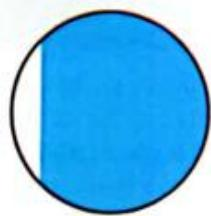

---

### 2 (练习题)

**题目**: 2 Draw four small circles. Use shading to show:
a a semi-circle
b a minor segment
a tangent to the circle
d angle  $y$  subtended by a minor arc  $MN$

---

### 3 (练习题)

**题目**: 3 Circle 1 and circle 2 have the same centre  $(O)$ . Use the correct terms or letters to copy and complete each statement.

a  $OB$  is a  $\_$  of circle 2.
b  $DE$  is the of circle 1.
c  $AC$  is a  $\_$  of circle 2.
d is a radius of circle 1.
e  $CAB$  is a  $\_$  of circle 2.
f Angle FOD is the vertex of a of circle 1 and circle 2.

---

## 3 Lines, angles and shapes > 3.6 Construction

### WORKED EXAMPLE 11 (例题)

**题目**: WORKED EXAMPLE 11
Construct triangle ABC with  $AB = 5\mathrm{cm}$ $BC = 6\mathrm{cm}$  and  $CA = 4\mathrm{cm}$

**解答**: Always start with a rough sketch.
Draw the longest side  $(BC = 6cm)$  and label it.
Set your pair of compasses at 5cm. Place the point on B and draw an arc.

Set your pair of compasses at 4cm. Place the point on C and draw an arc.

The point where the arcs cross is A. Join BA and CA.

---

## 3 Lines, angles and shapes > 3.6 Construction > Exercise 3.9

### 1 (练习题)

**题目**: Exercise 3.9
1 Construct these lines.
a  $AB = 6\mathrm{cm}$

---

## 3 Lines, angles and shapes > 3.6 Construction

### WORKED EXAMPLE 11 (例题)

**题目**: WORKED EXAMPLE 11
Construct triangle ABC with  $AB = 5\mathrm{cm}$ $BC = 6\mathrm{cm}$  and  $CA = 4\mathrm{cm}$

Always start with a rough sketch.
Draw the longest side  $(BC = 6cm)$  and label it.
Set your pair of compasses at 5cm. Place the point on B and draw an arc.

Set your pair of compasses at 4cm. Place the point on C and draw an arc.

The point where the arcs cross is A. Join BA and CA.

---

## 3 Lines, angles and shapes > 3.6 Construction > Exercise 3.9

### 1b (练习题)

**题目**: b  $CD = 75\mathrm{mm}$

---

### 1c (练习题)

**题目**: c  $EF = 5.5\mathrm{cm}$

---

### 2 (练习题)

**题目**: 2 Accurately construct these triangles.
a

---

### 2b (练习题)

**题目**: b

---

### 2C (练习题)

**题目**: C

---

### 3 (练习题)

**题目**: 3 Construct these triangles.
a Triangle  $ABC$  with  $BC = 8.5\mathrm{cm}$ $AB_{*} = 7.2\mathrm{cm}$  and  $AC = 6.9\mathrm{cm}$

---

### 3b (练习题)

**题目**: b Triangle  $XYZ$  with  $YZ = 86\mathrm{mm}$ $XY = 120\mathrm{mm}$  and  $XZ = 66\mathrm{mm}$

---

### 3c (练习题)

**题目**: c Equilateral triangle DEF with sides of  $6.5\mathrm{cm}$

---

### 3d (练习题)

**题目**: d Isosceles triangle  $PQR$  with a base of  $4\mathrm{cm}$  and  $PQ = PR = 6.5\mathrm{cm}$

---

### 4 (练习题)

**题目**: 4 The diagram shows a rough sketch for a logo design.  $AE$  and  $CE$  are straight lines and  $AD = 8\mathrm{cm}$

a Construct an accurate drawing using a ruler and a pair of compasses.

---

### 4b (练习题)

**题目**: b Measure your diagram to find these lengths, to 1 decimal place.
i DE
ii
EF

---

### a (练习题)

**题目**: a Describe your experience of learning to construct accurate sketches.

---

### b (练习题)

**题目**: b What did you like best and what did you like least about the practical drawing work? Why?

---

### c (练习题)

**题目**: c Is the statement about learning true for you in the context of drawing accurate diagrams?

---

### d (练习题)

**题目**: d Is it true for you generally? Explain why or why not.

---

### 1 (练习题)

**题目**: 1 Draw a table like this one:

---

### 2 (练习题)

**题目**: 2 Look back at the learning intentions at the start of this chapter. Use these to develop a list of criteria that you can use to decide whether you have met the learning intentions. For example:
I know all the key words and their meanings and I use them in my work.

---

### 3 (练习题)

**题目**: 3 Once you have your list, check your work against the success criteria.
- Place a tick (✓) in the second column if you can find evidence that you have met each one. (You are looking for how your work shows you have achieved the criteria.)
If you cannot find evidence, write down what you can do to improve in that particular area.

---

### 4 (练习题)

**题目**: 4 Make any improvements that you need to over the next few days and then reassess your work using the same criteria.

---

### 1 (练习题)

**题目**: 1 a Measure this line and construct  $AB$  the same length in your book using a ruler and compasses.
A B
b At point A, measure and draw angle BAC, a  $75^{\circ}$  angle. [2]
c At point  $B$  measure and draw angle  $ABD$  , an angle of  $125^{\circ}$  [2]

---

### 2 (练习题)

**题目**: 2 Determine  $x$  in each figure. Give reasons.
a
![[3]](images/dae9951db14226db3a47bd60b46a966a34159340f5c2eafe9927830fca684454.jpg)
b
![[2]](images/f722cc6bd8b8b5206ea8154437c449b734cf11767420512b26fd02668a55b283.jpg)
C
![[2]](images/706d82b660a3142369d2e3a58095170391ea078e65a1b933c3776154f6a9d99b.jpg)

---

### 9 (练习题)

**题目**: 9 Construct triangle  $PQR$  with sides  $PQ = 4.5\mathrm{cm}$ $QR = 5\mathrm{cm}$  and  $PR = 7\mathrm{cm}$  [3]

---

### 10 (练习题)

**题目**: 10 a Construct a triangle with sizes of length  $5\mathrm{cm}$ $7\mathrm{cm}$  and  $9\mathrm{cm}$  [3]
b Construct the perpendicular bisector of each of the three sides. What do you notice? [3]
c Draw a circle with its centre at the point where the lines intersect and passing through each vertex of the triangle. [3]
Construct a different triangle and repeat b and c above. What do you notice? [3]

---

### 11 (练习题)

**题目**: 11 The sum of the interior angles of a convex polygon is  $5400^{\circ}$ . Work out how many sides the polygon has. [3]

---

### 12 (练习题)

**题目**: 12 The diagram shows a regular pentagon  $ABCDE$ .
a Find x. [3] b Find y. [3]

---

### 13 (练习题)

**题目**: 13 Regular polygon A has 10 sides and exterior angle  $3x$ . Regular polygon B has exterior angle  $\frac{5}{3}x$ .
Work out the number of sides polygon B has. [5]

---

### 14 (练习题)

**题目**: 14 The diagram shows a triangle and two parallel lines.
a Write down angles UVP and WVQ in terms of  $a$  and  $c$ . Give reasons for your answers.
b Use your answer to a to prove that the sum of the interior angles of a triangle is 180 degrees.
c Write down the exterior angle  $RQV$  in terms of  $c$  [1]
d Use your answers to b and c to show that the exterior angle of a triangle is equal to the sum of the two opposite interior angles. [2]

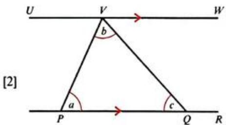

---

## 4 Collecting, organising and displaying data

### 1 (练习题)

**题目**: 1 The person in the photo is doing a survey to find out whether people in a village know what health services are available to them. What other methods can you think of to collect data?

---

### 2 (练习题)

**题目**: 2 Look at these four graphs carefully. For each one, discuss:
a what the graph shows
b how you interpret and make sense of the data shown.
c when each type of graph is useful and what type of data is suited to each graph
d how each type of graph can give a misleading or wrong impression of the data.

---

## 4 Collecting, organising and displaying data > 4.1 Collecting and classifying data > Exercise 4.1

### 1 (练习题)

**题目**: 1 Draw a table like this one.
[Table Row] <tr><td>Categorical data</td><td>Numerical data</td></tr>
[Table Row] <tr><td>Hair colour</td><td>Number of people in household</td></tr>
a Add five examples of categorical data and five examples of numerical data that could be collected about each student in your class.
b Look at the numerical examples in your table. Circle any that will give discrete data.

---

### 2 (练习题)

**题目**: 2 State whether the following data is discrete or continuous.
Mass of each animal in a herd.
b Number of animals per household.
c Time taken to travel to school.
d Volume of water evaporating from a dam.
e Number of correct answers in a spelling test.
f Distance people travel to work.
g Foot length of each student in a class.
h Shoe size of each student in a class.
i Head circumference of new-born babies.
Number of children per family.
k Number of TV programmes watched in the last month.
Number of cars crossing a bridge per hour.

---

### 3 (练习题)

**题目**: 3 For each of the following questions state:
i one method you could use to collect the data
ii whether the source of the data is primary or secondary
iii whether the data is categorical or numerical
iv for the numerical data, whether it is discrete or continuous.
a How many times will you get heads if you toss a coin 100 times?
b Which is the most popular TV show among your classmates?
c What are the lengths of the ten longest rivers in the world?
What is the favourite sport of students in your school?
e How many books are taken out per week from the school library?
f Is it more expensive to drive to work than to use public transport?
g Is there a connection between shoe size and height?
What is the most popular colour of car?
What is the batting average of the national cricket team this season?
j How many pieces of fruit do you eat in a week?

---

## 4 Collecting, organising and displaying data > 4.2 Organising data > Exercise 4.2

### 1 (练习题)

**题目**: 1 Balsem recorded how many students left the classroom during a lesson for 50 lessons. Draw a tally table to organise this data.

---

### 2 (练习题)

**题目**: 2 Do a quick survey among your class to find out how many hours each person usually spends doing their homework each day. Draw your own tally table to record and organise your data.

---

### 3 (练习题)

**题目**: 3 Faizel threw two dice together 250 times and recorded the score he got using a tally table.
[Table Row] <tr><td>Score</td><td>Tally</td></tr>
[Table Row] <tr><td>2</td><td>HH II</td></tr>
[Table Row] <tr><td>3</td><td>HH HN HN</td></tr>
[Table Row] <tr><td>4</td><td>HH HN HN HN III</td></tr>
[Table Row] <tr><td>5</td><td>HH HN HN HN HN III</td></tr>
[Table Row] <tr><td>6</td><td>HH HN HN HN HN III</td></tr>
[Table Row] <tr><td>7</td><td>HH HN HN HN HN HN I</td></tr>
[Table Row] <tr><td>8</td><td>HH HN HN HN HN HN</td></tr>
[Table Row] <tr><td>9</td><td>HH HN HN HN HN III</td></tr>
[Table Row] <tr><td>10</td><td>HH HN HN HN I</td></tr>
[Table Row] <tr><td>11</td><td>HH HN II .</td></tr>
[Table Row] <tr><td>12</td><td>HH I</td></tr>
a Which score occurred most often?
b Which two scores occurred least often?
c Why do you think Faizel left out the score of one?
Why do you think he scored six, seven and eight so many times?

---

## 4 Collecting, organising and displaying data > 4.2 Organising data

### 1 (例题)

**题目**: Aisha wanted to find out what people thought about pop-up adverts on their social media feeds. She did a survey of 100 people. Each person chose an answer A, B, C or D.
What do you think about this statement? Please choose one response.
Advertising should be strictly controlled on social media. Pop-up adverts should be banned from all social media feeds.
A I strongly agree
B I agree
C I disagree
D I strongly disagree
Aisha recorded these results:
[Table Row] <tr><td>A</td><td>B</td><td>A</td><td>C</td><td>A</td><td>C</td><td>C</td><td>D</td><td>A</td><td>C</td></tr>
[Table Row] <tr><td>C</td><td>C</td><td>D</td><td>A</td><td>D</td><td>D</td><td>C</td><td>C</td><td>C</td><td>A</td></tr>
[Table Row] <tr><td>B</td><td>B</td><td>A</td><td>C</td><td>D</td><td>B</td><td>B</td><td>A</td><td>C</td><td>C</td></tr>
[Table Row] <tr><td>A</td><td>B</td><td>C</td><td>A</td><td>D</td><td>B</td><td>C</td><td>D</td><td>A</td><td>B</td></tr>
[Table Row] <tr><td>A</td><td>C</td><td>C</td><td>D</td><td>A</td><td>C</td><td>C</td><td>C</td><td>D</td><td>A</td></tr>
[Table Row] <tr><td>D</td><td>D</td><td>C</td><td>C</td><td>C</td><td>A</td><td>B</td><td>B</td><td>A</td><td>C</td></tr>
[Table Row] <tr><td>D</td><td>C</td><td>C</td><td>D</td><td>A</td><td>C</td><td>A</td><td>B</td><td>D</td><td>B</td></tr>
[Table Row] <tr><td>C</td><td>C</td><td>D</td><td>A</td><td>D</td><td>D</td><td>C</td><td>C</td><td>C</td><td>A</td></tr>
[Table Row] <tr><td>B</td><td>B</td><td>A</td><td>C</td><td>D</td><td>B</td><td>B</td><td>C</td><td>C</td><td>C</td></tr>
[Table Row] <tr><td>A</td><td>B</td><td>C</td><td>A</td><td>D</td><td>B</td><td>C</td><td>D</td><td>A</td><td>B</td></tr>
a Draw a tally table to organise the results.
b What do the results of her survey suggest people think about pop-up advertising on social media?

**解答**: Answers
a
[Table Row] <tr><td>Response</td><td>Tally</td></tr>
[Table Row] <tr><td>A</td><td>HHHHHHIII</td></tr>
[Table Row] <tr><td>B</td><td>HHHHHHIII</td></tr>
[Table Row] <tr><td>C</td><td>HHHHHHHHHHII</td></tr>
[Table Row] <tr><td>D</td><td>HHHHHH</td></tr>
Count each letter. Make a tally each time you count one.
It may help to cross the letters off the list as you count them.
Check that your tallies add up to 100 to make sure you have included all the scores. (It is more efficient to work across the rows or down the columns, putting a tally into the correct row in your table, rather than counting one letter at a time.)
b The results suggest that people generally don't think advertising should be banned on social media. 57 people disagreed or strongly disagreed. Only 24 of the 100 people strongly agreed with Aisha's statement.
By giving people a very definite statement and asking them to respond to it, Aisha has shown her own bias and that could affect the results of her survey. It is quite possible that people think some control is necessary, but not that adverts should be banned completely. However, they don't have that as an option when they answer. The people in the sample could also affect the responses, so Aisha will have to carefully consider any conclusions from this survey.

---

## 4 Collecting, organising and displaying data > 4.2 Organising data > Exercise 4.3

### 1 (练习题)

**题目**: 1 Sheldon did a survey to find out how many coins the students in a class had in their pockets or purses. These are the results:
[Table Row] <tr><td>0</td><td>2</td><td>3</td><td>1</td><td>4</td><td>6</td><td>3</td><td>6</td><td>7</td><td>2</td></tr>
[Table Row] <tr><td>1</td><td>2</td><td>4</td><td>0</td><td>0</td><td>6</td><td>5</td><td>4</td><td>8</td><td>2</td></tr>
[Table Row] <tr><td>6</td><td>3</td><td>2</td><td>0</td><td>0</td><td>0</td><td>2</td><td>4</td><td>3</td><td>5</td></tr>
a Copy this frequency table and use it to organise Sheldon's data.
[Table Row] <tr><td>Number of coins</td><td>0</td><td>1</td><td>2</td><td>3</td><td>4</td><td>5</td><td>6</td><td>7</td><td>8</td></tr>
[Table Row] <tr><td>Frequency</td><td></td><td></td><td></td><td></td><td></td><td></td><td></td><td></td><td></td></tr>
b What is the highest number of coins that any person had?
c How many people had only one coin?
What is the most common number of coins that people had?
How many people did Sheldon survey altogether? How could you show this on the frequency table?

---

### 2 (练习题)

**题目**: 2 Barkha works in a fast-food restaurant. These are the amounts (in dollars) spent by 25 customers during one shift.
[Table Row] <tr><td>43.55</td><td>4.45</td><td>17.60</td><td>25.95</td><td>3.75</td></tr>
[Table Row] <tr><td>12.35</td><td>55.00</td><td>12.90</td><td>35.95</td><td>16.25</td></tr>
[Table Row] <tr><td>25.05</td><td>2.50</td><td>29.35</td><td>12.90</td><td>8.70</td></tr>
[Table Row] <tr><td>12.50</td><td>13.95</td><td>6.50</td><td>39.40</td><td>22.55</td></tr>
[Table Row] <tr><td>20.45</td><td>4.50</td><td>5.30</td><td>15.95</td><td>10.50</td></tr>
a Copy and complete this grouped frequency table to organise the data.
[Table Row] <tr><td>Amount ($)</td><td>0–9.99</td><td>10–19.99</td><td>20–29.99</td><td>30–39.99</td><td>40–49.99</td><td>50–59.99</td></tr>
[Table Row] <tr><td>Frequency</td><td></td><td></td><td></td><td></td><td></td><td></td></tr>
b How many people spent less than $20.00?
How many people spent more than $50.00?
What is the most common amount that people spent during Barkha's shift?

---

### 3 (练习题)

**题目**: 3 Li records the length in minutes and whole seconds of each phone call he makes during one day. These are the results:
[Table Row] <tr><td>3 min 29 s</td><td>4 min 12 s</td><td>4 min 15 s</td><td>1 min 29 s</td><td>2 min 45 s</td></tr>
[Table Row] <tr><td>1 min 32 s</td><td>1 min 09 s</td><td>2 min 50 s</td><td>3 min 15 s</td><td>4 min 03 s</td></tr>
[Table Row] <tr><td>3 min 04 s</td><td>5 min 12 s</td><td>5 min 45 s</td><td>3 min 29 s</td><td>2 min 09 s</td></tr>
[Table Row] <tr><td>1 min 12 s</td><td>4 min 15 s</td><td>3 min 45 s</td><td>3 min 59 s</td><td>5 min 01 s</td></tr>
Use a grouped frequency table to organise the data.

---

### 1 (练习题)

**题目**: c How many people had only one coin?

---

### 2 (练习题)

**题目**: What is the most common number of coins that people had?

---

### 3 (练习题)

**题目**: How many people did Sheldon survey altogether? How could you show this on the frequency table?

---

### WORKED EXAMPLE 2 (例题)

**题目**: WORKED EXAMPLE 2
This data set shows the ages of customers in a café one lunchtime.
[Table Row] <tr><td>34</td><td>23</td><td>40</td><td>35</td><td>25</td><td>28</td><td>18</td><td>32</td></tr>
[Table Row] <tr><td>37</td><td>29</td><td>19</td><td>17</td><td>32</td><td>55</td><td>36</td><td>42</td></tr>
[Table Row] <tr><td>33</td><td>20</td><td>25</td><td>34</td><td>48</td><td>39</td><td>36</td><td>30</td></tr>
Draw a stem-and-leaf diagram to display this data.

**解答**: [Table Row] <tr><td>Stem</td><td>Leaf</td></tr>
[Table Row] <tr><td>1</td><td>8 9 7</td></tr>
[Table Row] <tr><td>2</td><td>3 5 8 9 0 5</td></tr>
[Table Row] <tr><td>3</td><td>4 5 2 7 6 6 3 4 2 9 0</td></tr>
[Table Row] <tr><td>4</td><td>0 2 8</td></tr>
[Table Row] <tr><td>5</td><td>5</td></tr>
[Table Row] <tr><td>Stem</td><td>Leaf</td><td>Key</td></tr>
[Table Row] <tr><td>1</td><td>7 8 9</td><td rowspan="5">1 | 7 represents 17</td></tr>
[Table Row] <tr><td>2</td><td>0 3 5 5 8 9</td></tr>
[Table Row] <tr><td>3</td><td>0 2 2 3 4 4 5 6 6 7 9</td></tr>
[Table Row] <tr><td>4</td><td>0 2 8</td></tr>
[Table Row] <tr><td>5</td><td>5</td></tr>
Group the ages in intervals of ten, 10-19; 20-29 and so on.
These are two-digit numbers, so the tens digit is the stem.
List the stems in ascending order down the left of the diagram.
Work through the data in the order it is given, writing the units digits (the leaves) in a row next to the appropriate stem. Space the leaves to make them easier to read.
If you need to work with the data, you can redraw the diagram, putting the leaves in ascending order.
From this reorganised stem-and-leaf diagram you can quickly see that:
the youngest person using the internet cafe was 17 years old (the first data item)
the oldest person was 55 (the last data item)
- most users were in the age group 30-39 (the group with the largest number of leaves).

---

## 4 Collecting, organising and displaying data > 4.2 Organising data > Exercise 4.4

### Exercise 4.4 (练习题)

**题目**: Exercise 4.4

---

### 1 (练习题)

**题目**: 1 The masses of some Grade 10 students were measured and recorded to the nearest kilogram. These are the results:
[Table Row] <tr><td>45</td><td>56</td><td>55</td><td>68</td><td>53</td><td>55</td><td>48</td><td>49</td><td>53</td><td>54</td></tr>
[Table Row] <tr><td>56</td><td>59</td><td>60</td><td>63</td><td>67</td><td>49</td><td>55</td><td>56</td><td>58</td><td>60</td></tr>
Construct a stem-and-leaf diagram to display the data.

---

### 2 (练习题)

**题目**: 2 The numbers of pairs of running shoes sold each day for a month at different branches of 'Runner's Up Shoe Store' are given in the table.
[Table Row] <tr><td>Branch A</td><td>175, 132, 180, 134, 179, 115, 140, 200, 198, 201, 189, 149, 188, 179, 186, 152, 180, 172, 169, 155, 164, 168, 166, 149, 188, 190, 199, 200</td></tr>
[Table Row] <tr><td>Branch B</td><td>188, 186, 187, 159, 160, 188, 200, 201, 204, 198, 190, 185, 142, 188, 165, 187, 180, 190, 191, 169, 177, 200, 205, 196, 191, 193, 188, 200</td></tr>
a Draw a back-to-back stem-and-leaf diagram to display the data.
b Which branch had the most sales on one day during the month?
c Which branch appears to have sold the most pairs? Why?

---

### 3 (练习题)

**题目**: APPLY YOUR SKILLS
3 A team of biologists wanted to investigate how pollution levels affect the growth of fish in a dam. In January, they caught a number of fish and measured their length before releasing them back into the water. The stem-and-leaf diagram shows the lengths of the fish to the nearest centimetre.
[Table Row] <tr><td colspan="2">Length of fish (cm) January sample</td></tr>
[Table Row] <tr><td>1</td><td>2 4 4 6</td></tr>
[Table Row] <tr><td>2</td><td>0 1 3 3 4 5 8 9</td></tr>
[Table Row] <tr><td>3</td><td>3 5 6 6 6 7 8 9</td></tr>
[Table Row] <tr><td>4</td><td>0 2 5 7</td></tr>
[Table Row] <tr><td>5</td><td>2 7</td></tr>

---

### 3 (练习题)

**题目**: 3 A team of biologists wanted to investigate how pollution levels affect the growth of fish in a dam. In January, they caught a number of fish and measured their length before releasing them back into the water. The stem-and-leaf diagram shows the lengths of the fish to the nearest centimetre.
[Table Row] <tr><td colspan="2">Length of fish (cm) January sample</td></tr>
[Table Row] <tr><td>1</td><td>2 4 4 6</td></tr>
[Table Row] <tr><td>2</td><td>0 1 3 3 4 5 8 9</td></tr>
[Table Row] <tr><td>3</td><td>3 5 6 6 6 7 8 9</td></tr>
[Table Row] <tr><td>4</td><td>0 2 5 7</td></tr>
[Table Row] <tr><td>5</td><td>2 7</td></tr>
a How many fish did they measure?
b What was the shortest length measured?
c How long was the longest fish measured?
d How many fish were  $40\mathrm{cm}$  or longer?
e How do you think the diagram would change if they did the same survey in a year and:
i the pollution levels had increased and stunted the growth of the fish
ii the conditions in the water improved and the fish increased in length?

---

### 4 (练习题)

**题目**: 4 This stem-and-leaf diagram shows the pulse rate of a group of people measured before and after exercising on a treadmill.
[Table Row] <tr><td colspan="16382">Before exercise</td></tr>
[Table Row] <tr><td colspan="2">Key</td></tr>
[Table Row] <tr><td>Before exercise</td><td>2 | 6 represents 62 beats per minute</td></tr>
[Table Row] <tr><td>After exercise</td><td>8 | 7 represents 87 beats per minute</td></tr>
a How many people had a resting pulse rate (before exercise) in the range of 60 to 70 beats per minute?
b What was the highest pulse rate measured before exercise?
c That person also had the highest pulse rate after exercise. What was it?
d What does the stem-and-leaf diagram tell you about pulse rates and exercise in this group? How?

---

## 4 Collecting, organising and displaying data > 4.2 Organising data > Exercise 4.5

### 1 (练习题)

**题目**: 1 A teacher did a survey to see how many students in two classes were left-handed. She drew this two-way table to show the results.
[Table Row] <tr><td></td><td>Left-handed</td><td>Right-handed</td></tr>
[Table Row] <tr><td>Class 10 A</td><td>9</td><td>33</td></tr>
[Table Row] <tr><td>Class 10 B</td><td>6</td><td>42</td></tr>
a How many left-handed students are there altogether?
b How many of the students in Class 10 A are right-handed?
Are the students in Class 10 B mostly left-handed or mostly right-handed?
d How many students are there in the two classes?

---

### 2 (练习题)

**题目**: 2 Do a quick survey in your own school to find out how many left- or right-handed students there are in two or more different classes. Draw a two-way table of your results.

---

### 3 (练习题)

**题目**: 3 Sima asked her friends whether they checked their email on their phone or on their computer. These are the responses:
[Table Row] <tr><td>Name</td><td>Checks on phone</td><td>Checks on computer</td></tr>
[Table Row] <tr><td>Sheldon</td><td></td><td>✓</td></tr>
[Table Row] <tr><td>Leonard</td><td>✓</td><td>✓</td></tr>
[Table Row] <tr><td>Raj</td><td>✓</td><td></td></tr>
[Table Row] <tr><td>Penny</td><td></td><td>✓</td></tr>
[Table Row] <tr><td>Howard</td><td>✓</td><td>✓</td></tr>
[Table Row] <tr><td>Zarah</td><td></td><td>✓</td></tr>
[Table Row] <tr><td>Zohir</td><td>✓</td><td>✓</td></tr>
[Table Row] <tr><td>Ahmed</td><td>✓</td><td></td></tr>
[Table Row] <tr><td>Jenny</td><td>✓</td><td></td></tr>
[Table Row] <tr><td>Priyanka</td><td>✓</td><td>✓</td></tr>
[Table Row] <tr><td>Anne</td><td></td><td></td></tr>
[Table Row] <tr><td>Ellen</td><td>✓</td><td>✓</td></tr>
a Draw a two-way table using these responses.
b Write a sentence to summarise what you can learn from the table.

---

### WORKED EXAMPLE 3 (例题)

**题目**: WORKED EXAMPLE 3
This table shows population data for mid-2021 with estimated figures for 2025 and 2050.
[Table Row] <tr><td>Region</td><td>Population in mid-2021</td><td>Projected population 2035</td><td>Projected population 2050</td></tr>
[Table Row] <tr><td>World</td><td>7 837 000 000</td><td>8 848 000 000</td><td>9 688 000 000</td></tr>
[Table Row] <tr><td>Africa</td><td>1 373 000 000</td><td>1 890 000 000</td><td>2 529 000 000</td></tr>
[Table Row] <tr><td>North America</td><td>371 000 000</td><td>396 000 000</td><td>412 000 000</td></tr>
[Table Row] <tr><td>Latin America and the Caribbean</td><td>656 000 000</td><td>725 000 000</td><td>762 000 000</td></tr>
[Table Row] <tr><td>Asia</td><td>4 651 000 000</td><td>5 043 000 000</td><td>5 192 000 000</td></tr>
[Table Row] <tr><td>Europe</td><td>744 000 000</td><td>742 000 000</td><td>731 000 000</td></tr>
[Table Row] <tr><td>Oceania</td><td>43 000 000</td><td>53 000 000</td><td>62 000 000</td></tr>
Data from Population Reference Bureau.
WORKED EXAMPLE 3 CONTINUED
a What was the total population of the world in mid-2021?
b By how much is the population of the world expected to grow by 2035?
c What percentage of the world's population lived in Asia in mid-2021? Give your answer to the closest whole per cent.
d i Which region is likely to experience a decrease in population between 2021 and 2035?
ii What is the population of this region likely to be in 2035?
iii By how much is the population of this region expected to decrease by 2050?

**解答**: Answers
a 7837000000
Read this from the table.
b 8848000000-7837000000=101100000
Read the value for 2035 from the table and subtract the smaller figure from the larger.
4651000000 7837000000 × 100 = 59.3467% ≈ 59%
Read the figures from the table and then calculate the percentage.
d i Europe
Look to see which numbers are decreasing across the row.
ii 742000000
Read this from the table.
iii 744000000-731000000=13000000
Read the values from the table and subtract the smaller figure from the larger.

---

## 4 Collecting, organising and displaying data > 4.2 Organising data > Exercise 4.6

### 1 (练习题)

**题目**: 1 This distance table shows the flying distance (in miles) between some major world airports.
[Table Row] <tr><td></td><td>Mumbai</td><td>Hong Kong</td><td>London</td><td>Montreal</td><td>Singapore</td><td>Sydney</td></tr>
[Table Row] <tr><td>Dubai</td><td>1199</td><td>3695</td><td>3412</td><td>6793</td><td>3630</td><td>7580</td></tr>
[Table Row] <tr><td>Hong Kong</td><td>2673</td><td></td><td>8252</td><td>10345</td><td>1605</td><td>4586</td></tr>
[Table Row] <tr><td>Istanbul</td><td>2992</td><td>7016</td><td>1554</td><td>5757</td><td>5379</td><td>11772</td></tr>
[Table Row] <tr><td>Karachi</td><td>544</td><td>3596</td><td>5276</td><td>8888</td><td>2943</td><td>8269</td></tr>
[Table Row] <tr><td>Lagos</td><td>5140</td><td>8930</td><td>3098</td><td>6734</td><td>7428</td><td>11898</td></tr>
[Table Row] <tr><td>London</td><td>4477</td><td>8252</td><td></td><td>3251</td><td>6754</td><td>10564</td></tr>
[Table Row] <tr><td>Singapore</td><td>2432</td><td>1605</td><td>6754</td><td>9193</td><td></td><td>3912</td></tr>
[Table Row] <tr><td>Sydney</td><td>6308</td><td>4586</td><td>10564</td><td>12045</td><td>3916</td><td></td></tr>
a Find the flying distance from Hong Kong to:
i Dubai
ii London
iii Sydney
b Which is the longer flight: Istanbul to Montreal or Mumbai to Lagos?
c What is the total flying distance for a return flight from London to Sydney and back?
d If a plane flies at an average speed of 400 miles per hour, how long will it take to fly the distance from Singapore to Hong Kong to the nearest hour?
e Why are there some empty blocks in this table?

---

## 4 Collecting, organising and displaying data > 4.3 Using charts to display data

### WORKED EXAMPLE 4 (例题)

**题目**: WORKED EXAMPLE 4
This pictogram shows the amount of time that five friends spent talking on their phones during one week.

a Who spent the most time on the phone that week?
b How much time did Isobel spend on the phone that week?
c Who spent  $3\frac{1}{2}$  hours on the phone that week?
d Draw the symbols you would use to show  $4\frac{1}{4}$  hours.

**解答**: WORKED EXAMPLE 4 CONTINUED
Answers
a Anna
The person with the most clocks.
b 3 hours

---

## 4 Collecting, organising and displaying data > 4.2 Organising data > Exercise 4.6

### a (练习题)

**题目**: a Find the flying distance from Hong Kong to:
i Dubai
ii London
iii Sydney

---

### b (练习题)

**题目**: b Which is the longer flight: Istanbul to Montreal or Mumbai to Lagos?

---

### c (练习题)

**题目**: c What is the total flying distance for a return flight from London to Sydney and back?

---

### d (练习题)

**题目**: d If a plane flies at an average speed of 400 miles per hour, how long will it take to fly the distance from Singapore to Hong Kong to the nearest hour?

---

### e (练习题)

**题目**: e Why are there some empty blocks in this table?

---

## 4 Collecting, organising and displaying data > 4.3 Using charts to display data > Exercise 4.7

### 1 (练习题)

**题目**: 1 A pictogram showing how many tourists visit the top five tourist destinations uses this symbol.

How many tourists are represented by each of these symbols?
a

b

C

d

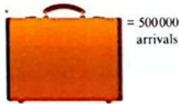

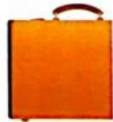

---

### 2 (练习题)

**题目**: 2 Here is a set of data for the five top tourist destination countries (2019). Use the symbol from question 1 with your own scale to draw a pictogram to show this data.
[Table Row] <tr><td>Country</td><td>France</td><td>Spain</td><td>USA</td><td>China</td><td>Italy</td></tr>
[Table Row] <tr><td>Number of tourists</td><td>89 400 000</td><td>83 700 000</td><td>79 300 000</td><td>65 700 000</td><td>64 500 000</td></tr>

---

### 3 (练习题)

**题目**: 3 This pictogram shows the number of fish caught by a fleet of five fishing boats during one fishing trip.

a Which boat caught the most fish?
b Which boat caught the least fish?
c How many fish did each boat catch?
d What is the total catch for the fleet on this trip?

---

### WORKED EXAMPLE 5 (例题)

**题目**: WORKED EXAMPLE 5
This frequency table shows the number of people who were treated for road accident injuries in the casualty department of a large hospital in the first six months of a year. Draw a bar chart to represent the data. Note that bar chart's frequency axis should start from zero.
[Table Row] <tr><td colspan="2">Patients admitted as a result of road accidents</td></tr>
[Table Row] <tr><td>Month</td><td>Number of patients</td></tr>
[Table Row] <tr><td>January</td><td>360</td></tr>
[Table Row] <tr><td>February</td><td>275</td></tr>
[Table Row] <tr><td>March</td><td>190</td></tr>
[Table Row] <tr><td>April</td><td>375</td></tr>
[Table Row] <tr><td>May</td><td>200</td></tr>
[Table Row] <tr><td>June</td><td>210</td></tr>

**解答**: 

---

## 4 Collecting, organising and displaying data > 4.3 Using charts to display data > Exercise 4.8

### 1 (练习题)

**题目**: 1 Draw a bar chart to show each of these sets of data.
a
[Table Row] <tr><td>Favourite take-away food</td><td>Burgers</td><td>Noodles</td><td>Fried chicken</td><td>Hot chips</td><td>Other</td></tr>
[Table Row] <tr><td>No. of people</td><td>40</td><td>30</td><td>84</td><td>20</td><td>29</td></tr>

---

### 1b (练习题)

**题目**: b
[Table Row] <tr><td colspan="2">African countries with the highest HIV/AIDS infection rates (2021 est)</td></tr>
[Table Row] <tr><td>Country</td><td>% of adults (aged 15 to 49) infected</td></tr>
[Table Row] <tr><td>Eswatini</td><td>27.0</td></tr>
[Table Row] <tr><td>Botswana</td><td>20.7</td></tr>
[Table Row] <tr><td>Lesotho</td><td>22.8</td></tr>
[Table Row] <tr><td>Zimbabwe</td><td>12.8</td></tr>
[Table Row] <tr><td>South Africa</td><td>19.0</td></tr>
[Table Row] <tr><td>Namibia</td><td>11.6</td></tr>
[Table Row] <tr><td>Zambia</td><td>11.3</td></tr>
[Table Row] <tr><td>Malawi</td><td>8.9</td></tr>
[Table Row] <tr><td>Equatorial Guinea</td><td>7.3</td></tr>
[Table Row] <tr><td>Mozambique</td><td>10.6</td></tr>

---

### 2 (练习题)

**题目**: 2 Here is a set of raw data showing the average summer temperature (in  $^\circ \mathrm{C}$ ) for 20 cities in the Middle East during one year.
[Table Row] <tr><td>32</td><td>42</td><td>36</td><td>40</td><td>35</td><td>36</td><td>33</td><td>32</td><td>38</td><td>37</td></tr>
[Table Row] <tr><td>34</td><td>40</td><td>41</td><td>39</td><td>42</td><td>38</td><td>37</td><td>42</td><td>40</td><td>41</td></tr>
a Copy and complete this grouped frequency table to organise the data.
[Table Row] <tr><td>Temperature (°C)</td><td>32-34</td><td>35-37</td><td>38-40</td><td>41-43</td></tr>
[Table Row] <tr><td>Frequency</td><td></td><td></td><td></td><td></td></tr>
b Draw a horizontal bar chart to represent this data.

---

### 3 (练习题)

**题目**: 3 A tourism organisation on a Caribbean island recorded how many tourists visit from the region and how many tourists visit from international destinations. Here is the data for the first six months of the year.
[Table Row] <tr><td></td><td>Jan</td><td>Feb</td><td>Mar</td><td>Apr</td><td>May</td><td>Jun</td></tr>
[Table Row] <tr><td>Regional visitors</td><td>12000</td><td>10000</td><td>19000</td><td>16000</td><td>21000</td><td>2000</td></tr>
[Table Row] <tr><td>International visitors</td><td>40000</td><td>39000</td><td>15000</td><td>12000</td><td>19000</td><td>25000</td></tr>
Display this data using a:
a dual bar chart
b composite bar chart.

---

### PEER ASSESSMENT (练习题)

**题目**: How can you decide whether another student's bar chart is correct or not?

---

### 1 (练习题)

**题目**: 1 Work in small groups to write a checklist to assess whether someone can draw an accurate and clear bar chart.
Consider the learning outcomes for this work and what you have covered in the lessons.
- Your statements should be clear, specific and easy to check. For example: The chart has a clear heading [ ] yes [ ] no
Leave space in your checklist to add comments. For example: Your heading has spelling mistakes in it. or The vertical scale needs to start at 0.

---

### 2 (练习题)

**题目**: 2 Use your checklist to assess another student's completed work in Exercise 4.8.

---

### 3 (练习题)

**题目**: 3 Use the checklist to suggest corrections, improvements or learning goals that still need to be met.

---

### WORKED EXAMPLE 6 (例题)

**题目**: WORKED EXAMPLE 6
The table shows how a student spent one day.
[Table Row] <tr><td>Activity</td><td>School</td><td>Sleeping</td><td>Eating</td><td>Online</td><td>On the phone</td><td>Complaining about stuff</td></tr>
[Table Row] <tr><td>Number of hours</td><td>7</td><td>8</td><td>1.5</td><td>3</td><td>2.5</td><td>2</td></tr>
Draw a pie chart to show this data.
$7 + 8 + 1.5 + 3 + 2.5 + 2 = 24$  First work out the total number of hours.
Then work out each category as a fraction of the whole and convert the fraction to degrees:
[Table Row] <tr><td></td><td>(as a fraction of 24)</td><td>(convert to degrees)</td></tr>
[Table Row] <tr><td>School</td><td>= 7/24</td><td>= 7/24 × 360 = 105°</td></tr>
[Table Row] <tr><td>Sleeping</td><td>= 8/24</td><td>8/24 × 360 = 120°</td></tr>
[Table Row] <tr><td>Eating</td><td>= 1.5/24 = 15/240</td><td>15/240 × 360 = 22.5°</td></tr>
[Table Row] <tr><td>Online</td><td>= 3/24</td><td>3/24 × 360 = 45°</td></tr>
[Table Row] <tr><td>On the phone</td><td>= 2.5/24 = 25/240</td><td>25/240 × 360 = 37.5°</td></tr>
[Table Row] <tr><td>Complaining about stuff</td><td>= 2/24</td><td>2/24 × 360 = 30°</td></tr>
[Table Row] <tr><td>Activity</td><td>School</td><td>Sleeping</td><td>Eating</td><td>Online</td><td>On the phone</td><td>Complaining about stuff</td></tr>
[Table Row] <tr><td>Number of hours</td><td>7</td><td>8</td><td>1.5</td><td>3</td><td>2.5</td><td>2</td></tr>
[Table Row] <tr><td>Angle</td><td>105°</td><td>120°</td><td>22.5°</td><td>45°</td><td>37.5°</td><td>30°</td></tr>
Draw a circle to represent the whole day.
Use a ruler and a protractor to measure each sector.
Label the chart and give it a title.

**解答**: TIP
It is possible that your angles, once rounded, don't quite add up to  $360^{\circ}$ . If this happens, you can add or subtract a degree to or from the largest sector (the one with the highest frequency).

---

### WORKED EXAMPLE 7 (例题)

**题目**: WORKED EXAMPLE 7
This pie chart shows how Javi spent one day of the school holidays.

a What fraction of the day did Javi spend playing computer games?
b How much time did Javi spend sleeping?
c What do you think 'other stuff' involved?

**解答**: Answers
a  $\frac{120}{360} = \frac{1}{3}$
Measure the angle and convert it to a fraction. The yellow sector has an angle of  $120^{\circ}$ . Convert to a fraction by writing it over 360 and simplify.
b  $\frac{210}{360} \times 24 = 14$  hours
Measure the angle, convert it to hours.
c Things Javi didn't bother to list. Possibly eating, showering, getting dressed.

---

## 4 Collecting, organising and displaying data > 4.3 Using charts to display data > Exercise 4.9

### 1 (练习题)

**题目**: 1 The table shows the results of a survey carried out on a university campus to find out about the use of online support services among students. Draw a pie chart to illustrate this data.
[Table Row] <tr><td>Category</td><td>Number of students</td></tr>
[Table Row] <tr><td>Never used online support</td><td>160</td></tr>
[Table Row] <tr><td>Used online support in the past</td><td>110</td></tr>
[Table Row] <tr><td>Use online support at present</td><td>90</td></tr>

---

### 2 (练习题)

**题目**: 2 The table shows the home language of a number of people passing through an international airport. Display this data as a pie chart.
[Table Row] <tr><td>Language</td><td>Frequency</td></tr>
[Table Row] <tr><td>English</td><td>130</td></tr>
[Table Row] <tr><td>Spanish</td><td>144</td></tr>
[Table Row] <tr><td>Chinese</td><td>98</td></tr>
[Table Row] <tr><td>Italian</td><td>104</td></tr>
[Table Row] <tr><td>French</td><td>24</td></tr>
[Table Row] <tr><td>German</td><td>176</td></tr>
[Table Row] <tr><td>Japanese</td><td>22</td></tr>

---

### 3 (练习题)

**题目**: 3 The amount of land used to grow different vegetables on a farm is shown in the table. Draw a pie chart to show the data.
[Table Row] <tr><td>Vegetable</td><td>Squashes</td><td>Pumpkins</td><td>Cabbages</td><td>Sweet potatoes</td></tr>
[Table Row] <tr><td>Area of land (km2)</td><td>1.4</td><td>1.25</td><td>1.15</td><td>1.2</td></tr>

---

### 4 (练习题)

**题目**: 4 The nationalities of students in an international school are shown on this pie chart.

a What fraction of the students are Chinese?
b What percentage of the students are Indian?
c What proportion of the total students are Brazilian? Give your answer as a decimal.
d If there are 900 students at the school, how many of them are:
i Chinese?
ii Indian?
iii American?
iv French?

---

### 11 (练习题)

**题目**: 11 Look at this generalised graph of noise levels in a classroom during a lesson.
How does the shape of the graph and the slope of the lines tell a story even though there are no scales given on the axes?

---

### 2 (练习题)

**题目**: 2 This graph shows the happiness levels of Team A's supporters during a football match. The final score in the match is 3 goals to 2, with Team A winning. Make up a story to fit the graph, describing the events that lead to changes in the graph.

---

### 3 (练习题)

**题目**: 3 What would your happiness graph look like for a normal school day? Draw it and add notes giving the reasons or events that caused any changes in the graph.

---

## 4 Collecting, organising and displaying data > 4.3 Using charts to display data > Exercise 4.10

### 1 (练习题)

**题目**: 1 The table shows the temperature of water in a beaker as it is heated over a Bunsen burner. The line graph shows how the temperature changes over time.
[Table Row] <tr><td>Time (seconds)</td><td>0</td><td>30</td><td>60</td><td>90</td><td>120</td><td>150</td><td>180</td></tr>
[Table Row] <tr><td>Temperature (°C)</td><td>26</td><td>28</td><td>38</td><td>56</td><td>70</td><td>82</td><td>96</td></tr>

a Use the graph to estimate the temperature of the water after: i 45 seconds ii 110 seconds.
b How long do you think it will take for the water to reach its boiling point  $(100^{\circ}\mathrm{C})$ ? Give a reason for your answer.

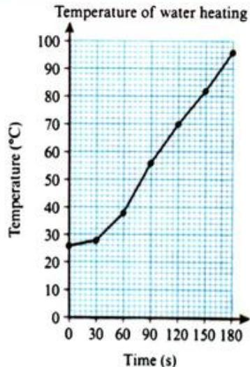

---

### 2 (练习题)

**题目**: 2 The table shows the temperatures recorded at Jisan Forest Ski Resort in Icheon-si, South Korea on one day in February. The line graph shows this data.
[Table Row] <tr><td>Time</td><td>07:00</td><td>08:00</td><td>09:00</td><td>10:00</td><td>11:00</td><td>12:00</td><td>13:00</td><td>14:00</td><td>15:00</td><td>16:00</td></tr>
[Table Row] <tr><td>Temperature (°C)</td><td>-7</td><td>-5</td><td>-3</td><td>-3</td><td>0</td><td>1</td><td>3</td><td>3</td><td>1</td><td>-1</td></tr>

a Estimate the temperature at 12:30.
b At what times was the temperature lower than  $-3^{\circ}C?$

---

### 3 (练习题)

**题目**: 3 Nadia's fitness app produced this graph of her pulse rate before, during and after a run. Nadia did some exercises to warm up and then she stayed still for a few minutes while she waited for her running group so they could start their run together.

a What was Nadia's pulse rate before the warm-up exercises?
b At what time do you think they started running? Why?
c What was the highest pulse rate recorded? When was this recorded?
d The group stopped running at 6:55. What happened to Nadia's pulse after she stopped running?

---

### 1 (练习题)

**题目**: 1 Salma is a quality control inspector. She randomly selects 40 packets of biscuits at a large factory. She opens each packet and counts the number of broken biscuits it contains. Her results are as follows:
[Table Row] <tr><td>0</td><td>0</td><td>2</td><td>1</td><td>3</td><td>0</td><td>0</td><td>2</td><td>3</td><td>1</td></tr>
[Table Row] <tr><td>1</td><td>1</td><td>2</td><td>3</td><td>0</td><td>1</td><td>2</td><td>3</td><td>4</td><td>2</td></tr>
[Table Row] <tr><td>0</td><td>0</td><td>0</td><td>0</td><td>1</td><td>0</td><td>0</td><td>1</td><td>2</td><td>3</td></tr>

---

### 1 (练习题)

**题目**: 1 Salma is a quality control inspector. She randomly selects 40 packets of biscuits at a large factory. She opens each packet and counts the number of broken biscuits it contains. Her results are as follows:
[Table Row] <tr><td>0</td><td>0</td><td>2</td><td>1</td><td>3</td><td>0</td><td>0</td><td>2</td><td>3</td><td>1</td></tr>
[Table Row] <tr><td>1</td><td>1</td><td>2</td><td>3</td><td>0</td><td>1</td><td>2</td><td>3</td><td>4</td><td>2</td></tr>
[Table Row] <tr><td>0</td><td>0</td><td>0</td><td>0</td><td>1</td><td>0</td><td>0</td><td>1</td><td>2</td><td>3</td></tr>
[Table Row] <tr><td>3</td><td>2</td><td>2</td><td>2</td><td>1</td><td>0</td><td>1</td><td>2</td><td>1</td><td>2</td></tr>
a Explain whether this is primary or secondary data to Salma. [2]
b Determine whether the data is discrete or continuous and explain your answer. [2]
c Copy and complete this frequency table to organise the data.
[Table Row] <tr><td>No. of broken biscuits</td><td>Tally</td><td>Frequency</td></tr>
[Table Row] <tr><td>0</td><td></td><td></td></tr>
[Table Row] <tr><td>1</td><td></td><td></td></tr>
[Table Row] <tr><td>2</td><td></td><td></td></tr>
[Table Row] <tr><td>3</td><td></td><td></td></tr>
[Table Row] <tr><td>4</td><td></td><td></td></tr>
d Draw a bar chart to represent this data. [5]

---

### 2 (练习题)

**题目**: 2 The number of aircraft movements in and out of five main London airports in one month is summarised in the table.
[Table Row] <tr><td>Airport</td><td>Gatwick</td><td>Heathrow</td><td>London City</td><td>Luton</td><td>Stansted</td></tr>
[Table Row] <tr><td>Total flights</td><td>23696</td><td>39660</td><td>6380</td><td>10697</td><td>15397</td></tr>
a State which airport handled most aircraft movement. [1]
b State how many aircraft moved in and out of Stansted Airport. [1]
c Round each figure to the nearest thousand. [2]
d Use the rounded numbers for all of the airports to draw a pictogram to show this data. [4]

---

### 3 (练习题)

**题目**: 3 This table shows the percentage of people who own a laptop and a mobile phone in four different districts in a large city.
[Table Row] <tr><td>District</td><td>Own a laptop (%)</td><td>Own a mobile phone (%)</td></tr>
[Table Row] <tr><td>A</td><td>45</td><td>83</td></tr>
[Table Row] <tr><td>B</td><td>32</td><td>72</td></tr>
[Table Row] <tr><td>C</td><td>61</td><td>85</td></tr>
[Table Row] <tr><td>D</td><td>22</td><td>68</td></tr>
a There are 6000 people in District A. Work out how many of them own a mobile phone.
[2]
b One district is home to a University of Technology and several computer software manufacturers. Explain which district you think this is.
[2]
c Draw a dual bar chart to display this data.
[5]

---

### 4 (练习题)

**题目**: 4 Study this pie chart and answer the questions that follow.
Sport played by students

Baseball

Cricket

Football

Netball

Hockey
The data was collected from a sample of 200 students.
a Explain the type of data the chart shows.
[2]
b Write down out many different categories of data there are.
[2]
c Work out which is the most popular sport.
[2]
d Work out the fraction of the students who play cricket.
[2]
e Work out how many students play netball.
[2]
f Work out how many students play baseball or hockey.
[2]

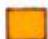

---

### 5 (练习题)

**题目**: 5 Study this graph carefully.

represents 1 billion people.
a What type of graph is this? [1]
b What does each symbol represent? [1]
c What was the population of the world in 1650? [2]
d How long did it take the population to double after 1650? [2]
e When did the world's population reach 7 billion? [2]
The United Nations predicts that the world's population will reach 9.2 billion in 2050. How would you show this on the graph? [2]

---

### 6 (练习题)

**题目**: 6 Two neighbouring villages, Packthorpe and Rainbridge, decide to join together to form Football, Tennis and Bowling clubs. The table shows some information about 80 people who have joined the teams.
[Table Row] <tr><td></td><td>Football</td><td>Tennis</td><td>Bowling</td><td>Total</td></tr>
[Table Row] <tr><td>Packthorpe</td><td></td><td>5</td><td></td><td>35</td></tr>
[Table Row] <tr><td>Rainbridge</td><td>21</td><td></td><td></td><td>45</td></tr>
[Table Row] <tr><td>Total</td><td>35</td><td>18</td><td></td><td>80</td></tr>
a Copy and complete the table. [3]
b Draw a composite bar chart to show how many people take part in each sport from each village. [5]

---

### a (练习题)

**题目**: The data was collected from a sample of 200 students.
a Explain the type of data the chart shows.
[2]

---

### b (练习题)

**题目**: The data was collected from a sample of 200 students.
b Write down out many different categories of data there are.
[2]

---

### c (练习题)

**题目**: The data was collected from a sample of 200 students.
c Work out which is the most popular sport.
[2]

---

### d (练习题)

**题目**: The data was collected from a sample of 200 students.
d Work out the fraction of the students who play cricket.
[2]

---

### e (练习题)

**题目**: The data was collected from a sample of 200 students.
e Work out how many students play netball.
[2]

---

### f (练习题)

**题目**: The data was collected from a sample of 200 students.
f Work out how many students play baseball or hockey.
[2]

---

### 1 (练习题)

**题目**: 1 Find the highest odd number that is a factor of 60 and a factor of 90. [1]
Cambridge IGCSE Mathematics (0580) Paper 11 Q8, June 2020

---

### 2 (练习题)

**题目**: 2 By rounding each number in the calculation correct to 1 significant figure, estimate
the value of  $\frac{38.7 \times 3.115}{20.3 - 4.1^2}$ .
You must show all your working.
TIP
Unit 1 Past Paper
Questions Resource
Sheet is available on
Cambridge GO.
Cambridge IGCSE Mathematics (0580) Paper 11 Q20, June 2021

---

## Unit 1 Past Paper

### 3 (练习题)

**题目**: 3 a Write down the mathematical name for a polygon with 5 sides. [1]
b Work out the interior angle of a regular 18-sided polygon. [2]
Cambridge IGCSE Mathematics (0580) Paper 11 Q11, June 2021

---

### 4 (练习题)

**题目**: 
4 a Write  $\frac{1}{2\times 2\times 2\times 2\times 2}$  as a power of 2. [1]
b i  $3^{18} \div 3^{\prime} = 3^{6}$
Find the value of t. 1
ii Simplify.
$8\mathrm{W}^{10}\times 6\mathrm{W}^{5}$  [2]
Cambridge IGCSE Mathematics (0580) Paper 11 Q17, June 2021

---

### 5 (练习题)

**题目**: 5

The diagram shows two parallel lines intersected by two straight lines.
Find the values of  $a, b$  and  $c$ .
$$
\begin{array}{l} a = \dots \dots \dots \dots \dots \dots \dots \dots \dots \dots \dots \dots \dots \dots \dots \dots \dots \dots \dots \dots \dots \dots \dots \\ b = \dots \dots \dots \dots \dots \dots \dots \dots \dots \dots \dots \dots \dots \\ c = \dots \dots \dots \dots \dots \dots \dots \dots \dots \dots \dots \dots \dots \dots \dots \dots \dots \dots \dots \dots \dots \dots \dots \dots \dots \dots \dots \dots \dots \dots \dots \dots \dots \dots \dots \dots \dots \dots \dots \dots \dots \dots \dots \dots \dots \dots \dots \dots \dots \dots \dots \dots \dots \dots \dots \dots \dots \dots \dots \dots \dots \dots \dots \dots \dots \dots \dots \dots \dots \dots \dots \dots \dots \dots \dots \dots \dots \dots \dots \dots \dots \dots \dots \dots \dots \dots \dots \dots \dots \dots \dots \dots \dots \dots \dots \dots \dots \dots \dots \dots \dots \dots \dots \dots \dots \dots \dots \dots \dots \dots \dots \dots \dots \dots \dots \dots \dots \dots \dots \dots \dots \dots \dots \dots \dots \dots \dots \dots \dots \dots \dots \dots \dots \dots \dots \dots \dots \dots \dots \dots \dots \dots \dots \dots \dots \dots \dots \dots \dots \dots \dots \dots \dots \dots \dots \dots \dots \dots \dots \dots \dots \dots \dots \dots \dots \dots \dots \dots \dots \dots \dots \dots \dots \dots \dots \dots \dots \dots \dots \dots \dots \dots \dots \dots \dots \dots \dots \dots \dots \dots \dots \dots \dots \dots \dots \dots \dots \dots \dots \dots \dots \dots \dots \dots \dots \dots \dots \dots \dots \dots \dots \dots \dots \dots \dots \dots \dots \dots \dots \dots \dots \dots \dots \dots \dots \dots \dots \dots \dots \dots \dots \dots \dots \dots \dots \dots \dots \dots \dots \dots \dots \dots \dots \dots \dots \dots \dots \dots \dots \dots \dots \dots \dots \dots \dots \dots \dots \dots \dots \dots \dots \dots \dots \dots \dots \dots \dots \dots \dots \dots \dots \dots \dots \dots \dots \dots \dots \dots \dots \dots \dots \dots \dots \dots \dots \dots \dots \dots \dots \dots \dots \dots \dots \dots \dots \dots \dots \dots \dots \dots \dots \dots \dots \dots \dots \dots \dots \dots \dots \dots \dots \dots \dots \dots \dots \dots \dots \dots \dots \dots \dots \dots \dots \dots \dots \dots \dots \dots \dots \dots \dots \dots \dots \dots \dots \dots \dots \dots \dots \dots \dots \dots \dots \dots \dots \dots \dots \dots \dots \dots \dots \dots \dots \dots \dots \dots \dots \dots \dots \dots \dots \dots \dots \dots \dots \dots \dots \dots \dots \dots \dots \dots \dots \dots \dots \dots \dots \dots \dots \dots \dots \dots \dots \dots \dots \dots \dots \dots \dots \dots \dots \dots \dots \dots \dots \dots \dots \dots \dots \dots \dots \dots \dots \dots \dots \dots \dots \dots \dots \dots \dots \dots \dots \dots \dots \dots \dots \dots \dots \dots \dots \dots \dots \dots \dots \dots \dots \dots \dots \dots \dots \dots \dots \dots \dots \dots \dots \dots \dots \dots \dots \dots \dots \dots \dots \dots \dots \dots \dots \dots \dots \dots \dots \dots \dots \dots \dots \dots \dots \dots \dots \dots \dots \dots \dots \dots \dots \dots \dots \dots \dots \dots \dots \dots \dots \dots \dots \dots \dots \dots \dots \dots \dots \dots \dots \dots \dots \dots \dots \dots \dots \dots \dots \dots \dots \dots \dots \dots \dots \dots \dots \dots \dots \dots \dots \dots \dots \dots \dots \dots \dots \dots \dots \dots \dots \dots \dots \dots \dots \dots \dots \dots \dots \dots \dots \dots \dots \dots \dots \dots \dots \dots \dots \dots \dots \dots \dots \dots \dots \dots \dots \dots \dots \dots \dots \dots \dots \dots \dots \dots \dots \dots \dots \dots \dots \dots \dots \dots \dots \dots \dots \dots \dots \dots \dots \dots \dots \dots \dots \dots \dots \dots \dots \dots \dots \dots \dots \dots \dots \dots \dots \dots \dots \dots \dots \dots \dots \dots \dots \dots \dots \dots \dots \dots \dots \dots \dots \dots \dots \dots \dots \dots \dots \dots \dots \dots \dots \dots \dots \dots \dots \dots \dots \dots \dots \dots \dots \dots \dots \dots \dots \dots \dots \dots \dots \dots \dots \dots \dots \dots \dots \dots \dots \dots \dots \dots \dots \dots \dots \dots \dots \dots \dots \dots \dots \dots \dots \dots \dots \dots \dots \dots \dots \dots \dots \dots \dots \dots \dots \dots \dots \dots \dots \dots \dots \dots \dots \dots \dots \dots \dots \dots \dots \dots \dots \dots \dots \dots \dots \dots \dots \dots \dots \dots \dots \dots \dots \dots \dots \dots \dots \dots \dots \dots \dots \dots \dots \dots \dots \dots \dots \dots \dots \dots \dots \dots \dots \dots \dots \dots \dots \dots \dots \dots \dots \dots \dots \dots \dots \dots \dots \dots \dots \dots \dots \dots \dots \dots \dots \dots \dots \dots \dots \dots \dots \dots \dots \dots \dots \dots \dots \dots \dots \dots \dots \dots \dots \dots \dots \dots \dots \dots \dots \dots \dots \dots \dots \dots \dots \dots \dots \dots \dots \dots \dots \dots \dots \dots \dots \dots \dots \dots \dots \dots \dots \dots \dots \dots \dots \dots \dots \dots \dots \dots \dots \dots \dots \dots \dots \dots \dots \dots \dots \dots \dots \dots \dots \dots \dots \dots \dots \dots \dots \dots \dots \dots \dots \dots \dots \dots \dots \dots \dots \dots \dots \dots \dots \dots \dots \dots \dots \dots \dots \dots \dots \dots \dots \dots \dots \dots \dots \dots \dots \dots \dots \dots \dots \dots \dots \dots \dots \dots \dots \dots \dots \dots \dots \dots \dots \dots \dots \dots \dots \dots \dots \dots \dots \dots \dots \dots \dots \dots \dots \dots \dots \dots \dots \dots \dots \dots \dots \dots \dots \dots \dots \dots \dots \dots \dots \dots \dots \dots \dots \dots \dots \dots \dots \dots \dots \dots \dots \dots \dots \dots \dots \dots \dots \dots \dots \dots \dots \dots \dots \dots \dots \dots \dots \dots \dots \dots \dots \dots \dots \dots \dots \dots \dots \dots \dots \dots \dots \dots \dots \dots \dots \dots \dots \dots \dots \dots \dots \dots \dots \dots \dots \dots \dots \dots \dots \dots \dots \dots \dots \dots \dots \dots \dots \dots \dots \dots \dots \dots \dots \dots \dots \dots \dots \dots \dots \dots \dots \dots \dots \dots \dots \dots \dots \dots \dots \dots \dots \dots \dots \dots \dots \dots \dots \dots \dots \dots \dots \dots \dots \dots \dots \dots \dots \dots \dots \dots \dots \dots \dots \dots \dots \dots \dots \dots \dots \dots \dots \dots \dots \dots \dots \dots \dots \dots \dots \dots \dots \dots \dots \dots \dots \dots \dots \dots \dots \dots \dots \dots \dots \dots \dots \dots \dots \dots \dots \dots \dots \dots \dots \dots \dots \dots \dots \dots \dots \dots \dots \dots \dots \dots \dots \dots \dots \dots \dots \dots \dots \dots \dots \dots \dots \dots \dots \dots \dots \dots \dots \dots \dots \dots \dots \dots \dots \dots \dots \dots \dots \dots \dots \dots \dots \dots \dots \dots \dots \dots \dots \dots \dots \dots \dots \dots \dots \dots \dots \dots \dots \dots \dots \dots \dots \dots \dots \dots \dots \dots \dots \dots \dots \dots \dots \dots \dots \dots \dots \dots \dots \dots \dots \dots \dots \dots \dots \dots \dots \dots \dots \dots \dots \dots \dots \dots \dots \dots \dots \dots \dots \dots \dots \dots \dots \dots \dots \dots \dots \dots \dots \dots \dots \dots \dots \dots \dots \dots \dots \dots \dots \dots \dots \dots \dots \dots \dots \dots \dots \dots \dots \dots \dots \dots \dots \dots \dots \dots \dots \dots \dots \dots \dots \dots \dots \dots \dots \dots \dots \dots \dots \dots \dots \dots \dots \dots \dots \dots \dots \dots \dots \dots \dots \dots \dots \dots \dots \dots \dots \dots \dots \dots \dots \dots \dots \dots \dots \dots \dots \dots \dots \dots \dots \dots \dots \dots \dots \dots \dots \dots \dots \dots \dots \dots \dots \dots \dots \dots \dots \dots \dots \dots \dots \dots \dots \dots \dots \dots \dots \dots \dots \dots \dots \dots \dots \dots \dots \dots \dots \dots \dots \dots \dots \dots \dots \dots \dots \dots \dots \dots \dots \dots \dots \dots \dots \dots \dots \dots \dots \dots \dots \dots \dots \dots \dots \dots \dots \dots \dots \dots \dots \dots \dots \dots \dots \dots \dots \dots \dots \dots \dots \dots \dots \dots \dots \dots \dots \dots \dots \dots \dots \dots \dots \dots \dots \dots \dots \dots \dots \dots \dots \dots \dots \dots \dots \dots \dots \dots \dots \dots \dots \dots \dots \dots \dots \dots \dots \dots \dots \dots \dots \dots \dots \dots \dots \dots \dots \dots \dots \dots \dots \dots \dots \dots \dots \dots \dots \dots \dots \dots \dots \dots \dots \dots \dots \dots \dots \dots \dots \dots \dots \dots \dots \dots \dots \dots \dots \dots \dots \dots \dots \dots \dots \dots \dots \dots \dots \dots \dots \dots \dots \dots \dots \dots \dots \dots \dots \dots \dots \dots \dots \dots \dots \dots \dots \dots \dots \dots \dots \dots \dots \dots \dots \dots \dots \dots \dots \dots \dots \dots \dots \dots \dots \dots \dots \dots \dots \dots \dots \dots \dots \dots \dots \dots \dots \dots \dots \dots \dots \dots \dots \dots \dots \dots \dots \dots \dots \dots \dots \dots \dots \dots \dots \dots \dots \dots \dots \dots \dots \dots \dots \dots \dots \dots \dots \dots \dots \dots \dots \dots \dots \dots \dots \dots \dots \dots \dots \dots \dots \dots \dots \dots \dots \dots \dots \dots \dots \dots \dots \dots \dots \dots \dots \dots \dots \dots \dots \dots \dots \dots \dots \dots \dots \dots \dots \dots \dots \dots \dots \dots \dots \dots \dots \dots \dots \dots \dots \dots \dots \dots \dots \dots \dots \dots \dots \dots \dots \dots \dots \dots \dots \dots \dots \dots \dots \dots \dots \dots \dots \dots \dots \dots \dots \dots \dots \dots \dots \dots \dots \dots \dots \dots \dots \dots \dots \dots \dots \dots \dots \dots \dots \dots \dots \dots \dots \dots \dots \dots \dots \dots \dots \dots \dots \dots \dots \dots \dots \dots \dots \dots \dots \dots \dots \dots \dots \dots \dots \dots \dots \dots \dots \dots \dots \dots \dots \dots \dots \dots \dots \dots \dots \dots \dots \dots \dots \dots \dots \dots \dots \dots \dots \dots \dots \dots \dots \dots \dots \dots \dots \dots \dots \dots \dots \dots \dots \dots \dots \dots \dots \dots \dots \dots \dots \dots \dots \dots \dots \dots \dots \dots \dots \dots \dots \dots \dots \dots \dots \dots \dots \dots \dots \dots \dots \dots \dots \dots \dots \dots \dots \dots \dots \dots \dots \dots \dots \dots \dots \dots \dots \dots \dots \dots \dots \dots \dots \dots \dots \dots \dots \dots \dots \dots \dots \dots \dots \dots \dots \dots \dots \dots \dots \dots \dots \dots \dots \dots \dots \dots \dots \dots \dots \dots \dots \dots \dots \dots \dots \dots \dots \dots \dots \dots \dots \dots \dots \dots \dots \dots \dots \dots \dots \dots \dots \dots \dots \dots \dots \dots \dots \dots \dots \dots \dots \dots \dots \dots \dots \dots \dots \dots \dots \dots \dots \dots \dots \dots \dots \dots \dots \dots \dots \dots \dots \dots \dots \dots \dots \dots \dots \dots \dots \dots \dots \dots \dots \dots \dots \dots \dots \dots \dots \dots \dots \dots \dots \dots \dots \dots \dots \dots \dots \dots \dots \dots \dots \dots \dots \dots \dots \dots \dots \dots \dots \dots \dots \dots \dots \dots \dots \dots \dots \dots \dots \dots \dots \dots \dots \dots \dots \dots \dots \dots \dots \dots \dots \dots \dots \dots \dots \dots \dots \dots \dots \dots \dots \dots \dots \dots \dots \dots \dots \dots \dots \dots \dots \dots \dots \dots \dots \dots \dots \dots \dots \dots \dots \dots \dots \dots \dots \dots \dots \dots \dots \dots \dots \dots \dots \dots \dots \dots \dots \dots \dots \dots \dots \dots \dots \dots \dots \dots \dots \dots \dots \dots \dots \dots \dots \dots \dots \dots \dots \dots \dots \dots \dots \dots \dots \dots \dots \dots \dots \dots \dots \dots \dots \dots \dots \dots \dots \dots \dots \dots \dots \dots \dots \dots \dots \dots \dots \dots \dots \dots \dots \dots \dots \dots \dots \dots \dots \dots \dots \dots \dots \dots \dots \dots \dots \dots \dots \dots \dots \dots \dots \dots \dots \dots \dots \dots \dots \dots \dots \dots \dots \dots \dots \dots \dots \dots \dots \dots \dots \dots \dots \dots \dots \dots \dots \dots \dots \dots \dots \dots \dots \dots \dots \dots \dots \dots \dots \dots \dots \dots \dots \dots \dots \dots \dots \dots \dots \dots \dots \dots \dots \dots \dots \dots \dots \dots \dots \dots \dots \dots \dots \dots \dots \dots \dots \dots \dots \dots \dots \dots \dots \dots \dots \dots \dots \dots \dots \dots \dots \dots \dots \dots \dots \dots \dots \dots \dots \dots \dots \dots \dots \dots \dots \dots \dots \dots \dots \dots \dots \dots \dots \dots \dots \dots \dots \dots \dots \dots \dots \dots \dots \dots \dots \dots \dots \dots \dots \dots \dots \dots \dots \dots \dots \dots \dots \dots \dots \dots \dots \dots \dots \dots \dots \dots \dots \dots \dots \dots \dots \dots \dots \dots \dots \dots \dots \dots \dots \dots \dots \dots \dots \dots \dots \dots \dots \dots \dots \dots \dots \dots \dots \dots \dots \dots \dots \dots \dots \dots \dots \dots \dots \dots \dots \dots \dots \dots \dots \dots \dots \dots \dots \dots \dots \dots \dots \dots \dots \dots \dots \dots \dots \dots \dots \dots \dots \dots \dots \dots \dots \dots \dots \dots \dots \dots \dots \dots \dots \dots \dots \dots \dots \dots \dots \dots \dots \dots \dots \dots \dots \dots \dots \dots \dots \dots \dots \dots \dots \dots \dots \dots \dots \dots \dots \dots \dots \dots \dots \dots \dots \dots \dots \dots \dots \dots \dots \dots \dots \dots \dots \dots \dots \dots \dots \dots \dots \dots \dots \dots \dots \dots \dots \dots \dots \dots \dots \dots \dots \dots \dots \dots \dots \dots \dots \dots \dots \dots \dots \dots \dots \dots \dots \dots \dots \dots \dots \dots \dots \dots \dots \dots \dots \dots \dots \dots \dots \dots \dots \dots \dots \dots \dots \dots \dots \dots \dots \dots \dots \dots \dots \dots \dots \dots \dots \dots \dots \dots \dots \dots \dots \dots \dots \dots \dots \dots \dots \dots \dots \dots \dots \dots \dots \dots \dots \dots \dots \dots \dots \dots \dots \dots \dots \dots \dots \dots \dots \dots \dots \dots \dots \dots \dots \dots \dots \dots \dots \dots \dots \dots \dots \dots \dots \dots \dots \dots \dots \dots \dots \dots \dots \dots \dots \dots \dots \dots \dots \dots \dots \dots \dots \dots \dots \dots \dots \dots \dots \dots \dots \dots \dots \dots \dots \dots \dots \dots \dots \dots \dots \dots \dots \dots \dots \dots \dots \dots \dots \dots \dots \dots \dots \dots \dots \dots \dots \dots \dots \dots \dots \dots \dots \dots \dots \dots \dots \dots \dots \dots \dots \dots \dots \dots \dots \dots \dots \dots \dots \dots \dots \dots \dots \dots \dots \dots \dots \dots \dots \dots \dots \dots \dots \dots \dots \dots \dots \dots \dots \dots \dots \dots \dots \dots \dots \dots \dots \dots \dots \dots \dots \dots \dots \dots \dots \dots \dots \dots \dots \dots \dots \dots \dots \dots \dots \dots \dots \dots \dots \dots \dots \dots \dots \dots \dots \dots \dots \dots \dots \dots \dots \dots \dots \dots \dots \dots \dots \dots \dots \dots \dots \dots \dots \dots \dots \dots \dots \dots \dots \dots \dots \dots \dots \dots \dots \dots \dots \dots \dots \dots \dots \dots \dots \dots \dots \dots \dots \dots \dots \dots \dots \dots \dots \dots \dots \dots \dots \dots \dots \dots \dots \dots \dots \dots \dots \dots \dots \dots \dots \dots \dots \dots \dots \dots \dots \dots \dots \dots \dots \dots \dots \dots \dots \dots \dots \dots \dots \dots \dots \dots \dots \dots \dots \dots \dots \dots \dots \dots \dots \dots \dots \dots \dots \dots \dots \dots \dots \dots \dots \dots \dots \dots \dots \dots \dots \dots \dots \dots \dots \dots \dots \dots \dots \dots \dots \dots \dots \dots \dots \dots \dots \dots \dots \dots \dots \dots \dots \dots \dots \dots \dots \dots \dots \dots \dots \dots \dots \dots \dots \dots \dots \dots \dots \dots \dots \dots \dots \dots \dots \dots \dots \dots \dots \dots \dots \dots \dots \dots \dots \dots \dots \dots \dots \dots \dots \dots \dots \dots \dots \dots \dots \dots \dots \dots \dots \dots \dots \dots \dots \dots \dots \dots \dots \dots \dots \dots \dots \dots \dots \dots \dots \dots \dots \dots \dots \dots \dots \dots \dots \dots \dots \dots \dots \dots \dots \dots \dots \dots \dots \dots \dots \dots \dots \dots \dots \dots \dots \dots \dots \dots \dots \dots \dots \dots \dots \dots \dots \dots \dots \dots \dots \dots \dots \dots \dots \dots \dots \dots \dots \dots \dots \dots \dots \dots \dots \dots \dots \dots \dots \dots \dots \dots \dots \dots \dots \dots \dots \dots \dots \dots \dots \dots \dots \dots \dots \dots \dots \dots \dots \dots \dots \dots \dots \dots \dots \dots \dots \dots \dots \dots \dots \dots \dots \dots \dots \dots \dots \dots \dots \dots \dots \dots \dots \dots \dots \dots \dots \dots \dots \dots \dots \dots \dots \dots \dots \dots \dots \dots \dots \dots \dots \dots \dots \dots \dots \dots \dots \dots \dots \dots \dots \dots \dots \dots \dots \dots \dots \dots \dots \dots \dots \dots \dots \dots \dots \dots \dots \dots \dots \dots \dots \dots \dots \dots \dots \dots \dots \dots \dots \dots \dots \dots \dots \dots \dots \dots \dots \dots \dots \dots \dots \dots \dots \dots \dots \dots \dots \dots \dots \dots \dots \dots \dots \dots \dots \dots \dots \dots \dots \dots \dots \dots \dots \dots \dots \dots \dots \dots \dots \dots \dots \dots \dots \dots \dots \dots \dots \dots \dots \dots \dots \dots \dots \dots \dots \dots \dots \dots \dots \dots \dots \dots \dots \dots \dots \dots \dots \dots \dots \dots \dots \dots \dots \dots \dots \dots \dots \dots \dots \dots \dots \dots \dots \dots \dots \dots \dots \dots \dots \dots \dots \dots \dots \dots \dots \dots \dots \dots \dots \dots \dots \dots \dots \dots \dots \dots \dots \dots \dots \dots \dots \dots \dots \dots \dots \dots \dots \dots \dots \dots \dots \dots \dots \dots \dots \dots \dots \dots \dots \dots \dots \dots \dots \dots \dots \dots \dots \dots \dots \dots \dots \dots \dots \dots \dots \dots \dots \dots \dots \dots \dots \dots \dots \dots \dots \dots \dots \dots \dots \dots \dots \dots \dots \dots \dots \dots \dots \dots \dots \dots \dots \dots \dots \dots \dots \dots \dots \dots \dots \dots \dots \dots \dots \dots \dots \dots \dots \dots \dots \dots \dots \dots \dots \dots \dots \dots \dots \dots \dots \dots \dots \dots \dots \dots \dots \dots \dots \dots \dots \dots \dots \dots \dots \dots \dots \dots \dots \dots \dots \dots \dots \dots \dots \dots \dots \dots \dots \dots \dots \dots \dots \dots \dots \dots \dots \dots \dots \dots \dots \dots \dots \dots \dots \dots \dots \dots \dots \dots \dots \dots \dots \dots \dots \dots \dots \dots \dots \dots \dots \dots \dots \dots \dots \dots \dots \dots \dots \dots \dots \dots \dots \dots \dots \dots \dots \dots \dots \dots \dots \dots \dots \dots \dots \dots \dots \dots \dots \dots \dots \dots \dots \dots \dots \dots \dots \dots \dots \dots \dots \dots \dots \dots \dots \dots \dots \dots \dots \dots \dots \dots \dots \dots \dots \dots \dots \dots \dots \dots \dots \dots \dots \dots \dots \dots \dots \dots \dots \dots \dots \dots \dots \dots \dots \dots \dots \dots \dots \dots \dots \dots \dots \dots \dots \dots \dots \dots \dots \dots \dots \dots \dots \dots \dots \dots \dots \dots \dots \dots \dots \dots \dots \dots \dots \dots \dots \dots \dots \dots \dots \dots \dots \dots \dots \dots \dots \dots \dots \dots \dots \dots \dots \dots \dots \dots \dots \dots \dots \dots \dots \dots \dots \dots \dots \dots \dots \dots \dots \dots \dots \dots \dots \dots \dots \dots \dots \dots \dots \dots \dots \dots \dots \dots \dots \dots \dots \dots \dots \dots \dots \dots \dots \dots \dots \dots \dots \dots \dots \dots \dots \dots \dots \dots \dots \dots \dots \dots \dots \dots \dots \dots \dots \dots \dots \dots \dots \dots \dots \dots \dots \dots \dots \dots \dots \dots \dots \dots \dots \dots \dots \dots \dots \dots \dots \dots \dots \dots \dots \dots \dots \dots \dots \dots \dots \dots \dots \dots \dots \dots \dots \dots \dots \dots \dots \dots \dots \dots \dots \dots \dots \dots \dots \dots \dots \dots \dots \dots \dots \dots \dots \dots \dots \dots \dots \dots \dots \dots \dots \dots \dots \dots \dots \dots \dots \dots \dots \dots \dots \dots \dots \dots \dots \dots \dots \dots \dots \dots \dots \dots \dots \dots \dots \dots \dots \dots \dots \dots \dots \dots \dots \dots \dots \dots \dots \dots \dots \dots \dots \dots \dots \dots \dots \dots \dots \dots \dots \dots \dots \dots \dots \dots \dots \dots \dots \dots \dots \dots \dots \dots \dots \dots \dots \dots \dots \dots \dots \dots \dots \dots \dots \dots \dots \dots \dots \dots \dots \dots \dots \dots \dots \dots \dots \dots \dots \dots \dots \dots \dots \dots \dots \dots \dots \dots \dots \dots \dots \dots \dots \dots \dots \dots \dots \dots \dots \dots \dots \dots \dots \dots \dots \dots \dots \dots \dots \dots \dots \dots \dots \dots \dots \dots \dots \dots \dots \dots \dots \dots \dots \dots \dots \dots \dots \dots \dots \dots \dots \dots \dots \dots \dots \dots \dots \dots \dots \dots \dots \dots \dots \dots \dots \dots \dots \dots \dots \dots \dots \dots \dots \dots \dots \dots \dots \dots \dots \dots \dots \dots \dots \dots \dots \dots \dots \dots \dots \dots \dots \dots \dots \dots \dots \dots \dots \dots \dots \dots \dots \dots \dots \dots \dots \dots \dots \dots \dots \dots \dots \dots \dots \dots \dots \dots \dots \dots \dots \dots \dots \dots \dots \dots \dots \dots \dots \dots \dots \dots \dots \dots \dots \dots \dots \dots \dots \dots \dots \dots \dots \dots \dots \dots \dots \dots \dots \dots \dots \dots \dots \dots \dots \dots \dots \dots \dots \dots \dots \dots \dots \dots \dots \dots \dots \dots \dots \dots \dots \dots \dots \dots \dots \dots \dots \dots \dots \dots \dots \dots \dots \dots \dots \dots \dots \dots \dots \dots \dots \dots \dots \dots \dots \dots \dots \dots \dots \dots \dots \dots \dots \dots \dots \dots \dots \dots \dots \dots \dots \dots \dots \dots \dots \dots \dots \dots \dots \dots \dots \dots \dots \dots \dots \dots \dots \dots \dots \dots \dots \dots \dots \dots \dots \dots \dots \dots \dots \dots \dots \dots \dots \dots \dots \dots \dots \dots \dots \dots \dots \dots \dots \dots \dots \dots \dots \dots \dots \dots \dots \dots \dots \dots \dots \dots \dots \dots \dots \dots \dots \dots \dots \dots \dots \dots \dots \dots \dots \dots \dots \dots \dots \dots \dots \dots \dots \dots \dots \dots \dots \dots \dots \dots \dots \dots \dots \dots \dots \dots \dots \dots \dots \dots \dots \dots \dots \dots \dots \dots \dots \dots \dots \dots \dots \dots \dots \dots \dots \dots \dots \dots \dots \dots \dots \dots \dots \dots \dots \dots \dots \dots \dots \dots \dots \dots \dots \dots \dots \dots \dots \dots \dots \dots \dots \dots \dots \dots \dots \dots \dots \dots \dots \dots \dots \dots \dots \dots \dots \dots \dots \dots \dots \dots \dots \dots \dots \dots \dots \dots \dots \dots \dots \dots \dots \dots \dots \dots \dots \dots \dots \dots \dots \dots \dots \dots \dots \dots \dots \dots \dots \dots \dots \dots \dots \dots \dots \dots \dots \dots \dots \dots \dots \dots \dots \dots \dots \dots \dots \dots \dots \dots \dots \dots \dots \dots \dots \dots \dots \dots \dots \dots \dots \dots \dots \dots \dots \dots \dots \dots \dots \dots \dots \dots \dots \dots \dots \dots \dots \dots \dots \dots \dots \dots \dots \dots \dots \dots \dots \dots \dots \dots \dots \dots \dots \dots \dots \dots \dots \dots \dots \dots \dots \dots \dots \dots \dots \dots \dots \dots \dots \dots \dots \dots \dots \dots \dots \dots \dots \dots \dots \dots \dots \dots \dots \dots \dots \dots \dots \dots \dots \dots \dots \dots \dots \dots \dots \dots \dots \dots \dots \dots \dots \dots \dots \dots \dots \dots \dots \dots \dots \dots \dots \dots \dots \dots \dots \dots \dots \dots \dots \dots \dots \dots \dots \dots \dots \dots \dots \dots \dots \dots \dots \dots \dots \dots \dots \dots \dots \dots \dots \dots \dots \dots \dots \dots \dots \dots \dots \dots \dots \dots \dots \dots \dots \dots \dots \dots \dots \dots \dots \dots \dots \dots \dots \dots \dots \dots \dots \dots \dots \dots \dots \dots \dots \dots \dots \dots \dots \dots \dots \dots \dots \dots \dots \dots \dots \dots \dots \dots \dots \dots \dots \dots \dots \dots \dots \dots \dots \dots \dots \dots \dots \dots \dots \dots \dots \dots \dots \dots \dots \dots \dots \dots \dots \dots \dots \dots \dots \dots \dots \dots \dots \dots \dots \dots \dots \dots \dots \dots \dots \dots \dots \dots \dots \dots \dots \dots \dots \dots \dots \dots \dots \dots \dots \dots \dots \dots \dots \dots \dots \dots \dots \dots \dots \dots \dots \dots \dots \dots \dots \dots \dots \dots \dots \dots \dots \dots \dots \dots \dots \dots \dots \dots \dots \dots \dots \dots \dots \dots \dots \dots \dots \dots \dots \dots \dots \dots \dots \dots \dots \dots \dots \dots \dots \dots \dots \dots \dots \dots \dots \dots \dots \dots \dots \dots \dots \dots \dots \dots \dots \dots \dots \dots \dots \dots \dots \dots \dots \dots \dots \dots \dots \dots \dots \dots \dots \dots \dots \dots \dots \dots \dots \dots \dots \dots \dots \dots \dots \dots \dots \dots \dots \dots \dots \dots \dots \dots \dots \dots \dots \dots \dots \dots \dots \dots \dots \dots \dots \dots \dots \dots \dots \dots \dots \dots \dots \dots \dots \dots \dots \dots \dots \dots \dots \dots \dots \dots \dots \dots \dots \dots \dots \dots \dots \dots \dots \dots \dots \dots \dots \dots \dots \dots \dots \dots \dots \dots \dots \dots \dots \dots \dots \dots \dots \dots \dots \dots \dots \dots \dots \dots \dots \dots \dots \dots \dots \dots \dots \dots \dots \dots \dots \dots \dots \dots \dots \dots \dots \dots \dots \dots \dots \dots \dots \dots \dots \dots \dots \dots \dots \dots \dots \dots \dots \dots \dots \dots \dots \dots \dots \dots \dots \dots \dots \dots \dots \dots \dots \dots \dots \dots \dots \dots \dots \dots \dots \dots \dots \dots \dots \dots \dots \dots \dots \dots \dots \dots \dots \dots \dots \dots \dots \dots \dots \dots \dots \dots \dots \dots \dots \dots \dots \dots \dots \dots \dots \dots \dots \dots \dots \dots \dots \dots \dots \dots \dots \dots \dots \dots \dots \dots \dots \dots \dots \dots \dots \dots \dots \dots \dots \dots \dots \dots \dots \dots \dots \dots \dots \dots \dots \dots \dots \dots \dots \dots \dots \dots \dots \dots \dots \dots \dots \dots \dots \dots \dots \dots \dots \dots \dots \dots \dots \dots \dots \dots \dots \dots \dots \dots \dots \dots \dots \dots \dots \dots \dots \dots \dots \dots \dots \dots \dots \dots \dots \dots \dots \dots \dots \dots \dots \dots \dots \dots \dots \dots \dots \dots \dots \dots \dots \dots \dots \dots \dots \dots \dots \dots \dots \dots \dots \dots \dots \dots \dots \dots \dots \dots \dots \dots \dots \dots \dots \dots \dots \dots \dots \dots \dots \dots \dots \dots \dots \dots \dots \dots \dots \dots \dots \dots \dots \dots \dots \dots \dots \dots \dots \dots \dots \dots \dots \dots \dots \dots \dots \dots \dots \dots \dots \dots \dots \dots \dots \dots \dots \dots \dots \dots \dots \dots \dots \dots \dots \dots \dots \dots \dots \dots \dots \dots \dots \dots \dots \dots \dots \dots \dots \dots \dots \dots \dots \dots \dots \dots \dots \dots \dots \dots \dots \dots \dots \dots \dots \dots \dots \dots \dots \dots \dots \dots \dots \dots \dots \dots \dots \dots \dots \dots \dots \dots \dots \dots \dots \dots \dots \dots \dots \dots \dots \dots \dots \dots \dots \dots \dots \dots \dots \dots \dots \dots \dots \dots \dots \dots \dots \dots \dots \dots \dots \dots \dots \dots \dots \dots \dots \dots \dots \dots \dots \dots \dots \dots \dots \dots \dots \dots \dots \dots \dots \dots \dots \dots \dots \dots \dots \dots \dots \dots \dots \dots \dots \dots \dots \dots \dots \dots \dots \dots \dots \dots \dots \dots \dots \dots \dots \dots \dots \dots \dots \dots \dots \dots \dots \dots \dots \dots \dots \dots \dots \dots \dots \dots \dots \dots \dots \dots \dots \dots \dots \dots \dots \dots \dots \dots \dots \dots \dots \dots \dots \dots \dots \dots \dots \dots \dots \dots \dots \dots \dots \dots \dots \dots \dots \dots \dots \dots \dots \dots \dots \dots \dots \dots \dots \dots \dots \dots \dots \dots \dots \dots \dots \dots \dots \dots \dots \dots \dots \dots \dots \dots \dots \dots \dots \dots \dots \dots \dots \dots \dots \dots \dots \dots \dots \dots \dots \dots \dots \dots \dots \dots \dots \dots \dots \dots \dots \dots \dots \dots \dots \dots \dots \dots \dots \dots \dots \dots \dots \dots \dots \dots \dots \dots \dots \dots \dots \dots \dots \dots \dots \dots \dots \dots \dots \dots \dots \dots \dots \dots \dots \dots \dots \dots \dots \dots \dots \dots \dots \dots \dots \dots \dots \dots \dots \dots \dots \dots \dots \dots \dots \dots \dots \dots \dots \dots \dots \dots \dots \dots \dots \dots \dots \dots \dots \dots \dots \dots \dots \dots \dots \dots \dots \dots \dots \dots \dots \dots \dots \dots \dots \dots \dots \dots \dots \dots \dots \dots \dots \dots \dots \dots \dots \dots \dots \dots \dots \dots \dots \dots \dots \dots \dots \dots \dots \dots \dots \dots \dots \dots \dots \dots \dots \dots \dots \dots \dots \dots \dots \dots \dots \dots \dots \dots \dots \dots \dots \dots \dots \dots \dots \dots \dots \dots \dots \dots \dots \dots \dots \dots \dots \dots \dots \dots \dots \dots \dots \dots \dots \dots \dots \dots \dots \dots \dots \dots \dots \dots \dots \dots \dots \dots \dots \dots \dots \dots \dots \dots \dots \dots \dots \dots \dots \dots \dots \dots \dots \dots \dots \dots \dots \dots \dots \dots \dots \dots \dots \dots \dots \dots \dots \dots \dots \dots \dots \dots \dots \dots \dots \dots \dots \dots \dots \dots \dots \dots \dots \dots \dots \dots \dots \dots \dots \dots \dots \dots \dots \dots \dots \dots \dots \dots \dots \dots \dots \dots \dots \dots \dots \dots \dots \dots \dots \dots \dots \dots \dots \dots \dots \dots \dots \dots \dots \dots \dots \dots \dots \dots \dots \dots \dots \dots \dots \dots \dots \dots \dots \dots \dots \dots \dots \dots \dots \dots \dots \dots \dots \dots \dots \dots \dots \dots \dots \dots \dots \dots \dots \dots \dots \dots \dots \dots \dots \dots \dots \dots \dots \dots \dots \dots \dots \dots \dots \dots \dots \dots \dots \dots \dots \dots \dots \dots \dots \dots \dots \dots \dots \dots \dots \dots \dots \dots \dots \dots \dots \dots \dots \dots \dots \dots \dots \dots \dots \dots \dots \dots \dots \dots \dots \dots \dots \dots \dots \dots \dots \dots \dots \dots \dots \dots \dots \dots \dots \dots \dots \dots \dots \dots \dots \dots \dots \dots \dots \dots \dots \dots \dots \dots \dots \dots \dots \dots \dots \dots \dots \dots \dots \dots \dots \dots \dots \dots \dots \dots \dots \dots \dots \dots \dots \dots \dots \dots \dots \dots \dots \dots \dots \dots \dots \dots \dots \dots \dots \dots \dots \dots \dots \dots \dots \dots \dots \dots \dots \dots \dots \dots \dots \dots \dots \dots \dots \dots \dots \dots \dots \dots \dots \dots \dots \dots \dots \dots \dots \dots \dots \dots \dots \dots \dots \dots \dots \dots \dots \dots \dots \dots \dots \dots \dots \dots \dots \dots \dots \dots \dots \dots \dots \dots \dots \dots \dots \dots \dots \dots \dots \dots \dots \dots \dots \dots \dots \dots \dots \dots \dots \dots \dots \dots \dots \dots \dots \dots \dots \dots \dots \dots \dots \dots \dots \dots \dots \dots \dots \dots \dots \dots \dots \dots \dots \dots \dots \dots \dots \dots \dots \dots \dots \dots \dots \dots \dots \dots \dots \dots \dots \dots \dots \dots \dots \dots \dots \dots \dots \dots \dots \dots \dots \dots \dots \dots \dots \dots \dots \dots \dots \dots \dots \dots \dots \dots \dots \dots \dots \dots \dots \dots \dots \dots \dots \dots \dots \dots \dots \dots \dots \dots \dots \dots \dots \dots \dots \dots \dots \dots \dots \dots \dots \dots \dots \dots \dots \dots \dots \dots \dots \dots \dots \dots \dots \dots \dots \dots \dots \dots \dots \dots \dots \dots \dots \dots \dots \dots \dots \dots \dots \dots \dots \dots \dots \dots \dots \dots \dots \dots \dots \dots \dots \dots \dots \dots \dots \dots \dots \dots \dots \dots \dots \dots \dots \dots \dots \dots \dots \dots \dots \dots \dots \dots \dots \dots \dots \dots \dots \dots \dots \dots \dots \dots \dots \dots \dots \dots \dots \dots \dots \dots \dots \dots \dots \dots \dots \dots \dots \dots \dots \dots \dots \dots \dots \dots \dots \dots \dots \dots \dots \dots \dots \dots \dots \dots \dots \dots \dots \dots \dots \dots \dots \dots \dots \dots \dots \dots \dots \dots \dots \dots \dots \dots \dots \dots \dots \dots \dots \dots \dots \dots \dots \dots \dots \dots \dots \dots \dots \dots \dots \dots \dots \dots \dots \dots \dots \dots \dots \dots \dots \dots \dots \dots \dots \dots \dots \dots \dots \dots \dots \dots \dots \dots \dots \dots \dots \dots \dots \dots \dots \dots \dots \dots \dots \dots \dots \dots \dots \dots \dots \dots \dots \dots \dots \dots \dots \dots \dots \dots \dots \dots \dots \dots \dots \dots \dots \dots \dots \dots \dots \dots \dots \dots \dots \dots \dots \dots \dots \dots \dots \dots \dots \dots \dots \dots \dots \dots \dots \dots \dots \dots \dots \dots \dots \dots \dots \dots \dots \dots \dots \dots \dots \dots \dots \dots \dots \dots \dots \dots \dots \dots \dots \dots \dots \dots \dots \dots \dots \dots \dots \dots \dots \dots \dots \dots \dots \dots \dots \dots \dots \dots \dots \dots \dots \dots \dots \dots \dots \dots \dots \dots \dots \dots \dots \dots \dots \dots \dots \dots \dots \dots \dots \dots \dots \dots \dots \dots \dots \dots \dots \dots \dots \dots \dots \dots \dots \dots \dots \dots \dots \dots \dots \dots \dots \dots \dots \dots \dots \dots \dots \dots \dots \dots \dots \dots \dots \dots \dots \dots \dots \dots \dots \dots \dots \dots \dots \dots \dots \dots \dots \dots \dots \dots \dots \dots \dots \dots \dots \dots \dots \dots \dots \dots \dots \dots \dots \dots \dots \dots \dots \dots \dots \dots \dots \dots \dots \dots \dots \dots \dots \dots \dots \dots \dots \dots \dots \dots \dots \dots \dots \dots \dots \dots \dots \dots \dots \dots \dots \dots \dots \dots \dots \dots \dots \dots \dots \dots \dots \dots \dots \dots \dots \dots \dots \dots \dots \dots \dots \dots \dots \dots \dots \dots \dots \dots \dots \dots \dots \dots \dots \dots \dots \dots \dots \dots \dots \dots \dots \dots \dots \dots \dots \dots \dots \dots \dots \dots \dots \dots \dots \dots \dots \dots \dots \dots \dots \dots \dots \dots \dots \dots \dots \dots \dots \dots \dots \dots \dots \dots \dots \dots \dots \dots \dots \dots \dots \dots \dots \dots \dots \dots \dots \dots \dots \dots \dots \dots \dots \dots \dots \dots \dots \dots \dots \dots \dots \dots \dots \dots \dots \dots \dots \dots \dots \dots \dots \dots \dots \dots \dots \dots \dots \dots \dots \dots \dots \dots \dots \dots \dots \dots \dots \dots \dots \dots \dots \dots \dots \dots \dots \dots \dots \dots \dots \dots \dots \dots \dots \dots \dots \dots \dots \dots \dots \dots \dots \dots \dots \dots \dots \dots \dots \dots \dots \dots \dots \dots \dots \dots \dots \dots \dots \dots \dots \dots \dots \dots \dots \dots \dots \dots \dots \dots \dots \dots \dots \dots \dots \dots \dots \dots \dots \dots \dots \dots \dots \dots \dots \dots \dots \dots \dots \dots \dots \dots \dots \dots \dots \dots \dots \dots \dots \dots \dots \dots \dots \dots \dots \dots \dots \dots \dots \dots \dots \dots \dots \dots \dots \dots \dots \dots \dots \dots \dots \dots \dots \dots \dots \dots \dots \dots \dots \dots \dots \dots \dots \dots \dots \dots \dots \dots \dots \dots \dots \dots \dots \dots \dots \dots \dots \dots \dots \dots \dots \dots \dots \dots \dots \dots \dots \dots \dots \dots \dots \dots \dots \dots \dots \dots \dots \dots \dots \dots \dots \dots \dots \dots \dots \dots \dots \dots \dots \dots \dots \dots \dots \dots \dots \dots \dots \dots \dots \dots \dots \dots \dots \dots \dots \dots \dots \dots \dots \dots \dots \dots \dots \dots \dots \dots \dots \dots \dots \dots \dots \dots \dots \dots \dots \dots \dots \dots \dots \dots \dots \dots \dots \dots \dots \dots \dots \dots \dots \dots \dots \dots \dots \dots \dots \dots \dots \dots \dots \dots \dots \dots \dots \dots \dots \dots \dots \dots \dots \dots \dots \dots \dots \dots \dots \dots \dots \dots \dots \dots \dots \dots \dots \dots \dots \dots \dots \dots \dots \dots \dots \dots \dots \dots \dots \dots \dots \dots \dots \dots \dots \dots \dots \dots \dots \dots \dots \dots \dots \dots \dots \dots \dots \dots \dots \dots \dots \dots \dots \dots \dots \dots \dots \dots \dots \dots \dots \dots \dots \dots \dots \dots \dots \dots \dots \dots \dots \dots \dots \dots \dots \dots \dots \dots \dots \dots \dots \dots \dots \dots \dots \dots \dots \dots \dots \dots \dots \dots \dots \dots \dots \dots \dots \dots \dots \dots \dots \dots \dots \dots \dots \dots \dots \dots \dots \dots \dots \dots \dots \dots \dots \dots \dots \dots \dots \dots \dots \dots \dots \dots \dots \dots \dots \dots \dots \dots \dots \dots \dots \dots \dots \dots \dots \dots \dots \dots \dots \dots \dots \dots \dots \dots \dots \dots \dots \dots \dots \dots \dots \dots \dots \dots \dots \dots \dots \dots \dots \dots \dots \dots \dots \dots \dots \dots \dots \dots \dots \dots \dots \dots \dots \dots \dots \dots \dots \dots \dots \dots \dots \dots \dots \dots \dots \dots \dots \dots \dots \dots \dots \dots \dots \dots \dots \dots \dots \dots \dots \dots \dots \dots \dots \dots \dots \dots \dots \dots \dots \dots \dots \dots \dots \dots \dots \dots \dots \dots \dots \dots \dots \dots \dots \dots \dots \dots \dots \dots \dots \dots \dots \dots \dots \dots \dots \dots \dots \dots \dots \dots \dots \dots \dots \dots \dots \dots \dots \dots \dots \dots \dots \dots \dots \dots \dots \dots \dots \dots \dots \dots \dots \dots \dots \dots \dots \dots \dots \dots \dots \dots \dots \dots \dots \dots \dots \dots \dots \dots \dots \dots \dots \dots \dots \dots \dots \dots \dots \dots \dots \dots \dots \dots \dots \dots \dots \dots \dots \dots \dots \dots \dots \dots \dots \dots \dots \dots \dots \dots \dots \dots \dots \dots \dots \dots \dots \dots \dots \dots \dots \dots \dots \dots \dots \dots \dots \dots \dots \dots \dots \dots \dots \dots \dots \dots \dots \dots \dots \dots \dots \dots \dots \dots \dots \dots \dots \dots \dots \dots \dots \dots \dots \dots \dots \dots \dots \dots \dots \dots \dots \dots \dots \dots \dots \dots \dots \dots \dots \dots \dots \dots \dots \dots \dots \dots \dots \dots \dots \dots \dots \dots \dots \dots \dots \dots \dots \dots \dots \dots \dots \dots \dots \dots \dots \dots \dots \dots \dots \dots \dots \dots \dots \dots \dots \dots \dots \dots \dots \dots \dots \dots \dots \dots \dots \dots \dots \dots \dots \dots \dots \dots \dots \dots \dots \dots \dots \dots \dots \dots \dots \dots \dots \dots \dots \dots \dots \dots \dots \dots \dots \dots \dots \dots \dots \dots \dots \dots \dots \dots \dots \dots \dots \dots \dots \dots \dots \dots \dots \dots \dots \dots \dots \dots \dots \dots \dots \dots \dots \dots \dots \dots \dots \dots \dots \dots \dots \dots \dots \dots \dots \dots \dots \dots \dots \dots \dots \dots \dots \dots \dots \dots \dots \dots \dots \dots \dots \dots \dots \dots \dots \dots \dots \dots \dots \dots \dots \dots \dots \dots \dots \dots \dots \dots \dots \dots \dots \dots \dots \dots \dots \dots \dots \dots \dots \dots \dots \dots \dots \dots \dots \dots \dots \dots \dots \dots \dots \dots \dots \dots \dots \dots \dots \dots \dots \dots \dots \dots \dots \dots \dots \dots \dots \dots \dots \dots \dots \dots \dots \dots \dots \dots \dots \dots \dots \dots \dots \dots \dots \dots \dots \dots \dots \dots \dots \dots \dots \dots \dots \dots \dots \dots \dots \dots \dots \dots \dots \dots \dots \dots \dots \dots \dots \dots \dots \dots \dots \dots \dots \dots \dots \dots \dots \dots \dots \dots \dots \dots \dots \dots \dots \dots \dots \dots \dots \dots \dots \dots \dots \dots \dots \dots \dots \dots \dots \dots \dots \dots \dots \dots \dots \dots \dots \dots \dots \dots \dots \dots \dots \dots \dots \dots \dots \dots \dots \dots \dots \dots \dots \dots \dots \dots \dots \dots \dots \dots \dots \dots \dots \dots \dots \dots \dots \dots \dots \dots \dots \dots \dots \dots \dots \dots \dots \dots \dots \dots \dots \dots \dots \dots \dots \dots \dots \dots \dots \dots \dots \dots \dots \dots \dots \dots \dots \dots \dots \dots \dots \dots \dots \dots \dots \dots \dots \dots \dots \dots \dots \dots \dots \dots \dots \dots \dots \dots \dots \dots \dots \dots \dots \dots \dots \dots \dots \dots \dots \dots \dots \dots \dots \dots \dots \dots \dots \dots \dots \dots \dots \dots \dots \dots \dots \dots \dots \dots \dots \dots \dots \dots \dots \dots \dots \dots \dots \dots \dots \dots \dots \dots \dots \dots \dots \dots \dots \dots \dots \dots \dots \dots \dots \dots \dots \dots \dots \dots \dots \dots \dots \dots \dots \dots \dots \dots \dots \dots \dots \dots \dots \dots \dots \dots \dots \dots \dots \dots \dots \dots \dots \dots \dots \dots \dots \dots \dots \dots \dots \dots \dots \dots \dots \dots \dots \dots \dots \dots \dots \dots \dots \dots \dots \dots \dots \dots \dots \dots \dots \dots \dots \dots \dots \dots \dots \dots \dots \dots \dots \dots \dots \dots \dots \dots \dots \dots \dots \dots \dots \dots \dots \dots \dots \dots \dots \dots \dots \dots \dots \dots \dots \dots \dots \dots \dots \dots \dots \dots \dots \dots \dots \dots \dots \dots \dots \dots \dots \dots \dots \dots \dots \dots \dots \dots \dots \dots \dots \dots \dots \dots \dots \dots \dots \dots \dots \dots \dots \dots \dots \dots \dots \dots \dots \dots \dots \dots \dots \dots \dots \dots \dots \dots \dots \dots \dots \dots \dots \dots \dots \dots \dots \dots \dots \dots \dots \dots \dots \dots \dots \dots \dots \dots \dots \dots \dots \dots \dots \dots \dots \dots \dots \dots \dots \dots \dots \dots \dots \dots \dots \dots \dots \dots \dots \dots \dots \dots \dots \dots \dots \dots \dots \dots \dots \dots \dots \dots \dots \dots \dots \dots \dots \dots \dots \dots \dots \dots \dots \dots \dots \dots \dots \dots \dots \dots \dots \dots \dots \dots \dots \dots \dots \dots \dots \dots \dots \dots \dots \dots \dots \dots \dots \dots \dots \dots \dots \dots \dots \dots \dots \dots \dots \dots \dots \dots \dots \dots \dots \dots \dots \dots \dots \dots \dots \dots \dots \dots \dots \dots \dots \dots \dots \dots \dots \dots \dots \dots \dots \dots \dots \dots \dots \dots \dots \dots \dots \dots \dots \dots \dots \dots \dots \dots \dots \dots \dots \dots \dots \dots \dots \dots \dots \dots \dots \dots \dots \dots \dots \dots \dots \dots \dots \dots \dots \dots \dots \dots \dots \dots \dots \dots \dots \dots \dots \dots \dots \dots \dots \dots \dots \dots \dots \dots \dots \dots \dots \dots \dots \dots \dots \dots \dots \dots \dots \dots \dots \dots \dots \dots \dots \dots \dots \dots \dots \dots \dots \dots \dots \dots \dots \dots \dots \dots \dots \dots \dots \dots \dots \dots \dots \dots \dots \dots \dots \dots \dots \dots \dots \dots \dots \dots \dots \dots \dots \dots \dots \dots \dots \dots \dots \dots \dots \dots \dots \dots \dots \dots \dots \dots \dots \dots \dots \dots \dots \dots \dots \dots \dots \dots \dots \dots \dots \dots \dots \dots \dots \dots \dots \dots \dots \dots \dots \dots \dots \dots \dots \dots \dots \dots \dots \dots \dots \dots \dots \dots \dots \dots \dots \dots \dots \dots \dots \dots \dots \dots \dots \dots \dots \dots \dots \dots \dots \dots \dots \dots \dots \dots \dots \dots \dots \dots \dots \dots \dots \dots \dots \dots \dots \dots \dots \dots \dots \dots \dots \dots \dots \dots \dots \dots \dots \dots \dots \dots \dots \dots \dots \dots \dots \dots \dots \dots \dots \dots \dots \dots \dots \dots \dots \dots \dots \dots \dots \dots \dots \dots \dots \dots \dots \dots \dots \dots \dots \dots \dots \dots \dots \dots \dots \dots \dots \dots \dots \dots \dots \dots \dots \dots \dots \dots \dots \dots \dots \dots \dots \dots \dots \dots \dots \dots \dots \dots \dots \dots \dots \dots \dots \dots \dots \dots \dots \dots \dots \dots \dots \dots \dots \dots \dots \dots \dots \dots \dots \dots \dots \dots \dots \dots \dots \dots \dots \dots \dots \dots \dots \dots \dots \dots \dots \dots \dots \dots \dots \dots \dots \dots \dots \dots \dots \dots \dots \dots \dots \dots \dots \dots \dots \dots \dots \dots \dots \dots \dots \dots \dots \dots \dots \dots \dots \dots \dots \dots \dots \dots \dots \dots \dots \dots \dots \dots \dots \dots \dots \dots \dots \dots \dots \dots \dots \dots \dots \dots \dots \dots \dots \dots \dots \dots \dots \dots \dots \dots \dots \dots \dots \dots \dots \dots \dots \dots \dots \dots \dots \dots \dots \dots \dots \dots \dots \dots \dots \dots \dots \dots \dots \dots \dots \dots \dots \dots \dots \dots \dots \dots \dots \dots \dots \dots \dots \dots \dots \dots \dots \dots \dots \dots \dots \dots \dots \dots \dots \dots \dots \dots \dots \dots \dots \dots \dots \dots \dots \dots \dots \dots \dots \dots \dots \dots \dots \dots \dots \dots \dots \dots \dots \dots \dots \dots \dots \dots \dots \dots \dots \dots \dots \dots \dots \dots \dots \dots \dots \dots \dots \dots \dots \dots \dots \dots \dots \dots \dots \dots \dots \dots \dots \dots \dots \dots \dots \dots \dots \dots \dots \dots \dots \dots \dots \dots \dots \dots \dots \dots \dots \dots \dots \dots \dots \dots \dots \dots \dots \dots \dots \dots \dots \dots \dots \dots \dots \dots \dots \dots \dots \dots \dots \dots \dots \dots \dots \dots \dots \dots \dots \dots \dots \dots \dots \dots \dots \dots \dots \dots \dots \dots \dots \dots \dots \dots \dots \dots \dots \dots \dots \dots \dots \dots \dots \dots \dots \dots \dots \dots \dots \dots \dots \dots \dots \dots \dots \dots \dots \dots \dots \dots \dots \dots \dots \dots \dots \dots \dots \dots \dots \dots \dots \dots \dots \dots \dots \dots \dots \dots \dots \dots \dots \dots \dots \dots \dots \dots \dots \dots \dots \dots \dots \dots \dots \dots \dots \dots \dots \dots \dots \dots \dots \dots \dots \dots \dots \dots \dots \dots \dots \dots \dots \dots \dots \dots \dots \dots \dots \dots \dots \dots \dots \dots \dots \dots \dots \dots \dots \dots \dots \dots \dots \dots \dots \dots \dots \dots \dots \dots \dots \dots \dots \dots \dots \dots \dots \dots \dots \dots \dots \dots \dots \dots \dots \dots \dots \dots \dots \dots \dots \dots \dots \dots \dots \dots \dots \dots \dots \dots \dots \dots \dots \dots \dots \dots \dots \dots \dots \dots \dots \dots \dots \dots \dots \dots \dots \dots \dots \dots \dots \dots \dots \dots \dots \dots \dots \dots \dots \dots \dots \dots \dots \dots \dots \dots \dots \dots \dots \dots \dots \dots \dots \dots \dots \dots \dots \dots \dots \dots \dots \dots \dots \dots \dots \dots \dots \dots \dots \dots \dots \dots \dots \dots \dots \dots \dots \dots \dots \dots \dots \dots \dots \dots \dots \dots \dots \dots \dots \dots \dots \dots \dots \dots \dots \dots \dots \dots \dots \dots \dots \dots \dots \dots \dots \dots \dots \dots \dots \dots \dots \dots \dots \dots \dots \dots \dots \dots \dots \dots \dots \dots \dots \dots \dots \dots \dots \dots \dots \dots \dots \dots \dots \dots \dots \dots \dots \dots \dots \dots \dots \dots \dots \dots \dots \dots \dots \dots \dots \dots \dots \dots \dots \dots \dots \dots \dots \dots \dots \dots \dots \dots \dots \dots \dots \dots \dots \dots \dots \dots \dots \dots \dots \dots \dots \dots \dots \dots \dots \dots \dots \dots \dots \dots \dots \dots \dots \dots \dots \dots \dots \dots \dots \dots \dots \dots \dots \dots \dots \dots \dots \dots \dots \dots \dots \dots \dots \dots \dots \dots \dots \dots \dots \dots \dots \dots \dots \dots \dots \dots \dots \dots \dots \dots \dots \dots \dots \dots \dots \dots \dots \dots \dots \dots \dots \dots \dots \dots \dots \dots \dots \dots \dots \dots \dots \dots \dots \dots \dots \dots \dots \dots \dots \dots \dots \dots \dots \dots \dots \dots \dots \dots \dots \dots \dots \dots \dots \dots \dots \dots \dots \dots \dots \dots \dots \dots \dots \dots \dots \dots \dots \dots \dots \dots \dots \dots \dots \dots \dots \dots \dots \dots \dots \dots \dots \dots \dots \dots \dots \dots \dots \dots \dots \dots \dots \dots \dots \dots \dots \dots \dots \dots \dots \dots \dots \dots \dots \dots \dots \dots \dots \dots \dots \dots \dots \dots \dots \dots \dots \dots \dots \dots \dots \dots \dots \dots \dots \dots \dots \dots \dots \dots \dots \dots \dots \dots \dots \dots \dots \dots \dots \dots \dots \dots \dots \dots \dots \dots \dots \dots \dots \dots \dots \dots \dots \dots \dots \dots \dots \dots \dots \dots \dots \dots \dots \dots \dots \dots \dots \dots \dots \dots \dots \dots \dots \dots \dots \dots \dots \dots \dots \dots \dots \dots \dots \dots \dots \dots \dots \dots \dots \dots \dots \dots \dots \dots \dots \dots \dots \dots \dots \dots \dots \dots \dots \dots \dots \dots \dots \dots \dots \dots \dots \dots \dots \dots \dots \dots \dots \dots \dots \dots \dots \dots \dots \dots \dots \dots \dots \dots \dots \dots \dots \dots \dots \dots \dots \dots \dots \dots \dots \dots \dots \dots \dots \dots \dots \dots \dots \dots \dots \dots \dots \dots \dots \dots \dots \dots \dots \dots \dots \dots \dots \dots \dots \dots \dots \dots \dots \dots \dots \dots \dots \dots \dots \dots \dots \dots \dots \dots \dots \dots \dots \dots \dots \dots \dots \dots \dots \dots \dots \dots \dots \dots \dots \dots \dots \dots \dots \dots \dots \dots \dots \dots \dots \dots \dots \dots \dots \dots \dots \dots \dots \dots \dots \dots \dots \dots \dots \dots \dots \dots \dots \dots \dots \dots \dots \dots \dots \dots \dots \dots \dots \dots \dots \dots \dots \dots \dots \dots \dots \dots \dots \dots \dots \dots \dots \dots \dots \dots \dots \dots \dots \dots \dots \dots \dots \dots \dots \dots \dots \dots \dots \\ \end{array}
$$
Cambridge IGCSE Mathematics (0580) Paper 11 Q10, June 2021

---

### 6 (练习题)

**题目**: 6 Zachary asks the 30 students in his class which is their favourite sport.
The table shows the results.
[Table Row] <tr><td>Netball</td><td>Football</td><td>Hockey</td><td>Tennis</td></tr>
[Table Row] <tr><td>7</td><td>12</td><td>6</td><td>5</td></tr>
Complete the pictogram. [Using Figure 1 in the Unit 1 Past Paper Questions Resource Sheet.]
[Table Row] <tr><td>Netball</td><td></td></tr>
[Table Row] <tr><td>Football</td><td></td></tr>
[Table Row] <tr><td>Hockey</td><td></td></tr>
[Table Row] <tr><td>Tennis</td><td></td></tr>
Key:  $\bigoplus$  represents 4 people
[2]
Cambridge IGCSE Mathematics (0580) Paper 11 Q1, June 2021

---

### 7 (练习题)

**题目**: 7

In the triangle  $ABC, AB = AC$  and angle  $BAC = 38^\circ$ .
$BCD$  is a straight line.
Work out angle  $ACD$ .
Angle  $ACD =$  [3]
Cambridge IGCSE Mathematics (0580) Paper 11 Q5. June 2020

---

### 8 (练习题)

**题目**: 8 Simplify.
$$
4 p ^ {5} q ^ {3} \times p ^ {2} q ^ {- 4}
$$
[2]
Cambridge IGCSE Mathematics (0580) Paper 11 Q15, June 2020

---

### 9 (练习题)

**题目**: 9 a Using the integers from 60 to 75 only, find
a multiple of 17, [1]
ii the prime numbers. [2]
b Find
i the square root of 4489, [1]
ii 43. [1]
ii 274625. (1)
iv  $2^{-3}\times 24^{2}$  [1]

---

## 5 Fractions, percentages and standard form

### 1 (练习题)

**题目**: 1 Match pairs of bubbles with the same value to find the one that has no matching value.

---

### 2 (练习题)

**题目**: 2 Draw diagrams with labels or short notes to show why:
a a  $50\%$  increase followed by a  $50\%$  decrease does not get you back to where you started
b an increase of  $40\%$  followed by an increase of  $50\%$  is not equal to an increase of  $90\%$ .

---

## 5 Fractions, percentages and standard form > 5.1 Revisiting fractions

### WORKED EXAMPLE 1 (例题)

**题目**: WORKED EXAMPLE 1
Express each fraction in its simplest form.
a 3 15
b 16 24
21 28
5 d 8

**解答**: Answers
3 3÷3 15 15+3 5
16 16+8 2 b 24 24+8 3
21+7 3 28+7 4
d  $\frac{5}{8}$  is already in its simplest form
(5 and 8 have no common factors other than 1).

---

### WORKED EXAMPLE 2 (例题)

**题目**: WORKED EXAMPLE 2
Which two of  $\frac{5}{6}, \frac{20}{25}$  and  $\frac{15}{18}$  are equivalent fractions?

**解答**: Answer
5 is already in its simplest form.
Alternative method
Simplify each of the other fractions:
You could have written:
$$
\frac {2 0}{2 5} = \frac {2 0 + 5}{2 5 + 5} = \frac {4}{5}
$$
$$
\frac {5 1 8}{1 8} = \frac {5}{6}
$$
$$
\frac {1 5}{1 8} = \frac {1 5 \div 3}{1 8 \div 3} = \frac {5}{6}
$$
This is called cancelling and is a shorter way of showing what you have done.
So  $\frac{5}{6}$  and  $\frac{15}{18}$  are equivalent.

---

## 5 Fractions, percentages and standard form > 5.1 Revisiting fractions > Exercise 5.1

### 1 (练习题)

**题目**: Exercise 5.1
1 By multiplying or dividing both the numerator and denominator by the same number, find three equivalent fractions for each of the following.
$\frac{5}{9}$
b  $\frac{3}{7}$
12 18
d 18 36
110 110 128

---

### 2 (练习题)

**题目**: 2 Express each of the following fractions in its simplest form.
7 21
b
9 12
d  $\frac{15}{25}$
500 2500
f
108 9 360

---

### INVESTIGATION (练习题)

**题目**: INVESTIGATION
Fraction diagrams
1 Read this activity and look at the solutions from three students.

a What fractions did each student produce?
b Is it possible to do this and only produce two fractional parts? If so, how?
c What is the smallest fraction you can make in this task?

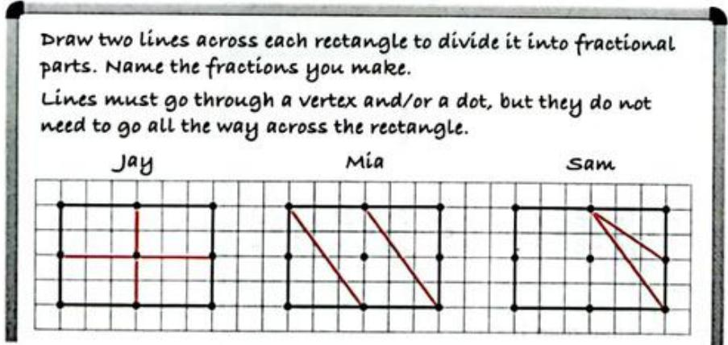

---

### INVESTIGATION CONTINUED (练习题)

**题目**: INVESTIGATION CONTINUED
2 The second part of the task had the same instructions but used this rectangle with more dots on the sides.

Work in pairs or small groups to investigate how many fractions you can make. Label your fractions.

---

## 5 Fractions, percentages and standard form > 5.2 Operations on fractions

### WORKED EXAMPLE 3 (例题)

**题目**: WORKED EXAMPLE 3
Calculate.

---

## 5 Fractions, percentages and standard form > 5.2 Operations on fractions > Exercise 5.2

### 1 (练习题)

**题目**: 1 a  $\frac{2}{3}\times \frac{5}{9}$

---

### 2 (练习题)

**题目**: b  $1\frac{1}{3}\times \frac{2}{7}$

---

### 3 (练习题)

**题目**: d  $\frac{4}{5}$  of  $3\frac{2}{7}$

---

### 4 (练习题)

**题目**: e 1 1/3 of 24

---

### 5 (练习题)

**题目**: f  $5\frac{1}{2}\times 7\frac{1}{4}$

---

### 6 (练习题)

**题目**: h 7 10

---

## 5 Fractions, percentages and standard form > 5.2 Operations on fractions > Exercise 5.3

### 1 (练习题)

**题目**: 1 a 1 3 + 1 3

---

### 2 (练习题)

**题目**: e  $\frac{1}{6} +\frac{1}{5}$

---

### 1 (练习题)

**题目**: b
2 5 3 8
5 3 8 8

---

### 1 (练习题)

**题目**: g 2-1

---

### 1 (练习题)

**题目**: d 5 8 9 9

---

### 1 (练习题)

**题目**: h 51-316

---

### 2 (练习题)

**题目**: 2 a 4- 3

---

### 2 (练习题)

**题目**: d 11-7

---

### 2 (练习题)

**题目**: 9 51-316+4

---

### 2 (练习题)

**题目**: j 3 2 4

---

### 2 (练习题)

**题目**: b  $6 + \frac{5}{11}$

---

### 2 (练习题)

**题目**: e 3-4

---

### 2 (练习题)

**题目**: h 1+2-1

---

### 2 (练习题)

**题目**: k 3 1-1+7 4
11+7

---

### 2 (练习题)

**题目**: f 5 3 16 4 8

---

### 2 (练习题)

**题目**: 3 14 7 3 8

---

### 2 (练习题)

**题目**: 1 2-3+4

---

### 1 (练习题)

**题目**: 1 You can convert any fraction to a decimal number using your calculator. For example, if you work out  $\frac{1}{2}$  as a decimal by dividing 1 by 2 you will get the decimal 0.5.
Try converting the following fractions to decimals:
2 5

---

### 2 (练习题)

**题目**: 2 Which fractions in question 1 stop ('terminate') after a few decimal places and which seem to go on forever? Try some more fractions and decide which of these two groups they fall into.

---

### 3 (练习题)

**题目**: 3 Look at the dominators of the fractions that with decimals that terminate. What do they have in common? [Hint: what are the factors of the denominator each time?]

---

### 4 (练习题)

**题目**: 4 Now work out the decimals for:
1

---

### 4 (练习题)

**题目**: Do the answers have anything in common?

---

### 4 (练习题)

**题目**: Try the same thing with denominator 11. What about 13?

---

### 4 (练习题)

**题目**: Explain any patterns that you see.

---

### WORKED EXAMPLE 5 (例题)

**题目**: WORKED EXAMPLE 5
Evaluate each of the following.
a 3 1 4 2
b 13 2 1 3 4 3 2 3
5 8 2
d  $\frac{6}{7} +3$

**解答**: a 3 3 2 1
$$
\begin{array}{l} = \frac {3}{2} \\ = 1 \frac {1}{2} \\ \end{array}
$$
Multiply by the reciprocal of  $\frac{1}{2}$ .
Use the rules you have learned about multiplying fractions.
b  $1\frac{3}{4} +2\frac{1}{3} = \frac{7}{4} +\frac{7}{3}$
$$
\begin{array}{l} = \frac {1}{4} \times \frac {3}{7} \\ = \frac {3}{4} \\ \end{array}
$$
Convert the mixed fractions to improper fractions.
Multiply by the reciprocal of  $\frac{7}{3}$ .

---

### 5 (例题)

**题目**: b 13 2 1 3 4 3 2 3

**解答**: b  $1\frac{3}{4} +2\frac{1}{3} = \frac{7}{4} +\frac{7}{3}$
$$
\begin{array}{l} = \frac {1}{4} \times \frac {3}{7} \\ = \frac {3}{4} \\ \end{array}
$$
Convert the mixed fractions to improper fractions.
Multiply by the reciprocal of  $\frac{7}{3}$ .

---

### 5 (例题)

**题目**: 5 8 2

**解答**: c  $\frac{5}{8} \div 2 = \frac{5}{8} \div \frac{2}{1}$
Write 2 as an improper fraction.
$$
= \frac {5}{8} \times \frac {1}{2}
$$

---

### 5 (例题)

**题目**: d  $\frac{6}{7} +3$

---

## 5 Fractions, percentages and standard form > 5.2 Operations on fractions > Exercise 5.4

### 1 (练习题)

**题目**: 1 1 1 3

---

### 2 (练习题)

**题目**: 2 2 3 7

---

### 3 (练习题)

**题目**: 4 7 9

---

### 4 (练习题)

**题目**: 4 10 11 5

---

### 5 (练习题)

**题目**: 5 41 1 7

---

### 6 (练习题)

**题目**: 6  $3\frac{1}{5}\div 5\frac{2}{3}$

---

### 7 (练习题)

**题目**: 7 7 5 1 12

---

### 8 (练习题)

**题目**: 8  $3\frac{1}{4}\div 3\frac{1}{2}$

---

### 9a (练习题)

**题目**: 9 a  $\left(2\frac{1}{3} -1\frac{2}{5}\right)\div 1\frac{1}{3}$

---

### 9b (练习题)

**题目**: b 2 1-1 2 1 3

---

## 5 Fractions, percentages and standard form > 5.2 Operations on fractions > Exercise 5.5

### 1 (练习题)

**题目**: 0.3 1 12

---

### 2 (练习题)

**题目**: 0.4 2 0.5

---

### 3 (练习题)

**题目**: 6 0.7

---

### 4 (练习题)

**题目**: 0.7 4 0.14

---

### 5 (练习题)

**题目**: 36 1.5

---

### 6 (练习题)

**题目**: 6  ${0.3} \times  \frac{5}{12}$

---

### 7 (练习题)

**题目**: 7  $0.4 \times \frac{1.5}{1.6}$

---

### 8 (练习题)

**题目**: 8  $\frac{2.8}{0.7} \times \frac{1.44}{0.6}$

---

## 5 Fractions, percentages and standard form > 5.2 Operations on fractions > Exercise 5.3

### WORKED EXAMPLE 5 CONTINUED (例题)

**题目**: WORKED EXAMPLE 5 CONTINUED
c  $\frac{5}{8} \div 2 = \frac{5}{8} \div \frac{2}{1}$
Write 2 as an improper fraction.
$$
= \frac {5}{8} \times \frac {1}{2}
$$
Multiply by the reciprocal of  $\frac{2}{1}$ .
$$
= \frac {5}{1 6}
$$
d 6 6 1 7 7 7
$$
= \frac {2}{7}
$$

---

## 5 Fractions, percentages and standard form > 5.2 Operations on fractions > Exercise 5.4

### WORKED EXAMPLE 6 (例题)

**题目**: WORKED EXAMPLE 6
Simplify each of the following fractions.
a 0.1 3
b  $\frac{1.3}{2.4}$
36 0.12

**解答**: a 0.1 0.1×10 3 3×10
$$
= \frac {1}{3 0}
$$
Multiply 0.1 by 10 to convert 0.1 to an integer.
Make sure the fraction is equivalent by also multiplying the denominator (3) by 10.

---

### WORKED EXAMPLE 6 CONTINUED (例题)

**题目**: WORKED EXAMPLE 6 CONTINUED
b  $\frac{1.3}{2.4} = \frac{1.3 \times 10}{2.4 \times 10}$
$$
= \frac {1 3}{2 4}
$$
Multiply both the numerator and denominator by 10 to get integers.
13 and 24 do not have a HCF other than 1, so you cannot simplify the fraction.
36 36×100 0.12 0.12×100
$$
\begin{array}{l} = \frac {3 6 0 0}{1 2} \\ = 3 0 0 \\ \end{array}
$$
Multiply 0.12 by 100 to produce an integer.
Remember to multiply the numerator by 100, so the fraction is equivalent.
Simplify the final fraction by cancelling.

---

## 5 Fractions, percentages and standard form > 5.2 Operations on fractions > Exercise 5.5

### WORKED EXAMPLE 7 (例题)

**题目**: WORKED EXAMPLE 7
Suppose that  $\frac{2}{5}$  of the students in a school wear glasses. If the school has 600 students, how many students wear glasses?

**解答**: Answer
$$
\begin{array}{l} \frac {2}{5} \text {o f} 6 0 0 = \frac {2}{5} \times 6 0 0 \\ = \frac {2}{1 8} \times \frac {6 0 0}{1} ^ {1 2 0} \\ = 2 \times 1 2 0 = 2 4 0 \text {s t d e n t s} \\ \end{array}
$$

---

### WORKED EXAMPLE 8 (例题)

**题目**: WORKED EXAMPLE 8
of the students in a school do not wear glasses. If 360 students do not wear glasses, how many students are there in the whole school?

**解答**: Answer
$\frac{2}{5}$  of the total is 360, so  $\frac{1}{5}$  of the total must be half of this, 180.
This means that the total  $\left(\frac{5}{5}\right)$  is  $5 \times 180 = 900$  students altogether.

---

## 5 Fractions, percentages and standard form > 5.2 Operations on fractions > Exercise 5.6

### 1 (练习题)

**题目**: [Table Row] <tr><td>1 3/4 of the people at an auction bought an item. If there are 120 people at the auction, how many bought something?</td></tr>

---

### 2 (练习题)

**题目**: [Table Row] <tr><td>2 An essay contains 420 sentences.80 of these sentences contain typing errors. What fraction of the sentences contain errors? Write the fraction in its simplest form.</td></tr>

---

### 3 (练习题)

**题目**: [Table Row] <tr><td>3 28 is 2/7 of which number?</td></tr>

---

### 4 (练习题)

**题目**: [Table Row] <tr><td>4 If 3/5 of the people in a theatre buy a snack during the interval, and of those who buy a snack 5/7 buy ice cream, what fraction of the people in the theatre buy ice cream?</td></tr>

---

### 5 (练习题)

**题目**: [Table Row] <tr><td>5 Asma, Bashir and Candice are trying to save money for a party. If Asma saves 1/4 of the total needed, Bashir saves 2/5 and Candice saves 1/10, what fraction of the cost of the party is left to pay?</td></tr>

---

### 6 (练习题)

**题目**: [Table Row] <tr><td>6 A chef needs 6 1/2 cups of cooked rice for a recipe of Nasi Goreng. If 2 cups of uncooked rice with 2 1/2 cups of water make 4 1/3 cups of cooked rice, how many cups of uncooked rice does the chef need? How much water should the chef add?</td></tr>

---

## 5 Fractions, percentages and standard form > 5.3 Percentages

### 9 (例题)

**题目**: WORKED EXAMPLE 9
Convert each of the following percentages to fractions in their simplest form.
a 25%
b 30%
c  $3.5\%$

**解答**: Answers
a  $25\% = \frac{25}{100} = \frac{1}{4}$
Write as a fraction with a denominator of 100, then simplify.
b  $30\% = \frac{30}{100} = \frac{3}{10}$
Write as a fraction with a denominator of 100, then simplify.
c  $3.5\% = \frac{3.5}{100} = \frac{35}{1000} = \frac{7}{200}$
Write as a fraction with a denominator of 100, then simplify.

---

### 10 (例题)

**题目**: Convert each of the following fractions into percentages.
a 1 20
1 8

**解答**: Answers
a  $\frac{1}{20} = \frac{1\times 5}{20\times 5}$
Find the equivalent fraction with a denominator of 100.
$$
\begin{array}{l} = \frac {5}{1 0 0} \\ = 5 \% \\ \end{array}
$$
b  $\frac{1}{8} = \frac{1\times 12.5}{8\times 12.5}$
Find the equivalent fraction with a denominator of 100.
$$
\begin{array}{l} = \frac {1 2 . 5}{1 0 0} \\ = 12.5\% \\ \end{array}
$$

---

### 11 (例题)

**题目**: Convert the following fractions into percentages:
3 a 40
8 15
25 4

**解答**: Answers
a  $\frac{3}{40} \times \frac{100}{1} = \frac{30}{4} = \frac{15}{2} = 7.5$ , so  $\frac{3}{40} = 7.5\%$
b  $\frac{8}{15} \times \frac{100}{1} = \frac{160}{3} = 53.3$  (1 d.p.), so  $\frac{8}{15} = 53.3\%$  (1 d.p.)
25 100 2500 625% 4 1 4

---

## 5 Fractions, percentages and standard form > 5.3 Percentages > Exercise 5.7

### 1 (练习题)

**题目**: 1 Convert each of the following percentages into fractions in their simplest form.

---

### a (练习题)

**题目**: a 70%

---

### b (练习题)

**题目**: b 75%

---

### c (练习题)

**题目**: c 20%

---

### d (练习题)

**题目**: d 36%

---

### e (练习题)

**题目**: e  $15\%$

---

### 1 (练习题)

**题目**: 1 Convert each of the following percentages into fractions in their simplest form.
a 70%
b 75%
c 20%
d 36%
e  $15\%$
2.5%
9
215%
13
i
117.5%
.4%
k
0.25%
$\therefore m = \frac{3}{11}$
0.002%

---

### 2 (练习题)

**题目**: 2 Express the following fractions as percentages.
$\frac{3}{5}$
b 7 25
17 20
d  $\frac{3}{10}$
e
8 200
f
50 12

---

### 12a (例题)

**题目**: a Express 16 as a percentage of 48.

**解答**: Answer
$$
\frac{16}{48}\times 100 = 33.3\% (1d.p.)
$$
First, write 16 as a fraction of 48, then multiply by 100.
$$
\frac {1 6}{4 8} = \frac {1}{3}
$$
If you are working without a calculator, you may find it easier to write the fraction in its simplest form first.
$$
\frac{1}{3}\times 100 = 33.3\% (1d.p.)
$$

---

### 12b (例题)

**题目**: b Express 15 as a percentage of 75.

**解答**: Answer
$$
\begin{array}{l} \frac {1 5}{7 5} \times 1 0 0 = \frac {1}{5} \times 1 0 0 \\ = 20\% \\ \end{array}
$$
Write 15 as a fraction of 75, then simplify and multiply by 100. You know that 100 divided by 5 is 20, so you don't need a calculator.

---

### 12c (例题)

**题目**: c Express 18 as a percentage of 23.

**解答**: Answer
To calculate  $\frac{18}{23} \times 100$  you can use your calculator. Enter:

---

### 12d (例题)

**题目**: d Express 24 grams as a percentage of 15.

**解答**: Answer
$$
\frac{24}{15}\times 100 = \frac{2400}{15} = 160\%
$$

---

## 5 Fractions, percentages and standard form > 5.3 Percentages > Exercise 5.8

### 1 (练习题)

**题目**: 1 Calculate:
a 5% of 300
b 20% of 60
c 75% of 180
d 120% of 300
e  $7.5\%$  of 1000
f 90% of 50kg
g 2.6% of 3 metres
h  $\frac{1}{2}\%$  of 55 litres.

---

### 2 (练习题)

**题目**: 2 Express:

---

## 5 Fractions, percentages and standard form > 5.3 Percentages > Exercise 5.7

### a (练习题)

**题目**: a Express 16 as a percentage of 48.
Answer
$$
\frac{16}{48}\times 100 = 33.3\% (1d.p.)
$$
First, write 16 as a fraction of 48, then multiply by 100.
$$
\frac {1 6}{4 8} = \frac {1}{3}
$$
If you are working without a calculator, you may find it easier to write the fraction in its simplest form first.
$$
\frac{1}{3}\times 100 = 33.3\% (1d.p.)
$$

---

### b (练习题)

**题目**: b Express 15 as a percentage of 75.
Answer
$$
\begin{array}{l} \frac {1 5}{7 5} \times 1 0 0 = \frac {1}{5} \times 1 0 0 \\ = 20\% \\ \end{array}
$$
Write 15 as a fraction of 75, then simplify and multiply by 100. You know that 100 divided by 5 is 20, so you don't need a calculator.

---

### c (练习题)

**题目**: c Express 18 as a percentage of 23.
Answer
To calculate  $\frac{18}{23} \times 100$  you can use your calculator. Enter:

---

### d (练习题)

**题目**: d Express 24 grams as a percentage of 15.
Answer
$$
\frac{24}{15}\times 100 = \frac{2400}{15} = 160\%
$$

---

## 5 Fractions, percentages and standard form > 5.3 Percentages > Exercise 5.8

### 1 (练习题)

**题目**: a 5% of 300

---

### 2 (练习题)

**题目**: b 20% of 60

---

### 3 (练习题)

**题目**: c 75% of 180

---

### 4 (练习题)

**题目**: d 120% of 300

---

### 5 (练习题)

**题目**: e  $7.5\%$  of 1000

---

### 6 (练习题)

**题目**: f 90% of 50kg

---

### 7 (练习题)

**题目**: g 2.6% of 3 metres

---

### 8 (练习题)

**题目**: h  $\frac{1}{2}\%$  of 55 litres.

---

### 2a (练习题)

**题目**: a 14 as a percentage of 35

---

### 2b (练习题)

**题目**: b 3.5 as a percentage of 14

---

### 2c (练习题)

**题目**: c 17 as a percentage of 63.

---

### 3 (练习题)

**题目**: 3 A factory that makes mobile phone batteries estimates that  $2.4\%$  of the batteries are not up to standard. If they produce 16 800 batteries, how many will be up to standard?

---

### 4 (练习题)

**题目**: 4 36 people live in a block of flats. 28 of these people jog around the park each morning. What percentage of the people living in the block of flats go jogging around the park?

---

### 5 (练习题)

**题目**: 5 Jaleel scores  $\frac{19}{24}$  in a test. What percentage of the marks did Jaleel get?

---

### 6 (练习题)

**题目**: 6 Express 1.3 as a percentage of 5.2.

---

### 7 (练习题)

**题目**: 7 Express 0.13 as a percentage of 520.

---

### 8 (练习题)

**题目**: One orange contains  $53.2\mathrm{mg}$  of Vitamin C. The daily recommended amount for adults is  $90\mathrm{mg}$  per day. Express the amount of Vitamin C in three oranges as a percentage of the daily recommended amount.

---

### WORKED EXAMPLE 13 (例题)

**题目**: WORKED EXAMPLE 13
The value of a house increased from  $120000 to$ 124800 between August and December. What percentage increase is this?

**解答**: Answer
$$
\$ 124800 - \$ 120000 = \$ 4800
$$
First calculate the increase.
$$
\% \text {increase} = \frac {\text {increase}}{\text {original}} \times 100 \%
$$
Write the increase as a fraction of the original and multiply by 100.
$$
= \frac{4800}{120000}\times 100\%
$$
Then do the calculation (either in your head or using a calculator).
$$
= 4 \%
$$

---

## 5 Fractions, percentages and standard form > 5.3 Percentages > Exercise 5.9

### 1 (练习题)

**题目**: 1 Over a five-year period, the population of the state of Louisiana in the United States of America decreased from 4468976 to 4287768. Find the percentage decrease in the population of Louisiana in this period.

---

### 2 (练习题)

**题目**: 2 Sunil streamed 38 series one year and 46 the next year. Find the percentage increase.

---

### 3 (练习题)

**题目**: 3 A theatre has 450 seats. After renovation it will have 480 seats. Find the percentage increase in the number of seats.

---

### 4 (练习题)

**题目**: 4 Sally works in an electrical component factory. On Monday she makes 363 components and on Tuesday she makes 432. Calculate the percentage increase.

---

### 5 (练习题)

**题目**: 5 Inter-Polation Airlines carried a total of 383402 passengers in one year and 287431 in the following year. Calculate the percentage decrease in passengers carried by the airline.

---

### 6 (练习题)

**题目**: 6 A liquid evaporates steadily. In one hour the mass of liquid in a container decreases from  $0.32\mathrm{kg}$  to  $0.18\mathrm{kg}$ . Calculate the percentage decrease.

---

### WORKED EXAMPLE 14 (例题)

**题目**: WORKED EXAMPLE 14
Increase 56 by: a 10%
b 15%
c 4%

**解答**: Answers
a 10% of 56 = 10/100 × 56
$$
\begin{array}{l} = \frac {1}{1 0} \times 5 6 = 5. 6 \\ 5 6 + 5. 6 = 6 1. 6 \\ \end{array}
$$
b  $1.15\times 56 = 64.4$
Calculate  $10\%$  of 56 to work out the size of the increase.
To increase the original by  $10\%$  add this to 56.
c  $1.04\times 56 = 58.24$
A  $15\%$  increase means  $115\%$  of the original.
$$
115\% = 1.15
$$
A  $4\%$  increase means  $104\%$  of the original.
$$
104 \% = 1.04
$$

---

### WORKED EXAMPLE 15 (例题)

**题目**: WORKED EXAMPLE 15
In a sale all items are reduced by  $15\%$ . If the normal price for a bicycle is $120, calculate the sale price.

**解答**: Answer
$$
100\% -15\% = 85\%
$$
Reducing a number by  $15\%$  leaves you with  $85\%$  of the original. So, find  $85\%$  of the original value.
$$
\frac {8 5}{1 0 0} \times \$ 1 2 0 = \$ 1 0 2
$$
85% is equivalent to  $\frac{85}{100} = 0.85$
Or use a multiplier:
$$
0. 8 5 \times \$ 1 2 0 = 1 0 2
$$
You can draw a bar model to help you with percentage calculations.

---

### WORKED EXAMPLE 16 (例题)

**题目**: WORKED EXAMPLE 16
A licence for anti-virus software normally costs $70.00. What would you pay for the software if you got 25% discount?

**解答**: Answer

Draw a bar model.

---

## 5 Fractions, percentages and standard form > 5.3 Percentages > Exercise 5.10

### 1 (练习题)

**题目**: 1 Increase 40 by:
a  $10\%$
b 15%
c 25%
d 5%
e 4%

---

### 2 (练习题)

**题目**: 2 Increase 53 by:
a 50%
b 84%
c  $13.6\%$
d 112%
1 2%

---

### 3 (练习题)

**题目**: 3 Decrease 124 by:
a 10%
b 15%
c  $30\%$
d 4%
e 7%

---

### 4 (练习题)

**题目**: 4 Decrease 36.2 by:
a 90%
b 35.4%
c  $0.3\%$
d 100%
1 2%

---

### 5 (练习题)

**题目**: 5 Shajeen usually works 30 hours per week. He increases his working hours by  $10\%$  to earn enough to save for a holiday. How many hours per week will Shajeen work now?

---

### 6 (练习题)

**题目**: 6 12% sales tax is added to clothing sold in a certain shop. If a T-shirt is advertised for $12 before tax, what will it cost after tax is added?

---

### 7 (练习题)

**题目**: 7 In its first year, 21300 people attended shows at the Oyler Theatre. The theatre decided to advertise more and this led to a  $23\%$  increase in its audience numbers for its second year. How many people attended shows in the second year?

---

### 8 (练习题)

**题目**: The village of Trigville had 153000 residents. A flood caused  $17\%$  of the residents to move away. What was the population of Trigville after the flood?

---

### 9 (练习题)

**题目**: 9 Anthea's screen time report said she spent 12 hours on screen during one week. The next week, this had reduced by  $12\%$ . How much time did she spend on screen in the second week? Give your answer in hours and minutes to the nearest minute.

---

### 10 (练习题)

**题目**: 10 A population of bacteria is increasing at a rate of  $15\%$  per hour. What is the percentage increase after 4 hours? Give your answer correct to 2 decimal places.

---

### 11 (练习题)

**题目**: 11 Due to surplus production, oil prices decrease by  $12\%$  in January and then by a further  $12\%$  in February. A newsreader reports that the price of oil has decreased by  $24\%$ . Is that correct? Justify your answer.

---

### 12 (练习题)

**题目**: 12 The number of passengers using a new ride-share service is increasing by  $x\%$  each year and is expected to double in 5 years. What is the value of  $x$  correct to 1 decimal place?

---

### 13 (练习题)

**题目**: 13 Discuss these questions about percentage increases and decreases in small groups. Be prepared to explain your answers to the class.
a Two students start with the same number of points. Student A's points increase by  $10\%$  each day. Student B's points decrease by  $10\%$  each day. Will the original number of points have doubled and halved on the same day? Justify your answer.
b Which results in more points: doubling the original number or a  $40\%$  increase followed by a  $50\%$  increase? Why?
c Which of these offers gives cheaper data when you are buying airtime?
50% discount from the price of data
- 50% extra data free

---

### WORKED EXAMPLE 17 (例题)

**题目**: WORKED EXAMPLE 17
A store is holding a sale in which every item is reduced by  $10\%$ . A jacket in this sale is sold for $108.
Calculate the original price of the jacket.

**解答**: Answer
\(\frac{90}{100} \times x = 108\) The new cost is \(90\%\) of the original.  
\(x = \frac{100}{90} \times 108\) To solve for \(x\), multiply both sides of the equation by Original price \(= \\)120\) the reciprocal of \(\frac{90}{100}\).
It is important to remember that undoing a  $10\%$  decrease is not the same as increasing the reduced value by  $10\%$ . If you increase the sale price of  $108$  by  $10\%$  you will get  $\frac{110}{100} \times \$108 = \$118.80$ , which is a different (and incorrect) answer.

---

### 13a (练习题)

**题目**: a Two students start with the same number of points. Student A's points increase by  $10\%$  each day. Student B's points decrease by  $10\%$  each day. Will the original number of points have doubled and halved on the same day? Justify your answer.

---

### 13b (练习题)

**题目**: b Which results in more points: doubling the original number or a  $40\%$  increase followed by a  $50\%$  increase? Why?

---

### WORKED EXAMPLE 18 (例题)

**题目**: WORKED EXAMPLE 18
A shop advertises a laptop for sale for \(320 during a \(20 \%\)off sale. What was the original price of the laptop?

**解答**: Answer

Draw a bar model.
20% has been taken off, so $320 is 80% of the original cost.
$$
1 \% = \frac {\mathbb {S} 320}{80} = \mathbb {S} 4
$$
$$
100 \% = \$ 4 \times 100 = \$ 400
$$
Divide $320 by 80 to find 1%
Multiply $4 by 100 to find 100%

---

## 5 Fractions, percentages and standard form > 5.3 Percentages > Exercise 5.11

### 1 (练习题)

**题目**: 1 If  $20\%$  of an amount is 35, what is  $100\%$

---

### 2 (练习题)

**题目**: 2 If  $35\%$  of an amount is 127, what is  $100\%$ ?

---

### 3 (练习题)

**题目**: 3 245 is  $12.5\%$  of an amount. What is the total amount?

---

### 4 (练习题)

**题目**: 4 The table gives the sale price and the per cent by which the price was reduced for a number of items. Copy the table and complete it by calculating the original prices.
[Table Row] <tr><td>Sale price ($)</td><td>% reduction</td><td>Original price ($)</td></tr>
[Table Row] <tr><td>52.00</td><td>10</td><td></td></tr>
[Table Row] <tr><td>185.00</td><td>10</td><td></td></tr>
[Table Row] <tr><td>4700.00</td><td>5</td><td></td></tr>
[Table Row] <tr><td>2.90</td><td>5</td><td></td></tr>
[Table Row] <tr><td>24.50</td><td>12</td><td></td></tr>
[Table Row] <tr><td>10.00</td><td>8</td><td></td></tr>
[Table Row] <tr><td>12.50</td><td>7</td><td></td></tr>
[Table Row] <tr><td>9.75</td><td>15</td><td></td></tr>
[Table Row] <tr><td>199.50</td><td>20</td><td></td></tr>
[Table Row] <tr><td>99.00</td><td>25</td><td></td></tr>

---

### 5 (练习题)

**题目**: 5 A shop keeper increases the cost price of items by  $22\%$  before selling them. The selling price (after the increase) of ten items are given below. For each item, work out the cost price.
a $25.00
b $200.00
c $14.50
d $23.99
e $15.80
f $45.80
g $29.75
h $129.20
i $0.99
j $0.80

---

### 6 (练习题)

**题目**: 6 Seven students were absent from a class on Monday. This is  $17.5\%$  of the class.
a How many students are there in the class in total?
b How many students were present on Monday?

---

### 7 (练习题)

**题目**: 7 A hat shop is holding a  $10\%$  sale. If Jay buys a hat for $18 in the sale, how much did the hat cost before the sale?

---

### 8 (练习题)

**题目**: 8 While Suresh is training for a race, he reduces his weight by  $5\%$  over a 3-month period. If Suresh weighs  $76\mathrm{kg}$  at the end of three months, how much did he weigh before he started training?

---

### 9 (练习题)

**题目**: The water in a pond evaporates at a rate of  $12\%$  per week. If the pond now contains 185 litres of water, approximately how much water was in the pond a week ago?

---

## 5 Fractions, percentages and standard form > 5.4 Standard form

### WORKED EXAMPLE 19 (例题)

**题目**: WORKED EXAMPLE 19
Write 320000 in standard form.

**解答**: Answer
3.2

Write the number with the decimal point after the first non-zero digit to get a number between 1 and 10.
Work out how many places the first digit needs to move to get back to its original place. In this case, the 3 needs to move five places to the left to get back to its original hundred thousands position.
$320000 = 3.2 \times 10^{5}$
Work out the index (power of 10). In this case, the original number is bigger than 3.2 so the index will be positive.
In other words, to move the digit 3 back to its original position you would need to multiply by 105.

---

### 20 (例题)

**题目**: WORKED EXAMPLE 20
1 Write each of the following numbers in standard form.
a 0.004
b 0.00000034

**解答**: Answers
a

0.004
4.0
$= 4\times 10^{-3}$
Start with a number between 1 and 10, in this case 4.
Compare the position of the first digit: '4' needs to move three places to the right to get from the new number to the original number. In Worked example 19 you saw that moving five places to the left meant multiplying by  $10^{5}$ , so moving three places to the right means multiply by  $10^{-3}$ .
Notice also that the first non-zero digit in 0.004 is in the 3rd place after the decimal point and that the power of 10 is -3.
b
0.00000034=3.4÷107
$= 3.4\times 10^{-7}$

0000000034=3.4×10-7
The first non-zero digit in 0.00000034 is in the 7th place after the decimal point so the power of 10 is -7.

---

## 5 Fractions, percentages and standard form > 5.4 Standard form > Exercise 5.12

### 1 (练习题)

**题目**: Exercise 5.12

1 Write each of the following numbers in standard form.
a 380

---

### 2 (练习题)

**题目**: b 4200000

---

### 3 (练习题)

**题目**: c 4560000000

---

### 4 (练习题)

**题目**: d 65400000000000

---

### 7 (练习题)

**题目**: g 10.3

---

### 9 (练习题)

**题目**: i 0.004

---

### 10 (练习题)

**题目**: 0.00005

---

### 11 (练习题)

**题目**: 0.000032

---

### 12 (练习题)

**题目**: 0.0000000564

---

### 2 (练习题)

**题目**: 
2 Write each of the following as an ordinary number.
a  $2.4 \times 10^{6}$

---

### 3 (练习题)

**题目**: b  $3.1\times 10^{8}$

---

### 4 (练习题)

**题目**: 1.05×107

---

### 5 (练习题)

**题目**: d  $9.9 \times 10^{3}$

---

### 6 (练习题)

**题目**: e  $7.1\times 10^{1}$

---

### 7 (练习题)

**题目**: f  $3.6\times 10^{-4}$

---

### 8 (练习题)

**题目**: g  $1.6\times 10^{-8}$

---

### 9 (练习题)

**题目**: 2.03×10-7

---

### 10 (练习题)

**题目**: i  $8.8\times 10^{-3}$

---

### 3 (练习题)

**题目**: APPLY YOUR SKILLS
3 A grain of rice has a mass of  $25\mathrm{mg}$
a Convert this to kilograms.
b Write the mass in kilograms using scientific notation.

---

### 4 (练习题)

**题目**: 4 The closest star to our Sun is Proxima Centauri at a distance of 40208000000000 km. Express this in scientific notation.

---

### 5 (练习题)

**题目**: 5 A stack of 500 sheets of paper is  $42\mathrm{mm}$  thick. Express the thickness of one sheet of paper using scientific notation.

---

### 1 (练习题)

**题目**: INVESTIGATION
Standard form on a calculator
1 How does your calculator deal with standard form?
a Find the  $\times 10^{\circ}$  button or the Exp or EE button on your calculator. These are known as the exponent keys.
b Enter these calculations. Check that you get the correct answers.
i 2.134 × 104 ii 3:124 × 10-6

---

### 2 (练习题)

**题目**: Answers: i 21340 ii 0.000003124
c Did you have to enter  $\times 10?$  Why?
2 Here are ten calculator displays giving answers in standard form in different ways.

---

## 5 Fractions, percentages and standard form > 5.4 Standard form > Exercise 5.13

### 1 (练习题)

**题目**: 1 Enter each of these numbers into your calculator using the correct function key and write down what appears on your calculator display.
a  $4.2\times 10^{12}$  b  $1.8\times 10^{-5}$  c  $2.7\times 10^{6}$
d  $1.34 \times 10^{-2}$  e  $1.87 \times 10^{-9}$  f  $4.23 \times 10^{7}$
g  $3.102 \times 10^{-4}$  h  $3.098 \times 10^{9}$  i  $2.076 \times 10^{-23}$

---

### 2 (练习题)

**题目**: 2 Use your calculator. Give the answers in standard form correct to 5 significant figures.
a 42345 b 0.0008 + 92003 c (1.009)5
d 123000000 + 0.00076 e (97 × 876)4 f · (0.0098)4 × (0.0032)3
8543×9210 9754 g 0.000034 (0.0005)4

---

### 3 (练习题)

**题目**: 3 Use your calculator to find the answers correct to 4 significant figures.
a  $9.27\times (2.8\times 10^{5})$  b  $(4.23\times 10^{-2})^3$  c  $(3.2\times 10^{7}) + (7.2\times 10^{9})$
d  $(3.2\times 10^{-4})^2$  231x(1.5x10-6) f  $(4.3\times 10^{5}) + (2.3\times 10^{7})$
g  $\sqrt{3.24 \times 10^{7}}$  h  $\sqrt[3]{4.2 \times 10^{-8}}$  i  $\sqrt[3]{1.126 \times 10^{-9}}$

---

### 4 (练习题)

**题目**: 4 A hardware designer is trying to work out whether a small cuboid shaped chip will fit into the available space in a new smartwatch. The chip has a volume of  $7.927 \times 10^{-17}$  m. The space available is also a cuboid 0.000000327 m long. 0.0000002 m wide and 0.000116 m high. Will the chip fit into this space? Show your working.

---

### 5 (练习题)

**题目**: 5 Data storage (in computers) is measured in gigabytes. One gigabyte is  $2^{30}$  bytes.
a Write  $2^{30}$  in standard form correct to 3 significant figures.
b There are 1024 gigabytes in a terabyte. How many bytes is this? Give your answer in standard form correct to 1 significant figure.

---

### 21 (例题)

**题目**: WORKED EXAMPLE 21
Write each of the following in standard form.
a  $(3\times 10^{5})\times (2\times 10^{6})$
b  $(2\times 10^{3})\times (8\times 10^{7})$
c  $(2.8\times 10^{6})\div (1.4\times 10^{4})$

**解答**: Answers
a  $(3\times 10^{5})\times (2\times 10^{6}) = (3\times 2)\times (10^{5}\times 10^{6})$
$$
= 6 \times 1 0 ^ {5 + 6}
$$
$$
= 6 \times 1 0 ^ {1 1}
$$
Rearrange the calculation.
Use the laws of indices where appropriate.
Write the number in standard form.
You may be asked to convert your answer to an ordinary number.
To convert  $6 \times 1011$  into an ordinary number, the  $6'$  needs to move 11 places to the left:
$$
6. 0 \times 1 0 ^ {1 1}
$$
$$
= 6 0 0 0 0 0 0 0 0 0 0 0 0 0 0 0
$$
b  $(2\times 10^{3})\times (8\times 10^{7}) = (2\times 8)\times (10^{3}\times 10^{7})$
$$
= 1 6 \times 1 0 ^ {1 0}
$$
$$
\begin{array}{l} 1 6 \times 1 0 ^ {1 0} = 1. 6 \times 1 0 \times 1 0 ^ {1 0} \\ = 1. 6 \times 1 0 ^ {1 1} \\ \end{array}
$$
The answer  $16 \times 10^{10}$  is numerically correct but it is not in standard form because 16 is not between 1 and 10.
You can change it to standard form by thinking of 16 as  $1.6 \times 10$ .
c  $(2.8\times 10^{6})\div (1.4\times 10^{4}) = \frac{2.8\times 10^{6}}{1.4\times 10^{4}}$
$$
\begin{array}{l} = \frac {2 . 8}{1 . 4} \times \frac {1 0 ^ {6}}{1 0 ^ {4}} \\ = 2 \times 1 0 ^ {6 - 4} \\ = 2 \times 1 0 ^ {2} \\ \end{array}
$$
Subtract the indices to divide the powers.

---

### 22 (例题)

**题目**: WORKED EXAMPLE 22
Write each of the following in standard form.
a  $(9\times 10^{6}) + (3\times 10^{8})$
b  $(5\times 10^{-3}) - (1.5\times 10^{-4})$

**解答**: Answers
a  $(9\times 10^{6}) + (3\times 10^{8}) = 9\times 10^{6} + 3\times 10^{6}\times 10^{2}$ $3\times 10^{8}$  is equivalent to  $3\times 10^{6}\times 10^{2}$
$$
\begin{array}{l} = 1 0 ^ {6} (9 + 3 \times 1 0 ^ {2}) \\ = 1 0 ^ {6} (9 + 3 0 0) \\ = 1 0 ^ {6} (3 0 9) \\ = 3. 0 9 \times 1 0 ^ {8} \\ \end{array}
$$
b  $(5\times 10^{-3}) - (1.5\times 10^{-4}) = 50\times 10^{-4} - 1.5\times 10^{-4}$ $5\times 10^{-3}$  is equivalent to  $50\times 10^{-4}$
$$
\begin{array}{l} = 1 0 ^ {- 4} (5 0 - 1. 5) \\ = 1 0 ^ {- 4} (4 8. 5) \\ = 4. 8 5 \times 1 0 ^ {- 3} \\ \end{array}
$$

---

## 5 Fractions, percentages and standard form > 5.4 Standard form > Exercise 5.14

### 1 (练习题)

**题目**: 1 Write each of the following in standard form.
a  $(2\times 10^{13})\times (4\times 10^{17})$

---

### 2 (练习题)

**题目**: b  $(1.4\times 10^{8})\times (3\times 10^{4})$

---

### 3 (练习题)

**题目**: c  $(1.5\times 10^{13})^2$

---

### 4 (练习题)

**题目**: d  $(12\times 10^{5})\times (11\times 10^{2})$

---

### 5 (练习题)

**题目**: e  $(0.2\times 10^{17})\times (0.7\times 10^{16})$

---

### 6 (练习题)

**题目**: f  $(9\times 10^{17})\div (3\times 10^{16})$

---

### 7 (练习题)

**题目**: g  $(8\times 10^{17})\div (4\times 10^{16})$

---

### 8 (练习题)

**题目**: h  $(1.5\times 10^{8})\div (5\times 10^{4})$

---

### 9 (练习题)

**题目**: i  $(2.4\times 10^{64})\div (8\times 10^{21})$

---

### 10 (练习题)

**题目**: j  $(1.44\times 10^{7})\div (1.2\times 10^{4})$

---

### 11 (练习题)

**题目**: (1.7×108) k (3.4×105)

---

### 12 (练习题)

**题目**: (4.9×105)×(3.6×109)

---

### 2 (练习题)

**题目**: 2 Write each of the following in standard form.
a  $(3\times 10^{4}) + (4\times 10^{3})$

---

### 3 (练习题)

**题目**: b  $(4\times 10^{6}) - (3\times 10^{5})$

---

### 4 (练习题)

**题目**: c  $(2.7\times 10^{3}) + (5.6\times 10^{5})$

---

### 5 (练习题)

**题目**: d  $(7.1\times 10^{9}) - (4.3\times 10^{7})$

---

### 6 (练习题)

**题目**: e  $(5.8\times 10^{9}) - (2.7\times 10^{3})$

---

### 3 (练习题)

**题目**: 3 Write each of the following in standard form.
a  $(2\times 10^{-4})\times (4\times 10^{-6})$

---

### 4 (练习题)

**题目**: b  $(1.6\times 10^{-8})\times (4\times 10^{-4})$

---

### 5 (练习题)

**题目**: (1.5×10-6)×(2.1×10-3)

---

### 6 (练习题)

**题目**: d  $(11\times 10^{-5})\times (3\times 10^{2})$

---

### 7 (练习题)

**题目**: e  $(9\times 10^{17})\div (4.5\times 10^{-16})$

---

### 8 (练习题)

**题目**: f  $(7\times 10^{-21})\div (1\times 10^{16})$

---

### 9 (练习题)

**题目**: g  $(4.5\times 10^{8})\div (0.9\times 10^{-4})$

---

### 10 (练习题)

**题目**: h  $(11\times 10^{-5})\times (3\times 10^{2})\div (2\times 10^{-3})$

---

### 4 (练习题)

**题目**: 4 Write each of the following in standard form.
a  $(3.1\times 10^{-4}) + (2.7\times 10^{-2})$

---

### 5 (练习题)

**题目**: b  $(3.2\times 10^{-1}) - (3.2\times 10^{-2})$

---

### 6 (练习题)

**题目**: c  $(7.01\times 10^{3}) + (5.6\times 10^{-1})$

---

### 7 (练习题)

**题目**: d  $(1.44\times 10^{-5}) - (2.33\times 10^{-6})$

---

### 5 (练习题)

**题目**: 5 Find the number of seconds in a day, giving your answer in standard form.

---

### 6 (练习题)

**题目**: 6 The speed of light is approximately  $3 \times 10^{8}$  metres per second. How far will light travel in:
a 10 seconds?

---

### 7 (练习题)

**题目**: b 20 seconds?

---

### 8 (练习题)

**题目**: c 102 seconds?

---

### 1 (练习题)

**题目**: 
1 Calculate  $\frac{5}{6}\left(\frac{1}{4} +\frac{1}{8}\right)$  giving your answer as a fraction in its lowest terms. [4]

---

### 2 (练习题)

**题目**: 2 93800 students took an examination.
$19\%$  received grade A.
$24\%$  received grade B.
$31\%$  received grade C.
$10\%$  received grade D.
11% received grade E.
The rest received grade U.
a Calculate the percentage of the students who received grade U. [2]

---

### 3 (练习题)

**题目**: b Calculate the fraction of students who received a grade B? Give your answer in its lowest terms. [2]
c Work out how many students received grade A. [2]

---

### 4 (练习题)

**题目**: 3 During one summer there were 27 500 cases of Salmonella poisoning in Britain.
The next summer there was an increase of  $9\%$  in the number of cases.
Calculate how many cases there were in the second year. [3]

---

### 5 (练习题)

**题目**: 4 Abdul's height was  $160\mathrm{cm}$  on his 15th birthday. It was  $172\mathrm{cm}$  on his 16th
birthday. What was the percentage increase in his height? [3]

---

### 6 (练习题)

**题目**: 5 Timur's salary increases by  $10\%$  after one year and then another  $20\%$  after the
next year. Timur explains that his salary will have increased by a total of  $30\%$  over the two years. Explain why Timur is incorrect and work out his actual
salary increase over that time. [3]

---

### 7 (练习题)

**题目**: 6  $n = \frac{ab}{a + b}$
If  $a = 3 \times 10^8$  and  $b = 2 \times 10^7$ , determine the value of  $n$ . Give your answer in
standard form correct to 3 significant figures. [3]

---

### 7 (练习题)

**题目**: 7 A light year is the distance light travels in a year. The speed of light is  $3.0 \times 10^{5}$
kilometres per second.
a Calculate, to the nearest kilometre, the number of kilometres in one light year.
[3]
b Proxima Centauri is  $4.0 \times 10^{13}$  kilometres from our Sun. Work out how many light years there are in  $4.0 \times 10^{13}$  kilometres. Give your answer to 3 significant figures.
[2]

---

### 9 (练习题)

**题目**: b Proxima Centauri is  $4.0 \times 10^{13}$  kilometres from our Sun. Work out how many light years there are in  $4.0 \times 10^{13}$  kilometres. Give your answer to 3 significant figures.
[2]
There are approximately 0.625 miles in a kilometre. Calculate the speed of light in miles per second, giving your answer in standard form, to
3 significant figures. [2]

---

### 8 (练习题)

**题目**: There are approximately 0.625 miles in a kilometre. Calculate the speed of light in miles per second, giving your answer in standard form, to
3 significant figures. [2]
8 Between January 2020 and January 2021, Mongolia's population increased by  $1.6\%$  to 3.352 million.
Calculate Mongolia's population in 2020, giving your answer to
the nearest 1000. [3]

---

### 11 (练习题)

**题目**: $x = a\times 10^{m},y = b\times 10^{n}$  and  $100 <   ab <   1000$
Find  $xy$  in standard form. [3]

---

### 10 (练习题)

**题目**: 10 The value of a car decreases by  $12\%$  per year. A car is two years old and its value is now $3875.
a What was the car's value when it was one year old? [2]
b What was the original price of the car? [2]
If the value of a car decreases by x% per year and the original value of the car is $V, find a formula (in terms of x, V and n) for the value of the car after n years. [3]

---

### 13 (练习题)

**题目**: If the value of a car decreases by x% per year and the original value of the car is $V, find a formula (in terms of x, V and n) for the value of the car after n years. [3]

---

### 14 (练习题)

**题目**: 11 The value of a painting increases by 2% per year. The painting was bought on 1 January 2021 for $1800. During which year will the painting first be worth more than $2500? [3]

---

## 6 Equations, factors and formulae > 6.1 Solving equations

### WORKED EXAMPLE 1 (例题)

**题目**: WORKED EXAMPLE 1
An equation with  $x$  on both sides and all  $x$  terms with the same sign:
a Solve the equation  $5x - 2 = 3x + 6$
Answer
$$
5 x - 2 = 3 x + 6
$$
$$
5 x - 2 - 3 x = 3 x + 6 - 3 x
$$
$$
2 x - 2 = 6
$$
$$
2 x - 2 + 2 = 6 + 2
$$
$$
2 x = 8
$$
$$
\frac {2 x}{2} = \frac {8}{2}
$$
$$
x = 4
$$

**解答**: Subtract  $3x$  from both sides.
Add 2 to both sides.
Divide both sides by 2.
An equation with  $x$  on both sides and  $x$  terms with different signs:
b Solve the equation  $5x + 12 = 20 - 11x$
Answer
$$
5 x + 1 2 = 2 0 - 1 1 x
$$
$$
5 x + 1 2 + 1 1 x = 2 0 - 1 1 x + 1 1 x
$$
$$
1 6 x + 1 2 = 2 0
$$
$$
1 6 x + 1 2 - 1 2 = 2 0 - 1 2
$$
$$
1 6 x = 8
$$
$$
\frac {1 6 x}{1 6} = \frac {8}{1 6}
$$

---

### 1a (例题)

**题目**: a Solve the equation  $5x - 2 = 3x + 6$

**解答**: $$
5 x - 2 = 3 x + 6
$$
$$
5 x - 2 - 3 x = 3 x + 6 - 3 x
$$
$$
2 x - 2 = 6
$$
$$
2 x - 2 + 2 = 6 + 2
$$
$$
2 x = 8
$$
$$
\frac {2 x}{2} = \frac {8}{2}
$$
$$
x = 4
$$
Subtract  $3x$  from both sides.
Add 2 to both sides.
Divide both sides by 2.

---

### 1b (例题)

**题目**: b Solve the equation  $5x + 12 = 20 - 11x$

**解答**: $$
5 x + 1 2 = 2 0 - 1 1 x
$$
$$
5 x + 1 2 + 1 1 x = 2 0 - 1 1 x + 1 1 x
$$
$$
1 6 x + 1 2 = 2 0
$$
$$
1 6 x + 1 2 - 1 2 = 2 0 - 1 2
$$
$$
1 6 x = 8
$$
$$
\frac {1 6 x}{1 6} = \frac {8}{1 6}
$$
$$
x = \frac {1}{2}
$$
This time add  $11x$  to both sides, so you have a positive number of  $x$ 's
Subtract 12 from both sides.
Divide both sides by 16.

---

### 1c (例题)

**题目**: c Solve the equation  $2(y - 4) + 4(y + 2) = 30$

**解答**: $$
2 y - 8 + 4 y + 8 = 3 0
$$
$$
6 y = 3 0
$$
$$
\frac {6 y}{6} = \frac {3 0}{6}
$$
$$
y = 5
$$
Expand the brackets.
Collect like terms.
Divide both sides by 6.

---

### 1d (例题)

**题目**: d Solve the equation  $\frac{6}{7} p = 10$

**解答**: $$
\frac {6}{7} p \times 7 = 1 0 \times 7
$$
$$
6 p = 7 0
$$
$$
\frac {6 p}{6} = \frac {7 0}{6}
$$
$$
p = \frac {3 5}{3}
$$
Multiply both sides by 7.
Divide both sides by 6.
Write the fraction in its simplest form.

---

### 1e (例题)

**题目**: e Solve the equation  $\frac{2}{3} + \frac{1}{3x} = \frac{4 - x}{6x}$

**解答**: $$
6 x \left(\frac {2}{3} + \frac {1}{3 x}\right) = 6 x \left(\frac {4 - x}{6 x}\right)
$$
$$
4 x + 2 = 4 - x
$$
$$
4 x + x = 4 - 2
$$
$$
5 x = 2
$$
$$
x = \frac {2}{5}
$$
The lowest common denominator is  $6x$ , so multiply both sides by  $6x$ .
Collect  $x$  terms on one side and numbers on the other.
Divide both sides by 5.
Leave your answer as a fraction.

---

### 2a (例题)

**题目**: a  $3^{3x + 1} = 81$

**解答**: a  $3^{3x + 1} = 81$
Notice that 81 is the 4th power of 3.
$$
3 ^ {3 x + 1} = 3 ^ {4}
$$
$$
3 x + 1 = 4
$$
The powers must be the same.
$$
3 x = 3
$$
Subtract 1 from both sides.
$$
x = 1
$$
Divide both sides by 3.

---

### 2b (例题)

**题目**: b  $32^{\times} = 2$

**解答**: b (25)×=21
Write both terms as powers of 2.
$$
2 ^ {5 x} = 2 ^ {1}
$$
Remove the brackets using the index laws.
$$
5 x = 1
$$
Equate the indices.
$$
x = \frac {1}{5}
$$
Solve for  $x$ .

---

### 2c (例题)

**题目**: c  $3^{x + 1} = 9^{x}$

**解答**: c  $3^{x + 1} = (3^{2})^{x}$
Write both terms with the same base (as powers of 3).
$$
3 ^ {x + 1} = 3 ^ {2 x}
$$

---

## 6 Equations, factors and formulae > 6.1 Solving equations > Exercise 6.1

### 1 (练习题)

**题目**: 1 Solve the following equations.
a  $4x + 3 = 31$

---

### 2 (练习题)

**题目**: 1 Solve the following equations.
b  $8x + 42 = 2$

---

### 3 (练习题)

**题目**: 1 Solve the following equations.
c  $6x - 1 = 53$

---

### 4 (练习题)

**题目**: 1 Solve the following equations.
d  $7x - 4 = -66$

---

### 5 (练习题)

**题目**: 1 Solve the following equations.
${9y} + 7 = {52}$

---

### 6 (练习题)

**题目**: 1 Solve the following equations.
f  $11n - 19 = 102$

---

### 7 (练习题)

**题目**: 1 Solve the following equations.
g  $12q - 7 = 14$

---

### 8 (练习题)

**题目**: 1 Solve the following equations.
h  $206t + 3 = 106$

---

### 2 (练习题)

**题目**: 2 Solve the following equations.
a  ${12x} + 1 = {7x} + {11}$

---

### 3 (练习题)

**题目**: 2 Solve the following equations.
b  ${6x} + 1 = {7x} + {11}$

---

### 4 (练习题)

**题目**: 2 Solve the following equations.
$6y + 1 = 3y - 8$

---

### 5 (练习题)

**题目**: 2 Solve the following equations.
d  $11x + 1 = 12 - 4x$

---

### 6 (练习题)

**题目**: 2 Solve the following equations.
e  $8 - 8p = 9 - 9p$

---

### 7 (练习题)

**题目**: 2 Solve the following equations.
f  $\frac{1}{2} x - 7 = \frac{1}{4} x + 8$

---

### 3 (练习题)

**题目**: 3 Solve the following equations.
a  $4(x + 1) = 12$

---

### 4 (练习题)

**题目**: 3 Solve the following equations.
b  $2(2p + 1) = 14$

---

### 5 (练习题)

**题目**: 3 Solve the following equations.
c  $8(3t + 2) = 40$

---

### 6 (练习题)

**题目**: 3 Solve the following equations.
d  $5(m - 2) = 15$

---

### 7 (练习题)

**题目**: 3 Solve the following equations.
e  $-5(n - 6) = -20$

---

### 8 (练习题)

**题目**: 3 Solve the following equations.
f  $- 2\left( {x + 2}\right)  = {4x} + 9$

---

### 4 (练习题)

**题目**: 4 Solve for  $x$ .
a  $7(x + 2) = 4(x + 5)$

---

### 5 (练习题)

**题目**: 4 Solve for  $x$ .
b  $4\left( {x - 2}\right)  + 2\left( {x + 5}\right)  = {14}$

---

### 6 (练习题)

**题目**: 4 Solve for  $x$ .
$7x - (3x + 11) = 6 - (5 - 3x)$

---

### 7 (练习题)

**题目**: 4 Solve for  $x$ .
d  $3(x + 1) = 2(x + 1) + 2x$

---

### 8 (练习题)

**题目**: 4 Solve for  $x$ .
e  $4 + 2(2 - x) = 3 - 2(5 - x)$

---

### 9 (练习题)

**题目**: 4 Solve for  $x$ .
f  $2(p - 1) + 7(3p + 2) = 7(p - 4)$

---

### 10 (练习题)

**题目**: 4 Solve for  $x$ .
g  $2(p - 1) - 7(3p - 2) = 7(p - 4)$

---

### 11 (练习题)

**题目**: 4 Solve for  $x$ .
h  $3(2x + 5) - (3x + 2) = 10$

---

### 12 (练习题)

**题目**: 4 Solve for  $x$ .
5 Solve for  $x$ .

---

### 13 (练习题)

**题目**: 4 Solve for  $x$ .
2x+1 3 8

---

### 14 (练习题)

**题目**: 4 Solve for  $x$ .
b  $\frac{2x}{3} +1 = 8$

---

### 15 (练习题)

**题目**: 4 Solve for  $x$ .
3 5x+11=21

---

### 16 (练习题)

**题目**: 4 Solve for  $x$ .
d  $\frac{x + 3}{2} = x$

---

### 17 (练习题)

**题目**: 4 Solve for  $x$ .
$2x - 1 = 3x$

---

### 18 (练习题)

**题目**: 4 Solve for  $x$ .
$\frac{3x}{2} + 5 = {2x}$

---

### 6 (练习题)

**题目**: 6 Solve the following equations.
$\frac{3}{x} - 2 = \frac{1}{2} - \frac{9}{2x}$

---

### 7 (练习题)

**题目**: 6 Solve the following equations.
b  $\frac{2}{x} +\frac{3}{2x} = 7$

---

### 8 (练习题)

**题目**: 6 Solve the following equations.
5+8 2(x+4) x

---

### 9 (练习题)

**题目**: 6 Solve the following equations.
d  $\frac{x - 1}{3x} -\frac{1}{9} = \frac{x - 3}{9x}$

---

### 10 (练习题)

**题目**: 6 Solve the following equations.
4 4 1 3x 5 5x

---

### 11 (练习题)

**题目**: 6 Solve the following equations.
$\frac{4}{x + 1} = \frac{5}{x - 2}$

---

### 7 (练习题)

**题目**: 7 Solve the following equations for  $x$ .
a  $3^{3x} = 27$

---

### 8 (练习题)

**题目**: 7 Solve the following equations for  $x$ .
b  $2^{3x + 4} = 32$

---

### 9 (练习题)

**题目**: 7 Solve the following equations for  $x$ .
c·8.14x+3=1

---

### 10 (练习题)

**题目**: 7 Solve the following equations for  $x$ .
d 5²(3x+1)=625

---

### 11 (练习题)

**题目**: 7 Solve the following equations for  $x$ .
e  $4^{3x} = 2^{x + 1}$

---

### 12 (练习题)

**题目**: 7 Solve the following equations for  $x$ .
f  $9^{3x + 4} = 27^{4x + 3}$

---

## 6 Equations, factors and formulae > 6.1 Solving equations

### WORKED EXAMPLE 2 (例题)

**题目**: WORKED EXAMPLE 2
Solve each equation to find the value of  $x$ .
a  $3^{3x + 1} = 81$

**解答**: a  $3^{3x + 1} = 81$
Notice that 81 is the 4th power of 3.
$$
3 ^ {3 x + 1} = 3 ^ {4}
$$
$$
3 x + 1 = 4
$$
The powers must be the same.
$$
3 x = 3
$$
Subtract 1 from both sides.
$$
x = 1
$$
Divide both sides by 3.

---

## 6 Equations, factors and formulae > 6.2 Factorising algebraic expressions

### WORKED EXAMPLE 3 (例题)

**题目**: WORKED EXAMPLE 3
Factorise each of the following expressions as fully as possible.
a  $15x + 12y$
b 18mn-30m
c  $36p^{2}q - 24pq^{2}$
d  $15(x - 2) - 20(x - 2)^{3}$
e  $6bx - 15cx + 10cy - 4by$
f ax + by + atx + bty

**解答**: a  $15x + 12y$
The HCF of 12 and 15 is 3, but  $x$  and  $y$  have no common factors.
${15x} + {12y} = 3\left( {{5x} + {4y}}\right)$
Because  $3 \times 5x = 15x$  and  $3 \times 4y = 12y$
b 18mn-30m
The HCF of 18 and  $30 = 6$  and the HCF of  $mn$  and  $m$  is  $m$ .
$$
1 8 m n - 3 0 m = 6 m (3 n - 5)
$$
Because  $6m \times 3n = 18mn$  and  $6m \times -5 = -30m$ .
36p²q-24pq²
The HCF of 36 and  $24 = 12$  and  $p^2 q$  and  $pq^2$  have common factor  $pq$ .
$$
3 6 p ^ {2} q - 2 4 p q ^ {2} = 1 2 p q (3 p - 2 q)
$$
Because  $12pq \times 3p = 36p^2q$  and  $12pq \times -2q = -24pq^2$ .
Sometimes, the terms can have an expression in brackets that is common to both terms.
d  $15(x - 2) - 20(x - 2)^{3}$
The HCF of 15 and 20 is 5 and the HCF of  $(x - 2)$  and  $(x - 2)^{3}$  is  $(x - 2)$
Because  $5(x - 2) \times 3 = 15(x - 2)$  and  $5(x - 2) \times 4(x - 2)^2 = 20(x - 2)^3$ .
$$
\begin{array}{l} 1 5 (x - 2) - 2 0 (x - 2) ^ {3} \\ 1 5 (x - 2) - 2 0 (x - 2) ^ {3} \\ = 5 (x - 2) [ 3 - 4 (x - 2) ^ {2} ] \\ \end{array}
$$

---

### WORKED EXAMPLE 3 CONTINUED (例题)

**题目**: WORKED EXAMPLE 3 CONTINUED
You also need to be able to factorise expressions in the form
$$
a x + b x + k a y + k b y.
$$
You can do this by collecting like terms and factorising the  $x$  and the  $y$  terms separately.
e 6bx-15cx+10cy-4by
f ax + by + atx + bty

**解答**: $$
\begin{array}{l} = (6 b x - 1 5 c x) + (1 0 c y - 4 b y) \quad \text {C o l l e c t} \\ = 3 x (2 b - 5 c) + 2 y (5 c - 2 b) \quad \text {F a c t o r i s e} x \text {a n d} y \text {t e r m s s e p a r a t e l y .} \\ = 3 x (2 b - 5 c) - 2 y (2 b - 5 c) \quad \text {T a k e a c o m m o n f a c t o r o f - 1 . T h e b r a c k e t} \\ = (2 b - 5 c) (3 x - 2 y) \quad (2 b - 5 c) \text {i s h o w a c o m m e n t i f a t i o n} \\ \end{array}
$$
$= ax + atx + by + bty$  Collect like terms and factorise the  $x$  and  $y$  terms separately.
$= ax(1 + t) + by(1 + t)$  The HCF of ax and atx is ax and the HCF of by and bty is by.
$= (ax + by)(1 + t)$  The bracket  $(1 + t)$  is a common factor.

---

## 6 Equations, factors and formulae > 6.2 Factorising algebraic expressions > Exercise 6.2

### 1 (练习题)

**题目**: 1 Factorise.
a  $3x + 6$

---

### 2 (练习题)

**题目**: 1 Factorise.
b 15y-12

---

### 3 (练习题)

**题目**: 1 Factorise.
c 8-16z

---

### 4 (练习题)

**题目**: 1 Factorise.
d  $35 + 25t$

---

### 5 (练习题)

**题目**: 1 Factorise.
e  $2x - 4$

---

### 6 (练习题)

**题目**: 1 Factorise.
$f\left( {3x} + 7\right)$

---

### 7 (练习题)

**题目**: 1 Factorise.
g 18k-64

---

### 8 (练习题)

**题目**: 1 Factorise.
h  $33p + 22$

---

### 9 (练习题)

**题目**: 1 Factorise.
i  $2x + 4y$

---

### 10 (练习题)

**题目**: 1 Factorise.
j  $3p - 15q$

---

### 11 (练习题)

**题目**: 1 Factorise.
k 13r-26s

---

### 12 (练习题)

**题目**: 1 Factorise.
1  $2p + 4q + 6r$

---

### 2 (练习题)

**题目**: 2 Factorise as fully as possible.
a 21u-49v+35w

---

### 3 (练习题)

**题目**: 2 Factorise as fully as possible.
b  $3xy + 3x$

---

### 4 (练习题)

**题目**: 2 Factorise as fully as possible.
c  $3x^{2} + 3x$

---

### 5 (练习题)

**题目**: 2 Factorise as fully as possible.
d  $15pq + 21p$

---

### 6 (练习题)

**题目**: 2 Factorise as fully as possible.
e  $9m^{2} - 33m$

---

### 7 (练习题)

**题目**: 2 Factorise as fully as possible.
f  $90m^{3} - 80m^{2}$

---

### 8 (练习题)

**题目**: 2 Factorise as fully as possible.
g  $36x^{3} + 24x^{5}$

---

### 9 (练习题)

**题目**: 2 Factorise as fully as possible.
h  $32p^{2}q - 4pq^{2}$

---

### 3 (练习题)

**题目**: 3 Factorise as fully as possible.
a  $14m^{2}n^{2} + 4m^{3}n^{3}$

---

### 4 (练习题)

**题目**: b 17abc+30ab²c

---

### 5 (练习题)

**题目**: c  $m^3 n^2 +6m^2 n^2 (8m + n)$

---

### 6 (练习题)

**题目**: d  $\frac{1}{2} a + \frac{3}{2} b$

---

### 7 (练习题)

**题目**: f  $3(x - 4) + 5(x - 4)$

---

### 8 (练习题)

**题目**: g  $5{\left( x + 1\right) }^{2} - 4{\left( x + 1\right) }^{3}$

---

### 9 (练习题)

**题目**: h  $6x^{3} + 2x^{4} + 4x^{5}$

---

### 10 (练习题)

**题目**: i  $7x^{3}y - 14x^{2}y^{2} + 21xy^{2}$

---

### 11 (练习题)

**题目**: j  $x(3 + y) + 2(y + 3)$

---

### 4 (练习题)

**题目**: 4 For each of the following expressions, either state that it is fully factorised, or complete the factorisation
a  $4x + 12y$

---

### 5 (练习题)

**题目**: b 3(15x+5y)

---

### 6 (练习题)

**题目**: c  $ab(3a^{2} - 4ab)$

---

### 7 (练习题)

**题目**: d 51z+21x2

---

### 8 (练习题)

**题目**: e  $2x^{2}y^{3}(6xy - 10x^{3}y^{2})$

---

### 9 (练习题)

**题目**: f  $52z^{3} + 21x^{2}$

---

### 5 (练习题)

**题目**: 5 Factorise as fully as possible.
a  $3x + 4y + 6x + 8y$

---

### 6 (练习题)

**题目**: b  $3x - 4y + 6x - 8y$

---

### 7 (练习题)

**题目**: 4ax+4ay+6ax+6ay

---

### 8 (练习题)

**题目**: d  $10x^{5} - 15x^{2} - 4x^{3} + 6$

---

### 9 (练习题)

**题目**: $x^{2} - 2x - y^{2} - 2y$

---

### 10 (练习题)

**题目**: f  $x^{2} - 4m^{2} + 4m - 1$

---

### 11 (练习题)

**题目**: g  $8ax + 10ay + 12bx + 15by$

---

### 12 (练习题)

**题目**: h  $abx + bcy + abc + bc^2 y$

---

### 13 (练习题)

**题目**: i  $ax - by + kax - kby$

---

### 6 (练习题)

**题目**: 6 A rectangular field is  $40\mathrm{m}$  long and  $(12x + 30)$  metres wide.
a Find the perimeter of the field and factorise your answer as fully as possible.

---

### 7 (练习题)

**题目**: b Find the area of the field and factorise your answer as fully as possible.

---

### 8 (练习题)

**题目**: 7 Two of the angles in a triangle are  $3x$  and  $4y$  degrees. Find an expression for the third angle and factorise your answer fully.

---

### 9 (练习题)

**题目**: 8 a Given  $a = 3 \times 10^{m}$  and  $b = 9 \times 10^{m + 3}$ , find the value of  $a + b$ , factorising your answer completely.
b Why is this answer not in standard form?

---

### 10 (练习题)

**题目**: c What would the answer be if written in standard form?

---

### INVESTIGATION (练习题)

**题目**: INVESTIGATION
Sums of consecutive numbers
1 Take any three consecutive positive whole numbers and add them up. Do this for at least four sets of numbers.

---

### 2 (练习题)

**题目**: 2 What do your answers all have in common?

---

### 3 (练习题)

**题目**: 3 Now let your first whole number be  $n$ .
a What would the next two whole numbers be?

---

### 4 (练习题)

**题目**: b Add the three numbers up and factorise your answer. How does this relate to your answer for question 2?

---

### 5 (练习题)

**题目**: 4 Now repeat questions 1, 2 and 3 for sets of five consecutive whole numbers? What happens? What about seven consecutive numbers?

---

### 6 (练习题)

**题目**: 5 Now repeat questions 1 and 2 for sets of four consecutive whole numbers? What happens? What about six consecutive numbers?

---

### 7 (练习题)

**题目**: 6 Investigate this further by trying different numbers of consecutive integers.

---

## 6 Equations, factors and formulae > 6.3 Rearranging formulae

### 6.3 (例题)

**题目**: 6.3 Rearranging formulae
Formulae are very often expressed with one variable written alone on one side of the  $=$ ' symbol (usually on the left but not always). The variable that is written alone is called the subject of the formula. For example:
$$
\begin{array}{l} s = u t + \frac {1}{2} a t ^ {2} \quad (s \text {i s t h e s u b j e c t}) \\ F = m a \quad (F \text {i s t h e s u b j e c t}) \\ x = \frac {- b \pm \sqrt {b ^ {2} - 4 a c}}{2 a} \quad (x \text {i s t h e s u b j e c t}) \\ \end{array}
$$
Sometimes it is more helpful to have a different variable as the subject so you need to know how to change the subject of a formula. In the formula  $\nu = u + at$  the subject is currently  $\nu$ , but you can change the subject by rearranging the formula.
For example, to make  $a$  the subject of this formula:
$\nu = u + at$  Write down the starting formula.
$v - u = at$  Subtract  $u$  from both sides (to isolate the term containing  $a$
$\frac{v - u}{t} = a$  Divide both sides by  $t$  (notice that everything on the left is divided by  $t$ ).
You now have  $a$  on its own and so now  $a$  is the subject of the formula.
Usually we rewrite this so the subject is on the left:
$$
a = \frac {v - u}{t}
$$
Notice how similar this process is to solving equations.
Make the variable shown in brackets the subject of the formula in each case.

---

### WORKED EXAMPLE 4 (例题)

**题目**: WORKED EXAMPLE 4
a  $x + y = c(y)$

**解答**: a  $x + y = c$
$$
\Rightarrow y = c - x
$$
Subtract  $x$  from both sides.

---

### b (例题)

**题目**: a-b d (b)

**解答**: b  $\frac{a - b}{c} = d$
$\Rightarrow a - b = cd$  Multiply both sides by c to clear the fraction.

---

### c (例题)

**题目**: c  $\sqrt{x} +y = z(x)$

---

## 6 Equations, factors and formulae > 6.3 Rearranging formulae > Exercise 6.3

### 1 (练习题)

**题目**: 1 a a + b = c (a) b p - q = r (r) c fh = g (h)

---

### 2 (练习题)

**题目**: d  $ab + c = d$  (b) e  $\frac{a}{b} = c$  (a) f an-m=t (n)
2 a an-m=t (m) b a(n-m)=t (a) c  $\frac{xy}{z} = t$  (x)
d  $\frac{x - a}{b} = c$  (x) e  $x(c - y) = d$  (y) f  $a - b = c$  (b)
3 a  $p - \frac{r}{q} = t$  (r) b  $\frac{x - a}{b} = c$  (b) c  $a(n - m) = t$  (m)
d  $\frac{a}{b} = \frac{c}{d}$  (a) e  $\frac{x - a}{b} = c$  (a) f  $\frac{xy}{z} = t$  (z)

---

### 3 (练习题)

**题目**: 4 a  $\sqrt{b} = c$  (b) b  $\sqrt{ab} = c$  (b) c a  $\sqrt{b} = c$  (b)
d  $\sqrt{b + c} = c$  (b) e  $\sqrt{x - b} = c$  (b) f  $\frac{x}{\sqrt{y}} = c$  (y)

---

### 4 (练习题)

**题目**: 5 The perimeter of a rectangle can be given as  $P = 2(1 + w)$ , where  $l$  is the length and  $w$  is the width of the rectangle.
a Make w the subject of the formula.
b Find w if a rectangle has a length of  $45\mathrm{cm}$  and a perimeter of  $161\mathrm{cm}$

---

### 5 (练习题)

**题目**: 6 A small plane is about to take off from an aircraft carrier. The plane is pushed forwards using a steam device, so that it accelerates at a rate controlled by the ship's crew.
The pilot knows that if  $u =$  initial speed, and  $v =$  speed at time  $t$  seconds, then:
$$
v = u + a t
$$
where  $a$  is the acceleration and  $t$  is the time that has passed.
a Rearrange the formula to make t the subject so the pilot can easily calculate the time for any given values of u, v and a.
b Calculate the initial speed of the plane if the speed at 2 seconds is  $78\mathrm{m / s}$  and the plane is accelerating at a rate of  $33.64\mathrm{m / s^2}$

---

### 6 (练习题)

**题目**: 7 If the length of a pendulum is  $l$  metres, the acceleration due to gravity is  $gms^{-2}$  and  $T$  is the period of the oscillation in seconds then:
$$
T = 2 \pi \sqrt {\frac {I}{9}}
$$
Rearrange the formula to make  $l$  the subject.

---

### 7 (练习题)

**题目**: 1 Given that  $T = \frac{3p - 5}{2}$ , calculate  $p$  when  $T = 11$ . [3]

---

### 8 (练习题)

**题目**: 2 In mountaineering, in general, the higher you go, the colder it gets. This formula shows how the height (in metres) and temperature (in  $^\circ \mathrm{C}$ ) are related.
Temperature drop = height increase / 200
a The temperature at a height of  $500\mathrm{m}$  is  $23^{\circ}\mathrm{C}$ . Find the temperature when you climb to  $1300\mathrm{m}$ . [3]
b Calculate how far you need to climb to experience a temperature drop of  $5^{\circ}C$  [3]
c Sabina wants to change the model so it can be used for a different season of the year. Sabina decides the model should be:
Height increase-12 Temperature drop  $=$
Sabina knows that the temperature drops by  $13^{\circ}\mathrm{C}$  after a height increase of  $700\mathrm{m}$ . Find the value of  $q$ , giving your answer to 1 decimal place. [3]

---

### 9 (练习题)

**题目**: 3 Rearrange  $\frac{x}{y} = \frac{p}{q}$  to make  $y$  the subject. [2]

---

### 10 (练习题)

**题目**: 4 Factorise  $x^4 y^3 +7x^2 y - 3x^3 y^3$  [3]

---

### 11 (练习题)

**题目**: 5 My number is  $x$  3 more than  $80\%$  of my number is twice as large as 2 more than  $60\%$  of my number. Find my number. [4]

---

### 12 (练习题)

**题目**: 6 The sum of three consecutive odd numbers is 69. Find the smallest number. [3]

---

### 7 (练习题)

**题目**: 7 In a multiple choice test three marks are given for a correct answer and one mark is deducted for each incorrect answer. Jamal answers 14 questions and scores 22 marks. If  $n$  is the number of questions Jamal got right:
a Write down an expression for the number of questions Jamal got wrong. [1]
b Write down and simplify an expression for the number of points Jamal scored in the test. Form and solve an equation to find how many questions Jamal got right. [3]

---

### 8 (练习题)

**题目**: 8 For a temperature  $F$  degrees Fahrenheit, the equivalent temperature  $T$  degrees Celsius is given by the formula:
$$
T = \frac {5}{9} (F - 3 2)
$$
a Rearrange the formula to make  $F$  the subject. [3]
b The temperature in Canada, one December morning is  $-8^{\circ}C.$  Find this temperature in degrees Fahrenheit. [2]
c Find the temperature at which the Fahrenheit and Celsius measurements are the same. [3]

---

### 9 (练习题)

**题目**: 9

a Find the perimeter of triangle ABC. Simplify your answer as fully as possible. [2]
b Find the distance EF in terms of  $x$  [2]
c Find the distance  $FG$  in terms of  $x$  [2]
Find the perimeter of shape DEFGHI in terms of  $x$  Simplify your answer. [2]
e You are given that the perimeters of both shapes are equal. Form an equation and solve it for  $x$  [3]
Find the perimeters of both shapes and the area of DEFGHI. [3]

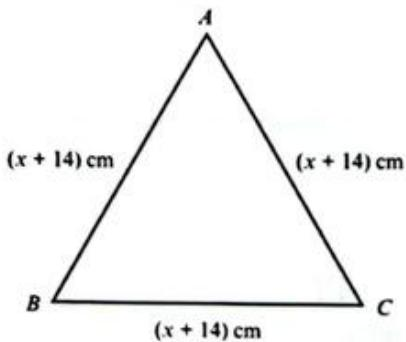

---

### 10 (练习题)

**题目**: 10 The diagram shows a rectangle. The dimensions are given in cm.
a Find and simplify an expression for the perimeter of the rectangle. [2]
b Form and solve an equation to  $4(x)$  find  $x$  [3]
c Find the perimeter of the rectangle. [2]
d The area of the rectangle is  $15\%$  larger than the area of a square. Find the side length of the square, giving your answer to 2 decimal places. [3]

---

### 11 (练习题)

**题目**: 11 Rearrange  $a + \frac{1}{\sqrt{b}} = c$  to make  $b$  the subject. [3]

---

### 12 (练习题)

**题目**: 12 Factorise completely  $4p^{3}q^{4} + 8p^{2}q + 2apq^{3} + 4a$  [3]

---

### 13 (练习题)

**题目**: 13 Solve for  $x$ .  $4^{2x - 3} = 2^{5 + 2(x - 3)}$  [4]

---

## 7 Perimeter, area and volume > 7.1 Perimeter and area in two dimensions > Exercise 7.1

### 1 (练习题)

**题目**: 1 By measuring the lengths of each side and adding them together, find the perimeter of each of the following shapes.

---

### 2 (练习题)

**题目**: 2 Calculate the perimeter of each of the following shapes.

---

### 3 (练习题)

**题目**: 3 Calculate the area of each of the following shapes.

---

### 4 (练习题)

**题目**: 4 A triangular plate of glass forms part of a large stained-glass window.
a If the base of the plate is  $45\mathrm{cm}$  and the height is  $2.6\mathrm{m}$  calculate the area of the glass plate, giving your answer in:
i cm²
m²
b Another triangular section of the window has area  $0.54\mathrm{m}^2$  and base  $30\mathrm{cm}$  Find the height of the section in cm.

---

### 5 (练习题)

**题目**: 5 The following shapes can all be divided into simpler shapes. In each case find the total area.

Draw the simpler shapes separately and then calculate the individual areas, as in Worked example 1.

---

### 6 (练习题)

**题目**: 6 For each of the following shapes you are given the area and one other measurement. Find the unknown length in each case.

Write down the formula for the area in each case.  
Substitute into the formula the values that you already know and then rearrange it to find the unknown quantity.

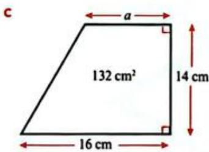

---

### 5 (练习题)

**题目**: 5 The following shapes can all be divided into simpler shapes. In each case find the total area.

---

### 7 (练习题)

**题目**: 7 How many  $20\mathrm{cm}$  by  $30\mathrm{cm}$  rectangular tiles do you need to tile the outdoor area shown?

---

### 8 (练习题)

**题目**: The image shows a tree decoration, made with three triangles of exactly the same shape but different sizes.
a The dimensions of the middle triangle are  $\frac{2}{3}$  of the dimensions of the bottom triangle, and the dimensions of the top triangle are  $\frac{2}{3}$  of those of the triangle
in the middle. Work out the area of the whole decoration, giving your answer to 1 decimal place.
b Another decoration is made in the same way, but the base of the bottom triangle is  $xcm$  and the height is  $ycm$ . Find the area of the shape as a simplified fraction of  $xy$ .

---

### 9 (练习题)

**题目**: 9 Sanjay has a square mirror measuring  $10\mathrm{cm}$  by  $10\mathrm{cm}$ . Silvie has a square mirror which covers twice the area of Sanjay's mirror. Determine the dimensions of Silvie's mirror correct to 2 decimal places.

---

### 10 (练习题)

**题目**: 10 The flag of Guyana is rectangular, with some triangular patterns as shown.

a The official flag of Guyana measures  $152\mathrm{cm}$  by  $91\mathrm{cm}$ . Find the area of the flag that is yellow or white. Give your answer in square metres.
b What fraction is green?
c Explain how you know that the black and red area is the same as the white and yellow area.

---

### 11 (练习题)

**题目**: 11 For each of the following, draw rough sketches and give the dimensions:
a two rectangles with the same perimeter but different areas
b two rectangles with the same area but different perimeters
C two parallelograms with the same perimeter but different areas
d two parallelograms with the same area but different perimeters.

---

### 12 (练习题)

**题目**: 12 Find the area and perimeter of the rectangle shown in the diagram.

---

### 13 (练习题)

**题目**: 13 A trapezium has parallel sides of length  $a$  cm and  $3a$  cm. The parallel sides are a distance  $a$  apart and the area of the trapezium is the same as the area of a triangle with base  $a$  cm and height  $a^2$  cm. Find the area of the trapezium.

---

### 14 (练习题)

**题目**: 14 A rectangle is three times as long as it is wide. If the area of the rectangle is  $243\mathrm{cm}^2$ , find the perimeter of the rectangle.

---

### 1 (练习题)

**题目**: 1 Calculate the area of a square of side  $2\mathrm{cm}$

---

### 2 (练习题)

**题目**: 2 How many times larger than the area of a  $2\mathrm{cm}\times 2\mathrm{cm}$  square is the area of a  $6\mathrm{cm}\times 6\mathrm{cm}$  square?

---

### 3 (练习题)

**题目**: 3 How many times larger than the area of a  $2\mathrm{cm}\times 2\mathrm{cm}$  square is the area of a  $10\mathrm{cm}\times 10\mathrm{cm}$  square?

---

### 4 (练习题)

**题目**: 4 Find the areas of some more squares and try to work out what is happening to the area when you multiply the lengths of each side by the same number.

---

### 5 (练习题)

**题目**: 5 Now calculate the area of a right-angled triangle, with shorter sides 4cm and 7 cm.

---

### 6 (练习题)

**题目**: 6 If the shorter sides double, triple or quadruple in length, what happens to the area each time?

---

### WORKED EXAMPLE 2 (例题)

**题目**: WORKED EXAMPLE 2
For each of the following circles calculate the circumference and the area. Give each answer to 3 significant figures.
a

b

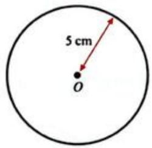

**解答**: Answers
a Circumference  $= \pi d$
$$
= \pi \times 8
$$
$$
\text {A r e a} = \pi r ^ {2}
$$
$$
= 2 5. 1 3 2 7 \dots
$$

---

### WORKED EXAMPLE 3 (例题)

**题目**: WORKED EXAMPLE 3
Calculate the area of the shaded region in the diagram.

**解答**: $$
\begin{array}{r l} {\mathrm {S h a d e d a r e a}} & {= \mathrm {a r e a o f t r i a n g l e - a r e a o f c i r c l e .}} \\ {\mathrm {A r e a}} & {= \frac {1}{2} b h - \pi r ^ {2}} \\ & {= \frac {1}{2} \times 1 8 \times 2 0 - \pi \times 2. 5 ^ {2}} \\ {2 0 \mathrm {c m}} & {= 1 6 0. 3 6 5 \dots} \\ & {= 1 6 0 \mathrm {c m} ^ {2} (3 \mathrm {s . f .})} \end{array}
$$
Substitute in values of b, h and r.
Round the answer. In this case it has been rounded to 3 significant figures.

---

## 7 Perimeter, area and volume > 7.1 Perimeter and area in two dimensions > Exercise 7.2

### 1 (练习题)

**题目**: 1 Calculate the area and circumference in each of the following. Give your answers to 3 significant figures where necessary.

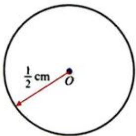

---

### 2 (练习题)

**题目**: 2 Calculate the area of the shaded region in each case. Give your answers to 3 significant figures where necessary.

---

### 3 (练习题)

**题目**: 3 The diagram shows a plan for a rectangular garden with a circular pond. The part of the garden not covered by the pond is to be covered by grass. One bag of grass seed covers five square metres of lawn. Calculate the number of bags of seed that are needed.

---

### 4 (练习题)

**题目**: 4 The diagram shows a road sign. If the triangle will be painted white and the rest of the sign will be painted red, calculate the area covered by each colour to 1 decimal place.

---

### 5 (练习题)

**题目**: Sixteen identical circles are to be cut from a square sheet of fabric with sides of  $0.4\mathrm{m}$ . Find the area of the leftover fabric (to 2 d.p.) if the circles are made as large as possible.

---

### 6 (练习题)

**题目**: 6 Two friends usually order a large pizza to share. The large pizza has a diameter of  $24\mathrm{cm}$ . This week they want to eat different things on their pizzas, so they decide to order two small pizzas. The small pizza has a diameter of  $12\mathrm{cm}$ . They want to know if there is the same amount of pizza in two small pizzas as in one large. Work out the answer.

---

### WORKED EXAMPLE 4 (例题)

**题目**: WORKED EXAMPLE 4
For each calculation, give your answer as a multiple of  $\pi$ .
a Find the circumference of a circle with a diameter of  $12\mathrm{cm}$
b What is the exact circumference of a circle of radius  $4\mathrm{mm}$
c Determine the area of a circle with a diameter of  $10\mathrm{m}$
d What is the radius of a circle of circumference  $2.8\pi \mathrm{cm}$ ?

**解答**: Answers
a  $C = 12\pi \mathrm{cm}$
$$
C = \pi d
$$
Multiply the diameter by 12 and remember to write the units.
b C=2πr
$$
C = 2 \times \pi \times 4 = 8 \pi \mathrm {m m}
$$
Use this version of the formula since you have been told the radius.
A=πr²
$$
\begin{array}{l} r = 5 m, \text {s o} A = \pi \times 5 ^ {2} \\ A = 2 5 \pi m \\ \end{array}
$$
d C=2πr
$$
\begin{array}{l} \mathrm {S o}, r = \frac {\mathrm {C}}{2 \pi} \\ r = \frac {2 . 8 \pi}{2 \pi} = 1. 4 \mathrm {c m} \\ \end{array}
$$

---

## 7 Perimeter, area and volume > 7.1 Perimeter and area in two dimensions > Exercise 7.3

### 1 (练习题)

**题目**: 1 Find the circumference and area of each shape. Give each answer as a multiple of  $\pi$ .

---

### 1 (练习题)

**题目**: 1 Find the circumference and area of each shape. Give each answer as a multiple of  $\pi$ .

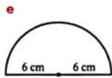

---

### 2 (练习题)

**题目**: 2 For each of the following, give the answer as a multiple of  $\pi$ .
a Calculate the circumference of a circle of diameter  $10\mathrm{cm}$

---

### 2 (练习题)

**题目**: b A circle has a radius of  $7\mathrm{mm}$  . What is its circumference?

---

### 2 (练习题)

**题目**: c What is the area of a circle of diameter 1.9cm?

---

### 2 (练习题)

**题目**: d The radius of a semicircle is  $3\mathrm{cm}$  . What is the area of the semicircle?

---

### 3 (练习题)

**题目**: 3 A circle of circumference  $12\pi \mathrm{cm}$  is precision cut from a metal square as shown.
a What is the length of each side of the square?
b What area of metal is left after the circle has been cut out? Give your answer in terms of  $\pi$

---

### 4 (练习题)

**题目**: 4 The diagram shows two concentric circles. The inner circle has a circumference of  $14\pi \mathrm{mm}$  The outer circle has a radius of  $9\mathrm{mm}$  Determine the exact area of the shaded portion.

---

### 5 (例题)

**题目**: Find the area and perimeter of the shapes. Give your answer to 3 significant figures.
a

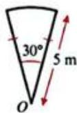

**解答**: Answer
$$
\text {A r e a} = \frac {\theta}{3 6 0} \times \pi r ^ {2} = \frac {3 0 ^ {\cdot}}{3 6 0} \times \pi \times 5 ^ {2} = 6. 5 4 4 \dots = 6. 5 4 \mathrm {m} ^ {2} (3 \mathrm {s}. \mathrm {f}.)
$$
$$
\begin{array}{l} \text {P e r i m e t e r} = \frac {\theta}{3 6 0} \times 2 \pi r + 2 r = \frac {3 0}{3 6 0} \times 2 \times \pi \times 5 + 2 \times 5 = 1 2. 6 1 7 \dots \\ = 1 2. 6 \mathrm {m} (3 \mathrm {s}. \mathrm {f}.) \\ \end{array}
$$

---

### 5 (例题)

**题目**: b

**解答**: Answer
Total area = area of triangle + area of a semicircle
$$
A r e a = \frac {1}{2} b h + \frac {1}{2} \pi r ^ {2} = \frac {1}{2} \times 8 \times 6 + \frac {1}{2} \pi \times 4 ^ {2} = 4 9. 1 3 2 \dots
$$
is approximately equal to  $49.1\mathrm{cm}^2$  (3 s.f.)
$$
\text {P e r i m e t e r} = \sqrt {5 2} + \sqrt {5 2} + \frac {1}{2} \times 2 \pi \times 4 = 2 7. 0 \mathrm {c m} (3 \mathrm {s}. \mathrm {f}.)
$$

---

### 5 (例题)

**题目**: WORKED EXAMPLE 5 CONTINUED

**解答**: Answer
$$
A r e a = \frac {\theta}{3 6 0} \times \pi r ^ {2} = \frac {3 6 0 - 6 5}{3 6 0} \times \pi \times 4 ^ {2} = \frac {2 9 5}{3 6 0} \times \pi \times 1 6 = 4 1. 1 8 9 \dots
$$
is approximately equal to  $41.2\mathrm{cm}^2$
$$
\text {P e r i m e t e r} = \frac {\theta}{3 6 0} \times 2 \pi r + 2 r = \frac {2 9 5}{3 6 0} \times 2 \times \pi \times 4 + 2 \times 4 = 2 8. 5 9 4 \dots
$$
is approximately equal to  $28.6\mathrm{cm}$

---

## 7 Perimeter, area and volume > 7.1 Perimeter and area in two dimensions > Exercise 7.4

### 1 (练习题)

**题目**: 1 For each of the following shapes find both the area and the perimeter. Give your answers to 3 significant figures.

---

### 1 (练习题)

**题目**: 

---

### 1 (练习题)

**题目**: 

---

### 1 (练习题)

**题目**: 

---

### 1 (练习题)

**题目**: 

---

### 1 (练习题)

**题目**: 

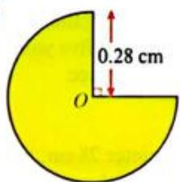

---

### 1 (练习题)

**题目**: 

---

### 2 (练习题)

**题目**: 2 Find the area of the coloured region and find the arc length / in each of the following. Give your answers to 3 significant figures.

---

### 2 (练习题)

**题目**: 

---

### 2 (练习题)

**题目**: 

---

### 1 (练习题)

**题目**: 1 For each of the following shapes find both the area and the perimeter. Give your answers to 3 significant figures.

---

### 3 (练习题)

**题目**: 3 Find the area and perimeter of the following. Give your answers to 3 significant figures.

---

### 4 (练习题)

**题目**: 4 The diagram shows a circular sector, drawn from the centre of the Earth with an arc along the equator.

When the angle at the centre of the Earth is  $\frac{1}{60}$  of a degree, the arc length along the equator is known as 1 nautical mile. Given that the Earth's diameter is approximately  $12760\mathrm{km}$ , find the length of 1 nautical mile in metres. Give your answer to the nearest metre.

---

### 5 (练习题)

**题目**: 
The diagram shows a running track of length  $400\mathrm{m}$ . The two straight edges are both  $90\mathrm{m}$  in length. Find the diameter,  $d$ , of the two semicircular sections. Give your answer to 1 decimal place.

---

### 6 (练习题)

**题目**: 6 Goro rolls pizza dough into a single circular pizza base of diameter  $28\mathrm{cm}$ , but Huan asks for four identical, smaller pizza bases with the same thickness instead. Work out the diameter of each of the smaller pizza bases.

---

### 7 (练习题)

**题目**: 7 The diagram shows a slice of circular cake, seen from above. The radius of the cake is equal to the arc length and the area of the top of the slice is  $40.5\mathrm{cm}^2$ . Find the radius of the cake.

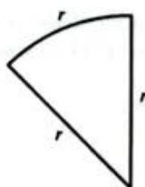

---

### 8 (练习题)

**题目**: 8 For each of the following find the area and perimeter of the coloured region. Give your answer in terms of  $\pi$

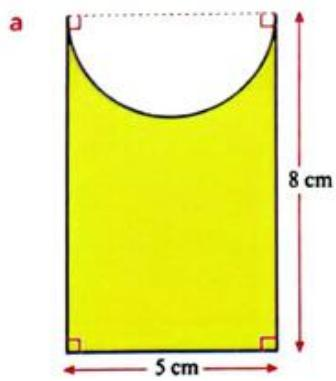

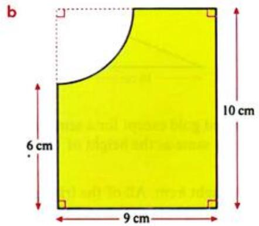

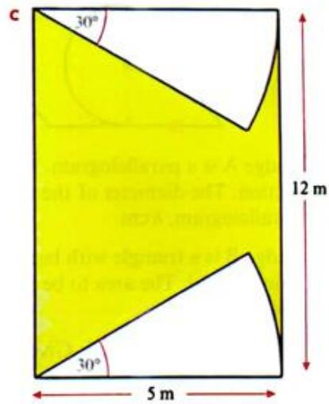

---

### 9 (练习题)

**题目**: 9 Find the perimeter and area of each shape. Give your answer to 3 significant figures.

---

### 10 (练习题)

**题目**: 10 Arjun has two designs for badges.

Badge A is a parallelogram. It is to be painted gold except for a semicircular section. The diameter of the semicircle is the same as the height of the parallelogram,  $h\mathrm{cm}$ .
Badge B is a triangle with base  $16\mathrm{cm}$  and height  $h\mathrm{cm}$ . All of the triangle is to be painted gold. The area to be painted is  $18\mathrm{cm}^2$  more than the area to be painted on badge A.
Calculate the value of  $h$ . Give your answer to 3 significant figures.

---

## 7 Perimeter, area and volume > 7.2 Three-dimensional objects > Exercise 7.5

### 1 (练习题)

**题目**: 1 The diagram shows a cuboid. Draw a net for the cuboid.

---

### 2 (练习题)

**题目**: 2 The diagram shows the net of a solid.
a Describe the solid in as much detail as you can.
b Which two points will join with point  $M$  when the net is folded?
c Which edges are equal in length to  $PO?$

---

### 3 (练习题)

**题目**: 3 A teacher asked her class to draw the net of a cuboid cereal box. These are the diagrams that three students drew. Which of them is correct?

---

### 4 (练习题)

**题目**: 4 How could you make a cardboard model of this numbered octahedron? Draw labelled sketches to show your solution.

---

### 5 (练习题)

**题目**: 5 The diagram shows the net of a cuboid.

a Find the surface area of the cuboid in  $\mathrm{cm}^2$
b Find the volume of the cuboid in  $\mathfrak{m}^3$

---

## 7 Perimeter, area and volume > 7.3 Surface areas and volumes of solids > Exercise 7.6

### 1 (练习题)

**题目**: 1 Find the volume and surface area of the solid with the net shown in the diagram.

---

### 2 (练习题)

**题目**: 2 Find (i) the volume and (ii) the surface area of the cuboids with the following dimensions:
a length  $= 5\mathrm{cm}$  width  $= 8\mathrm{cm}$  height  $= 18\mathrm{cm}$
b length  $= 1.2\mathrm{mm}$  width  $= 2.4\mathrm{mm}$  height  $= 4.8\mathrm{mm}$

---

### 3 (练习题)

**题目**: 3 The diagram shows a bottle crate. Find the volume of the crate.

---

### 4 (练习题)

**题目**: 4 The diagram shows a pencil case in the shape of a triangular prism. Calculate its:
a volume
b surface area.

---

### 5 (练习题)

**题目**: 5 The diagram shows a cylindrical drain. Calculate the volume of the drain.

---

### 6 (练习题)

**题目**: 6 A  $32~\mathrm{cm}$  long cardboard cylinder has a radius of  $2.5\mathrm{cm}$
a What is the exact volume of the cylinder?
b Some papers are rolled inside the cylinder and both ends are sealed. What is the surface area of the sealed tube?

---

### 7 (练习题)

**题目**: 7 The diagram shows the solid glass case for a clock. The case is a cuboid with a cylinder removed (to fit the clock mechanism). Calculate the volume of glass required to make the clock case.

---

### 8 (练习题)

**题目**: 8 A storage company has a rectangular storage room  $20\mathrm{m}$  long,  $8\mathrm{m}$  wide and  $2.8\mathrm{m}$  high.
a How many cardboard boxes with dimensions  $1\mathrm{m}\times 0.5\mathrm{m}\times 2.5\mathrm{m}$  can fit into this storage room?
b What is the surface area of each cardboard box?
c When the maximum number of cardboard boxes are stored, what volume of empty space is left in the room?

---

### 9 (练习题)

**题目**: 9 Find the volume and surface area of this solid.

---

## 7 Perimeter, area and volume > 7.3 Surface areas and volumes of solids > Exercise 7.7

### 1 (练习题)

**题目**: 1 The diagram shows a beach ball. Giving your answers in terms of  $\pi$ , find:
a the surface area of the beach ball
b the volume of the beach ball.

---

### 2 (练习题)

**题目**: 2 The diagram shows a metal ball bearing that is completely submerged in a cylinder of water.
Find the volume of water in the cylinder.

---

### 3 (练习题)

**题目**: 3 The Earth is roughly spherical with an approximate diameter of  $12800\mathrm{km}$ . What is the approximate volume of each hemisphere? Give your answer to 3 significant figures.

---

### 4 (练习题)

**题目**: 4 The Great Pyramid at Giza originally had a square base of side  $230.6\mathrm{m}$  and perpendicular height  $146.7\mathrm{m}$ . Assuming that the Great Pyramid is a true pyramid, find its original volume. Give your answer to 3 significant figures.

---

### 5 (练习题)

**题目**: 5 The diagram shows a rocket that consists of a cone placed on top of a cylinder. Giving your answers in terms of  $\pi$ , find:
a Find the surface area of the rocket.
b Find the volume of the rocket.

---

### 6 (练习题)

**题目**: 6 The diagram shows a glass pyramid ornament. The base is a regular hexagon. Find the volume of the ornament. Give your answer to 3 significant figures.

---

### 7 (练习题)

**题目**: 7 The diagram shows a child's toy. It is made by joining half of a sphere to a cone.
a Find the volume of the toy.
b Find the surface area of the toy.

---

### 8 (练习题)

**题目**: 8 The sphere and cone shown in the diagram have the same volume. Find the radius of the sphere.

---

### 9 (练习题)

**题目**: 9 The volume of the larger sphere (of radius  $R$ ) is twice the volume of the smaller sphere (of radius  $r$ ). Find an equation connecting  $r$  to  $R$ .

---

### 10 (练习题)

**题目**: 10 A hollow metal tube is made using a sheet of metal that is  $5\mathrm{mm}$  thick. The tube is  $35\mathrm{cm}$  long and has an exterior diameter of  $10.4\mathrm{cm}$ .
a Draw a rough sketch of the tube and add its dimensions.
b Write down all the calculations you will have to make to find the volume of metal in the tube.
c Calculate the volume of metal in the tube.
d How could you find the total surface area of the outside plus the inside of the tube?

---

### 11 (练习题)

**题目**: 11 When a solid (usually a cone or a pyramid) is cut along a plane parallel to its base it is called a frustum. The frustum in this diagram was originally a pyramid with a vertical height of  $15\mathrm{cm}$ . Calculate the volume of the frustum.

---

### 12 (练习题)

**题目**: 12 Amira want to make two open containers. These are the nets of the containers she will make.

a Amira plans to paint the outside of each container. Use the information on each net to calculate the total area to be painted. Give your answer to 2 decimal places where necessary.
b Amira will use the containers to hold a sweet mix of seeds called mukhwas. Calculate the volume of mukhwas that each container can hold. Assume they are filled level with the opening.

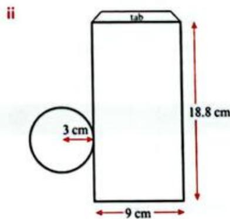

---

### 1 (练习题)

**题目**: 1 A piece of rope is wound around a cylindrical pipe 18 times. If the diameter of the pipe is  $600\mathrm{mm}$ , find the length of the rope. [4]

---

### 2 (练习题)

**题目**: 2 Find the perimeter and area of this shape.

---

### 3 (练习题)

**题目**: 3 A cylindrical rainwater tank is  $1.5\mathrm{m}$  tall with a diameter of  $1.4\mathrm{m}$ . What is the maximum volume of rainwater it can hold? [3]

---

### 4 (练习题)

**题目**: 4 An ice cream maker likes to make perfect hemispherical shells of ice cream in perfect cones of wafer. If the gigantic cone is completely filled, calculate the total volume of ice cream used. Give your answer exactly, in terms of  $\pi$ .

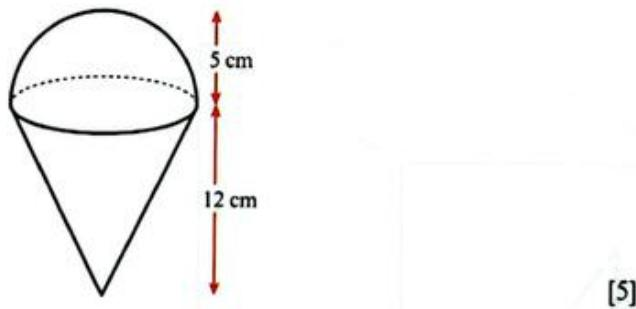

---

### 5 (练习题)

**题目**: 5 A beach umbrella consists of eight sectors of a circle of radius  $1.2\mathrm{m}$  and angle at the centre of 40 degrees.

The sectors are all joined together to make an umbrella. Find the area of the top of the umbrella. [3]

---

### 6 (练习题)

**题目**: 6 A company logo is constructed from three identical circles.

The centres of the circles are  $8\mathrm{cm}$  apart.
a Calculate the perimeter of the logo. [3]
b Calculate the area of the logo. [3]
c For a new logo the distance between the centres of the circles is changed to  $11\mathrm{cm}$  Calculate the percentage increase in the perimeter. [3]

---

### 7 (练习题)

**题目**: 7 A wooden paperweight is made in the shape of a cuboid, with a triangular prism carved out.

Calculate the volume of wood used to make the paperweight.
Give your answer in:
a cubic centimetres [4]
b cubic metres. [3]

---

### 8 (练习题)

**题目**: 8 This pyramid has a square base and four identical triangular sides.

The perpendicular height is  $8\mathrm{cm}$
The pyramid is cut in half parallel to its base to form a frustum of height  $4\mathrm{cm}$
The sides of the square at the top of the frustum are all  $6\mathrm{cm}$
Calculate the volume and the surface area of the frustum. [6]

---

## 8 Introduction to probability > 8.1 Understanding basic probability

### WORKED EXAMPLE 1 (例题)

**题目**: WORKED EXAMPLE 1
A person is blindfolded and asked to throw darts at a dartboard.
If they hit the dartboard 15 times out of 125 throws, estimate the probability they hit the dartboard on their next throw.

**解答**: Answer
$$
\begin{array}{l} P (\text {s i x}) = \frac {\text {n u m b e r t i m e s t h e p e r o n h i t s d a r t b o r d}}{\text {n u m b e r o f t r i a l s}} \\ = \frac {1 5}{1 2 5} \\ = 0. 1 2 \\ \end{array}
$$

---

### WORKED EXAMPLE 2 (例题)

**题目**: WORKED EXAMPLE 2
The numbers one to six are written on six identical cards. The cards are shuffled and placed face down on a table. If a card is selected at random, what is the probability of obtaining:
a a three
b an even number
a prime number?

---

### WORKED EXAMPLE 3 (例题)

**题目**: A card is drawn from an ordinary park of 52 cards. What is the probability that the card will be a king?

**解答**: Answer
$$
P (\text {k i n g}) = \frac {4}{5 2} = \frac {1}{1 3}
$$
Number of possible outcomes is 52.
Number of favourable outcomes is four, because there are four kings per pack.

---

### WORKED EXAMPLE 4 (例题)

**题目**: Nasir has 20 socks in a drawer.
Eight socks are red, ten socks are blue and two socks are green. If a sock is drawn at random, what is the probability that it is green?

**解答**: Answer
P(green) = 2/20 = 1/10
Number of possible outcomes is 20.
Number of favourable outcomes is two.

---

### WORKED EXAMPLE 5 (例题)

**题目**: Nine teams of painters were each given one letter from the word HOLLYWOOD to paint. Each painting team was given a letter at random. Find the probability that a team of painters was asked to paint:
a the letter Y
b the letter 'O'
c the letter 'H' or the letter 'L'
d the letter 'Z'.

**解答**: Answers
a  $P(Y) = \frac{1}{9}$
Number of favourable outcomes is one (there is only one 'Y').
There are nine possible outcomes in total.
b  $P(O) = \frac{3}{9} = \frac{1}{3}$
Number of favourable outcomes is three.
c  $P(H$  or  $L) = \frac{3}{9} = \frac{1}{3}$
Number of favourable outcomes  $=$  number of letters that are either  $\mathsf{H}^{\prime}$  or  $\mathsf{L}^{\prime} = 3$  since there is one  $\mathsf{H}^{\prime}$  and two L's.
d  $P(Z) = \frac{0}{9} = 0$
Number of favourable outcomes is zero (there are no 'Z's).

---

### WORKED EXAMPLE 6 (例题)

**题目**: The probability that Jas passes a driving test is  $\frac{2}{3}$ . What is the probability that Jas fails the driving test?

**解答**: Answer
$$
P (\text {f a i l s}) = 1 - \frac {2}{3} = \frac {1}{3} \quad P (\text {f a i l s}) = P (\text {n o t p a s s i n g}) = 1 - P (\text {p a s s i n g})
$$

---

### 1 (练习题)

**题目**: 1 In a 'true or false' quiz with ten questions, you are certain to get five right if you guess.

---

### 2 (练习题)

**题目**: 2 In a rowing race a team can win, lose or draw, so the probability they win is  $\frac{1}{3}$ .

---

### 3 (练习题)

**题目**: 3 If you roll a dice ten times and get four sixes, the dice must be biased.

---

### 4 (练习题)

**题目**: 4 There are 16 red socks and 24 blue socks in a drawer. If you pull ten socks out of the drawer there will always be more blue socks than red socks.

---

### 5 (练习题)

**题目**: 5 The sign by the ice cream stall says that the probability of rain today is  $\frac{1}{5}$ , but it is raining, so the probability it rains today must have always been 1.

---

## 8 Introduction to probability > 8.1 Understanding basic probability > Exercise 8.1

### 1 (练习题)

**题目**: 1 A six-sided dice is thrown 100 times and the number five appears 14 times.
a Find the experimental probability of throwing a five, giving your answer as a fraction in its lowest terms.
b Write your answer to part (a) as a percentage.

---

### 2 (练习题)

**题目**: 2 The diagram shows a spinner that is divided into exactly eight equal sectors. Ryan spins the spinner 260 times and records the results in a table:

---

### 2 (练习题)

**题目**: 2 The diagram shows a spinner that is divided into exactly eight equal sectors. Ryan spins the spinner 260 times and records the results in a table:
[Table Row] <tr><td>Number</td><td>1</td><td>2</td><td>3</td><td>4</td><td>5</td><td>6</td><td>7</td><td>8</td></tr>
[Table Row] <tr><td>Frequency</td><td>33</td><td>38</td><td>26</td><td>35</td><td>39</td><td>21</td><td>33</td><td>35</td></tr>
Calculate the experimental probability of spinning:
a the number three
b the number five
c an odd number
a factor of eight.

---

### 3 (练习题)

**题目**: 3 A consumer organisation carried out tests to find the average lifetime of a new brand of solar lamp. The results of the tests are summarised in the table.
[Table Row] <tr><td>Lifetime of lamp, L hours</td><td>0 ≤ L &lt; 1000</td><td>1000 ≤ L &lt; 2000</td><td>2000 ≤ L &lt; 3000</td><td>3000 ≤ L</td></tr>
[Table Row] <tr><td>Frequency</td><td>30</td><td>75</td><td>160</td><td>35</td></tr>
a Calculate the relative frequency of a lamp lasting for less than 3000 hours, but more than 1000 hours.
b If a hardware chain ordered 2000 of these lamps, how many would you expect to last for more than 3000 hours?

---

### 4 (练习题)

**题目**: 4 A survey was carried out where people were asked to choose their favourite type of film from five categories. The bar chart shows the results.

a How many people took part in the survey?
b Another person joins the group and is asked the same question. Estimate the probability that the person chooses 'adventure'.
c The survey was carried out in a village with a total population of 480. If everyone in the village was asked the question, estimate the number of people that would choose 'horror'.

---

### 5 (练习题)

**题目**: Research shows that the probability of a person being right-handed is 0.77. How many left-handed people would you expect in a population of 25000?

---

### 6 (练习题)

**题目**: 6 A flower enthusiast collected 385 examples of a Polynomialus mathematicus flower in Peru. Just five of the flowers were blue. One flower is chosen at random. Find the probability that:
a it is blue
b it is not blue.

---

### 7 (练习题)

**题目**: 7 A bag contains nine equal sized balls. Four of the balls are blue and the remaining five balls are red.
What is the probability that, when a ball is taken from the bag:
a it is blue
b it is red
it neither blue nor red
it is either blue or red?

---

### 8 (练习题)

**题目**: 8 A bag contains 36 balls. The probability that a ball chosen at random is blue is  $\frac{1}{4}$ . How many blue balls are there in the bag?

---

### 9 (练习题)

**题目**: 9 Liu shuffles an ordinary pack of 52 playing cards. If he draws a single card at random, find the probability that the card is:
a a king
b a spade
c a black card
d a prime-numbered card.

---

### 1 (练习题)

**题目**: 1 Complete the activities on this exit ticket.
[Table Row] <tr><td>Events</td><td>A Throwing a number greater than 2 on a regular dice.</td><td>B Drawing a red card from a set of 12 red, 12 white and 6 blue cards.</td><td>C Throwing a 7 using a regular dice.</td><td>D Getting heads 14 times when you toss a coin 20 times.</td></tr>
a Which event has a probability of 0?
b What is the probability of event B not happening?
c Calculate the probability of A happening.
d What type of probability is described in event D?

---

## 8 Introduction to probability > 8.2 Sample space diagrams

### 7 (例题)

**题目**: WORKED EXAMPLE 7
One red dice and one blue dice are thrown at the same time and the numbers showing on the dice are added together. Find the probability that:
a the sum is 7
b the sum is less than 5.
c the sum is greater than or equal to 8.
d the sum is less than 8.

**解答**: Answers
Red
[Table Row] <tr><td>+</td><td>1</td><td>2</td><td>3</td><td>4</td><td>5</td><td>6</td></tr>
[Table Row] <tr><td>1</td><td>2</td><td>3</td><td>4</td><td>5</td><td>6</td><td>7</td></tr>
[Table Row] <tr><td>2</td><td>3</td><td>4</td><td>5</td><td>6</td><td>7</td><td>8</td></tr>
[Table Row] <tr><td>3</td><td>4</td><td>5</td><td>6</td><td>7</td><td>8</td><td>9</td></tr>
[Table Row] <tr><td>4</td><td>5</td><td>6</td><td>7</td><td>8</td><td>9</td><td>10</td></tr>

---

## 8 Introduction to probability > 8.2 Sample space diagrams > Exercise 8.2

### 1 (练习题)

**题目**: Exercise 8.2
1 An unbiased coin is thrown twice and the outcome for each is recorded as H (head) or T (tail). A sample space diagram can be drawn as shown.
a Copy and complete the diagram.
b Find the probability that:
i the coins show the same face ii the coins both show heads
iii there is at least one head iv there are no heads.

---

### 2 (练习题)

**题目**: 2 Two unbiased dice are thrown and the product of the two numbers is recorded.
a Draw a suitable sample space diagram to show all possible outcomes.
b Find the probability that:
i the product is 1
ii the product is 7
iii the product is less than or equal to 4.
iv the product is greater than 4.
the product is a prime number.
vi the product is a square number.

---

### 3 (练习题)

**题目**: 3

The diagram shows a spinner with five equal sectors numbered 1, 2, 4, 6 and 8, and an unbiased tetrahedral dice with faces numbered 3, 5, 7 and 9. The spinner is spun and the dice is thrown, and the greater of the two numbers is recorded. If both show the same number then that number is recorded.
a Draw a sample space diagram to show the possible outcomes.
b Calculate the probability that:
the greater number is even
ii the greater number is odd.
iii the greater number is a multiple of 3.
iv the greater number is prime
the greater number is more than twice the smaller number.

---

### 4 (练习题)

**题目**: 4 An unbiased cubical dice has six faces numbered 4, 6, 10, 12, 15 and 24. The dice is thrown twice and the highest common factor (HCF) of the two scores is recorded.
a Draw a sample space diagram to show the possible outcomes.
b Calculate the probability that:
i the HCF is 2
ii the HCF is greater than 2.
iii the HCF is not 7
iv the HCF is not 5.
v the HCF is 3 or 5
vi the HCF is equal to one of the numbers thrown.

---

### 5 (练习题)

**题目**: 5 Two dice are thrown and the result is obtained by adding the two numbers.
Two sets of dice are available.
Set A: one dice has four faces numbered 1 to 4 and the other eight faces numbered 1 to 8.
Set B: each dice has six faces numbered 1 to 6.
a Copy and complete the sample space diagrams for each set.
[Table Row] <tr><td>+</td><td>1</td><td>2</td><td>3</td><td>4</td><td>5</td><td>.6</td><td>7</td><td>8</td></tr>
[Table Row] <tr><td>1</td><td></td><td></td><td></td><td></td><td></td><td></td><td></td><td></td></tr>
[Table Row] <tr><td>2</td><td></td><td></td><td></td><td></td><td></td><td></td><td></td><td></td></tr>
[Table Row] <tr><td>3</td><td></td><td></td><td></td><td></td><td></td><td></td><td></td><td></td></tr>
[Table Row] <tr><td>4</td><td></td><td></td><td></td><td></td><td></td><td></td><td></td><td></td></tr>
[Table Row] <tr><td></td><td></td><td></td><td></td><td></td><td></td><td></td><td></td><td></td></tr>
[Table Row] <tr><td></td><td></td><td></td><td></td><td></td><td></td><td></td><td></td><td></td></tr>
[Table Row] <tr><td></td><td></td><td></td><td></td><td></td><td></td><td></td><td></td><td></td></tr>
[Table Row] <tr><td></td><td></td><td></td><td></td><td></td><td></td><td></td><td></td><td></td></tr>
[Table Row] <tr><td></td><td></td><td></td><td></td><td></td><td></td><td></td><td></td><td></td></tr>
[Table Row] <tr><td></td><td></td><td></td><td></td><td></td><td></td><td></td><td></td><td></td></tr>

---

## 8 Introduction to probability > 8.3 Combining independent and mutually exclusive events

### WORKED EXAMPLE 8 (例题)

**题目**: Noa and Sunja are both taking a music examination independently.
The probability that Noa passes is  $\frac{3}{4}$  and the probability that Sunja passes is  $\frac{5}{6}$ .
What is the probability that:
a both pass?
b neither passes?
at least one passes?
either Noa or Sunja passes (but not both)?

**解答**: a  $P(\text{both pass}) = P(\text{Noa passes and Sunja passes})$
The outcomes are independent so use the formula:
$$
= \frac {3}{4} \times \frac {5}{6} = \frac {1 5}{2 4} = \frac {5}{8}
$$
$$
P (A \text {a n d} B) = P (A) \times P (B)
$$
b  $P$  (neither passes)  $= P$  (Noa fails and Sunja fails
$$
\begin{array}{l} P (\text {f a i l}) = P (\text {n o t p a s s}) \\ = \left(1 - \frac {3}{4}\right) \times \left(1 - \frac {5}{6}\right) \\ = 1 - P (\text {p a s s}) \\ = \frac {1}{4} \times \frac {1}{6} \\ = \frac {1}{2 4} \\ \end{array}
$$
c  $P$  (at least one passes)  $= 1 - P$  (neither passes)
$$
= 1 - \frac {1}{2 4} = \frac {2 3}{2 4}
$$
d P(either Sunja or Noa passes)
$= P(\text{Noa passes and Sunja fails})$
or Noa fails and Sunja passes)
$$
\begin{array}{l} = \frac {3}{4} \times \frac {1}{6} + \frac {1}{4} \times \frac {5}{6} \\ = \frac {3}{2 4} + \frac {5}{2 4} \\ = \frac {8}{2 4} \\ = \frac {1}{3} \\ \end{array}
$$
'Noa passes and Sunja fails' and, 'Noa fails and Sunja passes,' are mutually exclusive because they cannot both happen at the same time. So use the formula:
$P(A$  or  $B) = P(A) + P(B)$  , where
A = Noa passes and Sunja fails
and
$B =$  Noa fails and Sunja passes.

---

## 8 Introduction to probability > 8.3 Combining independent and mutually exclusive events > Exercise 8.3

### 1 (练习题)

**题目**: 1 A standard six-sided dice is thrown twice. Calculate the probability that:
a two sixes are thrown
b two even numbers are thrown
c the same number is thrown twice
d the two numbers thrown are different.

---

### 2 (练习题)

**题目**: 2 A bag contains 12 coloured balls. Five of the balls are red and the rest are blue. A ball is drawn at random from the bag. It is then replaced and a second ball is drawn. The colour of each ball is recorded.
a List the possible outcomes of the experiment.
b Calculate the following probabilities. Give your answers as percentages to 3 significant figures.
i The first ball is blue.
ii The second ball is red.
iii The first ball is blue and the second ball is red.
iv The two balls are the same colour.
The two balls are a different colour.
vi Neither ball is red.

---

### 3 (练习题)

**题目**: 3 Devin and Tej are playing cards. Devin draws a card, replaces it and then shuffles the pack. Tej then draws a card. Find the probability that:
a both draw an ace
b both draw the king of Hearts
c Devin draws a spade and Tej draws a queen.
d exactly one of the cards drawn is a heart.
both cards are red or both cards are black
f the cards are different colours.

---

### 4 (练习题)

**题目**: 4 Kirti and Hussein are both preparing to take a driving test. They each learned to drive separately, so the results of the tests are independent. The probability that Kirti passes is 0.6 and the probability that Hussein passes is 0.4. Calculate the probability that:
a both pass the test
neither passes the test.
Kirti passes the test, but Hussein does not pass.
at least one of Kirti and Hussein passes
exacone of Kirti and Hussein passes.

---

## 8 Introduction to probability > 8.3 Combining independent and mutually exclusive events

### WORKED EXAMPLE 9 (例题)

**题目**: Simone and Rami are playing basketball. The probability that Simone shoots the ball into the net is 0.1. The probability that Rami shoots the ball into the net is 0.2. Simone's success or failure at shooting the ball into the net is independent of Rami's and vice versa.
Simone and Rami take one shot each. Find the probability that:
a both shoot the ball into the net
b Simone shoots the ball into the net, but Rami does not
c exactly one ball is shot into the net.

**解答**: a  $P$  (both shoot the ball into the net)  $= 0.1\times 0.2 = 0.02$
b  $P$  (Simone shoots the ball into the net but Rami does not)  $= 0.1 \times (1 - 0.2) = 0.1 \times 0.8 = 0.08$
c  $P$  (exactly one ball is shot into the net)  $= P$  (Simone shoots the ball into the net and Rami does not or Simone does not shoot the ball into the net and Rami does)
$$
\begin{array}{l} = 0. 1 \times 0. 8 + 0. 9 \times 0. 2 \\ = 0. 0 8 + 0. 1 8 \\ = 0. 2 6 \\ \end{array}
$$

---

## 8 Introduction to probability > 8.3 Combining independent and mutually exclusive events > Exercise 8.3

### 1 (练习题)

**题目**: 1 A bowl of fruit contains three apples, four bananas, two pears and one orange.
A child chooses one piece of fruit at random. Find the probability that
they choose:
a a banana
[2]
b a pear or a banana
[2]
c a mango.
[1]

---

### 2 (练习题)

**题目**: 2 A shape is chosen at random from these quadrilaterals: square, rectangle, rhombus, parallelogram, trapezium and kite. Each shape is equally likely to be chosen.
Find the probability that:
a the chosen shape has four sides of equal length [1]
b the chosen shape has three sides [1]
c the chosen shape has at least one pair of parallel sides [2]
d the angles in the chosen shape are all equal. [2]

---

### 3 (练习题)

**题目**: 3 A four-sided dice has faces numbered 1, 2, 3 and 4. The dice is thrown on the table. The probabilities of each of the four faces landing flat on the table are as shown.
[Table Row] <tr><td>Face</td><td>1</td><td>2</td><td>3</td><td>4</td></tr>
[Table Row] <tr><td>Probability</td><td>2/9</td><td>1/3</td><td>5/18</td><td>1/6</td></tr>
[Table Row] <tr><td></td><td></td><td></td><td></td><td></td></tr>
a Copy the table and fill in the four empty boxes with the probabilities changed to fractions with a common denominator.
b Which face is most likely to finish flat on the table? [2]
c What is the probability that face 3 does not finish flat on the table? [2]

---

### 4 (练习题)

**题目**: 4 Josh and Soumik each take a coin at random out of their pockets and add them together to get an amount. Josh has two $1 coins, a 50c coin, a $5 coin and three 20c coins in his pocket. Soumik has three $5 coins, a $2 coin and three 50c pieces.
a Draw a probability space diagram to show all the possible outcomes for the sum of the two coins. [4]
b Find the probability that the coins will add up to $6. [2]
c Find the probability that the coins add up to less than $2. [2]
d Find the probability that the coins will add up to $5 or more. [3]

---

### 5 (练习题)

**题目**: 5 A six-sided dice is biased so that the probability of rolling a 5 is  $\frac{1}{6}$ , the probability of rolling a 6 is  $\frac{1}{3}$  and the probabilities of rolling a 1, 2, 3 or 4 are all equal.
The dice is rolled twice and the result recorded each time.
a Calculate the probability of rolling a 3 on the first roll. [2]
b Calculate the probability that the total of both rolls is 12. [3]
c Calculate the probability that the product of both rolls is 12. [3]

---

### 6 (练习题)

**题目**: 6 Two fair spinners, one in the shape of a square with sides numbered 1, 2, 3, 4, and one in the shape of a regular pentagon with sides numbered 1, 2, 3, 4, 5 are spun at the same time.
a Draw a sample space diagram to show all possible outcomes. Use a comma to separate the numbers on each spinner. For example, record the outcome 'a 3 on the square spinner and a 4 on the pentagon spinner' as 3, 4. [3]
Event  $A$  is 'the total of the scores is 5'.
Event  $B$  is 'the scores have a difference of 1'.
Find the probability of the events:
i A [2]
ii B [2]
iii  $A$  and  $B$  [3]
iv A or B or both. [3]
c i Use your answer to part (b) to show that the result,  $P(A$  or  $B) = P(A) + P(B)$  , is.not true for these events. [3]
ii Why is the result not true for these events? [2]

---

## Past paper questions for Unit 2

### 1 (练习题)

**题目**: 1 Write these numbers in order, starting with the smallest.
$$
\frac {1 3}{2 0 1}
$$
$$
5.6 \%
$$
$$
0. 0 6 5
$$
$$
\frac {5}{8 9}
$$
[2]

---

## Unit 2 Past Paper Questions Resource Sheet is available on Cambridge GO.

### 2 (练习题)

**题目**: 2 The probability that a train is late is 0.15.
Write down the probability that the train is not late.
[1]

---

### 3 (练习题)

**题目**: 3 A cone has radius  $4.5\mathrm{cm}$  and height  $10.4\mathrm{cm}$
Calculate, in terms of  $\pi$ , the volume of the cone.
[The volume,  $V$ , of a cone with radius  $r$  and height  $h$  is  $V = \frac{1}{3}\pi r^2 h$ .]
[2]

---

### 4 (练习题)

**题目**: Factorise completely.
$$
2 1 a ^ {2} + 2 8 a b
$$
Cambridge IGCSE Mathematics (0580) Paper 11 Q11, June 2020
[2]

---

### 5 (练习题)

**题目**: 5 A bag contains green balls and red balls only.
A ball is taken at random from the bag.
The probability of taking a green ball is 0.38.
Write down the probability of taking
a a red ball,
Cambridge IGCSE Mathematics (0580) Paper 11 Q13, June 2020
[1]
b a blue ball.
[1]
Cambridge IGCSE Mathematics (0580) Paper 11 Q4, June 2019

---

### 6 (练习题)

**题目**: 6 Write down the following numbers in standard form.
a 640000
[1]
b 0.0006
[1]
Cambridge IGCSE Mathematics (0580) Paper 11 Q7, June 2019

---

### 7 (练习题)

**题目**: 7 A bag contains blue, red, yellow and green balls only.
A ball is taken from the bag at random.
The table shows some information about the probabilities.
[Table Row] <tr><td>Colour</td><td>Blue</td><td>Red</td><td>Yellow</td><td>Green</td></tr>
[Table Row] <tr><td>Probability</td><td>0.15</td><td>0.2</td><td></td><td>0.43</td></tr>
a Complete the table. [Using Figure 1 in the Unit 2 Past Paper Questions Resource Sheet.]
[2]
Abdul takes a ball at random and replaces it in the bag.
He does this 200 times.
Find how many times he expects to take a red ball.
[1]
Cambridge IGCSE Mathematics (0580) Paper 21 Q4, June 2020

---

### 8 (练习题)

**题目**: 8 Work out $1.20 as a percentage of $16.
[1]
Cambridge IGCSE Mathematics (0580) Paper 11 Q2, June 2019

---

### 9 (练习题)

**题目**: 9 a Write the number 0.0605 in standard form.
[1]
b Calculate  $(1.63 \times 10^{12}) \times (2.47 \times 10^{-1})$ .
Give your answer in standard form.
[1]

---

### 10 (练习题)

**题目**: 10 The diagram shows the net of a triangular prism on a  $1\mathrm{cm}^2$  grid.

a Write down the mathematical name for the type of triangle shown on the grid.
[1]
b i Measure the perpendicular height of the triangle.
ii Calculate the area of the triangle.
iii Calculate the volume of the triangular prism.
[1]
[2]
[2]

---

### 11 (练习题)

**题目**: 11 a Simplify  $8a + 3b - 2a + b$
[2]
b Calculate the value of  $4x^{2} + xy$  when  $x = 3$  and  $y = -2$
[2]
c Solve these equations.
x 4 20
[1]
ii  $3x - 5 = 16$
[2]
iii  $5(2x + 1) = 27$
[3]
d Make  $r$  the subject of this formula.
$$
p = 3 r - 5
$$
[2]

---

### 12 (练习题)

**题目**: 12

The diagram shows the surface of a garden pond, made from a rectangle and two semicircles.
The rectangle measures  $3\mathrm{m}$  by  $1.2\mathrm{m}$
a Calculate the area of this surface.
[3]
b The pond is a prism and the water in the pond has a depth of  $20\mathrm{cm}$  Calculate the number of litres of water in the pond.
[3]
c After a rainfall, the number of litres of water in the pond is 1007. Calculate the increase in the depth of water in the pond. Give your answers in centimetres.
[3]

---

### 13 (练习题)

**题目**: 13 a

The diagram shows a solid cone and a solid hemisphere.
The cone has radius  $2.4\mathrm{cm}$  and slant height  $6.3\mathrm{cm}$
The hemisphere has radius  $R\mathrm{cm}$
The total surface area of the cone is equal to the total surface area of the hemisphere.
Calculate the value of  $R$ .
[The curved surface area,  $A$ , of a cone with radius  $r$  and slant height  $l$  is  $A = \pi r l$ .]
[The curved surface area,  $A$ , of a sphere with radius  $r$  is  $A = 4\pi r^2$ .]
[4]

The diagram shows a solid cone with radius  $7.6\mathrm{cm}$  and height  $16\mathrm{cm}$ .
A cut is made parallel to the base of the cone and the top section is removed.
The remaining solid has height  $12\mathrm{cm}$  as shown in the diagram.
Calculate the volume of the remaining solid.
[The volume,  $V$ , of a cone with radius  $r$  and height  $h$  is  $V = \frac{1}{3}\pi r^2 h$ .]
[4]

---

## Unit 2 Project

### Unit 2 Project (练习题)

**题目**: This set of numbered balls is used to play a game:

To play the game, the balls are mixed up and two balls are randomly picked out together. For example:

The numbers on the balls are added together:  $4 + 5 = 9$
If the total is even, you win.
If the total is odd, you lose.
How can you decide whether the game is fair?
Here are three more sets of balls:

---

## 9 Sequences,surds and sets

### 1 (练习题)

**题目**: 1 Here is a number sequence. 27, 23, 19, 15 ...
In your own words, describe what a number sequence is.
b If  $T_{1}$  means the first term in the sequence, what does  $T_{n}$  mean?
What will the next term be? Why?
It is possible to work out the value of the 20th term (or any term) without listing the numbers. How could you do this?

---

### 2 (练习题)

**题目**: 2 In everyday English, the word 'rational' means well thought out or logical and 'irrational' means going against reason or illogical.
a What do the words rational and irrational mean in maths?
b Why is  $\pi$  an irrational number?
Why is 0.66666... rational even though its decimal part continues to infinity?

---

### 3 (练习题)

**题目**: 3 Read this information about the doctors on the Venn diagram.
Top left region is set  $A = \{ \text{doctors that perform surgery} \}$
Top right region is set  $\mathsf{B} = \{$  doctors that are specialists\}
Bottom region is set  $C = \{\text{doctors that treat children}\}$
a How many doctors perform surgery?
b How many doctors perform surgery or treat children?
c How many doctors are specialists who do not do surgery and who do not treat children?
How many specialists treat children and perform surgery?

---

### 4 (练习题)

**题目**: 4 Consider the set of positive whole numbers less than 20. Draw a Venn diagram to show the relationship between even numbers and prime numbers.

---

## 9 Sequences,surds and sets > 9.1 Sequences > Exercise 9.1

### 1 (练习题)

**题目**: 1 Draw a diagram to show how each of the following sequences continues and find the next three terms in each case.
a 5,7,9,11,13,...
b 3,8,13,18,23,...
c 3,9,27,81,243,...
d 0.5,2,3.5,5,6.5,..
e 8,5,2,-1,-4,...
f 13,11,9,7,5,...
g 6,4.8,3.6,2.4,1.2,...
h 2.3,1.1,-0.1,-1.3,...

---

### 2 (练习题)

**题目**: 2 Find the next three terms in each of the following sequences and explain the rule that you used in each case.
a 1,-3,9,-27,...
b Mo, Tu, We, Th, ...
c a,c,f,j,o,...

---

### 3 (练习题)

**题目**: 3 The first term  $(T_{1})$  of a sequence is 5. The term-to-term rule for the sequence is 'add  $x$ '.
Find the value of  $x$  that will give you each of these sequences:
a every second term is not an integer
b every second term is a multiple of 10.
c  $\mathrm{T}_2 <   \mathrm{T}_1$

---

### WORKED EXAMPLE 1 (例题)

**题目**: WORKED EXAMPLE 1
a Find the general rule for the nth term of this sequence.
2,6,10,14,18,22,26,...
b Find the 40th term of the sequence.
c Explain how you know that the number 50 is in the sequence and work out which position it is in.
d Explain how you know that the number 125 is not in the sequence.

**解答**: Answers
a

---

### WORKED EXAMPLE 2 (例题)

**题目**: WORKED EXAMPLE 2
Find an expression for the nth term of the sequence 2, 5, 10, 17, 26 ...

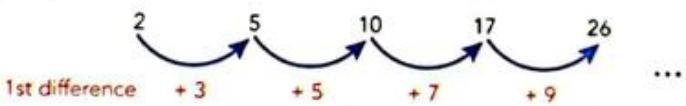

**解答**: Answer
Work out the difference between terms in the sequence. This is known as the first difference.

The first difference is not constant so work out the second difference:

The second difference is constant. This means the sequence is quadratic and the rule will involve  $n^2$ .
TIP
You may recognise that the numbers in this sequence are all 1 greater than the sequence of square numbers and be able to answer the question by inspection.
WORKED EXAMPLE 2 CONTINUED
Make a table to show the position of each term and include a row for the values of  $n^2$ .
[Table Row] <tr><td>n</td><td>1</td><td>2</td><td>3</td><td>4</td><td>5</td></tr>
[Table Row] <tr><td>Term</td><td>2</td><td>5</td><td>10</td><td>17</td><td>26</td></tr>
[Table Row] <tr><td>n2</td><td>1</td><td>4</td><td>9</td><td>16</td><td>25</td></tr>
Each term is 1 greater than the value of  $n^2$ , so the  $n$ th term is  $n^2 + 1$ .

---

### WORKED EXAMPLE 3 (例题)

**题目**: WORKED EXAMPLE 3
Find the nth term of the quadratic sequence 2, 8, 16, 26, 38 ...

**解答**: Answer

Once you have values for each expression you can make equations to find  $a$ ,  $b$ , and  $c$ .
$$
2 a = 2, \text {s o} a = 1
$$
Find the value of a first.
$$
3 a + b = 6
$$
Find b by substituting the value of a.
$$
3 (1) + b = 6, \text {s o} b = 3
$$
TIP
If you are not told the sequence is quadratic, you will need to check that the second difference is constant before using this method.

---

## 9 Sequences,surds and sets > 9.1 Sequences > Exercise 9.2

### 1 (练习题)

**题目**: 1 Write down the next three terms in each of the following sequences.
a 3 7 11 15 19 ... b 4 9 16 25 36 ... c 23 19 13 5 -5

---

### 2 (练习题)

**题目**: 2 List the first three terms and find the 20th term of the number patterns given by the following rules, where  $\mathrm{T} =$  term and  $n =$  the position of the term.
a  $\mathrm{T}_n = 4 - 3n$  b  $\mathrm{T}_n = 2 - n$  c  $\mathrm{T}_n = \frac{1}{2} n^2$  d  $\mathrm{T}_n = n(n + 1)(n - 1)$  e  $T_{n} = \frac{3}{1 + n}$  f  $\mathrm{T}_n = 2n^3$

---

### 3 (练习题)

**题目**: 3 Find the (i) 15th and (ii) nth term for each of the following sequences.
a 5,7,9,11,13,... b 3,8,13,18,23,...
c 3,9,27,81,243,... d 0.5,2,3.5,5,6.5,...
e 8,5,2,-1,-4,... f 13,11,9,7,5,...
g 6,4.8,3.6,2.4,1.2,... h 2,8,18,32,50,...

---

### 4 (练习题)

**题目**: 4 Consider the sequence:
4,12,20,28,36,44,52,...
a Find the nth term of the sequence.
b Find the 500th term.
c Which term of this sequence has the value 236? Show full working.
d Show that 154 is not a term in the sequence.

---

### 5 (练习题)

**题目**: 5 The following information is given about a quadratic sequence.

Copy the diagram and write the correct values in the empty boxes.

---

### 6 (练习题)

**题目**: 6 Consider the sequence:
3,8,15,24,35...
a Show that this is a quadratic sequence.
b Determine the value of the 6th term.
c Write an expression for the general term.
d Work out the 20th term.

---

### 7 (练习题)

**题目**: 7 If  $x + 1$  and  $-x + 17$  are the second and sixth terms of a sequence with a common difference of 5, find the value of  $x$ .

---

### 8 (练习题)

**题目**: 8 If  $x + 4$  and  $x - 4$  are the third and seventh terms of a sequence with a common difference of  $-2$ , determine  $n$  when  $T_n = x$ .

---

### 9 (练习题)

**题目**: 9 a Write down the first five terms in the sequence with nth term  $2n^{2}$
b Use your answer to part (a) to find the nth term for each of the following sequences:
[Table Row] <tr><td>i</td><td>3</td><td>9</td><td>19</td><td>33</td><td>51</td></tr>
[Table Row] <tr><td>ii</td><td>4</td><td>16</td><td>36</td><td>64</td><td>100</td></tr>
[Table Row] <tr><td>iii</td><td>7</td><td>25</td><td>55</td><td>97</td><td>151</td></tr>
c Now consider the sequence:

---

## 9 Sequences,surds and sets > 9.1 Sequences > Exercise 9.1

### WORKED EXAMPLE 4 (例题)

**题目**: WORKED EXAMPLE 4
Complete this table of sequences.
[Table Row] <tr><td>Sequence</td><td>1st term</td><td>2nd term</td><td>3rd term</td><td>4th term</td><td></td><td>nth term</td></tr>
[Table Row] <tr><td>A</td><td>5</td><td>8</td><td>11</td><td></td><td></td><td></td></tr>
[Table Row] <tr><td>B</td><td>2</td><td>5</td><td>10</td><td></td><td></td><td></td></tr>
[Table Row] <tr><td>C</td><td>7</td><td>13</td><td>21</td><td></td><td></td><td></td></tr>

**解答**: WORKED EXAMPLE 4 CONTINUED
Answer
The terms in sequence A go up by 3 each time. It is a linear sequence with common difference 3 and  $n$ th term  $3n + 2$ .
The terms in sequence B are each 1 greater than the square number sequence. So the nth term is  $n^2 + 1$ .
In sequence C, each term is found by adding the equivalent terms of sequence A and B together:  $5 + 2 = 7$ ,  $8 + 5 = 13$ , and so on. You can find the nth term in a similar way.
The completed table is:
[Table Row] <tr><td>Sequence</td><td>1st term</td><td>2nd term</td><td>3rd term</td><td>4th term</td><td></td><td>nth term</td></tr>
[Table Row] <tr><td>A</td><td>5</td><td>8</td><td>11</td><td>14</td><td></td><td>3n + 2</td></tr>
[Table Row] <tr><td>B</td><td>2</td><td>5</td><td>10</td><td>17</td><td></td><td>n2 + 1</td></tr>
[Table Row] <tr><td>C</td><td>7</td><td>13</td><td>21</td><td>31</td><td></td><td>n2 + 3n + 3</td></tr>

---

## 9 Sequences,surds and sets > 9.1 Sequences > Exercise 9.2

### 9 (练习题)

**题目**: 9 a Write down the first five terms in the sequence with nth term  $2n^{2}$
b Use your answer to part (a) to find the nth term for each of the following sequences:
[Table Row] <tr><td>i</td><td>3</td><td>9</td><td>19</td><td>33</td><td>51</td></tr>
[Table Row] <tr><td>ii</td><td>4</td><td>16</td><td>36</td><td>64</td><td>100</td></tr>
[Table Row] <tr><td>iii</td><td>7</td><td>25</td><td>55</td><td>97</td><td>151</td></tr>
c Now consider the sequence:
5 6 11 20 33
Copy and complete the table to show how the terms in this sequence compare to those in the sequence with  $n$ th term  $2n^2$ .
[Table Row] <tr><td>n</td><td>1</td><td>2</td><td>3</td><td>4</td><td>5</td></tr>
[Table Row] <tr><td>Sequence</td><td>5</td><td>6</td><td>11</td><td>20</td><td>33</td></tr>
[Table Row] <tr><td>2n2</td><td>2</td><td></td><td></td><td>32</td><td></td></tr>
[Table Row] <tr><td>Sequence - 2n2</td><td>3</td><td></td><td></td><td>-12</td><td></td></tr>
d Find the nth term of the sequence of differences.
e Use your answers to work out the nth term of the sequence:
5 6 11 20 33

---

### 10 (练习题)

**题目**: 10 Use the general from  $an^2 + bn + c$  to find the  $n$ th term for each of the following sequences.
a 5,12,23,38,80,...
b 13, 17, 23, 31, 41, 53, ...

---

### 11 (练习题)

**题目**: 11 Given the sequence  $-4, -2, 4, 14, 28, 46, \ldots$
a Show that this is a quadratic sequence.
b Determine the next term,  $T_{7}$
c Determine the nth term of the sequence.
d Calculate  $\mathbf{T}_{50}$

---

### 12 (练习题)

**题目**: 12 For the sequence 2, 6, 12, 20, ...
a Write down  $\mathbf{T}_5$  and  $\mathbf{T}_6$
b Write an expression for the nth term in this sequence.
c Determine the value of  $\mathbf{T}_{1\mathrm{c}}$
d Which term has a value of 110?

---

### 13 (练习题)

**题目**: 13 An ancient myth involves the ruler putting a gold coin on the first square of a chessboard, two coins on the second square, four on the third square and continuing to double the number of coins up to the 64th square.
a Write an expression for the number of coins on the nth square.
b Determine the number of coins on the 64th square?
c Write an expression for the number of coins on the nth square if the sequence changes to 1, 3, 9, 27, ...

---

### 1 (练习题)

**题目**: 1 Look at this pine cone carefully.

a Identify the clockwise and anti-clockwise spirals. Count and record how many there are of each.
b Count sections from the centre. Can you identify the 1, 1, 2, 3, 5, ... pattern?

---

### 2 (练习题)

**题目**: 2 Find another example to show Fibonacci patterns in nature. Your example could be a real object or a clear photograph or diagram.

---

### 3 (练习题)

**题目**: 3 The ratio between terms in the Fibonacci sequence gives an approximate value of 1.618. This value is known as the golden ratio.
a Investigate where the golden ratio is used in art and architecture.
b Provide a simple diagram and explanation of what the golden ratio means.

---

### WORKED EXAMPLE 5 (例题)

**题目**: WORKED EXAMPLE 5
The diagram shows a pattern made with squares.

---

## 9 Sequences,surds and sets > 9.1 Sequences > Exercise 9.3

### 1 (练习题)

**题目**: For each of the following shape sequences:
i draw a sequence table for the first six patterns, taking care to use the correct letter for the pattern number and the correct letter for the number of shapes
ii find a formula for the number of shapes used in terms of the pattern number
iii use your formula to find the number of shapes used in the 300th pattern.

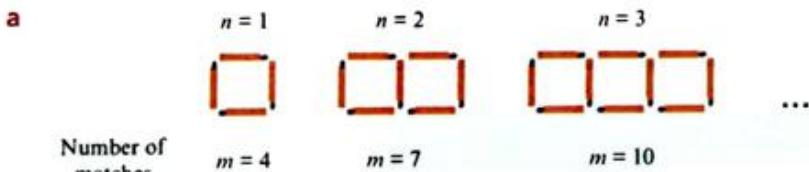

---

### 2 (练习题)

**题目**: d

---

## 9 Sequences,surds and sets > 9.1 Sequences > Exercise 9.4

### 1 (练习题)

**题目**: 1 Find the first three terms and the 25th term of each sequence.
a  $u_{n} = 4n + 1$
b  $u_{n} = 3n - 5$
C  ${u}_{n} = {5n} - \frac{1}{2}$
d  $u_{n} = -2n + 1$
e  $u_{n} = \frac{n}{2} +1$
f  $u_{n} = 2n^{2} - 1$
g  $u_{n} = n^{2}$
h  $u_{n} = 5 + 2^{n - 1}$

---

### 2 (练习题)

**题目**: 2 The numbers 30 and 110 are found in the sequence  $u_{n} = n(n - 1)$ . In which position is each number found?

---

### 3 (练习题)

**题目**: 3 Which term in the sequence  $u_n = 2n^2 + 5$  has a value of 167?

---

### 4 (练习题)

**题目**: 4 For the sequence  $u_{n} = 2n^{2} - 5n + 3$ , determine:
a the value of the tenth term.
b the value of  $n$  for which  $u_{n} = 45$

---

## 9 Sequences,surds and sets > 9.1 Sequences > Exercise 9.2

### 5 (例题)

**题目**: The diagram shows a pattern made with squares.

a Construct a sequence table showing the first six patterns and the number of squares used.
b Find a formula for the number of squares,  $s$ , in terms of the pattern number  $p$ .
c How many squares will there be in pattern 100?

**解答**: Answers
a
[Table Row] <tr><td>Pattern number (p)</td><td>1</td><td>2</td><td>3</td><td>4</td><td>5</td><td>6</td></tr>
[Table Row] <tr><td>Number of squares (s)</td><td>7</td><td>11</td><td>15</td><td>19</td><td>23</td><td>27</td></tr>
WORKED EXAMPLE 5 CONTINUED
b  $4p$  is in the formula
Notice that the number of squares increases by 4 from shape to shape.
This means that there will be a term  $4p^{\prime}$  in the formula.
$$
\begin{array}{l} \text {I f} p = 1 \text {t h e n} 4 p = 4 \\ 4 + 3 = 7 \\ s o, s = 4 p + 3 \\ \end{array}
$$
Now, if  $p = 1$  then  $4p = 4$ . The first term is 7, so you need to add 3.
This means that  $s = 4p + 3$ .
$$
\text {I f} p = 5 \text {t h e n}
$$
$$
4 p + 3 = 2 0 + 3 = 2 3,
$$
the rule is correct.
Check: if  $p = 5$  then there should be 23
squares, which is correct.
c For pattern 100,  $p = 100$  and  $s = 4 \times 100 + 3 = 403$ .
Notice that  $p$  has been used for the pattern number rather than  $n$  here. You can use any letters that you like – it doesn't have to be  $n$  every time.

---

## 9 Sequences,surds and sets > 9.1 Sequences > Exercise 9.3

### 6 (例题)

**题目**: The position to term rule for a sequence is given as  $u_n = 3n - 1$ .
What are the first three terms of the sequence?

**解答**: Answer
Substitute  $n = 1$ ,  $n = 2$  and  $n = 3$  into the rule.
$$
u _ {1} = 3 (1) - 1 = 2 \quad \text {F o r t h e f i r s t t e r m ,} n = 1
$$
$$
u _ {2} = 3 (2) - 1 = 5
$$
$$
u _ {3} = 3 (3) - 1 = 8
$$
The first three terms are 2, 5 and 8.

---

### 7 (例题)

**题目**: The number 149 is a term in the sequence defined as  $u_{n} = n^{2} + 5$ .
Which term in the sequence is 149?

**解答**: Answer
$149 = n^{2} + 5$  Find the value of  $n$  when  $u_{n} = 149$
$$
1 4 9 - 5 = n ^ {2}
$$
$144 = n^{2}$ $n^2 = 144$  has solutions  $n = 12$  and
12 = n  $n = -12$  but we cannot have a -12th term so  $n = 12$
149 is the 12th term in the sequence.

---

## 9 Sequences,surds and sets > 9.1 Sequences > Exercise 9.4

### 5 (练习题)

**题目**: 5 The term-to-term rule for a sequence is given as  $u_{n+1} = u_n + 2$ .
a Explain in words what this means.
b Given that  $u_{3} = -4$ , list the first five terms of the sequence.

---

## 9 Sequences,surds and sets > 9.2 Rational and irrational numbers > Exercise 9.5

### 1 (练习题)

**题目**: 1 Say whether each number is rational or irrational.
a 1 4
b 4
c -7
d 3.147
eπ
4 3
g 25
0
i 0.45
j -0.67
k -232
3 8
m 9.454545...
n√123
2π
P 3√2

---

### 2 (练习题)

**题目**: 2 Show that the following numbers are rational.
a 6
b 2 3 8
c 0.427
d 0.8
e 1.12
f 3.14

---

### 3 (练习题)

**题目**: 3 Find a number in the interval  $-1 < x < 3$  so that:
a  $x$  is rational
b  $x$  is a real number but not rational
$x$  is an integer.
d  $x$  is a natural number.

---

### 4 (练习题)

**题目**: 4 Which set do you think has more members: rational numbers or irrational numbers? Why?

---

### 5 (练习题)

**题目**: 5 Mathematicians also talk about imaginary numbers. Find out what these are and give one example.

---

### 8 (例题)

**题目**: Use algebra to write each of the following as fractions. Simplify your fractions as far as possible.
a 0.3

---

## 9 Sequences,surds and sets > 9.2 Rational and irrational numbers > Exercise 9.6

### 1 (练习题)

**题目**: 1 Copy and complete each of the following by filling in the boxes with the correct number or symbol.
a Let  $x = 0.6$
Then  $10x =$
Subtracting:
$$
1 0 x =
$$
$$
- x = 0 6
$$
$$
x =
$$
$$
\mathrm {S o} \quad x =
$$
Simplify:  $x =$

---

### 2 (练习题)

**题目**: b
$$
\mathrm {L e t} x = 0. 1 7
$$
$$
\text {T h e n} 1 0 0 x = \square
$$
Subtracting:
$$
1 0 0 x = \square
$$
$$
- x = 0. 1 7
$$
$$
x =
$$
$$
\mathrm {S} _ {\mathrm {O}}, \quad x = \square
$$

---

### 3 (练习题)

**题目**: 2 Write each recurring decimal as a fraction in its lowest terms.

---

### 4 (练习题)

**题目**: a 0.5

---

### 5 (练习题)

**题目**: e 0.61

---

### 6 (练习题)

**题目**: 0.208

---

### 7 (练习题)

**题目**: m 2.45

---

### 8 (练习题)

**题目**: q 2.36 + 3.63

---

### 9 (练习题)

**题目**: b 0.1

---

### 10 (练习题)

**题目**: f 0.32

---

### 12 (练习题)

**题目**: 3.105

---

### 13 (练习题)

**题目**: 0.17+0.71

---

### 15 (练习题)

**题目**: g 0.618

---

## 9 Sequences,surds and sets > 9.3 Surds

### 9 (例题)

**题目**: WORKED EXAMPLE 9
Square ABCD has an area of  $6\mathrm{cm}^2$ . Calculate:
a the exact length of each side
b the length of diagonal AC correct to 3 d.p.

**解答**: Answers
a Area  $= s^2$  so  $s = \sqrt{6}$
You are asked for an exact length, so leave the answer as a surd.
b  $d^{2} = s^{2} + s^{2}$
ABC is a right-angled triangle, so use Pythagoras' theorem.
$$
\begin{array}{l} d ^ {2} = (\sqrt {6}) ^ {2} + (\sqrt {6}) ^ {2} \\ d ^ {2} = 6 + 6 \\ d ^ {2} = 1 2 \\ d = \sqrt {1 2} = 3. 4 6 4 \mathrm {c m} \\ \end{array}
$$

---

### 10 (例题)

**题目**: WORKED EXAMPLE 10
Simplify each expression.
a 50
b 2√18
c -380
d  $3\sqrt{12} \times 2\sqrt{3}$

**解答**: Answers
a Factors of 50:  $25 \times 2$
$$
\begin{array}{l} \sqrt {5 0} = \sqrt {2 5} \times \sqrt {2} \\ = 5 \times \sqrt {2} \\ = 5 \sqrt {2} \\ \end{array}
$$
Find the factors of 50. One needs to be a square number.
Write  $\sqrt{50}$  as the product of two smaller roots.
Work out the root of the perfect square.

---

## 9 Sequences,surds and sets > 9.3 Surds > Exercise 9.7

### 1 (练习题)

**题目**: 1 Simplify.
a 28

---

### 7 (练习题)

**题目**: g 350

---

### 9 (练习题)

**题目**: -5√63

---

### 11 (练习题)

**题目**: k 298

---

### 12 (练习题)

**题目**: -5√60

---

## 9 Sequences,surds and sets > 9.3 Surds

### 10 (例题)

**题目**: b 2√18

**解答**: b Factors of 18:  $9 \times 2$
$$
\begin{array}{l} 2 \sqrt {1 8} = 2 \times \sqrt {9} \times \sqrt {2} \\ = 2 \times 3 \times \sqrt {2} \\ = 6 \sqrt {2} \\ \end{array}
$$
Write  $\sqrt{18}$  as the product of two smaller roots.
Work out the root of the perfect square.
Multiply the integers.
Write the answer in simplest form.

---

### 10 (例题)

**题目**: c -380

**解答**: Factors of 80:  $16 \times 5$
$$
\begin{array}{l} - 3 \sqrt {8 0} = - 3 \times \sqrt {1 6} \times \sqrt {5} \\ = - 3 \times 4 \times \sqrt {5} \\ = - 1 2 \sqrt {5} \\ \end{array}
$$
Write  $\sqrt{80}$  as the product of two smaller roots.
Work out the root of the perfect square.
Multiply the integers.
Write the answer in simplest form.

---

### 10 (例题)

**题目**: d  $3\sqrt{12} \times 2\sqrt{3}$

**解答**: d Factors of 12:  $4 \times 3$
$$
\begin{array}{l} 3 \sqrt {1 2} \times 2 \sqrt {3} = 3 \times \sqrt {4} \times \sqrt {3} \times 2 \times \sqrt {3} \\ = 3 \times 2 \times \sqrt {3} \times 2 \times \sqrt {3} \\ = 1 2 \times \sqrt {3} \times \sqrt {3} \\ = 1 2 \times 3 \\ = 3 6 \\ \end{array}
$$
3 is prime, so you don't need to simplify  $\sqrt{3}$ .
Write  $\sqrt{12}$  as a product of two smaller roots.
Simplify.
Multiply the integers.
Square the surds (remember  $\sqrt{x} \times \sqrt{x} = x$ ).

---

### 11 (例题)

**题目**: WORKED EXAMPLE 11
Write each expression in the form  $\sqrt{n}$ .
a 3√7

**解答**: a  $3\sqrt{7} = 3\times \sqrt{7}$  which is equivalent to  $\sqrt{9}\times \sqrt{7} = \sqrt{63}$

---

### 11 (例题)

**题目**: b 4√3

**解答**: b  $4\sqrt{3} = 4\times \sqrt{3}$  which is equivalent to  $\sqrt{16}\times \sqrt{3} = \sqrt{48}$

---

### 12 (例题)

**题目**: WORKED EXAMPLE 12
Simplify and collect like terms.
a  $3\sqrt{5} +\sqrt{5}$

**解答**: a  $3\sqrt{5} +\sqrt{5} = 4\sqrt{5}$
Add the coefficients (remember  $\sqrt{5}$  means  $1 \times \sqrt{5}$ ).

---

### 12 (例题)

**题目**: 4√5-2√2+6√5-3√2

**解答**: b  $4\sqrt{5} -2\sqrt{2} +6\sqrt{5} -3\sqrt{2}$
Group like terms and add the coefficients.
$$
= 1 0 \sqrt {5} - 5 \sqrt {2}
$$
Pay attention to the negative signs.

---

### 12 (例题)

**题目**: 7√5-√20

**解答**: 7√5-√20=7√5-√4×√5
Simplify  $\sqrt{20}$
$$
= 7 \sqrt {5} - 2 \sqrt {5}
$$
Take the root of the perfect square.
$$
= 5 \sqrt {5}
$$
Subtract the coefficients.

---

## 9 Sequences,surds and sets > 9.3 Surds > Exercise 9.7

### 1 (练习题)

**题目**: 1 Simplify.
a 28
b√7
5√12
d 99
e 24
√250
g 350
472
-5√63
454
k 298
-5√60

---

### 2 (练习题)

**题目**: 2 Write each surd in the form  $\sqrt{n}$
a 3√6
b 2√10
7√2
d -2√6
e 6√3
f -3√8

---

### 3 (练习题)

**题目**: 3 How could you arrange each set of surds in descending order without using a calculator?
Set A  $2\sqrt{5}, 3\sqrt{3}, 3\sqrt{5}$
Set B 3√6,√24,4√6
Set C 3√6, 2√15, 4√3
a Use your method and write the surds in the correct order.
b Work with a partner. Discuss and compare the methods you used. Can you improve your method in any way? How?

---

### 4 (练习题)

**题目**: 4 Look at this student's homework. Both answers are incorrect.
15√3+3√2+6√3=11√6+3√2
225+√18+√20-2√3=√2+√38
a What mistakes do you this student made in each calculation?
b Work out the correct answer for each calculation.

---

### 5 (练习题)

**题目**: 5 Use positive integer values of  $m$  and  $n$  to show that these rules are incorrect.
a  $\sqrt{m} +\sqrt{n} = \sqrt{m + n}$
b  $\sqrt{m} -\sqrt{n} = \sqrt{m - n}$

---

### 6 (练习题)

**题目**: 6 Simplify by adding or subtracting. Give your answer in simplest form.
a  $2\sqrt{3} +3\sqrt{7} +3\sqrt{3}$
b√11+3√5+√11
c -3√2+√2-3√5
d  $4\sqrt{8} +2\sqrt{7} -\sqrt{8} -4\sqrt{7}$
4√5-√2+4√5-3√2
f 9√3+3√8-√3+√8

---

### 7 (练习题)

**题目**: 7 Simplify. Collect like terms where possible.
a  $\sqrt{20} +\sqrt{5}$
b  $\sqrt{12} +\sqrt{27}$
4√3-2√27
d 3√8+2√18
e  $\sqrt{75} -2\sqrt{48}$
f 3√27+2√12

---

### 8 (练习题)

**题目**: 8 Simplify.
a  $3 + 2\sqrt{3} -2 + 3\sqrt{3}$
b  $3 + 2\sqrt{3} -4 + \sqrt{3}$
2√6+3-2(1+√6)
d  $3\sqrt{3} +4 - (2\sqrt{3} -1)$
e 2(√5+2)-2(√5-2)
f 4(√7-√2)-（√7-√2）

---

### 9 (练习题)

**题目**: 9 Calculate the exact perimeter of rectangle with sides  $(2 + \sqrt{10})\mathrm{cm}$  and  $\sqrt{5}\mathrm{cm}$ . Simplify the answer if possible.

---

### 10 (练习题)

**题目**: 10 Show that  $x = 2\sqrt{7}$  in this rectangle.

---

### 13 (例题)

**题目**: WORKED EXAMPLE 13
Simplify.
a  $\sqrt{3} \times \sqrt{7}$
b  $2\sqrt{3}\times 3\sqrt{5}$
c  $\sqrt{21} \div \sqrt{3}$
8√30 d 2√6

**解答**: a  $\sqrt{3} \times \sqrt{7} = \sqrt{3 \times 7}$
$$
= \sqrt {2 1}
$$
b  $2\sqrt{3}\times 3\sqrt{5} = 2\times 3\times \sqrt{3}\times \sqrt{5}$
$$
\begin{array}{l} = 6 \times \sqrt {1 5} \\ = 6 \sqrt {1 5} \\ \end{array}
$$
c  $\sqrt{21} \div \sqrt{3} = \sqrt{\frac{21}{3}}$
$$
= \sqrt {7}
$$
Use  $\sqrt{x} \times \sqrt{y} = \sqrt{xy}$ .
Multiply the whole numbers and multiply the surds.
Use  $\sqrt{x} \div \sqrt{y} = \sqrt{\frac{x}{y}}$ .

---

### d (练习题)

**题目**: d  $3\sqrt{3} +4 - (2\sqrt{3} -1)$

---

### e (练习题)

**题目**: e 2(√5+2)-2(√5-2)

---

### f (练习题)

**题目**: f 4(√7-√2)-（√7-√2）

---

### WORKED EXAMPLE 14 (例题)

**题目**: WORKED EXAMPLE 14
Expand and simplify.
a  $\sqrt{5} (\sqrt{2} +3)$
b -2(5-√7)
c 4√3(2√2-√3)

**解答**: a  $\sqrt{5} (\sqrt{2} +3) = \sqrt{5}\times \sqrt{2} +\sqrt{5}\times 3.$
$$
= \sqrt {1 0} + 3 \sqrt {5}
$$
Multiply each term in the bracket by  $\sqrt{5}$

Remember  $\sqrt{5} \times 3$  is written as  $3\sqrt{5}$ .
b -2(5-√7)=-10+2√7
Multiply each term in the bracket by -2.
WORKED EXAMPLE 14 CONTINUED
4√3(2√2-√3）=4√3×2√2+4√3×-√3
Multiply each term in the bracket by  $4\sqrt{3}$
$$
\sqrt [ 4 ]{3} (2 \sqrt {2} - \sqrt {3})
$$
Multiply whole numbers and multiply surds.
$$
\begin{array}{l} = 8 \sqrt {6} - 4 \sqrt {9} \\ = 8 \sqrt {6} - 4 \times 3 \\ = 8 \sqrt {6} - 1 2 \\ \end{array}
$$
Remember: -3 means -1 x 3.
√9 can be simplified to 3.
8√6 cannot be simplified further.

---

### WORKED EXAMPLE 15 (例题)

**题目**: WORKED EXAMPLE 15
Write each fraction with a rational denominator.
a 1 10
3.2 b 6
4 33

**解答**: Answers
1 1 10 10 10
10 Multiply by 10
$$
= \frac {\sqrt {1 0}}{1 0}
$$
Remember:  $\sqrt{x} \times \sqrt{x} = x$ .
TIP
Remember that multiplying a fraction by  $\frac{x}{x}$  doesn't change its value.
$$
\begin{array}{l} \text {s o} \frac {1}{2} = \frac {1}{2} \times \frac {3}{3} = \frac {3}{6} \\ \text {a n d} \frac {1}{\sqrt {2}} = \frac {1}{\sqrt {2}} \times \frac {\sqrt {2}}{\sqrt {2}} \\ = \frac {\sqrt {2}}{2} \\ \end{array}
$$
WORKED EXAMPLE 15 CONTINUED
3√2 3√2 6 b 3√6 6 6 6 6 6 6 6 6 6 6 6 6 6 6 6 6 6 6 6 6 6 6 6 6 6 6 6 6 6 6 6 6 6 6 6 6 6 6 6 6 6 6 6 6 6 6 6 6 6 6 6 6 6 6 6 6 6 6 6 6 6 6 6 6 6 6 6 6 6 6 6 6 6 6 6 6 6 6 6 6 6 6 6 6 6 6 6 6 6 6 6 6 6 6 6 6 6 6 6 6 6 6 6 6 6 6 6 6 6 6 6 6 6 6 6 6 6 6 6 6 6 6 6 6 6 6 6 6 6 6 6 6 6 6 6 6 6 6 6 6 6 6 6 6 6 6 6 6 6 6 6 6 6 6 6 6 6 6 6 6 6 6 6 6 6 6 6 6 6 6 6 6 6 6 6 6 6 6 6 6 6 6 6 6 6 6 6 6 6 6 6 6 6 6 6 6 6 6 6 6 6 6 6 6 6 6 6 6 6 6 6 6 6 6 6 6 6 6 6 6 6 6 6 6 6 6 6 6 6 6 6 6 6 6 6 6 6 6 6 6 6 6 6 6 6 6 6 6 6 6 6 6 6 6 6 6 6 6 6 6 6 6 6 6 6 6 6 6 6 6 6 6 6 6 6 6 6 6 6 6 6 6 6 6 6 6 6 6 6 6 6 6 6 6 6 6 6 6 6 6 6 6 6 6 6 6 6 6 6 6 6 6 6 6 6 6 6 6 6 6 6 6 6 6 6 6 6 6 6 6 6 6 6 6 6 6 6 6 6 6 6 6 6 6 6 6 6 6 6 6 6 6 6 6 6 6 6 6 6 6 6 6 6 6 6 6 6 6 6 6 6 6 6 6 6 6 6 6 6 6 6 6 6 6 6 6 6 6 6 6 6 6 6 6 6 6 6 6 6 6 6 6 6 6 6 6 6 6 6 6 6 6 6 6 6 6 6 6 6 6 6 6 6 6 6 6 6 6 6 6 6 6 6 6 6 6 6 6 6 6 6 6 6 6 6 6 6 6 6 6 6 6 6 6 6 6 6 6 6 6 6 6 6 6 6 6 6 6 6 6 6 6 6 6 6 6 6 6 6 6 6 6 6 6 6 6 6 6 6 6 6 6 6 6 6 6 6 6 6 6 6 6 6 6 6 6 6 6 6 6 6 6 6 6 6 6 6 6 6 6 6 6 6 6 6 6 6 6 6 6 6 6 6 6 6 6 6 6 6 6 6 6 6 6 6 6 6 6 6 6 6 6 6 6 6 6 6 6 6 6 6 6 6 6 6 6 6 6 6 6 6 6 6 6 6 6 6 6 6 6 6 6 6 6 6 6 6 6 6 6 6 6 6 6 6 6 6 6 6 6 6 6 6 6 6 6 6 6 6 6 6 6 6 6 6 6 6 6 6 6 6 6 6 6 6 6 6 6 6 6 6 6 6 6 6 6 6 6 6 6 6 6 6 6 6 6 6 6 6 6 6 6 6 6 6 6 6 6 6 6 6 6 6 6 6 6 6 6 6 6 6 6 6 6 6 6 6 6 6 6 6 6 6 6 6 6 6 6 6 6 6 6 6 6 6 6 6 6 6 6 6 6 6 6 6 6 6 6 6 6 6 6 6 6 6 6 6 6 6 6 6 6 6 6 6 6 6 6 6 6 6 6 6 6 6 6 6 6 6 6 6 6 6 6 6 6 6 6 6 6 6 6 6 6 6 6 6 6 6 6 6 6 6 6 6 6 6 6 6 6 6 6 6 6 6 6 6 6 6 6 6 6 6 6 6 6 6 6 6 6 6 6 6 6 6 6 6 6 6 6 6 6 6 6 6 6 6 6 6 6 6 6 6 6 6 6 6 6 6 6 6 6 6 6 6 6 6 6 6 6 6 6 6 6 6 6 6 6 6 6 6 6 6 6 6 6 6 6 6 6 6 6 6 6 6 6 6 6 6 6 6 6 6 6 6 6 6 6 6 6 6 6 6 6 6 6 6 6 6 6 6 6 6 6 6 6 6 6 6 6 6 6 6 6 6 6 6 6 6 6 6 6 6 6 6 6 6 6 6 6 6 6 6 6 6 6 6 6 6 6 6 6 6 6 6 6 6 6 6 6 6 6 6 6 6 6 6 6 6 6 6 6 6 6 6 6 6 6 6 6 6 6 6 6 6 6 6 6 6 6 6 6 6 6 6 6 6 6 6 6 6 6 6 6 6 6 6 6 6 6 6 6 6 6 6 6 6 6 6 6 6 6 6 6 6 6 6 6 6 6 6 6 6 6 6 6 6 6 6 6 6 6 6 6 6 6 6 6 6 6 6 6 6 6 6 6 6 6 6 6 6 6 6 6 6 6 6 6 6 6 6 6 6 6 6 6 6 6 6 6 6 6 6 6 6 6 6 6 6 6 6 6 6 6 6 6 6 6 6 6 6 6 6 6 6 6 6 6 6 6 6 6 6 6 6 6 6 6 6 6 6 6 6 6 6 6 6 6 6 6 6 6 6 6 6 6 6 6 6 6 6 6 6 6 6 6 6 6 6 6 6 6 6 6 6 6 6 6 6 6 6 6 6 6 6 6 6 6 6 6 6 6 6 6 6 6 6 6 6 6 6 6 6 6 6 6 6 6 6 6 6 6 6 6 6 6 6 6 6 6 6 6 6 6 6 6 6 6 6 6 6 6 6 6 6 6 6 6 6 6 6 6 6 6 6 6 6 6 6 6 6 6 6 6 6 6 6 6 6 6 6 6 6 6 6 6 6 6 6 6 6 6 6 6 6 6 6 6 6 6 6 6 6 6 6 6 6 6 6 6 6 6 6 6 6 6 6 6 6 6 6 6 6 6 6 6 6 6 6 6 6 6 6 6 6 6 6 6 6 6 6 6 6 6 6 6 6 6 6 6 6 6 6 6 6 6 6 6 6 6 6 6 6 6 6 6 6 6 6 6 6 6 6 6 6 6 6 6 6 6 6 6 6 6 6 6 6 6 6 6 6 6 6 6 6 6 6 6 6 6 6 6 6 6 6 6 6 6 6 6 6 6 6 6 6 6 6 6 6 6 6 6 6 6 6 6 6 6 6 6 6 6 6 6 6 6 6 6 6 6 6 6 6 6 6 6 6 6 6 6 6 6 6 6 6 6 6 6 6 6 6 6 6 6 6 6 6 6 6 6 6 6 6 6 6 6 6 6 6 6 6 6 6 6 6 6 6 6 6 6 6 6 6 6 6 6 6 6 6 6 6 6 6 6 6 6 6 6 6 6 6 6 6 6 6 6 6 6 6 6 6 6 6 6 6 6 6 6 6 6 6 6 6 6 6 6 6 6 6 6 6 6 6 6 6 6 6 6 6 6 6 6 6 6 6 6 6 6 6 6 6 6 6 6 6 6 6 6 6 6 6 6 6 6 6 6 6 6 6 6 6 6 6 6 6 6 6 6 6 6 6 6 6 6 6 6 6 6 6 6 6 6 6 6 6 6 6 6 6 6 6 6 6 6 6 6 6 6 6 6 6 6 6 6 6 6 6 6 6 6 6 6 6 6 6 6 6 6 6 6 6 6 6 6 6 6 6 6 6 6 6 6 6 6 6 6 6 6 6 6 6 6 6 6 6 6 6 6 6 6 6 6 6 6 6 6 6 6 6 6 6 6 6 6 6 6 6 6 6 6 6 6 6 6 6 6 6 6 6 6 6 6 6 6 6 6 6 6 6 6 6 6 6 6 6 6 6 6 6 6 6 6 6 6 6 6 6 6 6 6 6 6 6 6 6 6 6 6 6 6 6 6 6 6 6 6 6 6 6 6 6 6 6 6 6 6 6 6 6 6 6 6 6 6 6 6 6 6 6 6 6 6 6 6 6 6 6 6 6 6 6 6 6 6 6 6 6 6 6 6 6 6 6 6 6 6 6 6 6 6 6 6 6 6 6 6 6 6 6 6 6 6 6 6 6 6 6 6 6 6 6 6 6 6 6 6 6 6 6 6 6 6 6 6 6 6 6 6 6 6 6 6 6 6 6 6 6 6 6 6 6 6 6 6 6 6 6 6 6 6 6 6 6 6 6 6 6 6 6 6 6 6 6 6 6 6 6 6 6 6 6 6 6 6 6 6 6 6 6 6 6 6 6 6 6 6 6 6 6 6 6 6 6 6 6 6 6 6 6 6 6 6 6 6 6 6 6 6 6 6 6 6 6 6 6 6 6 6 6 6 6 6 6 6 6 6 6 6 6 6 6 6 6 6 6 6 6 6 6 6 6 6 6 6 6 6 6 6 6 6 6 6 6 6 6 6 6 6 6 6 6 6 6 6 6 6 6 6 6 6 6 6 6 6 6 6 6 6 6 6 6 6 6 6 6 6 6 6 6 6 6 6 6 6 6 6 6 6 6 6 6 6 6 6 6 6 6 6 6 6 6 6 6 6 6 6 6 6 6 6 6 6 6 6 6 6 6 6 6 6 6 6 6 6 6 6 6 6 6 6 6 6 6 6 6 6 6 6 6 6 6 6 6 6 6 6 6 6 6 6 6 6 6 6 6 6 6 6 6 6 6 6 6 6 6 6 6 6 6 6 6 6 6 6 6 6 6 6 6 6 6 6 6 6 6 6 6 6 6 6 6 6 6 6 6 6 6 6 6 6 6 6 6 6 6 6 6 6 6 6 6 6 6 6 6 6 6 6 6 6 6 6 6 6 6 6 6 6 6 6 6 6 6 6 6 6 6 6 6 6 6 6 6 6 6 6 6 6 6 6 6 6 6 6 6 6 6 6 6 6 6 6 6 6 6 6 6 6 6 6 6 6 6 6 6 6 6 6 6 6 6 6 6 6 6 6 6 6 6 6 6 6 6 6 6 6 6 6 6 6 6 6 6 6 6 6 6 6 6 6 6 6 6 6 6 6 6 6 6 6 6 6 6 6 6 6 6 6 6 6 6 6 6 6 6 6 6 6 6 6 6 6 6 6 6 6 6 6 6 6 6 6 6 6 6 6 6 6 6 6 6 6 6 6 6 6 6 6 6 6 6 6 6 6 6 6 6 6 6 6 6 6 6 6 6 6 6 6 6 6 6 6 6 6 6 6 6 6 6 6 6 6 6 6 6 6 6 6 6 6 6 6 6 6 6 6 6 6 6 6 6 6 6 6 6 6 6 6 6 6 6 6 6 6 6 6 6 6 6 6 6 6 6 6 6 6 6 6 6 6 6 6 6 6 6 6 6 6 6 6 6 6 6 6 6 6 6 6 6 6 6 6 6 6 6 6 6 6 6 6 6 6 6 6 6 6 6 6 6 6 6 6 6 6 6 6 6 6 6 6 6 6 6 6 6 6 6 6 6 6 6 6 6 6 6 6 6 6 6 6 6 6 6 6 6 6 6 6 6 6 6 6 6 6 6 6 6 6 6 6 6 6 6 6 6 6 6 6 6 6 6 6 6 6 6 6 6 6 6 6 6 6 6 6 6 6 6 6 6 6 6 6 6 6 6 6 6 6 6 6 6 6 6 6 6 6 6 6 6 6 6 6 6 6 6 6 6 6 6 6 6 6 6 6 6 6 6 6 6 6 6 6 6 6 6 6 6 6 6 6 6 6 6 6 6 6 6 6 6 6 6 6 6 6 6 6 6 6 6 6 6 6 6 6 6 6 6 6 6 6 6 6 6 6 6 6 6 6 6 6 6 6 6 6 6 6 6 6 6 6 6 6 6 6 6 6 6 6 6 6 6 6 6 6 6 6 6 6 6 6 6 6 6 6 6 6 6 6 6 6 6 6 6 6 6 6 6 6 6 6 6 6 6 6 6 6 6 6 6 6 6 6 6 6 6 6 6 6 6 6 6 6 6 6 6 6 6 6 6 6 6 6 6 6 6 6 6 6 6 6 6 6 6 6 6 6 6 6 6 6 6 6 6 6 6 6 6 6 6 6 6 6 6 6 6 6 6 6 6 6 6 6 6 6 6 6 6 6 6 6 6 6 6 6 6 6 6 6 6 6 6 6 6 6 6 6 6 6 6 6 6 6 6 6 6 6 6 6 6 6 6 6 6 6 6 6 6 6 6 6 6 6 6 6 6 6 6 6 6 6 6 6 6 6 6 6 6 6 6 6 6 6 6 6 6 6 6 6 6 6 6 6 6 6 6 6 6 6 6 6 6 6 6 6 6 6 6 6 6 6 6 6 6 6 6 6 6 6 6 6 6 6 6 6 6 6 6 6 6 6 6 6 6 6 6 6 6 6 6 6 6 6 6 6 6 6 6 6 6 6 6 6 6 6 6 6 6 6 6 6 6 6 6 6 6 6 6 6 6 6 6 6 6 6 6 6 6 6 6 6 6 6 6 6 6 6 6 6 6 6 6 6 6 6 6 6 6 6 6 6 6 6 6 6 6 6 6 6 6 6 6 6 6 6 6 6 6 6 6 6 6 6 6 6 6 6 6 6 6 6 6 6 6 6 6 6 6 6 6 6 6 6 6 6 6 6 6 6 6 6 6 6 6 6 6 6 6 6 6 6 6 6 6 6 6 6 6 6 6 6 6 6 6 6 6 6 6 6 6 6 6 6 6 6 6 6 6 6 6 6 6 6 6 6 6 6 6 6 6 6 6 6 6 6 6 6 6 6 6 6 6 6 6 6 6 6 6 6 6 6 6 6 6 6 6 6 6 6 6 6 6 6 6 6 6 6 6 6 6 6 6 6 6 6 6 6 6 6 6 6 6 6 6 6 6 6 6 6 6 6 6 6 6 6 6 6 6 6 6 6 6 6 6 6 6 6 6 6 6 6 6 6 6 6 6 6 6 6 6 6 6 6 6 6 6 6 6 6 6 6 6 6 6 6 6 6 6 6 6 6 6 6 6 6 6 6 6 6 6 6 6 6 6 6 6 6 6 6 6 6 6 6 6 6 6 6 6 6 6 6 6 6 6 6 6 6 6 6 6 6 6 6 6 6 6 6 6 6 6 6 6 6 6 6 6 6 6 6 6 6 6 6 6 6 6 6 6 6 6 6 6 6 6 6 6 6 6 6 6 6 6 6 6 6 6 6 6 6 6 6 6 6 6 6 6 6 6 6 6 6 6 6 6 6 6 6 6 6 6 6 6 6 6 6 6 6 6 6 6 6 6 6 6 6 6 6 6 6 6 6 6 6 6 6 6 6 6 6 6 6 6 6 6 6 6 6 6 6 6 6 6 6 6 6 6 6 6 6 6 6 6 6 6 6 6 6 6 6 6 6 6 6 6 6 6 6 6 6 6 6 6 6 6 6 6 6 6 6 6 6 6 6 6 6 6 6 6 6 6 6 6 6 6 6 6 6 6 6 6 6 6 6 6 6 6 6 6 6 6 6 6 6 6 6 6 6 6 6 6 6 6 6 6 6 6 6 6 6 6 6 6 6 6 6 6 6 6 6 6 6 6 6 6 6 6 6 6 6 6 6 6 6 6 6 6 6 6 6 6 6 6 6 6 6 6 6 6 6 6 6 6 6 6 6 6 6 6 6 6 6 6 6 6 6 6 6 6 6 6 6 6 6 6 6 6 6 6 6 6 6 6 6 6 6 6 6 6 6 6 6 6 6 6 6 6 6 6 6 6 6 6 6 6 6 6 6 6 6 6 6 6 6 6 6 6 6 6 6 6 6 6 6 6 6 6 6 6 6 6 6 6 6 6 6 6 6 6 6 6 6 6 6 6 6 6 6 6 6 6 6 6 6 6 6 6 6 6 6 6 6 6 6 6 6 6 6 6 6 6 6 6 6 6 6 6 6 6 6 6 6 6 6 6 6 6 6 6 6 6 6 6 6 6 6 6 6 6 6 6 6 6 6 6 6 6 6 6 6 6 6 6 6 6 6 6 6 6 6 6 6 6 6 6 6 6 6 6 6 6 6 6 6 6 6 6 6 6 6 6 6 6 6 6 6 6 6 6 6 6 6 6 6 6 6 6 6 6 6 6 6 6 6 6 6 6 6 6 6 6 6 6 6 6 6 6 6 6 6 6 6 6 6 6 6 6 6 6 6 6 6 6 6 6 6 6 6 6 6 6 6 6 6 6 6 6 6 6 6 6 6 6 6 6 6 6 6 6 6 6 6 6 6 6 6 6 6 6 6 6 6 6 6 6 6 6 6 6 6 6 6 6 6 6 6 6 6 6 6 6 6 6 6 6 6 6 6 6 6 6 6 6 6 6 6 6 6 6 6 6 6 6 6 6 6 6 6 6 6 6 6 6 6 6 6 6 6 6 6 6 6 6 6 6 6 6 6 6 6 6 6 6 6 6 6 6 6 6 6 6 6 6 6 6 6 6 6 6 6 6 6 6 6 6 6 6 6 6 6 6 6 6 6 6 6 6 6 6 6 6 6 6 6 6 6 6 6 6 6 6 6 6 6 6 6 6 6 6 6 6 6 6 6 6 6 6 6 6 6 6 6 6 6 6 6 6 6 6 6 6 6 6 6 6 6 6 6 6 6 6 6 6 6 6 6 6 6 6 6 6 6 6 6 6 6 6 6 6 6 6 6 6 6 6 6 6 6 6 6 6 6 6 6 6 6 6 6 6 6 6 6 6 6 6 6 6 6 6 6 6 6 6 6 6 6 6 6 6 6 6 6 6 6 6 6 6 6 6 6 6 6 6 6 6 6 6 6 6 6 6 6 6 6 6 6 6 6 6 6 6 6 6 6 6 6 6 6 6 6 6 6 6 6 6 6 6 6 6 6 6 6 6 6 6 6 6 6 6 6 6 6 6 6 6 6 6 6 6 6 6 6 6 6 6 6 6 6 6 6 6 6 6 6 6 6 6 6 6 6 6 6 6 6 6 6 6 6 6 6 6 6 6 6 6 6 6 6 6 6 6 6 6 6 6 6 6 6 6 6 6 6 6 6 6 6 6 6 6 6 6 6 6 6 6 6 6 6 6 6 6 6 6 6 6 6 6 6 6 6 6 6 6 6 6 6 6 6 6 6 6 6 6 6 6 6 6 6 6 6 6 6 6 6 6 6 6 6 6 6 6 6 6 6 6 6 6 6 6 6 6 6 6 6 6 6 6 6 6 6 6 6 6 6 6 6 6 6 6 6 6 6 6 6 6 6 6 6 6 6 6 6 6 6 6 6 6 6 6 6 6 6 6 6 6 6 6 6 6 6 6 6 6 6 6 6 6 6 6 6 6 6 6 6 6 6 6 6 6 6 6 6 6 6 6 6 6 6 6 6 6 6 6 6 6 6 6 6 6 6 6 6 6 6 6 6 6 6 6 6 6 6 6 6 6 6 6 6 6 6 6 6 6 6 6 6 6 6 6 6 6 6 6 6 6 6 6 6 6 6 6 6 6 6 6 6 6 6 6 6 6 6 6 6 6 6 6 6 6 6 6 6 6 6 6 6 6 6 6 6 6 6 6 6 6 6 6 6 6 6 6 6 6 6 6 6 6 6 6 6 6 6 6 6 6 6 6 6 6 6 6 6 6 6 6 6 6 6 6 6 6 6 6 6 6 6 6 6 6 6 6 6 6 6 6 6 6 6 6 6 6 6 6 6 6 6 6 6 6 6 6 6 6 6 6 6 6 6 6 6 6 6 6 6 6 6 6 6 6 6 6 6 6 6 6 6 6 6 6 6 6 6 6 6 6 6 6 6 6 6 6 6 6 6 6 6 6 6 6 6 6 6 6 6 6 6 6 6 6 6 6 6 6 6 6 6 6 6 6 6 6 6 6 6 6 6 6 6 6 6 6 6 6 6 6 6 6 6 6 6 6 6 6 6 6 6 6 6 6 6 6 6 6 6 6 6 6 6 6 6 6 6 6 6 6 6 6 6 6 6 6 6 6 6 6 6 6 6 6 6 6 6 6 6 6 6 6 6 6 6 6 6 6 6 6 6 6 6 6 6 6 6 6 6 6 6 6 6 6 6 6 6 6 6 6 6 6 6 6 6 6 6 6 6 6 6 6 6 6 6 6 6 6 6 6 6 6 6 6 6 6 6 6 6 6 6 6 6 6 6 6 6 6 6 6 6 6 6 6 6 6 6 6 6 6 6 6 6 6 6 6 6 6 6 6 6 6 6 6 6 6 6 6 6 6 6 6 6 6 6 6 6 6 6 6 6 6 6 6 6 6 6 6 6 6 6 6 6 6 6 6 6 6 6 6 6 6 6 6 6 6 6 6 6 6 6 6 6 6 6 6 6 6 6 6 6 6 6 6 6 6 6 6 6 6 6 6 6 6 6 6 6 6 6 6 6 6 6 6 6 6 6 6 6 6 6 6 6 6 6 6 6 6 6 6 6 6 6 6 6 6 6 6 6 6 6 6 6 6 6 6 6 6 6 6 6 6 6 6 6 6 6 6 6 6 6 6 6 6 6 6 6 6 6 6 6 6 6 6 6 6 6 6 6 6 6 6 6 6 6 6 6 6 6 6 6 6 6 6 6 6 6 6 6 6 6 6 6 6 6 6 6 6 6 6 6 6 6 6 6 6 6 6 6 6 6 6 6 6 6 6 6 6 6 6 6 6 6 6 6 6 6 6 6 6 6 6 6 6 6 6 6 6 6 6 6 6 6 6 6 6 6 6 6 6 6 6 6 6 6 6 6 6 6 6 6 6 6 6 6 6 6 6 6 6 6 6 6 6 6 6 6 6 6 6 6 6 6 6 6 6 6 6 6 6 6 6 6 6 6 6 6 6 6 6 6 6 6 6 6 6 6 6 6 6 6 6 6 6 6 6 6 6 6 6 6 6 6 6 6 6 6 6 6 6 6 6 6 6 6 6 6 6 6 6 6 6 6 6 6 6 6 6 6 6 6 6 6 6 6 6 6 6 6 6 6 6 6 6 6 6 6 6 6 6 6 6 6 6 6 6 6 6 6 6 6 6 6 6 6 6 6 6 6 6 6 6 6 6 6 6 6 6 6 6 6 6 6 6 6 6 6 6 6 6 6 6 6 6 6 6 6 6 6 6 6 6 6 6 6 6 6 6 6 6 6 6 6 6 6 6 6 6 6 6 6 6 6 6 6 6 6 6 6 6 6 6 6 6 6 6 6 6 6 6 6 6 6 6 6 6 6 6 6 6 6 6 6 6 6 6 6 6 6 6 6 6 6 6 6 6 6 6 6 6 6 6 6 6 6 6 6 6 6 6 6 6 6 6 6 6 6 6 6 6 6 6 6 6 6 6 6 6 6 6 6 6 6 6 6 6 6 6 6 6 6 6 6 6 6 6 6 6 6 6 6 6 6 6 6 6 6 6 6 6 6 6 6 6 6 6 6 6 6 6 6 6 6 6 6 6 6 6 6 6 6 6 6 6 6 6 6 6 6 6 6 6 6 6 6 6 6 6 6 6 6 6 6 6 6 6 6 6 6 6 6 6 6 6 6 6 6 6 6 6 6 6 6 6 6 6 6 6 6 6 6 6 6 6 6 6 6 6 6 6 6 6 6 6 6 6 6 6 6 6 6 6 6 6 6 6 6 6 6 6 6 6 6 6 6 6 6 6 6 6 6 6 6 6 6 6 6 6 6 6 6 6 6 6 6 6 6 6 6 6 6 6 6 6 6 6 6 6 6 6 6 6 6 6 6 6 6 6 6 6 6 6 6 6 6 6 6 6 6 6 6 6 6 6 6 6 6 6 6 6 6 6 6 6 6 6 6 6 6 6 6 6 6 6 6 6 6 6 6 6 6 6 6 6 6 6 6 6 6 6 6 6 6 6 6 6 6 6 6 6 6 6 6 6 6 6 6 6 6 6 6 6 6 6 6 6 6 6 6 6 6 6 6 6 6 6 6 6 6 6 6 6 6 6 6 6 6 6 6 6 6 6 6 6 6 6 6 6 6 6 6 6 6 6 6 6 6 6 6 6 6 6 6 6 6 6 6 6 6 6 6 6 6 6 6 6 6 6 6 6 6 6 6 6 6 6 6 6 6 6 6 6 6 6 6 6 6 6 6 6 6 6 6 6 6 6 6 6 6 6 6 6 6 6 6 6 6 6 6 6 6 6 6 6 6 6 6 6 6 6 6 6 6 6 6 6 6 6 6 6 6 6 6 6 6 6 6 6 6 6 6 6 6 6 6 6 6 6 6 6 6 6 6 6 6 6 6 6 6 6 6 6 6 6 6 6 6 6 6 6 6 6 6 6 6 6 6 6 6 6 6 6 6 6 6 6 6 6 6 6 6 6 6 6 6 6 6 6 6 6 6 6 6 6 6 6 6 6 6 6 6 6 6 6 6 6 6 6 6 6 6 6 6 6 6 6 6 6 6 6 6 6 6 6 6 6 6 6 6 6 6 6 6 6 6 6 6 6 6 6 6 6 6 6 6 6 6 6 6 6 6 6 6 6 6 6 6 6 6 6 6 6 6 6 6 6 6 6 6 6 6 6 6 6 6 6 6 6 6 6 6 6 6 6 6 6 6 6 6 6 6 6 6 6 6 6 6 6 6 6 6 6 6 6 6 6 6 6 6 6 6 6 6 6 6 6 6 6 6 6 6 6 6 6 6 6 6 6 6 6 6 6 6 6 6 6 6 6 6 6 6 6 6 6 6 6 6 6 6 6 6 6 6 6 6 6 6 6 6 6 6 6 6 6 6 6 6 6 6 6 6 6 6 6 6 6 6 6 6 6 6 6 6 6 6 6 6 6 6 6 6 6 6 6 6 6 6 6 6 6 6 6 6 6 6 6 6 6 6 6 6 6 6 6 6 6 6 6 6 6 6 6 6 6 6 6 6 6 6 6 6 6 6 6 6 6 6 6 6 6 6 6 6 6 6 6 6 6 6 6 6 6 6 6 6 6 6 6 6 6 6 6 6 6 6 6 6 6 6 6 6 6 6 6 6 6 6 6 6 6 6 6 6 6 6 6 6 6 6 6 6 6 6 6 6 6 6 6 6 6 6 6 6 6 6 6 6 6 6 6 6 6 6 6 6 6 6 6 6 6 6 6 6 6 6 6 6 6 6 6 6 6 6 6 6 6 6 6 6 6 6 6 6 6 6 6 6 6 6 6 6 6 6 6 6 6 6 6 6 6 6 6 6 6 6 6 6 6 6 6 6 6 6 6 6 6 6 6 6 6 6 6 6 6 6 6 6 6 6 6 6 6 6 6 6 6 6 6 6 6 6 6 6 6 6 6 6 6 6 6 6 6 6 6 6 6 6 6 6 6 6 6 6 6 6 6 6 6 6 6 6 6 6 6 6 6 6 6 6 6 6 6 6 6 6 6 6 6 6 6 6 6 6 6 6 6 6 6 6 6 6 6 6 6 6 6 6 6 6 6 6 6 6 6 6 6 6 6 6 6 6 6 6 6 6 6 6 6 6 6 6 6 6 6 6 6 6 6 6 6 6 6 6 6 6 6 6 6 6 6 6 6 6 6 6 6 6 6 6 6 6 6 6 6 6 6 6 6 6 6 6 6 6 6 6 6 6 6 6 6 6 6 6 6 6 6 6 6 6 6 6 6 6 6 6 6 6 6 6 6 6 6 6 6 6 6 6 6 6 6 6 6 6 6 6 6 6 6 6 6 6 6 6 6 6 6 6 6 6 6 6 6 6 6 6 6 6 6 6 6 6 6 6 6 6 6 6 6 6 6 6 6 6 6 6 6 6 6 6 6 6 6 6 6 6 6 6 6 6 6 6 6 6 6 6 6 6 6 6 6 6 6 6 6 6 6 6 6 6 6 6 6 6 6 6 6 6 6 6 6 6 6 6 6 6 6 6 6 6 6 6 6 6 6 6 6 6 6 6 6 6 6 6 6 6 6 6 6 6 6 6 6 6 6 6 6 6 6 6 6 6 6 6 6 6 6 6 6 6 6 6 6 6 6 6 6 6 6 6 6 6 6 6 6 6 6 6 6 6 6 6 6 6 6 6 6 6 6 6 6 6 6 6 6 6 6 6 6 6 6 6 6 6 6 6 6 6 6 6 6 6 6 6 6 6 6 6 6 6 6 6 6 6 6 6 6 6 6 6 6 6 6 6 6 6 6 6 6 6 6 6 6 6 6 6 6 6 6 6 6 6 6 6 6 6 6 6 6 6 6 6 6 6 6 6 6 6 6 6 6 6 6 6 6 6 6 6 6 6 6 6 6 6 6 6 6 6 6 6 6 6 6 6 6 6 6 6 6 6 6 6 6 6 6 6 6 6 6 6 6 6 6 6 6 6 6 6 6 6 6 6 6 6 6 6 6 6 6 6 6 6 6 6 6 6 6 6 6 6 6 6 6 6 6 6 6 6 6 6 6 6 6 6 6 6 6 6 6 6 6 6 6 6 6 6 6 6 6 6 6 6 6 6 6 6 6 6 6 6 6 6 6 6 6 6 6 6 6 6 6 6 6 6 6 6 6 6 6 6 6 6 6 6 6 6 6 6 6 6 6 6 6 6 6 6 6 6 6 6 6 6 6 6 6 6 6 6 6 6 6 6 6 6 6 6 6 6 6 6 6 6 6 6 6 6 6 6 6 6 6 6 6 6 6 6 6 6 6 6 6 6 6 6 6 6 6 6 6 6 6 6 6 6 6 6 6 6 6 6 6 6 6 6 6 6 6 6 6 6 6 6 6 6 6 6 6 6 6 6 6 6 6 6 6 6 6 6 6 6 6 6 6 6 6 6 6 6 6 6 6 6 6 6 6 6 6 6 6 6 6 6 6 6 6 6 6 6 6 6 6 6 6 6 6 6 6 6 6 6 6 6 6 6 6 6 6 6 6 6 6 6 6 6 6 6 6 6 6 6 6 6 6 6 6 6 6 6 6 6 6 6 6 6 6 6 6 6 6 6 6 6 6 6 6 6 6 6 6 6 6 6 6 6 6 6 6 6 6 6 6 6 6 6 6 6 6 6 6 6 6 6 6 6 6 6 6 6 6 6 6 6 6 6 6 6 6 6 6 6 6 6 6 6 6 6 6 6 6 6 6 6 6 6 6 6 6 6 6 6 6 6 6 6 6 6 6 6 6 6 6 6 6 6 6 6 6 6 6 6 6 6 6 6 6 6 6 6 6 6 6 6 6 6 6 6 6 6 6 6 6 6 6 6 6 6 6 6 6 6 6 6 6 6 6 6 6 6 6 6 6 6 6 6 6 6 6 6 6 6 6 6 6 6 6 6 6 6 6 6 6 6 6 6 6 6 6 6 6 6 6 6 6 6 6 6 6 6 6 6 6 6 6 6 6 6 6 6 6 6 6 6 6 6 6 6 6 6 6 6 6 6 6 6 6 6 6 6 6 6 6 6 6 6 6 6 6 6 6 6 6 6 6 6 6 6 6 6 6 6 6 6 6 6 6 6 6 6 6 6 6 6 6 6 6 6 6 6 6 6 6 6 6 6 6 6 6 6 6 6 6 6 6 6 6 6 6 6 6 6 6 6 6 6 6 6 6 6 6 6 6 6 6 6 6 6 6 6 6 6 6 6 6 6 6 6 6 6 6 6 6 6 6 6 6 6 6 6 6 6 6 6 6 6 6 6 6 6 6 6 6 6 6 6 6 6 6 6 6 6 6 6 6 6 6 6 6 6 6 6 6 6 6 6 6 6 6 6 6 6 6 6 6 6 6 6 6 6 6 6 6 6 6 6 6 6 6 6 6 6 6 6 6 6 6 6 6 6 6 6 6 6 6 6 6 6 6 6 6 6 6 6 6 6 6 6 6 6 6 6 6 6 6 6 6 6 6 6 6 6 6 6 6 6 6 6 6 6 6 6 6 6 6 6 6 6 6 6 6 6 6 6 6 6 6 6 6 6 6 6 6 6 6 6 6 6 6 6 6 6 6 6 6 6 6 6 6 6 6 6 6 6 6 6 6 6 6 6 6 6 6 6 6 6 6 6 6 6 6 6 6 6 6 6 6 6 6 6 6 6 6 6 6 6 6 6 6 6 6 6 6 6 6 6 6 6 6 6 6 6 6 6 6 6 6 6 6 6 6 6 6 6 6 6 6 6 6 6 6 6 6 6 6 6 6 6 6 6 6 6 6 6 6 6 6 6 6 6 6 6 6 6 6 6 6 6 6 6 6 6 6 6 6 6 6 6 6 6 6 6 6 6 6 6 6 6 6 6 6 6 6 6 6 6 6 6 6 6 6 6 6 6 6 6 6 6 6 6 6 6 6 6 6 6 6 6 6 6 6 6 6 6 6 6 6 6 6 6 6 6 6 6 6 6 6 6 6 6 6 6 6 6 6 6 6 6 6 6 6 6 6 6 6 6 6 6 6 6 6 6 6 6 6 6 6 6 6 6 6 6 6 6 6 6 6 6 6 6 6 6 6 6 6 6 6 6 6 6 6 6 6 6 6 6 6 6 6 6 6 6 6 6 6 6 6 6 6 6 6 6 6 6 6 6 6 6 6 6 6 6 6 6 6 6 6 6 6 6 6 6 6 6 6 6 6 6 6 6 6 6 6 6 6 6 6 6 6 6 6 6 6 6 6 6 6 6 6 6 6 6 6 6 6 6 6 6 6 6 6 6 6 6 6 6 6 6 6 6 6 6 6 6 6 6 6 6 6 6 6 6 6 6 6 6 6 6 6 6 6 6 6 6 6 6 6 6 6 6 6 6 6 6 6 6 6 6 6 6 6 6 6 6 6 6 6 6 6 6 6 6 6 6 6 6 6 6 6 6 6 6 6 6 6 6 6 6 6 6 6 6 6 6 6 6 6 6 6 6 6 6 6 6 6 6 6 6 6 6 6 6 6 6 6 6 6 6 6 6 6 6 6 6 6 6 6 6 6 6 6 6 6 6 6 6 6 6 6 6 6 6 6 6 6 6 6 6 6 6 6 6 6 6 6 6 6 6 6 6 6 6 6 6 6 6 6 6 6 6 6 6 6 6 6 6 6 6 6 6 6 6 6 6 6 6 6 6 6 6 6 6 6 6 6 6 6 6 6 6 6 6 6 6 6 6 6 6 6 6 6 6 6 6 6 6 6 6 6 6 6 6 6 6 6 6 6 6 6 6 6 6 6 6 6 6 6 6 6 6 6 6 6 6 6 6 6 6 6 6 6 6 6 6 6 6 6 6 6 6 6 6 6 6 6 6 6 6 6 6 6 6 6 6 6 6 6 6 6 6 6 6 6 6 6 6 6 6 6 6 6 6 6 6 6 6 6 6 6 6 6 6 6 6 6 6 6 6 6 6 6 6 6 6 6 6 6 6 6 6 6 6 6 6 6 6 6 6 6 6 6 6 6 6 6 6 6 6 6 6 6 6 6 6 6 6 6 6 6 6 6 6 6 6 6 6 6 6 6 6 6 6 6 6 6 6 6 6 6 6 6 6 6 6 6 6 6 6 6 6 6 6 6 6 6 6 6 6 6 6 6 6 6 6 6 6 6 6 6 6 6 6 6 6 6 6 6 6 6 6 6 6 6 6 6 6 6 6 6 6 6 6 6 6 6 6 6 6 6 6 6 6 6 6 6 6 6 6 6 6 6 6 6 6 6 6 6 6 6 6 6 6 6 6 6 6 6 6 6 6 6 6 6 6 6 6 6 6 6 6 6 6 6 6 6 6 6 6 6 6 6 6 6 6 6 6 6 6 6 6 6 6 6 6 6 6 6 6 6 6 6 6 6 6 6 6 6 6 6 6 6 6 6 6 6 6 6 6 6 6 6 6 6 6 6 6 6 6 6 6 6 6 6 6 6 6 6 6 6 6 6 6 6 6 6 6 6 6 6 6 6 6 6 6 6 6 6 6 6 6 6 6 6 6 6 6 6 6 6 6 6 6 6 6 6 6 6 6 6 6 6 6 6 6 6 6 6 6 6 6 6 6 6 6 6 6 6 6 6 6 6 6 6 6 6 6 6 6 6 6 6 6 6 6 6 6 6 6 6 6 6 6 6 6 6 6 6 6 6 6 6 6 6 6 6 6 6 6 6 6 6 6 6 6 6 6 6 6 6 6 6 6 6 6 6 6 6 6 6 6 6 6 6 6 6 6 6 6 6 6 6 6 6 6 6 6 6 6 6 6 6 6 6 6 6 6 6 6 6 6 6 6 6 6 6 6 6 6 6 6 6 6 6 6 6 6 6 6 6 6 6 6 6 6 6 6 6 6 6 6 6 6 6 6 6 6 6 6 6 6 6 6 6 6 6 6 6 6 6 6 6 6 6 6 6 6 6 6 6 6 6 6 6 6 6 6 6 6 6 6 6 6 6 6 6 6 6 6 6 6 6 6 6 6 6 6 6 6 6 6 6 6 6 6 6 6 6 6 6 6 6 6 6 6 6 6 6 6 6 6 6 6 6 6 6 6 6 6 6 6 6 6 6 6 6 6 6 6 6 6 6 6 6 6 6 6 6 6 6 6 6 6 6 6 6 6 6 6 6 6 6 6 6 6 6 6 6 6 6 6 6 6 6 6 6 6 6 6 6 6 6 6 6 6 6 6 6 6 6 6 6 6 6 6 6 6 6 6 6 6 6 6 6 6 6 6 6 6 6 6 6 6 6 6 6
$= \frac{3\sqrt{12}}{6}$  Simplify by cancelling the whole numbers:  $\frac{3}{6} = \frac{1}{2}$
$\frac{\sqrt{12}}{2}$  can be simplified further.
$$
\begin{array}{l} = \frac {\sqrt {4 \times 3}}{2} \\ = \frac {2 \sqrt {3}}{2} = \sqrt {3} \\ \end{array}
$$
4 4 3 3 3 3 3 3 3 3 3 3 3 3 3 3 3 3 3 3 3 3 3 3 3 3 3 3 3 3 3 3 3 3 3 3 3 3 3 3 3 3 3 3 3 3 3 3 3 3 3 3 3 3 3 3 3 3 3 3 3 3 3 3 3 3 3 3 3 3 3 3 3 3 3 3 3 3 3 3 3 3 3 3 3 3 3 3 3 3 3 3 3 3 3 3 3 3 3 3 3 3 3 3 3 3 3 3 3 3 3 3 3 3 3 3 3 3 3 3 3 3 3 3 3 3 3 3 3 3 3 3 3 3 3 3 3 3 3 3 3 3 3 3 3 3 3 3 3 3 3 3 3 3 3 3 3 3 3 3 3 3 3 3 3 3 3 3 3 3 3 3 3 3 3 3 3 3 3 3 3 3 3 3 3 3 3 3 3 3 3 3 3 3 3 3 3 3 3 3 3 3 3 3 3 3 3 3 3 3 3 3 3 3 3 3 3 3 3 3 3 3 3 3 3 3 3 3 3 3 3 3 3 3 3 3 3 3 3 3 3 3 3 3 3 3 3 3 3 3 3 3 3 3 3 3 3 3 3 3 3 3 3 3 3 3 3 3 3 3 3 3 3 3 3 3 3 3 3 3 3 3 3 3 3 3 3 3 3 3 3 3 3 3 3 3 3 3 3 3 3 3 3 3 3 3 3 3 3 3 3 3 3 3 3 3 3 3 3 3 3 3 3 3 3 3 3 3 3 3 3 3 3 3 3 3 3 3 3 3 3 3 3 3 3 3 3 3 3 3 3 3 3 3 3 3 3 3 3 3 3 3 3 3 3 3 3 3 3 3 3 3 3 3 3 3 3 3 3 3 3 3 3 3 3 3 3 3 3 3 3 3 3 3 3 3 3 3 3 3 3 3 3 3 3 3 3 3 3 3 3 3 3 3 3 3 3 3 3 3 3 3 3 3 3 3 3 3 3 3 3 3 3 3 3 3 3 3 3 3 3 3 3 3 3 3 3 3 3 3 3 3 3 3 3 3 3 3 3 3 3 3 3 3 3 3 3 3 3 3 3 3 3 3 3 3 3 3 3 3 3 3 3 3 3 3 3 3 3 3 3 3 3 3 3 3 3 3 3 3 3 3 3 3 3 3 3 3 3 3 3 3 3 3 3 3 3 3 3 3 3 3 3 3 3 3 3 3 3 3 3 3 3 3 3 3 3 3 3 3 3 3 3 3 3 3 3 3 3 3 3 3 3 3 3 3 3 3 3 3 3 3 3 3 3 3 3 3 3 3 3 3 3 3 3 3 3 3 3 3 3 3 3 3 3 3 3 3 3 3 3 3 3 3 3 3 3 3 3 3 3 3 3 3 3 3 3 3 3 3 3 3 3 3 3 3 3 3 3 3 3 3 3 3 3 3 3 3 3 3 3 3 3 3 3 3 3 3 3 3 3 3 3 3 3 3 3 3 3 3 3 3 3 3 3 3 3 3 3 3 3 3 3 3 3 3 3 3 3 3 3 3 3 3 3 3 3 3 3 3 3 3 3 3 3 3 3 3 3 3 3 3 3 3 3 3 3 3 3 3 3 3 3 3 3 3 3 3 3 3 3 3 3 3 3 3 3 3 3 3 3 3 3 3 3 3 3 3 3 3 3 3 3 3 3 3 3 3 3 3 3 3 3 3 3 3 3 3 3 3 3 3 3 3 3 3 3 3 3 3 3 3 3 3 3 3 3 3 3 3 3 3 3 3 3 3 3 3 3 3 3 3 3 3 3 3 3 3 3 3 3 3 3 3 3 3 3 3 3 3 3 3 3 3 3 3 3 3 3 3 3 3 3 3 3 3 3 3 3 3 3 3 3 3 3 3 3 3 3 3 3 3 3 3 3 3 3 3 3 3 3 3 3 3 3 3 3 3 3 3 3 3 3 3 3 3 3 3 3 3 3 3 3 3 3 3 3 3 3 3 3 3 3 3 3 3 3 3 3 3 3 3 3 3 3 3 3 3 3 3 3 3 3 3 3 3 3 3 3 3 3 3 3 3 3 3 3 3 3 3 3 3 3 3 3 3 3 3 3 3 3 3 3 3 3 3 3 3 3 3 3 3 3 3 3 3 3 3 3 3 3 3 3 3 3 3 3 3 3 3 3 3 3 3 3 3 3 3 3 3 3 3 3 3 3 3 3 3 3 3 3 3 3 3 3 3 3 3 3 3 3 3 3 3 3 3 3 3 3 3 3 3 3 3 3 3 3 3 3 3 3 3 3 3 3 3 3 3 3 3 3 3 3 3 3 3 3 3 3 3 3 3 3 3 3 3 3 3 3 3 3 3 3 3 3 3 3 3 3 3 3 3 3 3 3 3 3 3 3 3 3 3 3 3 3 3 3 3 3 3 3 3 3 3 3 3 3 3 3 3 3 3 3 3 3 3 3 3 3 3 3 3 3 3 3 3 3 3 3 3 3 3 3 3 3 3 3 3 3 3 3 3 3 3 3 3 3 3 3 3 3 3 3 3 3 3 3 3 3 3 3 3 3 3 3 3 3 3 3 3 3 3 3 3 3 3 3 3 3 3 3 3 3 3 3 3 3 3 3 3 3 3 3 3 3 3 3 3 3 3 3 3 3 3 3 3 3 3 3 3 3 3 3 3 3 3 3 3 3 3 3 3 3 3 3 3 3 3 3 3 3 3 3 3 3 3 3 3 3 3 3 3 3 3 3 3 3 3 3 3 3 3 3 3 3 3 3 3 3 3 3 3 3 3 3 3 3 3 3 3 3 3 3 3 3 3 3 3 3 3 3 3 3 3 3 3 3 3 3 3 3 3 3 3 3 3 3 3 3 3 3 3 3 3 3 3 3 3 3 3 3 3 3 3 3 3 3 3 3 3 3 3 3 3 3 3 3 3 3 3 3 3 3 3 3 3 3 3 3 3 3 3 3 3 3 3 3 3 3 3 3 3 3 3 3 3 3 3 3 3 3 3 3 3 3 3 3 3 3 3 3 3 3 3 3 3 3 3 3 3 3 3 3 3 3 3 3 3 3 3 3 3 3 3 3 3 3 3 3 3 3 3 3 3 3 3 3 3 3 3 3 3 3 3 3 3 3 3 3 3 3 3 3 3 3 3 3 3 3 3 3 3 3 3 3 3 3 3 3 3 3 3 3 3 3 3 3 3 3 3 3 3 3 3 3 3 3 3 3 3 3 3 3 3 3 3 3 3 3 3 3 3 3 3 3 3 3 3 3 3 3 3 3 3 3 3 3 3 3 3 3 3 3 3 3 3 3 3 3 3 3 3 3 3 3 3 3 3 3 3 3 3 3 3 3 3 3 3 3 3 3 3 3 3 3 3 3 3 3 3 3 3 3 3 3 3 3 3 3 3 3 3 3 3 3 3 3 3 3 3 3 3 3 3 3 3 3 3 3 3 3 3 3 3 3 3 3 3 3 3 3 3 3 3 3 3 3 3 3 3 3 3 3 3 3 3 3 3 3 3 3 3 3 3 3 3 3 3 3 3 3 3 3 3 3 3 3 3 3 3 3 3 3 3 3 3 3 3 3 3 3 3 3 3 3 3 3 3 3 3 3 3 3 3 3 3 3 3 3 3 3 3 3 3 3 3 3 3 3 3 3 3 3 3 3 3 3 3 3 3 3 3 3 3 3 3 3 3 3 3 3 3 3 3 3 3 3 3 3 3 3 3 3 3 3 3 3 3 3 3 3 3 3 3 3 3 3 3 3 3 3 3 3 3 3 3 3 3 3 3 3 3 3 3 3 3 3 3 3 3 3 3 3 3 3 3 3 3 3 3 3 3 3 3 3 3 3 3 3 3 3 3 3 3 3 3 3 3 3 3 3 3 3 3 3 3 3 3 3 3 3 3 3 3 3 3 3 3 3 3 3 3 3 3 3 3 3 3 3 3 3 3 3 3 3 3 3 3 3 3 3 3 3 3 3 3 3 3 3 3 3 3 3 3 3 3 3 3 3 3 3 3 3 3 3 3 3 3 3 3 3 3 3 3 3 3 3 3 3 3 3 3 3 3 3 3 3 3 3 3 3 3 3 3 3 3 3 3 3 3 3 3 3 3 3 3 3 3 3 3 3 3 3 3 3 3 3 3 3 3 3 3 3 3 3 3 3 3 3 3 3 3 3 3 3 3 3 3 3 3 3 3 3 3 3 3 3 3 3 3 3 3 3 3 3 3 3 3 3 3 3 3 3 3 3 3 3 3 3 3 3 3 3 3 3 3 3 3 3 3 3 3 3 3 3 3 3 3 3 3 3 3 3 3 3 3 3 3 3 3 3 3 3 3 3 3 3 3 3 3 3 3 3 3 3 3 3 3 3 3 3 3 3 3 3 3 3 3 3 3 3 3 3 3 3 3 3 3 3 3 3 3 3 3 3 3 3 3 3 3 3 3 3 3 3 3 3 3 3 3 3 3 3 3 3 3 3 3 3 3 3 3 3 3 3 3 3 3 3 3 3 3 3 3 3 3 3 3 3 3 3 3 3 3 3 3 3 3 3 3 3 3 3 3 3 3 3 3 3 3 3 3 3 3 3 3 3 3 3 3 3 3 3 3 3 3 3 3 3 3 3 3 3 3 3 3 3 3 3 3 3 3 3 3 3 3 3 3 3 3 3 3 3 3 3 3 3 3 3 3 3 3 3 3 3 3 3 3 3 3 3 3 3 3 3 3 3 3 3 3 3 3 3 3 3 3 3 3 3 3 3 3 3 3 3 3 3 3 3 3 3 3 3 3 3 3 3 3 3 3 3 3 3 3 3 3 3 3 3 3 3 3 3 3 3 3 3 3 3 3 3 3 3 3 3 3 3 3 3 3 3 3 3 3 3 3 3 3 3 3 3 3 3 3 3 3 3 3 3 3 3 3 3 3 3 3 3 3 3 3 3 3 3 3 3 3 3 3 3 3 3 3 3 3 3 3 3 3 3 3 3 3 3 3 3 3 3 3 3 3 3 3 3 3 3 3 3 3 3 3 3 3 3 3 3 3 3 3 3 3 3 3 3 3 3 3 3 3 3 3 3 3 3 3 3 3 3 3 3 3 3 3 3 3 3 3 3 3 3 3 3 3 3 3 3 3 3 3 3 3 3 3 3 3 3 3 3 3 3 3 3 3 3 3 3 3 3 3 3 3 3 3 3 3 3 3 3 3 3 3 3 3 3 3 3 3 3 3 3 3 3 3 3 3 3 3 3 3 3 3 3 3 3 3 3 3 3 3 3 3 3 3 3 3 3 3 3 3 3 3 3 3 3 3 3 3 3 3 3 3 3 3 3 3 3 3 3 3 3 3 3 3 3 3 3 3 3 3 3 3 3 3 3 3 3 3 3 3 3 3 3 3 3 3 3 3 3 3 3 3 3 3 3 3 3 3 3 3 3 3 3 3 3 3 3 3 3 3 3 3 3 3 3 3 3 3 3 3 3 3 3 3 3 3 3 3 3 3 3 3 3 3 3 3 3 3 3 3 3 3 3 3 3 3 3 3 3 3 3 3 3 3 3 3 3 3 3 3 3 3 3 3 3 3 3 3 3 3 3 3 3 3 3 3 3 3 3 3 3 3 3 3 3 3 3 3 3 3 3 3 3 3 3 3 3 3 3 3 3 3 3 3 3 3 3 3 3 3 3 3 3 3 3 3 3 3 3 3 3 3 3 3 3 3 3 3 3 3 3 3 3 3 3 3 3 3 3 3 3 3 3 3 3 3 3 3 3 3 3 3 3 3 3 3 3 3 3 3 3 3 3 3 3 3 3 3 3 3 3 3 3 3 3 3 3 3 3 3 3 3 3 3 3 3 3 3 3 3 3 3 3 3 3 3 3 3 3 3 3 3 3 3 3 3 3 3 3 3 3 3 3 3 3 3 3 3 3 3 3 3 3 3 3 3 3 3 3 3 3 3 3 3 3 3 3 3 3 3 3 3 3 3 3 3 3 3 3 3 3 3 3 3 3 3 3 3 3 3 3 3 3 3 3 3 3 3 3 3 3 3 3 3 3 3 3 3 3 3 3 3 3 3 3 3 3 3 3 3 3 3 3 3 3 3 3 3 3 3 3 3 3 3 3 3 3 3 3 3 3 3 3 3 3 3 3 3 3 3 3 3 3 3 3 3 3 3 3 3 3 3 3 3 3 3 3 3 3 3 3 3 3 3 3 3 3 3 3 3 3 3 3 3 3 3 3 3 3 3 3 3 3 3 3 3 3 3 3 3 3 3 3 3 3 3 3 3 3 3 3 3 3 3 3 3 3 3 3 3 3 3 3 3 3 3 3 3 3 3 3 3 3 3 3 3 3 3 3 3 3 3 3 3 3 3 3 3 3 3 3 3 3 3 3 3 3 3 3 3 3 3 3 3 3 3 3 3 3 3 3 3 3 3 3 3 3 3 3 3 3 3 3 3 3 3 3 3 3 3 3 3 3 3 3 3 3 3 3 3 3 3 3 3 3 3 3 3 3 3 3 3 3 3 3 3 3 3 3 3 3 3 3 3 3 3 3 3 3 3 3 3 3 3 3 3 3 3 3 3 3 3 3 3 3 3 3 3 3 3 3 3 3 3 3 3 3 3 3 3 3 3 3 3 3 3 3 3 3 3 3 3 3 3 3 3 3 3 3 3 3 3 3 3 3 3 3 3 3 3 3 3 3 3 3 3 3 3 3 3 3 3 3 3 3 3 3 3 3 3 3 3 3 3 3 3 3 3 3 3 3 3 3 3 3 3 3 3 3 3 3 3 3 3 3 3 3 3 3 3 3 3 3 3 3 3 3 3 3 3 3 3 3 3 3 3 3 3 3 3 3 3 3 3 3 3 3 3 3 3 3 3 3 3 3 3 3 3 3 3 3 3 3 3 3 3 3 3 3 3 3 3 3 3 3 3 3 3 3 3 3 3 3 3 3 3 3 3 3 3 3 3 3 3 3 3 3 3 3 3 3 3 3 3 3 3 3 3 3 3 3 3 3 3 3 3 3 3 3 3 3 3 3 3 3 3 3 3 3 3 3 3 3 3 3 3 3 3 3 3 3 3 3 3 3 3 3 3 3 3 3 3 3 3 3 3 3 3 3 3 3 3 3 3 3 3 3 3 3 3 3 3 3 3 3 3 3 3 3 3 3 3 3 3 3 3 3 3 3 3 3 3 3 3 3 3 3 3 3 3 3 3 3 3 3 3 3 3 3 3 3 3 3 3 3 3 3 3 3 3 3 3 3 3 3 3 3 3 3 3 3 3 3 3 3 3 3 3 3 3 3 3 3 3 3 3 3 3 3 3 3 3 3 3 3 3 3 3 3 3 3 3 3 3 3 3 3 3 3 3 3 3 3 3 3 3 3 3 3 3 3 3 3 3 3 3 3 3 3 3 3 3 3 3 3 3 3 3 3 3 3 3 3 3 3 3 3 3 3 3 3 3 3 3 3 3 3 3 3 3 3 3 3 3 3 3 3 3 3 3 3 3 3 3 3 3 3 3 3 3 3 3 3 3 3 3 3 3 3 3 3 3 3 3 3 3 3 3 3 3 3 3 3 3 3 3 3 3 3 3 3 3 3 3 3 3 3 3 3 3 3 3 3 3 3 3 3 3 3 3 3 3 3 3 3 3 3 3 3 3 3 3 3 3 3 3 3 3 3 3 3 3 3 3 3 3 3 3 3 3 3 3 3 3 3 3 3 3 3 3 3 3 3 3 3 3 3 3 3 3 3 3 3 3 3 3 3 3 3 3 3 3 3 3 3 3 3 3 3 3 3 3 3 3 3 3 3 3 3 3 3 3 3 3 3 3 3 3 3 3 3 3 3 3 3 3 3 3 3 3 3 3 3 3 3 3 3 3 3 3 3 3 3 3 3 3 3 3 3 3 3 3 3 3 3 3 3 3 3 3 3 3 3 3 3 3 3 3 3 3 3 3 3 3 3 3 3 3 3 3 3 3 3 3 3 3 3 3 3 3 3 3 3 3 3 3 3 3 3 3 3 3 3 3 3 3 3 3 3 3 3 3 3 3 3 3 3 3 3 3 3 3 3 3 3 3 3 3 3 3 3 3 3 3 3 3 3 3 3 3 3 3 3 3 3 3 3 3 3 3 3 3 3 3 3 3 3 3 3 3 3 3 3 3 3 3 3 3 3 3 3 3 3 3 3 3 3 3 3 3 3 3 3 3 3 3 3 3 3 3 3 3 3 3 3 3 3 3 3 3 3 3 3 3 3 3 3 3 3 3 3 3 3 3 3 3 3 3 3 3 3 3 3 3 3 3 3 3 3 3 3 3 3 3 3 3 3 3 3 3 3 3 3 3 3 3 3 3 3 3 3 3 3 3 3 3 3 3 3 3 3 3 3 3 3 3 3 3 3 3 3 3 3 3 3 3 3 3 3 3 3 3 3 3 3 3 3 3 3 3 3 3 3 3 3 3 3 3 3 3 3 3 3 3 3 3 3 3 3 3 3 3 3 3 3 3 3 3 3 3 3 3 3 3 3 3 3 3 3 3 3 3 3 3 3 3 3 3 3 3 3 3 3 3 3 3 3 3 3 3 3 3 3 3 3 3 3 3 3 3 3 3 3 3 3 3 3 3 3 3 3 3 3 3 3 3 3 3 3 3 3 3 3 3 3 3 3 3 3 3 3 3 3 3 3 3 3 3 3 3 3 3 3 3 3 3 3 3 3 3 3 3 3 3 3 3 3 3 3 3 3 3 3 3 3 3 3 3 3 3 3 3 3 3 3 3 3 3 3 3 3 3 3 3 3 3 3 3 3 3 3 3 3 3 3 3 3 3 3 3 3 3 3 3 3 3 3 3 3 3 3 3 3 3 3 3 3 3 3 3 3 3 3 3 3 3 3 3 3 3 3 3 3 3 3 3 3 3 3 3 3 3 3 3 3 3 3 3 3 3 3 3 3 3 3 3 3 3 3 3 3 3 3 3 3 3 3 3 3 3 3 3 3 3 3 3 3 3 3 3 3 3 3 3 3 3 3 3 3 3 3 3 3 3 3 3 3 3 3 3 3 3 3 3 3 3 3 3 3 3 3 3 3 3 3 3 3 3 3 3 3 3 3 3 3 3 3 3 3 3 3 3 3 3 3 3 3 3 3 3 3 3 3 3 3 3 3 3 3 3 3 3 3 3 3 3 3 3 3 3 3 3 3 3 3 3 3 3 3 3 3 3 3 3 3 3 3 3 3 3 3 3 3 3 3 3 3 3 3 3 3 3 3 3 3 3 3 3 3 3 3 3 3 3 3 3 3 3 3 3 3 3 3 3 3 3 3 3 3 3 3 3 3 3 3 3 3 3 3 3 3 3 3 3 3 3 3 3 3 3 3 3 3 3 3 3 3 3 3 3 3 3 3 3 3 3 3 3 3 3 3 3 3 3 3 3 3 3 3 3 3 3 3 3 3 3 3 3 3 3 3 3 3 3 3 3 3 3 3 3 3 3 3 3 3 3 3 3 3 3 3 3 3 3 3 3 3 3 3 3 3 3 3 3 3 3 3 3 3 3 3 3 3 3 3 3 3 3 3 3 3 3 3 3 3 3 3 3 3 3 3 3 3 3 3 3 3 3 3 3 3 3 3 3 3 3 3 3 3 3 3 3 3 3 3 3 3 3 3 3 3 3 3 3 3 3 3 3 3 3 3 3 3 3 3 3 3 3 3 3 3 3 3 3 3 3 3 3 3 3 3 3 3 3 3 3 3 3 3 3 3 3 3 3 3 3 3 3 3 3 3 3 3 3 3 3 3 3 3 3 3 3 3 3 3 3 3 3 3 3 3 3 3 3 3 3 3 3 3 3 3 3 3 3 3 3 3 3 3 3 3 3 3 3 3 3 3 3 3 3 3 3 3 3 3 3 3 3 3 3 3 3 3 3 3 3 3 3 3 3 3 3 3 3 3 3 3 3 3 3 3 3 3 3 3 3 3 3 3 3 3 3 3 3 3 3 3 3 3 3 3 3 3 3 3 3 3 3 3 3 3 3 3 3 3 3 3 3 3 3 3 3 3 3 3 3 3 3 3 3 3 3 3 3 3 3 3 3 3 3 3 3 3 3 3 3 3 3 3 3 3 3 3 3 3 3 3 3 3 3 3 3 3 3 3 3 3 3 3 3 3 3 3 3 3 3 3 3 3 3 3 3 3 3 3 3 3 3 3 3 3 3 3 3 3 3 3 3 3 3 3 3 3 3 3 3 3 3 3 3 3 3 3 3 3 3 3 3 3 3 3 3 3 3 3 3 3 3 3 3 3 3 3 3 3 3 3 3 3 3 3 3 3 3 3 3 3 3 3 3 3 3 3 3 3 3 3 3 3 3 3 3 3 3 3 3 3 3 3 3 3 3 3 3 3 3 3 3 3 3 3 3 3 3 3 3 3 3 3 3 3 3 3 3 3 3 3 3 3 3 3 3 3 3 3 3 3 3 3 3 3 3 3 3 3 3 3 3 3 3 3 3 3 3 3 3 3 3 3 3 3 3 3 3 3 3 3 3 3 3 3 3 3 3 3 3 3 3 3 3 3 3 3 3 3 3 3 3 3 3 3 3 3 3 3 3 3 3 3 3 3 3 3 3 3 3 3 3 3 3 3 3 3 3 3 3 3 3 3 3 3 3 3 3 3 3 3 3 3 3 3 3 3 3 3 3 3 3 3 3 3 3 3 3 3 3 3 3 3 3 3 3 3 3 3 3 3 3 3 3 3 3 3 3 3 3 3 3 3 3 3 3 3 3 3 3 3 3 3 3 3 3 3 3 3 3 3 3 3 3 3 3 3 3 3 3 3 3 3 3 3 3 3 3 3 3 3 3 3 3 3 3 3 3 3 3 3 3 3 3 3 3 3 3 3 3 3 3 3 3 3 3 3 3 3 3 3 3 3 3 3 3 3 3 3 3 3 3 3 3 3 3 3 3 3 3 3 3 3 3 3 3 3 3 3 3 3 3 3 3 3 3 3 3 3 3 3 3 3 3 3 3 3 3 3 3 3 3 3 3 3 3 3 3 3 3 3 3 3 3 3 3 3 3 3 3 3 3 3 3 3 3 3 3 3 3 3 3 3 3 3 3 3 3 3 3 3 3 3 3 3 3 3 3 3 3 3 3 3 3 3 3 3 3 3 3 3 3 3 3 3 3 3 3 3 3 3 3 3 3 3 3 3 3 3 3 3 3 3 3 3 3 3 3 3 3 3 3 3 3 3 3 3 3 3 3 3 3 3 3 3 3 3 3 3 3 3 3 3 3 3 3 3 3 3 3 3 3 3 3 3 3 3 3 3 3 3 3 3 3 3 3 3 3 3 3 3 3 3 3 3 3 3 3 3 3 3 3 3 3 3 3 3 3 3 3 3 3 3 3 3 3 3 3 3 3 3 3 3 3 3 3 3 3 3 3 3 3 3 3 3 3 3 3 3 3 3 3 3 3 3 3 3 3 3 3 3 3 3 3 3 3 3 3 3 3 3 3 3 3 3 3 3 3 3 3 3 3 3 3 3 3 3 3 3 3 3 3 3 3 3 3 3 3 3 3 3 3 3 3 3 3 3 3 3 3 3 3 3 3 3 3 3 3 3 3 3 3 3 3 3 3 3 3 3 3 3 3 3 3 3 3 3 3 3 3 3 3 3 3 3 3 3 3 3 3 3 3 3 3 3 3 3 3 3 3 3 3 3 3 3 3 3 3 3 3 3 3 3 3 3 3 3 3 3 3 3 3 3 3 3 3 3 3 3 3 3 3 3 3 3 3 3 3 3 3 3 3 3 3 3 3 3 3 3 3 3 3 3 3 3 3 3 3 3 3 3 3 3 3 3 3 3 3 3 3 3 3 3 3 3 3 3 3 3 3 3 3 3 3 3 3 3 3 3 3 3 3 3 3 3 3 3 3 3 3 3 3 3 3 3 3 3 3 3 3 3 3 3 3 3 3 3 3 3 3 3 3 3 3 3 3 3 3 3 3 3 3 3 3 3 3 3 3 3 3 3 3 3 3 3 3 3 3 3 3 3 3 3 3 3 3 3 3 3 3 3 3 3 3 3 3 3 3 3 3 3 3 3 3 3 3 3 3 3 3 3 3 3 3 3 3 3 3 3 3 3 3 3 3 3 3 3 3 3 3 3 3 3 3 3 3 3 3 3 3 3 3 3 3 3 3 3 3 3 3 3 3 3 3 3 3 3 3 3 3 3 3 3 3 3 3 3 3 3 3 3 3 3 3 3 3 3 3 3 3 3 3 3 3 3 3 3 3 3 3 3 3 3 3 3 3 3 3 3 3 3 3 3 3 3 3 3 3 3 3 3 3 3 3 3 3 3 3 3 3 3 3 3 3 3 3 3 3 3 3 3 3 3 3 3 3 3 3 3 3 3 3 3 3 3 3 3 3 3 3 3 3 3 3 3 3 3 3 3 3 3 3 3 3 3 3 3 3 3 3 3 3 3 3 3 3 3 3 3 3 3 3 3 3 3 3 3 3 3 3 3 3 3 3 3 3 3 3 3 3 3 3 3 3 3 3 3 3 3 3 3 3 3 3 3 3 3 3 3 3 3 3 3 3 3 3 3 3 3 3 3 3 3 3 3 3 3 3 3 3 3 3 3 3 3 3 3 3 3 3 3 3 3 3 3 3 3 3 3 3 3 3 3 3 3 3 3 3 3 3 3 3 3 3 3 3 3 3 3 3 3 3 3 3 3 3 3 3 3 3 3 3 3 3 3 3 3 3 3 3 3 3 3 3 3 3 3 3 3 3 3 3 3 3 3 3 3 3 3 3 3 3 3 3 3 3 3 3 3 3 3 3 3 3 3 3 3 3 3 3 3 3 3 3 3 3 3 3 3 3 3 3 3 3 3 3 3 3 3 3 3 3 3 3 3 3 3 3 3 3 3 3 3 3 3 3 3 3 3 3 3 3 3 3 3 3 3 3 3 3 3 3 3 3 3 3 3 3 3 3 3 3 3 3 3 3 3 3 3 3 3 3 3 3 3 3 3 3 3 3 3 3 3 3 3 3 3 3 3 3 3 3 3 3 3 3 3 3 3 3 3 3 3 3 3 3 3 3 3 3 3 3 3 3 3 3 3 3 3 3 3 3 3 3 3 3 3 3 3 3 3 3 3 3 3 3 3 3 3 3 3 3 3 3 3 3 3 3 3 3 3 3 3 3 3 3 3 3 3 3 3 3 3 3 3 3 3 3 3 3 3 3 3 3 3 3 3 3 3 3 3 3 3 3 3 3 3 3 3 3 3 3 3 3 3 3 3 3 3 3 3 3 3 3 3 3 3 3 3 3 3 3 3 3 3 3 3 3 3 3 3 3 3 3 3 3 3 3 3 3 3 3 3 3 3 3 3 3 3 3 3 3 3 3 3 3 3 3 3 3 3 3 3 3 3 3 3 3 3 3 3 3 3 3 3 3 3 3 3 3 3 3 3 3 3 3 3 3 3 3 3 3 3 3 3 3 3 3 3 3 3 3 3 3 3 3 3 3 3 3 3 3 3 3 3 3 3 3 3 3 3 3 3 3 3 3 3 3 3 3 3 3 3 3 3 3 3 3 3 3 3 3 3 3 3 3 3 3 3 3 3 3 3 3 3 3 3 3 3 3 3 3 3 3 3 3 3 3 3 3 3 3 3 3 3 3 3 3 3 3 3 3 3 3 3 3 3 3 3 3 3 3 3 3 3 3 3 3 3 3 3 3 3 3 3 3 3 3 3 3 3 3 3 3 3 3 3 3 3 3 3 3 3 3 3 3 3 3 3 3 3 3 3 3 3 3 3 3 3 3 3 3 3 3 3 3 3 3 3 3 3 3 3 3 3 3 3 3 3 3 3 3 3 3 3 3 3 3 3 3 3 3 3 3 3 3 3 3 3 3 3 3 3 3 3 3 3 3 3 3 3 3 3 3 3 3 3 3 3 3 3 3 3 3 3 3 3 3 3 3 3 3 3 3 3 3 3 3 3 3 3 3 3 3 3 3 3 3 3 3 3 3 3 3 3 3 3 3 3 3 3 3 3 3 3 3 3 3 3 3 3 3 3 3 3 3 3 3 3 3 3 3 3 3 3 3 3 3 3 3 3 3 3 3 3 3 3 3 3 3 3 3 3 3 3 3 3 3 3 3 3 3 3 3 3 3 3 3 3 3 3 3 3 3 3 3 3 3 3 3 3 3 3 3 3 3 3 3 3 3 3 3 3 3 3 3 3 3 3 3 3 3 3 3 3 3 3 3 3 3 3 3 3 3 3 3 3 3 3 3 3 3 3 3 3 3 3 3 3 3 3 3 3 3 3 3 3 3 3 3 3 3 3 3 3 3 3 3 3 3 3 3 3 3 3 3 3 3 3 3 3 3 3 3 3 3 3 3 3 3 3 3 3 3 3 3 3 3 3 3 3 3 3 3 3 3 3 3 3 3 3 3 3 3 3 3 3 3 3 3 3 3 3 3 3 3 3 3 3 3 3 3 3 3 3 3 3 3 3 3 3 3 3 3 3 3 3 3 3 3 3 3 3 3 3 3 3 3 3 3 3 3 3 3 3 3 3 3 3 3 3 3 3 3 3 3 3 3 3 3 3 3 3 3 3 3 3 3 3 3 3 3 3 3 3 3 3 3 3 3 3 3 3 3 3 3 3 3 3 3 3 3 3 3 3 3 3 3 3 3 3 3 3 3 3 3 3 3 3 3 3 3 3 3 3 3 3 3 3 3 3 3 3 3 3 3 3 3 3 3 3 3 3 3 3 3 3 3 3 3 3 3 3 3 3 3 3 3 3 3 3 3 3 3 3 3 3 3 3 3 3 3 3 3 3 3 3 3 3 3 3 3 3 3 3 3 3 3 3 3 3 3 3 3 3 3 3 3 3 3 3 3 3 3 3 3 3 3 3 3 3 3 3 3 3 3 3 3 3 3 3 3 3 3 3 3 3 3 3 3 3 3 3 3 3 3 3 3 3 3 3 3 3 3 3 3 3 3 3 3 3 3 3 3 3 3 3 3 3 3 3 3 3 3 3 3 3 3 3 3 3 3 3 3 3 3 3 3 3 3 3 3 3 3 3 3 3 3 3 3 3 3 3 3 3 3 3 3 3 3 3 3 3 3 3 3 3 3 3 3 3 3 3 3 3 3 3 3 3 3 3 3 3 3 3 3 3 3 3 3 3 3 3 3 3 3 3 3 3 3 3 3 3 3 3 3 3 3 3 3 3 3 3 3 3 3 3 3 3 3 3 3 3 3 3 3 3 3 3 3 3 3 3 3 3 3 3 3 3 3 3 3 3 3 3 3 3 3 3 3 3 3 3 3 3 3 3 3 3 3 3 3 3 3 3 3 3 3 3 3 3 3 3 3 3 3 3 3 3 3 3 3 3 3 3 3 3 3 3 3 3 3 3 3 3 3 3 3 3 3 3 3 3 3 3 3 3 3 3 3 3 3 3 3 3 3 3 3 3 3 3 3 3 3 3 3 3 3 3 3 3 3 3 3 3 3 3 3 3 3 3 3 3 3 3 3 3 3 3 3 3 3 3 3 3 3 3 3 3 3 3 3 3 3 3 3 3 3 3 3 3 3 3 3 3 3 3 3 3 3 3 3 3 3 3 3 3 3 3 3 3 3 3 3 3 3 3 3 3 3 3 3 3 3 3 3 3 3 3 3 3 3 3 3 3 3 3 3 3 3 3 3 3 3 3 3 3 3 3 3 3 3 3 3 3 3 3 3 3 3 3 3 3 3 3 3 3 3 3 3 3 3 3 3 3 3 3 3 3 3 3 3 3 3 3 3 3 3 3 3 3 3 3 3 3 3 3 3 3 3 3 3 3 3 3 3 3 3 3 3 3 3 3 3 3 3 3 3 3 3 3 3 3 3 3 3 3 3 3 3 3 3 3 3 3 3 3 3 3 3 3 3 3 3 3 3 3 3 3 3 3 3 3 3 3 3 3 3 3 3 3 3 3 3 3 3 3 3 3 3 3 3 3 3 3 3 3 3 3 3 3 3 3 3 3 3 3 3 3 3 3 3 3 3 3 3 3 3 3 3 3 3 3 3 3 3 3 3 3 3 3 3 3 3 3 3 3 3 3 3 3 3 3 3 3 3 3 3 3 3 3 3 3 3 3 3 3 3 3 3 3 3 3 3 3 3 3 3 3 3 3 3 3 3 3 3 3 3 3 3 3 3 3 3 3 3 3 3 3 3 3 3 3 3 3 3 3 3 3 3 3 3 3 3 3 3 3 3 3 3 3 3 3 3 3 3 3 3 3 3 3 3 3 3 3 3 3 3 3 3 3 3 3 3 3 3 3 3 3 3 3 3 3 3 3 3 3 3 3 3 3 3 3 3 3 3 3 3 3 3 3 3 3 3 3 3 3 3 3 3 3 3 3 3 3 3 3 3 3 3 3 3 3 3 3 3 3 3 3 3 3 3 3 3 3 3 3 3 3 3 3 3 3 3 3 3 3 3 3 3 3 3 3 3 3 3 3 3 3 3 3 3 3 3 3 3 3 3 3 3 3 3 3 3 3 3 3 3 3 3 3 3 3 3 3 3 3 3 3 3 3 3 3 3 3 3 3 3 3 3 3 3 3 3 3 3 3 3 3 3 3 3 3 3 3 3 3 3 3 3 3 3 3 3 3 3 3 3 3 3 3 3 3 3 3 3 3 3 3 3 3 3 3 3 3 3 3 3 3 3 3 3 3 3 3 3 3 3 3 3 3 3 3 3 3 3 3 3 3 3 3 3 3 3 3 3 3 3 3 3 3 3 3 3 3 3 3 3 3 3 3 3 3 3 3 3 3 3 3 3 3 3 3 3 3 3 3 3 3 3 3 3 3 3 3 3 3 3 3 3 3 3 3 3 3 3 3 3 3 3 3 3 3 3 3 3 3 3 3 3 3 3 3 3 3 3 3 3 3 3 3 3 3 3 3 3 3 3 3 3 3 3 3 3 3 3 3 3 3 3 3 3 3 3 3 3 3 3 3 3 3 3 3 3 3 3 3 3 3 3 3 3 3 3 3 3 3 3 3 3 3 3 3 3 3 3 3 3 3 3 3 3 3 3 3 3 3 3 3 3 3 3 3 3 3 3 3 3 3 3 3 3 3 3 3 3 3 3 3 3 3 3 3 3 3 3 3 3 3 3 3 3 3 3 3 3 3 3 3 3 3 3 3 3 3 3 3 3 3 3 3 3 3 3 3 3 3 3 3 3 3 3 3 3 3 3 3 3 3 3 3 3 3 3 3 3 3 3 3 3 3 3 3 3 3 3 3 3 3 3 3 3 3 3 3 3 3 3 3 3 3 3 3 3 3 3 3 3 3 3 3 3 3 3 3 3 3 3 3 3 3 3 3 3 3 3 3 3 3 3 3 3 3 3 3 3 3 3 3 3 3 3 3 3 3 3 3 3 3 3 3 3 3 3 3 3 3 3 3 3 3 3 3 3 3 3 3 3 3 3 3 3 3 3 3 3 3 3 3 3 3 3 3 3 3 3 3 3 3 3 3 3 3 3 3 3 3 3 3 3 3 3 3 3 3 3 3 3 3 3 3 3 3 3 3 3 3 3 3 3 3 3 3 3 3 3 3 3 3 3 3 3 3 3 3 3 3 3 3 3 3 3 3 3 3 3 3 3 3 3 3 3 3 3 3 3 3 3 3 3 3 3 3 3 3 3 3 3 3 3 3 3 3 3 3 3 3 3 3 3 3 3 3 3 3 3 3 3 3 3 3 3 3 3 3 3 3 3 3 3 3 3 3 3 3 3 3 3 3 3 3 3 3 3 3 3 3 3 3 3 3 3 3 3 3 3 3 3 3 3 3 3 3 3 3 3 3 3 3 3 3 3 3 3 3 3 3 3 3 3 3 3 3 3 3 3 3 3 3 3 3 3 3 3 3 3 3 3 3 3 3 3 3 3 3 3 3 3 3 3 3 3 3 3 3 3 3 3 3 3 3 3 3 3 3 3 3 3 3 3 3 3 3 3 3 3 3 3 3 3 3 3 3 3 3 3 3 3 3 3 3 3 3 3 3 3 3 3 3 3 3 3 3 3 3 3 3 3 3 3 3 3 3 3 3 3 3 3 3 3 3 3 3 3 3 3 3 3 3 3 3 3 3 3 3 3 3 3 3 3 3 3 3 3 3 3 3 3 3 3 3 3 3 3 3 3 3 3 3 3 3 3 3 3 3 3 3 3 3 3 3 3 3 3 3 3 3 3 3 3 3 3 3 3 3 3 3 3 3 3 3 3 3 3 3 3 3 3 3 3 3 3 3 3 3 3 3 3 3 3 3 3 3 3 3 3 3 3 3 3 3 3 3 3 3 3 3 3 3 3 3 3 3 3 3 3 3 3 3 3 3 3 3 3 3 3 3 3 3 3 3 3 3 3 3 3 3 3 3 3 3 3 3 3 3 3 3 3 3 3 3 3 3 3 3 3 3 3
43 You only need to multiply by the irrational part of the denominator.
$$
= \frac {4 \sqrt {3}}{9}
$$

---

### WORKED EXAMPLE 16 (例题)

**题目**: WORKED EXAMPLE 16
Rationalise the denominator for each of the following expressions:
3 4+√2 a 2+√5 3-√7

**解答**: Answers
3 3(2-√5) a 2+√5 (2+√5)(2-√5) Multiply the numerator and denominator by 2-√5.
$= 2\sqrt{5} -6$  Multiply the numerator and denominator by-1 to tidy it up.
$$
\begin{array}{l} = \frac {6 - 2 \sqrt {5}}{2 ^ {2} - (\sqrt {5}) ^ {2}} \quad \text {U s e} (\sqrt {a} + \sqrt {b}) (\sqrt {a} - \sqrt {b}) = (\sqrt {a}) ^ {2} - (\sqrt {b}) ^ {2}. \\ = \frac {6 - 2 \sqrt {5}}{4 - 5} \quad \text {S i m p l i f y .} \\ = \frac {6 - 2 \sqrt {5}}{- 1} \\ \end{array}
$$
TIP
Rationalising the denominator can help you simplify expressions when you are asked to give an exact answer. If you are asked for an approximate value, you can use a calculator to work with the surds and you don't need to rationalise the denominator.
WORKED EXAMPLE 16 CONTINUED
4+√2 (4+√2)(3+2√7) 3-2√7 (3-2√7)(3+2√7)
Multiply the numerator and denominator by  $3 + \sqrt{7}$ .

---

## 9 Sequences,surds and sets > 9.3 Surds > Exercise 9.8

### 1 (练习题)

**题目**: a  $\sqrt{7}\times \sqrt{5}$
b  $\sqrt{3}\times \sqrt{11}$
6√3×4√2
9√10×√3
e -2√5×2√6
9√6×√6
2√3×3√2
h 2√3×√6
-4√2×-√5

---

### 2 (练习题)

**题目**: 2 Simplify.
a√14-√7
b 24-√4
c -√30-√3
√5 d 10
45 e 3
√2 18
633 11
-2√27 9
12√15 35
5√30 j 156
3√90 3 3
3√27 1 12

---

### 3 (练习题)

**题目**: 3 Multiply out the brackets and simplify each expression.
a 2(√5+4)
b 3(√2+1)
-2（4+√3）
d -4(6+√5)
e 2(3√11-2)
f 4(1-2√3)
g√2（2+√5）
6（√2+3）

---

## 9 Sequences,surds and sets > 9.3 Surds > Exercise 9.9

### 1 (练习题)

**题目**: 1 What is the exact perimeter of a square with side lengths  $(5 - \sqrt{7})\mathrm{cm?}$

---

### 2 (练习题)

**题目**: 2 a What is the exact length of AB in this triangle?
b If you made an accurate wire model of this triangle, what lengths would you make each side? Why?

---

### 3 (练习题)

**题目**: 3 An engineer designed a round metal disk with an area of  $236\pi \mathrm{mm}^2$
a What is the exact diameter of the disk.
b What is the smallest square area from which the round disk could be cut?

---

### 4 (练习题)

**题目**: 4 A right-angled isosceles triangle has equal sides of length  $\frac{6}{\sqrt{2}}$  cm.
a Show that the hypotenuse of this triangle is exactly  $6\mathrm{cm}$  long.
b Calculate the exact perimeter of the triangle. Give your answer in simplest terms.
Work out the area of the triangle.

---

### 5 (练习题)

**题目**: 5 Suri cut a circular hole of radius  $\sqrt{7}\mathrm{mm}$  from a metal plate with dimensions as shown on the diagram.

a What area of the metal plate has she removed?
b What is the exact length and width of the metal plate?
Calculate the area of the rectangular metal plate Suri started with.

---

## 9 Sequences,surds and sets > 9.3 Surds > Exercise 9.8

### WORKED EXAMPLE 18 (例题)

**题目**: The lengths of the two shorter sides of a right-angled triangle are  $\sqrt{6}$  and  $\sqrt{18}$ . Calculate the exact length of the hypotenuse  $(h)$ .

**解答**: Answer
$$
\begin{array}{l} h ^ {2} = (\sqrt {6}) ^ {2} + (\sqrt {1 8}) ^ {2} \quad \text {U s e P y t h a g o r a s s t h e o r e m :} \\ = 6 + 1 8 \\ = 2 4 \\ \end{array}
$$
$$
\begin{array}{l} h = \sqrt {2 4} \\ = \sqrt {4} \times \sqrt {6} \\ = 2 \sqrt {6} \mathrm {c m} \\ \end{array}
$$

---

## 9 Sequences,surds and sets > 9.3 Surds > Exercise 9.9

### 6 (练习题)

**题目**: 6 A sheet of A3 paper has sides in the ratio  $1:\sqrt{2}$ . If the paper is  $297\mathrm{mm}$  wide, calculate the exact length of its diagonal

---

## 9 Sequences,surds and sets > 9.4 Sets > Exercise 9.10

### 1 (练习题)

**题目**: 1 List all of the elements of each set.
a {days of the week}
b {months of the year}
c {factors of 36}
d {colours of the rainbow}
$\mathbf{e}$  {multiples of seven less than 50}
f {primes less than 30}

---

### 2 (练习题)

**题目**: 2 List two more members of each set,
a {rabbit, cat, parrot, ...}
b {carrot, potato, cabbage,...}
London,Paris,Stockholm,...
d {Nile, Amazon, Loire, ...}
{elm, pine, oak,...}
f {tennis, cricket, football, ...}
9 {France, Germany, Belgium, ...}
h {Everest, Denali, Elbrus, ...}
i {Beethoven, Mozart, Sibelius,...}
{rose, hyacinth, poppy, ...}
k {3,6,9,...}
{Hawksbill, Leatherback, Loggerhead, ...}
m {Mercury, Venus, Saturn,...}
n {happy, sad, angry, ...}
$\bullet$  {German, Czech, Australian,...}
P {hexagon, heptagon, triangle, ...}

---

### 3 (练习题)

**题目**: 3 Describe each set fully in words.
a {1,4,9,16,25,...}
b {Asia, Europe, Africa,...}
2,4,6,8
d {2,4,6,8,...}
e {1,2,3,4,6,12}

---

### 4 (练习题)

**题目**: 4 True or false?
a If  $A = \{1,2,3,4,5\}$  then  $3\notin A$
b If  $B = \{\mathrm{primes}$  less than 10\}, then  $n(B) = 4$
c If  $C = \{\mathrm{regular~quadrilaterals}\}$  , then square  $\in C$
d If  $D = \{\text{paint primary colours}\}$ , then yellow  $\notin D$ .
e If  $E = \{\mathrm{square~numbers~less~than~}100\}$  ,then  $64\in E$

---

### 19 (例题)

**题目**: WORKED EXAMPLE 19
If  $W = \{4,8,12,16,20,24\}$  and  $T = \{5,8,20,24,28\}$
a List the sets:
i WU T ii WnT
b Is it true that  $T\subseteq W?$

**解答**: Answers
a i  $W \cup T = \text{set of all members of } W \text{ or of } T \text{ or of both} = \{4, 5, 8, 12, 16, 20, 24, 28\}$ .
ii  $W\cap T =$  set of all elements that appear in both  $W$  and  $T = \{8,20,24\}$
b  $5\in T$  but  $5\notin W$  . This means it is not true that every member of  $T$  is also a member of  $W$  so  $T$  is not a subset of  $W$

---

## 9 Sequences,surds and sets > 9.4 Sets > Exercise 9.11

### 1 (练习题)

**题目**: 1  $A = \{2,4,6,8,10\}$  and  $B = \{1,3,5,6,8,10\}$
a List the elements of:
i  $A\cap B$  ii  $A\cup B$
b Find:
i  $n(A\cap B)$  ii  $n(A\cup B)$

---

### 2 (练习题)

**题目**: 2  $C = \{a,b,g,h,u,w,z\}$  and  $D = \{a,g,u,v,w,x,y,z\}$
a List the elements of:
i CnD ii CUD
b Is it true that u is an element of  $C\cap D?$  Explain your answer.
c Is it true that  $\mathbf{g}$  is not an element of  $C\cup D?$  Explain your answer.

---

### 3 (练习题)

**题目**: 3  $F = \{$  equilateral triangles  $\}$  and  $G = \{$  isosceles triangles  $\}$
a Explain why  $F\subseteq G$
b What is  $F\cap G?$  Can you simplify  $F\cap G$  in any way?

---

### 4 (练习题)

**题目**: 4  $T = \{1,2,3,6,7\}$  and  $W = \{1,3,9,10\}$
a List the members of the set:
iTuW iiTnW
b Is it true that  $5\notin T?$  Explain your answer fully.

---

### 5 (练习题)

**题目**: 5 If  $\mathcal{E} = \{\text{rabbit, cat, bird, emu, turtle, mouse, aardvark}\}$  and  $H = \{\text{rabbit, emu, mouse}\}$  and  $J = \{\text{cat, bird}\}$ :
a list the members of  $H^{\prime}$
b list the members of  $J^{\prime}$
c list the members of  $H^{\prime}\cup J^{\prime}$
d what is  $H\cap J?$
e find  $(H^{\prime})^{\prime}$
what is  $H\cup H^{\prime}$

---

### WORKED EXAMPLE 20 (例题)

**题目**: WORKED EXAMPLE 20
For the following sets:
$$
\begin{array}{l} \mathcal {E} = \{a, b, c, d, e, f, g, h, i, j, k \} \\ A = \{a, c, e, h, j \} \\ B = \{a, b, d, g, h \} \\ \end{array}
$$
a illustrate these sets in a Venn diagram
b list the elements of the set  $A\cap B$
c find n(A∩B)
d list the elements of the set  $A\cup B$
e find n(A U B)
f list the set  $A\cap B^{\prime}$

**解答**: Answers

WORKED EXAMPLE 20 CONTINUED
b Look in the region that is contained within the overlap of both circles. This region contains the set  $\{a,h\}$  . So  $A\cap B = \{a,h\}$
c  $n(A\cap B) = 2$  as there are two elements in the set  $A\cap B$
d  $A\cup B =$  set of elements of A or B or both  $= \{a,b,c,d,e,g,h,j\}$
e n(AU B) = 8
f  $A\cap B^{\prime} = \mathrm{set}$  of all elements that are both in set A and not in set  $B = \{c,e,j\}$

---

## 9 Sequences,surds and sets > 9.4 Sets > Exercise 9.12

### 1 (练习题)

**题目**: 1 Use the given Venn diagram to answer the following questions.
a List the elements of  $A$  and  $B$
b List the elements of  $A\cap B$
c List the elements of  $A\cup B$

---

### 2 (练习题)

**题目**: 2 Use the given Venn diagram to answer the following questions.
a List the elements that belong to:
i P ii Q
b List the elements that belong to both  $P$  and  $Q$
c List the elements that belong to:
neither  $P$  nor  $Q$  ii  $P$  but not  $Q$

---

### 3 (练习题)

**题目**: 3 Draw a Venn diagram to show the following sets and write each element in its correct space.
a The universal set is  $\{a,b,c,d,e,f,g,h\}$
$A = \{\mathbf{b},\mathbf{c},\mathbf{f},\mathbf{g}\}$  and  $B = \{\mathbf{a},\mathbf{b},\mathbf{c},\mathbf{d},\mathbf{f}\}$
b  $\mathbf{E} =$  {whole numbers from 20 to 36 inclusive}.
$A = \{$  multiples of four  $\}$  and  $B = \{$  numbers greater than 29  $\}$

---

### 4 (练习题)

**题目**: 4 The universal set is: {students in a class}.
$V =$  {students who like volleyball}
$S =$  {students who play soccer}
There are 30 students in the class.
The Venn diagram shows numbers of students.

a Find the value of  $x$
b How many students like volleyball?
c How many students in the class do not play soccer?

---

### 5 (练习题)

**题目**: 5 Copy the Venn diagram and shade the region which represents  $A \cap B'$ .

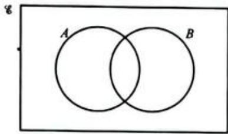

---

### 6 (练习题)

**题目**: 6 Make seven copies of this Venn diagram and shade the following sets:
a  $A\cup B$
b  $A\cup B\cup C$
AUB
d  $A\cap (B\cup C)$
e  $(A\cup B)\cap C$
f  $A\cup (B\cup C)$
g (A∩C)U(A∩B)

---

### 7 (练习题)

**题目**: 7 In a class of 30 students, 22 like classical music and 12 like Jazz. 5 like neither. Using a Venn diagram find out how many students like both classical and jazz music.

---

### 8 (练习题)

**题目**: Students in their last year at a school must study at least one of the three main sciences: biology, chemistry and physics. There are 180 students in the last year, of whom 84 study biology and chemistry only, 72 study chemistry and physics only and 81 study biology and physics only. 22 pupils study only biology, 21 study only chemistry and 20 study only physics. Use a Venn diagram to work out how many students study all three sciences.

---

### WORKED EXAMPLE 21 (例题)

**题目**: WORKED EXAMPLE 21
List the members of the set  $C$  if  $C = \{x: x \in \text{primes}, 10 < x < 20\}$ .

**解答**: Answer
Read the set as: 'C is the set of all x'such that x is a member of the set of primes and x is greater than 10 but less than 20'.
The prime numbers greater than 10 but less than 20 are 11, 13, 17 and 19.
So,  $C = \{11, 13, 17, 19\}$

---

### WORKED EXAMPLE 22 (例题)

**题目**: WORKED EXAMPLE 22
Express the following set in set builder notation:
$D =$  (right-angled triangles)

**解答**: Answer
So,  $D = \{x : x \text{ is a triangle,}$  If  $D$  is the set of all right-angled triangles, then  $x$  has a right-angle  $D$  is the set of all  $x$  such that  $x$  is a triangle and  $x$  is right-angled.

---

## 9 Sequences,surds and sets > 9.4 Sets > Exercise 9.13

### 1 (练习题)

**题目**: Exercise 9.13
1 Describe each of these sets using set builder notation.
a square numbers less than 101
b days of the week

---

### 1 (练习题)

**题目**: 1 Describe each of these sets using set builder notation.
a square numbers less than 101
b days of the week
c integers less than 0
d whole numbers between 2 and 10
e months of the year containing 30 days

---

### 2 (练习题)

**题目**: 2 Express each of the following in set builder notation.
a {2,3,4,5,6,7,8}
b {a,e,i,o,u}
c {n,i,c,h,o,l,a,s}
d {2,4,6,8,10,12,14,16,18,20}
e {1,2,3,4,6,9,12,18,36}

---

### 3 (练习题)

**题目**: 3 List the members of each of the following sets.
a  $\{x:x\text{is an integer,} 40 <   x <   50\}$
b  $\{x:x$  is a regular polygon and  $x$  has no more than six sides}
$\{x:x$  is a multiple of 3,  $16 <   x <   32\}$

---

### 4 (练习题)

**题目**: 4 If  $A = \{x : x \text{ is a multiple of three}\}$  and  $B = \{y : y \text{ is a multiple of five}\}$ , express  $A \cap B$  in set builder notation.

---

### 5 (练习题)

**题目**: 5  $\mathcal{C} = \{y:y\text{is positive,} y\text{is an integer less than 18}\}$
$$
A = \{w: w > 5 \} \text {a n d} B = \{x: x \leqslant 5 \}
$$
a List the members of the set:
$$
i A \cap B \quad \text {i i} \quad A ^ {\prime} \quad \text {i i i} \quad A ^ {\prime} \cap B \quad \text {i v} \quad A \cap B ^ {\prime} \quad \text {v} \quad (A \cap B ^ {\prime}) ^ {\prime}
$$
b What is  $A\cup B?$
c List the members of the set in part (b).

---

### 6 (练习题)

**题目**: 6 Describe each set in words and say why it's not possible to list all the members of each set.
a  $A = \{x,y:y = 2x + 4\}$
b  $B = \{x:x^3$  is negative}

---

### 1 (练习题)

**题目**: Practice questions
1 Pattern I
Pattern 2
Pattern 3

The first three patterns in a sequence are shown above.
a Copy and complete the table.
[Table Row] <tr><td>Pattern number (n)</td><td>1</td><td>2</td><td>3</td><td>4</td></tr>
[Table Row] <tr><td>Number of dots (d)</td><td>5</td><td></td><td></td><td></td></tr>
[2]
b Find a formula for the number of dots,  $d$  in the nth pattern. [3]
c Find the number of dots in the 60th pattern. [2]
d Find the number of the pattern that has 89 dots. [3]

---

### 2 (练习题)

**题目**: 2 The diagram below shows a sequence of patterns made from dots and lines.
I dot
2 dots
3 dots

a Draw the next pattern in the sequence.
[2]
b Copy and complete the table for the numbers of dots and lines.
[Table Row] <tr><td>Dots</td><td>1</td><td>2</td><td>3</td><td>4</td><td>5</td><td>6</td></tr>
[Table Row] <tr><td>Lines</td><td>4</td><td>7</td><td>10</td><td></td><td></td><td></td></tr>
[2]
c Find the number of lines in the pattern with 99 dots. [2]
d Find the number of lines are in the pattern with n dots. [3]
e Complete the following statement: There are 85 lines in the pattern with ... dots. [2]

---

### 3 (练习题)

**题目**: 3 Show that  $5\sqrt{2} - 2\sqrt{8}$  is equivalent to  $\sqrt{2}$ . [3]

---

### 4 (练习题)

**题目**: 4 Simplify  $\frac{3\sqrt{3} \times 5\sqrt{45}}{\sqrt{15}}$ . [4]

---

### 5 (练习题)

**题目**: 5 Write  $\frac{\sqrt{3}}{2} + \frac{7}{\sqrt{3}}$  as a single fraction with a rational denominator. [3]

---

### 6 (练习题)

**题目**: 6 The diagram shows a tile in the shape of a triangle. Find the area of the tile, giving your answer, as simply as possible, in the form  $a\sqrt{b}$ .

[4]

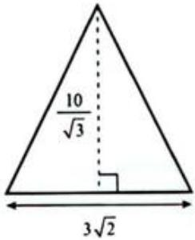

---

### 7 (练习题)

**题目**: 7 a Find integers  $a$  and  $b$ , such that  $(3 + 2\sqrt{5})^2 = a + b\sqrt{5}$ . [3]
b Find integers  $p$  and  $q$  , such that  $(3 + 2\sqrt{5})^{2} = p + \frac{q}{\sqrt{45}}$  [3]

---

### 8 (练习题)

**题目**: 8 Write this expression as a single fraction with a rational denominator.
$$
\frac {3}{4 + \sqrt {7}} + \frac {7}{4 - \sqrt {7}} \tag {4}
$$

---

### 9 (练习题)

**题目**: 
For the Venn diagram shown above, find:
a n(MnN) [1] b n(N) [1] c MUN [1] d M'nN [1]
e  $(\mathbf{M}\cap \mathbf{N})^{\prime}$  [1] f  $\mathbf{M}\cup \mathbf{N}^{\prime}$  [1] g  $\mathbf{M}^{\prime}\cup \mathbf{N}^{\prime}$  [1]

---

### 10 (练习题)

**题目**: 10 24 people live on Sport Street in Tennisville. 15 play cricket, 7 play rugby and 5 play neither. Find the number of Sports Street residents who play rugby but not cricket.

---

### 11 (练习题)

**题目**: 11 Write 3.0204 as a fraction in its lowest terms. [5]

---

### 12 (练习题)

**题目**: 12 Show that  $0.9 = 1$  [4]

---

### 13 (练习题)

**题目**: 13 Simplify  $0.3003 + 0.0330.$  [4]

---

### 14 (练习题)

**题目**: 14 107 students were asked how they travelled to school this morning:
- 53 had travelled by bus only
- 50 had not travelled on the bus.
78 had travelled by either bus or car or both.
Draw a Venn diagram to illustrate this and hence find how many had:
a not travelled by car [2]
b travelled by car only [2]
c used neither bus nor car. [2]

---

### 15 (练习题)

**题目**: 15  $\mathcal{E} = \{\mathrm{integers}\}$ $A = \{x:x$  is an integer and  $-4 <   x <   7\}$  and  $B = \{x:x$  is a positive multiple of three}.
a List the elements of set  $A$  [2]
b Find  $\mathfrak{n}(A\cap B)$  [3]
c Describe in words the set  $(A\cap B)^{\prime}$  [2]

---

### 16 (练习题)

**题目**: 16 Copy the diagram shown below twice and shade the sets indicated.

a  $(A\cap B)^{\prime}$  [2]
$(A\cup B^{\prime})^{\prime}\cup (A\cap B)$  [3]

---

### 17 (练习题)

**题目**: 17 The rule for a sequence is given as  $u_{n + 2} = u_{n + 1} + u_n$ .
a Given that  $u_{1} = u_{2} = 1$  , list the first eight terms of this sequence. [2]
b What is the sequence called? [1]
In which position is the number 233 in this sequence? [2]

---

### 18 (练习题)

**题目**: 18 For the sequence  $u_{n} = \frac{1}{2} n(n + 1)$ :
a list the first five terms [2]
b identify the special sequence of numbers [1]
find the value of  $n$  for  $u_{n} = 210$  [3]
d write an expression for  $u_{n - 1}$  [2]

---

## 10 Straight lines and quadratic equations

### 1 (练习题)

**题目**: 1 A table of values gives a set of ordered pairs  $(x, y)$  that you can use to plot graphs on a coordinate grid.
[Table Row] <tr><td>x</td><td>-1</td><td>0</td><td>1</td><td>2</td></tr>
[Table Row] <tr><td>y</td><td>3</td><td>4</td><td>5</td><td>6</td></tr>
Plot these points and draw a line through them.

---

### 2 (练习题)

**题目**: 2 The standard equation of a straight line graph is  $y = mx + c$ .
-  $m$  is the gradient (or steepness) of the graph.
- c is the point where the graph crosses the y-axis (the y-intercept).
a What is the relationship between the x- and y-values in the table in question 1?
b What equation could you use to describe the line you get when you plot the points?

---

### 3 (练习题)

**题目**: 3 Look at the graph. Calculate the gradient, find the  $y$ -intercept and use these to write the equation of the straight line.

---

## 10 Straight lines and quadratic equations > 10.1 Straight line graphs

### WORKED EXAMPLE 1 (例题)

**题目**: WORKED EXAMPLE 1
A straight line has equation  $y = 2x + 3$ . Construct a table of values for  $x$  and  $y$  and draw the line on a labelled pair of axes. Use integer values of  $x$  from -3 to 2.

**解答**: Answer
Substituting the values  $-3, -2, -1, 0, 1$  and 2 into the equation gives the values in the following table:
[Table Row] <tr><td>x</td><td>-3</td><td>-2</td><td>-1</td><td>0</td><td>1</td><td>2</td></tr>
[Table Row] <tr><td>y</td><td>-3</td><td>-1</td><td>1</td><td>3</td><td>5</td><td>7</td></tr>
Notice that the  $y$ -values range from  $-3$  to  $7$ , so your  $y$ -axis should allow for this.

---

### WORKED EXAMPLE 2 (例题)

**题目**: WORKED EXAMPLE 2
Draw the line with equation  $y = -x + 3$  for  $x$ -values from -2 to 5.

**解答**: Answer
The table for this line is:
[Table Row] <tr><td>x</td><td>-2</td><td>-1</td><td>0</td><td>1</td><td>2</td><td>3</td><td>4</td><td>5</td></tr>

---

## 10 Straight lines and quadratic equations > 10.1 Straight line graphs > Exercise 10.1

### 1 (练习题)

**题目**: 1 Make a table for  $x$  -values from  $-3$  to 3 for each of the following equations. Plot the coordinates on separate pairs of axes and draw the lines.
a  $y = {3x} + 2$
b  $y = x + 2$
$y = 2x - 1$
d  $y = 5x - 4$
e  $y = -2x + 1$
f  $y = -x - 2$
$y = 6 - x$
[y = {3x} + \frac{1}{2}]
i  $y = \frac{1}{2} x + 1$
j  $y = 4x$
k  $y = -3$
$y =  - 1 - x$
m  $x + y = 4$
n  $x - y = 2$
$y = x$
P  $y = -x$

---

### 2 (练习题)

**题目**: 2 Plot the lines  $y = 2x, y = 2x + 1, y = 2x - 3$  and  $y = 2x + 2$  on the same pair of axes. Use  $x$ -values from -3 to 3. What do you notice about the lines that you have drawn?

---

### 3 (练习题)

**题目**: 3 For each of the following equations, construct a table of  $x$ -values for -3, 0 and 3. Complete the table of values and plot the graphs on the same set of axes.
a  $y = x + 2$
b  $y = -x + 2$
c  $y = x - 2$
d  $y = -x - 2$

---

### 4 (练习题)

**题目**: 4 Use your graphs from question 3 above to answer these questions.
Where do the graphs cut the  $x$  -axis?
b Which graphs slope up to the right?
c Which graphs slope down to the right?
d Which graphs cut the  $y$  -axis at (0, 2)?
e Which graphs cut the  $y$  -axis at  $(0, - 2)?$
f Does the point (3, 3) lie on any of the graphs? If so, which?
9 Which graphs are parallel to each other?
h Compare the equations of graphs that are parallel to each other. How are they similar? How are they different?

---

## 10 Straight lines and quadratic equations > 10.1 Straight line graphs > Exercise 10.2

### 1 (练习题)

**题目**: 1 Write down the equation of each line shown in the diagram.

---

### 2 (练习题)

**题目**: 2 Draw the following graphs on the same set of axes without plotting points or drawing a table of values.
a  $y = 3$
b  $x = 3$
c  $y = -1$
d  $x = -1$
e  $y = -3$
f  $y = 4$
g  $x = \frac{1}{2}$
h  $x = -\frac{7}{2}$
A graph parallel to the  $x$  -axis which cuts the  $y$  -axis at (0, 4).
A graph parallel to the  $y$  -axis which goes through the point  $(-2,0)$

---

### 3 (例题)

**题目**: WORKED EXAMPLE 3
Calculate the gradient of each line. Leave your answer as a whole number or fraction in its lowest terms.

**解答**: Answers
a Notice that the graph passes through the points (2, 4) and (4, 10).
$$
G r a d i e n t = \frac {y - c h a n g e}{x - c h a n g e} = \frac {1 0 - 4}{4 - 2} = \frac {6}{2} = 3
$$
b Notice that the graph passes through the points (2, 1) and (4, 0).
$$
G r a d i e n t = \frac {y - c h a n g e}{x - c h a n g e} = \frac {0 - 1}{4 - 2} = - \frac {1}{2}
$$

---

### 4 (例题)

**题目**: WORKED EXAMPLE 4
Calculate the gradient of the line that passes through the points (3, 5) and (7, 17).

**解答**: Think about where the points will be, in relation to each other, on a pair of axes. You don't need to draw this accurately, but the diagram will give you an idea of how the line may appear. Gradient  $= \frac{12}{4} = 3$

---

## 10 Straight lines and quadratic equations > 10.1 Straight line graphs > Exercise 10.3

### 1 (练习题)

**题目**: Exercise 10.3
1 Calculate the gradient of each line. Leave your answer as a whole number or a fraction in its lowest terms.

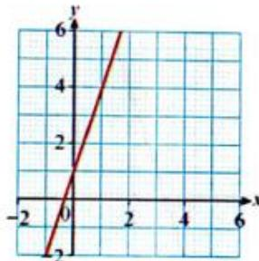

---

### 2 (练习题)

**题目**: 2 Calculate the gradient of the line that passes through each pair of points. Leave your answer as a whole number or a fraction in its lowest terms.
a  $A(1,2)$  and  $B(3,8)$
b  $A(0,6)$  and  $B(3,9)$
A(2,-1) and  $B(4,3)$
d  $A(3,2)$  and  $B(7, - 10)$
A(-1,-4) and B(-3,2)
f  $A(3, - 5)$  and  $B(7,12)$

---

### 3 (练习题)

**题目**: 3 If the car climbs  $60\mathrm{m}$  vertically, how far must the car have travelled horizontally?

---

### WORKED EXAMPLE 5 (例题)

**题目**: WORKED EXAMPLE 5
Find the gradient and  $y$ -intercept of the lines given by each of the following equations.
a  $y = 3x + 4$
b  $y = 5 - 3x$
$y = \frac{1}{2} x + 9$
d  $x + y = 8$
e  $3x + 2y = 6$

**解答**: Answers
a  $y = 3x + 4$
Gradient = 3
The coefficient of  $x$  is 3.
y-intercept = 4
The constant term is 4.
b  $y = 5 - 3x$
Re-write the equation as  $y = -3x + 5$ .
Gradient = -3
The coefficient of  $x$  is -3.
y-intercept = 5
The constant term is 5.
c  $y = \frac{1}{2} x + 9$
Gradient  $= \frac{1}{2}$
y-intercept = 9
The gradient can be a fraction.
d  $x + y = 8$
Subtract  $x$  from both sides to make  $y$  the subject:  $y = -x + 8$
Gradient  $= -1$
y-intercept = 8
e  $3x + 2y = 6$
Gradient  $= -\frac{3}{2}$
y-intercept = 3
Make y the subject of the equation:
$3x + 2y = 6$
$2y = -3x + 6$
$$
y = - \frac {3}{2} x + \frac {6}{2}
$$
$$
y = - \frac {3}{2} x + 3
$$

---

### WORKED EXAMPLE 6 (例题)

**题目**: WORKED EXAMPLE 6
Find the equation of each line.
a

b

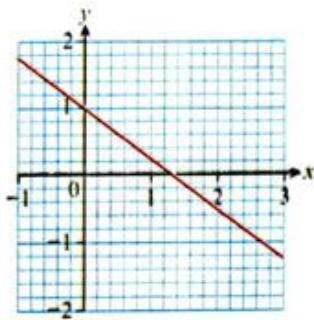

**解答**: Answers
a Gradient  $= 6$  and the  $y$  -intercept  $= -1$
So the equation is  $y = 6x - 1$
b Gradient  $= -\frac{3}{4}$  and the  $y$ -intercept  $= 1$
So the equation is  $y = -\frac{3}{4} x + 1$
Gradient  $= \frac{6}{1} = 6$
Graph crosses y-axis at -1.
Gradient  $= -\frac{1.5}{2} = -\frac{3}{4}$
Graph crosses y-axis at 1.

---

## 10 Straight lines and quadratic equations > 10.1 Straight line graphs > Exercise 10.4

### 1 (练习题)

**题目**: Exercise 10.4
1 Find the gradient and  $y$ -intercept of the lines with the following equations. Sketch the graph in each case, taking care to show where the graph cuts the  $y$ -axis.
a  $y = 4x - 5$
b  $y = 2x + 3$
$y = -3x - 2$
d  $y = -x + 3$
e  $y = \frac{1}{3} x + 2$
$y = 6 - \frac{1}{4}x$

---

### 2 (练习题)

**题目**: 2 Sketch the graph of each equation. Show where the graph cuts the  $y$ -axis.
a  $x + y = 4$
b  $x + 2y = 4$
$x + \frac{y}{2} = 3$
d  $x = 4y - 2$

---

### 1 (练习题)

**题目**: 1 Find the gradient and  $y$ -intercept of the lines with the following equations. Sketch the graph in each case, taking care to show where the graph cuts the  $y$ -axis.
a  $y = 4x - 5$

---

### 2 (练习题)

**题目**: 1 Find the gradient and  $y$ -intercept of the lines with the following equations. Sketch the graph in each case, taking care to show where the graph cuts the  $y$ -axis.
b  $y = 2x + 3$

---

### 3 (练习题)

**题目**: 1 Find the gradient and  $y$ -intercept of the lines with the following equations. Sketch the graph in each case, taking care to show where the graph cuts the  $y$ -axis.
$y = -3x - 2$

---

### 4 (练习题)

**题目**: 1 Find the gradient and  $y$ -intercept of the lines with the following equations. Sketch the graph in each case, taking care to show where the graph cuts the  $y$ -axis.
d  $y = -x + 3$

---

### 5 (练习题)

**题目**: 1 Find the gradient and  $y$ -intercept of the lines with the following equations. Sketch the graph in each case, taking care to show where the graph cuts the  $y$ -axis.
e  $y = \frac{1}{3} x + 2$

---

### 6 (练习题)

**题目**: 1 Find the gradient and  $y$ -intercept of the lines with the following equations. Sketch the graph in each case, taking care to show where the graph cuts the  $y$ -axis.
$y = 6 - \frac{1}{4}x$

---

### 7 (练习题)

**题目**: 2 Sketch the graph of each equation. Show where the graph cuts the  $y$ -axis.
a  $x + y = 4$

---

### 8 (练习题)

**题目**: 2 Sketch the graph of each equation. Show where the graph cuts the  $y$ -axis.
b  $x + 2y = 4$

---

### 9 (练习题)

**题目**: 2 Sketch the graph of each equation. Show where the graph cuts the  $y$ -axis.
$x + \frac{y}{2} = 3$

---

### 10 (练习题)

**题目**: 2 Sketch the graph of each equation. Show where the graph cuts the  $y$ -axis.
d  $x = 4y - 2$

---

### 11 (练习题)

**题目**: 2 Sketch the graph of each equation. Show where the graph cuts the  $y$ -axis.
$x = \frac{y}{4} + 2$

---

### 12 (练习题)

**题目**: 2 Sketch the graph of each equation. Show where the graph cuts the  $y$ -axis.
${2x} - {3y} =  - 9$

---

### 13 (练习题)

**题目**: 3 Rearrange each equation so that it is in the form  $y = mx + c$  and then find the gradient and  $y$ -intercept of each graph.
a  $2y = x - 4$

---

### 14 (练习题)

**题目**: 3 Rearrange each equation so that it is in the form  $y = mx + c$  and then find the gradient and  $y$ -intercept of each graph.
b  $2x + y - 1 = 0$

---

### 15 (练习题)

**题目**: 3 Rearrange each equation so that it is in the form  $y = mx + c$  and then find the gradient and  $y$ -intercept of each graph.
$x = \frac{y}{2} -2$

---

### 16 (练习题)

**题目**: 3 Rearrange each equation so that it is in the form  $y = mx + c$  and then find the gradient and  $y$ -intercept of each graph.
${2x} - y - 5 = 0$

---

### 17 (练习题)

**题目**: 3 Rearrange each equation so that it is in the form  $y = mx + c$  and then find the gradient and  $y$ -intercept of each graph.
e  $2x - y + 5 = 0$

---

### 18 (练习题)

**题目**: 3 Rearrange each equation so that it is in the form  $y = mx + c$  and then find the gradient and  $y$ -intercept of each graph.
$x + 3y - 6 = 0$

---

### 19 (练习题)

**题目**: 3 Rearrange each equation so that it is in the form  $y = mx + c$  and then find the gradient and  $y$ -intercept of each graph.
$4y = 12x - 8$

---

### 20 (练习题)

**题目**: 3 Rearrange each equation so that it is in the form  $y = mx + c$  and then find the gradient and  $y$ -intercept of each graph.
4x+y=2

---

### 21 (练习题)

**题目**: 3 Rearrange each equation so that it is in the form  $y = mx + c$  and then find the gradient and  $y$ -intercept of each graph.
$y = x + 2$

---

### 22 (练习题)

**题目**: 3 Rearrange each equation so that it is in the form  $y = mx + c$  and then find the gradient and  $y$ -intercept of each graph.
$j\;\frac{y}{3} = {2x} - 4$

---

### 23 (练习题)

**题目**: 3 Rearrange each equation so that it is in the form  $y = mx + c$  and then find the gradient and  $y$ -intercept of each graph.
$k\frac{x}{2} - {4y} = {12}$

---

### 24 (练习题)

**题目**: 3 Rearrange each equation so that it is in the form  $y = mx + c$  and then find the gradient and  $y$ -intercept of each graph.
$- \frac{y}{3} = {4x} - 2$

---

### 25 (练习题)

**题目**: 4 Find the equation (in the form  $y = mx + c$ ) of a line which has:
a a gradient of 2 and a y-intercept of 3

---

### 26 (练习题)

**题目**: 4 Find the equation (in the form  $y = mx + c$ ) of a line which has:
b a gradient of -3 and a  $y$  -intercept of -2

---

### 27 (练习题)

**题目**: 4 Find the equation (in the form  $y = mx + c$ ) of a line which has:
a gradient of 3 and a  $y$  -intercept of -1

---

### 28 (练习题)

**题目**: 4 Find the equation (in the form  $y = mx + c$ ) of a line which has:
d a  $y$  -intercept of -0.75 and a gradient of 0.75

---

### 29 (练习题)

**题目**: 4 Find the equation (in the form  $y = mx + c$ ) of a line which has:
e a  $y$  -intercept of -2 and a gradient of 0

---

### 30 (练习题)

**题目**: 4 Find the equation (in the form  $y = mx + c$ ) of a line which has:
a gradient of 0 and a  $y$  -intercept of 4.

---

### 31 (练习题)

**题目**: 5 Find the equation (in the form  $ax + by = c$ ) of a line which has:
a a gradient of  $-\frac{3}{2}$  and a  $y$ -intercept at  $(0, -0.5)$

---

### 32 (练习题)

**题目**: 5 Find the equation (in the form  $ax + by = c$ ) of a line which has:
b a  $y$  -intercept of 2 and a gradient of  $-\frac{3}{4}$

---

### 33 (练习题)

**题目**: 5 Find the equation (in the form  $ax + by = c$ ) of a line which has:
a y-intercept of -3 and a gradient of  $\frac{4}{8}$

---

### 34 (练习题)

**题目**: 6 Find an equation for each line.
a

---

### 35 (练习题)

**题目**: 6 Find an equation for each line.
b

---

### 36 (练习题)

**题目**: 6 Find an equation for each line.
C

---

### 37 (练习题)

**题目**: 6 Find an equation for each line.
d

---

### 38 (练习题)

**题目**: 6 Find an equation for each line.
e

---

### 39 (练习题)

**题目**: 6 Find an equation for each line.
f

---

### 40 (练习题)

**题目**: 6 Find an equation for each line.
9

---

### 41 (练习题)

**题目**: 6 Find an equation for each line.
h

---

### 42 (练习题)

**题目**: 6 Find an equation for each line.
i

---

### 43 (练习题)

**题目**: 7 Find the equation of the line which passes through each pair of points.
a  $A(2,3)$  and  $B(4,11)$

---

### 44 (练习题)

**题目**: 7 Find the equation of the line which passes through each pair of points.
b  $A(4,5)$  and  $B(8, - 7)$

---

### 45 (练习题)

**题目**: 7 Find the equation of the line which passes through each pair of points.
A(-1,-3) and  $B(4,6)$

---

### 46 (练习题)

**题目**: 7 Find the equation of the line which passes through each pair of points.
d  $A(3, - 5)$  and  $B(7,12)$

---

### 47 (练习题)

**题目**: 8 Write down the equation of a line that is parallel to:
a  $y = -3x$

---

### 48 (练习题)

**题目**: 8 Write down the equation of a line that is parallel to:
b  $y = 2x - 3$

---

### 49 (练习题)

**题目**: 8 Write down the equation of a line that is parallel to:
$y = \frac{x}{2} + 4$

---

### 50 (练习题)

**题目**: 8 Write down the equation of a line that is parallel to:
d  $y = -x - 2$

---

### 51 (练习题)

**题目**: 8 Write down the equation of a line that is parallel to:
$x = 8$

---

### 52 (练习题)

**题目**: 8 Write down the equation of a line that is parallel to:
f  $y = -6$

---

### 53 (练习题)

**题目**: 9 Which of the following lines are parallel to  $y = \frac{1}{2} x$ ?
a  $y = \frac{1}{2} x + 1$

---

### 54 (练习题)

**题目**: 9 Which of the following lines are parallel to  $y = \frac{1}{2} x$ ?
b  $y = 2x$

---

### 55 (练习题)

**题目**: 9 Which of the following lines are parallel to  $y = \frac{1}{2} x$ ?
$y + 1 = \frac{1}{2} x$

---

### 56 (练习题)

**题目**: 9 Which of the following lines are parallel to  $y = \frac{1}{2} x$ ?
d  $2y + x = -6$

---

### 57 (练习题)

**题目**: 9 Which of the following lines are parallel to  $y = \frac{1}{2} x$ ?
$y = 2x - 4$

---

### 58 (练习题)

**题目**: 10 Find the equation of a line parallel to  $y = 2x + 4$  which:
has a  $y$  -intercept of -2

---

### 59 (练习题)

**题目**: 10 Find the equation of a line parallel to  $y = 2x + 4$  which:
b passes through the origin.

---

### 60 (练习题)

**题目**: 10 Find the equation of a line parallel to  $y = 2x + 4$  which:
c passes through the point  $(0, - 4)$

---

### 61 (练习题)

**题目**: 10 Find the equation of a line parallel to  $y = 2x + 4$  which:
has a  $y$  -intercept of  $\frac{1}{2}$

---

### 11 (练习题)

**题目**: 11 A graph has the equation  $3y - 2x = 9$
a Write down the equation of one other graph that is parallel to this one.
b Write down the equation of one other graph that crosses the  $y$ -axis at the same point as this one.
c Write down the equation of a line that passes through the  $y$ -axis at the same point as this one and which is parallel to the  $x$ -axis.

---

### 7 (练习题)

**题目**: 7 Find the equation of the line which passes through each pair of points.
a  $A(2,3)$  and  $B(4,11)$
b  $A(4,5)$  and  $B(8, - 7)$
A(-1,-3) and  $B(4,6)$
d  $A(3, - 5)$  and  $B(7,12)$

---

### 8 (练习题)

**题目**: 8 Write down the equation of a line that is parallel to:
a  $y = -3x$
b  $y = 2x - 3$
$y = \frac{x}{2} + 4$
d  $y = -x - 2$
$x = 8$
f  $y = -6$

---

### 9 (练习题)

**题目**: 9 Which of the following lines are parallel to  $y = \frac{1}{2} x$ ?
a  $y = \frac{1}{2} x + 1$
b  $y = 2x$
$y + 1 = \frac{1}{2} x$
d  $2y + x = -6$
$y = 2x - 4$

---

### 10 (练习题)

**题目**: 10 Find the equation of a line parallel to  $y = 2x + 4$  which:
has a  $y$  -intercept of -2
b passes through the origin.
c passes through the point  $(0, - 4)$
has a  $y$  -intercept of  $\frac{1}{2}$

---

### WORKED EXAMPLE 7 (例题)

**题目**: WORKED EXAMPLE 7
Given that  $y = \frac{2}{3} x + 2$ , determine the equation of the straight line that is:
a perpendicular to this line and which passes through the origin.
b perpendicular to this line and which passes through the point  $(-3,1)$ .

**解答**: Answers
a  $y = mx + c$
$$
\begin{array}{l} m = - \frac {3}{2} \\ c = 0 \\ \end{array}
$$
The gradient is the negative reciprocal
$$
\text {o f} \frac {2}{3}.
$$
The equation of the line is
$$
y = - \frac {3}{2} x.
$$
b  $y = -\frac{3}{2} x + c$
$$
\begin{array}{l} x = - 3 \text {a n d} y = 1 \\ 1 = - \frac {3}{2} (- 3) + c \\ 1 = \frac {9}{2} + c \\ c = - 3 \frac {1}{2} \\ y = - \frac {3}{2} x - 3 \frac {1}{2} \\ \end{array}
$$
Using  $m = -\frac{3}{2}$  from part (a).
Substitute the values of  $x$  and  $y$  for the
given point to solve for  $c$ .

---

## 10 Straight lines and quadratic equations > 10.1 Straight line graphs > Exercise 10.5

### 1 (练习题)

**题目**: 1 A line perpendicular to  $y = \frac{x}{5} + 3$  passes through (1, 3).
What is the equation of the line?

---

### 2 (练习题)

**题目**: 2 Show that the line through the points  $A(6,0)$  and  $B(0,12)$  is:
a perpendicular to the line through  $P(8,10)$  and  $O(4,8)$
b perpendicular to the line through  $M(-4, - 8)$  and  $N\left(-1, - \frac{13}{2}\right)$

---

### 3 (练习题)

**题目**: 3 Given  $A(0,0)$  and  $B(1,3)$ , find the equation of the line perpendicular to  $AB$  with a  $y$ -intercept of 5.

---

### 4 (练习题)

**题目**: 4 Find the equation of the following lines:
a perpendicular to  $2x - y - 1 = 0$  and passing through  $\left(2, - \frac{1}{2}\right)$
b perpendicular to  $2x + 2y = 5$  and passing through  $(1, -2)$ .

---

### 5 (练习题)

**题目**: 5 Line  $A$  joins the points (6, 0) and (0, 12) and line  $B$  joins the points (8, 10) and (4, 8). Determine the gradient of each line and state whether line  $A$  is perpendicular to line  $B$ .

---

### 6 (练习题)

**题目**: 6 Show that points  $A(-3, 6)$ ,  $B(-12, -4)$  and  $C(8, -5)$  cannot be the vertices of a rectangle  $ABCD$ .

---

### 7 (练习题)

**题目**: 7 Find the equation of the line that is the perpendicular bisector of the line joining the following points.
a (7,4) and (2,5)
b (3, -3) and (1, -1)
c (4, -2) and (4, 4)

---

### 8 (练习题)

**题目**: 8 A line is drawn from  $P(1,3)$  to  $Q(-3,5)$ . Find the equation of line  $MN$ , the perpendicular bisector of  $PQ$ . Give your answer in the form  $ax + by + c = 0$ , where  $a, b$  and  $c$  are integers.

---

### WORKED EXAMPLE 8 (例题)

**题目**: WORKED EXAMPLE 8
Find the  $x$ - and  $y$ -intercepts for each of the following lines. Sketch the graph in each case.
a  $y = 6x - 12$
b  $y = -x + 3$
$2x + 5y = 20$

**解答**: Answers
a  $y = 6x - 12$
$$
\begin{array}{l} x = 0 \Rightarrow y = - 1 2 \\ y = 0 \Rightarrow 6 x - 1 2 = 0 \\ \Rightarrow x = 2 \\ \end{array}
$$

---

## 10 Straight lines and quadratic equations > 10.1 Straight line graphs > Exercise 10.6

### 1 (练习题)

**题目**: 1 Find the  $x$ - and  $y$ -intercepts for each of the following lines. Sketch the graph in each case.
a  $y = -5x + 10$
b  $y = \frac{x}{3} - 1$
$y = -3x + 6$
d  $y = 4x + 2$
$y = 3x + 1$
f  $y = -x + 2$
g  $y = 2x - 3$
2x 1 h y=3-1
$y = \frac{x}{4} - 2$
j  $y - \frac{2x}{5} = +1$
[ - 2 + y = \frac{x}{4}]
y 4x-2 3

---

### 2 (练习题)

**题目**: 2 For each equation the given point lies on the graph. Find each value of  $c$ .
a  $y = 3x + c$  (1,5)
b  $y = 6x + c$  (1,2)
$y = -2x + c$  (-3，-3)
d  $y = \frac{3}{4} x + c$  (4,-5)
$y = \frac{1}{2} x + c (-2,3)$
f  $y = c - \frac{1}{2} x$  (-4,5)
g  $y = c + 4x$  （-1，-6）
2 2x+c=y (3,4) 3

---

### WORKED EXAMPLE 9 (例题)

**题目**: Find the distance between the points (1, 1) and (7, 9).

**解答**: Answer
$$
\begin{array}{l} a ^ {2} = 8 ^ {2} + 6 ^ {2} \\ a ^ {2} = b ^ {2} + c ^ {2} (\text {P y t h a g o r a s} ^ {\prime} \text {t h e o r e m}) \\ \end{array}
$$
$$
a ^ {2} = 6 4 + 3 6
$$
Work out each expression.
$$
a ^ {2} = 1 0 0
$$
$$
\therefore a = \sqrt {1 0 0}
$$
Undo the square by taking the square root of both sides.
$$
a = 1 0 \text {u n i t s}
$$

---

### WORKED EXAMPLE 10 (例题)

**题目**: WORKED EXAMPLE 10
Given  $A(3,6)$  and  $B(7,3)$ , find the length of  $AB$ .

**解答**: Answer
$$
A B ^ {2} = A C ^ {2} + C B ^ {2}
$$
$$
a ^ {2} = b ^ {2} + c ^ {2} (\text {P y t h a g o r a s} ^ {\prime} \text {t h e o r e m})
$$
$$
A B ^ {2} = 3 ^ {2} + 4 ^ {2}
$$
Work out each expression.
$$
\begin{array}{l} = 9 + 1 6 \\ = 2 5 \\ \end{array}
$$
$$
\therefore A B = \sqrt {2 5} = 5 \text {u n i t s}
$$

---

## 10 Straight lines and quadratic equations > 10.1 Straight line graphs > Exercise 10.7

### 1 (练习题)

**题目**: 1 Find the length and the coordinates of the midpoint of the line segment joining each pair of points.
a (3,6) and (9,12)
b (4, 10) and (2, 6)
(8,3) and (4,7)
d (5,8) and (4,11)
(4,7) and (1,3)
f (12,3) and (11,4)
9 (-1,2) and (3,5)
h (4, -1) and (5, 5)
(-2, -4) and (-3, 7)

---

### 2 (练习题)

**题目**: 2 Use the graph to find the length and the midpoint of each line segment.

---

### 3 (练习题)

**题目**: 3 Find the distance from the origin to the point  $(-3, -5)$ .

---

### 4 (练习题)

**题目**: 4 Which of the points  $A(5,6)$  or  $B(5,3)$  is closer to point  $C(-3,2)$ ?

---

### 5 (练习题)

**题目**: 5 Which is further from the origin,  $A(4,2)$  or  $B(-3, - 4)$

---

### 6 (练习题)

**题目**: 6 Triangle  $ABC$  has vertices at points  $A(0,0)$ ,  $B(4, -5)$  and  $C(-3, -3)$ . Find the length of each side.

---

### 7 (练习题)

**题目**: 7 The midpoint of the line segment joining  $(10,a)$  and  $(4,3)$  is  $(7,5)$ . What is the value of  $a$ ?

---

### 8 (练习题)

**题目**: 8 The midpoint of line segment  $DE$  is  $(-4,3)$ . If point  $D$  has coordinates  $(-2,8)$ , what are the coordinates of  $E$ ?

---

## 10 Straight lines and quadratic equations > 10.2 Quadratic expressions and equations

### WORKED EXAMPLE 11 (例题)

**题目**: WORKED EXAMPLE 11
Expand and simplify.
a  $(x + 2)(x + 9)$
b (x-7)(x+6)
c (2x-1)(x+9)

**解答**: Answers
a  $\left( {x + 2}\right) \left( {x + 9}\right)$
$x^{2} + 9x + 2x + 18$
$= x^{2} + 11x + 18$
In this version of the
method you will notice that the arrows have not been included and the multiplication 'arcs' have been arranged so that the are symmetrical and easy to remember.
b x -7 x x² -7x +6 6x -42
$x^{2} - 7x + 6x - 42$
$= x^{2} - x - 42$
The grid method with a
negative value.
c (2x-1)(x+9)
First:  $2x + x = 2x^{2}$
Outside:  $2x \times 9 = 18x$

---

## 10 Straight lines and quadratic equations > 10.2 Quadratic expressions and equations > Exercise 10.8

### 1 (练习题)

**题目**: 1 Expand and simplify each of the following.
[ \Rightarrow  \left( {x + 3}\right) \left( {x + 1}\right)  = 0]

---

### 2 (练习题)

**题目**: b (x+6)(x+4)

---

### 3 (练习题)

**题目**: c  $(x + 9)(x + 10)$

---

### 4 (练习题)

**题目**: $\left( {x + 3}\right) \left( {x + {12}}\right)$

---

### 5 (练习题)

**题目**: $\left( {x + 1}\right) \left( {x + 1}\right)$

---

### 6 (练习题)

**题目**: f (x+5)(x+4)

---

### 7 (练习题)

**题目**: $\left( {x + 4}\right) \left( {x - 7}\right)$

---

### 8 (练习题)

**题目**: h (x-3)(x+8)

---

### 9 (练习题)

**题目**: （x-1)(x+1)

---

### 10 (练习题)

**题目**: j (x-9)(x+8)

---

### 11 (练习题)

**题目**: k (x-6)(x-7)

---

### 12 (练习题)

**题目**: （x-13）（x+4）

---

### 13 (练习题)

**题目**: m  $(y + 3)(y - 14)$

---

### 14 (练习题)

**题目**: n (z+8)(z-8)

---

### 15 (练习题)

**题目**: （t+17)(t-4)

---

### 16 (练习题)

**题目**: $\left( {h - 3}\right) \left( {h - 3}\right)$

---

### 17 (练习题)

**题目**: q  $\left(g - \frac{1}{2}\right)(g + 4)$

---

### 18 (练习题)

**题目**: （d+）（d-）

---

### 2 (练习题)

**题目**: 2 Find the following products.
a  $(4 - x)(3 - x)$

---

### 3 (练习题)

**题目**: b  $(3 - 2x)(1 + 3x)$

---

### 4 (练习题)

**题目**: c  $(3m - 7)(2m - 1)$

---

### 5 (练习题)

**题目**: d  $(2x + 1)(3 - 4x)$

---

### 6 (练习题)

**题目**: (4a-2b)(2a+b)

---

### 7 (练习题)

**题目**: f (2m-n)(-3n-4m)

---

### 8 (练习题)

**题目**: g  $\left(x + \frac{1}{2}\right)\left(x + \frac{1}{4}\right)$

---

### 9 (练习题)

**题目**: h  $(2x + \frac{1}{3})(x - \frac{1}{2})$

---

### 10 (练习题)

**题目**: (7-9b)(4b+6)

---

### 11 (练习题)

**题目**: j (3x-3)(5+2x)

---

### 12 (练习题)

**题目**: k  $(3x^{2} + 1)(2x + 3)$

---

### 13 (练习题)

**题目**: (5x²-1)(3x²-3)

---

### 3 (练习题)

**题目**: 3 Expand and simplify each of the following.
a  $\left( {{2x} + 3}\right) \left( {x + 3}\right)$

---

### 4 (练习题)

**题目**: b (3y+7)(y+1)

---

### 5 (练习题)

**题目**: c  $(7z + 1)(z + 2)$

---

### 6 (练习题)

**题目**: d (t+5)(4t-3)

---

### 7 (练习题)

**题目**: (2w-7)(w-8)

---

### 8 (练习题)

**题目**: f (4g-1)(4g+1)

---

### 9 (练习题)

**题目**: g (8x-1)(9x+4)

---

### 10 (练习题)

**题目**: h (20c-3)(18c-4)

---

### 11 (练习题)

**题目**: (2m-4)(3-m)

---

### 4 (练习题)

**题目**: 4 Expand and simplify each of the following.
a  $(2x^{2} - 4y)(y - x^{2})$

---

### 5 (练习题)

**题目**: b  $(x + y)(2y^{2} - 4x^{3})$

---

### 6 (练习题)

**题目**: c  $(3x^{2} - y)(2x + 3y)$

---

### 5 (练习题)

**题目**: 5 Expand and simplify.

---

## 10 Straight lines and quadratic equations > 10.2 Quadratic expressions and equations

### WORKED EXAMPLE 12 (例题)

**题目**: WORKED EXAMPLE 12
Expand and simplify  $(3x + 2)(2x + 1)(x - 1)$ .

**解答**: Answers
$$
\begin{array}{l} (3 x + 2) (2 x + 1) (x - 1) \\ = (6 x ^ {2} + 4 x + 3 x + 2) (x - 1) \\ = (6 x ^ {2} + 7 x + 2) (x - 1) \\ = 6 x ^ {3} + 7 x ^ {2} + 2 x - 6 x ^ {2} - 7 x - 2 \\ = 6 x ^ {3} + x ^ {2} - 5 x - 2 \\ \end{array}
$$
Expand the first two brackets.
Collect like terms.
Multiply each term in the first bracket by each term in the second.
Collect like terms to simplify.

---

## 10 Straight lines and quadratic equations > 10.2 Quadratic expressions and equations > Exercise 10.9

### 1 (练习题)

**题目**: 1 Find the square of each binomial. Try to do this by inspection first and then check your answers.
a  $(x - y)^2$

---

### 2 (练习题)

**题目**: b (a+b)²

---

### 3 (练习题)

**题目**: c  $(2x + 3y)^2$

---

### 4 (练习题)

**题目**: d  $(3x - 2y)^2$

---

### 6 (练习题)

**题目**: f (y-4x²)²

---

### 7 (练习题)

**题目**: g (x² - y²)²

---

### 8 (练习题)

**题目**: h (2+y)²

---

### 9 (练习题)

**题目**: i  $(-2x - 4y^{2})^{2}$

---

### 10 (练习题)

**题目**: j  $\left(\frac{1}{2x} -\frac{1}{4y}\right)^2$

---

### 11 (练习题)

**题目**: k  $\left(\frac{3x}{4} -\frac{y}{2}\right)^2$

---

### 12 (练习题)

**题目**: 1  $\left(a + \frac{1}{2} b\right)^{2}$

---

### 13 (练习题)

**题目**: m  $(-ab - c^4)^2$

---

### 14 (练习题)

**题目**: n  $(3x^{2}y - 1)^{2}$

---

### 15 (练习题)

**题目**: $\left(\frac{2x}{3} + 4y\right)^2$

---

### 16 (练习题)

**题目**: P[-(x-3)]²

---

### 2 (练习题)

**题目**: 2 Simplify.
a  $(x - 2)^2 -(x - 4)^2$

---

### 3 (练习题)

**题目**: b  $(x + 2)(x - 2) - (3 - x)(5 + x)$

---

### 4 (练习题)

**题目**: $(y + 2x)^2 +(2x - y)(-y + 2x)$

---

### 5 (练习题)

**题目**: d  $\frac{1}{2} (3x - 2)\left(\frac{x}{3} +2\right)$

---

### 6 (练习题)

**题目**: e  $3(x + 2)(2x + 0.6)$

---

### 7 (练习题)

**题目**: f (√2x-y)(√2x+y)-(4x-y)2

---

### 8 (练习题)

**题目**: g  $(x + 4)(x - 5) - 2(x - 1)^2$

---

### 9 (练习题)

**题目**: h  $(2x - y)^2 +(x - 2y)(x + 2y) - (x + 4y)^2$

---

### 10 (练习题)

**题目**: i  $-2x(x + 1)^2 -(x - 5)(-3x)$

---

### 11 (练习题)

**题目**: j  $(3 + 2x)^2 -5(5x + 2)$

---

### 3 (练习题)

**题目**: 3 Evaluate each expression when  $x = 4$
a  $(x + 7)(x - 7) - x^{2}$

---

### 4 (练习题)

**题目**: b  ${x}^{2} - \left( {x - 3}\right) \left( {x + 3}\right)$

---

### 5 (练习题)

**题目**: c  $(3 + 2x)^2 -(2x + 3)(2x - 3)$

---

### 6 (练习题)

**题目**: d (x+2)2

---

### 7 (练习题)

**题目**: e  $(x^{2} + 3)(x - 4)$

---

### 8 (练习题)

**题目**: f  $(2x + 3)^2 -4(x + 1)(2 - 3x)$

---

## 10 Straight lines and quadratic equations > 10.2 Quadratic expressions and equations > Exercise 10.10

### 1 (练习题)

**题目**: Factorise each of the following.
a  $x^{2} + 14x + 24$

---

### 1b (练习题)

**题目**: b  $x^{2} + 3x + 2$

---

### 1c (练习题)

**题目**: $x^{2} + 7x + 12$

---

### 1d (练习题)

**题目**: d  $x^{2} + 12x + 35$

---

### 1e (练习题)

**题目**: e  $x^{2} + 12x + 27$

---

### 1f (练习题)

**题目**: ${x}^{2} + {7x} + 6$

---

### 1g (练习题)

**题目**: g  $x^{2} + 11x + 30$

---

### 1h (练习题)

**题目**: h  $x^{2} + 10x + 16$

---

### 1i (练习题)

**题目**: i  $x^{2} + 11x + 10$

---

### 1j (练习题)

**题目**: j  $x^{2} + 8x + 7$

---

### 1k (练习题)

**题目**: k  $x^{2} + 24x + 80$

---

### 1l (练习题)

**题目**: x²+13x+42

---

### 2 (练习题)

**题目**: 2 Factorise each of the following.
a  $x^{2} - 8x + 12$

---

### 2b (练习题)

**题目**: b  $x^{2} - 9x + 20$

---

### 2c (练习题)

**题目**: $x^{2} - 7x + 12$

---

### 2d (练习题)

**题目**: d  $x^{2} - 6x + 8$

---

## 10 Straight lines and quadratic equations > 10.2 Quadratic expressions and equations > Exercise 10.9

### 13 (例题)

**题目**: WORKED EXAMPLE 13
Expand and simplify.
a  $(x + 6)(x + 12)$
b  $(x + 4)(x - 13)$

**解答**: Answers
a  $(x + 6)(x + 12) = x^{2} + 18x + 72$
$6 + 12 = 18$  and  $6 \times 12 = 72$  so this gives  $18x$  and  $72$ .
b  $(x + 4)(x - 13) = x^{2} - 9x - 52$
$4 + -13 = -9$  and  $4 \times -13 = -52$  so this gives  $-9x$  and  $-52$ .

---

### 14 (例题)

**题目**: WORKED EXAMPLE 14
Factorise completely:
a  $x^{2} + 7x + 12$
b  $x^{2} - 6x - 16$
$x^{2} - 8x + 15$
d  $2x^{2} + 14x + 20$

**解答**: Answers
a  $12 = 1\times 12$
You need two numbers that multiply to give 12 and add to give 7.
$$
1 2 = 2 \times 6
$$
These don't add to give 7.
$$
1 2 = 3 \times 4 \text {a n d} 3 + 4 = 7
$$
These don't add to give 7.
$$
S _ {0}, x ^ {2} + 7 x + 1 2 = (x + 3) (x + 4)
$$
These multiply to give 12 and add to give 7.
b -8x2=-16and-8+2=-6
$$
S _ {0}, x ^ {2} - 6 x - 1 6 = (x - 8) (x + 2)
$$
You need two numbers that multiply to give -16 and add to give -6.
Since they multiply to give a negative answer, one of the numbers must be negative and the other must be positive. (Since they add to give a negative number, the larger of the two numbers must be negative.)
c  $-5\times -3 = 15$  and  $-5 + - 3 = -8$
$$
S _ {0}, x ^ {2} - 8 x + 1 5 = (x - 3) (x - 5)
$$
You need two numbers that multiply to give 15 and add to give -8. Since they multiply to give a positive value but add to give a negative then both must be negative.
d  $2x^{2} + 14x + 20$
$$
= 2 (x ^ {2} + 7 x + 1 0)
$$
$$
= 2 (x + 5) (x + 2)
$$
There is a common factor of 2 in all the terms.
Remove this then find the factors that give 7 and 10.
$$
5 \times 2 = 1 0 \text {a n d} 5 + 2 = 7
$$

---

## 10 Straight lines and quadratic equations > 10.2 Quadratic expressions and equations > Exercise 10.10

### 6 (练习题)

**题目**: ${x}^{2} - {12x} + {32}$

---

### 7 (练习题)

**题目**: ${x}^{2} - {14x} + {49}$

---

### 8 (练习题)

**题目**: g  $x^{2} - 8x - 20$

---

### 9 (练习题)

**题目**: h  $x^{2} - 7x - 18$

---

### 10 (练习题)

**题目**: $x^{2} - 4x - 32$

---

### 11 (练习题)

**题目**: j  $x^{2} + x - 6$

---

### 12 (练习题)

**题目**: k  $x^{2} + 8x - 33$

---

### 13 (练习题)

**题目**: ${x}^{2} + {10x} - {24}$

---

### 3 (练习题)

**题目**: 3 Factorise each of the following.
a  $y^{2} + 7y - 170$

---

### 4 (练习题)

**题目**: b  $p^2 +8p - 84$

---

### 5 (练习题)

**题目**: $w^{2} - 24w + 144$

---

### 6 (练习题)

**题目**: d  $t^2 +16t - 36$

---

### 7 (练习题)

**题目**: e v²+20v+75

---

### 8 (练习题)

**题目**: f  $3x^{2} + 21x + 36$

---

### 9 (练习题)

**题目**: g  $5x^{2} - 5x - 10$

---

### 10 (练习题)

**题目**: h  $3x^{2} - 9x - 30$

---

### 11 (练习题)

**题目**: i  $3x^{2} - 6x + 3$

---

### 12 (练习题)

**题目**: j  $2x^{2} - 14x - 36$

---

### 13 (练习题)

**题目**: k -2x²-14x-24

---

### 14 (练习题)

**题目**: x²-100

---

### 15 (例题)

**题目**: WORKED EXAMPLE 15
Factorise the following using the difference between two squares:
a  $x^{2} - 49$

**解答**: a  $49 = 7^{2}$
$$
\begin{array}{l} x ^ {2} - 4 9 = x ^ {2} - 7 ^ {2} \\ = (x - 7) (x + 7) \\ \end{array}
$$
Use the formula for the difference between two squares:
$$
x ^ {2} - a ^ {2} = (x - a) (x + a).
$$
You know that  $\sqrt{49} = 7$  so you can write 49 as  $7^{2}$ . This gives you  $a^2$ . Substitute  $7^2$  into the formula.

---

### 16 (例题)

**题目**: b x²-1 4

**解答**: b  $\left(\frac{1}{2}\right)^{2} = \frac{1}{4}$
$$
\begin{array}{l} x ^ {2} - \frac {1}{4} = x ^ {2} - \left(\frac {1}{2}\right) ^ {2} \\ = \left(x - \frac {1}{2}\right) \left(x + \frac {1}{2}\right) \\ \end{array}
$$
$\sqrt{\frac{1}{4}}$  is  $\frac{1}{2}$  so you can rewrite  $\frac{1}{4}$  as  $\left(\frac{1}{2}\right)^2$
and substitute it into the formula for the difference between two squares.

---

### 17 (例题)

**题目**: 16y²-25w²

**解答**: $(4y)^2 = 4y \times 4y = 16y^2$  and
$$
1 6 y ^ {2} = (4 y) ^ {2}
$$
$$
(5 w) ^ {2} = 5 w \times 5 w = 2 5 w ^ {2}
$$
$$
2 5 w ^ {2} = (5 w) ^ {2}
$$
$$
1 6 y ^ {2} - 2 5 w ^ {2} = (4 y) ^ {2} - (5 w) ^ {2}
$$
Substitute in  $(4y)^2$  and  $(5w)^2$
$$
= (4 y - 5 w) (4 y + 5 w)
$$

---

### WORKED EXAMPLE 16 (例题)

**题目**: WORKED EXAMPLE 16
Factorise:
a  $x^{2} + 8x + 16$
b  $x^{2} - 10x + 25$

**解答**: a  $x^{2} + 8x + 16$
$$
\begin{array}{l} = (x + 4) (x + 4) \\ = (x + 4) ^ {2} \\ \end{array}
$$
Check for the perfect square pattern.
Take the root of each square. Note the signs are both positive.
b  $x^{2} - 10x + 25$
$$
\begin{array}{l} = (x - 5) (x - 5) \\ = (x - 5) ^ {2} \\ \end{array}
$$
Check for the perfect square pattern.
Take the root of each square. Note the signs are both negative.

---

### 17 (例题)

**题目**: b  $x^{2} - 10x + 25$

---

## 10 Straight lines and quadratic equations > 10.2 Quadratic expressions and equations > Exercise 10.11

### 1 (练习题)

**题目**: a  $x^{2} - 36$

---

### 2 (练习题)

**题目**: b  $p^2 -81$

---

### 3 (练习题)

**题目**: c  $w^{2} - 16$

---

### 4 (练习题)

**题目**: d  $q^{2} - 9$

---

### 5 (练习题)

**题目**: e  ${k}^{2} - {400}$

---

### 6 (练习题)

**题目**: f t2-121

---

### 7 (练习题)

**题目**: g  $x^{2} - y^{2}$

---

### 8 (练习题)

**题目**: h  $81h^{2} - 16g^{2}$

---

### 9 (练习题)

**题目**: i  $16p^{2} - 36q^{2}$

---

### 10 (练习题)

**题目**: 144s²-c²

---

### 11 (练习题)

**题目**: k  $64h^{2} - 49g^{2}$

---

### 12 (练习题)

**题目**: 27x²-48y²

---

### 13 (练习题)

**题目**: m  $200q^{2} - 98p^{2}$

---

### 14 (练习题)

**题目**: n  $20d^{2} - 125e^{2}$

---

### 15 (练习题)

**题目**: ${x}^{4} - {y}^{4}$

---

### 16 (练习题)

**题目**: P  $xy^{2} - x^{3}$

---

### 2 (练习题)

**题目**: 2 Factorise each expression.

---

### 2a (练习题)

**题目**: a  $x^{2} + 6x + 9$

---

### 2b (练习题)

**题目**: b  $x^{2} + 4x + 4$

---

### 2c (练习题)

**题目**: c  $x^{2} - 14x + 49$

---

### 2d (练习题)

**题目**: d  $x^{2} - 18x + 81$

---

### 2e (练习题)

**题目**: e  $36 + 12x + x^{2}$

---

### 2f (练习题)

**题目**: 49+14x+x²

---

### 2g (练习题)

**题目**: g 4-4x+x2

---

### 2h (练习题)

**题目**: 25-10x+x2

---

### 2i (练习题)

**题目**: i  $4x^{2} + 20x + 25$

---

### 3 (练习题)

**题目**: 3 Factorise and simplify  $36^{2} - 35^{2}$  without using a calculator.

---

### 4 (练习题)

**题目**: Factorise and simplify  $(6\frac{1}{2})^2 - (5\frac{1}{2})^2$  without using a calculator.

---

### WORKED EXAMPLE 17 (例题)

**题目**: WORKED EXAMPLE 17
Solve each of the following equations for  $x$ .
a  $x^{2} - 3x = 0$
b  $x^{2} - 7x + 12 = 0$
$x^{2} + 6x - 4 = 12$
d  $x^{2} - 8x + 16 = 0$

**解答**: a  $x^{2} - 3x = 0$
$$
x (x - 3) = 0
$$
Now the key point:
If two or more quantities multiply to give zero, then at least one of the quantities must be zero.
So either  $x = 0$  or  $x - 3 = 0 \Rightarrow x = 3$ .
Check:  $0^2 - 3 \times 0 = 0$  (this works).
$3^{2} - 3 \times 3 = 9 - 9 = 0$  (this also works)
In fact both  $x = 0$  and  $x = 3$  are solutions.
b  $x^{2} - 7x + 12 = 0$
$$
(x - 4) (x - 3) = 0
$$
Therefore either  $x - 4 = 0 \Rightarrow x = 4$ .
$$
\text {o r} x - 3 = 0 \Rightarrow x = 3.
$$
Again, there are two possible values of  $x$ .

---

### 18 (例题)

**题目**: WORKED EXAMPLE 18
Solve the equation  $\frac{x}{x + 3} = \frac{8}{x + 6}$

**解答**: $$
x (x + 6) = 8 (x + 3)
$$
Multiply both sides by  $(x + 6)(x + 2)$
$$
x ^ {2} + 6 x = 8 x + 2 4
$$
Expand the brackets. Note there is now a term with  $x^2$ .
$$
x ^ {2} - 2 x = 2 4
$$
Subtract 8x from both sides.
$$
x ^ {2} - 2 x - 2 4 = 0
$$
Subtract 24 from both sides.
$$
(x - 6) (x + 4) = 0
$$
Factorise the quadratic expression.
Either  $x - 6 = 0 \Rightarrow x = 6$
Or  $x + 4 = 0\Rightarrow x = -4$

---

## 10 Straight lines and quadratic equations > 10.2 Quadratic expressions and equations > Exercise 10.12

### 1 (练习题)

**题目**: Exercise 10.12
1 Solve the following equations by factorisation.

---

### a (练习题)

**题目**: a  $x^{2} - 9x = 0$

---

### b (练习题)

**题目**: b  $x^{2} + 7x = 0$

---

### c (练习题)

**题目**: c  $x^{2} - 21x = 0$

---

### d (练习题)

**题目**: d  $x^{2} - 9x + 20 = 0$

---

### e (练习题)

**题目**: $x^{2} + 8x + 7 = 0$

---

### f (练习题)

**题目**: f  $x^{2} + x - 6 = 0$

---

### g (练习题)

**题目**: g  $x^{2} + 3x + 2 = 0$

---

### h (练习题)

**题目**: h  $x^{2} + 11x + 10 = 0$

---

### i (练习题)

**题目**: i  $x^{2} - 7x + 12 = 0$

---

### j (练习题)

**题目**: j  $x^{2} - 8x + 12 = 0$

---

### k (练习题)

**题目**: k  $x^{2} - 100 = 0$

---

### l (练习题)

**题目**: t²+16t-36=0

---

### m (练习题)

**题目**: m  $y^{2} + 7y - 170 = 0$

---

### n (练习题)

**题目**: n  $p^2 +8p - 84 = 0$

---

### o (练习题)

**题目**: $w^{2} - 24w + 144 = 0$

---

### 2 (练习题)

**题目**: 2 Simplify the fractions and solve each equation.

---

### a (练习题)

**题目**: a  $\frac{x + 3}{2} = \frac{5}{x}$

---

### b (练习题)

**题目**: b  $\frac{1}{x} +\frac{5}{x + 4} = 2$

---

### d (练习题)

**题目**: d  $\frac{x - 3}{7} = \frac{1}{x + 3}$

---

### g (练习题)

**题目**: g  $\frac{1}{x + 1} = \frac{x - 2}{3x - 5}$

---

### h (练习题)

**题目**: h  $\frac{1}{x} +\frac{1}{x - 8} = \frac{1}{3}$

---

### i (练习题)

**题目**: i  $\frac{x}{x - 1} -\frac{2}{x} = \frac{1}{x - 1}$

---

### 1 (练习题)

**题目**: a  $(3x - 2)(5x + 4)$
[3]

---

### 2 (练习题)

**题目**: b  $(x + 2)(x + 18)$
[3]

---

### 3 (练习题)

**题目**: c (2x+3)(2x-3)
[3]

---

### 4 (练习题)

**题目**: d  $(4y^{2} - 3)(3y^{2} + 1)$
[3]

---

### 5 (练习题)

**题目**: 2 Expand and simplify  $\left(x - \frac{1}{x}\right)\left(x + \frac{1}{x}\right)$  [3]

---

### 6 (练习题)

**题目**: 3 Expand and simplify.
a  $(2x - 5)^{2}$
[3]

---

### 7 (练习题)

**题目**: b  $(x + 2)^2 +(x - 2)^2$
[3]

---

### 8 (练习题)

**题目**: 4 a Expand and simplify  $(2 + \sqrt{3})^2$

---

### 9 (练习题)

**题目**: b Expand and simplify  $(1 + \sqrt{3})^2$

---

### 10 (练习题)

**题目**: c Use your answers to parts (a) and (b) to rationalise the denominator for  $\frac{(2 + \sqrt{3})^2}{(1 + \sqrt{3})^2}$ .

---

### 11 (练习题)

**题目**: 5 Find the equation of each line.

---

### 12 (练习题)

**题目**: 6 Find the equation of a line that is:
a parallel to the line with equation  $y = 4x + 1$ , and passes through the point (3, 16)
b parallel to the line with equation  $y = -3x + 5$  and passes through the point (7, -8) [3]
parallel to the line with equation  $y = 0.5x + 0.3$  and passes through the point (3, 2.4). [3]

---

### 13 (练习题)

**题目**: 7 Given that the vertices of a triangle are  $A(2,10),B(9,6)$  and  $C(-6, - 4)$  show that the triangle is right angled. [4]

---

### 14 (练习题)

**题目**: 8 a Factorise  $m^2 -n^2$  [2]
b Write 9991 as the difference between two square numbers. [2]
c Use your answer to b to write 9991 as a product of prime factors. [2]

---

### 15 (练习题)

**题目**: 9 Factorise.
a  $x^{2} - 15x - 34$  [2] b  $16x^{2} - 49y^{2}$  [2]

---

### 16 (练习题)

**题目**: 10 Solve  $x^{2} + 12x = 28$  [4]

---

### 17 (练习题)

**题目**: 11 Expand and simplify  $(3x + 2)^{3}$  [4]

---

### 18 (练习题)

**题目**: 12 a Factorise each of the following.
i  $12x^{2} - 6x$  [3] ii  $y^{2} - 13y + 42$  [2] iii  $d^{2} - 196$  [2]

---

### 19 (练习题)

**题目**: b Solve the following equations.
i  $12x^{2} - 6x = 0$  [3] ii  $y^{2} - 13y + 30 = -12$  [3] iii  $d^{2} - 196 = 0$  [3]

---

### 20 (练习题)

**题目**: 13 The diagram shows a square. Given that the sides are measured in centimetres, find the possible perimeters of the square.

---

### 21 (练习题)

**题目**: 14 The points  $A$  and  $B$  have coordinates  $(3,4)$  and  $(a,3)$  respectively. The length of the line segment  $AB$  is  $\sqrt{2}$ . Find the possible values of  $a$ . [4]

---

### 22 (练习题)

**题目**: 15 Solve  $5^{x(x + 3)} = 25^{x^2 -x - 7}$  [4]

---

### 23 (练习题)

**题目**: 16 a Factorise the expression  $x^{2} - 50x + 609$  [2]
b Hence or otherwise solve the equation  $2x^{2} - 100x + 1218 = 0$  A farmer wants to use  $100\mathrm{m}$  of fencing to build three sides of the rectangular pen shown in the diagram:

---

### 16b (练习题)

**题目**: b Hence or otherwise solve the equation  $2x^{2} - 100x + 1218 = 0$  A farmer wants to use  $100\mathrm{m}$  of fencing to build three sides of the rectangular pen shown in the diagram:

c Find an expression for the length  $AD$  in terms of  $x$  [2]
d Find an expression for the area of the pen in terms of  $x$  [1]
e The farmer wants the area of the pen to be exactly 609 square metres. Using your answer to (d), find and solve an equation for  $x$  and determine all possible dimensions of the pen. [3]

---

### 25 (练习题)

**题目**: 17 The gradient of the line joining the points  $A(3,2)$  and  $B(11,b)$  has gradient  $\frac{1}{2}$ .
a Find the value of  $b$
[3]

---

### 26 (练习题)

**题目**: b Find the midpoint of  $A$  and  $B$
[2]

---

### 27 (练习题)

**题目**: c Find the equation of a line that passes through the point  $A$  , but is perpendicular to the line passing through  $A$  and  $B$
[3]

---

### 17c (练习题)

**题目**: c Find the equation of a line that passes through the point  $A$  , but is perpendicular to the line passing through  $A$  and  $B$
[3]
The line joining  $A$  to  $B$  passes through the  $x$ -axis at the point  $C$  and the line perpendicular to  $AB$ , through  $A$ , passes through the  $x$ -axis at the point  $D$ .
Find the area of triangle ACD.
[3]

---

### b (练习题)

**题目**: b Write 9991 as the difference between two square numbers. [2]

---

### c (练习题)

**题目**: c Use your answer to b to write 9991 as a product of prime factors. [2]

---

## 11 Pythagoras' theorem and similar shapes

### 1 (练习题)

**题目**: 1 Calculations for Pythagoras' theorem involve lots of squares and square roots. Check you know how to use the  $\sqrt{}$  button on your calculator by confirming the answers to these calculations.
a  $\sqrt{9} = 3$
b  $\sqrt{1.96} = 1.4$
c  $\sqrt{2.34} = 1.53$  (to 2 d.p.)
d  $\sqrt{9 + 16} = 5$
e  $\sqrt{25 + 144} = 13$
f  $\sqrt{6^2 + 8^2} = 10$
g  $\sqrt{15 - 6} = 3$
h  $\sqrt{10.3^3 - 8.6^2} = 5.67$  (to 2 d.p.)
i  $\sqrt{1.44} + 3.5 = 4.7$

---

### 2 (练习题)

**题目**: 2 Calculate the following, giving your answers to 2 decimal places unless the answer is exact.
a 121
b 6.25
c  $\sqrt{5.67}$
d  $\sqrt{32 + 17}$
e  $\sqrt{10^{2} + 24^{2}}$
f 28.1²-4.2²
3 The answers to parts (d), (e) and (f) in question 1 are all positive integers. When three positive integers  $a$ ,  $b$  and  $c$  satisfy  $a^2 + b^2 = c^2$  they are called a Pythagorean triple. Do some research to find some others and try to learn to recognise some.

---

### 3 (练习题)

**题目**: 4 a Copy and complete this table by substituting different values of  $a$  into the expressions.

---

### 4a (练习题)

**题目**: 4 a Copy and complete this table by substituting different values of  $a$  into the expressions.
[Table Row] <tr><td>a</td><td>b=a2-1/2</td><td>c=a2+1/2</td></tr>
[Table Row] <tr><td>3</td><td></td><td></td></tr>
[Table Row] <tr><td>5</td><td></td><td></td></tr>
[Table Row] <tr><td>7</td><td></td><td></td></tr>
[Table Row] <tr><td>9</td><td></td><td></td></tr>

---

### 4b (练习题)

**题目**: b Test whether the sets of numbers are Pythagorean triples.

---

### 4c (练习题)

**题目**: c What happens for other odd values of a? What happens if  $a = 1$ ?

---

## 11 Pythagoras' theorem and similar shapes > 11.1 Pythagoras' theorem

### WORKED EXAMPLE 1 (例题)

**题目**: WORKED EXAMPLE 1
Find the value of  $x$  in each of these triangles. Give your answers to 1 decimal place where appropriate.
a

b

**解答**: Answers
a a² + b² = c²

---

### WORKED EXAMPLE 2 (例题)

**题目**: WORKED EXAMPLE 2
Use Pythagoras' theorem to decide whether this triangle is right angled.

**解答**: Answer
Check to see if Pythagoras' theorem is satisfied:
$$
c ^ {2} = a ^ {2} + b ^ {2}
$$
$$
a ^ {2} + b ^ {2} = 3. 1 ^ {2} + 4. 2 ^ {2} = 2 7. 2 5
$$
$$
c ^ {2} = 5. 3 ^ {2} = 2 8. 0 9 \neq 2 7. 2 5
$$
Pythagoras' theorem is not satisfied, so the triangle is not right angled.

---

## 11 Pythagoras' theorem and similar shapes > 11.1 Pythagoras' theorem > Exercise 11.1

### WORKED EXAMPLE 3 (例题)

**题目**: WORKED EXAMPLE 3
The diagram shows a bookcase that has fallen against a wall. The bookcase is  $1.85\mathrm{m}$  tall and it touches the wall at a point  $1.6\mathrm{m}$  above the ground. Calculate the distance of the foot of the bookcase from the wall. Give your answer to 2 decimal places.

**解答**: 
Apply Pythagoras' theorem:
$$
\begin{array}{l} a ^ {2} + b ^ {2} = c ^ {2} \\ x ^ {2} + 1. 6 ^ {2} = 1. 8 5 ^ {2} \\ x ^ {2} = 1. 8 5 ^ {2} - 1. 6 ^ {2} \\ = 3. 4 2 2 5 - 2. 5 6 \\ = 0. 8 6 2 5 \\ x = \sqrt {0 . 8 6 2 5} = 0. 9 3 \mathrm {c m} (2 \mathrm {d}. \mathrm {p}.) \\ \end{array}
$$
Think about the triangle that is formed and draw it. Label each side and substitute the side lengths into the formula.

---

### WORKED EXAMPLE 4 (例题)

**题目**: WORKED EXAMPLE 4
Find the distance between the points  $A(3,5)$  and  $B(5,11)$

---

### 1 (练习题)

**题目**: Exercise 11.1
For all the questions in this exercise, give your final answer correct to 3 significant figures where appropriate.
1 Find the length of the hypotenuse in each of the following triangles.

---

### 2 (练习题)

**题目**: 2 Find the values of the unknown lengths in each of the following triangles.

---

### 3 (练习题)

**题目**: 3 Find the values of the unknown lengths in each of the following triangles.

---

### 4 (练习题)

**题目**: 4 Use Pythagoras' theorem to decide which of the following triangles are right angled.

---

## 11 Pythagoras' theorem and similar shapes > 11.1 Pythagoras' theorem > Exercise 11.2

### 1 (练习题)

**题目**: 1 The size of a television screen is usually given as the length of the diagonal. The diagram shows the length and width of a television set. Find the length of the diagonal.

---

### 2 (练习题)

**题目**: 2 The diagram shows a ladder that is leaning against a wall. Find the length of the ladder.

---

### 3 (练习题)

**题目**: 3 Sairda stands at the corner of a rectangular field. The field measures  $180\mathrm{m}$  by  $210\mathrm{m}$ . Sairda walks in a straight line to the opposite corner. How far does Sairda walk?

---

### 4 (练习题)

**题目**: 4 The diagram shows the side view of a shed. Calculate the height of the shed.

---

### 5 (练习题)

**题目**: 5 The diagram shows a bridge that can be lifted to allow ships to pass below. What is the distance  $AB$  when the bridge is lifted to the position shown in the diagram?
(Note that the bridge divides exactly in half when it lifts open.)

---

### 6 (练习题)

**题目**: 6 Find the distance between the points  $A$  and  $B$  with coordinates:
a  $A(3,2)$  （20  $B(5,7)$
b  $A(5,8)$  （20  $B(6,11)$
A(-3,1) B(4,8)
d  $A(-2, - 3)$ $B(-7,6)$

---

### 7 (练习题)

**题目**: 7 The diagonals of a square are  $15\mathrm{cm}$  . Find the perimeter of the square.

---

### 10 (练习题)

**题目**: 10 Nasir rows a boat across a river that is  $15\mathrm{m}$  wide. By the time Nasir reaches the other side, the current has carried the boat  $18\mathrm{m}$  downstream. How far is Nasir from the starting point?

---

### 11 (练习题)

**题目**: 11 A membership badge for the Archimedean Mathematical Society is constructed by joining a right-angled triangle to a semicircle. Isha has enough paint to cover  $50\mathrm{cm}^2$  of the badge. Explain whether this is enough to cover the whole badge.

---

### 12 (练习题)

**题目**: 12 A birdhouse needs two  $6\mathrm{cm}$  metal braces for it to be strong and stable. The ends of each brace should be fixed equal distances from the corner. How far from the corner is the end of each brace?

---

## 11 Pythagoras' theorem and similar shapes > 11.2 Understanding similar triangles

### WORKED EXAMPLE 5 (例题)

**题目**: WORKED EXAMPLE 5
Explain why the two triangles shown in the diagram are similar and work out the lengths of  $x$  and  $y$ .

**解答**: Answer
Angle ACB = 180° - 27° - 108° = 45°
Angle FED = 180° - 45° - 108° = 27°
Both triangles have exactly the same three angles, so they are similar.
Since the triangles are similar:  $\frac{DE}{AB} = \frac{EF}{BC} = \frac{DF}{AC}$
So:  $\frac{y}{8} = \frac{18}{6} = 3 \Rightarrow y = 24 \mathrm{~m}$
and:  $\frac{9}{x} = \frac{18}{6} = 3 \Rightarrow x = 3m$

---

### WORKED EXAMPLE 6 (例题)

**题目**: WORKED EXAMPLE 6
The diagram shows a tent that has been attached to the ground using ropes AB and CD. ABF and DCF are straight lines and the sides of the tent BG and CH are vertical. Find the height, EF, of the tent.

**解答**: WORKED EXAMPLE 6 CONTINUED
Answer
Consider triangles ABG and AEF:

Angle BAG = FAE
Common to both triangles.
Angle AGB = AEF = 90°
Angle ABG = AFE
BG and FE are both vertical, hence parallel lines.
Angles correspond.
Therefore triangle ABG is similar to triangle AEF.
So:  $\frac{\text{height}}{0.9} = \frac{3}{1.2} \Rightarrow \text{height} = \frac{0.9 \times 3}{1.2} = 2.25 \text{m}$

---

## 11 Pythagoras' theorem and similar shapes > 11.2 Understanding similar triangles > Exercise 11.3

### 1 (练习题)

**题目**: Exercise 11.3
1 For each of the following decide whether or not the two triangles in each pair are similar in shape. You should explain your decisions fully.
a

b

C

d

#

f

---

### 2 (练习题)

**题目**: 2 The two triangles in each pair in this question are similar. Calculate the unknown (lettered) length in each case.

---

## 11 Pythagoras' theorem and similar shapes > 11.3 Understanding similar shapes

### WORKED EXAMPLE 7 (例题)

**题目**: WORKED EXAMPLE 7
Ahmed has two rectangular flags. One measures  $1000\mathrm{mm}$  by  $500\mathrm{mm}$ , the other measures  $500\mathrm{mm}$  by  $350\mathrm{mm}$ . Are the flags similar in shape?

**解答**: Answer
$$
\frac {1 0 0 0}{5 0 0} = 2 \text {a n d} \frac {5 0 0}{3 5 0} = 1. 4 3
$$
Work out the ratio of corresponding sides.
$$
\frac {1 0 0 0}{5 0 0} \neq \frac {5 0 0}{3 5 0}
$$
The ratio of corresponding sides is not equal, therefore the shapes are not similar.

---

### WORKED EXAMPLE 8 (例题)

**题目**: WORKED EXAMPLE 8
Given that the two shapes in the diagram are mathematically similar, find the unknown length  $x$ .

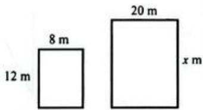

**解答**: Answer
Using the ratios of corresponding sides:  $\frac{x}{12} = \frac{20}{8} = 2.5$
$$
\Rightarrow x = 1 2 \times 2. 5 = 3 0 m
$$

---

## 11 Pythagoras' theorem and similar shapes > 11.3 Understanding similar shapes > Exercise 11.4

### 1 (练习题)

**题目**: 1 Determine whether the shapes in each pair of shapes are similar or not. Show your working.

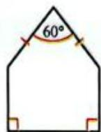

---

### 2 (练习题)

**题目**: 2 The shapes in each pair are mathematically similar to one another. Calculate the unknown lengths in each case.

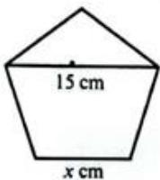

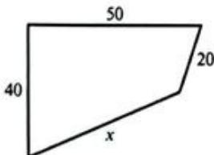

---

### 3 (练习题)

**题目**: 3 Determine the length of  ${ED}$  .

---

### 4 (练习题)

**题目**: 4 a All squares are similar to all other squares. Why is this the case?
b Why are rectangles not always similar to all other rectangles?
c Explain why circles are similar to all other circles.
d You now know that circles are similar to all other circles and all squares are similar to all other squares. Are there any other shapes that behave like this?

---

### 1 (练习题)

**题目**: 1 If you had to explain similar shapes to someone else, what would you tell them?
Write a short statement or points (you can include simple diagrams) to explain similar shapes to another student.

---

### 2 (练习题)

**题目**: 2 Exchange statements with a partner.
a Read each other's statements.
b Tell your partner what you found helpful in their explanation.
c Was there anything that was not helpful for you? Tell your partner why you found it unhelpful and suggest how they could improve it.

---

### WORKED EXAMPLE 9 (例题)

**题目**: WORKED EXAMPLE 9
These two rectangles are similar. What is the ratio of the smaller area to the larger?

**解答**: Answer
Ratio of sides  $= 18:21 = 6:7$
Simplify the ratio before squaring it.
Ratio of areas  $= 6^{2}:7^{2}$
Square the ratio of lengths.
$$
= 3 6: 4 9
$$

---

### WORKED EXAMPLE 10 (例题)

**题目**: WORKED EXAMPLE 10
Similar rectangles ABCD and MNOP have lengths in the ratio 3:5. If rectangle ABCD has an area of  $900\mathrm{cm}^2$ , find the area of MNOP.

**解答**: Answer
Area MNOP  $= \frac{5^2}{3^2}$  Area ABCD
Square the ratio of lengths.
$$
\frac {\text {A r e a M N O P}}{9 0 0 \mathrm {c m} ^ {2}} = \frac {2 5}{9}
$$
Simplify and substitute in any known values.
Area MNOP = 25/9 × 900
Solve the equation.
$$
= 2 5 0 0 \mathrm {c m} ^ {2}
$$
The area of MNOP is  $2500\mathrm{cm}^2$

---

### WORKED EXAMPLE 11 (例题)

**题目**: WORKED EXAMPLE 11
The shapes below are similar. Given that the area of  $ABCD = 48 \, \text{cm}^2$  and the area of  $PQRS = 108 \, \text{cm}^2$ , find the length of diagonal  $AC$  in  $ABCD$ .

**解答**: Answer
Let the length of the diagonal be  $x$  cm.
$$
\frac {4 8}{1 0 8} = \frac {x ^ {2}}{1 8 ^ {2}}
$$
Square the ratio of lengths.
$$
\frac {4 8}{1 0 8} = \frac {x ^ {2}}{3 2 4}
$$
$$
\frac {4 8}{1 0 8} \times 3 2 4 = x ^ {2}
$$
Simplify and solve.
$$
\begin{array}{l} x ^ {2} = 1 4 4 \\ x = 1 2 \\ \end{array}
$$
Diagonal AC is 12 cm long.

---

## 11 Pythagoras' theorem and similar shapes > 11.3 Understanding similar shapes > Exercise 11.5

### 1 (练习题)

**题目**: 1 In each part of this question, the two figures are similar. The area of one figure is given. Find the area of the other.

---

### 2 (练习题)

**题目**: 2 In each part of this question the areas of the two similar figures are given. Find the length of the side marked  $x$  in each.

---

### 2 (练习题)

**题目**: 2 In each part of this question the areas of the two similar figures are given. Find the length of the side marked  $x$  in each.

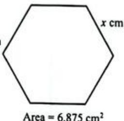

---

### 3 (练习题)

**题目**: 3 Mayumi is making a pattern using a regular pentagon. How will the area of the pentagon change if she:
a doubles the lengths of the sides?
b trebles the lengths of the sides?
c halves the lengths of the sides?

---

### 4 (练习题)

**题目**: 4 If the areas of two similar quadrilaterals are in the ratio 64:9, what is the ratio of matching sides?

---

## 11 Pythagoras' theorem and similar shapes > 11.3 Understanding similar shapes > Exercise 11.6

### 1 (练习题)

**题目**: 1 Copy and complete the statement.
When the dimensions of a solid are multiplied by  $k$ , the surface area is multiplied by  $\_$  and the volume is multiplied by  $\_$ .

---

### 2 (练习题)

**题目**: 2 Two similar cubes  $A$  and  $B$  have sides of  $20\mathrm{cm}$  and  $5\mathrm{cm}$  respectively.
a What is the scale factor of  $A$  to  $B$
b What is the ratio of their surface areas?
c What is the ratio of their volumes?

---

### 3 (练习题)

**题目**: 3 Pyramid  $A$  and pyramid  $B$  are similar. Find the surface area of pyramid  $A$ .

---

## 11 Pythagoras' theorem and similar shapes > 11.3 Understanding similar shapes > Exercise 11.5

### WORKED EXAMPLE 12 (例题)

**题目**: The cones shown in the diagram are mathematically similar. The smaller cone has a volume of  $40\mathrm{cm}^3$ . Find the volume of the larger cone.

**解答**: Answer
Scale factor of lengths  $= \frac{12}{3} = 4$ $\Rightarrow$  Scale factor of volumes  $= 4^{3} = 64$
So the volume of the larger cone  $= 64 \times 40 = 2560 \, \text{cm}^3$ .

---

### WORKED EXAMPLE 13 (例题)

**题目**: The two shapes shown in the diagram are mathematically similar. If the area of the larger shape is  $216\mathrm{cm}^2$ , and the area of the smaller shape is  $24\mathrm{cm}^2$ , find the length  $x$  in the diagram.

**解答**: Answer
Scale factor of areas  $= \frac{216}{24} = 9$
$$
\begin{array}{l} \Rightarrow (\text {S c a l e f a c t o r o f l e n g t h s}) ^ {2} = 9 \\ \Rightarrow \text {S c a l e f a c t o r o f l e n g t h s} = \sqrt {9} = 3 \\ \end{array}
$$
$$
\mathrm {S o}: x = 3 \times 1 2 = 3 6 \mathrm {c m}
$$

---

### WORKED EXAMPLE 14 (例题)

**题目**: A shipping crate has a volume of  $2000\mathrm{cm}^3$ . If the dimensions of the crate are doubled, what will its new volume be?

**解答**: Answer
$$
\begin{array}{l} \frac {\text {O r i g i n a l v o l u m e}}{\text {N e w v o l u m e}} = \left(\frac {\text {o r i g i n a l d i m e n s i o n s}}{\text {n e w d i m e n s i o n s}}\right) ^ {3} \\ \frac {2 0 0 0}{\text {N e w v o l u m e}} = \left(\frac {1}{2}\right) ^ {3} \\ \frac {2 0 0 0}{\text {N e w v o l u m e}} = \frac {1}{8} \\ \text {N e w v o l u m e} = 2 0 0 0 \times 8 \\ \text {N e w v o l u m e} = 1 6 0 0 0 \mathrm {c m} ^ {3} \\ \end{array}
$$

---

### WORKED EXAMPLE 15 (例题)

**题目**: The two cuboids  $A$  and  $B$  are similar. The larger cuboid has a surface area of  $608 \, \text{cm}^2$ . What is the surface area of the smaller cuboid?

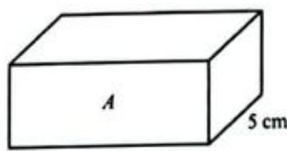

**解答**: Answer
$$
\frac {\text {S u r f a c e a r e a} A}{\text {S u r f a c e a r e a} B} = \left(\frac {\text {w i d t h} A}{\text {w i d t h} B}\right) ^ {2}
$$
$$
\frac {\text {S u r f a c e a r e a A}}{6 0 8} = \left(\frac {5}{8}\right) ^ {2}
$$
$$
\frac {\text {S u r f a c e a r e a A}}{6 0 8} = \frac {2 5}{6 4}
$$
$$
\text {S u r f a c e a r e a} A = \frac {2 5}{6 4} \times 6 0 8
$$
$$
\text {S u r f a c e a r e a} A = 2 3 7. 5 \mathrm {c m} ^ {2}
$$
Cuboid A has a surface area of  $237.5\mathrm{cm}^2$

---

## 11 Pythagoras' theorem and similar shapes > 11.3 Understanding similar shapes > Exercise 11.6

### 4 (练习题)

**题目**: 4 Yu has two similar cylindrical metal rods. The smaller rod has a diameter of  $4\mathrm{cm}$  and a surface area of  $110\mathrm{cm}^2$ . The larger rod has a diameter of  $5\mathrm{cm}$ .
Find the surface area of the larger rod.

---

### 5 (练习题)

**题目**: 5 Cuboid  $X$  and cuboid  $Y$  are similar. The scale factor  $X$  to  $Y$  is  $\frac{3}{4}$ .
a If a linear measure in cuboid  $X$  is  $12\mathrm{mm}$  what is the length of the corresponding measure on cuboid  $Y?$
b Cuboid  $X$  has a surface area of  $88.8\mathrm{cm}^2$  . What is the surface area of cuboid  $Y?$
c If cuboid  $X$  has a volume of  $35.1\mathrm{cm}^3$  , what is the volume of cuboid  $Y?$

---

### 6 (练习题)

**题目**: 6 For each part of this question, the solids are similar. Find the unknown volume.
a

$$
\text {V o l u m e} = 2 8 8 \mathrm {c m} ^ {3}
$$

---

### 6 (练习题)

**题目**: b

$$
\text {V o l u m e} = 9 \text {m m} ^ {3}
$$

---

### 6 (练习题)

**题目**: C

---

### 6 (练习题)

**题目**: d

$$
\text {V o l u m e} = 8 0. 6 4 \mathrm {m} ^ {3}
$$
$$
\text {V o l u m e} = 0. 3 8 4 \mathrm {m} ^ {3}
$$

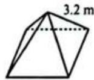

---

### 7 (练习题)

**题目**: 7 Find the unknown quantity for each of the following pairs of similar shapes.
a

---

### 7 (练习题)

**题目**: b
Volume  $= 20\mathrm{cm}^3$

$$
\begin{array}{c} \text {V o l u m e} = \\ \text {y c m} ^ {3} \end{array}
$$

---

### 7 (练习题)

**题目**: 

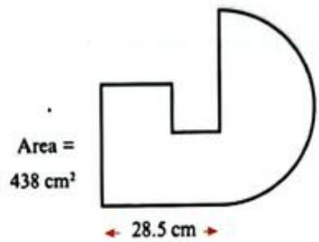

---

### 8 (练习题)

**题目**: 8 Karen has this set of three dolls. The heights of the dolls are  $13\mathrm{cm}$  11 cm and 9 cm. Draw a table to compare the surface area and volume. of the three dolls in algebraic terms.

---

### 9 (练习题)

**题目**: 9 A manufacturer is making pairs of weights from metal cones that have been cut along a plane parallel to the base. The diagram shows a pair of these weights. If the volume of the larger (uncut) cone is  $128\mathrm{cm}^3$  and the volume of the smaller cone cut off the top is  $42\mathrm{cm}^3$  find the length  $x$ .

---

## 11 Pythagoras' theorem and similar shapes > 11.4 Understanding congruence > Exercise 11.7

### 1 (练习题)

**题目**: 1 These two figures are congruent.

a Which side is equal in length to:
i AB?
ii  ${EF}$  ?
MN?
b Which angle corresponds with:
i BAG?
PQR?
DEF?
c Write a congruency statement for the two figures.

---

## 11 Pythagoras' theorem and similar shapes > 11.4 Understanding congruence

### 11.4 Understanding congruence (例题)

**题目**: Two shapes are congruent if they are the same shape and size.
MATHEMATICAL CONNECTIONS
You will meet rotations and reflections in Chapter 19. When an object is reflected or rotated its shape and size remain unchanged. The resulting object is congruent to the original.
If two shapes are congruent then:
corresponding sides are equal in length.
corresponding angles are equal
the shapes have the same area.
Look at these pairs of congruent shapes. The corresponding sides and angles on each shape are marked using the same colours and symbols.

When you make a congruency statement, you name the shape so that corresponding vertices are in the same order.
For the shapes above:
ABCD is congruent to EFGH
MNOP is congruent to RQTS.

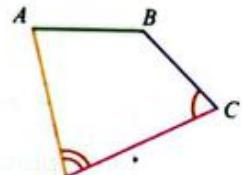

---

## 11 Pythagoras' theorem and similar shapes > 11.4 Understanding congruence > Exercise 11.7

### 2 (练习题)

**题目**: 2 Which of the shapes in the box are congruent to each shape given below?
Measure sides and angles if you need to.
a

b

c

d

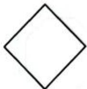

---

### 3 (练习题)

**题目**: 3 For each set of shapes, state whether any shapes are congruent or similar.
a

b

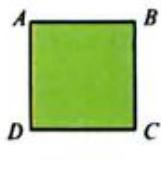

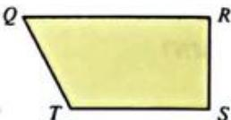

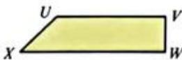

---

### 4 (练习题)

**题目**: 4 Figure  $ABCDEF$  has  $AB = BC = CD = DE$
Redraw the figure and show how you could split it into:
a two congruent shapes
b three congruent shapes
c four congruent shapes.

---

### 5 (练习题)

**题目**: 5 Triangle  $FAB$  is congruent to triangle FED.
Prove that  $BFDC$  is a kite.

---

### 6 (练习题)

**题目**: 6 Two people in different parts of a park take a walk. They both walk in a straight line for 1000 metres, then they turn  $110^{\circ}$  right and continue to walk straight for a while before making a  $120^{\circ}$  turn to right. From there they walk back in a straight line to their starting point. Is it possible that they walked in congruent triangular paths? Explain your answer.

---

### 1 (练习题)

**题目**: 1 Habib takes a short cut from his home  $(H)$  to the bus stop  $(B)$  along a footpath  $HB$ .
How much further would it be for Habib to walk to the bus stop by going from  $H$  to the corner  $(C)$  and then from  $C$  to  $B$ ?
Give your answer in metres.

---

### 2 (练习题)

**题目**: 2 A ladder is standing on horizontal ground and rests against a vertical wall. The ladder is  $4.5\mathrm{m}$  long and its foot is  $1.6\mathrm{m}$  from the wall. Calculate how far up the wall the ladder will reach. Give your answer correct to 3 significant figures. [3]

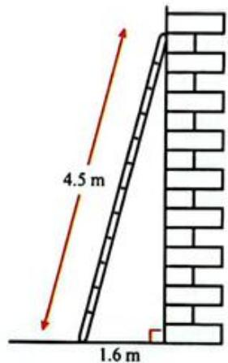

---

### 3 (练习题)

**题目**: 3 A rectangular box has a base with internal dimensions  $21\mathrm{cm}$  by  $28\mathrm{cm}$  and an internal height of  $12\mathrm{cm}$ . Calculate the length of the longest straight thin rod that will fit:
a on the base of the box
b in the box.
[3]
[3]

---

### 4 (练习题)

**题目**: 4 The right-angled triangle in the diagram has sides of length  $7x\mathrm{cm}$ $24x\mathrm{cm}$  and  $150\mathrm{cm}$
a Show that  $x^{2} = 36$  [3]
b Calculate the perimeter of the triangle. [3]

---

### 5 (练习题)

**题目**: 5 Josh and Sarah walk from the same point. Josh walks due west and Sarah walks due north.
After 1 hour, Josh is  $4.2\mathrm{km}$  from the starting point and Sarah is  $5.6\mathrm{km}$  from Josh in a straight line.
How far is Sarah from the starting point?
[3]

---

### 6 (练习题)

**题目**: 6 A plant feeder is shaped like a cone with height  $12\mathrm{cm}$ . When the plant feed is  $8\mathrm{cm}$  deep, the diameter of the circular surface of the feed is  $6\mathrm{cm}$ . Find the radius of the cone.

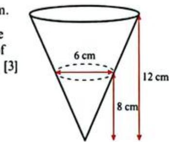

---

### 7 (练习题)

**题目**: 7 The diagram shows a right-angled triangle  $ABC$ .
a Explain why triangles ABC, CBD and ACD are similar. [2]
b Show that  $a^2 = ce$  and find an equivalent expression for  $b$  [3]
c Use your answers to prove that  $a^2 + b^2 = c^2$ . [3]

---

### 8 (练习题)

**题目**: 8 Chocolate bars come in a regular size that weighs  $125\mathrm{g}$  and a giant size that weighs  $343\mathrm{g}$ , the bars are similar in shape.
a If the regular bar is  $12\mathrm{cm}$  long, find the length of the giant bar. [3]
b The wrapper of the giant bar has a surface area of  $201.6\mathrm{cm}^2$  find the area of wrapping paper required for the regular bar. Give your answer to 3 s.f. [3]

---

### 9 (练习题)

**题目**: 9 a Show that if
$$
\begin{array}{l} a = u v \\ b = \frac {u ^ {2} - v ^ {2}}{2} \\ c = \frac {u ^ {2} + v ^ {2}}{2} \\ \end{array}
$$
then the triple  $(a,b,c)$  satisfies Pythagoras' theorem. [4]
b Use the formulae given in part (a) to find a Pythagorean triple where the smallest integer in the triple is 17. [3]
Show that if  $a$  is prime and  $a$  is a member of a Pythagorean triple, then the other two numbers in the triple will differ by 1. [3]

---

## 12 Averages and measures of spread

### 1 (练习题)

**题目**: Rohan records the number of hours, to the nearest half hour, he spends reading each week for seven weeks:
1.5 1.5 2 3.5 5 5.5 11.5
Roham says to Jessi, "On average, I read for 3.5 hours per week."
How has Raham worked out 3.5 hours?

---

### 2 (练习题)

**题目**: 2 Do you agree with Rohan's claim?

---

### 3 (练习题)

**题目**: 3 What information is lost when Roham makes his calculation?

---

### 4 (练习题)

**题目**: Jess records how long she spends reading for the next seven weeks:
5.5 7 25 -3 7.5 9.5 1
Jess says to Roham, "On average, I read for 3 hours per week."
4 Why is Jess imcorrect?

---

### 5 (练习题)

**题目**: 5 What can you do to give a better answer?

---

### 6 (练习题)

**题目**: Rohan has made a mistake. His final value should be 14 and not 11.5.
6 What will happen to Raham's claim? Why?

---

### 7 (练习题)

**题目**: 7 What other ways do you know to calculate averages? Are they useful here?

---

## 12 Averages and measures of spread > 12.1 Different types of average

### WORKED EXAMPLE 1 (例题)

**题目**: WORKED EXAMPLE 1
After six tests, Gad has a mean average score of  $48\%$ . He takes a seventh test and scores  $83\%$ .
What is Gadl's total score after six tests?
b What is Gad's mean average score after seven tests?

**解答**: Answers
a Since mean= total of all data number of values
them, total of all data = mean × number of values
$$
\begin{array}{l} = 4 8 \times 6 \\ = 2 8 8 \\ \end{array}
$$
Total of all seven scores  $=$  total of first six plus seventh
$$
\begin{array}{l} = 2 8 8 + 8 3 \\ = 3 7 1 \\ \end{array}
$$
$$
m e a m = \frac {371}{7} = 53 \%
$$

---

## 12 Averages and measures of spread > 12.1 Different types of average > Exercise 12.1

### 1 (练习题)

**题目**: Exercise 12.1
1 For each of the following data sets calculate:
the mode
ii the medium
the mean.
a 12 2 5 6 9 3 12 13 10
b59738258882
2.1 3.8 2.4 7.6 8.2 3.4 5.6 8.2 4.5 2.1
d 12 2 5 6 9 3 12 13 43

---

### 2 (练习题)

**题目**: 2 Look carefully at the data in parts (a) and (d) of question 1. What is different?
How did your mean, medium and mode change?

---

### 3 (练习题)

**题目**: 3 Ali and Bo decide to investigate their television watching patterns. They record the number of minutes that they watch television for eight days:
[Table Row] <tr><td>Ali:</td><td>38</td><td>10</td><td>65</td><td>43</td><td>125</td><td>225</td><td>128</td><td>40</td></tr>
[Table Row] <tr><td>Boc:</td><td>25</td><td>15</td><td>10</td><td>65</td><td>90</td><td>300</td><td>254</td><td>32</td></tr>
a Find the median number of minutes spent watching television for:
Aii Baa
b Find the mean number of minutes spent watching television for:
Aii B0

---

### 4 (练习题)

**题目**: 4 Find a list of five numbers with a mean that is larger than all but one of the numbers.

---

### 5 (练习题)

**题目**: 5 A keen ten pin bowler plays five rounds in one evening. His scores are 98, 64, 103, 108 and 109. Which average (mode, mean or median) will he choose to report to his friends at the end of the evening? Explain your answer carefully, showing all your calculations clearly.

---

### 6 (练习题)

**题目**: If the mean height of 31 children is  $143.6\mathrm{cm}$ , calculate the sum of the heights used to calculate the mean.

---

### 7 (练习题)

**题目**: 7 The mean mass of 12 bags of potatoes is  $2.4\mathrm{kg}$ . If a 13th bag containing  $2.2\mathrm{kg}$  of potatoes is added, what will the new mean mass of the 13 bags be?

---

### 8 (练习题)

**题目**: 8 The mean temperature of 10 cups of coffee is  $89.6^{\circ}C$ . The mean temperature of a different collection of 20 cups of coffee is  $92.1^{\circ}C$ . What is the mean temperature of all 30 cups of coffee?

---

### 9 (练习题)

**题目**: 9 Find a set of five numbers with mean five, median four and mode four.

---

### 10 (练习题)

**题目**: 10 Find a set of five different whole numbers with mean five and median four.

---

### 11 (练习题)

**题目**: 11 The mean mass of a group of  $m$  green apples is  $X$  kg and the mean mass of a group of  $n$  red apples is  $Y$  kg. Find the mean mass of all the apples combined.

---

## 12 Averages and measures of spread > 12.2 Making comparisons using averages and ranges

### WORKED EXAMPLE 2 (例题)

**题目**: WORKED EXAMPLE 2
Two groups of athletes want to compare their  $100\mathrm{m}$  sprint times. Each person runs once and records their time in seconds.
[Table Row] <tr><td>Team Pythagoras</td><td>14.3</td><td>16.6</td><td>14.3</td><td>17.9</td><td>14.1</td><td>15.7</td></tr>
[Table Row] <tr><td>Team Socrates</td><td>13.2</td><td>16.8</td><td>14.7</td><td>14.7</td><td>13.6</td><td>16.2</td></tr>
a Calculate the mean 100m time for each team.
b Which is the smaller mean?
c What does this tell you about the  $100\mathrm{m}$  times for Team Pythagoras compared to those for Team Socrates?
d Calculate the range for each team.
e What does this tell you about the performance of each team?

**解答**: Answers
a Team Pythagoras:
$$
\text {M e a n} = \frac {1 4 . 3 + 1 6 . 6 + 1 4 . 3 + 1 7 . 9 + 1 4 . 1 + 1 5 . 7}{6} = \frac {9 2 . 9}{6} = 1 5. 4 8 \text {s e c o n d s}
$$
$$
\text {M e a n} = \frac {1 3 . 2 + 1 6 . 8 + 1 4 . 7 + 1 4 . 7 + 1 3 . 6 + 1 6 . 2}{6} = \frac {8 9 . 2}{6} = 1 4. 8 7 \text {s e c o n d s}
$$
b Team Socrates have the smaller mean 100m time.
c The smaller time means that Team Socrates are slightly faster as a team than Team Pythagoras.
d Team Pythagoras' range  $= 17.9 - 14.1 = 3.8$  seconds Team Socrates' range  $= 16.8 - 13.2 = 3.6$  seconds
e Team Socrates are slightly faster as a whole and they are slightly more consistent.

---

## 12 Averages and measures of spread > 1.1 Calculate the mean and range of these lengths:

### 1.1 (练习题)

**题目**: 1.1 Calculate the mean and range of these lengths:
3.2m
2.8m
4.1m
1.6m
4.4m

---

### 2 (练习题)

**题目**: 2 Rewrite the lengths in centimetres. Calculate the mean and range of the new data. What do you notice?

---

### 3 (练习题)

**题目**: 3 Try multiplying the original data by a fixed number and working out the mean and range again? What happens?

---

### 4 (练习题)

**题目**: 4 Try to explain why this means you need to use the same units when comparing means or ranges.

---

## 12 Averages and measures of spread > 1.1 Calculate the mean and range of these lengths: > Exercise 12.2

### 1 (练习题)

**题目**: 1 Two friends, Ru and Oli, are picking berries. The mass (in kg) of each box they fill is recorded.
[Table Row] <tr><td>Ru</td><td>0.145</td><td>0.182</td><td>0.135</td><td>0.132</td><td>0.112</td><td>0.155</td><td>0.189</td><td>0.132</td><td>0.145</td><td>0.201</td><td>0.139</td></tr>
[Table Row] <tr><td>Oli</td><td>0.131</td><td>0.143</td><td>0.134</td><td>0.145</td><td>0.132</td><td>0.123</td><td>0.182</td><td>0.134</td><td>0.128</td><td></td><td></td></tr>
a For each person calculate:
i the mean mass of berries collected per box
ii the range of masses.
b Who collected more berries per box?
Who was more consistent when collecting the berries?

---

### 2 (练习题)

**题目**: 2 The marks out of 20 obtained by two classes in a mathematics test are shown in the table.
[Table Row] <tr><td>Class Archimedes</td><td>12</td><td>13</td><td>4</td><td>19</td><td>20</td><td>12</td><td>13</td><td>13</td><td>16</td><td>18</td><td>12</td></tr>
[Table Row] <tr><td>Class Bernoulli</td><td>13</td><td>6</td><td>9</td><td>15</td><td>20</td><td>20</td><td>13</td><td>15</td><td>17</td><td>19</td><td>3</td></tr>
a Calculate the median score for each class.
b Find the range of scores for each class.
c Which class did better in the test overall?
d Which class was more consistent?

---

### 3 (练习题)

**题目**: 3 Three shops sell light bulbs. A sample of 100 light bulbs is taken from each shop and the working life of each is measured in hours. The table shows the mean time and range for each shop.
[Table Row] <tr><td>Shop</td><td>Mean (hours)</td><td>Range (hours)</td></tr>
[Table Row] <tr><td>Brightlights</td><td>136</td><td>18</td></tr>
[Table Row] <tr><td>Footlights</td><td>145</td><td>36</td></tr>
[Table Row] <tr><td>Backlights</td><td>143</td><td>18</td></tr>
Which shop would you recommend to someone who is looking to buy a new light bulb and why?

---

### 1 (练习题)

**题目**: 1 Read through this activity that a class had to complete for homework. Think about how you would answer each question.
What mark do you think you would score out of 10 for this task? Why?
A developer monitors how many people visited a new website each hour for the first two days that the site went live.
These are the results arranged in order.
100, 105, 106, 106, 107, 107, 108, 110, 117, 118, 135, 137
145,148,148,148,153,155,157,159,162,171,171,179
183,183,185,185,189,199,201,203,204,209,216,220
223,224,224,227,229,230,231,233,234,235,237,238
1 Calculate:
a the mean, median and mode [4]
b the range [1]
2 Company A owns the website and wants to sell advertising on it. What could they say about the number of visitors the site is receiving? [2]
3 The developer compares the statistics for this website with those from a website run by Company B.
Company B
Mean number of visits per hour: 180
Median number of visits per hour: 140
Mode: 135 visits per hour
Range: 200
What could the developer say to compare the two sets of data? [3]

---

### 2 (练习题)

**题目**: 2 Here is one student's answer to the homework activity.
What mark would you give this student out of 10? Why?
1 a Mean  $=$  sum of values/number of values  $= 8394 / 48$ $= 174.88$  visits per hour (2 dp.) Median  $= (179 + 183) / 2 = 181$  visits per hour Mode  $= 148$  b Range  $= 238 - 100 = 138$
2 The website consistently gets over 100 visits per hour with an average of 175 visits per hour.
3 The mean number of visits to Company B's website is a bit higher than Company A's but the median number of visits to Company B is much lower. This suggests that the mean of Company B is affected by a few high values and the usual number of visits is actually lower. The data for Company B has quite a wide range and this suggests that the data is spread out and the number of visits per hour is less consistent than for Company A.

---

### 3 (练习题)

**题目**: 3 The work above is an example of a model answer.
a Did this student do anything differently to how you would have worked? What?
b How can examples of good work like this one help you to improve your own work?

---

## 12 Averages and measures of spread > 12.3 Calculating averages and ranges for frequency data > Exercise 12.3

### 1 (练习题)

**题目**: 1 Construct a frequency table for the following data and calculate:
a the mean
b the median
the mode
d the range.
[Table Row] <tr><td>3</td><td>4</td><td>5</td><td>1</td><td>2</td><td>8</td><td>9</td><td>6</td><td>5</td><td>3</td><td>2</td><td>1</td><td>6</td><td>4</td><td>7</td><td>8</td><td>1</td></tr>
[Table Row] <tr><td>1</td><td>5</td><td>5</td><td>2</td><td>3</td><td>4</td><td>5</td><td>7</td><td>8</td><td>3</td><td>4</td><td>2</td><td>5</td><td>1</td><td>9</td><td>4</td><td>5</td></tr>
[Table Row] <tr><td>6</td><td>7</td><td>8</td><td>9</td><td>2</td><td>1</td><td>5</td><td>4</td><td>3</td><td>4</td><td>5</td><td>6</td><td>1</td><td>4</td><td>4</td><td>8</td><td></td></tr>

---

### 2 (练习题)

**题目**: 2 Tickets for a show were sold at the following prices: 180 at $6.50 each, 215 at $8 each and 124 at $10 each.
a Present this information in a frequency table.
b Calculate the mean price of the tickets sold (give your answer to 3 significant figures).

---

### 3 (练习题)

**题目**: 3 A receptionist kept count of the number of courier deliveries received each day over a period of 60 days. The results are shown in the table.
[Table Row] <tr><td>Number of deliveries per day</td><td>0</td><td>1</td><td>2</td><td>3</td><td>4</td><td>5</td></tr>
[Table Row] <tr><td>Frequency</td><td>28</td><td>21</td><td>6</td><td>3</td><td>1</td><td>1</td></tr>
For this distribution, find:
a the mode
b the median
c the mean
the range.

---

### 4 (练习题)

**题目**: 4 A survey of the number of children in 100 families gave the following distribution:
[Table Row] <tr><td>Number of children in family</td><td>0</td><td>1</td><td>2</td><td>3</td><td>4</td><td>5</td><td>6</td><td>7</td></tr>
[Table Row] <tr><td>Number of families</td><td>4</td><td>36</td><td>27</td><td>21</td><td>5</td><td>4</td><td>2</td><td>1</td></tr>
For this distribution, find:
a the mode
b the median
c the mean.

---

### 5 (练习题)

**题目**: 5 The distribution of marks obtained by students in a class is shown in the table.
[Table Row] <tr><td>Mark obtained</td><td>0</td><td>1</td><td>2</td><td>3</td><td>4</td><td>5</td><td>6</td><td>7</td><td>8</td><td>9</td><td>10</td></tr>
[Table Row] <tr><td>Number of students</td><td>1</td><td>0</td><td>3</td><td>2</td><td>2</td><td>4</td><td>3</td><td>4</td><td>6</td><td>3</td><td>2</td></tr>
a Find:
i the mode
ii the median
iii the mean.
b The class teacher is asked to report on the class's performance and wants to show they are doing as well as possible. Which average should the teacher include in the report and why?

---

### 6 (练习题)

**题目**: 6 The masses of 20 soccer players were measured to the nearest kilogram and this stem-and-leaf diagram was produced.
[Table Row] <tr><td>Stem</td><td>Leaf</td></tr>
[Table Row] <tr><td>4</td><td>6</td></tr>
[Table Row] <tr><td>5</td><td>4 0 0 7 8 9 5</td></tr>
[Table Row] <tr><td>6</td><td>3 0 1 1 3 2 6 8 6 9</td></tr>
[Table Row] <tr><td>7</td><td>4 0</td></tr>
[Table Row] <tr><td>Key</td></tr>
[Table Row] <tr><td>4 | 6 represents 64 kilograms</td></tr>
a Redraw the stem-and-leaf diagram to make an ordered data set.
b How many players have a mass of 60 kilograms or more?
Why is the mode not a useful average for this data?
What is the range of masses?
e What is the median mass of the players?

---

### 7 (练习题)

**题目**: The number of electronic components produced by a machine every hour over a 24-period are:
143,128,121,126,134,150,128,132,140,131,146,128
133,138,140,125,142,129,136,130,133,142,126,129
a Using two intervals for each stem, draw an ordered stem-and-leaf diagram of the data.
b Determine the range of the data.
c Find the median.

---

## 12 Averages and measures of spread > 12.4 Estimating the mean and finding the modal class for grouped data

### WORKED EXAMPLE 4 (例题)

**题目**: WORKED EXAMPLE 4
The heights of 100 children were measured in cm and the results recorded in a table.
[Table Row] <tr><td>Height in cm (h)</td><td>Frequency (f)</td></tr>
[Table Row] <tr><td>120 &lt; h ≤ 130</td><td>12</td></tr>
[Table Row] <tr><td>130 &lt; h ≤ 140</td><td>16</td></tr>
[Table Row] <tr><td>140 &lt; h ≤ 150</td><td>38</td></tr>
[Table Row] <tr><td>150 &lt; h ≤ 160</td><td>24</td></tr>
[Table Row] <tr><td>160 &lt; h ≤ 170</td><td>10</td></tr>
Find:
a an estimate for the mean height of the children
b the modal class.

**解答**: Answers
a You don't know any of the children's heights exactly, so you use the midpoint of each class as the best estimate of the height of each child in that class. For example, the 12 children in the  $120 \leq h < 130$  class have heights between  $120\mathrm{cm}$  and  $130\mathrm{cm}$ , but that is all that you know.
Halfway between  $120\mathrm{cm}$  and  $130\mathrm{cm}$  is  $\frac{(120 + 130)}{2} = 125\mathrm{cm}$ .
A good estimate of the total height of the 12 children in this class is  $12 \times 125$  (frequency  $\times$  midpoint).
Extend your table to include midpoints and totals for each class:
[Table Row] <tr><td>Height in cm (h)</td><td>Frequency (f)</td><td>Midpoint (x)</td><td>Frequency x midpoint (fx)</td></tr>
[Table Row] <tr><td>120 &lt; h ≤ 130</td><td>12</td><td>125</td><td>12 × 125 = 1500</td></tr>
[Table Row] <tr><td>130 &lt; h ≤ 140</td><td>16</td><td>135</td><td>16 × 135 = 2160</td></tr>
[Table Row] <tr><td>140 &lt; h ≤ 150</td><td>38</td><td>145</td><td>38 × 145 = 5510</td></tr>
[Table Row] <tr><td>150 &lt; h ≤ 160</td><td>24</td><td>155</td><td>24 × 155 = 3720</td></tr>
[Table Row] <tr><td>160 &lt; h ≤ 170</td><td>10</td><td>165</td><td>10 × 165 = 1650</td></tr>
An estimate for the mean height of the children is:
$$
\frac {1 5 0 0 + 2 1 6 0 + 5 5 1 0 + 3 7 2 0 + 1 6 5 0}{1 2 + 1 6 + 3 8 + 2 4 + 1 0} = \frac {1 4 5 4 0}{1 0 0} = 1 4 5. 4 \mathrm {c m}
$$
b The class with the highest frequency is the modal class. In this case it is the class:  $140 < h \leqslant 150$ .

---

## 12 Averages and measures of spread > 12.4 Estimating the mean and finding the modal class for grouped data > Exercise 12.4

### 1 (练习题)

**题目**: 1 The table shows the heights of 50 sculptures in an art gallery.
a Find an estimate for the mean height of the sculptures.
b Which class contains the most sculptures?
[Table Row] <tr><td>Heights (h cm)</td><td>Frequency (f)</td></tr>
[Table Row] <tr><td>130 &lt; h ≤ 135</td><td>7</td></tr>
[Table Row] <tr><td>135 &lt; h ≤ 140</td><td>13</td></tr>
[Table Row] <tr><td>140 &lt; h ≤ 145</td><td>15</td></tr>
[Table Row] <tr><td>145 &lt; h ≤ 150</td><td>11</td></tr>
[Table Row] <tr><td>150 &lt; h ≤ 155</td><td>4</td></tr>
[Table Row] <tr><td>Total</td><td>Σf = 50</td></tr>

---

### 2 (练习题)

**题目**: 2 The table shows the lengths of 100 telephone calls.
[Table Row] <tr><td>Time (t minutes)</td><td>Frequency (f)</td></tr>
[Table Row] <tr><td>0 &lt; t ≤ 1</td><td>12</td></tr>
[Table Row] <tr><td>1 &lt; t ≤ 2</td><td>14</td></tr>
[Table Row] <tr><td>2 &lt; t ≤ 4</td><td>20</td></tr>
[Table Row] <tr><td>4 &lt; t ≤ 6</td><td>14</td></tr>
[Table Row] <tr><td>6 &lt; t ≤ 8</td><td>12</td></tr>
[Table Row] <tr><td>8 &lt; t ≤ 10</td><td>18</td></tr>
[Table Row] <tr><td>10 &lt; t ≤ 15</td><td>10</td></tr>
a Calculate an estimate for the mean length, in minutes, of a telephone call.
b Write your answer in minutes and seconds, to the nearest second.
c Identify the modal class for telephone call length.

---

### 3 (练习题)

**题目**: 3 The table shows the temperatures of several test tubes during a chemistry experiment.
[Table Row] <tr><td>Temperature (T °C)</td><td>Frequency (f)</td></tr>
[Table Row] <tr><td>45 &lt; T ≤ 50</td><td>3</td></tr>
[Table Row] <tr><td>50 &lt; T ≤ 55</td><td>8</td></tr>
[Table Row] <tr><td>55 &lt; T ≤ 60</td><td>17</td></tr>
[Table Row] <tr><td>60 &lt; T ≤ 65</td><td>6</td></tr>
[Table Row] <tr><td>65 &lt; T ≤ 70</td><td>2</td></tr>
[Table Row] <tr><td>70 &lt; T ≤ 75</td><td>1</td></tr>
Calculate an estimate for the mean temperature of the test tubes.

---

### 4 (练习题)

**题目**: 4 Two athletics teams - the Hawks and the Eagles - are about to compete in a race. The masses of the team members are shown in the table below.
[Table Row] <tr><td>Mass (Mkg)</td><td>Frequency (f)</td></tr>
[Table Row] <tr><td>55 &lt; M ≤ 65</td><td>2</td></tr>
[Table Row] <tr><td>65 &lt; M ≤ 75</td><td>8</td></tr>
[Table Row] <tr><td>75 &lt; M ≤ 85</td><td>12</td></tr>
[Table Row] <tr><td>85 &lt; M ≤ 100</td><td>3</td></tr>
[Table Row] <tr><td>Mass (Mkg)</td><td>Frequency (f)</td></tr>
[Table Row] <tr><td>55 &lt; M ≤ 65</td><td>1</td></tr>
[Table Row] <tr><td>65 &lt; M ≤ 75</td><td>7</td></tr>
[Table Row] <tr><td>75 &lt; M ≤ 85</td><td>13</td></tr>
[Table Row] <tr><td>85 &lt; M ≤ 100</td><td>4</td></tr>
a Calculate an estimate for the mean mass of each team.
b Identify the modal class for the masses of each team.

---

### 5 (练习题)

**题目**: 5 The table shows the lengths of 50 pieces of wire used in a physics laboratory. The lengths have been measured to the nearest centimetre. Find an estimate for the mean length.
[Table Row] <tr><td>Length</td><td>26-30</td><td>31-35</td><td>36-40</td><td>41-45</td><td>46-50</td></tr>
[Table Row] <tr><td>Frequency (f)</td><td>4</td><td>10</td><td>12</td><td>18</td><td>6</td></tr>

---

### 6 (练习题)

**题目**: The table shows the ages of the teachers in a secondary school to the nearest year.
[Table Row] <tr><td>Age in years</td><td>21-30</td><td>31-35</td><td>36-40</td><td>41-45</td><td>46-50</td><td>51-65</td></tr>
[Table Row] <tr><td>Frequency (f)</td><td>3</td><td>6</td><td>12</td><td>15</td><td>6</td><td>7</td></tr>
Calculate an estimate for the mean age of the teachers.

---

## 12 Averages and measures of spread > 12.5 Quartiles

### WORKED EXAMPLE 5 (例题)

**题目**: WORKED EXAMPLE 5
For each set of data calculate the median, upper quartile, lower quartile and the interquartile range.
a 13 12 8 6 11 14 8 5 1 10 16 12
b 14 10 8 19 15 14 9

**解答**: Answer
a First sort the data into ascending order:
1568810111212131416
There are an even number of items (12). So, to find the median, find the mean of the middle pair. The first of the pair is in position  $\frac{12}{2} = 6$ , so the median is  $\frac{(10 + 11)}{2} = 10.5$ .
Calculate the position of the quartiles:
$$
\frac {1}{4} (1 2 + 1) = 3. 2 5 \text {a n d} \frac {3}{4} (1 2 + 1) = 9. 7 5
$$
These are not whole numbers, so the lower quartile is the mean of the 3rd and 4th values, and the upper quartile is the mean of the 9th and 10th values.
$$
Q _ {1} \frac {(6 + 8)}{2} = 7 \text {a n d} Q _ {3} = \frac {(1 2 + 1 3)}{2} = 1 2. 5
$$
Then you know that the IQR = 12.5 - 7 = 5.5.
b The ordered data is:
891014141519
There is an odd number of data values, so the median is in position  $\frac{(7 + 1)}{2} = 4$ . The median is 14.
WORKED EXAMPLE 5 CONTINUED
There are seven items, so the positions of the quartiles are:  $\frac{1}{4} (7 + 1) = 2$  and  $\frac{3}{4} (7 + 1) = 6$ .
These are whole numbers so the lower quartile is in position two and the upper quartile is in position six.
So  $Q_{1} = 9$  and  $Q_{3} = 15$ .
IQR=15-9=6

---

### WORKED EXAMPLE 6 (例题)

**题目**: WORKED EXAMPLE 6
Two companies sell sunflower seeds. In one year, seeds from Allbright produce flowers with a median height of 98 cm and IQR of 13 cm. In the same year seeds from Barstows produce flowers with a median height of 95 cm and IQR of 4 cm. Which seeds would you buy if you wanted to enter a competition for growing the tallest sunflower and why?

**解答**: Answer
I would buy Barstows' seeds. Although Allbright sunflowers seem taller (with a higher median) they are less consistent. So, there is a chance of a very big sunflower, but there is also a good chance of a small sunflower. Barstows' sunflowers are a bit shorter, but are more consistent in their heights so you are more likely to get flowers around the height of 95 cm.

---

### WORKED EXAMPLE 7 (例题)

**题目**: WORKED EXAMPLE 7
The back-to-back stem-and-leaf diagram shows the concentration of low-density lipoprotein (bad) cholesterol in the blood in 70 adults. Half of the adults are vegetarians and half are non-vegetarians. The data is measured in milligrams per  $100\mathrm{ml}$  of blood  $(\mathrm{mg / dl})$ .
[Table Row] <tr><td>Leaf</td><td>Stem</td><td>Leaf</td></tr>
[Table Row] <tr><td>8 0</td><td>9</td><td></td></tr>
[Table Row] <tr><td>8 8 3 1</td><td>10</td><td></td></tr>
[Table Row] <tr><td>9 9 8 8 6 5 2</td><td>11</td><td>2</td></tr>
[Table Row] <tr><td>9 9 8 7 7 0 0</td><td>12</td><td>0 1</td></tr>
[Table Row] <tr><td>9 6 5 1 1 1</td><td>13</td><td>0 2 3</td></tr>
[Table Row] <tr><td>4 2 2</td><td>14</td><td>1 3 5 6</td></tr>
[Table Row] <tr><td>8 2 1</td><td>15</td><td>0 4 5 5 9</td></tr>
[Table Row] <tr><td>6 5</td><td>16</td><td>0 1 4 7 8 9</td></tr>
[Table Row] <tr><td>3</td><td>17</td><td>2 3 6 8 8</td></tr>
[Table Row] <tr><td></td><td>18</td><td>0 2 4 5</td></tr>
[Table Row] <tr><td></td><td>19</td><td>1 6 8</td></tr>
[Table Row] <tr><td></td><td>20</td><td>1</td></tr>
[Table Row] <tr><td></td><td>21</td><td>5</td></tr>
[Table Row] <tr><td>Vegetarians
0|9 represents 90</td></tr>
[Table Row] <tr><td>Non-vegetarians
11|2 represents 112</td></tr>
TIP
Remember to count the data in ascending order when you work with the left-hand side. The lowest values are closest to the stem in each row.
WORKED EXAMPLE 7 CONTINUED
a Determine the median for each group.
b Find the range for:
i vegetarians
ii non-vegetarians.
c Determine the interquartile range for:
i vegetarians
ii non-vegetarians.
d LDL levels of  $<  130$  are desirable, levels of 130-160 are considered borderline high and levels  $>160$  are considered high risk. Using these figures, comment on what the distribution on the stem-and-leaf diagram suggests.

**解答**: Answer
a The data is already ordered and there are 35 values in each set.
$$
\frac {1}{2} (3 5 + 1) = 1 8, \text {s o t h e m e d i a n i s t h e 1 8 t h v a l u e}.
$$
Median  $= 128$  for vegetarians
ii Median  $= 164$  for non-vegetarians
b i Range  $= 173 - 90 = 83$  for vegetarians
ii Range  $= 215 - 112 = 103$  for non-vegetarians
c Determine the position of  $Q_{1}$  and  $Q_{3}$
The lower quartile  $= \frac{1}{4} (35 + 1) = 9$ th value
The upper quartile  $= \frac{3}{4} (35 + 1) = 27$ th value
IQR = Q3 - Q1 = 142 - 116 = 26 for vegetarians
ii  $IQR = Q_{3} - Q_{1} = 180 - 145 = 35$  for non-vegetarians.
d For vegetarians the data is skewed toward the lower levels on the stem- and-leaf diagram. More than half of the values are in the desirable range, with only three in the high-risk range. For non-vegetarians, the data is more spread out. Only three values are in the desirable range, 12 are borderline high and 20 are in the high-risk category.
This might suggest that non-vegetarians have higher levels of bad cholesterol in general. However, without considering other risk factors or medical history, you cannot say this for certain from one set of data.

---

## 12 Averages and measures of spread > 12.5 Quartiles > Exercise 12.5

### 1 (练习题)

**题目**: Exercise 12.5
1 Find the median, quartiles and interquartile range for each set of data.

---

### 1 (练习题)

**题目**: 1 Find the median, quartiles and interquartile range for each set of data.
Make sure that you show your method clearly.
a 5 8 9 9 4 5 6 9 3 6 4
b 12 14 12 17 19 21 23
45121415171431819181914415
d 3.1 2.4 5.1 2.3 2.5 4.2 3.4 6.1 4.8
e 13.2 14.8 19.6 14.5 16.7 18.9 14.5 13.7 17.0 21.8 12.0 16.5

---

### 2 (练习题)

**题目**: 2 The area, in hectares, of 13 mango orchards in Sindh, Pakistan, were recorded as follows:
[Table Row] <tr><td>3.75</td><td>2.35</td><td>4.5</td><td>2.7</td><td>3.5</td><td>40.25</td><td>11.3</td></tr>
[Table Row] <tr><td>19.25</td><td>32.1</td><td>28.4</td><td>7.2</td><td>3.6</td><td>9.0</td><td></td></tr>
a Find the range of the areas.
b Calculate the interquartile range.
C Which value is more representative of the spread of the data? Why?

---

### 3 (练习题)

**题目**: 3 Members of a hiking group sometimes see a kingfisher when they walk in the park. Each week for 15 weeks they record the number of times they see a kingfisher.
[Table Row] <tr><td>5</td><td>7</td><td>5</td><td>8</td><td>4</td><td>2</td><td>9</td><td>9</td><td>4</td><td>7</td><td>6</td><td>4</td><td>6</td><td>12</td><td>4</td></tr>
Find the median, quartiles and interquartile range for this data.

---

### 4 (练习题)

**题目**: 4 Padmaja is conducting a survey into the traffic on a road. Every Monday for eight weeks in the summer Padmaja records the number of cars that pass an intersection between 08.00 a.m. and 09.00 a.m. Padmaja repeats the experiment during the winter. Both sets of results are shown in the table.
[Table Row] <tr><td>Summer:</td><td>18</td><td>15</td><td>19</td><td>25</td><td>19</td><td>26</td><td>17</td><td>13</td></tr>
[Table Row] <tr><td>Winter:</td><td>12</td><td>9</td><td>14</td><td>11</td><td>13</td><td>9</td><td>12</td><td>10</td></tr>
a Find the median number of cars for each period.
b Find the interquartile range for each period.
What differences do you notice? Try to explain why this might happen.

---

### 5 (练习题)

**题目**: 5 Julia and Aneesh are reading articles from different magazines. They count the number of words in a random selection of sentences from their articles and record the results:
Julia
(reading the Statistician): 23 31 12 19 23 13 24
Aneesh
(reading the Algebraist): 19 12 13 16 18 15 18 21 22
a Calculate the median for each article.
b Calculate the interquartile range for each article.
Aneesh claims that the editor of the Algebraist has tried to control the writing and seems to be aiming it at a particular audience. What do your answers from (a) and (b) suggest about this claim?

---

### 6 (练习题)

**题目**: 6 The fuel economy  $(\mathrm{km} / \ell$  of petrol) of 18 new car models was tested in both city traffic and open road driving conditions, and the following stem-and-leaf diagram was produced.
New car fuel economy  $(\mathrm{km} / \ell)$
[Table Row] <tr><td colspan="3">City traffic</td><td colspan="2">Open road</td></tr>
[Table Row] <tr><td>Leaf</td><td>Stem</td><td>Leaf</td><td></td><td></td></tr>
[Table Row] <tr><td>0</td><td>8</td><td></td><td></td><td></td></tr>
[Table Row] <tr><td>4 2 1 0</td><td>9</td><td></td><td></td><td></td></tr>
[Table Row] <tr><td>5 3 1 1</td><td>10</td><td></td><td></td><td></td></tr>
[Table Row] <tr><td>8 3 2</td><td>11</td><td>5</td><td>5</td><td>9</td></tr>
[Table Row] <tr><td>7 6 4</td><td>12</td><td>1</td><td>1</td><td>2 7</td></tr>
[Table Row] <tr><td>1</td><td>13</td><td>3</td><td>6</td><td></td></tr>
[Table Row] <tr><td>5 2</td><td>14</td><td>5</td><td>6</td><td>7</td></tr>
[Table Row] <tr><td></td><td>15</td><td>2</td><td>7</td><td>9</td></tr>
[Table Row] <tr><td></td><td>16</td><td>0</td><td>1</td><td></td></tr>
[Table Row] <tr><td></td><td>17</td><td>4</td><td>·</td><td></td></tr>
[Table Row] <tr><td>Key</td></tr>
[Table Row] <tr><td>0 | 8 represents 8.0 km/ℓ</td></tr>
[Table Row] <tr><td>11 | 5 represents 11.5 km/ℓ</td></tr>
a Find the range of the fuel economy  $(\mathrm{km} / \ell)$  of petrol for:
city traffic
open road driving.
b Find the median fuel economy for:
city traffic
ii open road driving.
c Determine the interquartile range for:
city traffic
open road driving.
d Compare and comment on the data for both city traffic and open road driving.

---

### 7 (练习题)

**题目**: 7 The table shows the marks that the same group of ten students received in three consecutive tests.
[Table Row] <tr><td>Test 1</td><td>34</td><td>45</td><td>67</td><td>87</td><td>65</td><td>56</td><td>34</td><td>55</td><td>89</td><td>77</td></tr>
[Table Row] <tr><td>Test 2</td><td>19</td><td>45</td><td>88</td><td>75</td><td>45</td><td>88</td><td>64</td><td>59</td><td>49</td><td>72</td></tr>
[Table Row] <tr><td>Test 3</td><td>76</td><td>32</td><td>67</td><td>45</td><td>65</td><td>45</td><td>66</td><td>57</td><td>77</td><td>59</td></tr>
a Calculate the range, interquartile range and median for each test.
b Use the values in part (a) to comment on the performance of this group of students in the three tests.

---

## 12 Averages and measures of spread > 12.5 Quartiles

### WORKED EXAMPLE 7 CONTINUED (例题)

**题目**: WORKED EXAMPLE 7 CONTINUED
a Determine the median for each group.
b Find the range for:
i vegetarians
ii non-vegetarians.
c Determine the interquartile range for:
i vegetarians
ii non-vegetarians.
d LDL levels of  $<  130$  are desirable, levels of 130-160 are considered borderline high and levels  $>160$  are considered high risk. Using these figures, comment on what the distribution on the stem-and-leaf diagram suggests.

**解答**: Answer
a The data is already ordered and there are 35 values in each set.
$$
\frac {1}{2} (3 5 + 1) = 1 8, \text {s o t h e m e d i a n i s t h e 1 8 t h v a l u e}.
$$
Median  $= 128$  for vegetarians
ii Median  $= 164$  for non-vegetarians
b i Range  $= 173 - 90 = 83$  for vegetarians
ii Range  $= 215 - 112 = 103$  for non-vegetarians
c Determine the position of  $Q_{1}$  and  $Q_{3}$
The lower quartile  $= \frac{1}{4} (35 + 1) = 9$ th value
The upper quartile  $= \frac{3}{4} (35 + 1) = 27$ th value
IQR = Q3 - Q1 = 142 - 116 = 26 for vegetarians
ii  $IQR = Q_{3} - Q_{1} = 180 - 145 = 35$  for non-vegetarians.
d For vegetarians the data is skewed toward the lower levels on the stem- and-leaf diagram. More than half of the values are in the desirable range, with only three in the high-risk range. For non-vegetarians, the data is more spread out. Only three values are in the desirable range, 12 are borderline high and 20 are in the high-risk category.
This might suggest that non-vegetarians have higher levels of bad cholesterol in general. However, without considering other risk factors or medical history, you cannot say this for certain from one set of data.

---

## 12 Averages and measures of spread > 12.5 Quartiles > Exercise 12.5

### 1 (练习题)

**题目**: 1 A machine is set to make  $15\mathrm{g}$  sweets, but in fact produces sweets that are near to  $15\mathrm{g}$ . Jonah switches on the machine and makes 20 sweets, with a mean weight of  $14.7\mathrm{g}$ .
a Find the total weight of the 20 sweets. [2]
b Another 30 sweets are made, this time with a mean of  $15.6\mathrm{g}$  Find the mean weight of all 50 sweets. [2]
A final batch of sweets is made, with total weight  $184\mathrm{g}$ , giving an overall mean of  $17.2\mathrm{g}$ . Calculate the number of sweets in this last batch. [2]

---

### 2 (练习题)

**题目**: 2 Residents on a Pacific island record how many earth tremors can be felt each year over 18 years. In the first 10 years of records, the mean number of tremors per year was recorded as 4.1. In the first 18 years, the mean number of tremors was recorded as 4.5. Calculate the mean number of tremors per year in the last 8 years of records. [4]

---

### 3 (练习题)

**题目**: 3 A scientist collects insects in two different places: in the sunlight and in the shade. The stem-and-leaf diagram shows the masses of the bugs.
[Table Row] <tr><td colspan="5">Leaf</td><td colspan="5">Stem</td><td colspan="5">Leaf</td></tr>
[Table Row] <tr><td colspan="5">Sunshine</td><td></td><td></td><td></td><td></td><td></td><td colspan="5">Shade</td></tr>
[Table Row] <tr><td></td><td></td><td></td><td></td><td></td><td>4</td><td>0</td><td>6</td><td>3</td><td>2</td><td></td><td></td><td></td><td></td><td></td></tr>
[Table Row] <tr><td></td><td></td><td>2</td><td>8</td><td>3</td><td>1</td><td>1</td><td>2</td><td>0</td><td>9</td><td>4</td><td>2</td><td>9</td><td>2</td><td></td></tr>
[Table Row] <tr><td></td><td></td><td></td><td>8</td><td>3</td><td>1</td><td>2</td><td>5</td><td>9</td><td>0</td><td>8</td><td></td><td></td><td></td><td></td></tr>
[Table Row] <tr><td>4</td><td>7</td><td>0</td><td>6</td><td>2</td><td>1</td><td>3</td><td>9</td><td>4</td><td></td><td></td><td></td><td></td><td></td><td></td></tr>
[Table Row] <tr><td></td><td></td><td>5</td><td>4</td><td>3</td><td>9</td><td>4</td><td>5</td><td>9</td><td>5</td><td></td><td></td><td></td><td></td><td></td></tr>
[Table Row] <tr><td></td><td></td><td></td><td></td><td></td><td>1</td><td>5</td><td></td><td></td><td></td><td></td><td></td><td></td><td></td><td></td></tr>
[Table Row] <tr><td>Key:Sunshine 9 | 4 represents 4.9 g</td></tr>
[Table Row] <tr><td>Shade 3 | 4 represents 3.4 g</td></tr>
State out how many insects were collected in total. [1]
b Draw an ordered stem-and-leaf diagram, using the same data. [5]
c Find the median mass of the insects collected in sunshine. [2]
d Find the median mass of the insects collected in shade. [2]
Find the range of the masses of insects collected in the sunshine. [2]
Find the range of the masses of insects collected in the shade. [2]
Compare the masses of insects collected in the sunshine with the masses of those collected in the shade. [2]
Find the interquartile range of the masses of insects collected in the sunshine. [2]
Find the interquartile range of the masses of insects collected in the shade. [2]
j Explain why either the range or the interquartile range would be a suitable measure of spread for this data. [2]

---

### 4 (练习题)

**题目**: 4 The following data shows the shoe sizes of people who use a bouncy castle.
[Table Row] <tr><td>Shoe size</td><td>Frequency</td></tr>
[Table Row] <tr><td>2</td><td>21</td></tr>
[Table Row] <tr><td>3</td><td>11</td></tr>
[Table Row] <tr><td>4</td><td>2</td></tr>
[Table Row] <tr><td>5</td><td>n</td></tr>
[Table Row] <tr><td>6</td><td>5</td></tr>
[Table Row] <tr><td>7</td><td>2</td></tr>
[Table Row] <tr><td>8</td><td>1</td></tr>
a The median shoe size is known to be 3. Find the smallest and largest possible values of  $n$  [3]
Find the mean shoe size, giving your answer in terms of  $n$ . [2]
The mean shoe size is known to be 3.5. Find the number of people with size 5 shoes.
[3]
State the modal shoe size.
[1]

---

### 5 (练习题)

**题目**: 5 The temperature,  $T^{\circ}C$  , in a hotel room is recorded several times in a single day.
[Table Row] <tr><td>Temp (T°C)</td><td>25 &lt; T ≤ 30</td><td>30 &lt; T ≤ 35</td><td>35 &lt; T ≤ 40</td><td>40 &lt; T ≤ 45</td></tr>
[Table Row] <tr><td>Frequency</td><td>16</td><td>5</td><td>2</td><td>1</td></tr>
a Find the number of times the temperature of the room was recorded. [2]
b State the modal class. [1]
c Calculate an estimate for the mean room temperature. [3]

---

### 1 (练习题)

**题目**: 1 The nth term of a sequence is  $6n - 4$

---

### 1 (练习题)

**题目**: 1 The nth term of a sequence is  $6n - 4$
a Write down the first 3 terms in this sequence.
b The  $k$ th term of this sequence is 422.
Work out the value of  $k$ .
[1]

---

## Unit 3 Past Paper

### 2 (练习题)

**题目**: 2 Expand and simplify.
$$
(x - 5) (x - 7)
$$
[2]

---

### 3 (练习题)

**题目**: 
The diagram shows a right-angled triangle.
Calculate the value of  $x$ .
[2]

---

### 4 (练习题)

**题目**: 4 The diagram shows a point  $P$  and a line  $L$ .

a Write down the co-ordinates of point  $P$
[1]
b Find the gradient of line  $L$
[2]
c Write down the equation of line  $L$  in the form  $y = mx + c$
[2]

---

### 5 (练习题)

**题目**: 

a Explain why triangle ABC and triangle PQR are similar.
[1]
b' Find AC.
[2]

---

### 6 (练习题)

**题目**: 6 These are the first four terms of a sequence.
5 8 11 14
a Write down the next term.
[1]
b Find an expression, in terms of  $n$ , for the  $n$ th term.
[2]

---

### 7 (练习题)

**题目**: 7 The diagram shows a line  $L$  and two points,  $A$  and  $B$ , on a grid.

a Write down the coordinates of point  $A$
[1]
Find the gradient of line  $L$
[1]
Write down the equation of line  $L$  in the form  $y = mx + c$
[2]
c i Draw a line that is perpendicular to line  $L$  and passes through the point  $A$
[Using Figure 1 in the Unit 3 Past Paper Questions Resource Sheet.]
[1]
This line crosses the  $x$ -axis at point  $C$ .
Mark point  $C$  on the grid and write down the coordinates of point  $C$ .
[Using Figure 1 in the Unit 3 Past Paper Questions Resource Sheet.]
[1]
iii Find, by measuring, the perimeter of triangle ABC.
[2]

---

### 8 (练习题)

**题目**: 8 a On Monday, Main Street station sells 40 tickets.
There are four types of ticket: infant, child, adult and senior.
The bar chart shows the number of infant, child and adult tickets sold.

Complete the bar chart. [Using Figure 2 in the Unit 3 Past Paper Questions Resource Sheet.]
[1]
ii Find how many more adult tickets were sold than child tickets.
[1]

---

### 8 (练习题)

**题目**: 8 a On Monday, Main Street station sells 40 tickets.
There are four types of ticket: infant, child, adult and senior.
The bar chart shows the number of infant, child and adult tickets sold.

Complete the bar chart. [Using Figure 2 in the Unit 3 Past Paper Questions Resource Sheet.]
[1]
ii Find how many more adult tickets were sold than child tickets.
[1]
iii Write down the modal type of ticket.
[1]
iv One of these 40 people is chosen at random.
[1]
Find the probability that this person is a child.
b At Donville station the number of tickets sold each day is recorded for seven days.
104 18 72 31 27 45 60
Find
the range,
[1]
ii the median,
[2]
iii the mean.
[2]

---

### 9 (练习题)

**题目**: 
9 a The nth term of a sequence is  $n^2 + 3n$ .
Find the first three terms of this sequence.
[2]
These are the first five terms of a different sequence.
25 18 11 4 -3
Find the  $n$ th term of this sequence.
[2]

---

### 10 (练习题)

**题目**: 10 Write the recurring decimal 0.47 as a fraction.
Show all your working.
[2]

---

### 11 (练习题)

**题目**: 11  $A$  is the point  $(5, -5)$  and  $B$  is the point  $(9, 3)$ .
a Find the coordinates of the midpoint of  $AB$
[2]
b Find the length of  $AB$
[3]

---

### 12 (练习题)

**题目**: 12 Factorise completely.
a  $21a^{2} + 28ab$
[2]
${20}{x}^{2} - {45}{y}^{2}$
[3]

---

### 13 (练习题)

**题目**: 13 a Find the size of an exterior angle of a regular polygon with 18 sides.

In triangle  $ACD$ ,  $B$  lies on  $AC$  and  $E$  lies on  $AD$  such that  $BE$  is parallel to  $CD$ .
$AE = 5.2\mathrm{cm}$  and  $ED = 2.6\mathrm{cm}$
Calculate  $BE$
[2]
[2]
Two solids are mathematically similar.
The smaller solid has height  $2\mathrm{cm}$  and volume  $32\mathrm{cm}^3$ .
The larger solid has volume  $780\mathrm{cm}^3$
Calculate the height of the larger solid.
[3]

---

### 14 (练习题)

**题目**: 14  $x$  is an integer.
$$
\begin{array}{l} \mathcal {E} = \{x: 4 1 \leqslant x \leqslant 5 0 \} \\ A = \{x: x \text {i s a n o d d n u m b e r} \} \\ B = \{x: x \text {i s a m u l t i p l e o f} 3 \} \\ C = \{x: x \text {i s a p r i m e n u m b e r} \} \\ \end{array}
$$
a Complete the Venn diagram to show this information. [Using Figure 3 in the Unit 3 Past Paper Questions Resource Sheet.]

[3]
b List the elements of
A∩C.
[1]
ii  $(B\cup C)^{\prime}$
[1]
Find  $\mathfrak{n}(A\cap B\cap C)$
[1]

---

### 13a (练习题)

**题目**: 13 a Find the size of an exterior angle of a regular polygon with 18 sides.

---

### 13b (练习题)

**题目**: 
In triangle  $ACD$ ,  $B$  lies on  $AC$  and  $E$  lies on  $AD$  such that  $BE$  is parallel to  $CD$ .
$AE = 5.2\mathrm{cm}$  and  $ED = 2.6\mathrm{cm}$
Calculate  $BE$

---

### 13c (练习题)

**题目**: Two solids are mathematically similar.
The smaller solid has height  $2\mathrm{cm}$  and volume  $32\mathrm{cm}^3$ .
The larger solid has volume  $780\mathrm{cm}^3$
Calculate the height of the larger solid.

---

### 14a (练习题)

**题目**: 14  $x$  is an integer.
$$
\begin{array}{l} \mathcal {E} = \{x: 4 1 \leqslant x \leqslant 5 0 \} \\ A = \{x: x \text {i s a n o d d n u m b e r} \} \\ B = \{x: x \text {i s a m u l t i p l e o f} 3 \} \\ C = \{x: x \text {i s a p r i m e n u m b e r} \} \\ \end{array}
$$
a Complete the Venn diagram to show this information. [Using Figure 3 in the Unit 3 Past Paper Questions Resource Sheet.]

---

### 14b (练习题)

**题目**: b List the elements of
A∩C.

---

### 14bii (练习题)

**题目**: ii  $(B\cup C)^{\prime}$

---

### 14c (练习题)

**题目**: Find  $\mathfrak{n}(A\cap B\cap C)$

---

## 13 Understanding measurement

### 1 (练习题)

**题目**: 1 Draw a similar diagram for kilograms, grams and milligrams.

---

### 2 (练习题)

**题目**: 2 Find out what the prefixes kilo-, milli-, centi- mean.

---

### 3 (练习题)

**题目**: 3 Think about some other units and how to convert between them. Consider units of distance, mass and time. Draw some diagrams to represent the conversations.

---

## 13 Understanding measurement > 13.1 Understanding units

### WORKED EXAMPLE 1 (例题)

**题目**: WORKED EXAMPLE 1
Express:
a 5km in cm
b 3.2cm in m
2000000cm² in m².

**解答**: Answers
a  $1\mathrm{km} = 1000\mathrm{m} = 1000\times 100\mathrm{cm} = 100000\mathrm{cm}$
So.  $5\mathrm{km} = 5\times 100000\mathrm{cm} = 500000\mathrm{cm}$
b  $100\mathrm{cm} = 1\mathrm{m}$  so  $1\mathrm{cm} = 0.01\mathrm{m}$
So,  $3.2\mathrm{cm} = 3.2 \times 0.01 = 0.032\mathrm{m}$
$1\mathrm{m}^2 = 100\mathrm{cm}\times 100\mathrm{cm} = 10000\mathrm{cm}^2$
So,  $2000000\mathrm{cm}^2 = \frac{2000000}{10000} = 200\mathrm{m}^2$

---

## 13 Understanding measurement > 13.1 Understanding units > Exercise 13.1

### 1 (练习题)

**题目**: Exercise 13.1
Express each quantity in the unit given in brackets.
4kg (g)

---

### 2 (练习题)

**题目**: b 5km (m)

---

### 3 (练习题)

**题目**: 35mm (cm)

---

### 4 (练习题)

**题目**: d 81 mm (cm)

---

### 5 (练习题)

**题目**: e  $7.3\mathrm{g(mg)}$

---

### 6 (练习题)

**题目**: f 5760kg(t)

---

### 7 (练习题)

**题目**: g 2.1 m (cm)

---

### 8 (练习题)

**题目**: 2t (kg)

---

### 9 (练习题)

**题目**: 140cm(m)

---

### 10 (练习题)

**题目**: 2024g(kg)

---

### 11 (练习题)

**题目**: 121mg (g)

---

### 12 (练习题)

**题目**: 23m (mm)

---

### 13 (练习题)

**题目**: m 3cm 5mm (mm)

---

### 14 (练习题)

**题目**: 8km36m(m)

---

### 15 (练习题)

**题目**: 9g77mg(g)

---

### 2 (练习题)

**题目**: 2 Arrange the following lengths in order of size, starting with the smallest.
324cm,3.22m,3m

---

### 3 (练习题)

**题目**: 3 Write the following volumes in order, starting with the smallest.
1 litre, 780 ml, 125 ml, 0.65 litres

---

### 4 (练习题)

**题目**: How many 5ml spoonfuls are there in a bottle that contains 0.3 litres of medicine?

---

### 5 (练习题)

**题目**: 5 Express each quantity in the units given in brackets.
a 14.23m (mm.km)

---

### 6 (练习题)

**题目**: b 19.06 g (mg. t)

---

### 7 (练习题)

**题目**: 23 litres (ml, cl)

---

### 8 (练习题)

**题目**: d  $4\mathrm{m}^2 (\mathrm{mm}^2,\mathrm{ha})$

---

### 9 (练习题)

**题目**: 13cm²（mm²，ha）

---

### 10 (练习题)

**题目**: 10cm3(mm3,m3)

---

### 6 (练习题)

**题目**: 6 A cube has sides of length  $3\mathrm{m}$  . Find the volume of the cube in:
a m
b cm³
$\mathbb{C}$  mm3 (give your answer in standard form).

---

### 7 (练习题)

**题目**: The average radius of the Earth is  $6378\mathrm{km}$
Assuming the Earth is a sphere, find the volume of the Earth, using each of the following units. Give your answers in standard form to 3 significant figures.
The volume of a sphere  $= \frac{4}{3}\pi r^3$
a km³
b m
c mm

---

### 8 (练习题)

**题目**: 8 The dimensions of the cone shown in the diagram are given in cm.
Calculate the volume of the cone in:
a cm
b mm
C
km
Give your answers in standard form to 3 significant figures.

---

## 13 Understanding measurement > 13.2 Time > Exercise 13.2

### 1 (练习题)

**题目**: 1 Aki has a satellite box that shows time in 24-hour format. He wants to set the machine to record some programmes.
a Write down the timer settings for starting and finishing each recording.

---

### 1 (练习题)

**题目**: 1 Aki has a satellite box that shows time in 24-hour format. He wants to set the machine to record some programmes.
a Write down the timer settings for starting and finishing each recording.
i 10.30p.m.to 11.30p.m.
ii 9.15a.m.to 10.45a.m.
iii 7.45p.m.to 9.10p.m.
b Aki wants to record a tennis match being played in Melbourne. It starts at 4.30 p.m. in Melbourne. Aki is in Abu Dhabi, which is 7 hours behind Melbourne. At what time should he set the machine to start recording?

---

### 2 (练习题)

**题目**: 2 Imran started a marathon race at 9.25 a.m. He finished at 1.04 p.m. How long did he take? Give your answer in hours and minutes.

---

### 3 (练习题)

**题目**: 3 Lana records three songs. The songs last: 3 minutes 26 seconds; 3 minutes 19 seconds; and 2 minutes 58 seconds. She leaves a gap of two seconds between each of the songs. How long will it take to play the recording?

---

### 4 (练习题)

**题目**: 4 A journey started at 17:30 hours on Friday, 7 February, and finished 57 hours later. Write down the time, day and date when the journey finished.

---

### 5 (练习题)

**题目**: 5 Samuel works in a bookshop. This is his time sheet for the week.
[Table Row] <tr><td>Day</td><td>Mon</td><td>Tues</td><td>Wed</td><td>Thurs</td><td>Fri</td></tr>
[Table Row] <tr><td>Start</td><td>8:20</td><td>8:20</td><td>8:20</td><td>8:22</td><td>8:21</td></tr>
[Table Row] <tr><td>Lunch</td><td>12:00</td><td>12:00</td><td>12:30</td><td>12:00</td><td>12:30</td></tr>
[Table Row] <tr><td>Back</td><td>12:45</td><td>12:45</td><td>1:15</td><td>12:45</td><td>1:15</td></tr>
[Table Row] <tr><td>End</td><td>5:00</td><td>5:00</td><td>4:30</td><td>5:00</td><td>5:30</td></tr>
[Table Row] <tr><td>Total time worked</td><td></td><td></td><td></td><td></td><td></td></tr>
a Calculate the values that go in the bottom row of the time sheet.
b How many hours in total did Samuel work in this week?
c Samuel is paid $5.65 per hour. Calculate how much he earned this week.
d This is how Samuel tried to work out the total time for Monday. 'I start with 5:00 and subtract 12:45 to find the afternoon hours, then I use brackets to add on 12:00 minus 8:20.'
Is his thinking mathematically correct?
ii He enters this into the calculator using the DMS key and gets the answer  $-4^{\circ}5^{\prime}00^{\prime \prime}$ . What did he do wrong?

---

## 13 Understanding measurement > 13.2 Time > Exercise 13.3

### 1 (练习题)

**题目**: 1 The timetable for evening trains between Mitcham's Place and Crosswell is shown below.
[Table Row] <tr><td>Mitcham&#x27;s Place</td><td>18:29</td><td>19:02</td><td>19:32</td><td>20:02</td><td>21:04</td></tr>
[Table Row] <tr><td>Ninesides</td><td>18:40</td><td>19:13</td><td>19:43</td><td>20:13</td><td>21:15</td></tr>
[Table Row] <tr><td>Pentlands</td><td>19:01</td><td>19:31</td><td>20:01</td><td>20:31</td><td>21:33</td></tr>
[Table Row] <tr><td>Crosswell</td><td>19:17</td><td>19:47</td><td>20:17</td><td>20:47</td><td>21:49</td></tr>
a Shaheeda wants to catch a train at Mitcham's Place and get to Pentlands by 8.45p.m. What is the time of the latest train she should catch?
b Calculate the time the 19:02 train from Mitcham's Place takes to travel to Crosswell.
c Thabo arrives at Ninesides station at 6.50p.m. How long will he have to wait for the next train to Crosswell?

---

### 2 (练习题)

**题目**: 2 The timetable for a bus service between Aville and Darby is shown below.
[Table Row] <tr><td>Aville</td><td>10:30</td><td>10:50</td><td rowspan="4">and every 20 minutes until</td><td>18:50</td></tr>
[Table Row] <tr><td>Beeston</td><td>11:05</td><td>11:25</td><td>19:25</td></tr>
[Table Row] <tr><td>Crossway</td><td>11:19</td><td>11:39</td><td>19:39</td></tr>
[Table Row] <tr><td>Darby</td><td>11:37</td><td>11:57</td><td>19:57</td></tr>
How many minutes does a bus take to travel from Aville to Darby?
b Write down the timetable for the first bus on this service to leave Aville after the 10:50 bus.
c Arjun arrives at Beeston bus station at 2.15p.m. What is the time of the next bus to Darby?

---

### 3 (练习题)

**题目**: 3 The tides for a two-week period are shown on this tide table.
[Table Row] <tr><td rowspan="2">February</td><td colspan="2">High tide</td><td colspan="2">Low tide</td></tr>
[Table Row] <tr><td>Morning</td><td>Afternoon</td><td>Morning</td><td>Afternoon</td></tr>
[Table Row] <tr><td>1 Wednesday</td><td>12:13</td><td>--</td><td>05:18</td><td>18:00</td></tr>
[Table Row] <tr><td>2 Thursday</td><td>00:17</td><td>12:57</td><td>06:14</td><td>18:49</td></tr>
[Table Row] <tr><td>3 Friday</td><td>01:09</td><td>13:32</td><td>07:00</td><td>19:30</td></tr>
[Table Row] <tr><td>4 Saturday</td><td>01:52</td><td>14:04</td><td>07:40</td><td>20:04</td></tr>
[Table Row] <tr><td>5 Sunday</td><td>02:29</td><td>14:34</td><td>08:15</td><td>20:38</td></tr>
[Table Row] <tr><td>6 Monday</td><td>03:03</td><td>15:05</td><td>08:48</td><td>21:11</td></tr>
[Table Row] <tr><td>7 Tuesday</td><td>03:36</td><td>15:37</td><td>09:22</td><td>21:43</td></tr>
[Table Row] <tr><td>8 Wednesday</td><td>04:11</td><td>16:10</td><td>09:57</td><td>22:15</td></tr>
[Table Row] <tr><td>9 Thursday</td><td>04:48</td><td>16:44</td><td>10:30</td><td>22:45</td></tr>
[Table Row] <tr><td>10 Friday</td><td>05:28</td><td>17:18</td><td>11:04</td><td>23:16</td></tr>
[Table Row] <tr><td>11 Saturday</td><td>06:14</td><td>17:57</td><td>11:40</td><td>23:54</td></tr>
[Table Row] <tr><td>12 Sunday</td><td>07:06</td><td>18:45</td><td>12:22</td><td>--</td></tr>
[Table Row] <tr><td>13 Monday</td><td>08:08</td><td>19:48</td><td>00:41</td><td>13:15</td></tr>
[Table Row] <tr><td>14 Tuesday</td><td>09:17</td><td>21:11</td><td>01:41</td><td>14:25</td></tr>
a What is the earliest high tide in this period?
b How long is it between high tides on day 2?
c How long is it between the first high tide and the first low tide on day 7?

---

## 13 Understanding measurement > 13.2 Time

### WORKED EXAMPLE 4 (例题)

**题目**: How much time passes from 19:35 on Monday to 03:55 on Tuesday?

**解答**: Answer
19:35 to 24:00 is one part and 00:00 to 03:55 the next day is the other part.
A good way to start this problem is to divide the time into parts.
Part one:
19:35 to 20:00 is 25 minutes  
20:00 to 24:00 is 4 hours  
So, 19:35 to 24:00 is 4 h 25 min
Work out how much time passes to reach midnight.
Part two:
0:00 to 03:55 is 3 h 55 min
03:55 is 3 hours and 55 minutes past midnight.
4h 25min + 3h 55min = 7h 80min = 8h 20min
Add the result of the two parts together.
The total time is 8 hours and 20 minutes.
80 minutes = 1 hour 20 minutes

---

## 13 Understanding measurement > 13.3 Limits of accuracy - upper and lower bounds > Exercise 13.4

### 1 (练习题)

**题目**: Each of the following numbers is given to the nearest whole number. Find the lower and upper bounds of the numbers.
a 12

---

### 2 (练习题)

**题目**: Each of the following numbers is given to the nearest whole number. Find the lower and upper bounds of the numbers.
b 8

---

### 3 (练习题)

**题目**: Each of the following numbers is given to the nearest whole number. Find the lower and upper bounds of the numbers.
c 100

---

### 4 (练习题)

**题目**: Each of the following numbers is given to the nearest whole number. Find the lower and upper bounds of the numbers.
d 9

---

### 5 (练习题)

**题目**: Each of the following numbers is given to the nearest whole number. Find the lower and upper bounds of the numbers.
e 72

---

### 6 (练习题)

**题目**: Each of the following numbers is given to the nearest whole number. Find the lower and upper bounds of the numbers.
f 127

---

### 2 (练习题)

**题目**: 2 Each of the following numbers is correct to 1 decimal place. Write down the lower and upper bounds of the numbers.
a 2.7

---

### 3 (练习题)

**题目**: 2 Each of the following numbers is correct to 1 decimal place. Write down the lower and upper bounds of the numbers.
b 34.4

---

### 4 (练习题)

**题目**: 2 Each of the following numbers is correct to 1 decimal place. Write down the lower and upper bounds of the numbers.
c 5.0

---

### 5 (练习题)

**题目**: 2 Each of the following numbers is correct to 1 decimal place. Write down the lower and upper bounds of the numbers.
d 1.1

---

### 6 (练习题)

**题目**: 2 Each of the following numbers is correct to 1 decimal place. Write down the lower and upper bounds of the numbers.
e -2.3

---

### 7 (练习题)

**题目**: 2 Each of the following numbers is correct to 1 decimal place. Write down the lower and upper bounds of the numbers.
f -7.2

---

### 3 (练习题)

**题目**: 3 Each of the following numbers has been rounded to the degree of accuracy shown in brackets. Find the upper and lower bounds in each case.
a 132 (nearest whole number)

---

### 4 (练习题)

**题目**: 3 Each of the following numbers has been rounded to the degree of accuracy shown in brackets. Find the upper and lower bounds in each case.
b 300 (nearest one hundred)

---

### 5 (练习题)

**题目**: 3 Each of the following numbers has been rounded to the degree of accuracy shown in brackets. Find the upper and lower bounds in each case.
405 (nearest five)

---

### 6 (练习题)

**题目**: 3 Each of the following numbers has been rounded to the degree of accuracy shown in brackets. Find the upper and lower bounds in each case.
d 15 million (nearest million)

---

## 13 Understanding measurement > 13.3 Limits of accuracy - upper and lower bounds

### WORKED EXAMPLE 5 (例题)

**题目**: WORKED EXAMPLE 5
Find the upper and lower bounds of the following, taking into account the level of rounding shown in each case.
a  $10\mathrm{cm}$  to the nearest cm
b 22.5, to 1 decimal place
c 128000,to 3 significant figures
d 120, to the nearest 20

**解答**: Answers
a Show  $10\mathrm{cm}$  on a number line. The real value will be closest to  $10\mathrm{cm}$  if it lies between the lower bound of  $9.5\mathrm{cm}$  and the upper bound of  $10.5\mathrm{cm}$ .
b Look at 22.5 on a number line. The real value will be closest to 22.5 if it lies between the lower bound of 22.45 and the upper bound of 22.55.
128000 is shown on a number line. 128000 lies between the lower bound of 127500 and the upper bound of 128500.
120 is shown on a number line. 120 lies between the lower bound of 110 and the upper bound of 130.

---

## 13 Understanding measurement > 13.3 Limits of accuracy - upper and lower bounds > Exercise 13.4

### 7 (练习题)

**题目**: 3 Each of the following numbers has been rounded to the degree of accuracy shown in brackets. Find the upper and lower bounds in each case.
e 32.3 (1 d.p.)

---

### 8 (练习题)

**题目**: 3 Each of the following numbers has been rounded to the degree of accuracy shown in brackets. Find the upper and lower bounds in each case.
f 26.7 (1 d.p.)

---

### 9 (练习题)

**题目**: 3 Each of the following numbers has been rounded to the degree of accuracy shown in brackets. Find the upper and lower bounds in each case.
g 0.5(1 d.p.)

---

### 10 (练习题)

**题目**: 3 Each of the following numbers has been rounded to the degree of accuracy shown in brackets. Find the upper and lower bounds in each case.
h 12.34 (2 d.p.)

---

### 11 (练习题)

**题目**: 3 Each of the following numbers has been rounded to the degree of accuracy shown in brackets. Find the upper and lower bounds in each case.
i 132 (3 s.f.)

---

### 12 (练习题)

**题目**: 3 Each of the following numbers has been rounded to the degree of accuracy shown in brackets. Find the upper and lower bounds in each case.
j 0.134 (3 s.f.)

---

### 4 (练习题)

**题目**: 4 Anne estimates that the mass of a lion is  $300\mathrm{kg}$  Her estimate is correct to the nearest  $100\mathrm{kg}$  Between what limits does the actual mass of the lion lie?

---

### 5 (练习题)

**题目**: 5 In a race, Nomatyala ran  $100\mathrm{m}$  in 15.3 seconds. The distance is correct to the nearest metre and the time is correct to 1 decimal place. Write down the lower and upper bounds of:
a the actual distance Nomatyala ran

---

### 6 (练习题)

**题目**: 5 In a race, Nomatyala ran  $100\mathrm{m}$  in 15.3 seconds. The distance is correct to the nearest metre and the time is correct to 1 decimal place. Write down the lower and upper bounds of:
b the actual time taken.

---

### 6 (练习题)

**题目**: 6 The length of a piece of thread is  $4.5\mathrm{m}$  to the nearest  $10\mathrm{cm}$ . The actual length of the thread is  $L\mathrm{cm}$ . Find the range of possible values for  $L$ , giving your answer in the form  $\ldots \leq L < \ldots$

---

### WORKED EXAMPLE 6 (例题)

**题目**: WORKED EXAMPLE 6
The dimensions of a rectangular rug are given as  $14\mathrm{m}\times 2\mathrm{m}$  correct to the nearest metre.
Find the greatest and smallest values for the area of this rug.

**解答**: Answer
$13.5\leq L <   14.5$
Find the upper and lower bounds of each measurement.
$1.5 \leqslant W < 2.5$
Smallest possible area:
$13.5 \times 1.5 = 20.25 \mathrm{~m}^{2}$
Multiply the lower bounds of the measurements to find the smallest possible area.
Greatest possible area:
$14.5 \times 2.5 = 36.25 \mathrm{~m}^{2}$
Multiply the upper bounds of the measurements to find the greatest possible area.

---

### WORKED EXAMPLE 7 (例题)

**题目**: WORKED EXAMPLE 7
An antelope runs across a riverbed that is  $380\mathrm{m}$  wide (to the nearest 10 metres) at a speed of 3.9 metres per second (to 1 decimal place). What is the least and greatest possible time it will take to run this distance?

**解答**: Answer
Start by finding the upper and lower bounds of each measurement.
Draw a two-way table to relate the measurements.
Divide the distance in each column by each speed.
[Table Row] <tr><td>Speed\Distance</td><td>375</td><td>385</td></tr>
[Table Row] <tr><td>3.85</td><td>97.40</td><td>100</td></tr>
[Table Row] <tr><td>3.95</td><td>94.94</td><td>97.47</td></tr>
[Table Row] <tr><td></td><td></td><td></td></tr>
The greatest possible time is 100 seconds. The least possible time is 94.94 seconds (correct to 2 decimal places).
$$
\text {T i m e} = \frac {\text {d i s t a n c e}}{\text {s p e e d}}
$$

---

### WORKED EXAMPLE 8 (例题)

**题目**: WORKED EXAMPLE 8
If  $a = 3.6$  (to 1 d.p.) and  $b = 14$  (to the nearest whole number), find the upper and lower bounds for each of the following:
a a+b

**解答**: Answers
First, find the upper and lower bounds of  $a$  and  $b$ :
$$
3. 5 5 \leqslant a <   3. 6 5 \text {a n d} 1 3. 5 \leqslant b <   1 4. 5
$$
a Upper bound for  $(a + b) =$  upper bound of  $a +$  upper bound of  $b$
$$
\begin{array}{l} = 3. 6 5 + 1 4. 5 \\ = 1 8. 1 5 \\ \end{array}
$$
Lower bound for  $(a + b) =$  lower bound for  $a +$  lower bound for  $b$
$$
\begin{array}{l} = 3. 5 5 + 1 3. 5 \\ = 1 7. 0 5 \\ \end{array}
$$
You can write this as:  $17.05 \leqslant (a + b) < 18.15$

---

## 13 Understanding measurement > 13.3 Limits of accuracy - upper and lower bounds > Exercise 13.5

### 1 (练习题)

**题目**: 1 Each of these values has been rounded to the degree of accuracy in brackets:  $a = 5.6$  (to 1 d.p.)  $b = 24.1$  (to 1 d.p.)  $c = 145$  (to 3 s.f.)  $d = 0.34$  (to 2 d.p.) Calculate the upper and lower bounds for each of the following to 3 significant figures.
a a²
b b3
c  $c d^{3}$
d  $a^2 +b^2$
e
ab cd
9  $\frac{c}{a} -\frac{b}{d}$
a C h d b
i 1 1
j dc-√b

---

### 2 (练习题)

**题目**: 2  $12\mathrm{kg}$  of sugar are removed from a container holding  $50\mathrm{kg}$ . Each measurement is correct to the nearest kilogram. Find the lower and upper bounds of the mass of sugar left in the container.

---

### 3 (练习题)

**题目**: 3 The dimensions of a rectangle are  $3.61\mathrm{cm}$  and  $2.57\mathrm{cm}$ , each correct to 3 significant figures.
a Write down the upper and lower bounds for each dimension.
b Find the upper and lower bounds of the area of the rectangle.
c Write down the upper and lower bounds of the area correct to 3 significant figures.

---

### 4 (练习题)

**题目**: 4 The mean radius of the Earth is  $6378\mathrm{km}$  to the nearest km.
Assume that the Earth is a sphere.
Find upper and lower bounds for:
a the surface area of the Earth in km²
b the volume of the Earth in km3.

---

### 5 (练习题)

**题目**: 5 A cup holds  $200\mathrm{ml}$  to the nearest ml, and a large container holds 86 litres to the nearest litre. What is the largest possible number of cups of water needed to fill the container? What is the smallest possible number of cups?

---

### 6 (练习题)

**题目**: 6 A straight road slopes steadily upwards. If the road rises  $8\mathrm{m}$  (to the nearest metre) over a horizontal distance of  $120\mathrm{m}$  (to the nearest  $10\mathrm{m}$ ), what is the maximum possible gradient of the road? What is the minimum possible gradient? Give your answers to 3 significant figures.

---

### 7 (练习题)

**题目**: 7 The two short sides of a right-angled triangle are  $3.7\mathrm{cm}$  (to the nearest mm) and  $4.5\mathrm{cm}$  (to the nearest mm).
Calculate upper and lower bounds for:
a the area of the triangle
b the length of the hypotenuse.
Give your answers to the nearest mm.

---

### 8 (练习题)

**题目**: 8 The angles in a triangle are  $x^{\circ}$ $38.4^{\circ}$  (to 1 d.p.) and  $78.1^{\circ}$  (to 1 d.p.).
Calculate upper and lower bounds for  $x$ .

---

### 9 (练习题)

**题目**: 9 Quantity  $x$  is 45 to the nearest integer. Quantity  $y$  is 98 to the nearest integer. Calculate upper and lower bounds for  $x$  as a percentage of  $y$  to 1 decimal place.

---

### 10 (练习题)

**题目**: 10 The following five masses are given to 3 significant figures.
[Table Row] <tr><td>138kg</td><td>94.5kg</td><td>1090kg</td><td>345kg</td><td>0.354kg</td></tr>
Calculate upper and lower bounds for the mean of these masses.

---

### 11 (练习题)

**题目**: 11 Gemma is throwing a biased dice. The probability that she throws a five is 0.245 to 3 decimal places. If Gemma throws the dice exactly 480 times, calculate upper and lower bounds for the number of fives Gemma expects to throw. Give your answer to 2 decimal places.

---

### 12 (练习题)

**题目**: 12 A cuboid of height,  $h$ , has a square base of side length,  $a$ .
a In an experiment, a and h are measured as 4cm and 11cm respectively, to the nearest cm. What are the minimum and maximum possible values of the volume in cm?
b In another experiment, the volume of the block is found to be  $350\mathrm{cm}^3$ , measured to the nearest  $50\mathrm{cm}^3$ , and its height is measured as  $13.5\mathrm{cm}$ , to the nearest  $0.5\mathrm{cm}$ .
What are the maximum and minimum possible values of the length  $a$ , in centimetres?
ii How many significant figures should you use to give a reliable answer for the value of  $a$ ?

---

### 13 (练习题)

**题目**: 13 In a physics experiment a trolley is timed as it runs down a ramp  $1.000\mathrm{m}$  long (to the nearest millimetre) to find its estimated speed. The speed in metres per second is calculated using  $v = \frac{d}{t_1 - t_2}$ . At the start of the experiment  $(t_1)$ , the stopwatch shows 0.2s and at the end  $(t_2)$  it shows 1.4 seconds (both correct to the nearest 0.1 second).
Find the upper and lower bounds for  $v$ , giving your answer correct to 3 significant figures.

---

## 13 Understanding measurement > 13.3 Limits of accuracy - upper and lower bounds > Exercise 13.4

### WORKED EXAMPLE 8 (例题)

**题目**: If  $a = 3.6$  (to 1 d.p.) and  $b = 14$  (to the nearest whole number), find the upper and lower bounds for each of the following:
a a+b
b ab
c b-a
d  $\frac{a}{b}$
a+b

**解答**: First, find the upper and lower bounds of  $a$  and  $b$ :
$$
3. 5 5 \leqslant a <   3. 6 5 \text {a n d} 1 3. 5 \leqslant b <   1 4. 5
$$
a Upper bound for  $(a + b) =$  upper bound of  $a +$  upper bound of  $b$
$$
\begin{array}{l} = 3. 6 5 + 1 4. 5 \\ = 1 8. 1 5 \\ \end{array}
$$
Lower bound for  $(a + b) =$  lower bound for  $a +$  lower bound for  $b$
$$
\begin{array}{l} = 3. 5 5 + 1 3. 5 \\ = 1 7. 0 5 \\ \end{array}
$$
You can write this as:  $17.05 \leqslant (a + b) < 18.15$
b Upper bound for ab = upper bound for a  $\times$  upper bound for b
$$
\begin{array}{l} = 3. 6 5 \times 1 4. 5 \\ = 5 2. 9 2 5 \\ \end{array}
$$
Lower bound for  $ab =$  lower bound of  $a \times$  lower bound of  $b$
$$
\begin{array}{l} = 3. 5 5 \times 1 3. 5 \\ = 4 7. 9 2 5 \\ \end{array}
$$
You can write this as:  $47.925 \leqslant ab < 52.925$
c Think carefully about  $b - a$  .To find the upper bound you need to subtract the smallest possible number from the largest possible number. So:
Upper bound for  $(b - a) =$  upper bound for  $b -$  lower bound for a
$$
\begin{array}{l} = 1 4. 5 - 3. 5 5 \\ = 1 0. 9 5 \\ \end{array}
$$
For the lower bound, subtract the largest possible number from the smallest possible number:
Lower bound for  $(b - a) =$  lower bound for  $b$  - upper bound for a
$$
\begin{array}{l} = 1 3. 5 - 3. 6 5 \\ = 9. 8 5 \\ \end{array}
$$
You can write this as:  $9.85 \leqslant (b - a) < 10.95$
d To find the upper bound of  $\frac{a}{b}$  you need to divide the largest possible value of  $a$  by the smallest possible value of  $b$ :
$$
\text {U p p e r b o u n d} = \frac {\text {u p p e r b o u n d f o r a}}{\text {l o w e r b o u n d f o r b}} = \frac {3 . 6 5}{1 3 . 5} = 0. 2 7 0 3 \dots = 0. 2 7 0 (3 \text {s . f .})
$$
$$
\text {L o w e r b o u n d} = \frac {\text {l o w e r b o u n d f o r} a}{\text {u p p e r b o u n d f o r} b} = \frac {3 . 5 5}{1 4 . 5} = 0. 2 4 4 8 \dots = 0. 2 4 5 (3 \text {s . f .})
$$
You can write this as:  $0.245 \leq \frac{a}{b} < 0.270$

---

### WORKED EXAMPLE 8 CONTINUED (例题)

**题目**: WORKED EXAMPLE 8 CONTINUED
e Upper bound of  $= \frac{a + b}{a} = \frac{\text{upper bound for } a + b}{\text{lower bound for } a} = \frac{18.15}{3.55}$
Lower bound of  $= \frac{a + b}{a} = \frac{\text{lower bound for } a + b}{\text{upper bound for } a} = \frac{17.05}{3.65}$

**解答**: $$
= 5. 1 1 2 6 \dots = 5. 1 1 (3 \mathrm {s}. \mathrm {f})
$$
$$
= 4. 6 7 1 2 \dots = 4. 6 7 (3 \mathrm {s}. \mathrm {f}.)
$$
You can write this as:  $4.67 \leq \frac{a + b}{a} < 5.11$

---

## 13 Understanding measurement > 13.4 Conversion graphs > Exercise 13.6

### 1 (练习题)

**题目**: 1 The graph shows the relationship between temperature in degrees Celsius  $(^{\circ}\mathrm{C})$  and degrees Fahrenheit  $(^{\circ}\mathrm{F})$
Use the graph to convert:
a  $60^{\circ}C$  to  ${}^{\circ}F$
b  $16^{\circ}C$  to  $^\circ F$
C  $0^{\circ} \mathrm{F}$  to  $0^{\circ} \mathrm{C}$
d  $100^{\circ} \mathrm{F}$  to  $^{\circ} \mathrm{C}$ .

---

### 2 (练习题)

**题目**: 2 The graph is a conversion graph for kilograms and pounds.

TIP
The unit symbol for the imperial mass, pounds, is lb.
a What does one small square on the horizontal axis represent?
b What does one small square on the vertical axis represent?
c Change 80 pounds to kilograms.
d According to the Amateur International Boxing Association, the minimum mass to qualify of as amateur lightweight boxer is  $60\mathrm{kg}$ . What is this in pounds?
e Which of the following conversions are incorrect? What should they be?
i  $30\mathrm{kg} = 66$  pounds
ii 18 pounds  $= 40\mathrm{kg}$
iii 60 pounds  $= 37\mathrm{kg}$
iv 20 pounds  $= 9\mathrm{kg}$

---

### 3 (练习题)

**题目**: 3 The graph shows the conversion between UK pounds (£) and US dollars (\$), as shown on a particular website in February 2022.
Use the graph to convert:
a £12 to $
b £48 to $
c $44 to £
d $32 to £.

---

### 4 (练习题)

**题目**: 4 The cooking time (in minutes) for a joint of meat (in kilograms) can be calculated by multiplying the mass of the joint by 40 and then adding 30 minutes. The graph shows the cooking time for different masses of meat. Use the graph to answer the following questions.

a If a joint of this meat has a mass of  $3.4\mathrm{kg}$  approximately how long will it take to cook?
b If a joint of meat needs to be cooked for 220 minutes, approximately how much is its mass?
c By calculating the mass of a piece of meat that takes only 25 minutes to cook, explain carefully why it is not possible to use this graph for every possible joint of meat.

---

### 5 (练习题)

**题目**: 5 You are told that Mount Everest is approximately 29000 ft high, and that this measurement is approximately 8850 m.
a Draw a conversion graph for feet and metres on graph paper.
b You are now told that Mount Snowdon is approximately 1085 m high. What is this measurement in feet? Use your graph to help you.

---

### 6 (练习题)

**题目**: 6 Mount Rubakumar, on the planet Ktorides is 1800 squidges high. This measurement is equivalent to 3450 splodges.
a Draw a conversion graph for squidges and splodges.
b If Mount Otsuki, also on planet Ktorides, is 1200 splodges high, what is this measurement in squidges?
There are, in fact, 80 ploggs in one splodge. If Mount Adil on planet Ktorides is 1456 squidges high, what is the measurement in ploggs?

---

## 13 Understanding measurement > 13.5 Exchanging currencies

### 9 (例题)

**题目**: WORKED EXAMPLE 9
Convert £50 into Botswanaan pula, given that £1 = 15.63 pula.

**解答**: Answer
$$
\begin{array}{l} £ 1 = 1 5. 6 3 \text {p u l a} \\ £ 5 0 = 1 5. 6 3 \text {p u l a} \times 5 0 = 7 8 1. 5 0 \text {p u l a} \\ \end{array}
$$

---

### 10 (例题)

**题目**: WORKED EXAMPLE 10
Convert 803 Mexican pesos into British pounds at a rate of  $£1 = 27.63$  pesos.

**解答**: Answer
$$
\begin{array}{l} 2 7. 6 3 \text {p e s o s} = £ 1 \\ \text {S o} 1 \text {p e s o} = £ \frac {1}{2 7 . 6 3} \\ 8 0 3 \text {p e s o s} = £ \frac {1}{2 7 . 6 3} \times 8 0 3 = £ 2 9. 0 6 \\ \end{array}
$$

---

## 13 Understanding measurement > 13.5 Exchanging currencies > Exercise 13.7

### 1 (练习题)

**题目**: 1 Find the total cost of eight apples at 50c each, three oranges at 35c each and 5kg of bananas at $2.69 per kilogram.

---

### 2 (练习题)

**题目**: 2 How much would you pay for: 240 textbooks at $15.40 each, 100 pens at $1.25 each and 360 erasers at 95c each?

---

### 3 (练习题)

**题目**: 3 If 1 Bahraini dinar = £1.99, convert 4000 dinar to pounds.

---

### 4 (练习题)

**题目**: 4 If US $1 = £0.7802, how many dollars can you buy with £300?

---

### 5 (练习题)

**题目**: 5 An American tourist visits South Africa with $3000. The exchange rate when she arrives is $1 = R15.84. She changes all her dollars into rands and then spends R900 per day for seven days. She changes the rands she has left back into dollars at a rate of $1 = R15.92. How much does she get in dollars?

---

### 6 (练习题)

**题目**: 6 Convert 450 Peruvian Nuevo Sol into US Dollars given that  $\$ 1 = 3.95540$  Nuevo Sols.

---

### 1 (练习题)

**题目**: 1 The graph shows the relationship between speeds in mph and km/h.
Use the graph to estimate:
a the speed, in km/h, of a car travelling at 65 mph
the speed, in mph, of a train travelling at  $110\mathrm{km / h}$

---

### 2 (练习题)

**题目**: 2 This time-card records a worker's start time and finish times and the length of their lunch break each day for a week.
[Table Row] <tr><td>Day</td><td>Time in</td><td>Time out</td><td>Lunch</td><td>Hours worked</td></tr>
[Table Row] <tr><td>Monday</td><td>8.15 a.m.</td><td>5.25 p.m.</td><td>45 mins</td><td></td></tr>
[Table Row] <tr><td>Tuesday</td><td>8.17 a.m.</td><td>5.30 p.m.</td><td>30 mins</td><td></td></tr>
[Table Row] <tr><td>Wednesday</td><td>8.23 a.m.</td><td>5.50 p.m.</td><td>45 mins</td><td></td></tr>
[Table Row] <tr><td>Thursday</td><td>8.22 a.m.</td><td>6.00 p.m.</td><td>60 mins</td><td></td></tr>
[Table Row] <tr><td>Friday</td><td>7.58 a.m.</td><td>7.00 p.m.</td><td>45 mins</td><td></td></tr>
a Calculate the hours worked for each day. [3]
b Calculate the total hours worked for the week. [2]
c This person earns $8.95 per hour. Calculate how much they earned in this week. [2]
d The employer has to deduct  $12\%$  tax from the earnings. How much will be paid after deductions? [2]

---

### 3 (练习题)

**题目**: 3 Each of the following numbers has been rounded to the degree of accuracy shown in the brackets. Find the upper and lower bounds in each case.
a 34 (nearest unit) [2]
b.600(1 s.f.) [2]
$\S 1$  12.69 (2 d.p.) [2]
d 670 (nearest 10) [2]

---

### 4 (练习题)

**题目**: 4 A child is weighed at a clinic and their mass is recorded to the nearest half kilogram as  $12.5\mathrm{kg}$
What is the greatest and least possible mass of this child? [3]

---

### 5 (练习题)

**题目**: 5 These exchange rates are displayed at a hotel reception desk in Mumbai.
[Table Row] <tr><td>Currency</td><td>Rate (Indian Rupees)</td></tr>
[Table Row] <tr><td>US $</td><td>75.40</td></tr>
[Table Row] <tr><td>UK £</td><td>98.97</td></tr>
[Table Row] <tr><td>Euro (€)</td><td>82.82</td></tr>
[Table Row] <tr><td>Australian $</td><td>56.79</td></tr>
[Table Row] <tr><td>UAE Dirham (Dhs)</td><td>20.53</td></tr>
[Table Row] <tr><td>Saudi Riyal (SR)</td><td>20.10</td></tr>
a Use the table to convert these amounts of money to Indian Rupees.
US$100 [2]
ii €600 [2]
iii Dhs450 [2]
iv SR1265 [2]
b An Australian visitor booked a room for five nights at a rate of Rs14000 per night. What is the cost of the accommodation in Australian dollars? [2]

---

### 6 (练习题)

**题目**: 6 Japan has an area of  $378,000\mathrm{km}^2$  to the nearest  $1000\mathrm{km}^2$
a Work out the area of Japan in  $\mathfrak{m}^2$  giving your answer in standard form, correct to 3 significant figures.
b Calculate the upper and lower bounds for the area of Japan in  $\mathbf{km}^2$  [2]
c We calculate population density, in people per square kilometre, using the formula:
Population density  $= \frac{\text{population}}{\text{area}}$
If the population of Japan is 126 million, to the nearest million, calculate the upper bound of Japan's population density. Give your answer to 3 significant figures.
[3]

---

### 7 (练习题)

**题目**: 7 The diagram shows a conversion graph for gallons to litres.
a Use the graph to convert 4 gallons into litres.
b Use the graph to convert 27 litres into gallons.
c If  $L$  is the number of litres and  $G$  is the number of gallons, find an approximate formula for  $L$  in terms of  $G$ . Explain why the formula is not necessarily exact.

---

### 8 (练习题)

**题目**: 8 Given that  $a = 2.5$ ,  $b = 4.3$  and  $c = 8.5$ , all given to 1 decimal place, calculate the upper bounds of each expression, giving your answer to 2 decimal places.
a a+b-c
[4]
b
[4]
a (c-b)
[4]

---

### 9 (练习题)

**题目**: 9 A cuboid has dimensions  $14.5\mathrm{cm}$ ,  $13.2\mathrm{cm}$  and  $21.3\mathrm{cm}$ . These dimensions are all given to 1 decimal place.
Calculate the upper and lower bounds for the volume of the cuboid in:
a cm3
[2]
b mm
[2]
Give your answers in standard form.

---

### 10 (练习题)

**题目**: 10 The lengths in the diagram are given to 1 decimal place.
Giving your answers to 2 decimal places:
a find the lower bound for the area of the triangle
b find the upper bound for the length AB
find the maximum possible gradient of the line  $AB$
[3]
[3]
[3]

---

### 11 (练习题)

**题目**: 11 A cuboid of height,  $h$ , has a square base of side length,  $a$ .
a In an experiment,  $a$  and  $h$  are measured as  $7\mathrm{cm}$  and  $13\mathrm{cm}$ , to the nearest cm, respectively. Calculate the maximum possible value of the volume in  $\mathrm{cm}^3$ . [3]
b In another experiment, the volume of the block is found to be  $300\mathrm{cm}^3$ , measured to the nearest  $50\mathrm{cm}^3$ , and its height is measured as  $13.5\mathrm{cm}$ , to the nearest  $0.5\mathrm{cm}$ . Calculate the maximum and minimum possible values of the length  $a$ , in centimetres. [4]

---

## 14 Further solving of equations and inequalities

### 1 (练习题)

**题目**: 1 In this chapter you need to be good at plotting straight lines from their equations. Draw a pair of axes, with  $x$ -values from -2 to 6 and  $y$ -values from -6 to 5, as shown in the diagram.

---

### 2 (练习题)

**题目**: 2 On the same pair of axes, plot the lines with the following equations:
$$
\begin{array}{l} y = 1 \\ x = 4 \\ 3 x + 2 y = 8 \\ \end{array}
$$

---

### 3 (练习题)

**题目**: 3 Find the area of triangle 1 formed by these lines.

---

### 4 (练习题)

**题目**: 4 Now plot the line with the equation  $3x + 2y = 2$

---

### 5 (练习题)

**题目**: 5 Find the area of triangle 2 formed by this new line and the lines  $y = 1$  and  $x = 4$ .

---

### 6 (练习题)

**题目**: 6 Another triangle is drawn with an area, A, that is greater or equal to the area of triangle 1 but smaller than the area of triangle 2. Write an inequality to show the possible values of A.

---

## 14 Further solving of equations and inequalities > 14.1 Simultaneous linear equations

### WORKED EXAMPLE 1 (例题)

**题目**: WORKED EXAMPLE 1
By drawing the graphs of each of the following equations on the same pair of axes, find the simultaneous solutions to the equations.
$$
\begin{array}{l} x - 3 y = 6 \\ 2 x + y = 5 \\ \end{array}
$$

**解答**: Answer

For the first equation:
$$
\begin{array}{l} i f x = 0, - 3 y = 6 \Rightarrow y = - 2 \\ a n d, i f y = 0, x = 6 \\ \end{array}
$$
So this line passes through the points  $(0, -2)$  and  $(6, 0)$ .
For the second equation:
$$
i f x = 0, y = 5
$$
$$
\text {a n d , i f} y = 0, 2 x = 5 \Rightarrow x = \frac {5}{2}
$$
So this line passes through the points (0, 5) and  $\left(\frac{5}{2}, 0\right)$ .

---

## 14 Further solving of equations and inequalities > 14.1 Simultaneous linear equations > Exercise 14.1

### 1 (练习题)

**题目**: 1 Draw the lines for each pair of equations and then use the point of intersection to find the simultaneous solution. The axes that you should use are given in each case.
a  $x + 2y = 11$
$$
2 x + y = 1 0
$$
(x from 0 to 11 and y from 0 to 10)

---

### 2 (练习题)

**题目**: b  $x - y = -1$
$$
2 x + y = 4
$$
(x from -2 to 3 and  $y$  from 0 to 4)

---

### 3 (练习题)

**题目**: 5x-4y=-1
$$
2 x + y = 1 0
$$
(x from -1 to 5 and y from 0 to 10)

---

### 2 (练习题)

**题目**: 2 Use the graphs shown to find the solutions to the following pairs of simultaneous equations.
a  $y = x$
$$
y = - 2
$$

---

### 3 (练习题)

**题目**: b  $y = x$
$$
y = 3 x - 6
$$

---

### 4 (练习题)

**题目**: $y = 4 - 2x$
$$
y = - 2
$$

---

### 5 (练习题)

**题目**: d  $y = 4 - 2x$
$$
y + 7 x + 1 = 0
$$

---

### 6 (练习题)

**题目**: e  $y = -2$
$$
y + 7 x + 1 = 0
$$

---

### 7 (练习题)

**题目**: f  $y = x$
$$
y = 4 - 2 x
$$

---

### 3 (练习题)

**题目**: 3 For each pair of equations, find three points on each line and draw the graphs. Use your graphs to estimate the solution of each pair of simultaneous equations.
a  $3y = -4x + 3$
$$
x = 2 y + 1
$$

---

### 4 (练习题)

**题目**: b  $2 - x = -y$
$$
8 x + 4 y = 7
$$

---

### 5 (练习题)

**题目**: $4x = 1 + 6y$
$$
4 x - 4 = 3 y
$$

---

### 6 (练习题)

**题目**: d  $3x + 2y = 7$
$$
4 x = 2 + 3 y
$$

---

### 4a (练习题)

**题目**: 4 a Explain why the graphical method does not always give an accurate and correct answer.

---

### 4b (练习题)

**题目**: b How can you check whether a solution you obtained graphically is correct or not?

---

### INVESTIGATION (练习题)

**题目**: INVESTIGATION
When is there a solution?
$$
3 x + 2 y = 7
$$
$$
6 x + 4 y = - 2
$$
1 Plot the following lines on the same pair of axes:

---

### 1 (练习题)

**题目**: 2 Why is it not possible to solve these equations simultaneously?

---

### 2 (练习题)

**题目**: 3 Is there any way that you can tell, from the equations, that there are no solutions?

---

### 3 (练习题)

**题目**: 4 (Challenge!) If you have the following pair of equations, what needs to be true for there to be a solution?
$$
\begin{array}{l} a x + b y = 3 \\ c x + d y = 4 \\ \end{array}
$$

---

### WORKED EXAMPLE 2 (例题)

**题目**: WORKED EXAMPLE 2
Solve simultaneously by substitution.
$$
\begin{array}{l} 3 x - 2 y = 2 9 (1) \\ 4 x + y = 2 4 (2) \\ \end{array}
$$

**解答**: Answer
$$
\begin{array}{l} 4 x + y = 2 4 \\ y = 2 4 - 4 x \tag {3} \\ \end{array}
$$
$$
\begin{array}{l} 3 x - 2 y = 2 9 \tag {1} \\ 3 x - 2 (2 4 - 4 x) = 2 9 \\ 3 x - 4 8 + 8 x = 2 9 \\ 3 x + 8 x = 2 9 + 4 8 \\ \end{array}
$$
$$
\begin{array}{l} 1 1 x = 7 7 \\ x = 7 \\ \end{array}
$$
$$
\mathrm {S o}, x = 7
$$
$$
\begin{array}{l} y = 2 4 - 4 (7) \\ y = 2 4 - 2 8 \\ y = - 4 \\ x = 7 \text {a n d} y = - 4 \\ \end{array}
$$
Solve equation [2] for  $y$ .
Label the new equation [3].
[1]
Substitute [3] into [1] by replacing  $y$  with  $24 - 4x$

---

### WORKED EXAMPLE 3 (例题)

**题目**: WORKED EXAMPLE 3
Solve the following pair of equations using elimination:
$$
x - y = 4 \tag {1}
$$
$$
x + y = 6 \tag {2}
$$

**解答**: Answer
$x - y = 4$  [1] You can add the two equations together by adding the  $x + y = 6$  [2] left-hand sides and adding the right-hand sides.
$$
2 x = 1 0
$$
$$
\begin{array}{l} 2 x = 1 0 \\ \Rightarrow x = \frac {1 0}{2} \\ x = 5 \\ \end{array}
$$
Notice that the equation that comes from this addition no longer contains a  $y$  term, so you can now solve to find the value of  $x$ .
$x + y = 6$  [2] You now need to find the  $y$  -value that goes with this  $5 + y = 6$  value of  $x$  .Substitute  $x$  into equation [2].
$$
y = 1
$$
$x - y = 5 - 1 = 4$  Check that these values for  $x$  and  $y$  work in equation [1].
Both equations are satisfied by the pair of values  $x = 5$  and  $y = 1$

---

### WORKED EXAMPLE 4 (例题)

**题目**: WORKED EXAMPLE 4
Solve the following pairs of simultaneous equations:
$$
\begin{array}{l} 2 x - 3 y = - 8 \quad [ 1 ] \\ 5 x + 3 y = 1 \tag {2} \\ \end{array}
$$

**解答**: Answer
$$
\begin{array}{l} 2 x - 3 y = - 8 \\ 5 x + 3 y = 1 \\ 7 x = - 7 [ 1 ] + [ 2 ] \\ \Rightarrow x = - 1 \\ \end{array}
$$
Notice that both equations have the same coefficient of  $y$  though the signs are different. If you add the equations together, you make use of the fact that  $-3y + 3y = 0$
TIP
Always line up' x's with 'x's, y's with 'y's and  $\mathbf{\Pi}^{\prime} = \mathbf{\Pi}^{\prime}$  with  $\mathbf{\Pi}^{\prime} = \mathbf{\Pi}^{\prime}$
It will make your method clearer.
WORKED EXAMPLE 4 CONTINUED
$$
\begin{array}{l} 2 x - 3 y = - 8 \\ \Rightarrow 2 (- 1) - 3 y = - 8 \\ 6 - 3 y = 0 \\ 3 y = 6 \\ y = 2 \\ \end{array}
$$
Substitute in [1]
Now you know the value of  $x$ , you can substitute this into either equation and solve for  $y$ .
$$
\begin{array}{l} 5 x + 3 y = 5 (- 1) + 3 (2) \\ = - 5 + 6 = 1 \\ \end{array}
$$
Check your values in equation [2] to be sure.
The second equation is also satisfied by these values, so  $x = -1$  and  $y = 2$ .

---

### WORKED EXAMPLE 5 (例题)

**题目**: WORKED EXAMPLE 5
Solve simultaneously:
$$
\begin{array}{l} 4 x + y = - 1 \tag {1} \\ 7 x + y = - 4 \quad [ 2 ] \\ \end{array}
$$

**解答**: Answer
$$
\begin{array}{l} 7 x + y = - 4 \quad [ 2 ] - [ 1 ] \\ 4 x + y = - 1 \\ 3 x = - 3 \\ \Rightarrow x = - 1 \\ \end{array}
$$
The  $y$ -values have the same coefficient again, but this time they have the same sign. Use the fact that  $y - y = 0$  and subtract one equation from the other. There are more 'x's in equation [2] so, consider [2] - [1].
$$
4 x + y = - 1
$$
[1]
Substitute into equation [1].
$$
\begin{array}{l} \Rightarrow 4 (- 1) + y = - 1 \\ y = 3 \\ \end{array}
$$
$$
7 x + y = 7 (- 1) + 3
$$
Check that the values  $x = -1$  and  $y = 3$  work in equation [2].
Equation [2] is also satisfied by these values, so  $x = -1$  and  $y = 3$ .

---

### WORKED EXAMPLE 6 (例题)

**题目**: WORKED EXAMPLE 6
Solve simultaneously:

---

## 14 Further solving of equations and inequalities > 14.1 Simultaneous linear equations > Exercise 14.2

### 1 (练习题)

**题目**: 1 Solve for  $x$  and  $y$  by substitution. Check each solution.

---

## 14 Further solving of equations and inequalities > 14.1 Simultaneous linear equations > Exercise 14.1

### WORKED EXAMPLE 8 (例题)

**题目**: WORKED EXAMPLE 8
Solve simultaneously:
$$
\begin{array}{l} \frac {3 x - 4 y}{2} = 1 0 \quad [ 1 ] \\ \frac {3 x + 2 y}{4} = 2 \tag {2} \\ \end{array}
$$

**解答**: Answer
$$
3 x - 4 y = 2 0
$$
In this pair of equations it makes sense to remove the fractions before you work with them. Multiply both sides of equation [1] by 2.
$$
3 x + 2 y = 8
$$
Multiply both sides of equation [2] by 4.
WORKED EXAMPLE 8 CONTINUED
$3x - 4y = 20$  [3] - [4] Subtract equation [4] from equation [3].
$$
\begin{array}{l} 3 x + 2 y = 8 \\ - 6 y = 1 2 \\ y = - 2 \\ \end{array}
$$
$3x - 4(-2) = 20$  Substitute the value for  $y$  into equation [3].
$$
\begin{array}{l} 3 x + 8 = 2 0 \\ 3 x = 1 2 \\ x = 4 \\ \end{array}
$$
3(4) + 2(-2) = 12 - 4 = 8 Check using equation [4].
So  $x = 4$  and  $y = -2$  satisfy the pair of simultaneous equations.

---

## 14 Further solving of equations and inequalities > 14.1 Simultaneous linear equations > Exercise 14.2

### 1a (练习题)

**题目**: 1 Solve for  $x$  and  $y$  by substitution. Check each solution.
a  $y + x = 7$
$$
y = x + 3
$$

---

### 1d (练习题)

**题目**: d  $x - 8 = 2y$
$$
x + y = - 2
$$

---

### 1g (练习题)

**题目**: g  $4x - 1 = 2y$
$$
x + 1 = 3 y
$$

---

### 1b (练习题)

**题目**: b  $y = 1 - x$
$$
x - 5 = y
$$

---

### 1e (练习题)

**题目**: e  $3x - 2 = -2y$
$$
2 x - y = - 8
$$

---

### 1h (练习题)

**题目**: h  $3x - 4y = 1$
$$
2 x = 4 - 3 y
$$

---

### 1 (练习题)

**题目**: $2x + y = -14$
$$
y = 6
$$

---

### 1f (练习题)

**题目**: f  $3x + y = 6$
$$
9 x + 2 y = 1
$$

---

### 2a (练习题)

**题目**: a  $2x - y = 4$
$$
5 x + y = 2 4
$$

---

### 2d (练习题)

**题目**: d  $5x - 2y = 27$
$$
3 x + 2 y = 1 3
$$

---

### 2 (练习题)

**题目**: ${4x} + y = {27}$
$$
3 x - y = 1 5
$$

---

### 2j (练习题)

**题目**: j  $6x - y = 18$
$$
4 x - y = 1 0
$$

---

### 2b (练习题)

**题目**: b  $- {3x} + {2y} = 6$
$$
3 x + 5 y = 3 6
$$

---

### 2 (练习题)

**题目**: [x + {2y} = {11}]
$$
x + 3 y = 1 5
$$

---

### 2h (练习题)

**题目**: h  $4x - y = 16$
$$
6 x - y = 2 6
$$

---

### 2k (练习题)

**题目**: k  $x + y = 12$
$$
5 x - y = 2 4
$$

---

### 2 (练习题)

**题目**: $2x + 5y = 12$
$$
2 x + 3 y = 8
$$

---

### 2f (练习题)

**题目**: f  $-2x + 5y = 13$
$$
2 x + 3 y = 1 1
$$

---

### 2i (练习题)

**题目**: i  $6x - 5y = 9$
$$
2 x + 5 y = 2 3
$$

---

### 2 (练习题)

**题目**: ${4x} + {3y} = {22}$
$$
4 x + y = 1 8
$$

---

### 3a (练习题)

**题目**: 3 Solve simultaneously. Use the method you find easiest. Check all solutions.
a  $5x + 3y = 22$ $10x - y = 16$

---

### 3b (练习题)

**题目**: b  $4x + 3y = 25$ $x + 9y = 31$

---

### 3 (练习题)

**题目**: -3x+y=5 -6x+5y=-20

---

### 3d (练习题)

**题目**: d  $x + y = 10$ $3x + 5y = 40$

---

### 3e (练习题)

**题目**: e  $5x + y = 11$ $-2x + 2y = 1$

---

### 3 (练习题)

**题目**: ${4x} - {3y} = {11}$ ${5x} - {9y} =  - 2$

---

### 3g (练习题)

**题目**: g  $6x + 2y = 9$ $7x + 4y = 12$

---

### 3 (练习题)

**题目**: 12x-13y=34 3x-26y=19

---

### 3i (练习题)

**题目**: i  $5x - 17y = -3$ $25x - 19y = -45$

---

### 3j (练习题)

**题目**: j  $3x - 3y = 13$ $4x - 12y = -6$

---

### 3k (练习题)

**题目**: k  $10x^{\prime} = 2 - 2y$ $2y = -7x - 1$

---

### 3 (练习题)

**题目**: -2y=1-7x 4x=4+2y

---

### 3m (练习题)

**题目**: m  $x = 12 + y$ $2x = 3 - y$

---

### 3n (练习题)

**题目**: n  $3x + 4y = -1$ $3x + 10 = 2y$

---

### 3 (练习题)

**题目**: $2x + y = 7$ $11 + x = 2y$

---

### 4a (练习题)

**题目**: 4 Solve simultaneously.
a  $3x + 7y = 37$ $5x + 6y = 39$

---

### 4b (练习题)

**题目**: b  $2x - 5y = -16$ $3x - 5y = -14$

---

### 4 (练习题)

**题目**: -7x+4y=41 -5x+6y=45

---

### 4d (练习题)

**题目**: d  $7x + 4y = 54$ $2x + 3y = 21$

---

### 4 (练习题)

**题目**: $2x - y = 1$ $3x + 5y = 34$

---

### 4 (练习题)

**题目**: $3x - 4y = 25$ $x - 3y = 15$

---

### 4 (练习题)

**题目**: ${7x} - {4y} = {23}$ ${4x} + {5y} = {35}$

---

### 3 (练习题)

**题目**: 3 Solve simultaneously. Use the method you find easiest. Check all solutions.
a  $5x + 3y = 22$ $10x - y = 16$
b  $4x + 3y = 25$ $x + 9y = 31$
-3x+y=5 -6x+5y=-20
d  $x + y = 10$ $3x + 5y = 40$
e  $5x + y = 11$ $-2x + 2y = 1$
${4x} - {3y} = {11}$ ${5x} - {9y} =  - 2$
g  $6x + 2y = 9$ $7x + 4y = 12$
12x-13y=34 3x-26y=19
i  $5x - 17y = -3$ $25x - 19y = -45$
j  $3x - 3y = 13$ $4x - 12y = -6$
k  $10x^{\prime} = 2 - 2y$ $2y = -7x - 1$
-2y=1-7x 4x=4+2y
m  $x = 12 + y$ $2x = 3 - y$
n  $3x + 4y = -1$ $3x + 10 = 2y$
$2x + y = 7$ $11 + x = 2y$

---

### 4 (练习题)

**题目**: 4 Solve simultaneously.
a  $3x + 7y = 37$ $5x + 6y = 39$
b  $2x - 5y = -16$ $3x - 5y = -14$
-7x+4y=41 -5x+6y=45
d  $7x + 4y = 54$ $2x + 3y = 21$
$2x - y = 1$ $3x + 5y = 34$
$3x - 4y = 25$ $x - 3y = 15$
${7x} - {4y} = {23}$ ${4x} + {5y} = {35}$
h  $3x - y = 2$ $3x + 5y = 26$
i  $2x + 7y = 25$ $x + y = 5$
j  $x + 3 = y$ $4x + y = -7$
k  $3x + 11 = -y$ $-2x + y = 4$
$y = {6x} - 1$ ${4x} - {3y} =  - 4$
m  $2x + 3y - 8 = 0$ $4x + 5 = y$
n  $y = \frac{2}{3} x + 6$ $2y - 4x = 20$
$8x - 5y = 0$ $13x = 8y + 1$

---

### 5 (练习题)

**题目**: 5 Solve each pair of equations simultaneously.
a  $3x + \frac{2y}{3} = 0$ $2x - \frac{y}{4} = 14$
b  $4y + x + 5 = 0$ $y = x - 5$
3y-3x 8 3y-2=2
d  $2x + \frac{y}{2} = 3$ $6x = -2y$
$y = 3x - 6$ $2x + \frac{3y}{7} = -5$
$\frac{3x}{7} -\frac{2y}{13} = 5$ $x + \frac{1}{3} y = \frac{3}{5}$

---

### 6 (练习题)

**题目**: 6 Form a pair of simultaneous equations for each situation, and use them to solve the problem. Let the unknown numbers be  $x$  and  $y$ .
a The sum of two numbers is 120 and one of the numbers is 3 times the other. Find the value of the numbers.
b The sum of two numbers is -34 and their difference is 5. Find the numbers.
A pair of numbers has a sum of 52 and a difference of 11. Find the numbers.
d The combined ages of two people is 34. If one person is 6 years younger than the other, find their ages.

---

### 7 (练习题)

**题目**: 7 A computer store sold 4 hard drives and 10 pen drives for $200, and 6 hard drives and 14 pen drives for $290. Find the cost of a hard drive and the cost of a pen drive.

---

### 8 (练习题)

**题目**: 8 A large sports stadium has 21 000 seats. The seats are organised into blocks of either 400 or 450 seats. There are three times as many blocks of 450 seats as there are blocks of 400 seats. How many blocks are there in total?

---

### 9 (练习题)

**题目**: 9 Work with a partner to create some more problems like those in questions 6-8. Set questions for each other and try solving them. Explain clearly what the two answers represent.

---

## 14 Further solving of equations and inequalities > 14.2 Linear inequalities

### WORKED EXAMPLE 9 (例题)

**题目**: WORKED EXAMPLE 9
a Show the set of values that satisfy each of the following inequalities on a number line.
$$
i x > 3
$$
$$
i i \quad 4 <   y <   8
$$
$$
- 1. 4 <   x \leqslant 2. 8
$$
b List all integers that satisfy the inequality  $4.2 < x \leqslant 10.4$

**解答**: Answers
a i The values of  $x$  have to be larger than 3.  $x$  cannot be equal to 3, so do not fill in the circle. 'Greater than' means 'to the right' on the number line.

ii Notice that  $y$  is now being used as the variable and this should be clearly labelled on your number line. Also, two inequality symbols have been used. In fact there are two inequalities, and both must be satisfied.
$4 < y$  means that  $y$  is greater than (but not equal) to 4.
$y < 8$  means that  $y$  is less than (but not equal to) 8.
So,  $y$  lies between 4 and 8 (not inclusive):

iii This example has two inequalities that must both be satisfied.  $x$  is greater than (but not equal to) -1.4, and  $x$  is less than or equal to 2.8:

b  $x$  must be greater than, but not equal to 4.2, so the smallest possible value of  $x$  is 5.  $x$  must also be less than or equal to 10.4, so the largest possible value of  $x$  is 10.

---

## 14 Further solving of equations and inequalities > 14.2 Linear inequalities > Exercise 14.3

### 1 (练习题)

**题目**: Exercise 14.3
1 Draw a number line to represent the possible values of the variable in each case.
$$
a x <   5
$$

---

### 2 (练习题)

**题目**: $$
b x > 2
$$

---

### 3 (练习题)

**题目**: $$
\mathrm {c} \quad p \leqslant 6
$$

---

### 4 (练习题)

**题目**: $$
d \quad y > - 8
$$

---

### 5 (练习题)

**题目**: $$
e \quad q \geqslant - 5
$$

---

### 6 (练习题)

**题目**: $$
f x <   - 4
$$

---

### 7 (练习题)

**题目**: $$
g 1. 2 <   x <   3. 5
$$

---

### 8 (练习题)

**题目**: $$
h - 3. 2 <   x \leqslant 2. 9
$$

---

### 9 (练习题)

**题目**: $$
- 4. 5 \leqslant k \leqslant - 3. 1
$$

---

### 2 (练习题)

**题目**: 2 Write down all the integers that satisfy each of the following inequalities.
$$
a \quad 3 <   b <   3 3
$$

---

### 3 (练习题)

**题目**: $$
b 7 <   h \leqslant 1 9
$$

---

### 4 (练习题)

**题目**: $$
c \quad 1 8 \leqslant e \leqslant 2 7
$$

---

### 5 (练习题)

**题目**: $$
d - 3 \leqslant f <   0
$$

---

### 6 (练习题)

**题目**: $$
e - 3 \leqslant f \leqslant 0
$$

---

### 7 (练习题)

**题目**: $$
f 2. 5 <   m <   1 1. 3
$$

---

### 8 (练习题)

**题目**: $$
g - 7 <   g \leq - 4
$$

---

### 9 (练习题)

**题目**: $$
h \quad \pi <   r <   2 \pi
$$

---

### 10 (练习题)

**题目**: $$
i \sqrt {5} <   w <   \sqrt {1 8}
$$

---

### WORKED EXAMPLE 10 (例题)

**题目**: WORKED EXAMPLE 10
Find the set of values of  $x$  which satisfy each of the following inequalities.
a  $3x - 4 <   14$
b  $4(x - 7)\geq 16$
c  $5x - 3\leqslant 2x + 18$
d  $4 - 7x\leqslant 53$
e  $-10\leqslant 3x - 2 <   4$

**解答**: Answers
a  $3x - 4 <   14$
$$
3 x <   1 8
$$
Add 4 to both sides.
$$
\frac {3 x}{3} <   \frac {1 8}{3}
$$
Divide both sides by 3.
$$
\mathrm {S o}, x <   6
$$
b  $4(x - 7)\geq 16$
$4x - 28\geq 16$
$$
4 x \geqslant 4 4
$$
$$
\frac {4 x}{4} \geqslant \frac {4 4}{4}
$$
$$
\mathrm {S o}, x \geqslant 1 1
$$
$$
4 (x - 7) \geqslant 1 6
$$
$$
x - 7 \geqslant 4
$$
$$
x \geqslant 1 1
$$
Expand the brackets.
Add 28 to both sides.
Divide both sides by 4.
You can also solve this inequality by dividing both sides by 4 at the beginning:
Divide both sides by 4.
Add 7 to both sides to get the same answer as before.

---

### WORKED EXAMPLE 10 CONTINUED (例题)

**题目**: WORKED EXAMPLE 10 CONTINUED
c  $5x - 3\leqslant 2x + 18$
$$
\begin{array}{l} 5 x - 3 - 2 x \leqslant 2 x + 1 8 - 2 x \\ 3 x - 3 \leqslant 1 8 \\ 3 x \leqslant 2 1 \\ x \leqslant 7 \\ \end{array}
$$
d  $4 - 7x\leqslant 53$
$$
4 \leqslant 5 3 + 7 x
$$
$$
- 4 9 \leqslant 7 x
$$

**解答**: Subtract the smaller number of  $x$ 's from both sides (2x).
Simplify.
Add 3 to both sides.
Divide both sides by 3.

---

## 14 Further solving of equations and inequalities > 14.2 Linear inequalities > Exercise 14.4

### 1a (练习题)

**题目**: a  $18x <   36$

---

### 1b (练习题)

**题目**: b  $13x > 39$

---

### 1c (练习题)

**题目**: 15y≤14

---

### 1d (练习题)

**题目**: d 7y>-14

---

### 1e (练习题)

**题目**: $4 + 8c\geqslant 20$

---

### 1f (练习题)

**题目**: f  $\frac{1}{2} (x + 5)\leqslant 2$

---

### 1h (练习题)

**题目**: h  $5p - 3 > 12$

---

### 1i (练习题)

**题目**: $\frac{x}{3} + 7 > 2$

---

### 1j (练习题)

**题目**: j  $12g - 14\geqslant 34$

---

### 1k (练习题)

**题目**: k 22(w-4) < 88

---

### 1l (练习题)

**题目**: 1  $10 - 10k > 3$

---

### 2a (练习题)

**题目**: a  $\frac{y + 6}{4} > 9$

---

### 2b (练习题)

**题目**: b  $\frac{y + 6}{4}\leq 9$

---

### 2c (练习题)

**题目**: z-2-7>13

---

### 2d (练习题)

**题目**: d  $\frac{3k - 1}{7} -7 > 7$

---

### 3a (练习题)

**题目**: a  $10q - 12 <   48 + 5q$

---

### 3b (练习题)

**题目**: b  $3g - 7\geqslant 5g - 18$

---

### 3c (练习题)

**题目**: c  $3 - 7h\leq 6 - 5h$

---

### 3d (练习题)

**题目**: d  $3(h - 4) > 5(h - 10)$

---

### 3e (练习题)

**题目**: $2(y - 7) + 6\leqslant 5(y + 3) + 21$

---

### 3f (练习题)

**题目**: f  $6(n - 4) - 2(n + 1) <   3(n + 7) + 1.$

---

### 3g (练习题)

**题目**: g  $5(2\nu -3) - 2(4\nu -5)\geqslant 8(\nu +1)$

---

### 3h (练习题)

**题目**: h  $\frac{2e + 1}{9} >7 - 6e$

---

### 3i (练习题)

**题目**: i 2t-2t+1>12

---

### 3j (练习题)

**题目**: j 2t-2t+1>12 3 9

---

### 3k (练习题)

**题目**: k 2t-2t+1>12 7 9

---

### 4a (练习题)

**题目**: a  $5 <   1 - 2x <   12$

---

### 4b (练习题)

**题目**: b  $0 <   x + 3\leqslant 12$

---

### 4c (练习题)

**题目**: c  $0 <   x - 6\leq 7$

---

### 4d (练习题)

**题目**: d  $18 <   3x + 2\leqslant 23$

---

### 4e (练习题)

**题目**: $12x + 6\leq -5x + 2 <   18$

---

## 14 Further solving of equations and inequalities > 14.3 Regions in a plane > Exercise 14.5

### 1 (练习题)

**题目**: 1 By shading the unwanted region, show the region that represents the inequality  $2y - 3x \geq 6$ .

---

### 2 (练习题)

**题目**: 2 By shading the unwanted region, show the region that represents the inequality  $x + 2y < 4$ .

---

### 3 (练习题)

**题目**: 3 By shading the unwanted region, show the region that represents the inequality  $x - y \geq 0$ .

---

### 4 (练习题)

**题目**: 4 Shade the region that represents each inequality.
a  $y > 3 - {3x}$
b  $3x - 2y\geq 6$
c  $x\leqslant 5$
d  $y > 3$
$x + 3y\leqslant 10$
[ - 3 < x < 5]
g  $0\leqslant x\leqslant 2$

---

### 5 (练习题)

**题目**: 5 Copy and complete these statements by choosing the correct option:

---

## 14 Further solving of equations and inequalities > 14.3 Regions in a plane

### WORKED EXAMPLE 11 (例题)

**题目**: On a diagram, show the regions that represent the inequalities  $2x - 3y < 6$  and  $2x - 3y > 6$ .

The boundary between the two required regions is the line  $2x - 3y = 6$
This line crosses the  $x$ -axis at  $(3,0)$  and the  $y$ -axis at  $(0, -2)$ . It is shown as a broken line in the diagram.
Consider any point in the region above the line. The easiest point to use is the origin  $(0,0)$ . When  $x = 0$  and  $y = 0$ ,  $2x - 3y = 0$ . Since 0 is less than 6, the region above the line represents the inequality  $2x - 3y < 6$ .

---

### WORKED EXAMPLE 12 (例题)

**题目**: By shading the unwanted region, show the region that represents the inequality  $3x - 5y \leqslant 15$ .
Answer

The boundary line is  $3x - 5y = 15$  and it is included in the region (because the inequality includes equal to).
This line crosses the  $x$  -axis at (5, 0) and crosses the  $y$  -axis at  $(0, - 3)$  .It is shown as a solid line in the diagram.
When  $x = 0$  and  $y = 0$ ,  $3x - 5y = 0$ . Since 0 is less than 15, the origin (0, 0) is in the required region. (Alternatively, rearrange  $3x - 5y \leqslant 15$  to get  $y \geqslant \frac{3}{5}x - 3$  and deduce that the required region is above the line.) The unshaded region in this diagram represents the inequality  $3x - 5y \leqslant 15$ .

---

### WORKED EXAMPLE 13 (例题)

**题目**: By shading the unwanted region, show the region that represents the inequality  $3x - 2y \geq 0$ .
Answer

You cannot take the origin as the checking point because it lies on the boundary line. Instead take the point  $P(0,2)$ , which is above the line. When  $x = 0$  and  $y = 2$ ,  $3x - 2y = -4$ , which is less than 0. Hence  $P$  is not in the required region.
The boundary line is  $3x - 2y = 0$  and it is included in the region. It is shown as a solid line in the diagram.

---

### WORKED EXAMPLE 14 (例题)

**题目**: Find the inequality that is represented by the unshaded region in this diagram.

Answer
First find the equation of the boundary. Its gradient  $= \frac{-4}{2} = -2$  and its intercept on the  $y$ -axis is  $y = 4$ . Therefore the boundary line is  $y = -2x + 4$ . This can be rewritten as  $y + 2x = 4$ . Take  $P(3,2)$  in the unshaded region as the check-point:  $2 + 6 = 8$ . Note that 8 is greater than 4 and hence the unshaded region represents  $y + 2x > 4$ . As the boundary is a broken line, it is not included, and so the sign is not  $\geq$ .

---

## 14 Further solving of equations and inequalities > 14.2 Linear inequalities > Exercise 14.4

### 5 (练习题)

**题目**: 5 The reserve price at an auction is the lowest price that will be accepted. The reserve price of a sculpture is $1700000.
a Represent all the possible selling prices  $(p)$  on a number line.
b Write the inequality that represents this.

---

### 6 (练习题)

**题目**: 6 The sign in a goods elevator says the maximum weight allowed is 630 kilograms. A delivery person has to load boxes of books (b) each with a mass of 28 kg. Given the delivery person weighs 78 kilograms, write an inequality to represent this situation and solve it to find the largest number of boxes that can be safely loaded into the elevator.

---

### 2 (练习题)

**题目**: 2 Solve these inequalities.
a  $\frac{y + 6}{4} > 9$
b  $\frac{y + 6}{4}\leq 9$
z-2-7>13
d  $\frac{3k - 1}{7} -7 > 7$
e

---

### 3 (练习题)

**题目**: 3 Solve these inequalities.
a  $10q - 12 <   48 + 5q$
b  $3g - 7\geqslant 5g - 18$
c  $3 - 7h\leq 6 - 5h$
d  $3(h - 4) > 5(h - 10)$
$2(y - 7) + 6\leqslant 5(y + 3) + 21$
f  $6(n - 4) - 2(n + 1) <   3(n + 7) + 1.$
g  $5(2\nu -3) - 2(4\nu -5)\geqslant 8(\nu +1)$
h  $\frac{2e + 1}{9} >7 - 6e$
i 2t-2t+1>12
j 2t-2t+1>12 3 9
k 2t-2t+1>12 7 9

---

### 4 (练习题)

**题目**: 4 Solve these inequalities.
a  $5 <   1 - 2x <   12$
b  $0 <   x + 3\leqslant 12$
c  $0 <   x - 6\leq 7$
d  $18 <   3x + 2\leqslant 23$
$12x + 6\leq -5x + 2 <   18$

---

## 14 Further solving of equations and inequalities > 14.3 Regions in a plane > Exercise 14.5

### 4a (练习题)

**题目**: a  $y > 3 - {3x}$

---

### 4b (练习题)

**题目**: b  $3x - 2y\geq 6$

---

### 4c (练习题)

**题目**: c  $x\leqslant 5$

---

### 4d (练习题)

**题目**: d  $y > 3$

---

### 4e (练习题)

**题目**: $x + 3y\leqslant 10$

---

### 4f (练习题)

**题目**: [ - 3 < x < 5]

---

### 4g (练习题)

**题目**: g  $0\leqslant x\leqslant 2$

---

### 5a (练习题)

**题目**: a If  $y <   mx + c$  , shade the unwanted region above/below the graph of  $y = mx + c$

---

### 5b (练习题)

**题目**: b If  $y > mx + c$ , shade the unwanted region above/below the graph of  $y = mx + c$ .

---

### 5c (练习题)

**题目**: For  $y < m_{1}x + c_{1}$  and  $y > m_{2}x + c_{2}$ , shade the unwanted region above/below the graph of  $y = m_{1}x + c_{1}$  and/or above/below the graph of  $y = m_{2}x + c_{2}$ .

---

### 6a (练习题)

**题目**: 6 For each of the following diagrams, find the inequality that is represented by the unshaded region.

---

### 6b (练习题)

**题目**: 6 For each of the following diagrams, find the inequality that is represented by the unshaded region.

---

### 6c (练习题)

**题目**: 6 For each of the following diagrams, find the inequality that is represented by the unshaded region.

---

### 6d (练习题)

**题目**: 6 For each of the following diagrams, find the inequality that is represented by the unshaded region.

---

## 14 Further solving of equations and inequalities > 14.3 Regions in a plane > Exercise 14.6

### 1 (练习题)

**题目**: 1 By shading the unwanted regions, show the region defined by the set of inequalities  $x + 2y\geq 6$ $y\leq x$  and  $x <   4$

---

### 2 (练习题)

**题目**: 2 By shading the unwanted regions, show the region defined by the set of inequalities  $x + y \geq 5$ ,  $y \leq 2$  and  $y \geq 0$ .

---

### 3a (练习题)

**题目**: 3 a On a grid, draw the lines  $x = 4, y = 3$  and  $x + y = 5$ .

---

### 3b (练习题)

**题目**: b By shading the unwanted regions, show the region that satisfies all the inequalities  $x \leqslant 4, y \leqslant 3$  and  $x + y \geqslant 5$ . Label the region R.

---

### 4 (练习题)

**题目**: 4 Write down the three inequalities that define the unshaded triangular region R.

---

### 5 (练习题)

**题目**: 5 The unshaded region in the diagram represents the set of inequalities  $y \geq 0$ ,  $y + 2x \geq 2$  and  $x + y < 4$ . Write down the pairs of integers  $(x, y)$  that satisfy all the inequalities.

---

### 6 (练习题)

**题目**: 6 Draw graphs to show the region that satisfies all of these inequalities:  $y \leqslant 4$ ,  $y \geqslant x + 2$  and  $3x + y \geqslant 4$ . Write down the integer coordinates  $(x, y)$  that satisfy all the inequalities in this case.

---

## 14 Further solving of equations and inequalities > 14.4 Completing the square

### WORKED EXAMPLE 16 (例题)

**题目**: WORKED EXAMPLE 16
Rewrite the expression  $x^{2} - 4x + 11$  in the form  $(x + p)^{2} + q$ .

**解答**: Answer
The coefficient of  $x$  is -4. Half of this is -2.
So start by thinking about  $(x - 2)^2 = x^2 - 4x + 4$ .
You need to add 7 to make the constant equal to 11, so
$$
x ^ {2} - 4 x + 1 1 = (x - 2) ^ {2} + 7.
$$

---

### WORKED EXAMPLE 17 (例题)

**题目**: WORKED EXAMPLE 17
a Write the expression  $x^{2} + 4x - 6$  in the form  $(x + p)^2 +q$
b Hence solve  $x^{2} + 4x - 6 = 0$  giving your answers to 2 decimal places.

**解答**: Answers
a Try  $(x + 2)^2 = x^2 + 4x + 4$
The coefficient of  $x$  in  $x^2 + 4x - 6$  is 4. Half of this is 2.
$$
\begin{array}{l} (x + 2) ^ {2} - 1 0 = x ^ {2} + 4 x + 4 - 1 0 \\ = x ^ {2} + 4 x - 6 \\ \end{array}
$$
Subtract 10 from both sides to make the constant term  $-6$ .
b  $x^{2} + 4x - 6 = 0$
$$
\begin{array}{l} (x + 2) ^ {2} - 1 0 = 0 \\ (x + 2) ^ {2} = 1 0 \\ x + 2 = \pm \sqrt {1 0} \\ x = - 2 \pm \sqrt {1 0} \\ \end{array}
$$
$$
x = 1. 1 6 \text {o r} x = - 5. 1 6
$$

---

## 14 Further solving of equations and inequalities > 14.4 Completing the square > Exercise 14.7

### 1 (练习题)

**题目**: 1 Write each of the following expressions in the form  $(x + p)^2 + q$ .
$x^{2} + 6x + 14$

---

### 2 (练习题)

**题目**: b  $x^{2} + 8x + 1$

---

### 3 (练习题)

**题目**: ${x}^{2} + {12x} + {20}$

---

### 4 (练习题)

**题目**: $x^{2} + 6x + 5$

---

### 5 (练习题)

**题目**: $x^{2} - 4x + 12$

---

### 6 (练习题)

**题目**: $x^{2} - 2x + 17$

---

### 7 (练习题)

**题目**: $x^{2} + 5x + 1$

---

### 8 (练习题)

**题目**: ${x}^{2} + {7x} - 2$

---

### 9 (练习题)

**题目**: i  $x^{2} - 3x - 3$

---

### 10 (练习题)

**题目**: ${x}^{2} + {7x} - 8$

---

### 11 (练习题)

**题目**: k  $x^{2} - 13x + 1$

---

### 12 (练习题)

**题目**: $x^{2} - 20x + 400$

---

### 2 (练习题)

**题目**: 2 Solve the following quadratic equations using the method of completing the square. Give your final answer to 2 decimal places.
$x^{2} + 6x - 5 = 0$

---

### 3 (练习题)

**题目**: ${x}^{2} + {8x} + 4 = 0$

---

### 4 (练习题)

**题目**: $x^{2} - 4x + 2 = 0$

---

### 5 (练习题)

**题目**: $x^{2} + 5x - 7 = 0$

---

### 6 (练习题)

**题目**: ${x}^{2} - {3x} + 2 = 0$

---

### 7 (练习题)

**题目**: $x^{2} - 12x + 1 = 0$

---

### 3 (练习题)

**题目**: 3 Solve each equation by completing the square.
a  $x^{2} - x - 10 = 0$

---

### 4 (练习题)

**题目**: b  $x^{2} + 3x - 6 = 0$

---

### 5 (练习题)

**题目**: $x(6 + x) = 1$

---

### 6 (练习题)

**题目**: d  $x^{2} + 2x = 8$

---

### 7 (练习题)

**题目**: e  $5x = 10 - \frac{1}{x}$

---

### 8 (练习题)

**题目**: $f\left( x\right)  - 5 = \frac{2}{x}$

---

### 9 (练习题)

**题目**: g  $(x - 1)(x + 2) - 1 = 0$

---

### 10 (练习题)

**题目**: h  $(x - 4)(x + 2) = -5$

---

### 11 (练习题)

**题目**: i  $x^{2} = x + 1$

---

### 4 (练习题)

**题目**: 4 You can use a formula to complete the square if that works better for you.
$$
x ^ {2} + b x + c \text {c a n b e w r i t t e n a s} \left(x + \frac {b}{2}\right) ^ {2} - \left(\frac {b}{2}\right) ^ {2} + c
$$

---

### WORKED EXAMPLE 18 (例题)

**题目**: WORKED EXAMPLE 18
Write these expressions in the form  $a(x + p)^2 + q$
a  $2x^{2} + 8x - 3$
b  $3x^{2} + 5x - 2$

**解答**: Answers
a  $2x^{2} + 8x - 3$
$$
= 2 (x ^ {2} + 8 x) - 3
$$
Take the coefficient of  $x^{2}$  out of the first two terms only.
$$
= 2 \{(x + 2) ^ {2} - 4 \} - 3
$$
Complete the square on the expression inside the bracket.
$$
= 2 (x + 2) ^ {2} - 8 - 3
$$
Expand the outer bracket.
$$
= 2 (x + 2) ^ {2} - 1 1
$$
Simplify.

---

### WORKED EXAMPLE 18 CONTINUED (例题)

**题目**: WORKED EXAMPLE 18 CONTINUED
b  $3x^{2} + 5x - 2$

**解答**: $$
\begin{array}{l} = 3 \left(x ^ {2} + \frac {5}{3} x\right) - 2 \\ = 3 \left\{\left(x + \frac {5}{6}\right) ^ {2} - \left(\frac {5}{6}\right) ^ {2} \right\} - 2 \\ = 3 \left(x + \frac {5}{6}\right) ^ {2} - 3 \left(\frac {2 5}{3 6}\right) - 2 \\ = 3 \left(x + \frac {5}{6}\right) ^ {2} - \frac {2 5}{1 2} - 2 \\ = 3 \left(x + \frac {5}{6}\right) ^ {2} - \frac {2 5}{1 2} - \frac {2 4}{1 2} \\ = 3 \left(x + \frac {5}{6}\right) ^ {2} - \frac {4 9}{1 2} \\ \end{array}
$$
Take the coefficient of  $x^2$  out of the first two terms only.
Complete the square on the expression inside the bracket.
Expand the outer bracket.
Simplify fully.

---

## 14 Further solving of equations and inequalities > 14.5 Quadratic formula

### WORKED EXAMPLE 19 (例题)

**题目**: WORKED EXAMPLE 19
Solve the following quadratic equations, giving your answers to 3 significant figures.
a  $x^{2} + 4x + 3 = 0$
b  $x^{2} - 7x + 11 = 0$
$3x^{2} - 2x - 1 = 0$

**解答**: Answers
a Compare the quadratic equation  $x^{2} + 4x + 3 = 0$  with  $ax^2 +bx + c = 0$  From this you can see that  $a = 1$ $b = 4$  and  $c = 3$
$$
\begin{array}{l} x = \frac {- b \pm \sqrt {b ^ {2} - 4 a c}}{2 a} = \frac {- 4 \pm \sqrt {4 ^ {2} - 4 \times 1 \times 3}}{2 \times 1} \\ = - 4 \pm \frac {1 6 - 1 2}{2} \\ = \frac {- 4 \pm \sqrt {4}}{2} \\ = \frac {- 4 \pm 2}{2} \\ \end{array}
$$
$$
S _ {0}, x = \frac {- 4 + 2}{2} = \frac {- 2}{2} = - 1 \text {o r} x = \frac {- 4 - 2}{2} = \frac {- 6}{2} = - 3
$$
Notice that the original quadratic equation can be factorised to give  $(x + 1)(x + 3) = 0$  and the same solutions. If you can factorise the quadratic then you should because the method is much simpler.
WORKED EXAMPLE 19 CONTINUED
b  $x^{2} - 7x + 11 = 0$  so  $a = 1$ $b = -7$  and  $c = 11$
$$
\begin{array}{l} x = \frac {- (- 7) \pm \sqrt {(- 7) ^ {2} - 4 \times 1 \times 1 1}}{2 \times 1} = \frac {7 \pm \sqrt {4 9 - 4 4}}{2} \\ = \frac {7 \pm \sqrt {5}}{2} \\ \end{array}
$$
$$
S _ {0}, x = \frac {7 + \sqrt {5}}{2} = 4. 6 1 8 0 \dots \text {o r} x = \frac {7 - \sqrt {5}}{2} = 2. 3 8 1 9 \dots
$$
$x$  is approximately equal to 4.62 or 2.38 (3 s.f.)
c  $3x^{2} - 2x - 1 = 0$  so  $a = 3,b = -2$  and  $c = -1$
$$
\begin{array}{l} x = \frac {- (- 2) \pm \sqrt {(- 2) ^ {2} - 4 \times 3 \times (- 1)}}{2 \times 3} = \frac {2 \pm \sqrt {4 + 1 2}}{6} \\ = \frac {2 \pm \sqrt {1 6}}{6} \\ = \frac {2 \pm 4}{6} \\ \end{array}
$$
$$
\begin{array}{l} x = \frac {- (- 2) \pm \sqrt {(- 2) ^ {2} - 4 \times 3 \times (- 1)}}{2 \times 3} = \frac {2 \pm \sqrt {4 + 1 2}}{6} \\ = \frac {2 \pm \sqrt {1 6}}{6} \\ = \frac {2 \pm 4}{6} \\ S _ {0}, x = \frac {2 + 4}{6} = \frac {6}{6} = 1 \text {o r} x = \frac {2 - 4}{6} = \frac {- 2}{6} = \frac {- 1}{3} \\ \end{array}
$$

---

### WORKED EXAMPLE 20 (例题)

**题目**: WORKED EXAMPLE 20
Use the quadratic formula to find the exact solutions, in surd form, to this equation:
$$
- 3 x ^ {2} - 1 2 x - 7 = 0
$$

**解答**: Answer
$$
\begin{array}{l} x = \frac {- (- 1 2) \pm \sqrt {(- 1 2) ^ {2} - 4 \times (- 3) \times (- 7)}}{2 \times (- 3)} = \frac {1 2 \pm \sqrt {6 0}}{- 6} \\ = \frac {1 2 \pm 2 \sqrt {1 5}}{- 6} \\ = \frac {6 \pm \sqrt {1 5}}{- 3} \\ \end{array}
$$
$$
\mathrm {S o}, x = \frac {6 + \sqrt {1 5}}{- 3} \text {o r} x = \frac {6 - \sqrt {1 5}}{- 3}
$$

---

## 14 Further solving of equations and inequalities > 14.4 Completing the square > Exercise 14.8

### 1 (练习题)

**题目**: 1 Write each of the following expressions in the form  $a(x + p)^2 + q$ .
a  $3x^{2} + 6x + 14$

---

### 2 (练习题)

**题目**: d  $2x^{2} + 6x + 5$

---

### 3 (练习题)

**题目**: a  $5x^{2} + 10x + 1$

---

### 4 (练习题)

**题目**: j  $5x^{2} + 7x - 8$

---

### 5 (练习题)

**题目**: b.  $2x^{2} + 8x + 1$

---

### 6 (练习题)

**题目**: e  $4x^{2} - 8x + 11$

---

### 7 (练习题)

**题目**: ${3x}^{2} + {7x} - 2$

---

### 8 (练习题)

**题目**: k  $2x^{2} - 13x + 1$

---

### 9 (练习题)

**题目**: c  $6x^{2} + 12x + 20$

---

### 10 (练习题)

**题目**: $f\left( {2{x}^{2} - {4x} + {17}}\right)$

---

### 11 (练习题)

**题目**: i  $2x^{2} - 3x - 3$

---

### 12 (练习题)

**题目**: $3{x}^{2} - {20x} + {400}$

---

### 2 (练习题)

**题目**: 2 Solve the following quadratic equations using the method of completing the square. Give your final answer to 2 decimal places.
a  $2x^{2} + 6x - 5 = 0$

---

### 3 (练习题)

**题目**: d  $3x^{2} + 5x - 7 = 0$

---

### 4 (练习题)

**题目**: b  $4x^{2} + 8x - 3 = 0$

---

### 5 (练习题)

**题目**: $2x^{2} - 3x + 2 = 0$

---

### 6 (练习题)

**题目**: c  $2x^{2} - 4x - 3 = 0$

---

### 7 (练习题)

**题目**: f  $5x^{2} - 12x + 1 = 0$

---

### 3 (练习题)

**题目**: 3 Write  $ax^2 +bx + c$  in the form  $(x + p)^2 +q$  and hence show that provided
$b^{2} - 4ac\geqslant 0$  , the equation  $ax^2 +bx + c = 0$  has solutions  $x = \frac{-b\pm\sqrt{b^2 - 4ac}}{2a}$

---

## 14 Further solving of equations and inequalities > 14.5 Quadratic formula > Exercise 14.9

### 1 (练习题)

**题目**: 1 Each of the following quadratics will factorise. Solve each of them by factorisation and then use the quadratic formula to show that you get the same answers with both methods.

---

### a (练习题)

**题目**: a  $x^{2} + 7x + 12 = 0$

---

### b (练习题)

**题目**: b  $x^{2} + 8x + 12 = 0$

---

### c (练习题)

**题目**: $x^{2} + 11x + 28 = 0$

---

### d (练习题)

**题目**: d  $x^{2} + 4x - 5 = 0$

---

### e (练习题)

**题目**: $x^{2} + 6x - 16 = 0$

---

### f (练习题)

**题目**: $x^{2} + 12x - 160 = 0$

---

### g (练习题)

**题目**: g  ${x}^{2} - {6x} + 8 = 0$

---

### h (练习题)

**题目**: h  $x^{2} - 3x - 28 = 0$

---

### i (练习题)

**题目**: i  $x^{2} - 5x - 24 = 0$

---

### j (练习题)

**题目**: j  $x^{2} - 12x + 32 = 0$

---

### k (练习题)

**题目**: k  $x^{2} - 2x - 99 = 0$

---

### l (练习题)

**题目**: $x^{2} - 9x - 36 = 0$

---

### m (练习题)

**题目**: m  $x^{2} - 10x + 24 = 0$

---

### n (练习题)

**题目**: n  $x^{2} - 12x + 35 = 0$

---

### o (练习题)

**题目**: $x^{2} + 9x - 36 = 0$

---

### 2 (练习题)

**题目**: 2 Solve each of the following equations by using the quadratic formula. Round your answers to 3 significant figures where necessary. These quadratic expressions do not factorise.

---

### a (练习题)

**题目**: ${x}^{2} + {6x} - 1 = 0$

---

### b (练习题)

**题目**: b  $x^{2} + 5x + 5 = 0$

---

### c (练习题)

**题目**: $x^{2} + 7x + 11 = 0$

---

### d (练习题)

**题目**: ${x}^{2} + {4x} + 2 = 0$

---

### e (练习题)

**题目**: e  $x^{2} - 3x - 1 = 0$

---

### f (练习题)

**题目**: $x^{2} - 4x + 2 = 0$

---

### g (练习题)

**题目**: g  $x^{2} - 8x + 6 = 0$

---

### h (练习题)

**题目**: h  $x^{2} - 2x - 2 = 0$

---

### i (练习题)

**题目**: i  $x^{2} - 6x - 4 = 0$

---

### j (练习题)

**题目**: j  $x^{2} - 8x - 2 = 0$

---

### k (练习题)

**题目**: k  $x^{2} - 9x + 7 = 0$

---

### l (练习题)

**题目**: ${x}^{2} + {11x} + 7 = 0$

---

### 3 (练习题)

**题目**: 3 Solve each of the following equations by using the quadratic formula. Round your answers to 3 significant figures where necessary. Take particular note of the coefficient of  $x^2$ .

---

### a (练习题)

**题目**: a  $x^{2} - 4x + 1 = 0$

---

### b (练习题)

**题目**: b  $x^{2} - 3x - 1 = 0$

---

### c (练习题)

**题目**: $4x^{2} + 2x - 5 = 0$

---

### d (练习题)

**题目**: d  $-2x^{2} + 3x + 4 = 0$

---

### e (练习题)

**题目**: e  $-2x^{2} - 2x + 1 = 0$

---

### f (练习题)

**题目**: f  $5x^{2} + x - 3 = 0$

---

### 4 (练习题)

**题目**: 4 Solve each of the following equations by using the quadratic formula. Round your answers to 3 significant figures where necessary.

---

### a (练习题)

**题目**: a  $x^{2} - x + 6 = 4x + 5$

---

### b (练习题)

**题目**: $7x^{2} - 3x - 6 = 3x - 7$

---

### c (练习题)

**题目**: $x(6x - 3) - 2 = 0$

---

### d (练习题)

**题目**: d  $0.5x^{2} + 0.8x - 2 = 0$

---

### e (练习题)

**题目**: $(x + 7)(x + 5) = 9$

---

### f (练习题)

**题目**: f  $\frac{1}{x} +x = 7$

---

### 5 (练习题)

**题目**: 5 Find the exact solution of each equation using the quadratic formula.

---

### a (练习题)

**题目**: a  $x^{2} - 5x + 1 = 0$

---

### b (练习题)

**题目**: $2x^{2} + 3x - 7 = 0$

---

### c (练习题)

**题目**: $3x^{2} - 5x - 1 = 0$

---

### d (练习题)

**题目**: d  $x^{2} + 4x = -1$

---

### e (练习题)

**题目**: 9+x²+8x=0

---

### f (练习题)

**题目**: $2{x}^{2} + 5 = {10x}$

---

### 6 (练习题)

**题目**: 6 A rectangle has area  $12\mathrm{cm}^2$ . If the length of the rectangle is  $(x + 1)\mathrm{cm}$  and the width of the rectangle is  $(x + 3)\mathrm{cm}$ , find the possible value(s) of  $x$ .

---

### 7 (练习题)

**题目**: 7 A biologist claims that the average height,  $h$  metres, of trees of a certain species after  $t$  months is given by  $h = \frac{1}{5} t^{\frac{1}{2}} + \frac{1}{3} t^{\frac{1}{3}}$ .
For this model:
a find the average height of trees of this species after 64 months
find the number of months that the trees have been growing when the model predicts an average height of 10 metres. Give your answer to 3 significant figures.

---

## 14 Further solving of equations and inequalities > 14.6 Factorising quadratics where the coefficient of $x^{2}$ is not 1

### 21 (例题)

**题目**: WORKED EXAMPLE 21
Factorise each of the following expressions:
a  $2x^{2} + 3x + 1$

**解答**: a  $2x^{2} + 3x + 1$
$$
2 x ^ {2} + 3 x + 1 = (2 x) (x)
$$
The only way to produce the term  $2x^{2}$  is to multiply  $2x$  and  $x$ . Place these two terms at the front of each bracket. There are blank spaces in the brackets because you don't yet know what else needs to be included. The clue lies in the constant term at the end, which is obtained by multiplying these two unknown values together.
The constant term is 1, so the only possible values are +1 or -1. Since the constant term is positive, the unknown values must be either both -1 or both +1.
Try each of these combinations systematically:
$(2x - 1)(x - 1) = 2x^{2} - 3x + 1$
The coefficient of  $x$  is wrong.
$(2x + 1)(x + 1) = 2x^{2} + 3x + 1$
This is correct.
So,  $2x^{2} + 3x + 1 = (2x + 1)(x + 1)$

---

### 21 (例题)

**题目**: WORKED EXAMPLE 21 CONTINUED
b  $3x^{2} - 14x + 8$

**解答**: Start by writing  $3x^{2} - 14x + 8 = (3x)(x)$
The two unknown terms must multiply to give 8. Since the constant term is positive, the unknowns must have the same sign. The possible pairs are:
8 and 1 2 and 4 -8 and -1 -2 and -4
Try each pair in turn, remembering that you can reverse the order:
$$
(3 x + 8) (x + 1) = 3 x ^ {2} + 3 x + 8 x + 8 = 3 x ^ {2} + 1 1 x + 8 \quad \text {I n c o r r e c t}
$$
$$
(3 x + 1) (x + 8) = 3 x ^ {2} + 2 4 x + x + 8 = 3 x ^ {2} + 2 5 x + 8 \quad \text {I n c o r r e c t}
$$
$$
(3 x + 2) (x + 4) = 3 x ^ {2} + 1 2 x + 2 x + 8 = 3 x ^ {2} + 1 4 x + 8 \quad \text {I n c o r r e c t}
$$
This last one is very close. You just need to change the sign of the 'x' term. This can be done by jumping to the last pair: -2 and -4.
$$
(3 x - 2) (x - 4) = 3 x ^ {2} - 1 2 x - 2 x + 8 = 3 x ^ {2} - 1 4 x + 8 \quad \text {C o r r e c t}
$$
$$
S _ {0}, 3 x ^ {2} - 1 4 x + 8 = (3 x - 2) (x - 4)
$$

---

### 21 (例题)

**题目**: c  $6x^{2} + 14x - 12 = 2(3x^{2} + 7x - 6)$  Take out the common factor first.

**解答**: Write the pair of brackets; the factors have to be  $3x$  and  $x$ :
$$
6 x ^ {2} + 1 4 x - 1 2 = 2 (3 x) (x)
$$
The two unknown terms must multiply to give  $-6$ , because you have taken out the common factor 2. The possible pairs are:
2 and -3 3 and -2 6 and -1 -6 and 1
Test the pairs until you find the correct combination.
You will find that:
$$
6 x ^ {2} + 1 4 x - 1 2 = 2 (3 x - 2) (x + 3)
$$

---

### 21 (例题)

**题目**: d  $10x^{2} + 11x - 8$

**解答**: This question requires more thought because there is more than one way to multiply two expressions to get  $10x^{2}$ :
2x and 5x or 10x and x.
Each possibility needs to be tried.
Start with  $10x^{2} + 11x - 8 = (10x)(x)$
Factor pairs that multiply to give -8 are:
-8 and 1 8 and -1 2 and -4 -2 and 4
Remember that you will need to try each pair with the two values in either order.
For this particular quadratic you will find that none of the eight possible combinations works!
Instead, you must now try:  $10x^{2} + 11x - 8 = (5x)(2x)$ .
Trying the above set of pairs once again you will eventually find that:
$$
1 0 x ^ {2} + 1 1 x - 8 = (5 x + 8) (2 x - 1)
$$

---

## 14 Further solving of equations and inequalities > 14.6 Factorising quadratics where the coefficient of $x^{2}$ is not 1 > Exercise 14.10

### 14.10 (练习题)

**题目**: Exercise 14.10
Factorise each of the following expressions.
a  $3{x}^{2} + {14x} + 8$

---

### 2 (练习题)

**题目**: b  $2x^{2} + x - 3$

---

### 3 (练习题)

**题目**: c  $6x^{2} + x - 2$

---

### 4 (练习题)

**题目**: d  $3x^{2} + 14x + 16$

---

### 5 (练习题)

**题目**: e  $2x^{2} - x - 10$

---

### 6 (练习题)

**题目**: $16x^{2} + 32x - 9$

---

### 7 (练习题)

**题目**: $3{x}^{2} + {16x} + 5$

---

### 8 (练习题)

**题目**: h  $8x^{2} + 2x - 1$

---

### 9 (练习题)

**题目**: 2x²-x-6

---

### 10 (练习题)

**题目**: $2x^{2} + 9x + 9$

---

### 11 (练习题)

**题目**: k  $3x^{2} + 2x - 16$

---

### 12 (练习题)

**题目**: 10x²-x-3

---

### 13 (练习题)

**题目**: m  $5x^{2} + 6x + 1$

---

### 14 (练习题)

**题目**: n  $2x^{2} - 19x + 9$

---

### 15 (练习题)

**题目**: 12x²+8x-15

---

### 22 (例题)

**题目**: WORKED EXAMPLE 22
Factorise  $10x^{2} + 11x - 8$

**解答**: Answer
$10 \times -8 = -80$

---

## 14 Further solving of equations and inequalities > 14.7 Algebraic fractions

### WORKED EXAMPLE 23 (例题)

**题目**: WORKED EXAMPLE 23
Simplify each of the following fractions as far as possible:
3x a 6
b y
12p3 16p7
d  $\frac{x^2 - 4x + 3}{x^2 - 7x + 12}$

**解答**: Answers
a  $\frac{3x}{6}$
$$
\frac {3 x}{6} = \frac {3 x \div 3}{6 \div 3} = \frac {x}{2}
$$
The highest common factor (HCF) of 3 and 6 is 3.
b  $\frac{y^2}{y^5}$
$$
\frac {y ^ {2}}{y ^ {5}} = \frac {y ^ {2} \div y ^ {2}}{y ^ {5} \div y ^ {2}} = \frac {1}{y ^ {3}}
$$
The HCF of  $y^{2}$  and  $y^{3}$  is  $y^{2}$ .
12p3 16p7
$$
\frac {1 2 p ^ {3}}{1 6 p ^ {7}} = \frac {3 p ^ {3}}{4 p ^ {7}}
$$
Consider the constants first.
$$
= \frac {3}{4 p ^ {4}}
$$
The HCF of 12 and 16 is 4, so you can divide both 12 and 16 by 4.
The HCF of  $p^3$  and  $p^7$  is  $p^3$ . You can divide both the numerator and the denominator by this HCF.
d  $\frac{x^2 - 4x + 3}{x^2 - 7x + 12}$
Notice that you can factorise both the numerator and the denominator.
$$
\begin{array}{l} \frac {x ^ {2} - 4 x + 3}{x ^ {2} - 7 x + 1 2} = \frac {(x - 3) (x - 1)}{(x - 3) (x - 4)} \\ = \frac {(x - 3) (x - 1)}{(x - 3) (x - 4)} \\ = \frac {(x - 1)}{(x - 4)} \\ \end{array}
$$
$(x - 3)$  is a factor of both the numerator and the denominator, so you can cancel this common factor.

---

## 14 Further solving of equations and inequalities > 14.6 Factorising quadratics where the coefficient of $x^{2}$ is not 1 > Exercise 14.11

### 14.11 (练习题)

**题目**: Exercise 14.11
1 Go back to Exercise 14.10 and try to factorise the expressions using this new method.

---

### 14.11 (练习题)

**题目**: 2 Factorise each expression completely. Remember to remove any common factors before factorising.
a  $6x^{2} - 5x - 21$

---

### 14.11 (练习题)

**题目**: b -2x²-13x-15

---

### 14.11 (练习题)

**题目**: 4x²+12xy+9y²

---

### 14.11 (练习题)

**题目**: d  $6x^{2} - 19xy - 7y^{2}$

---

### 14.11 (练习题)

**题目**: e  ${x}^{3} - {13}{x}^{2} + {36x}$

---

### 14.11 (练习题)

**题目**: $6{x}^{2} - {38xy} + {40}{y}^{2}$

---

### 14.11 (练习题)

**题目**: 6x²+7x+2

---

### 14.11 (练习题)

**题目**: h  $3x^{2} - 13x + 12$

---

### 14.11 (练习题)

**题目**: 3x²-39x+120

---

### 14.11 (练习题)

**题目**: j  $px^{2} + 7px + 12p$

---

### 14.11 (练习题)

**题目**: k  $5x^{3} - 16x^{2} + 12x$

---

### 14.11 (练习题)

**题目**: 48x-24x²+3x³

---

### 14.11 (练习题)

**题目**: m  $(x + 1)^2 -5(x + 1) + 6$

---

### 14.11 (练习题)

**题目**: n  $(2x + 1)^{2} - 8(2x + 1) + 15$

---

### 14.11 (练习题)

**题目**: 3(2x+5)²-17(2x+5)+10

---

## 14 Further solving of equations and inequalities > 14.7 Algebraic fractions > Exercise 14.12

### 14.12 (练习题)

**题目**: Exercise 14.12
Simplify each of the following fractions by dividing both the numerator and the denominator by their HCF.
1 a  $\frac{2x}{4}$

---

### 14.12 (练习题)

**题目**: $\frac{3y}{12}$

---

### 14.12 (练习题)

**题目**: 10y d y

---

### 14.12 (练习题)

**题目**: 6t 36

---

### 14.12 (练习题)

**题目**: 9u 27

---

### 14.12 (练习题)

**题目**: 5t 50

---

### 14.12 (练习题)

**题目**: 15z 20

---

### 14.12 (练习题)

**题目**: 161 12

---

### WORKED EXAMPLE 24 (例题)

**题目**: WORKED EXAMPLE 24
Simplify each of the following.
$$
a \frac {4}{3 x ^ {2}} \times \frac {1 4 x ^ {3}}{1 6 y ^ {2}}
$$
$$
b \frac {3 (x + y) ^ {3}}{1 6 z ^ {2}} \times \frac {1 2 z}{9 (x + y) ^ {7}}
$$
$$
c \frac {1 4 x ^ {4} y ^ {3}}{9} + \frac {7 x ^ {2} y}{1 8}
$$

**解答**: Answers
$$
\begin{array}{l} a \frac {4}{3 x ^ {2}} \times \frac {1 4 x ^ {3}}{1 6 y ^ {2}} \\ \frac {4}{3 x ^ {2}} \times \frac {1 4 x ^ {3}}{1 6 y ^ {2}} = \frac {4 \times 1 4 x ^ {3}}{3 x ^ {2} \times 1 6 y ^ {2}} = \frac {5 6 x ^ {3}}{4 8 x ^ {2} y ^ {2}} = \frac {7 x}{6 y ^ {2}} \\ \end{array}
$$
Multiply the numerators and the denominators and then simplify using the methods you have just learnt.
$$
\begin{array}{l} b \frac {3 (x + y) ^ {3}}{1 6 z ^ {2}} \times \frac {1 2 z}{9 (x + y) ^ {7}} \\ \frac {3 (x + y) ^ {3}}{1 6 z ^ {2}} \times \frac {1 2 z}{9 (x + y) ^ {7}} = \frac {3 6 (x + y) ^ {3} z}{1 4 4 (x + y) ^ {7} z ^ {2}} = \frac {1}{4 (x + y) ^ {4} z} \\ \end{array}
$$
$$
\begin{array}{l} c \frac {1 4 x ^ {4} y ^ {3}}{9} \div \frac {7 x ^ {2} y}{1 8} \\ \frac {1 4 x ^ {4} y ^ {3}}{9} + \frac {7 x ^ {2} y}{1 8} = \frac {1 4 x ^ {4} y ^ {3}}{9} \times \frac {1 8}{7 x ^ {2} y} = \frac {1 4 x ^ {4} y ^ {3} \times 1 8}{9 \times 7 x ^ {2} y} = 4 x ^ {2} y ^ {2} \\ \end{array}
$$

---

## 14 Further solving of equations and inequalities > 14.7 Algebraic fractions > Exercise 14.13

### Exercise 14.13 (练习题)

**题目**: Exercise 14.13
Write each of the following as a single fraction in its lowest terms.
1 a  $\frac{2x}{3} \times \frac{3x}{8}$

---

### WORKED EXAMPLE 25 (例题)

**题目**: WORKED EXAMPLE 25
Write as a single fraction in its lowest terms,  $\frac{1}{x} + \frac{1}{y}$
Answer

**解答**: $\frac{1}{x} + \frac{1}{y} = \frac{y}{xy} + \frac{x}{xy} = \frac{y + x}{xy}$  The lowest common multiple of  $x$  and  $y$  is  $xy$ . This will be the common denominator.

---

### WORKED EXAMPLE 26 (例题)

**题目**: WORKED EXAMPLE 26
Write as a single fraction in its lowest terms,  $\frac{1}{x + 1} + \frac{1}{x + 2}$
Answer
The lowest common multiple of  $(x + 1)$  and  $(x + 2)$  is  $(x + 1)(x + 2)$ .

**解答**: $$
\begin{array}{l} \frac {1}{x + 1} + \frac {1}{x + 2} = \frac {x + 2}{(x + 1) (x + 2)} + \frac {x + 1}{(x + 1) (x + 2)} \\ = \frac {x + 2 + x + 1}{(x + 1) (x + 2)} \\ = \frac {2 x + 3}{(x + 1) (x + 2)} \\ \end{array}
$$

---

### WORKED EXAMPLE 27 (例题)

**题目**: WORKED EXAMPLE 27
Write as a single fraction in its lowest terms,  $\frac{3x + 4}{x^2 + x - 6} - \frac{1}{x + 3}$
Answer

---

### 25 (例题)

**题目**: Write as a single fraction in its lowest terms,  $\frac{1}{x} + \frac{1}{y}$

**解答**: Answer
$\frac{1}{x} + \frac{1}{y} = \frac{y}{xy} + \frac{x}{xy} = \frac{y + x}{xy}$  The lowest common multiple of  $x$  and  $y$  is  $xy$ . This will be the common denominator.

---

### 26 (例题)

**题目**: Write as a single fraction in its lowest terms,  $\frac{1}{x + 1} + \frac{1}{x + 2}$

**解答**: Answer
The lowest common multiple of  $(x + 1)$  and  $(x + 2)$  is  $(x + 1)(x + 2)$ .
$$
\begin{array}{l} \frac {1}{x + 1} + \frac {1}{x + 2} = \frac {x + 2}{(x + 1) (x + 2)} + \frac {x + 1}{(x + 1) (x + 2)} \\ = \frac {x + 2 + x + 1}{(x + 1) (x + 2)} \\ = \frac {2 x + 3}{(x + 1) (x + 2)} \\ \end{array}
$$

---

### 27 (例题)

**题目**: Write as a single fraction in its lowest terms,  $\frac{3x + 4}{x^2 + x - 6} - \frac{1}{x + 3}$

**解答**: Answer
First you should factorise the quadratic expression:
$$
\frac {3 x + 4}{x ^ {2} + x - 6} - \frac {1}{x + 3} = \frac {3 x + 4}{(x + 3) (x - 2)} - \frac {1}{(x + 3)}
$$
The two denominators have a common factor of  $(x + 3)$ , and the lowest common multiple of these two denominators is  $(x + 3)(x - 2)$ :
$$
\begin{array}{l} \frac {3 x + 4}{x ^ {2} + x - 6} - \frac {1}{x + 3} = \frac {3 x + 4}{(x + 3) (x - 2)} - \frac {1}{(x + 3)} \\ = \frac {3 x + 4}{(x + 3) (x - 2)} - \frac {(x - 2)}{(x + 3) (x - 2)} \\ = \frac {3 x + 4 - (x - 2)}{(x + 3) (x - 2)} \\ = \frac {3 x + 4 - x + 2}{(x + 3) (x - 2)} \\ = \frac {2 x + 6}{(x + 3) (x - 2)} \\ \end{array}
$$
This may appear to be the final answer, but if you factorise the numerator you will find that more can be done!
$$
\begin{array}{l} \frac {3 x + 4}{x ^ {2} + x - 6} - \frac {1}{x + 3} = \frac {2 x + 6}{(x + 3) (x - 2)} \\ = \frac {2 (x + 3)}{(x + 3) (x - 2)} \\ = \frac {2}{(x - 2)} \\ \end{array}
$$

---

## 14 Further solving of equations and inequalities > 14.7 Algebraic fractions > Exercise 14.14

### 1 (练习题)

**题目**: Exercise 14.14
Write each of the following as a single fraction in its lowest terms.
1 a 2 +y 4

---

### 2 (练习题)

**题目**: （x+y） (x+y） 3 12

---

### 3 (练习题)

**题目**: i 2a+3a 7 14

---

### 4 (练习题)

**题目**: b 1+5

---

### 5 (练习题)

**题目**: f 2x+5x 3 6

---

### 6 (练习题)

**题目**: x+2y j 9 7

---

### 7 (练习题)

**题目**: C  $\frac{u}{7} +\frac{u}{5}$

---

### 8 (练习题)

**题目**: 3y 5y 4 8

---

### 9 (练习题)

**题目**: d  $\frac{z}{7} -\frac{z}{14}$

---

### 10 (练习题)

**题目**: 2a 3a 5 8

---

### 11 (练习题)

**题目**: 5(x+1)² 3(x+1)² 2 a 7 8

---

### 12 (练习题)

**题目**: d  $\frac{2x}{3} +\frac{3x}{7} -\frac{x}{4}$

---

### 13 (练习题)

**题目**: 10pqr-3pqr 17 8

---

### 14 (练习题)

**题目**: 8x²+3x²-

---

### 15 (练习题)

**题目**: 3p 3p 3p 5 7 10

---

### 16 (练习题)

**题目**: 5-x 3-x 3-x 2 3 9

---

### 17 (练习题)

**题目**: 3 a +3

---

### 18 (练习题)

**题目**: b  $\frac{2}{3a} +\frac{5}{4a}$

---

### 19 (练习题)

**题目**: 3x +5x 2y 3y

---

### 21 (练习题)

**题目**: e 3 4 2x 3x

---

### 22 (练习题)

**题目**: f 5 3 4e 20e

---

### 23 (练习题)

**题目**: 4 a  $\frac{1}{x + 1} +\frac{1}{x + 4}$

---

### 24 (练习题)

**题目**: 3 2 b x-2 x-1

---

### 25 (练习题)

**题目**: d  $\frac{3}{x} -\frac{1}{2x}$

---

### 26 (练习题)

**题目**: 5 4 2xy 3xy

---

### 28 (练习题)

**题目**: h  $\frac{3(x^2 - 1)}{7y} -\frac{2(x^2 - 1)}{9y^2}$

---

### 29 (练习题)

**题目**: 1 -x 2y

---

### 30 (练习题)

**题目**: j x+1 -y+z 12xy

---

### 31 (练习题)

**题目**: k  $\frac{1}{(x + 2)} -\frac{1}{(x + 3)(x + 2)}$

---

### 1 (练习题)

**题目**: 1 Solve the following pair of simultaneous equations.
$$
\begin{array}{l} 6 x - 5 y = - 3 \\ 5 x + 4 y = 2 2 \tag {4} \\ \end{array}
$$

---

### 2 (练习题)

**题目**: 2 A rectangle has sides of length  $3x + 1$  cm and  $6x - 3$  cm. The perimeter of the rectangle is less than  $88\mathrm{cm}$ .
a Form an solve an inequality for  $x$  [4]
b Given that  $x$  is an integer, find the largest possible area of the rectangle. [3]

---

### 3 (练习题)

**题目**: 3 Represent the inequality  $4 <   x\leqslant 12$  on a number line. [2]

---

### 4 (练习题)

**题目**: 4 Two straight lines are defined by the equations
$$
\begin{array}{l} x + y = 9 \\ 2 x + y = 1 3 \\ \end{array}
$$
a Copy and complete the table of values for  $x + y = 9$
[Table Row] <tr><td>x</td><td>0</td><td>3</td><td></td></tr>
[Table Row] <tr><td>y</td><td></td><td></td><td>0</td></tr>
b Copy and complete the table of values for  $2x + y = 13$
[Table Row] <tr><td>x</td><td>0</td><td>1</td><td></td></tr>
[Table Row] <tr><td>y</td><td></td><td></td><td>3</td></tr>
c Plot the lines with equations  $x + y = 9$  and  $2x + y = 13$  on the same pair of axes.
The  $x$ -axis should go from 0 to 10 and the  $y$ -axis should go from 0 to 14. [4]
d Use your graph to find the solution to the pair of simultaneous equations.

---

### 5 (练习题)

**题目**: 5 The of the first  $n$  numbers in the sequence  $1, 2, 3, 4, \ldots$  is given by the formula  $S = \frac{1}{2} n(n + 1)$ . Work out how many numbers must be added to give the sum 105.
[3]

---

### 6 (练习题)

**题目**: 6  $100\mathrm{m}$  fencing is used to make a rectangular sheep enclosure. The enclosure is  $x\mathrm{m}$  long.
a Find, in terms of  $x$  , the width of the enclosure. [2]
b Find and expand an expression for the area of the enclosure. [3]
c By completing the square on your answer to  $b$  , find the value of  $x$  for which the area is a maximum. [3]
Find the maximum area. [2]

---

### 7 (练习题)

**题目**: 7 Write  $x^{2} + 8x - 17$  in the form  $(x + p)^{2} + q$ . Hence solve the equation  $x^{2} + 8x - 17 = 0$ . [4]

---

### 8 (练习题)

**题目**: 8 Use the quadratic formula to solve  $x^{2} + 5x - 9 = 0$  [4]

---

### 9 (练习题)

**题目**: 9 Find the set of all integers that satisfy both  $\frac{1}{4} (3x - 2) > 2$  and  $3x - 12 < 17$ . [6]

---

### 10 (练习题)

**题目**: 10 Simplify  $\frac{4x}{3y} \div \frac{2x^3}{9y^4}$ . [4]

---

### 11 (练习题)

**题目**: 11 A piece of cable of length  $1\mathrm{m}$  is cut into two parts. Each part is then bent into the shape of a square. The sum of the areas of both squares is  $325\mathrm{cm}^2$ . Let  $x\mathrm{cm}$  be the length of one part of the wire.
a Find the length of the other piece of the wire in cm. [2]
b Find the area of each square in terms of  $x$  [2]
c Using the fact that the combined area of both squares is  $325\mathrm{cm}^2$  write down and solve an equation for  $x$  [3]
d Find the perimeter of the smaller square. [3]

---

### 12 (练习题)

**题目**: 12 a Factorise  $3x^{2} - 7x + 2$  [2]
b By first factorising  $x^{2} - y^{2}$  and  $2yz - 2xz$  , factorise  $x^{2} - y^{2} - 2xz + 2yz$  [3]

---

### 13 (练习题)

**题目**: 13 Write as a single fraction, giving your answer as simply as possible.
$$
\frac {3}{x ^ {2} - 4} + \frac {1}{x - 2} \tag {4}
$$

---

### 14 (练习题)

**题目**: 14 Write  $5x^{2} - 30x + 51$  in the form  $a(x + p)^2 + q$  and explain why  $5x^{2} - 30x + 51$  is always positive. [4]

---

### 15 (练习题)

**题目**: 15 Simplify.
$$
\frac {x ^ {2} - 7 x + 1 2}{x ^ {2} + 3 x - 2 8} \times \frac {x ^ {2} - 4 9}{x ^ {2} - 9} \tag {5}
$$

---

### 16 (练习题)

**题目**: 16 A coin is biased and for any flip,  $P(\text{Heads}) = p$ .
a Write down  $P(\mathrm{Tails})$  for this coin. [1]
The coin is flipped twice.
b Find, in terms of  $p$  the probability of flipping heads and then tails. The probability of flipping heads and then tails is now known to be  $\frac{3}{16}$ . [2]
c Find the possible values of  $p$  [3]
d Using the larger value of  $p$  find the probability of at least one head in two flips of the coin. [3]

---

### 17 (练习题)

**题目**: 17 The quadratic equation  $x^{2} - 5x - 3 = 0$  has solutions  $a$  and  $b$ . Find the value of:
i  $a - b$  [3]
ii  $a + b$  [3]
Leave your answers in exact form.

---

### 18 (练习题)

**题目**: 18 a By shading the unwanted regions on a diagram, show the region that satisfies all the inequalities  $y \geq \frac{1}{2} x + 1$ ,  $5x + 6y \leq 30$  and  $y \leq x$ . [5]
b Given that  $x$  and  $y$  satisfy these three inequalities, find the greatest possible value of  $x + 2y$ . [3]

---

## 15 Scale drawings, bearings and trigonometry

### 1 (练习题)

**题目**: 1 The scale on a map is 1:50000. The measured distance between two points on the map is  $3.9\mathrm{cm}$
A class is asked to work out the actual distance between the two points in kilometres. Here are three students' solutions:
[Table Row] <tr><td>Student A</td><td>Student B</td><td>Student C</td></tr>
[Table Row] <tr><td>1/50000 × 3.9/1=0.000058cm=0.58km</td><td>Map distance = 39mmScale = 1:50000Real distance=39 × 50000=1950000mm=19.5km</td><td>3.9 × 50000 = 195000The distance is:190000cm÷100 = 1950m÷1000 = 1.95km</td></tr>
a Which student has worked it out correctly?
b What mistakes did the other two make?

---

### 2 (练习题)

**题目**: 2 The City of Mahlerville is building a new concert hall with 3000 seats inside. The architects create a 1:500 scale model of the hall. How many seats will the model have?

---

### 3 (练习题)

**题目**: 3 A tiny insect is  $0.32\mathrm{mm}$  long and  $0.08\mathrm{mm}$  wide. A biologist is making a scale model of the insect. If the model is  $14.4\mathrm{cm}$  wide, how long will it be?

---

## 15 Scale drawings, bearings and trigonometry > 15.1 Scale drawings > Exercise 15.1

### 1 (练习题)

**题目**: 1 On the plan of a house, the living room is  $3.4\mathrm{cm}$  long and  $2.6\mathrm{cm}$  wide. The scale of the plan is  $1\mathrm{cm}$  to  $2\mathrm{m}$ . Calculate the actual length and width of the room.

---

### 2 (练习题)

**题目**: 2 The actual distance between two villages is  $12\mathrm{km}$ . Calculate the distance between the villages on a map whose scale is:
1cm to 4km
b 1cm to 5km.

---

### 3 (练习题)

**题目**: 3 A car ramp is  $28\mathrm{m}$  long and makes an angle of  $15^{\circ}$  with the horizontal.
A scale drawing is made of the ramp using a scale of  $1\mathrm{cm}$  to  $5\mathrm{m}$
a How long is the ramp on the drawing?
b What angle does the ramp make with the horizontal on the drawing?

---

## 15 Scale drawings, bearings and trigonometry > 15.1 Scale drawings > Exercise 15.2

### 1 (练习题)

**题目**: 1 The diagram is a rough sketch of a field  $ABCD$ .
a Using a scale of  $1\mathrm{cm}$  to  $20\mathrm{m}$  make an accurate scale drawing of the field.
b Find the sizes of angle BCD and angle ADC at the corners of the field.
c Find the length of the side  $CD$  of the field.

---

### 2 (练习题)

**题目**: 2 A ladder of length  $3.6\mathrm{m}$  stands on horizontal ground and leans against a vertical wall at an angle of  $70^{\circ}$  to the horizontal (see diagram).
a What is the size of the angle that the ladder makes with the wall  $(a)$ ?
b Draw a scale drawing using a scale of  $1\mathrm{cm}$  to  $50\mathrm{cm}$  to find how far the ladder reaches up the wall  $(b)$

---

## 15 Scale drawings, bearings and trigonometry > 15.1 Scale drawings

### WORKED EXAMPLE 1 (例题)

**题目**: WORKED EXAMPLE 1
A rectangular field is  $100\mathrm{m}$  long and  $45\mathrm{m}$  wide. A scale drawing of the field is made with a scale of  $1\mathrm{cm}$  to  $10\mathrm{m}$ . What are the length and width of the field in the drawing?

**解答**: Answer
10m is represented by 1cm
:  $100\mathrm{m}$  is represented by  $(100\div 10)\mathrm{cm} = 10\mathrm{cm}$
and  $45\mathrm{m}$  is represented by  $(45\div 10)\mathrm{cm} = 4.5\mathrm{cm}$
So, the dimensions on the drawing are: length  $= 10\mathrm{cm}$  and width  $= 4.5\mathrm{cm}$

---

## 15 Scale drawings, bearings and trigonometry > 15.1 Scale drawings > Exercise 15.2

### 3 (练习题)

**题目**: 3 The scale diagram represents the vertical wall  $TF$  of a building that stands on horizontal ground. It is drawn to a scale of  $1 \, \text{cm}$  to  $8 \, \text{m}$ .
a Find the height of the building.
b Find the distance from the point  $A$  to the bottom  $(B)$  of the building.

---

## 15 Scale drawings, bearings and trigonometry > 15.2 Bearings > Exercise 15.3

### 1 (练习题)

**题目**: 1 Give the three-figure bearing corresponding to:
a west
b south-east
c north-east.

---

### 2 (练习题)

**题目**: 2 Write down the three figure bearings of  $A$  from  $B$  for each of the following:
a

b

---

### 3 (练习题)

**题目**: 3 Use the map of Southern Africa to find the three-figure bearing of:
a Johannesburg from Windhoek
b Johannesburg from Cape Town
Cape Town from Johannesburg
d Lusaka from Cape Town
e Kimberly from Durban.

---

### 4 (练习题)

**题目**: 4 Townsville is  $140\mathrm{km}$  west and  $45\mathrm{km}$  north of Beeton. Using a scale drawing with a scale of  $1\mathrm{cm}$  to  $20\mathrm{km}$  find:
a the bearing of Beeton from Townsville
b the bearing of Townsville from Beeton
the direct distance from Becton to Townsville.

---

### 5 (练习题)

**题目**: 5 Village  $Q$  is  $7\mathrm{km}$  from village  $P$  on a bearing of  $060^{\circ}$  Village  $R$  is  $5\mathrm{km}$  from village  $P$  on a bearing of  $315^{\circ}$  Using a scale drawing with a scale of  $1\mathrm{cm}$  to  $1\mathrm{km}$  find:
a the direct distance from village  $Q$  to village  $R$
b the bearing of village  $Q$  from village  $R$

---

### 6 (练习题)

**题目**: 6 A hiker walks  $400\mathrm{m}$  east from a parking area and then turns south and walks  $250\mathrm{m}$  to the starting point for the hike.
a Use a scale diagram to work out on the bearing of the starting point from the parking area.
b How far south-east is the start of the hike from the parking lot? Give your answer in metres, correct to one tenth of a metre.

---

## 15 Scale drawings, bearings and trigonometry > 15.2 Bearings

### WORKED EXAMPLE 2 (例题)

**题目**: The bearing of town B from city A is  $048^{\circ}$ . What is the bearing of city A from town B?

**解答**: Answer
In the second diagram, the two north lines are parallel. Hence angle  $\theta = 48^{\circ}$  (using the properties of corresponding angles).
The bearing of city A from town  $B = 48^{\circ} + 180^{\circ} = 228^{\circ}$
Notice that the difference between the two bearings  $(48^{\circ}$  and  $228^{\circ})$  is  $180^{\circ}$

---

## 15 Scale drawings, bearings and trigonometry > 15.3 Understanding the tangent, cosine and sine ratios > Exercise 15.4

### 1 (练习题)

**题目**: Exercise 15.4
1 For each of the following triangles write down the letters that correspond to the length of the hypotenuse and the values of  $\mathrm{opp}(A)$  and  $\mathrm{adj}(A)$ .

---

### 2 (练习题)

**题目**: 2 For each of these, copy and complete the statements written underneath the triangle.
a

b

C

---

### 1 (例题)

**题目**: WORKED EXAMPLE 3
Calculate the value of:
a tan40°
b tan15.4°

**解答**: Answers
a

b

---

### 2 (例题)

**题目**: WORKED EXAMPLE 4
Find the value of  $x$  in the diagram. Give your answer to the nearest mm.

---

## 15 Scale drawings, bearings and trigonometry > 15.3 Understanding the tangent, cosine and sine ratios > Exercise 15.5

### 1 (练习题)

**题目**: 1 Calculate the value of these tangent ratios, giving your answers to 3 significant figures where necessary.

tan35°

---

### 2 (练习题)

**题目**: 
tan46°

---

### 3 (练习题)

**题目**: 
tan 18°

---

### 4 (练习题)

**题目**: 
tan45°

---

### 5 (练习题)

**题目**: 
tan 15.6°

---

### 6 (练习题)

**题目**: 
tan 17.9°

---

### 7 (练习题)

**题目**: 
tan0.5°

---

### 8 (练习题)

**题目**: 
tan0°

---

### 2 (练习题)

**题目**: 2 For each of the following triangles find the required tangent ratio as a fraction in the lowest terms.

---

### 3 (练习题)

**题目**: 

---

### 4 (练习题)

**题目**: 

---

### 5 (练习题)

**题目**: 

---

### 6 (练习题)

**题目**: 

---

### 7 (练习题)

**题目**: 

---

### 8 (练习题)

**题目**: 

---

### 3 (练习题)

**题目**: 3 Find the length of the lettered side in each triangle. Give your answers to 3 significant figures where necessary.

---

### 4 (练习题)

**题目**: 

---

### 5 (练习题)

**题目**: 

---

### 6 (练习题)

**题目**: 

---

### 7 (练习题)

**题目**: 

---

### 8 (练习题)

**题目**: 

---

### 4 (练习题)

**题目**: 4 Calculate the lettered length in each triangle. Be careful when substituting lengths into the tangent ratio formula.

---

### 5 (练习题)

**题目**: 

---

### 6 (练习题)

**题目**: 

---

### 7 (练习题)

**题目**: 

---

### 8 (练习题)

**题目**: 

---

### 9 (练习题)

**题目**: 

---

### 10 (练习题)

**题目**: 

---

### 11 (练习题)

**题目**: 

---

### 12 (练习题)

**题目**: 

---

### 13 (练习题)

**题目**: 

---

### a (练习题)

**题目**: a Use your calculator to find the value of tan  $47^{\circ}$  correct to 4 decimal places.

---

### b (练习题)

**题目**: b The diagram shows a vertical tree,  $OT$ , whose base,  $O$ , is  $30\mathrm{m}$  horizontally from point  $M$ . The angle of elevation of  $T$  from  $M$  is  $47^{\circ}$ . Calculate the height of the tree.

---

### 6 (练习题)

**题目**: 6 Melek wants to estimate the width of a river which has parallel banks. He starts at point A on one bank directly opposite a tree on the other bank. He walks  $80\mathrm{m}$  along the bank to point B and then looks back at the tree. He finds that the line between B and the tree makes an angle of  $22^{\circ}$  with the bank. Calculate the width of the river.

---

### 7 (练习题)

**题目**: 7 The right-angled triangle ABC has angle  $BAC = 30^{\circ}$ . Taking the length of BC to be one unit:

---

### a (练习题)

**题目**: a work out the length of AC

---

### 7 (练习题)

**题目**: 7 The right-angled triangle ABC has angle  $BAC = 30^{\circ}$ . Taking the length of BC to be one unit:
a work out the length of AC
b use Pythagoras' theorem to obtain the length of AB.

---

### 8 (练习题)

**题目**: 8 The diagram shows a ladder leaning against a brick wall. If the angle between the ladder and the floor is  $82^{\circ}$ , and the ladder reaches  $3.2\mathrm{m}$  up the wall, find the distance  $dm$  of the bottom of the ladder from the bottom of the wall. Give your answer to the nearest cm.

---

### 9 (练习题)

**题目**: 9 A person at the top of a building can see two bus stops (A and B) at ground level. The top of the building is  $60\mathrm{m}$  vertically above ground level. The angle of depression from the top of the building to bus stop A is  $25^{\circ}$  and the angle of depression to bus stop B is  $20^{\circ}$ . Assuming ground level is perpendicular to the building, how far apart are the bus stops?

---

## 15 Scale drawings, bearings and trigonometry > 15.3 Understanding the tangent, cosine and sine ratios > Exercise 15.4

### 5 (例题)

**题目**: The angle of approach of an airliner should be  $3^{\circ}$ . If a plane is 305 metres above the ground, how far should it be from the airfield?

**解答**: Answer
$$
\begin{array}{l} \tan 3 ^ {\circ} = \frac {3 0 5}{x} \\ \Rightarrow x \tan 3 ^ {\circ} = 3 0 5 \\ \Rightarrow x = \frac {3 0 5}{\tan 3 ^ {\circ}} \\ = 5 8 1 9. 7 4 \dots \\ \approx 5 8 2 0 \text {(n e a r e s t m e t r e)} \\ \end{array}
$$

---

## 15 Scale drawings, bearings and trigonometry > 15.3 Understanding the tangent, cosine and sine ratios > Exercise 15.6

### 1 (练习题)

**题目**: 1 Find, correct to 1 decimal place, the acute angle that has the tangent ratio:
a 0.85
b 1.2345
c 3.56
d 10.0

---

### 2 (练习题)

**题目**: 2 Find, correct to the nearest degree, the acute angle that has the tangent ratio:
$\frac{2}{5}$
b 7 9
25 32
d  $2\frac{3}{4}$

---

### 3 (练习题)

**题目**: 3 Find, correct to 1 decimal place, the lettered angles in these diagrams.
a

b

C

d

e

---

### 4 (练习题)

**题目**: 4 A ladder stands on horizontal ground and leans against a vertical wall. The bottom of the ladder is  $2.8\mathrm{m}$  from the base of the wall and the ladder reaches  $8.5\mathrm{m}$  up the wall. Calculate the angle the ladder makes with the ground.

---

### 5 (练习题)

**题目**: 5 The top of a vertical cliff is  $68\mathrm{m}$  above sea level. A ship is  $175\mathrm{m}$  from the bottom of the cliff. Calculate the angle of elevation of the top of the cliff from the ship.

---

### 6 (练习题)

**题目**: 6  $O$  is the centre of a circle with  $OM = 12\mathrm{cm}$

---

## 15 Scale drawings, bearings and trigonometry > 15.3 Understanding the tangent, cosine and sine ratios > Exercise 15.5

### WORKED EXAMPLE 6 (例题)

**题目**: WORKED EXAMPLE 6
Find the acute angle with the following tangents, correct to 1 decimal place:
a 0.1234
b5
c 2.765

**解答**: Answers
a

So the angle is  $7.0^{\circ}$
b

So the angle is  $78.7^{\circ}$
C

So the angle is  $70.1^{\circ}$

---

### WORKED EXAMPLE 7 (例题)

**题目**: WORKED EXAMPLE 7
Calculate, correct to 1 decimal place, the lettered angles.
a

b

c

**解答**: Answers
opp(a) 3 0.75 tan a adj(a) 4
$$
\begin{array}{l} a = \tan^ {- 1} (0. 7 5) \\ = 3 6. 8 6 9 8 9 7 \dots \\ \end{array}
$$
$$
a = 3 6. 9 ^ {\circ} (1 d. p.)
$$
opp(b) 12 2.4
$$
\begin{array}{l} b = \tan^ {- 1} (2. 4) \\ = 6 7. 3 8 0 1 3 5 \dots \\ \end{array}
$$
$$
b = 6 7. 4 ^ {\circ} (1 d. p.)
$$
WORKED EXAMPLE 7 CONTINUED
$$
c \quad \tan c = \frac {\operatorname {o p p} (c)}{\operatorname {a d j} (c)} = \frac {2 4}{7}
$$
$$
\begin{array}{l} c = \tan^ {- 1} \left(\frac {2 4}{7}\right) \\ = 7 3. 7 3 9 7 9 5 \dots \\ \end{array}
$$
$$
c = 7 3. 7 ^ {\circ} (1 d. p.)
$$
To find the angle  $d$ , you could use the fact that the angle sum in a triangle is  $180^\circ$ . This gives  $d = 180^\circ - (90^\circ + 73.7^\circ) = 16.3^\circ$ .
Alternatively, you could use the tangent ratio again but with the opp and adj reassigned to match this angle:
$$
\tan d = \frac {\operatorname {o p p} (d)}{\operatorname {a d j} (d)} = \frac {7}{2 4}
$$
$$
\begin{array}{l} d = \tan^ {- 1} \left(\frac {7}{2 4}\right) \\ = 1 6. 2 6 0 2 0 4 \dots \\ \end{array}
$$
$$
d = 1 6. 3 ^ {\circ} (1 d. p.)
$$

---

### 4 (练习题)

**题目**: 

4 Calculate the lettered length in each triangle. Be careful when substituting lengths into the tangent ratio formula.

---

## 15 Scale drawings, bearings and trigonometry > 15.3 Understanding the tangent, cosine and sine ratios > Exercise 15.6

### 6 (练习题)

**题目**: 6  $O$  is the centre of a circle with  $OM = 12\mathrm{cm}$
a Calculate  $AM$
b Calculate  $AB$

---

### 7 (练习题)

**题目**: 7 The right-angled triangle  $ABC$  has hypotenuse  $AC = 7\mathrm{cm}$  and side  $BC = 3\mathrm{cm}$ . Calculate the length  $AB$  and hence the angle  $ACB$ .

---

### 8 (例题)

**题目**: WORKED EXAMPLE 8
Find the length of the sides lettered in each of the following diagrams.

**解答**: WORKED EXAMPLE 8 CONTINUED
Answers
a opp(55°) = x
$$
\begin{array}{l} \mathrm {h y p} = 1 1 \mathrm {c m} \\ \text {S o} 5 5 ^ {\circ} = \frac {\text {o p p} (5 5 ^ {\circ})}{\text {h y p}} = \frac {x}{1 1} \\ \Rightarrow x = 1 1 \sin 5 5 ^ {\circ} \\ \Rightarrow x = 9. 0 \mathrm {c m} (\text {t o} 1 \mathrm {d}. \mathrm {p}.) \\ \end{array}
$$
b adj(32°) = 13.2cm
$$
\begin{array}{l} \mathrm {h y p} = p \mathrm {c m} \\ \mathrm {S o} \cos 3 2 ^ {\circ} = \frac {\mathrm {a d j} (3 2 ^ {\circ})}{\mathrm {h y p}} = \frac {1 3 . 2}{P} \\ \Rightarrow p \cos 3 2 ^ {\circ} = 1 3. 2 \\ \Rightarrow p = \frac {1 3 . 2}{\cos 3 2 ^ {\circ}} \\ \Rightarrow p = 1 5. 6 \mathrm {c m} (\text {t o} 1 \mathrm {d}. p.) \\ \end{array}
$$
c opp(50°) = hcm
$$
\begin{array}{l} \operatorname {a d j} (5 0 ^ {\circ}) = 3 5. 2 \mathrm {c m} \\ \text {S o} 5 0 ^ {\circ} = \frac {\text {o p p} (5 0 ^ {\circ})}{\text {a d j} (5 0 ^ {\circ})} = \frac {h}{3 5 . 2} \\ \Rightarrow h = 3 5. 2 \tan 5 0 ^ {\circ} \\ \Rightarrow h = 4 1. 9 \mathrm {c m} (\text {t o} 1 \mathrm {d}. \mathrm {p}.) \\ \end{array}
$$
Identify the sides that you are going to consider clearly:

---

### 9 (例题)

**题目**: WORKED EXAMPLE 9
Find the size of the lettered angles in each of the following diagrams.
a

b

**解答**: Answers
a opp(x) = 8cm
$$
\begin{array}{l} \mathrm {h y p} = 1 2 \mathrm {c m} \\ \mathrm {S o} \sin x = \frac {\mathrm {o p p} (x)}{\mathrm {h y p}} = \frac {8}{1 2} \\ \Rightarrow x = \sin^ {- 1} \left(\frac {8}{1 2}\right) \\ \Rightarrow x = 4 1. 8 ^ {\circ} (1 d. p.) \\ \end{array}
$$
Once again, clearly identify the sides and ratio to be used:

WORKED EXAMPLE 9 CONTINUED
b adj(y) = 31.4m
$$
\begin{array}{l} \mathrm {h y p} = 6 3. 2 \mathrm {m} \\ \mathrm {S o} \cos y = \frac {\mathrm {a d j} (y)}{\mathrm {h y p}} = \frac {3 1 . 4}{6 3 . 2} \\ \Rightarrow y = \cos^ {- 1} \left(\frac {3 1 . 4}{6 3 . 2}\right) \\ \Rightarrow y = 6 0. 2 ^ {\circ} (1 d. p.) \\ \end{array}
$$

---

### 10 (例题)

**题目**: WORKED EXAMPLE 10
A ladder  $4.8\mathrm{m}$  long leans against a vertical wall and on horizontal ground. The ladder makes an angle of  $70^{\circ}$  with the ground.
a How far up the wall does the ladder reach?
b How far is the bottom of the ladder from the wall?

**解答**: Answers
a In the diagram, AC is the hypotenuse of the right-angled triangle ABC. AB is the distance that the ladder reaches up the wall.
$$
\begin{array}{l} \mathrm {o p p} (7 0 ^ {\circ}) = A B \\ \mathrm {h y p} = 4. 8 \mathrm {m} \\ \mathrm {S o} \sin 7 0 ^ {\circ} = \frac {\mathrm {o p p} (7 0 ^ {\circ})}{\mathrm {h y p}} = \frac {A B}{4 . 8} \\ \Rightarrow A B = 4. 8 \sin 7 0 ^ {\circ} \\ \Rightarrow A B = 4. 5 \mathrm {m} (1 \mathrm {d}. \mathrm {p}.) \\ \end{array}
$$

---

## 15 Scale drawings, bearings and trigonometry > 15.3 Understanding the tangent, cosine and sine ratios > Exercise 15.7

### 1 (练习题)

**题目**: 1 For each of the following triangles write down the value of:
i sinA
ii cosA
iii tanA
a

b

C

d

#

f

9

---

### 2 (练习题)

**题目**: 2 Use your calculator to find the value of each of the following. Give your answers to 4 decimal places.
a sin5°
b
cos5°
C
sin 30°
d
cos30°
e sin 60°
f
cos60°
9
sin85°
h
cos85°

---

### 3 (练习题)

**题目**: 3 For each of the following triangles, use the letters of the sides to write down the given trigonometric ratio.
a

b

C

d

e

f

9

h

---

### 4 (练习题)

**题目**: 4 For each of the following triangles find the length of the unknown, lettered side. (Some questions that require the tangent ratio have been included. If you use SOHCAHTOA carefully you should spot these quickly!)
a

b

C

d

e

---

## 15 Scale drawings, bearings and trigonometry > 15.3 Understanding the tangent, cosine and sine ratios > Exercise 15.6

### WORKED EXAMPLE 9 CONTINUED (例题)

**题目**: WORKED EXAMPLE 9 CONTINUED
b adj(y) = 31.4m
$$
\begin{array}{l} \mathrm {h y p} = 6 3. 2 \mathrm {m} \\ \mathrm {S o} \cos y = \frac {\mathrm {a d j} (y)}{\mathrm {h y p}} = \frac {3 1 . 4}{6 3 . 2} \\ \Rightarrow y = \cos^ {- 1} \left(\frac {3 1 . 4}{6 3 . 2}\right) \\ \Rightarrow y = 6 0. 2 ^ {\circ} (1 d. p.) \\ \end{array}
$$

---

## 15 Scale drawings, bearings and trigonometry > 15.3 Understanding the tangent, cosine and sine ratios > Exercise 15.7

### 4 (练习题)

**题目**: 4 For each of the following triangles find the length of the unknown, lettered side. (Some questions that require the tangent ratio have been included. If you use SOHCAHTOA carefully you should spot these quickly!)
a

b

C

d

e

f

9

h

i

j

k

1

---

### 5 (练习题)

**题目**: 5 Use your calculator to find, correct to 1 decimal place:
an acute angle whose sine is 0.99
b an acute angle whose cosine is 0.5432
an acute angle whose sine is  $\frac{3}{8}$
an acute angle whose cosine is  $\frac{\sqrt{3}}{2}$

---

### 6 (练习题)

**题目**: 6 Find, to 1 decimal place, the lettered angle in each of the following triangles.
a

b

C

d

e

f

---

### 7 (练习题)

**题目**: 7 The diagram shows a ramp,  $AB$ , which makes an angle of  $18^{\circ}$  with the horizontal. The ramp is  $6.25\mathrm{m}$  long. Calculate the difference in height between  $A$  and  $B$  (this is the length  $BC$  in the diagram).

---

### 8 (练习题)

**题目**: 8 Village  $Q$  is  $18\mathrm{km}$  from village  $P$  on a bearing of  $056^{\circ}$
a Calculate the distance  $Q$  is north of  $P$
b Calculate the distance  $Q$  is east of  $P$
North

---

### 9 (练习题)

**题目**: 9 A trail runner runs  $5\mathrm{km}$  on a bearing of  $025^{\circ}$  from the start of the run to the first water point. The runner then continues on a bearing of  $078^{\circ}$  for another  $6\mathrm{km}$  to the second water point.
a How far east of the starting point is the first water point?
b How far east of the first water point is the runner at the second water point?
c What is the direct bearing from the starting point to the second water point?
d What distance east of the starting point is the runner at the second water point?

---

### 10 (练习题)

**题目**: 10 a A surf-skier paddles  $600\mathrm{m}$  on a bearing of  $038^{\circ}$ . Draw a sketch to show this journey and work out how far north the surf-skier is from their starting point.
b Another surf-skier paddles in a straight line on a bearing of  $070^{\circ}$  before changing direction. How far has the surf-skier travelled if the direction change is  $550\mathrm{m}$  north of the starting point?

---

### 11 (练习题)

**题目**: 11 A  $15\mathrm{m}$  beam is resting against a wall. The base of the beam forms an angle of  $70^{\circ}$  with the ground.
a At what height is the top of the beam touching the wall?
b How far is the base of the beam from the wall?

---

### 12 (练习题)

**题目**: 12 A mountain climber walks  $380\mathrm{m}$  along a slope that is inclined at  $65^{\circ}$  to the horizontal, and then a further  $240\mathrm{m}$  along a slope inclined at  $60^{\circ}$  to the horizontal. Calculate the total vertical distance through which the climber travels.

---

### 13 (练习题)

**题目**: 13 Calculate the unknown, lettered side(s) in each of the following shapes. Give your answers to 2 decimal places where necessary.

---

### 14 (练习题)

**题目**: 14 For each of the following angles calculate:
i tan.x
sin.x cos.x
a  $x = 30^{\circ}$
b  $x = 48^{\circ}$
c  $x = 120^{\circ}$
d  $x = 194^{\circ}$
What do you notice?

---

### 15 (练习题)

**题目**: 15 a Calculate.
$$
\begin{array}{l} i (\sin 3 0 ^ {\circ}) ^ {2} + (\cos 3 0 ^ {\circ}) ^ {2} \\ i i (\sin 4 8 ^ {\circ}) ^ {2} + (\cos 4 8 ^ {\circ}) ^ {2} \\ \end{array}
$$
b Choose another angle and repeat the calculation.
c What do you notice?

---

### 16 (练习题)

**题目**: 16 Using trigonometry is sometimes called triangulation. Investigate how triangulation is used in surveying and how this is used to locate satellites in a GPS system. Make a poster or slide show to present your findings.

---

## 15 Scale drawings, bearings and trigonometry > 15.4 Exact trigonometric ratios

### WORKED EXAMPLE 11 (例题)

**题目**: WORKED EXAMPLE 11
Find the exact area of the triangle shown in the diagram.

**解答**: Answer
First, find the height of the triangle,  $h$
$$
\begin{array}{l} \tan 6 0 ^ {\circ} = \frac {h}{5} \\ \Rightarrow h = 5 \tan 6 0 ^ {\circ} \\ \end{array}
$$
$h = 5\sqrt{3}\mathrm{cm}$  using the exact value of tan  $60^{\circ}$
$$
\begin{array}{l} \text {A r e a} = \frac {1}{2} \times \text {b a s e} \times \text {h e i g h t} \\ = \frac {1}{2} \times 5 \times 5 \sqrt {3} \\ = \frac {2 5 \sqrt {3}}{2} c m ^ {2} \\ \end{array}
$$

---

## 15 Scale drawings, bearings and trigonometry > 15.4 Exact trigonometric ratios > Exercise 15.8

### Exercise 15.8 (练习题)

**题目**: Exercise 15.8
1 Calculate the exact length of the unknown side in each triangle.

---

### 2 (练习题)

**题目**: 2 Calculate the exact length of the unknown side in each triangle.

---

### 3 (练习题)

**题目**: 3 Find the exact area of triangle ACD.

---

### 4 (练习题)

**题目**: 4 The angle of elevation of the top of a flagpole,  $(C)$  seen from point  $A$  is  $30^{\circ}$  The angle of elevation of the top of the same flagpole, seen from point B is  $60^{\circ}$  The flagpole is  $18\mathrm{m}$  high. Work out the exact distance between the points  $A$  and  $B$

---

## 15 Scale drawings, bearings and trigonometry > 15.5 Solving problems using trigonometry

### WORKED EXAMPLE 12 (例题)

**题目**: WORKED EXAMPLE 12
The diagram shows an isosceles trapezium ABDC. Calculate the area of the trapezium.

**解答**: Answer
The area of a trapezium  $=$  (mean of the parallel sides)  $\times$  (perpendicular distance between them).
In this diagram, perpendiculars have been added to form right-angled triangles so that trigonometry can be used.

$AC = MN$  and you can find the length of MN if you calculate the lengths of BM and ND.
In triangle  ${ABM}$  ,  $\sin {60}^{ \circ  } = \frac{\operatorname{opp}\left( {60}^{ \circ  }\right) }{\operatorname{hyp}} = \frac{AM}{4.6}$  and  $\cos {60}^{ \circ  } = \frac{\operatorname{adj}\left( {60}^{ \circ  }\right) }{\operatorname{hyp}} = \frac{BM}{4.6}$
Hence,  $AM = 4.6 \times \sin 60^\circ$  and  $BM = 4.6 \times \cos 60^\circ$
$AM = 3.983716\ldots cm$  and  $BM = 2.3cm$
By symmetry,  $ND = BM = 2.3\mathrm{cm}$
and  $\therefore MN = 8.2 - (2.3 + 2.3) = 3.6\mathrm{cm}$
Hence,  $AC = 3.6$  cm and  $AM = CN = 3.983716 \dots$  cm
The area of  $ABDC = \left(\frac{AC + BD}{2}\right)\times AM$
$$
\begin{array}{l} = \left(\frac {3 . 6 + 8 . 2}{2}\right) \times 3. 9 8 3 7 1 6 \dots \mathrm {c m} ^ {2} \\ = 2 3. 5 0 3 9 2 9 \dots \mathrm {c m} ^ {2} \\ \end{array}
$$
Area of ABDC  $= 23.5\mathrm{cm}^2$  (to 3 s.f.)

---

### WORKED EXAMPLE 13 (例题)

**题目**: WORKED EXAMPLE 13
The span between the towers of Tower Bridge in London is  $76\mathrm{m}$ . When the arms of the bridge are raised to an angle of  $35^{\circ}$ , how wide is the gap between their ends?

**解答**: Answer
Here is a simplified labelled drawing of the bridge, showing the two halves raised to  $35^{\circ}$ .

The gap  $= BD = MN$  and  $MN = AC - (AM + NC)$
The right-angled triangles  $ABM$  and  $CDN$  are congruent, so  $AM = NC$ .
When the two halves are lowered, they must meet in the middle.
$$
\therefore A B = C D = \frac {7 6}{2} = 3 8 m
$$
In triangle ABM, cos  $35^{\circ} = \frac{\text{adj}(35^{\circ})}{\text{hyp}} = \frac{\text{AM}}{38}$
$$
\begin{array}{l} A M = 3 8 \times \cos 3 5 ^ {\circ} \\ = 3 1. 1 2 7 7 \dots m \\ \end{array}
$$
$$
\begin{array}{l} \therefore M N = 7 6 - (3 1. 1 2 7 7 \dots + 3 1. 1 2 7 7 \dots) \\ = 1 3. 7 4 4 \dots m \\ \end{array}
$$
The gap  $BD = 13.7\mathrm{m}$  (to 3 s.f.)

---

## 15 Scale drawings, bearings and trigonometry > 15.5 Solving problems using trigonometry > Exercise 15.9

### Exercise 15.9 (练习题)

**题目**: Exercise 15.9
1 The diagram represents a ramp  $AB$  for a lifeboat. AC is vertical and CB is horizontal.
a Calculate the size of angle ABC correct to 1 decimal place.
b Calculate the length of BC correct to 3 significant figures.

---

### 2 (练习题)

**题目**: 2 AB is a chord of a circle, centre O, radius 8cm. Angle AOB = 120°. Calculate the length of AB.

---

### 3 (练习题)

**题目**: 3 The diagram represents a tent in the shape of a triangular prism. The front of the tent,  $ABD$  is an isosceles triangle with  $AB = AD$ . The width,  $BD$  is  $1.8\mathrm{m}$  and the supporting pole  $AC$  is perpendicular to  $BD$  and  $1.5\mathrm{m}$  high. The tent is  $3\mathrm{m}$  long. Calculate:
a the angle between AB and BD
b the length of AB
c the capacity inside the tent (i.e. the volume).

---

### 4 (练习题)

**题目**: 4 Calculate the angles of an isosceles triangle that has sides of length  $9\mathrm{cm}$ ,  $9\mathrm{cm}$  and  $14\mathrm{cm}$ .

---

### 5 (练习题)

**题目**: 5 The sketch represents a field PQRS on level ground. The sides PQ and SR run due east.
a Write down the bearing of  $S$  from  $P$
b Calculate the perpendicular (shortest) distance between SR and PQ.
c. Calculate, in square metres, the area of the field PQRS.

---

### 6 (练习题)

**题目**: 6 In the isosceles triangle DEF, angle  $E =$  angle  $F = 35^{\circ}$  and side  $EF = 10m$
a Calculate the perpendicular (shortest) distance from angle D to EF.
b Calculate the length of the side DE.

---

### 7 (练习题)

**题目**: 7 Find the length of a diagonal (QT) of a regular pentagon that has sides of length  $10\mathrm{cm}$ . Give your answer to the nearest whole number.

---

### 8 (练习题)

**题目**: 8 The diagram shows a regular pentagon with sides of  $2\mathrm{cm}$ .  $O$  is the centre of the pentagon.
a Find angle AOE.
b Find angle AOM.
c Use trigonometry on triangle AOM to find the length OM.
Find the area of triangle AOM.
e Find the area of the pentagon.

---

### 9 (练习题)

**题目**: 9 Using a similar method to that described in question 8 find the area of a regular octagon with sides of  $4\mathrm{cm}$

---

### 10 (练习题)

**题目**: 10 Find the area of a regular pentagon with sides of 2a metres.

---

### 11 (练习题)

**题目**: 11 Find the area of a regular polygon with  $n$  sides, each of length 2a metres.

---

## 15 Scale drawings, bearings and trigonometry > 15.6 Sines, cosines and tangents of angles greater than $90^{\circ}$

### WORKED EXAMPLE 14 (例题)

**题目**: WORKED EXAMPLE 14
Which acute angle has the same sine as  $120^{\circ}$ ?

**解答**: Answer
$$
\sin (1 8 0 ^ {\circ} - \theta) = \sin \theta
$$
The graph of  $\sin \theta$  gives this relationship.
$$
\sin (1 8 0 ^ {\circ} - 1 2 0 ^ {\circ}) = \sin 1 2 0 ^ {\circ}
$$
Let  $\theta = 120^{\circ}$  and subtract to find another angle with the same sine value.
$$
\sin 6 0 ^ {\circ} = \sin 1 2 0 ^ {\circ}
$$

---

### WORKED EXAMPLE 15 (例题)

**题目**: WORKED EXAMPLE 15
Express each of the following in terms of another angle between  $0^{\circ}$  and  $180^{\circ}$
a cos100°
b -cos  $35^{\circ}$

**解答**: Answers
a cos(180°-0）=-cos0
Start with the general relationship.
$$
\cos (1 8 0 ^ {\circ} - 1 0 0 ^ {\circ}) = - \cos 1 0 0 ^ {\circ}
$$
Let  $\theta = 100^{\circ}$  and subtract.
$$
\cos 8 0 ^ {\circ} = - \cos 1 0 0 ^ {\circ}
$$
So, cos  $100^{\circ} = -\cos 80^{\circ}$
Rearrange to find another value equal to  $\cos 100^{\circ}$
b -cosθ=cos(180°-θ)
$$
- \cos 3 5 ^ {\circ} = \cos 1 4 5 ^ {\circ}
$$

---

### WORKED EXAMPLE 16 (例题)

**题目**: WORKED EXAMPLE 16
Solve the following equations, giving all possible solutions in the range 0 to 360 degrees.
a sinθ=√2
.b tanθ=3
c cosx=-

**解答**: Answers
a Use your calculator to find one solution:  $\sin^{-1}\left(\frac{1}{\sqrt{2}}\right) = 45^{\circ}.$
Now mark  $\theta = 45$  degrees on a sketch of the graph  $y = \sin \theta$  and draw the line  $y = \frac{1}{\sqrt{2}}$  like this:

Using the symmetry of the graph, you can see that there is another solution at  $\theta = 135^{\circ}$ .
Use your calculator to check that sin  $135^{\circ} = \frac{1}{\sqrt{2}}$ .
Notice that  $135^{\circ} = 180^{\circ} - 45^{\circ}$ . You can use this rule, but drawing a sketch graph always makes it easier to understand why there is a second solution.
WORKED EXAMPLE 16 CONTINUED
b Use your calculator to find one solution:  $\tan^{-1}(3) = 71.6^{\circ}$ . As before, mark this on a sketch of the graph  $y = \tan \theta$  and draw the line  $y = 3$ .

You can see that the second solution is  $180^{\circ} + 71.6^{\circ} = 251.6^{\circ}$ . More solutions can be found by adding 180 degrees over and over, but these will all be larger than 360 degrees, so they are not in the range that you want.
c Use your calculator to find one solution:  $\cos^{-1}\left(-\frac{1}{2}\right) = 120^{\circ}$  Draw a sketch and mark the values:

You can now see that the second solution will be at  $360^{\circ} - 120^{\circ} = 240^{\circ}$ .
Note that you only need to sketch the part of the graph for 0 to  $360^{\circ}$  because you are only looking for solutions between these two values of  $\theta$ .
There are more solutions, but in the range 0 to  $360^{\circ}$  the line  $y = \frac{1}{\sqrt{2}}$  only meets the graph  $y = \sin \theta$  twice.

---

## 15 Scale drawings, bearings and trigonometry > 15.6 Sines, cosines and tangents of angles greater than $90^{\circ}$ > Exercise 15.10

### 1 (练习题)

**题目**: Exercise 15.10
1 Express each of the following in terms of the same trigonometric ratio of another angle between  $0^{\circ}$  and  $180^{\circ}$ .
a cos 120°

---

### 2 (练习题)

**题目**: b sin 35°

---

### 3 (练习题)

**题目**: cos136°

---

### 4 (练习题)

**题目**: d sin 170°

---

### 5 (练习题)

**题目**: e cos 88°

---

### 6 (练习题)

**题目**: f -cos140°

---

### 7 (练习题)

**题目**: sin 121°

---

### 8 (练习题)

**题目**: h sin 99°

---

### 9 (练习题)

**题目**: -0cos45°

---

### 10 (练习题)

**题目**: cos150°

---

### 2a (练习题)

**题目**: 2 Solve each of the following equations, giving all solutions between 0 and 360 degrees.
a sinθ=1

---

### 2b (练习题)

**题目**: b sinθ=1

---

### 2c (练习题)

**题目**: 2 c cosθ=2

---

### 2d (练习题)

**题目**: d tan  $\theta = 5$

---

### 2e (练习题)

**题目**: $\cos \theta = -\frac{\sqrt{3}}{2}$

---

### 1 (练习题)

**题目**: 1 Express each of the following in terms of the same trigonometric ratio of another angle between  $0^{\circ}$  and  $180^{\circ}$ .
a cos 120°
b sin 35°
cos136°
d sin 170°
e cos 88°
f -cos140°
sin 121°
h sin 99°
-0cos45°
cos150°

---

### 2 (练习题)

**题目**: 2 Solve each of the following equations, giving all solutions between 0 and 360 degrees.
a sinθ=1
b sinθ=1
2 c cosθ=2
d tan  $\theta = 5$
$\cos \theta = -\frac{\sqrt{3}}{2}$
f sinθ=-0.2
g cosθ=-
h tanθ=√3
i tan  $\theta = -4$

---

### 3 (练习题)

**题目**: 3 For each of the following find the smallest positive value of  $x$  for which:
a sin x = sin 135°
b cosx=cos120°
tanx=tan235°
$\cos x = \cos (-45^{\circ})$
$\sin x = \sin 270^{\circ}$
tan  $x = \tan 840^{\circ}$
$\sin (x - 30^{\circ}) = \sin 240$
h cos(2x）=cos(540°)
tan（）=tan（-476°）

---

### 4 (练习题)

**题目**: 4 Solve, giving all solutions between 0 and 360 degrees:
$$
(\sin x) ^ {2} = \frac {1}{4}
$$

---

### 5 (练习题)

**题目**: 5 Solve each of the following equations, giving all solutions between 0 and 360 degrees.
a 2sinx-1=0
b cosx=5cosx+2
3(tanx+2)=7
3sinx-2=4sinx+4
（cosx+1）²=9
f (2sinx-1)(2cosx-√3)=0

---

### 6 (练习题)

**题目**: 6 Solve, giving all solutions between 0 and 360 degrees:
$$
8 (\cos x) ^ {2} - 1 0 \cos x + 3 = 0
$$

---

## 15 Scale drawings, bearings and trigonometry > 15.7 The sine and cosine rules

### 17 (例题)

**题目**: WORKED EXAMPLE 17
In  $\Delta ABC, A = 80^{\circ}, B = 30^{\circ}$  and side  $BC = 15\mathrm{cm}$
Calculate the size of  $C$  and the lengths of the sides  $AB$  and  $AC$ .

**解答**: Answer
To calculate the angle  $C$ , use the fact that the sum of the three angles in a triangle is always  $180^\circ$
$$
S o, C + 8 0 + 3 0 = 1 8 0 \Rightarrow C = 1 8 0 - 3 0 - 8 0 = 7 0 ^ {\circ}
$$
Now think about the side AB. AB is opposite the angle C (forming an 'opposite pair') and side BC is opposite angle A, forming a second 'opposite pair'.
So, write down the version of the sine rule that uses these pairs:
$$
\begin{array}{l} \frac {a}{\sin A} = \frac {c}{\sin C} \Rightarrow \frac {B C}{\sin A} = \frac {A B}{\sin C} \\ \mathrm {S o}, \frac {1 5}{\sin 8 0 ^ {\circ}} = \frac {A B}{\sin 7 0 ^ {\circ}} \Rightarrow A B \frac {1 5}{\sin 8 0 ^ {\circ}} \times \sin 7 0 ^ {\circ} = 1 4. 3 \mathrm {c m} (3 \mathrm {s . f .}) \\ \end{array}
$$
Similarly:
AC forms an opposite pair with angle B, so once again use the pair BC and angle A:
$$
\begin{array}{l} \frac {a}{\sin A} = \frac {b}{\sin B} \Rightarrow \frac {B C}{\sin A} = \frac {A C}{\sin B} \\ \mathrm {S o}, \frac {1 5}{\sin 8 0 ^ {\circ}} = \frac {A C}{\sin 3 0 ^ {\circ}} \Rightarrow A C \frac {1 5}{\sin 8 0 ^ {\circ}} \times \sin 3 0 ^ {\circ} = 7. 6 2 \mathrm {c m} (3 \mathrm {s . f .}) \\ \end{array}
$$

---

### 18 (例题)

**题目**: WORKED EXAMPLE 18
In triangle  $DEF,DF = 10cm,EF = 7cm$  and angle  $EDF = 34^{\circ}$
Calculate, to the nearest degree, the possible size of:
a angleDEF
b angle DFE.

**解答**: Answers
a Angle DEF is opposite a side of length 10cm. This forms one pair.

---

## 15 Scale drawings, bearings and trigonometry > 15.7 The sine and cosine rules > Exercise 15.11

### 1 (练习题)

**题目**: 1 Find the value of  $x$  in each of the following equations.
a  $\frac{x}{\sin 50} = \frac{9}{\sin 98}$
x 20 b sin25 sin100
sinx sin63 d 11.4 16.2

---

### 2 (练习题)

**题目**: 2 Find the length of the side marked  $x$  in each of the following triangles.

---

### 3 (练习题)

**题目**: 3 Find the size of the angle marked  $\theta$  in the following triangles. Give your answers correct to 1 decimal place.

---

### 4 (练习题)

**题目**: 4 In triangle  $ABC, A = 72^\circ, B = 45^\circ$  and side  $AB = 20\mathrm{cm}$ . Calculate the size of  $C$  and the lengths of the sides  $AC$  and  $BC$ .

---

### 5 (练习题)

**题目**: 5 In triangle  $DEF, D = 140^{\circ}, E = 15^{\circ}$  and side  $DF = 6\mathrm{m}$  Calculate the size of  $F$  and the lengths of the sides  $DE$  and  $EF$

---

### 6 (练习题)

**题目**: 6 In triangle  $PQR, Q = 120^{\circ}$ , side  $PQ = 8\mathrm{cm}$  and side  $PR = 13\mathrm{cm}$ . Calculate the size of  $R$ , the size of  $P$ , and the length of side  $QR$ . Give your answers to the nearest whole number.

---

### 7 (练习题)

**题目**: 7 In triangle  $XYZ$ ,  $X = 40^{\circ}$ , side  $XZ = 12\mathrm{cm}$  and side  $YZ = 15\mathrm{cm}$ .
a Explain why  $Y$  must be less than  $40^{\circ}$
b Calculate, correct to 1 decimal place,  $Y$  and  $Z$
c. Calculate the length of the side  $XY$ .

---

### 8 (练习题)

**题目**: 8  $ABCD$  is a parallelogram with  $AB = 32\mathrm{mm}$  and  $AD = 40\mathrm{mm}$  and angle  $BAC = 77^{\circ}$

a Find the size of angle  $BCA$  (to the nearest degree).
b Find the size of angle  $ABC$  (to the nearest degree).
c Find the length of diagonal  $AC$  correct to 2 decimal places.

---

### 19 (例题)

**题目**: WORKED EXAMPLE 19
In triangle  $ABC, B = 50^{\circ}$ , side  $AB = 9\mathrm{cm}$  and side  $BC = 18\mathrm{cm}$ .
Calculate the length of AC.

**解答**: Answer
Notice that  $AC = b$  and you know that  $B = 50^\circ$ .
Use the cosine rule in the form,  $b^{2} = a^{2} + c^{2} - 2ac\cos B$ .
$$
\begin{array}{l} b ^ {2} = 9 ^ {2} + 1 8 ^ {2} - (2 \times 9 \times 1 8 \times \cos 5 0 ^ {\circ}) \\ = 8 1 + 3 2 4 - (2 0 8. 2 6 3 1 \dots) \\ = 1 9 6. 7 3 6 8 \dots \\ \end{array}
$$
$$
\begin{array}{l} \therefore b = \sqrt {1 9 6 . 7 3 6 8 \dots} \\ = 1 4. 0 2 6 2 \dots \\ \end{array}
$$

---

## 15 Scale drawings, bearings and trigonometry > 15.7 The sine and cosine rules > Exercise 15.12

### 1 (练习题)

**题目**: 1 In triangle  $ABC, B = 45^\circ$ , side  $AB = 10\mathrm{cm}$  and side  $BC = 12\mathrm{cm}$ . Calculate the length of side  $AC$ .

---

### 2 (练习题)

**题目**: 2 In triangle  $DEF,F = 150^{\circ}$  ,side  $EF = 9\mathrm{m}$  and side  $FD = 14\mathrm{m}$  Calculate the length of side  $DE$

---

### 3 (练习题)

**题目**: 3 In triangle  $PQR$ , side  $PQ = 11\mathrm{cm}$ , side  $QR = 9\mathrm{cm}$  and side  $RP = 8\mathrm{cm}$ . Calculate the size of  $p$  correct to 1 decimal place.

---

### 4 (练习题)

**题目**: 4 In triangle  $STU, S = 95^{\circ}$ , side  $ST = 10\mathrm{m}$  and side  $SU = 15\mathrm{m}$ .
a Calculate the length of side TU.
b Calculate  $U$
c Calculate  $T$

---

### 5 (练习题)

**题目**: 5 In triangle  $XYZ$ , side  $XY = 15\mathrm{cm}$ , side  $YZ = 13\mathrm{cm}$  and side  $ZX = 8\mathrm{cm}$ . Calculate the size of:
a X

---

### 6 (练习题)

**题目**: 6 A boat sails in a straight line from Aardvark Island on a bearing of  $060^{\circ}$ . When the boat has sailed  $8\mathrm{km}$  it reaches Beaver Island and then turns to sail on a bearing of  $150^{\circ}$ . The boat remains on this bearing until it reaches Crow Island,  $12\mathrm{km}$  from Beaver Island. On reaching Crow Island the boat's pilot decides to return directly to Aardvark Island.
Calculate:
a the length of the return journey
b the bearing on which the pilot must steer the boat to return to Aardvark Island.

---

### 7 (练习题)

**题目**: 7 Jason stands in the corner of a very large field. He walks a distance of  $d$  metres on a bearing of  $030^{\circ}$ . Jason then changes direction and walks twice as far on a new bearing of  $120^{\circ}$ . At the end of the walk Jason calculates both the distance he must walk and the bearing required to return to his original position. Given that the total distance walked is 120 metres, what answers will Jason get if he is correct?

---

## 15 Scale drawings, bearings and trigonometry > 15.7 The sine and cosine rules > Exercise 15.11

### WORKED EXAMPLE 20 (例题)

**题目**: In triangle DEF,  $F = 120^{\circ}$ , side  $EF = 25$  m and side  $FD = 34$  m. Calculate the length of side  $DE$ .

**解答**: Answer
$DE = f,$  so use the cosine rule in the form,  $f^2 = d^2 +e^2 -2de\cos F.$
$$
\begin{array}{l} f ^ {2} = 2 5 ^ {2} + 3 4 ^ {2} - (2 \times 2 5 \times 3 4 \times \cos 1 2 0 ^ {\circ}) \\ = 6 2 5 + 1 1 5 6 - (- 8 5 0) \quad \text {(n o i c e t h a t c o s 1 2 0 ^ {\circ} i s n e g a t i v e)} \\ = 6 2 5 + 1 1 5 6 + 8 5 0 \\ = 2 6 3 1 \\ \end{array}
$$
$$
\begin{array}{l} \therefore f = \sqrt {2 6 3 1} \\ = 5 1. 2 9 3 2 \dots \\ \end{array}
$$
Length of  $DE = 51.3\mathrm{m}$  (to 3 s.f.)

---

### WORKED EXAMPLE 21 (例题)

**题目**: In triangle  $PQR,R = 100^{\circ}$  ,side  $PR = 8cm$  and side  $RQ = 5cm$
a Calculate the length of side PQ.
b Calculate, correct to the nearest degree,  $P$  and  $Q$

**解答**: Answers
a  $PQ = r$  , so use the cosine rule in the form,  $r^2 = p^2 +q^2 -2pq\cos R.$
$$
\begin{array}{l} r ^ {2} = 5 ^ {2} + 8 ^ {2} - (2 \times 5 \times 8 \times \cos 1 0 0 ^ {\circ}) \\ = 2 5 + 6 4 - (- 1 3. 8 9 1 8 \dots) \quad \text {(n o i t e t h a t} \cos 1 0 0 ^ {\circ} \text {i s n e g a t e}) \\ = 1 0 2. 8 9 1 8 \dots \\ \end{array}
$$
$$
\begin{array}{l} \therefore r = \sqrt {1 0 2 . 8 9 1 8 \dots} \\ = 1 0. 1 4 3 5 \dots \\ \end{array}
$$
Length of  $PQ = 10.1 \, \text{cm}$  (to 3 s.f.)
WORKED EXAMPLE 21 CONTINUED
b Now you know the value of  $r$  as well as the value of  $R$ , you can use the sine rule:
$$
\begin{array}{l} \frac {\sin P}{P} = \frac {\sin Q}{q} = \frac {\sin R}{r} \\ \frac {\sin P}{5} = \frac {\sin Q}{8} = \frac {\sin 1 0 0 ^ {\circ}}{1 0 . 1 4 3 5 \dots} \\ \end{array}
$$
Using the first and third fractions, sin  $P = \frac{5 \times \sin 100^{\circ}}{10.1435 \dots} = 0.4853 \dots$
$R$  is obtuse so  $P$  is acute, and  $P = 29.0409\dots$
$$
P = 2 9 ^ {\circ} (\text {t o t h e n e a r e s t d e g r e e})
$$
To find  $Q$  you can use the angle sum of a triangle  $= 180^{\circ}$
$$
Q = 1 8 0 ^ {\circ} - (1 0 0 ^ {\circ} + 2 9 ^ {\circ})
$$
:Q=51°(to the nearest degree)

---

### WORKED EXAMPLE 22 (例题)

**题目**: a Change the subject of the formula  $c^2 = a^2 +b^2 -2ab\cos C$  to cos C.
b Use your answer to part (a) to find the smallest angle in the triangle which has sides of length  $7\mathrm{m},8\mathrm{m}$  and  $13\mathrm{m}$

**解答**: Answers
a  $c^2 = a^2 +b^2 -2ab\cos C$
$$
2 a b \cos C = a ^ {2} + b ^ {2} - c ^ {2}
$$
$$
\cos C = \frac {a ^ {2} + b ^ {2} - c ^ {2}}{2 a b}
$$
b The smallest angle in a triangle is opposite the shortest side. In the given triangle, the smallest angle is opposite the  $7\mathrm{m}$  side. Let this angle be  $C$ .
Then  $c = 7$  and take  $a = 8$  and  $b = 13$ .
Using the result of part (a):
$$
\begin{array}{l} \cos C = \frac {8 ^ {2} + 1 3 ^ {2} - 7 ^ {2}}{2 \times 8 \times 1 3} \\ = \frac {6 4 + 1 6 9 - 4 9}{2 0 8} \\ = \frac {1 8 4}{2 0 8} \\ \end{array}
$$
$$
\begin{array}{l} C = \cos^ {- 1} \frac {1 8 4}{2 0 8} \\ = 2 7. 7 9 5 7 \dots^ {\circ} \\ \end{array}
$$
The smallest angle of the triangle  $= 27.8^{\circ}$  (to 1 d.p.)

---

## 15 Scale drawings, bearings and trigonometry > 15.8 Area of a triangle

### WORKED EXAMPLE 23 (例题)

**题目**: WORKED EXAMPLE 23
Calculate the areas of each of the following shapes.

**解答**: Answers
aArea  $= \frac{1}{2}$  absinC
$$
\begin{array}{l} = \frac {1}{2} \times 8 \times 6 \times \sin 6 8 ^ {\circ} \\ = 2 2. 3 \mathrm {c m} ^ {2} (\text {t o} 1 \mathrm {d}. \mathrm {p}.) \\ \end{array}
$$
$$
\begin{array}{l} \text {A r e a} = \frac {1}{2} a c \sin B \\ = \frac {1}{2} \times 1 7 \times 1 4 \times \sin 5 8 ^ {\circ} \\ = 1 0 0. 9 \mathrm {c m} ^ {2} (\text {t o} 1 \mathrm {d}. \mathrm {p}.) \\ \end{array}
$$

---

### WORKED EXAMPLE 24 (例题)

**题目**: WORKED EXAMPLE 24
The diagram shows a triangle with area  $20\mathrm{cm}^2$
Calculate the size of angle  $F$

**解答**: Answer
Notice that the area  $= \frac{1}{2} \times 8.4 \times 9.2 \times \sin F = 20$
$$
\sin F = \frac {2 \times 2 0}{8 . 4 \times 9 . 2}
$$
$$
\begin{array}{l} S _ {0} F = \sin^ {- 1} \left(\frac {2 \times 2 0}{8 . 4 \times 9 . 2}\right) \\ = 3 1. 2 ^ {\circ} (\text {t o} 1 \text {d . p .}) \\ \end{array}
$$

---

## 15 Scale drawings, bearings and trigonometry > 15.8 Area of a triangle > Exercise 15.13

### 1 (练习题)

**题目**: 1 Find the area of each triangle.

---

### 2 (练习题)

**题目**: 2 Find the area of the parallelogram shown in the diagram.

---

### 3 (练习题)

**题目**: 3 The diagram shows the dimensions of a small herb garden. Find the area of the garden. Give your answer correct to 2 decimal places.

---

### 4 (练习题)

**题目**: 4 Find the area of  $PQRS$

---

### 5 (练习题)

**题目**: 5 Find the area of each polygon. Give your answers to 1 decimal place.

---

### 6 (练习题)

**题目**: 6 The diagonals of a parallelogram bisect each other at an angle of  $42^{\circ}$ . If the diagonals are  $26\mathrm{cm}$  and  $20\mathrm{cm}$  long, find:
a the area of the parallelogram
b the lengths of the sides.

---

### 7 (练习题)

**题目**: 
The diagram shows triangle  $PQR$ , which has an area of  $630\mathrm{cm}^2$ .
a Use the formula area  $= \frac{1}{2} pr\sin Q$  to find  $Q$  correct to 1 decimal place.
b Find  $P$  correct to 1 decimal place.

---

## 15 Scale drawings, bearings and trigonometry > 15.9 Trigonometry in three dimensions

### 15.9 (例题)

**题目**: You can also use the trigonometry ratios to solve problems in three dimensions. With problems of this kind you must draw and label each triangle as you use it. This will help you to organise your thoughts and keep your solution tidy.
When you work with solids you may need to calculate the angle between an edge, or a diagonal, and one of the faces. This is called the angle between a line and a plane.
Consider a line  $PQ$ , which meets a plane  $ABCD$  at point  $P$ . Through  $P$  draw lines  $PR_1, PR_2, PR_3, \ldots$  in the plane and consider the angles  $QPR_1, QPR_2, QPR_3 \ldots$

---

### WORKED EXAMPLE 25 (例题)

**题目**: The diagram represents a room which has the shape of a cuboid.  $AB = 6m$ ,  $AD = 4m$  and  $AP = 2m$ . Calculate the angle between the diagonal  $BS$  and the floor  $ABCD$ .

**解答**: Answer
First identify the angle required.  $B$  is the point where the diagonal BS meets the plane ABCD.
${SD}$  is the perpendicular from  $S$  to the plane  ${ABCD}$  and so  ${DB}$  is the projection of  ${SB}$  onto the plane.

The angle required is SBD.
You know that triangle SBD has a right angle at  $D$  and that  $SD = 2m$  (equal to AP).
To find angle SBD, you need to know the length of DB or the length of SB. You can find the length of BD by using Pythagoras' theorem in triangle ABD.

$$
\begin{array}{l} B D ^ {2} = 6 ^ {2} + 4 ^ {2} = 3 6 + 1 6 = 5 2 \\ B D = \sqrt {5 2} \\ \end{array}
$$
So, using right-angled triangle SBD:
$$
\tan B = \frac {\operatorname {o p p} (B)}{\operatorname {a d j} (B)} = \frac {S D}{B D} = \frac {2}{\sqrt {5 2}}
$$
Angle SBD = tan-1(2/√52) = 15.5013...
The angle between diagonal BS and the floor  $ABCD = 15.5^{\circ}$  (to 1 d.p.)

---

## 15 Scale drawings, bearings and trigonometry > 15.9 Trigonometry in three dimensions > Exercise 15.14

### 1 (练习题)

**题目**: 1 The diagram represents a triangular prism. The rectangular base,  $ABCD$ , is horizontal.  $AB = 20\mathrm{cm}$  and  $BC = 15\mathrm{cm}$ . The cross-section of the prism,  $BCE$ , is right-angled at  $C$  and angle  $EBC = 41^\circ$ .
a Calculate the length of AC.
b Calculate the length of EC.
c Calculate the angle which the line  $AE$  makes with the horizontal.

---

### 2 (练习题)

**题目**: 2 The cube shown in the diagram has sides of  $5\mathrm{m}$
a Use Pythagoras' theorem to calculate the distance  $EG$  .Leave your answer in exact form.
b Use Pythagoras' theorem to calculate the distance AG. Leave your answer in exact form.
Calculate the angle between the line AG and the plane EFGH. Give your answer to 1 decimal place.

---

### 3 (练习题)

**题目**: 3 The diagram shows a tetrahedron  $ABCD$ .  $M$  is the midpoint of  $CD$ .  $AB = 4\mathrm{m}$ ,  $AC = 3\mathrm{m}$ ,  $AD = 3\mathrm{m}$ . Calculate:
a the angle ACB
the length of BC
the length of  $CD$
the length of BM
e the angle BCD.

---

### 4 (练习题)

**题目**: 4 A cuboid is 14cm long, 5cm wide and 3cm high. Calculate:
a the length of the diagonal on its base
b the length of its longest diagonal
c the angle between the base and the longest diagonal.

---

### 5 (练习题)

**题目**: 5 ABCD is a tetrahedral drinks carton. Triangle ABC is the base and  $B$  is a right angle.  $D$  is vertically above  $A$ .  $AB$  is  $x$ ,  $BC$  is  $y$  and  $AD$  is  $z$ . Calculate the following in terms of the appropriate lettered side(s):
a the length of AC
b the size of angle DAB
c the length of  $BD$
d the length of  $DC$

---

### 1 (练习题)

**题目**: 1 A scale drawing is made of a church window. The scale of the drawing is  $1\mathrm{cm}$  to  $150\mathrm{cm}$ . The window measures  $2.5\mathrm{m}$  by  $3.5\mathrm{m}$ . Calculate the length of the diagonal of the scale drawing. [3]

---

### 2 (练习题)

**题目**: 2 The diagram shows the cross-section of the roof of Mr Haziz's house. The house is  $12\mathrm{m}$  wide, angle  $CAB = 35^{\circ}$  and angle  $ACB = 90^{\circ}$ . Calculate the lengths of the two sides of the roof,  $AC$  and  $BC$ .

![[4]](images/aea9fdb287038c6585e6063d14f88747fb1e1192d9922c6927054e1b9e4dd8f5.jpg)

---

### 3 (练习题)

**题目**: 3 The diagram shows a trapezium  $ABCD$  in which angles  $ABC = BCD = 90^{\circ}$ .  $AB = 90\mathrm{mm}$ ,  $BC = 72\mathrm{mm}$  and  $CD = 25\mathrm{mm}$ . Calculate the angle  $DAB$ .

---

### 4 (练习题)

**题目**: A child, whose eyes are  $1.5\mathrm{m}$  above the ground, stands  $12\mathrm{m}$  away from a tall chimney. She has to raise her eyes  $35^{\circ}$  upwards from the horizontal to look directly at the top of the chimney. Calculate the height of the chimney.

[3]

---

### 5 (练习题)

**题目**: 5 The diagram shows the cross-section,  $PQRS$ , of a cutting made for a road.  $PS$  and  $QR$  are horizontal.  $PQ$  makes an angle of  $50^{\circ}$  with the horizontal.
a Calculate the horizontal distance between  $P$  and  $Q$  (marked  $x$  in the diagram).
[3]
b Calculate the angle which  $RS$  makes with the horizontal (marked  $y$  in the diagram).

[3]

---

### 6 (练习题)

**题目**: A game warden is standing at a point  $P$  alongside a road which runs north-south. There is a marker post at the point  $X$ ,  $60\mathrm{m}$  north of his position. The game warden sees a lion at  $Q$  on a bearing of  $040^{\circ}$  from him and due east of the marker post.

Show by calculation that the distance,  $QX$ , of the lion from the road is  $50.3 \, \text{m}$ , correct to 3 significant figures.
Calculate the distance,  $PQ$  of the lion from the game warden. [3]
Another lion appears at  $R, 200\mathrm{m}$  due east of the first one at  $Q$ .
Write down the distance  $XR$  [1]
Calculate the distance,  $PR$  of the second lion from the game warden. [3]
Calculate the bearing of the second lion from the game warden, correct to the nearest degree. [3]

---

### 7 (练习题)

**题目**: 7 In the triangle OAB, angle  $AOB = 15^{\circ}$ $OA = 3\mathrm{m}$  and  $OB = 8\mathrm{m}$
Calculate, correct to 2 decimal places:
the length of  ${AB}$
[3]
b the area of triangle OAB.
[3]

---

### 8 (练习题)

**题目**: A pyramid,  $VPQRS$ , has a square base,  $PQRS$ , with sides of length  $8\mathrm{cm}$ .
Each sloping edge is  $9\mathrm{cm}$  long.

Calculate the perpendicular height of the pyramid. [4]
b Calculate the angle the sloping edge  $VP$  makes with the base. [3]

---

### 9 (练习题)

**题目**: The diagram shows the graph of  $y = \sin x$  for  $0 \leq x \leq 360$ .

Write down the coordinates of  $A$ , the point on the graph where  $x = 90^\circ$ . [2]
Find the value of sin 270°. [1]
By considering the line  $y = -\frac{1}{2}$  for  $0 \leq x \leq 360$ , find the number of solutions there are for the equation  $\sin x = -\frac{1}{2}$  for  $0 \leq x \leq 360$ . [2]

---

### 10 (练习题)

**题目**: 10 Solve the equation  $\sin x^{\circ} = \cos 300^{\circ}$  for  $0\leqslant x\leqslant 360$  [3]

---

### 11 (练习题)

**题目**: 11 Two ships leave port  $P$  at the same time. One ship sails  $60\mathrm{km}$  on a bearing of  $030^{\circ}$  to position  $A$ . The other ship sails  $100\mathrm{km}$  on a bearing of  $110^{\circ}$  to position  $B$ .

a Calculate:
the distance  $AB$  [3]
ii angle PAB [3]
iii the bearing of  $B$  from  $A$  [3]
Both ships took the same time,  $t$  hours, to reach their positions. The speed of the faster ship was  $20\mathrm{km / h}$ . For an object travelling at a constant speed,
$$
\text {s p e e d} = \frac {\text {d i s t a n c e}}{\text {t i m e}}
$$
Write down:
the value of t [2]

---

### 1 (练习题)

**题目**: Calculate the bearing of the second lion from the game warden, correct to the nearest degree. [3]

---

### 7b (练习题)

**题目**: b the area of triangle OAB.
[3]

---

### 8b (练习题)

**题目**: b Calculate the angle the sloping edge  $VP$  makes with the base. [3]

---

### 9b (练习题)

**题目**: Find the value of sin 270°. [1]

---

### 9c (练习题)

**题目**: By considering the line  $y = -\frac{1}{2}$  for  $0 \leq x \leq 360$ , find the number of solutions there are for the equation  $\sin x = -\frac{1}{2}$  for  $0 \leq x \leq 360$ . [2]

---

### 11 (练习题)

**题目**: 11 Two ships leave port  $P$  at the same time. One ship sails  $60\mathrm{km}$  on a bearing of  $030^{\circ}$  to position  $A$ . The other ship sails  $100\mathrm{km}$  on a bearing of  $110^{\circ}$  to position  $B$ .

a Calculate:
the distance  $AB$  [3]

---

### 11ii (练习题)

**题目**: ii angle PAB [3]

---

### 11iii (练习题)

**题目**: iii the bearing of  $B$  from  $A$  [3]

---

### 11 (练习题)

**题目**: Both ships took the same time,  $t$  hours, to reach their positions. The speed of the faster ship was  $20\mathrm{km / h}$ . For an object travelling at a constant speed,
$$
\text {s p e e d} = \frac {\text {d i s t a n c e}}{\text {t i m e}}
$$
Write down:
the value of t [2]

---

### 11ii (练习题)

**题目**: ii the speed of the slower ship. [2]

---

### 12 (练习题)

**题目**: 12 Simplify  $\frac{\sin(30^{\circ})}{\tan(60^{\circ})} \times \frac{(\cos(45^{\circ}))^{2}}{\tan(45^{\circ})}$ . You must show all of your working and use exact values only.

---

### 13 (练习题)

**题目**: 13 Solve these equations for  $0^{\circ} \leqslant x \leqslant 180^{\circ}$ .
a 2cosx-√3=0
[3]

---

### 13b (练习题)

**题目**: b tanx=3tanx-72
[3]

---

### 13c (练习题)

**题目**: 4+2(tanx+2)=7
[3]

---

### 13d (练习题)

**题目**: d  $3\cos x + 3 = 4\cos x + 4$
[3]

---

### 13e (练习题)

**题目**: $\left(\tan x\right)^{2} = \frac{1}{3}$
[3]

---

### 13f (练习题)

**题目**: f  $6(\sin x)^2 -7\sin x + 2 = 0$
[4]

---

## 16 Scatter diagrams and correlation

### 1 (练习题)

**题目**: 1 If you plot the depth of snow against the height above sea level at several places on the slopes of Mount Everest, which of these diagrams is likely to be closest to the graph you draw? Why is the real data not likely to be exactly the same as the diagram you choose?

---

### 2 (练习题)

**题目**: 2 Think of some other situations where you can compare pairs of measurements using a scatter diagram. Which situations do you think will show positive, negative or zero correlation? Try to find at least three examples of each.

---

### 3 (练习题)

**题目**: 3 A scientist plots the number of shark attacks on Australian beaches against the profit reported by the top three Australian ice cream manufacturers during each month in 2016, 2017, 2018 and 2019. She finds that there is a strong positive correlation, showing that as ice cream sales increase, so do shark attacks. The scientist concludes that those people who eat ice cream are more likely to be attached by a shark. Explain what might be wrong with this conclusion.

---

## 16 Scatter diagrams and correlation > 16.1 Introduction to bivariate data

### WORKED EXAMPLE 1 (例题)

**题目**: WORKED EXAMPLE 1
The manager of a shoe shop claims that a person's height can give a very good idea of the length of their foot. To investigate this claim, the manager collects the heights and foot lengths, in cm, of ten people and records the results in a table:
[Table Row] <tr><td>Person</td><td>A</td><td>B</td><td>C</td><td>D</td><td>E</td><td>F</td><td>G</td><td>H</td><td>I</td><td>J</td></tr>
[Table Row] <tr><td>Height (cm)</td><td>156.2</td><td>182.4</td><td>165.3</td><td>155.1</td><td>165.2</td><td>122.9</td><td>176.3</td><td>183.4</td><td>163.0</td><td>143.1</td></tr>
[Table Row] <tr><td>Foot length (cm)</td><td>28.2</td><td>31.1</td><td>22.5</td><td>28.6</td><td>25.4</td><td>13.2</td><td>29.9</td><td>33.4</td><td>22.5</td><td>19.4</td></tr>
a Draw a scatter diagram, with height on the horizontal axis and foot length on the vertical axis.
b State what type of correlation the diagram shows.
c Draw a line of best fit.
d Estimate the foot length of a person with height 164 cm.
Estimate the height of a person with foot length  $17\mathrm{cm}$
f Comment on the likely accuracy of your estimates in parts (d) and (e).

**解答**: Answers

TIP
When commenting on correlation, always make sure that you refer back to the original context of the question.
WORKED EXAMPLE 1 CONTINUED
b This is a strong positive correlation because foot length generally increases with height. We can make good predictions of foot length from someone's height and good predictions of someone's height from their foot length.
c The line of best fit is drawn on the diagram. The line should extend across the entire data set and there should be approximately equal numbers of points on either side of the line.
d The appropriate lines are drawn on the diagram. A height of  $164\mathrm{cm}$  corresponds to a foot length of approximately  $26\mathrm{cm}$ .
e A foot length of  $17\mathrm{cm}$  corresponds to a height of approximately  $132\mathrm{cm}$
Most points are reasonably close to the line, so the correlation is fairly strong. This means that the line of best fit will allow a good level of accuracy when estimates are made.
TIP
If you are asked to comment on a prediction that you have made, always keep in mind the strength of the correlation as shown in the diagram. If the correlation is weak you should say that your prediction may not be very reliable.

---

## 16 Scatter diagrams and correlation > 16.1 Introduction to bivariate data > Exercise 16.1

### 1 (练习题)

**题目**: 1 What is the correlation shown by each of the following scatter diagrams? In each case you should comment on the strength of correlation.

TIP

---

### 2 (练习题)

**题目**: 2 The widths and lengths of leaves (measured in cm) on a particular tree are recorded in the table.
[Table Row] <tr><td>Width (cm)</td><td>14</td><td>25</td><td>67</td><td>56</td><td>26</td><td>78</td><td>33</td><td>35</td><td>14</td><td>36</td><td>13</td><td>36</td><td>25</td><td>62</td><td>25</td></tr>
[Table Row] <tr><td>Length (cm)</td><td>22</td><td>63</td><td>170</td><td>141</td><td>76</td><td>201</td><td>93</td><td>91</td><td>24</td><td>91</td><td>23</td><td>67</td><td>51</td><td>151</td><td>79</td></tr>
a Draw a scatter diagram for this data with the lengths of the leaves shown on the vertical axis.
b Comment on the strength of correlation.
c Draw a line of best fit for this data.
d Estimate the length of a leaf that has width  $20\mathrm{cm}$

---

### 3 (练习题)

**题目**: Emma is conducting a survey into the masses of dogs and the duration of their morning walk in minutes. The results are shown in the table.
[Table Row] <tr><td>Duration of walk (min)</td><td>23</td><td>45</td><td>12</td><td>5</td><td>18</td><td>67</td><td>64</td><td>15</td><td>28</td><td>39</td></tr>
[Table Row] <tr><td>Mass (kg)</td><td>22</td><td>5</td><td>12</td><td>32</td><td>13</td><td>24</td><td>6</td><td>38</td><td>21</td><td>12</td></tr>
a Draw a scatter diagram to show the mass of each dog against the duration of the morning walk in minutes. (Plot the mass of the dog on the vertical axis.)
b How strong is the correlation between the masses of the dogs and the duration of their morning walks?

---

### 4 (练习题)

**题目**: 4 A shopper is investigating the relationship between the number of sales assistants working in a department store and the length of time (in seconds) spent waiting in a queue to be served. The results are shown in the table.
[Table Row] <tr><td>Number of sales assistants</td><td>12</td><td>14</td><td>23</td><td>28</td><td>14</td><td>11</td><td>17</td><td>21</td><td>33</td><td>21</td><td>22</td><td>13</td><td>7</td></tr>
[Table Row] <tr><td>Waiting time (seconds)</td><td>183</td><td>179</td><td>154</td><td>150</td><td>224</td><td>236</td><td>221</td><td>198</td><td>28</td><td>87</td><td>77</td><td>244</td><td>266</td></tr>
a Draw a scatter diagram to show the length of time spent waiting and the number of sales assistants working in the store.
b Describe the correlation between the number of sales assistants and the time spent queuing.
c Draw a line of best fit for this data.
d In a very large department store there are 45 sales assistants. What happens when the shopper tries to extend and use the scatter diagram to predict the queuing time in this store?

---

### 5 (练习题)

**题目**: 5 Eyal is investigating the relationship between the amount of time spent watching television during a week and the score on a maths test taken a week later. The results for 12 students are shown on the scatter diagram.

The table shows some of Eyal's results, but it is incomplete.
[Table Row] <tr><td>TV watching (min)</td><td>A</td><td>34</td><td>215</td><td>54</td><td>C</td><td>78</td><td>224</td><td>236</td><td>121</td><td>74</td><td>63</td><td>E</td></tr>
[Table Row] <tr><td>Maths score (%)</td><td>64</td><td>B</td><td>30</td><td>83</td><td>76</td><td>78</td><td>41</td><td>D</td><td>55</td><td>91</td><td>83</td><td>27</td></tr>
a Use the scatter diagram to find the missing values A to E.
b Comment on the correlation between the length of time spent watching television and the maths score.
c Copy the diagram and draw a line of best fit.
d Aneesh scores  $67\%$  on the maths test. Estimate the amount of time that Aneesh spent watching television.
e Comment on the likely accuracy of your estimate in part (d).

---

### 1 (练习题)

**题目**: 1 The table shows the sizes (in square metres) and prices (in US dollars) of 15 paintings on display in a gallery.
[Table Row] <tr><td>Painting</td><td>A</td><td>B</td><td>C</td><td>D</td><td>E</td><td>F</td><td>G</td><td>H</td></tr>
[Table Row] <tr><td>Painting area (m2)</td><td>1.4</td><td>2.3</td><td>0.8</td><td>0.1</td><td>0.7</td><td>2.2</td><td>3.4</td><td>2.6</td></tr>
[Table Row] <tr><td>Price ($)</td><td>2400</td><td>6565</td><td>1800</td><td>45</td><td>8670</td><td>4560</td><td>10150</td><td>8950</td></tr>
[Table Row] <tr><td>Painting</td><td>I</td><td>J</td><td>K</td><td>L</td><td>M</td><td>N</td><td>O</td></tr>
[Table Row] <tr><td>Painting area (m2)</td><td>1.1</td><td>1.3</td><td>3.7</td><td>1.5</td><td>0.4</td><td>1.9</td><td>0.6</td></tr>
[Table Row] <tr><td>Price ($)</td><td>3025</td><td>4560</td><td>11230</td><td>4050</td><td>1450</td><td>5420</td><td>1475</td></tr>
a Draw a scatter diagram for this data. The price should be represented by the vertical axis. [4]
b Identify the painting that is unusually expensive. Explain your answer clearly. [2]
c Assuming that the unusually expensive painting is not to be included, draw a line of best fit for this data. [2]
d A new painting is introduced to the collection. The painting measures  $1.5\mathrm{m}$  by  $1.5\mathrm{m}$ . Use your graph to estimate the price of the painting. [2]
e Another painting is introduced to the collection. This painting measures  $2.1\mathrm{m}$  by  $2.1\mathrm{m}$ . Explain why you should not try to use your scatter diagram to estimate the price of this painting. [2]

---

### 2 (练习题)

**题目**: 2 A particular type of printing machine has been sold with a strong recommendation that regular maintenance takes place even when the machine appears to be working properly.
Several companies are asked to provide the machine manufacturer with two pieces of information: the number of hours spent maintaining the machine in the first year and the number of minutes required for repair in the second year. The results are shown in the table.
[Table Row] <tr><td>Maintenance hours</td><td>42</td><td>71</td><td>22</td><td>2</td><td>60</td><td>66</td><td>102</td></tr>
[Table Row] <tr><td>Repairs in second year (minutes)</td><td>4040</td><td>2370</td><td>4280</td><td>4980</td><td>4000</td><td>3170</td><td>940</td></tr>
[Table Row] <tr><td>Maintenance hours</td><td>78</td><td>33</td><td>39</td><td>111</td><td>45</td><td>12</td></tr>
[Table Row] <tr><td>Repairs in second year (minutes)</td><td>1420</td><td>3790</td><td>3270</td><td>500</td><td>3380</td><td>4420</td></tr>
a Draw a scatter diagram to show this information. You should plot the second year repair times on the vertical axis. [4]
b Describe the correlation between maintenance time in the first year and repair time needed in the second year. [2]
c Draw a line of best fit on your scatter diagram. [2]
d Another company schedules 90 hours of maintenance for the first year of using their machine. Use your graph to estimate the repair time that will be needed in the second year. [2]
Another company claims that they will schedule 160 hours of maintenance for the first year. Describe what happens when you try to predict the repair time for the second year of machine use. [2]
f You are asked by a manager to work out the maintenance time that will reduce the repair time to zero. Use your graph to suggest a maintenance time and comment on the reliability of your answer. [2]

---

## Past paper questions for Unit 4

### 1 (练习题)

**题目**: 1 The length,  $l$  metres, of a piece of rope is  $5.67\mathrm{m}$  correct to the nearest centimetre. Copy and complete this statement about the value of  $l$

Adapted from Cambridge IGCSE Mathematics (0580) Paper 11 Q15, June 2021

---

### 2 (练习题)

**题目**: 2 Solve the simultaneous equations. You must show all your working.
$$
2 x + y = 3
$$
$$
x - 5 y = 4 0
$$
[3]
Cambridge IGCSE Mathematics (0580) Paper 11 Q21, June 2021

---

### 3 (练习题)

**题目**: 3 Fourteen students each take two tests in French, a speaking test and a written test. The table shows the scores.
[Table Row] <tr><td>Speaking test</td><td>10</td><td>13</td><td>48</td><td>30</td><td>35</td><td>18</td><td>41</td><td>40</td><td>22</td><td>28</td><td>20</td><td>44</td><td>37</td><td>46</td></tr>
[Table Row] <tr><td>Written test</td><td>24</td><td>44</td><td>51</td><td>39</td><td>45</td><td>29</td><td>56</td><td>20</td><td>39</td><td>49</td><td>33</td><td>52</td><td>44</td><td>52</td></tr>
a Complete the scatter diagram. [Using Figure 1 in the Unit 4 Past Paper Questions Resource Sheet.] The first ten points have been plotted for you.

[2]
b What type of correlation is shown in this scatter diagram?
[1]
One student has a high score in the speaking test and a low score in the written test.
On the scatter diagram, put a ring around the point. [Using Figure 1 in the Unit 4 Past Paper Questions Resource Sheet.]
[1]
On the scatter diagram, draw a line of best fit. [Using Figure 1 in the Unit 4 Past Paper Questions Resource Sheet.]
[1]
e Use your line of best fit to estimate a score in the written test for a student who scored 25 in the speaking test.
[1]
Cambridge IGCSE Mathematics (0580) Paper 31 Q6, June 2019

---

### 4 (练习题)

**题目**: 4 Point  $B$  is  $36\mathrm{km}$  from point  $A$  on a bearing of  $140^{\circ}$
a Using a scale of 1 centimetre to represent 4 kilometres, mark the position of  $B$ . [Using Figure 2 in the Unit 4 Past Paper Questions Resource Sheet.]

b i Point  $C$  is  $28\mathrm{km}$  from  $A$  and  $20\mathrm{km}$  from  $B$  The bearing of  $C$  from  $A$  is less than  $140^{\circ}$  Using a ruler and compasses only, construct triangle ABC. Show all your construction arcs.
[3]
ii Measure angle ACB.
[1]
Cambridge IGCSE Mathematics (0580) Paper 31 Q10, June 2020

---

### 5 (练习题)

**题目**: 5 a Simplify  $3c - 5d - c + 2d$
[2]
b Solve the equation  $12x - 7 = 23$
[2]
c Multiply out.
$$
9 (3 - x)
$$
[1]
d  $A = \frac{(a + b)h}{2}$
Work out the value of  $h$  when  $A = 38.64$ ,  $a = 5.5$  and  $b = 3.7$ .
[3]
e Alphonse is  $x$  years old and Beatrice is  $y$  years old.
Three times Alphonse's age is equal to 5 times Beatrice's age.
Twice Beatrice's age is 4 years more than Alphonse's age.
i Use this information to write down two equations in  $x$  and  $y$
[2]
ii Find the age of Alphonse and the age of Beatrice.
[3]
Cambridge IGCSE Mathematics (0580) Paper 31 Q8, June 2020

---

### 6 (练习题)

**题目**: 6  $P = 2(w + h)$
$w = 12$  correct to the nearest whole number.
$h = 4$  correct to the nearest whole number.
Work out the upper bound for the value of  $P$ .
[2]
Cambridge IGCSE Mathematics (0580) Paper 21 Q18, June 2020

---

### 7 (练习题)

**题目**: 7  $x^{2} + 4x - 9 = (x + a)^{2} + b$
Find the value of  $a$  and the value of  $b$ .
[3]
Cambridge IGCSE Mathematics (0580) Paper 21 Q13, June 2019

---

### 8 (练习题)

**题目**: 8 On a map, a lake has an area of  $32\mathrm{cm}^2$
The scale of the map is  $1:24000$ .
Calculate the actual area of the lake.
Give your answer in  $\mathbf{km}^2$
[2]
Cambridge IGCSE Mathematics (0580) Paper 21 Q13, June 2021

---

### 9 (练习题)

**题目**: 9 Write as a single fraction in its simplest form.
$$
\frac {1}{x + 2} - \frac {2}{3 x - 1}
$$
[3]

---

### d (练习题)

**题目**: d  $A = \frac{(a + b)h}{2}$
Work out the value of  $h$  when  $A = 38.64$ ,  $a = 5.5$  and  $b = 3.7$ .
[3]

---

### e (练习题)

**题目**: e Alphonse is  $x$  years old and Beatrice is  $y$  years old.
Three times Alphonse's age is equal to 5 times Beatrice's age.
Twice Beatrice's age is 4 years more than Alphonse's age.
i Use this information to write down two equations in  $x$  and  $y$
[2]
ii Find the age of Alphonse and the age of Beatrice.
[3]

---

### 10 (练习题)

**题目**: 10 a Sketch the graph of  $y = \tan x$  for  $0^\circ \leq x \leq 360^\circ$ . [Using Figure 3 in the Unit 4 Past Paper Questions Resource Sheet.]

[2]
b Solve the equation  $5\tan x = 1$  for  $0^{\circ}\leqslant x\leqslant 360^{\circ}$
[2]

---

### 11 (练习题)

**题目**: 11

The diagram shows triangle  $ABC$ .
$X$  is a point on  $BC$
$AX = 10.6\mathrm{cm}$ $XC = 6.4\mathrm{cm}$  angle  $ABC = 58^{\circ}$  and angle  $AXB = 78^{\circ}$
a Calculate AC.
[4]
b Calculate  $BX$
[4]
c Calculate the area of triangle ABC.
[3]

---

### 12 (练习题)

**题目**: 12

The diagram shows a prism,  $ABCDEF$ .
$AB = 13\mathrm{cm},AC = 20\mathrm{cm},CF = 24\mathrm{cm}$  and angle  $ABC = 90^{\circ}$
a Calculate the total surface area of the prism.
[6]
b Calculate the volume of the prism.
[1]
c Calculate the angle that  $AF$  makes with the base BCFE.
[4]

---

### 13 (练习题)

**题目**: 13 a  $s = ut + \frac{1}{2} at^2$
Find the value of  $s$  when  $u = 5.2, t = 7$  and  $a = 1.6$ .
[2]
b Simplify.
i  $3a - 5b - a + 2b$
[2]
5 9x 3x 20
[2]
c Solve.
15 15 1 3
[1]
ii  $4(5 - 3x) = 23$
[3]
d Simplify.
(27x°)
[2]
Expand and simplify.
$(3x - 5y)(2x + y)$
[2]

---

### 1 (练习题)

**题目**: Cambridge IGCSE Mathematics (0580) Paper 41 Q3, June 2020

The diagram shows a field  $ABCDE$ .
a Calculate the perimeter of the field ABCDE.
[4]
b Calculate angle  ${ABD}$  .
[4]
Calculate angle CBD.
[2]
The point  $C$  is due north of the point  $B$  Find the bearing of  $D$  from  $B$
[2]
d Calculate the area of the field ABCDE. Give your answer in hectares.
[1 hectare = 10000 m²]
[4]

---

### 1 (练习题)

**题目**: ii  $4(5 - 3x) = 23$

---

### 2 (练习题)

**题目**: d Simplify.
(27x°)

---

### 3 (练习题)

**题目**: Expand and simplify.
$(3x - 5y)(2x + y)$

---

### 2 (练习题)

**题目**: Cambridge IGCSE Mathematics (0580) Paper 41 Q3, June 2019

> Unit 4 Project
Marbles in a box
Consider an imaginary three-dimensional game where two players take it in turn to place different coloured marbles into a box.
The box is made from 27 transparent unit cubes arranged in a 3-by-3-by-3 array.

The aim of the game is to make a winning row of three of your own marbles. Rows can be horizontal, vertical or diagonal.
This diagram shows the placement of one winning row. The marbles are on three levels and the row is diagonal.

How many different ways are there to make a winning row?
Explain clearly how you got to your answer.
TIP
Take note that in this diagram the edges of the cubes are not shown, just the placement of the marbles on each level.

---

## 17 Managing money

### 1 (练习题)

**题目**: 1 The box contains some of the terms people use to talk about money and finance.
[Table Row] <tr><td>earnings</td><td>wages</td><td>salary</td><td>commission</td><td>deductions</td><td></td></tr>
[Table Row] <tr><td>net income</td><td>gross income</td><td>simple interest</td><td rowspan="2" colspan="2">selling price</td><td></td></tr>
[Table Row] <tr><td>compound growth</td><td>· investment</td><td>cost price</td><td></td></tr>
[Table Row] <tr><td>profit loss</td><td>mark up</td><td>discount</td><td colspan="2">principal amount</td><td></td></tr>
[Table Row] <tr><td>rate of interest</td><td>appreciation</td><td>depreciation</td><td colspan="2">transaction</td><td rowspan="2"></td></tr>
[Table Row] <tr><td>inflation rate</td><td>annually</td><td>credit</td><td>debit</td><td></td></tr>
a Copy this table.
[Table Row] <tr><td>I&#x27;ve never heard this before</td><td>I have heard this but I am not sure what it means</td><td>I know what this means and can explain it to others</td></tr>
[Table Row] <tr><td></td><td></td><td></td></tr>
b Write the terms from the box in the appropriate columns.
c Work in pairs. Find the meanings of any words you wrote in the first two columns. If you can, explain the words you know to each other. If not, find out what they mean in financial contexts.

---

### 2 (练习题)

**题目**: 2 How would you:
a increase $40 by 5%?
b decrease $40 by 10%?

---

### 3 (练习题)

**题目**: 3 The formula for simple interest is  $I = \frac{PRT}{100}$ . Use what you learned in Chapter 6 to change the subject of this formula to:
a P
b R
T

---

## 17 Managing money > 17.1 Earning money

### 例1 (例题)

**题目**: WORKED EXAMPLE 1
Emmanuel makes beaded necklaces. He is paid in South African rand at a rate of R24.50 per completed necklace. He is able to make 55 necklaces per week. Calculate his weekly earnings from the sale of necklaces.

**解答**: Answer
Earnings  $= 55 \times 24.50$  Multiply items produced by the rate paid.
$= \mathbb{R}1347.50$

---

### 例2 (例题)

**题目**: WORKED EXAMPLE 2
Sanjay works as a sales representative for a company that sells mobile phones in the United Arab Emirates. He is paid a retainer of 800 Dhs (dirhams) per week plus a commission of  $4.5\%$  of all sales.
a How much would he earn in a week if he made no sales?
b How much would he earn if he sold four phones at 3299 Dhs each in a week?

**解答**: Answers
a 800 Dhs
If he made no sales, he would earn no commission, only his retainer.

---

### WORKED EXAMPLE 3 (例题)

**题目**: WORKED EXAMPLE 3
Josh's hourly rate of pay is \(12.50. He is paid 'time-and-a-half' for work after hours and on Saturdays and 'double-time' for Sundays and Public Holidays.
One week he worked 5.5 hours on Saturday and 3 hours on Sunday. How much overtime pay would he earn?

**解答**: Answer
Saturday overtime = 1.5 × $12.50 × 5.5 (time-and-a-half = 1.5 × normal
= $103.13 time)
Saturday overtime  $= 2 \times \$ 12.50 \times 3\) (double-time  $= 2 \times$  normal time)  
 $= \\(75$
Total overtime = $103.13 + $75.00
= $178.13

---

## 17 Managing money > 17.1 Earning money > Exercise 17.1

### 1 (练习题)

**题目**: 1 A waiter earns $8.25 per hour. How much would she earn for a six-hour shift?

---

### 2 (练习题)

**题目**: 2 How much would a receptionist earn for working a 35-hour week if the rate of pay is $12.25 per hour?

---

### 3 (练习题)

**题目**: 3 Calculate the hourly rate for each of the following payments:

---

### 3a (练习题)

**题目**: a $67.50 for five hours

---

### 3b (练习题)

**题目**: b $245.10 for a 38-hour week

---

### 3c (练习题)

**题目**: c $126.23 for 13.5 hours

---

### 3d (练习题)

**题目**: d $394.88 for five 6½ hour shifts

---

### 3e (练习题)

**题目**: e $71.82 for working five hours and 15 minutes.

---

### 4 (练习题)

**题目**: 4 Truck drivers are paid \(15.45 per tonne of wood pulp delivered to a factory in Malaysia. If the drivers deliver 135 tonnes to the factory, how much will they earn?

---

### 5 (练习题)

**题目**: 5 A team of workers in a factory is paid $23.25 per pallet of goods produced. If a team of five workers produces 102 pallets in a shift, how much will each person in the team have earned that shift?

---

### 6 (练习题)

**题目**: 6 An estate agent is paid a retainer of $150 per week plus a commission on sales. The rate of commission is 2.5% on sales up to $150 000 and 1.75% on amounts above that. How much would she earn in a week if she sold a house for $220 000 and an apartment for $125 000?

---

### 7 (练习题)

**题目**: 7 Here is the time sheet for five workers in a factory. Calculate each person's income for the week if their standard rate of pay is $8.40 per hour.
[Table Row] <tr><td>Worker</td><td>Normal hours worked</td><td>Hours overtime at time-and-a-half</td><td>Hours overtime at double-time</td></tr>
[Table Row] <tr><td>Annie</td><td>35</td><td>2</td><td>0</td></tr>
[Table Row] <tr><td>Bonnie</td><td>25</td><td>3</td><td>4</td></tr>
[Table Row] <tr><td>Connie</td><td>30</td><td>1.5</td><td>1.75</td></tr>
[Table Row] <tr><td>Donny</td><td>40</td><td>0</td><td>4</td></tr>
[Table Row] <tr><td>Elizabeth</td><td>20</td><td>3.75</td><td>2</td></tr>

---

## 17 Managing money > 17.1 Earning money > Exercise 17.2

### 1 (练习题)

**题目**: 1 For each person shown in the table:
a calculate their net income
b calculate their net income as a percentage of their gross income. Give your answers to the nearest whole percent.
[Table Row] <tr><td>Employee</td><td>Gross weekly earnings ($)</td><td>Tax ($)</td><td>Other deductions ($)</td></tr>
[Table Row] <tr><td>B Willis</td><td>675.90</td><td>235.45</td><td>123.45</td></tr>
[Table Row] <tr><td>M Freeman</td><td>456.50</td><td>245.20</td><td>52.41</td></tr>
[Table Row] <tr><td>J Malkovich</td><td>1289.00</td><td>527.45</td><td>204.35</td></tr>
[Table Row] <tr><td>H Mirren</td><td>908.45</td><td>402.12</td><td>123.20</td></tr>
[Table Row] <tr><td>M Parker</td><td>853.30</td><td>399.10</td><td>90.56</td></tr>

---

### 2 (练习题)

**题目**: 2 Use the gross weekly earnings of the employees in question 1 to work out:
a the mean weekly earnings
b the median weekly earnings
the range of earnings.

---

### 3 (练习题)

**题目**: [Table Row] <tr><td colspan="5">3 Study the following two pay advice slips. For each worker, calculate:
a the difference between gross (excluding medical and car allowances) and net income
b the percentage of gross income that each takes home as net income.</td></tr>
[Table Row] <tr><td colspan="5">Poovan&#x27;s Plastics Pty Ltd PAYMENT ADVICE</td></tr>
[Table Row] <tr><td colspan="3">EMPLOYEE DETAILS</td><td colspan="2">SEPTEMBER</td></tr>
[Table Row] <tr><td colspan="3">M Badru
Employee no: MBN 0987</td><td colspan="2">Income tax no 0987654321A
Bank details Big Bucks Bank
Account no. 9876598</td></tr>
[Table Row] <tr><td colspan="3">EARNINGS</td><td colspan="2">DEDUCTIONS</td></tr>
[Table Row] <tr><td>Details</td><td>Taxable amount</td><td>Payable amount</td><td>Description</td><td>Amount</td></tr>
[Table Row] <tr><td>Salary
Medical
Car allowance</td><td>12876.98
650.50
1234.99</td><td>12876.98
0.00
0.00</td><td>Unemployment Insurance Fund (UIF)
First aid course fees
Group life insurance
Union membership
PAYE</td><td>89.35
9.65
132.90
32.00
3690.62</td></tr>
[Table Row] <tr><td></td><td>14762.47</td><td>12876.98</td><td></td><td>3954.52</td></tr>
[Table Row] <tr><td colspan="3"></td><td>NET PAY:</td><td>8922.46</td></tr>
[Table Row] <tr><td colspan="5"></td></tr>
[Table Row] <tr><td colspan="2">Nehru-Kapoor Network Services</td><td colspan="2">Employee name: B Singh
Job title: Clerk</td><td>ID number: 630907000000</td></tr>
[Table Row] <tr><td colspan="2">Hours/Days
Normal hours 84.00
O/time @ 1.5 hours 11.00</td><td colspan="2">Earnings
Wages 1402.80
Overtime @ 1.5 275.55</td><td>Deductions
Income tax 118.22
UIF 18.94
Pension fund 105.21
Loan 474.00
Sick pay 8.42</td></tr>
[Table Row] <tr><td colspan="2">Year-to-date
Taxable 22881.40
Benefits 0.00
Tax paid 509.30</td><td colspan="2"></td><td></td></tr>
[Table Row] <tr><td colspan="2">Current period
Company contributions 358.12</td><td colspan="2">TOTAL EARNINGS
1678.35</td><td>TOTAL DEDUCTIONS
724.79
NET PAY 953.56</td></tr>

---

### WORKED EXAMPLE 4 (例题)

**题目**: WORKED EXAMPLE 4
Mr Smit's taxable income is \(153772.00 per annum. How much tax must he pay:
a per year? b per month?

**解答**: Answers
a To work out the yearly tax, find his tax bracket on the table. His income is in row two because it is between $132001 and $210000. He has to pay $23760 + 25% of his earnings above $132000.
$$
\begin{array}{l} \$ 153772 - \$ 132000 = \$ 21772 \\ 25 \% \text{of}\\ 21772 = \\ 5443 \\ \end{array}
$$
Tax payable =  $23760 +$ 5443 = $29203 per year
b $29203 ÷ 12 = $2433.58 To find the monthly tax, divide the total from part (a) by 12.

---

## 17 Managing money > 17.1 Earning money > Exercise 17.3

### 1 (练习题)

**题目**: 1 Use the tax table on the previous page to work out the annual tax payable and the monthly tax deductions for each of the following taxable incomes.
a $98000
b $120000
c $129000
d $135000
e $178000

---

### 2 (练习题)

**题目**: 2 Use the following tax table to answer the questions that follow.
[Table Row] <tr><td colspan="2">Single person (no dependants)</td></tr>
[Table Row] <tr><td>Taxable income</td><td>Income tax payable</td></tr>
[Table Row] <tr><td>$0–$8375</td><td>10% of the amount over $0</td></tr>
[Table Row] <tr><td>$8375–$34 000</td><td>$837.50 plus 15% of the amount over $8375</td></tr>
[Table Row] <tr><td>$34 000–$82 400</td><td>$4681.25 plus 25% of the amount over $34 000</td></tr>
[Table Row] <tr><td>$82 400–$171 850</td><td>$16 781.25 plus 28% of the amount over $82 400</td></tr>
[Table Row] <tr><td>$171 850–$373 650</td><td>$41 827.25 plus 33% of the amount over $171 850</td></tr>
[Table Row] <tr><td>$373 650+</td><td>$108 421.25 plus 35% of the amount over $373 650</td></tr>
a Li-Gon has a taxable income of \(40000 for this tax year. He tells his friends that he is in the \(25\%\) tax bracket.
i Is this correct?
ii Does it mean that he pays \(10000 in income tax? Explain why or why not.
iii When Li-Gon checks his tax return, he finds that he only has to pay $6181.25 income tax. Show how this amount is calculated by the revenue services.
b How much tax would a person earning $250 000 pay in this tax year?
Cecelia earned  $30000 in taxable income in this year. Her employer deducted$ 320.25 income tax per month from her salary.
i Will Cecelia have to pay any additional tax at the end of the tax year or will she be due for a tax refund as a result of overpayment?
How much is the amount due in part (i)?

---

## 17 Managing money > 17.2 Borrowing and investing money

### WORKED EXAMPLE 5 (例题)

**题目**: WORKED EXAMPLE 5
$500 is invested at 10% per annum simple interest. How much interest is earned in three years?

**解答**: Answer
$$
10 \% \text{of}\$ 500 = \frac {10}{100}\times 500 = \$ 50 \quad \text{The interest rate is} 10 \% \text{per annum.}
$$
The interest every year is $50.
So after three years, the interest is:
$$
3 \times \$ 50 = \$ 150 \quad \text {M u l t i p l y b y t h e n u m b e r o f y e a r s}.
$$

---

### WORKED EXAMPLE 6 (例题)

**题目**: WORKED EXAMPLE 6
Sam invested $400 at 15% per annum for three years. How much money would the investment be worth at the end of the period?

**解答**: Answer
At the end of the period he would have  $P + I$  (the principal plus the interest paid).
$$
\begin{array}{l} I = \frac {P R T}{1 0 0} \text {a n d} P = 4 0 0, \text {s o :} \\ P + I = 4 0 0 + \frac {(4 0 0 \times 1 5 \times 3)}{1 0 0} \\ = 1 0 0 + 1 8 0 \\ = \$ 580 \\ \end{array}
$$

---

### WORKED EXAMPLE 7 (例题)

**题目**: WORKED EXAMPLE 7
How long will it take for $250 invested at the rate of 8% per annum simple interest to grow to $310?

**解答**: Answer
Amount = principal + interest
Interest = amount - principal
∴Interest = $310 - $250 = $60
Rate = 8% per annum =  $\frac{8}{100} \times 250 = \$ 20$
So the interest per year is $20.
Total interest  $(60)\div$  annual interest  $(20) = 3$
So it will take three years for  $250 to grow to$ 310 at the rate of 8% per annum simple interest.

---

### WORKED EXAMPLE 8 (例题)

**题目**: WORKED EXAMPLE 8
Calculate the rate of simple interest if a principal of  $250 grows to$ 400 in three years.

**解答**: Answer
Interest paid = $400 - $250 = $150
$$
I = \frac {P R T}{1 0 0}
$$
Change the subject of the formula to  $R$  to find the rate.
$$
1 0 0 I = P R T
$$
$$
R = \frac {1 0 0 I}{P T} = \frac {1 0 0 \times 1 5 0}{2 5 0 \times 3} = 2 0
$$
So, the interest rate = 20%

---

## 17 Managing money > 17.2 Borrowing and investing money > Exercise 17.4

### 1 (练习题)

**题目**: 1 Calculate the simple interest earned on each amount.

---

### 2 (练习题)

**题目**: 2 Calculate how much would have to be repaid in total for each of the following loans.

---

### 3 (练习题)

**题目**: 3 $1400 is invested at 4% per annum simple interest. How long will it take for the amount to reach $1624?

---

### 4 (练习题)

**题目**: 4 The simple interest on $600 invested for five years is $210. What is the rate percentage per annum?

---

### 5 (练习题)

**题目**: 5 If you invest a sum of money at a simple interest rate of  $6\%$ , how long will it take for your original amount to treble?

---

### 6 (练习题)

**题目**: 6 Jessica spends  $\frac{1}{4}$  of her income from odd jobs on books,  $\frac{1}{3}$  on transport and  $\frac{1}{6}$  on clothing. She saves the rest.

---

### 1 (练习题)

**题目**: 1 Calculate the simple interest earned on each amount.
[Table Row] <tr><td></td><td>Principal amount ($)</td><td>Interest rate (%)</td><td>Time invested</td></tr>
[Table Row] <tr><td>a</td><td>500</td><td>1</td><td>3 years</td></tr>
[Table Row] <tr><td>b</td><td>650</td><td>0.75</td><td>2 1/2 years</td></tr>
[Table Row] <tr><td>c</td><td>1000</td><td>1.25</td><td>5 years</td></tr>
[Table Row] <tr><td>d</td><td>1200</td><td>4</td><td>6 1/2 years</td></tr>
[Table Row] <tr><td>e</td><td>875</td><td>5.5</td><td>3 years</td></tr>
[Table Row] <tr><td>f</td><td>900</td><td>6</td><td>2 years</td></tr>
[Table Row] <tr><td>g</td><td>699</td><td>7.25</td><td>3.75 years</td></tr>
[Table Row] <tr><td>h</td><td>1200</td><td>8</td><td>9 months</td></tr>
[Table Row] <tr><td>i</td><td>150 000</td><td>9 1/2</td><td>18 months</td></tr>

---

### 2 (练习题)

**题目**: 2 Calculate how much would have to be repaid in total for each of the following loans.
[Table Row] <tr><td></td><td>Principal amount ($)</td><td>Interest rate (%)</td><td>Time invested</td></tr>
[Table Row] <tr><td>a</td><td>500</td><td>4.5</td><td>2 years</td></tr>
[Table Row] <tr><td>b</td><td>650</td><td>5</td><td>2 years</td></tr>
[Table Row] <tr><td>c</td><td>1000</td><td>6</td><td>2 years</td></tr>
[Table Row] <tr><td>d</td><td>1200</td><td>12</td><td>18 months</td></tr>
[Table Row] <tr><td>e</td><td>875</td><td>15</td><td>18 months</td></tr>
[Table Row] <tr><td>f</td><td>900</td><td>15</td><td>3 years</td></tr>
[Table Row] <tr><td>g</td><td>699</td><td>20</td><td>9 months</td></tr>
[Table Row] <tr><td>h</td><td>1200</td><td>21.25</td><td>8 months</td></tr>
[Table Row] <tr><td>i</td><td>150 000</td><td>18</td><td>1 1/2 years</td></tr>

---

### 6 (练习题)

**题目**: 6 Jessica spends  $\frac{1}{4}$  of her income from odd jobs on books,  $\frac{1}{3}$  on transport and  $\frac{1}{6}$  on clothing. She saves the rest.
a If she saves $8 per month, how much is her income each month?
b How much does she save in a year at a rate of $8 per month?
c She deposits one year's savings into an account that pays  $8.5\%$  interest for five years.
How much interest will she earn?
ii How much will she have altogether in the end?

---

### 7 (练习题)

**题目**: 7 Ms Mazumder took a personal loan of $8000 over three years. She repaid $325 per month in that period.
a How much did she repay in total?
b How much interest did she pay in pounds?
c At what rate was simple interest charged over the three years?

---

### WORKED EXAMPLE 9 (例题)

**题目**: WORKED EXAMPLE 9
The cash price of a car is \(20000. The hire purchase price is \)6000 deposit and instalments of \(700 per month for two years. How much more than the cash price is the hire purchase price?

**解答**: Answer
$$
D e p o s i t = \$ 6 0 0 0
$$
$$
\text {O n e i n s t a l m e n t} = \$ 700
$$
24 instalments = $700 × 24 = $16800 (once per month over two years is 24 monthly instalments)
Total HP price  $=$  deposit  $^+$  24 instalments
$$
\begin{array}{l} = \$ 6000 + \$ 16800 \\ = \$ 22 8 0 0 \\ \end{array}
$$
The hire purchase price is $2800 more than the cash price.

---

### WORKED EXAMPLE 10 (例题)

**题目**: WORKED EXAMPLE 10
A person bought a car for $30000 on hire purchase. The deposit was 20% and interest on the outstanding balance for the period of repayment is at 10% per annum. If the balance is to be paid in 12 equal instalments, calculate each instalment.

**解答**: Answer
Cash price = $30000
Deposit of  $20\% = \frac{20}{100} \times 30000 = \$  6000$
Outstanding balance = $30000 - $6000 = $24000
Interest of  $10\% = \frac{10}{100} \times 24000 = \$  2400$
Amount to be paid by instalments = outstanding balance + interest
$$
\begin{array}{l} = \$ 24000 + \$ 2400 \\ = \$ 26 4 0 0 \\ \end{array}
$$
Each instalment = 26400/12 = $2200 (divide by total number of instalments)

---

## 17 Managing money > 17.2 Borrowing and investing money > Exercise 17.5

### 1 (练习题)

**题目**: 1 A shopkeeper wants  $25\%$  deposit on a bicycle costing  $400 and charges$ 20\%$ interest on the remaining amount. How much is:  
a the deposit? b the interest? c the total cost of the bicycle?

---

### 2 (练习题)

**题目**: 2 A person paid 30% deposit on a fridge costing $2500 and the balance in one year with interest of 20% per year. How much did the person actually pay for the fridge?

---

### 3 (练习题)

**题目**: 3 A student bought a laptop priced at $1850. She paid 20% deposit and 12 equal monthly instalments. The interest rate is 15% per annum on the outstanding balance.
a How much was each monthly instalment?
b What was the total cost of buying the laptop on HP?

---

### 4 (练习题)

**题目**: 4 A large flat screen TV cost $999. Josh agreed to pay $100 deposit and 12 monthly payments of $100.
a How much interest will Josh pay?
b What rate of interest was he charged?

---

### 5 (练习题)

**题目**: 5 A second-hand car is advertised for $15 575 cash or $1600 deposit and 24 monthly payments of $734.70.
a What is the difference between the cash price and the HP price?
b What annual rate of interest is paid on the HP plan?

---

### WORKED EXAMPLE 11 (例题)

**题目**: WORKED EXAMPLE 11
Priya invested $100 at a rate of 10%, compounded annually. How much is the investment worth after three years?

**解答**: Answer
Year 1
$$
I = \frac {P R T}{1 0 0} = \frac {1 0 0 \times 1 0 \times 1}{1 0 0} = \$ 1 0
$$
Use the formula for simple interest.
$$
P + I = \$ 100 + \$ 10 = \$ 110
$$
Year 2
$$
I = \frac {P R T}{1 0 0} = \frac {1 1 0 \times 1 0 \times 1}{1 0 0} = \$ 1 1
$$
P for year 2 is $110; T is one year as you are only finding the interest for year 2.
$$
P + I = 1 1 0 + 1 1 = \$ 1 2 1. 0 0
$$
Year 3
$$
I = \frac {P R T}{1 0 0} = \frac {1 2 1 \times 1 0 \times 1}{1 0 0} = \$ 1 2. 1 0
$$
P for year 3 is $121; T remains one year.
$$
P + I = \$ 133.10
$$

---

### WORKED EXAMPLE 12 (例题)

**题目**: WORKED EXAMPLE 12
$1500 is invested at 5% p.a. compound interest. What will the investment be worth after five years?

**解答**: Answer
$$
\begin{array}{l} V = P \left(1 + \frac {r}{1 0 0}\right) ^ {n} \\ = 1 5 0 0 (1 + 0. 0 5) ^ {5} \\ = \$ 1 9 1 4. 4 2 \\ \end{array}
$$
Insert values in the formula and then use your calculator.

---

### WORKED EXAMPLE 13 (例题)

**题目**: WORKED EXAMPLE 13
A sum of money is invested at a rate of  $5\%$  interest, compounded yearly.
After five years it grows to $2500. What was the initial sum invested?

**解答**: Answer
$$
V = P \left(1 + \frac {r}{1 0 0}\right) ^ {n}
$$
$$
\begin{array}{l} 2 5 0 0 = P \left(1 + \frac {5}{1 0 0}\right) ^ {5} \\ = P \times 1. 0 5 ^ {5} \\ \end{array}
$$
Substitute values for  $V, r$  and  $n$ .
$$
\begin{array}{l} P = \frac {2 5 0 0}{1 . 0 5 ^ {5}} \\ = \$ 1 9 5 8. 8 2 \\ \end{array}
$$
Rearrange to solve for  $P$ .

---

## 17 Managing money > 17.2 Borrowing and investing money > Exercise 17.6

### 1 (练习题)

**题目**: 1 Calculate the total amount owing on a loan of $8000 after two years at an interest rate of 12%:
a compounded annually
b calculated as a flat rate.

---

### 2 (练习题)

**题目**: 2 Calculate the total amount owing on a housing loan of \(60000 after ten years if the interest rate is \(4\%\) compounded annually.

---

### 3 (练习题)

**题目**: 3 Suyin bought an apartment in Manila for (US) $\$ 320$ 000 as an investment. If the value of the apartment appreciates (grows) at an average rate of  $3.5 \%$ per annum, what will it be worth in five years' time?

---

### 4 (练习题)

**题目**: 4 How much would you have to repay on a credit card debt of $3500 after two years if the interest rate is:
a  $19.5\%$  compounded annually?
b  $19.5\%$  compounded half-yearly (the interest rate will be half of 19.5 for half a year)?

---

### WORKED EXAMPLE 14 (例题)

**题目**: $100 is invested subject to compound interest at a rate of 8% per annum. Find the value of the investment correct to the nearest cent after a period of 15 years.

**解答**: Answer
Value  $= a(1 + r)^n$
Use the formula for exponential growth and substitute the given values.
$$
\begin{array}{l} = 1 0 0 (1 + 0. 0 8) ^ {1 5} \\ = 1 0 0 (1. 0 8) ^ {1 5} \\ = 3 1 7. 2 1 6 9 1 1 4 \\ \end{array}
$$
Value of investment is $317.22 (correct to the nearest cent).

---

### WORKED EXAMPLE 15 (例题)

**题目**: The value of a new computer system depreciates by \(30\%\) per year. If it costs \\(1200 new, what will it be worth after two years?

**解答**: Answer
$$
\begin{array}{l} \text {V a l u e} = a (1 - r) ^ {n} \\ = 1 2 0 0 (1 - 0. 3) ^ {2} \\ = 1 2 0 0 (0. 7) ^ {2} \\ = 5 8 8 \\ \end{array}
$$
Value after two years is $588.
Use the formula for exponential decay and substitute the given values.

---

## 17 Managing money > 17.2 Borrowing and investing money > Exercise 17.7

### 1 (练习题)

**题目**: 1 In December 2021 there were approximately 7.874 billion people on Earth. The annual growth rate was estimated to be  $1.04\%$ . Assuming this growth rate continues, estimate the population of the world in December:
a 2025
b 2030
c 2050.

---

### 2 (练习题)

**题目**: 2 In 2021 there were an estimated 1800 giant pandas in China. Calculate the likely panda population in 2030 if there is:
a an annual growth in the population of  $0.5\%$
b an annual decline in the population of  $0.5\%$

---

### 3 (练习题)

**题目**: 3 A population of microbes in a laboratory doubles every day. At the start of the period, the population is estimated to be 1000000 microbes.
a Copy and complete this table to show the growth in the population.
[Table Row] <tr><td>Time (days)</td><td>0</td><td>1</td><td>2</td><td>3</td><td>4</td><td>5</td><td>6</td><td>7</td><td>8</td></tr>
[Table Row] <tr><td>Total number of microbes (millions)</td><td>1</td><td>2</td><td>4</td><td></td><td></td><td></td><td></td><td></td><td></td></tr>
b Draw a graph to show growth in the population over 8 days.
c Use the graph to determine the microbe population after: i 2.5 days ii 3.6 days.
d Use the graph to determine how long it will take the microbe population to reach 20 million.

---

### 4 (练习题)

**题目**: 4 This graph shows how a radioactive substance loses its radioactivity over time.

a The half life of the substance is how long it takes to decay to half its original mass. What is the half life of this substance?
b What mass of the substance is left after 20 minutes?

---

### 5 (练习题)

**题目**: 5 Ms Singh owns a small business. She borrows \(18500 from the bank to finance some new equipment. She repays the loan in full after two years. If the bank charged her compound interest at the rate of \(21\%\) per annum, how much did she repay after two years?

---

### 6 (练习题)

**题目**: 6 The value of a car deprec es each year by  $8\%$ . A new small car is priced at $11000. How much wi his car be worth in:
a 1 year?
b 3 1ars?
c 8 years?
d n years?

---

### 7 (练习题)

**题目**: 7 Nils invests his savings in a account that pays 6% interest compounded half yearly. If he puts $230C to his account and leaves it there for two years, how much money wil. e have at the end of the period?

---

### 8 (练习题)

**题目**: The total population of a developed country is decreasing at a rate of  $0.6\%$  per year. In 2022, the population of the country was 7.4 million people.
a What is the population likely to be in 2028 if it decreases at the same rate?
b How long will it take for the population to drop below 7 million people?

---

### 9 (练习题)

**题目**: 9 A colony of bacteria grows by  $5\%$  every hour. How long does it take for the colony to double in size?

---

## 17 Managing money > 17.3 Buying and selling

### WORKED EXAMPLE 18 (例题)

**题目**: WORKED EXAMPLE 18
At a market, a trader makes a profit of  $1.08 on an item selling for$ 6.48.
What is his percentage profit?

**解答**: Answer
Cost price = $6.48 - $1.08 = $5.40
Subtract the profit from the selling price to find the cost price of the item.
profit Percentage profit  $=$  cost price  $\times 100$
$$
\begin{array}{l} = \frac {1 . 0 8}{5 . 4 0} \times 1 0 0 \\ = 20\% \\ \end{array}
$$

---

### WORKED EXAMPLE 19 (例题)

**题目**: WORKED EXAMPLE 19
Find the selling price of an article bought for $400 and sold at a loss of 10%.

**解答**: Answer
Cost price = $400
$$
\begin{array}{l} \text{Loss} = 10\% \text{of}\\ \\ \$ 400 \\ = \frac {1 0}{1 0 0} \times 4 0 0 \\ = \$ 40 \\ \end{array}
$$
Selling price  $=$  cost price - loss
$$
\begin{array}{l} = \$ 400 - \$ 40 \\ = \$ 360 \\ \end{array}
$$

---

### WORKED EXAMPLE 20 (例题)

**题目**: WORKED EXAMPLE 20
A trader sells her product for $39. If her mark up is 30%, what is the cost price of the product?

**解答**: Answer
Cost price + mark up = selling price
Selling price  $= 130\%$  of the cost price
So, \( \\( {39} = {130}\%  \times \) selling price
To find  $100\%$
$$
\frac {3 9}{1 3 0} \times 1 0 0 = \$ 3 0
$$
The cost price is $30.
Divide by 130 to find  $1\%$  and then multiply by 100 to find  $100\%$  (which is the cost price).

---

## 17 Managing money > 17.3 Buying and selling > Exercise 17.9

### WORKED EXAMPLE 21 (例题)

**题目**: WORKED EXAMPLE 21
During a sale, a shop offers a discount of  $15\%$  on a pair of jeans originally priced at $75. What is the sale price?

**解答**: Answer
Discount = 15% of $75
$$
\begin{array}{l} = \frac {1 5}{1 0 0} \times 7 5 \\ = \$ 11.25 \\ \end{array}
$$
Sale price = original price - discount
$$
\begin{array}{l} = \$ 75 - 1 1. 2 5 \\ = \$ 63.75 \\ \end{array}
$$
You can also work out the price by considering the sale price as a percentage of  $100\%$ .
100 - 15 = 85, so the sale price is 85% of $75:
$$
\frac {8 5}{1 0 0} \times 7 5 = \$ 6 3. 7 5
$$

---

### 1 (练习题)

**题目**: Exercise 17.9
1 Find the price that each of each of the following items sold for:

---

### 1a (练习题)

**题目**: a cost price $130, profit 20%

---

### 1b (练习题)

**题目**: b cost price $320, profit 25%

---

### 1c (练习题)

**题目**: cost price $399, loss 15%

---

### 1d (练习题)

**题目**: d cost price $750, loss 33 3%.

---

### 2 (练习题)

**题目**: 2 Find the selling price of an article that was bought for $750 and sold at a profit of 12%.

---

### 3 (练习题)

**题目**: 3 Calculate the selling price of a car bought for $3000 and sold at a profit of 7.5%.

---

### 4 (练习题)

**题目**: 4 Hakim bought a computer for $500. Two years later he sold it at a loss of 28%. What was his selling price?

---

### 5 (练习题)

**题目**: 5 An article costing $240 is sold at a loss of 8%. Find the selling price.

---

### 6 (练习题)

**题目**: Kwame makes jewellery and sells it to her friends. Her costs to make ten rings are $377. She wants to sell them and make a 15% profit. What should she charge?

---

### 7 (练习题)

**题目**: 7 Tim sells burgers for $6.50 and makes a profit of $1.43 on each one. What is his percentage profit on cost price?

---

### 8 (练习题)

**题目**: APPLY YOUR SKILLS
8 VAT at a rate of  $17\%$  is added each time an item is sold on. The original cost of an item is  $\$ 112.00$ . The item is sold to a wholesaler, who sells it on to a retailer. The retailer sells it to the public.

---

### 8a (练习题)

**题目**: a How much tax will the item have incurred?

---

### 8b (练习题)

**题目**: b Express the tax as a percentage of the original price.

---

### 1 (练习题)

**题目**: 1 Find the price that each of each of the following items sold for:
a cost price $130, profit 20%
b cost price $320, profit 25%
cost price $399, loss 15%
d cost price $750, loss 33 3%.

---

### 8 (练习题)

**题目**: 8 VAT at a rate of  $17\%$  is added each time an item is sold on. The original cost of an item is  $\$ 112.00$ . The item is sold to a wholesaler, who sells it on to a retailer. The retailer sells it to the public.
a How much tax will the item have incurred?
b Express the tax as a percentage of the original price.

---

## 17 Managing money > 17.3 Buying and selling > Exercise 17.10

### 1 (练习题)

**题目**: Exercise 17.10
1 Copy and complete the following table.
[Table Row] <tr><td>Original price ($)</td><td>% discount</td><td>Savings ($)</td><td>Sale price ($)</td></tr>
[Table Row] <tr><td>89.99</td><td>5</td><td></td><td></td></tr>
[Table Row] <tr><td>125.99</td><td>10</td><td></td><td></td></tr>
[Table Row] <tr><td>599.00</td><td>12</td><td></td><td></td></tr>
[Table Row] <tr><td>22.50</td><td>7.5</td><td></td><td></td></tr>
[Table Row] <tr><td>65.80</td><td>2.5</td><td></td><td></td></tr>
[Table Row] <tr><td>10000.00</td><td>23</td><td></td><td></td></tr>

---

### 2 (练习题)

**题目**: 2 Calculate the percentage discount given on the following sales. Round your answer to the nearest whole per cent.
[Table Row] <tr><td>Original price ($)</td><td>Sale price ($)</td><td>% discount</td></tr>
[Table Row] <tr><td>89.99</td><td>79.99</td><td></td></tr>
[Table Row] <tr><td>125.99</td><td>120.00</td><td></td></tr>
[Table Row] <tr><td>599.00</td><td>450.00</td><td></td></tr>
[Table Row] <tr><td>22.50</td><td>18.50</td><td></td></tr>
[Table Row] <tr><td>65.80</td><td>58.99</td><td></td></tr>
[Table Row] <tr><td>10000.00</td><td>9500.00</td><td></td></tr>

---

### 1 (练习题)

**题目**: Practice questions
1 Kolo is paid $10.48 per hour for a standard 36-hour week. He is paid 'time-and-a-half' for all overtime worked. Calculate:
a his gross weekly earnings if he works  $4\frac{3}{4}$  hours overtime [3]
b the hours overtime worked if he earns $420.75 for the week. [3]

---

### 2 (练习题)

**题目**: 2 Ahmed bought a book for $15. He sold it to Barbara, making a 20% loss.
a Calculate how much Barbara paid for it. [3]
b Barbara later sold the book to Luvuyo. She made a  $20\%$  profit.
Calculate how much Luvuyo paid for it. [3]

---

### 3 (练习题)

**题目**: 3 Last year, Salma's wages were $94 per week. Her wages are now $102 per week.
Calculate the percentage increase. [3]

---

### 4 (练习题)

**题目**: 4 Yasmin is making iced lollies to sell outside her house on a hot day. She spends
$25.55 on the ingredients. Yasmin uses all of the ingredients to sell 35 lollies at
S1.25 each. Calculate:
a the total profit made [2]
b the percentage profit. [2]

---

### 5 (练习题)

**题目**: 5 Calculate the simple interest on $160 invested at 7% per year for three years. [2]

---

### 6 (练习题)

**题目**: 6 Senor Vasquez invests $500 in a Government Bond, at 9% compound interest per year. Calculate the value of the Bond after three years. [3]

---

### 7 (练习题)

**题目**: 7 Simon's salary has increased by 6% p.a. over the past three years. It is now $35 730.40 p.a.

---

### 7 (练习题)

**题目**: 7 Simon's salary has increased by 6% p.a. over the past three years. It is now $35 730.40 p.a.
a Calculate Simon's salary per year three years ago. [3]
Find Simon's gross monthly salary at the present rate. [2]
c The deductions each month amount to  $22.5\%$  of the gross salary. Calculate Simon's net pay per month. [2]

---

### 8 (练习题)

**题目**: 8 A new car cost $14 875. Three years later, the insurance company valued it at $10 700. Calculate the percentage reduction in value over the three years. [3]

---

### 9 (练习题)

**题目**: 9 Exercise equipment advertised at  $2200 is reduced in a sale to$ 1950. Calculate the percentage discount. [3]

---

### 10 (练习题)

**题目**: 10 A motor dealer tries to sell a car at 35% above the $18000 which he paid to a supplier.
a Calculate the dealer's selfing price. [3]
b Calculate the percentage reduction the dealer can now apply before making a loss. [3]

---

### 11 (练习题)

**题目**: 11 The value of an asset, currently priced at $100000, is expected to increase by 20% per year.
a Find its value in ten years' time. [3]
b After how many years will it be worth more than $1 million? [3]

---

### 12 (练习题)

**题目**: 12 The temperature of a cup of water is decreasing. The temperature,  $T^{\circ}C$ , is recorded  $t$  minutes after the water is left to cool. The results are shown in the table.
[Table Row] <tr><td>t (minutes)</td><td>2</td><td>4</td><td>6</td><td>8</td><td>10</td><td>12</td><td>14</td></tr>
[Table Row] <tr><td>T(°C)</td><td>96</td><td>80.6</td><td>67.7</td><td>56.9</td><td>47.8</td><td>40.1</td><td>33.7</td></tr>
a By calculating the percentage change in temperature from one calculation to the next, show that this is exponential decay. [3]
b Plot a graph to show the data in the table. [4]
Estimate the time in minutes after the water was left to cool that the temperature reached  $60^{\circ}\mathrm{C}$  [2]

---

## 18 Curved graphs

### 1 (练习题)

**题目**: 1 The graph shows the first stages of a penguin's dive from an iceberg into the ocean.

a Explain what is happening to the penguin from A to B, B to C and C to D.
b From what height did the penguin dive?
c How long did it take for the penguin to enter the water?
d What is the greatest depth the penguin reaches during this dive?
e How much time did the penguin spend under the surface of the water?
f What do you think the graph would look like if you continued it to the right? Why?

---

### 2 (练习题)

**题目**: 2 Here are three sets of quadratic graphs.

a How are the graphs in each set similar?
b How are they different?
c Describe in your own words the effect that the coefficient of the  $x^{2}$  term has on the shape of the graph.

---

## 18 Curved graphs > 18.1 Review of quadratic graphs (the parabola) > Exercise 18.1

### 1 (练习题)

**题目**: 1 Complete the following tables of values and plot the graphs on the same set of axes. Use values of -8 to 12 on the  $y$ -axis.
[Table Row] <tr><td>x</td><td>-3</td><td>-2</td><td>-1</td><td>0</td><td>1</td><td>2</td><td>3</td></tr>
[Table Row] <tr><td>y=x2+1</td><td></td><td></td><td></td><td></td><td></td><td></td><td></td></tr>
[Table Row] <tr><td>x</td><td>-3</td><td>-2</td><td>-1</td><td>0</td><td>1</td><td>2</td><td>3</td></tr>
[Table Row] <tr><td>y=x2+3</td><td></td><td></td><td></td><td></td><td></td><td></td><td></td></tr>
[Table Row] <tr><td>x</td><td>-3</td><td>-2</td><td>-1</td><td>0</td><td>1</td><td>2</td><td>3</td></tr>
[Table Row] <tr><td>y=x2-2</td><td></td><td></td><td></td><td></td><td></td><td></td><td></td></tr>
[Table Row] <tr><td>x</td><td>-3</td><td>-2</td><td>-1</td><td>0</td><td>1</td><td>2</td><td>3</td></tr>
[Table Row] <tr><td>y=-x2+1</td><td></td><td></td><td></td><td></td><td></td><td></td><td></td></tr>
[Table Row] <tr><td>x</td><td>-3</td><td>-2</td><td>-1</td><td>0</td><td>1</td><td>2</td><td>3</td></tr>
[Table Row] <tr><td>y=3-x2</td><td></td><td></td><td></td><td></td><td></td><td></td><td></td></tr>
What happens to the graph when the value of the constant term changes?

---

### 2 (练习题)

**题目**: 2 Match each of the five parabolas shown here to its equation.
a  $y = 4 - x^{2}$
b  $y = x^{2} - 4$
$y = x^{2} + 2$
d  $y = 2 - x^{2}$
e  $y = -x^{2} - 2$

---

### WORKED EXAMPLE 1 (例题)

**题目**: WORKED EXAMPLE 1
Construct a table of values for  $y = x^2 + 2x - 1$  for values  $-4 \leq x \leq 2$ .
Plot the points to draw the graph.
[Table Row] <tr><td>x</td><td>-4</td><td>-3</td><td>-2</td><td>-1</td><td>0</td><td>1</td><td>2</td></tr>
[Table Row] <tr><td>x²</td><td>16</td><td>9</td><td>4</td><td>1</td><td>0</td><td>1</td><td>4</td></tr>
[Table Row] <tr><td>2x</td><td>-8</td><td>-6</td><td>-4</td><td>-2</td><td>0</td><td>2</td><td>4</td></tr>
[Table Row] <tr><td>-1</td><td>-1</td><td>-1</td><td>-1</td><td>-1</td><td>-1</td><td>-1</td><td>-1</td></tr>
[Table Row] <tr><td>y=x²+2x-1</td><td>7</td><td>2</td><td>-1</td><td>-2</td><td>-1</td><td>2</td><td>7</td></tr>

**解答**: In this table, you work out each term separately.
Add the terms of the equation in each column to get the totals for the last row (the y-values of each point).
To draw the graph:
- plot the points and join them to make a smooth curve
- label the graph with its equation.

---

## 18 Curved graphs > 18.1 Review of quadratic graphs (the parabola) > Exercise 18.2

### 1 (练习题)

**题目**: 1 Construct a table of values for  $y = x^{2} - 2x + 2$  for  $-1 \leq x \leq 3$  and use the  $(x, y)$  points from the table to plot and draw the graph.

---

### 2 (练习题)

**题目**: 2 Copy and complete this table of values and then draw the graph of  $y = x^{2} - 5x - 4$ .
[Table Row] <tr><td>x</td><td>-2</td><td>-1</td><td>0</td><td>1</td><td>2</td><td>3</td><td>4</td><td>5</td><td>6</td></tr>
[Table Row] <tr><td>x²</td><td>4</td><td></td><td></td><td></td><td></td><td></td><td></td><td></td><td></td></tr>
[Table Row] <tr><td>-5x</td><td>10</td><td></td><td></td><td></td><td></td><td></td><td></td><td></td><td></td></tr>
[Table Row] <tr><td>-4</td><td>-4</td><td>-4</td><td>-4</td><td>-4</td><td>-4</td><td>-4</td><td>-4</td><td>-4</td><td>-4</td></tr>
[Table Row] <tr><td>y</td><td></td><td></td><td></td><td></td><td></td><td></td><td></td><td></td><td></td></tr>

---

### 3 (练习题)

**题目**: 3 Construct a table of values for  $y = x^{2} + 2x - 3$  from  $-3 \leq x \leq 2$ . Plot the points and join them to draw the graph.

---

### 4 (练习题)

**题目**: 4 Using values of  $x$  from 0 to 4, construct a table of values and use it to draw the graph of  $y = -x^2 - 4x$ .

---

### 5 (练习题)

**题目**: 5 Using values of  $x$  from -6 to 0, construct a table of values and use it to draw the graph of  $y = -x^2 - 6x - 5$ .

---

### 6 (练习题)

**题目**: 6 People who design water displays (often set to music) need to know how high water will rise from a jet and how long it will take to return to the pool. This graph shows the height (in metres) of a water arc from a fountain over a number of seconds.

a What was the greatest height reached by the water arc?
b How long did it take the water to reach the greatest height?
c For how long was the water arc above a height of  $2.5\mathrm{m}$ ?
d How far did the water rise in the first second?
e Why do you think this graph shows only positive values of height?

---

## 18 Curved graphs > 18.1 Review of quadratic graphs (the parabola) > Exercise 18.1

### WORKED EXAMPLE 2 (例题)

**题目**: WORKED EXAMPLE 2
Draw the graph of  $y = 6 + x - x^2$  for values of  $x$  from -3 to 4.
[Table Row] <tr><td>x</td><td>-3</td><td>-2</td><td>-1</td><td>0</td><td>1</td><td>2</td><td>3</td><td>4</td></tr>
[Table Row] <tr><td>6</td><td>6</td><td>6</td><td>6</td><td>6</td><td>6</td><td>6</td><td>6</td><td>6</td></tr>
[Table Row] <tr><td>+x</td><td>-3</td><td>-2</td><td>-1</td><td>0</td><td>1</td><td>2</td><td>3</td><td>4</td></tr>
[Table Row] <tr><td>-x2</td><td>-9</td><td>-4</td><td>-1</td><td>0</td><td>-1</td><td>-4</td><td>-9</td><td>-16</td></tr>
[Table Row] <tr><td>y=6+x-x2</td><td>-6</td><td>0</td><td>4</td><td>6</td><td>6</td><td>4</td><td>0</td><td>-6</td></tr>

**解答**: 

---

## 18 Curved graphs > 18.1 Review of quadratic graphs (the parabola) > Exercise 18.2

### WORKED EXAMPLE 3 (例题)

**题目**: WORKED EXAMPLE 3
Sketch the graph of  $y = 2x^{2}$ .

**解答**: The coefficient of  $x$  is  $+2$ , so the graph is U shaped.
There is no constant, c, so the y-intercept is 0 and the graph goes through the origin.
When  $y = 0, x = 0$ , so there is only one solution for  $x$  and you need to find a point on the graph.
Using  $x = 1$  substitute into the equation:  $y = 2(1)^2 = 2$  So (1, 2) is a point on the graph.
Sketch and label the graph.

---

### WORKED EXAMPLE 4 (例题)

**题目**: WORKED EXAMPLE 4
Sketch and label the graph of  $y = -x^2 + 4$ .
Answer

**解答**: The coefficient of  $x$  is  $-1$  so the graph is  $\cap$  shaped.
The constant, c is 4, so the y-intercept is (0, 4).
When  $y = 0$
$$
\begin{array}{l} - x ^ {2} + 4 = 0 \\ \Rightarrow x ^ {2} - 4 = 0 \\ \Rightarrow x ^ {2} = 4 \\ \Rightarrow x = \pm \sqrt {4} \\ \end{array}
$$
$$
\text {S o} x = - 2 \text {o r} 2
$$
The x-intercepts are  $(-2,0)$  and  $(2,0)$
Sketch and label the graph.

---

### WORKED EXAMPLE 5 (例题)

**题目**: WORKED EXAMPLE 5
Sketch the graph of  $y = x^{2} + 2x - 3$ .
Answer

**解答**: $x^{2}$  is positive, so the graph is U shaped.
y-intercept  $= (0, - 3)$  Remember that there is only ever one y-intercept.
To find the  $x$ -intercepts make  $y = 0$ , so
$$
x ^ {2} + 2 x - 3 = 0
$$
$$
(x + 3) (x - 1) = 0
$$
$$
x = - 3 \text {o r} x = 1
$$
So,  $(-3,0)$  and  $(1,0)$  are the  $x$ -intercepts.
The axis of symmetry is  $x = -\frac{b}{2a} = -\frac{2}{2(1)} = -1$ .
Substitute  $x = -1$  to find the turning point:  $(-1, -4)$ .

---

### WORKED EXAMPLE 6 (例题)

**题目**: WORKED EXAMPLE 6
Sketch the graph  $y = -2x^{2} - 4x + 6$ .
Answer

**解答**: $a = -2$  so the graph is  $\cap$  shaped.
The  $y$  -intercept  $= (0,6)$
Find the x-intercepts:
$$
\begin{array}{l} - 2 x ^ {2} - 4 x + 6 = 0 \\ x ^ {2} + 2 x - 3 = 0 \\ (x - 1) (x + 3) = 0 \\ x = 1 \text {o r} x = - 3 \\ \end{array}
$$
(1, 0) and  $(-3, 0)$  are the  $x$ -intercepts.
Find the axis of symmetry using  $x = -\frac{b}{2a}$ $x = \frac{4}{2(-2)} = -1$
Substitute  $x = -1$  into the equation to find the  $y$ -coordinate of the turning point.
$$
y = - 2 (- 1) ^ {2} - 4 (- 1) + 6 = 8
$$
The turning point is at  $(-1, 8)$  and is a maximum because a is negative.
Sketch the graph and label all the important features.

---

### WORKED EXAMPLE 7 (例题)

**题目**: WORKED EXAMPLE 7
a Determine the equation of the axis of symmetry and the turning point of  $y = x^2 - 8x + 13$  by completing the square.
b Sketch the graph.
Answers

**解答**: a  $y = x^{2} - 8x + 13$
First complete the square.
$$
y = (x - 4) ^ {2} - 1 6 + 1 3
$$
Half of 8 is four, but
$(x - 4)^2 = x^2 - 8x + 16$  so you have to subtract 16 to keep the equation balanced.
$$
y = (x - 4) ^ {2} - 3
$$
Simplify your solution.
Turning point: (4, -3)
Axis of symmetry:  $x = 4$
b To sketch the graph, you must find the intercepts.
y-intercept = (0,13)
You can read this from the original equation.
To find the  $x$ -intercept(s), let  $y = 0$  and solve.
$$
\begin{array}{l} 0 = (x - 4) ^ {2} - 3 \\ 3 = (x - 4) ^ {2} \\ x - 4 = \pm \sqrt {3} \\ x = \pm \sqrt {3} + 4 \\ x = 5. 7 \text {o r} 2. 3 \\ \end{array}
$$

---

## 18 Curved graphs > 18.1 Review of quadratic graphs (the parabola) > Exercise 18.3

### 1 (练习题)

**题目**: 1 Sketch the following graphs. Indicate the  $y$ -intercept. Label the  $x$ -intercepts where they exist or give the position of one point on the graph.
a  $y = -3x^{2}$

---

### 2 (练习题)

**题目**: 1 Sketch the following graphs. Indicate the  $y$ -intercept. Label the  $x$ -intercepts where they exist or give the position of one point on the graph.
b  $y = 3x^{2}$

---

### 3 (练习题)

**题目**: 1 Sketch the following graphs. Indicate the  $y$ -intercept. Label the  $x$ -intercepts where they exist or give the position of one point on the graph.
$y = \frac{1}{2} x^{2}$

---

### 4 (练习题)

**题目**: 1 Sketch the following graphs. Indicate the  $y$ -intercept. Label the  $x$ -intercepts where they exist or give the position of one point on the graph.
d  $y = x^{2} - 4$

---

### 5 (练习题)

**题目**: 1 Sketch the following graphs. Indicate the  $y$ -intercept. Label the  $x$ -intercepts where they exist or give the position of one point on the graph.
e  $y = -x^{2} + 9$

---

### 6 (练习题)

**题目**: 1 Sketch the following graphs. Indicate the  $y$ -intercept. Label the  $x$ -intercepts where they exist or give the position of one point on the graph.
$y = {3x}^{2} - {12}$

---

### 7 (练习题)

**题目**: 1 Sketch the following graphs. Indicate the  $y$ -intercept. Label the  $x$ -intercepts where they exist or give the position of one point on the graph.
g  $y = -2x^{2} + \frac{1}{2}$

---

### 8 (练习题)

**题目**: 2 Sketch the following graphs. Indicate the axis of symmetry and the coordinates of the turning point on each graph.
a  $y = x^{2} + 6x - 5$

---

### 9 (练习题)

**题目**: 2 Sketch the following graphs. Indicate the axis of symmetry and the coordinates of the turning point on each graph.
b  $2x^{2} + 4x = y$

---

### 10 (练习题)

**题目**: 2 Sketch the following graphs. Indicate the axis of symmetry and the coordinates of the turning point on each graph.
$y = 3 - (x + 1)^2$

---

### 11 (练习题)

**题目**: 2 Sketch the following graphs. Indicate the axis of symmetry and the coordinates of the turning point on each graph.
d  $y = 4 - 2(x + 3)^{2}$

---

### 12 (练习题)

**题目**: 2 Sketch the following graphs. Indicate the axis of symmetry and the coordinates of the turning point on each graph.
$y = 17 + 6x - x^{2}$

---

### 13 (练习题)

**题目**: 2 Sketch the following graphs. Indicate the axis of symmetry and the coordinates of the turning point on each graph.
f  $y = 5 - 8x + 2x^{2}$

---

### 14 (练习题)

**题目**: 2 Sketch the following graphs. Indicate the axis of symmetry and the coordinates of the turning point on each graph.
g  $y = 1 + 2x - 2x^{2}$

---

### 15 (练习题)

**题目**: 2 Sketch the following graphs. Indicate the axis of symmetry and the coordinates of the turning point on each graph.
h  $y = -(x + 2)^2 -1$

---

### 16 (练习题)

**题目**: 3 Nadia sketched the following graphs and forgot to label them. Use the information on the sketch to determine the equation of each graph.
a

---

### 17 (练习题)

**题目**: 3 Nadia sketched the following graphs and forgot to label them. Use the information on the sketch to determine the equation of each graph.
b

---

### 18 (练习题)

**题目**: 3 Nadia sketched the following graphs and forgot to label them. Use the information on the sketch to determine the equation of each graph.
c

---

### 19 (练习题)

**题目**: 3 Nadia sketched the following graphs and forgot to label them. Use the information on the sketch to determine the equation of each graph.
d

---

### 20 (练习题)

**题目**: 4 The equation for the curved supporting arch of a bridge (shown in red on the diagram) is given by  $h = \frac{1}{40} (x - 20)^2$ , where  $h$  is the distance below the base of the bridge and  $x$  is the distance from the left side.

a Determine the turning point of the graph of the relationship.

---

## 18 Curved graphs > 18.2 Drawing reciprocal graphs (the hyperbola)

### WORKED EXAMPLE 8 (例题)

**题目**: WORKED EXAMPLE 8
Construct a table of values and then draw a graph of  $xy = -12$  ( $x \neq 0$ ) for  $-12 \leq x \leq 12$ .

**解答**: Answer
$$
x y = - 1 2 \text {i s t h e s a m e a s} y = - \frac {1 2}{x}.
$$
You do not need all 24 points to draw the graph, so work out every second value.
[Table Row] <tr><td>x</td><td>-12</td><td>-10</td><td>-8</td><td>-3</td><td>-4</td><td>-2</td><td>2</td><td>4</td><td>6</td><td>8</td><td>10</td><td>12</td></tr>
[Table Row] <tr><td>y=-12/x</td><td>1</td><td>1.2</td><td>1.5</td><td>4</td><td>3</td><td>6</td><td>-6</td><td>-3</td><td>-2</td><td>-1.5</td><td>-1.2</td><td>-1</td></tr>
TIP
Reciprocal equations have a constant product. If  $y = \frac{6}{x}$  then  $xy = 6$ . There is no value of  $y$  that corresponds with  $x = 0$  because division by 0 is meaningless. Similarly, if  $x$  was 0, then  $xy$  would also be 0 for all values of  $y$  and not 6, as it should be in this example. This is what causes the two parts of the curve to be disconnected.
WORKED EXAMPLE 8 CONTINUED
Plot the points to draw the graph.

---

### WORKED EXAMPLE 9 (例题)

**题目**: WORKED EXAMPLE 9
Sketch and label the graph of  $y = \frac{3}{x} + 3$ .

**解答**: Answer
Position of the curves:
$$
a = 3, \text {s o} a > 0
$$
Asymptotes:
$$
x = 0
$$
$$
y = 3
$$
x-intercept:
$$
0 = \frac {3}{x} + 3
$$
$$
- 3 = \frac {3}{x}
$$
$$
x = - 1
$$
x-intercept (-1, 0)

---

## 18 Curved graphs > 18.2 Drawing reciprocal graphs (the hyperbola) > Exercise 18.4

### 1 (练习题)

**题目**: 1 Copy and complete the following tables giving values of  $y$  correct to 1 decimal place. Use the points to plot each graph on a separate set of axes.
a
[Table Row] <tr><td>x</td><td>-6</td><td>-4</td><td>-3</td><td>-2</td><td>-1</td><td>1</td><td>2</td><td>3</td><td>4</td><td>6</td></tr>
[Table Row] <tr><td>y=2/x</td><td></td><td></td><td></td><td></td><td></td><td></td><td></td><td></td><td></td><td></td></tr>

---

### 1b (练习题)

**题目**: b
[Table Row] <tr><td>x</td><td>-5</td><td>-4</td><td>-3</td><td>-2</td><td>-1</td><td>1</td><td>2</td><td>3</td><td>4</td><td>5</td></tr>
[Table Row] <tr><td>y=-1/x</td><td></td><td></td><td></td><td></td><td></td><td></td><td></td><td></td><td></td><td></td></tr>

---

### 1C (练习题)

**题目**: C
[Table Row] <tr><td>x</td><td>-6</td><td>-4</td><td>-3</td><td>-2</td><td>-1</td><td>1</td><td>2</td><td>3</td><td>4</td><td>6</td></tr>
[Table Row] <tr><td>y=-6/x</td><td></td><td></td><td></td><td></td><td></td><td></td><td></td><td></td><td></td><td></td></tr>

---

### 1d (练习题)

**题目**: d
[Table Row] <tr><td>x</td><td>-6</td><td>-4</td><td>-3</td><td>-2</td><td>-1</td><td>1</td><td>2</td><td>3</td><td>4</td><td>6</td></tr>
[Table Row] <tr><td>y=4/x</td><td></td><td></td><td></td><td></td><td></td><td></td><td></td><td></td><td></td><td></td></tr>

---

### 2 (练习题)

**题目**: 2 Sketch and label the following graphs on separate sets of axes.
[y = \frac{3}{x}]

---

### 2b (练习题)

**题目**: b  ${xy} =  - 4$

---

### 2c (练习题)

**题目**: $y = \frac{1}{x} +3$

---

### 2d (练习题)

**题目**: d  $2y = \frac{4}{x} +7$

---

### 2e (练习题)

**题目**: $y = \frac{4}{x} + 2$

---

### 3 (练习题)

**题目**: 3 A person makes a journey of  $240\mathrm{km}$ . The average speed is  $x\mathrm{km/h}$  and the time the journey takes is  $y$  hours.

---

## 18 Curved graphs > 18.3 Using graphs to solve quadratic equations

### WORKED EXAMPLE 10 (例题)

**题目**: WORKED EXAMPLE 10
This is the graph of  $y = x^{2} - 2x - 7$ . Use the graph to solve the following equations.
a  $x^{2} - 2x - 7 = 0$
b  $x^{2} - 2x - 7 = 3$
c  $x^{2} - 2x = 1$

**解答**: Answers
a Since this is the graph of  $y = x^{2} - 2x - 7$  simply find the points on the curve that have a  $y$ -coordinate of 0 (i.e. where the curve cuts the  $x$ -axis).
There are two such points marked A and B on the graph.
The  $x$ -coordinates of these points are -1.8 and 3.8, so the solutions of the equation  $x^{2} - 2x - 7 = 0$  are  $x = -1.8$  and  $x = 3.8$ .
b Find the points on the curve that have a  $y$ -coordinate of 3. (Draw in the horizontal line  $y = 3$  to help with this.)
There are two such points, marked  $P$  and  $Q$ , on the graph.
The  $x$ -coordinates of these points are -2.3 and 4.3, so the solutions of the equation  $x^2 - 2x - 7 = 3$  are  $x = -2.3$  and  $x = 4.3$ .
c Rearrange the equation  $x^{2} - 2x = 1$  so that the left-hand side matches the equation of the graph you are using.
Subtracting 7 from both sides gives  $x^{2} - 2x - 7 = 1 - 7$ , that is,  $x^{2} - 2x - 7 = -6$ .
You can now proceed as you did in parts (a) and (b).
Find the points on the curve that have a  $y$ -coordinate of  $-6$ ; they are marked  $S$  and  $T$  on the graph.
The  $x$ -coordinates of these points are -0.4 and 2.4.
The solutions of the equation  $x^{2} - 2x = 1$  are  $x = -0.4$  and  $x = 2.4$

---

## 18 Curved graphs > 18.3 Using graphs to solve quadratic equations > Exercise 18.5

### 1 (练习题)

**题目**: Exercise 18.5
1 Use this graph of the relationship  $y = x^{2} - x - 2$  to solve the following equations.
a  $x^{2} - x - 2 = 0$
b  $x^{2} - x - 2 = 6$
c  $x^{2} - x = 6$

---

### 2 (练习题)

**题目**: 2 a Construct a table of values for  $y = -x^2 - x + 1$  for values  $-3 \leq x \leq 2$ .
b Plot the points on a grid and join them with a smooth curve.
c Use your graph to solve the equation  $-x^{2} - x + 1 = 0$ . Give your answer correct to 1 decimal place.

---

### 3 (练习题)

**题目**: 3 Solve the following equations by drawing suitable graphs over the given intervals.
a  $x^{2} - x - 3 = 0(-3\leqslant x\leqslant 4)$
b  $x^{2} + 3x + 1 = 0(-4\leqslant x\leqslant 1)$

---

### 4 (练习题)

**题目**: 4 a Use an interval of  $-2 \leq x \leq 4$  to draw the graph  $y = 4 - x^2 + 2x$ .
b Use the graph to solve the following equations.
i  $0 = 4 - x^{2} + 2x$  ii  $0 = -x^{2} + 2x$

---

## 18 Curved graphs > 18.4 Simultaneous linear and non-linear equations

### WORKED EXAMPLE 11 (例题)

**题目**: WORKED EXAMPLES11
The graphs of  $y = 2 + x$  and  $y = x^2 - 3x + 4$
have been drawn on the same set of axes.
Use the graphs to find the  $x$ -values of the points of intersection of the line and the curve.

**解答**: Answer
The coordinates of the two points of intersection are approximately (0.6, 2.6) and (3.4, 5.4), so the  $x$ -values of the points of intersection are  $x = 0.6$  and  $x = 3.4$ .

---

### WORKED EXAMPLE 12 (例题)

**题目**: WORKED EXAMPLE 12
The diagram shows the graphs of  $y = \frac{8}{x}$  and  $y = x$  for positive values of  $x$ .
a Use the graph of  $y = \frac{8}{x}$  to solve the equation  $\frac{8}{x} = 5.7$
b Find a value of  $x$  such that  $\frac{8}{x} = x$

**解答**: Answers
a You have to find a point on the curve that has a  $y$  coordinate of 5.7. Draw the line  $y = 5.7$  to help find this it will be where the line cuts the curve.
The point is marked  $A$  on the diagram. Its  $x$ -coordinate is 1.4, so the solution of the equation  $\frac{8}{x} = 5.7$  is  $x = 1.4$ .
b The straight line  $y = x$  crosses the curve  $y = \frac{8}{x}$  at the point  $B$  on the diagram.
Its  $x$ -coordinate is 2.8. Hence, a value of  $x$  such that  $\frac{8}{x} = x$  is 2.8.

---

### WORKED EXAMPLE 13 (例题)

**题目**: WORKED EXAMPLE 13
Solve simultaneously:
$$
\begin{array}{l} y = 2 x ^ {2} - x + 3 (1) \\ 4 x - 2 y + 1 0 = 0 (2) \\ \end{array}
$$

**解答**: Answer
$$
\begin{array}{l} 4 x - 2 y + 1 0 = 0 \\ y = 2 x + 5 \tag {3} \\ 2 x + 5 = 2 x ^ {2} - x + 3 \\ 2 x ^ {2} - 3 x - 2 = 0 \\ (2 x + 1) (x - 2) = 0 \\ x = - \frac {1}{2} \text {a n d} x = 2 \\ y = 2 \left(- \frac {1}{2}\right) + 5 = 4 \text {a n d} y = 2 (2) + 5 = 9 \\ \end{array}
$$
So the solutions are:
$$
\begin{array}{l} x = - \frac {1}{2} \text {a n d} y = 4 \text {a n d} \\ x = 2 \text {a n d} y = 9 \\ \end{array}
$$
Rearrange the linear equation to the form  $y = \ldots$
Substitute [3] into [2] by replacing  $y$  by  $2x + 5$
Solve the quadratic equation. This one factorises.
These are the  $x$ -values of the solutions.
Substitute each value of  $x$  into [3] to find the corresponding  $y$ -values.

---

### WORKED EXAMPLE 14 (例题)

**题目**: WORKED EXAMPLE 14
Find the points of intersection of these graphs by solving the equations algebraically. Give your answers in exact form.
$$
\begin{array}{l} 2 y = 1 0 x - x ^ {2} - 2 (1) \\ x + y = 6 (2) \\ \end{array}
$$

**解答**: WORKED EXAMPLE 14 CONTINUED
Answer
$$
\begin{array}{l} x + y = 6 \\ y = 6 - x \tag {3} \\ 2 (6 - x) = 1 0 x - x ^ {2} - 2 \\ 1 2 - 2 x = 1 0 x - x ^ {2} - 2 \\ x ^ {2} - 1 2 x + 1 4 = 0 \\ x = \frac {1 2 \pm \sqrt {1 2 ^ {2} - 4 (1) (1 4)}}{2 (1)} \\ = \frac {1 2 \pm \sqrt {8 8}}{2} \\ = \frac {1 2 \pm 2 \sqrt {2 2}}{2} \\ \end{array}
$$
$$
\mathrm {S o}, x = 6 + \sqrt {2 2} \text {a n d} x = 6 - \sqrt {2 2}
$$
$$
y = 6 - (6 + \sqrt {2 2}) = - \sqrt {2 2}
$$
$$
a n d y = 6 - (6 - \sqrt {2 2}) = \sqrt {2 2}
$$
The points of intersection are:

---

## 18 Curved graphs > 18.3 Using graphs to solve quadratic equations > Exercise 18.5

### 5 (练习题)

**题目**: 5 a Draw the graph of  $y = x^{2} - 2x - 4$  for values of  $x$  from -2 to 4.
b Use your graph to find approximate solutions to the following equations.
i  $x^{2} - 2x - 4 = 0$  .ii  $x^{2} - 2x - 4 = 3$  iii  $x^{2} - 2x - 4 = -1$

---

## 18 Curved graphs > 18.4 Simultaneous linear and non-linear equations > Exercise 18.6

### 1 (练习题)

**题目**: 1 Find the points of intersection of the graphs and thus give the solution to the simultaneous equations.

---

### 2 (练习题)

**题目**: 2 Find the points of intersection of the following graphs by drawing the graphs.

---

### 2a (练习题)

**题目**: a  $y = x^{2}$  and  $y = 3x$

---

### 2b (练习题)

**题目**: b  $y = x$  and  $y = \frac{2}{x}$

---

### 2c (练习题)

**题目**: $y = 2 - x$  and  $y = x^{2} - 5x + 6$

---

### 3 (练习题)

**题目**: 3 Use a graphical method to solve each pair of simultaneous equations.

---

### 3a (练习题)

**题目**: a  $y = x^{2} - 8x + 9$  and  $y = 2x + 1$

---

### 3b (练习题)

**题目**: b  $y = x^{2} - x - 6$  and  $y = 2 + x$

---

### 3c (练习题)

**题目**: $y = 4x + 4$  and  $y = 2x - 3 + x^2$

---

### 4 (练习题)

**题目**: 4 Show graphically that there is no value of  $x$  which satisfies the pair of equations  $y = -4$  and  $y = x^2 + 2x + 3$  simultaneously.

---

### 5 (练习题)

**题目**: 5 Solve each pair of simultaneous equations algebraically. Give your answers to 2 decimal places where necessary.

---

### 5a (练习题)

**题目**: a  $y = x^{2} - 5x + 3$  and  $y - x - 10 = 0$

---

### 5b (练习题)

**题目**: b  $y = {2x}^{2} + x - 4$  and  $y = {2x} + 3$

---

### 5c (练习题)

**题目**: $y - 1 = 5x - x^2$  and  $2y - 6 = 2x$

---

### 6 (练习题)

**题目**: 6 Find the points of intersection of the following graphs by solving the equations algebraically. Give your answers in exact form.

---

### 6a (练习题)

**题目**: a  $y = x^{2} - 4x + 9$  and  $y = 2x + 4$

---

### 6b (练习题)

**题目**: b  $y = 3x^{2} - 5x - 2$  and  $3y = 8 - 15x$

---

### 6c (练习题)

**题目**: $y - 4 = 2x$  and  $2y = 3x - 3 + x^{2}$

---

## 18 Curved graphs > 18.5 Other non-linear graphs

### WORKED EXAMPLE 17 (例题)

**题目**: WORKED EXAMPLE 17
a Draw the graph of the equation  $y = x^{3} - 2x^{2} - 1$  for  $-1 \leq x \leq 3$ .
b Use the graph to find the approximate solutions to the following equations.
$$
i x ^ {3} - 2 x ^ {2} - 1 = 0
$$
$$
i i x ^ {3} - 2 x ^ {2} = - 1
$$
$$
\text {i i i} x ^ {3} - 2 x ^ {2} - 5 = 0
$$

**解答**: Answers
a Construct a table of values of  $y$  for whole and half values  $x$
[Table Row] <tr><td>x</td><td>-1</td><td>-0.5</td><td>0</td><td>0.5</td><td>1</td><td>1.5</td><td>2</td><td>2.5</td><td>3</td></tr>
[Table Row] <tr><td>x³</td><td>-1</td><td>-0.125</td><td>0</td><td>0.125</td><td>1</td><td>3.375</td><td>8</td><td>15.625</td><td>27</td></tr>

---

### WORKED EXAMPLE 16 CONTINUED (例题)

**题目**: WORKED EXAMPLE 16 CONTINUED
Plot the points and join them with a smooth curve.

---

## 18 Curved graphs > 18.5 Other non-linear graphs > Exercise 18.7

### 1 (练习题)

**题目**: Exercise 18.7
1 Construct a table of values from  $-3 \leq x \leq 3$  and plot the points to draw graphs of the following equations.
a  $y = 2x^{3}$
b  $y = -3x^{3}$
c  $y = x^{3} - 2$
d  $y = 3 + 2x^{3}$
$y = x^{3} - 2x^{2}$
f  $y = 2x^{3} - 4x + 1$
g  $y = -x^{3} + x^{2} - 9$
h  $y = x^{3} - 2x^{2} + 1$

---

### 2 (练习题)

**题目**: 2 a Copy and complete the table of values for the equation  $y = x^3 - 6x^2 + 8x$ . (You may want to add more rows to the table as in the worked examples.)
[Table Row] <tr><td>x</td><td>-1</td><td>-0.5</td><td>0</td><td>0.5</td><td>1.5</td><td>1</td><td>2.5</td><td>3</td><td>3.5</td><td>4</td><td>4.5</td><td>5</td></tr>
[Table Row] <tr><td>y=x3-6x2+8x</td><td>-15</td><td>-5.6</td><td></td><td></td><td></td><td></td><td></td><td></td><td></td><td></td><td></td><td></td></tr>
b On a set of axes, draw the graph of the equation  $y = x^3 - 6x^2 + 8x$  for  $-1 \leq x \leq 5$ .
c Use the graph to find the approximate solutions to the following equations.
$$
i x ^ {3} - 6 x ^ {2} + 8 x = 0
$$
$$
i i x ^ {3} - 6 x ^ {2} + 8 x = 3
$$

---

### 3 (练习题)

**题目**: 3 a Draw the graphs of  $y = \frac{x^3}{10}$  and  $y = 6x - x^2$  for  $-4 \leq x \leq 6$ .
b Use the graphs to find the approximate solutions to the equation
$$
\frac {x ^ {3}}{1 0} + x ^ {2} - 6 x = 0.
$$

---

### 4 (练习题)

**题目**: INVESTIGATION
4 Graphs of the form  $y = ax^{n}$  may have fractional values of  $n$ , for example  $y = ax^{\frac{1}{2}}$  and  $y = ax^{-\frac{1}{2}}$ .
$y = x^{\frac{1}{2}}$  is the function  $y = \sqrt{x}$ . This is sometimes called the square root function. The table of values and the graph of  $y = \sqrt{x}$  is shown here.
[Table Row] <tr><td>x</td><td>0</td><td>1</td><td>2</td><td>3</td><td>4</td></tr>
[Table Row] <tr><td>y</td><td>0</td><td>1</td><td>1.4</td><td>1.7</td><td>2</td></tr>

a Explain why you cannot use negative values of  $x$  for this function.
b Use an online graph plotter to investigate the following functions.
$$
y = 2 x ^ {\frac {1}{2}} \quad y = 3 x ^ {\frac {1}{2}} \quad y = 4 x ^ {\frac {1}{2}}
$$
i Sketch graphs of the functions on the same set of axes.
ii How does the value of  $a$  in the function  $y = ax^{\frac{1}{2}}$  affect the shape of the graph?
iii What happens if the value of a is negative?
c Use an online graph plotter to investigate functions of the form  $y = ax^{-\frac{1}{2}}$  for different values of  $a$ . Draw some sketches and write some notes to explain what you find out.

---

### WORKED EXAMPLE 18 (例题)

**题目**: WORKED EXAMPLE 18
Complete this table of values for the equation  $y = 2x + \frac{1}{x}$  for  $0.5 \leq x \leq 7$  and draw the graph.
[Table Row] <tr><td>x</td><td>0.5</td><td>1</td><td>2</td><td>3</td><td>4</td><td>5</td><td>6</td><td>7</td></tr>
[Table Row] <tr><td>2x</td><td>1</td><td>2</td><td>4</td><td>6</td><td>8</td><td>10</td><td>12</td><td>14</td></tr>
[Table Row] <tr><td>1/x</td><td></td><td></td><td></td><td></td><td></td><td></td><td></td><td></td></tr>
[Table Row] <tr><td>y=2x+1/x</td><td></td><td></td><td></td><td></td><td></td><td></td><td></td><td></td></tr>
[Table Row] <tr><td>x</td><td>0.5</td><td>1</td><td>2</td><td>3</td><td>4</td><td>5</td><td>6</td><td>7.14</td></tr>
[Table Row] <tr><td>2x</td><td>1</td><td>2</td><td>4</td><td>6</td><td>8</td><td>10</td><td>12</td><td>14</td></tr>
[Table Row] <tr><td>1/x</td><td>2</td><td>1</td><td>0.5</td><td>0.33</td><td>0.25</td><td>0.2</td><td>0.17</td><td>0.14</td></tr>
[Table Row] <tr><td>y=2x+1/x</td><td>3</td><td>3</td><td>4.5</td><td>6.3</td><td>8.33</td><td>10.2</td><td>12.2</td><td>14.1</td></tr>

**解答**: Round the  $y$ -values in the last row to 1 decimal place to make the points easier to plot.

---

### 4 (练习题)

**题目**: 4 Graphs of the form  $y = ax^{n}$  may have fractional values of  $n$ , for example  $y = ax^{\frac{1}{2}}$  and  $y = ax^{-\frac{1}{2}}$ .
$y = x^{\frac{1}{2}}$  is the function  $y = \sqrt{x}$ . This is sometimes called the square root function. The table of values and the graph of  $y = \sqrt{x}$  is shown here.
[Table Row] <tr><td>x</td><td>0</td><td>1</td><td>2</td><td>3</td><td>4</td></tr>
[Table Row] <tr><td>y</td><td>0</td><td>1</td><td>1.4</td><td>1.7</td><td>2</td></tr>

a Explain why you cannot use negative values of  $x$  for this function.

---

### 4b (练习题)

**题目**: b Use an online graph plotter to investigate the following functions.
$$
y = 2 x ^ {\frac {1}{2}} \quad y = 3 x ^ {\frac {1}{2}} \quad y = 4 x ^ {\frac {1}{2}}
$$
i Sketch graphs of the functions on the same set of axes.
ii How does the value of  $a$  in the function  $y = ax^{\frac{1}{2}}$  affect the shape of the graph?
iii What happens if the value of a is negative?

---

### 4c (练习题)

**题目**: c Use an online graph plotter to investigate functions of the form  $y = ax^{-\frac{1}{2}}$  for different values of  $a$ . Draw some sketches and write some notes to explain what you find out.

---

### WORKED EXAMPLE 19 (例题)

**题目**: WORKED EXAMPLE 19
Complete this table of values and plot the graph of  $y = x^3 - \frac{1}{x}$  for  $0.2 \leq x \leq 3$ .
[Table Row] <tr><td>x</td><td>0.2</td><td>0.5</td><td>1</td><td>1.5</td><td>2</td><td>2.5</td><td>3</td></tr>
[Table Row] <tr><td>x3</td><td>0.008</td><td></td><td>1</td><td></td><td>8</td><td></td><td>27</td></tr>
[Table Row] <tr><td>-1/x</td><td></td><td></td><td></td><td></td><td></td><td></td><td></td></tr>
[Table Row] <tr><td>y=x3-1/x</td><td></td><td></td><td></td><td></td><td></td><td></td><td></td></tr>

**解答**: Answer
[Table Row] <tr><td>x</td><td>0.2</td><td>0.5</td><td>1</td><td>1.5</td><td>2</td><td>2.5</td><td>3</td></tr>
[Table Row] <tr><td>x³</td><td>0.008</td><td>0.125</td><td>1</td><td>3.375</td><td>8</td><td>15.625</td><td>27</td></tr>
[Table Row] <tr><td>-1/x</td><td>-5</td><td>-2</td><td>-1</td><td>-0.667</td><td>-0.5</td><td>-0.4</td><td>-0.33</td></tr>
[Table Row] <tr><td>y=x³-1/x</td><td>-5.0</td><td>-1.9</td><td>0</td><td>2.7</td><td>7.5</td><td>15.2</td><td>26.7</td></tr>

---

## 18 Curved graphs > 18.5 Other non-linear graphs > Exercise 18.8

### Exercise 18.8 (练习题)

**题目**: Exercise 18.8
1 Construct a table of values for  $-3 \leq x \leq 3$  (including negative and positive values of 0.5 and 0.2) for each equation and draw the graph.

---

### 1a (练习题)

**题目**: a  $y = 3 + x^{2} - \frac{2}{x}$

---

### 1b (练习题)

**题目**: b  $y = 3x - \frac{1}{x}$

---

### 1c (练习题)

**题目**: c  $y = -x + x^{2} + \frac{2}{x}$

---

### 1d (练习题)

**题目**: d  $y = -x^{3} - 2x + 1$  (omit the fractional values in this case)

---

### WORKED EXAMPLE 20 (例题)

**题目**: WORKED EXAMPLE 20
a Complete the table of values for  $y = 2^x$  for  $-2 \leq x \leq 4$  and draw the graph.
[Table Row] <tr><td>x</td><td>-2</td><td>-1.5</td><td>-1</td><td>-0.5</td><td>0</td><td>1</td><td>2</td><td>3</td><td>3.5</td></tr>
[Table Row] <tr><td>y=2x</td><td></td><td></td><td></td><td></td><td></td><td></td><td></td><td></td><td></td></tr>
b Use the graph to find the value of  $2^{2.5}$  and check your result using the fact that  $2^{2.5} = 2^{\frac{5}{2}} = \sqrt{2^5}$ .

**解答**: Answers
a
[Table Row] <tr><td>x</td><td>-2</td><td>-1.5</td><td>-1</td><td>-0.5</td><td>0</td><td>1</td><td>2</td><td>3</td><td>4</td></tr>
[Table Row] <tr><td>y=2x</td><td>0.25</td><td>0.35</td><td>0.5</td><td>0.71</td><td>1</td><td>2</td><td>4</td><td>8</td><td>16</td></tr>
Plot the points to draw the graph.

b From the graph you can see that when  $x = 2.5$  the value of  $y$  is 5.7, so,  $2^{2.5} \approx 5.7$ .
$$
\text {C h e c k}: 2 ^ {2. 5} = 2 ^ {\frac {1}{2}} = \sqrt {2 ^ {5}} = \sqrt {3 2} = 5. 6 5 6 \dots
$$

---

## 18 Curved graphs > 18.5 Other non-linear graphs > Exercise 18.9

### Exercise 18.9 (练习题)

**题目**: Exercise 18.9

---

### 1a (练习题)

**题目**: 1 a Draw the graph of  $y = 3^x$  for  $x$ -values between -2 and 3. Give the values to 2 decimal places where necessary.

---

### 1b (练习题)

**题目**: b On the same set of axes draw the graph of  $y = 3^{-x}$  for  $x$ -values between -3 and 2. Give the values to 2 decimal places where necessary.

---

### 1c (练习题)

**题目**: c What is the relationship between the graph  $y = 3^{x}$  of and  $y = 3^{-x}$  ?

---

### 2 (练习题)

**题目**: 2 The graph of  $y = 10^x$  for  $-0.2 \leq x \leq 1.0$  is shown here.

a Use the graph to find the value of:

---

### 2a i (练习题)

**题目**: i 100.3

---

### 2a ii (练习题)

**题目**: ii 10-0.1

---

### 2a iii (练习题)

**题目**: ii Copy the diagram using tracing paper and draw a straight line graph that will allow you solve the equation  $10^{x} = 8 - 5x$ .

---

### APPLY YOUR SKILLS (练习题)

**题目**: APPLY YOUR SKILLS
3 Bacteria multiply rapidly because a cell divides into two cells and then those two cells divide to each produce two more cells and so on. The growth rate is exponential and you can express the population of bacteria over time using the formula  $P = 2^{t}$  (t is the period of time).

The graph shows the increase in bacteria numbers in a six-hour period.

---

### 3a (练习题)

**题目**: a How many bacteria are there after one hour?

---

### 3b (练习题)

**题目**: b How long does it take for the number of bacteria to exceed 40 cells?

---

### 3c (练习题)

**题目**: c How many cells will there be after six hours?

---

### 3d (练习题)

**题目**: d When would you expect the population to exceed one million bacteria if it continued to grow at this rate?

---

### 4 (练习题)

**题目**: 4 The temperature of metal in a smelting furnace increases exponentially as indicated in the table. Draw a graph to show this data.
[Table Row] <tr><td>Time (min)</td><td>0</td><td>1</td><td>2</td><td>3</td><td>4</td></tr>
[Table Row] <tr><td>Temp (°C)</td><td>5</td><td>15</td><td>45</td><td>135</td><td>405</td></tr>

---

### 5 (练习题)

**题目**: 5 The population of bedbugs in New York City is found to be increasing exponentially. The changes in population are given in the table.

---

## 18 Curved graphs > 18.6 Finding the gradient of a curve

### WORKED EXAMPLE 21 (例题)

**题目**: WORKED EXAMPLE 21
The graph of the equation  $y = 5x - x^2$  is shown in the diagram. Find the gradient of the graph:
a at the point (1, 4)
b at the point (3, 6).

**解答**: Answers
a At the point A(1, 4), gradient  $= \frac{NQ}{PN} = \frac{6}{2} = 3$ .
b At the point  $B(3,6)$  gradient  $= \frac{MR}{QM} = -\frac{3}{3} = -1.$

---

### WORKED EXAMPLE 22 (例题)

**题目**: WORKED EXAMPLE 22
The graph shows the height of a tree (y metres) plotted against the age of the tree (x years). Estimate the rate at which the tree was growing when it was four years old.

**解答**: Answer
The rate at which the tree was growing when it was four years old is equal to the gradient of the curve at the point where  $x = 4$ .
Draw the tangent at this point (A).
Gradient at  $A = \frac{NQ}{PN} = \frac{22.5}{8} = 2.8$
The tree was growing at a rate of 2.8 metres per year.

---

## 18 Curved graphs > 18.6 Finding the gradient of a curve > Exercise 18.10

### 1 (练习题)

**题目**: 1 The graph of  $y = x^2$  is shown in the diagram.

a Copy the graph using tracing paper and find the gradient of the graph at the points:
i (2,4)
ii  $(-1,1)$
b The gradient of the graph at the point (1.5, 2.25) is 3. Write down the coordinates of the point at which the gradient is -3.

---

### 2 (练习题)

**题目**: 2 The graph shows how the population of a village has changed since 1930.

a Copy the graph using tracing paper and find the gradient of the graph at the point (1950, 170).
b What does this gradient represent?

---

### 3 (练习题)

**题目**: 3 a Draw the graph of the curve  $y = x^{3} + 1$  for values  $-2 \leq x \leq 2$ .
b Find the gradient of the curve at the point  $A(1,2)$

---

## 18 Curved graphs > 18.7 Derivatives of functions

### WORKED EXAMPLE 23 (例题)

**题目**: Find  $\frac{dy}{dx}$  for curves with the following equations.
a  $y = x^{7}$
b  $y = x^{8}$
c  $y = 4x^{5}$
d  $y = -6x^{3}$

**解答**: a  $\frac{\mathrm{dy}}{\mathrm{dx}} = 7x^6$
Multiply the expression by the power. Then reduce the power by 1.
dy 8x7 dx
Multiply by 8 and then subtract 1 from the power, 8.
dy 4x(5x4) dx
You need to multiply the whole expression by 5. Then subtract 1 from the power.
$$
= 2 0 x ^ {4}
$$
d  $\frac{\mathrm{dy}}{\mathrm{dx}} = 3\times (-6x^2)$
$$
= - 1 8 x ^ {2}
$$
The rule is the same for positive and negative terms.

---

### WORKED EXAMPLE 24 (例题)

**题目**: WORKED EXAMPLE 24
Find the gradient of the curve with equation  $y = 4x^3$  at the point (2, 32).

**解答**: Answer
The derivative of function tells you the gradient at the point where the  $x$ -coordinate is  $x$ . To find the gradient at a particular point, substitute the value of  $x$  into the derivative of function.
$$
\frac {d y}{d x} = 1 2 x ^ {2}
$$
Multiply by the power and subtract 1 from the power.
$$
\frac {d y}{d x} \text {a t} x = 2 \text {i s} 1 2 \times 2 ^ {2} = 4 8
$$
Substitute  $x = 2$  to find the gradient at the point where the  $x$ -coordinate is 2.
The gradient of the curve at the point (2, 32) is 48.

---

## 18 Curved graphs > 18.7 Derivatives of functions > Exercise 18.11

### WORKED EXAMPLE 25 (例题)

**题目**: WORKED EXAMPLE 25
Find  $\frac{dy}{dx}$  for each of the following.
a  $y = 4x^{7} + 3x^{6}$
$y = \frac{8}{3}x^2 - 4x^5$

**解答**: Answers
a  $\frac{dy}{dx} = 28x^6 + 18x^5$
Differentiate each term separately then add them together.
dy 16 3 x-20x4 dx
Differentiate each term separately and then subtract.

---

### 1 (练习题)

**题目**: 1 For each of the following, find  $\frac{\mathrm{dy}}{\mathrm{dx}}$ .
a  $y = x^4$
b  $y = x^{6}$
c  $y = x^{9}$
d  $y = 4x^{3}$
e  $y = 12x^{2}$
f  $y = 7x^{7}$
g  $y = -4x^4$
h  $y = 7x^{12}$
i  $y = -16x^{5}$

---

### 2 (练习题)

**题目**: 2 Find the gradient of each of the following curves at the given point.
a  $y = x^{2}$  at the point (3, 9)
b  $y = x^{3}$  at the point (1, 1)
$y = x^4$  at the point (2, 16)
d  $y = 4x^{2}$  at the point  $(-1,4)$
e  $y = -3x^{3}$  at the point (2, -24)
f  $y = -5x^{6}$  at the point  $(-2, - 320)$

---

### 3 (练习题)

**题目**: 3 Find the coordinates of the point at which the curve with equation  $y = 3x^2$  has gradient 18.

---

## 18 Curved graphs > 18.7 Derivatives of functions > Exercise 18.12

### 1 (练习题)

**题目**: 1 Find  $\frac{\mathrm{dy}}{\mathrm{dx}}$  for each of the following.
a  $y = x^4 +x^5$
b  $y = 3x^{3} - 5x^{4}$
$y = {7x}^{6} + 9{x}^{2}$
d  $y = \frac{1}{3} x^3 -4x^7$
$y = 6x^{5} - \frac{8}{11} x^{4}$
f  $y = -7x^{2} + 3x^{6}$
g  $y = 12x^{3} + \frac{2}{3} x^{8}$
h  $y = -10x^{12} - 8x^{10}$
i  $y = 4x^{2} - 12x^{3} + 5x^{4}$
j  $y = -\frac{8}{11} x^4 +\frac{2}{7} x^3 -\frac{3}{4} x^2$

---

### 2 (练习题)

**题目**: 2 Find the gradient of each curve at the point with the given  $x$ -coordinate.
a  $y = 3x^{3} + 2x^{2}$
at  $x = 3$
b  $y =  - 2{x}^{4} + 3{x}^{2}$
at  $x = -2$
$y = 3x^4 +6x^3 -3x^2$
at  $x = -1$

---

### 3 (练习题)

**题目**: 3 Find the coordinates of the point where the curve with equation  $y = 2x^3 + 3x^2$  has gradient 12.

---

### 4 (练习题)

**题目**: 4 Find the coordinates of the points where the curve with equation  $y = \frac{1}{4} x^4 - \frac{3}{2} x^2$  has gradient zero.

---

## 18 Curved graphs > 18.7 Derivatives of functions > Exercise 18.13

### 1 (练习题)

**题目**: 1 Differentiate each of the following.
a  $y = 5x$
b  $y = -4x$
$y = 4$
d  $y = 7x - 6$
$y = -3x + 6$
f  $y = 4x^{2} - 4x + 1$
$y = {7x}^{3} + {2x} - 4$
h  $y = \frac{1}{3} x^{3} + \frac{1}{2} x^{2} + \frac{1}{4}$
$y = mx + c$  where  $m$  and  $c$  are constants

---

### 2 (练习题)

**题目**: 2 Differentiate each of the following.
a  $y = x\left( {x + 2}\right)$
b  $y = x^{3}(x^{2} + 2x)$
y=(x+2)(x-3)
d  $y = (x - 4)(x - 5)$
$y = 4{x}^{3}\left( {x + 2}\right)$
$y =  - {5x}\left( {x - 4}\right)$
9  $y = (2x + 1)(x + 2)$
h  $y = (3x + 2)(x - 3)$
$y = (4x + 1)(3x + 5)$
$y = (2x - 7)(3x + 4)$
$$
k y = (3 x - 5) (7 x - 3)
$$
$$
y = (x + 3) ^ {2}
$$
$$
m y = (2 x + 1) ^ {2}
$$
$$
n \quad y = (3 x - 2) ^ {2}
$$
$$
\circ y = \frac {1}{5} x ^ {2} (x + 3)
$$
$$
p y = \frac {2}{3} x ^ {6} \left(x + \frac {1}{4}\right)
$$
$$
q y = 5 (x + 3) (x - 7)
$$
$$
r \quad y = (x + 3) (x - 3)
$$

---

### 3 (练习题)

**题目**: 3 Find the gradient of the curve with equation  $y = (3x - 2)(4x + 1)$  at the point with coordinates (3, 91).

---

### 4 (练习题)

**题目**: 4 Find the point at which the gradient of the curve with equation  $y = 3x^{2} - 4x + 1$  is zero.

---

### 5 (练习题)

**题目**: 5 Find the coordinates of the point on the curve with equation  $y = 3x^{2} - 4x - 2$  where the curve is parallel to the line with equation  $y = -2x + 1$ .

---

### 6 (练习题)

**题目**: 6 Find the coordinates of both points on the curve with equation  $y = 2x^{3} - 9x^{2} + 12x$  where the curve is parallel to the  $x$ -axis.

---

### 7 (练习题)

**题目**: 7 The curve with equation  $y = \dot{x}^3 + 3$  has two tangents parallel to the line with equation  $y = 12x - 1$ . Find the coordinates of the two points.

---

### 8 (练习题)

**题目**: 8 The curve with equation  $y = ax^3 - 4x + 1$  is parallel to the line  $y = 50x - 1$  at the point with  $x$ -coordinate 3.
a Find the gradient of the curve at the point with  $x$  -coordinate 4.
b Show that the tangent at the point with  $x$ -coordinate  $-3$  is also parallel to the same line.

---

### WORKED EXAMPLE 27 (例题)

**题目**: WORKED EXAMPLE 27
Find the equation of the tangent to the curve with equation  $y = 3x^2 - 4x + 1$  at the point with  $x$ -coordinate 2.

**解答**: Answer
$$
\begin{array}{l} \text {I f} x = 2 \text {t h e n :} \\ y = 3 (2) ^ {2} - 4 (2) + 1 \\ = 1 2 - 8 + 1 \\ = 5 \\ \end{array}
$$
Substitute  $x = 2$  into
the equation to find the y-coordinate.
So the tangent passes through the point (2, 5).
$$
\frac {d y}{d x} = 6 x - 4
$$
So the gradient  $= 6(2) - 4 = 8$
The equation will be of the form  $y = 8x + c$ .
Find the gradient of the tangent by differentiation.
Substitute  $x = 2$
You need to find the equation of a line with gradient 8, passing through the point with coordinates (2, 5).
$$
\text {W h e n} x = 2, y = 5, \text {s o}
$$
$$
\begin{array}{l} 5 = 8 \times 2 + c \\ \Rightarrow c = - 1 1 \\ \end{array}
$$
Substitute values for  $x$  and  $y$  and solve for  $c$
So the equation of the tangent is  $y = 8x - 11$ .

---

## 18 Curved graphs > 18.7 Derivatives of functions > Exercise 18.14

### 1 (练习题)

**题目**: 1 Find the equation of the tangent of each curve at the given point.

---

### 1a (练习题)

**题目**: a  $y = x^{2}$  at the point with coordinates (3, 9)

---

### 1b (练习题)

**题目**: b  $y = x^{2}$  at the point with  $x$  coordinate-2

---

### 1c (练习题)

**题目**: $y = x^{3} + x^{2}$  at the point with  $x$  coordinate 4

---

### 1d (练习题)

**题目**: d  $y = 3x^{3} - 2x + 1$  at the point with  $x$  coordinate 1.5

---

### 1e (练习题)

**题目**: $y = \frac{1}{4} x^{2} + \frac{1}{5} x$  at the point with  $x$ -coordinate  $\frac{1}{2}$

---

### 2 (练习题)

**题目**: 2 A curve has equation  $y = 2x^{2} + 3x - 2$ . The tangent to the curve at  $x = 4$  meets the  $x$ -axis at the point  $A$ . Find the coordinates of the point  $A$ .

---

### 3 (练习题)

**题目**: 3 A curve has equation  $y = -3x^3 + x - 4$ . The tangent to this curve at the point where  $x = 1$  meets the  $x$ -axis at the point  $A$  and the  $y$ -axis at the point  $B$ . Find the area of triangle  $OAB$ .

---

### 4 (练习题)

**题目**: 4 The tangents to the curve with equation  $y = x^3 - 3x$  at the points  $A$  and  $B$  with  $x$ -coordinates  $-1$  and  $4$  respectively meet at the point  $C$ . Find the coordinates of the point  $C$ .

---

### WORKED EXAMPLE 28 (例题)

**题目**: WORKED EXAMPLE 28
Find the coordinates of the two turning points on the curve with equation  $y = 2x^3 - 3x^2 + 1$ .
Explain which point is a maximum and which point is a minimum.

**解答**: Answer
First find the turning points by differentiation:
$$
\frac {d y}{d x} = 6 x ^ {2} - 6 x
$$
At a turning point:
$$
\begin{array}{l} 6 x ^ {2} - 6 x = 0 \\ \Rightarrow x ^ {2} - x = 0 \\ \Rightarrow x (x - 1) = 0 \\ \Rightarrow x = 0 \text {o r} x = 1 \\ \end{array}
$$

---

## 18 Curved graphs > 18.7 Derivatives of functions > Exercise 18.15

### 1 (练习题)

**题目**: 1 Find the turning point or points on the following curves and explain whether each point is a maximum or a minimum.

---

### a (练习题)

**题目**: a  $y = x^{2} - 4x + 1$

---

### b (练习题)

**题目**: b  $y = x^{2} + 6x - 4$

---

### c (练习题)

**题目**: c  $y = -x^{2} + 8x - 2$

---

### d (练习题)

**题目**: d  $y = 3x^{2} - 12x + 4$

---

### e (练习题)

**题目**: e  $y = -2x^{2} + 4x - 3$

---

### f (练习题)

**题目**: f  $y = x^{2} + 3x - 1$

---

### g (练习题)

**题目**: g y=-5x²+3x+4

---

### h (练习题)

**题目**: h  $y = x^{3} - 12x - 1$

---

### i (练习题)

**题目**: y=-x³+6x²+3

---

### j (练习题)

**题目**: j  $y = x(x - 4)$

---

### k (练习题)

**题目**: k  $y = (x - 5)(x + 5)$

---

### l (练习题)

**题目**: y=x(2x-3)

---

### m (练习题)

**题目**: m  $y = x(2x^{2} - 21x + 72)$

---

### n (练习题)

**题目**: n  $y = x^{2}(3 - x)$

---

### 2 (练习题)

**题目**: 2 Use the turning points you worked out in question 1 and what you already know about curved graphs to sketch the graphs in parts (m)  $y = x(2x^2 - 21x + 72)$  and (n)  $y = x^2(3 - x)$ .

---

### 3 (练习题)

**题目**: 3 The height,  $h$  metres, of a ball above the ground is given by the formula  $h = 7t - 5t^2$  at time  $t$  seconds after the ball is thrown upwards.

---

### a (练习题)

**题目**: a Find dh dt

---

### b (练习题)

**题目**: b Find the greatest height of the ball above the ground.

---

### 4 (练习题)

**题目**: 4 The population of bacteria in a pond is  $p$  thousand,  $d$  days after the pond is filled. It is known that  $p = d^3 - 12d^2 + 45d$ . Find the highest population of bacteria in the pond in the first four days after it is filled.

---

### 5 (练习题)

**题目**: 5 A manufacturer makes open-topped boxes by taking a  $2\mathrm{m} \times 1\mathrm{m}$  sheet of metal, cutting  $x\mathrm{m} \times x\mathrm{m}$  squares out of the corners and folding along the dotted lines shown in the diagram.

---

### a (练习题)

**题目**: a Show that the volume of the box produced is given by  $V = x(2 - 2x)(1 - 2x)$

---

### b (练习题)

**题目**: b Explain why  $x$  must be less than  $0.5\mathrm{m}$

---

### c (练习题)

**题目**: c Find the value of  $x$  that will give the maximum possible volume of the box.

---

### 1 (练习题)

**题目**: 1 a Write the equation for each of the graphs  $A,B,C$  and  $D$
[4]
b Write down the coordinates of the intersection of:
[1]
i A and B
[1]
ii  $C$  and  $D$
$\therefore m = \frac{3}{11}$
c Find the coordinates satisfy the equations of  $B$  and  $D$  at the same time.
[2]
d Determine which graph has an  $x$ -intercept of  $-\frac{1}{2}$ .
[1]
e Determine which graph is symmetrical about the  $y$  -axis.
[1]

---

### 2 (练习题)

**题目**: 2 a The table shows some corresponding values of  $y = x^2 + 3$ . Copy and complete the table by filling in the missing values.
[Table Row] <tr><td>x</td><td>-2</td><td>-1.5</td><td>-1</td><td>-0.5</td><td>0</td><td>0.5</td><td>1</td><td>1.5</td><td>2</td></tr>
[Table Row] <tr><td>y</td><td></td><td>5.25</td><td>4</td><td>3.25</td><td>3</td><td></td><td>4</td><td>5.25</td><td>7</td></tr>
[2]
b Plot the graph of  $y = x^2$  and the graph of  $y = x^2 + 3$  for  $-3 \leq x \leq 3$  on a grid.
[3]
c Work out whether the two curves ever meet. Explain your answer.
[3]
d By drawing a suitable straight line on the same grid, solve the following equations.
i  $x^{2} = 6$
[3]
ii  $x^{2} + 3 = 6$
[3]

---

### 3 (练习题)

**题目**: 3 Answer the whole of this question on graph paper.
[Table Row] <tr><td>x</td><td>0.6</td><td>1</td><td>1.5</td><td>2</td><td>2.5</td><td>3</td><td>3.5</td><td>4</td><td>4.5</td><td>5</td></tr>
[Table Row] <tr><td>y</td><td>p</td><td>-5.9</td><td>-3.7</td><td>-2.3</td><td>-1.1</td><td>0.3</td><td>1.9</td><td>3.8</td><td>q</td><td>r</td></tr>
Some of the values of  $y = \frac{x^3}{12} - \frac{6}{x}$  are shown in the table. Values of  $y$  are given correct to 1 decimal place.
a Find the values of  $p,q$  and  $r$
[2]
b Using a scale of  $2\mathrm{cm}$  to represent 1 unit on the  $x$ -axis and 1 cm to represent 1 unit on the  $y$ -axis, draw the graph of  $y = \frac{x^3}{12} - \frac{6}{x}$  for  $0.6 \leq x \leq 5$ . [4]
c From the graph, find the value of  $x$  (correct to 1 decimal place) for which  $\frac{x^3}{12} - \frac{6}{x} = 0$ . [2]
d Draw the tangent to the curve at the point where  $x = 1$  and estimate the gradient of the curve at this point. [4]

---

### 4 (练习题)

**题目**: 4 Six sketch graphs are shown here.

Match the graphs to the following equations.
a  $y = 1 + x - 2x^{2}$  [2]
$y = {3}^{x}$  [2]
$y = x^{3} + x^{2} + 1$  [2]
d  $y = -\frac{16}{x^2}$  [2]

---

### 5 (练习题)

**题目**: 5 a In a chemical reaction, the mass,  $M$  grams, of a chemical is given by the formula  $M = \frac{160}{2^t}$ , where  $t$  is the time, in minutes, after the start.

---

## 19 Symmetry

### 1 (练习题)

**题目**: 1 Explain why this shape has can be said to have symmetry even though it has no mirror line.

---

### 2 (练习题)

**题目**: 2 Sugata and Naledi were given some coloured and white squares and told to make a symmetrical  $3 \times 3$  design. This is what they each did:

a How many lines of symmetry are there in Sugata's design?

---

### 2 (练习题)

**题目**: b How can you move two coloured squares in Sugata's design to make a pattern with only one line of symmetry?

---

### 2 (练习题)

**题目**: c How many lines of symmetry are there in Naledi's design?

---

### 2 (练习题)

**题目**: d How can you move one coloured square in Naledi's design to make a pattern with two lines of symmetry?

---

### 2 (练习题)

**题目**: e How can you use three yellow and six white squares to make a design with no lines of symmetry?

---

### 2 (练习题)

**题目**: f Use one colour and a  $3\times 3$  square to make a pattern that has four lines of symmetry.

---

## 19 Symmetry > 19.1 Symmetry in two dimensions > Exercise 19.1

### 1 (练习题)

**题目**: 1 Which of the broken lines in these figures are lines of symmetry? Check with a small mirror or trace and fold the shape if you are not sure.
a Parallelogram

b Ellipse

c Rectangle

d Isosceles trapezium

Rhombus

f Torus

g L-shape

h Regular pentagon

---

### 2 (练习题)

**题目**: 2 Sketch the following polygons and investigate to see how many lines of symmetry each one has. Copy and complete the table to summarise your results.
[Table Row] <tr><td>Shape</td><td>Number of lines of symmetry</td></tr>
[Table Row] <tr><td>Square</td><td></td></tr>
[Table Row] <tr><td>Rectangle</td><td></td></tr>
[Table Row] <tr><td>Equilateral triangle</td><td></td></tr>
[Table Row] <tr><td>Isosceles triangle</td><td></td></tr>
[Table Row] <tr><td>Scalene triangle</td><td></td></tr>
[Table Row] <tr><td>Kite</td><td></td></tr>
[Table Row] <tr><td>Parallelogram</td><td></td></tr>
[Table Row] <tr><td>Rhombus</td><td></td></tr>
[Table Row] <tr><td>Regular pentagon</td><td></td></tr>
[Table Row] <tr><td>Regular hexagon</td><td></td></tr>
[Table Row] <tr><td>Regular octagon</td><td></td></tr>

---

### 3 (练习题)

**题目**: 3 Copy these figures and draw in all possible lines of symmetry.

---

### 4 (练习题)

**题目**: 4 The children in a primary school class made shapes for a class pattern by cutting out a design drawn on the corner of a folded piece of paper.
a Draw the shapes that will be produced by each of these cut outs.

b Show the lines of symmetry on each shape using dotted lines.

---

## 19 Symmetry > 19.1 Symmetry in two dimensions > Exercise 19.2

### 1 (练习题)

**题目**: 1 State the order of rotational symmetry of each of the following polygons. The dot represents each centre of rotation.
a

b

C

d

e

f

9

h

---

### 2 (练习题)

**题目**: 2 This table shows how many lines of symmetry there are in six regular polygons.
[Table Row] <tr><td>Regular polygon</td><td>Lines of symmetry</td><td>Order of rotational symmetry</td></tr>
[Table Row] <tr><td>Triangle</td><td>3</td><td></td></tr>
[Table Row] <tr><td>Quadrilateral</td><td>4</td><td></td></tr>
[Table Row] <tr><td>Pentagon</td><td>5</td><td></td></tr>
[Table Row] <tr><td>Hexagon</td><td>6</td><td></td></tr>
[Table Row] <tr><td>Octagon</td><td>8</td><td></td></tr>
[Table Row] <tr><td>Decagon</td><td>10</td><td></td></tr>
a Draw each shape and investigate its rotational symmetry. Sometimes it helps to physically turn the shape to see how many times it fits onto itself in a revolution.
b Copy and complete the table by filling in the order of rotational symmetry for each polygon.
c Describe how line symmetry and rotational symmetry are related in regular polygons.
d What pattern can you see relating line symmetry, order of rotational symmetry and number of sides in a regular polygon?

---

### 3 (练习题)

**题目**: 3 Refer back to the motor vehicle badges you drew in Exercise 19.1 (question 5). For each one, state its order of rotational symmetry.

---

### 4 (练习题)

**题目**: 4 Using a computer, print out the capital letters of the alphabet. (You can choose whichever font you like). Which letters have:
a only one line of symmetry?
b two or more lines of symmetry?
c rotational symmetry of order 2 or more?

---

### 5 (练习题)

**题目**: 5 Alloy rims for tyres are very popular on modern cars. Find and draw five alloy rim designs that you like. For each one, state its order of rotational symmetry.

---

## 19 Symmetry > 19.2 Symmetry in three dimensions > Exercise 19.3

### 1 (练习题)

**题目**: 1 Here are two of the planes of symmetry in a cube:

A cube has nine possible planes of symmetry. Make sketches to show the other seven planes.

---

### 2 (练习题)

**题目**: 2 How many planes of symmetry does each of the following solids have?

---

## 19 Symmetry > 19.2 Symmetry in three dimensions > Exercise 19.4

### 1 (练习题)

**题目**: 1 This diagram shows three possible axes of symmetry through a cuboid. For each one, state the order of rotational symmetry.

---

### 2 (练习题)

**题目**: 2 For each solid shown, determine the order of rotational symmetry for rotation about the given axis.

---

## 19 Symmetry > 19.3 Symmetry properties of circles

### 1 (例题)

**题目**: WORKED EXAMPLE 1
Chord AB is drawn in a circle with a radius of  $7\mathrm{cm}$  If the chord is  $3\mathrm{cm}$  from the centre of the circle, find the length of the chord correct to 2 decimal places.

**解答**: Answer
$PB^{2} = OB^{2} - OP^{2}$  (Rearrange Pythagoras' theorem)
$$
\begin{array}{l} = 7 ^ {2} - 3 ^ {2} \\ = 4 9 - 9 \\ = 4 0 \\ \end{array}
$$
$$
\therefore P B = \sqrt {4 0}
$$
$$
\text {C h o r d} A B = 2 \times \sqrt {4 0} = 1 2. 6 5 \mathrm {c m}
$$

---

### 2 (例题)

**题目**: WORKED EXAMPLE 2
O is the centre of the circle, radius 11 cm.
AB and CD are chords,  $AB = 14\mathrm{cm}$
If  $OX = OY$  find the length of OY correct to 2 decimal places.

**解答**: Answer
Since  $OX = OY$  , chords are equidistant so,  $AB = CD = 14cm$
$CY = YD = 7$  cm (OY is the perpendicular bisector of CD)
$$
\text {A n g l e} O Y D = 9 0 ^ {\circ}
$$
$$
\begin{array}{l} O Y ^ {2} = O D ^ {2} - Y D ^ {2} (\text {P y t h a g o r a s}) \\ = 1 1 ^ {2} - 7 ^ {2} \\ = 1 2 1 - 4 9 \\ = 7 2 \\ \end{array}
$$
$$
\therefore O Y = \sqrt {7 2} = 8. 4 9 \mathrm {c m}
$$

---

### 3 (例题)

**题目**: WORKED EXAMPLE 3
Find the lengths of  $x$  and  $y$  in this diagram correct to 2 decimal places where appropriate.

**解答**: Answer
$$
\begin{array}{l} N M = P M = 2 5 \mathrm {c m} (\text {e q u a l t a n g e n t s}) \\ \therefore x = 2 5 \mathrm {c m} \\ \end{array}
$$
$$
\begin{array}{l} y ^ {2} = x ^ {2} + N O ^ {2} \quad \text {(P y t h a g o r a s)} \\ = 2 5 ^ {2} + 1 2 ^ {2} \\ = 6 2 5 + 1 4 4 \\ = 7 6 9 \\ \end{array}
$$
$$
y = \sqrt {7 6 9} = 2 7. 7 3 \mathrm {c m}
$$

---

### WORKED EXAMPLE 4 (例题)

**题目**: WORKED EXAMPLE 4
Find the size of angles  $x$  and  $y$  in this diagram.

**解答**: Answer
Angle  $OCB = 90^{\circ}$  (OC perpendicular to tangent CB)
$$
\begin{array}{l} \therefore y = 1 8 0 ^ {\circ} - 9 0 ^ {\circ} - 3 0 ^ {\circ} \text {a n g l e} \\ y = 6 0 ^ {\circ} \\ \end{array}
$$
$$
y = x = 6 0 ^ {\circ} (\text {t a n g e n t s}
$$

---

## 19 Symmetry > 19.3 Symmetry properties of circles > Exercise 19.5

### 1 (练习题)

**题目**: 1 Calculate the length of the chord  $AB$  in each of the following circles. (In each case,  $X$  is the midpoint of  $AB$ .)
a

---

### 1 (练习题)

**题目**: 1 Calculate the length of the chord  $AB$  in each of the following circles. (In each case,  $X$  is the midpoint of  $AB$ .)
b

---

### 1 (练习题)

**题目**: 1 Calculate the length of the chord  $AB$  in each of the following circles. (In each case,  $X$  is the midpoint of  $AB$ .)
c

---

### 4 (练习题)

**题目**: 2  $P$  is a point inside a circle whose centre is  $O$ . Describe how to draw the chord that has  $P$  as its midpoint

---

### 5 (练习题)

**题目**: 3 In the diagram,  $AB$  and  $AD$  are tangents to the circle.  $ABC$  is a straight line. Calculate the size of angle  $x$ .

---

### 6 (练习题)

**题目**: 4 A circle with a radius of  $8.4\mathrm{cm}$  has a chord  $5\mathrm{cm}$  from its centre. Calculate the length of the chord correct to 2 decimal places.

---

### 7 (练习题)

**题目**: 5 In this diagram, find the length of  $AO$  and the area of quadrilateral  $AOCB$ .  $BA$  and  $BC$  are tangents to the circle.

---

### 8 (练习题)

**题目**: 6 A straight line cuts two concentric circles at  $A,B,C$  and  $D$  (in that order). Prove that  $AB = CD$

---

### 7 (练习题)

**题目**: 7 Apply what you have learned about circle properties to calculate the diameter of each circle. Give approximate answers to 3 significant figures. Show all your working and give reasons for any deductions.

---

### 7 (练习题)

**题目**: 7 Apply what you have learned about circle properties to calculate the diameter of each circle. Give approximate answers to 3 significant figures. Show all your working and give reasons for any deductions.

---

### 7 (练习题)

**题目**: 7 Apply what you have learned about circle properties to calculate the diameter of each circle. Give approximate answers to 3 significant figures. Show all your working and give reasons for any deductions.

---

## 19 Symmetry > 19.4 Angle relationships in circles

### 19.4 (例题)

**题目**: WORKED EXAMPLE 5
AB is the diameter of a circle. C is the centre. D is any point on the circumference. Remember that all radii of a circle are equal. Work out the size of angle ADB.

**解答**: Answer
$AC = CB = CD$  (radii of circle)   
: triangle ACD and triangle BCD are isosceles.   
: angle CAD = angle ADC = x   
and angle CDB = angle DBC = y   
But  $2x + 2y = 180^{\circ}$  (sum of angles in triangle ABD)   
:  $x + y + 90^{\circ}$    
so angle ADB = 90°

---

## 19 Symmetry > 19.4 Angle relationships in circles > Exercise 19.6

### 1 (练习题)

**题目**: 1 Calculate the size of the lettered angles in each diagram. Show your working and give reasons for any deductions.

---

### 1 (练习题)

**题目**: 1 Calculate the size of the lettered angles in each diagram. Show your working and give reasons for any deductions.

---

### 1 (练习题)

**题目**: 1 Calculate the size of the lettered angles in each diagram. Show your working and give reasons for any deductions.

---

### 1 (练习题)

**题目**: 1 Calculate the size of the lettered angles in each diagram. Show your working and give reasons for any deductions.

---

### 2 (练习题)

**题目**: 2 Calculate the value of  $x$  in each diagram. Show your working and give reasons for any deductions.

---

### 2 (练习题)

**题目**: 2 Calculate the value of  $x$  in each diagram. Show your working and give reasons for any deductions.

---

### 3 (练习题)

**题目**: 3 In the diagram,  $BCF$  and  $BAE$  are the tangents to the circle at  $C$  and  $A$  respectively.
$AD$  is a diameter and angle  $ABC = 40^{\circ}$
a Explain why triangle ABC is isosceles.
b Calculate the size of:
i angle  $CAB$
ii angle DAC
angle ADC.

---

## 19 Symmetry > 19.4 Angle relationships in circles > Exercise 19.7

### 1 (练习题)

**题目**: 1 Find the size of each lettered angle in these sketches. When it is marked,  $O$  is the centre of the circle.
a

b

C

d

e

f

9

---

### 2 (练习题)

**题目**: 2 In the diagram  $SAT$  is the tangent to the circle at point  $A$ . The points  $B$  and  $C$  lie on the circle and  $O$  is the centre of the circle. If angle  $ACB = x$ , express, in terms of  $x$ , the size of:
a angle AOB
b angle OAE
angleBAT.

---

### 3 (练习题)

**题目**: 3 Find the size of each lettered angle in these sketches. When it is marked,  $O$  is the centre of the circle.

---

### 4 (练习题)

**题目**: 4 In the diagram,  $TA$  and  $TB$  are the tangents from  $T$  to the circle whose centre is  $O$ .  $AC$  is a diameter of the circle and angle  $ACB = x$ .
a Find angle  $CAB$  in terms of  $x$
b Find angle  $ATB$  in terms of  $x$
The point  $P$  on the circumference of the circle is such that  $BP$  is parallel to  $CA$ . Express angle  $PBT$  in terms of  $x$ .

---

### 5 (练习题)

**题目**: 5 The diagram shows two chords, AC and BD, drawn in a circle. The chords intersect at the point X.
a Use angle properties to show that triangle AXD is similar to triangle BXC.
b Use the fact that the two triangles are similar to show that:
$$
A X \times C X = B X \times D X
$$

---

## 19 Symmetry > 19.4 Angle relationships in circles > Exercise 19.8

### 1 (练习题)

**题目**: 1 Find the angle  $x$  in each of the following. Give full reasons for your answers.

---

### 2 (练习题)

**题目**: 2 Prove that  $CD$  is a diameter of the circle.

---

### 3 (练习题)

**题目**: 3 Given that  $O$  is the centre of the circle prove that  $2x - y = 90^{\circ}$

---

### 4 (练习题)

**题目**: 4 Find the unknown angle  $x$

---

## 19 Symmetry > 19.4 Angle relationships in circles > Exercise 19.7

### 7 (例题)

**题目**: Find the unknown angle  $x$  in the diagram.

**解答**: Answer
Angles in a triangle add to  $180^{\circ}$
$$
\therefore A B C + B A C + 4 0 ^ {\circ} = 1 8 0 ^ {\circ}
$$
Both AC and BC are tangents to the circle so triangle ABC is isosceles.
$$
A B C + B A C + 4 0 ^ {\circ} = 1 8 0 ^ {\circ}
$$
$$
\therefore A B C = B A C = 7 0 ^ {\circ}
$$
By the alternate segment theorem, angle  $ABC =$  angle  $ADB = 70^{\circ}$ .
$$
S _ {0} x = 7 0 ^ {\circ}
$$

---

## 19 Symmetry > 19.4 Angle relationships in circles > Exercise 19.8

### 1 (练习题)

**题目**: 1 Which of the following figures have both line and rotational symmetry?
a

b

C

d

#

[1]

---

### 2 (练习题)

**题目**: 2 State the order of rotational symmetry in this figure.

[1]

---

### 3 (练习题)

**题目**: 3 Draw two copies of the square grid.
a On your first grid, add three more crosses, so that the pattern has line symmetry, but no rotational symmetry.
b On your second grid add three more crosses, so that the pattern has rotational symmetry, but no line symmetry.
[2]

---

### 4 (练习题)

**题目**: $RST$  is a tangent to the circle with centre  $O$ .
$PS$  is a diameter.  $Q$  is a point on the circumference and  $PQT$  is a straight line.
Angle  $QST = 37^{\circ}$
Write down the values of  $a,b,c$  and  $d$  [6]

---

### 5 (练习题)

**题目**: 5 The diagram shows a prism with regular cross-section.
a One axis of symmetry passes through both end faces. Find the order of rotational symmetry about this axis.
b Find the total number of axes of symmetry. [2]
c Find the total number of planes of symmetry. [2]
[1]
[2]

---

### 6 (练习题)

**题目**: 6 The diagram shows a circle with two tangents  $PX$  and  $XQ$ . The tangents intersect at the point  $X$  and meet the circle at  $P$  and  $Q$  respectively.
If the centre of the circle is  $O$ , and the angle  $POQ$  is  $150^{\circ}$ , calculate the angle  $PXQ$ .
Give clear reasons for each step of your working.

---

### 7 (练习题)

**题目**: 7 The diagram shows a circle and quadrilateral  $OABC$  where  $O$  is the centre of the circle and  $A, B$  and  $C$  all lie on the circumference.
Find the value of  $x$ , showing full reasoning.

---

### 8 (练习题)

**题目**: 8  $P,Q,R$  and  $S$  are points on the circumference of a circle with centre  $o$ $AB$  and  $CB$  are tangents to the circle at  $P$  and  $Q$  respectively.
Find the size of the following angles, giving reasons.
a angle QSP [2] b angle SQP [3]
c angle PBQ [2] d angle QRS [2]

[4]

[4]

---

### 9 (练习题)

**题目**: 9 The diagram shows two chords,  $AC$  and  $BD$  that intersect at the point  $X$
a Explain why Angle  $BXA$  is equal to angle  $DXC$  [1]
b Explain why angle XAB is equal to angle  $XDC$  [1]
c Explain why triangles  $ABX$  and  $DCX$  are similar. [2]
d Show that  $(AX)(CX) = (BX)(DX)$  [3]
This result is called the intersecting chords theorem.

---

### 10 (练习题)

**题目**: 10  $A,B,C$  and  $D$  are points on the circle, centre  $o$  Angle  $BOD = 86^{\circ}$
a i Work out the size of angle  $BAD$ . [2]
ii Give a reason for your answer. [1]
b i Work out the size of angle BCD. [2]
ii Explain your answer fully. [1]

---

## 20 Histograms and cumulative frequency diagrams

### 1 (练习题)

**题目**: 1 The table shows the number of passengers carried by a taxi each trip for one weekend.
[Table Row] <tr><td>Number of passengers (x)</td><td>Frequency (f)</td><td>fx</td></tr>
[Table Row] <tr><td>1</td><td>12</td><td>p</td></tr>
[Table Row] <tr><td>2</td><td>5</td><td>q</td></tr>
[Table Row] <tr><td>3</td><td>6</td><td>r</td></tr>
[Table Row] <tr><td>4</td><td>9</td><td>s</td></tr>
[Table Row] <tr><td></td><td>t</td><td>52</td></tr>
a What does fx mean in the third column?
b How do you work out the values of  $p,q,r$  and  $s?$
c What is the value of t?
What does the value 52 at the bottom of the third column represent?
Use the formula mean  $= \frac{\text{sum of } f_{\text{X}}}{\text{total frequency}}$  to work out the mean number of passengers.
What is the mode of this data set?
What is the median number of passengers?

---

### 2 (练习题)

**题目**: 2 Imagine you are an online tutor and a student brings this diagram to the lesson and asks you to explain what it is and how to draw it. What would you tell them?

---

## 20 Histograms and cumulative frequency diagrams > 20.1 Histograms

### WORKED EXAMPLE 1 (例题)

**题目**: WORKED EXAMPLE 1
Here is a table showing the heights of 25 plants. Draw a histogram to show these results.
[Table Row] <tr><td>Height in cm</td><td>Number of plants</td></tr>
[Table Row] <tr><td>5 ≤ h ≤ 15</td><td>4</td></tr>
[Table Row] <tr><td>15 &lt; h ≤ 20</td><td>8</td></tr>
[Table Row] <tr><td>20 &lt; h ≤ 25</td><td>7</td></tr>
[Table Row] <tr><td>25 &lt; h ≤ 40</td><td>6</td></tr>

**解答**: WORKED EXAMPLE 1 CONTINUED
Answer
First work out the frequency density by adding columns to your frequency distribution table like this:
[Table Row] <tr><td>Height (h) in cm</td><td>Number of plants</td><td>Class width</td><td>Frequency density (frequency + class width)</td></tr>
[Table Row] <tr><td>5 ≤ h ≤ 15</td><td>4</td><td>10</td><td>4/10 = 0.4</td></tr>
[Table Row] <tr><td>15 &lt; h ≤ 20</td><td>8</td><td>5</td><td>8/5 = 1.6</td></tr>
[Table Row] <tr><td>20 &lt; h ≤ 25</td><td>7</td><td>5</td><td>7/5 = 1.4</td></tr>
[Table Row] <tr><td>25 &lt; h ≤ 40</td><td>6</td><td>15</td><td>6/15 = 0.4</td></tr>
Next draw the axes. You will need to decide on a suitable scale for both the horizontal and the vertical axes.

---

## 20 Histograms and cumulative frequency diagrams > 20.1 Histograms > Exercise 20.1

### 1 (练习题)

**题目**: 1 140 people at a school fund-raising event were asked to guess how many sweets were in a large glass jar. Those who guessed correctly were put into a draw to win the sweets as a prize. The table shows the guesses.
[Table Row] <tr><td>No. of sweets (n)</td><td>Frequency (f)</td></tr>
[Table Row] <tr><td>100 ≤ n ≤ 200</td><td>18</td></tr>
[Table Row] <tr><td>200 &lt; n ≤ 250</td><td>18</td></tr>
[Table Row] <tr><td>250 &lt; n ≤ 300</td><td>32</td></tr>
[Table Row] <tr><td>300 &lt; n ≤ 350</td><td>31</td></tr>
[Table Row] <tr><td>350 &lt; n ≤ 400</td><td>21</td></tr>
[Table Row] <tr><td>400 &lt; n ≤ 500</td><td>20</td></tr>
a Use the table to calculate the frequency density for each class.
b Construct a histogram to display the results. Use a scale of  $1\mathrm{cm} = 100$  sweets on the horizontal axis and a scale of  $1\mathrm{cm} = 0.2$  units on the vertical axis.

---

### 2 (练习题)

**题目**: 2 The table shows the masses of young children visiting a clinic. Draw a histogram to illustrate the data.
[Table Row] <tr><td>Mass in kilograms (m)</td><td>Frequency</td></tr>
[Table Row] <tr><td>6 ≤ m ≤ 9</td><td>9</td></tr>
[Table Row] <tr><td>9 &lt; m ≤ 12</td><td>12</td></tr>
[Table Row] <tr><td>12 &lt; m ≤ 18</td><td>30</td></tr>
[Table Row] <tr><td>18 &lt; m ≤ 21</td><td>15</td></tr>
[Table Row] <tr><td>21 &lt; m ≤ 30</td><td>18</td></tr>

---

### 3 (练习题)

**题目**: 3 The table shows the distribution of the masses of the actors in a theatre group. Draw a histogram to show the data.
[Table Row] <tr><td>Mass in kilograms (m)</td><td>Frequency</td></tr>
[Table Row] <tr><td>60 ≤ m ≤ 63</td><td>9</td></tr>
[Table Row] <tr><td>63 &lt; m ≤ 64</td><td>12</td></tr>
[Table Row] <tr><td>64 &lt; m ≤ 65</td><td>15</td></tr>
[Table Row] <tr><td>65 &lt; m ≤ 66</td><td>17</td></tr>
[Table Row] <tr><td>66 &lt; m ≤ 68</td><td>10</td></tr>
[Table Row] <tr><td>68 &lt; m ≤ 72</td><td>8</td></tr>

---

### 4 (练习题)

**题目**: 4 An online tutor told a student that 'a histogram is similar to a stem-and-leaf diagram'.
a What do you think this means?
b How are these two types of diagrams similar?
c Give an example of when a histogram is more useful than a stem-and-leaf diagram and another example of when a stem-and-leaf diagram is more useful than a histogram.

---

### 5 (练习题)

**题目**: 5 A group of personal trainers at a gym were given fitness tests where their percentage body fat was calculated. The fitness assessor drew this histogram of the results.

a How many personal trainers were tested?
b How many personal trainers had body fat levels within the satisfactory limits?
How many personal trainers had levels which were too high?
d Why do you think there is no bar in the 0-4 category?
e

---

### 6 (练习题)

**题目**: 6

APPLY YOUR SKILLS CONTINUED
a Copy and complete the frequency table for this data.
b How many people aged between 15 and 35 used the fitness centre after 5 p.m.?
[Table Row] <tr><td>Age (a) in years</td><td>Frequency</td></tr>
[Table Row] <tr><td>0 ≤ a ≤ 15</td><td></td></tr>
[Table Row] <tr><td>15 &lt; a ≤ 25</td><td></td></tr>
[Table Row] <tr><td>25 &lt; a ≤ 35</td><td></td></tr>
[Table Row] <tr><td>35 &lt; a ≤ 40</td><td></td></tr>
[Table Row] <tr><td>40 &lt; a ≤ 70</td><td></td></tr>

---

### 7 (练习题)

**题目**: 7 A traffic officer used a computer program to draw this histogram showing the average speed (in km/h) of a sample of vehicles using a highway. The road has a minimum speed limit of 50 km/h and a maximum speed limit of 125 km/h.

a Is it easy to see how many vehicles travelled above or below the speed limit? Give a reason for your answer.
b The traffic officer claims the graph shows that most people stick to the speed limit. Is this correct? Give a reason for your answer.
c The traffic superintendent wants to know exactly how many vehicles travel below or above the speed limit.
i Reconstruct this frequency table. Round frequencies to the nearest whole number.
[Table Row] <tr><td>Speed in km/h (s)</td><td>Frequency</td><td>Class width</td><td>Frequency density</td></tr>
[Table Row] <tr><td>0 ≤ s ≤ 50</td><td></td><td></td><td>4.8</td></tr>
[Table Row] <tr><td>50 &lt; s ≤ 65</td><td></td><td></td><td>21.3</td></tr>
[Table Row] <tr><td>65 &lt; s ≤ 80</td><td></td><td></td><td>33.3</td></tr>
[Table Row] <tr><td>80 &lt; s ≤ 95</td><td></td><td></td><td>52</td></tr>
[Table Row] <tr><td>95 &lt; s ≤ 110</td><td></td><td></td><td>64</td></tr>
[Table Row] <tr><td>110 &lt; s ≤ 125</td><td></td><td></td><td>54.6</td></tr>
[Table Row] <tr><td>125 &lt; s ≤ 180</td><td></td><td></td><td>11.6</td></tr>
How many vehicles were below the minimum speed limit?
d What percentage of vehicles in this sample were exceeding the maximum speed limit?

---

### 6 (练习题)

**题目**: 6

a Copy and complete the frequency table for this data.
b How many people aged between 15 and 35 used the fitness centre after 5 p.m.?

---

### 8 (练习题)

**题目**: 8 The unfinished histogram and table give information about the heights, in centimetres, of the senior students at a High School.

[Table Row] <tr><td>Height (h cm)</td><td>Frequency</td></tr>
[Table Row] <tr><td>140 ≤ h ≤ 150</td><td>15</td></tr>
[Table Row] <tr><td>150 &lt; h ≤ 160</td><td></td></tr>
[Table Row] <tr><td>160 &lt; h ≤ 165</td><td>20</td></tr>
[Table Row] <tr><td>165 &lt; h ≤ 170</td><td></td></tr>
[Table Row] <tr><td>170 &lt; h ≤ 180</td><td></td></tr>
[Table Row] <tr><td>180 &lt; h ≤ 190</td><td>12</td></tr>
[Table Row] <tr><td>190 &lt; h ≤ 210</td><td></td></tr>
a Use the histogram to complete the table.
b Use the table to complete the histogram.
State-the-modal group.
d. Work out an estimate for the percentage of senior students at the High School that are above the height of 155 cm.

---

### 9 (练习题)

**题目**: 9 a Work with a partner to collect data about how long it takes a sample of students to type this text message correctly.
Dear customer. Your order number 1234567890 is ready at the Z-max pickup point. For directions and unique QR code login to your account using this link: http://my account.
- Your sample size should be at least 12 students. Include yourselves in the sample.
- Decide how you will measure and record the data.
- Carry out your investigation.
b Choose suitable uneven intervals for the data and draw a frequency distribution table.
c Choose an appropriate scale and draw a histogram to show the distribution.
d Write short notes to summarise what your histogram shows.

---

## 20 Histograms and cumulative frequency diagrams > 20.2 Cumulative frequency

### WORKED EXAMPLE 2 (例题)

**题目**: WORKED EXAMPLE 2
The heights of plants were measured during an experiment. The results are summarised in the table.
[Table Row] <tr><td>Height (h cm)</td><td>Frequency</td></tr>
[Table Row] <tr><td>0 &lt; h ≤ 5</td><td>20</td></tr>
[Table Row] <tr><td>5 &lt; h ≤ 10</td><td>40</td></tr>
[Table Row] <tr><td>10 &lt; h ≤ 15</td><td>60</td></tr>
[Table Row] <tr><td>15 &lt; h ≤ 25</td><td>80</td></tr>
[Table Row] <tr><td>25 &lt; h ≤ 50</td><td>50</td></tr>
[Table Row] <tr><td>Total</td><td>250</td></tr>
a Draw a cumulative frequency table for this distribution.
b Determine which class interval contains the median height.

**解答**: WORKED EXAMPLE 2 CONTINUED
[Table Row] <tr><td>Height (h cm)</td><td>Frequency</td><td>Cumulative frequency</td></tr>
[Table Row] <tr><td>0 &lt; h ≤ 5</td><td>20</td><td>20</td></tr>
[Table Row] <tr><td>5 &lt; h ≤ 10</td><td>40</td><td>60</td></tr>
[Table Row] <tr><td>10 &lt; h ≤ 15</td><td>60</td><td>120</td></tr>
[Table Row] <tr><td>15 &lt; h ≤ 25</td><td>80</td><td>200</td></tr>
[Table Row] <tr><td>25 &lt; h ≤ 50</td><td>50</td><td>250</td></tr>
[Table Row] <tr><td>Total</td><td>250</td><td></td></tr>
b  $15 <   h\leqslant 25$
The heights are given for 250 flowers, so the median height must be the mean of the height of the 125th and 126th flower. If you look at the cumulative frequency you can see that this value falls into the fourth height class (the 125th and 126th are both greater than 120 but less than 200).

---

### WORKED EXAMPLE 3 (例题)

**题目**: WORKED EXAMPLE 3
The examination marks of 300 students are summarised in the table.
[Table Row] <tr><td>Mark</td><td>Frequency</td></tr>
[Table Row] <tr><td>1-10</td><td>3</td></tr>
[Table Row] <tr><td>11-20</td><td>7</td></tr>
[Table Row] <tr><td>21-30</td><td>13</td></tr>
[Table Row] <tr><td>31-40</td><td>29</td></tr>
[Table Row] <tr><td>41-50</td><td>44</td></tr>
[Table Row] <tr><td>51-60</td><td>65</td></tr>
[Table Row] <tr><td>61-70</td><td>70</td></tr>
[Table Row] <tr><td>71-80</td><td>49</td></tr>
[Table Row] <tr><td>81-90</td><td>14</td></tr>
[Table Row] <tr><td>91-100</td><td>6</td></tr>
TIP
You must plot the cumulative frequency at the upper end point of the class interval. Do not confuse this section with the midpoint calculations you use to estimate the mean in frequency tables.

WORKED EXAMPLE 3 CONTINUED
a Draw a cumulative frequency table.
b Construct a cumulative frequency graph to show this data.
c Calculate an estimate for the median mark.

**解答**: [Table Row] <tr><td>Mark</td><td>Frequency</td><td>Cumulative frequency</td></tr>
[Table Row] <tr><td>1-10</td><td>3</td><td>3</td></tr>
[Table Row] <tr><td>11-20</td><td>7</td><td>10</td></tr>
[Table Row] <tr><td>21-30</td><td>13</td><td>23</td></tr>
[Table Row] <tr><td>31-40</td><td>29</td><td>52</td></tr>
[Table Row] <tr><td>41-50</td><td>44</td><td>96</td></tr>
[Table Row] <tr><td>51-60</td><td>65</td><td>161</td></tr>
[Table Row] <tr><td>61-70</td><td>70</td><td>231</td></tr>
[Table Row] <tr><td>71-80</td><td>49</td><td>280</td></tr>
[Table Row] <tr><td>81-90</td><td>14</td><td>294</td></tr>
[Table Row] <tr><td>91-100</td><td>6</td><td>300</td></tr>

c The median is the middle value. You can find the middle value by dividing the total frequency by 2:
$$
\frac {3 0 0}{2} = 1 5 0, \text {s o t h e m e d i a n m a r k i s t h e 1 5 0 t h r e s u l t}.
$$
Draw a line from the 150th student (on the vertical axis) parallel to the marks (horizontal) axis. Drop a perpendicular from where this line cuts the graph. Read the value from the horizontal axis.
The median mark is 58.

---

### WORKED EXAMPLE 4 (例题)

**题目**: WORKED EXAMPLE 4
This cumulative frequency curve shows the journey times to school for different students.

Use the curve to find or estimate:
a the total number of students
b the median journey time
c the number of students who took less than 10 minutes to get to school
d the number of students who had journey times greater than 30 minutes
e the number of students who took between 40 minutes and one hour to get to school.

---

### 3 (例题)

**题目**: a Draw a cumulative frequency table.
b Construct a cumulative frequency graph to show this data.
c Calculate an estimate for the median mark.
[Table Row] <tr><td>Mark</td><td>Frequency</td><td>Cumulative frequency</td></tr>
[Table Row] <tr><td>1-10</td><td>3</td><td>3</td></tr>
[Table Row] <tr><td>11-20</td><td>7</td><td>10</td></tr>
[Table Row] <tr><td>21-30</td><td>13</td><td>23</td></tr>
[Table Row] <tr><td>31-40</td><td>29</td><td>52</td></tr>
[Table Row] <tr><td>41-50</td><td>44</td><td>96</td></tr>
[Table Row] <tr><td>51-60</td><td>65</td><td>161</td></tr>
[Table Row] <tr><td>61-70</td><td>70</td><td>231</td></tr>
[Table Row] <tr><td>71-80</td><td>49</td><td>280</td></tr>
[Table Row] <tr><td>81-90</td><td>14</td><td>294</td></tr>
[Table Row] <tr><td>91-100</td><td>6</td><td>300</td></tr>

**解答**: c The median is the middle value. You can find the middle value by dividing the total frequency by 2:
$$
\frac {3 0 0}{2} = 1 5 0, \text {s o t h e m e d i a n m a r k i s t h e 1 5 0 t h r e s u l t}.
$$
Draw a line from the 150th student (on the vertical axis) parallel to the marks (horizontal) axis. Drop a perpendicular from where this line cuts the graph. Read the value from the horizontal axis.
The median mark is 58.

---

### 5 (例题)

**题目**: WORKED EXAMPLE 5
Twenty bean seeds were planted for a biology experiment. The heights of the plants were measured after three weeks and recorded in the table.
[Table Row] <tr><td>Heights (hcm)</td><td>0 &lt; h ≤ 3</td><td>3 &lt; h ≤ 6</td><td>6 &lt; h ≤ 9</td><td>9 &lt; h ≤ 12</td></tr>
[Table Row] <tr><td>Frequency</td><td>2</td><td>5</td><td>10</td><td>3</td></tr>
a Find an estimate for the mean height.
b Draw a cumulative frequency curve and find an estimate for the median height.

**解答**: Answers
a You will need the midpoints of the classes to find an estimate of the mean, and you need the cumulative frequency to find an estimate of the median, so you must add more columns to the table. Don't forget to label the new columns.
[Table Row] <tr><td>Heights (hcm)</td><td>Midpoint (x)</td><td>Frequency (f)</td><td>Frequency × midpoint (fx)</td><td>Cumulative frequency</td></tr>
[Table Row] <tr><td>0 &lt; h ≤ 3</td><td>1.5</td><td>2</td><td>3</td><td>2</td></tr>
[Table Row] <tr><td>3 &lt; h ≤ 6</td><td>4.5</td><td>5</td><td>22.5</td><td>7</td></tr>
[Table Row] <tr><td>6 &lt; h ≤ 9</td><td>7.5</td><td>10</td><td>75</td><td>17</td></tr>
[Table Row] <tr><td>9 &lt; h ≤ 12</td><td>10.5</td><td>3</td><td>31.5</td><td>20</td></tr>
[Table Row] <tr><td>Total</td><td></td><td>Σf = 20</td><td>132</td><td></td></tr>
Estimated mean height  $= \frac{132}{20} = 6.6\mathrm{cm}$  (mean  $= \frac{\text{total} f x}{\text{total} f}$ )

$\frac{20}{2} = 10$  so the median height is the 10th value. Median height  $= 7.0\mathrm{cm}$

---

## 20 Histograms and cumulative frequency diagrams > 20.2 Cumulative frequency > Exercise 20.2

### 1 (练习题)

**题目**: 1 The heights of 25 plants were measured and the results are summarised in the table.
[Table Row] <tr><td>Height (h) in cm</td><td>5＜h≤16</td><td>16＜h≤20</td><td>20＜h≤25</td><td>25＜h≤40</td></tr>
[Table Row] <tr><td>Number of plants</td><td>3</td><td>7</td><td>10</td><td>5</td></tr>
a Draw a cumulative frequency table for this distribution.
b In which interval does the median plant height lie?
c Draw the cumulative frequency curve and use it to estimate, to the nearest centimetre, the median plant height.

---

### 2 (练习题)

**题目**: 2 The table shows the amount of money, $x, spent on books by a group of students.
[Table Row] <tr><td>Amount spent</td><td>No. of students</td></tr>
[Table Row] <tr><td>00</td><td>0</td></tr>
[Table Row] <tr><td>104</td><td>4</td></tr>
[Table Row] <tr><td>208</td><td>8</td></tr>
[Table Row] <tr><td>3012</td><td>12</td></tr>
[Table Row] <tr><td>4011</td><td>11</td></tr>
[Table Row] <tr><td>505</td><td>5</td></tr>
a Calculate an estimate of the mean amount of money per student spent on books.
b Use the information in the table above to find the values of  $p,q$  and  $r$  in the cumulative frequency table.
[Table Row] <tr><td>Amount spent ($x)</td><td>x ≤ 10</td><td>x ≤ 20</td><td>x ≤ 30</td><td>x ≤ 40</td><td>x ≤ 50</td><td>x ≤ 60</td></tr>
[Table Row] <tr><td>Cumulative frequency</td><td>0</td><td>4</td><td>p</td><td>q</td><td>r</td><td>40</td></tr>
c Using a scale of 1 cm to represent 10 units on each axis, draw a cumulative frequency diagram.
d Use your diagram to estimate the median amount spent.

---

### 3 (练习题)

**题目**: 3 The cumulative frequency table shows the distribution of the masses of the children attending a clinic.
[Table Row] <tr><td>Mass (m) in kilograms</td><td>Cumulative frequency</td></tr>
[Table Row] <tr><td>0 &lt; m ≤ 10</td><td>12</td></tr>
[Table Row] <tr><td>0 &lt; m ≤ 20</td><td>26</td></tr>
[Table Row] <tr><td>0 &lt; m ≤ 30</td><td>33</td></tr>
[Table Row] <tr><td>0 &lt; m ≤ 40</td><td>41</td></tr>
[Table Row] <tr><td>0 &lt; m ≤ 50</td><td>46</td></tr>
[Table Row] <tr><td>0 &lt; m ≤ 60</td><td>50</td></tr>
a Draw a cumulative frequency diagram. Use a horizontal scale of  $1\mathrm{cm} = 10\mathrm{kg}$  and a vertical scale of  $0.5\mathrm{cm} = 5$  children.
b Estimate the median mass.
c How many children had a mass of  $45\mathrm{kg}$  or more?

---

## Chapter 12. Instead, you use: $\frac{n}{4}, \frac{n}{2}$ and $\frac{3n}{4}$ . > Exercise 20.3

### 1 (练习题)

**题目**: 1 The lengths of 32 metal rods were measured and recorded on this cumulative frequency curve. Use the graph to find an estimate for:
a the median
b Q1
Q3
d the IQR
the 40th percentile.

---

### 2 (练习题)

**题目**: 2 This cumulative frequency curve compares the results 120 students obtained on two maths papers.

a For each paper, use the graph to find:
i the median mark
ii the IQR
iii the 60th percentile.
b What mark would you need to get to be above the 90th percentile on each paper?

---

## Chapter 12. Instead, you use: $\frac{n}{4}, \frac{n}{2}$ and $\frac{3n}{4}$ .

### WORKED EXAMPLE 7 (例题)

**题目**: The cumulative frequency curve shows the test results of 200 candidates who have applied for an internship at a media company. Only those who score above the 80th percentile will be invited for an interview. What is the lowest score that can be obtained to be offered an interview?

**解答**: Answer
80% of 200 is 160.
So, the value of P80 is a test score of 35. (Read off the graph where the curve is 160.)
Only those candidates who scored above 35 marks on the test will be invited for an interview.

---

## Chapter 12. Instead, you use: $\frac{n}{4}, \frac{n}{2}$ and $\frac{3n}{4}$ . > Exercise 20.3

### 3 (练习题)

**题目**: 3 This cumulative frequency curve shows the masses of 500 12-year-old children (in kg).

a Use the graph to work out:
the median mass of the 12-year-olds
ii how many children have a mass between  $40\mathrm{kg}$  and  $50\mathrm{kg}$
b What percentage of these children will not be allowed to go on an amusement park ride if the upper mass limit for the ride is  $51\mathrm{kg}$ ?

---

### 4 (练习题)

**题目**: 4 This cumulative frequency table gives the speeds of 200 cars travelling on the highway from Kuala Lumpur Airport into the city.
[Table Row] <tr><td>Speed (s) in km/h</td><td>Cumulative frequency</td></tr>
[Table Row] <tr><td>s ≤ 60</td><td>2</td></tr>
[Table Row] <tr><td>60 &lt; s ≤ 70</td><td>8</td></tr>
[Table Row] <tr><td>70 &lt; s ≤ 80</td><td>24</td></tr>
[Table Row] <tr><td>80 &lt; s ≤ 90</td><td>45</td></tr>
[Table Row] <tr><td>90 &lt; s ≤ 100</td><td>96</td></tr>
[Table Row] <tr><td>100 &lt; s ≤ 110</td><td>123</td></tr>
[Table Row] <tr><td>110 &lt; s ≤ 120</td><td>171</td></tr>
[Table Row] <tr><td>120 &lt; s ≤ 130</td><td>195</td></tr>
[Table Row] <tr><td>130 &lt; s ≤ 140</td><td>200</td></tr>
[Table Row] <tr><td>Total</td><td>200</td></tr>
a Draw a cumulative frequency curve to show this data. Use a scale of 1 cm per 10 km/h on the horizontal axis and a scale of 1 cm per 10 cars on the vertical axis.
b Use your curve to estimate the median,  $Q_{1}$  and  $Q_{3}$  for this data.
Estimate the IQR.
d The speed limit on this stretch of road is  $120\mathrm{km / h}$  . What percentage of the cars were travelling above the speed limit?

---

### 1 (练习题)

**题目**: A researcher took a questionnaire to 64 households. The grouped frequency table shows the time taken (t minutes) by various home owners to complete a questionnaire.
[Table Row] <tr><td>Time taken (t) in minutes</td><td>No. of home owners</td></tr>
[Table Row] <tr><td>0 ≤ t ≤ 2</td><td>2</td></tr>
[Table Row] <tr><td>2 &lt; t ≤ 3</td><td>18</td></tr>
[Table Row] <tr><td>3 &lt; t ≤ 4</td><td>25</td></tr>
[Table Row] <tr><td>4 &lt; t ≤ 6</td><td>12</td></tr>
[Table Row] <tr><td>6 &lt; t ≤ 9</td><td>5</td></tr>
[Table Row] <tr><td>9 &lt; t ≤ 15</td><td>2</td></tr>
Using a scale of  $1\mathrm{cm}$  to represent 2 minutes, construct a horizontal axis for  $0\leq t\leq 15$
Using a vertical scale of  $1\mathrm{cm}$  per 2 units, draw a histogram to represent this data.
[5]

---

### 2 (练习题)

**题目**: 2
Juri looks for young trees in a large garden and measures their heights in centimetres. The results are shown in the partially completed table and histogram.
[Table Row] <tr><td>Height (h cm)</td><td>Frequency</td></tr>
[Table Row] <tr><td>0 &lt; h ≤ 10</td><td>4</td></tr>
[Table Row] <tr><td>10 &lt; h ≤ 15</td><td>12</td></tr>
[Table Row] <tr><td>15 &lt; h ≤ 20</td><td>18</td></tr>
[Table Row] <tr><td>20 &lt; h ≤ 25</td><td></td></tr>
[Table Row] <tr><td>25 &lt; h ≤ 30</td><td></td></tr>
[Table Row] <tr><td>30 &lt; h ≤ 40</td><td></td></tr>
a Copy and complete the histogram using information from the table. [4]
b Copy and complete the table using information from the histogram. [4]
Estimate the mean height of the young trees Juri measured. [3]

---

### 3 (练习题)

**题目**: 3 The table shows the ages, in complete years, of the 80 people taking part in a cookery competition in 2023.
[Table Row] <tr><td>Age in years</td><td>0 to 29</td><td>30 to 39</td><td>40 to 49</td><td>50 to 59</td><td>60 to 69</td><td>70 to 89</td></tr>

---

### 3 (练习题)

**题目**: 3 The table shows the ages, in complete years, of the 80 people taking part in a cookery competition in 2023.
[Table Row] <tr><td>Age in years</td><td>0 to 29</td><td>30 to 39</td><td>40 to 49</td><td>50 to 59</td><td>60 to 69</td><td>70 to 89</td></tr>
[Table Row] <tr><td>Frequency</td><td>2</td><td>18</td><td>27</td><td>18</td><td>12</td><td>3</td></tr>
a Explain why the upper class boundary for the first group is 30 not 29.5. [1]
b Construct a cumulative frequency table for this data and draw a cumulative frequency curve. [6]
c Use your curve to estimate the median age of people who took part in the competition. [2]
d Use your curve to estimate the interquartile range of the ages of people who took part in the competition. [2]
e Use your curve to estimate the percentage of people taking part who were aged 65 or more. [2]

---

## Past paper questions for Unit 5

### 1 (练习题)

**题目**: 

a Write down the order of rotational symmetry of this diagram.
[1]
b On the diagram, draw all the lines of symmetry. [Using Figure 1 in the Unit 5 Past Paper Questions Resource Sheet.]
[2]
Cambridge IGCSE Mathematics (0580) Paper 11 Q3, June 2021

---

### 2 (练习题)

**题目**: 2 Nazaneen changes $6500 into 5798 euros at a bank.
Work out the exchange rate the bank uses.
[1]
Cambridge IGCSE Mathematics (0580) Paper 11 Q8, June 2021

---

### 3 (练习题)

**题目**: 3 Annie invests $8300 at a rate of 5.6% per year compound interest.
Calculate the value of her investment at the end of 6 years.
[2]
Cambridge IGCSE Mathematics (0580) Paper 11 Q18, June 2021

---

### 4 (练习题)

**题目**: 4 a On each shape, draw all the lines of symmetry. [Using Figure 2 in the Unit 5 Past Paper Questions Resource Sheet.]

b Write down the name of a quadrilateral that has
rotational symmetry of order 2
and
exactly two lines of symmetry.
[1]
Cambridge IGCSE Mathematics (0580) Paper 19, June 2019

---

### 5 (练习题)

**题目**: 

a Complete the table of values for  $y = 7 + 2x - x^2$ . [Using Figure 3 in the Unit 5 Past Paper Questions Resource Sheet.]
[Table Row] <tr><td>x</td><td>-2</td><td>-1</td><td>0</td><td>1</td><td>2</td><td>3</td><td>4</td></tr>
[Table Row] <tr><td>y</td><td>-1</td><td></td><td></td><td>8</td><td>7</td><td></td><td>-1</td></tr>
[2]
b On a copy of the grid, draw the graph of  $y = 7 + 2x - x^2$  for  $-2 \leq x \leq 4$ . [Using Figure 4 in the Unit 5 Past Paper Questions Resource Sheet.]

Write down the equation of the line of symmetry of the graph.
[4]
[1]
d Use your graph to solve the equation  $7 + 2x - x^{2} = 0$
[2]
Cambridge IGCSE Mathematics (0580) Paper 31 Q4, June 2020

---

### 6 (练习题)

**题目**: Here is part of the menu for Jamie's cafe.
[Table Row] <tr><td>Menu</td><td>Price ($)</td></tr>
[Table Row] <tr><td>Tea</td><td>2.35</td></tr>
[Table Row] <tr><td>Coffee</td><td>3.40</td></tr>
[Table Row] <tr><td>Lemonade</td><td>1.80</td></tr>
[Table Row] <tr><td>Cake</td><td>4.45</td></tr>
[Table Row] <tr><td>Biscuit</td><td>0.85</td></tr>
a Sue has one tea and one cake. Calculate how much she pays.
[1]

---

### 7 (练习题)

**题目**: Derrick has one coffee and two biscuits. How much change does he receive from a $10 note?
[2]

---

### 8 (练习题)

**题目**: Harriet works at the cafe for 34 hours each week. She is paid $8.25 for each hour. Work out the amount she is paid each week.
[1]

---

### 9 (练习题)

**题目**: One week she works 8 hours extra. The extra hours are paid at 1.5 times her usual rate of $8.25 for each hour. Work out the total amount she is paid for that week.
[2]

---

### 10 (练习题)

**题目**: Peter works these hours each week at the cafe.
[Table Row] <tr><td>Day</td><td>Time</td></tr>
[Table Row] <tr><td>Monday</td><td>08 30 to 16 00</td></tr>

---

### a (练习题)

**题目**: a Complete the table of values for  $y = 7 + 2x - x^2$ . [Using Figure 3 in the Unit 5 Past Paper Questions Resource Sheet.]
[Table Row] <tr><td>x</td><td>-2</td><td>-1</td><td>0</td><td>1</td><td>2</td><td>3</td><td>4</td></tr>
[Table Row] <tr><td>y</td><td>-1</td><td></td><td></td><td>8</td><td>7</td><td></td><td>-1</td></tr>
[2]

---

### b (练习题)

**题目**: b On a copy of the grid, draw the graph of  $y = 7 + 2x - x^2$  for  $-2 \leq x \leq 4$ . [Using Figure 4 in the Unit 5 Past Paper Questions Resource Sheet.]

Write down the equation of the line of symmetry of the graph.
[4]
[1]

---

### d (练习题)

**题目**: d Use your graph to solve the equation  $7 + 2x - x^{2} = 0$
[2]

---

### a (练习题)

**题目**: a Sue has one tea and one cake. Calculate how much she pays.
[1]

---

### f (练习题)

**题目**: f Jamie invests $12000 at a rate of 5% per year compound interest.
Calculate the value of his investment at the end of 3 years.
[3]

---

### a (练习题)

**题目**: The diagram shows the graph of  $y = \frac{k}{x}$  for  $1 \leq x \leq 8$ .
a Use the graph to find the value of  $x$  when  $y = 4$
[1]

---

### b i (练习题)

**题目**: b i Show that  $k = 8$
[1]

---

### ii (练习题)

**题目**: ii Calculate the value of  $y$  when  $x = 250$
[1]

---

### ii (练习题)

**题目**: ii On the grid, draw the graph of  $y = \frac{8}{x}$  for  $-8 \leq x \leq -1$ . [Using Figure 6 in the Unit 5 Past Paper Questions Resource Sheet.]
[3]

---

### d (练习题)

**题目**: d Write down the equation on each line of symmetry of the graph.
[2]

---

### a (练习题)

**题目**: 8 a

$ABC$  is an isosceles triangle.
$BCD$  is a straight line.
Find the value of  $a$ .
[2]

---

### b (练习题)

**题目**: b Find the size of one interior angle of a regular 10-sided polygon.
[3]

---

### C (练习题)

**题目**: C

The points  $E,F$  and  $G$  lie on the circumference of a circle, centre  $o$
$JGH$  is a tangent to the circle.
Find the value of  $x$  and the value of  $y$ .

---

### 9 (练习题)

**题目**: 9

The diagram shows a rectangle with length  $7a$  and width  $2a$ .

Write an expression, in its simplest form, for
i
the perimeter,
#
the area.
[2]
[2]

---

### b (练习题)

**题目**: b The nth term of a sequence is  $n^2 + 5$ .
Find the first three terms of this sequence.

---

### 1 (练习题)

**题目**: The points  $E,F$  and  $G$  lie on the circumference of a circle, centre  $o$
$JGH$  is a tangent to the circle.
Find the value of  $x$  and the value of  $y$ .

In the diagram  $AG$  and  $AF$  are straight lines.
Lines  $BC$  and  $DE$  are parallel.
Find angle  $CED$  and give a reason for your answer.

Calculate  $PR$ .

---

### 4 (练习题)

**题目**: Copy and complete the table of values for  $y = \frac{12}{x}, x \neq 0$ .
[Table Row] <tr><td>x</td><td>-6</td><td>-4</td><td>-3</td><td>-2</td><td>-1</td><td></td><td>1</td><td>2</td><td>3</td><td>4</td><td>6</td></tr>
[Table Row] <tr><td>y</td><td>-2</td><td>-3</td><td></td><td></td><td></td><td></td><td>12</td><td></td><td></td><td></td><td>2</td></tr>
[3]
ii On the grid, draw the graph of  $y = \frac{12}{x}$  for  $-6 \leq x \leq -1$  and  $1 \leq x \leq 6$ . [Using Figure 7 in the Unit 5 Past Paper Questions Resource Sheet.]

[4]
iii On the grid, draw the line  $y = 8$ . [Using Figure 7 in the Unit 5 Past Paper Questions Resource Sheet.]
[1]
iv Use your graph to solve  $\frac{12}{x} = 8$
[1]

---

### 5 (练习题)

**题目**: Points  $A, B, C, D, E$  and  $F$  lie on a circle, centre  $O$ .
Find the value of  $x$  and the value of  $y$ .

---

### 6 (练习题)

**题目**: 11 The curve  $y = x^2 - 2x + 1$  is drawn on a grid.
A line is drawn on the same grid.
The points of intersection of the line and the curve are used to solve the equation  $x^{2} - 7x + 5 = 0$
Find the equation of the line in the form  $y = mx + c$ .

---

### 7 (练习题)

**题目**: 12 a The table shows information about the mass, in kilograms, of each of 50 children.
[Table Row] <tr><td>Mass (kg)</td><td>0 &lt; k ≤ 10</td><td>10 &lt; k ≤ 25</td><td>25 &lt; k ≤ 35</td><td>35 &lt; k ≤ 40</td><td>40 &lt; k ≤ 50</td></tr>
[Table Row] <tr><td>Frequency</td><td>3</td><td>19</td><td>21</td><td>5</td><td>2</td></tr>
Complete the cumulative frequency table. [Using Figure 8 in the Unit 5 Past Paper Questions Resource Sheet.]
[Table Row] <tr><td>Mass (kg)</td><td>k ≤ 10</td><td>k ≤ 25</td><td>k ≤ 35</td><td>k ≤ 40</td><td>k ≤ 50</td></tr>
[Table Row] <tr><td>Cumulative frequency</td><td></td><td></td><td></td><td></td><td></td></tr>
[2]
ii On a copy of the grid, draw a cumulative frequency diagram to show this information. [Using Figure 9 in the Unit 5 Past Paper Questions Resource Sheet.]

[3]
iii Use your diagram to find an estimate of the number of children with a mass of  $32\mathrm{kg}$  or less.
[1]

---

### 8 (练习题)

**题目**: 13 a i On the axes, sketch the graph of  $y = \sin x$  for  $0^\circ \leq x \leq 360^\circ$ . [Using Figure 10 in the Unit 5 Past Paper Questions Resource Sheet.]

[2]
ii Describe fully the symmetry of the graph of  $y = \sin x$  for  $0^{\circ}\leqslant x\leqslant 360^{\circ}$
[2]
b Solve  $4\sin x - 1 = 2$  for  $0^{\circ}\leqslant x\leqslant 360^{\circ}$
[3]

---

### 9 (练习题)

**题目**: Write  $x^{2} + 10x + 14$  in the form  $(x + a)^2 + b$ .
[2]
ii On a copy of the axes, sketch the graph of  $y = x^{2} + 10x + 14$ , indicating the coordinates turning point. [Using Figure 11 in the Unit 5 Past Paper Questions Resource Sheet.]

[3]

---

### 10 (练习题)

**题目**: 14 The table shows some values for  $y = x^3 + 3x^2 + 2$ .
[Table Row] <tr><td>x</td><td>-3.5</td><td>-3</td><td>-2.5</td><td>-2</td><td>-1.5</td><td>-1</td><td>-0.5</td><td>0</td><td>0.5</td><td>1</td><td>1.5</td></tr>
[Table Row] <tr><td>y</td><td>-4.1</td><td></td><td>5.1</td><td>6</td><td>5.4</td><td>4</td><td>2.6</td><td></td><td>2.9</td><td></td><td>12.1</td></tr>
a Complete the table. [Using Figure 12 in the Unit 5 Past Paper Questions Resource Sheet.]
[3]
b On a copy of the grid, draw the graph of  $y = x^3 + 3x^2 + 2$  for  $-3.5 \leq x \leq 1.5$ . [Using Figure 13 in the Past Paper Questions Resource Sheet.]

[4]
c Use your graph to solve the equation  $x^{3} + 3x^{2} + 2 = 0$  for  $-3.5\leq x\leq 1.5$
[1]
d By drawing a suitable straight line, solve the equation  $x^{3} + 3x^{2} + 2x + 2 = 0$  for  $-3.5\leqslant x\leqslant 1.5$
[2]
e For  $-3.5\leqslant x\leqslant 1.5$  the equation  $x^{3} + 3x^{2} + 2 = k$  has three solutions and  $k$  is an integer.
Write down a possible value of  $k$ .
[1]

---

### 11 (练习题)

**题目**: 15 a The price of a book increases from $2.50 to $2.65.
Calculate the percentage increase.

---

### ii (练习题)

**题目**: ii Describe fully the symmetry of the graph of  $y = \sin x$  for  $0^{\circ}\leqslant x\leqslant 360^{\circ}$

---

### b (练习题)

**题目**: b Solve  $4\sin x - 1 = 2$  for  $0^{\circ}\leqslant x\leqslant 360^{\circ}$

---

### ii (练习题)

**题目**: ii On a copy of the axes, sketch the graph of  $y = x^{2} + 10x + 14$ , indicating the coordinates turning point. [Using Figure 11 in the Unit 5 Past Paper Questions Resource Sheet.]

---

### 14 (练习题)

**题目**: 14 The table shows some values for  $y = x^3 + 3x^2 + 2$ .
[Table Row] <tr><td>x</td><td>-3.5</td><td>-3</td><td>-2.5</td><td>-2</td><td>-1.5</td><td>-1</td><td>-0.5</td><td>0</td><td>0.5</td><td>1</td><td>1.5</td></tr>
[Table Row] <tr><td>y</td><td>-4.1</td><td></td><td>5.1</td><td>6</td><td>5.4</td><td>4</td><td>2.6</td><td></td><td>2.9</td><td></td><td>12.1</td></tr>
a Complete the table. [Using Figure 12 in the Unit 5 Past Paper Questions Resource Sheet.]

---

### b (练习题)

**题目**: b On a copy of the grid, draw the graph of  $y = x^3 + 3x^2 + 2$  for  $-3.5 \leq x \leq 1.5$ . [Using Figure 13 in the Past Paper Questions Resource Sheet.]

---

### c (练习题)

**题目**: c Use your graph to solve the equation  $x^{3} + 3x^{2} + 2 = 0$  for  $-3.5\leq x\leq 1.5$

---

### d (练习题)

**题目**: d By drawing a suitable straight line, solve the equation  $x^{3} + 3x^{2} + 2x + 2 = 0$  for  $-3.5\leqslant x\leqslant 1.5$

---

### e (练习题)

**题目**: e For  $-3.5\leqslant x\leqslant 1.5$  the equation  $x^{3} + 3x^{2} + 2 = k$  has three solutions and  $k$  is an integer.
Write down a possible value of  $k$ .

---

### b (练习题)

**题目**: b Scott invests $500 for 7 years at a rate of 1.5% per year simple interest.
Calculate the value of his investment at the end of the 7 years.

---

### c (练习题)

**题目**: c In a city the population is increasing exponentially at a rate of  $1.6\%$  per year.
Find the overall percentage increase at the end of 20 years.

---

### d (练习题)

**题目**: d The population of a village is 6400.
The population is decreasing exponentially at a rate of  $r\%$  per year.
After 22 years, the population will be 2607.
Find the value of  $r$ .

---

### 16 a (练习题)

**题目**: 16 a The test scores of 14 students are shown.
21 21 23 26 25 21 22 20 21 23 23 27 24 21
Find the range, mode, median and mean of the test scores.

---

### ii (练习题)

**题目**: ii A student is chosen at random.
Find the probability that this student has a test score of more than 24.

---

### ii (练习题)

**题目**: ii Complete the histogram to show the information in the table. [Using Figure 14 in the Unit 5 Past Paper Questions Resource Sheet.]

---

### 17 a (练习题)

**题目**: 17 a Simplify  $\frac{x^2 - 25}{x^2 - x - 20}$

---

### b (练习题)

**题目**: b Write as a single fraction in its simplest form.
$$
\frac {x + 5}{x} + \frac {x + 8}{x - 1}
$$

---

### ii (练习题)

**题目**: ii Calculate the gradient of the curve  $y = 2x^{3} - 4x^{2} + 6$  at  $x = 4$

---

### iii (练习题)

**题目**: iii Find the coordinates of the two stationary points on the curve.

---

## Unit 5 Project

### Monday's (练习题)

**题目**: Monday's 5 by 5 tablecloth has just 1 vertical line of symmetry.
Design some tablecloths of other odd by odd sizes with just 1 line of symmetry.
Check you agree that a 7 by 7 tablecloth can have at most 28 colours.
Can you find a way of working out the maximum number of different colours that can be used on an  $n$  by  $n$  tablecloth (where  $n$  is odd), following Monday's rule?

---

### Tuesday's (练习题)

**题目**: Tuesday's 5 by 5 tablecloth has rotational symmetry of order 4, and no lines of symmetry.
Design some tablecloths of other odd by odd sizes with rotational symmetry of order 4, and no lines of symmetry.
Check you agree that a 7 by 7 tablecloth can have at most 13 colours.
Can you find a way of working out the maximum number of different colours that can be used on an  $n$  by  $n$  tablecloth (where  $n$  is odd), following Tuesday's rule?

---

### Wednesday's (练习题)

**题目**: Wednesday's 5 by 5 tablecloth has 2 lines of symmetry (horizontal and vertical), and rotational symmetry of order 2.
Design some tablecloths of other odd by odd sizes with 2 lines of symmetry, and rotational symmetry of order 2.
Check you agree that a 7 by 7 tablecloth can have at most 16 colours.
Can you find a way of working out the maximum number of different colours that can be used on an  $n$  by  $n$  tablecloth (where  $n$  is odd), following Wednesday's rule?

---

### Thursday's (练习题)

**题目**: Thursday's 5 by 5 tablecloth has 2 (diagonal) lines of symmetry and rotational symmetry of order 2.
Design some tablecloths of other odd by odd sizes with 2 (diagonal) lines of symmetry and rotational symmetry of order 2.
Check you agree that a 7 by 7 tablecloth can have at most 16 colours.
Can you find a way of working out the maximum number of different colours that can be used on an  $n$  by  $n$  tablecloth (where  $n$  is odd), following Thursday's rule?

---

## 21 Ratio, rate and proportion

### 1 (练习题)

**题目**: 1 Simplify each ratio.
a 600:400
b 32:72
c 60cm to 2 metres

---

### 2 (练习题)

**题目**: 2 The sectors in this pie chart are in the ratio  $1:2:3:4$ .
a Calculate the angle at the centre of each sector.
b What percentage of the whole does sector C represent?

---

### 3 (练习题)

**题目**: 3 a Discuss where you might see each of these rates and describe what is being measured.
• $/metre squared
litres/day
• $/hour
metres/second
- Runs/over
- bpm
kg/metre squared
• $/£
b List at least three more examples of rates used in daily life.

---

### 4 (练习题)

**题目**: 4 Quantity  $y$  is directly proportionate to quantity  $x$ . When  $y$  is 12,  $x$  is 3.
a Work out the values a to e in the table.
b What rule connects quantity  $y$  and quantity  $x$  in this proportion?
[Table Row] <tr><td>x</td><td>3</td><td>a</td><td>5</td><td>c</td><td>1.5</td><td>e</td></tr>
[Table Row] <tr><td>y</td><td>12</td><td>4</td><td>b</td><td>48</td><td>d</td><td>14</td></tr>

---

## 21 Ratio, rate and proportion > 21.1 Working with ratio

### WORKED EXAMPLE 1 (例题)

**题目**: WORKED EXAMPLE 1
A painter mixed eight litres of white paint with three litres of red paint to get pink paint.
What is the ratio of:
a red paint to white paint?
b white paint to the total amount of paint in the mixture?
c red paint to the total amount of paint in the mixture?

**解答**: WORKED EXAMPLE 1 CONTINUED
Answers
a 3 litres to 8 litres  $= 3:8$
b 8 litres white out of a total of 11 litres so 8:11 is the required ratio.
c 3 litres red out of a total of 11 litres so 3:11 is the required ratio.

---

### WORKED EXAMPLE 2 (例题)

**题目**: WORKED EXAMPLE 2
To make concrete, you mix cement, sand and gravel in the ratio 1:2:4.
a What is the ratio of cement to gravel?
b What is the ratio of sand to gravel?
c What is the ratio of gravel to the total amount of concrete?
d What fraction of the concrete is cement?

**解答**: Answers
a Cement to gravel is 1:4
b Sand to gravel is  $2:4 = 1:2$
Concrete  $= 1 + 2 + 4 = 7$  parts  $\therefore$  gravel is 4 parts to 7, so 4:7 is the required ratio
Concrete  $= 1 + 2 + 4 = 7$ $\therefore$  cement  $= \frac{1}{7}$

---

## 21 Ratio, rate and proportion > 21.1 Working with ratio > Exercise 21.1

### 1 (练习题)

**题目**: Exercise 21.1
1 Write each of the following as a ratio:
a nine children to nine adults
b one litre to five litres
c 25 minutes to 3 minutes
d 18 seconds to one minute
e 15c to $1
two millimetres out of every centimetre
10 bags of sand for every 4 bags of gravel and 8 bags of cement.

---

### 2 (练习题)

**题目**: 2 A packet of sweets contains 12 red and 5 yellow sweets. What is the ratio of:
a red to yellow sweets?
yellow to red sweets?

---

### 3 (练习题)

**题目**: 3 Look at these two rectangles.

Express the following relationships as ratios:
a length of rectangle A to length of rectangle B
b width of rectangle A to width of rectangle B
c perimeter of rectangle A to perimeter of rectangle B
d area of rectangle A to area of rectangle B.

---

### 4 (练习题)

**题目**: 4 The table gives the mean life expectancy (in years) of some African animals.
[Table Row] <tr><td>Animal</td><td>Life expectancy (years)</td></tr>
[Table Row] <tr><td>Tortoise</td><td>120</td></tr>
[Table Row] <tr><td>Parrot</td><td>50</td></tr>
[Table Row] <tr><td>Elephant</td><td>35</td></tr>
[Table Row] <tr><td>Gorilla</td><td>30</td></tr>
[Table Row] <tr><td>Lion</td><td>15</td></tr>
[Table Row] <tr><td>Giraffe</td><td>10</td></tr>
Find the ratio of the life expectancies of:
a giraffe to tortoise
b lion to gorilla
lion to tortoise
d elephant to gorilla
parrot to lion
parrot to tortoise.

---

### 5 (练习题)

**题目**: 5 What is the ratio of:
a millimetre to a centimetre?
a centimetre to a metre?
a metre to a centimetre?
a gram to a kilogram?
a litre to a millilitre?
a minute to an hour?

---

### 6 (练习题)

**题目**: 6 Express the following as ratios in their simplest form.
a 25 litres to 50 litres

---

## 21 Ratio, rate and proportion > 21.1 Working with ratio > Exercise 21.2

### 1 (练习题)

**题目**: 
1 Find the unknown values in the following equivalent ratios. Use whichever method you find easiest.
a  $2:3 = 6:x$  b  $6:5 = y:20$  c  $12:8 = 3:y$  d  $27:x = 9:2$  e  $3:8 = 66:x$  f  $1:5 = 13:y$  g  $x:25 = 7:5$  h  $40:9 = 800:$  i  $3:7 = 600:y$  j  $2:7 = 30:x$  k  $1.5:x = 6:5$  1  $\frac{1}{6}:\frac{1}{3} = 2:y$

---

### 2 (练习题)

**题目**: 2 Use the equation (cross multiplying fractions) method to find the unknown values in the following equivalent ratios.
a  $x:20 = 3:4$  b  $12:21 = x:14$  c  $2:5 = 8:y$  d  $3:5 = x:4$  e  $1:10 = x:6$  f  $8:13 = 2:y$  g  $4:5 = x:7$  h  $5:4 = 9:y$

---

### 3 (练习题)

**题目**: 3 Say whether these statements are true or false. If a statement is false, explain why it is false.
a The ratio  $1:6$  is the same as the ratio  $6:1$
b The ratio 1:6 is equivalent to 3:18.
The ratio 20:15 can be expressed as 3:4.
d If the current ratio of a mother's age to her daughter's age is  $8:1$ , and the daughter is nine, then the mother is 48 years old.
e If Mr Smith's wages are  $\frac{5}{8}$  of Mr Jones' wages, then the ratio of their wages is 20:32.

---

### 4 (练习题)

**题目**: 4 An alloy is a mixture of metals. Most of the gold used in jewellery is an alloy of pure gold and other metals which are added to make the gold harder. Pure gold is 24 carats (ct), so 18 carat gold is an alloy of gold and other metals in the ratio 18:6. In other words,  $\frac{18}{24}$  parts pure gold and  $\frac{6}{24}$  other metals.

---

## 21 Ratio, rate and proportion > 21.1 Working with ratio > Exercise 21.1

### WORKED EXAMPLE 3 (例题)

**题目**: WORKED EXAMPLE 3
For each of the following ratios find the missing value.
a  $1:4 = x:20$
b  $4:9 = 24:y$

**解答**: Answers
Method 1: multiplying by a common factor.
a  $1:4 = x:20$
$$
2 0 + 5 = 4, \text {s o} 2 0 = 4 \times 5
$$
1:4=5:20
1 must be multiplied by 5 as well.

Work out what 4 is multiplied by to get 20.

$$
2 0 \div 5 = 4, \text {s o} 2 0 = 4 \times 5
$$
For an equivalent ratio, you must multiply 1 by 5 as well.
b  $4:9 = 24:y$
$$
2 4 \div 4 = 6, \text {s o} 4 \times 6 = 2 4
$$
4:9=24:54
9 must be multiplied by 6 as well.
Method 2: cross multiplying fractions.
a  $\frac{1}{4} = \frac{x}{20}$
Write the ratios as fractions.
$$
x = 1 \times \frac {2 0}{4}
$$
Solve the equation by multiplying both sides by 20.
$$
x = 5
$$
4 24 b 9
Write each ratio as a fraction.
$$
\frac {9}{4} = \frac {y}{2 4}
$$
Take the reciprocal of the fractions (turn them upside down) to get  $y$  at the top and make the equation easier to solve.
$$
\frac {9 \times 2 4}{4} = y
$$
Solve the equation by multiplying both sides by 24.
$$
\frac {2 1 6}{4} = y
$$
$$
y = 5 4
$$

---

### 7 (练习题)

**题目**: 7 These diagrams show the aspect ratio of the screen on different devices.

a Find out what is compared in an aspect ratio.
b Some of the aspect ratios are not given in their simplest form. Which of these are not in their simplest form? What would they be in simplest form?
c If a tablet screen has an aspect ratio of 4:3 and the screen is 18 cm wide, how long is the screen?
Measure the length and width of the screens on some devices, for example phones, computers or television screens. Do the measurements match any of these aspect ratios? If not, what is the aspect ratio?

---

### 6 (练习题)

**题目**: 6 Express the following as ratios in their simplest form.
a 25 litres to 50 litres
b 25c to $2.00
75cm to 2m
d  $600\mathrm{g}$  to five kilograms
15mm to a metre
2.5g to 50g
9 4cm to 25mm
400ml to 3l

---

## 21 Ratio, rate and proportion > 21.1 Working with ratio > Exercise 21.2

### 4 (练习题)

**题目**: 4 An alloy is a mixture of metals. Most of the gold used in jewellery is an alloy of pure gold and other metals which are added to make the gold harder. Pure gold is 24 carats (ct), so 18 carat gold is an alloy of gold and other metals in the ratio 18:6. In other words,  $\frac{18}{24}$  parts pure gold and  $\frac{6}{24}$  other metals.
a A jeweller makes an 18 ct gold alloy using three grams of pure gold. What mass of other metals does she add?
b An 18 ct gold chain contains four grams of pure gold. How much other metal does it contain?
c What is the ratio of gold to other metals in 14 ct gold?
d What is the ratio of gold to other metals in 9 ct gold?

---

### 5 (练习题)

**题目**: 5 An alloy of 9 ct gold contains gold, copper zinc and silver in the ratio 9:12.5:2.5.
a Express this ratio in simplest form.
b How much silver would you need if your alloy contained six grams of pure gold?
c How much copper zinc would you need to make a 9 ct alloy using three grams of pure gold?

---

### 6 (练习题)

**题目**: 6 An epoxy glue comes in two tubes (red and black), which have to be mixed in the ratio 1:4 (red:black).
a If you measure 5 ml from the red tube, how much do you need to measure from the black tube?
b How much would you need from the red tube if you used  $10\mathrm{ml}$  from the black tube?

---

### 7 (练习题)

**题目**: 7 A brand of pet food contains meat, cereal and fats in the ratio  $2:9:1$ . During one shift, the factory making the pet food used  $3500\mathrm{kg}$  of meat. What mass of cereal did they use?

---

## 21 Ratio, rate and proportion > 21.1 Working with ratio > Exercise 21.3

### 1 (练习题)

**题目**: 
1 Divide:
a 200 in the ratio 1:4
b 1500 in the ratio 4:1
c 50 in the ratio 3:7
d 60 in the ratio 3:12
e 600 in the ratio 3:9
38 in the ratio 11:8
g 300 in the ratio 11:4
h 2300 in the ratio 1:2:7.

---

### 2 (练习题)

**题目**: 2 Fruit concentrate is mixed with water in the ratio of 1:3 to make a fruit drink. How much concentrate would you need to make 1.2 litres of fruit drink?

---

### 3 (练习题)

**题目**: 
3 Jo shares 45 marbles with Ahmed in the ratio 3:2. How many marbles does each person get?

---

### 4 (练习题)

**题目**: 4 $200 is to be shared amongst Annie, Andrew and Amina in the ratio 3:4:5. How much will each person receive?

---

### 5 (练习题)

**题目**: 
5 A line  $16\mathrm{cm}$  long is divided in the ratio  $3:5$ . How long is each section?

---

### 6 (练习题)

**题目**: 6 A bag of N:P:K fertiliser contains nitrogen, phosphorus and potassium in the ratio 2:3:3. Work out the mass of each ingredient if the bags have the following total masses:
a one kilogram
b five kilograms
c 20 kilograms
d 25 kilograms.

---

### 7 (练习题)

**题目**: 7 The lengths of the sides of a triangle are in the ratio  $4:5:3$ . Work out the length of each side if the triangle has a perimeter of 5.4 metres.

---

### 8 (练习题)

**题目**: 8 A rectangle has a perimeter of  $120\mathrm{cm}$ . The ratio of its length to its width is  $5:3$ . Sketch the rectangle and label the lengths of each side.

---

### 9 (练习题)

**题目**: In a group of 3200 elderly people, the ratio of people using a walking aid to people not using a walking aid is  $3:5$ . Calculate how many people in the group use a walking aid.

---

### 10 (练习题)

**题目**: 10 a Show that the ratio area: circumference for any circle is  $r:2$ , where  $r$  is the radius of the circle
b Find the ratio volume: surface area for a sphere of radius  $r$ , giving your answer as simply as possible

---

## 21 Ratio, rate and proportion > 21.1 Working with ratio > Exercise 21.2

### WORKED EXAMPLE 4 (例题)

**题目**: Share $24 between Jess and Anne in the ratio 3:5.

**解答**: Answer
Method 1
$$
3 + 5 = 8
$$
There are 8 parts in the ratio.
$$
2 4 + 8 = 3
$$
This is the value of 1 part.
$$
J e s g e t s \mathbb {9}
$$
Jess gets 3 parts:  $3 \times 3 = 9$
$$
\text {A n n e g e t s} \$ 15
$$
Anne gets 5 parts:  $5 \times 3 = 15$
Method 2
$$
3 + 5 = 8
$$
There are 8 parts in the ratio.
Jess gets  $\frac{3}{8}$  of  $24 = \frac{3}{8} \times 24 = \frac{9}{8}$
Express each part as a fraction of the total parts and multiply by the quantity.
Anne gets 5/8 of $24 = 5/8 × 24 = $15

---

## 21 Ratio, rate and proportion > 21.2 Ratio and scale

### WORKED EXAMPLE 5 (例题)

**题目**: WORKED EXAMPLE 5
Express  $5:1000$  in the form  $1:n$

**解答**: Answer
$$
\begin{array}{l} 5: 1 0 0 0 = \frac {5}{5}: \frac {1 0 0 0}{5} \\ = 1: 2 0 0 \\ \end{array}
$$
Divide both sides by 5, i.e. the number that you want expressed as 1.

---

### WORKED EXAMPLE 6 (例题)

**题目**: WORKED EXAMPLE 6
Express  $4\mathrm{mm}:50\mathrm{cm}$  as a ratio scale.

**解答**: Answer
4mm:50cm=4mm:500mm
$$
\begin{array}{l} = 4: 5 0 0 \\ = \frac {4}{4}: \frac {5 0 0}{4} \\ - 1: 1 2 5 \\ \end{array}
$$
Express the amounts in the same units first.
Divide by 4 to express in the form  $1:n$ .

---

### WORKED EXAMPLE 7 (例题)

**题目**: WORKED EXAMPLE 7
Write 22:4 in the form  $n:1$

**解答**: Answer
$$
2 2: 4 = \frac {2 2}{4}: \frac {4}{4}
$$
$$
= 5. 5: 1
$$
Divide both sides by 4, i.e. the number that you want is expressed as 1.
In this form you may get a decimal answer on one side.

---

### WORKED EXAMPLE 8 (例题)

**题目**: WORKED EXAMPLE 8
The scale of a map is 1:25000.
a What is real distance between two points that are  $5\mathrm{cm}$  apart on the diagram?
b Express the real distance in kilometres.

**解答**: Answers
a Map distance: real distance  $= 1:25000$
$$
\begin{array}{l} \mathrm {S o}, 5 \mathrm {c m}: \times \mathrm {c m} = 1: 2 5 0 0 0 \\ \frac {5}{x} = \frac {1}{2 5 0 0 0} \\ 5 \times 2 5 0 0 0 = x \\ x = 1 2 5 0 0 0 \\ \end{array}
$$
$$
\therefore \text {R e a l} = 1 2 5 0 0 0 \mathrm {c m}
$$
b  $1\mathrm{km} = 100000\mathrm{cm}$
$$
\begin{array}{l} 1 2 5 0 0 0 \mathrm {c m} \div 1 0 0 0 0 0 \\ = 1. 2 5 \mathrm {k m} \\ \end{array}
$$
Substitute the map distance and use  $x$  to represent the unknown real distance.
Write the ratios as fractions.
Cross multiply to find the real distance.
The units in your answer will the same units as the map distance units.

---

### WORKED EXAMPLE 9 (例题)

**题目**: WORKED EXAMPLE 9
A dam wall is  $480\mathrm{m}$  long. How many centimetres long will it be on a map with a scale of 1:12000?

**解答**: Answers
Map length: real length = 1:12000
Substitute the real length and use  $x$  to represent the unknown map length.
So,  $x_m:480m = 1:12000$
$$
\frac {x}{4 8 0} = \frac {1}{1 2 0 0 0}
$$
$$
\begin{array}{l} x = \frac {4 8 0}{1 2 0 0 0} 1 \\ x = 0. 0 4 \\ \end{array}
$$
∴ map distance = 0.04 m
$$
= 4 \mathrm {c m}
$$
Write the ratios as fractions.

---

## 21 Ratio, rate and proportion > 21.2 Ratio and scale > Exercise 21.4

### 1 (练习题)

**题目**: 1 Write each of the following scales as a ratio in the form:
i 1:n
ii  $n:1$
a 1cm to 2m
b 2cm to 5m
c 4cm to 1 km
d 5cm to 10 km
e  $3.5\mathrm{cm}$  to  $1\mathrm{m}$
f 9mm to 150km

---

### 2 (练习题)

**题目**: 2 A scale diagram of a shopping centre is drawn at a scale of 1:400. Find the real distance in metres of the following lengths measured on the diagram.
a 1cm
b 15mm
c  $3.5\mathrm{cm}$
d 12cm

---

### 3 (练习题)

**题目**: 3 A map has a scale of  $1:50000$ . How long will each of these real lengths be on the map?
a  $60\mathrm{m}$
b 15km
c  $120\mathrm{km}$
d 75.5km

---

### 4 (练习题)

**题目**: 4 A rectangular hall is  $20\mathrm{m}$  long and  $50\mathrm{m}$  wide. Draw scale diagrams of this hall using a scale of:
a 1:200
b 4mm to 1m.

---

### 5 (练习题)

**题目**: 5 An insect drawn at a scale of 5:1 is  $2.75\mathrm{cm}$  long. What is the actual length of the insect in millimetres?

---

### 6 (练习题)

**题目**: 6 A scale drawing of an  $8.2\mathrm{mm}$  long electronic component shows the component as  $9.84\mathrm{cm}$  long. What scale was used for the drawing?

---

### 7 (练习题)

**题目**: This image shows a section through the stem of a pondweed plant. The image is magnified 80 times. What is the actual width of the stem from A to B?

---

### 8 (练习题)

**题目**: 8 Use this map to find the straight-line distance between:
a New Delhi and Bengaluru
b Mumbai and Kolkata
c Srinagar and Nagpur.

---

### 9 (练习题)

**题目**: 9 This floor plan of a house is drawn to a scale of 1:150.

a What is the real distance in metres represented by 1 cm on the plan?
b Calculate the real length in metres of:
i the length of living room
ii the width of the living room
iii the length of the bath
iv the width of the terrace.
c What is the real area of:
bedroom 1?
ii bedroom 2?
iii the terrace?
d Calculate how much floor space there is in the bathroom (in  $\mathfrak{m}^2$  (Include the toilet in the floor space.)
e Calculate the cost of tiling the bathroom floor if the tiles cost  $25.99 per square metre and the tiler charges$ 15.25 per square metre for laying the tiles.
Remember to measure from inside wall to inside wall.
Work out the actual size of each length before you calculate the area.

---

## 21 Ratio, rate and proportion > 21.2 Ratio and scale

### 10 (例题)

**题目**: [Table Row] <tr><td colspan="2">A biology book shows a diagram of a flea drawn to a scale of 12:1. If the flea in the diagram is 25 mm long, how long is the real flea? Give your answer correct to 2 decimal places.</td></tr>

**解答**: [Table Row] <tr><td>Diagram length: real length = 12:1</td><td>Substitute the length on the diagram and use x to represent the real length.</td></tr>
[Table Row] <tr><td>So, 25 mm: x mm = 12:1</td><td></td></tr>
[Table Row] <tr><td>25/x = 12/1</td><td rowspan="2">Write the ratios as fractions and solve for x.</td></tr>
[Table Row] <tr><td>25 = 12x</td></tr>
[Table Row] <tr><td>25/12 = x</td><td></td></tr>
[Table Row] <tr><td>2.08 = x</td><td></td></tr>
[Table Row] <tr><td>.. real length = 2.08 mm (2 d.p.)</td><td>Round your answer to 2 decimal places.</td></tr>

---

## 21 Ratio, rate and proportion > 21.3 Rates

### WORKED EXAMPLE 11 (例题)

**题目**: WORKED EXAMPLE 11
492 people live in an area of  $12\mathrm{km}^2$ . Express this as a rate in its simplest terms.

**解答**: Answer
492 people in  $12\mathrm{km}^2$
492 people per km²
$= 41$  people/km²
Divide by 12 to get a rate per unit.
Don't forget to write the units.

---

### WORKED EXAMPLE 12 (例题)

**题目**: WORKED EXAMPLE 12
A bus travels  $210\mathrm{km}$  in three hours, what is its average speed in  $\mathrm{km / h}$ ?

**解答**: Answer
$$
\text {S p e e d} = \frac {D}{T}
$$
$$
\text {D i s t a n c e} = 2 1 0 \mathrm {k m}, \text {t i m e} = 3 \mathrm {h}
$$
$$
\begin{array}{l} \therefore \text {s p e e d} = \frac {2 1 0}{3} \\ = 7 0 \mathrm {k m} / \mathrm {h} \\ \end{array}
$$
Its average speed is  $70\mathrm{km / h}$

---

### WORKED EXAMPLE 13 (例题)

**题目**: WORKED EXAMPLE 13
I walk at  $4.5\mathrm{km / h}$ . How far can I walk in  $2\frac{1}{2}$  hours at the same speed?

**解答**: Answer
$$
\text {D i s t a n c e} = S \times T
$$
$$
\text {S p e e d} = 4. 5 \mathrm {k m} / \mathrm {h}, \text {t i m e} = 2. 5 \mathrm {h}
$$
$$
\therefore \text {d i s t a n c e} = 4. 5 \times 2. 5 = 1 1. 2 5 \mathrm {k m}
$$
I can walk  $11.25\mathrm{km}$

---

### WORKED EXAMPLE 14 (例题)

**题目**: WORKED EXAMPLE 14
How long will it take to cover  $200\mathrm{km}$  at a speed of  $80\mathrm{km / h}$ ?

**解答**: Answer
$$
\text {T i m e} = \frac {D}{S}
$$

---

## 21 Ratio, rate and proportion > 21.3 Rates > Exercise 21.5

### 1 (练习题)

**题目**: 1 Express each of these relationships as a rate in simplest form.
a 12 kg for $5
b 120 litres for  $1000\mathrm{km}$
c $315 for 3 nights
d 5 km in 20 min
e 135 students for 5 teachers
f 15 hours spent per 5 holes dug

---

### 2 (练习题)

**题目**: 2 A quarry produces 1200 t of crushed stone per hour. How much stone could it supply in:
a an eight-hour shift?
b five eight-hour shifts?

---

### 3 (练习题)

**题目**: 3 Water leaks from a pipe at a rate of  $5\ell /\mathrm{h}$  How much water will leak from the pipe in:
a a day?
b a week?

---

### 4 (练习题)

**题目**: 4 A machine fills containers at a rate of 135 containers per minute. How long will it take to fill 1000 containers at the same rate?

---

### 5 (练习题)

**题目**: 5 Two friends walk at  $4.25\mathrm{km / h}$  How far will they walk in three hours?

---

### 6 (练习题)

**题目**: 6 How far will a train travelling at  $230\mathrm{km / h}$  travel in:
a 31/2 hours?
b 20 minutes?

---

### 7 (练习题)

**题目**: 7 A plane flies at an average speed of  $750\mathrm{km / h}$  How far will it fly in:
a four hours?
b 25 minutes?

---

### 8 (练习题)

**题目**: 8 How long will it take to travel  $200km$  at:
a 75 km/h?
b  $80\mathrm{km / h?}$
c  $45\mathrm{km / h?}$
d 120km/h?
e 4m/min?

---

### 9 (练习题)

**题目**: 9 A train left Cairo at 9p.m. and travelled 880 km to Aswan, arriving at 5 a.m. What was its average speed?

---

### 10 (练习题)

**题目**: 10 A runner completed a  $42\mathrm{km}$  marathon in two hours 15 minutes. What was their average speed?

---

### 11 (练习题)

**题目**: 11 In August 2009, Usain Bolt of Jamaica set a world record by running 100 m in 9.58 seconds.
a Translate this speed into km/h.
b How long would it take him to run  $420\mathrm{m}$  if he could run it at this speed?

---

## 21 Ratio, rate and proportion > 21.4 Kinematic graphs

### WORKED EXAMPLE 15 (例题)

**题目**: WORKED EXAMPLE 15
Ashraf's school is  $4\mathrm{km}$  from home and it takes 40 minutes to walk to school. One morning he leaves at 7 a.m. After 15 minutes, he realises he has left his boots at home, so he runs back in 10 minutes. It takes him three minutes to find the boots. He then runs to school at a constant speed. The graph shows his journey.

**解答**: WORKED EXAMPLE 15 CONTINUED
a How far had he walked before he remembered his boots?
b What happens to the graph as he returns home?
c What does the horizontal line on the graph represent?
d How fast did he run in m/min to get back home?

Answers
a Ashraf walked 1.5 km before he remembered his boots.
b The graph slopes downwards (back towards  $0\mathrm{km}$ ) as he goes home.
c The horizontal part of the graph corresponds with the three minutes at home.
d He runs  $1.5\mathrm{km}$  in 10 minutes, an average speed  $150\mathrm{m / min}$

---

### WORKED EXAMPLE 15 (例题)

**题目**: WORKED EXAMPLE 15
Ashraf's school is  $4\mathrm{km}$  from home and it takes 40 minutes to walk to school. One morning he leaves at 7 a.m. After 15 minutes, he realises he has left his boots at home, so he runs back in 10 minutes. It takes him three minutes to find the boots. He then runs to school at a constant speed. The graph shows his journey.

WORKED EXAMPLE 15 CONTINUED
a How far had he walked before he remembered his boots?
b What happens to the graph as he returns home?
c What does the horizontal line on the graph represent?
d How fast did he run in m/min to get back home?

**解答**: Answers
a Ashraf walked 1.5 km before he remembered his boots.
b The graph slopes downwards (back towards  $0\mathrm{km}$ ) as he goes home.
c The horizontal part of the graph corresponds with the three minutes at home.
d He runs  $1.5\mathrm{km}$  in 10 minutes, an average speed  $150\mathrm{m / min}$

---

## 21 Ratio, rate and proportion > 21.4 Kinematic graphs > Exercise 21.6

### 1 (练习题)

**题目**: 1 This distance-time graph represents Monica's journey from home to the library and back again.

a How far was Monica from home at 09:06 hours?
b How many minutes did she spend at the library?
c At what times was Monica  $800m$  from home?
d On which part of the journey did Monica travel faster: going to the library or returning home?

---

### 2 (练习题)

**题目**: 2 Omar left school at 16.30. On his way home, he stopped at a friend's house before going home on his bicycle. The graph shows this information.

a How long did he stay at his friend's house?
b. At what time did Omar arrive home?
c Omar's brother left school at 16.45 and walked home using the same route as Omar. If he walked at  $4\mathrm{km}$  per hour, work out at what time the brother passed Omar's friend's house.

---

### 3 (练习题)

**题目**: 3 Neo left home and cycled the  $10\mathrm{km}$  to the library in 45 minutes.
He spent 1½ hours in the library. He then took 40 minutes to cycle home.
a Draw a distance-time graph to represent this information. Use a scale of 1 cm per 20 minutes and 1 cm per 2 km.
b How long did it take Neo to cycle 4 km after leaving home?
c How long did it take Neo to cycle  $4\mathrm{km}$  after leaving the library?

---

### 4 (练习题)

**题目**: 4 A swimming pool is  $25\mathrm{m}$  long. Jasmine swims from one end to the other in 20 seconds. She rests for 10 seconds and then swims back to the starting point. It takes her 30 seconds to swim the second length.
a Draw a distance-time graph for Jasmine's swim.
b. How far was Jasmine from her starting point after 12 seconds?
c. How far was Jasmine from her starting point after 54 seconds?

---

## 21 Ratio, rate and proportion > 21.4 Kinematic graphs > Exercise 21.7

### 1 (练习题)

**题目**: 1 a Clearly describe what is happening in each of the distance-time graphs below.
b Suggest a possible real-life situation that would produce each graph.

INVESTIGATION CONTINUED

---

### 2 (练习题)

**题目**: 2 The graph shows Andile's daily run.
For how many minutes does Andile run before taking a rest?
b Calculate the speed in km/h at which Andile runs before taking a rest.
c For how many minutes does Andile rest?
d Calculate the speed in m/s at which Andile runs back home.

---

### 3 (练习题)

**题目**: 3 This graph shows the movement of a taxi in city traffic during a 4-hour period.

a Clearly and concisely describe the taxi's journey.
b For how many minutes was the taxi waiting for passengers in this period? How can you tell this?
What was the total distance travelled?
d Calculate the taxi's average speed during:
i the first 20 minutes
ii the first hour
iii from 160 to 210 minutes
iv for the full period of the graph.

---

### 4 (练习题)

**题目**: 4 The distance-time graph represents Ibrahim's journey from home to school one morning.

a How far was Ibrahim from home at 08:30 hours?
b How fast, in m/s, was Ibrahim travelling during the first 10 minutes?
c Describe the stage of Ibrahim's journey represented by the line BC.
d How fast, in m/s, was Ibrahim travelling during the last 20 minutes?

---

### 5 (练习题)

**题目**: 5 This is a real distance-time graph showing distance from the ground against time for a helicopter as it takes off and flies away from an airport.

a Make up five mathematical questions that can be answered from the graph.
b Exchange questions with another student and try to answer each other's questions.

---

### WORKED EXAMPLE 16 (例题)

**题目**: WORKED EXAMPLE 16
This speed-time graph represents the motion of a particle over a period of five seconds.

a During which periods of time was the particle accelerating?
b Calculate the particle's acceleration 3 seconds after the start.
c Calculate the distance travelled by the particle in the 5 seconds.

**解答**: Answers
a The particle was accelerating in the period 0 to 0.8 seconds (section OA) and in the period 2 to 3.5 seconds (section BC).
b The gradient is constant between 2 and 3.5 seconds so acceleration was also constant in that period. So, the acceleration 3 seconds after the start is:
$$
\frac {2 5 - 1 5 (m / s)}{3 . 5 - 2 (s)} = \frac {1 0}{1 . 5} = 6. 7 m / s ^ {2}
$$
c Distance travelled  $=$  area under graph

---

## 21 Ratio, rate and proportion > 21.4 Kinematic graphs > Exercise 21.8

### 1 (练习题)

**题目**: 1 Study this speed-time graph.
a What is the speed at:
i 9.00?
ii 9.30?
iii 10.00?
iv 10.40?
b Describe what is happening from 10.00 to 10.30.
What distance was travelled from:
9.15 to 9.30?

10.20 to 10.30?
9.00 to 11.30?
d Calculate the average speed for the whole journey.

---

### 2 (练习题)

**题目**: 2 The graph below shows the speed, in m/s, of a car as it comes to rest from a speed of 10 m/s.

a Calculate the rate at which the car is slowing down during the first three seconds.
b Calculate the distance travelled during the 10 second period shown on the graph.
c Calculate the average speed of the car for this 10 second period.

---

### 3 (练习题)

**题目**: 3 The diagram below is the speed-time graph for a car journey.

a Calculate the acceleration during the first 20 seconds of the journey.
b Calculate the distance travelled in the last 10 seconds of the journey.
c Calculate the average speed for the whole journey.

---

## 21 Ratio, rate and proportion > 21.4 Kinematic graphs > Exercise 21.7

### 17 (例题)

**题目**: The diagram shows the distance-time graph for a short car journey. The greatest speed reached is  $60\mathrm{km / h}$  . The acceleration in the first two minutes and the deceleration in the last two minutes are constant.

a Draw the speed-time graph of this journey.
b Calculate the average speed, in km/h, for the journey.

**解答**: Answers
a

Since the acceleration and deceleration are both constant, the speed-time graph consists of straight lines.
The greatest speed is  $60\mathrm{km / h}$
b Average speed = total distance / total time
$$
\begin{array}{l} = \frac {2 \mathrm {k m}}{(4 \text {m i n u t e s})} \\ = \frac {2 \times 1 5}{6 0 (\text {m i n u t e s})} \\ = 3 0 k m / h \\ \end{array}
$$
Units of speed are more commonly m/s or km/h so the units need changing.
Multiply top and bottom by 15 to get 60 minutes  $(= 1$  hour) on the bottom.
Calculate to give answer in km/h.

---

## 21 Ratio, rate and proportion > 21.5 Proportion > Exercise 21.9

### 1 (练习题)

**题目**: 1 Which of these could be examples of direct proportion?
a The length of the side of a square and its area.
b The ages and heights of students.
The amount of money collected in a sponsored walk if you are paid 5c per kilometre.
d The time it takes to cover different distances at the same speed.
e The heights of objects and the lengths of their shadows.
The amount of petrol used to travel different distances.
g The number of chickens you could feed with  $20\mathrm{kg}$  of feed.
The height of the tree and the number of years since it was planted.
i The area of the sector of a circle and the angle at the centre.

---

### 2 (练习题)

**题目**: 2 This graph shows two variables that are directly proportional to each other.

a Find the values of  $a$  and  $b$
b What equation describes this relationship?

---

### WORKED EXAMPLE 18 (例题)

**题目**: Five bottles of perfume cost $200. What would 11 bottles cost?

**解答**: Answer
Unitary method
5 bottles cost $200
1 bottle costs  $200 + 5 =$ 40
11 bottles cost \(11 \times \\)40 = \\(440$

---

### WORKED EXAMPLE 18 CONTINUED (例题)

**题目**: WORKED EXAMPLE 18 CONTINUED
You can also solve this problem using the ratio method.
$$
\frac {5}{2 0 0} = \frac {1 1}{x}
$$
Write out each part as a fraction.
$$
\frac {2 0 0}{5} = \frac {x}{1 1}
$$
Take the reciprocal of both ratios (tum them upside down) to make it easier to solve the equation.
$$
\frac {2 0 0 \times 1 1}{5} = x
$$
$$
x = \$ 440
$$

---

## 21 Ratio, rate and proportion > 21.5 Proportion > Exercise 21.10

### 1 (练习题)

**题目**: 1 Four soft drinks cost $9. How much would you pay for three?

---

### 2 (练习题)

**题目**: 2 A car travels  $30\mathrm{km}$  in 40 minutes. How long will it take to travel  $45\mathrm{km}$  at the same speed?

---

### 3 (练习题)

**题目**: 3 If a clock gains 20 seconds in four days, how much time does it gain in two weeks?

---

### 4 (练习题)

**题目**: 4 Six identical drums of oil weigh  $90\mathrm{kg}$  in total. How much will 11.5 identical drums weigh?

---

### 5 (练习题)

**题目**: 5 An athlete runs 4.5 kilometres in 15 minutes. How far can they run in 35 minutes at the same speed?

---

### 6 (练习题)

**题目**: 6 To make 12 muffins, you need:
240g flour
48g sultanas
60g margarine
74ml milk
24g sugar
12g salt
a How much of each ingredient will you need to make 16 muffins?
b Express the amount of flour to margarine in this recipe as a ratio.

---

### 7 (练习题)

**题目**: 7 A vendor sells frozen yoghurt in 250 g and 100 g tubs. It costs $1.75 for 250 g and 80 cents for 100 g. Which is the better buy?

---

### 8 (练习题)

**题目**: 8 A car uses 45 litres of fuel to travel  $495\mathrm{km}$
a How far can the car travel on  $50\ell$  of fuel at the same rate?
b How much fuel will the car use to travel  $190\mathrm{km}$  at the same rate?

---

### APPLY YOUR SKILLS CONTINUED (练习题)

**题目**: This graph shows the directly proportional relationship between lengths in metres (metric) and lengths in feet (imperial).

a Use the graph to estimate how many feet there are in four metres.
b Which is longer:
i four metres or 12 feet?
ii 20 feet or 6.5 metres?
c Mr Bokomo has a length of fabric 9m long.
What is its length to the nearest foot?
ii He cuts and sells  $1.5\mathrm{m}$  to Ms Johannes and 3 ft to Mr Moosa. How much is left in metres?
d A driveway was originally 18 feet long. It was resurfaced and extended to be one metre longer than previously. How long is the newly resurfaced driveway in metres?

---

### a (练习题)

**题目**: a How much of each ingredient will you need to make 16 muffins?

---

### b (练习题)

**题目**: b Express the amount of flour to margarine in this recipe as a ratio.

---

### a (练习题)

**题目**: This graph shows the directly proportional relationship between lengths in metres (metric) and lengths in feet (imperial).

a Use the graph to estimate how many feet there are in four metres.

---

### b (练习题)

**题目**: b Which is longer:
i four metres or 12 feet?
ii 20 feet or 6.5 metres?

---

### c (练习题)

**题目**: c Mr Bokomo has a length of fabric 9m long.
What is its length to the nearest foot?

---

### d (练习题)

**题目**: ii He cuts and sells  $1.5\mathrm{m}$  to Ms Johannes and 3 ft to Mr Moosa. How much is left in metres?
d A driveway was originally 18 feet long. It was resurfaced and extended to be one metre longer than previously. How long is the newly resurfaced driveway in metres?

---

## 21 Ratio, rate and proportion > 21.5 Proportion > Exercise 21.11

### 1 (练习题)

**题目**: 1 Sanjay has a  $50\mathrm{m}$  long piece of rope.
a How many pieces can he cut it into if the length of each piece is:
i 50cm?
ii  $200\mathrm{cm?}$
iii  $625\mathrm{cm?}$
b He cuts the rope into 20 equal lengths. What is the length of each piece?

---

### 2 (练习题)

**题目**: 2 A hurricane disaster centre has a certain amount of clean water. The length of time the water will last depends on the number of people who come to the centre. Calculate the missing values in this table.
[Table Row] <tr><td>No. of people</td><td>120</td><td>150</td><td>200</td><td>300</td><td>400</td></tr>
[Table Row] <tr><td>Days the water will last</td><td>40</td><td>32</td><td></td><td></td><td></td></tr>

---

### 3 (练习题)

**题目**: 3 It takes six people 12 days to paint a building. Work out how long it would take at the same rate using:
9 people
b
36 people.

---

### 4 (练习题)

**题目**: 4 An Airbus usually flies from Mumbai to London in 11 hours at an average speed of  $920\mathrm{km / h}$ . During some bad weather, the trip took 14 hours. What was the average speed of the plane on that flight?

---

### 5 (练习题)

**题目**: 5 A journey takes three hours when you travel at  $60\mathrm{km / h}$  How long would the same journey take at a speed of  $50\mathrm{km / h}$

---

## 21 Ratio, rate and proportion > 21.5 Proportion > Exercise 21.10

### 19 (例题)

**题目**: WORKED EXAMPLE 19
A person travelling at  $30\mathrm{km / h}$  takes 24 minutes to get home from work. How long will the journey take if they travel at  $36\mathrm{km / h}$ ?

**解答**: Answer
30km/h takes 24 minutes.
This is inverse proportion; as one value decreases the other increases.
So,  $1\mathrm{km / h}$  would take  $30\times 24$  minutes.
To get  $1\mathrm{km / h}$  you divide the speed by 30, so multiply the time by 30.
at 36km/h it will take 30x24 36
To get  $36\mathrm{km / h}$  you multiply the speed by 36, so divide the time by 36.
$= 20$  minutes.

---

### 20 (例题)

**题目**: WORKED EXAMPLE 20
A peson working six hours per day can complete a job in four days. How many hours per day will they need to work to complete the job in three days?

**解答**: Answer
For 4 days it takes 6 hours per day  
 $\therefore 1$  day would take  $4 \times 6$  hours = 24 hours per day  
3 days would take  $\frac{24}{3} = 8$  hours per day.

---

## 21 Ratio, rate and proportion > 21.6 Direct and inverse proportion in algebraic terms

### 21 (例题)

**题目**: WORKED EXAMPLE 21
$y$  is directly proportional to  $x^3$  and when  $x = 2, y = 32$ .
a Write this relationship as an equation.
b Find the value of  $y$  when  $x = 5$

**解答**: Answers
a  $y\propto x^3$  , which means (as an equation)  $y = kx^{3}$
$$
\text {W h e n} x = 2, x ^ {3} = 2 ^ {3} = 8
$$
$$
\therefore 3 2 = 8 k
$$
$$
\therefore k = \frac {3 2}{8} = 4 \text {a n d} y = 4 x ^ {3}
$$
b If  $x = 5$  ,then
$$
y = 4 x ^ {3} = 4 \times 5 ^ {3} = 5 0 0
$$

---

### 22 (例题)

**题目**: WORKED EXAMPLE 22
If is inversely proportional to  $d^2$  and when  $d = 3$ ,  $F = 12$ .
Find the value of  $F$  when  $d = 4$

**解答**: Answer
$F\propto \frac{1}{d^2}$  which means (as an equation)  $F = \frac{k}{d^2}$
When  $d = 3$  and  $F = 12, 12 = \frac{k}{3^2} = \frac{k}{9}$
$$
\begin{array}{l} \therefore k = 1 2 \times 9 = 1 0 8 \\ S _ {0}, F = \frac {1 0 8}{d ^ {2}} \\ \text {I f} d = 4, \text {t h e n} F = \frac {1 0 8}{d ^ {2}} = \frac {1 0 8}{4 ^ {2}} = 6. 7 5 \\ \end{array}
$$

---

### WORKED EXAMPLE 23 (例题)

**题目**: WORKED EXAMPLE 23
Some corresponding values of the variables  $p$  and  $q$  are shown in the table. Are  $p$  and  $q$  directly proportional?
[Table Row] <tr><td>p</td><td>2.8</td><td>7</td><td>11.2</td><td>16.8</td></tr>
[Table Row] <tr><td>q</td><td>2</td><td>5</td><td>8</td><td>12</td></tr>

**解答**: Answer
Compare each pair in turn:
$$
\frac {2 . 8}{2} = 1. 4 \quad \frac {7}{5} = 1. 4 \quad \frac {1 1 . 2}{8} = 1. 4 \quad \frac {1 6 . 8}{1 2} = 1. 4
$$
All the values are the same.
So, the values are directly proportional,  $p = 1.4q$ .

---

### WORKED EXAMPLE 24 (例题)

**题目**: WORKED EXAMPLE 24
[Table Row] <tr><td>x</td><td>3</td><td>4</td><td>5</td><td>6</td></tr>
[Table Row] <tr><td>y</td><td>12</td><td></td><td></td><td></td></tr>
Copy and complete this table of values for:
a yxx
b  $y\propto \frac{1}{x}$

**解答**: Answers
a  $y\times x$  means  $y = kx$
Write the relationship as an equation.
$$
1 2 = 3 k
$$
Solve the equation for  $k$ .
$$
\therefore k = 4 \text {a n d} y = 4 x
$$
Substitute the value of  $k$  into original equation.
[Table Row] <tr><td>x^</td><td>3</td><td>4</td><td>5</td><td>6</td></tr>
[Table Row] <tr><td>y</td><td>12</td><td>16</td><td>20</td><td>24</td></tr>
b  $y\propto \frac{1}{x}$  means  $xy = k$
Write the relationship as an equation.
$$
\therefore k = 3 \times 1 2 = 3 6 \text {a n d} y = \frac {3 6}{x}
$$
Use a value of  $x$  and corresponding value of  $y$ , to solve the equation for  $k$ .
[Table Row] <tr><td>x</td><td>3</td><td>4</td><td>5</td><td>6</td></tr>
[Table Row] <tr><td>y</td><td>12</td><td>9</td><td>7.2</td><td>6</td></tr>

---

### WORKED EXAMPLE 25 (例题)

**题目**: WORKED EXAMPLE 25
The speed of water in a river is determined by a water-pressure gauge. The speed (vm/s) is directly proportional to the square root of the height (h cm) reached by the liquid in the gauge. Given that  $h = 36$  when  $v = 8$ , calculate the value of  $v$  when  $h = 18$ .

**解答**: Answer
$v \propto \sqrt{h}$  means that  $v = k\sqrt{h}$  where  $k$  is constant.
When  $y = 8$ ,  $h = 36$  and so  $8 = k\sqrt{36} = 6k$
It follows that  $k = \frac{4}{3}$  and the formula connecting  $v$  and  $h$  is  $v = \frac{4\sqrt{h}}{3}$ .
$$
\text {W h e n} h = 1 8, v = \frac {4 \sqrt {1 8}}{3} = 5. 6 6 (\text {t o} 3 \text {s . f .})
$$

---

## 21 Ratio, rate and proportion > 21.6 Direct and inverse proportion in algebraic terms > Exercise 21.12

### 1 (练习题)

**题目**: 1  $y = kx$  .When  $y = 24$ $x = 16$  .Calculate:
a the value of  $k$
b  $y$  when  $x = 10$
$x$  when  $y = 12$

---

### 2 (练习题)

**题目**: 2 Some corresponding values of  $p$  and  $q$  are given in the table. Are  $p$  and  $q$  inversely proportional? Justify your answer.
[Table Row] <tr><td>q</td><td>2</td><td>5</td><td>8</td><td>12</td></tr>
[Table Row] <tr><td>p</td><td>75</td><td>30</td><td>20</td><td>15</td></tr>

---

### 3 (练习题)

**题目**: 3 For each of the following,  $y$  is inversely proportional to  $x$ . Write an equation expressing  $y$  in terms of  $x$  if:
a  $y = 0.225$  when  $x = 20$
b  $y = 12.5$  when  $x = 5$
$y = 5$  when  $x = 0.4$
d  $y = 0.4$  when  $x = 0.7$
$y = 0.6$  when  $x = 8$

---

### 4 (练习题)

**题目**: 4  $y$  is inversely proportional to  $x^3$ . If  $y = 80$  when  $x = 4$ , find:
a the constant of proportionality
b the value of  $y$  when  $x = 8$
the value  $y$  when  $x = 6$
d the value of  $x$  when  $y = 24$

---

### 5 (练习题)

**题目**: 5 Given that  $y$  is inversely proportional to  $x^2$ , complete the table.
[Table Row] <tr><td>x</td><td>0.1</td><td>0.25</td><td>0.5</td><td></td></tr>
[Table Row] <tr><td>y</td><td></td><td></td><td>1</td><td>64</td></tr>

---

### 6 (练习题)

**题目**: 6 Given that  $y$  is inversely proportional to  $\sqrt{x}$ , complete the table.
[Table Row] <tr><td>x</td><td>25</td><td>100</td><td></td><td></td></tr>
[Table Row] <tr><td>y</td><td>10</td><td></td><td>26</td><td>50</td></tr>

---

### 7 (练习题)

**题目**: 7  $x$  and  $y$  are known to be proportional to each other. When  $x = 20, y = 50$ . Find  $k$ , if:
a yx.x
b  $y\propto \frac{1}{x}$
yxx

---

### 8 (练习题)

**题目**: 8  $F$  is inversely proportion to  $p^3$ . When  $F = 108, p = 2$ .
a Find a formula for  $F$  in terms of  $p$
b Calculate  $p$  when  $F$  is 13.5

---

### 1 (练习题)

**题目**: 
1 Manos and Raja make $96 selling handcrafts. They share the income in the ratio 7:5. How much does Raja receive? [3]

---

### 2 (练习题)

**题目**: 
Silvia makes a scale drawing of her bedroom using a scale of 1:25. If one wall on the diagram is 12 cm long, how long is the wall in her room? [3]

---

### 3 (练习题)

**题目**: 
3 Mrs James bakes a fruit cake using raisins, currants and dates in the ratio  $4:5:3$ . The total mass of the three ingredients is 4.8 kilograms. Calculate the mass of:
a the raisins [4]
b the dates. [1]

---

### 4 (练习题)

**题目**: 4 A recipe for dough uses three parts wholemeal flour for every four parts of plain flour. What volume of wholemeal flour do you need if you use 12 cups of plain flour? [3]

---

### 5 (练习题)

**题目**: 5 Three children play a card game. At the start of the game the cards are distributed amongst Amelia, Bahram and Celeste in the ratio  $4:6:5$ . At the end of the game the cards are distributed in the ratio  $6:10:9$ .
a Work out which player has the same number of cards at the start and end of the game. Explain your reasoning. [3]
b Calculate the percentage change in the number of cards Celeste has, between the start and end of the game. State whether this change is an increase or a decrease.
c Work out the minimum number of cards used in the game. Show your reasoning carefully.

---

### 6 (练习题)

**题目**: 6 A special microscope enlarges images to 90 000 times their actual size. The microscope is used to photograph a bacterium for a textbook and the new image is  $118\mathrm{mm}$  long. Find the actual length of the bacterium, giving your answer:
a in metres, using standard form [3]
b in micrometres. [2]

---

### 7 (练习题)

**题目**: 7 The speed-time graph represents the journey of a train between two stations. The train slowed down and stopped after 15 minutes because of engineering work on the railway line.

a Calculate the greatest speed, in km/h, that the train reached. [1]

---

### 7 (练习题)

**题目**: 7 The speed-time graph represents the journey of a train between two stations. The train slowed down and stopped after 15 minutes because of engineering work on the railway line.

a Calculate the greatest speed, in km/h, that the train reached. [1]
b Calculate the deceleration of the train as it approached the place where there was engineering work. [2]
c Calculate the distance the train travelled in the first 15 minutes. [3]
d For how long did the train stop at the place where there was engineering work? [1]
e What was the speed of the train after 19 minutes? [2]
f Calculate the distance between the two stations. [3]

---

### 8 (练习题)

**题目**: The distance,  $d$  metres, travelled by an acorn falling from a tree is directly proportional to the square of the time,  $t$  seconds, for which it falls.
The acorn takes 3 seconds to fall 20 metres.
a Find a formula connecting  $d$  and  $t$  [3]
Find the distance fallen after 4 seconds. [2]
Find the time taken to fall  $3.5\mathrm{m}$  [2]

---

### 9 (练习题)

**题目**: 9 The six graphs show six different relationships between variables  $x$  and  $y$ .

State which graph shows  $y$  and  $x$  in direct proportion. Explain your answer. [2]
State which graph shows that  $y$  is constant. Explain your answer. [2]
State which graph could show that  $y$  is directly proportional to the square of  $x$  [2]
State which graph could show that  $y$  is inversely proportional to  $x$  Explain your answer. [2]
State which graph could show that  $y$  is inversely proportional to the cube of  $x$ . Explain your answer. [2]
State possible equations for any graphs that were not answers in parts (a)-(e). [2]

---

### 10 (练习题)

**题目**: 10 The extension of a spring,  $x$  (measured in metres), is directly proportional to the mass,  $m$  (measured in kilograms), attached to the end. The extension of the spring is  $30\mathrm{cm}$  when the mass is  $5\mathrm{kg}$ .
Find an equation connecting  $x$  with  $m$  [3]
b Find  $x$  if  $m = 12\mathrm{kg}$  [2]
Find  $m$  if  $x = 0.54\mathrm{m}$  [2]
You are now given that the potential energy stored,  $E$  (measured in joules), in the spring is proportional to the square of the extension,  $x$ . When the extension is  $h$  metres, the energy stored is  $P$  joules.
d Find an equation connecting  $E$  and  $x$  (your answer will contain terms in  $P$  and  $h$ ). [3]
Find the mass attached to the spring if the potential energy is  $49P$  joules. [3]

---

### 11 (练习题)

**题目**: 11 The resistance,  $R$ , of a fixed length of wire is inversely proportional to the square of the diameter,  $d$  mm, of the wire. When the diameter is  $4$  mm, the resistance is 0.096 ohms.
a Find a formula for  $R$  in terms of  $d$  [3]
Find the resistance when the diameter is  $6\mathrm{mm}$  giving your answer to 3 significant figures. [2]
Rearrange your answer to part (a) to find a formula for  $d$  in terms of  $R$ . [3]
Find the diameter required for a resistance of  $3\times 10^{-5}$  ohms. [2]
Find the resistance when both the resistance and diameter have the same value. Give your answer to 3 significant figures. [2]

---

## 22 More equations, formulae and functions

### 1 (练习题)

**题目**: 1 A driver's education manual says that you can work out a safe following distance  $(d)$  between vehicles that are travelling at  $s$  kilometres per hour using the formula  $d = \frac{s}{10} + 2$ , where  $d$  is measured in vehicle lengths.
a What does this mean in words?
b How many vehicle lengths should a truck driver leave between the truck and the vehicle in front of it at a speed of  $90\mathrm{km}$  per hour?
c At what speed is 3 vehicle lengths a safe following distance?
How does an increase in speed affect the safe following distance?

---

### 2 (练习题)

**题目**: 2 The cost of adding a new USB port and cable to a system is $C when the length of the cable is y metres and C = 4.5 + 1.8y.
a What do you think 4.5 represents in this formula?
b What is the meaning of coefficient 1.8?
c How long is the cable when the total cost is $26.55?

---

### 3 (练习题)

**题目**: 3 The diagram shows the height  $(h)$  of a tower.  $QR$  is  $5\mathrm{m}$  shorter than  $RS$  and  $PQ$  is  $2\mathrm{m}$  shorter than  $QR$

---

## 22 More equations, formulae and functions > 22.1 Setting up equations to solve problems > Exercise 22.1

### 1 (练习题)

**题目**: 1 For each statement, write an equation in terms of  $x$  and then and solve it.
a A number multiplied by four gives 32.

---

### 2 (练习题)

**题目**: b If a certain number is multiplied by 12 the result is 96.

---

### 3 (练习题)

**题目**: A number added to 12 gives 55.

---

### 4 (练习题)

**题目**: d The sum of a number and 13 is 25.

---

### 5 (练习题)

**题目**: e When six is subtracted from a certain number, the result is 14.

---

### 6 (练习题)

**题目**: If a number is subtracted from nine the result is  $-5$

---

### 7 (练习题)

**题目**: g The result of dividing a number by seven is 2.5.

---

### 8 (练习题)

**题目**: If 28 is divided by a certain number, the result is four.

---

### 1 (练习题)

**题目**: 2 Represent each situation using an equation in terms of  $y$ . Solve each equation to find the value of  $y$ .
a A number is multiplied by three, then five is added to get 14.

---

### 2 (练习题)

**题目**: b When six is subtracted from five times a certain number, the result is 54.

---

### 3 (练习题)

**题目**: Three times the sum of a number and four gives 150.

---

### 4 (练习题)

**题目**: d When eight is subtracted from half of a number, the result is 27.

---

### 1 (练习题)

**题目**: 3 Solve each problem by setting up an equation.
a When five is added to four times a certain number, the result is 57. What is the number?

---

### 2 (练习题)

**题目**: b If six is subtracted from three times a certain number the result is 21. What is the number?

---

### 3 (练习题)

**题目**: Four more than a number is divided by three and then multiplied by two to give a result of four. What is the number?

---

### 4 (练习题)

**题目**: d A number is doubled and then six is added. When this is divided by four, the result is seven. What is the number?

---

### 4 (练习题)

**题目**: 4 An artist places three photos so they are centred in a frame as shown. The photos are congruent and each one is  $r$  cm wide and  $s$  cm high. The other dimensions are shown on the diagram.
a Write an expression for:
the width of the inside of the frame.
the height of the inside of the frame.
b What is the total area of:
i the three photographs
ii the area inside the frame not covered by the photographs?

---

### 5 (练习题)

**题目**: 5 A military helicopter flies to inspect an oil platform  $x\mathrm{km}$  away. The helicopter flies directly to the ship at a speed of  $320\mathrm{km / h}$  and directly back at a speed of  $240\mathrm{km / hr}$ .
a Write an equation to calculate the total flying time  $(t)$  hours.
b Calculate the flying time in minutes when the oil platform is  $120\mathrm{km}$  away.

---

### 1 (例题)

**题目**: WORKED EXAMPLE 1
My mother was 26 years old when I was born. Now, she is three times as old as I am. What are our ages now?

**解答**: Answer
Let my age now be x.
. my mother's age now is 3x.
She is 3 times as old as me.
The difference in ages is 26 years, so:
Mother will always be 26 years older.
$$
\begin{array}{l} 3 x - x = 2 6 \\ \therefore 2 x = 2 6 \\ \therefore x = 1 3 \\ \end{array}
$$
My age now is 13. My mother's age now is 39.

---

### 2 (例题)

**题目**: WORKED EXAMPLE 2
The longest sides of a parallelogram are five times longer than its shorter sides. If it has a perimeter of  $9.6\mathrm{m}$ , what are the lengths of the long and short sides?

---

## 22 More equations, formulae and functions > 22.1 Setting up equations to solve problems > Exercise 22.2

### 1 (练习题)

**题目**: 1 A parent is three times as old as their child. If the parent is 31 years older than the child, what are their ages?

---

### 2 (练习题)

**题目**: 2 Jess and Silvia have 420 marbles between them. If Jess has five times as many marbles as Silvia, how many do they each have?

---

### 3 (练习题)

**题目**: 3 Soumik has $5 less than Kofi. If they have $97.50 altogether, how much does each person have?

---

### 4 (练习题)

**题目**: 4 Two competition winners are to share a prize of $750. If one winner receives twice as much as the other, how much will they each receive?

---

### 5 (练习题)

**题目**: 5 A grandparent is six times as old as their grandchild. If the grandparent was 45 when the grandchild was born, how old is the grandchild?

---

### 6 (练习题)

**题目**: 6 A rectangle with perimeter  $74\mathrm{cm}$  is  $7\mathrm{cm}$  longer than it is wide. What is the length of each side?

---

### 7 (练习题)

**题目**: 7 Smitville is located between Jonesville and Cityville. Smitville is five times as far away from Cityville as it is from Jonesville. If the distance between Jonesville and Cityville is  $288\mathrm{km}$ , how far is it from Jonesville to Smitville?

---

### 8 (练习题)

**题目**: Amira is twice as old as Pam. Nine years ago, their combined age was 18. What are their present ages?

---

### 9 (练习题)

**题目**: 9 Jabu left town A at 6.00 a.m. and drove at an average speed of  $80\mathrm{km / h}$  to town B. At 8.30 a.m., Sipho left town A to travel to town B and drove at an average speed of  $100\mathrm{km / h}$ . At what time will Sipho catch up with Jabu?

---

### 10 (练习题)

**题目**: 10 Remi took 40 minutes to complete a journey. He travelled half the distance at a speed of  $100\mathrm{km / h}$  and the other half at  $60\mathrm{km / h}$ . What distance did Remi travel to complete the journey?

---

### WORKED EXAMPLE 3 (例题)

**题目**: The product of two consecutive integers is 42. Form and solve a quadratic equation to find both possible pairs of integers.

**解答**: Answer
Use the letter  $n$  to represent the smaller of the two numbers. Then the larger of the two numbers is  $n + 1$ .
The product of the two numbers is 42, so
$$
\begin{array}{l} n (n + 1) = 4 2 \\ \Rightarrow n ^ {2} + n = 4 2 \\ \Rightarrow n ^ {2} + n - 4 2 = 0 \\ \Rightarrow (n + 7) (n - 6) = 0 \\ \Rightarrow n = - 7 \text {o r} n = 6 \\ \end{array}
$$
$$
\text {I f} n = - 7, \text {t h e n} n + 1 = - 6.
$$
Check: -7 and -6 are consecutive integers and  $-6 \times -7 = 42$ .
$$
\text {I f} n = 6, \text {t h e n} n + 1 = 7.
$$
Check: 6 and 7 are consecutive integers and  $6 \times 7 = 42$ .
So the pairs of integers are 6, 7 and -7, -6.

---

### WORKED EXAMPLE 4 (例题)

**题目**: The length of a rectangle is  $2\mathrm{cm}$  greater than its width. The area of the rectangle is  $15\mathrm{cm}$ . Find its perimeter.

**解答**: Answer

Always draw a diagram to show the information and to help you visualise the situation.
The area is the length  $\times$  width, so
$$
\begin{array}{l} x (x + 2) = 1 5 \\ \Rightarrow x ^ {2} + 2 x = 1 5 \\ \Rightarrow x ^ {2} + 2 x - 1 5 = 0 \\ \Rightarrow (x + 5) (x - 3) = 0 \\ \Rightarrow x = - 5 \text {o r} x = 3 \\ \end{array}
$$
$x$  is the width of the rectangle,
so it cannot be a negative number.
This means  $x$  must be 3.

---

## 22 More equations, formulae and functions > 22.1 Setting up equations to solve problems > Exercise 22.3

### 1 (练习题)

**题目**: 1 A number is 3 more than another number and the product of these two numbers is 40. Find the possible pairs of numbers.

---

### 2 (练习题)

**题目**: 2 A ball starts to roll down a slope. If the ball is  $d$  metres from its starting point at time  $t$  seconds and  $d = t^2 + 3t$ , find the time when the ball is  $10 \, \text{m}$  from its starting point.

---

### 3 (练习题)

**题目**: 3 The nth term of the sequence
[Table Row] <tr><td>1</td><td>3</td><td>6</td><td>10</td><td>15</td><td>...</td></tr>
is  $\frac{n(n + 1)}{2}$ , where  $n$  is the position of each term in the sequence.
Use algebra to find the position of the number 78.

---

### 4 (练习题)

**题目**: 4 The sum of two integers is 11 and the product of the same two integers is 28. Use algebra to show that the two integers must be 4 and 7.

---

### 5 (练习题)

**题目**: 5 The base of a triangle is  $2\mathrm{cm}$  longer than its perpendicular height. If the area of the triangle is  $24\mathrm{cm}^2$ , find the height of the triangle.

---

### 6 (练习题)

**题目**: 6 A trapezium has area  $76\mathrm{cm}^2$ . The parallel sides differ in length by  $3\mathrm{cm}$ , and the shorter of the two is equal in length to the perpendicular height of the trapezium. Find the distance between the two parallel sides of the trapezium.

---

### 7 (练习题)

**题目**: 7 The number of diagonals of a convex polygon with  $n$  sides is  $\frac{1}{2} n(n - 3)$ .
a How many sides does a polygon with 54 diagonals have?
b Show that it is not possible for a polygon to have 33 diagonals.

---

### 8 (练习题)

**题目**: The diagram shows a rectangle that has been divided into a square and a smaller rectangle. The smaller rectangle is similar to the larger one.
a Show that  $x^{2} - x - 1 = 0$
b Solve this equation, giving your answers to 2 decimal places.
c Explain why one of your solutions does not work in this case.
Find the perimeter of the rectangle.

---

### 9 (练习题)

**题目**: 9 A ball is thrown from a building and falls  $3t + 5t^2$  metres in  $t$  seconds. After how many seconds has the ball fallen  $6\mathrm{m}$ ?

---

### 10 (练习题)

**题目**: 10 The product of three consecutive integers is 30 times the smallest of the three integers. Find the two possible sets of integers that will satisfy this condition.

---

### 11 (练习题)

**题目**: 11 The square of a number is 14 more than 5 times the number. Find the two possible numbers for which this is true.

---

### 12 (练习题)

**题目**: 12 A rectangle has sides of length  $x \, \text{cm}$  and  $y \, \text{cm}$ . If the perimeter of the rectangle is  $22 \, \text{cm}$  and the area of the rectangle is  $24 \, \text{cm}^2$ , use algebra to find the dimensions of the rectangle.

---

### 13 (练习题)

**题目**: 13 A stone is thrown up into the air from ground level. If the height of the stone is  $16t - 5t^2$ , for how long will the stone be more than 8 metres above the ground?

---

### 14 (练习题)

**题目**: 14 The cube of a number is 152 more than the cube of another number that is 2 smaller. What are the two possible numbers for which this is true?

The diagram shows an open-topped cylinder with radius  $r$  cm and height  $12$  cm. If the outer surface area of the cylinder is  $81\pi$  cm², find the radius of the cylinder.

---

### 16 (练习题)

**题目**: 16 The product of two consecutive integers is 11 more than 3 times their sum. Use algebra to find the two pairs of integers that meet these conditions.

---

## 22 More equations, formulae and functions > 22.2 Using and rearranging formulae

### 6 (例题)

**题目**: WORKED EXAMPLE 6
Solve for  $h$  if  $A = 2\pi r(r + h)$

**解答**: Answer
$$
\begin{array}{l} A = 2 \pi r (r + h) \\ A = 2 \pi r ^ {2} + 2 \pi r h \\ A - 2 \pi r ^ {2} = 2 \pi r h \\ \end{array}
$$
Expand to remove the brackets.
Subtract to isolate the term with  $h$  in it.
$$
\frac {(A - 2 \pi r ^ {2})}{2 \pi r} = h
$$
Divide to get rid of  $2\pi r$  on the right-hand side.
$$
h = \frac {(A - 2 \pi r ^ {2})}{2 \pi r}
$$
Express the formula in terms of  $h$ .

---

## 22 More equations, formulae and functions > 22.1 Setting up equations to solve problems > Exercise 22.3

### 14 (练习题)

**题目**: 14 The cube of a number is 152 more than the cube of another number that is 2 smaller. What are the two possible numbers for which this is true?

---

## 22 More equations, formulae and functions > 22.2 Using and rearranging formulae

### WORKED EXAMPLE 7 (例题)

**题目**: WORKED EXAMPLE 7
Make  $x$  the subject of the formula  $ax^2 = b$ .

**解答**: Answer
$$
a x ^ {2} = b
$$
$$
x ^ {2} = \frac {b}{a}
$$
Divide both side by a.
$$
x = \pm \sqrt {\frac {b}{a}}
$$
Take square root of both sides to get  $x$ .

---

### WORKED EXAMPLE 8 (例题)

**题目**: WORKED EXAMPLE 8
Given  $r = \sqrt{\frac{A}{\pi}}$  express the formula in terms of A.

**解答**: Answer
$$
r = \sqrt {\frac {A}{\pi}}
$$
$$
r ^ {2} = \frac {A}{\pi}
$$
Square both sides to get rid of the square root.
$$
\pi r ^ {2} = A
$$
Multiply each side by  $\pi$ .
$$
A = \pi r ^ {2}
$$

---

## 22 More equations, formulae and functions > 22.2 Using and rearranging formulae > Exercise 22.4

### Exercise 22.4 (练习题)

**题目**: Exercise 22.4

---

### 1 (练习题)

**题目**: 1 Make  $x$  the subject of each formula.

---

### 1a (练习题)

**题目**: a  $m = x + bp$

---

### 1b (练习题)

**题目**: b  $n = pr - x$

---

### 1c (练习题)

**题目**: c  $4x = m$

---

### 1d (练习题)

**题目**: d  $ax^2 -b = c$

---

### 1e (练习题)

**题目**: e  $d - 2b = mx + c$

---

### 1f (练习题)

**题目**: $\frac{x}{y} = {3b}$

---

### 1g (练习题)

**题目**: g m=
mx P

---

### 1i (练习题)

**题目**: i  $m = \frac{2x}{k}$

---

### 1j (练习题)

**题目**: j  $p = \frac{20}{x}$

---

### 2 (练习题)

**题目**: 2 Solve for  $x$

---

### 2a (练习题)

**题目**: a  $m = 3(x + y)$

---

### 2b (练习题)

**题目**: b  $c = 4(t - x)$

---

### 2c (练习题)

**题目**: $y = 3(x - 5)$

---

### 2d (练习题)

**题目**: d  $r = 2r(3 - x)$

---

### 2e (练习题)

**题目**: e  $m = 4c(x - y)$

---

### 2f (练习题)

**题目**: f  $a = \pi r(2r - x)$

---

### 3 (练习题)

**题目**: 3 Express each formula in terms of the variable given in brackets.

---

### 3a (练习题)

**题目**: a  $E = mc^2$
(m)

---

### 3b (练习题)

**题目**: b  $I = \frac{PRT}{100}$  (R)

---

### 3c (练习题)

**题目**: c.
$k = \frac{1}{2} mv^2 (m)$

---

### 3d (练习题)

**题目**: d  $A = \frac{h(a + b)}{2}$  (b)

---

### 3e (练习题)

**题目**: e 1
(h)

---

### 3f (练习题)

**题目**: f
V=πr²h (h)

---

### 4 (练习题)

**题目**: 4 Make  $x$  the subject of each formula.

---

### 4a (练习题)

**题目**: a  $m = ax^{2}$

---

### 4b (练习题)

**题目**: b  $x^{2} - y = m$

---

### 4c (练习题)

**题目**: $m = n - x^{2}$

---

### 4d (练习题)

**题目**: d  $\frac{x^2}{y} = a$

---

### 4e (练习题)

**题目**: $a = \frac{bx^2}{c}$

---

### 4f (练习题)

**题目**: $a = {x}^{2} - {b}^{2}$

---

### 4h (练习题)

**题目**: h  $\sqrt{xy} = m$

---

### 4i (练习题)

**题目**: i  $a = \sqrt{5x}$

---

### 4j (练习题)

**题目**: j  $y = \sqrt{x - z}$

---

### 4k (练习题)

**题目**: k  $y = \sqrt{x} -z$

---

### 4l (练习题)

**题目**: 1  $a = b + \frac{c}{\sqrt{x}}$

---

### 4m (练习题)

**题目**: m  $a - b\sqrt{x} = m$

---

## 22 More equations, formulae and functions > 22.2 Using and rearranging formulae > Exercise 22.5

### 1 (练习题)

**题目**: 1 Express each of these formulae in terms of  $a$ .
a  $x + a = ax + b$

---

### 2 (练习题)

**题目**: b  $L = Ba + (1 + C)a$

---

### 3 (练习题)

**题目**: a b=5

---

### 4 (练习题)

**题目**: d  $y = \frac{a + x}{a - x}$

---

### 5 (练习题)

**题目**: e  $y = \frac{a + 3}{1 + a}$

---

### 6 (练习题)

**题目**: f  $ma^2 = na^2 +2$

---

### 1 (练习题)

**题目**: 2 Einstein developed the formula  $E = mc^2$  when he worked on relativity. Express this formula in terms of  $c$ .

---

### 2 (练习题)

**题目**: 3 Pythagoras' theorem can expressed as  $a^2 + b^2 = c^2$ . Express this in terms of  $a$ .

---

### 3 (练习题)

**题目**: 4 In each of these formulae, make  $y$  the subject.
a

---

### 4 (练习题)

**题目**: b  $x = \frac{y + c}{3}$

---

### 5 (练习题)

**题目**: $\frac{x + z}{3} = \frac{y + z}{4}$

---

### 6 (练习题)

**题目**: d  $a = b - \frac{3y}{2}$

---

### 7 (练习题)

**题目**: 5 Given that  $y = \frac{a}{a + 2}$ , express this formula in terms of  $a$ .

---

### 8 (练习题)

**题目**: 6 A circle sector has an area  $(A)$  of  $\frac{1}{2} r^2\theta$ . Rearrange the formula to find the radius in terms of  $A$  and  $\theta$ .

---

### 9 (练习题)

**题目**: 7 Given that  $\frac{y}{x} = \frac{kx}{z^2}$ , express this formula in terms of  $x$ .

---

### 8 (练习题)

**题目**: 8 In physics, the kinetic energy (E) of a particle can be found using the formula  $E = \frac{1}{2} mv^2$ , where  $m$  is the mass and  $v$  is the velocity of the particle.
a Find E when m = 8 and v = 3.5.
b Show how you could rearrange the formula to find  $\nu$

---

### 9 (练习题)

**题目**: b Show how you could rearrange the formula to find  $\nu$

---

### 9 (练习题)

**题目**: 9 The volume  $(V)$  of a cylinder is found using the formula  $V = \pi r^2 h$ , where  $r$  is the radius and  $h$  is the height of the cylinder.
a Find the volume, correct to the nearest cm³, of a cylinder with a radius of 0.8 m and height of 1 m.
b Rearrange the formula to make  $r$  the subject.

---

### 11 (练习题)

**题目**: b Rearrange the formula to make  $r$  the subject.

---

### 10 (练习题)

**题目**: 10 You can use the formula  $A = \frac{\pi d^2}{4}$  to find the area (A) of a circle, where  $d$  is the diameter of the circle.
a Find the area of a circle of diameter  $1.2\mathrm{m}$
b Use the formula  $A = \pi r^2$  to find the area of the same circle.
c Express the formula  $A = \frac{\pi d^2}{4}$  in a way that would allow you to find the diameter of the circle when the area is known.

---

### 13 (练习题)

**题目**: b Use the formula  $A = \pi r^2$  to find the area of the same circle.

---

### 14 (练习题)

**题目**: c Express the formula  $A = \frac{\pi d^2}{4}$  in a way that would allow you to find the diameter of the circle when the area is known.

---

### 11 (练习题)

**题目**: 11 A cylindrical iron tank that is  $hm$  tall with a radius of  $rm$  is placed on a concrete base. The top of the tank and the curved surface are to be coated with a sealant to prevent rust.
a Using  $h$  and  $r$  write a formula for the surface area to be painted.
b 1 litre of sealant covers 6 square metres of surface. Modify the surface area formula you found in (a) to work out how many litres of sealant are needed for the tank.
c Calculate the amount of sealant you would need to cover a tank that is 2.3 metres high with a radius of 1.7 metres.

---

### 16 (练习题)

**题目**: b 1 litre of sealant covers 6 square metres of surface. Modify the surface area formula you found in (a) to work out how many litres of sealant are needed for the tank.

---

### 17 (练习题)

**题目**: c Calculate the amount of sealant you would need to cover a tank that is 2.3 metres high with a radius of 1.7 metres.

---

## 22 More equations, formulae and functions > 22.2 Using and rearranging formulae > Exercise 22.4

### WORKED EXAMPLE 9 (例题)

**题目**: WORKED EXAMPLE 9
Given that  $m = 6 - \frac{12}{P}$ , make  $p$  the subject of the formula.

**解答**: Answer
$$
m = 6 - \frac {1 2}{p}
$$
$$
m p = 6 p - 1 2
$$
$$
m p - 6 p = - 1 2
$$
$$
p (m - 6) = - 1 2
$$
$$
p = \frac {- 1 2}{(m - 6)} \text {o r} \frac {1 2}{6 - m}
$$
Multiply both sides by  $p$  to remove the fraction.
Collect like terms.
Factorise.

---

## 22 More equations, formulae and functions > 22.3 Functions and function notation

### 1 (练习题)

**题目**: 1 What does it mean mathematically when we say 'the length of your shadow is a function of your height and the time of day'?

---

### 2 (练习题)

**题目**: 2 Investigate how you can use mathematical functions involving the length of a shadow and time to determine the height of tall objects such as trees or buildings. Share your ideas and findings with your group.

---

### WORKED EXAMPLE 10 (例题)

**题目**: WORKED EXAMPLE 10
Given that  $f(x) = x^{2} - 3x$  and  $y = \ldots$  find the value of:
a f(6)
b f(-3)
g(1)
d g(6)

**解答**: Answers
a  $f(6) = 6^{2} - 3(6) = 36 - 18 = 18$
b  $f(-3) = (-3)^{2} - 3(-3) = 9 + 9 = 18$
c g（）=4（）-6=2-6=-4
d g(6) = 4(6) - 6 = 24 - 6 = 18

---

### WORKED EXAMPLE 11 (例题)

**题目**: WORKED EXAMPLE 11
Given  $h(x) = 9 - x^2$
Find:
i h(0)
ii h(3)
iii h(9)
iv h(-9)

**解答**: Answers
i  $h(0) = 9 - (0)^2 = 9 - 0 = 9$
ii  $h(3) = 9 - (3)^2 = 9 - 9 = 0$
iii  $h(9) = 9 - (9)^2 = 9 - 81 = -72$
iv  $h(-9) = 9 - (-9)^2 = 9 - 81 = -72$

---

### WORKED EXAMPLE 12 (例题)

**题目**: WORKED EXAMPLE 12
$$
f (x) = 3 + 2 x
$$
Solve the equation  $f(x) = 6$ .

**解答**: Answer
$$
3 + 2 x = 6
$$
The functions are equivalent.
$$
\begin{array}{l} 2 x = 6 - 3 \\ 2 x = 3 \\ x = 1. 5 \\ \end{array}
$$

---

### WORKED EXAMPLE 13 (例题)

**题目**: WORKED EXAMPLE 13
Given the functions  $f(x) = x^2$  and  $g(x) = x + 2$ ,
a solve the equation  $f(x) = g(x)$
b solve the equation  $4g(x) = g(x) - 3.$

**解答**: WORKED EXAMPLE 13 CONTINUED
Answers
$f(x) = g(x)$
$$
f (x) = g (x)
$$
$$
x ^ {2} = x + 2
$$
The functions are equivalent.
$$
x ^ {2} - x - 2 = 0
$$

---

### WORKED EXAMPLE 14 (例题)

**题目**: WORKED EXAMPLE 14
Determine the domain and range of each function.
a  $y = \sqrt{2x - 1}$
3x b y=2x+1

**解答**: Answers
a  $y = \sqrt{2x - 1}$
Domain:  $y$  will not be a real number if  $(2x - 1)$  is negative.
$2x - 1\geq 0$  (must be positive)
WORKED EXAMPLE 14 CONTINUED
$$
\begin{array}{l} 2 x \geqslant 1 \\ x \geqslant \frac {1}{2} \quad \text {S o}, x \text {v a l u e s} \text {m u s t} \text {b e g r e a t e r} \text {t h a n} \text {o r} \text {e q u a l} \text {t o} \frac {1}{2}. \\ \end{array}
$$
$$
\text {D o m a i n :} \left\{x: x \geqslant \frac {1}{2} \right\}
$$
Range: The  $\sqrt{}$  sign means only positive square roots.
So,  $y$  must be 0 or greater than 0.
$$
\text {R a n g e :} \{y: y \geqslant 0 \}
$$
$$
b y = \frac {3 x}{2 x + 1}
$$
$$
\begin{array}{l} y \text {w i l l} (2 x + 1) = 0 \\ 2 x + 1 = 0 \\ 2 x = - 1 \\ x = - \frac {1}{2} \\ D o m a i n: \left\{x: x \neq - \frac {1}{2} \right\} \\ \end{array}
$$
To find the range we need to work out for which values of  $y, x$  will be undefined.
$$
\begin{array}{l} 2 x y + y = 3 x \quad \text {R e a r r a n g e} \\ 2 x y - 3 x = - y \\ x (2 y - 3) = - y \quad \text {F a c t o r i s e} \\ \mathrm {S o}, x = \frac {- y}{2 y - 3} \quad \text {M a k e} x \text {t h e s u b j e c t} \\ x \text {i s} (2 y - 3) = 0, \\ 3 = 2 y \\ y = \frac {3}{2} \\ \text {R a n g e :} \left\{y: y \neq \frac {3}{2} \right\} \\ \end{array}
$$

---

## 22 More equations, formulae and functions > 22.3 Functions and function notation > Exercise 22.6

### 1 (练习题)

**题目**: 1 For each function, calculate:
i f(2)
ii  $f(-2)$
iii f(0.5)
iv f(0)
a  $f(x) = 3x + 2$
b  $f(x) = 5x - 2$
c  $f(x) = 2x - 1$
d  $f(x) = 2x^{2} + 3$
e  $f(x) = x^{2} - 2x$
f  $f(x) = x^{3} - 2$

---

### 2 (练习题)

**题目**: 2  $f(x) = 4x - 1$  ,find:
a f(-1)
b f(0)
c f(1.5)
d f(-4)

---

### 3 (练习题)

**题目**: 3  $f(x) = x^{2} - 4$  ,find:
a f(2)
b f(0)
c f(-3)
d f(0.25)

---

### 4 (练习题)

**题目**: 4 Given the functions  $f(x) = x^3 - 8$  and  $g(x) = 3 - x$ , find the value of:
a f(2)
b f(-1)
c g(5)
d g(-2)

---

### 5 (练习题)

**题目**: 5 Given the function  $\mathrm{h}(x) = 4x^2$ , find:
a h(2)
b h(-2)
c h(1/2)

---

### 6 (练习题)

**题目**: 6  $\mathbf{f}(\mathbf{x}) = 3\mathbf{x} - 1$
Solve the equation  $\mathbf{f}(\mathbf{x}) = 3$ .

---

### 7 (练习题)

**题目**: 7  $\mathbf{h}(\mathbf{x}) = \frac{1}{\mathbf{x}} +1$
Solve the equation  $\mathrm{h}(x) = 4$ .

---

### 8 (练习题)

**题目**: 8  $\mathbf{g}(x) = \sqrt{4x + 1}$  and  $\mathbf{g}(x) = 5$
a Solve the equation  $\mathbf{g}(\mathbf{x}) = \mathbf{5}$
b State the domain and range of the function.

---

### 9 (练习题)

**题目**: 9 Given the functions  $\mathrm{f}(x) = x^2 - x$  and  $\mathrm{g}(x) = x^2 - 3x - 12$ ,
a solve the equation  $\mathrm{f}(x) = 6$
b solve the equation  $\mathbf{f}(\mathbf{x}) = \mathbf{g}(\mathbf{x})$

---

### 10 (练习题)

**题目**: 10 Given  $f(x) = 2x$ , find:
a f(a)
b  $f(a + 2)$
f(4a)
d 4f(a)

---

### 11 (练习题)

**题目**: 11  $f(x) = \frac{4 + x}{x} (x\neq 0)$
a Calculate  $\mathrm{f}\left(\frac{1}{2}\right)$  , simplifying your answer.
b Solve  $f(x) = 3$ .

---

### 12 (练习题)

**题目**: 12  $f(x) = (2x + 1)(x + 1)$  find:
a f(2)
b f(-2)
c f(0)

---

### WORKED EXAMPLE 15 (例题)

**题目**: WORKED EXAMPLE 15
Given  $f(x) = 2x - 1$  and  $g(x) = x^2 + 6$ , find:
a fg(x)
b ff(x)

**解答**: Answers
a fg(x) = 2(x² + 6) - 1
$$
\begin{array}{l} = 2 x ^ {2} + 1 2 - 1 \\ = 2 x ^ {2} + 1 1 \\ f g (x) = 2 x ^ {2} + 1 1 \\ \end{array}
$$
Input  $g(x)$  into  $f(x)$
b  $ff(x) = 2(2x - 1) - 1$
$$
\begin{array}{l} = 4 x - 2 - 1 \\ = 4 x - 3 \\ f f (x) = 4 x - 3 \\ \end{array}
$$
Input  $f(x)$  into  $f(x)$ .

---

### WORKED EXAMPLE 16 (例题)

**题目**: WORKED EXAMPLE 16
Given the functions  $f(x) = x^2 - 2x$  and  $g(x) = 3 - x$ , find the value of:
a gf(4)
b fg(4)
c ff(-1)
d gg(100)

**解答**: Answers
a  $g f(4) = g[f(4)] = g[16 - 8] = g[8] = 3 - 8 = -5$
b fg(4) = f[g(4)] = f[3 - 4] = f[-1] = (-1)² - 2(-1) = 1 + 2 = 3
c  $ff(-1) = f[f(-1)] = f[1 + 2] = f[3] = 9 - 6 = 3$

---

## 22 More equations, formulae and functions > 22.3 Functions and function notation > Exercise 22.7

### 1 (练习题)

**题目**: 1 For each pair of functions, write down the composite functions  $\mathrm{fg}(x)$  and  $\mathrm{gf}(x)$
a  $f(x) = x + 6$
$$
\mathbf {g} (x) = x - 3
$$
b  $f(x) = 2x^{2} - 3x + 1$
$$
\mathbf {g} (x) = 5 x
$$
c  $f(x) = 3x^{2} - 4x + 2$
$$
d f (x) = \frac {4 x}{3}
$$
$$
\mathbf {g} (x) = 3 x - 2
$$
$$
\mathbf {g} (x) = x ^ {2} - 9
$$

---

### 2 (练习题)

**题目**: 2 Given  $\mathrm{f}(x) = 2x$  and  $\mathrm{g}(x) = -x$ , find:
a fg(x)
b fg(2)
c ff(4)
d gf(1)

---

### 3 (练习题)

**题目**: 3 Given  $\mathrm{f}(x) = 3x + 1$  and  $\mathrm{h}(x) = 6x^2$ , find:
a  $\operatorname {ff}(x)$
bfh(x)
c hh(-2)
d hf(-2)
e  $\mathrm{hf}\left(\frac{2}{5}\right)$

---

### 4 (练习题)

**题目**: 4 Given the functions  $g(x) = x^2 + 1$  and  $h(x) = 2x + 3$ , find the values of:
a gh(1)
b  $\mathrm{hg}(1)^{\bullet}$
c gg(2)
d hh(5)

---

### 5 (练习题)

**题目**: 5 Find  $\mathrm{gh}(4)$  and  $\mathrm{hg}(4)$  if  $\mathrm{g}(x) = \frac{1}{x}$  and  $\mathrm{h}(x) = \frac{1}{x + 1}$ .

---

### 6 (练习题)

**题目**: 6 Given  $f(x) = 8 - x^2$  and  $g(x) = x^2 - 8$ , find:
a  $\operatorname {fg}(x)$
b  $\mathbf{gf}(\mathbf{x})$
c  $\operatorname {ff}(x)$
d gg(x)

---

### 7 (练习题)

**题目**: 7 Given  $\mathrm{f}(x) = 2x - 5$  and  $\mathrm{g}(x) = \frac{1}{x}$ , evaluate:
a f(-10)
b g(2 3
5 1 70
d gf(4)
e

---

### 8 (练习题)

**题目**: 8 If  $f(x) = x^4$  and  $g(x) = \sqrt{(x^2 + 36)}$ , evaluate:
a  $\operatorname {fg}(x)$
b  $\mathbf{gf}(x)$
c ff(0)
d gg(-2)

---

### 9 (练习题)

**题目**: 9 Given that  $f(x) = -x$ ,  $g(x) = x - 1$  and  $h(x) = \frac{1}{x + 2}$ , show why it is not possible to evaluate  $hgf(1)$ .

---

### WORKED EXAMPLE 17 (例题)

**题目**: WORKED EXAMPLE 17
Find the inverse of  $f(x) = 3x - 4$ .

**解答**: Answer
Using method 1, the flow diagram, you get:  $f \colon$  input  $\rightarrow \boxed{\times 3} \rightarrow \boxed{-4} \rightarrow$  output
Reversing the diagram gives:  $f^{-1}$ : output  $\leftarrow \boxed{+3} \leftarrow \boxed{+4} \leftarrow \text{input}$
Let  $x$  be the input to  $f^{-1}:\frac{x + 4}{3}\gets \boxed{+3}\gets \boxed{+4}\gets x$
$$
S _ {0}, f ^ {- 1} (x) = \frac {x + 4}{3}
$$

---

### WORKED EXAMPLE 18 (例题)

**题目**: WORKED EXAMPLE 18
Given  $g(x) = 5 - 2x$  find  $g^{-1}(x)$

**解答**: Answer
Using method 1, the flow diagram, you get:  $g \colon \text{input} \to \boxed{\times(-2)} \to \boxed{+5} \to \text{output}$
Reversing the diagram gives:  $g^{-1}$ : output  $\leftarrow \boxed{+(-2)} \leftarrow \boxed{-5} \leftarrow \text{input}$
Let  $x$  be the input to  $g^{-1}:\frac{x - 5}{-2}\gets \boxed{+(-2)}\gets \boxed{-5}\gets x$
$$
S _ {0}, g ^ {- 1} (x) = \frac {x - 5}{- 2} = \frac {5 - x}{2}
$$

---

### WORKED EXAMPLE 19 (例题)

**题目**: WORKED EXAMPLE 19
Find the inverse of the function  $f(x) = 3x - 4$ .

**解答**: Answer
Using method 2, reversing the mapping.
$$
y = 3 x - 4
$$
Suppose the function maps  $x$  onto  $y$  (  $y$  is the subject).
$$
y + 4 = 3 x
$$
Make  $x$  the subject of the formula, so that  $y$  maps onto  $x$ .
$$
x = \frac {y + 4}{3}
$$
You know that  $f^{-1}$  maps  $y$  onto  $x$ , so  $f^{-1}(y) = \frac{y + 4}{3}$ .
This is usually written in terms of  $x$  so,  $f^{-1}(x) = \frac{x + 4}{3}$

---

### WORKED EXAMPLE 20 (例题)

**题目**: WORKED EXAMPLE 20
Given  $g(x) = 5 - 2x$ , find  $g^{-1}(x)$ .

**解答**: Answer
Let  $y = 5 - 2x$  This means g maps x onto y.
$2x = 5 - y$  Make  $x$  the subject of the formula, so that  $y$  maps onto  $x$
$$
x = \frac {5 - y}{2}
$$
g-1 maps y onto x, so g-1(y) =  $\frac{5 - y}{2}$
This is usually written in terms of  $x$  so,  $g^{-1}(x) = \frac{5 - x}{2}$

---

## 22 More equations, formulae and functions > 22.3 Functions and function notation > Exercise 22.8

### 1 (练习题)

**题目**: 1 Find the inverse of each function.

---

### a (练习题)

**题目**: a  $f(x) = 7x$

---

### b (练习题)

**题目**: b  $f\left( x\right)  = \frac{1}{7{x}^{3}}$

---

### c (练习题)

**题目**: c  $f(x) = x^{3}$

---

### d (练习题)

**题目**: d  $f(x) = 4x + 3$

---

### e (练习题)

**题目**: e  $f(x) = \frac{1}{2} x + 5$

---

### g (练习题)

**题目**: g  $f(x) = 3(x - 2)$

---

### h (练习题)

**题目**: h  $f(x) = \frac{2x + 9}{2}$

---

### i (练习题)

**题目**: 2(x+1) f(x) 4-x

---

### j (练习题)

**题目**: j  $f(x) = x^{3} + 5$

---

### k (练习题)

**题目**: k f(x) = √3x + 8

---

### l (练习题)

**题目**: f（x）=x+1

---

### 2 (练习题)

**题目**: 2 Given the function  $g(x) = \frac{x}{3} - 44$ , find  $g^{-1}(x)$ .

---

### 3 (练习题)

**题目**: 3 For each function, find:

---

### i (练习题)

**题目**: i  $\mathbf{f}^{-1}(\mathbf{x})$

---

### ii (练习题)

**题目**: ii  $\mathbf{ff}^{-1}(x)$

---

### iii (练习题)

**题目**: iii  $f^{-1}f(x)$

---

### a (练习题)

**题目**: a  $f(x) =$

---

### b (练习题)

**题目**: b  $f(x) = x + 4$

---

### c (练习题)

**题目**: c  $f(x) = 2x - 7$

---

### d (练习题)

**题目**: d  $f(x) = x^{3} + 2$

---

### e (练习题)

**题目**: e  $f(x) = \sqrt{2x - 1}$

---

### f (练习题)

**题目**: f f(x) = 9

---

### g (练习题)

**题目**: g  $f(x) = x^{3} - 1$

---

### 4 (练习题)

**题目**: 4 For each pair of functions, determine whether  $\mathbf{g}(x)$  is the inverse of  $\mathbf{f}(x)$ .

---

### a (练习题)

**题目**: a  $f(x) = 2x - 6$

---

### b (练习题)

**题目**: b  $f(x) = 12x$

---

### c (练习题)

**题目**: $$
\mathbf {g} (x) = \frac {x}{2} + 3
$$
$$
\mathbf {g} (x) = \frac {x}{1 2}
$$

---

### d (练习题)

**题目**: f(x) = 3x + 2

---

### e (练习题)

**题目**: d  $f(x) = x^{3} - 2$

---

### f (练习题)

**题目**: $$
\mathbf {g} (x) = x + \frac {3}{2}
$$
$$
g (x) = \sqrt [ 3 ]{x + 2}
$$

---

### 5 (练习题)

**题目**: 5 Given the function  $\mathrm{h}(x) = 2(x - 3)$ , find the value of:

---

### a (练习题)

**题目**: a  $\mathbf{h}^{-1}(10)$

---

### b (练习题)

**题目**: b  $\mathrm{hh^{-1}(20)}$

---

### c (练习题)

**题目**: c  $\mathbf{h}^{-1}\mathbf{h}^{-1}(26)$

---

### 6 (练习题)

**题目**: 6  $f(x) = \frac{1}{2} x + 5$  and  $g(x) = 4x - \frac{2}{5}$

---

### a (练习题)

**题目**: a Solve  $f(x) = 0$

---

### b (练习题)

**题目**: b. Find  $g^{-1}(x)$

---

### c (练习题)

**题目**: c Solve  $\mathrm{f}(x) = \mathrm{g}(x)$  giving your answer correct to 2 decimal places.

---

### 1 (练习题)

**题目**: Six litres of white paint are mixed with three litres of blue paint. Blue paint costs $2 per litre more than white paint. The total price of the mixture is $24. Find the price of the white paint. [4]

---

### 2 (练习题)

**题目**: 2 A trader has a mixture of 5c and 10c coins. He has 50 coins in all, with a total value of $4.20. How many of each coin does he have? [4]

---

### 3 (练习题)

**题目**: 3 Lana cycles at  $12\mathrm{km / h}$  from her home to the station and immediately boards a train. The average speed of the train for the rest of the journey is  $48\mathrm{km / h}$  and the total distance travelled through the whole journey is  $64\mathrm{km}$ . The total time for the journey is 1 hour and 50 minutes.
a If Lana cycles for  $T$  hours to get to the station, find the distance to the station in terms of  $T$ . [2]
b Write 1 hour 50 minutes in hours, giving your answer as an improper fraction. [1]
c Find the time taken to complete the train journey and the distance travelled by train, both in terms of  $T$  [3]
d Find  $T$  and hence calculate the distance Lana cycled to the station. [3]

---

### 4 (练习题)

**题目**: 4 A rectangle with area  $117\mathrm{cm}^2$  has perimeter  $44\mathrm{cm}$ . Work out the dimensions of the rectangle. [5]

---

### 5 (练习题)

**题目**: 5 Two consecutive integers are  $n$  and  $n + 1$ . The sum of their squares is 545. Find the smaller of the two integers. [5]

---

### 6 (练习题)

**题目**: 6 In 2021, a competition prize of £30 was divided equally between  $x$  friends. In 2022, the same competition prize was divided equally between  $x + 4$  friends. In 2022, each person received £2 less than each person in 2021.
a Show that  $x^{2} + 4x - 60 = 0$  [4]
Find the total number of people who received prize money in 2021 and 2022. [3]

---

### 7 (练习题)

**题目**: 7 The rectangle and triangle have the same area. All dimensions are given in cm. Find the perimeter of the triangle.

[6]

---

### 8 (练习题)

**题目**: 8 Rearrange  $\sqrt{x} +\frac{1}{\sqrt{x}} = \frac{1}{\sqrt{x}\sqrt{y}}$  to make  $x$  the subject. [3]

---

### 9 (练习题)

**题目**: 9 Rearrange  $y = \frac{\sqrt{x} + z}{\sqrt{x} - z}$  to make  $x$  the subject. [4]

---

### 10 (练习题)

**题目**: 10 f and g are the functions  $f(x) = x - 5$  and  $g(x) = 5 - x$ . Are each of the following statements true or false?
a  $\mathbf{f}^{-1} = \mathbf{g}$
[2]
b  $\mathbf{g}^{-1}:x\to 5 - x$
[2]
c fg:  $x\to -x$
[2]
d
fg=gf
[2]

---

### 11 (练习题)

**题目**: 11  $f(x) = 3x^{2} - 3x - 4$  and  $g(x) = 4 - 3x$
a State the value of  $f(-2)$  [1]
b Solve the equation  $f(x) = -3$  [3]
c Solve the equation  $\mathrm{f}(x) = 0$ , giving your answer correct to 2 decimal places. [3]
d Solve the equation  $\mathbf{g}(\mathbf{x}) = 2\mathbf{g}(\mathbf{x}) - 1$  [3]
e Find  $\mathfrak{g}^{-1}(x)$  [2]
Find and simplify  $\operatorname {fg}(x) - 4\operatorname {gf}(x)$  [4]
g Solve  $\mathbf{gg}(x) = 17$  [4]
h Find and simplify  $\mathbf{ff}(x) - (\mathbf{f}(x))^2$  [4]

---

### 12 (练习题)

**题目**: 12  $f(x) = \frac{1 - x}{1 + x}$
a Show that  $\operatorname {ff}(x) = x$  [3]
b Write down  $\mathsf{f}^{-1}(\mathsf{x})$  [1]
c Find ffff(x). [3]

---

### 13 (练习题)

**题目**: 13  $f(x) = 3 - 4x$
a Find  $f(-1)$  [1]
b Find  $f^{-1}(x)$  [1]
c Find  $\mathbf{f}\mathbf{f}^{-1}(4)$  [1]

---

### 14 (练习题)

**题目**: 14  $f(x) = \frac{5}{2x - 1}$
Solve the equation  $\mathrm{f}(x) = -2$  [4]

---

## 23 Transformations and vectors

### 1 (练习题)

**题目**: 1 The red shape (A) in each diagram is the object. The blue shape  $(A^{\prime})$  is the image of the red shape after a transformation.
A Reflection

B Rotation

C Translation

D Enlargement

a Describe how A moved or changed in each transformation.
b Match each diagram to the correct mathematical name for the transformation. Choose from the box.
translation enlargement reflection rotation
In which transformation(s) is the object and its image:
i congruent?
ii similar?

---

### 2 (练习题)

**题目**: 2 You have learnt how to describe movement using a column vector  $\begin{pmatrix} x \\ y \end{pmatrix}$ . The top number  $(x)$  represents horizontal movement and the bottom number  $(y)$  represents vertical movement.
a Copy this table. Use the words right, left, up and down to complete it.
b Write a column vector to describe the translation from A to B.

c Draw your own sketch to show the vectors  $MN = \begin{pmatrix} -3 \\ -2 \end{pmatrix}$  and  $PQ = \begin{pmatrix} -3 \\ 4 \end{pmatrix}$ .

---

## 23 Transformations and vectors > 23.1 Simple plane transformations > Exercise 23.1

### 1 (练习题)

**题目**: 1 Copy the shapes and the mirror lines onto squared paper. Draw the image of each object.

---

### 2 (练习题)

**题目**: 2 Copy the axes and shapes onto squared paper.
For each diagram:
draw the mirror line.

---

### 2 (练习题)

**题目**: 2 Copy the axes and shapes onto squared paper.
For each diagram:
draw the mirror line.
ii give the equation of the mirror line.

---

### 3 (练习题)

**题目**: 3 Copy the axes and the shape onto squared paper.
Reflect polygon  $ABCDE$  in the  $y$ -axis.
b Give the coordinates of point  $B$  after reflection  $(B^{\prime})$
c Which point on the shape ABCDE is invariant? Why?

---

### 4 (练习题)

**题目**: 4 Copy the axes and the shape onto squared paper.
Reflect the shape in the line  $x = 1$  Label the image  $P^{\prime}Q^{\prime}R^{\prime}S^{\prime}$
b Reflect  $P^{\prime}Q^{\prime}R^{\prime}S^{\prime}$  in the line  $y = 2$  Label the image  $P^{\prime \prime}Q^{\prime \prime}R^{\prime \prime}S^{\prime \prime}$

---

### 5 (练习题)

**题目**: 5 Copy the axes and the diagram onto squared paper.
a Draw the image of triangle  $DEF$  when reflected in the  $y$  -axis. Label it  $D^{\prime}E^{\prime}F^{\prime}$
b Give the coordinates of point  $F$  before and after reflection.
Reflect triangle  $DEF$  in the line  $y = 1$  Label the image  $D^{\prime \prime}E^{\prime \prime}F^{\prime \prime}$

---

## 23 Transformations and vectors > 23.1 Simple plane transformations > Exercise 23.2

### 1 (练习题)

**题目**: 1 Copy the diagrams in parts (a) to (c).
Draw the images of the given triangle under the rotations described.

Centre of rotation (0, 0); angle of rotation  $90^{\circ}$  anti-clockwise.

Centre of rotation (3, 1); angle of rotation  $180^{\circ}$ . (Note that (3, 1) is the midpoint of  $AB$ .)

Centre of rotation  $(-1,0)$ ; angle of rotation  $180^{\circ}$ .

---

### 2 (练习题)

**题目**: 2 Shapes A to E and their images are shown on the grid. For each shape, fully describe each rotation.

---

### 3 (练习题)

**题目**: 3 Fully describe the rotation that maps triangle  $ABC$  onto triangle  $A'B'C'$  in each case.

---

## 23 Transformations and vectors > 23.1 Simple plane transformations

### WORKED EXAMPLE 2 (例题)

**题目**: A shape and its reflection are shown on the grid.
a Draw the mirror line.
b What is the equation of the mirror line?

**解答**: Answers

a The mirror line must be the same distance from corresponding points on A and A'.
b The mirror line is parallel to the y-axis. The  $x$ -value of any point on it is 4, so the equation of the line is  $x = 4$ .

---

### WORKED EXAMPLE 3 (例题)

**题目**: Shape A is the object.
Reflect shape A in the y-axis. Label the image B.
b Reflect shape A and shape B in the x-axis. Label the images A' and B' respectively.

**解答**: Answers

a The  $y$  -axis  $(x = 0)$  is the mirror line.
b The  $x$  -axis  $(y = 0)$  is the mirror line.

---

## 23 Transformations and vectors > 23.1 Simple plane transformations > Exercise 23.1

### WORKED EXAMPLE 4 (例题)

**题目**: Rotate this shape  $90^{\circ}$  clockwise about:
a the origin (label the image  $A'^{'}B'^{'}C'^{'}D'^{'}$
b point  $A$  (label the image  $A^{\prime \prime}B^{\prime \prime}C^{\prime \prime}D^{\prime \prime}$

**解答**: Answers

---

## 23 Transformations and vectors > 23.1 Simple plane transformations > Exercise 23.2

### 4 (练习题)

**题目**: 4 Kofi wants to rearrange the furniture in a room. This scale diagram shows the original layout of the room.

Is it possible for Kofi to rotate all the furniture through point  $(0,0)$  by the following amounts and for the furniture still to fit into the room?
a  $90^{\circ}$  clockwise
b  $90^{\circ}$  anti-clockwise
c  $180^{\circ}$  clockwise

---

## 23 Transformations and vectors > 23.1 Simple plane transformations > Exercise 23.3

### 1 (练习题)

**题目**: 1 Draw sketches to illustrate the following translations:
a square translated 6cm to the left
b a triangle translated 5cm to the right.

---

### 2 (练习题)

**题目**: 2 Write column vectors to describe the translations from A to B and from A to C in each of the following diagrams.
a

b

C

---

### 3 (练习题)

**题目**: 3 Copy the diagram onto squared paper. Translate the triangle ABC:
a three units to the right and two units down
b three units to the left and two units down
c three units up and one unit to the left
d three units down and four units right.

---

### 4 (练习题)

**题目**: 4 On squared paper, draw  $x$ - and  $y$ -axes and mark the points  $A(3,5)$ ,  $B(2,1)$  and  $C(-1,4)$ .
a Draw triangle  $A'B'C'$ , the image of triangle  $ABC$  under the translation  $\left(-\frac{2}{3}\right)$ .
b Draw triangle  $A^{\prime \prime}B^{\prime \prime}C^{\prime \prime}$  , the image of ABC under the translation  $\binom{4}{1}$

---

### 5 (练习题)

**题目**: 5 Triangle  $XYZ$  with  $X(3,1)$ ,  $Y(2,6)$  and  $Z(-1, -5)$  is transformed onto triangle  $X'Y'Z'$  by a translation of  $\left( \begin{array}{c}4\\ -2 \end{array} \right)$ . Determine the coordinates of  $X', Y'$  and  $Z'$ .

---

### 6 (练习题)

**题目**: 6 A rectangle  $MNOP$  with vertices  $M(1,6),N(6,6),O(6,3)$  and  $P(1,3)$  is transformed by the translation  $\binom{-3}{2}$  to produce rectangle  $M^{\prime}N^{\prime}O^{\prime}P^{\prime}$
a Represent this translation accurately on a set of axes.
b Give the coordinates of the vertices of the image.

---

### WORKED EXAMPLE 5 (例题)

**题目**: WORKED EXAMPLE 5
The figure shows quadrilateral ABCD and its image  $A'B'C'D'$  under an enlargement. Find the centre of enlargement and the scale factor.

**解答**: Answer
Join the point A and its image A'.
Extend  $AA^{\prime}$  in both directions. Similarly, draw and extend  $BB^{\prime}$ $CC^{\prime}$  and  $DD^{\prime}$
The point of intersection of these lines is the centre of enlargement,  $O$
$$
\begin{array}{l} O A = 2 5 \mathrm {m m} \\ O A ^ {\prime} = 5 0 \mathrm {m m} \\ \end{array}
$$
Scale factor  $= \frac{50}{25} = 2$
Measure OA and OA'.
OA' is twice as long as OA.

---

### WORKED EXAMPLE 6 (例题)

**题目**: WORKED EXAMPLE 6
Draw the image of rectangle ABCD with  $o$  as the centre of enlargement and a scale factor of 2.

**解答**: WORKED EXAMPLE 6 CONTINUED
Answer
Join OA. Continue (produce) the line beyond A.
Measure OA.
Multiply the length of  $OA$  by 2.
Mark the position of  $A^\prime$  on the produced line so that  $OA^{\prime} = 2OA$
Repeat for the other vertices.
Join  $A'B'C'D'$ .

---

### WORKED EXAMPLE 7 (例题)

**题目**: WORKED EXAMPLE 7
Draw  $A'B'C'D'$ , the image of ABCD under an enlargement by a scale factor of  $\frac{1}{3}$  through the origin.

**解答**: Answer
A scale factor of  $\frac{1}{3}$  means the image will be smaller than the object.
Determine the coordinates of each vertex on the image. You can do this by multiplying the  $(x, y)$  coordinates of the vertices on the object by  $\frac{1}{3}$ .
$$
A = (1 2, 1 5), \text {s o} A ^ {\prime} = (4, 5)
$$
$$
B = (9, 6), \text {s o} B ^ {\prime} = (3, 2)
$$
$$
C = (1 8, 6), \text {s o} C ^ {\prime} = (6, 2)
$$
$$
D = (2 1, 9), \text {s o} D ^ {\prime} = (7, 3)
$$
Plot the point and draw and label the enlargement.

---

## 23 Transformations and vectors > 23.1 Simple plane transformations > Exercise 23.4

### 1 (练习题)

**题目**: 1 For each enlargement, give the coordinates of the centre of enlargement and the scale factor of the enlargement.

---

### 2 (练习题)

**题目**: 2 Copy the axes and shapes onto squared paper. Using the origin as the centre of enlargement, and a scale factor of 3, draw the image of each shape under enlargement.

---

### 3 (练习题)

**题目**: 3 Copy the axes and shape onto squared paper. Draw the image of triangle  $ABC$  under an enlargement by a scale factor of 2 and centre of enlargement  $P(2,1)$ .

---

### 4 (练习题)

**题目**: 4 Triangle  $G^{\prime}H^{\prime}I^{\prime}$  is the image of triangle GHI under an enlargement. Find the scale factor of the enlargement and the coordinates of the centre of enlargement.

---

### 5 (练习题)

**题目**: 5 In the diagram, square  $P'Q'R'S'$  is the image of square  $PQRS$  under an enlargement. Find the scale factor of the enlargement and the coordinates of the centre of enlargement.

---

### 6 (练习题)

**题目**: 6 Draw the enlargement of object  $ABCD$  with a scale factor of  $\frac{1}{4}$  and centre of enlargement at  $(0,0)$ .

---

### 7 (练习题)

**题目**: 7 A designer uses computer software to enlarge and reduce pictures.
a A picture is 10cm long and 6cm wide. If it is enlarged to be 16cm long, how wide will it be?
b If the designer triples the width of the picture, what will happen to its length?
c Is it possible to enlarge the picture by increasing the length and leaving the width the same? Give a reason for your answer.
d The designer is asked to reduce the picture so it is a quarter of its original size. What will the new dimensions be?

---

### 8 (练习题)

**题目**: 8 A rectangular painting is  $240\mathrm{mm}$  by  $180\mathrm{mm}$ . The artist wants to make a reduced colour copy of the painting to put into a small silver frame. The display area of the frame is  $18\mathrm{cm}$  by  $13.5\mathrm{cm}$ .
a What scale factor should the artist use to make the copy?
b How many times smaller is the area of the picture in the frame than the area of the original painting?

---

### 9 (练习题)

**题目**: 9 Look carefully at this design.

a Discuss the transformations you can see in the design.
b Explain mathematically what you would do to fill in the next row of the pattern.

---

## 23 Transformations and vectors > 23.2 Further transformations

### WORKED EXAMPLE 8 (例题)

**题目**: WORKED EXAMPLE 8
Reflect shape A in the line  $y = x$ .

**解答**: Answer
Draw the line  $y = x$ .
Apply the rules you know for reflecting shapes to draw the image  $A'$ .

---

### WORKED EXAMPLE 9 (例题)

**题目**: WORKED EXAMPLE 9
Sketch triangle A with vertices at  $(1,1)$ ,  $(5,1)$  and  $(5,4)$ . Rotate this shape  $180^{\circ}$  about the point  $(5,5)$ .

**解答**: Answer
Plot the points and join them to draw triangle A.
Mark the centre of rotation.
Draw the image and label it  $A^{\prime}$

---

### WORKED EXAMPLE 10 (例题)

**题目**: WORKED EXAMPLE 10
Enlarge rectangle ABCD by a scale factor of -2 with the origin as a centre of enlargement.

**解答**: Answer
Multiply each set of coordinates by  $-2$
A(1,4), so A'(-2, -8)
B(3,4), so B'(-6, -8)
C(3,1), so  $C^{\prime}(-6, - 2)$
D(1,1), so D'(-2, -2)
Plot the points.
Make sure you label them correctly.

---

### WORKED EXAMPLE 11 (例题)

**题目**: WORKED EXAMPLE 11
For the shape P shown in the diagram, let T be the translation  $\binom{2}{1}$  and let M be the reflection in the y-axis.

a Draw the image  $\mathsf{P}^{\prime}$  after the transformation MT(P).
b Draw the image P" after the transformation TM(P).
c What single transformation maps  $\mathsf{P}'$  onto  $\mathsf{P}''$ ?

---

## 23 Transformations and vectors > 23.2 Further transformations > Exercise 23.5

### 1 (练习题)

**题目**: 1 For each pair of reflected shapes, give the equation of the mirror line.

---

### 2 (练习题)

**题目**: 2 Draw each shape on a coordinate grid and perform the given rotation.
a Rotate the triangle  $ABC90^{\circ}$  anticlockwise about the point  $(-2,2)$

---

### 3 (练习题)

**题目**: 3 Draw the image of each shape under the given transformation on the same set of axes.
Reflect shape A in the line  $y = -x - 2$ .
b Rotate shape B  $90^{\circ}$  anticlockwise around point (2, 4).
Reflect shape C in the line  $y = -3$  and then rotate it  $270^{\circ}$  clockwise about the point  $(-1, -1)$ .

---

### 4 (练习题)

**题目**: 4 Copy the axes and shape onto squared paper. Draw the image of triangle  $DEF$  under an enlargement with a scale factor of  $-3$  and centre of enlargement  $P(2,0)$ .

---

### 5 (练习题)

**题目**: 5 Enlarge the given shape by a scale factor of  $-1$  Use the origin as the centre of enlargement.

---

### 6 (练习题)

**题目**: 6 Enlarge shape DEFG by a scale factor of  $-2$  with  $(-1, -2)$  as the centre of enlargement.

---

### 7 (练习题)

**题目**: 7 Enlarge the object shown by a scale factor of  $-1.5$  using the point  $(1,0)$  as the centre of enlargement.

---

### 8 (练习题)

**题目**: 8 Enlarge the shape by a scale factor of  $-\frac{1}{2}$  using the origin as the centre of enlargement.

---

### 9 (练习题)

**题目**: 9 Triangle  $ABC$  maps onto  $A'B'C'$  after an enlargement by a scale factor of 2 from the centre of enlargement (2, 5).  $A'B'C'$  is then mapped onto  $A''B''C''$  by reflection in the line  $x = 1$ .
Copy the diagram and draw and label the image:
a A'B'C'
b  $A^{\prime \prime}B^{\prime \prime}C^{\prime \prime}$

---

### 10 (练习题)

**题目**: 
10 A square MNOP maps onto  $M^{\prime}N^{\prime}O^{\prime}P^{\prime}$  after an enlargement by a scale factor of 1.5 with the centre of enlargement (3, 4).  $M^{\prime}N^{\prime}O^{\prime}P^{\prime}$  is then rotated  $180^{\circ}$  about the point (0, 6) to give the image  $M^{\prime \prime}N^{\prime \prime}O^{\prime \prime}P^{\prime \prime}$ . Copy the diagram and show the position of both  $M^{\prime}N^{\prime}O^{\prime}P^{\prime}$  and  $M^{\prime \prime}N^{\prime \prime}O^{\prime \prime}P^{\prime \prime}$ .

---

## 23 Transformations and vectors > 23.3 Vectors

### 12 (例题)

**题目**: WORKED EXAMPLE 12
Express  $\overrightarrow{RS}$  and  $\overrightarrow{LM}$  as column vectors.

**解答**: Answer
$$
\overrightarrow {R S} = \binom {3} {4}
$$
Translation from  $R$  to  $S$  is three units right and four up.
$$
\overrightarrow {L M} = \binom {3} {- 2}
$$
Translation from  $L$  to  $M$  is three units right and two down.

---

### 13 (例题)

**题目**: WORKED EXAMPLE 13
Draw the column vectors  $\binom{1}{3}$  and  $\binom{-2}{-4}$ .

**解答**: Start at any point, for example A, and move one right and three up to B. Join the points and indicate the direction using an arrow.

---

### WORKED EXAMPLE 14 (例题)

**题目**: WORKED EXAMPLE 14
Square R is translated to square S. Find the column vector for the translation.

**解答**: Answer
The column vector is  $\binom{2}{3}$ .
Use one vertex of the object and the same vertex in its image to work out the translation.

---

## 23 Transformations and vectors > 23.3 Vectors > Exercise 23.6

### 1 (练习题)

**题目**: 1 Write a column vector for each of the vectors shown on the diagram.

---

### 2 (练习题)

**题目**: 2 Represent these vectors on squared paper.

---

### 2a (练习题)

**题目**: a AB = (5)

---

### 2b (练习题)

**题目**: b CD = (2)

---

### 2d (练习题)

**题目**: d  $\overrightarrow{RS} = \binom{0}{3}$

---

### 2e (练习题)

**题目**: $\overrightarrow{TU} = \binom {-2}{0}$

---

### 2f (练习题)

**题目**: $\overrightarrow{MN} = \binom{-2}{-4}$

---

### 2g (练习题)

**题目**: 9  $\overrightarrow{KL} = \binom{0}{-5}$

---

### 2h (练习题)

**题目**: h  $\overrightarrow{VW} = \binom{-3}{-3}$

---

### 2i (练习题)

**题目**: i EF=

---

### 2j (练习题)

**题目**: j  $\overrightarrow{JL} = \binom{-3}{-2}$

---

### 2l (练习题)

**题目**: $\overrightarrow{QT} = \binom {-4}{2}$

---

### 3 (练习题)

**题目**: 3 In the diagram,  $ABCD$  is a parallelogram.
a Write column vectors for the following:
AB and DC
BC and AD.
b What can you say about the two pairs of vectors?

---

### 4 (练习题)

**题目**: 4 In the diagrams below, shapes A, B, C, D, E and F are mapped onto images A', B', C', D', E' and F' by translation. Find the column vector for the translation in each case.

---

### WORKED EXAMPLE 15 (例题)

**题目**: WORKED EXAMPLE 15
$$
\text {I f} u = \binom {8} {- 4}, \text {f i n d} \frac {1}{4} u.
$$

**解答**: Answer
$$
\frac {1}{4} u = \frac {1}{4} \left( \begin{array}{l} 8 \\ - 4 \end{array} \right) = \left( \begin{array}{l l} \frac {1}{4} \times & 8 \\ \frac {1}{4} \times & - 4 \end{array} \right) = \left( \begin{array}{l} 2 \\ - 1 \end{array} \right)
$$

---

### WORKED EXAMPLE 16 (例题)

**题目**: WORKED EXAMPLE 16
$$
\text {I f} \mathbf {v} = \binom {- 3} {2}, \text {f i n d} - 5 \mathbf {v}.
$$

**解答**: Answer
$$
- 5 v = - 5 \binom {- 3} {2} = \binom {- 5 \times - 3} {- 5 \times 2} = \binom {1 5} {- 1 0}
$$

---

## 23 Transformations and vectors > 23.3 Vectors > Exercise 23.7

### 1 (练习题)

**题目**: 1 If  $a = \left( \begin{array}{l}3\\ -7 \end{array} \right)$  calculate:

---

### c (练习题)

**题目**: c -2a

---

### 3 a 4 (练习题)

**题目**: 3 a 4

---

### f (练习题)

**题目**: f 1.5a

---

### 2 (练习题)

**题目**: 2 The diagram shows a rectangular metal burglar bar. Each section of the burglar bar can be represented by a vector. Sections can also be compared in terms of vectors. So, for example,  $\overrightarrow{AJ} = 3\overrightarrow{AD}$ . Copy and complete these comparisons:
$$
a \quad \overrightarrow {D F} = \_ \overrightarrow {J K}
$$
$$
\vec {J Q} = \vec {J F}
$$
$$
\overrightarrow {H P} = \_ \overrightarrow {H F}
$$
$$
d \quad 2 \overrightarrow {G O} = \_ \overrightarrow {G C}
$$
$$
e \quad 3 \overrightarrow {D G} = \_ \overrightarrow {C L}
$$
$$
f \quad 6 \overrightarrow {B E} = \_ \overrightarrow {C L}
$$

---

### 3 (练习题)

**题目**: 3 If  $\mathbf{a} = \begin{pmatrix} -1 \\ -4 \end{pmatrix}$  and  $\mathbf{b} = \begin{pmatrix} 3 \\ 7 \end{pmatrix}$  calculate:

---

### a (练习题)

**题目**: a -2a

---

### d (练习题)

**题目**: d -3a 4

---

### e (练习题)

**题目**: e -1.5a

---

### f (练习题)

**题目**: f -12b

---

### 5 b 9 (练习题)

**题目**: 5 b 9

---

### WORKED EXAMPLE 17 (例题)

**题目**: WORKED EXAMPLE 17
In the figure, the various line segments represent vectors.
Find in the figure directed line segments equal to the following:
a AE+EC
b DB+BE
$\overrightarrow{AD} + \overrightarrow{DB} + \overrightarrow{BC}$
$\overrightarrow{CB} +\overrightarrow{BE} +\overrightarrow{EA} +\overrightarrow{AD}$

**解答**: Answers
a AE+EC=AC
b DB+BE=DE
(If you travel from  $D$  to  $B$  and then from  $B$  to  $E$ , you have gone back on yourself and ended up at  $E$ , which is the same as travelling from  $D$  to  $E$ .)
$\overrightarrow{AD} + \overrightarrow{DB} + \overrightarrow{BC} = \overrightarrow{AC}$

---

### WORKED EXAMPLE 18 (例题)

**题目**: WORKED EXAMPLE 18
If  $\mathbf{a} = \begin{pmatrix} 3 \\ 4 \end{pmatrix}$  and  $\mathbf{b} = \begin{pmatrix} 2 \\ -1 \end{pmatrix}$  find the column vectors equal to:
a a+b
b a-b
c 3a
d a +4b
e 2a-3b

**解答**: Answers
a  $a + b = \binom{3}{4} + \binom{2}{-1} = \binom{3 + 2}{4 - 1} = \binom{5}{3}$
b a-b = (3) - (2) = (3 - 2) = (1)
3a=3（3）=（3×3）=（9） 4 3x4 12
d a+4b=（3）+4（2）=（3+8）=（11）
2a-3b=2（3）-3（2）-（6）-（6）=（0） 11

---

### WORKED EXAMPLE 19 (例题)

**题目**: WORKED EXAMPLE 19
OACB is a parallelogram in which  $\overrightarrow{OA} = a$  and  $\overrightarrow{OB} = b$ .
$M$  is the midpoint of  $BC$  and  $N$  is the midpoint of  $AC$
a Find in terms of a and b:
$$
i \overrightarrow {O M} \quad \text {i} \overrightarrow {M N}
$$
b Show that  $\overrightarrow{OM} +\overrightarrow{MN} = \overrightarrow{OA} +\overrightarrow{AN}.$

**解答**: Answers
OM=OB+BM
$$
\overrightarrow {O B} = b
$$
M is the midpoint of BC, so  $\overrightarrow{BM} = \frac{1}{2}\overrightarrow{BC} = \frac{1}{2} a$
$$
\therefore \overrightarrow {O M} = b + \frac {1}{2} a
$$
$$
\begin{array}{l} i i \quad \overrightarrow {M N} = \overrightarrow {M C} + \overrightarrow {C N} = \frac {1}{2} \overrightarrow {B C} + \frac {1}{2} \overrightarrow {C A} \\ \frac {1}{2} \overrightarrow {B C} = \frac {1}{2} a \text {a n d} \frac {1}{2} \overrightarrow {C A} = - \frac {1}{2} \overrightarrow {A C} = - \frac {1}{2} \overrightarrow {O B} = - \frac {1}{2} b \\ S _ {0}, \frac {1}{2} \overrightarrow {B C} + \frac {1}{2} \overrightarrow {C A} = \frac {1}{2} a - \frac {1}{2} b \\ = \frac {1}{2} (a - b) \\ \end{array}
$$
b OM+MN = (b + 1/2a) + (1/2a - 1/2b)
$$
\begin{array}{l} = a + \frac {1}{2} b \\ \overrightarrow {O A} + \overrightarrow {A N} = a + \frac {1}{2} b \\ \therefore \overrightarrow {O M} + \overrightarrow {M N} = \overrightarrow {O A} + \overrightarrow {A N} \\ \end{array}
$$

---

### WORKED EXAMPLE 20 (例题)

**题目**: WORKED EXAMPLE 20
Show that points  $P(2,4),Q(8,6)$  and  $R(11,7)$  are collinear.

**解答**: $$
\begin{array}{l} \overrightarrow {P Q} = q - p \quad \overrightarrow {Q R} = r - q \\ = \binom {8} {6} - \binom {2} {4} = \binom {6} {2} \quad = \binom {1 1} {7} - \binom {8} {6} = \binom {3} {1} \\ \end{array}
$$
But  $\binom{6}{2}=2\binom{3}{1}$ , so  $\overrightarrow{PQ}=2\overrightarrow{QR}$  and  $\overrightarrow{PQ}$  is parallel to  $\overrightarrow{QR}$ .
Point  $Q$  is common to  $\overrightarrow{PQ}$  and  $\overrightarrow{QR}$ , so  $P, Q$  and  $R$  are collinear.

---

## 23 Transformations and vectors > 23.3 Vectors > Exercise 23.8

### 4.1 (练习题)

**题目**: 4 1  $\mathbf{p} = \binom{4}{-2}$  and  $\mathbf{q} = \binom{-1}{-3}$
Express in column vector form:
a 3p
b  $\mathbf{p} + \mathbf{q}$

---

### 2 (练习题)

**题目**: 2 Given that  $\mathbf{a} = \begin{pmatrix} 4 \\ -2 \end{pmatrix}$  and  $\mathbf{b} = \begin{pmatrix} -4 \\ 3 \end{pmatrix}$ , express  $2\mathbf{a} - \mathbf{b}$  as a column vector.

---

### 3 (练习题)

**题目**: 3 If  $\mathbf{a} = \begin{pmatrix} 8 \\ 10 \end{pmatrix}$ ,  $\mathbf{b} = \begin{pmatrix} 4 \\ -2 \end{pmatrix}$  and  $\mathbf{c} = \begin{pmatrix} 0 \\ -1 \end{pmatrix}$ , calculate:
a a+b
b 2a-2b
c b-a
d  $\frac{1}{2}\mathbf{b} - \mathbf{c}$
e a-2(b-c)
f 2a-c
g  $\frac{1}{2} (2a + b)$
h  $c + \frac{1}{2} (b - a)$

---

### 4 (练习题)

**题目**: 4  $OACB$  is a parallelogram in which
$$
\overrightarrow {O A} = 2 \mathbf {p} \text {a n d} \overrightarrow {O B} = 2 \mathbf {q}.
$$
$M$  is the midpoint of  $BC$  and  $N$  is the midpoint of  $AC$ .
Find in terms of  $\mathbf{p}$  and  $\mathbf{q}$ :
a  $\overrightarrow{AB}$
b ON
MN

---

### 5 (练习题)

**题目**: 5 In triangle  $XYZ,\overrightarrow{XY} = \mathbf{x}$  and  $\overrightarrow{YZ} = \mathbf{y}$  and  $WZ = \frac{1}{4} (XZ)$  Find in terms of  $\mathbf{x}$  and  $\mathbf{y}$
a XZ
b XW
c YW

---

### 6 (练习题)

**题目**: 6 In the diagram,  $BCE$  and  $ACD$  are straight lines.
$\overrightarrow{AB} = 2\mathbf{a}$  and  $\overrightarrow{BC} = 3\mathbf{b}$ . The point  $C$  divides  $AD$  in the ratio  $2:1$  and divides  $BE$  in the ratio  $3:1$ . Express the following vectors in terms of  $\mathbf{a}$  and  $\mathbf{b}$ .
a

---

### 6 (练习题)

**题目**: 6 In the diagram,  $BCE$  and  $ACD$  are straight lines.
$\overrightarrow{AB} = 2\mathbf{a}$  and  $\overrightarrow{BC} = 3\mathbf{b}$ . The point  $C$  divides  $AD$  in the ratio  $2:1$  and divides  $BE$  in the ratio  $3:1$ . Express the following vectors in terms of  $\mathbf{a}$  and  $\mathbf{b}$ .
a
b CD
C
d ED

---

### 21 (例题)

**题目**: WORKED EXAMPLE 21
Find the magnitude of the vector  $\overrightarrow{AB} = \begin{pmatrix} 3 \\ -4 \end{pmatrix}$ .

**解答**: Answer

Draw AB as the hypotenuse of a right-angled triangle.
$$
A B ^ {2} = 3 ^ {2} + 4 ^ {2}
$$
(Pythagoras' theorem)
$$
A B ^ {2} = 9 + 1 6
$$
$$
A B ^ {2} = 2 5
$$
$$
A B = 5
$$
$$
\therefore | \overrightarrow {A B} | = 5 \text {u n i t s}
$$

---

### 22 (例题)

**题目**: WORKED EXAMPLE 22
$$
\text {I f} a = \binom {- 5} {1 2} \text {f i n d} | a |.
$$

**解答**: Answer
$$
\begin{array}{l} | a | = \sqrt {(- 5) ^ {2} + (1 2) ^ {2}} \\ = \sqrt {1 6 9} \\ = 1 3 \\ \end{array}
$$

---

### 23 (例题)

**题目**: WORKED EXAMPLE 23
The position vector of  $A$  is  $\binom{3}{2}$  and the
position vector of  $B$  is  $\binom{-2}{4}$
Find the vector 2AB.

**解答**: Answer
$$
\overrightarrow {O A} = \binom {3} {2} \text {a n d} \overrightarrow {O B} = \binom {- 2} {4}
$$
$$
\begin{array}{l} \overrightarrow {A B} = \overrightarrow {A O} + \overrightarrow {O B} = - \overrightarrow {O A} + \overrightarrow {O B} = \overrightarrow {O B} - \overrightarrow {O A} \\ = \binom {- 2} {4} - \binom {3} {2} = \binom {- 5} {2} \\ \end{array}
$$
$$
\mathrm {S o}, 2 \overrightarrow {A B} = 2 \binom {- 5} {2} = \binom {- 1 0} {4}.
$$
Alternative method:
You could also find the column vector for  $\overrightarrow{AB}$  by counting the movements parallel to the  $x$ -axis followed by those parallel to the  $y$ -axis.
Movement parallel to  $x$ -axis  $= -5$  units. Movement parallel to the  $y$ -axis  $= 2$  units.
$$
\overrightarrow {A B} = \left( \begin{array}{c} - 5 \\ 2 \end{array} \right)
$$

---

### 24 (例题)

**题目**: WORKED EXAMPLE 24
If  $A$  is point  $(-1, -2)$  and  $B$  is  $(5, 6)$ , find  $|\overrightarrow{AB}|$ .

**解答**: Answer
$$
\begin{array}{l} \overrightarrow {O A} = \left( \begin{array}{l} - 1 \\ - 2 \end{array} \right) \text {a n d} \overrightarrow {O B} = \left( \begin{array}{l} 5 \\ 6 \end{array} \right). \\ \overrightarrow {A B} = \overrightarrow {A O} + \overrightarrow {O B} = - \overrightarrow {O A} + \overrightarrow {O B} \\ = \binom {- (- 1) + 5} {- (- 2) + 6} = \binom {6} {8} \\ \left| \overrightarrow {A B} \right| = \sqrt {6 ^ {2} + 8 ^ {2}} = \sqrt {3 6 + 6 4} = \sqrt {1 0 0} = 1 0 \\ \end{array}
$$

---

## 23 Transformations and vectors > 23.3 Vectors > Exercise 23.9

### 1 (练习题)

**题目**: 1 Calculate the magnitude of each vector. Give your answers to 2 decimal places where necessary.

---

### 2 (练习题)

**题目**: 2 Find the magnitude of the following vectors. Give your answers to 2 decimal places where necessary.

---

### 2a (练习题)

**题目**: a a=5 9

---

### 2d (练习题)

**题目**: d  $\overrightarrow{PQ} = \binom{-6}{-8}$

---

### 3 (练习题)

**题目**: 3  $O$  is the point  $(0,0)$ $P$  is (3,4),  $Q$  is  $(-5,12)$  and  $R$  is  $(-8, - 15)$
Find the values of:

---

### 3a (练习题)

**题目**: a  $\left| \overrightarrow{OP}\right|$

---

### 3c (练习题)

**题目**: c |OR|

---

### 4 (练习题)

**题目**: 4 Points  $A,B$  and  $C$  have position vectors  $\overrightarrow{OA} = \binom{4}{2},\overrightarrow{OB} = \binom{-1}{3}$  and  $\overrightarrow{OC} = \binom{6}{-2}$

---

### 4a (练习题)

**题目**: a Write down the coordinates of  $A,B$  and  $C$

---

### 4b (练习题)

**题目**: b Write down the vectors  $\overrightarrow{AB}$ ,  $\overrightarrow{CB}$  and  $\overrightarrow{AC}$  in column vector form.

---

### 5 (练习题)

**题目**: 5 Find the magnitude of:

---

### 5a (练习题)

**题目**: a the vector joining the points  $(-3, -3)$  and  $(3, 5)$

---

### 5b (练习题)

**题目**: b the vector joining the points  $(-2,6)$  and  $(3, - 1)$

---

### 6 (练习题)

**题目**: 6 Vector b shows the velocity (in km/h) of a car on a highway. The sides of each square on the grid represent a speed of  $20\mathrm{km / h}$ . Find the speed at which the car was travelling.

---

### 7 (练习题)

**题目**: 7 Vector v represents the velocity in km/h of a person jogging. The sides of each block on the grid represent a speed of 1 km/h. Calculate the speed at which the person was jogging.

---

### 8 (练习题)

**题目**: 8 In the diagram  $OA = a$  and  $OB = b$
Also  $\overrightarrow{AC} = 2\mathbf{a}$  and  $\overrightarrow{AD} = 3\mathbf{b} - \mathbf{a}$

---

### 8a (练习题)

**题目**: a Write  $AB$  in terms of a and b.

---

### 8b (练习题)

**题目**: b  $OD = n\mathbf{b}$  where  $n$  is a whole number. Find  $n$

---

### 8c (练习题)

**题目**: c Prove that  $OAB$  and  $OCD$  are similar triangles.

---

### 9 (练习题)

**题目**: 9

In the diagram  $\overrightarrow{OP} = \mathbf{p}, \overrightarrow{OQ} = \mathbf{q}, QR = \frac{1}{2} OP$  and  $SQ = \frac{1}{3} PQ$ .
$RQ$  is parallel to  $OP$ .
Find in terms of  $\mathbf{p}$  and  $\mathbf{q}$ :

---

### 9a (练习题)

**题目**: a  $\overrightarrow{PQ}$

---

### 9C (练习题)

**题目**: C  $\overrightarrow{OS}$

---

### 10 (练习题)

**题目**: 10 OATB is a parallelogram.  $M, N$  and  $P$  are midpoints of  $BT, AT$  and  $MN$  respectively.  $O$  is the origin and the position vectors of  $A$  and  $B$  are a and b respectively. Find in terms of a and/or b:

---

### 10position vector of P (练习题)

**题目**: the position vector of  $P$  , giving your answer in simplest form.

---

### 11 (练习题)

**题目**: 11 Line  $MN$  has endpoints  $M(3,2)$  and  $N(7,14)$ . What are the coordinates of point  $P$ , which divides  $MN$  in the ratio  $1:3$ ?

---

### 12 (练习题)

**题目**: 12 In this triangle,  $M$  is the midpoint of  $AB$  and the ratio  $ON:NA$  is  $1:2$ .
Find in terms of a and b in its simplest form:

---

### 12AB b AM c ON (练习题)

**题目**: AB b AM c ON

---

### 13 (练习题)

**题目**: 13 In this quadrilateral  $OABC$ ,  $AB$  is parallel to  $OC$  and the ratio  $OC$  to  $AB$  is  $2:3$ .  $\overrightarrow{OA} = \mathbf{a}$  and  $\overrightarrow{OB} = \mathbf{b}$ .
$N$  is the midpoint of  $OB$
$M$  is a point on  $AB$  such that  $\overrightarrow{AM} = \frac{1}{3}\overrightarrow{AB}$ .

---

### 13a i (练习题)

**题目**: a Find, in terms of a and b, in its simplest form:
i

---

### 13a iii (练习题)

**题目**: ii
AM

---

### 13a iv (练习题)

**题目**: MN
iv

---

### 13b (练习题)

**题目**: b Explain why the vectors  $\overrightarrow{MN}$  and  $\overrightarrow{NC}$  shows that  $M, N$  and  $C$  lie on a straight line.

---

### 1 (练习题)

**题目**: 1 The diagram shows a triangle, labelled A.
On a grid of squared paper, draw accurately the following transformations:
a the reflection of triangle A in the y-axis, labelling it triangle B [2]
b the rotation of triangle A through  $180^{\circ}$  about the point (4, 3), labelling it triangle C [2]
the enlargement of triangle A, scale factor of 2, centre (4, 5), labelling it triangle D. [2]

---

### 2 (练习题)

**题目**: 2 Describe fully the transformations of the shaded triangle E onto triangles A, B, C and D in the diagram.

[8]

---

### 3 (练习题)

**题目**: 3  $\mathbf{m} = \binom{3}{-4}$  and  $\mathbf{n} = \binom{-2}{1}$
a Find:
i m+n [2] ii 3n [2]
b Draw the vector m on a grid or on squared paper. [2]

---

### 4 (练习题)

**题目**: 4 Triangle  $ABC$  is mapped onto triangle  $A'B'C'$  by an enlargement.
a Find the centre of the entlargement. [2]
b What is the scale factor of the enlargement? [2]

---

### 5 (练习题)

**题目**: 5 a Write down the column vector of the translation that maps rectangle R onto rectangle S.
[2]
b Describe fully another single transformation (not a translation) that would also map rectangle R onto rectangle S.

Copy the diagram onto a grid. Enlarge R with centre of enlargement  $A(10,2)$  and scale factor of 2. [2]
ii Write down the ratio area of the enlarged rectangle to the area of rectangle R in its simplest terms. [2]

---

### 6 (练习题)

**题目**: 6 Triangle P has vertices at the point  $A(2,11),B(2,8)$  and  $C(5,7)$  Triangle Q has vertices at the point  $A^{\prime}(4,10),B^{\prime}(4,16)$  and  $C^\prime (10,8)$
a Draw both triangles on the same grid. [2]
b Find the centre of enlargement. [2]
c Find the scale factor of the enlargement. [2]
Find the scale factor of areas of the triangles. [2]

---

### 7 (练习题)

**题目**: 7  $OA = a$  and  $OB = b$
a  $OC = \mathbf{a} + 2\mathbf{b}$  .Make a copy of the diagram and label the point  $C$  on your diagram. [2]
b  $D = (0, - 1)$  .Write  $OD$  in terms of a and b. [2]
c Calculate |a| giving your answer to 2 decimal places. [2]

---

### 8 (练习题)

**题目**: 8

a In each case, describe fully the transformation that maps A onto:
i B [2] ii C [2] iii D [2] iv E [2]
b State which shapes have an area equal to that of A. [1]

---

### 9 (练习题)

**题目**: 9 Answer the whole of this question on a sheet of graph paper.
a Draw axes from  $-6$  to  $+6$ , using a scale of  $1\mathrm{cm}$  to represent 1 unit on each axis.
i Plot the points  $A(5,0),B(1,3)$  and  $C(-1,2)$  and draw triangle ABC. [1]
ii Plot the points  $A^{\prime}(3,4),B^{\prime}(3, - 1)$  and  $C^\prime (1, - 2)$  and draw triangle  $A^{\prime}B^{\prime}C^{\prime}$  [1]
b i Draw and label the line  $l$  in which triangle  $A'B'C'$  is a reflection of triangle  $ABC$ .
Write down the equation of the line  $l$  [2]

---

### 10 (练习题)

**题目**: 10

The diagram shows quadrilateral  $ABCD$ , with
$$
\overrightarrow {A B} = \mathbf {b}, \quad \overrightarrow {B C} = \mathbf {c}, \quad \overrightarrow {C D} = \mathbf {d}
$$
Find, in terms of b, c and d:
a AC [1]
b AD [1]

---

## 24 Probability using tree diagrams and Venn diagrams

### 1 (练习题)

**题目**: 1 Here are four statements about probability.
a Read each statement carefully and decide whether it is correct or not.
b Explain your decisions to a partner.
[Table Row] <tr><td>Statement A
Tomorrow it will either be sunny or not sunny. The probability that it will be sunny is 0.5.</td><td>Statement B
In a true or false test with 20 questions, you are certain to get 10 correct if you just guess.</td><td>Statement C
If you roll a fair dice four times, you are more likely to get four different numbers than four sixes in a row.</td><td>Statement D
If you toss a coin five times in a row and the first four tosses are heads your next toss is more likely to be tails.</td></tr>

---

### 2 (练习题)

**题目**: 2 Look at this Venn diagram.

What do the letters a, b, c, d and e represent?

---

### 3 (练习题)

**题目**: 3 Look at the three statements in the box.
[Table Row] <tr><td>n(A)</td><td>AUB</td><td>ANB</td></tr>
a What does each one mean?
b How would you work out each one from a Venn diagram?

---

## 24 Probability using tree diagrams and Venn diagrams > 24.1 Using tree diagrams to show

### WORKED EXAMPLE 1 (例题)

**题目**: WORKED EXAMPLE 1
When you toss a coin you can either get heads or tails. Draw a tree diagram to show the possible outcomes for tossing a coin three times. Use H for heads and T for tails.

Draw a dot for the first toss.
Draw and label two branches, one H and one T.
Repeat this at the end of each branch for the second and third coin toss.

---

## 24 Probability using tree diagrams and Venn diagrams > 24.1 Using tree diagrams to show > Exercise 24.1

### 1 (练习题)

**题目**: 1 Sunil has a bag containing three coloured counters: red, blue and green.
a Draw a tree diagram to show the possible outcomes when one counter is drawn from the bag at random, then returned to the bag before another counter is drawn at random.
b How many possible outcomes are there for the two draws?
c How many outcomes produce two counters of the same colour?
d How many outcomes contain at least one blue counter?
e How many outcomes do not contain the blue counter?

---

### 2 (练习题)

**题目**: 2 Four cards marked A, B, C and D are in a container. A card is drawn, the letter noted, and then it is replaced. Another card is then drawn and the letter noted to make a two-letter combination.
a Draw a tree diagram to show the sample space in this experiment.
b How many outcomes are in the sample space?
c What is the probability of getting the letter combination BD?

---

## 24 Probability using tree diagrams and Venn diagrams > 24.2 Calculating probability from tree diagrams

### WORKED EXAMPLE 2 (例题)

**题目**: WORKED EXAMPLE 2
Two coins are tossed together. Draw a tree diagram to find the probability of getting:
a two tails
b one head and one tail.
Answers

**解答**: a  $P(TT) = P(T$  on 1st toss)  $\times P(T$  on 2nd toss)
$$
= \frac {1}{2} \times \frac {1}{2} = \frac {1}{4}
$$
b  $P(HT$  or  $TH) = P(HT) + P(TH)$
$$
= \left(\frac {1}{2} \times \frac {1}{2}\right) + \left(\frac {1}{2} \times \frac {1}{2}\right) = \frac {1}{4} + \frac {1}{4} = \frac {1}{2}
$$

---

### WORKED EXAMPLE 3 (例题)

**题目**: WORKED EXAMPLE 3
This tree diagram shows all possible combinations of male and female calves for a cow after three pregnancies.
This assumes that each pregnancy produces one calf and that the outcomes, male or female, are equally likely. Find the probability that:
a at least one calf is female
b two of the calves are female
c the first and last born calves are the same sex.

Answers

**解答**: a P(at least one female) = 7(1/2 × 1/2 × 1/2)
$$
\begin{array}{l} = 7 \times \frac {1}{8} \\ = \frac {7}{8} \\ \end{array}
$$
b P(two are female) = 3/8
c  $P(\text{first and last same sex}) = \frac{4}{8} = \frac{1}{2}$
All outcomes except MMM have at least one female.
This makes seven outcomes. As each outcome is
$\frac{1}{2} \times \frac{1}{2} \times \frac{1}{2}$  you can simply multiply this by 7.
There are three out of eight outcomes where there are two females.
FFF, FMF, MFM and MMM have the first and last with the same sex. The probability for each combination is  $\frac{1}{8}$ , so you can add the favourable combinations to give  $\frac{4}{8}$ .

---

## 24 Probability using tree diagrams and Venn diagrams > 24.2 Calculating probability from tree diagrams > Exercise 24.2

### 1 (练习题)

**题目**: 1 An unbiased coin is tossed twice. Draw a tree diagram to show the outcomes and use it to find the probability of the two tosses giving the same results.

---

### 2 (练习题)

**题目**: 2 A bag contains eight blue marbles and two red marbles. Two marbles are drawn at random. The first marble is replaced before the second is drawn.
a Draw a tree diagram to show all possible outcomes.
b What is the probability of getting:
two red marbles?
ii one red marble and one blue marble?
iii two blue marbles?

---

### 3 (练习题)

**题目**: 3 A bag contains 12 beads. Five are red and the rest are white. Two beads are drawn at random. The first bead is replaced before the second is drawn.
a Represent the possible outcomes on a tree diagram.
b Find the probability that:
both beads are red
ii both beads are white.

---

### 4 (练习题)

**题目**: 4 This tree diagram shows the probability of getting heads and tails when a biased coin is tossed twice.

Find the probability of getting:
a two heads
b two tails
c tails on the first toss and heads on the second toss
d only one tail
at least one tail.

---

### 5 (练习题)

**题目**: 5
Yossi wants to buy two new pets; he will buy them a week apart. He prefers birds to cats, but only slightly, and decides that so long as he buys them as chicks and/or kittens, it does not matter what combination he gets. The tree diagram represents the combination of two pets he might buy.

a How many possible combinations of pets could he buy?
b What is the probability that he buys a cat and a bird?
c What is the probability that he buys two cats?
Based on these probabilities, what combination is Yossi most likely to buy?

---

### 1 (练习题)

**题目**: 1 A health care worker is interested in whether patients know the difference between having COVID-19 and a cold.
Out of 83 patients, 31 believed they had a cold and 52 believed they had COVID-19.
The health care worker started to record the data like this:

Self diagnosis
Actual diagnosis (after testing)
It turned out that only 32 of the patients who believed they had COVID-19 actually had COVID-19 and 13 of the patients who said they had a cold actually had COVID-19.
a Redraw the frequency tree and add this data to it.
b How does this diagram help you to make sense of complicated probabilities?
c What is the difference between a frequency tree and a tree diagram?

---

### 2 (练习题)

**题目**: 2 a How could you show this data using a two-way table?
b Which is clearer and easier to understand: the diagram or the table? Why?

---

### 3 (练习题)

**题目**: 3 Assuming the data is representative:
a What is the probability that a patient who thinks they have COVID-19 will actually have COVID-19?
b What percentage of people who thought they had a cold actually had COVID-19?

---

## 24 Probability using tree diagrams and Venn diagrams > 24.3 Calculating probability from Venn diagrams

### WORKED EXAMPLE 4 (例题)

**题目**: WORKED EXAMPLE 4
In a survey, 25 people were asked to say if they liked fruit and if they liked vegetables.
15 people said they liked vegetables and 18 said they liked fruit.
Assuming that everyone surveyed liked fruit or vegetables or both, draw a Venn diagram and use it to work out the probability that a person chosen at random from this group will like:
a both fruit and vegetables
b either fruit or vegetables

**解答**: Start by defining the sets and writing the information in set language. Use letters to make it quicker and easier to refer to the sets.
$$
\mathcal {E} = \{\text {n u m b e r o f p e o l e s u r v e y e d} \}, n (\mathcal {E}) = 2 5
$$
$$
F = \{\text {p e o p l e w h o l i k e f r u i t} \}, \text {s o} n (F) = 1 8
$$
$$
V = \{\text {p e o p l e w h o l i k e v e g e t a b l e s} \}, \text {s o} n (V) = 1 5
$$
$$
n (F) + n (V) = 1 8 + 1 5 = 3 3
$$
But the total number of people surveyed was only 25.
$33 - 25 = 8$  so 8 people must have said they liked both fruit and vegetables.
$$
n (F \cap V) = 8
$$
Once you've defined the sets, you can draw the diagram.
You don't know the names of the people surveyed, so you have to work with the number of people in each set.

a After you have drawn the diagram, calculate the probability.

---

## 24 Probability using tree diagrams and Venn diagrams > 24.3 Calculating probability from Venn diagrams > Exercise 24.3

### 1 (练习题)

**题目**: 1 Use the Venn diagram to determine the following probabilities.
#

a
P(A)
d
$P(\mathrm{not}B)$
b
P(B)
e
$P(A$  or  $B$
c
$P(A$  and  $B$

---

### 2 (练习题)

**题目**: 2 Zora owns 20 T-shirts. Six are long-sleeved and four are black. Only one of the long-sleeved T-shirts is black. Draw a Venn diagram and use it to find the following probabilities:
a  $P(\mathrm{T}$  -shirt is not black)
b  $P(\mathrm{T}$  -shirt is long sleeved but not black)
$P(\mathbf{T}$  -shirt is neither black nor long-sleeved).

---

### 3 (练习题)

**题目**: 3 Twenty students walked into a classroom. 13 of these students were wearing headphones and 15 were typing messages on their phones. 4 students were not wearing headphones nor typing messages on their phones.
a Draw a Venn diagram to show this information.
b What is the probability that a student was both wearing headphones and typing on their phone when they walked into class?

---

### 4 (练习题)

**题目**: 4 In a class of 28 students, 12 take physics, 15 take chemistry and 8 take neither physics nor chemistry.
a Draw a Venn diagram to show the information.
b What is the probability that a student chosen at random from this class:
i takes physics but not chemistry?
ii takes physics or chemistry?
iii takes physics and chemistry?

---

### 5 (练习题)

**题目**: 5 In a group of 130 students, 56 play the piano and 64 play the violin. 27 of the students play both instruments.
a Draw a Venn diagram to show this information.
b Use your Venn diagram to find the probability that a student chosen at random from this group:
i plays the violin
ii plays either the piano or the violin
iii plays both instruments
iv plays neither instrument.

---

### 6 (练习题)

**题目**: 6 A survey is carried out to discover which brand of cat food cats enjoy. 24 cats are tested to see whether they like Fluffy or Bouncer. Some of the results are shown in the Venn diagram. The Venn diagram is not complete, but shows how many cats liked each brand.
#

$\mathcal{E} = \{\text{all cats tested}\}$
$F = \{$  cats who like Fluffy\}
$B = \{$  cats who like Bouncer\}
a How many cats like both Fluffy and Bouncer?
b How many cats do not like either food?
c Write down the value of  $\mathfrak{n}(F\cup B)$
d Write down the value of  $\mathfrak{n}(F\cap B)$
A tested cat is selected at random. What is the probability that this cat likes Bouncer?
A cat that likes Fluffy is chosen at random. What is the probability that this cat also likes Bouncer?

---

### 7 (练习题)

**题目**: 7 A study tested three medications: Painstop (P), Nopain (N) and Gopain (G) to see how effective they were at relieving migraine pain. During the study, 80 participants tried all three medications. These are the results:
[Table Row] <tr><td>Reported relief when using:</td><td>Number of participants</td></tr>

---

## 24 Probability using tree diagrams and Venn diagrams > 24.3 Calculating probability from Venn diagrams

### WORKED EXAMPLE 5 (例题)

**题目**: In a survey, 30 people were asked whether they used the bus, metro or E-hailing providers for public transport. The survey found that 16 people use the bus, 10 use the metro, 8 use E-hail providers, 3 people use all three types, 4 use the bus and the metro only, 3 use the metro and E-hail providers only and 4 use the bus and E-hail providers only.
a Draw a Venn diagram to show the results.
b How many of the people surveyed do not use any of three types of transport?
c If a person was chosen at random, calculate:
i P(bus and metro) ii P(bus only) iii P(not bus, metro or E-hail).

**解答**: Answers
a

b This is the number of elements outside the three sets  $= 4$
C P(B and M) = 4 2 15
ii  $P(B\text{only}) = \frac{11}{30}$
iii  $P(\text{not} B, M \text{or} E) = \frac{4}{30} = \frac{2}{15}$

---

## 24 Probability using tree diagrams and Venn diagrams > 24.3 Calculating probability from Venn diagrams > Exercise 24.3

### 7 (练习题)

**题目**: 7 A study tested three medications: Painstop (P), Nopain (N) and Gopain (G) to see how effective they were at relieving migraine pain. During the study, 80 participants tried all three medications. These are the results:
[Table Row] <tr><td>Reported relief when using:</td><td>Number of participants</td></tr>
[Table Row] <tr><td>Painstop only</td><td>11</td></tr>
[Table Row] <tr><td>Nopain only</td><td>9</td></tr>
[Table Row] <tr><td>Gopain only</td><td>8</td></tr>
[Table Row] <tr><td>Painstop and Gopain</td><td>21</td></tr>
[Table Row] <tr><td>Nopain and Gopain</td><td>18</td></tr>
[Table Row] <tr><td>Painstop and Nopain</td><td>15</td></tr>
[Table Row] <tr><td>At least one medication</td><td>68</td></tr>
a Draw a Venn diagram to show this information.
b How many people got pain relief from all three medications?
c How many people experienced pain relief from Painstop and Gopain, but not from Nopain?
d What is the probability that a randomly chosen participant experienced no pain relief from any of the medications?

---

### 8 (练习题)

**题目**: 8 This Venn diagram shows the number of students who study Biology (B), Physics (P) and Chemistry (C) in a group of 130 high school student. 74 of the students study Biology and 49 of the students study Physics.
#

a Determine the value of  $x$
b Calculate:
i n(BU)
i n(CnB)
iii  $\mathfrak{n}(B^{\prime}\cap C^{\prime})$
c Determine P(B and C).

---

## 24 Probability using tree diagrams and Venn diagrams > 24.4 Conditional probability

### WORKED EXAMPLE 6 (例题)

**题目**: WORKED EXAMPLE 6
A bag contains 21 balls. There are 12 blue balls and 9 green balls. Without looking, two balls are removed one after the other, without replacing them.
a Draw a tree diagram to represent the situation.
b Find the probability that:
both balls are blue (BB)
ii both balls are green (GG)
one ball is green and the other is blue.
c A third ball is taken at random. What is the probability that:
i all three balls are blue?
ii at least one of the balls is green?

**解答**: a

This is an example of conditional probability. You cannot choose the same ball twice, so for the second set of branches there are only 20 balls left. If the first ball is blue, there are only 11 blue balls left but still 9 green balls. If the first ball is green, there are only 8 green balls left, but still 12 blue. In each case the numerator of one branch has changed but the numerators still add up to the value of the denominator (as this has also changed).
12 11 11 b i 21 20 35
9 8 6 ii P(GG) 21 20 35
12 9 12 18 35
The blue and green can be chosen in either order.
c

---

### WORKED EXAMPLE 7 (例题)

**题目**: WORKED EXAMPLE 7
In a group of 50 students, 36 students work on tablet computers, 20 work on laptops and 12 work on neither of these.
A student is chosen at random. What is the probability that this student:
a works on a tablet and a laptop computer?
b works on at least one type of computer?
c works on a tablet given that he or she works on a laptop?
d does not work on a laptop, given that he or she works on a tablet?

**解答**: Answers
Start by identifying the sets and drawing a Venn diagram.
$T =$  {students who work on tablets}  $n(T) = 36$
$L =$  {students who work on laptops}  $n(L) = 20$
$50 - 12 = 38$  so there are 38 students in  $T$  and  $L$  combined.
$36 + 20 = 56$  , but there are only 38 students in  $T$  and L combined.
$56 - 38 = 18$  so 18 students work on both  $(T\cap L)$

a P works on both)  $= P(T\cap L) = \frac{18}{50} = \frac{9}{25}$
b  $P(\text{works on at least one}) = 1 - P(\text{works on neither}) = 1 - \frac{12}{50} = \frac{38}{50} = \frac{19}{25}$
c  $P(T$  given that  $L$  has happened)  $= \frac{P(L\text{and}T)}{P(L)} = \frac{n(L\cap T)}{n(L)}$
$$
= \frac {1 8}{2 0} = \frac {9}{1 0}
$$
d P(Not L given T has happened) = P(L' and T) = 18/36 = 1/2

---

### WORKED EXAMPLE 8 (例题)

**题目**: WORKED EXAMPLE 8
A group of Grade 10 and Grade 11 students were asked which device they used most often to access the internet. The data is given in the table.
[Table Row] <tr><td></td><td>Phone</td><td>Tablet</td><td>PC</td></tr>
[Table Row] <tr><td>Grade 10</td><td>200</td><td>330</td><td>120</td></tr>
[Table Row] <tr><td>Grade 11</td><td>250</td><td>320</td><td>80</td></tr>

WORKED EXAMPLE 8 CONTINUED
a What is the probability a randomly chosen student uses a phone to access the internet, given that the student is in Grade 11?
b A student is in Grade 10. What is the probability that the student uses a PC to access the internet?
c If a randomly chosen student uses a tablet to access the internet, what is the probability they are in Grade 11?

**解答**: Answers
[Table Row] <tr><td></td><td>Phone</td><td>Tablet</td><td>PC</td><td>Total</td></tr>
[Table Row] <tr><td>Grade 10</td><td>200</td><td>330</td><td>120</td><td>650</td></tr>
[Table Row] <tr><td>Grade 11</td><td>250</td><td>320</td><td>80</td><td>650</td></tr>
[Table Row] <tr><td>Total</td><td>450</td><td>650</td><td>200</td><td></td></tr>
Add totals to the table so that you can use them to calculate probabilities.
a
[Table Row] <tr><td></td><td>Phone</td><td>Tablet</td><td>PC</td><td>Total</td></tr>
[Table Row] <tr><td>Grade 10</td><td>200</td><td>330</td><td>120</td><td>650</td></tr>
[Table Row] <tr><td>Grade 11</td><td>250</td><td>320</td><td>80</td><td>650</td></tr>
[Table Row] <tr><td>Total</td><td>450</td><td>650</td><td>200</td><td></td></tr>
You know the student is in Grade 11, so you only need to look at the values for Grade 11.
P(Phone user given Grade 11) =  $\frac{250}{650} = \frac{5}{13}$
250 out of the 650 students in Grade 11 use a phone to access the internet.
b P(PC user given Grade 10) =  $\frac{120}{650} = \frac{12}{65}$
This time you need to look at the Grade 10 values.
c P(Grade 11 given they use a tablet) =  $\frac{320}{650} = \frac{32}{65}$
You know the student uses a tablet so use the values in the tablet column.
650 students use a tablet and 320 are in Grade 11.

---

## 24 Probability using tree diagrams and Venn diagrams > 24.4 Conditional probability > Exercise 24.4

### 1 (练习题)

**题目**: 1 A card is randomly selected from a pack of 52 playing cards, and its suit is recorded. The card is not replaced. Then a second card is chosen and the suit recorded.
a Draw a tree diagram to represent this situation.
b Use the tree diagram to find the probability that:
both cards are hearts
ii both cards are clubs
iii the first card is red and the second card is black.
iv both cards are hearts given that the first card is a heart.

---

### 2 (练习题)

**题目**: 2 Mohammed has four scrabble tiles with the letters A, B, C and D on them. He draws a letter at random and places it on the table, then he draws a second letter and a third, placing them down next to the previously drawn letter.
a Draw a tree diagram to show the possible outcomes.
b What is the probability that the letters he has drawn spell the following words?
i CAD ii BAD iii DAD
c What is the probability that he will not draw the letter B?
d What is Mohammed's chance of drawing the letters in alphabetical order?

---

### 3 (练习题)

**题目**: 3 In a group of 25 people, 15 like coffee (C), 17 like tea (T) and 2 people like neither. Using an appropriate diagram, calculate the probability that a person will:
a like coffee
like coffee given that they like tea.

---

### 4 (练习题)

**题目**: 4 100 teenagers went on a computer camp. 80 of them learned coding and 42 learned animation techniques. Each student did at least one of these activities.
a Draw a Venn diagram to show how many teenagers did both activities.
A teenager is randomly selected. Find the probability that he or she:
i learned coding but not animation techniques
ii learned animation techniques given that he or she learned coding.

---

### 5 (练习题)

**题目**: 5 At computer camp, students from two different schools (A and B) were asked which device they preferred to use to play computer games. The data is given in the table.
[Table Row] <tr><td>School Device preferred</td><td>School A</td><td>School B</td></tr>
[Table Row] <tr><td>Smartphone</td><td>52</td><td>48</td></tr>
[Table Row] <tr><td>Gaming console</td><td>37</td><td>23</td></tr>
[Table Row] <tr><td>PC</td><td>48</td><td>35</td></tr>
Give your answers as decimals correct to 3 decimal places if necessary.
a What is the probability that any student chosen at random prefers to use a gaming console?
b Given that the student prefers using a gaming console, what is the probability they are from school A?
c What is the probability that a student from school A prefers using a PC to play games?
d What is the probability that a student who either prefers a smartphone or a console attends school B?

---

### 6 (练习题)

**题目**: 6 There are  $2n$  black counters and  $2n + 1$  green counters in a bag. If two counters are randomly drawn, one after the other, show that the probability of getting two counters the same colour is  $\frac{2n}{n + 1}$ .

---

### 7 (练习题)

**题目**: 7 Clarissa is having a baby. She wants the baby to have a first and a second name. The names she is considering are Onyx, Shae, Kai and Avery.
a Draw a tree diagram to show all possible combinations of names for the baby.
b If Clarissa chooses two names at random, what are the chances that the baby will be called Kai Avery?
What is the chance of the baby being named Avery Shae?

---

### 8 (练习题)

**题目**: 8 Sindi, Lee, Marita, Roger, Bongile and Simone are the six members of a school committee. The committee needs to choose a chairperson and a treasurer. One person cannot fill both positions.
a Draw a tree diagram to show how many ways there are of choosing a chairperson and a treasurer.
b If the chairperson and treasurer are chosen at random, what is the probability of choosing Sindi as chairperson and Lee as treasurer?

---

### 9 (练习题)

**题目**: 9 A cleaner accidentally knocked the name labels off three students' lockers. The name labels are Raju, Sam and Kerry. The tree diagram shows the possible ways of replacing the name labels.

a Draw a tree diagram to show the possible ways of replacing the name labels. Write the probabilities next to each branch.
b Are these events conditional or independent? Why?
c How many correct ways are there to match the name labels to the lockers?
d How many possible ways are there for the cleaner to label the lockers?
e If the cleaner randomly stuck the names back onto the lockers, what are the chances of getting the names correct?

---

### 10 (练习题)

**题目**: 10 In a group of 120 students, 25 are in the sixth form and 15 attend maths tutorials.
Four of the students are sixth formers who attend maths tutorials. What is the probability that a randomly chosen student who attends maths tutorials will be in the sixth form?

---

### 11 (练习题)

**题目**: 11 A climatologist reports that the probability of rain on Friday is 0.21. If it rains on Friday, there is a 0.83 chance of rain on Saturday, if it doesn't rain on Friday, the chance of rain on Saturday is only 0.3.
a Draw a tree diagram to represent this situation.
b Use your diagram to work out the probability of rain on:
i Friday and Saturday
ii Saturday.

---

### 12 (练习题)

**题目**: 12 Look at this tree diagram drawn by a weather forecaster.
What does it tell you about the weather for the next two days in this place? (Make sure you include probabilities as part of your answer).

---

### 13 (练习题)

**题目**: 13 Mahmoud enjoys windsurfing. On any given day, the probability that there is a good wind is  $\frac{3}{4}$ . If there is a good wind, the probability that he will go windsurfing is  $\frac{5}{8}$ . If there is not a good wind, the probability that he will go windsurfing is  $\frac{1}{16}$ .
a Copy this tree diagram. Write the probabilities next to each branch.

b What is the probability that there is good wind and Mahmoud goes windsurfing?
c Find the probability that, whatever the wind, Mahmoud does not go windsurfing.
d If Mahmoud goes windsurfing, the probability that he has to wait for a strong enough wind so he can move is  $\frac{1}{2}$ . Calculate the probability that, whatever the wind, Mahmoud spends some time waiting for a strong enough wind to move.

---

### 1 (练习题)

**题目**: 1 A school cafeteria offers the following choices for lunch: Each student can choose a starter, a main course and a dessert.
a Draw a tree diagram to show all the possible choices for a three-course lunch.
[Table Row] <tr><td>Starter</td><td>Main</td><td>Dessert</td></tr>
[Table Row] <tr><td>Soup</td><td>Curry</td><td>Lassi</td></tr>
[Table Row] <tr><td>Salad</td><td>Roti</td><td>Ice Cream</td></tr>
[Table Row] <tr><td></td><td>Fish</td><td></td></tr>
[Table Row] <tr><td></td><td>Vegetarian</td><td></td></tr>
[3]
b What is the probability that a student will choose soup, curry and ice-cream?
[3]

---

### 2 (练习题)

**题目**: 2 The Venn diagram shows data about the subjects taken by 250 students in an International School.
a How many of the students do not take maths or physics? [1]
b What is the probability that a student chosen at random will take maths? [3]
c Calculate the probability that a student chosen at random will take maths or physics.

[3]

---

### 3 (练习题)

**题目**: 3 15 people stand in a room. 5 have blue eyes, 4 have brown eyes and 6 have green eyes.
a Two people are chosen at random to leave the room.
Find the probability that:
at least one of them has green eyes [3]
ii they do not have the same eye colour. [3]
b A third person now leaves the room.
Find that probability that exactly one of the people who has left the room has brown eyes. [3]

---

### 4 (练习题)

**题目**: 4 In a group of 140 students, 103 study maths and 37 study music. 25 students study neither maths nor music.
a Draw a Venn diagram to show the information. [4]
b Calculate P(music) using your diagram. [2]
c Calculate the probability that a student chosen at random will study music, given that he or she studies maths. [3]

---

### 5 (练习题)

**题目**: 5 The universal set for a Venn diagram is the set of 26 letters of the Roman alphabet. A = {letter in the word 'Abibliophobia'}
$\mathbf{B} = \{\mathrm{first~8~letters~of~the~alphabet}\}$
$C = \{$  letters in the phrase 'afraid to run out of reading material'  $\}$
a Draw a Venn diagram to show this information. [4]
b List the following sets:
i AnBnC [2]
ii  $(A\cup B)\cap C^{\prime}$  [2]
iA∩(BUc)

---

### 6 (练习题)

**题目**: In a group of 59 children, some like to watch Hoggle, Goggle or Smuggle (or some combination of these TV programmes). 4 children watch all three, 3 watch Goggle and Smuggle, but not Hoggle, 9 watch Hoggle and Smuggle, but not Goggle, and 7 watch Hoggle and Goggle, but not Smuggle. The number who watch only Smuggle or none of the programmes is two fewer than the number who watch only Hoggle or only Goggle. Using a Venn diagram, work out how many watch Hoggle only or Goggle only. [6]

---

### 7 (练习题)

**题目**: 7 A bag contains  $n$  white tiles and five black tiles. The tiles are all equal in shape and size. A tile is drawn at random and is not replaced. A second tile is then drawn.
a Find:
the probability that the first tile is white [2]
ii the probability that both the first and second tiles are white. [2]
b You are told that the probability of drawing two white tiles is  $\frac{7}{22}$ . Show that  $3n^{2} - 17n - 28 = 0$ . [3]
c Solve the equation,  $3n^{2} - 17n - 28 = 0$  , and hence find the probability that exactly one white and exactly one black tile is drawn. [5]

---

## Past paper questions for Unit 6

### 1 (练习题)

**题目**: 1

The travel graph shows a student's journey.
a Explain what is happening between 14 20 and 14 40.
[1]
b Copy and complete the statement.
The student is travelling fastest between the times ... and ... because ...
[2]
Adapted from Cambridge IGCSE Mathematics (0580) Paper 11 Q6, June 2021

---

### 2 (练习题)

**题目**: 2 a  $\pmb{\xi} = \{1,2,3,4,5,6,7,8,9,10,11,12\}$
$E = \{x: x \text{ is an even number}\}$
$M = \{x\colon x$  is a multiple of 3}
老

---

### 2 (练习题)

**题目**: 2 a  $\pmb{\xi} = \{1,2,3,4,5,6,7,8,9,10,11,12\}$
$E = \{x: x \text{ is an even number}\}$
$M = \{x\colon x$  is a multiple of 3}
老

Complete the Venn diagram. [Using Figure 1 in the Unit 6 Past Paper Questions Resource Sheet.]
[2]
ii Write down  $\mathfrak{n}(E\cup M)$
[1]
iii A number is chosen at random from the universal set  $\mathcal{E}$
Write down the probability that the number is in the set  $E \cap M$ .
[2]
b Meg says that an even number cannot be a prime number.
Is she correct?
Give a reason for your answer.
[1]

---

### 3 (练习题)

**题目**: 3 There is a straight road between town  $A$  and town  $B$  of length  $130\mathrm{km}$
Maxi travels from town  $A$  to town  $B$ .
Pippa travels from town  $B$  to town  $A$ .
Both travel at a constant speed of  $40\mathrm{km / h}$
Maxi leaves 30 minutes before Pippa.
Work out how far from  $A$  they will be when they pass each other.
[4]

---

### 4 (练习题)

**题目**: 4 The diagram shows three triangles,  $A, B$  and  $C$  on a  $1\mathrm{cm}^2$  grid.

a Describe fully the single transformation that maps
i triangle A onto triangle B,
[3]
ii triangle  $A$  onto triangle  $C$
[3]
b On the grid, draw the image of
i triangle  $A$  after a translation by the vector  $\left( \begin{array}{l} - 5\\ 4 \end{array} \right)$
[2]
ii triangle  $A$  after a reflection in the line  $x = -4.5$
[Using Figure 2 in the Unit 6 Past Paper Questions Resource Sheet.]
[2]
The diagram also shows an angle  $b$  in triangle  $B$ .
Use trigonometry to show that angle  $b$  is  $63.4^\circ$ , correct to 1 decimal place.
[2]
Two new triangles,  $D$  and  $E$ , are made from triangle  $B$ , as shown in the diagram.
Are all three triangles similar?
Give a reason for your answer.

[2]

---

### 6 (练习题)

**题目**: Gabriela designs the seating layout for a new theatre.
There are three sections of seats, A, B and C.
a Section A has 152 seats.
Section B has  $12.5\%$  more seats than Section A.
Section C has  $\frac{3}{8}$  of the number of seats in Section A.
j Show that the number of seats in Section B is 171.
[1]
jj Show that the total number of seats is 380.
[2]
b Write down and simplify the ratio of the number of seats in each section A:B:C.
[2]
c In Section A:
There are 12 seats in the front row.
Each row has 2 more seats than the row in front of it.
Work out the number of rows for the 152 seats in Section A.
[2]
d For a concert in the theatre, the ticket prices are in the ratio
A:B:C=9:7:4.
A ticket for Section C costs $6.
Show that a ticket for Section B costs $10.50.
[1]
Find the cost of a ticket for Section A.
[1]
iii The table shows the number of tickets sold in each section.
[Table Row] <tr><td>Section</td><td>Number of tickets sold</td></tr>
[Table Row] <tr><td>A</td><td>120</td></tr>
[Table Row] <tr><td>B</td><td>136</td></tr>
[Table Row] <tr><td>C</td><td>30</td></tr>
Calculate the total amount received from the ticket sales.
[3]
iv The concert costs $4500 to organise.
Calculate the amount received from the ticket sales as a percentage of the $4500.
1]

---

### 1 (练习题)

**题目**: 
a Describe fully the single transformation that maps shape  $A$  onto shape  $B$
[3]
b Describe fully the single transformation that maps shape  $A$  onto shape  $C$
[3]
On the grid, draw the image of shape  $A$  after a translation by the vector  $\begin{pmatrix} 3 \\ 1 \end{pmatrix}$ . [Using Figure 3 in the Unit 6 Past Paper Questions Resource Sheet.]
[2]
On the grid, draw the image of shape  $B$  after a reflection in the line  $y = 1$ . [Using Figure 3 in the Unit 6 Past Paper Questions Resource Sheet.]
[2]

---

### 7 (练习题)

**题目**: 7 Work out.
a  $\binom{6}{-5}+\binom{8}{-1}$
[1]
b 3(-4 7
[1]

---

### 8 (练习题)

**题目**: 8  $y$  is directly proportional to the square root of  $(x - 3)$
When  $x = 28, y = 20$ .
Find  $y$  when  $x = 39$ .
[3]

---

### 14 (练习题)

**题目**: 
a Describe fully the single transformation that maps
i triangle  $A$  onto triangle  $B$
[3]
ii triangle A onto triangle C.
[3]
b On the grid, draw the image of triangle  $A$  after a translation by the vector  $\binom{2}{10}$ .
[Using Figure 4 in the Unit 6 Past Paper Questions Resource Sheet.]
[2]

---

### 10 (练习题)

**题目**: 10

$S$  is a point on  $PQ$  such that  $PS:SQ = 4:5$
Find  $\overrightarrow{OS}$ , in terms of a and b, in its simplest form.
[2]

---

### 11 (练习题)

**题目**: 11

The diagram shows five cards.
Two of the cards are taken at random, without replacement.
Find the probability that both cards show an even number.
[2]

---

### 12 (练习题)

**题目**: 12 a  $f(x) = 4x + 3\quad g(x) = 5x - 4$
$$
\operatorname {f g} (x) = 2 0 x + p
$$
Find the value of  $p$ .
[2]
b h(x) = 5x-1 3
Find  $\mathbf{h}^{-1}(x)$
[3]

---

### 13 (练习题)

**题目**: 13  $m$  is inversely proportional to the square of  $(p - 1)$
When  $p = 4, m = 5$ .
Find  $m$  when  $p = 6$
[3]

---

### 14a i (练习题)

**题目**: 14 a i m=（5 7
Find 3m.
[1]

---

### 12 (练习题)

**题目**: The diagram shows five cards.
Two of the cards are taken at random, without replacement.
Find the probability that both cards show an even number.
[2]

---

### 12b (练习题)

**题目**: b h(x) = 5x-1 3
Find  $\mathbf{h}^{-1}(x)$
[3]

---

### 14 (练习题)

**题目**: Find  $\left|\overrightarrow{\nu w}\right|$
$- b$

OABC is a parallelogram.
$$
\overrightarrow {O A} = \mathbf {p} \text {a n d} \overrightarrow {O C} = \mathbf {q}
$$
$E$  is the point on  $AB$  such that  $AE:EB = 3:1$ .
Find  $\overrightarrow{OE}$ , in terms of  $\mathbf{p}$  and  $\mathbf{q}$ , in its simplest form.
[2]

---

### 15a (练习题)

**题目**: 15 a In 2018, Gretal earned $32 000.
She paid tax of  $24\%$  on these earnings.
Work out the amount she paid in tax in 2018.
[2]

---

### 15a (练习题)

**题目**: In 2019, Gretals's earnings increased by  $7\%$ .
Work out her earnings in 2019.
[2]

---

### 15b (练习题)

**题目**: b Gretal invests $5000 at a rate of 2% per year compound interest.
Calculate the value of her investment at the end of 3 years.
[2]

---

### 15c (练习题)

**题目**: c One month, Gretal spent a total of $360 on presents.
She spent  $\frac{1}{5}$  of this total on presents for her parents.
She spent  $\frac{2}{3}$  of the remaining money on presents for her friends.
She spent the rest of the money on presents for her sisters.
Calculate the percentage of the $360 that she spent on presents for her sisters.
[4]

---

### 15d (练习题)

**题目**: d Arjun earned $36515 in 2019.
This was an increase of  $9\%$  on his earnings in 2018.
Work out his earnings in 2018.
[2]

---

### 15e (练习题)

**题目**: e Arjun and Gretal each pay rent.
In 2018, the ration of the amount each paid in rent was Arjun:Gretal  $= 5:7$
In 2019, the ratio of the amount each paid in rent was Arjun: Gretal = 9:13.
Arjun paid the same amount in rent in both 2018 and 2019.
Gretal paid $290 more in rent in 2019 than she did in 2018.
Work out the amount Arjun paid in rent in 2019.
[4]

---

### 16 (练习题)

**题目**: 16 The diagram shows the speed-time graph for the first 180 seconds of a train journey.

a Find the acceleration, in  $\mathrm{m / s^2}$  of the train during the first 50 seconds.
[1]

---

### 16b (练习题)

**题目**: b After 180 seconds, the train decelerates at a constant rate of  $1944\mathrm{km} / \mathrm{h}^2$
Show that the train decelerates for 60 seconds until it stops.
[2]

---

### 16c (练习题)

**题目**: c Complete the speed-time graph.
[Using Figure 5 in the Unit 6 Past Paper Questions Resource Sheet.]
[1]

---

### 16d (练习题)

**题目**: d Calculate the average speed of the train for the whole journey.
[4]

---

### 17a (练习题)

**题目**: 17 a On the Venn diagram, shade the region  $P^{\prime}\cup Q$
[Using Figure 6 in the Unit 6 Past Paper Questions Resource Sheet.]

[1]

---

### 17b (练习题)

**题目**: b There are 50 students in a group.
34 have a mobile phone  $(M)$
39 have a computer  $(C)$
5 have no mobile phone and no computer.
Complete the Venn diagram to show this information.
[Using Figure 7 in the Unit 6 Past Paper Questions Resource Sheet.]
#

[2]

---

### 17c i (练习题)

**题目**: c The Venn diagram shows the number of students in a group of 30 who have brothers  $(B)$ , sisters  $(S)$  or cousins  $(C)$ .

i Write down the number of students who have brothers.
[1]

---

### 17c ii (练习题)

**题目**: c The Venn diagram shows the number of students in a group of 30 who have brothers  $(B)$ , sisters  $(S)$  or cousins  $(C)$ .

ii Write down the number of students who have cousins but do not have sisters.
[1]

---

### 17 (练习题)

**题目**: iii Find  $\mathfrak{n}(B\cup S\cup C)'$
[1]

---

### 17 (练习题)

**题目**: iv Use set notation to describe the set of students who have both cousins and sisters but do not have brothers.
[1]

---

### 17 (练习题)

**题目**: One student is picked at random from the 30 students.
[1]
Find the probability that this student has cousins.

---

### 17 (练习题)

**题目**: vi Two students are picked at random from the students who have cousins.
[3]
Calculate the probability that both these students have brothers.

---

### 17 (练习题)

**题目**: vii One student is picked at random from the 30 students.
[3]
Event A This student has sisters.
Event  $B$  This student has cousins but does not have brothers.
Explain why event  $A$  and event  $B$  are equally likely.
[1]

---

### 18 (练习题)

**题目**: 18 a  $s = ut + \frac{1}{2} at^2$
i Find  $s$  when  $t = 26.5$ ,  $u = 104.3$  and  $a = -2.2$ .
Give your answer in standard form, correct to 4 significant figures.
[4]

---

### 18 (练习题)

**题目**: ii Rearrange the formula to write  $a$  in terms of  $u, t$  and  $s$ .
[3]

---

### 18 (练习题)

**题目**: b

The difference between the areas of the two rectangles is  $62\mathrm{cm}^2$
i Show that  $x^{2} + 2x - 63 = 0$
[3]

---

### 18 (练习题)

**题目**: ii Factorise  $x^{2} + 2x - 63$
[2]

---

### 18 (练习题)

**题目**: iii Solve the equation  $x^{2} + 2x - 63 = 0$  to find the difference between the perimeters of the two rectangles.
[2]

---

### 20 (练习题)

**题目**: 20  $f(x) = 7x - 2$ $\mathbf{g}(x) = x^{2} + 1$ $\mathbf{h}(x) = 3^{x}$
a Find gh(2).
[2]

---

### 20 (练习题)

**题目**: b Find  $f^{-1}(x)$
[2]

---

### 20 (练习题)

**题目**: c  $\mathbf{gg}(x) = ax^4 +bx^2 +c$
Find the values of  $a, b$  and  $c$ .
[3]

---

### 20 (练习题)

**题目**: d Find  $x$  when  $\operatorname {hf}(x) = 81$
[3]

---

### 21 (练习题)

**题目**: 21 The heights,  $h$  metres, of the 120 boys in an athletics club are recorded.
The table shows information about the heights of the boys.
[Table Row] <tr><td>Height (h metres)</td><td>1.3 &lt; h ≤ 1.4</td><td>1.4 &lt; h ≤ 1.5</td><td>1.5 &lt; h ≤ 1.6</td><td>1.6 &lt; h ≤ 1.7</td><td>1.7 &lt; h ≤ 1.8</td><td>1.8 &lt; h ≤ 1.9</td></tr>
[Table Row] <tr><td>Frequency</td><td>7</td><td>18</td><td>30</td><td>24</td><td>27</td><td>14</td></tr>
a i Write down the modal class.
[1]

---

### 21 (练习题)

**题目**: ii Calculate an estimate of the mean height.

---

### c (练习题)

**题目**: c The bearing of  $C$  from  $A$  is  $147^{\circ}$
Find the bearing of
i A from B,
[3]
ii  $B$  from  $C$
[2]

---

### d (练习题)

**题目**: d Mitchell takes 35 seconds to run from  $A$  to  $C$
Calculate his average running speed in kilometres per hour.
[3]

---

### e (练习题)

**题目**: e Calculate the shortest distance from point  $B$  to  $AC$
[3]

---

### 20 (练习题)

**题目**: 20  $f(x) = 7x - 2$ $\mathbf{g}(x) = x^{2} + 1$ $\mathbf{h}(x) = 3^{x}$
a Find gh(2).
[2]
b Find  $f^{-1}(x)$
[2]
c  $\mathbf{gg}(x) = ax^4 +bx^2 +c$
Find the values of  $a, b$  and  $c$ .
[3]
d Find  $x$  when  $\operatorname {hf}(x) = 81$
[3]

---

### 21 (练习题)

**题目**: 21 The heights,  $h$  metres, of the 120 boys in an athletics club are recorded.
The table shows information about the heights of the boys.
[Table Row] <tr><td>Height (h metres)</td><td>1.3 &lt; h ≤ 1.4</td><td>1.4 &lt; h ≤ 1.5</td><td>1.5 &lt; h ≤ 1.6</td><td>1.6 &lt; h ≤ 1.7</td><td>1.7 &lt; h ≤ 1.8</td><td>1.8 &lt; h ≤ 1.9</td></tr>
[Table Row] <tr><td>Frequency</td><td>7</td><td>18</td><td>30</td><td>24</td><td>27</td><td>14</td></tr>
a i Write down the modal class.
[1]
ii Calculate an estimate of the mean height.
[4]
One boy is chosen at random from the club.
Find the probability that this boy has a height greater than  $1.8\mathrm{m}$
[1]
ii Three boys are chosen at random from the club.
Calculate the probability that one of the boys has a height greater than  $1.8\mathrm{m}$  and the other two boys each have a height of  $1.4\mathrm{m}$  or less.
[4]
c i Use the frequency table at the start of the question to complete the cumulative frequency table.
[Table Row] <tr><td>Height (h metres)</td><td>h ≤ 1.4</td><td>h ≤ 1.5</td><td>h ≤ 1.6</td><td>h ≤ 1.7</td><td>h ≤ 1.8</td><td>h ≤ 1.9</td></tr>
[Table Row] <tr><td>Cumulative frequency</td><td>.7</td><td>25</td><td></td><td></td><td></td><td></td></tr>
[2]
ii On the grid, draw a cumulative frequency diagram to show this information. [Using Figure 8 in the Unit 6 Past Paper Questions Resource Sheet.]

[3]
d Use your diagram to find an estimate for
i the median height,
[1]
ii the 40th percentile.
[2]

---

