# 血统世界

八年级数学第一学期（下）

■快乐学习 ■智慧生活 ■共同成长

《中学生世界》编写组编

# 中学生世界

# 八年级数学第一学期(下)

《中学生世界》编写组 编

# 图书在版编目(CIP)数据

中学生世界. 八年级数学 第一学期 下 / 《中学生世界》编写组编. -- 南京：南京大学出版社，2024.5(2025.5重印)ISBN978-7-305-27952-2

I. ①中…Ⅱ. ①中…Ⅲ. ①中学数学课-初中-教学参考资料 IV. ①G634

中国国家版本馆CIP数据核字（2024）第036205号

出版发行 南京大学出版社

社址南京市汉口路22号 邮编210093

ZHONGXUESHENG SHIJIE BANIANJI SHUXUE DIYIXUEQI XIA

书名 中学生世界·八年级数学 第一学期下

编 者 《中学生世界》编写组

责任编辑 季红 编辑热线 025-83621412

印刷 安徽宣城海峰印刷包装有限公司

开本880毫米  $\times 1230$  毫米 1/16开 印张5 字数86千

版次2024年5月第1版 2025年5月第2次印刷

ISBN 978-7-305-27952-2

定价 27.50元

网 址 http://www.njupco.com

官方微博 http://weibo.com/njupco

官方微信 njupress

销售咨询热线 025-83621412

*版权所有，侵权必究  
* 凡购买南大版图书,如有印装质量问题,请与所购

图书销售部门联系调换

# 目 录

李大潜院士谈数学学习 1

# 第21章 一元二次方程

21.3 一元二次方程的判别式(1) 2  
21.3 一元二次方程的判别式(2)

习题21.3 6

21.4 一元二次方程的根与系数关系(1) 8  
21.4 一元二次方程的根与系数关系(2) 10

习题21.4 12

21.5 一元二次方程的应用(1) 14  
21.5 一元二次方程的应用(2) 16  
21.5 一元二次方程的应用(3) 18  
21.5 一元二次方程的应用(4) 20  
21.5 一元二次方程的应用(5) 22

习题21.5 24

第21章 复习(1) 26  
第21章 复习(2) 28

挑战压轴题21 30

# 第22章 直角三角形

22.1 直角三角形的性质(1) 32  
22.1 直角三角形全等的判定(2) 34

习题22.1 36  
22.2角平分线(1) 38  
22.2角平分线(2） 40

习题22.2 42

22.3 勾股定理(1) 44  
22.3 勾股定理(2) 46  
22.3 勾股定理(3) 48

习题22.3 50

第22章 复习(1) 52  
第22章 复习(2) 54  
挑战压轴题22 56

# 综合与实践

特殊高次方程的求解 58  
勾股定理万花筒 60

# 名校考题精选

名校考题精选(1) 62  
名校考题精选(2) 64

# 各区考题精选

各区考题精选(1) 67  
各区考题精选(2) 70  
各区考题精选(3) 73

# 李大潜院士谈数学学习

对于不同的学段，学习数学的具体要求应该有所区别。

在中学阶段，要使学生逐步认识到数学是一门重理解和思考的学科。数学要学好，主要看三点：一是理解是否深入；二是运作是否熟练；三是表达是否清晰。这里所说的“运作”，泛指推理及计算。以上这三点中，最重要的是理解，只有理解深入，才能真正达到运作熟练及表达清晰这些外在的表现和要求，掌握数学的精髓。

数学要学好，一定要抓住关键。死记硬背、加班加点、加大难度、拼命刷题等做法，都是不可取的。数学学习要重视理解与思考，要引导学生重视数学的精神实质和思想方法，教材编写及教师教学首先要把握好学科的本质与重点，朴实无华、单刀直入的教学方式才能掌握关键、化繁为简，真正对学生有帮助、有启发。

长期以来，在人们认识世界和改造世界的过程中，数学作为一种精确的语言和有力的工具，一直发挥着举足轻重的作用。尤其是当下，数学是科学的重要基础，是人类文明的重要支柱，在很多领域中已起着关键性、甚至决定性的作用。数学的美学意义也逐渐被更多人认知。这样，不仅在中小学，在大学的很多系科中，数学都是最重要的必修课程，这是理所当然的。

要搞清为什么要学好数学，还要深入了解学好数学对一个人成长的重要作用.

数学是一门重思考与理解、充满创造性的学科，只有掌握了数学的精神实质和思想方法，才能由不多的几个公式演绎出千变万化的生动结论，显示出无穷无尽的威力。学生通过认真学习和严格训练，可以具备一些特有的素质和能力。这些素质和能力是其他课程和实践无法替代和难以达到的。而且，即使所学的数学知识随着时间的推移已经淡忘，这些素质及能力作为一个人的数学素养仍将伴随终生，始终发挥积极的作用。

认真而严格的数学学习与训练，还可以培养和促进学生的一些重要的素质和能力，这些能力不一定和学生的数学学习能力或解题能力直接关联，但从人的长远发展来说，具有深远影响。比如，使人认真注意事物的数量方面及其变化规律，而不是“胸中无数”，简单地凭感觉、“拍脑袋”做决定、办事情；使人保持思路清晰，条理分明，有条不紊地处理头绪纷繁的各项工作；使人面对错综复杂的现象，能分清主次，抓住主要矛盾，井然有序、有效地解决问题；培养认真细致、一丝不苟、锲而不舍的作风与习惯；形成精益求精、力求尽善尽美的风格等等。

同时，数学教育本质上是一种素质教育。这种素质教育不能靠空洞的说教来体现，也不是从外部强加进来，而是数学教育本身所固有的。只有以传授与学习数学知识为载体，通过严格认真的数学学习和训练，才能将种种素质和能力，通过耳濡目染、身体力行、铭刻于心的方式，形成习惯，并逐步变成自己的数学素养。一个人真正学好了数学，不管将来从事哪行哪业，都会更有智慧，更有竞争力。

# 第21章 一元二次方程

# 21.3 一元二次方程的判别式(1)

# 一、选择题

1. 一元二次方程  $ax^2 - px = q (a \neq 0)$  的根的判别式是 （）

(A)  $p^2 - 4q$ ;

(B)  $p^2 - 4aq$ ;

(C)  $p^2 + 4aq$ ;

(D)  $-p^2 + 4aq$ .

2.下列关于  $x$  的一元二次方程有实数根的是 （）

(A)  $x^{2} + 1 = 0$

(B)  $x^{2} + x + 1 = 0$

(C)  $x^{2} - x + 1 = 0$

(D)  $x^{2} - x - 1 = 0$

3. 一元二次方程  $x^{2} - x + \frac{1}{4} = 0$  的根的情况是 （）

(A)有两个相等的实数根；

(B)有两个不相等的实数根；

(C)无实数根；

(D)不能确定.

4. 下列说法正确的是 （）

(A)方程  $x^{2} = -c$  一定无实数根；  
(B)方程  $x^{2} - x + 1 = 0$  有实数根；  
(C)方程  $x^{2} - x - m = 0$  一定有实数根；  
(D)方程  $ax^2 + c = 0 (a \neq 0)$ , 若  $a, c$  同号, 则此方程没有实数根.

# 二、填空题

5. 把一元二次方程  $2x^{2} + 3 = \frac{1}{2}(x^{2} - 1)$  化为一般形式是  
6. 一元二次方程  $ax^2 + bx + c = 0 (a \neq 0)$  的根的判别式为  
7. 方程  $3x^{2} - 4x + 2 = 0$  的根的情况是  
8. 方程  $x^{2} + 3x = 0$  的根的情况是  
9. 不解方程, 判定方程  $2x^{2} + 3x - 4 = 0$  的实根个数为 ______ 个.  
10. 当  $a$  ________ 时, 方程  $x^{2} - 4x + 3a = 0$  没有实数根.  
11. 已知一元二次方程  $ax^2 - 2x + 3 = 0$  有两个实数根，则  $a$  的取值范围是  
12. 若一元二次方程  $(3a - b)x^{2} - (c - 3b)x + 3c - a = 0$  有一个根是 1, 则  $a + b + c =$

# 三、解答题

13. 不解方程，试判断下列方程根的情况：

(1)  $2x^{2} + 3x = 4$

(2)  $x^{2} + x = -1$

(3)  $x^{2} + \frac{2}{3} x = -\frac{1}{9}$ ;

(4)  $0.2x^{2} + 0.6x + 0.05 = 0.$

14. 已知关于  $x$  的一元二次方程  $mx^{2} - 6x + 1 = 0$  有实数根, 求  $m$  的取值范围.

15. 已知关于  $x$  的方程  $x^{2} + x + m - 1 = 0$ .

(1) 若  $x = 1$  是这个方程的一个根, 求  $m$  的值;  
(2) 若方程有两个不相等的实数根, 求  $m$  的取值范围.

16.  $k$  为何值时，关于  $x$  的方程  $x^{2} - 4kx + (2k - 1)^{2} = 0$  有两个相等的实数根？并求此时方程的解.

# 思维与拓展 17

已知  $a, b, c$  是  $\triangle ABC$  的三边长，请你判断方程  $cx^2 + 2(a - b)x + c = 0$  的根的情况.

# 21.3 一元二次方程的判别式(2)

# 一、选择题

1. 若方程  $x^{2} - 3x + 2 - k = 0$  有实数根，则  $k$  的取值范围是 （）

(A)  $h > -\frac{1}{4}$ ;

(B)  $k \geqslant \frac{1}{4}$ ;

$(\mathrm{C})k\geq -\frac{1}{4}$

(D)  $k > \frac{1}{4}$ .

2. 若关于  $x$  的方程  $x^{2} - 2\sqrt{k} x - 1 = 0$  有两个不相等的实数根，则  $k$  的取值范围是 （）

$(A)k\geqslant 0$

(B)  $k > 0$

(C)  $k > -1$

(D)  $k \geq -1$ .

3. 若关于  $x$  的一元二次方程  $2x(kx - 4) - x^2 + 6 = 0$  无实数根，则  $k$  的最小整数应是 （）

(A) -1;

(B)2;

(C)3;

(D)4.

4. 若关于  $x$  的方程  $nx^{2} - (2n - 1)x + n = 0$  有两个实数根，则  $n$  的值为 （）

(A)  $n \leqslant \frac{1}{4}$ ;

(B)  $n \leqslant \frac{1}{4}$  且  $n \neq 0$ ;

(C)  $n \geqslant -\frac{1}{4}$ ;

$(\mathrm{D})n\geqslant -\frac{1}{4}$  或  $n\neq 0$

# 二、填空题

5. 方程  $x^{2} - 2 = 0$  的根的情况是  
6. 若关于  $x$  的方程  $2x^{2} - (2m + 1)x + m = 0$  的根的判别式的值为 9, 则  $m =$  
7. 若  $n$  是方程  $x^{2} + mx + n = 0$  的根（ $n \neq 0$ ），则  $m + n =$  ________.  
8. 已知  $x^{2} + (k + 1)x + k + 1 = 0$  有两个相等的实数根，则  $k =$  
9. 若关于  $x$  的方程  $4x^{2} + 6x + m = 0$  没有实数根，则  $m$  的最小整数值为  
10. 在方程  $ax^2 + bx + c = 0 (a \neq 0)$  中, 若  $a + b + c = 0$ , 则此方程必有根:

# 三、解答题

11. 已知关于  $x$  的一元二次方程  $2x^{2} - 3x + m + 1 = 0$ .

(1)当  $m$  为何值时，方程有两个相等的实数根？  
(2)当  $m$  为何值时，方程无实数根？

12. 若关于  $x$  的一元二次方程  $kx^{2} - 4x + 3 = 0$  有实数根, 求  $k$  的非负整数根.

13. 试判断关于  $x$  的一元二次方程  $(k + 1)x^{2} + (3k + 2)x + k - \frac{1}{2} = 0$  的根的情况.  
14. 已知  $\triangle ABC$  的两边长是关于  $x$  的方程  $x^{2} - 3mx + 9m = 0$  的两个根, 第三边长为 4 , 当  $m$  为何值时,  $\triangle ABC$  是等腰三角形?

# 思维与拓展 18

设方程  $|x^2 + ax| = 4$  只有三个不相等的实数根，求  $a$  的值和相应的三个根

# 归纳与小结

1. 使用根的判别式  $\Delta = b^{2} = 4ac$  时，必须将一元二次方程化为一般式，以便确

$a,b,c$  的值.

2.  $=$  元二次方程  $a{x}^{2} + {bx} + c = 0\left( {a \neq  0}\right)$  的根的判别式  $\Delta  = {b}^{2} - {4ac}\;\left( 1\right)$  当  $\Delta  > 0$

时，方程有两个不相等的实数根；②当  $\Delta = 0$  时，方程有两个相等的实数根；(3)当  $\Delta$

$\leqslant 0$  时，方程没有实数根，以上三条结论反过来也成立.

3. 用根的判别式解题时容易出现的错误是：忽视  $a \neq 0$  这个条件。

4. 当二次项系数含有字母时,要注意“有两个实数根”和“有两个实数根”的区别,前面

者意味着方程一定是一元二次方程，并且有两个实数根，此时根的判别式必大于或

等于零；而后者蕴含的意思是“可能有两个实数根，也可能只有一个实数根”，那么对

应的方程有可能是二次方程，也有可能是一次方程，因此要分类讨论

5. 一元二次方程根的判别式的应用主要有以下三种情况：(1) 不解方程，判定方

程根的情况；(2)根据方程根的情况，确定方程系数中字母的取值范围；(3)应用根的

判别式证明方程根的情况

# 习题21.3

# 一、选择题

1. 一元二次方程  $x^{2} + x - 2 = 0$  的根的情况是 （）

(A)有两个不相等的实数根；

(B)有两个相等的实数根；

(C)没有实数根；

(D)无法确定.

2. 若关于  $x$  的一元二次方程  $ax^2 - 2x + 2 = 0$  有两个相等的实数根，则  $a$  的值为 （）

(A)  $\frac{1}{2}$ ;

(B)  $-\frac{1}{2}$ ;

(C)1;

(D)-1.

3. 对于任意实数  $k$  ，关于  $x$  的方程  $\frac{1}{2} x^2 - (k + 5)x + k^2 + 2k + 25 = 0$  的根的情况为 （）

(A)有两个相等的实数根；

(B)没有实数根；

(C)有两个不相等的实数根；

(D)无法判定.

4. 定义运算： $m \star n = mn^2 - mn - 1$ 。例如： $4 \star 2 = 4 \times 2^2 - 4 \times 2 - 1 = 7$ ，则方程  $1 \star x = 0$  的根的情况为 （）

(A)有两个不相等的实数根；

(B)有两个相等的实数根；

(C)无实数根；

(D) 只有一个实数根.

5. 若关于  $x$  的方程  $x^{2} + x - a + \frac{9}{4} = 0$  有两个不相等的实数根，则实数  $a$  的取值范围是 （）

(A)  $a \geqslant 2$ ;

(B)  $a \leqslant 2$ ;

(C)  $a > 2$

(D)  $a <   2$

6. 已知关于  $x$  的一元二次方程  $(a + 1)x^{2} + 2bx + (a + 1) = 0$  有两个相等的实数根，则下列判断中正确的是 （）

(A)1一定不是关于  $x$  的方程  $x^{2} + bx + a = 0$  的根；

(B)0一定不是关于  $x$  的方程  $x^{2} + bx + a = 0$  的根；

(C)1和一1都是关于  $x$  的方程  $x^{2} + bx + a = 0$  的根；

(D)1和一1不都是关于  $x$  的方程  $x^{2} + bx + a = 0$  的根

# 二、填空题

7. 一元二次方程  $2x^{2} - (2m + 1)x + m = 0$  中，根的判别式  $b^{2} - 4ac = \_$ ，若  $b^{2} - 4ac = 9$ ，则  $m = \_$

8. 当  $m$  ______ 时, 关于  $x$  的方程  $x^{2} - 4x + m - \frac{1}{2} = 0$  有两个不相等的实数根.

9. 已知  $a, b, c$  为三角形的三边长，且关于  $x$  的一元二次方程  $(b - c)x^{2} + 2(a - b)x + b - a = 0$  有两个相等的实数根，则这个三角形一定是 ______ 三角形.

10. 如果关于  $x$  的一元二次方程  $2x(kx - 4) - x^2 + 6 = 0$  没有实数根, 那么  $k$  的最小整数值为

11. 若关于  $x$  的一元二次方程  $kx^{2} + 4x + 3 = 0$  有实数根，则  $k$  的非负整数值是

12. 对于任意不相等的两个数  $a, b$ ，定义一种运算※如下： $a \times b = a^2 - 2ab$ ，如果  $x \times 1 = 1$ ，那么  $x =$

# 三、解答题

13. 已知关于  $x$  的方程  $x^{2} + (2m - 1)x + 4 = 0$  有两个相等的实数根, 求  $m$  的值.

14. 已知关于  $x$  的一元二次方程  $(m - 1)x^{2} - 2mx + m + 1 = 0$ .

(1)求出方程的根；  
(2)  $m$  为何整数时, 此方程的两个根都为正整数?

15. 已知关于  $x$  的一元二次方程  $x^{2} - (2k + 1)x + k^{2} + k = 0$ .

(1)求证：方程有两个不相等的实数根；  
(2) 若  $\triangle ABC$  的两边  $AB, AC$  的长是这个方程的两个实数根，第三边  $BC$  的长为 5，当  $\triangle ABC$  是等腰三角形时，求  $k$  的值.

# 21.4 一元二次方程的根与系数关系(1)

# 一、选择题

1. 若一元二次方程  $3x^{2} - 5x = 0$  的两根分别为  $x_{1}$  和  $x_{2}$ , 则  $x_{1}x_{2}$  为 （）

(A)-2;

(B)1;

(C)2;

(D)0.

2. 已知方程  $x^{2} - 2x - 1 = 0$  ，则此方程 （）

(A)无实数根；

(B)两根之和为一2；

(C)两根之积为-1;

(D)有一根为  $-1 + \sqrt{2}$ .

3. 已知关于  $x$  的一元二次方程  $2x^{2} - 3x + a = 0$  的两个根互为倒数，则  $a$  的值为 （）

(A)2;

(B)  $-\frac{1}{2}$ ;

(C)-2;

(D)  $\frac{1}{2}$ .

4. 已知一元二次方程  $x^{2} - 6x + c = 0$  有一个根为 2, 则另一个根为 （）

(A)2;

(B)3;

(C)4;

(D)8.

5. 关于  $x$  的方程  $(x - 1)(x + 2) = p^2$  （ $p$  为常数）的根的情况，下列说法中正确的是 （）

(A)有两个正根；

(B)有两个负根；

(C)有一个正根，一个负根；

(D)无实数根.

# 二、填空题

6. 已知  $x_{1}, x_{2}$  是方程  $2x^{2} + 3x - 4 = 0$  的两个根，则  $x_{1} + x_{2} = \_\_\_\_\_\_\_\_\_，x_{1} \cdot x_{2} = \_\_\_\_\_\_\_\_\_.$  
7. 如果关于  $x$  的一元二次方程  $x^{2} + \sqrt{2} x + a = 0$  的一个根是  $1 - \sqrt{2}$ , 那么另一个根是 ,  $a$  的值为  
8. 已知关于  $x$  的一元二次方程  $(a^{2} - 1)x^{2} - (a + 1)x + 1 = 0$  的两根互为倒数，则  $a =$  
9. 已知方程  $2x^{2} + mx - 4 = 0$  两根的绝对值相等, 则  $m =$  ________.  
10. 以5和-2为两根的一元二次方程(二次项系数是1)是  
11. 若关于  $x$  的方程  $x^{2} - (2m + 1)x + m = 0$  的两根之和与两根之积相等，则  $m =$  
12. 若  $\alpha, \beta$  为实数且  $|\alpha + \beta - 3| + (2 - \alpha\beta)^{2} = 0$ ，则以  $\alpha, \beta$  为两根的一元二次方程为 _________.（其中二次项系数为 1）  
13. 已知关于  $x$  的方程  $x^{2} - 3x + a = 0$  有一个根为 1, 则方程的另一个根为  
14. 设 \(x_{1}, x_{2}\) 是一元二次方程 \(x^{2} - mx - 6 = 0\) 的两个根，且 \(x_{1} + x_{2} = 1, x_{1} > x_{2}\)，则 \(x_{1} = \_ \_ \_ \_ \_ \_ \_ \_ \_ \_ \_ \_ \_ \_ \_ \_ \_ \_ \_ \_ \_ \_ \_ \_ \_ \_ \_ \_ \_ \_ \_ \_ \_ \_ \_ \_ \_ \_ \_ \_ \_ \_ \_ \_ \_ \_ \_ \_ \_ \_ \_
A. \(x_{1} = x_{2} = 1\), \(x_{1} > x_{2}\), 则 \(x_{1} = \_\_\_\_\_\_\_\_\_\_\_\_\_\_\_\_\_\_\_\_\_
B. \(x_{1} = x_{2} = 2\), 则 \(x_{1} = \_\_\_\_\_\_\_\_\_\_\_\_\_\_\_\_\_\_\_\_
C. \(x_{1} = x_{2} = 3\), 则 \(x_{1} = \_\_\_\_\_\_\_\_\_\_\_\_\_\_\_\_\_\_\_\_
D. \(x_{1} = x_{2} = 4\), 则 \(x_{1} = \_\_\_\_\_\_\_\_\_\_\_\_\_\_\_\_\_\
E. \(x_{1} = x_{2} = 5\), 则 \(x_{1} = \_\_\_\_\_\_\_\_\_\_\_\_\_\_\_\
F. \(x_{1} = x_{2} = 6\), 则 \(x_{1} = \_\_\_\_\_\_\_\_\)
G. \(x_{1} = x_{2} = 7\), 则 \(x_{1} = \_\_\_\_\_\_\_\)
H. \(x_{1} = x_{2} = 8\), 则 \(x_{1} = \_\_\_\_\_\_\)
I. \(x_{1} = x_{2} = 9\), 则 \(x_{1} = \_\_\_\_\_\)
J. \(x_{1} = x_{2} = 10\), 则 \(x_{1} = \_\_\_\_\)
K. \(x_{1} = x_{2} = 11\), 则 \(x_{1} = \_\_\_\_\)
L. \(x_{1} = x_{2} = 12\), 则 \(x_{1} = \_\_\_\_\)
M. \(x_{1} = x_{2} = 13\), 则 \(x_{1} = \_\_\_\_\)
N. \(x_{1} = x_{2} = 14\), 则 \(x_{1} = \_\_\_\_\)
O. \(x_{1} = x_{2} = 15\), 则 \(x_{1} = \_\_\_\_\)
P. \(x_{1} = x_{2} = 16\), 则 \(x_{1} = \_\_\_\_\)
Q. \(x_{1} = x_{2} = 17\), 则 \(x_{1} = \_\_\_\_\)
R. \(x_{1} = x_{2} = 18\), 则 \(x_{1} = \_\_\_\_\)
S. \(x_{1} = x_{2} = 19\), 则 \(x_{1} = \_
T. \(x_{1} = x_{2} = 20\), 则 \(x_{1} = \_
U. x _{1}= x _{2}= 21\), 则 \(x _{1}= x _{2}= 22\)
V. \(x _{1}= x _{2}= 23\), 则 \(x _{1}= x _{2}= 24\)
W. \(x _{1}= x _{2}= 25\), 则 \(x _{1}= x _{2}= 26\)
X. \(x _{1}= x _{2}= 27\), 则 \(x _{1}= x _{2}= 28\)
Y. \(x _{1}= x _{2}= 29\), 则 \(x _{1}= x _{2}= 30\)
Z. \(x _{1}= x _{2}= 31\), 则 \(x _{1}= x _{2}= 32\)
A. \(x _{1}= x _{2}= 33\)
B. \(x _{1}= x _{2}= 34\)
C. \(x _{1}= x _{2}= 35\)
D. \(x _{1}= x _{2}= 36\)
E. \(x _{1}= x _{2}= 37\)
F. \(x _{1}= x _{2}= 38\)
G. \(x _{1}= x _{2}= 39\)
H. \(x _{1}= x _{2}= 40\)
I. \(x _{1}= x _{2}= 41\)
J. \(x _{1}= x _{2}= 42\)
K. \(x _{1}= x _{2}= 43\)
L. \(x _{1}= x _{2}= 44\)
M. \(x _{1}= x _{2}= 45\)
N. \(x _{1}= x _{2}= 46\)
O. \(x _{1}= x _{2}= 47\)
P. \(x _{1}= x _{2}= 48\)
Q. \(x _{1}= x _{2}= 49\)
R. \(x _{1}= x _{2}= 50\)
S. \(x _{1}= x _{2}= 51\)
T. \(x _{1}= x _{2}= 52\)
U. \(x _{1}= x _{2}= 53\)
V. \(x _{1}= x _{2}= 54\)
W. \(x _{1}= x _{2}= 55\)
X. \(x _{1}= x _{2}= 56\)
Y. \(x _{1}= x _{2}= 57\)
Z. \(x _{1}= x _{2}= 58\)
A. \(x _{1}= x _{2}= 59\)
B. \(x _{1}= x _{2}= 60\)
C. \(x _{1}= x _{2}= 61\)
D. \(x _{1}= x _{2}= 62\)
E. \(x _{1}= x _{2}= 63\)
F. \(x _{1}= x _{2}= 64\)
G. \(x _{1}= x _{2}= 65\)
H. \(x _{1}= x _{2}= 66\)
I. \(x _{1}= x _{2}= 67\)
J. \(x _{1}= x _{2}= 68\)
K. \(x _{1}= x _{2}= 69\)
L. \(x _{1}= x _{2}= 70\)
M. \(x _{1}= x _{2}= 71\)
N. \(x _{1}= x _{2}= 72\)
O. \(x _{1}= x _{2}= 73\)
P. \(x _{1}= x _{2}= 74\)
Q. \(x _{1}= x _{2}= 75\)
R. \(x _{1}= x _{2}= 76\)
S. \(x _{1}= x _{2}= 77\)
T. \(x _{1}= x _{2}= 78\)
U. \(x _{1}= x _{2}= 79\)
V. \(x _{1}= x _{2}\)  
15. 设  $x_{1}, x_{2}$  是方程  $x^{2} - x - 2025 = 0$  的两个实数根，则  $x_{1}^{3} + 2026x_{2} - 2025 = \_$

# 三、解答题

16. 已知  $2 - \sqrt{3}$  是一元二次方程  $x^{2} - 4x - c = 0$  的一个根，求另一个根及  $c$  的值

17. 当  $m$  为何值时，方程  $2x^{2} - (m^{2} - 4)x + m = 0$  的两个根互为相反数？

18. 若关于  $x$  的一元二次方程  $x^{2} - 4x + k - 3 = 0$  的两个实数根为  $x_{1}, x_{2}$ , 且满足  $x_{1} = 3x_{2}$ , 试求出方程的两个实数根及  $k$  的值.

19. 已知  $a, b$  是方程  $x^{2} + x - 2025 = 0$  的两个实数根，求  $a^{2} + 2a + b$  的值

# 思维与拓展 19

若实数  $a \neq b$ ，且  $a, b$  满足  $a^2 - 8a + 5 = 0, b^2 - 8b + 5 = 0$ ，则代数式  $\frac{b - 1}{a - 1} + \frac{a - 1}{b - 1}$  的值为（）

(A)一20；

(B)2;

(C)2或一20；

(D)2或20.

# 21.4 一元二次方程的根与系数关系(2)

# 一、选择题

1. 已知方程  $4x^{2} - 8x + 3 = 0$  的两根为  $x_{1}, x_{2}$ ，则下列结论中正确的是 （）

(A)  $x_{1} + x_{2} = 8, x_{1}x_{2} = 3$ ;

(B)  $x_{1} + x_{2} = -2, x_{1}x_{2} = \frac{3}{4}$ ;

(C)  $x_{1} + x_{2} = 2, x_{1}x_{2} = \frac{3}{4}$ ;

(D)  $x_{1} + x_{2} = 2, x_{1}x_{2} = -\frac{3}{4}$ .

2. 一元二次方程  $3x^{2} - 1 = 2x + 5$  的两个实数根的和与积分别是 （）

(A)  $\frac{3}{2}, - 2;$

(B)  $\frac{2}{3}, - 2;$

(C)  $-\frac{2}{3}, 2;$

$(\mathrm{D}) - \frac{3}{2}, 2.$

3. 若  $x_{1}, x_{2}$  是方程  $3x^{2} + x - 1 = 0$  的两个根，则  $\frac{1}{x_1} + \frac{1}{x_2}$  的值是 （）

(A)-1;

(B)0;

(C)1;

(D)2.

4. 已知关于  $x$  的一元二次方程  $x^{2} - bx + c = 0$  的两个根分别为  $x_{1} = 1, x_{2} = -2$ ，则  $b$  与  $c$  的值分别为

(A)  $b = -1, c = 2$ ;

(B)  $b = 1, c = -2$ ;

(C)  $b = 1, c = 2$ ;

(D)  $b = -1, c = -2$ .

5. 设方程  $x^{2} + x - 2 = 0$  的两个根为  $\alpha, \beta$ , 则  $(\alpha - 1)(\beta - 1)$  的值等于 （）

(A)  $-4$

(B)-2;

(C)0;

(D)2.

# 二、填空题

6. 已知方程  $x^{2} + 5x + 1 = 0$  的两个实数根分别为  $x_{1}, x_{2}$ , 则  $x_{1}^{2} + x_{2}^{2} =$  ________.  
7. 设  $x_{1}, x_{2}$  是一元二次方程  $x^{2} - mx - 6 = 0$  的两个根, 且  $x_{1} + x_{2} = 1, x_{1} > x_{2}$ , 则  $x_{1} = \_\_\_\_\_\_\_\_\_\_\_\_\_\_\_\_\_\_\_\_\_\_\_\_\_\_\_\_\_\_\_\_\_\_\_\_\_\_\_\_\_\_\_\_\_\_\_\_\_\_\_\_\_\_\_\_\_\_\_\_\_\_\_\_\_\_\_\_\_\_\_\_\_\_\_\_\_\_\_\_\_\_\_\_.$  
8. 设  $x_{1}, x_{2}$  是方程  $x^{2} - 4x + m = 0$  的两个根，且  $x_{1} + x_{2} - x_{1}x_{2} = 1$ ，则  $x_{1} + x_{2} = \_$ ， $m = \_$ .  
9. 已知关于  $x$  的一元二次方程  $x^{2} + 2x - 2m + 1 = 0$  的两个实数根之积为负数, 则实数  $m$  的取值范围是  
10. 若方程  $x^{2} - 4x + 1 = 0$  的两个根是  $x_{1}, x_{2}$ , 则  $x_{1}(1 + x_{2}) + x_{2}$  的值为

# 三、解答题

11. 若  $x_{1}, x_{2}$  是一元二次方程  $2x^{2} - x - 2 = 0$  的两个根，求下列代数式的值：

(1)  $x_{1}^{2} + x_{2}^{2}$ ;

(2)  $\frac{1}{x_1} +\frac{1}{x_2}$

(3)  $(x_{1} - x_{2})^{2}$ .

12. 已知关于  $x$  的方程  $x^{2} + kx - 1 = 0$ .

(1)求证：方程有两个不相等的实数根；  
(2) 设该方程的两根分别为  $x_{1}, x_{2}$ , 并且  $x_{1} + x_{2} = x_{1}x_{2}$ , 求  $k$  的值.

13. 已知关于  $x$  的一元二次方程  $mx^{2} - 2mx + m - 2 = 0$ .

(1) 若方程有实数根, 求  $m$  的取值范围;  
(2) 若方程的两实数根  $x_{1}, x_{2}$  满足  $\left|x_{1} - x_{2}\right| = 1$ ，求  $m$  的值.

# 习题21.4

# 一、选择题

1.下列一元二次方程的两实数根之和为一4的是 （）

(A)  $x^{2} + 2x - 4 = 0$

(B)  $x^{2} - 4x + 4 = 0$

(C)  $x^{2} + 4x + 10 = 0$

(D)  $x^{2} + 4x - 5 = 0$

2.设方程  $x^{2} - 4x - 1 = 0$  的两个根为  $x_{1}$  与  $x_{2}$  ，则  $x_{1}x_{2}$  的值是 （）

(A) 4;

(B)-1;

(C)1;

(D)0.

3. 设  $x_{1}, x_{2}$  是方程  $x^{2} + 3x - 3 = 0$  的两个实数根，则  $\frac{x_2}{x_1} + \frac{x_1}{x_2}$  的值为 （）

(A)5;

(B)-5;

(C)1;

(D)-1.

4. 已知关于  $x$  的方程  $x^{2} + 3x + a = 0$  有一个根为-2，则另一个根为 （）

(A)5;

(B)-1;

(C)2;

(D)-5.

5. 已知  $x_{1}, x_{2}$  是关于  $x$  的方程  $x^{2} + ax - 2b = 0$  的两个实数根，且  $x_{1} + x_{2} = -2, x_{1} \cdot x_{2} = 1$ ，则  $b^{a}$  的值是 （）

(A)  $\frac{1}{4}$ ;

(B)  $-\frac{1}{4}$ ;

(C)4;

(D)-1.

6. 若关于  $x$  的一元二次方程  $x^{2} - mx + 2m - 1 = 0$  的两个实数根分别是  $x_{1}, x_{2}$ ，且  $x_{2}^{2} + x_{1}^{2} = 7$ ，则  $(x_{1} - x_{2})^{2}$  的值是 （）

(A)1;

(B)13或一11；

(C)13;

(D)-11.

# 二、填空题

7. 已知一元二次方程  $x^{2} - 3x - 2 = 0$  的两个实数根为  $x_{1}, x_{2}$ , 则  $(x_{1} - 1)(x_{2} - 1)$  的值是  
8. 写出二次项系数为 1,且两个实数根分别为 1 和 -2 的一元二次方程的一般形式：  
9. 设  $m, n$  是一元二次方程  $x^{2} + 3x - 7 = 0$  的两个根，则  $m^{2} + 4m + n =$  
10. 已知方程  $2x^{2} + mx - 4 = 0$  两根的绝对值相等，则  $m =$  
11. 若关于  $x$  的方程  $x^{2} - (2m + 1)x + m = 0$  的两根之和与两根之积相等，则  $m =$  
12. 已知  $x_{1}, x_{2}$  是方程  $2x^{2} - 2x + 1 - 3m = 0$  的两个实数根, 且  $x_{1} \cdot x_{2} + 2(x_{1} + x_{2}) > 0$ , 则  $m$  的取值范围是

# 三、解答题

13. 已知关于  $x$  的方程  $x^{2} - px + q = 0$  的两个根是 0 和 -3, 求  $p$  和  $q$  的值.

14. 设  $x_{1}, x_{2}$  是方程  $2x^{2} + 4x - 3 = 0$  的两个根，利用根与系数的关系，求下列各式的值：

(1)  $(x_{1} + 1)(x_{2} + 1)$ ;

(2)  $x_{1}^{2} x_{2} + x_{1} x_{2}^{2}$ .

15. 已知关于  $x$  的方程  $x^{2} + x + n = 0$  有两个实数根  $-2, m$ , 求  $m, n$  的值.

16. 已知  $x_{1}, x_{2}$  是方程  $x^{2} + 3x - 5 = 0$  的两根，求以  $(x_{1} + 1)$  和  $(x_{2} + 1)$  为根的一元二次方程

17. 已知  $x_{1}, x_{2}$  是关于  $x$  的一元二次方程  $x^{2} - 6x + k = 0$  的两个实数根, 且  $x_{1}^{2}x_{2}^{2} - x_{1} - x_{2} = 115$ .

(1)求  $k$  的值；  
(2) 求  $x_{1}^{2} + x_{2}^{2} + 8$  的值.

# 21.5 一元二次方程的应用(1)

# 一、选择题

1. 已知关于  $x$  的一元二次方程  $x^{2} + px + q = 0$  的两根为3、4，则二次三项式  $x^{2} + px + q$  可分解为（）

(A)  $(x + 3)(x - 4)$ ;

(B)  $(x - 3)(x + 4)$ ;

(C)  $(x - 3)(x - 4)$ ;

(D)  $(x + 3)(x + 4)$ .

2. 已知二次三项式  $2x^{2} + bx + c$  分解因式为  $2(x - 3)(x + 1)$ ，则  $b, c$  的值为 （）

(A)  $b = 3, c = -1$ ;

(B)  $b = -6, c = 2$ ;

$(\mathbf{C})b = -6,c = -4;$

(D)  $b = -4, c = -6$ .

3. 下列多项式能在实数范围内分解因式的是 （）

(A)  $x^{2} - x + 2$

(B)  $2x^{2} + 5$

(C)  $x^{2} + x + 2$

(D)  $x^{2} - x - 2$

4.下列多项式在实数范围内不能因式分解的是 （）

(A)  $x^{2} - x - 1$

(B)  $x^{2} + x + 1$

(C)  $x^{2} + 4x + 2$

(D)  $x^{2} - 7$

5. 把  $x^{2} - 2x - 2$  分解因式，得 （）

(A)  $(x + 1 + \sqrt{3})(x + 1 - \sqrt{3})$

(B)  $\left[x - \frac{2 + \sqrt{12}}{2}\right]\left[x - \frac{2 - \sqrt{12}}{2}\right]$ ;

(C)  $(x - 1 - \sqrt{3})(x - 1 + \sqrt{3})$

(D)  $(x - 1 - \sqrt{3})(x + 1 - \sqrt{3})$

# 二、填空题

6. 已知方程  $2x^{2} - 3x + 1 = 0$  的两根为 1 和  $\frac{1}{2}$ , 则多项式  $2x^{2} - 3x + 1$  可分解为  
7. 若1、2是方程  $ax^2 + bx + c = 0 (a \neq 0)$  的两个根，则分解因式  $ax^2 + bx + c =$  
8. 若  $ax^2 + bx + c = \left[x - \frac{1 + \sqrt{3}}{3}\right]\left[x - \frac{1 - \sqrt{3}}{3}\right]$ , 则  $a = \_\_\_\_\_\_\_\_\_ , b = \_\_\_\_\_\_\_\_\_ , c = \_\_\_\_\_\_\_\_\_.$  
9. 解关于  $x$  的方程  $3x^{2} - 4xy - 4y^{2} = 0$  ，得  $x_{1} = \_ ,x_{2} = \_ ,3x^{2} - 4xy - 4y^{2}$  可以分解因式为  
10. 若多项式  $8kx^{2} - (8k + 1)x + 2k(k \neq 0)$  在实数范围内不能因式分解, 则实数  $k$  的取值范围是

# 三、解答题

11. 将下列多项式分解因式：

(1)  $9x^{2} - 1$

(2)  $x^{2} - 3x - 40$

(3)  $x^{2} + 12x + 20$

(4)  $2x^{2} + 4x - 6$ .

12. 在实数范围内因式分解：

(1)  $x^{2} - 5x + 6$

(2)  $x^{2} - 4x - 1$

(3)  $3x^{2} - 2x - 2$

(4)  $x^{2} + 2xy - 5y^{2}$ ;

(5)  $x^{2}y^{2} - 4xy + 2$

(6)  $2x^{3} - 4x^{2}y - xy^{2}$ .

13. 当  $m$  为何值时，二次三项式  $2x^{2} + 6x - 3m$

(1)在实数范围内能分解因式；  
(2)不能分解因式；  
(3) 能分解成一个完全平方式.

# 思维与拓展20

有一个人患了某种流感，经过两轮传染后共有81人患了此流感

(1) 每轮传染中平均一个人传染了几个人？  
(2)两轮后，人们觉察到此病，采取预防措施，这样平均一个人一轮以少传染2人的速度递减，则第四轮后共有多少人得此流感？

# 21.5 一元二次方程的应用(2)

# 一、选择题

1. 如图, 某小区计划在一块长为  $32 \mathrm{~m}$ , 宽为  $20 \mathrm{~m}$  的矩形空地上修建三条同样宽的道路, 剩余的空地上种植草坪, 使草坪的面积为  $570 \mathrm{~m}^{2}$ . 若设道路的宽为  $x \mathrm{~m}$ , 则下面所列方程正确的是 ( )

(A)  $(32 - 2x)(20 - x) = 570$

(B)  $32x + 2 \times 20x = 32 \times 20 - 570$

(C)  $(32 - x)(20 - x) = 32 \times 20 - 570$ ;

(D)  $32x + 2 \times 20x - 2x^{2} = 570.$

  
第1题图

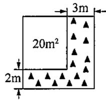  
第2题图

  
第5题图

2. 如图, 将一块正方形空地划出部分区域进行绿化, 原空地一边减少了  $2 \mathrm{~m}$ , 另一边减少了  $3 \mathrm{~m}$ , 剩余一块面积为  $20 \mathrm{~m}^{2}$  的矩形空地, 则原正方形空地的边长是 ( )

(A)  $7\mathrm{m}$

(B)  $8\mathrm{m}$

(C)  $9\mathrm{m}$

(D)  $10\mathrm{m}$

3. 一个两位数，个位上的数字比十位上的数字小4，且个位数字与十位数字的平方和比这个两位数小4. 设这个两位数的个位数字为  $x$ ，则可列方程为 （）

(A)  $x^{2} + (x - 4)^{2} = 10(x - 4) - 4;$

(B)  $x^{2} + (x - 4)^{2} = 10x + (x - 4) + 4;$

(C)  $x^{2} + (x + 4)^{2} = 10(x + 4) + x - 4;$

(D)  $x^{2} + (x - 4)^{2} = 10x + (x - 4) - 4.$

4. 某学校要组织一次排球邀请赛, 参赛的每两个队之间都要比赛 1 场, 根据场地和时间等条件, 赛程计划安排 7 天, 每天安排 4 场比赛. 设比赛组织者应邀请  $x$  个队参赛, 则  $x$  满足的关系式为 ( )

(A)  $\frac{1}{2} x(x + 1) = 28$ ;

(B)  $\frac{1}{2} x(x - 1) = 28$

(C)  $x(x + 1) = 28$

(D)  $x(x - 1) = 28.$

5. 王叔叔从市场上买了一块长  $80 \mathrm{~cm}$ , 宽  $70 \mathrm{~cm}$  的矩形铁皮, 准备制作一个工具箱. 如图, 他将矩形铁皮的四个角各剪掉一个边长为  $x \mathrm{~cm}$  的正方形后, 剩余的部分刚好能围成一个底面积为  $3000 \mathrm{~cm}^{2}$  的无盖长方体工具箱. 根据题意列方程为 ( )

(A)  $(80 - x)(70 - x) = 3000$

(B)  $80 \times 70 - 4x^{2} = 3000$

(C)  $(80 - 2x)(70 - 2x) = 3000$

(D)  $80 \times 70 - 4x^{2} - (70 + 80)x = 3000.$

# 二、填空题

6. 有一矩形，如果它的面积为24，周长为20，那么这个矩形的长与宽分别为  
7. 正方形的边长为  $x$ , 如果每条边长增加 3, 所得的正方形的面积比原正方形面积的 2 倍还大 9, 那么  $x$  所满足的方程应是  
8. 利用墙的一边，再用长为  $26\mathrm{m}$  的木栅栏作三边，围成一个面积为  $80\mathrm{m}^2$  的矩形猪圈。如果墙长为  $15\mathrm{m}$ ，那么该矩形猪圈的长、宽分别为  
9. 一块矩形铁皮, 长 \(40 \mathrm{~cm}\), 宽 \(30 \mathrm{~cm}\), 在它的四角各截去一个面积相等的小正方形, 再把四边折起来, 做一个无盖铁盒子, 使其底面积是原来面积的一半, 则盒子的高为 \(\_ \_ \_ \_ \_ \_ \_ \_ \_ \_ \_ \_ \_ \_ \_ \_ \_ \_ \_ \_ \_ \_ \_ \_ \_ \_ \_ \_ \_ \_ \_ \_ \_ \_ \_ \_ \_ \_ \_ \_ \_ \_ \_ \_ \_ \_ \_ \_ \_ \_ \_  
10. 已知两个连续正奇数的平方和比它们的平均数的 28 倍还多 2, 则这两个数是

# 三、解答题

11. 要建一个面积为  $150 \mathrm{~m}^{2}$  的长方形养鸡场, 为了节约材料, 鸡场的一边靠着原有的一堵墙, 墙长为  $20 \mathrm{~m}$ , 另三边用竹篱笆围成, 如果篱笆的长为  $35 \mathrm{~m}$ , 求鸡场的长和宽.

12. 要对一块长  $60 \mathrm{~m}$ , 宽  $40 \mathrm{~m}$  的长方形荒地  $ABCD$  进行绿化和硬化, 设计方案如图所示, 长方形  $P, Q$  为形状相同、面积相等的两块绿地, 其余为硬化路面,  $P, Q$  两块绿地周围的硬化路面宽度都相等, 并使两块绿地面积的和为长方形  $ABCD$  面积的  $\frac{1}{4}$ , 求  $P, Q$  两块绿地面积周围硬化路面的宽.

  
第12题图

13. 如图所示, 用同样规格的黑白两色的正方形瓷砖铺设矩形地面, 请观察下列图形并解答有关问题.

(1)在第  $n$  个图中每一横行共有 块瓷砖，每一竖列共有 块瓷砖（均用含  $n$  的代数式表示）；  
(2)第  $n$  个图中共有 块瓷砖（用含  $n$  的代数式表示）；  
(3)按上述铺设方案，铺一块这样的矩形地面共用了506块瓷砖，求此时  $n$  的值；  
(4)若黑瓷砖每块4元，白瓷砖每块3元，在问题(3)中共需花多少钱购买瓷砖？  
(5) 是否存在黑瓷砖与白瓷砖块数相等的情形？请通过计算说明理由.

  
第13题图

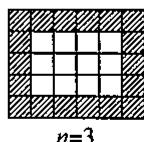

#

# 21.5 一元二次方程的应用(3)

# 一、选择题

1. 某工厂第二季度的产值比第一季度的产值增长了  $x\%$ ，第三季度的产值又比第二季度的产值增长了  $x\%$ ，则第三季度的产值比第一季度的产值增长了 （）

(A)  $2x\%$

(B)  $1 + 2x\%$

(C)  $(1 + x\%)x\%$

(D)  $(2 + x\%)x\%$

2. 某学校要组织一次排球赛，计划每两队都要比赛1场，一共安排28场比赛，设该学校邀请  $x$  个队参赛，那么可列方程 （）

(A)  $x(x - 1) = 28$

(B)  $\frac{1}{2} x(x - 1) = 28$

(C)  $x^{2} = 28$

(D)  $\frac{1}{2} x^2 = 28.$

3. 两年前生产1千克甲种药品的成本为80元，随着生产技术的进步，现在生产1千克甲种药品的成本为60元。设甲种药品成本的年平均下降率为  $x$ ，根据题意，下列方程正确的是（）

(A)  $80(1 - x^{2}) = 60;$

(B)  $80(1 - x)^{2} = 60;$

(C)  $80(1 - x) = 60$

(D)  $80(1 - 2x) = 60.$

4. 制造某种产品，若计划经过两年使成本降低  $36\%$  ，则每年应平均降低的百分率是 （）

(A)  $60\%$

(B)  $30\%$

(C)  $20\%$

(D)  $10\%$ .

# 二、填空题

5. 某公司 2022 年缴税 40 万元, 2024 年缴税 48.4 万元, 该公司这两年缴税的年平均增长率是  
6. 张先生于2020年7月8日买入2020年中国工商银行发行的5年期国库券10000元，回家后他在存单的背面记下了当国库券于2025年7月8日到期后，他可获得的利息为3900元，若张先生计算无误，则这种国库券的年利率是  
7. 某市在低空经济领域实现了新的突破。今年第一季度低空飞行航线安全运行了 200 架次，预计第三季度低空飞行航线安全运行将达到 401 架次。设第二、第三两个季度安全运行架次的平均增长率为  $x$ ，根据题意，可列方程为  
8. 某小组每人送给他人一件礼物，全组共送了90件礼物，则该小组共有 ______ 人.

# 三、解答题

9. 张大爷在银行里存入10000元，一年后，取出本金和利息，添加了20000元后又一起存入银行。再过一年后全部取出，共取出30642.56元，如果每年的年利率相同，求年利率是多少。

10. 某旅游景点为了吸引游客, 推出的团体票收费标准如下: 如果团体人数不超过 25 人, 每张票价 150 元; 如果超过 25 人, 每增加 1 人, 每张票价降低 2 元, 但每张票价不得低于 100 元, 阳光旅行社共支付团体票价 4800 元, 则阳光旅行社共购买多少张团体票?

11. 某玩具厂生产一种玩具, 按照控制固定成本降价促销的原则, 使生产的玩具能够及时售出, 据市场调查: 每个玩具按 480 元销售时, 每天可销售 160 个; 若销售单价每降低 1 元, 每天可多售出 2 个. 已知每个玩具的固定成本为 360 元, 问这种玩具的销售单价为多少元时, 厂家每天可获利润 20000 元?

# 21.5 一元二次方程的应用(4)

# 一、选择题

1. 下列关于  $x$  的方程是分式方程的是 （）

(A)  $\frac{x + 5}{2} = 1$ ;

(B)  $\frac{1}{3} x^2 + 2x - 1 = 0$ ;

(C)  $x + \frac{1}{x} = 2;$

(D)  $\frac{1}{a} x^2 +x = \frac{1}{a} (a\neq 0).$

2. 把分式方程  $\frac{4}{x} - \frac{1}{x - 1} = 1$  化为整式方程，方程两边需同时乘的最简公分母是 （）

(A)  $x - 1$

(B)  $x(x - 1)$

(C)  $x$

(D)  $x + 1$

3.方程  $\frac{2x}{x^2 - 4} -\frac{3}{2 - x} = \frac{5}{2 + x}$  去分母后所得方程是 （

(A)  $2x - 3(2 + x) = 5(2 - x)$ ;

(B)  $2x + 3(2 + x) = 5(2 - x)$

(C)  $2x - 3(2 + x) = -5(2 - x)$ ;

(D)  $2x + 3(2 + x) = -5(2 - x)$

4. 学校用 420 元钱到商场去购买“84”消毒液, 经过还价, 每瓶便宜 0.5 元, 结果比用原价多买了 20 瓶. 若设原价每瓶  $x$  元, 则可列方程为 ( )

(A)  $\frac{420}{x} - \frac{420}{x - 0.5} = 20$ ;

(B)  $\frac{420}{x - 0.5} -\frac{420}{x} = 20;$

(C)  $\frac{420}{x} - \frac{420}{x - 20} = 0.5$ ;

$\frac{420}{x - 20} - \frac{420}{x} = 0.5.$

5. 某校计划修建一条 400 米长的跑道, 开工后每天比原计划多修 10 米, 结果提前 2 天完成任务. 如果设原计划每天修  $x$  米, 那么根据题意可列出方程为 ( )

(A)  $\frac{400}{x} - \frac{400}{x - 10} = 2$ ;

(B)  $\frac{400}{x - 10} -\frac{400}{x} = 2;$

(C)  $\frac{400}{x} - \frac{400}{x + 10} = 2$ ;

(D)  $\frac{400}{x + 10} -\frac{400}{x} = 2.$

# 二、填空题

6. 方程  $\frac{2}{3 - x} + 1 = \frac{3}{x^2 - 9}$  化为整式方程为  
7. 方程  $\frac{2x}{x - 5} = 1 + \frac{10}{x - 5}$  的根是  
8. 方程  $\frac{8}{x^2 - 4} = \frac{2}{x - 2} + 1$  的根是  
9. 若分式  $\frac{x^2 - 2x - 3}{x^2 + x}$  的值为0，则  $x =$  
10. 若分式方程  $\frac{x - 1}{x - 2} = \frac{m}{x - 2} + 2$  无解，则  $m$  的值为  
11. 一项工作，如果甲独立做需要10天完成，甲、乙两人合做需要  $x$  天完成，那么乙独立工作一天能完成整个工程的 ________。

12. 甲、乙两人共同完成一项工作需要  $x$  天，甲单独完成这项工作的一半比两人共同完成这项工作要多6天，乙单独完成这项工作的一半比两人共同完成这项工作要少4天，则  $x$  满足的方程为

# 三、解答题

13. 解下列分式方程：

(1)  $\frac{x^2}{x - 3} = \frac{3x}{x - 3}$ ;

(2)  $\frac{4}{x} - \frac{1}{x - 1} = 1$ ;

(3)  $\frac{2}{x} - \frac{3}{x + 1} = 2$ ;

(4)  $\frac{x}{x + 2} + \frac{x + 2}{x - 2} = \frac{8}{x^2 - 4}$ .

14. 某灯具店采购了一批某种型号节能灯, 共用去了 400 元, 在搬运过程中不慎打碎了 5 盏, 该店把余下的灯每盏加价 4 元全部售出, 然后用所得的钱又采购了一批同样型号的节能灯, 且进价与上次相同, 但购买数量比上次多了 9 盏, 求每盏灯的进价.

15. 某中学库存 960 套旧桌凳, 修理后捐助给贫困山区学校, 现有甲、乙两个木工小组都想承揽这项业务, 经协商后知: 甲小组单独修理这批桌凳比乙小组多用 20 天; 乙小组每天比甲小组多修 8 套; 学校每天需付甲小组修理费 80 元, 付乙小组 120 元.

(1)求甲、乙两个木工小组每天各修桌凳多少套？  
(2)在修理过程中，学校要委派一名维修工进行质量监督，并由学校负担他每天10元的生活补助，现有以下三种修理方案供选择：①由甲小组单独修理；②由乙小组单独修理；③由甲、乙两小组共同合作修理。你认为哪种方案既省时又省钱？试比较说明。

# 21.5 一元二次方程的应用(5)

# 一、选择题

1. 有两块面积相同的小麦试验田，分别收获小麦  $9000\mathrm{kg}$  和  $15000\mathrm{kg}$ ，已知第一块试验田每公顷的产量比第二块少  $3000\mathrm{kg}$ 。若设第一块试验田每公顷的产量为  $x\mathrm{kg}$ ，根据题意，可得方程（）

(A)  $\frac{9000}{x + 3000} = \frac{15000}{x}$ ;

(B)  $\frac{9000}{x} = \frac{15000}{x - 3000}$ ;

(C)  $\frac{9000}{x} = \frac{15000}{x + 3000}$ ;

(1)  $\frac{9000}{x - 3000} = \frac{15000}{x}$ .

2. 一项工程, 若甲队承包刚好在规定日期  $x$  天内完成, 乙队承包则要  $y$  天完成  $(y > x)$ . 现由甲、乙两队合做 2 天, 剩下部分由乙队单独做, 刚好在规定日期完成. 根据题意, 可列出关于  $x, y$  的方程为 ( )

(A)  $\frac{2}{x} +\frac{x}{y} = 1;$

(B)  $\frac{2}{x} + \frac{x - 2}{y} = 1$ ;

(C)  $\frac{x + 2}{x + y} = 1$ ;

(D)  $\frac{2}{x} + \frac{5}{y} = 3.$

3. 登山比赛时, 小明上山时速度为  $a$  米/分, 下山时速度为  $b$  米/分, 设上、下山的路程都是  $s$  米, 则小明在全程中的平均速度是 ( )

(A)  $\frac{a + b}{2}$  米/分；

(B)  $\frac{2s}{a + b}$  米/分；

(C)  $\frac{s}{\frac{s}{a} + \frac{s}{b}}$  米/分；

(D)  $\frac{2ab}{a + b}$  米/分.

4. 一汽船在顺流中航行46千米和逆流中航行34千米，共用去的时间正好等于它在静水中航行80千米用去的时间，已知水流速度是2千米/时。若设该汽船在静水中的航行速度为  $x$  千米/时，则所列方程正确的是 （）

(A)  $\frac{46}{x + 2} + \frac{34}{x - 2} = \frac{80}{x}$ ;

(B)  $\frac{46}{x - 2} + \frac{34}{x + 2} = \frac{80}{x}$ ;

(C)  $\frac{46}{x} + \frac{34}{x - 2} = \frac{80}{x + 2}$ ;

(D)  $\frac{34}{x + 2} = \frac{80}{x} -\frac{46}{x}$

# 二、填空题

5. 甲、乙单独完成一项工作分别需要  $x$  天和 10 天，两人合作需要 _______ 天完成。

6. 甲、乙两人同时从  $A$  地出发到  $B$  地，甲的速度是  $x$  千米/时，乙每小时比甲慢1千米，若  $A, B$  两地相距40千米，则甲比乙早到 ________ 小时.

7. 已知  $A, B$  两地之间一条水路长为  $s$  千米，若某船每小时航行  $a$  千米，水流速度每小时  $b$  千米，则该船从  $A$  到  $B$  再从  $B$  到  $A$  来回航行一次，所需时间为 ______ 小时.

8. 某农场开挖一条长480米的渠道，开工后，每天比原计划多挖20米，结果提前4天完成任务。若设原计划每天挖  $x$  米，则求  $x$  时所列方程正确的是

9. 某鞋厂从商交会接到一宗生产 13 万双运动鞋的业务, 在生产完 4 万双后, 接到买方急需货物的通知, 为能及时满足买方需求, 该厂改进了操作方法, 每月能多生产 1 万双, 一共用 5 个月完成了这宗生产业务. 若设改进操作方法后每月能生产  $x$  万双运动鞋, 则可列方程

# 三、解答题

10. 某人要完成 3000 个字的打字任务, 在打完了 800 个字后, 加快了打字速度, 每分钟比原来多打 15 个字, 共用 1 小时完成任务, 求加快速度后每分钟打多少个字.

11. 某中学的学生参加“手拉手活动”，甲班全体学生（人数不超过60）都参加此项活动，共捐书200本；乙班学生有25人参加此项活动，共捐书175本。已知两个班参加此项活动的学生人均捐书比甲班人均捐书多1本，求甲班有多少名学生。  
12. 甲、乙两人用规定时间共同完成某项工作，甲每天出勤，共得工资5000元，乙缺勤10天，共得工资2400元；如果乙每天出勤，而甲缺勤8天，那么乙的工资比甲多600元，问：两人每天工资各是多少元？

# 习题21.5

# 一、选择题

1. 两个连续奇数中，设较大一个为  $x$ ，则另一个为 （）

(A)  $x + 1$

(B)  $2x - 2$

(C)  $2x + 1$

(D)  $x - 2$

2. 一个两位数等于它的个位数字的平方，且个位数字比十位数字大3，则这个两位数为 （）

(A)25;

(B)36;

(C)25或36；

(D)-25或一36.

3. 一个初中毕业班的每一位同学都将自己的照片向全班其他同学各送一张表示留念，全班共送了2550张相片. 设全班有  $x$  名学生，根据题意可列方程为 （）

(A)  $x(x + 1) = 2550$

(B)  $x(x - 1) = 2550$

(C)  $2x(x + 1) = 2550$

(D)  $x(x - 1) = 2550 \times 2$ .

4. 某厂一月份生产某机器 100 台, 计划二、三月份共生产 280 台. 设二、三月份每月的平均增长率为  $x$ , 根据题意列出的方程是 ( )

(A)  $100(1 + x)^{2} = 280$  
(B)  $100(1 + x) + 100(1 + x)^{2} = 280;$  
(C)  $100(1 - x)^{2} = 280$  
(D)  $100 + 100(1 + x) + 100(1 + x)^{2} = 280.$

5. 如图, 学校课外生物小组的试验园地的形状是长 35 米、宽 20 米的矩形. 为便于管理, 要在中间开辟一横两纵共三条等宽的小道, 使种植面积为 600 平方米. 若设小道的宽为  $x$  米, 则根据题意可列方程为 ( )

(A)  $35 \times 20 - 35x - 20x + 2x^{2} = 600$ ;  
(B)  $35 \times 20 - 35x - 2 \times 20x = 600$ ;  
(C)  $(35 - 2x)(20 - x) = 600$  
(D)  $(35 - x)(20 - 2x) = 600.$

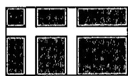  
第5题图

6. 一列客车已晚点6分钟，如果将速度每小时加快10千米，那么继续行驶20千米便可正点运行。如果设客车原来行驶的速度是  $x$  千米/时，那么可列出分式方程为 （）

(A)  $\frac{20}{x} -\frac{20}{x + 10} = 6;$

(B)  $\frac{20}{x} - \frac{20}{x + 10} = \frac{1}{10}$ ;

(C)  $\frac{20}{x + 10} -\frac{20}{x} = 6;$

(D)  $\frac{20}{x + 10} -\frac{20}{x} = \frac{1}{10}.$

# 二、填空题

7. 某企业的年产值在两年内从1000万元增加到1210万元，则平均每年增长的百分率为  
8. 若  $m$  个人  $n$  天内完成某项工程，则增加5人后完成这项工程需要 天.  
9. 某工厂接受加工 960 个机器零件的生产任务, 如果该工厂每天加工  $x$  个零件能如期完成任务, 那么每天多生产 2 个零件, 能够提前 _______ 天完成任务.  
10. 在一次生日聚会上, 如果参加的每名同学都与其他同学握 1 次手, 已知参加这次聚会的所有同学共握手 105 次, 那么参加此次聚会的同学共有 ______ 人.

# 三、解答题

11. 解下列方程：

(1)  $\frac{1}{x^2 + x} + \frac{1}{x + 1} = 2$ ;

(2)  $\frac{6x}{x^2 - 1} = 1 + \frac{5}{1 - x} + \frac{3}{x + 1}$ .

12. 某超市今年3月份的销售额为80万元，4月份由于内部装修，销售额下降了  $20\%$ 。5月份后，由于装修一新，吸引了不少顾客，月销售额大幅度上升，到了6月份，销售额猛增到100万元。求该超市5、6月份平均每月销售额的增长率。

13. 甲、乙两地相距32千米，某人骑自行车往返于甲、乙两地，去时的速度比返回的速度每小时多4千米，故少用40分钟，求往返速度各是多少？

# 第21章 复习(1)

# 一、选择题

1. 下列关于  $x$  的方程中，一定是一元二次方程的是 （）

(A)  $x^{2} - 2 = (x + 3)^{2}$ ;

(B)  $ax^2 + bx + c = 0$ ;

(C)  $x^{2} + \frac{3}{x} - 5 = 0$ ;

(D)  $x(x + 1) = 2(x + 1)$

2.下列方程的解不是  $x = 2$  的是 （）

(A)  $3(x - 2) = 0$

(B)  $2x^{2} - 3x = 2$

(C)  $(x - 2)(x + 2) = 0$

(D)  $x^{2} - x + 2 = 0$

3. 用配方法解方程  $x^{2} - 2 = 4x$  ，下列配方正确的是 （）

(A)  $(x - 2)^{2} = 6$

(B)  $(x + 2)^{2} = 2$

(C)  $(x - 2)^{2} = -2$

(D)  $(x - 2)^{2} = 2$

4. 钟老师出示了小黑板上的题目(如图)后, 小敏回答“方程有一根为 1”, 小聪回答“方程有一根为 2”, 你认为 ( )

已知方程  $x^{2} - 3x + k + 1 = 0$  试添加一个条件，使它的两根之积为2.

# 第4题图

(A)只有小敏回答正确；

(B)只有小联回答正确；

(C)小敏、小聪回答都正确；

(D)小敏、小聪回答都不正确.

5. 若一元二次方程  $a(x - b)^2 = 7$  的两根为  $\frac{1}{2} \pm \frac{1}{2}\sqrt{7}$ ，其中  $a, b$  为两实数，则  $a + b$  的值为（）

(A)  $\frac{5}{2}$ ;

(B)  $\frac{9}{2}$ ;

(C)3;

(D)5.

6. 一家超市的某品牌服装原价为1280元，连续两次降价  $a\%$  后售价为520元，下面所列方程中正确的是 （）

(A)  $1280(1 - 2a\%) = 520$

(B)  $1280(1 - a\%) = 520$

(C)  $1280(1 - a\%)^2 = 520;$

(D)  $1280(1 + a\%)^2 = 520.$

# 二、填空题

7. 方程  $2x^{2} - 2\sqrt{3} x + 1 = 0$  的根的判别式的值是  
8. 若  $|m + 1| + \sqrt{n - 2} = 0$ ，则方程  $x^{2} + 3mx - mn = 0$  的解是  
9. 已知三角形两边长分别为 5 和 9, 第三边长是方程  $x^{2} - 14x + 48 = 0$  的根, 则这个三角形的周长是  
10. 已知关于  $x$  的一元二次方程  $(k - 1)x^{2} + 6x + k^{2} - 3k + 2 = 0$  的常数项为零，则  $k$  的值为  
11. 设  $x_{1}, x_{2}$  是方程  $2x^{2} - 3x - 3 = 0$  的两个实数根，则  $\frac{x_1}{x_2} + \frac{x_2}{x_1}$  的值为  
12. 餐桌桌面是长为  $160 \mathrm{~cm}$  、宽为  $100 \mathrm{~cm}$  的长方形，妈妈准备设计一块矩形桌布，面积是桌面的2倍，且四周垂下来的桌布宽相等，小强想帮妈妈求出四周垂下来的桌布宽，如果设四周垂下来的桌布宽为  $x \mathrm{~cm}$ ，所列方程应为

# 三、解答题

13. 用适当的方法解下列方程：

(1)  $(3x - 1)^{2} = (x + 1)^{2}$ ;

(2)  $2x^{2} + x - \frac{1}{2} = 0$ .

14. 设关于  $x$  的一元二次方程  $x^{2} + 3x + m - 1 = 0$  的两个实数根分别为  $x_{1}, x_{2}$ .

(1)求  $m$  的取值范围；  
(2) 若  $2(x_{1} + x_{2}) + x_{1}x_{2} + 10 = 0$ ，求  $m$  的值.

15. 请阅读下列材料：

问题：已知方程  $x^{2} + x - 1 = 0$  ，求一个一元二次方程，使它的根分别是已知方程根的2倍

解：设所求方程的根为  $y$ ，则  $y = 2x$ ，所以  $x = \frac{y}{2}$

把  $x = \frac{y}{2}$  代入已知方程，得  $\left(\frac{y}{2}\right)^2 +\frac{y}{2} -1 = 0$  ，化简，得  $y^{2} + 2y - 4 = 0$

故所求方程为  $y^{2} + 2y - 4 = 0$

这种利用方程根的代换求新方程的方法，我们称为“换根法”。

请用阅读材料提供的“换根法”求新方程(要求：把所求方程化为一般形式)：

(1)已知方程  $x^{2} + x - 2 = 0$  ，求一个一元二次方程，使它的根分别为已知方程根的相反数，则所求方程为  
(2)已知关于  $x$  的一元二次方程  $ax^2 + bx + c = 0$  有两个不等于零的实数根，求一个一元二次方程，使它的根分别是已知方程根的倒数.

# 第21章 复习(2)

# 一、选择题

1. 方程  $(x + 1)^2 = 3(x + 1)$  的根为 （）

(A)2;

(B)  $x_{1} = 2, x_{2} = -1$ ;

(C)  $x_{1} = \sqrt{3}, x_{2} = -1$ ;

(D)  $x = -1$

2. 若  $(a^{2} + \sqrt{5} - 2)^{2} = 20$  ，则  $a^2$  的值为 （ ）.

(A)  $2 + \sqrt{5}$ ;

(B)  $2 - \sqrt{5}$

(C)  $2 + \sqrt{5}$  或  $2 - 3\sqrt{5}$

(D)  $2 - 3\sqrt{5}$

3. 设一元二次方程  $x^{2} - 3x + 1 = 0$  的两个根为  $x_{1}, x_{2}$ , 则  $x_{1}^{2} + 3x_{2} + x_{1}x_{2} - 2$  的值是 （）

(A)10;

(B)9;

(C)8;

(D)7.

4. 若在实数范围内定义一种运算“*”，使  $a * b = (a + 1)^2 - ab$ ，则方程  $(x + 2) * 5 = 0$  的解为（）

(A)  $x_{1} = x_{2} = -2$

(B)  $x_{1} = -2, x_{2} = 3$ ;

$\mathrm{(C)}x_{1} = \frac{-1 + \sqrt{3}}{2},x_{2} = \frac{-1 - \sqrt{3}}{2};$

(D)  $x_{1} = \frac{-1 + \sqrt{5}}{2}, x_{2} = \frac{-1 - \sqrt{5}}{2}$ .

5. 解方程  $(x - 1)^2 - 5(x - 1) + 4 = 0$  时，我们可以将  $x - 1$  看成一个整体，设  $x - 1 = y$ ，则原方程可化为  $y^2 - 5y + 4 = 0$ ，解得  $y_1 = 1, y_2 = 4$ . 当  $y = 1$  时，即  $x - 1 = 1$ ，解得  $x = 2$ ；当  $y = 4$  时，即  $x - 1 = 4$ ，解得  $x = 5$ ，所以原方程的解为  $x_1 = 2, x_2 = 5$ . 则利用这种方法求得方程  $(2x + 5)^2 - 4(2x + 5) + 3 = 0$  的解为 （）

(A)  $x_{1} = 1, x_{2} = 3$ ;

(B)  $x_{1} = -2, x_{2} = 3$ ;

(C)  $x_{1} = -3, x_{2} = -1$ ;

(D)  $x_{1} = -1, x_{2} = -2$ .

6. 如图, 将边长为  $2 \mathrm{~cm}$  的正方形  $ABCD$  沿其对角线  $AC$  剪开, 再把  $\triangle ABC$  沿着  $AD$  方向平移, 得到  $\triangle A'B'C'$ , 若两个三角形重叠部分的面积为  $1 \mathrm{~cm}^2$ , 则它移动的距离  $AA'$  等于 ( )

  
第6题图

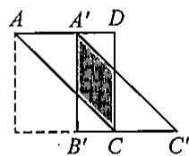

(A)0.5cm;

(B)1 cm;

(C)1.5cm;

(D)  $2\mathrm{cm}$

# 二、填空题

7. 将一元二次方程  $\frac{1}{3} x(x - 2) = 5$  化为二次项系数为“1”的一般形式是  
8. 若  $x = -2$  是关于  $x$  的一元二次方程  $ax^2 - 4 = 0$  的一个解，则这个方程的另一个解是  
9. 已知代数式  $2x(x + 1)$  与代数式  $3x - 3$  的值互为相反数，则  $x$  的值为  
10. 若关于  $x$  的方程  $ax^2 + bx + c = 3$  的解与  $(x - 1)(x - 4) = 0$  的解相同，则  $5a + b$  的值为 _______.  
11. 《田亩比类乘除捷法》是我国古代数学家杨辉的著作, 其中有一个数学问题: “直田积八百六十四步, 只云长阔共六十步, 问长多阔几何?”意思是: 一块矩形田地的面积为 864 平方步, 只知道它的长与宽共 60 步, 问它的长比宽多多少步? 根据题意得, 长比宽多______步.  
12. 已知  $x_{1}, x_{2}$  是关于  $x$  的一元二次方程  $x^{2} + 2x + k - 1 = 0$  的两个实数根, 且  $x_{1}^{2} + x_{2}^{2} - x_{1}x_{2} = 13$ , 则  $k$  的值为

# 三、解答题

13. 解下列方程：

(1)  $(x + 3)(x - 1) = 5$ ;

(2)  $2x^{2} - 8x + 6 = 0$  （用配方法）；

(3)  $(x - 1)^2 + 2x(x - 1) = 0$ ;

(4)  $\frac{1}{2 + x} - \frac{2}{x - 3} = \frac{3}{2}$ .

14. 已知方程  $x^{2} - 3x + 1 = 0$  的两个根分别为  $x_{1}$  和  $x_{2}$ , 不解方程. 求下列各式的值:

(1)  $(x_{1} - 1)(x_{2} - 1)$ ;

(2)  $\frac{x_2}{x_1 + 1} + \frac{x_1}{x_2 + 1}$ .

15. 某商店购进一种商品, 单价为 30 元. 试销中发现这种商品每天的销售量  $p$  (件) 与每件的销售价  $x$  (元) 满足关系:  $p = 100 - 2x$ . 若商店每天销售这种商品要获得 200 元的利润, 则每件商品的售价应定为多少元? 每天要售出这种商品多少件?

16. 在等腰三角形  $ABC$  中,  $BC = 6$ ,  $AB, AC$  的长是关于  $x$  的方程  $x^2 - 10x + m = 0$  的两个整数根, 你能求出  $m$  的值吗? 试试看.

# 挑战压轴题21

1. 观察下列方程及其解的特征：

(1)  $x + \frac{1}{x} = 2$  的解为  $x_{1} = x_{2} = 1$ ;  
(2)  $x + \frac{1}{x} = \frac{5}{2}$  的解为  $x_{1} = 2, x_{2} = \frac{1}{2}$ ;  
(3)  $x + \frac{1}{x} = \frac{10}{3}$  的解为  $x_{1} = 3, x_{2} = \frac{1}{3}$ ;

···

解答下列问题：

(1) 请猜想: 方程  $x + \frac{1}{x} = \frac{26}{5}$  的解为  
(2) 请猜想: 关于 \(x\) 的方程 \(x + \frac{1}{x} = \_\_\_\_\_\_\_\_\_\_\_\_ 的解为 \(x_{1} = a, x_{2} = \frac{1}{a} (a \neq 0)\);  
(3)下面以解方程  $x + \frac{1}{x} = \frac{26}{5}$  为例，验证(1)中猜想结论的正确性.

2. 阅读例题, 回答问题

例：解方程：  $x^{2} - |x - 1| - 1 = 0.$

解：①当  $x - 1 \geqslant 0$  ，即  $x \geqslant 1$  时，原方程可化为  $x^{2} - (x - 1) - 1 = 0, x^{2} - x = 0$

解得  $x_{1} = 0$  （不合题意，舍去），  $x_{2} = 1$

② 当  $x - 1 < 0$  ，即  $x < 1$  时，原方程可化为  $x^{2} + (x - 1) - 1 = 0, x^{2} + x - 2 = 0,$

解得  $x_{1} = 1$  （不舍题意，舍去），  $x_{2} = -2$

综上所述，原方程的解是  $x = 1$  或  $x = -2$

依照上例解法，解方程：  $x^{2} + 2|x + 2| - 4 = 0.$

3. 某工程队在实施棚户区改造过程中承包了一项拆迁工程。原计划每天拆迁1250平方米，因为准备工作不足，第一天少拆迁了  $20\%$  。从第二天开始，该工程队加快了拆迁速度，第三天拆迁了1440平方米。

(1)求该工程队第一天拆迁的面积；  
(2)若该工程队第二天、第三天每天的拆迁面积比前一天增长的百分数相同，求这个百分数.

4. 已知关于  $x$  的一元二次方程  $x^{2} - 2x - a^{2} - a = 0 (a > 0)$ .

(1)证明：这个方程的一个根比2大，另一个根比2小；  
(2) 若对于  $a = 1, 2, 3, \dots, 2025$ ，对应的一元二次方程的两个根分别为  $\alpha_{1}, \beta_{1}, \alpha_{2}, \beta_{2}, \alpha_{3}, \beta_{3}, \dots, \alpha_{2025}, \beta_{2025}$ ，求  $\frac{1}{\alpha_{1}} + \frac{1}{\beta_{1}} + \frac{1}{\alpha_{2}} + \frac{1}{\beta_{2}} + \frac{1}{\alpha_{3}} + \frac{1}{\beta_{3}} + \dots + \frac{1}{\alpha_{2025}} + \frac{1}{\beta_{2025}}$  的值.

# 第22章 直角三角形

# 22.1 直角三角形的性质(1)

# 一、选择题

1. 在  $\mathrm{Rt}\triangle ABC$  中, 等于斜边的一半是斜边上的

(A)高；

(B)中线；

(C)角平分线；

(D)垂直平分线.

2. 如图, 已知  $\triangle ABC$  是直角三角形,  $\angle ACB = 90^{\circ}$ ,  $CD$  是  $AB$  的中线,  $CE$  是  $AB$  上的高, 下列判断错误的是 ( )

(A)  $\angle B = \angle 3$

(B)  $\angle 1 = \angle 3$

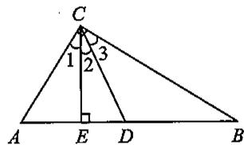  
第2题图

(C)  $\angle 2 = \angle 3$

(D)  $\angle A + \angle 3 = 90^{\circ}$ .

3.满足下列条件的三角形是直角三角形的是 （）

(A) 三角形中有一个角为  $30^{\circ}$ ;  
(B)三角形的一个角的平分线垂直平分这个角的对边；  
(C)三角形的一边等于另一边的一半；  
(D)三角形一边上的中线等于这边的一半.

# 二、填空题

4. Rt△ABC中，已知  $\angle ACB = 90^{\circ}$ $\angle A = 48^{\circ}$  ，则  $\angle B =$  
5. Rt△ABC中，已知  $\angle C = 90^{\circ}$  ，  $\angle A - \angle B = 30^{\circ}$  ，则  $\angle A =$  ，  $\angle B =$  
6. Rt△ABC中，已知  $\angle C = 90^{\circ}$ $\angle A = 20^{\circ}$  ，点  $D$  是  $AB$  的中点，则  $\angle BCD$  的度数是  
7. 在  $\mathrm{Rt}\triangle ABC$  中，已知  $CD$  是斜边  $AB$  上的高， $\angle A = 25^\circ$ ，则  $\angle BCD = \_$ 。  
8. 在 Rt $\triangle ABC$  中, 已知  $\angle C = 90^\circ$ , 点  $D$  是  $AB$  的中点,  $AB = 4 \mathrm{~cm}$ , 则  $CD =$  ________ cm.  
9. 如果直角三角形的面积是 12, 斜边上的高是 2, 那么斜边上的中线长是  
10. 若等腰直角三角形斜边上的中线为 \(5 \mathrm{~cm}\), 则这个三角形的面积为 \(\_ \_ \_ \_ \_ \_ \_ \_ \_ \_ \_ \_ \_ \_ \_ \_ \_ \_ \_ \_ \_ \_ \_ \_ \_ \_ \_ \_ \_ \_ \_ \_ \_ \_ \_ \_ \_ \_ \_ \_ \_ \_ \_ \_ \_ \_ \_ \_ \_ \_ \_

# 三、解答题

11. 如图, 已知  $\angle BEF$  和  $\angle DFE$  的平分线相交于点  $G$ , 且  $EG \perp FG$ .

求证：  $AB / / CD$

  
第11题图

12. 如图, 已知在  $\triangle ABC$  中,  $AD$  平分  $\angle BAC$ ,  $BE \perp AD$  且交  $AD$  延长线于点  $E$ , 点  $F$  为  $AB$  的中点. 求证:  $EF \parallel AC$ .

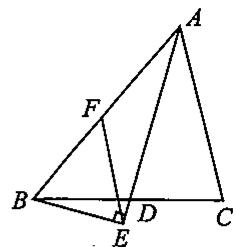  
第12题图

13. 如图, 已知在  $\triangle ABC$  中,  $\angle ACB = 90^\circ$ , 点  $D$  为  $AB$  的中点,  $BE \perp CD$  于点  $F$ , 交  $AC$  于点  $E$ . 求证:  $\angle A = \angle CBE$ .

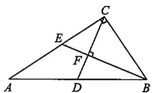  
第13题图

# 思维与拓展21

在  $\triangle ABC$  中, 已知  $\angle ACB = 90^{\circ}$ , 点  $D$  是  $AB$  的中点, 过点  $B$  作  $\angle CBE = \angle A, BE$  与射线  $CA$  相交于点  $E$ . 与射线  $CD$  相交于点  $F$ .

(1)如图，当点  $E$  在线段CA上时，求证：  $BE\bot CD$  
(2) 如果  $BE = CD$ ，那么线段  $AC$  与  $BC$  之间具有怎样的数量关系？并证明你所得到的结论；  
(3) 若  $\triangle BDF$  是等腰三角形, 求  $\angle A$  的度数.

# 22.1 直角三角形全等的判定(2)

# 一、选择题

1. 在  $\triangle ABC$  中, 如果  $\angle A: \angle B: \angle C = 1:1:2$ , 那么这个三角形一定是 ( )

(A)直角三角形；

(B)等腰三角形；

(C)等边三角形；

(D)等腰直角三角形

2. 下列条件不能确定唯一直角三角形的是 （）

(A)已知两个锐角；

(B)已知两直角边；

(C)已知一直角边和锐角；

(D)已知斜边和一直角边

3.如图，已知  $\angle B = \angle D = 90^{\circ},BC = DC,\angle 1 = 30^{\circ}$  ，则  $\angle 2$  的度数为 （）

(A)  $30^{\circ}$ ;  
(B)  $40^{\circ}$ ;  
(C)  $60^{\circ}$ ;  
(D) 以上都不对.

  
第3题图

4. 如图, 两根长度都为 8 米的铁丝, 一端都固定在旗杆上的  $A$  处, 另一端分别固定在地面的两个木桩上, 则两个木桩离旗杆底部的距离  $BD$  与  $CD$  的关系是 ( )

(A)  $BD > CD$  
(B)  $BD > CD$  
(C)  $BD = CD$  
(D)不能确定.

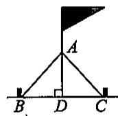  
第4题图

5. 在  $\triangle ABC$  中, 若  $\angle A = \frac{1}{3} \angle B = \frac{1}{4} \angle C$ , 则  $\triangle ABC$  是

(A)锐角三角形；

(B)直角三角形；

(C)钝角三角形；

(D)等腰三角形.

# 二、填空题

6. 如图, 已知  $\angle C = \angle D = 90^{\circ}$ , 请你再添加一个条件: ________, 使  $\triangle ABC \cong \triangle BAD$ .

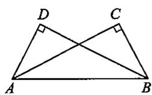  
第6题图

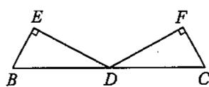  
第7题图

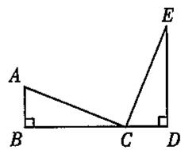  
第8题图

7. 如图, 已知点  $D$  是  $BC$  的中点,  $DE \perp EB$ ,  $DF \perp FC$ ,  $DE = DF$ , 则  $\triangle BED \cong \triangle CFD$  的理由是  
8. 如图, 已知  $\angle B = \angle D = 90^{\circ}, AB = CD$ , 要使  $\triangle ABC \cong \triangle CDE$ , 需要添加的一个条件可以是

# 三、证明题

9. 如图，在  $\triangle ABC$  中， $BD, CE$  分别是  $AC, AB$  边上的高， $BD = CE, BD$  与  $CE$  交于点  $O$ .

求证：  $OB = OC$

  
第9题图

10. 如图, 在  $\triangle ABC$  中, 已知  $\angle ABC = 45^\circ$ ,  $H$  是高  $AD$  和  $BE$  的交点.

求证：  $BH = AC$

  
第10题图

11. 如图, 已知  $AB // CD$ ,  $\angle A = 90^\circ$ ,  $AB = EC$ ,  $BC = DE$ ,  $BC$  与  $DE$  交于点  $O$ . 求证:  $BC \perp DE$ .

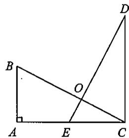  
第11题图

12. 如图, 在 Rt $\triangle ABC$  和 Rt $\triangle ADE$  中, 已知  $\angle C = \angle E = 90^\circ, BC = DE, \angle BAE = \angle DAC, BC$  与  $DE$  交于点  $F$ . 求证:  $BF = DF$ .

  
第12题图

# 习题22.1

# 一、选择题

1. 下列命题正确的有

(1)直角三角形的两个锐角相等;  
②直角三角形一条边上的中线等于这条边的一半；  
③直角三角形斜边上的中线把这个三角形分成面积相等的两部分；  
④直角三角形斜边上的高等于斜边的一半.

(A)1个；

(B)2个；

(C)3个；

(D)4个.

2. 下列命题正确的有

(1)有两条边对应相等的两个直角三角形全等;  
②有一条直角边对应相等的两个等腰直角三角形全等；  
③ 一锐角和一边对应相等的两个直角三角形全等；  
④ 两个锐角对应相等的两个直角三角形全等

(A)1个；

(B)2个；

(C)3个；

(D)4个.

3. 使两个直角三角形全等的条件是

(A)一个锐角对应相等；

(B)两个锐角对应相等；

(C)两条边对应相等；

(D)两条直角边对应相等

4. 下列命题是假命题的是

(A)斜边及一个锐角对应相等的两个直角三角形全等；  
(B)一条直角边和另一条直角边上的中线对应相等的两个直角三角形全等；  
(C)两边及其中一边的对应角对应相等的两个三角形一定全等；  
(D)斜边对应相等的两个等腰直角三角形全等

# 二、填空题

5. 在  $\mathrm{Rt}\triangle ABC$  中， $\angle C = 90^{\circ}, \angle A - \angle B = 40^{\circ}$ ，则  $\angle A = \_\_\_\_\_\_\_\_，\angle B = \_\_\_\_\_\_\_\_.$  
6. 在直角三角形中，两锐角的平分线相交成锐角的度数是 度.  
7. 已知面积为 6 的直角三角形斜边上的高为 3 , 则斜边上的中线长为  
8. 如图，在Rt△ABC中，  $\angle ACB = 90^{\circ}$ $CD\bot AB$  ，点  $E$  是  $AB$  的中点，  $\angle ACD$ $= 35^{\circ}$  ，则  $\angle ECD =$  
9. 如图, 在 Rt $\triangle ABC$  和 Rt $\triangle DEF$  中,  $\angle C = \angle F = 90^\circ$ .

(1)若  $\angle A = \angle D,BC = EF$  ，则Rt△ABC≌Rt△DEF的依据是  
(2)若  $\angle A = \angle D,AC = DF$  ，则Rt△ABC≌Rt△DEF的依据是  
(3)若  $AC = DF,AB = DE$  ，则  $\mathrm{Rt}\triangle \mathrm{ABC}\cong \mathrm{Rt}\triangle \mathrm{DEF}$  的依据是  
(4)若  $AC = DF, CB = FE$  ，则  $\mathrm{Rt}\triangle ABC \cong \mathrm{Rt}\triangle DEF$  的依据是

  
第8题图

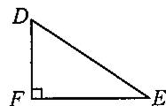  
第9题图

# 三、解答题

10. 如图, 在  $\triangle ABC$  中,  $CD \perp AB$ , 且  $BD = CD, DE = DA, M, N$  分别为  $BE, AC$  的中点, 连接  $DM, DN$ , 求证:  $DM = DN$ .

  
第10题图

11. 如图, 在  $\triangle ABC$  中,  $AD$  是高,  $CE$  是中线,  $DG \perp CE$  于  $G$ ,  $2CD = AB$ .

求证：(1)  $G$  是  $CE$  的中点；

(2)  $\angle B = 2\angle BCE.$

  
第11题图

12. 如图(1)所示,  $A, E, F, C$  在一条直线上,  $AE = CF$ , 过  $E, F$  分别作  $DE \perp AC, BF \perp AC$ , 若  $AB = CD$ , 可以得到  $BD$  平分  $EF$ , 为什么? 若将  $\triangle DEC$  的边  $EC$  沿  $AC$  方向移动, 变为如图(2)所示时, 其余条件不变, 上述结论是否成立? 请说明理由.

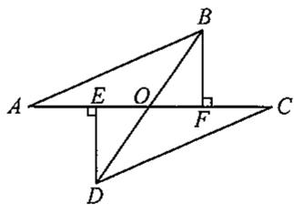  
图(1)  
第12题图

  
图(2)

# 22.2 角平分线(1)

# 一、选择题

1. 若  $\triangle ABC$  内一点  $O$  到  $\triangle ABC$  的三个顶点距离都相等，则点  $O$  是 （）

(A)三角形内角平分线的交点；  
(B)三角形三边上中线的交点；  
(C)三角形三条高的交点；  
(D)三角形三条边垂直平分线的交点.

2.如图，在△ABC中，已知  $\angle ACB = 90^{\circ}$ $BE$  平分  $\angle ABC,DE\bot AB$  于点D.如果  $AC = 3\mathrm{cm}$  ，那么  $AE + DE =$  （

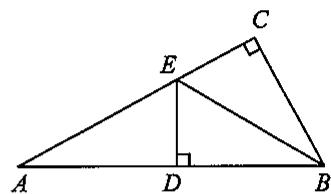  
第2题图

(A)  $2\mathrm{cm}$ ;  
(B)3 cm;  
(C)4 cm;  
(D)  $5 \mathrm{~cm}$ .

3. 已知  $AC$  平分  $\angle PAQ$ , 点  $B, B'$  分别在边  $AP, AQ$  上. 如果添加一个条件, 即可推出  $AB = AB'$ , 那么该条件不可以是 ( )

(A)  $BB^{\prime}\bot AC$

(B)  $BC = B^{\prime}C$

(C)  $\angle ACB = \angle ACB'$ ;

(D)  $\angle ABC = \angle AB^{\prime}C.$

4. 在  $\triangle ABC$  中, 已知  $AB = AC$ ,  $\angle ABC$  的平分线与  $AC$  交于点  $D$ . 若  $\angle BDC = 75^\circ$ , 则  $\angle A =$  ( )

(A)  $20^{\circ}$ ;

(B)  $30^{\circ}$ ;

(C)  $40^{\circ}$ ;

(D)  $50^{\circ}$ .

# 二、填空题

5. 如图, 已知  $AD$  是  $\triangle ABC$  的角平分线,  $DE \perp AB$ ,  $DF \perp AC$ , 垂足分别是  $E, F$ . 若  $\triangle ABC$  的面积等于  $48, AC = 12, AB = 16$ , 则  $DE =$

  
第5题图

  
第6题图

  
第7题图

  
第8题图

6. 如图, 在 \(\triangle ABC\) 中, 已知 \(BC = 5 \mathrm{~cm}, BP, CP\) 分别是 \(\angle ABC, \angle ACB\) 的平分线, 点 \(D, E\) 在边 \(BC\) 上, 且 \(PD // AB, PE // AC\), 则 \(\triangle PDE\) 的周长为 \(\_ \_ \_ \_ \_ \_ \_ \_ \_ \_ \_ \_ \_ \_ \_ \_ \_ \_ \_ \_ \_ \_ \_ \_ \_ \_ \_ \_ \_ \_ \_ \_ \_ \_ \_ \_ \_ \_ \_ \_ \_ \_ \_ \_ \_ \_ \_ \_ \_ \_ \_ 周长为 \_\_\_\_\_\_\_\_\_\_\_\_\_\_\_\_\_\_\_\_\_\_\_\_\_\_\_\_\_\_\_\_\_\_\_\_\_\_\_\_\_\_\_\_\_\_\_\_\_\_\_\_\_\_\_\_\_\_\_\_\_\_\_\_\_\_\_\_\_\_\_\_\_\_\_\_\_\_\_\_\_\_\_\_\_\_
A. \(100000000000000000000000000000000000000000000000000000000000000000000000000
B. \(1234567890123456789012345678901234567890123456789012345678901234567890123456789012345678901234567890123456789
C. \(123456789012345678901234567890123456789
D. \(12345678901234567890123456789
E. D, E\)  
7. 如图, 在 \(\triangle ABC\) 中, \(\angle C = 90^\circ\), \(AD\) 是 \(\angle BAC\) 的平分线. 已知 \(BC = 8 \mathrm{~cm}\), \(BD = 4.5 \mathrm{~cm}\), 则点 \(D\) 到 \(AB\) 的距离是 \(\_ \_ \_ \_ \_ \_ \_ \_ \_ \_ \_ \_ \_ \_ \_ \_ \_ \_ \_ \_ \_ \_ \_ \_ \_ \_ \_ \_ \_ \_ \_ \_ \_ \_ \_ \_ \_ \_ \_ \_ \_ \_ \_ \_ \_ \_ \_ \_ \_ \_ \_  
8. 如图, 在四边形  $ABCD$  中,  $BD$  平分  $\angle ABC$ ,  $AD = DC$ ,  $BC > BA$ , 则  $\angle A$  与  $\angle C$  之和等于

# 三、解答题

9. 如图, 在  $\triangle ABC$  中, 已知  $AD$  平分  $\angle BAC$ ,  $DE \perp AB$ ,  $DF \perp AC$ ,  $\triangle ABD$  的面积等于  $\triangle ACD$  的面积. 求证:  $AD \perp BC$ .

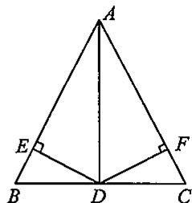  
第9题图

10. 如图, 已知  $\angle B = \angle C = 90^{\circ}$ , 点  $M$  是  $BC$  的中点,  $DM$  平分  $\angle ADC$ .

求证:  $AM$  平分  $\angle DAB$ .

  
第10题图

# 思维与拓展22

如图，已知  $AD \parallel OB, OC$  平分  $\angle AOB, P$  是  $OC$  上一点，过点  $P$  作直线  $MN$  ，分别交  $AD, OB$  于点  $M, N$  ，且  $MP = NP$ .

求证：点  $P$  到  $AO$  和  $AD$  的距离相等

# 22.2 角平分线(2)

# 一、选择题

1. 到三角形的三边距离相等的点是 （）

(A)三条角平分线的交点；

(B)三条中线的交点；

(C)三条高的交点；

(D)三条边的垂直平分线的交点.

2. 如图，在  $\triangle ABC$  中， $\angle C = 90^\circ, BC = 40, \angle BAC$  的平分线  $AD$  交  $BC$  于点  $D$ ，且  $DC:DB = 3:5$ ，则点  $D$  到  $AB$  的距离是 （）

(A)25;

(B)15;

(C)40;

(D)30.

第2题图

（ ）

3. 到三角形三个顶点距离都相等的点是

(A)三条高线的交点；

(B)三条内角平分线的交点；

(C)三条中线的交点；

(D)三边垂直平分线的交点.

4. 已知  $\triangle ABC$  的三边  $AB, BC, CA$  的长分别是 20、30、40，其三条角平分线相交于点  $O$ ，将  $\triangle ABC$  分为三个三角形，则  $S_{\triangle ABO}: S_{\triangle BCO}: S_{\triangle CAO} =$  （）

(A)  $1:1:1$ ;

(B)  $1:2:3$

(C)  $2:3:4$

(D)  $3:4:5$ .

# 二、填空题

5. 定理“角平分线上的点到角两边的距离相等”的逆定理是  
6. 如图, 在  $\triangle ABC$  中, 已知  $\angle C = 90^\circ$ ,  $AD$  平分  $\angle CAB$ ,  $BC = 10$ ,  $BD = 7$ , 则点  $D$  到  $AB$  的距离为

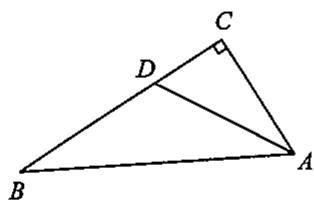  
第6题图

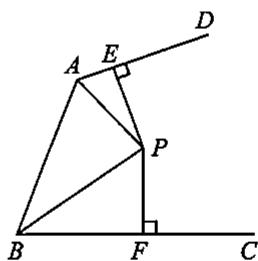  
第7题图

7. 如图, 已知  $AP, BP$  分别平分  $\angle DAB$  和  $\angle CBA, PE, PF$  分别垂直  $AD, BC$  于点  $E, F$ . 若  $AE = 1, BF = 3, EP = 2$ , 则  $S_{\triangle APB} =$  ________.

# 三、解答题

8. 如图, 已知  $E$  是  $\angle AOB$  的平分线上的一点,  $EC \perp OA$ ,  $ED \perp OB$ , 垂足是  $C, D$ . 求证:  $OE$  是  $CD$  的垂直平分线.

  
第8题图

9. 如图, 已知  $AB$  是等腰直角三角形  $ABC$  的斜边,  $AD$  是  $\angle BAC$  的平分线

求证：  $AC + CD = AB$

  
第9题图

10. 如图, 已知在  $\triangle ABC$  中,  $\angle C = 90^\circ$ ,  $\angle A = 2\angle B$ ,  $AB$  的垂直平分线交  $AB$  于点  $E$ , 交  $BC$  于点  $D$ . 求证:  $DE = DC$ .

  
第10题图

# 思维与拓展23

如图, 已知  $D$  是  $\triangle ABC$  的边  $AC$  上的一点, 过点  $D$  作  $DE \perp AB$ ,  $DF \perp BC$ , 垂足为  $E, F$ , 再过点  $D$  作  $DG // AB$ , 交  $BC$  于点  $G$ , 且  $DE = DF$ .

(1)求证：  $DG = BG$  
(2)求证：  $BD$  垂直平分  $EF$

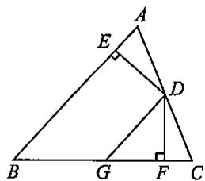

# 习题22.2

# 一、选择题

1. 点  $P$  为  $\triangle ABC$  的边  $BC$  上的点，且到  $AB, AC$  的距离相等，则  $AP$  一定是 （）

(A)  $\triangle ABC$  的角平分线；

(B)  $\triangle ABC$  的中线；

(C)  $\triangle ABC$  的高；

(D)  $AP$  所在的直线是  $BC$  的垂直平分线

2. 在  $\triangle ABC$  中,  $\angle C = 90^\circ$ ,  $AD$  是角平分线,  $BD:DC = 5:3$ ,  $BC = 32$ , 则点  $D$  到  $AB$  的距离为（）

(A)12;

(B)16;

(C)20;

(D)24.

3. 如图，在  $\triangle ABC$  中， $\angle C = 90^\circ, AC = BC, AD$  平分  $\angle CAB$  交  $BC$  于点  $D, DE \perp AB$  于点  $E$  ，且  $AB = 6 \mathrm{~cm}$ ，则  $\triangle DEB$  的周长为 （）

(A)  $4\mathrm{cm}$

(B)6 cm;

(C)10 cm;

(D) 以上都不对.

4. 在  $\triangle ABC$  中,  $AB = AC$ ,  $\angle ABC$  的平分线与  $AC$  交于点  $D$ . 若  $\angle BDC = 75^\circ$ , 则  $\angle A$  等于

(A)  $20^{\circ}$ ;

(B)  $30^{\circ}$ ;

(C)  $40^{\circ}$ ;

(D)  $50^{\circ}$ .

5. 如图，在  $\triangle ABC$  中， $\angle ACB = 90^\circ, AD$  平分  $\angle BAC$  交  $BC$  于点  $D, DE$  垂直平分  $AB$  交  $AB$  于点  $E$ . 若  $DE = \frac{1}{2} AD = 1.5 \mathrm{~cm}$ ，则  $BC$  等于（）

(A)  $3\mathrm{cm}$ ;

(B)  $7.5\mathrm{cm}$

(C)6 cm;

(D)4.5cm.

  
第3题图

（

  
第5题图

# 二、填空题

6. 在  $\triangle ABC$  中,  $\angle C = 90^\circ$ ,  $AD$  是  $\angle BAC$  的平分线,  $BC = 10 \mathrm{~cm}$ ,  $BD = 6 \mathrm{~cm}$ , 则点  $D$  到  $AB$  的距离是 ________ cm.  
7. 如图, 在 Rt $\triangle ABC$  中,  $\angle C = 90^\circ$ ,  $BD$  平分  $\angle ABC$ ,  $DE \perp AB$  于点  $E$ .

(1)如果  $AE = 4\mathrm{cm},AC = 8\mathrm{cm}$  ，那么△AED的周长为 cm;  
(2)如果  $AB = 10\mathrm{cm},BC = 6\mathrm{cm}$  ，那么  $AE = \_ \_ \_ \_ \_ \_ \mathrm{cm};$  
(3)如果  $AB = 10\mathrm{cm},BC = 6\mathrm{cm},AC = 8\mathrm{cm}$  ，那么△AED的周长为 cm;  
(4)如果  $\angle A = 10^{\circ}$  ，那么  $\angle ABD =$  
(5)如果  $\angle DBC = 10^{\circ}$  ，那么  $\angle A =$

  
第7题图

  
第8题图

8. 如图，在  $\triangle ABC$  中，若  $AD$  为  $\angle BAC$  的平分线， $AB:AC = 1:2$ ，则  $S_{\triangle ABD}:S_{\triangle ACD} =$  ________.

# 三、解答题

9. 如图, 求作一点  $P$ , 使点  $P$  到  $\triangle ABC$  三边的距离相等.

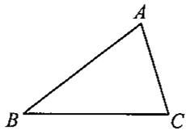  
第9题图

10. 如图,  $BF \perp AC$  于点  $F$ ,  $CE \perp AB$  于点  $E$ ,  $AD$  是  $\angle BAC$  的平分线. 求证:  $BD = CD$ .

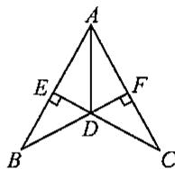  
第10题图

11. 如图,  $BE$ 、 $CE$  分别为  $\triangle ABC$  的两个外角平分线,  $EP \perp AM$  于点  $P$ ,  $EQ \perp AN$  于点  $Q$ .

求证：  $(1)EP = EQ$

(2)点  $E$  在  $\angle NAM$  的平分线上.

  
第11题图

# 22.3 勾股定理(1)

# 一、选择题

1. 若一个直角三角形的两个锐角的比为  $1:2$ ，则较大的锐角的度数为 （）

(A)  $30^{\circ}$ ;

(B)  $60^{\circ}$ ;

(C)  $45^{\circ}$ ;

(D)  $90^{\circ}$ .

2.如果直角三角形的两条直角边长分别为5和12，那么这个三角形的斜边上的中线长为（）

(A)6;

(B)6.5;

(C)10;

(D)13.

3. 如图，在  $\mathrm{Rt}\triangle ABC$  中，已知  $\angle C = 90^{\circ}, \angle A = 30^{\circ}, BD$  是边  $AC$  上的中线， $BC = 2$ . 以下推理结论错误的是 （）

  
第3题图

(A)  $AB = 4$

(B)  $AC = 2\sqrt{3}$

(C)  $CD = \sqrt{3}$ ;

(D)  $BD = 2\sqrt{3}$ .

4. 已知直角三角形的周长为  $(2 + \sqrt{6})\mathrm{cm}$ ，斜边上的中线长为  $1\mathrm{cm}$ ，则这个三角形的面积是（）

(A)  $\frac{1}{4} \mathrm{~cm}^2$ ;

(B)  $\frac{3}{4} \mathrm{~cm}^{2}$ ;

(C)  $\frac{1}{2} \mathrm{~cm}^2$ ;

(D)  $1\mathrm{cm}^2$

# 二、填空题

5. 在  $\triangle ABC$  中, 已知  $\angle C = 90^{\circ}, AB = c, AC = b, BC = a$ .

(1)当  $a = 1,b = 1$  时，  $c =$

(2)当  $a = 1, c = 2$  时， $b = \_$

(3)当  $a = 3,b = 4$  时，  $c =$

(4)当  $a = 5,c = 13$  时，  $b =$

6. 在直角三角形  $ABC$  中, 斜边  $AB = 2$ , 则  $AB^2 + AC^2 + BC^2 =$  ________.

7. 若直角三角形的三边长为连续偶数，则其周长为

8. 如图, 在  $\triangle ABC$  中, 已知  $\angle C = 90^\circ, BC = 3, AC = 4$ , 以斜边  $AB$  为直径作半圆, 则这个半圆的面积是

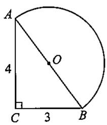  
第8题图

  
第9题图

  
第10题图

9. 如图, 校园内有两棵树, 相距 12 米, 一棵树高 13 米, 另一棵树高 8 米, 一只小鸟从一棵树的顶端飞到另一棵树的顶端, 则小鸟至少要飞 米.

10. 如图, 在  $\triangle ABC$  中, 已知  $\angle C = 90^\circ$ ,  $AB$  的垂直平分线交  $BC$  于点  $D$ . 若  $BC = 8, AD = 5$ , 则  $AC$  等于

# 三、解答题

11. 如图, 已知一等腰三角形的周长是 16, 底边上的高是 4, 求这个三角形各边的长.

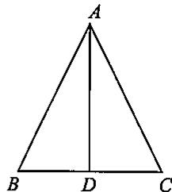  
第11题图

12. 如图, 正方形网格中的每一个小正方形的边长都是 1, 四边形  $ABCD$  的四个顶点都在格点上. 若一只小虫从点  $A$  出发绕四边形爬行一周, 求小虫所经过的路径长.

  
第12题图

13. 如图, 在两面墙之间有一个底端在点  $A$  的梯子, 当它靠在一侧墙上时, 梯子的顶端在点  $B$ ; 当它靠在另一侧墙上时, 梯子的顶端在点  $D(AB = AD)$ . 已知  $\angle BAC = 60^\circ$ ,  $\angle DAE = 45^\circ$ , 点  $D$  到地面的垂直距离  $DE = 2\sqrt{2}$  米. 求点  $B$  到地面的垂直距离  $BC$ .

  
第13题图

# 22.3 勾股定理(2)

# 一、选择题

1. 下列各组长度的线段，能组成直角三角形的一组是 （）

(A)5,6,7;

(B)1,4,9;

(C)5,12,13;

(D)5,11,12.

2. 若三角形的三边长  $a, b, c$  满足  $(a + b)^2 = c^2 + 2ab$ ，则此三角形是 （）

(A)直角三角形；

(B)锐角三角形；

(C)钝角三角形；

(D)等腰三角形.

3. 小红要求  $\triangle ABC$  最长边上的高，测得  $AB = 8\mathrm{cm}, AC = 6\mathrm{cm}, BC = 10\mathrm{cm}$ ，则可知最长边上的高是 （）

(A)48 cm;

(B)4.8cm;

(C)  $0.48\mathrm{cm}$ ;

(D)  $5 \mathrm{~cm}$ .

4. 五根小木棒，其长度分别为7、15、20、24、25，现将它们摆成两个直角三角形，其中正确的是（）

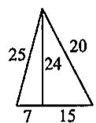  
(A)

  
(B)

  
(C)

  
(D)

# 二、填空题

5. 已知  $\triangle ABC$  的三边长为  $a = 41, b = 40, c = 9$ ，则  $\triangle ABC$  是 ______ 形.  
6. 在  $\mathrm{Rt}\triangle ABC$  中，已知  $\angle C = 90^{\circ}, AC = \frac{1}{2} AB$  ，则  $\angle A =$  
7. 已知两条线段的长为  $5 \mathrm{~cm}$  和  $4 \mathrm{~cm}$ , 则当第三条线段的长为 ______ 时, 这三条线段能组成一个直角三角形.  
8. 若  $\triangle ABC$  的三边分别为  $k, 2k, \sqrt{5} k (k > 0)$ , 则  $\triangle ABC$  直角三角形（填“是”或“不是”）.  
9. 传说古埃及人曾用“拉绳”的方法画直角，现有一根长 \(24 \mathrm{~cm}\) 的绳子，请你利用它拉出一个周长为 \(24 \mathrm{~cm}\) 的直角三角形，则你拉出的直角三角形三边的长度分别为 \(\_ \_ \_ \_ \_ \_ \_ \_ \_ \_ \_ \_ \_ \_ \_ \_ \_ \_ \_ \_ \_ \_ \_ \_ \_ \_ \_ \_ \_ \_ \_ \_ \_ \_ \_ \_ \_ \_ \_ \_ \_ \_ \_ \_ \_ \_ \_ \_ \_ \_ \_ cm, 其中的道理是

# 三、解答题

10. 如图所示的一块地, 已知  $AD = 4 \mathrm{~m}, CD = 3 \mathrm{~m}, AD \perp DC, AB = 13 \mathrm{~m}, BC = 12 \mathrm{~m}$ , 求这块地的面积.

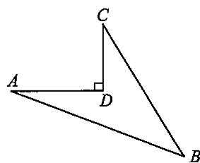  
第10题图

11. 如图, 已知  $P$  是等边三角形  $ABC$  内的一点, 连接  $PA, PB, PC$ , 以  $BP$  为边作  $\angle PBQ = 60^\circ$ , 且  $BQ = BP$ , 连接  $CQ$ .

(1)观察并猜想  $AP$  与  $CQ$  之间的大小关系，并证明你的结论；  
(2) 若  $PA:PB:PC = 3:4:5$ , 连接  $PQ$ , 试判断  $\triangle PQC$  的形状, 并说明理由.

  
第11题图

12. 如图, 已知在正方形  $ABCD$  中, 点  $E, F$  分别在边  $BC, CD$  上,  $BE = \frac{1}{2} BC, CF = \frac{1}{4} CD$ . 求证:  $\triangle AEF$  为直角三角形.

  
第12题图

# 思维与拓展24

如图， $A, B$  两个小集镇在河流  $CD$  的同侧，分别到河的距离为  $AC = 10 \mathrm{~km}, BD = 30 \mathrm{~km}$ ，且  $CD = 30 \mathrm{~km}$ 。现在要在河边建一自来水厂，向  $A, B$  两镇供水，铺设水管的费用为每千米3万元，请你在河流  $CD$  上选择水厂的位置  $M$ ，使铺设水管的费用最节省，并求出总费用。

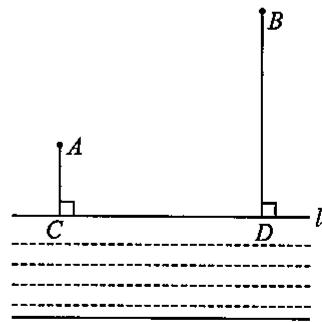

# 22.3 勾股定理(3)

# 一、选择题

1.如果直角三角形两直角边长为  $n^2 -1,2n(n > 1)$  ，那么它的斜边长是 （）

(A)  $2n$

(B)  $n + 1$

(C)  $n^2 - 1$ ;

(D)  $n^2 + 1$ .

2. 在  $\mathrm{Rt}\triangle ABC$  中， $\angle ACB = 90^{\circ}$ ，若  $\angle A = 60^{\circ}$ ，则  $AB:BC:AC =$  （）

(A)  $2:1:\sqrt{3}$ ;

(B)  $2:\sqrt{3}:1$

(C)  $1:2:\sqrt{3}$ ;

(D)  $1:\sqrt{3}:2$

3. 如图, 在  $\triangle ABC$  中, 已知  $\angle ABC = 90^{\circ}, AB = BC$ , 三角形的顶点在相互平行的三条直线  $l_{1}, l_{2}, l_{3}$  上, 且  $l_{1}, l_{2}$  之间的距离为  $2, l_{2}, l_{3}$  之间的距离为 3 , 则  $AC$  的长是 ( )

(A)  $2\sqrt{17}$ ;

(B)  $2\sqrt{5}$ ;

(C)  $4\sqrt{2}$ ;

(D)7.

  
第3题图

  
第5题图

  
第6题图

4. 有六根细木棒, 它们的长度分别为 2、4、6、8、10、12 (单位: cm), 从中取出三根首尾顺次连接搭成一个直角三角形, 则取出的这些木棒的长度分别为 ( )

(A)2、4、8；

(B)4、8、10；

(C)6、8、10;

(D)8、10、12.

5. 园丁住宅小区有一块草坪如图所示，已知  $AB = 3\mathrm{m}, BC = 4\mathrm{m}, CD = 12\mathrm{m}, DA = 13\mathrm{m}$ ，且  $AB \perp BC$ ，这块草坪的面积是 （）

(A)  $24\mathrm{m}^2$

(B)  $36\mathrm{m}^2$

(C)  $48\mathrm{m}^2$

(D)  $72\mathrm{m}^2$

6. 如图, 小红从  $A$  地向北偏东  $30^{\circ}$  方向走  $100 \mathrm{~m}$  到  $B$  地, 再从  $B$  地向西走  $200 \mathrm{~m}$  到  $C$  地, 这时小红距  $A$  地

(A)  $150\mathrm{m}$ ;

(B)  $100\sqrt{3}\mathrm{m}$

(C)  $100\mathrm{m}$ ;

(D)  $50\sqrt{3}\mathrm{m}$

# 二、填空题

7. 一个矩形的一边长为6，面积为48，则这个矩形的对角线的长为  
8. 某楼梯的侧面视图如图所示, 其中  $AB = 4 \mathrm{~m}, \angle BAC = 30^{\circ}, \angle C = 90^{\circ}$ , 因某种活动要求铺设红色地毯, 则在  $AB$  段楼梯所铺地毯的长度应为

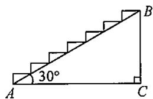  
第8题图

  
第9题图

  
第11题图

9. 如图，在  $\triangle ABC$  中，已知  $AB = 4, \angle B = 30^\circ, \angle C = 45^\circ$  ，则  $BC =$  
10. 已知直角三角形的两边长分别为 \(3\mathrm{cm}\) 和 \(5\mathrm{cm}\), 则第三边的长为 \(\_ \_ \_ \_ \_ \_ \_ \_ \_ \_ \_ \_ \_ \_ \_ \_ \_ \_ \_ \_ \_ \_ \_ \_ \_ \_ \_ \_ \_ \_ \_ \_ \_ \_ \_ \_ \_ \_ \_ \_ \_ \_ \_ \_ \_ \_ \_ \_ \_ \_ \_  
11. 如图, 在 \(\triangle ABC\) 中, 已知 \(AB = AC = 10, BC = 8\sqrt{5}\), 则底边上的高 \(AD = \_\_\_\_\_\_\_\_\_\_\_\_\_\_\_\_\_\_\_\_\_\_\_\_\_\_\_\_\_\_\_\_\_\_\_\_\_\_\_\_\_\_\_\_\_\_\_\_\_\_\_\_\_\_\_\_\_\_\_\_\_\_\_\_\_\_\_\_\_\_\_\_\_\_\_\_\_\_\_\_\_\_\_\_\_\_\_\_\_\_\_\_\_\_\_
[ CE = \_ \_ \_ \_ \_ \_ \_ \_ \_ \_ \_ \_ \_ \_ \_ \_ \_ \_ \_ \_ \_ \_ \_ \_ \_ \_ \_ \_ \_ \_ \_ \_ \_ \_ \_ \_ \_ \_ \_ \_ \_ \_ \_ \_ \_ \_ \_ \_ \_ \_ ]
[ CE = \_ \_ \_ \_ \_ \_ \_ \_ \_ \_ \_ \_ \_ \_ \_ \_ \_ \text{.} ]

12. 如图是由边长为  $1 \mathrm{~m}$  的正方形地砖铺设的地面示意图, 小明沿图中所示的折线从  $A \rightarrow B \rightarrow C$  所走的路程为

  
第12题图

  
第13题图

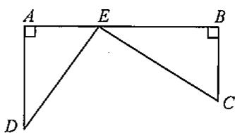  
第14题图

13. 如图, 将一根  $25 \mathrm{~cm}$  长的细木棒放入长、宽、高分别为  $8 \mathrm{~cm}, 6 \mathrm{~cm}$  和  $10 \sqrt{3} \mathrm{~cm}$  的长方体无盖盒子中, 则细木棒露在盒外面的最短长度是  
14. 铁路上有 \(A, B\) 两站(视为直线上两点)相距 \(25 \mathrm{~km}, C, D\) 为两村庄(视为两个点), \(DA \perp AB\) 于点 \(A, CB \perp AB\) 于点 \(B\) (如图). 已知 \(DA = 15 \mathrm{~km}, CB = 10 \mathrm{~km}\). 现在要在铁路 \(AB\) 上建设一个土特产品收购站 \(E\), 使得 \(C, D\) 两村到 \(E\) 站的距离相等, 则 \(E\) 站应建在距 \(A\) 站 \(\_ \_ \_ \_ \_ \_ \_ \_ \_ \_ \_ \_ \_ \_ \_ \_ \_ \_ \_ \_ \_ \_ \_ \_ \_ \_ \_ \_ \_ \_ \_ \_ \_ \_ \_ \_ \_ \_ \_ \_ \_ \_ \_ \_ \_ \_ \_ \_ \_ \_ \_ km 处.

# 三、解答题

15. 已知三角形的三边长分别是  $n - 2, n, n + 2$ ，当  $n$  是多少时，这个三角形是一个直角三角形？  
16. 如图, 一架  $2.5 \mathrm{~m}$  长的梯子  $AB$  斜靠在一竖直的墙  $AC$  上, 这时梯足  $B$  到墙底端  $C$  的距离为  $0.7 \mathrm{~m}$ . 如果梯子的顶端沿墙下滑  $0.4 \mathrm{~m}$ , 那么梯足将外移多少米?

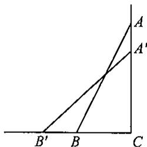  
第16题图

17. 如图, 将长方形  $ABCD$  沿  $AE$  折叠, 使点  $D$  落在边  $BC$  上点  $F$  处,  $AB = 8, AD = 10$ , 求  $EC$  的长.

  
第17题图

# 习题22.3

# 一、选择题

1. 若直角三角形的两边长分别为 12 和 5, 则第三边长为 (   )

(A)13;

(B)13或  $\sqrt{119}$

(C)13或15；

(D)15.

2.如图，  $AB = BC = CD = DE = 1,AB\bot BC,AC\bot CD,AD\bot DE$  ，则  $AE$  的值为 （）

(A)1;  
(B)  $\sqrt{2}$ ;  
(C)  $\sqrt{3}$ ;  
(D)2.

3. 已知 Rt $\triangle ABC$  中,  $\angle C = 90^\circ$ . 若  $a + b = 14, c = 10$ , 则 Rt $\triangle ABC$  的面积是 ( )

(A)36;

(B)24;

(C)48;

(D)60.

4. 若  $\triangle ABC$  的三边  $a, b, c$  满足  $(a - b)(a^2 + b^2 - c^2) = 0$ ，则  $\triangle ABC$  是 （）

(A)等腰三角形；  
(B)等边三角形；  
(C)等腰直角三角形；  
(D)等腰三角形或直角三角形

5. 已知  $\triangle ABC$  满足下列条件中的一个，其中不能说明  $\triangle ABC$  是直角三角形的是 （）

(A)  $b^{2} = a^{2} - c^{2}$ ;

(B)  $a:b:c = 1:\sqrt{3}:2;$

(C)  $\angle C = \angle A - \angle B$

(D)  $\angle A: \angle B: \angle C = 3:4:5$ .

# 二、填空题

6. 已知顶角为  $120^{\circ}$  的等腰三角形，腰长为  $10\mathrm{cm}$ ，则底边的长为 cm.  
7. 已知  $x, y$  为整数，且  $|x^2 - 4| + (y^2 - 3)^2 = 0$ ，如果以  $x, y$  的长为直角边作一个直角三角形，那么以这个直角三角形的斜边为边长的正方形的面积为 _______.  
8. 如图，在  $\triangle ABC$  中， $AB = AC = 5, BC = 4\sqrt{5}$ ，那么底边上的高  $AD = \_\_\_\_\_\_\_\_\_$  腰上的高  $CE = \_\_\_\_\_\_\_\_\_$ .

  
第8题图

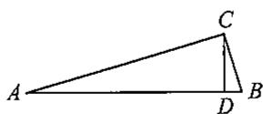  
第10题图

  
第12题图

9. 等腰三角形的两边长分别为 5 和 6, 则底边上的高为

10. 如图，在  $\triangle ABC$  中， $BC = 7, AC = 24, AB = 25$ ，如果  $CD$  是  $AB$  边上的高，那么  $CD =$  ________.  
11. 木工师傅要做一个长方形桌面, 做好后量得长为  $80 \mathrm{~cm}$ , 宽为  $60 \mathrm{~cm}$ , 对角线为  $100 \mathrm{~cm}$ , 则这个桌面 (填“合格”或“不合格”).  
12. 如图, 在长方形  $ABCD$  中,  $AB = 3, AD = 9$ , 将此正方形折叠, 使点  $A$  与点  $C$  重合, 折痕为  $EF$ , 则  $EC$  的长为

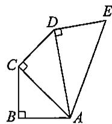  
第2题图

# 三、解答题

13. 在数轴上作出表示  $\sqrt{10}$  的点（保留作图痕迹，不写作法）.

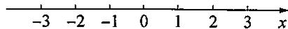  
第13题图

14. 如图, 一个直径为  $10 \mathrm{~cm}$  的杯子, 在它的正中间竖直放一根筷子, 筷子露出杯子外  $1 \mathrm{~cm}$ . 当筷子倒向杯壁时 (筷子底端不动), 筷子顶端刚好触到杯口, 求筷子的长度.

  
第14题图

15. 如果三角形有一边上的中线恰好等于这边的长. 那么称这个三角形为“有趣三角形”. 这条中线称为“有趣中线”. 如图, 在  $\triangle ABC$  中,  $\angle C = 90^\circ$ , 较短的一条直角边  $BC = 1$ , 且  $\triangle ABC$  是“有趣三角形”, 求  $\triangle ABC$  的“有趣中线”的长.

  
第15题图

16. 台风是一种自然灾害, 它以台风中心为圆心在周围上千米的范围内形成极端气候, 有极强的破坏力. 如图, 有一台风中心沿东西方向由点  $A$  行驶向点  $B$ , 已知点  $C$  为一海港, 且点  $C$  与  $A, B$  两点的距离分别为  $300 \mathrm{~km}$  和  $400 \mathrm{~km}$ , 且  $AB = 500 \mathrm{~km}$ . 以台风中心为圆心周围  $250 \mathrm{~km}$  以内为受影响区域.

(1)海港  $C$  受台风影响吗？为什么？  
(2) 若台风的速度为  $20 \mathrm{~km} / \mathrm{h}$ , 则台风持续影响该海港的时间有多长?

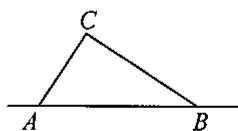  
第16题图

# 第22章 复习(1)

# 一、选择题

1.如图，  $BD$  平分  $\angle ABC,CD\bot BD,D$  为垂足，  $\angle C = 55^{\circ}$  ，则  $\angle ABC$  的度数是 （）

(A)  $35^{\circ}$ ;

(B)  $55^{\circ}$ ;

(C)  $60^{\circ}$ ;

(D)  $70^{\circ}$ .

  
第1题图

  
第2题图

2. 如图,  $\triangle ABC$  中,  $\angle ACB = 90^{\circ}$ , 沿  $CD$  折叠  $\triangle CBD$ , 使点  $B$  恰好落在  $AC$  边上的点  $E$  处. 若  $\angle A = 25^{\circ}$ , 则  $\angle BDC$  等于 ( )

(A)  $44^{\circ}$ ;

(B)  $60^{\circ}$ ;

(C)  $67^{\circ}$ ;

(D)  $70^{\circ}$ .

3. 不能使两个直角三角形全等的条件是 （）

(A)一条直角边及其对角对应相等；

(B)斜边和两条直角边对应相等；

(C)斜边和一条直角边对应相等；

(D)两个锐角对应相等

4. 如图， $\angle ACB = 90^{\circ}, AC = BC, AD \perp CE, BE \perp CE$ ，垂足分别是点  $D, E.$  若  $AD = 3, BE = 1$ ，则  $DE$  的长是 （）

(A)  $\frac{3}{2}$ ;

(B)2;

(C)  $2\sqrt{2}$ ;

(D)  $\sqrt{10}$ .

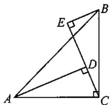  
第4题图

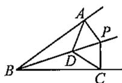  
第5题图

5. 如图, 点  $D$  是  $\angle ABC$  的平分线上的一点, 点  $P$  在  $BD$  上,  $PA \perp AB$ ,  $PC \perp BC$ , 垂足分别为  $A, C$ . 下列结论中错误的是 ( )

(A)  $AD = CP$

(B)△ABP≌△CBP;

(C)△ABD≌△CBD;

(D)  $\angle ADB = \angle CDB.$

# 二、填空题

6. 在  $\mathrm{Rt}\triangle ABC$  中， $\angle C = 90^\circ, \angle A = 35^\circ 30'$ ，则  $\angle B =$  
7. 在直角三角形中，两个锐角的差为  $40^{\circ}$ ，则这两个锐角的度数分别为  
8. 在  $\mathrm{Rt}\triangle ABC$  中，如果斜边上的中线  $CD = 4\mathrm{cm}$ ，那么斜边  $AB =$  cm.  
9. 如图，在  $\triangle ABC$  中， $AF$  平分  $\angle BAC, AC$  的垂直平分线交  $BC$  于点  $E, \angle B = 70^\circ, \angle FAE = 19^\circ$ ，则  $\angle C = \_\_\_\_\_\_\_\_\_\_\_$ 。

  
第9题图

# 三、解答题

10. 如图, 四边形  $ABCD$  是正方形, 点  $G$  是  $BC$  上的任意一点,  $DE \perp AG$  于点  $E$ ,  $BF // DE$ , 交  $AG$  于点  $F$ . 那么  $AF$  与  $BF + EF$  相等吗? 请说明理由.

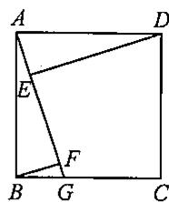  
第11题图

11. 如图,  $AB = AC, BD = CD, DE \perp AB$  于点  $E, DF \perp AC$  于点  $F$ . 求证:  $DE = DF$ .

  
第11题图

12. 如图, 已知  $\angle ABC = \angle ADC = 90^\circ$ ,  $M, N$  分别是  $AC, BD$  的中点.

(1)求证：  $MN\bot BD$  
(2)在边  $AD$  上能否找到一点  $P$  ，使得  $PB = PD?$  请说明理由.

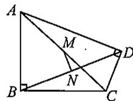  
第12题图

# 思维与拓展25

定义：三边长和面积都是整数的三角形称为“整数三角形”。数学学习小组的同学从32根等长的火柴棒(每根长度记为1个单位)中取出若干根，首尾依次相接组成三角形，进行探究活动。

小亮用12根火柴棒，摆成如图所示的“整数三角形”；

小颖分别用24根和30根火柴棒摆出直角“整数三角形”；

小辉受到小亮、小颖的启发，分别摆出三个不同的等腰“整数三角形”

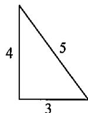

（1）请你画出小颖和小辉摆出的“整数三角形”的示意图；

(2) 你能否也从中取出若干根, 按下列要求摆出“整数三角形”, 如果能, 请画出示意图; 如果不能, 请说明理由.

①摆出等边“整数三角形”；  
②摆出一个非特殊(既非直角三角形, 也非等腰三角形)“整数三角形”.

# 第22章 复习(2)

# 一、选择题

1. 如图是一株美丽的勾股树, 其中所有的四边形都是正方形, 所有的三角形都是直角三角形. 若正方形  $A, B, C, D$  的边长分别是 3、5、2、3, 则最大正方形  $E$  的面积是 ( )

(A)13;

(B)26;

(C)47;

(D)94.

  
第1题图

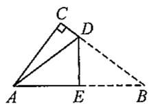  
第4题图

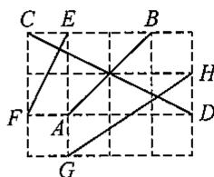  
第5题图

2. 已知一个圆桶底面直径为  $24 \mathrm{~cm}$ , 高  $32 \mathrm{~cm}$ , 则桶内所能容下的最长的木棒的长为 ( )

(A)  $20~\mathrm{cm}$ ;

(B)  $50~\mathrm{cm}$ ;

(C)40 cm;

(D)45 cm.

3. 在  $\triangle ABC$  中， $a = 9, b = 40, c = 41$ ，那么  $\triangle ABC$  是 （）

(A)锐角三角形；

(B)直角三角形；

(C)钝角三角形；

(D)等腰三角形.

4. 如图是一张直角三角形的纸片，两直角边  $AC = 6\mathrm{cm}, BC = 8\mathrm{cm}$ ，现将  $\triangle ABC$  折叠，使点  $B$  与点  $A$  重合，折痕为  $DE$ ，则  $BE$  的长为 （）

(A)  $4\mathrm{cm}$

(B)5 cm;

(C)  $6\mathrm{cm}$

(D)  $10~\mathrm{cm}$

5. 如图, 在由单位正方形组成的网格图中标有  $AB 、 CD 、 EF 、 GH$  四条线段, 其中能构成一个直角三角形三边的线段是 ( )

(A)  $CD, EF, GH$ ;

(B)AB、EF、GH;

(C)  $AB, CD, GH$ ;

(D)AB、CD、EF.

# 二、填空题

6. 若直角三角形的斜边长为  $17 \mathrm{~cm}$ , 一条直角边长为  $15 \mathrm{~cm}$ , 则面积为  
7. 一座桥长  $12\mathrm{m}$ ，一艘小船自桥北岸出发，向正南方向驶去，因水流原因，到达南岸后，发现已偏离桥南岸  $9\mathrm{m}$ ，则小船实际行驶了 ________ m.  
8. 等腰三角形  $ABC$  的面积为  $12 \, \text{cm}^2$ ，底边上的高  $AD = 3 \, \text{cm}$ ，则它的周长为 ________ cm.  
9. 已知两线段的长分别为 5、12, 则当第三条线段长为 ______ 时, 这三条线段可以构成直角三角形.

# 三、解答题

10. 我国古代数学家赵爽的“勾股圆方图”是由四个全等的直角三角形与中间的一个小正方形拼成一个大正方形(如图). 如果大正方形的面积是 13, 小正方形的面积是 1, 直角三角形的两直角边长分别为  $a, b$ , 求  $(a + b)^2$  的值.

  
第10题图

11. 如图, 在四边形  $ABCD$  中,  $AB = 1, BC = 2, CD = 2, AD = 3$ , 且  $AB \perp BC$ . 证明:  $AC \perp CD$ .

  
第11题图

12. 如图, 一块砖宽  $AN = 5 \mathrm{~cm}$ , 长  $ND = 10 \mathrm{~cm}, CD$  上的点  $B$  距地面的高  $BD = 8 \mathrm{~cm}$ . 地面上  $A$  处的一只蚂蚁到  $B$  处吃食, 要爬行的最短路线是多少?

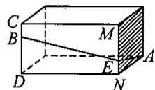  
第12题图

# 思维与拓展26

如图, 点  $P$  是等边三角形  $ABC$  内的一点, 连接  $PA, PB, PC$ , 以  $BP$  为边作  $\angle PBQ = 60^\circ$ , 且  $BQ = BP$ , 连接  $CQ$ .

(1)观察并猜想  $AP$  与  $CQ$  之间的大小关系，并证明你的结论；  
(2) 若  $PA:PB:PC = 3:4:5$ , 连接  $PQ$ , 试判断  $\triangle PQC$  的形状, 并说明理由.

# 挑战压轴题22

1. 如图所示,  $\triangle ABC$  是等腰直角三角形,  $AB = AC$ ,  $D$  是斜边  $BC$  的中点,  $E, F$  分别是  $AB, AC$  边上的点, 且  $DE \perp DF$ , 若  $BE = 12$ ,  $CF = 5$ , 求线段  $EF$  的长.

  
第1题图

2. 如图, 在  $\triangle ABC$  中,  $\angle ACB = 90^{\circ}, AB = 10, BC = 6$ , 若点  $P$  从点  $A$  出发, 以每秒 1 个单位长度的速度沿  $A \rightarrow C \rightarrow B \rightarrow A$  运动, 设运动时间为  $t$  秒 ( $t > 0$ ).

(1) 若点  $P$  在  $AC$  上, 且满足  $PA = PB$ , 求此时  $t$  的值;  
(2) 若点  $P$  恰好在  $\angle BAC$  的平分线上, 求  $t$  的值.

  
（备用图）

第2题图

3. 定义: 如图, 点  $M 、 N$  把线段  $A B$  分割成  $A M 、 M N 、 N B$ , 若以  $A M 、 M N 、 N B$  为边的三角形是一个直角三角形, 则称点  $M 、 N$  是线段  $A B$  的勾股分割点.

(1)已知  $M, N$  把线段  $AB$  分割成  $AM, MN, NB$ , 若  $AM = 1.5, MN = 2.5, NB = 2$ , 则点  $M, N$  是线段  $AB$  的勾股分割点吗? 请说明理由;  
(2)已知点  $M, N$  是线段  $AB$  的勾股分割点，且  $AM$  为直角边，若  $AB = 24, AM = 6$  ，求  $NB$  的长.

  
第3题图

4. 我们新定义一种三角形: 两边平方和等于第三边平方的 4 倍的三角形叫作常态三角形. 例如: 某三角形三边长分别是 5、6 和 8, 因为  $6^2 + 8^2 = 4 \times 5^2 = 100$ , 所以这个三角形是常态三角形.

(1)若  $\triangle ABC$  三边长分别是  $3,2\sqrt{5}$  和4，则此三角形 常态三角形；（填“是”或“不是”）  
(2)若  $\mathrm{Rt}\triangle ABC$  是常态三角形，求此三角形的三边长之比；（请写出求解过程，并将三边按从小到大排列）  
(3)如图，在  $\mathrm{Rt}\triangle ABC$  中， $\angle ACB = 90^{\circ}, BC = 4, AD = DB = DC.$  若  $\triangle BCD$  是常态三角形，求  $\triangle ABC$  的面积.

  
第4题图

# 综合与实践

# 特殊高次方程的求解

数学大师陈省身说: 数学有“好”数学和“不太好”的数学之分, 方程是“好”数学的代表. 数千年来, 人们对方程的研究延续至今. 随着代数方程研究的不断深入, 也带来数域的扩展: 整数  $\rightarrow$  有理数  $\rightarrow$  实数  $\rightarrow$  …. 两者相互成全, 不断完善, 向前演进.

我们知道，对于一般的实系数一元二次方程，我们可以通过其判别式和求根公式，知道它是否有解或无解，及解是多少。但对于五次及五次以上的一般多项式方程，数学家已经证明，它没有代数通解（求根公式），即没有用加减乘除和有限根式表达的通解。

但对于一些特殊的高次方程，是可以求解的。

# 1.二项方程

形如  $ax^n + b = 0 (a \neq 0, b \neq 0, n$  是正整数)的方程叫作二项方程.

例1 解方程：  $\frac{1}{2} x^5 - 16 = 0$

解：原方程可以变形为  $x^{5} = 32$  ，得  $x = 2$

一般地，二项方程  $ax^n + b = 0 (a \neq 0, b \neq 0)$  可变形为  $x^n = -\frac{b}{a}$ . 因此对于二项方程  $ax^n + b = 0 (a \neq 0, b \neq 0, n$  为正整数)，当  $n$  为奇数时，方程有且只有一个实数根；当  $n$  为偶数时，如果  $ab < 0$  ，方程有两个实数根，且这两个根互为相反数；如果  $ab > 0$  ，方程没有实数根.

问题1·解下列方程：

(1)  $2(1 - 3x)^{4} - 10 = 0$

(2)  $\left(\frac{1}{2} x - 1\right)^5 + 5 = 0.$

# 2. 双二次方程

例2 解方程:  $x^4 - 3x^2 + 2 = 0$ .

分析 如果  $x$  是这个方程的根, 那么  $y = x^2$  是方程  $y^2 - 3y + 2 = 0$  的根; 反之, 也成立.

解：设  $y = x^2$ ，则原方程变为  $y^{2} - 3y + 2 = 0$ ，解得  $y_{1} = 1, y_{2} = 2$ 。即  $x^{2} = 1, x^{2} = 2$

从而得原方程的解为：  $x_{1} = 1, x_{2} = -1, x_{3} = \sqrt{2}, x_{4} = -\sqrt{2}$

这种方法可以应用到任何形如  $ax^4 +bx^2 +c = 0$  的方程，这种方程称为双二次方程

问题2 解方程：  $x^4 - 5x^2 + 6 = 0$

问题3 构造满足下列条件的双二次方程：

(1)没有实数解；(2)恰有一个解；(3)恰有两个解；(4)恰有三个解；(5)恰有四个解

问题4 方程  $ax^6 + bx^3 + c = 0$  的解可能有几个？

# 3. 对称方程

请看下列方程：

(1)  $x^4 + 7x^3 + 14x^2 + 7x + 1 = 0$ ; ①  
(2)  $x^{5} - 11x^{4} + 36x^{3} - 36x^{2} + 11x - 1 = 0.$  （20 ②

上述方程，它们关于首末两项“等距离”的项的系数相等(如方程(1))或者互为相反数（如方程(2)），这样的方程被称为倒数方程，也有称为对称方程(前者如方程(1)称为第一类倒数方程，后者如方程(2)称为第二类倒数方程).

对于方程(1)，显然  $x = 0$  不是方程的根，在方程两边同时除以  $x^{2}$  ，得  $x^{2} + 7x + 14 + \frac{7}{x} +\frac{1}{x^{2}} = 0,$  整理得  $\left(x + \frac{1}{x}\right)^2 +7\left(x + \frac{1}{x}\right) + 12 = 0.$

令  $y = x + \frac{1}{x}$ ，得  $y^2 + 7y + 12 = 0$ ，解得  $y_1 = -3, y_2 = -4$

由  $y_{1} = -3$  ，得  $x + \frac{1}{x} = -3$  ，整理得  $x^{2} + 3x + 1 = 0$  ，解得  $x_{1,2} = \frac{-3\pm\sqrt{5}}{2}$

由  $y_{1} = -4$  ，得  $x + \frac{1}{x} = -4$  ，整理得  $x^{2} + 4x + 1 = 0$  ，解得  $x_{3,4} = -2\pm \sqrt{3}$

问题5 解方程：  $2x^{4} + 3x^{3} - 16x^{2} + 3x + 2 = 0.$

问题6 对于4次倒数方程:  $ax^4 + bx^3 + cx^2 + bx + a = 0 (a \neq 0)$ . 证明：

(1) 如果  $m$  是方程  $ax^4 + bx^3 + cx^2 + bx + a = 0$  的根, 那么  $\frac{1}{m}$  也是它的根.  
(2) 若设  $y = x + \frac{1}{x}$ ，则方程  $ax^4 + bx^3 + cx^2 + bx + a = 0$  可以化为二次方程：

$$
a y ^ {2} + b y + c - 2 a = 0.
$$

利用此结论解方程：  $2x^{4} + 7x^{3} + 4x^{2} + 7x + 2 = 0.$

问题7 对于第二类(首末两项“等距离”的项的系数互为相反数)奇次倒数方程， $x = 1$  是它的根；对于第二类(首末两项“等距离”的项的系数互为相反数)偶次倒数方程， $x = \pm 1$  是它的根.利用此结论解下列方程：

(1)  $x^{5} - 11x^{4} + 36x^{3} - 36x^{2} + 11x - 1 = 0$  
(2)  $x^{6} + 5x^{5} - 44x^{4} + 44x^{2} - 5x - 6 = 0.$

# 勾股定理万花筒

北京大学张顺燕教授说：勾股定理是初等几何中最精彩、最著名、最有用的定理. 它的重要意义表现在：

1. 它的证明是论证几何的发端；  
2. 它是历史上第一个把数与形联系起来的定理，即它是第一个把几何与代数联系起来的定理；  
3. 它导致了无理数的发现, 引起第一次数学危机, 大大加深了人们对数的理解;  
4. 勾股定理是历史上第一个给出了完全解答的不定方程，它引出了著名的费马大定理；  
5. 它是欧氏几何的基础定理，并有巨大的实用价值。

活动1 勾股定理的变形与推广

勾股定理的变形：

问题1  $\triangle ABC$  为直角三角形， $\angle C = 90^{\circ}$ ， $\angle A, \angle B, \angle C$  所对的边分别为  $a, b, c$ 。设  $p = \frac{1}{2}(a + b + c)$ ，证明：

(1)  $2ab = (a + b + c)(a + b - c)$  或  $\frac{1}{2} ab = p(p - c)$ ;  
(2)  $2ab = (b + c - a)(a + c - b)$  或  $\frac{1}{2} ab = (p - a)(p - b)$ .

勾股定理的推广：

以直角三角形各边为边向外作正方形，勾股定理的几何意义是：两直角边上的正方形面积之和等于斜边上正方形面积(如图①).

将正方形改为任意相似(对应线段的比相等)的图形(如图②)，结论也成立.

问题2 从图②中任意挑选一个图形，证明：  $S_{a} + S_{b} = S_{c}$

  
图  $①$

  
图  $②$

活动2 利用几何画板绘制“勾股树”

图③是千姿百态的“勾股树”。它们都是利用几何画板，通过图形“迭代”功能绘制而成的。现代技术更深入地展示了勾股定理的美妙。

  
图  $③$

问题3 利用几何画板绘制一颗“勾股树”。（相关软件资料可从微信号“初中数学教育”或“兰乔教育”下载）

# 名校考题精选

# 名校考题精选(1)

# 一、选择题

1. 下列运算中，正确的是 （）

(A)  $\sqrt{2} + \sqrt{3} = \sqrt{5}$ ;

(B)  $\sqrt{(3 - \pi)^2} = 3 - \pi$ ;

(C)  $\sqrt{a^2} = a$

(D)  $(\sqrt{a - b})^2 = a - b.$

2.  $\sqrt{x} +\sqrt{y}$  的一个有理化因式是 （）

(A)  $\sqrt{x + y}$ ;

(B)  $\sqrt{x} -\sqrt{y}$

(C)  $\sqrt{x} +\sqrt{y}$

(D)  $\sqrt{x - y}$ .

3. 若  $m, n$  为任意实数，则下列各式成立的是 （）

(A)  $\sqrt{(m + n)^2} = m + n$ ;

(B)  $\sqrt{m^2} +\sqrt{n^2} = m + n;$

(C)  $\sqrt{mn} = \sqrt{m} +\sqrt{n}$

(D)  $\sqrt{(m + n)^4} = (m + n)^2$ .

4. 已知关于  $x$  的一元二次方程  $mx^{2} + nx + k = 0 (m \neq 0, m, n, k$  是常数) 有两个实数根，则下列关于判别式  $\Delta = n^{2} - 4mk$  的判断正确的是 （）

(A)  $n^2 - 4mk < 0$ ;

(B)  $n^2 - 4mk \leqslant 0$ ;

(C)  $n^2 - 4mk > 0$ ;

(D)  $n^2 - 4mk \geqslant 0$ .

5. 已知等腰三角形  $ABC$  中， $AD \perp BC$  于点  $D$ ，且  $AD = \frac{1}{2} BC$ ，则  $\triangle ABC$  底角的度数为（）

(A)  $45^{\circ}$ ;

(B)  $75^{\circ}$ ;

(C)  $15^{\circ}$ ;

(D)以上均可.

# 二、填空题

6. 化简:  $|\sqrt{3} - 2| + \sqrt{3} =$  
7. 比较大小：4  $\sqrt{17}$  （填“>”“=”或“<”）  
8. 在数轴上表示数  $-\sqrt{3}$  的点与表示数 2 的点之间的距离是  
9. 若  $a = \sqrt{5} + \frac{1}{2}$ , 则  $(a - \sqrt{3})(a + \sqrt{3}) - a(a - 6) =$  
10. 已知关于  $x$  的一元二次方程  $(m - 1)x^{2} + 3x + (m^{2} - 1) = 0$  有一个根为 0, 则  $m = \_$  
11. 已知实数  $a$  在数轴上表示如图所示，化简： $\sqrt{a^2 - 2a + 1} - |a| = \_$

1 -2 -1 0 a 1 2 x

# 第11题图

12. 某城市 2022 年底已有绿化面积 300 公顷, 经过两年绿化, 绿化面积逐年增加, 到 2024 年底增加到 363 公顷. 设绿化面积平均每年的增长率为  $x$ , 由题意, 则可列方程(不需要求解):  
13. 若  $n \neq m$ , 关于  $x$  的方程  $x^{2} - (m - 2n)x + \frac{1}{4} mn = 0$  有两个相等的实数根, 则  $\frac{m}{n}$  的值是

14. 在等腰三角形  $ABC$  中, 三边长分别为  $a, b, c$ , 其中  $a = 5$ . 若关于  $x$  的方程  $x^2 + (b + 2)x + 6 - b = 0$  有两个相等的实数根, 则  $\triangle ABC$  的周长为  
15. 在  $\triangle ABC$  中,  $AB = 2\sqrt{3}, AC = 2$ , 边  $BC$  上的高为  $\sqrt{3}$ , 则  $BC$  的长是

# 三、解答题

16. 计算:  $2\sqrt{3} - \frac{2}{3}\sqrt{3} + \frac{5}{6}\sqrt{3}$ .  
17. 计算:  $8 - 3\sqrt{2} \times 5\sqrt{2}$ .  
18. 已知  $a = \frac{1}{\sqrt{2} + 1}$ , 化简并求  $\frac{a^2 + a - 2}{a + 2} - \frac{\sqrt{a^2 - 2a + 1}}{a^2 - a}$  的值.

19. 某建筑工程队在工地一边的靠墙处(墙长  $60 \mathrm{~m}$  ), 用  $124 \mathrm{~m}$  长的建筑材料围成一个占地面积为  $2010 \mathrm{~m}^{2}$  的长方形仓库(图中的长方形ABCD), 为了便于在紧急状态下搬运货物, 现决定在与墙平行的边BC上预留出3个宽为1米的门, 求与墙垂直的边AB的长.

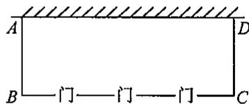  
第19题图

20. 如图,  $A, B, H$  是直线  $l$  上的三个点,  $AC \perp l$  于点  $A$ ,  $BD \perp l$  于点  $B$ ,  $HC = HD$ ,  $AB = 5$ ,  $AC = 2$ ,  $BD = 3$ , 求  $AH$  的长.

  
第20题图

# 名校考题精选(2)

# 一、选择题

1. 下列运算中，正确的是

(A)  $\sqrt{2} +\sqrt{3} = \sqrt{5}$

(B)  $\sqrt{(\sqrt{3} - 2)^2} = \sqrt{3} - 2$ ;

(C)  $\sqrt{a^2} = a$

(D)  $(\sqrt{a + b})^2 = a + b.$

2. 下列说法正确的是

(A)  $\frac{1}{4}$  是0.5的一个平方根；  
(B)  $7^{2}$  的平方根是 7;  
(C)正数有两个平方根，且这两个平方根之和等于0；  
(D) 负数有一个平方根.

3. 下列各式中，一定成立的是

(A)  $\sqrt{(a + b)^2} = a + b$ ;

(B)  $\sqrt{(a^2 + 1)^2} = a^2 + 1$ ;

(C)  $\sqrt{a^2 - 1} = \sqrt{a + 1} \cdot \sqrt{a - 1}$ ;

(D)  $\sqrt{\frac{a}{b}} = \frac{1}{b}\sqrt{ab}.$

4. 下列二次三项式不能在实数范围内因式分解的是

(A)  $x^{2} - 2x + 1$

(B)  $x^{2} - 2x - 1$

(C)  $2t^{2} - 3t + 5$

(D)  $2t^{2} - 5t + 3.$

5. 如图，在  $\mathrm{Rt}\triangle ABC$  中，  $AB = 9,BC = 6,\angle B = 90^{\circ}$  ，将△ABC折叠，使点A与 $BC$  的中点  $D$  重合，折痕为  $MN.$  则线段  $BN$  的长为 （）

(A)4;

(B)5;

(C)  $\frac{5}{3}$ ;

(D)  $\frac{5}{2}$ .

  
第5题图

6. 若方程  $25x^{2} - (k - 1)x + 1 = 0$  的左边可以写成一个完全平方式，则  $k$  的值为

(A)一6或7；

(B)-8或9;

(C)一7或8；

(D)-9或11.

# 二、填空题

7. 不等式  $x < 2 + \sqrt{3} x$  的解集是  
8. 化循环小数为分数: \(0.28 = \_\_\_\_\_\_\_\_\_\_\_\_\_\_\_\_\_\_\_\_\_\_\_\_\_\_\_\_\_\_\_\_\_\_\_\_\_\_\_\_\_\_\_\_\_\_\_\_\_\_\_\_\_\_\_\_\_\_\_\_\_\_\_\_\_\_\_\_\_\_\_\_\_\_\_\_\_\_\_\_\_\_\_\_\_  
9. 若等腰三角形的腰为 10, 顶角为  $120^{\circ}$ , 则底边上的高为  
10. 已知  $x < 0$ ，化简： $\sqrt{\frac{4y}{x^2}} = \_$  
11. 用因式分解法解关于  $x$  的一元二次方程  $x^{2} - mx - 7 = 0$ ，将左边因式分解后有一个因式为  $(x + 1)$ ，则  $m$  的值为 _______.  
12. 若一个菱形两条对角线的长分别是方程  $x^{2} - 13x + 40 = 0$  的两根，则该菱形的面积为  
13. 对于任意实数  $a, b$ ，定义  $a * b = a(a + b) + b$ . 已知  $a * 4 = 25$ ，则实数  $a$  的值是

14. 如图, 在锐角三角形  $ABC$  中,  $CD, BE$  分别是边  $AB, AC$  上的高, 且  $CD, BE$  交于点  $P$ . 若  $\angle A = 50^\circ$ , 则  $\angle BPC$  的度数是  
15. 等腰三角形  $ABC$  的一边长为 4, 另外两边的长是关于  $x$  的方程  $x^2 - 6x + m = 0$  的两个实数根, 则  $m$  的值是

  
第14题图

# 三、解答题

16. 求二次根式  $\sqrt{2x^2 + 4x + 10}$  的最小值，并求此时  $x$  的值  
17. 计算：

(1)  $2\sqrt{5} - \frac{1}{3}\sqrt{6} - \left(\frac{3}{2}\sqrt{5} + \sqrt{6}\right)$ ;

(2)  $\sqrt{5} \div \sqrt{2} \times 2\sqrt{2} \div 2\sqrt{5}$ .

18. 先化简，再求值： $\frac{a^2 - a - 6}{a + 2} - \frac{\sqrt{a^2 - 2a + 1}}{a^2 - a}$ ，其中  $a = \frac{1}{2 + \sqrt{3}}$  
19. 已知关于  $x$  的方程  $x^{2} + ax + a - 2 = 0$ .

(1)若该方程的一个根为1,求  $a$  的值及该方程的另一个根；  
(2)求证：不论  $a$  取何实数，该方程都有两个不相等的实数根

20. 某工程队承包了一项污水处理工程，原计划每天铺设污水管道  $1500\mathrm{m}$ ，因准备工作不充分，第一天铺设了原计划的  $80\%$ ，从第二天开始，该工程队加快了铺设速度，第三天铺设了  $1875\mathrm{m}$ 。若该工程队第二天、第三天每天的铺设长度比前一天增长的百分率相同，求这个百分率。

21.  $\triangle ABC$  中, 已知  $AC = 2, BC = 4, AB = 2\sqrt{5}, M$  是  $AC$  延长线上一点, 连接  $BM$ , 过点  $A$  作  $AB$  的垂线  $l$ .

(1)如图，若射线  $BM$  交直线  $l$  于点  $D$  ，且点  $M$  为  $BD$  的中点，求  $CM$  的长；  
(2)在(1)的条件下，作  $MF / / AD$  交  $BC$  于点  $F$  ，求  $CF$  的长；  
(3)若射线  $BM$  与直线  $\iota$  无公共点，请直接写出  $CM$  的取值范围

  
第21题图

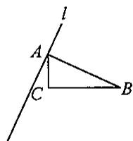  
备用图

# 各区考题精选

# 各区考题精选(1)

# 一、选择题

1. 下列运算中，正确的是

（ ）

(A)  $\sqrt{2} + \sqrt{5} = \sqrt{7}$ ;

(B)  $\sqrt{4a^2} = 2a$

(49)  $\sqrt{\frac{121}{49}} = \pm \frac{7}{11}$

(D)  $\sqrt[3]{-8a^3} = -2a$ .

2. 若等式  $\sqrt{\frac{2k - 1}{k - 3}} = \frac{\sqrt{2k - 1}}{\sqrt{k - 3}}$  成立, 则实数  $k$  的取值范围是

（ ）

$(\mathrm{A})k\geqslant \frac{1}{2};$

(B)  $k > 3$  或  $k < \frac{1}{2}$ ;

(C)  $k > 3$

(D)  $k \geqslant 3$

3. 方程：①  $3x - 1 = 0$ ；②  $2x^2 - 1 = 0$ ；③  $x^2 + \frac{1}{x} = 0$ ；④  $ax^2 - 1 = 2x$ （ $a$  为实数）；⑤  $x^2 - 1 = (x - 1)(x - 2)$ ，其中是一元二次方程的是 （）

(A)②④;

(B)②③④;

(C)②⑤;

(D)②.

4. 用配方法解一元二次方程  $x^{2} - 4x - 1 = 0$  时，原方程可变形为 （）

(A)  $(x + 2)^{2} = 5$

(B)  $(x - 2)^{2} = 5$

(C)  $(x + 4)^2 = 5$

(D)  $(x - 4)^2 = 5$

5. 如图, 在四边形  $ABCD$  中,  $\angle B = \angle D = 90^\circ$ , 分别以四边向外作正方形甲、乙、丙和丁, 如果用  $S_{\text{甲}}$ 、 $S_{\text{乙}}$ 、 $S_{\text{丙}}$  和  $S_{\text{丁}}$  来表示它们的面积, 那么下列结论正确的是

  
第5题图

(A)  $S_{\text{甲}} = S_{\text{丁}}$

(B)  $S_{\text{乙}} = S_{\text{丙}}$

(C)  $S_{\text{甲}} + S_{\text{乙}} = S_{\text{丙}} + S_{\text{丁}}$

(D)  $S_{\text{甲}} - S_{\text{乙}} = S_{\text{丙}} - S_{\text{丁}}.$

6. 阅读理解：若一个正整数  $m$  能表示为两个正整数  $a, b$  的平方和，即  $m = a^2 + b^2$  ，则称  $m$  为广义勾股数。下面的四个结论：①7不是广义勾股数；②13是广义勾股数；③两个广义勾股数的和一定是广义勾股数；④两个广义勾股数的积一定是广义勾股数，其中正确的是 （）

(A)②④;

(B)①②④；

(C)①②;

(D)①④.

# 二、填空题

7. 计算： $\sqrt{4} - (-\sqrt{2})^2 + \sqrt{(-3)^2} + \sqrt[3]{-8} =$  
8. 已知一个正数的两个平方根分别是  $3x - 2$  和  $x - 6$ , 则这个数是  
9. 计算  $2\sqrt{\frac{1}{2}} - \sqrt{18}$  的结果是  
10. 已知  $x = \sqrt{6} + \sqrt{2}$ , 则  $x^2 - 2\sqrt{2} x$  的值是  
11. 方程  $x(x - 6) = x$  的解是  
12. 若关于  $x$  的一元二次方程  $(k - 1)x^{2} + 4x + 1 = 0$  有实数根，则  $k$  的取值范围是

13. 以一2和3为根且二次项系数为1的一元二次方程是  
14. 某商店经销的某种商品，每件成本为30元。经市场调研，售价为40元，可销售150件，售价每上涨1元，销售量将减少10件，如果这种商品全部销售完，那么该商店可盈利1560元。设这种商品的售价上涨  $x$  元，根据题意，可列方程为  
15. 在  $\mathrm{Rt}\triangle ABC$  中， $\angle C = 90^\circ, AB = 3$ ，则  $AB^2 + BC^2 + AC^2 =$  ________.  
16. 如图, 数轴上的点  $A$  表示的数是 -2 , 点  $B$  表示的数是 1 ,  $CB \perp AB$  于点  $B$ , 且  $BC = 2$ , 以点  $A$  为圆心,  $AC$  的长为半径画弧交数轴于点  $D$ , 则点  $D$  表示的数为

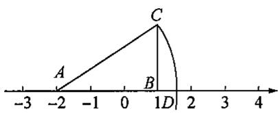  
第16题图

  
第17题图

  
第18题图

17. 如图, 在  $\triangle ABC$  中, 点  $O$  是角平分线  $AD$  和  $BE$  的交点, 若  $AB = AC = 10, BC = 12$ , 则  $\frac{OD}{BD}$  的值为  
18. 如图，在长方形  $ABCD$  中， $AB = 8, BC = 4$ ，将长方形沿  $AC$  折叠，点  $D$  落在点  $D'$  处，则阴影部分  $\triangle AFC$  的面积为 ______.

# 三、解答题

19. 计算：

(1)  $2\sqrt{12} - 6\sqrt{\frac{1}{3}} + 3\sqrt{48}$ ;

(2)  $\left[\frac{1}{\sqrt{5}} + \sqrt{20} - 3\sqrt{5}\right] \times \sqrt{10}.$

20. 解方程：

(1)  $2x^{2} - 4x + 1 = 0$

(2)  $(x - 3)^{2} = 3 - x.$

21. 先阅读下面例题的解题过程，再解答问题

例：解方程：  $x^{2} - |x| - 2 = 0$

解：当  $x \geqslant 0$  时，原方程可化为  $x^{2} - x - 2 = 0$

解得  $x_{1} = 2, x_{2} = -1$  （不合题意，舍去）

当  $x < 0$  时，原方程可化为  $x^{2} + x - 2 = 0$

解得  $x_{1} = -2, x_{2} = 1$  （不合题意，舍去）.

$\therefore$  原方程的解是  $x_{1} = 2, x_{2} = -2$ .

请参照上例例题的解法，解方程：  $x^{2} - x|x - 1| - 1 = 0.$

22. 如图, 在 Rt $\triangle ABC$  中,  $\angle ACB = 90^\circ, AB = 10 \mathrm{~cm}, AC:BC = 3:4$ , 动点  $P$  从点  $B$  出发沿射线  $BC$  以  $1 \mathrm{~cm} / \mathrm{s}$  的速度运动, 设运动的时间为  $t \mathrm{~s}$ .

(1)求  $BC$  边的长；  
(2)当  $\triangle ABP$  为等腰三角形时，求  $t$  的值

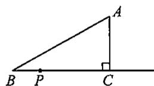  
第22题图

# 各区考题精选(2)

# 一、选择题

1. 下列运算中正确的是 （）

(A)  $\sqrt{16} = \pm 4$ ;  
(B)  $\sqrt[3]{-8^2} = -8$  
(C)  $\sqrt[4]{(-3)^{4}} = -3$ ;  
(D)  $|\sqrt{8} - 3| = 3 - \sqrt{8}$ .

2.使  $\frac{\sqrt{x - 2}}{x - 3}$  有意义的实数  $x$  的取值范围是 （）

(A)  $x \geqslant 2$ ;

(B)  $x \leqslant 3$  且  $x \neq 2$ ;

(C)  $x > 2$  且  $x \neq 3$ ;

(D)  $x \geqslant 2$  且  $x \neq 3$ .

3. 若关于  $x$  的方程  $(k - 2)x^{2} + kx - 3 = 0$  为一元二次方程，则实数  $k$  的取值范围为 （）

(A)  $k = 2$

$(\mathrm{B})k = 0$

$(C)k\neq 2$

(D)  $k \neq 0$ .

4. 如果一元二次方程  $ax^2 + bx + c = 0 (a \neq 0)$  满足  $a + b + c = 0$ ，那么我们称这个方程为“凤凰”方程。已知  $ax^2 + bx + c = 0 (a \neq 0)$  是凤凰方程，且有两个相等的实数根，则下列结论正确的是（）

(A)  $a = c$

(B)  $a = b$

(C)  $b = c$

(D)  $a = b = c$

5. 如图,  $EA \perp AB$ ,  $BC \perp AB$ ,  $AB = AE = 2BC$ , 点  $D$  为  $AB$  的中点. 以下判断正确的个数有

  
第5题图

①  $DE = AC$  ；②  $DE \perp AC$  ；③  $\angle EAF = \angle ADE$  ；④  $\angle CAB = 30^{\circ}$

(A)1个；

(B)2个；

(C)3个；

(D)4个.

6. 用下列几组数据构成的三角形中，不是直角三角形的是 （）

(A)8、15、17；

(B)  $\sqrt{2}, \sqrt{3}, \sqrt{5}$ ;

(C)  $\sqrt{3}, 2, \sqrt{5}$ ;

(D)  $1,2,\sqrt{5}$

# 二、填空题

7. 如果  $a < \sqrt{11} < a + 1$  ，那么整数  $a =$  
8. 写出一个无理数  $x$ ，使得  $2 < x < 3$ ，则  $x$  可以是  
9. 计算:  $\sqrt{24} - 3\sqrt{\frac{2}{3}} =$  
10. 已知  $a = 3 + \sqrt{5}, b = 3 - \sqrt{5}$ , 则代数式  $\sqrt{a^2 - ab + b^2} =$  
11. 已知  $m$  是关于  $x$  的方程  $x^{2} - 2x - 3 = 0$  的一个根，则代数式  $2m^{2} - 4m =$  ________.  
12. 已知  $m, n$  是一元二次方程  $x^{2} - x - 2 = 0$  的两个实数根，则  $m + n - mn$  的值是  
13. 若  $(x^{2} + y^{2} + 1)(x^{2} + y^{2} - 1) = 15$ ，则  $x^{2} + y^{2}$  的值为

14. 如图, 要设计一幅宽 \(20 \mathrm{~cm}\), 长 \(30 \mathrm{~cm}\) 的图案, 其中有两横两竖的彩条, 横、竖彩条的宽度比 2: 3, 若要使空白部分的面积为 \(384 \mathrm{~cm}^{2}\), 则每个横彩条的宽度是 \(\_ \_ \_ \_ \_ \_ \_ \_ \_ \_ \_ \_ \_ \_ \_ \_ \_ \_ \_ \_ \_ \_ \_ \_ \_ \_ \_ \_ \_ \_ \_ \_ \_ \_ \_ \_ \_ \_ \_ \_ \_ \_ \_ \_ \_ \_ \_ \_ \_ \_ \_

  
第14题图

  
第15题图

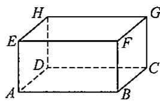  
第18题图

15. 如图是一个“赵爽弦图”，它是由四个全等的直角三角形围成一个大正方形，中空的部分是一个小正方形。若大正方形的边长为7，小正方形的边长为3，直角三角形的两直角边分别为  $a, b$ ，则  $ab$  的值为 ________。  
16. 若三角形三边满足  $a:b:c = 3:4:5$  ，且三角形的周长为  $24\mathrm{cm}$  ，则这个三角形最长边上的高为  
17. 如果一个直角三角形的两边长分别为3和4，那么它斜边长的平方为  
18. 如图, 一个长方体盒子紧贴地面, 一只蚂蚁从点  $A$  出发, 沿盒子表面爬到点  $G$ , 已知  $AB = 6$ ,  $BC = 5$ ,  $CG = 3$ , 则这只蚂蚁爬行的最短路程是

# 三、解答题

19. 化简:  $|2 - \sqrt{3}| + (2\sqrt{3})^2 - \left(\sqrt{48} - \sqrt{\frac{1}{10}} \times \sqrt{30}\right)$ .

20. 如图, 网格中小正方形的边长均为 1. 请你在网格中画出一个  $\triangle ABC$ , 要求: 顶点都在格点 (即小正方形的顶点) 上, 且三边长满足  $AB = \sqrt{10}, BC = 2\sqrt{2}, AC = \sqrt{10}$ , 并求出该三角形的面积.

  
第20题图

21. 已知关于  $x$  的一元二次方程  $x^{2} - 6x + (4m + 1) = 0$  有实数根

(1)求  $m$  的取值范围；  
(2)若该方程的两个实数根为  $x_{1}, x_{2}$ , 且  $\left|x_{1} - x_{2}\right| = 4$ , 求  $m$  的值.

22. 如果关于  $x$  的一元二次方程  $ax^2 + bx + c = 0 (a \neq 0)$  有两个实数根, 其中一个实数根是另一个实数根的 2 倍, 那么称这样的方程是“倍根方程”. 例如一元二次方程  $x^2 - 6x + 8 = 0$  的两个根是  $x_1 = 2, x_2 = 4$ , 则方程  $x^2 - 6x + 8 = 0$  是“倍根方程”.

(1)通过计算，判断  $x^{2} - 3x + 2 = 0$  是否是“倍根方程”？  
(2)若关于  $x$  的方程  $(x - 2)(x - m) = 0$  是“倍根方程”，求代数式  $m^2 + 2m + 2$  的值；  
(3)已知关于  $x$  的一元二次方程  $x^{2} - (m - 1)x + 32 = 0(m$  是常数)是“倍根方程”，求  $m$  的值.

23. 如图,  $P$  是等边三角形  $ABC$  内的一点, 连接  $PA, PB, PC$ , 以  $BP$  为边作  $\angle PBQ = 60^\circ$ , 且  $BQ = BP$ , 连接  $CQ$ .

(1)观察并猜想  $AP$  与  $CQ$  之间的大小关系，并证明你的结论；  
(2)若  $PA:PB:PC = 3:4:5$  ，连接  $PQ$  ，试判断△PQC的形状

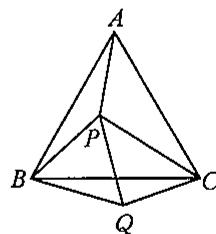  
第23题图

# 各区考题精选(3)

# 一、选择题

1. 下列说法正确的是

（ ）

(A)  $-a^{2}$  一定没有平方根；

(B)4是16的一个平方根；

(C)16 的平方根是 4;

(D)  $-9$  的平方根是  $\pm 3$ .

2. 已知  $n$  是一个正整数，且  $\sqrt{27n}$  是整数，则  $n$  的最小值是

（ ）

(A)6;

(B)36;

(C)3;

(D)2.

3. 关于  $x$  的方程  $x^{2} - mx - 1 = 0$  的根的情况，下列说法正确的是

（ ）

(A)没有实数根；

(B)有两个相等的实数根；

(C)有两个不相等的实数根；

(D)无法确定.

4. 已知方程  $x^{2} - bx + a = 0$  有一个根是  $a(a \neq 0)$ ，则下列代数式的值恒为常数的是

（ ）

(A)  $ab$

(B)  $\frac{a}{b}$ ;

(C)  $a + b$

(D)  $a - b$

5. 如图，在  $\mathrm{Rt}\triangle ABC$  中， $\angle CAB = 90^{\circ}, AD$  是斜边  $BC$  的中线， $AE$  是斜边  $BC$  的高，若  $AE$  恰好是  $DC$  边上的中线，则下列结论错误的是 （）

(A)  $AD = CD$

(B)  $AD = 2CE$

(C)  $AB = 2AE$

(D)  $AB = 3DE.$

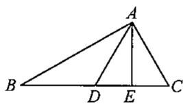  
第5题图

  
第6题图

6. 如图, 在  $\triangle ABC$  中,  $\angle C = 90^\circ$ ,  $BD$  平分  $\angle ABC$ ,  $BC = \frac{1}{2} AB$ ,  $BD = 2$ , 则点  $D$  到  $AB$  的距离为 ( )

(A)1;

(B)2;

(C)3;

(D)  $\sqrt{3}$ .

# 二、填空题

7.  $\sqrt{9}$  的平方根是 ，一64的立方根是  
8. 比较大小:  $\frac{\sqrt{5} + 1}{2}$ $\frac{3}{2}$ .  
9. 计算  $\sqrt{8} - (2\sqrt{2} - \sqrt{12})$  的结果为  
10. 若  $a = \sqrt{2} + 1, b = \sqrt{2} - 1$ ，则  $\sqrt{ab}\left[\sqrt{\frac{a}{b}} - \sqrt{\frac{b}{a}}\right] = \_$  
11. 如下表, 由此可以估计一元二次方程  $x^{2} + 2x - 10 = 0$  的一个近似解(精确到0.1)为

<table><tr><td>x</td><td>...</td><td>2.1</td><td>2.2</td><td>2.3</td><td>2.4</td><td>2.5</td><td>...</td></tr><tr><td>x2+2x-10</td><td>...</td><td>-1.39</td><td>-0.76</td><td>-0.11</td><td>0.56</td><td>1.25</td><td>...</td></tr></table>

12. 设  $\alpha, \beta$  是一元二次方程  $x^{2} + 3x - 7 = 0$  的两个根，则代数式  $\alpha^{2} + 5\alpha + 2\beta =$  ________.

13. 由于技术革新, 某种产品的生产成本在逐渐降低, 原来每件产品的成本是 125 元, 经过两次降低成本, 现在每件的成本是 80 元. 若每次降低成本的百分率是相同的, 则每次降低成本的百分率是  
14. 已知关于  $x$  的方程  $a(x + m)^2 + b = 0$  的解是  $x_1 = -2, x_2 = 1 (a, m, b$  均为常数， $a \neq 0)$ ，则关于  $x$  的方程  $a(x + m + 2)^2 + b = 0$  的解是  
15. 已知在  $\triangle ABC$  中,  $\angle B = 38^\circ$ ,  $BC^2 - AC^2 = AB^2$ , 则  $\angle C$  的度数为  
16. 如图, 在  $3 \times 3$  的方格中, 每个小正方形的边长均为 1 , 点  $A 、 B 、 C$  都在格点上, 若  $B D$  是  $\triangle A B C$  的高, 则  $B D$  的长为

  
第16题图

  
第17题图

  
第18题图

17. 如图，在  $\triangle ABC$  中， $\angle ACB = 90^\circ, AB$  的垂直平分线分别交  $AB, AC$  于点  $D, E.$  若  $AB = 10, BC = 6$  ，则线段  $CE$  的长度为  
18. 如图, 点  $D$  在  $\triangle ABC$  中,  $\angle BDC = 90^\circ, AB = 6, AC = BD = 4, CD = 2$ , 则图中阴影部分的面积为

# 三、解答题

19. 计算：

$$
(1) \frac {2}{\sqrt {2} - 1} + \sqrt {1 8} - 4 \sqrt {\frac {1}{2}};
$$

$$
(2) (\sqrt {6} - 2 \sqrt {1 5}) \times \sqrt {3} - 6 \sqrt {\frac {1}{2}}.
$$

20. 如图, 方格纸中每个小正方形的边长为 1 , 每个小正方形的顶点称为格点. 已知  $\triangle ABC$  的三个顶点都在格点上.

(1)判断  $\triangle ABC$  的形状，并说明理由；  
(2) 求点  $B$  到  $AC$  的距离.

  
第20题图

21. 根据要求, 解答下列问题

(1)解下列方程（直接写出方程的解即可）：

① 方程  $x^{2} - 2x + 1 = 0$  的解为  
$②$  方程  $x^{2} - 3x + 2 = 0$  的解为  
③方程  $x^{2} - 4x + 3 = 0$  的解为

#

(2)根据以上方程特征及其解的特征, 请猜想:

① 方程  $x^{2} - 9x + 8 = 0$  的解为  
②关于  $x$  的方程 _______ 的解为  $x_{1} = 1, x_{2} = n (n > 0)$ .

(3) 请用配方法解方程  $x^{2} - 9x + 8 = 0$ ，以验证猜想结论的正确性.

22. 已知关于  $x$  的一元二次方程  $(x - 3)(x - 2) = |m|$ .

(1)求证：对于任意实数  $m$  ，方程总有两个不相等的实数根；  
(2) 若方程的一个根是 1, 求  $m$  的值及方程的另一个根.

23. 阅读下列内容：设  $a, b, c$  是一个三角形的三条边的长，且  $c$  是最长边，我们可以利用  $a, b, c$  三边长的关系来判断这个三角形的形状：

① 若  $c^2 = a^2 + b^2$ ，则该三角形是直角三角形；  
② 若  $c^2 > a^2 + b^2$ ，则该三角形是钝角三角形；  
③ 若  $c^2 < a^2 + b^2$ ，则该三角形是锐角三角形。

例如：一个三角形的三边长分别是4、5、6，则最长边是6，由于  $6^2 = 36 < 4^2 + 5^2$ ，故知该三角形是锐角三角形.

请解答以下问题：

(1) 若一个三角形的三条边长分别是 2、3、4, 请判断该三角形的形状;  
(2) 若一个三角形的三条边长分别是  $3, 4, x$ ，且这个三角形是直角三角形，求出  $x$  的值；  
(3) 若一个三角形的三条边长  $a = \sqrt{x^2 + 3z^2}, b = \sqrt{x - y^2}, c = \sqrt{2y - \frac{9}{2}}$ ，其中  $a$  是最长边，请判断这个三角形的形状，并写出你的判断过程.

八年级数学第一学期（上） 27.50元

八年级数学第一学期（下） 27.50元

八年级语文第一学期（上） 27.50元

八年级语文第一学期（下） 27.50元

八年级英语第一学期 55.00元

八年级物理第一学期 55.00元