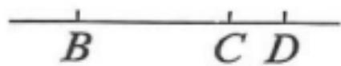
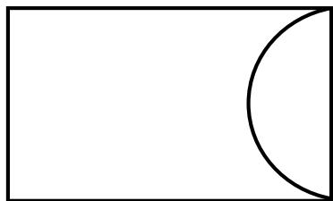
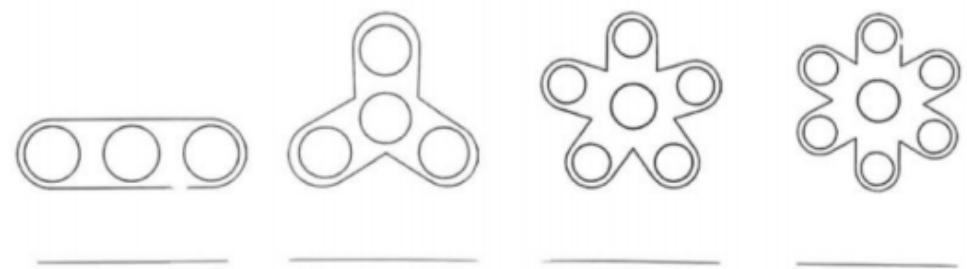
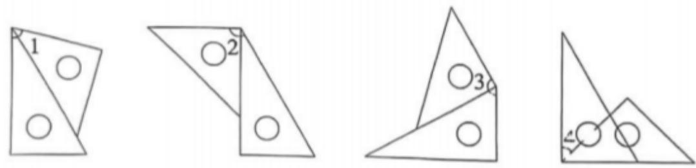
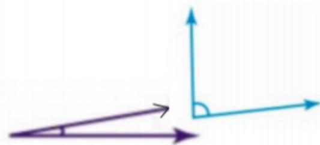
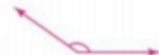
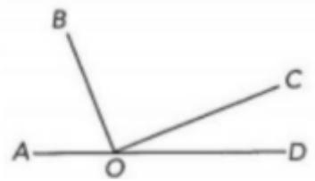

# 提取的题目

**总数**: 26

---

## 2025 The First Semester G4 Final Test

### 1 (练习题)

**题目**: 1. 423 + 156 + 577 + 244

---

### 4 (练习题)

**题目**: 4. 216 139 + 216 + 216 60
Law:
Law:

---

### 2 (练习题)

**题目**: 2. 25  (8 + 40)

---

### 5 (练习题)

**题目**: 5. 398 173 + 102
Law:
Law:

---

### 3 (练习题)

**题目**: 3. 125 88 2

---

### 6 (练习题)

**题目**: 6. 12 97 + 36
Law:
Law:

---

## 2025 The First Semester G4 Final Test > II. Count and write the angles in the figure: (12’)

### 7 (练习题)

**题目**: 7. Acute angles:

---

### 8 (练习题)

**题目**: 8. Obtuse angles:

---

### 9 (练习题)

**题目**: 9. Right angles:

---

### 10 (练习题)

**题目**: 10. Total angles:

---

## 2025 The First Semester G4 Final Test > III.Fill in the blanks (2’/40’)

### 11 (练习题)

**题目**: 11. There are ( ) line segments which are denoted as ( ). There are ( ) rays and ( ) lines.

---

### 12 (练习题)

**题目**: 12. Recall the clock face and imagine the angle formed by the hour hand and the minute hand.
a. At 03:00, the angle formed by the hour hand and the minute hand measures ( ) degrees and it is a/an ( ) angle.
b. At 18:00, the angle formed on the clock measures ( ) degrees and it is a/an ( ) angle.

---

### 13 (练习题)

**题目**: 13. As shown in the figure, the length of the rectangle is 6cm, the width is 4cm, so the radius of circle is ( ) mm.

---

### 14 (练习题)

**题目**: 14. As shown in the figure, Kate drew two circles with the same size in a rectangle. The length of this rectangle is 2dm. So the radius of each circle is ( ) cm.

---

### 15 (练习题)

**题目**: 15. Look at each of the fidget spinners and decide if they have rotational symmetry. If so, next to each image write how many orders of rotational symmetry each fidget spinner has.

---

### 16 (练习题)

**题目**: 16. The figures below are formed using set squares. Calculate and find out how many degrees they each are.

$$
\angle 1 = \_ \_ \_ \_ \_ \_ , \angle 2 = \_ \_ \_ \_ \_ \_ , \angle 3 = \_ \_ \_ \_ \_ \_ , \angle 4 = \_ \_ \_ \_ \_
$$

---

### 17 (练习题)

**题目**: 17. The distance between any point on a circle and its center is called the of the circle.

---

### 18 (练习题)

**题目**: 18. In a straight angle, if one acute angle is $1 1 ^ { \circ }$ , then the other obtuse angle is

---

## 2025 The First Semester G4 Final Test > IV.Solve the problems (21’)

### 19 (练习题)

**题目**: 19. For questions below, measure each angle.(2’/6’)

---

### 20 (练习题)

**题目**: 20. Draw and label. (2’/4’)
a. line MN
b. ray PO

---

### 21 (练习题)

**题目**: 21. In each figure, draw the angle with one side given. (2’/4)

---

### 22 (练习题)

**题目**: 22. Read the instructions and draw the line segment and the circle. (2’/4’)
a. Draw a line segment AB with a length of 2 cm.
b. Draw a circle with a radius of 1 cm using point A, which is one of the endpoints of the line segment AB that you just drew.

---

### 23 (练习题)

**题目**: 23. In the figure, given that $\angle B O C$ is a right angle and $\angle C O D = 1 5 ^ { \circ }$ , find ∠AOB. (3’)

---

## 2025 The First Semester G4 Final Test > V. Application problems. (5′/15′)

### 24 (练习题)

**题目**: 24. The distance between Place A and Place B is 720 kilometres. A car has travelled 240 kilometres in three hours. At this speed, in how many hours will it reach Place B?

---

### 25 (练习题)

**题目**: 25. A shipment of 120 containers of goods has reached a dock. It was supposed to unload 12 containers of the goods per hour. Due to an emergency, the shipment must be unloaded

---

## 2025 The First Semester G4 Final Test > IV.Solve the problems (21’)

### 26 (练习题)

**题目**: 26. A store received a delivery of 1125 kg of pineapples. After 20 baskets of pineapples were sold, there were 185 kg of pineapples remaining. If each basket came with the same weight, how many kilograms did each basket weigh?

---

