# 中学生世界

# 八年级数学第一学期（上）

■快乐学习 ■智慧生活 ■共同成长

《中学生世界》编写组编

# 中学生世界

# 八年级数学第一学期(上)

《中学生世界》编写组 编

# 图书在版编目(CIP)数据

中学生世界．八年级数学 第一学期 上/《中学生世界》编写组编. --南京：南京大学出版社，2024.5(2025.5重印)ISBN978-7-305-27951-5

I. ①中…Ⅱ. ①中…Ⅲ. ①中学数学课-初中-教学参考资料Ⅳ. ①G634

中国国家版本馆CIP数据核字(2024)第036211号

出版发行 南京大学出版社

社址南京市汉口路22号 邮编210093

ZHONGXUESHENG SHJIE BANIANJI SHUXUE DIYXUEQI SHANG

书名 中学生世界·八年级数学 第一学期 上

编 者《中学生世界》编写组

责任编辑 季红 编辑热线 025-83621412

印刷 安徽宣城海峰印刷包装有限公司

开本880毫米×1230毫米 1/16开 印张5 字数92千

版次2024年5月第1版 2025年5月第2次印刷

ISBN 978-7-305-27951-5

定价 27.50元

网址 http://www.njupco.com

官方微博 http://weibo.com/njupco

官方微信 njupress

销售咨询热线 025-83621412

* 版权所有,侵权必究

*凡购买南大版图书，如有印装质量问题，请与所购图书销售部门联系调换

# 目 录

# 本期导读 1

# 第19章 实数

19.1 算术平方根(1) 2  
19.1 平方根(2) 4  
19.1 立方根(3) 6  
习题19.1 8  
19.2 有理数的小数形式(1) 10  
19.2 无理数(2) 12  
19.2 实数与数轴(3) 14  
19.2 实数的绝对值和大小比较(4) 16  
19.2 实数的运算(5) 18  
19.2 科学记数法(6) 20  
习题19.2 22  
第19章 复习(1) 24  
第19章 复习(2) 26  
挑战压轴题19 28

# 第20章 二次根式

20.1 二次根式及其性质(1) 30  
20.1 二次根式及其性质(2) 32

习题20.1 34

20.2 二次根式的运算(1) 36  
20.2 二次根式的运算(2) 38  
20.2 二次根式的运算(3) 40  
20.2 二次根式的运算(4) 42

习题20.2 44  
第20章 复习(1) 46  
第20章 复习(2) 48  
挑战压轴题20 50

# 第21章 一元二次方程

21.1 一元二次方程 52  
21.2 一元二次方程的解法(1) 54  
21.2 一元二次方程的解法(2) 56  
21.2 一元二次方程的解法(3) 58  
21.2 一元二次方程的解法(4) 60

习题21.1-21.2 62

# 名校考题精选

名校考题精选(1) 64  
名校考题精选(2) 66

# 各区考题精选

各区考题精选(1) 68  
各区考题精选(2) 71  
各区考题精选(3) 74

# 本期导读

本学期将学习如下内容：

第19章 实数

第20章 二次根式

第21章 一元二次方程

第22章 直角三角形

在第19章，把数的范围从有理数扩大到了实数。这样，现实世界中有关长度、面积、体积等度量的结果，就都可以用实数来准确表示。从数学上看，在实数范围内对任何数施行开方运算（除了负数开偶次方）都可以通行无阻，这既满足了实际应用的需要，也解决了数学内部的矛盾。对于无理数的学习，难点是如何跨越“无限”，要正确领会“无限不循环小数”的意义，体会“逐步逼近”的思想，从“有限”出发认识“无限”。

学了“开方运算”，把根号“√”里的“数”换成“字母”，就有了形如“ $\sqrt{a}$ ”的式子，它不是整式，也不是分式，它是代数式大家庭里的新成员——二次根式。在第20章，我们将研究二次根式的概念、性质及其运算。

前面已经学了一元一次方程, 知道应用一元一次方程可以解决许多实际问题, 在第 21 章, 我们将进一步研究一元二次方程 (即未知数次数是 2 的方程), 有了它, 我们将可以解决更多更复杂的问题.

直角三角形是一种特殊的三角形，研究其性质与判定是平面几何的基本内容。从最初的直观几何、实验几何到现在的论证几何，是感性认识到理性认识的重大跨越。在这一章，我们将要学习初等几何最精彩、最著名、最有用的定理——勾股定理。它被誉为“几何学的基石”，“千古第一定理”！

数学伴着我们成长，数学伴着我们进步，数学伴着我们成功，让我们在学习数学的过程中，体会、感受数学的神奇与美妙！

# 第19章 实数

# 19.1 算术平方根(1)

# 一、选择题

1.  $\frac{1}{4}$  的算术平方根是 （）

(A)  $\frac{1}{2}$ ;

(B)  $\pm \frac{1}{2}$ ;

(C)  $\frac{1}{16}$ ;

(D)  $-\frac{1}{2}$ .

2.下列说法正确的是 （）

(A)  $(-2)^{2}$  的算术平方根是一2；

(B)算术平方根等于它本身的数只有1；

(C)只有正数才有算术平方根；

(D)  $\sqrt{16}$  的算术平方根是 2.

3. 如果一个圆的面积为  $16\pi$ ，那么这个圆的半径是 （）

(A)  $4\sqrt{\pi}$ ;

(B)  $4\pi$

(C)4;

(D)  $\pm 4$

4.  $\sqrt{81}$  的算术平方根是 （）

(A)9;

(B)  $\pm 9$

(C)3;

(D)  $\pm 3$

5. 如果一个数的算术平方根是  $a$ ，那么比这个数大3的数是 （）

(A)  $a + 3$

(B)  $a - 3$

(C)  $a^2 + 3$ ;

(D)  $a^2 - 3$ .

# 二、填空题

6.  $\frac{1}{81}$  的算术平方根是 ，|2|的算术平方根是  
7.  $\sqrt{5}$  是 ______ 的算术平方根，算术平方根等于它本身的数是 ______  
8. 若  $\sqrt{m^2} = 5$  ，则  $m =$

若  $\sqrt{(2x + 3)^2} = 7$  ，则  $x = \_$

9.  $(\text{一} 5)^{2}$  的算术平方根是 ，  $25^{2} - 24^{2}$  的算术平方根是

10. 若  $\sqrt{3x + 2} + (2 - y)^2 = 0$ ，则  $x^y$  的值为 _______.  
11. 填空：

(1)  $\sqrt{3(3 - 2) + 1} =$  
(2)  $\sqrt{4(4 - 2) + 1} =$  
(3)  $\sqrt{5(5 - 2) + 1} =$  
(4)由上面的规律可得出：  $\sqrt{a(a - 2) + 1} (a > 2) =$

12. 请你观察下列计算过程：因为  $11^{2} = 121$ ，所以  $\sqrt{121} = 11$ ，因为  $111^{2} = 12321$ ，所以  $\sqrt{12321} = 111, \cdots$ 。由此可以猜想  $\sqrt{12345678987654321} =$  ________.

# 三、解答题

13. 求下列各数的算术平方根：

(1)36;

(2)  $\frac{49}{4}$ ;

(3)0.16;

(4)  $6\frac{1}{4}$ .

14. 化简：

(1)  $\sqrt{81}$ ;

(2)  $\sqrt{1.44}$ ;

(3)  $\sqrt{5\frac{4}{9}}$

(4)  $\sqrt{0.0196}$ .

15. 化简下列各式：

$$
\sqrt {9}, \sqrt {9 0 0}, \sqrt {9 0 0 0 0}, \sqrt {0 . 0 9}, \sqrt {0 . 0 0 0 9}.
$$

通过化简结果，你发现了什么规律？试用文字表达出来

16. 计算：

(1)  $\sqrt{1^3} =$  
(2)  $\sqrt{1^3 + 2^3} = \_$  
(3)  $\sqrt{1^3 + 2^3 + 3^3} = \underline{\quad}$

观察计算的结果，用你发现的规律，求出：

(4)  $\sqrt{1^3 + 2^3 + 3^3 + \cdots + 100^3}$  的值.

# 19.1 平方根(2)

# 一、选择题

1. 下列说法正确的是 （）

(A)只有正数有平方根；  
(B)一个有理数的平方根有两个，它们互为相反数；  
(C)3是9的一个平方根，9的平方根是土3；  
(D)正数的算术平方根一定比它本身小.

2.3的平方根是 （）

(A)  $\sqrt{3}$ ;

(B)  $\pm \sqrt{3}$ ;

(C)  $-\sqrt{3}$ ;

(D)9.

3. 下列结论正确的是 （）

(A)4 的平方根是 2;

$(\mathrm{B})\sqrt{4} = \pm 2$

(C)2是4的平方根；

(D)  $\sqrt{-4} = -2$

4.下列各组数中，相等的是 （）

(A)  $(-3)^{2}$  和  $-3^{2}$ ;

(B)  $\sqrt{(-1)^2}$  和  $-1$ ;

(C)  $\pm \sqrt{16}$  和4；

(D)  $-\sqrt{9}$  和  $-3$

# 二、填空题

5.  $\pm \sqrt{25}$  表示 25 的  $\sqrt{6}$  表示 6 的  
6. 169 的平方根是 ,16 的算术平方根是  $\sqrt{16}$  的负的平方根是  $\left(-\frac{2}{3}\right)^{2}$  的平方根是  
7. 计算:  $\sqrt{49} = \_$ ;  $\sqrt{\frac{9}{25}} = \_$ ;  $-\sqrt{0.36} = \_$ ;  $-\sqrt{(-5)^2} = \_$ .  
8. 若一个数的平方根等于它的本身，则这个数是  
9. 2026 的两个平方根之和等于 ,乘积等于  
10. 若  $\sqrt{8n}$  是最小的正整数，则  $n =$

# 三、解答题

11. 求下列各数的平方根：（注意书写的规范性）

(1)6400;

(2)0.04;

(3)  $\frac{121}{225}$ ;

(4)  $5\frac{4}{9}$ .

12. 化简：

(1)  $\pm \sqrt{289}$ ;

(2)  $-\sqrt{0.0256}$ ;

(3)  $\sqrt{\frac{169}{196}}$ ;

(4)  $\sqrt{(-8)^2}$ .

13. 求下列各式中  $x$  的值

(1)  $4x^{2} - 49 = 0$

(2)  $(x + 2)^{2} = 25$ .

14. 已知一个大正方形内的两个小正方形，面积如图所示，求大正方形的面积

第14题图  

<table><tr><td>25</td><td></td></tr><tr><td></td><td>9</td></tr></table>

# 思维与拓展1

已知  $0 < x < 1$ ，且  $x + \frac{1}{x} = \sqrt{7}$ ，求  $x - \frac{1}{x}$  的值.

# 19.1 立方根(3)

# 一、选择题

1.8的立方根是 （）

(A)2;

(B)-2;

(C)4;

(D)-4.

2. 下列等式不成立的是 （）

(A)  $\sqrt[3]{216} = 6$ ;

(B)  $-\sqrt[3]{27} = -3$

(C)  $-\sqrt[3]{(-4)^{3}} = -4;$

(D)  $\sqrt[3]{-0.008} = -0.2$ .

3. 立方根等于它本身的数是 （）

(A)1;

(B)-1;

(C)0;

(D)以上都是.

# 二、填空题

4. 口算: \(2^{3} = \_\_\_\_\_\_\_\_\_\_\_\_\_\_\_\_\_\_\_\_\_\_\_\_\_\_\_\_\_\_\_\_\_\_\_\_\_\_\_\_\_\_\_\_\_\_\_\_\_\_\_\_\_\_\_\_\_\_\_\_\_\_\_\_\_\_\_\_\_\_\_\_\_\_\_\_\_\_\_\_\_\_\_\_\_\_\_\_\_\_\_\_
\[
\left(\frac{3}{4}\right)^{3} = \_\_\_\_\_\_\_\_\_ \),  $\left(-\frac{3}{4}\right)^{3} = \_\_\_\_\_\_\_$ 
\[
\left(-\frac{3}{4}\right)^{3} = \_
\]  
5. 口算：\((\_ \_ \_ \_ \_ \_ \_ \_ \_ \_ \_ \_ \_ \_ \_ \_ \_ \_ \_ \_ \_ \_ \_ \_ \_ \_ \_ \_ \_ \_ \_ \_ \_ \_ \_ \_ \_ \_ \_ \_ \_ \_ \_ \_ \_ \_ \_ \_ \_ \_ \_ 3 = 27, (\_\_\_\_\_\)_3 = -27; (\_\_\_\_\_\)_3 = \frac{64}{125}, (\_\_\_\_\_\)_3 = -\frac{64}{125}.\)  
6. 27 的立方根是 ______; -81 的立方根是 ______;  $-\frac{125}{343}$  的立方根是 ______; 0.008 的立方根是 ______.  
7.  $\sqrt{64}$  的立方根是________；________的立方根是一  $\frac{2}{3}$  ；________的立方是64；________的立方是-5.  
8. 若一个数的平方根与其立方根相同，则这个数是  
9. 如果一个正方体的体积是  $V$ ，那么这个正方体的棱长为 _______.  
10.  $\sqrt[3]{20}$  介于 ______ 和 ______ 这两个连续正整数之间;  $\sqrt[3]{-40}$  介于 ______ 和 ______ 这两个连续整数之间.  
11. 一8的立方根与16的算术平方根的和是  
12. 设  $x = \sqrt[3]{3 \times 9}, y = \sqrt{\left(-\frac{1}{3}\right)^2}$ , 则  $(xy)^{99} =$

# 三、解答题

13. 求下列各数的立方根：

(1)0.008;

(2)  $-\frac{1}{343}$ :

(3)2  $\frac{10}{27}$

14. 求下列各式的值：

(1)  $\sqrt[3]{-1}$ ;

(2)  $-\sqrt[3]{27}$ ;

(3)  $-\sqrt[3]{-0.125}$ ;

(4) -√-27 64

15. 计算：

(1)  $(\sqrt[3]{-8})^3 + \sqrt{(-2)^2} - \sqrt[3]{8^2}$ ;

(2)  $\sqrt[3]{0.001} + \sqrt{0} - \sqrt[3]{-\frac{8}{125}}$ ;

16. 求  $x$  的值：

(1)  $3x^{3} + \frac{125}{9} = 0$

(2)  $(3 - 2x)^{3} = -1$ .

17. 若把一个正方体的每条棱长都增加 3 厘米后, 得到的正方体体积是 216 立方厘米. 求:

(1)原正方体棱长；  
(2)棱长增加3厘米的正方体体积比原正方体体积增加了多少？

# 思维与拓展2

如果  $\sqrt[3]{200 \times a}$  是一个整数, 那么最大负整数  $a$  是多少?

# 习题19.1

# 一、选择题

1.  $\sqrt{9}$  的值等于 （）

(A)3;

(B)-3;

(C)±3;

(D)  $\sqrt{3}$ .

2. 若一个自然数的算术平方根是  $a$ ，则和这个自然数相邻的下一个自然数是 （）

(A)  $a + 1$

(B)  $a^2 + 1$ ;

(C)  $\sqrt{a^2 + 1}$ ;

(D)  $\sqrt{a + 1}$ .

3.估计  $\sqrt{10}$  的值在 （）

(A)1到2之间；

(B)2到3之间；

(C)3到4之间；

(D)4到5之间

4. 下列各式中正确的是 （）

(A)  $\sqrt{-25} = 5$

(B)  $\sqrt{16} = \pm 4$

(C)  $\sqrt[3]{-8} = -2$ ;

(D)  $\sqrt[3]{-9} = -3.$

# 二、填空题

5. (1)100 的算术平方根是

(2)0.36的算术平方根是

(3)  $\left(-\frac{1}{3}\right)^2$  的算术平方根是

(4)  $\sqrt{16}$  的算术平方根是

6. 直接写出下列各式的值：

(1)  $\sqrt{1\frac{7}{9}} =$

(2)  $\sqrt{0.04} =$

(3)  $\sqrt{(-4)^2} =$

(4)  $-\sqrt{\frac{49}{25}} = \_$

7. 已知  $a, b$  为两个连续的整数，且  $a < \sqrt{28} < b$ ，则  $a + b =$  ________.

8. 若  $|x + 2| + \sqrt{y - 3} = 0$ ，则  $(x + y)^{2025}$  的值为

9.  $\frac{64}{121}$  的平方根是 ，（-4.3）²的平方根是

10. 一个正数的一个平方根是256，则它的另一个平方根是

11. 如果  $a^2$  的平方根等于  $\pm 3$ , 那么  $a =$  ________.

12. 的立方根是一3，立方根是它本身的数是

13. 若  $\sqrt[3]{4a - 3} = -3$ ，则  $a = \_$ ， $a - 2$  的立方根为

14. 若一个数的平方等于 64, 则这个数的立方根是

15. 如果  $\sqrt[3]{A} + \sqrt[3]{-64} + 2 = 0$ ，那么  $A =$  ________.

# 三、解答题

16. (1) 填写下表：

<table><tr><td>a</td><td>...</td><td>0.01</td><td>1</td><td>100</td><td>10 000</td><td>1 000 000</td><td>...</td></tr><tr><td>\( \sqrt{a} \)</td><td>...</td><td></td><td></td><td></td><td></td><td></td><td>...</td></tr></table>

(2) 观察上表, 请运用你发现的规律解下列问题: 已知  $\sqrt{1.43} \approx 1.196$ , 求下列各数的算术平方根: 0.0143、14300.

17. 先阅读, 再填空:

问题： $\sqrt{90}$  的整数部分是什么？小数部分是什么？

解： $\because 9^2 = 81, 10^2 = 100$ ，而  $81 < 90 < 100, \therefore 9 < \sqrt{90} < 10, \therefore \sqrt{90}$  的整数部分是 9，小数部分是  $\sqrt{90} - 9$ .

(1)  $\sqrt{13}$  的整数部分是 ，小数部分是  
(2)  $\sqrt{21}$  的整数部分是 ，小数部分是  
(3)若  $\sqrt{5}$  的整数部分记为  $a$  ，小数部分记为  $b$  ，则  $a + b = \_\_\_\_\_\_\_\_\_ , b - 2a = \_\_\_\_\_\_\_\_\_ .$

18. 化简与求值：

(1)  $\sqrt[3]{-216}$ ;

(2)  $-\sqrt[3]{-\frac{1}{64}}$ ;

(3)  $\sqrt[3]{\frac{124}{125} - 1}$ .

19. 已知 3 既是  $x - 1$  的算术平方根, 又是  $x - 2y + 1$  的立方根, 求  $x^2 - y^2$  的平方根.

# 19.2 有理数的小数形式(1)

# 一、选择题

1. 下列分数能化成有限小数的是 （）

(A)  $\frac{7}{30}$ ;

(B)  $\frac{7}{33}$ ;

(C)  $\frac{7}{35}$ ;

(D)  $\frac{7}{21}$ .

2. 下列分数化小数正确的是 （）

(A)  $\frac{2}{3} = 0.6$ ;

(B)  $\frac{1}{3} = 0.3$ ;

$\left(\mathrm{C}\right)\frac{2}{9} = 0.22;$

(D)  $\frac{17}{22} = 0$ .  $\dot{7}$ .

3. 下列分数中不能化成有限小数的是 （）

(A)  $\frac{2}{15}$ ;

(B)  $\frac{7}{25}$ ;

(C)  $\frac{7}{32}$ ;

(D)  $\frac{15}{24}$ .

4.  $\frac{1}{3}, 0.333, 0.334$  按从小到大的顺序排列，正确的是 （）

(A)  $\frac{1}{3} < 0.333 < 0.3343$ ;

(B)  $0.333 < 0.3\dot{3}4\dot{3} < \frac{1}{3}$ ;

(C)  $0.333 < \frac{1}{3} < 0.334\dot{3}$ ;

(D)  $0.3\dot{3}4\dot{3} < \frac{1}{3} < 0.333.$

# 二、填空题

5. 将下列分数化成有限小数：

$$
\frac {3}{1 0} = \_ \_ \_ \_ \_ \_ \_ \_ \_ \_ \_ \_ \_ \_ \_ \_ \_ \_ \_ \_ \_ \_ \_ \_ \_ \_ \_ \_ \_ \_ \_ \_ \_ \_ \_ \_ \_ \_ \_ \_ \_ \_ \_ \_ \_ \_ \_ \_ \_ \_ \_
\frac {6}{1 0 0} = \_ \_ \_ \_ \_ \_ \_ \_ \_ \_ \_ \_ \_ \_
\frac {2 3}{1 0 0} = \_
$$

6. 把下列小数化成分数：

$$
0. 5 = \quad ; 0. 2 5 = \quad .
$$

7. 将下列分数化为小数:  $\frac{3}{4} = \_\_\_\_\_\_\_\_\_; \frac{3}{8} = \_\_\_\_\_\_\_\_\_.$

8. 将下列分数化为小数:  $1 \frac{5}{8} = \_$ ,  $3 \frac{3}{5} = \_$ .

9. 化成循环小数:  $\frac{1}{9} = \_\_\_\_\_\_\_\_\_\_; \frac{17}{99} = \_\_\_\_\_\_\_\_\_\_; \frac{1}{999} = \_\_\_\_\_\_\_\_\_\_.$

10. 循环小数 2.35757…的循环节是 ,用简便方法写作 ,保留三位小数写作

11. 比较大小:  $0.53 \quad 0.532; 3 \frac{7}{8} \quad 3.87$ .

12. 将  $\frac{2}{3}, 0.666, 0.6\dot{6}5\dot{6}$  从小到大排列：

# 三、解答题

13. 把下列有理数化为小数：

(1)  $\frac{9}{5}$ ;

(2)  $\frac{14}{9}$ ;

(3)  $\frac{11}{12}$ ;

(4)  $\frac{22}{7}$ ;

(5)  $\frac{35}{20}$ ;

(6)  $\frac{5}{21}$ .

14. 将下列无限循环小数化成分数：

(1)0.  $\dot{7}$

(2)1.  $\dot{2}\dot{3}$

(3)0.334

(4)0.257

(5)1.23

15. 甲、乙两人参加骑自行车比赛，甲4小时骑85千米，乙3小时骑64千米，谁骑的速度快？

# 思维与拓展3

(1)计算：  $0.\dot{4}\dot{5}\times 0.\dot{4} 3\dot{2} =$  
(2)在(1)的计算结果中，它的小数点后100位上的数字是

# 19.2 无理数(2)

# 一、选择题

1. 下列各数是无理数的是 （）

(A)0;

(B)-3.5;

(C)  $\sqrt{3}$ ;

(D)  $\sqrt{4}$ .

2.下列各数是无理数的是 （）

(A)0.101 101 11; (B)0.101 101 110 111 1…（无限两个“0”之间“1”的个数依次加1个）；

(C)  $\frac{10}{3}$ ;

(D)0.33.

3. 下列说法中正确的有 （）

①带根号的数都是无理数；②无理数是开方开不尽的数；③无理数是无限小数；④无理数可以写成分数.

(A)1个；

(B)2个；

(C)3个；

(D)4个.

4. 下列各数中，不是无理数的是 （）

(A)  $\sqrt{7}$ ;

(B)0.5;

(C)  $2\pi$

(D)0.151 151 115…（两个“5”之间依次增加一个“1”）

5. 下列说法正确的是 （）

(A)无理数包括正无理数、负无理数和0；

(B)3.14是无理数；

(C)有理数都可以用分数表示；

(D)有理数的相反数是无理数

# 二、填空题

6. 带根号的数 ______ 是无理数。（填“一定”或“不一定”）

7. -3 的相反数是________；4.1 的倒数的相反数是________； $\sqrt{10}$  的整数部分是________.

8. 一  $\sqrt{17}$  介于 和 之间.(填写连续整数）

9. 已知一个正方形的面积是  $7\mathrm{cm}^2$  ，则这个正方形的边长是

10. 有3.1415926、 $\sqrt{5}$ 、 $-7$ 、 $\frac{22}{7}$ 、0.3、4.121221222…（它的位数无限且相邻两个“1”之间“2”的个数依次加1个），在这六个数中，无理数有 ______ 个。

11. 若无理数  $a$  满足  $-2 < a - 1$ , 则  $a = \_\_\_\_\_\_\_\_.$  (写出一个满足条件的数即可)

12. 把下列各数分别填在相应的括号内： $\sqrt{5}, -3, 0, \sqrt[3]{4}, 0.3, \frac{22}{7}, -1.732, \sqrt{25}, \sqrt[3]{-16}, |\sqrt[3]{-1}|$ ,  $-\sqrt{27}, -\frac{\pi}{2}, 3 + \sqrt{29}, 0.1010010001\cdots$

整数：{

}；

分数：{

}；

有理数：{

}；

无理数：{

1.

# 三、解答题

13. 用计算器求值（近似值保留三位小数）：

(1)  $\sqrt{5}$ ;

(2)  $\sqrt{3678}$ ;

(3)  $\sqrt{\frac{5}{7}}$ ;

(4)  $\sqrt{0.00237}$ ;

(5)  $\sqrt[3]{-5.83}$ ;

(6)  $\sqrt[3]{3\frac{2}{5}}$

14. 比较 7 的平方根和立方根的大小.  
15. 先阅读例题, 然后解答问题

例题：求  $9x^{2} - 121 = 0$  中  $\pmb{x}$  的值

解：移项，得  $9x^{2} = 121$

两边同除以9，得  $x^{2} = \frac{121}{9}$

两边开平方，得  $x = \pm \sqrt{\frac{121}{9}}$

所以  $x_{1} = \frac{11}{3}, x_{2} = -\frac{11}{3}$

请你仿照例题，求  $49(x^{2} + 1) = 50$  中  $\pmb{x}$  的值

# 19.2 实数与数轴(3)

# 一、选择题

1. 下列判断错误的是 （）

(A)数轴上的每一个点都可以用唯一的实数来表示；  
(B)每一个实数都可以用数轴上的一个点来表示；  
(C)在数轴上找不到表示  $\sqrt{2}$  的点；  
(D)全体实数所对应的点布满整个数轴

2. 以下对实数的分类，不正确的是 （）

(A)实数有理数， (B)实数整数， (C)实数有限小数， (D)实数零， 无理数；分数；无限小数；负实数.

3.当  $a$  为实数时，  $\sqrt{a^2} = -a$  ，则实数  $a$  在数轴上对应的点在 （）

(A)原点的右侧； (B)原点的左侧；  
(C)原点或原点的右侧； (D)原点或原点的左侧.

4. 已知实数  $a, b$  在数轴上的位置如图所示，则下列各式不正确的是 （）

$$
\frac {a}{- 3 - 2 - 1 0 1 2}
$$

# 第4题图

(A)  $a \cdot b < 0$ ;

(B)  $a^2 > b^2$ ;

(C)  $a > -b$

(D)  $-a > b$

5.如图，把半径等于  $\frac{1}{2}$  的圆放到数轴上，圆上一点  $A$  与原点重合，圆沿着数轴的正方向滚动一周，点  $A$  的终点表示的数是 （）

# 第5题图

(A)  $\pi$ ;

(B)  $2\pi$

(C)3.14;

(D)6.28.

# 二、填空题

6. 把下列各数分别填入相应的集合里：

$$
\sqrt [ 3 ]{8} \sqrt [ 3 ]{- 3 . 1 4 1} \cdot \frac {\pi}{3} \cdot \frac {2 2}{7} \cdot - \frac {7}{8} \cdot - \sqrt [ 3 ]{2} \cdot 0. 1 0 1 0 0 1 0 0 0 1 \dots , 1. 4 1 4, - 0. 0 2 0 2 0 2 \dots , - \sqrt {7}.
$$

正有理数：{}；

负有理数：{}；

正无理数：{}；

负无理数：{}

7. 与数轴上所有的点一一对应的数是

8. 如图，在数轴上点  $A$  和点  $B$  之间表示整数的点有

$$
\xrightarrow [ - \sqrt {2} ]{A} \begin{array}{c} A \\ B \\ \sqrt {7} \end{array}
$$

9. 如图, 数轴上的  $A, B, C, D$  四点中, 与数  $-\sqrt{3}$  表示的点最接近的是点

$$
\begin{array}{c c c c c c c c} A & B & C & & D & & \\ \downarrow & \downarrow & \downarrow & 1 & 1 & \downarrow & 1 \\ - 3 & - 2 & - 1 & 0 & 1 & 2 & 3 & x \end{array}
$$

# 第9题图

10. 估计  $\sqrt{6} + 1$  在数轴上的点，在表示两相邻整数 ______ 和 ______ 所对应的点之间。

# 三、解答题

11. 如图, 将下列各数与数轴上  $A, B, C, D, E$  五个点对应起来:

$$
- 2 \sqrt {3} \cdot - \pi \sqrt [ 3 ]{1 0} \cdot \frac {3}{2}.
$$

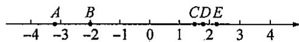  
第11题图

12. 如图①, 将由五个边长为 1 的小正方形拼成的图形沿虚线剪开, 并按如图②所示的方式重新拼成一个大的正方形.

(1)求图②中大正方形的边  $AB$  的长；  
(2)根据上述过程，你能否在如图③所示的数轴中，找到表示  $\sqrt{5}$  和一  $\sqrt{5}$  的数？

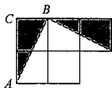  
图  $①$

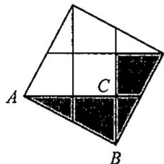  
图  $②$

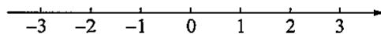  
图  $③$

第12题图

# 19.2 实数的绝对值和大小比较(4)

# 一、选择题

1.  $\sqrt[3]{8}$  的相反数是 （）

(A)2;

(B)-2;

(C)  $\frac{1}{2}$ ;

(D)  $-\frac{1}{2}$ .

2. 若  $a, b$  互为相反数，且  $a \neq 0$  ，则下列各对实数中，互为相反数的是 （）

(A)  $\sqrt{a^2}$  与  $\sqrt{b^2}$ ;

(B)  $\sqrt{|a|}$  与  $\sqrt{|b|}$ ;

(C)  $\sqrt[3]{a}$  与  $\sqrt[3]{b}$ ;

(D)  $-\sqrt[3]{a}$  与  $\sqrt[3]{b}$ .

3. 若  $a < 0$  ，则  $2a + 5|a|$  等于 （）

(A)  $7a$

(B)-7a;

(C)  $3a$

(D)-3a.

4. 判断实数  $-2, -3, -\sqrt{6}$  的大小关系，下列正确的是 （）

(A)  $-\sqrt{6} < -3 < -2$

(B)  $-3 < -\sqrt{6} < -2$ ;

(C)  $-2 < -\sqrt{6} < -3$

(D)  $-3 < -2 < -\sqrt{6}$ .

5. 满足  $-\sqrt{3} < x < \sqrt{2}$  的整数有 （ ）

(A)4个；

(B)3个；

(C)2个；

(D)1个.

# 二、填空题

6. 一个实数在数轴上所对应的点到 ______ 的距离叫作这个数的绝对值, 实数  $a$  的绝对值记作 ______.  
7. 在数轴上, 若点  $M, N$  所对应的数分别为  $a, b$ , 则  $M, N$  两点之间的距离  $MN =$  ________.  
8. 计算： $\vert -5\sqrt{2}\vert = \_$  
9.  $-\sqrt{6}$  的相反数是 ，绝对值是  
10.  $1 - \sqrt{2}$  的相反数是 ，绝对值是  
11. 大于  $\sqrt{2}$  、小于  $\sqrt{5}$  的无理数有 ______ 个，写出符合条件的一个无理数：______。  
12. 若点  $P$  到原点的距离为  $\sqrt{10}$ , 则点  $P$  表示的实数为  
13. 比较大小：

(1)  $\sqrt{47}$  7;

(2)  $-\sqrt{38} - \sqrt{39}$ ;

(3)  $3\sqrt{2}$  2√3;

(4)  $-\sqrt{2}$  -1.414;

(5)  $\sqrt{a^2 + 2}$ $\sqrt{a^2 + 3}$ ;

(6)  $\sqrt[3]{\frac{8}{125}}$ $| - \sqrt[4]{16^{-1}} |.$

# 三、解答题

14. 数轴上的点  $A, B, C, D$  依次表示  $-\sqrt{2}, \sqrt{4}, -\sqrt[3]{8}, \sqrt{2}$ .

(1)在如图所示的数轴上分别描出点  $A,B,C,D$

  
第14题图

(2)求出两点间的距离：

①  $A$  与  $C$ ;

②  $B$  与  $D$ .

15. 求下列各式的值：

(1)  $|\sqrt{2} - 2|$ ;

(2)  $-|2 - \sqrt{3}|$ ;

(3)  $|\sqrt{3} - \sqrt{5}|$ ;

(4)  $\left|\frac{\pi}{4} -\frac{\pi}{3}\right|$ .

16. 已知  $a, b$  互为相反数， $c, d$  互为倒数，求  $\frac{a^2 - b^2}{a^2 + b^2} - \sqrt{cd}$  的值

17. 已知  $a, b, c$  三个数在数轴上对应的点如图所示，求  $|a - b| + |c - a| - |c + b| - |a - c|$  的值.

  
第17题图

# 思维与拓展4

代数式  $|x - 1| + |x - 2| + |x - 3|$  是否有最小值？如果有，请把它求出来；如果没有，请说明理由.

# 19.2 实数的运算(5)

# 一、选择题

1.计算  $5\sqrt{7} -2\sqrt{7}$  的结果为 （）

(A)  $3\sqrt{7}$ ;

(B)3;

(C)  $3 + \sqrt{7}$ ;

(D)  $3 - \sqrt{7}$ .

2.下列各式正确的是 （）

(A)  $5\sqrt{5} - 3\sqrt{5} = 2$

(B)  $5 - 2\sqrt{3} = 3\sqrt{3}$

(C)  $\sqrt{21} \div \sqrt{3} = \sqrt{7}$ ;

(D)  $\sqrt{7} -\sqrt{2} = \sqrt{5}$

3. 下列计算正确的是 （）

(A)  $\sqrt{-2} \times \sqrt{-3} = \sqrt{6}$ ;

(B)  $\sqrt{2} \times \sqrt{3} = 6$ ;

(C)  $\sqrt{(-2)^2} \times \sqrt{(-3)^2} = 6$ ;

(D)  $(\sqrt{-2})^2 \times (\sqrt{-3})^2 = 6.$

4. 若  $m = \frac{\sqrt{2}}{3} \times (-3)$ ，则有

(A)  $0 < m < 1$ ;

(B)  $-1 < m < 0$ ;

(C)  $-2 < m < -1$ ;

(D)  $-3 < m < -2$ .

# 二、填空题

5. 计算：  $5\sqrt{3} - 3\sqrt{3} + \sqrt{3} =$  
6. 计算:  $5\sqrt{11} \times 2\sqrt{3} =$  
7. 计算:  $2\sqrt{3} \div \frac{15}{\sqrt{3}} \times 5\sqrt{2} =$  
8. 计算： $(\sqrt{2} \times \sqrt{15} - 3\sqrt{30}) \div \sqrt{3} =$  
9. 计算:  $\sqrt[3]{-64} + \sqrt[3]{0.008} - \sqrt[3]{\frac{1}{125}} =$  
10. 计算:  $\frac{\sqrt{48}}{\sqrt{3}} -\sqrt{3}\times \sqrt{27} =$

# 三、解答题

11. 不用计算器计算：

(1)  $2\sqrt{5} + 5\sqrt{2} - 3\sqrt{5} - 2\sqrt{2}$ ;

(2)  $(\sqrt{3})^2 + 3\sqrt{3} \times \frac{2}{\sqrt{3}};$

(3)  $\sqrt{(\sqrt{3})^2 + (\sqrt{6})^2}$ ;

(4)  $(2\sqrt{3} + 3\sqrt{2}) \times (2\sqrt{3} - 3\sqrt{2})$

12. 计算(结果保留两位小数)：

(1)  $3\sqrt{2} - \left(\frac{3}{2}\sqrt{2} + \frac{1}{2}\sqrt{2}\right)$ ;

(2)  $\sqrt{3} \times \left(\frac{3}{5}\sqrt{7} - \frac{1}{5}\sqrt{7}\right) \div 2\sqrt{7}$ .

13. 对于两个不相等的实数  $a, b$ , 定义一种新的运算如下:  $a * b = \frac{\sqrt{a + b}}{a - b} (a + b > 0)$ , 如:  $3 * 2 = \frac{\sqrt{3 + 2}}{3 - 2} = \sqrt{5}$ .

请你计算：

(1)  $8 \times 7$ ;  
(2)  $6 \times (5 \times 4)$ .

# 思维与拓展5

如图，点  $B$  关于点  $A$  的对称点为  $C$  ，若点  $C$  所表示的实数为  $x$  ，则  $x^{2} - 4x + 2$  的值是（）

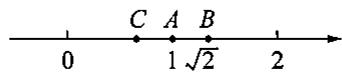

(A)  $2 - \sqrt{2}$ ;

(B)1;

(C)0;

(D)  $\sqrt{2} - 2$ .

# 19.2 科学记数法(6)

# 一、选择题

1.  $7.30 \times 10^{5}$  表示 （）

(A) 原数的整数有五位；

(B)这个数精确到百位；

(C) 原数的整数有六位；

(D)3后面有6个零

2. 人类的遗传物质 DNA 是很长的链状结构, 最短的 22 号染色体也有 30000000 个核苷酸. 30000000 用科学记数法表示为 (   )

(A)  $3 \times 10^{8}$ ;

(B)  $3 \times 10^{7}$ ;

(C)  $3 \times 10^{6}$ ;

(D)  $0.3 \times 10^{6}$ .

3. 地球半径约为  $6400000\mathrm{m}$ ，将这个数用科学记数法表示后，10的指数是 （）

(A)5;

(B)6;

(C)7;

(D)8.

4. 一种病毒的直径为  $0.000043 \mathrm{~m}$ ，用科学记数法表示为 （）

(A)  $4.3 \times 10^{5}$ ;

(B)  $4.3 \times 10^{4}$ ;

(C)4.  $3 \times 10^{-4}$ ;

(D)  $4.3 \times 10^{-5}$ .

5. 用小数表示  $-4.78 \times 10^{-3}$  正确的是 （）

(A)-0.0478;

(B)0.0478;

(C)0.00478;

(D)-0.00478.

# 二、填空题

6. 用科学记数法表示:  $320000 = \_\_\_\_\_\_\_\_\_\_\_$  ,  $-10700000 = \_\_\_\_\_\_\_\_\_\_\_$ .  
7.  $2.3 \times 10^{7}$  所表示的数有 位整数.  
8.  $2.5 \times 10^{-6}$  的小数点与左起第一个非零数字之间有 ______ 个 0 .  
9.“水立方”是北京奥运会场馆之一，它的外层膜的展开面积约为  $260000\mathrm{m}^2$  将  $260000\mathrm{m}^2$  用科学记数法表示为  $\mathrm{m}^2$  
10. 用科学记数法把 0.000009405 表示成  $9.405 \times 10^{n}$ , 那么  $n =$

# 三、解答题

11. 用科学记数法表示下列各数：

(1)40800000;

(2)4987.6;

(3)0.00000008.

12. 下列用科学记数法表示的数, 原来各是什么数?

(1)  $9 \times 10^{3}$ ;

(2)  $6.8 \times 10^{8}$ ;

(3)  $1.37 \times 10^{-8}$ ;

(4)  $5.6 \times 10^{-6}$ .

13. 崇明岛某旅游景区每天最多接待 10000 名游客，在 10 月到 12 月这三个月间对游人开放期间最多能接待多少游客？（结果用科学记数法表示）

14. 用科学记数法表示算式的结果：

$$
0. 2 ^ {1 0 0} \times 5 0 ^ {1 0 1} = 0. 2 ^ {1 0 0} \times 5 0 ^ {1 0 0} \times 5 0 = (0. 2 \times 5 0) ^ {1 0 0} \times 5 0 = 1 0 ^ {1 0 0} \times 5 0 = 5 \times 1 0 ^ {1 0 1}.
$$

请根据上面介绍的方法，解答下面两题：

(1)  $1.25^{10} \times 8^{11}$ ;

(2)  $2.5^{100} \times 4^{102}$ .

15. 科学家研究发现, 水的一个分子的质量大约是  $3 \times 10^{-26} \mathrm{~kg}$ ,

(1)  $10 \mathrm{~g}$  水中大约有多少个水分子？  
(2) 通过进一步研究, 科学家又发现, 一个水分子是由两个氢原子和一个氧原子构成的, 已知一个氧原子的质量约为  $2.665 \times 10^{-26} \mathrm{~kg}$ , 求一个氢原子的质量.

# 思维与拓展6

计算  $99999 \times 22222 + 33333 \times 33334$ ，并将结果用科学记数法表示.

# 习题19.2

# 一、选择题

1. 下列实数是无理数的是 （）

(A)-1;

(B)0;

(C)π;

(D)  $\frac{1}{3}$ .

2.下列无理数中，在一2与1之间的是 （）

(A)  $-\sqrt{5}$ ;

(B)  $-\sqrt{3}$ ;

(C)  $\sqrt{3}$ ;

(D)  $\sqrt{5}$ .

3. 如图所示, 数轴上  $A 、 B$  两点表示的数分别为  $\sqrt{2}$  和 5.1, 则  $A 、 B$  两点之间表示整数的点共有 ( )

$$
\begin{array}{c c} \hline A & B \\ 0 \sqrt {2} & 5. 1 \end{array}
$$

# 第3题图

(A)6个；

(B)5个；

(C)4个；

(D)3个.

4. 已知一粒大米的质量约为 0.000021 千克, 这个数用科学记数法表示为 (   )

(A)  $0.21 \times 10^{-4}$ ;

(B)  $2.1 \times 10^{-4}$ ;

(C)  $2.1 \times 10^{-5}$ ;

(D)  $21 \times 10^{-6}$ .

5.计算  $|\sqrt[3]{27}| + |\sqrt{-16}| + \sqrt{4} -\sqrt[3]{8}$  的值是 （）

(A)1;

(B)  $\pm 1$

(C)2;

(D)7.

# 二、填空题

6. 将有理数化为小数:  $(1)\frac{7}{25} = \_$  ;  $(2)\frac{17}{22} = \_$ .

7. 若  $|a - 2| + \sqrt{b - 3} + (c - 4)^2 = 0$ ，则  $a - b + c =$  ________.

8. 计算：  $5\sqrt{2} - 3\sqrt{2} + \sqrt{3} =$

9. 计算：  $5\sqrt{21}\times 2\sqrt{3} =$

10. 计算： $(\sqrt{3} \times \sqrt{10} - 3\sqrt{60}) \div \sqrt{6} =$

11. 计算:  $\sqrt[3]{-27} + \sqrt[3]{0.008} - \sqrt[3]{\frac{1}{64}} =$

12. 计算:  $\frac{\sqrt{27}}{\sqrt{3}} -\sqrt{2}\times \sqrt{32} =$

13. 比较大小：  $(1)\sqrt{2} + 1$  2.42；(2)  $-3\sqrt{5}$  -2√11.

14. 如果把 0.000328 用科学记数法表示成  $3.28 \times 10^{n}$ , 那么  $n =$

15. 规定用符号  $[m]$  表示一个实数  $m$  的整数部分, 例如:  $\left[\frac{2}{3}\right] = 0$ ,  $[3.14] = 3$ , 按此规定  $[\sqrt{10} + 1]$  的值为

# 三、解答题

16. (1) 将  $\frac{5}{12}, 1\frac{8}{33}$  化为小数；  
(2)将  $0.7, 0.345$  化成分数  
17. 已知  $a$  是  $\sqrt{5}$  的整数部分,  $b$  是  $\sqrt{5}$  的小数部分, 求  $a(b - \sqrt{5})^2$  的值.

18. 计算：

(1)  $\sqrt{49} - \sqrt{169} + \sqrt[3]{27}$ ;

(2)  $\sqrt[3]{-1} - (\sqrt[3]{8} - 4) \div \sqrt{6^2}$ .

19. 小明发明了一个魔术盒, 当任意非负实数对  $(a, b)$  进入其中时, 会得到一个新的实数  $\sqrt{a} + \sqrt{2b} - 1$ , 例如把  $(1, 2)$  放入其中, 就会得到  $\sqrt{1} + \sqrt{4} - 1 = 2$ . 现将实数对  $(m, 18)$  放入其中, 得到实数  $\frac{11}{2}$ , 求  $m$  的值是多少?

# 第19章 复习(1)

# 一、选择题

1. 下列四个数中，负数是 （）

(A)  $\left| - 2 \right|$ ;

(B)  $(-2)^{2}$ ;

(C)  $-\sqrt{2}$ ;

(D)  $\sqrt{(-2)^2}$ .

2.下列说法正确的是 （）

(A)-3是  $(-3)^{2}$  的算术平方根；

(B)-9 的算术平方根是一3；

(C)因为  $(-4)^{2} = 16$  ，所以一4是16的算术平方根；

(D)1 的算术平方根是它本身

3. 下列计算错误的是 （）

(A)  $\sqrt[3]{64} = 4$ ;

(B)  $-\sqrt[3]{-64} = 4$

(C)  $\sqrt[3]{-64} = 4$ ;

(D)  $\pm \sqrt[3]{-64} = \pm 4.$

4.估计35的立方根  $a$  的大小是 （）

(A)  $2 < a < 3$

(B)  $3 < a < 4$

(C)  $4 < a < 5$ ;

(D)  $5 <   a <   b$

5. 已知  $\sqrt{20n}$  是整数, 则满足条件的最小正整数  $n$  是 ( )

(A)2;

(B)3;

(C)4;

(D)5.

# 二、填空题

6. 若  $\sqrt{m^2} = 5$  ，则  $m =$  ；若  $\sqrt{(2x + 3)^2} = 7$  ，则  $x =$  
7.  $(-5)^{2}$  的算术平方根是  
8. 已知  $\sqrt{1.007} \approx 1.003, \sqrt{10.07} \approx 3.173$ ，则  $\sqrt{0.01007} \approx$  ________.  
9. 若一个正方形的面积为  $2.478 \mathrm{~cm}^{2}$ , 则这个正方形的边长为  $\_ \_ \_ \_ \_ \_ \_ \_ \_ \_ \_ \_ \_ \_ \_ \_ \_ \_ \_ \_ \_ \_ \_ \_ \_ \_ \_ \_ \_ \_ \_ \_ \_ \_ \_ \_ \_ \_ \_ \_ \_ \_ \_ \_ \_ \_ \_ \_ \_ \_ \_ cm$ . (保留 2 位小数)  
10.  $\sqrt{23} - 1$  在两个相邻的整数之间，则这两个相邻的整数分别为 ______ 和 ______。  
11.  $-\sqrt[3]{-64}$  的立方根是  
12. 在数轴上表示  $-\sqrt{6}$  的点到原点的距离为  
13. 在下表的表格里填上适当的数, 使每行的 3 个数量都相等.

<table><tr><td></td><td>用小数表示</td><td>用分数表示</td></tr><tr><td>35cm</td><td>()m</td><td>()m</td></tr><tr><td>300g</td><td>()kg</td><td>()kg</td></tr><tr><td>150cm2</td><td>()dm2</td><td>()dm2</td></tr><tr><td>800dm3</td><td>()m3</td><td>()m3</td></tr></table>

14. 我们知道  $\sqrt{4^2 + 3^2} = 5$ ，黄老师又用计算器求得： $\sqrt{44^2 + 33^2} = 55, \sqrt{444^2 + 333^2} = 555, \sqrt{444^2 + 333^2} = 555, \cdots$ ，则计算  $\sqrt{\underbrace{44 \cdots 4^2}_{2025 \text{个}4} + \underbrace{33 \cdots 3^2}_{2025 \text{个}3}} = \_$

# 三、解答题

15. 计算：

(1)  $\sqrt{2} (\sqrt{2} - 1) + \sqrt{2}$ ;

(2)  $-\sqrt[3]{216} + \sqrt[3]{125} + \sqrt{(-3)^2}$ .

16. 求下列各式中  $x$  的值：

(1)  $25x^{2} - 36 = 0$

(2)  $(x - 2)^{3} = 8.$

17. 已知实数  $a, b$  互为相反数， $c, d$  互为倒数， $x$  的绝对值为  $\sqrt{7}$ ，求代数式  $x^2 + (a + b + cd)x + \sqrt{a + b} + \sqrt[3]{cd}$  的值。

18. (1) 填空：

$$
1 ^ {3} = \underline {{\quad}}; 2 ^ {3} = \underline {{\quad}};
$$

$$
3 ^ {3} = \underline {{\quad}}; 4 ^ {3} = \underline {{\quad}};
$$

$$
5 ^ {3} = \underline {{\quad}}; 6 ^ {3} = \underline {{\quad}};
$$

$$
7 ^ {3} = \underline {{\quad}}; 8 ^ {3} = \underline {{\quad}};
$$

$$
9 ^ {3} = \underline {{\quad}}; 1 0 ^ {3} = \underline {{\quad}}.
$$

(2)完成下面的解答过程：

已知  $x^{3} = 2744$  ，由(1)得  $\pmb{x}$  的个位数字一定是

$$
\because 1 0 0 0 = 1 0 ^ {3} <   2 7 4 4 <   2 0 ^ {3} = 8 0 0 0,
$$

$\therefore x$  的十位数字一定是

$$
\therefore x = \underline {{}}.
$$

(3) 试按照 (2) 的方法, 求式子  $x^{3} = 32768$  中  $x$  的值.

# 第19章 复习(2)

# 一、选择题

1. 下列各数是无理数的是 （）

(A)  $\pi$

(B)  $\frac{22}{7}$ ;

(C)  $\sqrt{9}$ ;

(D)  $\sqrt[5]{32}$ .

2. -8的立方根是 （）

(A)  $2\sqrt{2}$ ;

(B)2;

(C)-2;

(D)  $-2\sqrt{2}$ .

3. 下列说法正确的是 （）

(A)-81 的平方根是一9；

(B)  $\sqrt{81}$  的平方根是  $\pm 9$

(C)  $x + \sqrt{x^2} = 2x$

$(\mathrm{D}) - \sqrt[5]{a^2 + 1}$  一定是负数.

4.下列说法正确的是 （）

(A)无限小数都是无理数；

(B)带根号的数都是无理数；

(C)无理数都是无限小数；

(D)无理数都是带根号的数

5. 下列计算正确的是 （）

(A)  $\sqrt{3} + \sqrt{5} = \sqrt{8}$ ;

(B)  $5\sqrt{x} - 2\sqrt{x} = 3$

(C)  $2\sqrt{x} - 3\sqrt{x} = 2 - 3\sqrt{x}$ ;

(D)  $2\sqrt{x} + 3\sqrt{x} = 5\sqrt{x}$ .

6. 已知三个实数  $a, b, c$  在数轴上对应的点如图所示，则  $|a - b| + |c - a| - |c + b|$  的值可能是（ ）

(A)  $2a$

(B)  $2b$

(C)  $2c$

(D)-2a.

# 二、填空题

7.  $\sqrt{(-9)^2}$  的平方根为  
8. 计算：  $-\sqrt[3]{0.125} =$  
9. 计算:  $\sqrt[3]{(-4)^{3}} =$  
10. 在数轴上表示  $-\sqrt{3}$  的点与表示  $x$  的点的距离为  
11. 比较大小:  $2\sqrt{3}$  _______  $3\sqrt{2}$ . (填“<”或“>”)  
12. 计算:  $3\sqrt{5} - \frac{3}{2}\sqrt{5} =$  ________.  
13. 计算： $\left[(\sqrt{2})^3 - 3\sqrt{2}\right] \div \sqrt{2} =$  
14. 计算:  $\sqrt{5} \div (\sqrt{3})^{2} + (\sqrt{5})^{3} \div (\sqrt{5})^{2} =$  
15. 绝对值小于  $\sqrt{15}$  的所有整数是  
16. 若长方形的长为  $\sqrt{6}$  cm, 面积为  $8\sqrt{3} \mathrm{~cm}^{2}$ , 则长方形的宽约为  $\mathrm{cm}(\sqrt{2} \approx 1.414, \sqrt{3} \approx 1.732$ , 结果保留 2 位小数).

第6题图

17. 计算:  $\frac{1}{2}\sqrt{3} - \frac{1}{2}\sqrt{5} =$  _______ ( $\sqrt{5} \approx 2.236, \sqrt{3} \approx 1.732$ , 结果保留 2 位小数).  
18. 如果  $\sqrt{11}$  是介于两个连续整数  $a$  和  $b$  之间的无理数  $(a < b)$ , 那么  $a^b =$  ________.

# 三、解答题

19. 计算:  $\frac{1}{2}\sqrt{11} + \frac{2}{3}\sqrt{11} - \frac{3}{2}\sqrt{11}$ .  
20. 计算:  $(\sqrt{5})^{2} - (\sqrt{13})^{2} + \sqrt[3]{125}$ .  
21. (1) 已知  $2x - 1$  的平方根是  $\pm 6, 2x + y - 1$  的算术平方根是 5，求  $2x - 3y + 11$  的平方根；  
(2)已知正数  $x$  的平方根是  $2a + 3$  和  $1 - 3a, y$  的立方根是  $a$ , 求  $x + y$  的值.

# 思维与拓展7

阅读下列材料：有一类根式的化简过程如下：

$$
\sqrt {3 - 2 \sqrt {2}} = \sqrt {2 - 2 \sqrt {2 \times 1} + 1} = \sqrt {(\sqrt {2}) ^ {2} - 2 \sqrt {2} \times \sqrt {1} + (\sqrt {1}) ^ {2}} = \sqrt {(\sqrt {2} - 1) ^ {2}} = \sqrt {2} - 1.
$$

模仿上述方法，化简下列根式：

(1)  $\sqrt{3 + 2\sqrt{2}} =$  
(2)  $\sqrt{5 \pm 2\sqrt{6}} =$  
(3)经过阅读、模仿后，你会解决下列一般性问题吗？

化简根式： $\sqrt{(m+n) \pm 2\sqrt{m \cdot n}}$ （其中  $m, n$  是正整数，且  $m > n$ ）

# 挑战压轴题19

1. 已知  $a^3 = \frac{1}{8}, b^3 = 216, c$  是 100 的算术平方根，求  $(b + c)^a$  的值

2. 如图, 若正方形  $BEFG$  的面积为 6 , 正方形  $ABCD$  的面积为 8 , 则  $\triangle GCE$  的面积是

  
第2题图

3. 如图, 在引入无理数的时候, 我们把两个边长都为 1 的正方形, 剪拼成了一个边长为  $\sqrt{2}$  的正方形. 类似的, 若正方形  $ABCD$  的边长为  $2, AC$  长为  $a$ , 则下列说法中正确的有 ( )

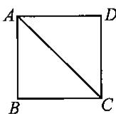  
第3题图

①  $a$  可以用数轴上的一个点来表示；②  $3 < a < 4$ ；③  $a = 2\sqrt{2}$ ；④  $\sqrt{a^2} = a$ ；⑤  $a$  是有理数.

(A)2个；

(B)3个；

(C)4个；

(D)5个.

4. 对于实数  $a$ , 我们规定用  $\{a\}$  表示不小于  $\sqrt{a}$  的最小整数, 称  $\{a\}$  为  $a$  的根整数, 如  $\{\sqrt{10}\} = 4$ .

(1)计算：  $\{\sqrt{9}\} =$  
(2) 若  $\{\sqrt{m}\} = 2$ ，写出满足题意的  $m$  的整数值；  
(3)现对  $a$  进行连续求根整数，直到结果为2为止.例如对12进行连续求根整数，第一次 $\{\sqrt{12}\} = 4$  ，再进行第二次求根整数  $\{\sqrt{4}\} = 2$  ，表示对12连续求根整数2次可得结果为2.对100进行连续求根整数， 次后结果为2.

5. 学习了无理数后, 某数学兴趣小组开展了一次探究活动: 估算  $\sqrt{13}$  的近似值. 小明的方法:

$\because \sqrt{9} <  \sqrt{13} <  \sqrt{16}$  ，设  $\sqrt{13} = 3 + k(0 <   k <   1)$

$$
\therefore (\sqrt {1 3}) ^ {2} = (3 + k) ^ {2},
$$

$$
\therefore 1 3 = 9 + 6 k + k ^ {2},
$$

$\therefore 13 \approx 9 + 6k$  ，解得  $k \approx \frac{4}{6}$

$$
\therefore \sqrt {1 3} \approx 3 + \frac {4}{6} \approx 3. 6 7.
$$

上述方法中使用了完全平方公式： $(a + b)^2 = a^2 + 2ab + b^2$ ，下面可参考使用。

问题：

(1)请你依照小明的方法，估算  $\sqrt{37} \approx$  （结果保留两位小数）；  
(2)请结合上述具体实例，概括出估算  $\sqrt{m}$  的公式：已知非负整数  $a, b, m$  ，若  $a < \sqrt{m} < a + 1$  ，且  $m = a^2 + b$  ，则  $\sqrt{m} \approx$  （用含  $a, b$  的代数式表示）.

# 第20章 二次根式

# 20.1 二次根式及其性质(1)

# 一、选择题

1.下列式子中，  $x$  可取一切实数的是 （ ）

(A)  $\sqrt{x}$ ;

(B)  $(\sqrt{x})^2$

(C)  $\sqrt{x^2}$ ;

(D)  $\frac{1}{|x|}$ .

2.如果  $\sqrt{(x - 2)^2} = x - 2$  ，那么  $x$  的取值范围是 （）

(A)  $x > 2$

(B)  $x < 2$

(C)  $x \geqslant 2$

(D)  $x \leqslant 2$ .

3.如果  $\sqrt{a^2} = -a$  ，那么  $a$  的取值范围是 （ ）

(A)  $a > 0$

(B)  $a < 0$

(C)  $a \geqslant 0$ ;

(D)  $a \leqslant 0$ .

4. 当  $x = \frac{3}{2}$  时，下列式子无意义的是 （）

(A)  $\sqrt{\frac{3}{x - 1}}$ ;

(B)  $\sqrt{2x - 3}$ ;

(C)  $\sqrt{1 + x^2}$ ;

(D)  $\sqrt{1 - x}$ .

# 二、填空题

5. 计算：

(1)  $(\sqrt{9})^2 =$

(2)  $\left(-5\sqrt{\frac{2}{5}}\right)^{2} = \underline{\quad}$

(3)  $(-\sqrt{9})^2 =$

(4)  $\sqrt{(-5)^2} = \_$

6. 如果  $x \geqslant 0$ ，那么  $\sqrt{x^2} =$  ________.

7. 当  $x \leqslant 1$  时,  $\sqrt{x^2 - 2x + 1} =$

8. 计算:  $\sqrt{(-3)^2} = \_$ ;  $-\sqrt{(-3)^2} = \_$

9. 计算:  $\sqrt{(1 - \sqrt{3})^2} =$

10. 已知  $a < 1$ ，化简： $\sqrt{(1 - a)^2} = \_$ ； $\sqrt{(a - 2)^2} = \_$ .

11. 已知  $x = -3, y = \frac{1}{3}$ , 则  $\sqrt{-\frac{y}{x}} =$

12. 观察下列各式:  $\sqrt{1 + \frac{1}{3}} = 2\sqrt{\frac{1}{3}}, \sqrt{2 + \frac{1}{4}} = 3\sqrt{\frac{1}{4}}, \sqrt{3 + \frac{1}{5}} = 4\sqrt{\frac{1}{5}}, \cdots$  请你将发现的规律用含自然数  $n (n \geqslant 1)$  的等式表示出来:

# 三、解答题

13. 设  $x$  是实数, 当  $x$  满足什么条件时, 下列各式在实数范围内有意义?

(1)  $\sqrt{1 - 2x}$ ;

(2)  $\sqrt{x^2 - 4x + 4}$ ;

(3)  $\sqrt{\frac{2}{x - 1}}$ ;

(4)  $\sqrt{\frac{1 - x}{(1 + x)^2}}$ .

14. 先化简，再求值： $\sqrt{9 - 6x + x^2}$ ，其中  $x = \sqrt{3}$  
15. 当  $|2x - y + 4| + \sqrt{x - y + 1} = 0$  时, 求  $x$  与  $y$  的值.

# 思维与拓展8

设  $a, b, c$  分别是三角形三边的长，化简： $\sqrt{(a + b - c)^2} + (\sqrt{a - b + c})^2 + \sqrt{(a - b - c)^2}$ .

# 20.1 二次根式及其性质(2)

# 一、选择题

1. 下列各式一定成立的是 （）

(A)  $\sqrt{a^2 + b^2} = a + b$ ;

(B)  $\sqrt{a^2b^2} = ab$

(C)  $\sqrt{ab} = \sqrt{a} +\sqrt{b}$

(D)  $\sqrt{a^2b^2} = \sqrt{a^2}\cdot \sqrt{b^2}.$

2. 若等式  $\sqrt{x^2 - 9} = \sqrt{x + 3} \cdot \sqrt{x - 3}$  成立，则  $x$  的取值范围是 （）

(A)  $x \geq -3$ ;

(B)  $x \geqslant 3$ ;

(C)  $-3 \leqslant x \leqslant 3$ ;

(D)  $x\geqslant 9$

3. 等式  $\sqrt{\frac{a - 3}{a - 5}} = \frac{\sqrt{a - 3}}{\sqrt{a - 5}}$  成立的条件是 （）

(A)  $a \neq 5$ ;

(B)  $a \geqslant 3$ ;

(C)  $a \geqslant 3$  且  $a \neq 5$ ;

(D)  $a > 5$

4. 下列二次根式是最简二次根式的是 （）

(A)  $\sqrt{12x}$ ;

(B)  $\sqrt{x - 9}$ ;

(C)  $\sqrt{\frac{a + b}{b}}$ ;

(D)  $\sqrt{5x^2y}$ .

5. 化简二次根式  $\sqrt{27a^2b^3}$  为最简二次根式，得 （）

(A)  $3\sqrt{3a^2b^2}$ ;

(B)  $3ab\sqrt{b^2}$ ;

(C)  $3|a|b\sqrt{3b}$

(D)  $3ab\sqrt{a}$

# 二、填空题

6. 化简:  $\sqrt{50x} =$  
7. 化简:  $\sqrt{\frac{x}{64}} =$  
8. 在式子  $\sqrt{8x}, \sqrt{\frac{1}{5}}, \sqrt{a + x^2}$  中，______是最简二次根式.  
9. 计算:  $\sqrt{27 \times 12} =$  ________;  $\sqrt{2\frac{23}{49}} =$  ________.  
10. 计算:  $\sqrt{(-16) \times (-49)} =$  ________;  $\sqrt{\frac{(-45) \times 4}{-125}} =$  ________.  
11. 若  $\sqrt{(-a)^2b} = a\sqrt{b}$ , 则  $a, b$  的取值范围是  
12. 当  $m > n$  时，化简： $(m - n)\sqrt{\frac{m + n}{m - n}} =$

# 三、解答题

13. 计算：

(1)  $\sqrt{27x^3}$ ;

(2)  $\sqrt{12xy^3} (x > 0)$ ;

(3)  $\sqrt{\frac{169}{4 \times 25}}$ ;

(4)  $\sqrt{\frac{48y}{x^2}} (x < 0)$ ;

(5)  $2\sqrt{\frac{b^4}{12a}}$

(6)√-1.

14. 把下列各式化成最简二次根式：

(1)  $\sqrt{18x^3y^4}$ ;

(2)  $\sqrt{25m^4 + 225m^2}$  ( $m > 0$ );

(3)  $\sqrt{3x^2 - 6x + 3} (x > 1)$ ;

（4）√

15. 已知实数  $a$  在数轴上的位置如图所示, 化简:  $|1 - a| + \sqrt{a^2}$ .

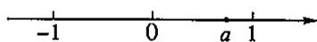  
第15题图

# 思维与拓展9

已知实数  $m$  满足  $\sqrt{(2024 - m)^2} +\sqrt{m - 2025} = m$  ，求  $m - 2024^2$  的值

# 习题20.1

# 一、选择题

1. 下列式子：

$$
① \sqrt {6}; ② \sqrt {- 1 8}; ③ \sqrt {x ^ {2} + 1}; ④ \sqrt [ 3 ]{- 8}; ⑤ \sqrt {x ^ {2} + 2 x + 1}; ⑥ 3 \sqrt {| x |}; ⑦ \sqrt {1 + 2 x} \left(x <   - \frac {1}{2}\right).
$$

其中一定是二次根式的有 （）

(A)7个；

(B)5个；

(C)4个；

(D)3个.

2. 要使式子  $\frac{\sqrt{a + 2}}{a}$  有意义, 则  $a$  的取值范围是 ( )

(A)  $a \neq 0$ ;

(B)  $a > -2$  ，且  $a \neq 0$

(C)  $a > -2$  或  $a \neq 0$ ;

(D)  $a \geq -2$ ，且  $a \neq 0$ .

3. 等式  $\sqrt{a^2} = (\sqrt{a})^2$  成立的条件是 （）

(A)  $a$  是任意实数；

(B)  $a > 0$

(C)  $a < 0$ ;

(D)  $a \geqslant 0$ .

4. 若  $\sqrt{a^2} = -a$  ，则实数  $a$  在数轴上的对应点一定在 （ ）

(A)原点左侧；

(B)原点右侧；

(C) 原点或原点左侧；

(D)原点或原点右侧.

5. 若实数  $a < b$  ，则化简  $\sqrt{(a - b)^2}$  的结果为 （ ）

(A)  $a + b$

(B)  $a - b$

(C)  $-a - b$

(D)  $-a + b$ .

# 二、填空题

6. 若  $\sqrt{3x - 5}$  有意义, 则  $x$  可取的最小整数为

7. 若二次根式  $\sqrt{5a^2 + 3}$  有意义，则  $a$  的取值范围是

8. 已知  $x, y$  为实数，且  $\sqrt{x - 1} + 3(y - 2)^2 = 0$ ，则  $x - y$  的值为 ______.

9. 若  $\sqrt{x - 1} + \sqrt{1 - x} = (x + y)^2$ ，则  $\sqrt{8x - y} - x^y$  的值是

10. 化简：

(1)  $\sqrt{(-2)^2} =$

(2)  $(-\sqrt{7})^2 =$

(3)  $\sqrt{(1 - \sqrt{3})^2} = \_$

(4)  $-\left(7\sqrt{\frac{3}{14}}\right)^2 =$

(5)  $\sqrt{(a^2 - 2ab + b^2)^2} = \_$

11. 当  $1 < x < 4$  时，  $|x - 4| + \sqrt{x^2 - 2x + 1} =$

12. 已知  $a, b$  在数轴上的位置如图所示，则  $\sqrt{b^2} + \sqrt{(a - b)^2} - |b - a|$  的化简结果是

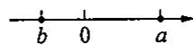

# 三、解答题

13. 已知  $a, b$  为实数，且满足  $a = \sqrt{2b - 1} + \sqrt{1 - 2b} + 1$ .

(1)  $b$  的值为多少？  
(2)求  $a$  的值；  
(3)求  $a + b$  的值

14. 当  $x$  取什么实数时, 式子  $\sqrt{3x - 1} + 2$  的值最小? 求出这个最小值.

15. 已知  $a, b, c$  满足  $(a - \sqrt{8})^2 + \sqrt{b - 5} + |c - 3\sqrt{2}| = 0$ .

(1)求  $a,b,c$  的值；  
(2) 以长度分别为  $a, b, c$  的线段为边能否构成三角形？若能，求出三角形的周长；若不能，请说明理由.

16. 已知  $m$  满足  $\left\{ \begin{array}{l} 2x + 3y - m = 0, \\ 3x + 2y + 1 + 2m = 0, \end{array} \right.$  且  $\sqrt{x + y - 2025} = -\sqrt{2025 - x - y}$ , 求  $m$  的值.

# 20.2 二次根式的运算(1)

# 一、选择题

1. 下列根式与  $\sqrt{3}$  是同类二次根式的是 （）

(A)  $\sqrt{6}$ ;

(B)  $\sqrt{\frac{1}{3}}$ ;

(C)  $\sqrt{9}$ ;

(D)  $\sqrt{24}$ .

2. 若  $\sqrt{x}$  与  $\sqrt{5}$  是同类二次根式，则  $x$  可以是 （）

(A)0.5;

(B)50;

(C)125;

(D)25.

3. 下列根式与  $\sqrt{xy}$  不是同类二次根式的是 （）

(A)  $\sqrt{\frac{xy}{4}}$ ;

(B)  $\sqrt{x + y}$ ;

(C)  $\sqrt{\frac{x}{y}}$ ;

(D)  $\frac{1}{\sqrt{xy}}$

4. 下列各式运算正确的是 （）

(A)  $\sqrt{x} + \sqrt{2x} = \sqrt{3x}$ ;

(B)  $3\sqrt{3} - 2\sqrt{3} = 1$

(C)  $\sqrt{2} + \sqrt{3} = \sqrt{5}$ ;

(D)  $a\sqrt{x} - b\sqrt{x} = (a - b)\sqrt{x}$ .

# 二、填空题

5. 在  $\sqrt{16}, \frac{\sqrt{72}}{2}, -\sqrt{48}$  中，与  $\sqrt{2}$  是同类二次根式的是  
6. 若最简二次根式  $\sqrt{2x - 1}$  和  $3\sqrt{3x - 4}$  是同类二次根式，则  $x =$  
7. 合并同类二次根式:  $6\sqrt{2} + \frac{1}{5}\sqrt{2} - 4\sqrt{2} =$  
8. 合并同类二次根式:  $2\sqrt{12} - 3\sqrt{48} =$  ________.  
9. 方程  $\sqrt{12} + x = \sqrt{27}$  的解为  
10. 如果  $x = \sqrt{2} - 1, y = 3\sqrt{2} + 2$ ，那么  $y - 3x =$  ________.  
11. 计算:  $2\sqrt{0.5} + \sqrt{18} - \frac{\sqrt{8}}{2} =$  
12. 已知二次根式  $\sqrt{2x + 5}$  与  $\sqrt{5}$  是同类二次根式，则满足条件的最小正整数  $x$  的值为

# 三、解答题

13. 试判断下列各组中的二次根式是不是同类二次根式：

(1)  $\sqrt{32}, \sqrt{50}, 2\sqrt{\frac{1}{18}}$ ;

(2)  $\sqrt{4x^3}, 2\sqrt{2x}, \sqrt{8x^2}$ .

14. 计算：

(1)  $-\frac{3}{4}\sqrt{3} + \frac{3}{5}\sqrt{3} + \frac{1}{2}\sqrt{3} - \frac{3}{10}\sqrt{3}$ ;

(2)  $2\sqrt{2x} - \sqrt{2x} + \frac{1}{3}\sqrt{2x}$ ;

(3)  $4\sqrt{\frac{a}{2}} + 6a\sqrt{\frac{2}{a}} - \sqrt{8a}$ ;

(4)  $\frac{2}{3}\sqrt{9x} -\left[2x\sqrt{\frac{1}{x}} -6\sqrt{\frac{x}{4}}\right].$

15. 已知  $a = \sqrt{b - 25} - \sqrt{25 - b} + 16$ ，求二次根式  $\sqrt{ab}$  的值  
16. 解不等式:  $\sqrt{8} - 2x < \sqrt{18}$ .

# 思维与拓展10

对于题目“化简并求值：  $\frac{1}{a} +\sqrt{\frac{1}{a^2} + a^2 - 2}$  ，其中  $a = \sqrt{2}$  ."小杰与小丽两人的解答不同.小杰的解答是：  $\frac{1}{a} +\sqrt{\frac{1}{a^2} + a^2 - 2} = \frac{1}{a} +\sqrt{\left(\frac{1}{a} - a\right)^2} = \frac{1}{a} +\frac{1}{a} -a = \frac{2}{a} -a = 0;$

小丽的解答是：  $\frac{1}{a} +\sqrt{\frac{1}{a^2} + a^2 - 2} = \frac{1}{a} +\sqrt{\left(a - \frac{1}{a}\right)^2} = \frac{1}{a} +a - \frac{1}{a} = a = \sqrt{2}.$

谁的解答是正确的？为什么？

# 20.2 二次根式的运算(2)

# 一、选择题

1. 化简  $\frac{\sqrt{8}}{\sqrt{2}}$  的结果是 （ ）

(A)2;

(B)  $2\sqrt{2}$ ;

(C)  $-2\sqrt{2}$ ;

(D)  $\pm 2\sqrt{2}$ .

2. 计算  $3 \div \sqrt{3} \times \frac{1}{\sqrt{3}}$  的结果为 （）

(A)3;

(B)9;

(C)1;

(D)  $3\sqrt{3}$ .

3. 把  $a \sqrt{-\frac{1}{a}}$  根号外的字母放入根号内，得 （）

(A)  $\sqrt{-a}$ ;

(B)  $-\sqrt{-a}$ ;

(C)  $-\sqrt{a}$ ;

(D)  $\sqrt{a}$ .

4. 下列各式成立的是 （）

(A)  $\sqrt{a} \cdot \sqrt{b} = \sqrt{ab}$ ;

(B)  $\sqrt{ab} = \sqrt{a} \cdot \sqrt{b}$ ;

(C)  $\sqrt{\frac{a}{b}} = \frac{\sqrt{a}}{\sqrt{b}}$ ;

$\left(\mathrm{D}\right)\frac{\sqrt{a}}{\sqrt{b}} = \sqrt{\frac{b}{a}}.$

# 二、填空题

5. 计算:  $\sqrt{7} \times \sqrt{14} = \_\_\_\_\_\_\_\_\_; 2\sqrt{5} \times 3\sqrt{15} = \_\_\_\_\_\_\_\_\_.$  
6. 计算:  $\sqrt{0.2} \times \sqrt{1.8} = \_$ $\sqrt{\frac{8}{3}} \times \sqrt{\frac{1}{6}} = \_$ .  
7. 计算:  $\sqrt{6x} \cdot \sqrt{2x} = \_$  ;  $16\sqrt{a^3b} \div \sqrt{2a} = \_$ .  
8. 计算:  $\sqrt{3} \times \frac{1}{2}\sqrt{6} = \_$ ;  $\sqrt{3} \div \frac{1}{2}\sqrt{6} = \_$ .  
9. 计算：

(1)  $\sqrt{50} -\sqrt{98} =$

(2)  $\sqrt{50} - \sqrt{\frac{1}{2}} + \sqrt{18} = \_$

(3)  $\sqrt{2m^3} + \sqrt{8m} - \sqrt{2mn^2}$  ( $n < 0$ ) =

10. 解方程:  $\sqrt{\frac{3}{2}} = \sqrt{\frac{27}{8}} + x + \sqrt{\frac{75}{2}}$ , 得  $x =$  
11. 要使  $\frac{\sqrt{2x + 1}}{\sqrt{1 - x}} = \sqrt{\frac{2x + 1}{1 - x}}$  成立, 则  $x$  的取值范围是  
12. 在  $\triangle ABC$  中,  $BC$  边上的高  $h = 6\sqrt{3} \mathrm{~cm}$ , 它的面积恰好等于边长为  $3\sqrt{2} \mathrm{~cm}$  的正方形的面积, 则  $BC$  的长为

# 三、解答题

13. 计算：

(1)  $\sqrt{12} \times \sqrt{15} \times \sqrt{20}$ ;

(2)  $3\sqrt{18} \times \frac{1}{6}\sqrt{3} \div 2\sqrt{6}$ ;

(3)  $\sqrt{\frac{2x}{y}} \times \sqrt{\frac{6y}{25x}}$ ;

(4)  $\sqrt{x^3y} \div \sqrt{\frac{5}{xy^2}}$ ;

(5)  $\left[-\sqrt{\frac{2}{3x}}\right] \times \sqrt{8x^3} \div (-\sqrt{6x})$ ;

(6)  $3\sqrt{\frac{b}{x}} \div \left[-2\sqrt{\frac{b}{a}}\right] \cdot \sqrt{\frac{x}{a}}.$

14. 若  $x, y$  为实数，且  $y = \frac{\sqrt{x^2 - 4} + \sqrt{4 - x^2} + 1}{x + 2}$ ，求  $\sqrt{x + y} \cdot \sqrt{x - y}$  的值

# 20.2 二次根式的运算(3)

# 一、选择题

1. 根式  $\frac{1}{2\sqrt{ab}}$  分母有理化后，得 （ ）

(A)  $\frac{\sqrt{2ab}}{2ab}$ ;

(B)  $\frac{\sqrt{2ab}}{4ab}$ ;

(C)  $\frac{\sqrt{ab}}{2ab}$ ;

$\mathrm{(D)}\frac{\sqrt{ab}}{4ab}.$

2. 将式子  $-\frac{2}{\sqrt{x + y}}$  分母有理化，分子、分母应同时乘 （ ）

(A)  $\sqrt{x} +\sqrt{y}$

(B)  $\sqrt{x} -\sqrt{y}$

(C)  $\sqrt{x + y}$ ;

(D)  $\sqrt{x - y}$ .

3. 将式子  $\frac{2}{\sqrt{99}}$  分母有理化，简单的方法是分子、分母同时乘 （）

(A)  $\sqrt{99}$ ;

(B)  $\sqrt{33}$ ;

(C)  $\sqrt{11}$ ;

(D)  $\sqrt{3}$ .

4. 计算  $\sqrt{a^2} \cdot \sqrt{-a}$  的值为 （）

(A)  $a\sqrt{-a}$ ;

(B)  $-a\sqrt{a}$ ;

(C)  $\sqrt{a}$ ;

(D)  $-a\sqrt{-a}$ .

5. 计算  $\frac{1}{\sqrt{3} + \sqrt{2}} - \frac{1}{\sqrt{2} - \sqrt{3}}$  的值为

(A)  $2\sqrt{2}$ ;

(B)  $2\sqrt{3}$ ;

(C)  $2 - 2\sqrt{3}$ ;

(D)  $-2\sqrt{2}$ .

# 二、填空题

6. 计算：

(1)  $\sqrt{2} \times \sqrt{\frac{1}{2}} =$  
(2)  $(\sqrt{2} + 1) \times (\sqrt{2} - 1) =$  
(3)  $(2\sqrt{3} + \sqrt{2}) \times (2\sqrt{3} - \sqrt{2}) =$  
(4)  $(m\sqrt{a} + n\sqrt{b}) \times (m\sqrt{a} - n\sqrt{b}) =$

通过上面的计算发现，等式的左边含有二次根式，等式的右边

7. 将下列各式分母有理化，并化简：

$$
\sqrt {\frac {1}{2 a}} = \underline {{\quad}}; \sqrt {\frac {1}{1 2}} = \underline {{\quad}}.
$$

8. 比较大小:  $\frac{4}{\sqrt{3}}$ $\sqrt{3}$ ;  $-\sqrt{18}$ $-\frac{9}{\sqrt{3}}$ .  
9. 分母有理化:  $\frac{1}{\sqrt{3x}} = \_$  ________； $\frac{3}{\sqrt{2}} = \_$  ________.  
10. 分母有理化:  $\frac{5}{\sqrt{2a + b}} =$

# 三、解答题

11. 将下列各式分母有理化：

(1)  $\sqrt{\frac{1}{2}}$ ;

(2)  $\frac{\sqrt{21}}{\sqrt{6}}$ ;

(3)  $\frac{\sqrt{12}}{2\sqrt{5}}$

(4)  $\frac{5\sqrt{3}}{3\sqrt{5}}$

(5)  $\frac{x}{\sqrt{x + 1}}$

(6)  $\frac{\sqrt{x + 1}}{\sqrt{x - 1}}$ .

12. 解方程:  $\sqrt{8} \cdot (x - 3\sqrt{2}) = \sqrt{\frac{1}{2}}$ .

# 思维与拓展 11

比较大小： $\sqrt{19} - \sqrt{15}$  与  $\sqrt{15} - \sqrt{11}$ .

# 20.2 二次根式的运算(4)

# 一、选择题

1.  $2 - \sqrt{3}$  的有理化因式是 （）

(A)  $2 + \sqrt{3}$ ;

(B)  $2 - \sqrt{3}$

(C)  $\sqrt{3} - 2$ ;

(D)  $\sqrt{3}$ .

2. 化简  $(\sqrt{2} - 1)(\sqrt{2} + 1)^{2}$  的正确结果是 （）

(A)  $\sqrt{2} - 1$ ;

(B)  $\sqrt{2} + 1$ ;

(C)  $1 - \sqrt{2}$

(D)  $-1 - \sqrt{2}$ .

3. 化简  $\sqrt{8} -\sqrt{2} (\sqrt{2} +2)$  的正确结果是 （）

(A)-2;

(B)  $\sqrt{2} - 2$ ;

(C)2;

(D)  $4\sqrt{2} - 1$

4.下列等式成立的是 （）

(A)  $\sqrt{a} +\sqrt{b} = \sqrt{a + b}$

(B)  $\sqrt{a^2 + b^2} = \sqrt{a} +\sqrt{b}$

(C)  $a\sqrt{b} - c\sqrt{b} = (a - c)\sqrt{b}$ ;

(D)  $(\sqrt{a} + \sqrt{b})^2 = a + b.$

5. 已知  $x = \frac{1}{2 - \sqrt{3}}, y = 2 + \sqrt{3}$ ，则  $x$  与  $y$  的关系是

(A)  $x = y$

(B)  $x = -y$

(C)  $x = \frac{1}{y}$

(D)  $x = -\frac{1}{y}$

6.下列式子不是  $\sqrt{5} -\sqrt{2}$  的有理化因式的是 （）

(A)  $-\sqrt{5} -\sqrt{2}$

(B)  $-\sqrt{5} + \sqrt{2}$ ;

(C)  $\sqrt{5} +\sqrt{2}$

(D)  $\sqrt{20} +\sqrt{8}$

# 二、填空题

7.  $\sqrt{5} +\sqrt{3}$  的有理化因式是  $\sqrt{x} -y$  的有理化因式是  $a\sqrt{x} +b\sqrt{y}$  的有理化因式是  
8. 计算：  $5\sqrt{3} (\sqrt{12} - \sqrt{72}) =$  
9. 计算:  $\sqrt{20} (\sqrt{15} -\sqrt{2} +\sqrt{5}) =$  
10. 计算： $(-\sqrt{6})(2\sqrt{3} - 3\sqrt{2}) = \_$

# 三、解答题

11. 计算：

(1)  $(4\sqrt{2} - 3\sqrt{3})(4\sqrt{2} + 3\sqrt{3})$

(2)  $(2\sqrt{3} - 3\sqrt{2})^2$

(3)  $\left(\frac{1}{2}\sqrt{3} + 2\sqrt{6}\right)\left[\sqrt{\frac{3}{4}} - \sqrt{24}\right]$ ;

(4)  $\sqrt{6} \div (\sqrt{2} + \sqrt{3})$ .

12. 解下列方程或不等式：

(1)  $\sqrt{3} x + \sqrt{24} = 2\sqrt{27}$ ;

(2)  $x - 1 > \sqrt{2} x.$

13. 已知  $x = \sqrt{3} + \sqrt{2}, y = \sqrt{3} - \sqrt{2}$ , 求:

(1)  $x^{2} - xy + y^{2}$  的值；

(2)  $x^{3}y + xy^{3}$  的值.

# 思维与拓展 12

已知  $a = \frac{4}{\sqrt{2} - 2} - \frac{1}{\sqrt{2} - 1}$ .

(1)化简  $a$  
(2) 设  $m$  是  $a$  的整数部分,  $n$  是  $a$  的小数部分, 求  $m^2 + n^2$  的值;  
(3)在(2)的前提下，求关于  $x$  的不等式  $(n - 1)x + a > m$  的解

# 习题20.2

# 一、选择题

1.如果  $\sqrt{x^3 + 3x^2} = -x\sqrt{x + 3}$  ，那么  $x$  的取值范围是 （）

(A)  $x \leqslant 0$ ;

(B)  $x\geq -3$

(C)  $0 < x < 3$

(D)  $-3 \leq x \leq 0$ .

2. 下列二次根式中能与  $2\sqrt{3}$  合并的是 （）

(A)  $\sqrt{8}$ ;

(B)  $\sqrt{\frac{1}{3}}$ ;

(C)  $\sqrt{18}$ ;

(D)  $\sqrt{9}$ .

3. 若  $a = \frac{1}{2 - \sqrt{5}}, b = \frac{1}{2 + \sqrt{5}}$  则  $a + b + ab$  的值是 （ ）

(A)  $1 + 2\sqrt{5}$ ;

(B)  $1 - 2\sqrt{5}$ ;

(C)-5;

(D)3.

4. 化简  $x \sqrt{-\frac{x + 1}{x^2}}$  的结果是

(A)  $\sqrt{-x - 1}$ ;

(B)  $-\sqrt{-x + 1}$ ;

(C)  $\sqrt{x + 1}$ ;

(D)  $-\sqrt{-x - 1}$ .

5. 算式  $\sqrt{6} \times \left[\frac{1}{\sqrt{3}} - 1\right]$  的结果是 （）

(A)  $\sqrt{2} -\sqrt{6}$

(B)  $\sqrt{2} - 1$ ;

(C)  $2 - \sqrt{6}$ ;

(D)1.

6. 算式  $\sqrt{18} -\sqrt{2}$  的结果是 （）

(A)4;

(B)3;

(C)  $2\sqrt{2}$ ;

(D)  $\sqrt{2}$ .

# 二、填空题

7. 计算:  $(- \sqrt{3})^{2} =$

8. 计算:  $\sqrt{\frac{1}{6}} \times \sqrt{96} \div \sqrt{6} =$

9. 化简  $\frac{3}{\sqrt{3}}$  的结果是

10. 计算:  $\frac{\sqrt{40} + \sqrt{5}}{\sqrt{5}} = \_$

11. 计算： $(\sqrt{3} + \sqrt{2}) - \sqrt{3}$  的结果是

12. 计算:  $6\sqrt{5} - 10\sqrt{\frac{1}{5}}$  的结果是

13. 计算： $(\sqrt{6} + \sqrt{3})(\sqrt{6} - \sqrt{3})$  的结果是

14. 比较大小:  $\sqrt{3} - \sqrt{2}$  _______  $2 - \sqrt{3}$  (填“>”“=”或“<”).

15. 如图, 矩形内有两个相邻的正方形, 它们的面积分别为 4 和 2 , 则阴影部分的面积为

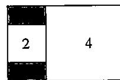  
第15题图

# 三、解答题

16. 计算：

(1)  $\sqrt{\frac{1}{7}} + \sqrt{28} - \sqrt{700}$ ;

(2)  $(\sqrt{6} + 2)(\sqrt{6} - 3)$ ;

(3)  $\sqrt{32} - 4\sqrt{\frac{1}{2}} + \sqrt{\frac{1}{8}}$ ;

(4)  $\left[3\sqrt{12} - 2\sqrt{\frac{1}{3}} + \sqrt{48}\right] \div 2\sqrt{3}.$

17. 已知  $x = \frac{\sqrt{7} + \sqrt{3}}{2}, y = \frac{\sqrt{7} - \sqrt{3}}{2}$ , 求  $3x^{2} - 4xy + 3y^{2}$  的值.  
18. 当  $a = \sqrt{23} - 1$  时, 求代数式  $(a + 1)^2 - (a - \sqrt{23})(a + 1)$  的值  
19. 阅读下列解题过程

化简:  $\frac{4\sqrt{10}}{\sqrt{8} + \sqrt{5} + \sqrt{13}} = \frac{(8 + 4\sqrt{10} + 5) - 13}{\sqrt{8} + \sqrt{5} + \sqrt{13}} = \frac{(\sqrt{8} + \sqrt{5})^2 - (\sqrt{13})^2}{\sqrt{8} + \sqrt{5} + \sqrt{13}} = \sqrt{8} + \sqrt{5} - \sqrt{13}$ .

这样的化简方法比较适用于像这类具有某种特征的根式化简的题目.

(1) 请利用上述方法, 化简:  $\frac{2\sqrt{6}}{\sqrt{2} + \sqrt{3} + \sqrt{5}}$ ;  
(2) 仔细分析化简过程, 然后找出规律, 把这解题方法做尽可能的推广.

# 第20章 复习(1)

# 一、选择题

1. 下列二次根式中属于最简二次根式的是 （）

(A)  $\sqrt{18}$ ;

(B)  $\sqrt{a^2b}$ ;

(C)  $\sqrt{x^2 + 1}$ ;

(D)  $\sqrt{\frac{x + 1}{5}}$ .

2.如果  $\sqrt{x}\cdot \sqrt{x - 3} = \sqrt{x(x - 3)}$  ，那么 （）

(A)  $x \geqslant 0$ ;

(B)  $x \geqslant 3$

(C)  $0 \leqslant x \leqslant 3$

(D)  $x$  为任意实数

3.估计  $\sqrt{6} +1$  的值在 （）

(A)2到3之间；

(B)3到4之间；

(C)4到5之间；

(D)5到6之间.

4. 已知  $xy < 0$ ，则  $\sqrt{x^2y}$  化简后为 （）

(A)  $x\sqrt{y}$

(B)  $-x\sqrt{y}$ ;

(C)  $x\sqrt{-y}$

(D)  $-x\sqrt{-y}$ .

5. 若  $a = \frac{1}{3 - \sqrt{8}} - \frac{1}{\sqrt{8} - \sqrt{7}} + \frac{1}{\sqrt{7} - \sqrt{6}} - \frac{1}{\sqrt{6} - \sqrt{5}}$ ，则  $a$  的值所在的范围为 （）

(A)  $a \geqslant 0$ ;

(B)  $0 < a < 1$

(C)  $1 < a < 2$

(D)  $a > 2$

6. 若  $y = \sqrt{x - 5} + \sqrt{15 - 3x} + 3$ ，则  $xy$  的值为 （）

(A)—15;

(B)-9;

(C)9;

(D)15.

# 二、填空题

7. 要使代数式  $\frac{\sqrt{2x - 1}}{x - 1}$  有意义, 则  $x$  的取值范围是  
8.  $2 - \sqrt{3}$  的相反数是 ，绝对值是  
9. 比较大小:  $\frac{\sqrt{5} - 1}{2}$ $\frac{1}{2}$  (填“>”“<”或“=”).  
10. 如果  $\sqrt{x + 1} + |y - 2| = 0$ ，那么  $xy =$  ________.  
11. 若  $a, b, c$  为三角形的三边长，则  $\sqrt{(a + b - c)^2} + \sqrt{(b - a - c)^2} =$  
12. 计算： $(\sqrt{12} + 5\sqrt{8}) \times \sqrt{2} =$  
13. 化简： $\sqrt{1 - x} + \sqrt{x - 1} =$  
14. 化简:  $(2 + \sqrt{3})^{12} (2 - \sqrt{3})^{10} =$  
15. 规定  $a \times b = \sqrt{a} \cdot \sqrt{b} \div \sqrt{\frac{a}{b}}$ , 则  $3 \times 5 =$

# 三、解答题

16. 计算：

(1)  $\sqrt{8} - 5\sqrt{\frac{1}{2}} + 4\sqrt{\frac{1}{8}}$ ;

(2)  $(\sqrt{6} - \sqrt{5})^2 (\sqrt{6} + \sqrt{5})^2$ ;

(3)  $(10\sqrt{18} - 6\sqrt{27} + 4\sqrt{12}) \div \sqrt{6}$ ;

(4)  $\left[\sqrt{ab} -\frac{ab}{a + \sqrt{ab}}\right]\div \frac{\sqrt{ab} - a}{a - b}.$

17. (1) 已知  $y = \sqrt{3 - x} + \sqrt{x - 3} + 5$ ，则  $x^{2} - xy$  的值是多少？

(2)已知  $a = 5 + 2\sqrt{6}, b = 5 - 2\sqrt{6}$ ，求  $\frac{a}{b} + \frac{b}{a}$  的值.

18. 已知实数  $a, b, c$  在数轴上的位置如图所示，化简： $\sqrt{a^2} - |a + c| + \sqrt{(c - b)^2} - |-b|$ .

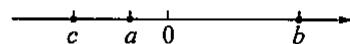  
第18题图

19. 观察下面的变形规律：

$$
\frac {1}{\sqrt {2} + 1} = \sqrt {2} - 1, \frac {1}{\sqrt {3} + \sqrt {2}} = \sqrt {3} - \sqrt {2}, \frac {1}{\sqrt {4} + \sqrt {3}} = \sqrt {4} - \sqrt {3}, \frac {1}{\sqrt {5} + \sqrt {4}} = \sqrt {5} - \sqrt {4}, \dots .
$$

解答下面的问题：

(1)若  $n$  为正整数,请你猜想  $\frac{1}{\sqrt{n + 1} + \sqrt{n}} = \_$  
(2) 计算:  $\left[\frac{1}{\sqrt{2} + 1} + \frac{1}{\sqrt{3} + \sqrt{2}} + \frac{1}{\sqrt{4} + \sqrt{3}} + \dots + \frac{1}{\sqrt{2026} + \sqrt{2025}}\right] \times (\sqrt{2026} + 1)$ .

# 第20章 复习(2)

# 一、选择题

1. 下列计算正确的是 （）

(A)  $x^{3} + x^{2} = x^{6}$

(B)  $m^2 \cdot m^3 = m^6$ ;

(C)  $3\sqrt{2} - \sqrt{2} = 3$

(D)  $\sqrt{14} \times \sqrt{7} = 7\sqrt{2}$ .

2. 下列二次根式中，不能与  $\sqrt{2}$  合并的是 （）

(A)  $\sqrt{\frac{1}{2}}$ ;

(B)  $\sqrt{8}$ ;

(C)  $\sqrt{12}$ ;

(D)  $\sqrt{18}$ .

3. 已知二次根式:  $\sqrt{12} \cdot \frac{\sqrt{a}}{3} - \frac{1}{2} \sqrt{a^2 b} \cdot \sqrt{\frac{1}{4} a} \cdot \sqrt{m^2 n} \cdot \sqrt{x^2 + y^2}$ , 其中是最简二次根式的有 ( )

(A)2个；

(B)3个；

(C)1个；

(D)4个.

4. 与  $\sqrt{a^3b}$  不是同类二次根式的是 （）

(A)  $\sqrt{\frac{ab}{2}}$ ;

(B)  $\sqrt{\frac{b}{a}}$ ;

(C)  $\frac{1}{\sqrt{ab}}$

(D)  $\sqrt{\frac{b}{a^3}}$ .

5. 已知  $1 \leqslant a \leqslant 2$ ，则  $\sqrt{a^2 - 4a + 4} + |a - 1|$  的值为 （）

(A)1;

(B)-1;

(C)  $2a - 3$

(D)  $3 - 2a$

6. 已知  $x = 2 - \sqrt{10}$ ，则代数式  $x^{2} - 4x - 6$  的值为 （）

(A)-1;

(B)0;

(C)1;

(D)2.

# 二、填空题

7. 计算：  $3 \div \sqrt{6} =$  
8. 比较大小：

(1)  $-3\sqrt{2} - 2\sqrt{3}$ ;  
(2)  $\sqrt{8} -\sqrt{7}$ $\sqrt{7} -\sqrt{6}.$

9. 如果  $\sqrt{(a - \sqrt{11})^2} + |b - \sqrt{2}| = 0$ ，那么以  $a, b$  为边长的等腰三角形的周长为  
10. 已知  $xy = 1, y = \frac{1}{2 - \sqrt{3}}$  则  $\frac{1}{x + 1} + \frac{1}{y + 1} =$  
11. 已知矩形的长为  $2\sqrt{5}\mathrm{cm}$ , 宽为  $\sqrt{10}\mathrm{cm}$ , 则面积为  $\mathrm{cm}^2$ .  
12. 使  $\frac{\sqrt{x}}{2x - 1}$  有意义的  $x$  的取值范围是  
13. 已知  $\sqrt{x - 1} + \sqrt{1 - x} = y + 4$ ，则  $x^y$  的平方根为  
14. 定义“@”的运算法则为:  $x @ y = \sqrt{xy + 4}$ , 则  $(2 @ 6) @ 6 =$

# 三、解答题

15. 计算：

(1)  $\sqrt{12} \div \sqrt{27} \times \sqrt{18}$ ;

(2)  $\left[4\sqrt{6} - 4\sqrt{\frac{1}{2}} + 3\sqrt{8}\right] \div 2\sqrt{2}$ ;

(3)  $\sqrt{24} \times \sqrt{\frac{1}{3}} - 4 \times \sqrt{\frac{1}{8}} \times (1 - \sqrt{2})^{0}$ ;

(4)  $\frac{x - y}{\sqrt{x} + \sqrt{y}} - \frac{x + y - 2\sqrt{xy}}{\sqrt{x} - \sqrt{y}}.$

16. 已知  $x, y$  为实数，且  $y < \sqrt{x - 1} + \sqrt{1 - x} + 3$ ，化简： $|y - 3| - \sqrt{y^2 - 8y + 16}$ .  
17. 已知  $a = \frac{1}{2 + \sqrt{3}}$  求  $\frac{1 - 2a + a^2}{a - 1} -\frac{\sqrt{a^2 - 2a + 1}}{a^2 - a}$  的值

18. 先阅读材料, 再回答问题:

因为  $\sqrt{1^2 + 1} = \sqrt{2}$  且  $1 < \sqrt{2} < 2$ ，所以  $\sqrt{1^2 + 1}$  的整数部分为 1；

因为  $\sqrt{2^2 + 2} = \sqrt{6}$  且  $2 < \sqrt{6} < 3$  ，所以  $\sqrt{2^2 + 2}$  的整数部分为2.

以此类推：  $\sqrt{n^2 + n}$  （  $n$  为正整数)的整数部分为 ，理由是

# 挑战压轴题20

1. 解方程组:  $\left\{ \begin{array}{l} \sqrt{3} x - \sqrt{2} y = \sqrt{2}, \\ x - \sqrt{6} y = 1. \end{array} \right.$

2. 观察下列等式：

$\frac{1}{\sqrt{2} + 1} = \frac{\sqrt{2} - 1}{(\sqrt{2} + 1)(\sqrt{2} - 1)} = \sqrt{2} - 1;$  
②  $\frac{1}{\sqrt{3} + \sqrt{2}} = \frac{\sqrt{3} - \sqrt{2}}{(\sqrt{3} + \sqrt{2})(\sqrt{3} - \sqrt{2})} = \sqrt{3} - \sqrt{2}$ ;  
③  $\frac{1}{\sqrt{4} + \sqrt{3}} = \frac{\sqrt{4} - \sqrt{3}}{(\sqrt{4} + \sqrt{3})(\sqrt{4} - \sqrt{3})} = \sqrt{4} - \sqrt{3}$ ;

···

回答下列问题：

(1)利用你观察到的规律，化简：  $\frac{1}{2\sqrt{3} + \sqrt{11}}$  
(2)计算：  $\frac{1}{1 + \sqrt{2}} +\frac{1}{\sqrt{2} + \sqrt{3}} +\frac{1}{\sqrt{3} + 2} +\dots +\frac{1}{3 + \sqrt{10}}.$

3. 已知  $a, b, c$  满足  $|a - \sqrt{8}| + \sqrt{b - 5} + (c - 3\sqrt{2})^2 = 0$ .

(1)求  $a,b,c$  的值；  
(2) 试问: 以  $a, b, c$  为边能否构成三角形? 如果能构成三角形, 请求出三角形的周长; 如果不能构成三角形, 请说明理由.

4. 阅读下列材料, 然后回答问题

在进行二次根式去分母时，我们有时会碰上如： $\frac{5}{\sqrt{3}}, \sqrt{\frac{2}{3}}, \frac{2}{\sqrt{3} + 1}$  这样的式子，其实我们还可以将其进一步化简：

$$
\begin{array}{l} \frac {5}{\sqrt {3}} = \frac {5 \times \sqrt {3}}{\sqrt {3} \times \sqrt {3}} = \frac {5 \sqrt {3}}{3}; \quad ① \\ \sqrt {\frac {2}{3}} = \sqrt {\frac {2 \times 3}{3 \times 3}} = \frac {\sqrt {6}}{3}; \quad ② \\ \frac {2}{\sqrt {3} + 1} = \frac {2 \times (\sqrt {3} - 1)}{(\sqrt {3} + 1) (\sqrt {3} - 1)} = \frac {2 (\sqrt {3} - 1)}{(\sqrt {3}) ^ {2} - 1 ^ {2}} = \sqrt {3} - 1. \quad ③ \\ \end{array}
$$

以上这种化简的步骤叫作分母有理化

$\frac{2}{\sqrt{3} + 1}$  还可以用以下方法化简：

$$
\frac {2}{\sqrt {3} + 1} = \frac {3 - 1}{\sqrt {3} + 1} = \frac {(\sqrt {3}) ^ {2} - 1 ^ {2}}{\sqrt {3} + 1} = \frac {(\sqrt {3} + 1) (\sqrt {3} - 1)}{\sqrt {3} + 1} = \sqrt {3} - 1. \tag {4}
$$

(1) 请用不同的方法化简  $\frac{2}{\sqrt{5} + \sqrt{3}}$

参照  $③$  式，得  $\frac{2}{\sqrt{5} + \sqrt{3}} =$

参照  $④$  式，得  $\frac{2}{\sqrt{5} + \sqrt{3}} =$

(2)化简：  $\frac{1}{\sqrt{3} + 1} +\frac{1}{\sqrt{5} + \sqrt{3}} +\frac{1}{\sqrt{7} + \sqrt{5}} +\dots +\frac{1}{\sqrt{2n + 1} + \sqrt{2n - 1}} (n = 1,2,3\dots).$

# 第21章 一元二次方程

# 21.1 一元二次方程

# 一、选择题

1. 下列方程是一元二次方程的是 （）

(A)  $ax^2 - x + 1 = 0$ ;  
(B)  $2x^{2} + 3x = (x - 1)(2x + 1)$ ;  
(C)  $\frac{1}{x + 2} = x^2 - 5$ ;  
(D)  $x^{2} = 0$

2. 若关于  $x$  的方程  $(a - 2)x^{2} + x + a^{2} - 4 = 0$  是一元二次方程，则  $a$  满足 （）

(A)  $a > 2$

(B)  $a \geqslant 2$ ;

(C)  $a \neq 2$ ;

(D)  $a <   2$

3. 已知一个一元二次方程有两个根分别是一2、3，这个方程可能是 （）

(A)  $x^{2} - x + 6 = 0$

(B)  $x^{2} - x - 6 = 0$

(C)  $x^{2} + x - 6 = 0$

(D)  $x^{2} + x + 6 = 0$

4. 如果关于  $x$  的一元二次方程  $(m - 2)x^{2} - 3x + m^{2} - 4 = 0$  有一个根为0,那么  $m$  的值为（）

(A)  $\pm 2$

(B)2;

(C)-2;

(D)不等于2.

# 二、填空题

5. 填表：

<table><tr><td></td><td>一般式</td><td>二次项系数</td><td>一次项系数</td><td>常数项</td></tr><tr><td>(x+1)(x-2)=1</td><td></td><td></td><td></td><td></td></tr><tr><td>x(x-2)=x+1</td><td></td><td></td><td></td><td></td></tr><tr><td>(2x+3)2=9</td><td></td><td></td><td></td><td></td></tr><tr><td>4+x2-3x=0</td><td></td><td></td><td></td><td></td></tr></table>

6.  $x = 1$  （填“是”或“不是”)方程  $x^{2} + 2x - 3 = 0$  的根  
7. 若关于  $x$  的方程  $x^{2} - mx - 3 = 0$  的一个根是3，则  $m =$  
8. 已知一元二次方程  $ax^2 + bx + c = 0$ ，如果有一个根为 0，那么  $a^c =$  ________.  
9. 已知一元二次方程  $ax^2 + bx + c = 0$  的一个根为1，则  $a + b + c =$  
10. 已知一元二次方程  $ax^2 + bx + c = 0$  的一个根为-1，则  $a - b + c =$  _______.

# 三、解答题

11. 根据第  $8 \sim 10$  题的结论, 试判别  $0, 1, -1$  中哪些数分别是下列一元二次方程的根.

(1)  $2x^{2} - 3x + 1 = 0$

(2)  $x^{2} - 3x - 4 = 0$

(3)  $2x^{2} + 3x = 0$

(4)  $x^{2} + 6x - 4 = 5x - 2.$

12. 写出一个一元二次方程，使这个方程的一个根是一1，它的二次项系数是2.  
13. 当  $m$  取何值时，方程  $(m - 1)x^{|m| + 1} + 3x + 2 = 0$  是一元二次方程？  
14. 已知关于  $x$  的方程  $(m + 2)(m - 1)x^{2} + (m - 1)x + 5 = 0$ .

(1)当  $m$  为何值时，方程是一元二次方程？  
(2)当  $m$  为何值时，方程是一元一次方程？

# 21.2 一元二次方程的解法(1)

# 一、选择题

1.方程  $(x + 1)(x - 2) = 0$  的根是 （）

(A)  $x_{1} = 1, x_{2} = 2$ ;

(B)  $x_{1} = 1, x_{2} = -2$ ;

(C)  $x_{1} = -1, x_{2} = 2$ ;

(D)  $x_{1} = 0, x_{2} = 1$ .

2.方程  $x(x - 5) = 3(x - 5)$  的根是 （）

(A)  $x = 3$

(B)  $x = -3$

(C)  $x_{1} = 3, x_{2} = 5$ ;

(D)  $x_{1} = -3, x_{2} = -5$ .

3.方程  $(x - 5)(x + 2) = 10$  的根是 （）

(A)5;

(B)-2;

(C)5或-2;

(D) 以上都不对.

4.关于  $x$  的一元二次方程  $ax(x - b) + (b - x) = 0$  的根为 （）

(A)  $x_{1} = b, x_{2} = a$ ;

(B)  $x_{1} = b, x_{2} = \frac{1}{a}$ ;

(C)  $x_{1} = a, x_{2} = \frac{1}{b}$ ;

(D)  $x_{1} = a^{2}, x_{2} = b^{2}$ .

# 二、填空题

5. 方程  $(x - 2)(x - 3) = 0$  的根为  
6. 方程  $x^{2} - x = 0$  的根是  
7.  $2x(x - 3) = 0$  的根为  
8.  $(x - 2)^{2} = 2 - x$  的根为  
9. 写出一个两根为一5、6的一元二次方程：  
10. 若关于  $x$  的一元二次方程  $(m + 2)x^{2} + x - m^{2} - 5m - 6 = 0$  有一个根为 0, 则  $m =$  ________.  
11. 已知  $(a^{2} + b^{2})^{2} - (a^{2} + b^{2}) - 6 = 0$ ，则  $a^{2} + b^{2}$  的值为 ______.  
12. 方程  $x^{2} = 3|x|$  的根是

# 三、解答题

13. 用因式分解法解下列方程：

(1)  $4x^{2} = x$

(2)  $4x^{2} - 16 = 0$

(3)  $x^{2} - 5x + 6 = 0$

(4)  $(x + 3)(x - 6) = -8$

(5)  $5x(x - 2) - 3(x - 2) = 0$ ;

(6)  $x^{2} + (2 + \sqrt{3})x + 2\sqrt{3} = 0.$

14. 解方程:  $(x^{2} + x)^{2} - 8(x^{2} + x) + 12 = 0$ .  
15. 已知  $(x^{2} + y^{2})^{2} - (x^{2} + y^{2}) - 12 = 0$ ，求  $x^{2} + y^{2}$  的值  
16. 若一个等腰三角形的两边长是方程  $x^{2} - 6x + 8 = 0$  的两根，求出此三角形的周长

# 思维与拓展 13

设  $(2025x)^{2} - 2024 \times 2026x - 1 = 0$  较大的根为  $m$ , 方程  $2025x^{2} + 2026x + 1 = 0$  的较小根为  $n$ , 求  $m - n$  的值.

# 21.2 一元二次方程的解法(2)

# 一、选择题

1. 下列说法正确的是 （）

(A)  $x^{2} - 1$  的根为  $x = 1$ ;

(B)  $x = \sqrt{3}$  是  $x^{2} = 3$  的根；

(C)方程  $y^{2} + \frac{1}{4} = 0$  的根为  $y = \pm \frac{1}{2}$

(D)  $x^{2} = -a$  没有实数根

2.方程  $2x^{2} = 1$  的根为 （）

(A)  $x_{1} = \frac{1}{2}, x_{2} = -\frac{1}{2}$ ;

(B)  $x_{1} = \frac{\sqrt{2}}{2}, x_{2} = -\frac{\sqrt{2}}{2}$ ;

(C)  $x = \frac{1}{2}$ ;

(D)  $x = \sqrt{2}$

3. 下列方程能用求平方根的方法解的是 （）

(A)  $(x + 3)^2 + 4 = 0$ ;

(B)  $x^{2} + 1 = 0$

(C)  $x^{2} = 8$

(D)  $(x + \sqrt{2})(x - \sqrt{2}) + 5 = 0.$

4. 方程  $x^{2} + c = 0$  的根是 （）

(A)  $\pm \sqrt{-c}$ ;

(B)0;

(C)无解；

(D)  $\pm \sqrt{-c}$  或无解.

5. 方程  $(x - 1)^2 = 4$  的根为 （）

(A)  $x_{1} = 2, x_{2} = -2$ ;

(B)  $x_{1} = 3, x_{2} = -1$ ;

(C)  $x_{1} = -3, x_{2} = 1$ ;

(D)  $x_{1} = 3, x_{2} = -3$ .

# 二、填空题

6. 方程  $x^{2} - 4 = 0$  的根是  
7. 若  $49x^{2} - 1 = 0$  ，则  $x =$  
8. 方程  $2(x - 1)^{2} = 72$  的根为  
9. 一元二次方程  $0.3x^{2} - 2.7 = 0$  的根为  
10. 若方程  $(x - a)^2 = b$  有实数根，则  $b$  的取值范围为

# 三、解答题

11. 解下列方程：

(1)  $x^{2} - 36 = 0$

(2)  $4x^{2} - 9 = 0$

(3)  $\left(x + \frac{1}{4}\right)^{2} - 25 = 0$ ;  
(4)  $25(1 - x)^{2} = 16$

(5)  $(x - 3)^2 = 121$ ;  
(6)  $4(x - 2)^{2} - 36 = 0$  
(7)  $(x + \sqrt{3})(x - \sqrt{3}) = 6$ ;  
(8)  $4(x + 1)^2 = 9(x - 2)^2$

12. 解关于  $x$  的方程： $(x - a)^{2} = a^{2} + 2ab + b^{2}$

# 思维与拓展 14

解方程：  $m^2 x^2 - 2m^3 x + m^4 = n^2 (m \neq 0)$

# 21.2 一元二次方程的解法(3)

# 一、选择题

1. 一元二次方程  $x^{2} + 2x - m = 0$  经过配方后的方程是 （）

(A)  $(x + 1)^2 = m^2 + 1$ ;

(B)  $(x + 1)^2 = m - 1$

(C)  $(x + 1)^2 = m + 1$ ;

(D)  $(x + 1)^2 = 1 - m.$

2. 把方程  $x^{2} + 3 = 4x$  配方，得 （）

(A)  $(x - 2)^{2} = 7$

(B)  $(x + 2)^{2} = 21$

(C)  $(x - 2)^{2} = 1$

(D)  $(x + 2)^{2} = 2.$

3. 用配方法解方程  $x^{2} - 5x + 2 = 0$  时，以下变形正确的是 （）

(A)  $\left(x - \frac{5}{2}\right)^{2} = \frac{17}{4}$ ;

(B)  $\left(x - \frac{5}{2}\right)^{2} = \frac{21}{4}$ ;

(C)  $\left(x - \frac{5}{2}\right)^{2} = \frac{25}{4}$ ;

(D)  $\left(x - \frac{5}{2}\right)^2 = \frac{33}{4}.$

# 二、填空题

4.  $x^{2} - 4x + \_ = (x - \_)^{2}$  
5.  $x^{2} + \frac{1}{2} x + \underline{} = (x + \underline{})^{2}.$  
6.  $x^{2} - 2(a + b)x + \_ = [x - \_ ]^{2}$  
7.  $a\left(x^{2} + \frac{b}{a} x + \underline{\quad}\right) = a(x + \underline{\quad})^{2}.$  
8. 将二次三项式  $x^{2} - 2x - 2$  进行配方，其结果是  
9. 若  $x^{2} + kx + \frac{1}{16} = 0$  是一个完全平方式，则  $k$  的值是  
10. 方程  $3x^{2} + \sqrt{2} x - 6 = 0$  左边配成一个完全平方式后，所得方程是

# 三、解答题

11. 用配方法解下列方程：

(1)  $x^{2} - 2x - 5 = 0$

(2)  $x^{2} - 6x - 15 = 0$

(3)  $x^{2} - 2\sqrt{2} x - 4 = 0$

(4)  $x^{2} - 5ax + 6a^{2} = 0.$

12. 用适当的方法解下列方程：

(1)  $x^{2} - 6x - 315 = 0$ ;  
(2)  $x^{2} - (\sqrt{3} + \sqrt{2})x + \sqrt{6} = 0$ ;

(3)  $x^{2} - 2mx - 4n^{2} + m^{2} = 0 (m, n$  为常数).

13. 用配方法说明：不论  $x$  为何值，代数式  $x^{2} - 4x + 5$  的值总是大于0.

# 21.2 一元二次方程的解法(4)

# 一、选择题

1. 方程  $2x^{2} + x = 3$  化为一般式后， $a, b, c$  的值分别为 （）

(A)  $a = 2, b = 1, c = 3$ ;

(B)  $a = 1, b = 2, c = 3$ ;

(C)  $a = 2, b = 1, c = -3$ ;

(D)  $a = 2, b = -3, c = 1$ .

2. 已知方程  $x^{2} - 6x - 1 = 0$  ，其中  $b^{2} - 4ac$  的值是 （）

(A)10;

(B)32;

(C)40;

(D)-40.

3. 已知方程  $ax^2 + bx + c = 0 (a \neq 0)$ ，下列说法正确的是 （）

(A)当  $a,b,c$  都是正数时方程一定有解；  
(B)当  $a,b,c$  中有两个为负数时方程一定有解；  
(C)当  $a, c$  同号时方程一定有解；  
(D)当  $a, c$  异号时方程一定有解.

4. 一元二次方程  $x^{2} - px - q = 0(q > 0)$  的两个根是 （）

(A)  $\frac{p \pm \sqrt{p^2 - 4q}}{2}$ ;

（B）  $\frac{-p\pm\sqrt{p^2 - 4q}}{2}$

(C)  $\frac{p \pm \sqrt{p^2 + 4q}}{2}$ ;

（D）  $\frac{-p\pm\sqrt{p^2 + 4q}}{2}$

5. 下列说法正确的是 （）

(A)一元二次方程的一般式是  $ax^2 +bx + c$  
(B) 一元二次方程  $ax^2 + bx + c = 0$  的根是  $x = \frac{-b \pm \sqrt{b^2 - 4ac}}{2a}$ ;  
(C)方程  $x^{2} - 3 = 2x$  中， $a = 1, b = 2, c = -3$  
(D)方程  $2x^{2} - 4x + 1 = 0$  的解为  $x_{1} = \frac{2 + \sqrt{2}}{2}, x_{2} = \frac{2 - \sqrt{2}}{2}$ .

# 二、填空题

6. 已知一元二次方程  $x^{2} + 2\sqrt{5} x = 2$ ，化为一般式后，其中  $a = \_$ ， $b = \_$ ， $c = \_$  
7. 把下列方程中  $b^{2} - 4ac$  的值写在括号内：

(1)  $x^{2} + 2 = 2\sqrt{2} x$  （  
(2)  $\sqrt{3} x^{2} = \sqrt{6} x + 2\sqrt{3}$

8. 方程  $x^{2} + 4x + 3 = 0$  的根是  
9. 在横线上填写适当的数或式子，使下列用公式法解一元二次方程的过程完整

(1)  $2x^{2} - 3x - 1 = 0$

(2)  $2x^{2} + 3 = -3\sqrt{3} x$

解：  $a = \_ ,b = \_ ,c = \_ .$

解：移项，得  $2x^{2} = 0$

$$
b ^ {2} - 4 a c = \underline {{}}.
$$

$$
a = \_ \_ \_ \_ \_ , b = \_ \_ \_ \_ \_ , c = \_ \_ \_ \_
$$

$$
x = \frac {- b \pm \sqrt {b ^ {2} - 4 a c}}{2 a} = \underline {{\quad}}.
$$

$$
b ^ {2} - 4 a c = \underline {{\quad}}.
$$

$$
\therefore x _ {1} = \_ \_ , x _ {2} = \_ \_ .
$$

$$
x = \underline {{\quad}}.
$$

$$
\therefore x _ {1} = \_ \_ \_ \_ \_ \_ , x _ {2} = \_ \_ \_ \_ \_
$$

# 三、解答题

(6)  $(x - \sqrt{2})^2 + 4\sqrt{2} x = 0.$

10. 解方程：  
(1)  $x^{2} + 3x + 1 = 0$  
(2)  $\frac{1}{2} x - 1 = 2x^2$ ;  
(3)  $\frac{x^2 - 2}{3} + \frac{x}{2} = x$ ;  
(4)  $x^{2} + 2 = 2\sqrt{2} x;$  
(5)  $-3x^{2} - 2x + 2 = 0$ ;  
11. 用公式法解关于  $x$  的方程:  $x^{2} - x = a^{2}$ .

# 思维与拓展 15

已知一元二次方程  $\frac{9}{4} ax^2 - 5x + a = 0 (a \neq 0)$  有两个相等的实数根，求此方程的解.

# 习题21.1-21.2

# 一、选择题

1. 下列选项中是关于  $x$  的一元二次方程的是 （）

(A)  $3x^{2} - x + 5$

(B)  $2x^{2} + \frac{3}{x} - 1 = 0$ ;

(C)  $x^{2} + 6 = (x - 1)(x + 4)$ ;

(D)  $x^{2} - 4x = 5.$

2.方程  $(x - 3)(x + 1) = x - 3$  的根是 （）

(A)  $x = 0$

(B)  $x = 3$

(C)  $x = 3$  或  $x = -1$

(D)  $x = 3$  或  $x = 0$

3.方程  $x^{2} + (\sqrt{2} +\sqrt{3})x + \sqrt{6} = 0$  的根是 （）

(A)  $x_{1} = 1, x_{2} = \sqrt{6}$ ;

(B)  $x_{1} = -1, x_{2} = -\sqrt{6}$ ;

(C)  $x_{1} = \sqrt{2}, x_{2} = \sqrt{3}$ ;

(D)  $x_{1} = -\sqrt{2}, x_{2} = -\sqrt{3}$ .

4. 已知关于  $x$  的一元二次方程  $(m - \sqrt{2})x^{2} + 3x + m^{2} - 2 = 0$  的一个根为 0, 则  $m$  的值为 ( )

(A)  $\sqrt{2}$ ;

(B)  $-\sqrt{2}$ ;

(C)  $\pm \sqrt{2}$ ;

(D)不能确定.

# 二、填空题

5. 若关于  $x$  的方程  $ax^2 - 2m - 3 = x(2 - x)$  是一元二次方程，则  $a$  的取值范围是  
6. 已知关于  $x$  的方程  $x^{2} + 3x + k = 0$  的一个根是1, 则  $k$  的值是  
7.  $(x - 2)^{2} - 2 + x = 0$  用 法解，得  $x_{1} = \_ ,x_{2} = \_ .$  
8.  $x^{2} - 2x = 399$  用 法解，得  $x_{1} = \_ ,x_{2} = \_ .$  
9. 方程  $(x - \sqrt{3})^2 = 2$  的根是  
10. 方程  $x(x - 1) = 0$  的根是  
11. 方程  $(1 + x)^{2} - 16 = 0$  的根是  
12. 已知方程  $(x + a)(x - 3) = 0$  和方程  $x^{2} - 2x - 3 = 0$  的根相同，则  $a =$

# 三、解答题

13. 用适当的方法解下列方程：

(1)  $(2x - 1)^{2} - 9 = 0$

(2)  $(x - 1)^{2} + 2x(1 - x) = 0$

(3)  $x^{2} - 4x - 3 = 0$

(4)  $(x - 7)(x + 3) + (x - 1)(x + 5) = 38$

(5)  $x(x + 2) - 7(x - 1) = 2(x + 2)$ ;

(6)  $x^{2} + 7ax = 4ax(a$  为常数).

14. 已知关于  $x$  的一元二次方程  $(2a + 3)x^{2} + a^{2}x + 2a = 0$  的一个实数根是 2, 求  $a$  的值及方程的另一个根.  
15. 若  $a$  是方程  $x^{2} - x - 1 = 0$  的一个根, 求代数式  $a^{3} - 2a + 3$  的值.

# 思维与拓展 16

设方程  $x^{2} - |2x - 1| - 4 = 0$  ，求该方程所有根的和

# 名校考题精选

# 名校考题精选(1)

# 一、选择题

1. 与数轴上的点一一对应的是 （）

(A)整数；

(B)有理数；

(C)无理数；

(D)实数.

2.给出下列实数：  $\frac{\pi}{2},\frac{22}{7},0.1414,\sqrt[3]{16},\sqrt{\frac{1}{2}}$  ，其中属于无理数的有 （ ）

(A)2个；

(B)3个；

(C)4个；

(D)5个.

3.立方根是一0.2的数是 （）

(A)--0.8;

(B)0.08;

(C)0.8;

(D)-0.008.

4. 下列说法正确的是 （）

(A)  $-0.8$  的立方根是  $-0.2$ ;

(B)64的立方根是  $\pm 4$

(C)  $\frac{1}{27}$  的立方根是  $\frac{1}{3}$ ;

(D)-4没有立方根

5. 下列计算中正确的是 （）

(A)  $3\sqrt{10} - 2\sqrt{5} = \sqrt{5}$ ;

(B)  $\sqrt{\frac{7}{11}} \cdot \left[\sqrt{\frac{11}{7}} \div \sqrt{\frac{1}{11}}\right] = \sqrt{11}$ ;

(C)  $(\sqrt{75} - \sqrt{15}) \div \sqrt{3} = 2\sqrt{5}$ ;

(D)  $\frac{1}{3}\sqrt{18} - 3\sqrt{\frac{8}{9}} = \sqrt{2}.$

6. 化简  $\sqrt{-a^3} - a\sqrt{-\frac{1}{a}}$  的结果是 （ ）

(A)  $(a - 1)\sqrt{-a}$ ;

(B)  $(1 - a)\sqrt{-a}$

(C)  $-(a + 1)\sqrt{a}$ ;

(D)  $(a - 1)\sqrt{a}$ .

# 二、填空题

7. 计算:  $5\sqrt{2} - 3\sqrt{2} + \sqrt{2} =$

8. 计算：

(1)  $\sqrt[3]{8} = \_\_\_\_\_\_\_\_\_\_\_\_\_\_\_\_\_\_\_\_\_\_\_\_\_\_\_\_\_\_\_\_\_\_\_\_\_\_\_\_\_\_\_\_\_\_\_\_\_\_\_\_\_\_\_\_\_\_\_\_\_\_\_\_\_\_\_\_\_\_\_\_\_\_\_\_\_\_\_\_\_\_\_\_\_\_\_\_$ \n $(2) \sqrt[3]{-0.027} = \_\_\_\_\_\_\_\;$ (3)  $\sqrt[3]{(-3)^3} = \_\_\_\_\_\_\;$ (4)  $\sqrt[3]{3\frac{3}{8}} = \_\_\_\_\。$ \n

9. 比较大小（填“>”“=”“<”）：

$\sqrt[3]{13}$  2;  $\sqrt[3]{-9}$  -3;√8  $\sqrt[3]{25}; - \sqrt[3]{9}$  -√3.

10. 化简： $(a\sqrt{x} + b\sqrt{y})(a\sqrt{x} - b\sqrt{y}) = \_$

11. 若  $x = 1 - \sqrt{2}$ , 则  $x^3 - x^2 - 3x + 3$  的值为

12. 对于实数  $a, b$ , 定义运算  $\otimes$  如下:

$a\otimes b = \left\{ \begin{array}{l}a^{b}(a > b,a\neq 0),\\ \frac{1}{a^{b}} (a\leqslant b,a\neq 0). \end{array} \right.$  例如，  $2\text{交} 4 = \frac { 1 } { 2 ^ { 4 } } = \frac { 1 } { 1 6 }$  ，计算：[2x2]X[-3）x2]=

# 三、解答题

13. 计算：

(1)  $\sqrt[3]{8} + \sqrt{0} - \sqrt{\frac{1}{4}}$ ;

(2)  $-\sqrt[3]{\frac{1}{8}} \times \sqrt{16}$ ;

(3)  $-\sqrt{8^2 + 15^2}$ ;

(4)  $|\text{一} \sqrt { 2 } | + | \sqrt { 2 } - 2 | .$

14. 求下列各式中  $x$  的值：

(1)  $4x^{2} - 25 = 0$

(2)  $(x - 2)^{3} = 27$ .

15. 已知  $a, b$  满足  $\sqrt{2a + 8} + |b - \sqrt{3}| = 0$ , 解关于  $x$  的方程:  $(a + 2)x + b^2 = a - 1$ .

16. 若  $m, n$  满足关系式  $n = \frac{\sqrt{m^2 - 4} + \sqrt{4 - m^2} + 8}{m - 2}$ , 求  $mn$  的平方根.

17. 利用平方根去根号可以用一个无理数构造一个整系数方程。例如： $a = \sqrt{2} + 1$  时，移项  $a - 1 = \sqrt{2}$ ，两项平方得  $(a - 1)^2 = (\sqrt{2})^2$ ，所以  $a^2 - 2a + 1 = 2$ ，即  $a^2 - 2a - 1 = 0$ 。仿照上述方法完成下面的题目。

已知  $a = \frac{\sqrt{5} - 1}{2}$  求：

(1)  $a^2 + a$  的值；  
(2)  $a^3 - 2a + 2025$  的值.

# 名校考题精选(2)

# 一、选择题

1.  $(-2)^{2}$  的算术平方根是 （ ）

(A)2;

(B)  $\pm 2$

(C)-2;

(D)  $\sqrt{2}$ .

2. 若  $\sqrt[3]{x + 1} = 2$  ，则  $(x + 1)^{3}$  等于 （）

(A)8;

(B)±8;

(C)512;

(D)-512.

3. 下列说法中，正确的个数为 （）

①  $\frac{8}{27}$  的立方根是  $\pm \frac{2}{3}$ ; ② 互为相反数的两个数的立方根互为相反数; ③ 任何数的立方根都只有一个; ④  $\sqrt[3]{64}$  的立方根是 4; ⑤ 若一个数的平方根与其立方根相同, 则这个数一定是 1; ⑥ 如果  $m$  是  $n$  的立方根, 那么  $mn \geqslant 0$ .

(A)1个；

(B)2个；

(C)3个；

(D)4个.

4. 一个正方形的面积是15，估计它的边长大小在 （）

(A)2与3之间；

(B)3与4之间；

(C)4 与 5 之间；

(D)5与6之间.

5. 已知实数  $x, y$  满足  $\sqrt{3x + 4} + (y - 3)^2 = 0$ ，且  $axy - 3x = y$ ，则实数  $a$  的值是 （）

(A)  $\frac{1}{4}$ ;

(B)  $-\frac{1}{4}$ ;

(C)  $\frac{7}{4}$ ;

(D)  $-\frac{7}{4}$ .

# 二、填空题

6. 计算:  $\sqrt{25} - (-1)^{2} =$  
7. 计算:  $-2 \times \sqrt{9} =$  
8. 若  $\sqrt{x + 1} + (y - 2025)^{2} = 0$ ，则  $x^{y} =$  ________.  
9. 若  $x, y$  为实数，且满足  $\left|x - 3\right| + \sqrt{y - 3} = 0$ ，则  $\left(\frac{x}{y}\right)^{2025}$  的值是  
10. 已知  $\sqrt[3]{7} \approx 1.913, \sqrt[3]{70} \approx 4.121$ .

(1)  $\sqrt[3]{7000} \approx \_\_\_\_\_\_\_\_\_\_ , \sqrt[3]{0.07} \approx \_\_\_\_\_\_\_\_\_\_ , \sqrt[3]{-7000} \approx \_\_\_\_\_\_\_\_\_\_ ;$  
(2) 若 \(\sqrt[3]{x} = -0.1913\)，则 \(x \approx \_\_\_\_\_\_\_\_\_\_\_\_\_\_\_\_\_\_\_\_\_\_\_\_\_\_\_\_\_\_\_\_\_\_\_\_\_\_\_\_\_\_\_\_\_\_\_\_\_\_\_\_\_\_\_\_\_\_\_\_\_\_\_\_\_\_\_\_\_\_\_\_\_\_\_\_\_\_\_\_\_\_\_\_\_\_\_\_\_\_\_\_\_\_\_\_\_\_
若 \(\sqrt[3]{y} = 412.1\)，则 \(y \approx \_\_\_\_\_\_\_\_\_\_\_\_\_\_\_\_\_\_\.
\]

11. 阅读下列材料：设  $x = 0.3 = 0.333 \cdots$  ①，则  $10x = 3.333 \cdots$  ②，则用 ②-① 得： $9x = 3$ ，即  $x = \frac{1}{3}$ ，所以  $0.3 = 0.333 \cdots = \frac{1}{3}$ 。根据上述提供的方法把下列两个数化成分数： $0.7 = \_$ ， $1.3 = \_$ 。

12. 填空：

(1)  $\sqrt{3(3 - 2) + 1} =$  
(2)  $\sqrt{4(4 - 2) + 1} =$  
(3)  $\sqrt{5(5 - 2) + 1} =$  
(4)由上面的规律可得出：  $\sqrt{a(a - 2) + 1} (a > 2) =$

# 三、解答题

13. 下列各数有平方根吗？如果有，求出它的平方根；如果没有，请说明理由.

(1)  $\frac{16}{25}$ ;

(2)  $\left| - 4 \right|$ ;

(3)-2²;

(4)  $(-1)^{2}$ .

14. 某数的平方根为  $a + 3$  和  $2a - 15$ , 求这个数

15. 若  $y = \sqrt{x - 3} + \sqrt{6 - 2x} - 2$ ，求  $x - y$  的平方根

16. 计算：

(1)  $(2\sqrt{27} - \sqrt{24}) \div \sqrt{3}$ ;

(2)  $\frac{1}{2 + \sqrt{3}} + \sqrt{27} - 6\sqrt{\frac{1}{3}}$ .

17. 有这样一类题目：将  $\sqrt{a \pm 2\sqrt{b}}$  化简，如果你能找到两个数  $m, n$ ，使  $m^2 + n^2 = a$ ，并且  $mn = \sqrt{b}$ ，则将  $a \pm 2\sqrt{b}$  变成  $m^2 + n^2 \pm 2mn = (m \pm n)^2$  开方，从而使得  $\sqrt{a \pm 2\sqrt{b}}$  化简。

例如：化简  $\sqrt{3 \pm 2\sqrt{2}}$

因为  $3 + 2\sqrt{2} = 1 + 2 + 2\sqrt{2} = 1^2 + (\sqrt{2})^2 + 2\sqrt{2} = (1 + \sqrt{2})^2$

所以  $\sqrt{3 + 2\sqrt{2}} = \sqrt{(1 + \sqrt{2})^2} = 1 + \sqrt{2}$

仿照上例化简下列各式：

(1)  $\sqrt{7 + 4\sqrt{3}}$

(2)  $\sqrt{13 - 2\sqrt{42}}$

# 各区考题精选

# 各区考题精选(1)

# 一、选择题

1. 下列运算中正确的是 （）

(A)  $\sqrt{2} + \sqrt{3} = \sqrt{5}$ ;

(B)  $\sqrt{(\sqrt{3} - 2)^2} = \sqrt{3} - 2$ ;

(C)  $\sqrt{a^2} = a$

(D)  $(\sqrt{a + b})^2 = a + b.$

2. 下列说法正确的是 （）

(A)  $\frac{1}{4}$  是0.5的一个平方根；

(B)  $7^{2}$  的平方根是 7;

(C)正数有两个平方根，且这两个平方根之和等于0；

(D) 负数有一个平方根.

3. 下列运算中正确的是 （）

(A)  $\sqrt{16} = \pm 4$ ;

(B)  $\frac{1}{\sqrt{100}} = -10;$

$(\mathrm{C})\sqrt{(-3)^2} = -3;$

(D)  $|\sqrt{8} - 3| = 3 - \sqrt{8}$ .

4. 下列运算中正确的是 （）

(A)  $\vert -2\vert +2 = 0$

(B)  $\sqrt{4a^2} = 2a$

(1)  $\sqrt{\frac{49}{121}} = \pm \frac{7}{11}$ ;

(D)  $\sqrt[3]{-8a^3} = -2a.$

5. 若  $0 < x < 1$ ，则  $\sqrt{\left(x - \frac{1}{x}\right)^2 + 4} - \sqrt{\left(x + \frac{1}{x}\right)^2 - 4}$  等于

(A)  $\frac{2}{x}$ ;

(B)  $-\frac{7}{x}$ ;

(C)  $2x$

(D)  $-2x$ .

# 二、填空题

6. 若  $|x + \sqrt{3}| + \left[y - \frac{\sqrt{3}}{3}\right]^2 = 0$ ，则  $(xy)^{2025} =$  ________.  
7. 若  $a = \sqrt{81}, b$  是  $\sqrt{7}$  的整数部分, 则  $ab = \_\_\_\_\_\_\_\_$ .  
8. 计算： $(\sqrt{2} - 1)^{2023}(\sqrt{2} + 1)^{2024} =$  
9. 比较大小：4  $\sqrt{17}$  （填“>”“=”或“<”）  
10. 在数轴上表示数  $-\sqrt{3}$  的点与表示数 2 的点之间的距离是  
11. 如果  $a < \sqrt{11} < a + 1$ ，那么整数  $a =$  ________.  
12. 观察下列各式：

$$
\sqrt {1 + \frac {1}{1 ^ {2}} + \frac {1}{2 ^ {2}}} = 1 + \frac {1}{1 \times 2}, \sqrt {1 + \frac {1}{2 ^ {2}} + \frac {1}{3 ^ {2}}} = 1 + \frac {1}{2 \times 3}, \sqrt {1 + \frac {1}{3 ^ {2}} + \frac {1}{4 ^ {2}}} = 1 + \frac {1}{3 \times 4}, \dots .
$$

请利用你所发现的规律计算： $\sqrt{1 + \frac{1}{1^2} + \frac{1}{2^2}} + \sqrt{1 + \frac{1}{2^2} + \frac{1}{3^2}} + \sqrt{1 + \frac{1}{3^2} + \frac{1}{4^2}} + \dots + \sqrt{1 + \frac{1}{9^2} + \frac{1}{10^2}}$ ，其结果为

# 三、解答题

13. 计算：

(1)  $2\sqrt{3} - \frac{2}{3}\sqrt{3} + \frac{5}{6}\sqrt{3}$ ;

(2)  $8 - 3\sqrt{2} \times 5\sqrt{2}$ ;

(3)  $(3 - \sqrt{2})^2 - (3 + \sqrt{2})^2$ ;

(4)  $(\sqrt{5} \times \sqrt{6} - 2\sqrt{15}) \div \sqrt{15}$ .

14. 先计算下列各式： $\sqrt{1} = \_$ ， $\sqrt{1 + 3} = \_$ ， $\sqrt{1 + 3 + 5} = \_$ ， $\sqrt{1 + 3 + 5 + 7} = \_$ ， $\sqrt{1 + 3 + 5 + 7 + 9} = \_$ 。

(1) 通过观察并归纳, 请写出:  $\sqrt{1 + 3 + 5 + \cdots + (2n - 1)} =$  
(2) 计算:  $\sqrt{2 + 6 + 10 + 14 + \cdots + 102}$ .  
15. 求二次根式  $\sqrt{2x^2 + 4x + 10}$  的最小值，并求此时  $x$  的值  
16. 已知  $a = \frac{1}{\sqrt{2} + 1}$ , 化简并求  $\frac{a^2 + a - 2}{a + 2} - \frac{\sqrt{a^2 - 2a + 1}}{a^2 - a}$  的值.

17. 如图, 在面积为  $84 \mathrm{~cm}^{2}$  的长方形中, 去掉三个边长分别为  $a \mathrm{~cm}, 2a \mathrm{~cm}, 4a \mathrm{~cm}$  的正方形  $S_{1}, S_{2}, S_{3}$  后, 求留下的阴影部分面积.

  
第17题图

18. 观察下列各式及其验证过程：

2√2+3

验证：  $2\sqrt{\frac{2}{3}} = \sqrt{\frac{2^3}{3}} = \sqrt{\frac{(2^3 - 2) + 2}{2^2 - 1}} = \sqrt{\frac{2(2^2 - 1) + 2}{2^2 - 1}} = \sqrt{2 + \frac{2}{3}}.$  
3√3=√3+8.

验证：  $3\sqrt{\frac{3}{8}} = \sqrt{\frac{3^3}{8}} = \sqrt{\frac{(3^3 - 3) + 3}{3^2 - 1}} = \sqrt{\frac{3(3^2 - 1) + 3}{3^2 - 1}} = \sqrt{3 + \frac{3}{8}}.$

(1) 按照上述两个等式及其验证过程的基本思路, 猜想  $4\sqrt{\frac{4}{15}}$  的变形结果, 并进行验证;  
(2)针对上述各式反映的规律，写出用  $n(n\geqslant 2$  的整数)表示的等式.你还能验证吗？

# 各区考题精选(2)

# 一、选择题

1. 下列根式中，与  $\sqrt{a}$  是同类二次根式的是 （）

(A)  $\sqrt{2a}$ ;

(B)  $a\sqrt{2}$ ;

(C)  $\sqrt{a^3}$ ;

(D)  $\sqrt{a^2}$ .

2. 下列二次根式中，最简二次根式是 （）

(A)  $\sqrt{0.3}$ ;

(B)  $\sqrt{a^2 - b^2}$ ;

(C)  $\sqrt{a^2b^2}$ ;

(D)  $\sqrt{\frac{1}{3a}}$ .

3. 下列运算中一定正确的是 （）

(A)  $\sqrt{4a^3} = 2a\sqrt{a}$ ;

(B)  $\sqrt{2} + \sqrt{3} = \sqrt{5}$ ;

(C)  $(\sqrt{-a})^2 = a$

(D)  $\sqrt{4^2 - 3^2} = 1.$

4. 下列方程中，不是一元二次方程的是 （）

(A)  $2x^{2} + 3x - 5 = 0$

(B)  $\frac{2}{3} x^{2} = \frac{2}{3} x$

(C)  $x^{2} - 2x + 1 = x(x + 1)$

(D)  $x^{2} + x = x.$

5. 已知方程  $x^{2} - bx + a = 0$  有一个根是  $a(a \neq 0)$ ，则下列代数式的值恒为常数的是 （）

(A)  $ab$

(B)  $\frac{a}{b}$

(C)  $a + b$

(D)  $a - b$

# 二、填空题

6. 化简： $\sqrt{12} =$  _______.  
7. 计算:  $\frac{3}{2}\sqrt{2} - 2\sqrt{2} =$  
8. 计算:  $\sqrt{35} \div \sqrt{\frac{2}{7}} \times \sqrt{\frac{5}{2}} =$  
9. 如果最简二次根式  $\sqrt{a + 3}$  与  $\sqrt[b + 1]{3a - 1}$  是同类二次根式，那么  $a + b =$  
10. 化简:  $\sqrt{x^2 - 2x + 1}$  (其中  $x < 1$  ) =  
11. 不等式  $\sqrt{2} x - 4 \leqslant 2x$  的解集为  
12. 方程  $3x^{2} + x = 0$  的根是  
13. 已知  $x = 1$  是一元二次方程  $(m - 2)x^{2} + 4x - m^{2} = 0$  的一个根，则  $m$  的值是  
14. 已知  $a + \frac{1}{a} = 7$ ，则  $a^2 + \frac{1}{a^2} + \sqrt{a} + \frac{1}{\sqrt{a}} =$  ________.

# 三、简答题

15. 计算：

(1)  $|1 - \sqrt{3}| + \sqrt{24} + \frac{1}{2 + \sqrt{3}} - (1 - \sqrt{3})^0$ ;

(2)  $\frac{x - y}{\sqrt{x} - \sqrt{y}} - \frac{x + 4\sqrt{xy} + 4y}{\sqrt{x} + 2\sqrt{y}}$ ;

(3)  $\sqrt{75} - \sqrt{\frac{1}{3}} + \sqrt{\frac{16}{3}} - \sqrt{27}$ ;

(4)  $2a^{3}b\sqrt{a^{2}b}\cdot 3\sqrt{\frac{a}{b}}\div \frac{1}{2}\sqrt{\frac{b^{2}}{a}}.$

16. 解方程：

(1)  $-x(x - 4) = 2(x - 4)$ ;

(2)  $(3x + 2)^{2} = (3x + 2)(5x + 1)$ .

17. 用配方法解方程:  $2x^{2} - 3x + \frac{1}{2} = 0$ .  
18. 先化简:  $\frac{x^2 + x - 6}{x} \div \frac{x + 3}{x^2 - 2x}$ , 再求当  $x = 2 + \sqrt{3}$  时代数式的值.  
19. 已知  $a = \frac{1}{\sqrt{3} + 2}$ , 求  $\frac{a^2 + a - 6}{a^2 - 4a + 4}$  的值.

20. 已知  $a = \frac{1}{\sqrt{2} + 1}$ , 求  $\frac{a^2 - 2a + 1}{a - 1} - \frac{\sqrt{a^2 + 2a + 1}}{a^2 + a}$  的值.

21. 小颖证明过这样的不等式:  $\sqrt{2} + \sqrt{7} < \sqrt{3} + \sqrt{6}, \sqrt{5} + \sqrt{7} < \sqrt{6} + \sqrt{6}$ , 她通过仔细观察类比, 发现它们有如下共同特征:

$$
0 <   2 <   3 <   6 <   7 \text {, 且} 2 + 7 = 3 + 6.
$$

$$
5 <   6 = 6 <   7 \text {, 且} 5 + 7 = 6 + 6.
$$

请你类比提出猜想并证明

# 各区考题精选(3)

# 一、选择题

1.如图所示，数轴上点  $A$  与点  $B$  分别对应实数  $a,b$  ，下列四个等式中正确等式的个数是 （）

①  $(\sqrt{a})^2 = a$

②  $\sqrt{a^2} = -a$

③  $\sqrt{(a + b)^2} = a + b$

④  $\sqrt{(b - a)^2} = b - a$

(A)1;

(B)2;

(C)3;

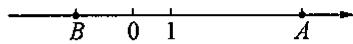  
第1题图

2. 下列各式中，  $x$  可以取一切实数的是 （）

(A)  $\sqrt{x}$ ;

(B)  $(\sqrt{-x})^2$

(C)  $\sqrt{x^2}$ ;

(D)  $\frac{-x}{|x|}$ .

3. 下列说法错误的是 （）

(A)  $\sqrt{a^2 + 6a + 9}$  是最简二次根式；

(B)  $\sqrt{4}$  是二次根式；

(C)  $\sqrt{a^2 + b^2}$  是一个非负数；

(D)  $\sqrt{x^2 + 16}$  的最小值是4.

4. 下列各式计算结果正确的是 （）

(A)  $4\sqrt{5} \cdot 2\sqrt{5} = 8\sqrt{5}$ ;

(B)  $4\sqrt{3} \cdot 4\sqrt{2} = 4\sqrt{6}$ ;

(C)  $3\sqrt{2} \cdot 2\sqrt{3} = 6\sqrt{6}$ ;

(D)  $2\sqrt{3} \cdot \frac{\sqrt{2}}{3} = 2\sqrt{2}$ .

5. 方程  $ax^2 + b = 0$  有实数根的条件是 （）

(A)  $a > 0, b > 0$ ;

(B)  $a <   0,b <   0$

(C)  $ab < 0$ ;

(D)  $ab > 0$ .

6. 一元二次方程  $2x^{2} - 3x + 1 = 0$  化为  $(x + a)^{2} = b$  的形式，正确的是 （）

(A)  $\left(x - \frac{3}{2}\right)^2 = 16$ ;

(B)  $2\left(x - \frac{3}{4}\right)^{2} = \frac{1}{16};$

(C)  $\left(x - \frac{3}{4}\right)^2 = \frac{1}{16}$ ;

(D)以上都不对.

# 二、填空题

7. 若  $m > 0, \sqrt{(-m)^2} = \_$ ；若  $m < 0, \sqrt{(-m)^2} = \_$ .  
8. 如果  $\sqrt{(x + 2)^2} = -x - 2$ ，那么  $x$  的取值范围为  
9. 计算:  $\sqrt{18} - \sqrt{0.5} = \_$  ;  $\sqrt{0.48} - 3\sqrt{\frac{1}{3}} = \_$ .  
10. 如果有理数  $a, b$  满足  $\sqrt{18} + \sqrt{\frac{9}{16}} + \sqrt{\frac{1}{8}} = a + b\sqrt{2}$ , 那么  $a + b =$  ________.  
11. 化简:  $\sqrt{(\sqrt{10} - 4)^2} = \_$  ;  $\sqrt{(5\sqrt{2} - 4\sqrt{3})^2} = \_$ .  
12. 计算:  $\sqrt{\frac{1}{8}} + \sqrt{18} = \_\_\_\_\_\_\_\_\_; \sqrt{0.48} - \sqrt{1.08} = \_\_\_\_\_\_\_\_\_.$  
13. 计算： $\sqrt{45} \times \sqrt{35} = \_$ ； $(\sqrt{2} + \sqrt{6})^2 = \_$ .

14. 分母有理化:  $\frac{\sqrt{5}}{\sqrt{15}} = \_\_\_\_\_\_\_\_\_; \frac{x^2 \sqrt{y}}{\sqrt{8x^3}} = \_\_\_\_\_\_\_\_\_.$  
15. 配方:  $x^{2} - \frac{3}{2} x + \_ = (x - \_)^{2}$ .  
16. 方程  $x(x - 1) = 2(x - 1)$  的根是  
17. 如果方程  $3x^{2} - 19x + m = 0$  有一个根为-1, 那么  $m =$  
18. 已知方程  $a(x + m)^2 = n$  的两根为  $x_1 = 1, x_2 = -3$ , 则方程  $a(x + m - 2)^2 = n$  的两根为

# 三、解答题

19. 解方程:  $\sqrt{50} - x = \sqrt{0.08} + \frac{24}{5}\sqrt{\frac{1}{18}}$ .

20. 计算：

(1)  $\frac{\sqrt{2}}{2}\left[2\sqrt{12} + 4\sqrt{\frac{1}{8}} - 2\sqrt{27}\right]$ ;

(2)  $\sqrt{27} - (\sqrt{3} + 1)^2 + 4\sqrt{\frac{3}{4}} \div \sqrt{1\frac{7}{9}}.$

21. 解不等式:  $\frac{2x - \sqrt{2}}{\sqrt{3}} - \sqrt{3} > \sqrt{6}x - \sqrt{\frac{2}{3}}$ .

22. 解方程组：  $\left\{ \begin{array}{l} \frac{\sqrt{2}}{2} x + \frac{\sqrt{3}}{2} y = \frac{5}{2}, \\ 5\sqrt{2} x - 2\sqrt{3} y = 4. \end{array} \right.$

# 八年级数学第一学期（上）

23. 已知  $x^{2} - 5x + 1 = 0$ ，求  $\sqrt{x^2 + \frac{1}{x^2} - 2}$  的值

24. 定义新运算“※”:  $m \times n = mn - n$ . 如果  $2x \times (x + 2) = 0$ , 求  $x$  的值.

25. 定义: 任意两个数  $a, b$ , 规定新数:  $c = ab + a + b$  为数  $a, b$  的“如意数”.

(1)已知  $a = \sqrt{2}, b = 1$  ，求出  $a, b$  的“如意数”c；  
(2)已知  $a = \frac{1}{2 - \sqrt{3}}$  且  $a, b$  的“如意数”  $c = 5 + 4\sqrt{3}$ ，求  $b$  的值.

八年级数学第一学期（上） 27.50元

八年级数学第一学期（下） 27.50元

八年级语文第一学期（上） 27.50元

八年级语文第一学期（下） 27.50元

八年级英语第一学期 55.00元

八年级物理第一学期 55.00元